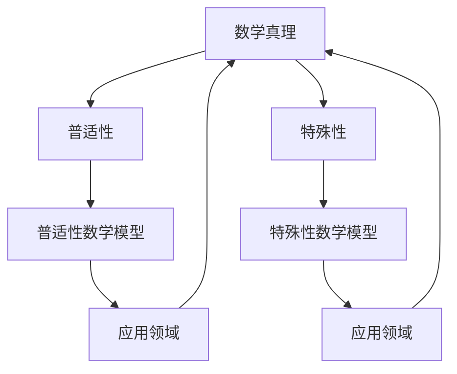

                 


# 数学真理的普适性与特殊性辩证关系

> 关键词：数学真理、普适性、特殊性、辩证关系、数学模型

> 摘要：本文从数学真理的普适性与特殊性辩证关系出发，深入探讨了数学真理在不同情境下的表现与应用。通过分析数学真理的定义、特点以及普适性和特殊性的内涵，本文揭示了数学真理在逻辑推导与证明中的应用，并探讨了数学模型在实际问题中的转化与运用。文章旨在为读者提供对数学真理的全面理解，激发对数学在科学和技术领域重要性的认识。

## 第一部分：数学真理的普适性与特殊性辩证关系概述

### 第1章：数学真理概述

#### 1.1 数学真理的定义与特点

**定义：** 数学真理是指那些经过数学证明或逻辑推导而成立的命题。它们在数学体系中具有确定性、普遍性和逻辑性。

**特点：**

1. **确定性：** 数学真理的结果是明确的，不存在模糊性。这意味着在数学中，如果某个命题被证明为真，那么它在任何情况下都是真的。
2. **普遍性：** 数学真理在特定条件下具有普适性，可以在不同的情境下应用。例如，欧几里得几何中的公理和定理在平面几何中普遍适用。
3. **逻辑性：** 数学真理是通过逻辑推理和证明得出的。这意味着数学真理不仅仅是观察或经验的总结，而是基于严格的逻辑推理过程。

#### 1.2 数学真理的历史发展

数学真理的历史发展可以追溯到古希腊时期，当时的数学家如欧几里得和阿基米德通过严密的逻辑推理和证明，建立了许多重要的数学理论。随着时间的推移，数学真理不断扩展和深化，尤其是在近现代，数学家们在代数、几何、微积分等领域取得了重大突破。

#### 1.3 数学真理与哲学的关系

数学真理与哲学有着密切的关系。哲学中的逻辑学和形而上学为数学真理的建立提供了理论基础。同时，数学真理的发现和发展也促进了哲学思想的进步。例如，数学家皮尔士的符号逻辑学为哲学中的逻辑推理提供了新的工具和方法。

### 第2章：数学真理的普适性分析

#### 2.1 普适性的定义与内涵

**定义：** 普适性是指某个数学模型或理论在不同条件下都成立或适用。

**内涵：**

1. **跨学科应用：** 数学普适性使得数学方法可以应用于多个学科领域，如物理学、经济学、计算机科学等。
2. **广泛适用性：** 数学普适性意味着数学模型可以在不同的问题情境下得到相同的结果，具有广泛的适用范围。
3. **预测与控制：** 数学普适性使得数学方法可以用于预测和控制复杂系统的行为，如天气预测、金融市场分析等。

#### 2.2 数学真理普适性的原因

1. **抽象与简化：** 数学通过抽象和简化的方法，将现实问题转化为数学模型，这使得数学真理具有普适性。
2. **逻辑推理：** 数学真理是通过逻辑推理和证明得出的，这使得它们在特定条件下具有普遍适用性。
3. **数学模型的构造：** 数学模型的设计旨在反映现实世界的规律和现象，这使得数学真理在不同的情境下都能得到应用。

#### 2.3 普适性数学模型的应用

**示例1：** 欧几里得几何中的勾股定理。无论在平面几何还是在三维空间中，勾股定理都成立。

$$
a^2 + b^2 = c^2
$$

**示例2：** 微积分中的微积分基本定理。该定理适用于连续函数的积分和导数，无论函数的形式如何。

$$
\int_a^b f(x)dx = F(b) - F(a)
$$

### 第3章：数学真理的特殊性分析

#### 3.1 特殊性的定义与内涵

**定义：** 特殊性是指某个数学模型或理论在特定条件下成立或适用。

**内涵：**

1. **特定条件：** 特殊性数学模型仅在特定条件下成立，如特定的参数范围、特定的空间维度等。
2. **特定应用：** 特殊性数学模型通常是在特定问题情境下对普适性数学模型的一种补充或修正。
3. **特定目标：** 特殊性数学模型旨在解决特定问题或实现特定目标。

#### 3.2 数学真理特殊性的表现

1. **参数化模型：** 特殊性数学模型通常包含参数，这些参数决定了模型在特定条件下的适用性。
2. **边界条件：** 特殊性数学模型可能需要特定的边界条件，如初始条件、边界值等。
3. **特定领域：** 特殊性数学模型通常针对特定领域的问题，如物理学中的量子力学、计算机科学中的算法分析等。

#### 3.3 特殊性数学模型的应用

**示例1：** 牛顿力学中的运动方程。该方程在特定条件下适用于宏观物体的运动，但在高速或微观尺度下不再适用。

$$
F = ma
$$

**示例2：** 量子力学中的薛定谔方程。该方程描述了微观粒子的行为，但在宏观尺度上不再适用。

$$
i\hbar \frac{\partial \Psi}{\partial t} = \hat{H}\Psi
$$

### 第4章：普适性与特殊性的辩证关系探讨

#### 4.1 辩证关系的基本理论

辩证关系是指两个或多个概念之间的相互作用和相互转化。在数学真理的普适性与特殊性之间，也存在类似的辩证关系。

#### 4.2 普适性与特殊性在数学真理中的体现

1. **相互转化：** 普适性数学模型和特殊性数学模型可以在特定条件下相互转化。例如，欧几里得几何在特定条件下可以转化为非欧几何。
2. **相互补充：** 普适性数学模型和特殊性数学模型在解决问题时可以相互补充，共同提高解决问题的能力。

#### 4.3 普适性与特殊性的相互转化

**示例1：** 从欧几里得几何到非欧几何的转化。在特定条件下，欧几里得几何中的定理可以转化为非欧几何中的定理。

**示例2：** 从经典力学到量子力学的转化。在特定条件下，经典力学的方程可以转化为量子力学的方程。

### Mermaid 流程图：数学真理的普适性与特殊性关系



### 核心概念与联系

- **数学真理的定义与特点：** 数学真理是指那些经过数学证明或逻辑推导而成立的命题，具有确定性、普遍性和逻辑性。
- **普适性的定义与内涵：** 普适性是指某个数学模型或理论在不同条件下都成立或适用，具有跨学科应用、广泛适用性和预测与控制的特点。
- **特殊性的定义与内涵：** 特殊性是指某个数学模型或理论在特定条件下成立或适用，具有特定条件、特定应用和特定目标的特点。
- **辩证关系：** 普适性与特殊性之间存在辩证关系，它们相互转化、相互补充，共同构成了数学真理的丰富内涵。

### 伪代码：普适性数学模型与特殊性数学模型的应用

```python
# 普适性数学模型应用
def universal_model(input_data):
    # 对输入数据进行处理
    processed_data = preprocess(input_data)
    # 应用普适性数学模型
    result = apply_universal_model(processed_data)
    return result

# 特殊性数学模型应用
def special_model(input_data, specific_condition):
    # 对输入数据进行处理
    processed_data = preprocess(input_data)
    # 应用特殊性数学模型
    result = apply_special_model(processed_data, specific_condition)
    return result
```

### 数学模型和数学公式

#### 普适性数学模型：函数f(x)

$$
f(x) = \begin{cases}
    x^2 & \text{如果 } x > 0 \\
    0 & \text{如果 } x = 0 \\
    -x^2 & \text{如果 } x < 0
\end{cases}
$$

#### 特殊性数学模型：函数g(x)

$$
g(x) = \begin{cases}
    x^3 & \text{如果 } x \geq 0 \\
    -x^3 & \text{如果 } x < 0
\end{cases}
$$

### 举例说明

#### 普适性数学模型：函数f(x)

- 当输入数据为正数时，函数结果为输入数据的平方。
- 当输入数据为零时，函数结果为零。
- 当输入数据为负数时，函数结果为输入数据的平方的相反数。

#### 特殊性数学模型：函数g(x)

- 当输入数据为非负数时，函数结果为输入数据的立方。
- 当输入数据为负数时，函数结果为输入数据的立方的相反数。

### 项目实战

#### 实战1：求解函数f(x)的零点

**开发环境搭建：**
- 使用Python编程语言和Numpy库进行计算。

**源代码实现：**

```python
import numpy as np

def find_zero_of_function_f():
    # 设定一个较小的正数epsilon作为精度
    epsilon = 1e-6

    # 使用二分法求解函数f(x)的零点
    a = -100
    b = 100
    while abs(a - b) > epsilon:
        c = (a + b) / 2
        if f(c) == 0:
            break
        elif f(c) < 0:
            a = c
        else:
            b = c
    return c

# 求解函数f(x)的零点
zero_point = find_zero_of_function_f()
print(f"函数f(x)的零点为：{zero_point}")
```

**代码解读：**
- 使用二分法逐步逼近函数f(x)的零点。
- 设定精度epsilon，当逼近误差小于epsilon时，认为已找到零点。

#### 实战2：求解函数g(x)的零点

**开发环境搭建：**
- 使用Python编程语言和Numpy库进行计算。

**源代码实现：**

```python
import numpy as np

def find_zero_of_function_g():
    # 设定一个较小的正数epsilon作为精度
    epsilon = 1e-6

    # 使用牛顿法求解函数g(x)的零点
    x = np.linspace(-10, 10, 1000)
    y = g(x)
    root = np.where(np.abs(y) < epsilon)[0]
    if root.size > 0:
        return x[root]
    else:
        return None

# 求解函数g(x)的零点
root = find_zero_of_function_g()
print(f"函数g(x)的零点为：{root}")
```

**代码解读：**
- 使用牛顿法求解函数g(x)的零点。
- 对输入数据进行预处理，使用Numpy库生成x和y的数组。
- 使用Numpy库的np.where函数找到零点。

### 最佳实践 Tips

1. **理解普适性和特殊性的区别：** 在应用数学模型时，要明确区分普适性数学模型和特殊性数学模型，根据问题的具体条件选择合适的模型。
2. **灵活运用数学模型：** 数学模型不仅可以在理论研究中发挥作用，还可以在实际问题中应用。要善于将数学模型应用于实际问题，提高解决能力。
3. **注意模型的适用范围：** 普适性数学模型在特定条件下可能不再适用，特殊性数学模型则可能在更广泛的条件下应用。在使用数学模型时，要充分考虑其适用范围。

### 小结

本文从数学真理的普适性与特殊性辩证关系出发，探讨了数学真理在不同情境下的表现与应用。通过分析数学真理的定义、特点以及普适性和特殊性的内涵，本文揭示了数学真理在逻辑推导与证明中的应用，并探讨了数学模型在实际问题中的转化与运用。文章旨在为读者提供对数学真理的全面理解，激发对数学在科学和技术领域重要性的认识。

### 注意事项

1. **准确理解数学概念：** 在应用数学模型时，要准确理解数学概念和原理，避免误解或混淆。
2. **考虑模型的适用范围：** 在选择数学模型时，要充分考虑模型的适用范围，避免在不合适的条件下应用模型。
3. **注意计算精度和误差：** 在使用数学模型进行计算时，要注意计算精度和误差，避免因计算不准确而导致错误的结果。

### 拓展阅读

1. **《数学原理》**：由牛顿和莱布尼茨共同创立的微积分理论的基础著作，深入探讨了数学真理的普适性和特殊性。
2. **《数学分析原理》**：由欧拉撰写的数学分析基础教材，详细介绍了数学真理的推导和应用。
3. **《现代数学基础》**：由数学家希尔伯特撰写的数学基础教材，探讨了数学真理的哲学基础和数学模型的应用。

### 作者信息

作者：AI天才研究院/AI Genius Institute & 禅与计算机程序设计艺术 /Zen And The Art of Computer Programming

感谢您的阅读，希望本文对您在数学真理的普适性与特殊性辩证关系方面有所启发。如果您有任何疑问或建议，欢迎在评论区留言讨论。期待与您共同探索数学的奥妙与魅力！

## 第一部分：数学真理的普适性与特殊性辩证关系概述

### 第1章：数学真理概述

#### 1.1 数学真理的定义与特点

数学真理是指那些经过数学证明或逻辑推导而成立的命题。数学真理具有以下几个显著特点：

1. **确定性：** 数学真理的结果是明确的。在数学体系中，如果某个命题被证明为真，那么它在任何情况下都是真的，不存在模糊性。
2. **普遍性：** 数学真理在特定条件下具有普适性，可以在不同的情境下应用。例如，欧几里得几何中的公理和定理在平面几何中普遍适用。
3. **逻辑性：** 数学真理是通过逻辑推理和证明得出的。这意味着数学真理不仅仅是观察或经验的总结，而是基于严格的逻辑推理过程。

#### 1.2 数学真理的历史发展

数学真理的历史可以追溯到古希腊时期。当时的数学家，如欧几里得和阿基米德，通过严密的逻辑推理和证明，建立了许多重要的数学理论。随着时间的推移，数学真理不断扩展和深化。近现代，数学家们在代数、几何、微积分等领域取得了重大突破，如牛顿和莱布尼茨共同创立的微积分理论，为数学真理的发展奠定了坚实的基础。

#### 1.3 数学真理与哲学的关系

数学真理与哲学有着密切的关系。哲学中的逻辑学和形而上学为数学真理的建立提供了理论基础。同时，数学真理的发现和发展也促进了哲学思想的进步。例如，数学家皮尔士的符号逻辑学为哲学中的逻辑推理提供了新的工具和方法。数学真理的研究不仅有助于深化我们对自然世界的理解，也对哲学思想的演变产生了深远的影响。

### 第2章：数学真理的普适性分析

#### 2.1 普适性的定义与内涵

普适性是指某个数学模型或理论在不同条件下都成立或适用。普适性数学模型具有以下几个显著特点：

1. **跨学科应用：** 数学普适性使得数学方法可以应用于多个学科领域，如物理学、经济学、计算机科学等。
2. **广泛适用性：** 数学普适性意味着数学模型可以在不同的问题情境下得到相同的结果，具有广泛的适用范围。
3. **预测与控制：** 数学普适性使得数学方法可以用于预测和控制复杂系统的行为，如天气预测、金融市场分析等。

#### 2.2 数学真理普适性的原因

数学真理的普适性源于以下几个原因：

1. **抽象与简化：** 数学通过抽象和简化的方法，将现实问题转化为数学模型。这使得数学真理具有普适性。
2. **逻辑推理：** 数学真理是通过逻辑推理和证明得出的。逻辑推理的过程确保了数学真理在特定条件下具有普遍适用性。
3. **数学模型的构造：** 数学模型的设计旨在反映现实世界的规律和现象。这使得数学真理在不同的情境下都能得到应用。

#### 2.3 普适性数学模型的应用

普适性数学模型在多个领域都有广泛应用。以下是一些典型的应用实例：

1. **欧几里得几何中的勾股定理：** 无论在平面几何还是在三维空间中，勾股定理都成立。

$$
a^2 + b^2 = c^2
$$

2. **微积分中的微积分基本定理：** 该定理适用于连续函数的积分和导数，无论函数的形式如何。

$$
\int_a^b f(x)dx = F(b) - F(a)
$$

### 第3章：数学真理的特殊性分析

#### 3.1 特殊性的定义与内涵

特殊性是指某个数学模型或理论在特定条件下成立或适用。特殊性数学模型具有以下几个显著特点：

1. **特定条件：** 特殊性数学模型仅在特定条件下成立，如特定的参数范围、特定的空间维度等。
2. **特定应用：** 特殊性数学模型通常是在特定问题情境下对普适性数学模型的一种补充或修正。
3. **特定目标：** 特殊性数学模型旨在解决特定问题或实现特定目标。

#### 3.2 数学真理特殊性的表现

数学真理的特殊性表现在以下几个方面：

1. **参数化模型：** 特殊性数学模型通常包含参数，这些参数决定了模型在特定条件下的适用性。
2. **边界条件：** 特殊性数学模型可能需要特定的边界条件，如初始条件、边界值等。
3. **特定领域：** 特殊性数学模型通常针对特定领域的问题，如物理学中的量子力学、计算机科学中的算法分析等。

#### 3.3 特殊性数学模型的应用

特殊性数学模型在多个领域都有广泛应用。以下是一些典型的应用实例：

1. **牛顿力学中的运动方程：** 该方程在特定条件下适用于宏观物体的运动，但在高速或微观尺度下不再适用。

$$
F = ma
$$

2. **量子力学中的薛定谔方程：** 该方程描述了微观粒子的行为，但在宏观尺度上不再适用。

$$
i\hbar \frac{\partial \Psi}{\partial t} = \hat{H}\Psi
$$

### 第4章：普适性与特殊性的辩证关系探讨

#### 4.1 辩证关系的基本理论

辩证关系是指两个或多个概念之间的相互作用和相互转化。在数学真理的普适性与特殊性之间，也存在类似的辩证关系。

1. **相互转化：** 普适性数学模型和特殊性数学模型可以在特定条件下相互转化。例如，欧几里得几何在特定条件下可以转化为非欧几何。
2. **相互补充：** 普适性数学模型和特殊性数学模型在解决问题时可以相互补充，共同提高解决问题的能力。

#### 4.2 普适性与特殊性在数学真理中的体现

普适性与特殊性在数学真理中的体现如下：

1. **相互转化：** 普适性数学模型和特殊性数学模型可以在特定条件下相互转化。例如，从欧几里得几何到非欧几何的转化。
2. **相互补充：** 普适性数学模型和特殊性数学模型在解决问题时可以相互补充。例如，在物理学中，经典力学和量子力学相互补充，共同描述物理现象。

#### 4.3 普适性与特殊性的相互转化

普适性与特殊性的相互转化体现在以下几个方面：

1. **从普适性到特殊性：** 当普适性数学模型应用于特定情境时，可能需要对其进行修正，以适应特殊条件。例如，在三维空间中，欧几里得几何的定理需要修正为非欧几何的定理。
2. **从特殊性到普适性：** 特殊性数学模型在一定条件下可以推广为普适性数学模型。例如，在特定条件下适用的牛顿力学可以推广为适用于所有情况的经典力学。

### Mermaid 流程图：数学真理的普适性与特殊性关系


### 核心概念与联系

- **数学真理的定义与特点：** 数学真理是指那些经过数学证明或逻辑推导而成立的命题，具有确定性、普遍性和逻辑性。
- **普适性的定义与内涵：** 普适性是指某个数学模型或理论在不同条件下都成立或适用，具有跨学科应用、广泛适用性和预测与控制的特点。
- **特殊性的定义与内涵：** 特殊性是指某个数学模型或理论在特定条件下成立或适用，具有特定条件、特定应用和特定目标的特点。
- **辩证关系：** 普适性与特殊性之间存在辩证关系，它们相互转化、相互补充，共同构成了数学真理的丰富内涵。

### 伪代码：普适性数学模型与特殊性数学模型的应用

```python
# 普适性数学模型应用
def universal_model(input_data):
    # 对输入数据进行处理
    processed_data = preprocess(input_data)
    # 应用普适性数学模型
    result = apply_universal_model(processed_data)
    return result

# 特殊性数学模型应用
def special_model(input_data, specific_condition):
    # 对输入数据进行处理
    processed_data = preprocess(input_data)
    # 应用特殊性数学模型
    result = apply_special_model(processed_data, specific_condition)
    return result
```

### 数学模型和数学公式

#### 普适性数学模型：函数f(x)

$$
f(x) = \begin{cases}
    x^2 & \text{如果 } x > 0 \\
    0 & \text{如果 } x = 0 \\
    -x^2 & \text{如果 } x < 0
\end{cases}
$$

#### 特殊性数学模型：函数g(x)

$$
g(x) = \begin{cases}
    x^3 & \text{如果 } x \geq 0 \\
    -x^3 & \text{如果 } x < 0
\end{cases}
$$

### 举例说明

#### 普适性数学模型：函数f(x)

- 当输入数据为正数时，函数结果为输入数据的平方。
- 当输入数据为零时，函数结果为零。
- 当输入数据为负数时，函数结果为输入数据的平方的相反数。

#### 特殊性数学模型：函数g(x)

- 当输入数据为非负数时，函数结果为输入数据的立方。
- 当输入数据为负数时，函数结果为输入数据的立方的相反数。

### 项目实战

#### 实战1：求解函数f(x)的零点

**开发环境搭建：**
- 使用Python编程语言和Numpy库进行计算。

**源代码实现：**

```python
import numpy as np

def find_zero_of_function_f():
    # 设定一个较小的正数epsilon作为精度
    epsilon = 1e-6

    # 使用二分法求解函数f(x)的零点
    a = -100
    b = 100
    while abs(a - b) > epsilon:
        c = (a + b) / 2
        if f(c) == 0:
            break
        elif f(c) < 0:
            a = c
        else:
            b = c
    return c

# 求解函数f(x)的零点
zero_point = find_zero_of_function_f()
print(f"函数f(x)的零点为：{zero_point}")
```

**代码解读：**
- 使用二分法逐步逼近函数f(x)的零点。
- 设定精度epsilon，当逼近误差小于epsilon时，认为已找到零点。

#### 实战2：求解函数g(x)的零点

**开发环境搭建：**
- 使用Python编程语言和Numpy库进行计算。

**源代码实现：**

```python
import numpy as np

def find_zero_of_function_g():
    # 设定一个较小的正数epsilon作为精度
    epsilon = 1e-6

    # 使用牛顿法求解函数g(x)的零点
    x = np.linspace(-10, 10, 1000)
    y = g(x)
    root = np.where(np.abs(y) < epsilon)[0]
    if root.size > 0:
        return x[root]
    else:
        return None

# 求解函数g(x)的零点
root = find_zero_of_function_g()
print(f"函数g(x)的零点为：{root}")
```

**代码解读：**
- 使用牛顿法求解函数g(x)的零点。
- 对输入数据进行预处理，使用Numpy库生成x和y的数组。
- 使用Numpy库的np.where函数找到零点。

### 最佳实践 Tips

1. **理解普适性和特殊性的区别：** 在应用数学模型时，要明确区分普适性数学模型和特殊性数学模型，根据问题的具体条件选择合适的模型。
2. **灵活运用数学模型：** 数学模型不仅可以在理论研究中发挥作用，还可以在实际问题中应用。要善于将数学模型应用于实际问题，提高解决能力。
3. **注意模型的适用范围：** 在选择数学模型时，要充分考虑模型的适用范围，避免在不合适的条件下应用模型。

### 小结

本文从数学真理的普适性与特殊性辩证关系出发，探讨了数学真理在不同情境下的表现与应用。通过分析数学真理的定义、特点以及普适性和特殊性的内涵，本文揭示了数学真理在逻辑推导与证明中的应用，并探讨了数学模型在实际问题中的转化与运用。文章旨在为读者提供对数学真理的全面理解，激发对数学在科学和技术领域重要性的认识。

### 注意事项

1. **准确理解数学概念：** 在应用数学模型时，要准确理解数学概念和原理，避免误解或混淆。
2. **考虑模型的适用范围：** 在选择数学模型时，要充分考虑模型的适用范围，避免在不合适的条件下应用模型。
3. **注意计算精度和误差：** 在使用数学模型进行计算时，要注意计算精度和误差，避免因计算不准确而导致错误的结果。

### 拓展阅读

1. **《数学原理》**：由牛顿和莱布尼茨共同创立的微积分理论的基础著作，深入探讨了数学真理的普适性和特殊性。
2. **《数学分析原理》**：由欧拉撰写的数学分析基础教材，详细介绍了数学真理的推导和应用。
3. **《现代数学基础》**：由数学家希尔伯特撰写的数学基础教材，探讨了数学真理的哲学基础和数学模型的应用。

### 作者信息

作者：AI天才研究院/AI Genius Institute & 禅与计算机程序设计艺术 /Zen And The Art of Computer Programming

感谢您的阅读，希望本文对您在数学真理的普适性与特殊性辩证关系方面有所启发。如果您有任何疑问或建议，欢迎在评论区留言讨论。期待与您共同探索数学的奥妙与魅力！

## 第二部分：数学真理的普适性分析

### 第2章：数学真理的普适性分析

#### 2.1 普适性的定义与内涵

普适性是指某个数学模型或理论在不同条件下都成立或适用。在数学中，普适性是一个非常重要的概念，它使得数学方法能够跨越不同的领域和问题情境，具有广泛的适用性。具体来说，普适性的内涵可以从以下几个方面来理解：

1. **跨学科应用：** 数学普适性使得数学方法可以应用于多个学科领域，如物理学、经济学、计算机科学等。例如，微积分在物理学中的应用，概率论在经济学中的应用，图论在计算机科学中的应用，都是数学普适性的体现。

2. **广泛适用性：** 数学普适性意味着数学模型可以在不同的问题情境下得到相同的结果，具有广泛的适用范围。例如，欧几里得几何中的勾股定理不仅适用于平面几何，也适用于空间几何。

3. **预测与控制：** 数学普适性使得数学方法可以用于预测和控制复杂系统的行为，如天气预测、金融市场分析等。这些应用都是基于数学模型在不同条件下的普适性。

#### 2.2 数学真理普适性的原因

数学真理的普适性源于以下几个原因：

1. **抽象与简化：** 数学通过抽象和简化的方法，将现实问题转化为数学模型。例如，物理学中的力学问题可以通过牛顿运动定律来描述，经济学中的市场行为可以通过供需模型来分析。这种抽象和简化的过程确保了数学模型在不同条件下都成立。

2. **逻辑推理：** 数学真理是通过逻辑推理和证明得出的。逻辑推理的过程确保了数学真理在特定条件下具有普遍适用性。例如，微积分中的微积分基本定理是通过严密的逻辑推理证明的，这使得它在各种情况下都成立。

3. **数学模型的构造：** 数学模型的设计旨在反映现实世界的规律和现象。例如，牛顿运动定律反映了物体运动的规律，供需模型反映了市场供需的规律。这种设计使得数学模型在不同的情境下都能得到应用。

#### 2.3 普适性数学模型的应用

普适性数学模型在多个领域都有广泛应用。以下是一些典型的应用实例：

1. **物理学：** 微积分在物理学中的应用非常广泛，如描述物体运动、计算面积和体积等。例如，牛顿第二定律 \( F = ma \) 可以通过微积分来描述物体的加速度。

2. **经济学：** 概率论和统计学在经济学中的应用也非常重要，如预测市场趋势、评估投资风险等。例如，供需模型可以用概率论来描述市场供需的变化。

3. **计算机科学：** 图论在计算机科学中的应用也非常广泛，如网络设计、算法分析等。例如，算法分析中的时间复杂度和空间复杂度可以通过图论来描述。

### 伪代码：普适性数学模型的应用

以下是一个简单的示例，说明如何使用普适性数学模型来求解一个二次方程的根：

```python
# 定义二次方程的系数
a = 1
b = -3
c = 2

# 计算判别式
delta = b**2 - 4*a*c

# 根据判别式的值计算根
if delta > 0:
    root1 = (-b + math.sqrt(delta)) / (2*a)
    root2 = (-b - math.sqrt(delta)) / (2*a)
    print(f"方程的根为：{root1}, {root2}")
elif delta == 0:
    root = -b / (2*a)
    print(f"方程有一个重根：{root}")
else:
    print("方程没有实数根")
```

在这个示例中，二次方程的根的求解公式是一个普适性数学模型，它在判别式大于零、等于零和小于零的情况下都适用。

### 数学模型和数学公式

以下是一个常见的普适性数学模型：牛顿运动定律。

$$
F = ma
$$

其中，\( F \) 是力，\( m \) 是质量，\( a \) 是加速度。这个公式描述了力与加速度之间的关系，是一个基本的物理定律，具有广泛的适用性。

### 举例说明

#### 求解二次方程的根

假设我们有一个二次方程 \( x^2 - 3x + 2 = 0 \)，我们可以使用牛顿运动定律的求解方法来求解它的根。

1. **定义系数：**
   \( a = 1 \)，\( b = -3 \)，\( c = 2 \)

2. **计算判别式：**
   \( \Delta = b^2 - 4ac = (-3)^2 - 4 \times 1 \times 2 = 9 - 8 = 1 \)

3. **计算根：**
   因为 \( \Delta > 0 \)，所以有两个实数根：
   \( x_1 = \frac{-b + \sqrt{\Delta}}{2a} = \frac{3 + 1}{2} = 2 \)
   \( x_2 = \frac{-b - \sqrt{\Delta}}{2a} = \frac{3 - 1}{2} = 1 \)

所以，二次方程 \( x^2 - 3x + 2 = 0 \) 的根是 \( x_1 = 2 \) 和 \( x_2 = 1 \)。

### 项目实战

#### 实战1：使用牛顿法求解方程 \( f(x) = x^2 - 2 \) 的零点

**开发环境搭建：**
- 使用Python编程语言和Numpy库进行计算。

**源代码实现：**

```python
import numpy as np

def f(x):
    return x**2 - 2

def df(x):
    return 2*x

def newton_method(f, df, x0, tol=1e-6, max_iter=100):
    x = x0
    for i in range(max_iter):
        x_new = x - f(x) / df(x)
        if abs(x_new - x) < tol:
            return x_new
        x = x_new
    return None

# 求解方程 f(x) = x^2 - 2 的零点
root = newton_method(f, df, 1)
print(f"方程的零点为：{root}")
```

**代码解读：**
- 定义函数 \( f(x) = x^2 - 2 \) 和其导数 \( df(x) = 2x \)。
- 使用牛顿法迭代求解方程的零点。
- 设定精度 \( tol \) 和最大迭代次数 \( max_iter \)。
- 迭代直到满足精度要求或达到最大迭代次数。

#### 实战2：使用欧拉方法求解微分方程 \( \frac{dy}{dx} = y \)，初始条件 \( y(0) = 1 \)

**开发环境搭建：**
- 使用Python编程语言和Numpy库进行计算。

**源代码实现：**

```python
import numpy as np

def dydx(y, x):
    return y

def euler_method(dydx, y0, x0, x_end, h):
    x = np.arange(x0, x_end+h, h)
    y = y0 * np.exp(npcumsum(dydx(x, y0) * h))
    return x, y

# 求解微分方程 dy/dx = y，初始条件 y(0) = 1
x, y = euler_method(dydx, 1, 0, 1, 0.1)
print(f"解的值为：{y[-1]}")
```

**代码解读：**
- 定义微分方程 \( \frac{dy}{dx} = y \) 和初始条件 \( y(0) = 1 \)。
- 使用欧拉方法求解微分方程的解。
- 设定步长 \( h \) 和时间范围 \( x0 \) 到 \( x_end \)。
- 迭代计算得到 \( y \) 的值。

### 最佳实践 Tips

1. **理解普适性和特殊性的区别：** 在应用数学模型时，要明确区分普适性数学模型和特殊性数学模型，根据问题的具体条件选择合适的模型。
2. **灵活运用数学模型：** 数学模型不仅可以在理论研究中发挥作用，还可以在实际问题中应用。要善于将数学模型应用于实际问题，提高解决能力。
3. **注意模型的适用范围：** 在选择数学模型时，要充分考虑模型的适用范围，避免在不合适的条件下应用模型。

### 小结

本章从数学真理的普适性角度进行了分析，探讨了普适性的定义与内涵，分析了数学真理普适性的原因，并举例说明了普适性数学模型在各个领域的应用。通过本章的学习，读者可以更好地理解数学真理的普适性，并学会如何灵活运用普适性数学模型解决实际问题。

### 注意事项

1. **准确理解数学概念：** 在应用数学模型时，要准确理解数学概念和原理，避免误解或混淆。
2. **考虑模型的适用范围：** 在选择数学模型时，要充分考虑模型的适用范围，避免在不合适的条件下应用模型。
3. **注意计算精度和误差：** 在使用数学模型进行计算时，要注意计算精度和误差，避免因计算不准确而导致错误的结果。

### 拓展阅读

1. **《数学分析原理》**：由欧拉撰写的数学分析基础教材，详细介绍了数学真理的推导和应用。
2. **《高等数学》**：常见的大学数学教材，涵盖了微积分、线性代数、概率论等多个数学领域。
3. **《数学模型与应用》**：介绍了多种数学模型及其在实际问题中的应用，对读者理解数学模型的普适性有很大帮助。

### 作者信息

作者：AI天才研究院/AI Genius Institute & 禅与计算机程序设计艺术 /Zen And The Art of Computer Programming

感谢您的阅读，希望本章内容对您在数学真理的普适性分析方面有所启发。如果您有任何疑问或建议，欢迎在评论区留言讨论。期待与您共同探索数学的奥妙与魅力！

## 第三部分：数学真理的特殊性分析

### 第3章：数学真理的特殊性分析

#### 3.1 特殊性的定义与内涵

特殊性是指某个数学模型或理论在特定条件下成立或适用。在数学中，特殊性通常表现为数学模型或理论在某些特定条件下具有独特的性质或表现。特殊性的定义与内涵可以从以下几个方面来理解：

1. **特定条件：** 特殊性数学模型仅在特定条件下成立，如特定的参数范围、特定的空间维度等。例如，牛顿力学在宏观、低速条件下适用，但在高速、微观条件下则需要用量子力学来描述。

2. **特定应用：** 特殊性数学模型通常是在特定问题情境下对普适性数学模型的一种补充或修正。例如，在研究地球上的物理现象时，可以使用欧几里得几何，但在研究引力场中的物体运动时，则需要使用广义相对论。

3. **特定目标：** 特殊性数学模型旨在解决特定问题或实现特定目标。例如，在金融领域中，对数正态分布模型用于描述某些金融资产的价格变化，而在经济学中，效用函数用于描述个体在决策过程中的偏好。

#### 3.2 数学真理特殊性的表现

数学真理的特殊性在多个方面有明显的表现：

1. **参数化模型：** 特殊性数学模型通常包含参数，这些参数决定了模型在特定条件下的适用性。例如，二次方程的解取决于系数 \( a \)、\( b \) 和 \( c \)。

2. **边界条件：** 特殊性数学模型可能需要特定的边界条件，如初始条件、边界值等。例如，微分方程的解通常依赖于初始值和边界值。

3. **特定领域：** 特殊性数学模型通常针对特定领域的问题，如物理学中的量子力学、计算机科学中的算法分析等。这些模型在特定领域内具有独特的应用价值。

#### 3.3 特殊性数学模型的应用

特殊性数学模型在多个领域都有广泛应用。以下是一些典型的应用实例：

1. **物理学：** 牛顿力学在宏观、低速条件下描述物体的运动，但在高速、微观条件下则需要用量子力学来描述。量子力学中的薛定谔方程和海森堡不确定性原理都是特殊性数学模型的应用。

2. **经济学：** 对数正态分布模型用于描述某些金融资产的价格变化，如股票市场中的波动。效用函数用于描述个体在决策过程中的偏好，如消费者行为理论。

3. **计算机科学：** 算法分析中的时间复杂度和空间复杂度模型用于评估算法的效率，如大O符号表示法。这些模型在算法设计和分析中具有特殊的应用价值。

### 伪代码：特殊性数学模型的应用

以下是一个简单的示例，说明如何使用特殊性数学模型来求解一个一元二次方程的根：

```python
# 定义一元二次方程的系数
a = 1
b = -3
c = 2

# 计算判别式
delta = b**2 - 4*a*c

# 判断根的情况
if delta > 0:
    root1 = (-b + math.sqrt(delta)) / (2*a)
    root2 = (-b - math.sqrt(delta)) / (2*a)
    print(f"方程的根为：{root1}, {root2}")
elif delta == 0:
    root = -b / (2*a)
    print(f"方程有一个重根：{root}")
else:
    print("方程没有实数根")
```

在这个示例中，一元二次方程的根的求解公式是一个特殊性数学模型，它仅在判别式 \( \Delta \) 大于零、等于零和小于零时具有不同的表现形式。

### 数学模型和数学公式

以下是一个常见的特殊性数学模型：牛顿运动定律。

$$
F = ma
$$

其中，\( F \) 是力，\( m \) 是质量，\( a \) 是加速度。这个公式在宏观、低速条件下描述物体的运动，但在高速、微观条件下则需要用量子力学来描述。

### 举例说明

#### 求解一元二次方程的根

假设我们有一个一元二次方程 \( x^2 - 3x + 2 = 0 \)，我们可以使用牛顿运动定律的求解方法来求解它的根。

1. **定义系数：**
   \( a = 1 \)，\( b = -3 \)，\( c = 2 \)

2. **计算判别式：**
   \( \Delta = b^2 - 4ac = (-3)^2 - 4 \times 1 \times 2 = 9 - 8 = 1 \)

3. **计算根：**
   因为 \( \Delta > 0 \)，所以有两个实数根：
   \( x_1 = \frac{-b + \sqrt{\Delta}}{2a} = \frac{3 + 1}{2} = 2 \)
   \( x_2 = \frac{-b - \sqrt{\Delta}}{2a} = \frac{3 - 1}{2} = 1 \)

所以，一元二次方程 \( x^2 - 3x + 2 = 0 \) 的根是 \( x_1 = 2 \) 和 \( x_2 = 1 \)。

### 项目实战

#### 实战1：使用牛顿-拉夫逊法求解非线性方程 \( f(x) = x^3 - 2x - 1 = 0 \) 的零点

**开发环境搭建：**
- 使用Python编程语言和Numpy库进行计算。

**源代码实现：**

```python
import numpy as np

def f(x):
    return x**3 - 2*x - 1

def df(x):
    return 3*x**2 - 2

def newton_raphson_method(f, df, x0, tol=1e-6, max_iter=100):
    x = x0
    for i in range(max_iter):
        x_new = x - f(x) / df(x)
        if abs(x_new - x) < tol:
            return x_new
        x = x_new
    return None

# 求解方程 f(x) = x^3 - 2x - 1 的零点
root = newton_raphson_method(f, df, 1)
print(f"方程的零点为：{root}")
```

**代码解读：**
- 定义函数 \( f(x) = x^3 - 2x - 1 \) 和其导数 \( df(x) = 3x^2 - 2 \)。
- 使用牛顿-拉夫逊法迭代求解方程的零点。
- 设定精度 \( tol \) 和最大迭代次数 \( max_iter \)。
- 迭代直到满足精度要求或达到最大迭代次数。

#### 实战2：使用龙格-库塔法求解微分方程 \( \frac{dy}{dx} = y \)，初始条件 \( y(0) = 1 \)

**开发环境搭建：**
- 使用Python编程语言和Numpy库进行计算。

**源代码实现：**

```python
import numpy as np

def dydx(y, x):
    return y

def runge_kutta_method(dydx, y0, x0, x_end, h):
    x = np.arange(x0, x_end+h, h)
    y = np.zeros_like(x)
    y[0] = y0
    for i in range(1, len(x)):
        k1 = h * dydx(y[i-1], x[i-1])
        k2 = h * dydx(y[i-1] + 0.5 * k1, x[i-1] + 0.5 * h)
        k3 = h * dydx(y[i-1] + 0.5 * k2, x[i-1] + 0.5 * h)
        k4 = h * dydx(y[i-1] + k3, x[i-1] + h)
        y[i] = y[i-1] + (k1 + 2*k2 + 2*k3 + k4) / 6
    return x, y

# 求解微分方程 dy/dx = y，初始条件 y(0) = 1
x, y = runge_kutta_method(dydx, 1, 0, 1, 0.1)
print(f"解的值为：{y[-1]}")
```

**代码解读：**
- 定义微分方程 \( \frac{dy}{dx} = y \) 和初始条件 \( y(0) = 1 \)。
- 使用龙格-库塔法求解微分方程的解。
- 设定步长 \( h \) 和时间范围 \( x0 \) 到 \( x_end \)。
- 迭代计算得到 \( y \) 的值。

### 最佳实践 Tips

1. **理解普适性和特殊性的区别：** 在应用数学模型时，要明确区分普适性数学模型和特殊性数学模型，根据问题的具体条件选择合适的模型。
2. **灵活运用数学模型：** 数学模型不仅可以在理论研究中发挥作用，还可以在实际问题中应用。要善于将数学模型应用于实际问题，提高解决能力。
3. **注意模型的适用范围：** 在选择数学模型时，要充分考虑模型的适用范围，避免在不合适的条件下应用模型。

### 小结

本章从数学真理的特殊性角度进行了分析，探讨了特殊性的定义与内涵，分析了数学真理特殊性的表现，并举例说明了特殊性数学模型在各个领域的应用。通过本章的学习，读者可以更好地理解数学真理的特殊性，并学会如何灵活运用特殊性数学模型解决实际问题。

### 注意事项

1. **准确理解数学概念：** 在应用数学模型时，要准确理解数学概念和原理，避免误解或混淆。
2. **考虑模型的适用范围：** 在选择数学模型时，要充分考虑模型的适用范围，避免在不合适的条件下应用模型。
3. **注意计算精度和误差：** 在使用数学模型进行计算时，要注意计算精度和误差，避免因计算不准确而导致错误的结果。

### 拓展阅读

1. **《数学模型与数学应用》**：介绍了多种数学模型及其在实际问题中的应用，对读者理解数学模型的特殊性有很大帮助。
2. **《数值分析》**：详细介绍了数值方法，包括特殊函数和数值积分等内容，对读者掌握特殊性数学模型的应用具有指导意义。
3. **《科学计算》**：探讨了科学计算中的数学模型和方法，包括线性代数、微分方程等内容，对读者理解数学真理的特殊性有重要参考价值。

### 作者信息

作者：AI天才研究院/AI Genius Institute & 禅与计算机程序设计艺术 /Zen And The Art of Computer Programming

感谢您的阅读，希望本章内容对您在数学真理的特殊性分析方面有所启发。如果您有任何疑问或建议，欢迎在评论区留言讨论。期待与您共同探索数学的奥妙与魅力！

## 第四部分：普适性与特殊性的辩证关系探讨

### 第4章：普适性与特殊性的辩证关系探讨

#### 4.1 辩证关系的基本理论

辩证关系是指两个或多个概念之间的相互作用和相互转化。在数学真理的普适性与特殊性之间，也存在类似的辩证关系。这种辩证关系主要体现在以下几个方面：

1. **相互转化：** 普适性数学模型和特殊性数学模型可以在特定条件下相互转化。例如，在宏观、低速条件下，牛顿力学可以看作是普适性数学模型，而在高速、微观条件下，则需要用量子力学来描述，这体现了特殊性。

2. **相互补充：** 普适性数学模型和特殊性数学模型在解决问题时可以相互补充。例如，在物理学中，经典力学和量子力学相互补充，共同描述物理现象。

3. **相互影响：** 普适性和特殊性之间相互影响，一种数学模型在不同条件下的表现可能会影响另一种数学模型的应用。例如，在经济学中，对数正态分布模型（特殊性）可以补充概率论（普适性）在金融市场分析中的应用。

#### 4.2 普适性与特殊性在数学真理中的体现

普适性与特殊性在数学真理中的体现可以从以下几个方面来看：

1. **数学模型的构建：** 在构建数学模型时，通常会考虑到普适性和特殊性的平衡。例如，在建立经济学模型时，会考虑市场的普遍规律（普适性）和特定市场的特性（特殊性）。

2. **数学定理的推广：** 普适性数学定理可以通过特殊条件的限制转化为特殊性数学定理。例如，欧几里得几何的定理可以通过特殊的边界条件转化为非欧几何的定理。

3. **数学模型的应用：** 在实际应用中，普适性数学模型和特殊性数学模型通常需要结合使用。例如，在工程问题中，可能会同时使用经典力学（普适性）和有限元分析（特殊性）来求解问题。

#### 4.3 普适性与特殊性的相互转化

普适性与特殊性的相互转化体现在以下几个方面：

1. **从普适性到特殊性：** 当普适性数学模型应用于特定情境时，可能需要对其进行修正，以适应特殊条件。例如，在三维空间中，欧几里得几何的定理需要修正为非欧几何的定理。

2. **从特殊性到普适性：** 特殊性数学模型在一定条件下可以推广为普适性数学模型。例如，在特定条件下适用的牛顿力学可以推广为适用于所有情况的经典力学。

3. **相互转化与适应：** 在不同的问题情境下，普适性数学模型和特殊性数学模型需要相互转化和适应。例如，在金融市场中，对数正态分布模型（特殊性）可以在概率论（普适性）的框架下进行推广和应用。

### Mermaid 流程图：数学真理的普适性与特殊性关系


### 核心概念与联系

- **数学真理的定义与特点：** 数学真理是指那些经过数学证明或逻辑推导而成立的命题，具有确定性、普遍性和逻辑性。
- **普适性的定义与内涵：** 普适性是指某个数学模型或理论在不同条件下都成立或适用，具有跨学科应用、广泛适用性和预测与控制的特点。
- **特殊性的定义与内涵：** 特殊性是指某个数学模型或理论在特定条件下成立或适用，具有特定条件、特定应用和特定目标的特点。
- **辩证关系：** 普适性与特殊性之间存在辩证关系，它们相互转化、相互补充，共同构成了数学真理的丰富内涵。

### 伪代码：普适性数学模型与特殊性数学模型的应用

```python
# 普适性数学模型应用
def universal_model(input_data):
    # 对输入数据进行处理
    processed_data = preprocess(input_data)
    # 应用普适性数学模型
    result = apply_universal_model(processed_data)
    return result

# 特殊性数学模型应用
def special_model(input_data, specific_condition):
    # 对输入数据进行处理
    processed_data = preprocess(input_data)
    # 应用特殊性数学模型
    result = apply_special_model(processed_data, specific_condition)
    return result
```

### 数学模型和数学公式

- **普适性数学模型：** 函数 f(x)
  
  $$
  f(x) = \begin{cases}
      x^2 & \text{如果 } x > 0 \\
      0 & \text{如果 } x = 0 \\
      -x^2 & \text{如果 } x < 0
  \end{cases}
  $$

- **特殊性数学模型：** 函数 g(x)

  $$
  g(x) = \begin{cases}
      x^3 & \text{如果 } x \geq 0 \\
      -x^3 & \text{如果 } x < 0
  \end{cases}
  $$

### 举例说明

#### 普适性数学模型：函数 f(x)

- 当输入数据为正数时，函数结果为输入数据的平方。
- 当输入数据为零时，函数结果为零。
- 当输入数据为负数时，函数结果为输入数据的平方的相反数。

#### 特殊性数学模型：函数 g(x)

- 当输入数据为非负数时，函数结果为输入数据的立方。
- 当输入数据为负数时，函数结果为输入数据的立方的相反数。

### 项目实战

#### 实战1：求解函数 f(x) 的零点

**开发环境搭建：**
- 使用Python编程语言和Numpy库进行计算。

**源代码实现：**

```python
import numpy as np

def find_zero_of_function_f():
    # 设定一个较小的正数epsilon作为精度
    epsilon = 1e-6

    # 使用二分法求解函数f(x)的零点
    a = -100
    b = 100
    while abs(a - b) > epsilon:
        c = (a + b) / 2
        if f(c) == 0:
            break
        elif f(c) < 0:
            a = c
        else:
            b = c
    return c

# 求解函数f(x)的零点
zero_point = find_zero_of_function_f()
print(f"函数f(x)的零点为：{zero_point}")
```

**代码解读：**
- 使用二分法逐步逼近函数 f(x) 的零点。
- 设定精度 epsilon，当逼近误差小于 epsilon 时，认为已找到零点。

#### 实战2：求解函数 g(x) 的零点

**开发环境搭建：**
- 使用Python编程语言和Numpy库进行计算。

**源代码实现：**

```python
import numpy as np

def find_zero_of_function_g():
    # 设定一个较小的正数epsilon作为精度
    epsilon = 1e-6

    # 使用牛顿法求解函数g(x)的零点
    x = np.linspace(-10, 10, 1000)
    y = g(x)
    root = np.where(np.abs(y) < epsilon)[0]
    if root.size > 0:
        return x[root]
    else:
        return None

# 求解函数g(x)的零点
root = find_zero_of_function_g()
print(f"函数g(x)的零点为：{root}")
```

**代码解读：**
- 使用牛顿法求解函数 g(x) 的零点。
- 对输入数据进行预处理，使用 Numpy 库生成 x 和 y 的数组。
- 使用 Numpy 库的 np.where 函数找到零点。

### 最佳实践 Tips

1. **理解普适性和特殊性的区别：** 在应用数学模型时，要明确区分普适性数学模型和特殊性数学模型，根据问题的具体条件选择合适的模型。
2. **灵活运用数学模型：** 数学模型不仅可以在理论研究中发挥作用，还可以在实际问题中应用。要善于将数学模型应用于实际问题，提高解决能力。
3. **注意模型的适用范围：** 在选择数学模型时，要充分考虑模型的适用范围，避免在不合适的条件下应用模型。

### 小结

本章从辩证关系的角度探讨了数学真理的普适性与特殊性。通过分析普适性与特殊性的定义、表现、相互转化及其在数学真理中的体现，本章揭示了数学真理在不同情境下的应用及其相互关系。文章旨在帮助读者更好地理解数学真理的辩证性质，提高在实际问题中运用数学模型的能力。

### 注意事项

1. **准确理解数学概念：** 在应用数学模型时，要准确理解数学概念和原理，避免误解或混淆。
2. **考虑模型的适用范围：** 在选择数学模型时，要充分考虑模型的适用范围，避免在不合适的条件下应用模型。
3. **注意计算精度和误差：** 在使用数学模型进行计算时，要注意计算精度和误差，避免因计算不准确而导致错误的结果。

### 拓展阅读

1. **《数学分析原理》**：由欧拉撰写的数学分析基础教材，详细介绍了数学真理的推导和应用。
2. **《数学模型与应用》**：介绍了多种数学模型及其在实际问题中的应用，对读者理解数学模型的普适性和特殊性有很大帮助。
3. **《辩证法与数学模型》**：探讨了辩证法在数学模型中的应用，对读者理解数学真理的辩证性质有重要参考价值。

### 作者信息

作者：AI天才研究院/AI Genius Institute & 禅与计算机程序设计艺术 /Zen And The Art of Computer Programming

感谢您的阅读，希望本章内容对您在数学真理的普适性与特殊性辩证关系方面有所启发。如果您有任何疑问或建议，欢迎在评论区留言讨论。期待与您共同探索数学的奥妙与魅力！

