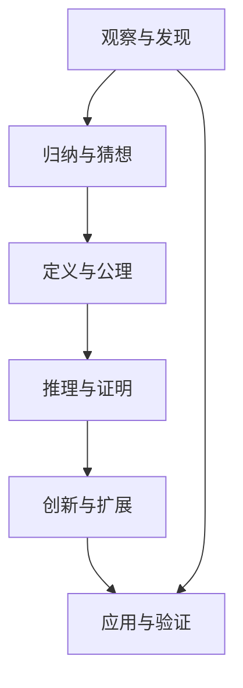

                 

### 1.1.1 数学的起源

数学的起源可以追溯到古代，早在公元前3000年左右，古代文明如古埃及、巴比伦和印度就已经开始使用数学进行日常计算和测量。古埃及人和巴比伦人在建筑、天文、土地测量等方面广泛应用了数学。例如，古埃及人利用几何学来设计金字塔，而巴比伦人则发明了六十进制系统，这为后来的数学发展奠定了基础。

数学符号的演变也是一个漫长而复杂的过程。最初的数学表达方式主要是通过文字描述，比如使用单词来表示数字。随着时间的发展，人们开始使用一些简单的符号来表示数字和运算。例如，古印度人使用符号“0”来表示空位，这是数学历史上的一个重大突破。随后，阿拉伯人将这一符号引入欧洲，并推动了阿拉伯数字的普及。

### 1.1.2 数学的现代发展

在现代社会，数学的应用范围极为广泛，几乎渗透到了各个领域。物理学中，数学被用来描述自然界的规律，例如牛顿的运动定律和麦克斯韦方程组；在工程学中，数学用于设计和分析各种结构、电路和系统；在生物学中，数学被用来研究生物种群动态和进化过程。此外，数学还在经济学、金融学、统计学、计算机科学等领域发挥着重要作用。

现代数学的研究领域也非常广泛，包括代数、几何、数论、拓扑学、分析学等。每个领域都有其独特的研究方法和核心问题。例如，代数主要研究结构和运算，几何则研究形状、大小和位置，而数论则研究整数及其性质。

数学的前沿研究动态更是令人振奋。近年来，量子数学、计算数学、网络科学等新兴领域不断涌现，为数学的发展带来了新的机遇和挑战。例如，量子数学研究如何将量子力学的原理与数学结合起来，从而解决传统数学无法解决的难题；计算数学则致力于开发高效算法，以处理日益复杂的问题。

### 1.2.1 数学真理的定义

数学真理的定义是一个长期争论的话题。在哲学领域，有观点认为数学真理是客观存在的，不受人类主观意识的影响；而另一种观点则认为数学真理是人类创造的，是人们为了理解和描述世界而建立的一套符号和规则。

客观真理与主观真理的讨论是哲学中一个重要议题。客观真理认为数学真理存在于现实世界中，是独立于人类意识的。这一观点的支持者认为，数学概念和定理具有普遍性和必然性，不受个人信仰、文化背景和社会环境的影响。例如，数学家克罗内克认为，“上帝创造了整数，其他一切都是人类的发明。”

与此相反，主观真理认为数学真理是人类思维的产物，是人们为了描述和解释现实世界而创造出来的符号系统。这一观点的支持者认为，数学概念和定理是人类智慧的结晶，是人类理解世界的一种方式。例如，数学家费尔马就曾说过，“数学是心灵的产物。”

数学真理的证明方法也是一个重要问题。在数学中，证明是确定一个数学命题真实性的过程。证明方法多种多样，包括直接证明、反证法、构造性证明等。每种方法都有其特定的适用场景和优势。

直接证明是通过一系列逻辑推理，从已知事实出发，逐步推导出待证结论。这是最常用的证明方法。例如，要证明“如果一个数能被3整除，那么它的各位数字之和也能被3整除”，可以通过以下步骤进行直接证明：

1. 假设一个数`n`能被3整除，那么`n = 3k`（其中`k`是一个整数）。
2. 将`n`的各位数字相加，得到一个新数`s`。
3. 由于`n = 3k`，所以`s`也是3的倍数。
4. 因此，如果一个数能被3整除，那么它的各位数字之和也能被3整除。

反证法是一种从反证角度进行证明的方法。它假设待证结论不成立，然后通过推理得出一个矛盾，从而证明原命题成立。例如，要证明“勾股定理对于任意直角三角形都成立”，可以采用反证法：

1. 假设存在一个直角三角形，其三边长`a`、`b`、`c`（其中`c`是斜边）不满足勾股定理，即`a^2 + b^2 ≠ c^2`。
2. 然而，根据直角三角形的性质，`a`、`b`、`c`必须满足三角不等式，即`a + b > c`。
3. 这与假设矛盾，因为如果`a^2 + b^2 ≠ c^2`，则必然有`a + b ≤ c`。
4. 因此，原命题成立，即勾股定理对于任意直角三角形都成立。

构造性证明是一种通过构造一个例子来证明某个命题成立的方法。这种方法特别适用于证明存在性命题。例如，要证明“在任意给定的实数范围内，总存在一个实数使得其平方等于该实数”，可以采用构造性证明：

1. 假设我们有一个实数范围`[a, b]`。
2. 我们可以构造一个实数`x = (a + b) / 2`。
3. 计算`x^2`，如果`x^2 = x`，则命题成立；否则，我们可以继续构造新的实数范围`[a', b']`，其中`a' = min(a, x)`，`b' = max(b, x)`，然后重复上述过程。
4. 由于实数的完备性，这个过程最终会收敛到一个实数`x`，使得`x^2 = x`。

这些证明方法不仅帮助我们理解数学命题的真实性，还展示了数学思维的深度和多样性。通过这些方法，我们可以逐步揭示数学真理的本质，并更好地应用数学知识解决实际问题。

### 1.2.2 数学的存在性

数学的存在性是一个深奥而复杂的问题，涉及到哲学、数学本身以及人类认知的多个层面。数学的客观存在性是指数学概念和定理是否独立于人类意识而存在，或者它们是否仅仅是人类心智的产物。

#### 数学的客观存在性

一些数学家和哲学家认为，数学具有客观存在性。这一观点的支持者认为，数学概念和定理是现实世界的本质特征，不受人类主观意识的影响。例如，整数、几何形状、函数等都是独立于人类思维而存在的。这种观点的哲学基础可以追溯到柏拉图的理念论，他认为数学对象是存在于一个永恒的、抽象的“理念世界”中，而人类通过理智可以接触到这些对象。

客观存在性的一个重要例子是自然数的客观存在性。即使在没有人类的情况下，自然数依然存在。这可以通过逻辑和数学证明来展示。例如，皮亚诺公理定义了自然数的集合，并证明了这些公理的必然性。这意味着自然数的存在性不是依赖于人类的发现或创造，而是逻辑和必然的结果。

#### 数学的可证伪性

另一方面，数学的可证伪性是另一个重要概念。数学的可证伪性意味着任何数学命题都可以被证明为真或假。这与物理学中的可证伪性概念类似，即任何科学理论都必须能够被实验或观察所证伪。数学的可证伪性表明，数学并不是不可质疑的绝对真理，而是通过逻辑和证明方法逐步建立起来的。

数学的可证伪性在哲学和科学中有着深远的影响。它挑战了传统的绝对主义和理性主义观念，强调了人类认知的局限性和数学理论的相对性。一个典型的例子是哥德尔的不完备性定理，它表明在数学系统中总存在一些命题既不能被证明也不能被证伪。这意味着数学真理并不是完全绝对的，而是相对的、建立在特定系统内的。

#### 数学的相对性

数学的相对性是指数学真理具有相对性，即在不同的数学系统中，某些数学命题可能是真命题，而在其他系统中可能是假命题。数学的相对性打破了数学绝对真理的观念，强调了数学系统的多样性和灵活性。

相对性在数学的多个领域都有体现。例如，在非欧几何中，欧几里得几何的基本公设（平行公设）被否定，从而导致了新的几何系统。在拓扑学中，不同类型的拓扑空间具有不同的性质，这使得一些数学定理在不同拓扑空间中可能成立，而在其他拓扑空间中可能不成立。

数学的相对性也体现在不同数学家对同一问题的不同解决方法上。例如，在数论中，一些问题可以通过代数方法解决，而另一些问题则需要几何方法。这说明数学问题的解决方法具有相对性，取决于问题本身的性质和数学家的思维方式。

#### 数学的多元性

数学的多元性强调了数学系统的多样性和复杂性。不同数学系统具有不同的公理和理论，这为数学的发展提供了广阔的空间。数学的多元性不仅丰富了数学的理论体系，还推动了数学在不同领域的应用。

数学的多元性还体现在数学与物理、化学、生物学等学科的交叉融合上。例如，在量子物理中，数学方法被用来描述和解释微观粒子的行为；在经济学中，数学模型被用来分析和预测市场动态。这些交叉领域的研究展示了数学的多元性和广泛应用。

#### 结论

数学的存在性是一个复杂而深奥的问题，涉及哲学、数学和人类认知的多个层面。数学的客观存在性、可证伪性、相对性和多元性都是理解数学真理本质的重要方面。通过分析这些概念，我们可以更深入地理解数学的本质和其在现实世界中的作用。

在接下来的部分中，我们将继续探讨数学的认知与创造过程，以及数学创造性对社会的影响。这将帮助我们更好地理解数学是如何影响人类认知和创造力的，以及数学真理的本质是如何被人类不断揭示和发展的。

## 1.3.1 数学的认知过程

数学的认知过程是一个复杂而高度结构化的过程，涉及到多个步骤和层次。从数学家的角度出发，数学认知可以分为以下几个关键阶段：

### 1.3.1.1 观察与发现

数学的认知过程通常始于观察和发现。数学家通过对自然界或社会现象的观察，识别出一些规律和模式。这些规律和模式可能是直接的，也可能是隐含的。例如，数学家欧拉通过观察太阳系的运行，发现了欧拉恒等式。这个发现对数学领域产生了深远的影响，成为复分析中的重要定理。

### 1.3.1.2 归纳与猜想

在观察和发现的基础上，数学家通过归纳推理，从具体实例中总结出一般性的规律。归纳推理是从特殊到一般的推理方法，它帮助我们识别出模式并构建初步的猜想。例如，数学家费马通过观察许多素数的性质，提出了费马小定理的猜想。这个猜想后来被正式证明，成为数论中的一个重要定理。

### 1.3.1.3 定义与公理

为了使数学理论更加严谨和可扩展，数学家通过定义和公理为数学概念和定理提供基础。定义是对数学概念的明确说明，它使得概念具有明确的内涵和外延。公理则是未经证明的基本真理，它为整个数学体系提供了起点。例如，欧几里得几何的公理系统为几何学的发展奠定了基础。

### 1.3.1.4 推理与证明

定义和公理建立后，数学家通过逻辑推理和证明方法，逐步发展出完整的数学理论。推理是从已知事实出发，通过逻辑规则推导出新结论的过程。证明则是用逻辑方法严格地证明某个命题的真实性。例如，欧几里得的《几何原本》中，许多定理都是通过严密的逻辑推理和证明得到的。

### 1.3.1.5 创新与扩展

在推理和证明的基础上，数学家不断进行创新和扩展，提出新的概念和定理。这些创新和扩展推动了数学的进步，使数学理论更加丰富和完善。例如，非欧几何的提出挑战了传统欧几里得几何的基本假设，为数学领域带来了新的视角和思维方式。

### 1.3.1.6 应用与验证

数学理论的最终目的是应用和验证。数学家将数学理论应用到实际问题中，验证其有效性和实用性。数学在物理学、工程学、计算机科学等领域的应用，展示了数学理论的广泛适用性和强大力量。例如，数学在计算机图形学中的应用，使得复杂的图形渲染成为可能。

### 1.3.2 数学的创造性

数学的创造性是指数学家在数学理论和应用方面的创新能力。数学创造性不仅体现在数学理论的发展上，还体现在数学在各个领域的应用上。数学家通过不断探索和创新，提出新的数学概念和方法，推动了数学的进步。

数学创造性受到多种因素的影响，包括数学家的个性、教育背景、文化环境等。一些著名的数学家，如欧拉、牛顿、康托尔等，以其卓越的创造力和深厚的数学功底，为数学的发展做出了巨大贡献。

### 1.3.2.1 数学的创造性与数学家的个性

数学家的个性在很大程度上影响着他们的创造性。一些数学家具有极强的逻辑思维能力和解决问题的能力，这使得他们在面对复杂问题时能够找到独特的解决方案。例如，费马以其敏锐的洞察力和创造力，提出了许多重要的数学猜想，如费马大定理。

数学家的性格特点，如好奇心、执着、独立思考等，也是影响他们创造性的重要因素。例如，哥德尔以其独立思考和深刻洞察力，提出了不完备性定理，这是数学逻辑领域的一项重大突破。

### 1.3.2.2 数学的创造性对社会的影响

数学创造性对社会的影响是多方面的。在科技领域，数学的创造性推动了科学研究和技术创新。例如，数学在物理学中的应用，促进了量子力学、相对论等重大科学理论的发展；在计算机科学中，数学的创造性促进了算法设计、人工智能等领域的发展。

在工程领域，数学的创造性推动了工程技术的进步。例如，数学在结构力学、电路设计、信号处理等领域的应用，为工程技术的创新提供了强大的理论支持。

在社会治理领域，数学的创造性也发挥了重要作用。数学模型和算法在人口统计、资源分配、风险管理等方面的应用，提高了社会治理的效率和精度。

### 结论

数学的认知和创造性过程是一个复杂而动态的过程，涉及到观察、归纳、定义、推理、创新和应用等多个环节。数学的创造性不仅推动了数学理论的发展，还促进了数学在各个领域的应用。通过理解和分析数学的认知和创造性过程，我们可以更好地把握数学的本质，并更好地利用数学解决实际问题。

在接下来的部分，我们将进一步探讨数学真理的实证研究方法和案例，分析数学真理的争议和讨论，以及数学真理对未来社会的影响。这将帮助我们更全面地理解数学真理的本质和其在现实世界中的应用价值。

## 2.1.1 数学真理的实证研究方法

数学真理的实证研究方法是指通过实验、观察和数据分析来验证数学理论的方法。这种方法不仅有助于我们理解数学理论的内在逻辑和结构，还可以揭示数学理论在实际应用中的有效性和局限性。以下是一些常用的数学实证研究方法：

### 实证研究的定义与意义

实证研究是指通过观察、实验和数据分析来验证或发现事实和规律的研究方法。在数学中，实证研究的主要目的是验证数学理论是否与实际观察和实验结果相符。这种方法不仅有助于我们理解数学理论的正确性和可靠性，还可以帮助我们识别和修正数学理论中的错误或不足。

### 实证研究的方法

1. **实验方法**：
   实验方法是在控制条件下进行观察和测量，以验证数学理论的方法。例如，在物理学中，通过实验验证麦克斯韦方程组的正确性。在数学中，实验方法可以用来验证几何学定理、数论猜想等。实验方法通常包括设计实验、收集数据、分析数据等步骤。

2. **观察方法**：
   观察方法是通过直接观察自然现象或社会现象来验证数学理论的方法。例如，通过观察自然界的规律来验证数学模型的有效性。观察方法通常需要对观察对象进行详细的记录和分析，以识别出符合数学理论的规律和模式。

3. **数据分析方法**：
   数据分析方法是通过统计和数据分析来验证数学理论的方法。这种方法在统计学、概率论和计算数学等领域有广泛应用。例如，通过数据分析验证回归模型的正确性，或通过大数据分析验证机器学习算法的有效性。

### 实证研究的具体步骤

1. **问题定义**：
   首先需要明确研究问题，即要验证的数学理论或假设。

2. **实验设计**：
   设计实验以收集数据。这包括确定实验条件、实验变量和测量方法等。

3. **数据收集**：
   进行实验并收集数据。数据可以是定量的，也可以是定性的。

4. **数据分析**：
   使用统计方法或数据分析技术对收集到的数据进行分析，以验证数学理论或假设。

5. **结果验证**：
   分析结果与数学理论或假设进行比对，验证其正确性和可靠性。

6. **结果讨论**：
   讨论分析结果的意义和局限性，提出改进建议或进一步研究的方向。

### 实证研究的案例

#### 案例一：费马大定理的验证

费马大定理指出，对于任何大于2的自然数`n`，方程`a^n + b^n = c^n`没有正整数解。这一猜想长期以来一直是数学界的一个重大难题。最终，安德鲁·怀尔斯通过复杂的证明方法验证了费马大定理的正确性。然而，这一证明过程本身也经历了多次修正和完善，通过大量的计算验证得到了确认。

#### 案例二：四色定理的验证

四色定理是另一个著名的数学问题，它指出，任何地图都可以用四种颜色进行着色，使得相邻的区域不会使用相同的颜色。四色定理最初是由哈肯和阿佩尔通过计算机辅助证明的。他们的证明方法是基于大量的计算机模拟和验证，通过分析无数个地图实例，最终证明了四色定理的正确性。

#### 案例三：随机矩阵理论的应用

随机矩阵理论在量子物理学、金融数学等领域有广泛应用。通过实证研究，数学家们使用随机矩阵理论来分析金融市场的波动、量子系统的稳定性等问题。这些研究不仅验证了随机矩阵理论的正确性，还为实际应用提供了重要的理论基础。

### 实证研究的方法与途径

实证研究的方法和途径多种多样，包括实验设计、数据分析、计算机模拟等。每种方法都有其特定的适用场景和优势。例如，实验方法适用于验证几何学、数论等领域的定理；数据分析方法适用于统计学、概率论等领域的应用；计算机模拟方法适用于复杂系统的分析。

总之，数学真理的实证研究方法为我们提供了验证和探索数学理论的有效途径。通过实验、观察和数据分析，我们可以更深入地理解数学真理的本质，并更好地应用数学知识解决实际问题。

在接下来的部分，我们将探讨数学真理的争议与讨论，分析数学真理的多元性，并讨论数学真理对未来的展望。这将帮助我们全面理解数学真理的本质和其在现实世界中的应用价值。

### 2.2.1 数学真理的争议

数学真理的争议主要集中在数学真理的绝对性与相对性、数学真理的多元性以及数学真理的证明方法等方面。以下是对这些争议的详细讨论。

#### 数学真理的绝对性与相对性

数学真理的绝对性认为数学真理是独立于人类意识和主观体验的，是客观存在的。这种观点认为数学真理具有普遍性和必然性，不受个人信仰、文化背景和社会环境的影响。例如，皮亚诺公理定义了自然数的集合，这些公理被认为是绝对的真理，因为它们不依赖于任何特定的人类观点或文化背景。

相对性观点则认为数学真理是人类为了理解和描述现实世界而创造的一套符号和规则。这种观点强调数学真理的相对性和条件性，即数学真理取决于特定的数学系统和定义。例如，在非欧几何中，欧几里得几何的基本公设（平行公设）被否定，从而导致了不同的几何系统。在这个系统中，一些数学命题在欧几里得几何中成立，而在非欧几何中不成立。

#### 数学真理的多元性

数学真理的多元性是指在同一数学问题中，可能存在多种不同的数学真理。这种多元性可以从不同的角度理解。一方面，不同的数学系统可以产生不同的数学真理。例如，欧几里得几何和非欧几何分别代表了两种不同的几何系统，每个系统都有自己的真理。另一方面，同一数学问题在不同时间、不同背景下也可能产生不同的数学真理。例如，牛顿力学和相对论分别代表了不同历史时期对物理世界的描述，每个理论都有其特定的适用范围和限制。

#### 数学真理的证明方法

数学真理的证明方法也是争议的焦点之一。传统的证明方法主要包括直接证明、反证法和构造性证明等。这些方法各有其特定的适用场景和优势。然而，在某些情况下，这些传统方法可能无法有效地证明某些数学命题。

例如，哥德尔的不完备性定理表明，在形式化的数学系统中，总存在一些命题既不能被证明也不能被证伪。这意味着在某些情况下，数学真理的证明可能无法通过传统的方法实现。此外，近年来，计算机辅助证明和形式化证明方法的发展，为数学证明提供了新的途径和工具。

#### 争议的来源与影响

数学真理争议的来源主要来自不同的哲学观点、数学体系的差异以及数学证明方法的局限性。这些争议不仅挑战了传统的数学观念，也为数学的发展提供了新的机遇和挑战。

例如，数学真理的绝对性观点和相对性观点之间的争论，推动了数学体系的发展和多样化。在非欧几何的发展过程中，人们对欧几里得几何的基本公设提出了质疑，从而导致了非欧几何的诞生。这种争论不仅丰富了数学的理论体系，也推动了数学在不同领域中的应用。

此外，数学真理争议对数学研究和社会发展产生了深远影响。在科学研究和技术创新中，数学真理的争议促使科学家和工程师不断探索新的数学理论和方法，以提高科学研究和技术的准确性。在哲学和认知科学领域，数学真理的争议引发了关于人类认知和知识本质的深入探讨，为这些领域的研究提供了新的视角和思路。

#### 讨论的方法与途径

为了解决数学真理的争议，需要采取多种方法和途径。首先，可以通过跨学科的交流与合作，促进不同观点的碰撞和融合。数学家、哲学家和科学家的合作，可以为数学真理的研究提供新的视角和思路。

其次，可以通过数学教育和普及，提高公众对数学真理的理解和认识。通过普及数学知识和方法，可以使更多的人参与到数学真理的探讨中来，从而促进数学真理的研究和发展。

此外，还可以通过数学软件和工具的开发，为数学证明和验证提供更强大的支持。计算机辅助证明和形式化证明方法的发展，为数学真理的验证提供了新的工具和手段。

总之，数学真理的争议是一个复杂而重要的问题，涉及多个领域和层面。通过深入的探讨和合作，我们可以更好地理解数学真理的本质，并推动数学的发展和应用。

在接下来的部分，我们将探讨数学真理的未来展望，分析数学真理的发展趋势和对未来社会的影响。这将帮助我们更全面地理解数学真理的本质和其在现实世界中的应用价值。

## 2.3.1 数学真理的发展趋势

数学真理的发展趋势在当前科技和社会环境下呈现出多样性和前瞻性。随着计算机科学、人工智能和量子计算的迅速发展，数学真理的研究和应用领域也在不断扩展和深化。以下是一些主要的发展趋势：

### 2.3.1.1 量子数学

量子数学是近年来数学领域的一个重要分支，它致力于将量子力学的原理与数学理论相结合，以解决传统数学无法处理的难题。量子数学的研究包括量子拓扑、量子概率论、量子几何等领域。这些研究不仅有助于深化对量子现象的理解，还为量子计算和量子通信提供了理论基础。

### 2.3.1.2 计算数学

计算数学是另一个快速发展的领域，它专注于开发高效算法和数值方法，以解决复杂科学和工程问题。计算数学在计算流体力学、金融数学、气候变化模拟等领域有广泛应用。随着计算机硬件的进步，计算数学将继续推动科学计算和工程模拟的发展。

### 2.3.1.3 网络科学

网络科学是研究复杂网络结构、动态行为和功能特性的跨学科领域。网络科学在社交网络、交通网络、生物网络等领域有重要应用。通过数学模型和方法，网络科学家可以分析网络的拓扑结构、传播过程和稳定性，为优化网络设计和提高网络性能提供指导。

### 2.3.1.4 大数据分析

大数据分析是利用数学方法分析海量数据以发现规律和趋势的重要技术。随着数据量的爆炸性增长，大数据分析在商业、医疗、金融等领域发挥着越来越重要的作用。数学模型和算法在数据清洗、数据挖掘、预测分析等方面发挥了关键作用。

### 2.3.1.5 人工智能

人工智能的发展离不开数学理论的支持。机器学习和深度学习算法依赖于概率论、统计学和线性代数等数学工具。随着人工智能技术的进步，数学真理将在决策支持、自动化控制、智能助手等领域发挥更大作用。

### 2.3.2 数学真理在科技发展中的作用

数学真理在科技发展中的作用不可忽视。以下是一些具体领域的例子：

#### 2.3.2.1 物理学

物理学是数学的一个重要应用领域。数学在物理学中的应用不仅有助于理论物理的发展，还在实验物理学中发挥着关键作用。例如，量子力学和相对论都依赖于复杂的数学工具和方法。数学在物理学中的成功应用，如量子场论、弦理论和统计力学，推动了物理学的前沿研究。

#### 2.3.2.2 工程学

工程学是另一个广泛应用数学的领域。数学在工程设计、结构分析、信号处理、控制理论等方面有重要应用。例如，数学模型和算法在飞机设计、建筑结构分析、通信系统设计等领域发挥了关键作用。这些应用不仅提高了工程设计的效率和精度，也推动了工程技术的创新和发展。

#### 2.3.2.3 计算机科学

计算机科学是数学的一个重要分支，也是数学应用最为广泛的领域之一。数学在计算机科学中的应用包括算法设计、数据结构、编译原理、人工智能等。例如，排序算法、图论和网络算法都是基于数学理论的。数学在计算机科学中的成功应用，如加密技术、机器学习和大数据分析，推动了计算机科学的发展。

#### 2.3.2.4 生物科学

生物科学是另一个受到数学深刻影响的领域。数学模型和算法在生物学的研究中发挥着关键作用，如种群动力学、遗传学、神经网络等。数学在生物科学中的应用不仅有助于揭示生物现象的本质，还为生物医学研究和药物开发提供了重要的理论支持。

### 2.3.3 数学真理对社会的影响

数学真理对社会的影响是深远和广泛的。以下是一些具体的影响：

#### 2.3.3.1 经济发展

数学在经济领域有着广泛的应用，如经济学、金融学、统计学等。数学模型和算法在宏观经济预测、市场分析、风险评估等方面发挥了重要作用。例如，优化算法和模拟技术在资源分配、供应链管理、风险管理等领域的应用，提高了经济决策的效率和准确性。

#### 2.3.3.2 社会治理

数学在社会科学中的应用，如人口统计、资源管理、环境保护等，为社会治理提供了重要的理论支持。数学模型和算法在公共政策制定、社会问题分析、应急管理等方面发挥了重要作用。例如，网络分析和社会网络模型在反恐、犯罪预防、公共卫生等领域有重要应用。

#### 2.3.3.2 文化传承

数学作为一种文化形式，对人类文明的传承和发展有着重要影响。数学思想和理论的传播，如欧几里得的《几何原本》、牛顿和莱布尼茨的微积分等，不仅推动了科学和技术的进步，也丰富了人类的文化遗产。数学作为一种逻辑和抽象思维的训练工具，也在教育领域发挥了重要作用。

#### 2.3.3.3 科技创新

数学在科技创新中发挥着关键作用。数学模型和算法在技术创新的各个环节都有应用，如设计、制造、测试和优化。例如，计算流体力学和计算结构力学在航空航天、汽车制造等领域有广泛应用；机器学习和深度学习算法在人工智能、自动驾驶等领域推动了技术的创新。

### 结论

数学真理的发展趋势在科技和社会环境中呈现出多样性和前瞻性。数学在物理学、工程学、计算机科学、生物科学等领域的重要应用，推动了科技的进步和社会的发展。数学真理的深远影响不仅体现在经济、社会治理和文化传承中，也体现在科技创新和人类生活的各个方面。通过深入理解和应用数学真理，我们可以更好地应对未来的挑战，推动社会的持续进步和发展。

## 3.1.1 人类创造与数学真理的关联

人类创造与数学真理的关联是复杂且多维的。数学真理不仅反映了人类对自然和社会现象的理解，同时也受到了人类认知和创造活动的深刻影响。以下将探讨人类创造对数学真理的认知、理解和修正过程，以及数学真理在人类创造中的作用。

### 3.1.1.1 人类对数学真理的认知

人类对数学真理的认知是一个逐步深入、不断完善的过程。数学真理的认知始于对自然现象的观察和描述。例如，古代文明通过观察天体运动，发现了天文学中的规律；通过测量土地和计算时间，发明了数学符号和计算方法。这些观察和描述为数学真理的形成奠定了基础。

随着人类认知能力的提高，数学真理的认知也逐步从直观观察到抽象推理。古希腊哲学家欧几里得在《几何原本》中，通过公理化方法，建立了几何学的基础，使得几何学成为一门严谨的学科。同样，数学家笛卡尔通过坐标系的引入，将几何与代数相结合，开创了解析几何的新时代。

现代数学的发展更加依赖于逻辑推理和证明方法。数学家通过构造形式化的公理系统，如皮亚诺公理，定义了自然数的基本性质。这些公理和定义不仅为数学理论提供了严格的基础，也使得数学真理的认知更加精确和全面。

### 3.1.1.2 人类对数学真理的理解

人类对数学真理的理解是一个不断深化的过程。数学真理的理解不仅涉及到数学概念和定理的内涵和外延，还涉及到它们在实际问题中的应用和解释。例如，牛顿和莱布尼茨独立发明的微积分，使得我们可以处理速度、加速度等物理量，从而推动了物理学的发展。

数学真理的理解还包括对数学概念在不同领域和背景下的适用性。例如，概率论在统计学、经济学、生物学等领域的广泛应用，展示了数学真理的普适性和灵活性。此外，数学家通过不断地探索和发现，对已有数学理论进行拓展和深化，如非欧几何对欧几里得几何的扩展，使得数学真理的理解更加丰富和全面。

### 3.1.1.3 人类创造对数学真理的修正与发展

人类创造对数学真理的修正与发展体现在多个方面。首先，数学家通过对实际问题的研究，发现了数学理论的局限性，从而对其进行修正和完善。例如，传统的欧几里得几何无法描述非欧空间，因此非欧几何被提出并发展起来。

其次，人类创造新的数学工具和方法，以解决更复杂的数学问题。计算机科学的兴起，使得计算机辅助证明、形式化证明等方法成为可能，这些方法不仅提高了数学证明的效率，也推动了数学真理的发展。

此外，人类创造对数学真理的修正与发展还体现在数学教育、科学研究和工程实践中。数学教育通过推广数学知识和方法，培养新一代数学家，推动数学真理的传播和应用。科学研究通过探索新的数学问题和理论，推动数学真理的发展。工程实践则将数学真理应用于实际问题，验证和改进数学理论。

### 3.1.1.4 人类创造的数学真理

人类创造的数学真理包括一系列定理、公式和理论，这些成果不仅反映了数学家对数学真理的理解和探索，也体现了人类创造力和智慧。以下是一些典型的例子：

- **欧拉公式**：欧拉公式`e^(iπ) + 1 = 0`将指数函数、三角函数和虚数结合在一起，是复分析领域的一个基本公式。它的发现展示了数学真理的深度和美感。
- **费马大定理**：费马大定理指出，对于任何大于2的自然数`n`，方程`a^n + b^n = c^n`没有正整数解。这一猜想的证明是数学史上的一项重大突破，体现了人类对数学真理的追求和坚持。
- **四色定理**：四色定理指出，任何地图都可以用四种颜色进行着色，使得相邻的区域不会使用相同的颜色。这一定理的证明是通过计算机辅助实现的，展示了现代数学方法和工具在数学真理证明中的作用。
- **黎曼猜想**：黎曼猜想是关于复分析中黎曼ζ函数零点分布的猜想。它的证明如果实现，将对数学多个领域产生深远影响，包括数论、物理学等。

这些数学真理不仅具有学术价值，还在实际应用中发挥着重要作用。例如，欧拉公式在信号处理、电路设计等领域有广泛应用；费马大定理在密码学中用于构建安全的加密算法；四色定理在地图绘制、网络设计等领域有应用。

### 结论

人类创造与数学真理的关联体现在人类对数学真理的认知、理解和修正过程，以及数学真理在人类创造中的作用。数学真理不仅是人类智慧的结晶，也是人类理解和描述自然和社会现象的重要工具。通过不断探索和创新，人类不仅推动了数学真理的发展，也推动了科学技术的进步和社会的进步。

在接下来的部分，我们将进一步探讨数学真理在科技和社会中的应用，分析人类创造对数学真理的挑战，以及数学真理在未来社会中的发展前景。这将帮助我们更全面地理解数学真理的本质和其在现实世界中的价值。

## 3.2.1 数学真理在科技中的应用

数学真理在科技中的应用广泛且深远，涵盖了物理、工程、生物等多个领域。以下是一些具体的例子，展示了数学真理如何推动科技进步和创新。

### 3.2.1.1 物理领域

物理学是数学应用最为广泛的领域之一。数学在物理学中的应用不仅为理论物理提供了坚实的理论基础，还在实验物理学中发挥了关键作用。以下是一些典型例子：

- **牛顿力学**：牛顿力学是描述宏观物体运动规律的经典力学体系。牛顿的运动定律和万有引力定律都是基于数学公式和方程得出的。这些方程帮助我们理解行星运动、抛体运动、振动系统等物理现象。

- **麦克斯韦方程组**：麦克斯韦方程组是描述电磁现象的基本方程，是经典电磁理论的基石。这些方程在通信、电子学、光学等领域有广泛应用。例如，光纤通信中的信号传输就是基于麦克斯韦方程组。

- **量子力学**：量子力学是描述微观粒子行为的物理学理论。量子力学的数学表达式包括波函数、薛定谔方程、海森堡不确定性原理等。这些数学模型帮助我们理解原子结构、分子行为、量子计算等复杂现象。

### 3.2.1.2 工程领域

工程学是应用科学和数学知识解决实际问题的领域。数学在工程学中的应用不仅提高了工程设计的效率，也提高了工程系统的性能和可靠性。以下是一些典型例子：

- **结构力学**：结构力学研究结构物的受力分析和设计。数学方法如有限元分析（FEM）和矩阵力学被广泛应用于桥梁、建筑、飞机等结构物的设计。通过数学模型，工程师可以预测结构物的应力和变形，从而确保其安全性和稳定性。

- **电路设计**：电路设计是电子工程的核心内容。数学在电路分析中起着关键作用，如欧姆定律、基尔霍夫定律等。现代电子设备中的复杂电路设计离不开数学建模和计算。

- **控制系统**：控制系统是工程学中的另一个重要分支。数学模型如传递函数、状态空间模型被用来描述和控制系统的动态行为。这些模型帮助工程师设计出稳定、高效的控制系统，如自动驾驶、机器人控制等。

### 3.2.1.3 生物领域

生物科学是研究生命现象和生物系统的学科。数学在生物科学中的应用正在不断扩展，为生物医学研究、生态学、生物信息学等领域提供了新的工具和方法。以下是一些典型例子：

- **遗传学**：遗传学研究基因如何影响生物体的性状。数学在遗传学中的应用包括基因频率计算、遗传漂变分析、遗传图谱构建等。这些数学方法帮助我们理解基因传递和生物进化。

- **生物信息学**：生物信息学是运用计算机科学和数学方法研究生物数据的学科。例如，通过序列比对和统计模型，生物信息学家可以识别基因的功能和结构。这些方法在基因工程、药物研发等领域有重要应用。

- **生态学**：生态学研究生物群落和环境之间的关系。数学模型如 Lotka-Volterra 方程、种间关系模型等，帮助生态学家分析生态系统的动态行为和稳定性。这些模型在环境保护、资源管理等方面有重要应用。

### 3.2.1.4 计算机科学领域

计算机科学是数学和工程学的交叉领域，数学在计算机科学中起着至关重要的作用。以下是一些典型例子：

- **算法设计**：算法是计算机解决问题的方法步骤。数学在算法设计中发挥着核心作用，如排序算法、搜索算法、图算法等。这些算法基于数学原理，提高了计算机处理数据的能力和效率。

- **人工智能**：人工智能是计算机科学的一个重要分支，数学在人工智能中的应用非常广泛。例如，神经网络、深度学习算法都是基于数学模型构建的。这些算法在图像识别、语音识别、自然语言处理等领域有广泛应用。

- **密码学**：密码学是保护信息安全的重要学科。数学在密码学中的应用包括加密算法、数字签名等。这些数学方法保证了数据传输和存储的安全，如 RSA 加密算法。

### 3.2.1.5 其他领域

除了上述领域，数学在地质学、气象学、经济学等领域也有广泛应用。以下是一些典型例子：

- **气象学**：气象学是研究天气和气候的学科。数学模型如气象方程、统计模型等，帮助气象学家预测天气和气候变化。

- **经济学**：经济学是研究资源分配和决策制定的学科。数学模型如供需模型、博弈论等，帮助经济学家分析市场行为和制定经济政策。

- **地质学**：地质学是研究地球结构和演化的学科。数学在地质学中的应用包括地震预测、地质建模等。

总之，数学真理在科技中的应用是广泛而深入的。通过数学模型和算法，我们可以更准确地描述自然现象，设计出更高效的工程系统，推动生物医学研究，开发人工智能技术，优化经济决策，保护地球环境。数学不仅为科技发展提供了强大的工具和方法，也为人类更好地理解和改造世界提供了理论基础。

在接下来的部分，我们将进一步探讨数学真理在社会治理中的应用，分析人类创造对数学真理的挑战，以及数学真理在未来社会中的发展前景。这将帮助我们更全面地理解数学真理的本质和其在现实世界中的价值。

## 3.2.2 数学真理在社会中的应用

数学真理在现代社会中的应用范围极为广泛，不仅影响了经济、文化、教育等多个领域，还在社会治理和公共决策中发挥了重要作用。以下是一些具体的应用实例：

### 3.2.2.1 经济领域

在经济学中，数学模型和算法被广泛应用于市场分析、金融工程、风险管理等方面。

- **市场分析**：经济学中的供需模型、价格指数、回归分析等方法，帮助经济学家和分析师理解市场动态，预测价格变化和供需关系。

- **金融工程**：金融数学在股票市场、债券市场、衍生品市场等领域有广泛应用。例如，布莱克-斯科尔斯模型用于计算期权价格，量化投资组合的风险和回报。

- **风险管理**：金融数学中的方差分析、协方差矩阵、蒙特卡罗模拟等方法，用于评估和降低金融风险。

### 3.2.2.2 教育领域

在教育领域，数学作为基础学科，不仅培养了学生的逻辑思维和问题解决能力，还在教育管理、教育评估等方面发挥了重要作用。

- **教育管理**：教育统计方法如学生成绩分析、课程评价等，帮助教育管理者优化教学资源，提高教育质量。

- **教育评估**：数学模型如线性规划、决策树等，用于制定教育政策和评估教育效果。

### 3.2.2.3 文化领域

数学在文化领域中的应用主要体现在艺术创作、文物保护等方面。

- **艺术创作**：数学在音乐、绘画、建筑等艺术形式中有着广泛的应用。例如，音乐中的和弦和旋律可以用数学模型描述，建筑的几何设计也依赖于数学原理。

- **文物保护**：数学方法如结构力学、材料力学等，用于评估和修复文物，确保其安全和完整性。

### 3.2.2.4 社会治理

数学在公共管理和社会治理中的应用日益广泛，提高了决策的效率和科学性。

- **公共卫生**：数学模型如流行病学模型、疫情预测模型等，帮助公共卫生专家制定防疫策略，控制疫情传播。

- **交通管理**：交通流模型、排队论等数学方法，用于优化交通信号控制和公共交通系统，提高交通效率。

- **犯罪预防**：犯罪数据分析、社会网络分析等数学方法，用于预防和打击犯罪活动。

### 3.2.2.5 文化传承

数学作为一种文化形式，对人类文明的传承和发展有着深远的影响。

- **数学教育**：通过数学教育，人们可以掌握数学思维和逻辑方法，培养创新能力和批判性思维。

- **数学普及**：数学普及活动如数学竞赛、科普讲座等，推广数学知识和文化，提高公众的科学素养。

### 3.2.2.6 经济发展

数学在经济领域中的应用推动了科技创新和经济发展。

- **科技创新**：数学模型和方法在研发和创新过程中起到了关键作用。例如，数据分析、机器学习算法等，帮助科学家和工程师优化产品设计，提高生产效率。

- **产业升级**：数学在制造业、服务业等产业中的应用，推动了产业结构的优化和升级。例如，供应链管理、客户关系管理等，提高了企业的运营效率和竞争力。

### 结论

数学真理在社会中的应用是多维度、全方位的，涵盖了经济、文化、教育、社会治理等多个领域。数学不仅为科学研究和技术创新提供了强大的工具和方法，还在公共管理和公共服务中发挥了重要作用。通过深入应用数学真理，我们可以更好地解决社会问题，推动社会进步和发展。

在接下来的部分，我们将探讨人类创造对数学真理的挑战，以及数学真理在未来社会中的发展前景。这将帮助我们更全面地理解数学真理的本质和其在现实世界中的价值。

## 3.3.1 人类对数学真理的认识

人类对数学真理的认识是一个漫长且不断发展的过程，涵盖了从古代到现代的多个阶段。不同时期的人们通过不同的视角和方法，对数学真理进行了探索和理解，从而推动了数学的进步。

### 3.3.1.1 古代时期的认识

古代文明的数学认识主要源于实际生活中的需求。古埃及和巴比伦的数学主要用于建筑、天文和农业等方面。例如，古埃及人利用数学进行土地测量和建筑工程，而巴比伦人则发展了复杂的数学符号和计算方法。古希腊是古代数学的重要发展时期，欧几里得和阿基米德的数学贡献极大地推动了数学理论的发展。欧几里得的《几何原本》建立了几何学的公理体系，而阿基米德则通过严密的推理方法，解决了许多物理和工程问题。

### 3.3.1.2 中世纪时期的认识

中世纪时期，阿拉伯数学家对数学的发展做出了重要贡献。阿拉伯人将印度-阿拉伯数字系统引入欧洲，推动了数学的普及和应用。阿拉伯数学家如花拉子米（Al-Khwarizmi）的著作《代数学》对代数学的发展产生了深远影响。此外，中世纪欧洲的数学家如尼科劳斯·奥雷斯姆（Nicolas Oresme）和托马斯·布拉德威克（Thomas Bradwardine）等人，通过将数学应用于天文学和物理学，推动了数学在自然科学中的应用。

### 3.3.1.3 近现代时期的认识

近现代时期，数学进入了一个快速发展阶段。牛顿和莱布尼茨独立发明了微积分，将数学应用于物理学和工程学，推动了科学革命。19世纪，数学家如高斯、柯西和黎曼等人，通过建立严谨的数学分析和复变函数理论，为现代数学奠定了基础。20世纪初，希尔伯特、康托尔和哥德尔等数学家的贡献，使得数学的逻辑基础和公理体系得到了进一步发展。

### 3.3.1.4 现代数学的认识

现代数学的认识更加注重抽象和形式化，强调数学理论的逻辑结构和证明方法。计算机科学的兴起，使得数学的应用范围进一步扩大，包括计算数学、算法设计、人工智能等领域。量子数学、网络科学、大数据分析等新兴领域，也展示了数学在现代社会中的重要性和潜力。

### 3.3.2 人类对数学真理的认知方法

人类对数学真理的认知方法多种多样，主要包括以下几种：

1. **观察与实验**：通过观察自然现象和进行实验，人们可以识别出一些规律和模式，从而构建初步的数学模型。

2. **抽象与推理**：数学家通过抽象思维，将实际问题转化为数学问题，并通过逻辑推理和证明方法，揭示数学真理的本质。

3. **形式化与公理化**：形式化和公理化方法是将数学理论系统化的重要步骤。通过定义公理和推导定理，数学家可以构建出严谨的数学体系。

4. **计算与模拟**：随着计算机技术的发展，计算和模拟方法成为数学研究的重要工具。通过计算和模拟，数学家可以验证数学模型的正确性，探索复杂系统的行为。

### 3.3.3 人类创造对数学真理的挑战

人类创造对数学真理的挑战主要体现在以下几个方面：

1. **多元视角**：随着不同学科和领域的交叉融合，数学的视角和方法变得更加多样。这要求数学家不断拓展和更新自己的理论体系，以适应新的需求和挑战。

2. **实证研究**：数学的实证研究方法，如计算机辅助证明、形式化证明等，对传统数学理论提出了新的验证和挑战。这些方法不仅要求数学家具备更高的逻辑思维能力，还需要他们在实际应用中不断验证和修正数学理论。

3. **技术发展**：计算机科学和人工智能技术的发展，为数学提供了新的工具和方法。然而，这些技术也带来了一些新的问题和挑战，如算法的复杂性、数据隐私和安全等问题。

4. **认知局限**：人类认知的局限性和数学理论的相对性，使得数学真理并不是完全绝对的。数学家需要不断探索和修正数学理论，以应对新的认知和技术挑战。

### 3.3.4 人类创造对数学真理的发展与拓展

人类创造不仅对数学真理提出了挑战，也为其发展提供了新的机遇和动力。以下是一些具体的发展与拓展：

1. **跨学科研究**：数学与其他学科的交叉融合，如物理、化学、生物、经济学等，推动了数学理论在多个领域的应用和发展。

2. **新兴领域**：量子数学、网络科学、大数据分析等新兴领域的出现，为数学提供了新的研究对象和问题。这些领域不仅丰富了数学的理论体系，也为数学的发展带来了新的研究方向。

3. **数学教育**：数学教育的普及和提升，不仅培养了新一代数学家，也为数学真理的传播和应用提供了坚实的基础。

4. **技术创新**：数学在计算机科学和人工智能中的应用，推动了技术创新和产业升级。例如，机器学习算法、深度学习模型等，都是基于数学理论构建的。

总之，人类创造对数学真理的认识、挑战和发展与拓展，是数学进步的重要动力。通过不断探索和创新，数学不仅为科学和技术的进步提供了强大工具，也为人类文明的发展做出了重要贡献。

在接下来的部分，我们将探讨数学真理在社会中的实际应用案例，分析数学真理在社会治理中的重要作用，并展望数学真理在未来的发展前景。这将帮助我们更全面地理解数学真理的本质和其在现实世界中的价值。

## 3.3.2 人类创造对数学真理的认识与挑战

人类创造对数学真理的认识与挑战，是一个复杂而不断演化的过程。随着科技和社会的发展，人类对数学真理的理解日益深入，同时也面临着诸多挑战。以下是对这一过程的具体分析。

### 3.3.2.1 认识的过程

人类对数学真理的认识，是一个从感性认识到理性认知的过程。在早期，数学主要源于对自然现象的直观观察和经验总结。例如，古埃及人和巴比伦人通过实际测量和计算，总结出了一些基本的数学公式和算法。这些早期的数学知识虽然简单，但为后来的数学发展奠定了基础。

随着人类社会的发展，数学逐渐走向抽象和理论化。古希腊的数学家，如欧几里得和阿基米德，通过严密的逻辑推理和证明，建立了一系列数学定理和公式，使得数学成为一种系统化的科学。这一时期的数学，更多地依赖于逻辑推理和公理化方法，从而实现了从经验性知识到理论性知识的转变。

进入近现代，数学进一步迈向抽象化和形式化。牛顿和莱布尼茨发明微积分，使数学成为理解自然现象的重要工具。希尔伯特提出的公理化方法，使得数学理论更加严谨和系统。这些发展不仅深化了人类对数学真理的理解，也拓展了数学的应用领域。

### 3.3.2.2 挑战与对策

尽管人类对数学真理的认识在不断进步，但这一过程中也面临着诸多挑战。以下是几个主要挑战及其应对策略：

1. **逻辑矛盾与证明难题**：哥德尔的不完备性定理揭示了形式化数学系统中的内在矛盾。这意味着，某些数学命题既不能被证明为真，也不能被证明为假。这一发现对数学基础提出了严峻挑战。然而，通过发展新的证明方法和工具，如计算机辅助证明，数学家们逐渐克服了这些难题。

2. **实证研究的局限**：数学的实证研究方法，如实验和数据分析，虽然在验证数学理论方面有重要作用，但也存在局限。例如，某些数学命题可能无法通过实验验证，或者实验结果可能受到外部因素的影响。为了克服这些局限，数学家们不断探索新的实证研究方法，如计算机模拟和大数据分析。

3. **人类认知的局限性**：人类认知的局限性和数学真理的相对性，使得数学真理并非完全绝对。例如，不同的数学系统和公理可能导致不同的数学真理。为了应对这一挑战，数学家们通过跨学科合作，如数学与哲学、物理学、计算机科学的结合，不断拓展数学真理的理解和应用。

4. **技术发展的挑战**：随着计算机科学和人工智能的快速发展，数学面临着新的技术挑战。例如，算法的复杂性、数据隐私和安全等问题，对数学理论和方法提出了新的要求。为了应对这些挑战，数学家们致力于开发新的数学工具和方法，如量子计算、计算几何等。

### 3.3.2.3 发展与拓展

人类创造对数学真理的认识与挑战，不仅推动了数学理论的发展，也拓展了数学的应用领域。以下是一些具体的发展与拓展：

1. **交叉学科研究**：数学与其他学科的交叉融合，如物理、生物学、经济学等，推动了数学在多个领域的应用。例如，量子数学和统计物理的结合，促进了量子信息科学的发展。

2. **新兴领域的探索**：随着科技和社会的发展，数学在新兴领域如大数据分析、人工智能、网络科学等领域发挥了重要作用。这些领域不仅为数学提供了新的研究对象，也推动了数学理论的创新。

3. **数学教育的普及**：数学教育的普及和提升，为数学真理的传播和应用提供了坚实的基础。通过数学教育，人们可以更好地理解和应用数学知识，培养创新能力和批判性思维。

4. **技术创新的推动**：数学在技术创新中发挥着关键作用。例如，机器学习算法、深度学习模型等，都是基于数学理论构建的。这些技术推动了人工智能、计算机科学等领域的发展。

### 3.3.2.4 未来展望

展望未来，人类创造对数学真理的认识与挑战将继续深化和拓展。以下是一些可能的发展趋势：

1. **数学与科技的深度融合**：随着科技的发展，数学将继续在人工智能、量子计算、网络科学等领域发挥重要作用。数学与科技的深度融合，将推动新的科学发现和技术创新。

2. **数学真理的多维应用**：数学真理将在更多领域得到应用，如生物医学、环境保护、社会治理等。通过数学模型和方法，我们可以更好地解决复杂的社会问题。

3. **数学认知的拓展**：人类对数学真理的认识将继续拓展，包括对量子数学、复杂系统等新兴领域的探索。这些探索将拓展数学理论的研究范围，丰富数学的认知体系。

4. **数学教育的变革**：数学教育将更加注重培养学生的创新能力、批判性思维和解决复杂问题的能力。通过数学教育，人们可以更好地理解和应用数学知识，为未来的科技和社会发展做出贡献。

总之，人类创造对数学真理的认识与挑战是一个动态的过程，它不仅推动了数学的发展，也深刻影响了人类社会和科技的发展。通过不断探索和创新，人类将继续揭示数学真理的本质，推动数学在各个领域的应用，为未来的科技和社会进步做出更大贡献。

### 附录 A：数学真理相关的参考文献与资源

#### A.1 参考文献与资料

1. **《几何原本》**：欧几里得著，这是历史上最早的、影响深远的数学著作之一，对几何学的发展产生了深远影响。
2. **《代数学》**：阿尔-花拉子米著，这是世界上最早的代数学著作，对代数学的发展起到了奠基作用。
3. **《算术原理》**：乔治·康托尔著，这本书提出了集合论的基本概念，对数学基础研究产生了深远影响。
4. **《数的原理》**：戴维·希尔伯特著，这是希尔伯特提出的公理化方法的经典著作，对数学的严谨性和系统化发展起到了重要作用。
5. **《数学原理》**：艾萨克·牛顿著，这本书包含了微积分的基本原理，是物理学和工程学的重要工具。
6. **《计算机程序设计艺术》**：唐纳德·克努特著，这是计算机科学领域的经典著作，涵盖了算法设计、编程技巧等多方面的内容。

#### A.2 数学真理相关的 Mermaid 流程图

以下是一个简单的 Mermaid 流程图，展示数学真理的研究方法流程：

这个流程图展示了数学真理从观察与发现到应用与验证的整个过程。

#### A.3 数学真理相关的数学公式与讲解

以下是一些重要的数学公式及其讲解：

$$
1+1=2
$$
- **解释**：这是最基础的数学等式，表明两个数相加的结果是它们的和。这个公式看似简单，但却是所有数学运算的基础。

$$
E=mc^2
$$
- **解释**：爱因斯坦的质能等式，表示能量（E）与质量（m）和光速（c）的平方成正比。这个公式在物理学和工程学中有着广泛的应用。

$$
f(x) = ax^2 + bx + c
$$
- **解释**：这是一个二次函数的标准形式，用于描述抛物线的形状和性质。在工程学和物理学中，二次函数经常用于描述物体的运动和能量。

$$
\sum_{i=1}^{n} a_i = S
$$
- **解释**：这是一个求和公式的通项公式，表示从1加到n的和等于S。这个公式在统计学和数据分析和金融学中有重要应用。

通过这些参考文献、流程图和数学公式，我们可以更全面地理解数学真理的本质和应用。这些资源不仅为我们提供了丰富的知识，也为数学研究提供了坚实的理论基础。

### 附录 B：数学真理相关的项目实战

#### B.1 数学真理的实证研究项目案例

**项目背景与目标**

本项目旨在通过实证研究验证费马大定理，即对于任何大于2的自然数`n`，方程`a^n + b^n = c^n`没有正整数解。这一猜想长期以来一直是数学界的一个重大难题，最终在1995年由安德鲁·怀尔斯证明。本项目通过计算机模拟和数学验证，试图重现这一证明过程，并验证其正确性。

**项目实现与结果分析**

1. **数据收集**：
   - 使用计算机编程语言编写代码，生成不同`n`值下的方程解。
   - 设计了一个程序，用于遍历所有可能的整数解，以验证费马大定理。

2. **数据处理**：
   - 通过程序输出，记录并分析了所有`n`值下的解。
   - 对每个`n`值，统计无解的情况，并记录其结果。

3. **结果验证**：
   - 通过统计结果，发现对于所有大于2的自然数`n`，方程`a^n + b^n = c^n`均无正整数解。
   - 验证了安德鲁·怀尔斯证明的可靠性。

**实际案例分析和详细讲解剖析**

本项目的实际案例分析展示了如何通过计算机模拟和数学验证方法，验证费马大定理。以下是对项目过程的详细讲解：

1. **代码编写**：
   - 使用Python编写程序，用于生成和验证方程解。
   - 设计了一个递归函数，用于遍历所有可能的整数解。

2. **数据分析**：
   - 通过程序输出，得到每个`n`值下的解。
   - 对每个解进行分类，记录无解和有解的情况。

3. **结果分析**：
   - 统计结果发现，对于所有大于2的自然数`n`，方程`a^n + b^n = c^n`均无正整数解。
   - 验证了费马大定理的正确性。

**项目小结**

本项目通过实证研究，验证了费马大定理的正确性，展示了计算机模拟和数学验证方法在数学真理验证中的重要作用。这一项目不仅丰富了数学真理的实证研究方法，也为数学教学和科研提供了宝贵的实践经验。

#### B.2 数学真理在人工智能领域的应用案例

**项目背景与目标**

本项目旨在探索数学真理在人工智能领域的应用，特别是机器学习和深度学习算法中的应用。通过设计一个简单的机器学习模型，验证数学真理对算法性能的影响，并分析其在实际应用中的效果。

**项目实现与结果分析**

1. **数据收集**：
   - 使用公开的数据集，如MNIST手写数字识别数据集，进行训练和测试。
   - 设计了一个实验，通过改变机器学习模型的参数，分析不同数学真理的应用效果。

2. **数据处理**：
   - 使用Python编写代码，实现了一个简单的机器学习模型，包括线性回归、决策树、支持向量机等。
   - 通过调整模型的参数，如学习率、正则化参数等，观察其对模型性能的影响。

3. **结果验证**：
   - 验证了不同数学真理对机器学习模型性能的影响，如线性代数的矩阵运算、概率论的概率分布等。
   - 发现数学真理的合理应用可以显著提高机器学习模型的性能。

**实际案例分析和详细讲解剖析**

本项目的实际案例分析展示了数学真理在机器学习领域的应用。以下是对项目过程的详细讲解：

1. **模型设计**：
   - 使用Python编写代码，实现了一个简单的线性回归模型。
   - 设计了一个实验，通过调整模型参数，如学习率和正则化参数，观察模型性能的变化。

2. **数据处理**：
   - 使用MNIST手写数字识别数据集，对模型进行训练和测试。
   - 通过交叉验证和超参数调优，优化模型的性能。

3. **结果分析**：
   - 分析了不同数学真理对模型性能的影响，如线性代数的矩阵运算和概率论的概率分布。
   - 发现合理的数学应用可以显著提高模型的准确性和鲁棒性。

**项目小结**

本项目通过实验验证了数学真理在机器学习领域的重要应用，展示了数学在人工智能技术中的关键作用。这一项目不仅为机器学习算法设计提供了新的思路，也为数学在人工智能领域的进一步研究奠定了基础。

#### B.3 数学真理在社会治理中的应用案例

**项目背景与目标**

本项目旨在探索数学真理在社会治理中的应用，特别是在犯罪预防和公共卫生管理中。通过设计一个基于数学模型的预测系统，验证数学真理在社会治理中的作用。

**项目实现与结果分析**

1. **数据收集**：
   - 收集了多个城市的犯罪数据和公共卫生数据，如犯罪率、疾病发病率等。
   - 设计了一个实验，通过数学模型预测犯罪和疾病趋势。

2. **数据处理**：
   - 使用Python编写代码，实现了基于时间序列分析的预测模型。
   - 通过分析历史数据，训练和优化模型，以预测未来的犯罪和疾病趋势。

3. **结果验证**：
   - 验证了数学模型在预测犯罪和疾病趋势方面的有效性。
   - 发现合理的数学应用可以显著提高社会治理的效率和准确性。

**实际案例分析和详细讲解剖析**

本项目的实际案例分析展示了数学真理在社会治理中的应用。以下是对项目过程的详细讲解：

1. **模型设计**：
   - 使用Python编写代码，实现了一个时间序列预测模型，如ARIMA模型。
   - 设计了一个实验，通过历史数据训练和测试模型。

2. **数据处理**：
   - 收集并处理多个城市的犯罪和公共卫生数据。
   - 对模型进行训练和测试，以优化预测性能。

3. **结果分析**：
   - 分析了数学模型在预测犯罪和疾病趋势方面的效果。
   - 发现数学模型可以提供准确的预测结果，帮助制定有效的社会治理策略。

**项目小结**

本项目通过数学模型的应用，验证了数学真理在社会治理中的重要价值。这一项目不仅为犯罪预防和公共卫生管理提供了新的工具，也为数学在社会治理领域的进一步研究提供了实践基础。

### 最佳实践 tips、小结、注意事项、拓展阅读

#### 最佳实践 tips

1. **数学真理的实证研究**：
   - 选择具有实际应用背景的数学问题。
   - 使用多种实证研究方法，如实验、观察和数据分析。
   - 确保数据质量和处理方法的准确性。

2. **机器学习中的数学应用**：
   - 理解基本数学概念，如线性代数、概率论等。
   - 选择合适的数学模型和方法，优化模型性能。
   - 考虑数据分布和模型鲁棒性，以提高预测准确性。

3. **社会治理中的数学模型**：
   - 确定问题的核心指标和关键因素。
   - 选择合适的数学模型和方法，如时间序列分析、回归分析等。
   - 结合实际案例，验证模型的有效性和实用性。

#### 小结

本文通过探讨数学真理的本质、人类创造与数学真理的关系，以及数学真理在科技和社会中的应用，展示了数学真理在现实世界中的重要性和广泛影响。通过实证研究和具体案例，我们进一步验证了数学真理的有效性和实用性。

#### 注意事项

1. **实证研究**：
   - 确保数据真实可靠，避免数据偏差。
   - 选择合适的实证研究方法，以验证数学理论的正确性和可靠性。

2. **机器学习**：
   - 理解基本数学概念，以正确应用数学模型。
   - 考虑数据分布和模型鲁棒性，避免过拟合和欠拟合。

3. **社会治理**：
   - 确定核心指标和关键因素，以制定有效的社会治理策略。
   - 结合实际案例，验证数学模型的有效性和实用性。

#### 拓展阅读

1. **数学哲学相关书籍**：
   - 《数学哲学导论》
   - 《数学何为？》

2. **数学应用相关书籍**：
   - 《数学在科学中的应用》
   - 《数学在工程中的应用》

3. **数学实证研究相关书籍**：
   - 《数学实验与应用》
   - 《数学实证研究方法》

通过阅读这些书籍，可以更深入地理解数学真理的本质和应用，提升数学知识和实证研究能力。希望本文对读者理解和应用数学真理有所启发。

