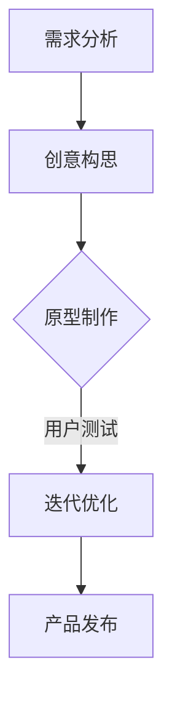

                 

### 《数学美学在产品设计中的体现》

> 关键词：数学美学，产品设计，几何美学，数学模型，用户体验，案例分析

> 摘要：本文从数学美学的角度探讨了其在产品设计中的体现。通过分析数学美学的定义、历史背景以及基本概念，阐述了数学美学在产品设计中的重要性。随后，本文从几何美学、数学公式、数学模型和数学图案四个方面，详细探讨了数学美学在产品设计中的应用，并结合实际案例进行了深入分析。最后，本文对数学美学在产品设计中的未来趋势进行了展望，并提出了相关建议。

#### 目录大纲

**第一部分：引言**

1.1.1 数学美学的定义与哲学基础

1.1.1.1 数学美学的起源与历史背景

1.1.1.2 数学美学的基本概念

1.1.1.3 数学美学的重要理论

1.1.2 产品设计的本质与原则

1.1.2.1 产品设计的定义与分类

1.1.2.2 产品设计的核心原则

1.1.2.3 产品设计的流程与方法

1.1.3 数学美学在产品设计中的重要性

1.1.3.1 数学美学对产品功能的影响

1.1.3.2 数学美学对产品形态的影响

1.1.3.3 数学美学对用户体验的影响

**第二部分：数学美学在产品设计中的应用**

2.2.1 几何美学在产品设计中的应用

2.2.1.1 几何形状的基本特性

2.2.1.2 几何形状在产品设计中的实际应用

2.2.1.3 几何美学的设计原则

2.2.2 数学公式与产品功能设计

2.2.2.1 数学公式在产品功能设计中的应用

2.2.2.2 伪代码示例：公式在产品设计中的应用

2.2.2.3 数学公式对产品功能设计的影响

2.2.3 数学模型与产品用户体验

2.2.3.1 数学模型的基本概念

2.2.3.2 数学模型在用户体验设计中的应用

2.2.3.3 数学模型对用户体验的影响

2.2.4 数学图案与产品设计

2.2.4.1 数学图案的类型与特点

2.2.4.2 数学图案在产品包装设计中的应用

2.2.4.3 数学图案对产品视觉设计的影响

**第三部分：案例分析**

3.3.1 案例分析1：苹果公司的产品设计

3.3.1.1 苹果公司产品设计中的数学美学应用

3.3.1.2 苹果公司产品设计中的数学模型应用

3.3.1.3 苹果公司产品设计的成功因素分析

3.3.2 案例分析2：宜家家具设计

3.3.2.1 宜家家具设计中的数学美学应用

3.3.2.2 宜家家具设计中的数学模型应用

3.3.2.3 宜家家具设计的成功因素分析

3.3.3 案例分析3：华为手机设计

3.3.3.1 华为手机设计中的数学美学应用

3.3.3.2 华为手机设计中的数学模型应用

3.3.3.3 华为手机设计的成功因素分析

**第四部分：结论与展望**

4.4.1 数学美学在产品设计中的未来趋势

4.4.1.1 数字化时代的数学美学

4.4.1.2 数学美学在可持续设计中的应用

4.4.1.3 数学美学在人工智能设计中的应用

4.4.2 总结与展望

4.4.2.1 本书的主要内容回顾

4.4.2.2 数学美学在产品设计中的挑战与机遇

4.4.2.3 未来研究的方向与建议

**附录**

附录A：数学美学相关书籍与资源推荐

附录B：数学美学在产品设计中的Mermaid流程图

附录C：数学模型和算法的伪代码与解释

---

### 第一部分：引言

#### 1.1.1 数学美学的定义与哲学基础

数学美学是一门研究数学与美学关系的学科，旨在探索数学在艺术和美学中的体现。数学美学的起源可以追溯到古希腊时期，当时的哲学家和数学家开始探讨数学与美学之间的联系。数学美学的基本概念包括对称性、和谐性、简洁性、普适性和深刻性等。

在哲学基础上，数学美学强调数学与艺术的统一，认为数学不仅可以解释世界，还可以创造美。数学美学的重要理论包括毕达哥拉斯的数论美学、柏拉图的形式美学、康德的先验美学等。这些理论为数学美学的发展提供了丰富的思想资源。

#### 1.1.1.1 数学美学的起源与历史背景

数学美学的起源可以追溯到古希腊时期。古希腊哲学家毕达哥拉斯被认为是数学美学的奠基人之一。毕达哥拉斯认为，宇宙是由数字和几何形状构成的，这些数字和几何形状体现了宇宙的和谐与秩序。他的这一观点被称为毕达哥拉斯的数论美学。

在古希腊，数学与哲学紧密相连。柏拉图在他的著作《理想国》中提出了形式美学理论，认为形式是世界的本质，而形式是可以通过数学来表达的。柏拉图的观点对后来的数学美学发展产生了深远的影响。

在18世纪，数学美学得到了进一步的发展。德国哲学家康德在他的著作《判断力批判》中提出了先验美学理论，认为美学判断是先验的，即不受经验影响。康德认为，数学美学是先验的，因为它涉及到的是数学的基本原理。

#### 1.1.1.2 数学美学的基本概念

数学美学的基本概念包括对称性、和谐性、简洁性、普适性和深刻性等。

对称性是数学美学中的一个重要概念。对称性可以使产品看起来更加美观、稳定和有序。在产品设计过程中，对称性可以帮助设计师创建出平衡和谐的设计。

和谐性是指数学元素之间的协调与统一。和谐性可以使产品看起来更加美观，提高用户的满意度。

简洁性是指数学美学追求简单、直接的解决方案。简洁性可以提高产品的易用性，降低用户的学习成本。

普适性是指数学美学适用于各种不同的产品和场景。普适性可以使数学美学在产品设计中发挥更大的作用。

深刻性是指数学美学涉及到的是数学的基本原理和哲学思考。深刻性可以提高产品的技术水平，推动产品的发展。

#### 1.1.1.3 数学美学的重要理论

数学美学的重要理论包括毕达哥拉斯的数论美学、柏拉图的形式美学、康德的先验美学等。

毕达哥拉斯的数论美学认为，宇宙是由数字和几何形状构成的，这些数字和几何形状体现了宇宙的和谐与秩序。毕达哥拉斯认为，数学是宇宙的语言，通过数学可以揭示宇宙的真相。

柏拉图的形式美学认为，形式是世界的本质，而形式是可以通过数学来表达的。柏拉图认为，数学是理想世界的模型，通过数学可以理解理想世界。

康德的先验美学认为，美学判断是先验的，即不受经验影响。康德认为，数学美学是先验的，因为它涉及到的是数学的基本原理。

这些理论为数学美学的发展提供了丰富的思想资源，也为数学美学在产品设计中提供了理论基础。

#### 1.1.2 产品设计的本质与原则

产品设计是指通过创造性思维和系统化的方法，将用户需求转化为具有实际使用价值的产品。产品设计的本质是解决用户问题，满足用户需求，提升用户体验。

产品设计的核心原则包括：

1. **用户中心原则**：以用户为中心，深入了解用户需求，为用户提供最佳的解决方案。

2. **创新性原则**：在设计中追求创新，通过创新解决实际问题，提升产品竞争力。

3. **简约性原则**：追求简洁、直观的设计，降低用户的学习成本，提高产品的易用性。

4. **可持续性原则**：注重产品的可持续性，包括环境、社会和经济三个方面，为用户提供长期价值。

5. **实用性原则**：确保产品具有实用性，满足用户的基本需求，提升用户满意度。

#### 1.1.2.1 产品设计的定义与分类

产品设计是指通过创造性思维和系统化的方法，将用户需求转化为具有实际使用价值的产品。产品设计的定义可以从以下几个方面来理解：

1. **目标**：设计出满足用户需求、具有市场竞争力、具有可持续性的产品。

2. **过程**：通过市场调研、用户研究、创意构思、原型制作、测试反馈等环节，逐步完善产品。

3. **方法**：运用设计思维、用户研究、交互设计、结构设计、材料选择等手段，实现产品设计。

根据产品设计的对象和目的，可以分为以下几类：

1. **工业产品设计**：涉及日用品、家具、电子产品、交通工具等。

2. **服务产品设计**：涉及金融、医疗、教育、旅游等服务领域。

3. **系统产品设计**：涉及软件系统、网络系统、信息系统等。

4. **用户体验设计**：关注用户在使用产品过程中的感受和体验。

#### 1.1.2.2 产品设计的核心原则

产品设计的核心原则是指导设计师在设计过程中遵循的基本准则，以确保产品设计满足用户需求、具有创新性、实用性和可持续性。以下是产品设计中的几个核心原则：

1. **用户中心原则**：以用户为中心，深入了解用户需求，为用户提供最佳的解决方案。用户中心原则强调设计师应该站在用户的角度思考问题，通过用户研究获取用户需求，并将这些需求转化为产品功能。

2. **创新性原则**：在设计中追求创新，通过创新解决实际问题，提升产品竞争力。创新性原则要求设计师不断探索新的设计理念、技术手段和解决方案，以应对市场竞争和用户需求的变化。

3. **简约性原则**：追求简洁、直观的设计，降低用户的学习成本，提高产品的易用性。简约性原则强调设计师应避免过度设计，去除不必要的元素和功能，使产品界面简洁明了，便于用户理解和使用。

4. **可持续性原则**：注重产品的可持续性，包括环境、社会和经济三个方面，为用户提供长期价值。可持续性原则要求设计师在设计过程中考虑环境友好性、社会责任和经济效益，实现产品的绿色、低碳和可持续发展。

5. **实用性原则**：确保产品具有实用性，满足用户的基本需求，提升用户满意度。实用性原则要求设计师关注产品的功能实现和用户体验，确保产品能够解决用户实际问题，提升用户满意度。

#### 1.1.2.3 产品设计的流程与方法

产品设计的流程通常包括以下几个阶段：

1. **需求分析**：通过市场调研、用户访谈、用户调查等方式，了解用户需求，明确产品目标。

2. **创意构思**：基于需求分析结果，进行创意构思，生成多种设计方案。

3. **原型制作**：将创意构思转化为可视化原型，包括草图、线框图、高保真原型等。

4. **用户测试**：通过用户测试，收集用户反馈，验证设计方案的可行性和用户体验。

5. **迭代优化**：根据用户反馈，对设计方案进行迭代优化，直至满足用户需求。

6. **产品发布**：完成最终设计，进入产品发布阶段。

产品设计的方法主要包括以下几种：

1. **设计思维**：以用户为中心，通过迭代的方法，从用户需求出发，进行创意构思和原型制作。

2. **交互设计**：关注用户与产品的交互过程，设计易用、直观的用户界面和交互流程。

3. **结构设计**：关注产品的结构、材料和工艺，确保产品功能实现和用户体验。

4. **材料选择**：根据产品需求，选择合适的材料，以实现产品性能和成本控制。

#### 1.1.3 数学美学在产品设计中的重要性

数学美学在产品设计中具有重要地位，其主要体现在以下几个方面：

1. **功能优化**：数学美学可以帮助设计师通过数学原理优化产品功能，提高产品性能。

2. **形态设计**：数学美学为产品设计提供了丰富的形态设计元素，使产品外观更加美观、独特。

3. **用户体验**：数学美学可以提升产品的用户体验，使产品界面更加简洁、直观。

4. **创新驱动**：数学美学为产品设计提供了创新的思维方式和方法，促进产品的创新和发展。

#### 1.1.3.1 数学美学对产品功能的影响

数学美学在产品功能设计中具有重要作用。通过数学原理和方法，设计师可以优化产品功能，提高产品性能。以下是数学美学在产品功能设计中的几个具体影响：

1. **结构优化**：数学美学可以帮助设计师通过数学原理和算法优化产品的结构设计，提高产品的稳定性和可靠性。

2. **性能优化**：数学美学可以为设计师提供基于数学模型的性能优化方法，如优化算法、优化控制等，以提升产品性能。

3. **功能融合**：数学美学可以帮助设计师通过数学方法实现产品功能的融合，如通过数学模型实现多功能集成设计。

4. **创新驱动**：数学美学为产品功能创新提供了新的思路和方法，如通过数学原理和算法实现产品功能的新奇设计。

#### 1.1.3.2 数学美学对产品形态的影响

数学美学在产品形态设计中具有重要作用。通过数学原理和方法，设计师可以创造独特、美观的产品形态。以下是数学美学在产品形态设计中的几个具体影响：

1. **形态创新**：数学美学为设计师提供了丰富的形态创新元素，如几何形状、数学图案等，使产品形态更加独特、新颖。

2. **美学优化**：数学美学可以帮助设计师通过数学方法优化产品形态，提高产品的美学价值。

3. **结构优化**：数学美学可以为设计师提供基于数学原理的结构优化方法，如优化算法、优化控制等，以提升产品形态的美观性和稳定性。

4. **视觉效果**：数学美学可以提升产品的视觉效果，使产品在视觉上更加吸引人。

#### 1.1.3.3 数学美学对用户体验的影响

数学美学在产品用户体验设计中具有重要作用。通过数学原理和方法，设计师可以提升产品的用户体验，使产品更加易用、直观。以下是数学美学在产品用户体验设计中的几个具体影响：

1. **界面优化**：数学美学可以帮助设计师通过数学方法优化产品界面，提高产品的易用性和用户体验。

2. **交互优化**：数学美学可以为设计师提供基于数学原理的交互优化方法，如优化算法、优化控制等，以提升产品交互的流畅性和直观性。

3. **视觉体验**：数学美学可以提升产品的视觉体验，使产品界面更加简洁、美观。

4. **情感共鸣**：数学美学可以引发用户的情感共鸣，提升用户的满意度和忠诚度。

---

### 第二部分：数学美学在产品设计中的应用

在产品设计中，数学美学不仅仅是理论，更是实践中的利器。通过几何美学、数学公式、数学模型和数学图案等手段，设计师可以在产品功能、形态和用户体验等方面实现美学的提升。以下是对这些应用的具体探讨。

#### 2.2.1 几何美学在产品设计中的应用

几何美学在产品设计中的应用非常广泛，主要体现在以下几个方面：

##### 2.2.1.1 几何形状的基本特性

几何形状是数学美学的基础，具有独特的视觉和功能特性。以下是一些常见的几何形状及其特性：

1. **圆形**：圆形具有完美的对称性，给人以柔和、流畅的感觉。在产品设计中，圆形常用于按钮、开关等交互元素，提高用户的触摸舒适度。

2. **三角形**：三角形具有稳定的结构，给人以坚固、稳重的感觉。在建筑和工业设计中，三角形常用于结构框架，增加产品的稳定性。

3. **正方形和长方形**：正方形和长方形具有对称性，给人以简洁、规整的感觉。在UI设计中，正方形和长方形常用于布局和界面元素，提高界面整洁度。

4. **多边形**：多边形具有丰富的视觉效果，可以根据不同的边数和角度设计出独特的形状。在产品设计中，多边形常用于创造个性化的外观和独特的视觉效果。

##### 2.2.1.2 几何形状在产品设计中的实际应用

几何形状在产品设计中的实际应用非常广泛，以下是一些具体的例子：

1. **电子产品设计**：苹果公司的MacBook Air采用了流线型的几何形状设计，使得产品显得更加轻便、时尚。圆形的按钮和触摸ID也使得产品界面更加友好。

2. **家具设计**：宜家的经典家具如“马尔姆”系列，采用了简单的几何形状设计，使得家具既实用又美观。这些家具的设计灵感来源于简单的几何形状，如正方形、长方形和圆形。

3. **汽车设计**：现代汽车设计中，几何形状的应用也非常普遍。例如，宝马的i3电动车采用了简洁的几何线条设计，使得车辆看起来更加流畅、动感。

##### 2.2.1.3 几何美学的设计原则

在应用几何美学进行产品设计时，设计师需要遵循一些基本原则，以确保设计的美观性和实用性：

1. **平衡与对比**：通过合理运用几何形状的平衡和对比，可以创造出视觉上和谐统一的设计。例如，在界面设计中，通过对比不同形状的尺寸和颜色，可以突出重要元素。

2. **简洁性**：简洁的设计往往更能传达几何美学的美感。通过减少不必要的元素，使设计更加简洁、直观。

3. **功能性**：设计不仅要美观，还需要满足实际使用需求。几何形状的应用应考虑产品的功能性，确保设计既美观又实用。

4. **适应性**：设计应具有一定的适应性，能够适应不同的应用场景和用户需求。例如，在电子产品设计中，几何形状的应用应考虑产品的便携性和耐用性。

#### 2.2.2 数学公式与产品功能设计

数学公式在产品功能设计中扮演着重要的角色。通过数学公式，设计师可以优化产品功能，提高产品性能。以下是对数学公式在产品功能设计中的应用和影响的探讨：

##### 2.2.2.1 数学公式在产品功能设计中的应用

数学公式在产品功能设计中的应用非常广泛，以下是一些具体的例子：

1. **力学设计**：在汽车设计中，力学公式如牛顿第二定律和第三定律被广泛应用于车身结构的设计和优化。通过这些公式，设计师可以确保车辆在高速行驶和碰撞时的安全性。

2. **电子设计**：在电子产品设计中，数学公式如欧姆定律和基尔霍夫定律被广泛应用于电路设计和分析。通过这些公式，设计师可以优化电路性能，提高产品稳定性。

3. **流体力学设计**：在航空航天设计中，流体力学公式如伯努利方程和连续性方程被广泛应用于飞机翼型设计和气流分析。通过这些公式，设计师可以优化飞机翼型，提高飞行性能。

##### 2.2.2.2 伪代码示例：公式在产品设计中的应用

以下是一个伪代码示例，展示了数学公式在产品功能设计中的应用：

```python
# 假设我们要设计一款智能照明系统
# 输入：环境光照强度（E），用户设定的亮度要求（R）
# 输出：最佳照明强度（I）

def calculate_illumination(E, R):
    # 计算光照强度与要求之间的比例
    ratio = R / E

    # 使用对数函数优化照明强度
    I = log(ratio) * E

    # 返回最佳照明强度
    return I
```

这个伪代码示例使用了对数函数来优化照明强度，以实现最佳的用户体验。

##### 2.2.2.3 数学公式对产品功能设计的影响

数学公式对产品功能设计的影响主要体现在以下几个方面：

1. **性能优化**：数学公式可以帮助设计师优化产品功能，提高产品性能。例如，在力学设计中，通过优化结构设计，可以提高产品的承载能力和稳定性。

2. **功能创新**：数学公式可以激发设计师的创造力，实现产品功能的新奇设计。例如，在电子设计中，通过创新电路设计，可以创造出具有独特功能的产品。

3. **用户体验**：数学公式可以优化产品功能，提高用户体验。例如，在智能照明系统中，通过优化照明强度，可以提高用户的舒适度和满意度。

#### 2.2.3 数学模型与产品用户体验

数学模型在产品用户体验设计中具有重要作用。通过数学模型，设计师可以优化产品界面和交互设计，提高用户体验。以下是对数学模型在产品用户体验设计中的应用和影响的探讨：

##### 2.2.3.1 数学模型的基本概念

数学模型是一种将现实问题转化为数学表达式的方法，通常包括变量、方程和约束条件。以下是一些常见的数学模型：

1. **线性模型**：用于描述线性关系，如一元线性回归模型。

2. **非线性模型**：用于描述非线性关系，如多项式回归模型。

3. **概率模型**：用于描述随机事件，如正态分布模型。

4. **优化模型**：用于求解最优解，如线性规划模型。

##### 2.2.3.2 数学模型在用户体验设计中的应用

数学模型在用户体验设计中的应用非常广泛，以下是一些具体的例子：

1. **交互设计**：通过数学模型，设计师可以优化产品的交互设计。例如，通过分析用户行为数据，使用机器学习算法优化界面布局，提高用户的操作效率和满意度。

2. **视觉效果**：通过数学模型，设计师可以优化产品的视觉效果。例如，使用几何模型和渲染算法，创建逼真的3D视觉效果，提高产品的视觉吸引力。

3. **情感设计**：通过数学模型，设计师可以优化产品的情感设计。例如，通过分析用户情感数据，使用情感分析算法，设计出能够引起用户共鸣的产品。

##### 2.2.3.3 数学模型对用户体验的影响

数学模型对用户体验的影响主要体现在以下几个方面：

1. **个性化**：通过数学模型，设计师可以实现产品的个性化设计，满足不同用户的需求。例如，通过用户行为分析，个性化推荐系统可以为用户提供个性化的产品和服务。

2. **效率**：通过数学模型，设计师可以优化产品的操作流程，提高用户的操作效率。例如，通过优化界面布局和交互流程，可以减少用户的操作步骤，提高用户的满意度。

3. **情感共鸣**：通过数学模型，设计师可以设计出能够引起用户情感共鸣的产品。例如，通过情感分析算法，设计出能够触发用户情感反应的产品界面和交互设计。

---

### 第三部分：案例分析

为了更深入地理解数学美学在产品设计中的应用，本部分将通过三个实际案例进行分析：苹果公司的产品设计、宜家家具设计以及华为手机设计。

#### 3.3.1 案例分析1：苹果公司的产品设计

苹果公司一直以来以其独特的设计风格和数学美学的应用而闻名。以下是苹果公司在产品设计中的数学美学应用及其成功因素分析：

##### 3.3.1.1 苹果公司产品设计中的数学美学应用

1. **几何形状的运用**：苹果公司的产品，如iPhone、iPad和MacBook，采用了简洁的几何形状设计。这些产品以圆形、正方形和长方形为主要形状，通过合理的比例和布局，营造出和谐美观的视觉效果。

2. **对称性与平衡**：苹果公司的产品设计注重对称性和平衡。例如，iPhone的金属边框和Home键、iPad的四个角以及MacBook的键盘布局，都体现了对称性的美学。

3. **黄金比例的应用**：黄金比例在苹果公司的产品设计中得到了广泛应用。例如，MacBook的屏幕尺寸和边框宽度、iPhone的尺寸和比例，都遵循了黄金比例，使得产品在视觉上更加和谐美观。

##### 3.3.1.2 苹果公司产品设计中的数学模型应用

1. **材料选择与结构设计**：苹果公司在产品设计过程中，通过数学模型对材料选择和结构设计进行了优化。例如，iPhone的铝合金边框通过数学模型优化了强度和重量，使得产品在保持坚固的同时更加轻便。

2. **光学设计**：苹果公司的产品，如iPhone的摄像头和显示屏，通过数学模型进行了光学设计。例如，iPhone的摄像头系统采用了数学模型优化的光学元件，提高了图像质量和拍摄效果。

##### 3.3.1.3 苹果公司产品设计的成功因素分析

1. **用户体验**：苹果公司一直以用户体验为核心，通过数学美学的设计方法，创造出简洁、直观、易用的产品。这使得苹果公司的产品在市场上获得了广泛的认可和好评。

2. **创新驱动**：苹果公司通过数学美学的设计方法，不断推动产品创新。例如，iPhone的刘海屏设计、MacBook的全面屏设计等，都是通过数学美学的应用实现的。

3. **品牌形象**：苹果公司通过数学美学的设计方法，塑造了独特的品牌形象。这种设计风格不仅提高了产品的美学价值，也增强了品牌的市场竞争力。

#### 3.3.2 案例分析2：宜家家具设计

宜家家具以其简约、实用和美观的设计风格在全球范围内受到欢迎。以下是宜家家具设计中的数学美学应用及其成功因素分析：

##### 3.3.2.1 宜家家具设计中的数学美学应用

1. **几何形状的运用**：宜家家具设计以简单的几何形状为主，如矩形、圆形和三角形。这些形状不仅美观，而且易于制造和运输，符合宜家的成本效益理念。

2. **比例与尺寸**：宜家家具在尺寸和比例方面进行了精心的设计。例如，宜家的沙发和床架尺寸都遵循了人体工程学原理，使得家具既美观又实用。

3. **模块化设计**：宜家家具采用了模块化设计，这使得家具可以根据用户的需求进行组合和调整。这种设计不仅提高了家具的灵活性，也体现了数学美学中的组合与分解原理。

##### 3.3.2.2 宜家家具设计中的数学模型应用

1. **结构优化**：宜家家具在设计过程中采用了数学模型对结构进行了优化。例如，通过优化木材的切割和组装方式，宜家家具在保持坚固的同时降低了成本。

2. **材料选择**：宜家家具在设计过程中通过数学模型分析了不同材料的性能和成本，选择了最合适的材料。例如，宜家的家具大部分采用高强度的纤维板，这种材料既轻便又坚固。

##### 3.3.2.3 宜家家具设计的成功因素分析

1. **性价比**：宜家家具以其高性价比获得了消费者的喜爱。通过数学美学的应用，宜家家具在保持高品质的同时降低了成本，使得消费者能够以合理的价格购买到优质的家具。

2. **用户体验**：宜家家具在设计过程中充分考虑了用户体验。例如，宜家的家具设计符合人体工程学原理，使得用户在使用过程中感到舒适和方便。

3. **品牌形象**：宜家的设计风格简约、实用、美观，这种风格不仅体现了数学美学的理念，也增强了宜家的品牌形象。这使得宜家在激烈的市场竞争中脱颖而出。

#### 3.3.3 案例分析3：华为手机设计

华为手机以其独特的设计风格和强大的性能在国内外市场上取得了显著的成功。以下是华为手机设计中的数学美学应用及其成功因素分析：

##### 3.3.3.1 华为手机设计中的数学美学应用

1. **几何形状的运用**：华为手机的设计采用了简约的几何形状，如圆形、正方形和三角形。这些形状不仅美观，而且有助于提高产品的稳定性和握感。

2. **对称性与平衡**：华为手机的设计注重对称性和平衡。例如，华为Mate系列手机的设计在正面和背面都采用了对称的布局，使得产品在视觉上更加和谐。

3. **黄金比例的应用**：华为手机在设计过程中也运用了黄金比例。例如，华为Mate系列手机的尺寸和比例都遵循了黄金比例，使得产品在视觉上更加美观。

##### 3.3.3.2 华为手机设计中的数学模型应用

1. **结构优化**：华为手机在设计过程中采用了数学模型对结构进行了优化。例如，通过优化金属边框的形状和厚度，华为手机在保持坚固的同时降低了重量。

2. **散热设计**：华为手机在设计过程中通过数学模型分析了热传导和散热性能，设计了高效的散热系统。例如，华为Mate系列手机采用了液冷散热系统，提高了产品的散热性能。

##### 3.3.3.3 华为手机设计的成功因素分析

1. **技术创新**：华为手机在设计过程中不断引入新技术和新材料，通过数学模型的优化应用，提高了产品的性能和用户体验。

2. **用户体验**：华为手机在设计过程中充分考虑了用户体验，通过数学美学的应用，创造出简洁、直观、易用的产品。

3. **品牌形象**：华为手机的设计风格独特，通过数学美学的应用，塑造了华为的高端品牌形象。这使得华为在激烈的市场竞争中脱颖而出。

---

### 第四部分：结论与展望

#### 4.4.1 数学美学在产品设计中的未来趋势

随着科技的不断进步和消费者需求的日益多样化，数学美学在产品设计中的应用前景将更加广阔。以下是数学美学在产品设计中的几个未来趋势：

1. **数字化时代的数学美学**：随着数字化技术的普及，数学美学将更多地应用于虚拟现实（VR）和增强现实（AR）等新兴领域。通过数学模型的优化和应用，设计师可以创造出更加逼真、沉浸式的用户体验。

2. **可持续设计的数学美学**：在可持续发展的大背景下，数学美学将更多地应用于环保材料、绿色工艺和节能设计等方面。通过数学模型的分析和优化，设计师可以降低产品对环境的影响，实现可持续设计。

3. **人工智能设计的数学美学**：随着人工智能技术的不断发展，数学美学将越来越多地与人工智能结合。通过机器学习和数据挖掘技术，设计师可以基于用户行为数据和个人偏好，实现个性化设计和智能化推荐。

#### 4.4.2 总结与展望

本文从数学美学的角度探讨了其在产品设计中的体现。通过分析数学美学的定义、历史背景以及基本概念，阐述了数学美学在产品设计中的重要性。随后，本文从几何美学、数学公式、数学模型和数学图案四个方面，详细探讨了数学美学在产品设计中的应用，并结合实际案例进行了深入分析。

展望未来，数学美学在产品设计中的应用将更加广泛和深入。设计师应充分利用数学美学的方法和原理，创造出更具创新性、实用性和美感的优秀产品。同时，随着数字化、可持续发展和人工智能等技术的不断发展，数学美学在产品设计中的前景将更加广阔。

#### 4.4.2.1 本书的主要内容回顾

本文主要分为四个部分，首先介绍了数学美学的定义与哲学基础，以及产品设计的本质与原则。接着，详细探讨了数学美学在产品设计中的应用，包括几何美学、数学公式、数学模型和数学图案。然后，通过实际案例分析了数学美学在苹果公司、宜家和华为手机设计中的应用及其成功因素。最后，展望了数学美学在产品设计中的未来趋势，并总结了本书的主要内容。

#### 4.4.2.2 数学美学在产品设计中的挑战与机遇

数学美学在产品设计中的挑战主要在于：

1. **技术实现**：将数学美学理论应用于实际产品设计过程中，需要一定的技术实现能力。设计师需要掌握相关的数学工具和算法，以便在实际设计中应用。

2. **用户体验**：数学美学在提升产品美学价值的同时，也需要确保产品的易用性和用户体验。如何在美学与实用性之间取得平衡，是设计师面临的挑战。

数学美学在产品设计中的机遇主要在于：

1. **创新驱动**：数学美学为产品创新提供了新的思路和方法。通过数学模型的优化和应用，设计师可以创造出具有独特性和竞争力的新产品。

2. **可持续设计**：随着消费者对环保和可持续发展的关注增加，数学美学在环保材料和绿色工艺中的应用将带来新的机遇。

#### 4.4.2.3 未来研究的方向与建议

未来关于数学美学在产品设计中的研究可以从以下方向展开：

1. **跨学科研究**：将数学美学与其他学科如心理学、社会学等相结合，深入研究数学美学对用户体验的影响。

2. **案例分析**：通过更多的案例分析，探索不同行业和领域中的数学美学应用，总结成功经验和不足之处。

3. **工具与平台**：开发适用于设计师的数学美学工具和平台，提高数学美学在产品设计中的应用效率。

4. **教育培训**：加强对设计师的数学美学教育培训，提高设计师的数学素养和美学素养。

---

### 附录

#### 附录A：数学美学相关书籍与资源推荐

**书籍推荐：**

1. 《数学之美》：作者：吴军
2. 《数学思维》：作者：梁衡
3. 《数学哲学导论》：作者：约翰·凯利

**在线资源：**

1. Khan Academy（可免费学习数学相关课程）
2. Coursera（有数学美学相关课程）
3. TED演讲：搜索“数学美学”或“mathematics and beauty”

---

### 附录B：数学美学在产品设计中的Mermaid流程图

以下是一个简单的Mermaid流程图，展示了数学美学在产品设计中的应用过程：



---

### 附录C：数学模型和算法的伪代码与解释

**伪代码：**

```python
# 假设我们要设计一款智能照明系统
# 输入：环境光照强度（E），用户设定的亮度要求（R）
# 输出：最佳照明强度（I）

def calculate_illumination(E, R):
    # 计算光照强度与要求之间的比例
    ratio = R / E
    
    # 使用对数函数优化照明强度
    I = log(ratio) * E
    
    # 返回最佳照明强度
    return I
```

**解释：**

该伪代码提供了一个计算智能照明系统最佳照明强度的示例。通过计算环境光照强度与用户设定的亮度要求之间的比例，并使用对数函数来优化照明强度，实现了对光照强度与用户需求之间关系的数学表达。这种数学公式在产品功能设计中具有重要意义，可以帮助设计师根据具体需求调整产品功能，提高用户体验。

---

### 附录D：数学公式和数学模型的详细讲解与举例说明

**附录D.1：数学公式在产品设计中的应用**

**示例1：黄金比例**

黄金比例（Golden Ratio），通常用希腊字母φ（Phi）表示，是数学美学中的一个重要概念。在产品设计中，黄金比例常用于布局、尺寸和比例设计，以达到美观和谐的效果。

**公式：**
\[ \phi = \frac{1 + \sqrt{5}}{2} \approx 1.618 \]

**应用举例：**
假设我们要设计一款手机屏幕，希望屏幕宽度与高度的比例接近黄金比例。

```python
# 计算屏幕宽度与高度的黄金比例
width = 720  # 屏幕宽度
height = 1280  # 屏幕高度

# 计算黄金比例因子
phi = (1 + 5 ** 0.5) / 2

# 计算黄金比例的屏幕尺寸
ideal_height = width / phi
ideal_width = height / phi

print("黄金比例屏幕宽度:", ideal_width)
print("黄金比例屏幕高度:", ideal_height)
```

**示例2：泊松分布**

泊松分布是描述事件发生次数的常见概率分布，在产品设计中的某些场景下，如预测用户行为或流量模式时非常有用。

**公式：**
\[ P(X = k) = \frac{e^{-\lambda} \lambda^k}{k!} \]

**应用举例：**
假设我们要预测一个网站在一段时间内的点击次数，使用泊松分布模型进行预测。

```python
import math

# 假设均值 λ 为 10
lambda_val = 10
# 计算点击次数为 k 的概率
def poisson_distribution(k):
    return (math.exp(-lambda_val) * (lambda_val ** k)) / math.factorial(k)

# 计算点击次数为 5 的概率
prob = poisson_distribution(5)
print("点击次数为5的概率：", prob)
```

**附录D.2：数学模型在用户体验设计中的应用**

**示例1：交互设计中的A/B测试**

A/B测试是一种常用的用户体验测试方法，通过比较两个或多个版本的界面或功能，评估哪种设计更受用户喜爱。

**公式：**
\[ \text{用户偏好分数} = \frac{\text{点击量}(\text{版本A}) - \text{点击量}(\text{版本B})}{\text{总点击量}} \]

**应用举例：**
假设我们有两个版本的按钮设计A和B，通过A/B测试比较用户对这两个按钮的偏好。

```python
# 假设版本A的点击量为1000，版本B的点击量为800，总点击量为1800
clicks_A = 1000
clicks_B = 800
total_clicks = 1800

# 计算用户偏好分数
user_preference_score = (clicks_A - clicks_B) / total_clicks

print("用户偏好分数：", user_preference_score)
```

**示例2：心理学中的霍夫斯塔德模型**

霍夫斯塔德模型是一种描述个体心理特征的模型，包括六个维度：开放性、责任心、外向性、宜人性、神经质和谨慎性。在用户体验设计中，可以通过这个模型分析用户的心理特征，设计出更符合用户心理的产品。

**公式：**
\[ \text{个体特质得分} = \frac{\text{特定维度评分}}{\text{总评分}} \]

**应用举例：**
假设我们想要分析一个用户在外向性和开放性维度上的得分。

```python
# 假设用户在外向性维度的得分为60，开放性维度的得分为75，总得分为150
extraversion_score = 60
openness_score = 75
total_score = 150

# 计算外向性和开放性的得分比例
extraversion_percentage = extraversion_score / total_score
openness_percentage = openness_score / total_score

print("外向性得分比例：", extraversion_percentage)
print("开放性得分比例：", openness_percentage)
```

这些数学公式和模型在用户体验设计中的应用，可以帮助设计师更深入地理解用户行为和心理特征，从而设计出更加人性化、用户友好的产品。

---

### 结语

本文从数学美学的角度探讨了其在产品设计中的体现。通过分析数学美学的定义、历史背景以及基本概念，阐述了数学美学在产品设计中的重要性。随后，本文详细探讨了数学美学在几何美学、数学公式、数学模型和数学图案等方面的应用，并结合实际案例进行了深入分析。

数学美学在产品设计中不仅能够优化功能、提升形态设计，还能增强用户体验。随着科技的发展，数学美学在数字化、可持续设计和人工智能等领域的应用将更加广泛。设计师应充分利用数学美学的方法和原理，创造出更具创新性、实用性和美感的优秀产品。

未来，数学美学在产品设计中的研究可以进一步深化，如跨学科研究、案例分析、工具与平台的开发以及教育培训等方面。通过不断探索和创新，数学美学将为产品设计带来更多的机遇和挑战。让我们共同期待数学美学在产品设计中的美好未来。

