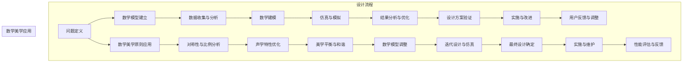

                 

## 文章标题

《数学美学在建筑声学设计中的应用》

### 关键词

- 数学美学
- 建筑声学设计
- 对称性
- 比例
- 声学参数
- 数学模型
- 数形结合

### 摘要

本文旨在探讨数学美学在建筑声学设计中的关键应用，通过系统地介绍数学美学的基本原理及其与建筑声学设计的紧密联系，揭示两者相结合带来的创新设计思维。文章首先阐述了建筑声学设计的基本概念，接着深入分析了数学美学的基本原理及其在建筑声学设计中的应用。在此基础上，本文详细介绍了建筑声学设计的数学方法，并通过实例展示了数学美学原则在具体建筑声学设计项目中的实际应用。最后，文章探讨了建筑声学设计的未来趋势及面临的挑战，为读者提供了关于数学美学在建筑声学设计领域的深入见解和前瞻性思考。

## 《数学美学在建筑声学设计中的应用》目录大纲

### 第一部分：引言与概述

#### 1.1 书籍目的与结构

- 介绍书籍的目的
- 概述书籍的结构

#### 1.2 数学美学与建筑声学设计的关系

- 解释数学美学在建筑声学设计中的作用
- 强调两者的结合的重要性

#### 1.3 建筑声学设计的基本概念

- 声音的传播与反射
- 声学环境的控制
- 声学设计与人类健康

### 第二部分：数学美学的原理与概念

#### 2.1 数学美学的基本原理

- 美学在数学中的体现
- 对称性、比例和和谐在建筑声学设计中的应用

#### 2.2 数学模型与声学参数

- 声学参数的数学表示
- 数学模型在声学设计中的应用

#### 2.3 数形结合：数学与建筑形态

- 数形结合的基本概念
- 数形结合在建筑声学设计中的应用实例

### 第三部分：建筑声学设计的数学方法

#### 3.1 建筑声学设计的数学基础

- 声学波动方程
- 声学模拟与数值方法

#### 3.2 声学特性优化与数学建模

- 声学特性优化方法
- 建筑声学模型的构建与优化

#### 3.3 建筑声学设计的数学工具

- 常用数学工具及其在声学设计中的应用

### 第四部分：数学美学在建筑声学设计中的应用实例

#### 4.1 室内声学设计的数学美学原则

- 声学特性与空间布局
- 声学优化与美学平衡

#### 4.2 公共建筑声学设计案例分析

- 文化场馆声学设计
- 办公建筑声学设计

#### 4.3 居住建筑声学设计案例分析

- 住宅声学设计
- 酒店声学设计

### 第五部分：数学美学在建筑声学设计中的前沿与挑战

#### 5.1 建筑声学设计的未来趋势

- 数字化声学设计
- 人机交互与声学环境

#### 5.2 数学美学在建筑声学设计中的挑战

- 环境噪声控制
- 声学设计与可持续性

#### 5.3 开放问题与研究方向

- 建筑声学设计的数学建模
- 新型声学材料的数学分析

### 附录

#### 附录 A：数学美学与建筑声学设计资源

- 学术文献与资料
- 建筑声学设计软件

#### 附录 B：数学公式与算法详解

- 常用数学公式
- 算法伪代码与解释

#### 附录 C：案例分析代码与解读

- 案例分析代码实现
- 代码解读与分析

**附录 D：数学美学在建筑声学设计中的Mermaid流程图**

- 流程图展示数学美学与建筑声学设计的结合过程

### 文章关键词

- 数学美学
- 建筑声学设计
- 对称性
- 比例
- 声学参数
- 数学模型
- 数形结合

## 第一部分：引言与概述

### 1.1 书籍目的与结构

随着科技的迅猛发展，建筑声学设计逐渐成为建筑领域中不可或缺的一部分。然而，传统的声学设计方法往往依赖于经验和直觉，缺乏系统性和科学性。为了弥补这一不足，本文旨在探讨数学美学在建筑声学设计中的应用，通过引入数学美学的原理和方法，为建筑声学设计提供一种全新的设计思路。

本书籍分为五个主要部分，每个部分都详细探讨了数学美学在建筑声学设计中的不同应用场景。第一部分是引言与概述，介绍书籍的目的、结构和主要研究内容。第二部分深入分析了数学美学的原理与概念，包括对称性、比例和和谐在建筑声学设计中的应用。第三部分详细介绍了建筑声学设计的数学方法，包括声学波动方程、声学模拟与数值方法等。第四部分通过具体实例展示了数学美学原则在建筑声学设计项目中的实际应用。第五部分探讨了建筑声学设计的未来趋势及面临的挑战，为读者提供了关于数学美学在建筑声学设计领域的深入见解和前瞻性思考。

### 1.2 数学美学与建筑声学设计的关系

数学美学是一门融合了数学与美学思想的学科，它不仅关注数学的严谨性，也强调数学在审美价值中的体现。建筑声学设计则是研究声音在建筑空间中的传播、反射和吸收等问题，旨在创造舒适、健康的声学环境。这两者的结合，不仅为建筑声学设计提供了一种全新的设计工具和方法，也为数学美学的研究提供了新的应用场景。

首先，数学美学在建筑声学设计中的作用主要体现在以下几个方面：

1. **对称性**：对称性是美学中的一种基本原理，它不仅在视觉艺术中具有重要地位，在声学设计中也有着广泛应用。通过对称性的设计，可以创造均衡和谐的声学环境，使得声音在空间中均匀分布，避免出现声学死角。

2. **比例**：比例是美学中的另一个重要概念，它关系到整体与部分之间的关系。在建筑声学设计中，合适的比例关系可以使声音在传播过程中保持和谐，避免产生过大的音量差异，从而提升声学环境的舒适度。

3. **和谐**：和谐是美学追求的最高境界，它体现在整体的协调和统一中。在建筑声学设计中，和谐的声音环境可以提升人们的听觉体验，减少噪声污染，提高生活质量。

其次，数学美学与建筑声学设计的结合具有重要意义：

1. **科学性**：通过数学美学的原理和方法，可以更科学、系统地分析和设计建筑声学环境，避免传统方法的盲目性和主观性。

2. **创新性**：数学美学为建筑声学设计提供了新的视角和思路，有助于发现和创造新的声学设计模式，提升建筑设计的整体美感。

3. **实用性**：数学美学在建筑声学设计中的应用，不仅提升了设计的美学价值，也增强了建筑的功能性和实用性，为人们提供了更舒适、健康的声学环境。

总之，数学美学与建筑声学设计的结合，不仅为建筑声学设计提供了一种全新的设计工具和方法，也为数学美学的研究提供了新的应用场景，具有深远的意义和价值。

### 1.3 建筑声学设计的基本概念

建筑声学设计是研究声音在建筑空间中的传播、反射和吸收等问题，旨在创造舒适、健康的声学环境。以下将介绍建筑声学设计的基本概念，包括声音的传播与反射、声学环境的控制以及声学设计与人类健康。

#### 声音的传播与反射

声音在建筑空间中的传播主要依赖于空气介质，其传播速度约为340米/秒。声音在传播过程中会遇到障碍物，如墙壁、地面和天花板，这些障碍物会导致声音的反射。反射声音与直接声音的相互作用，决定了建筑空间内的声学特性。

- **反射时间**：声音在墙壁、地面和天花板上的反射时间决定了声音在空间中的混响时间。过长的混响时间会导致声音的持续回响，使空间显得嘈杂，而过短的混响时间则会使声音显得干涩。

- **反射角度**：声音的反射角度影响声音的传播方向和强度。通过合理的声学设计，可以控制声音的反射角度，避免产生过多的噪声和声学死角。

#### 声学环境的控制

声学环境的控制是建筑声学设计的核心任务之一，主要包括以下方面：

- **吸声处理**：吸声材料可以吸收部分声能，减少声音的反射和混响。在室内设计中，常使用吸声板、吸声棉等材料来改善声学环境。

- **隔声处理**：隔声材料可以阻止声音的传播，减少噪声的干扰。在建筑墙体、楼板和门窗等部位使用隔声材料，可以有效降低噪声污染。

- **声扩散**：声扩散材料可以改变声音的传播路径，减少声聚焦现象，使声音在空间中均匀分布。通过合理的声扩散设计，可以提升声学环境的舒适度。

#### 声学设计与人类健康

良好的声学环境对人类健康至关重要，主要表现在以下几个方面：

- **心理舒适**：适宜的声学环境可以提升人们的心情和心理舒适度，减少压力和焦虑。

- **工作效率**：在安静的声学环境中，人们更容易集中注意力，提高工作效率。

- **睡眠质量**：在良好的声学环境中，人们可以更好地入睡，提高睡眠质量。

- **听力保护**：过大的噪声会对听力造成损害，通过合理的声学设计，可以降低噪声水平，保护听力。

总之，建筑声学设计的基本概念涉及声音的传播与反射、声学环境的控制以及声学设计与人类健康。理解这些基本概念，有助于我们更科学、更有效地进行建筑声学设计，创造舒适、健康的声学环境。

### 第二部分：数学美学的原理与概念

#### 2.1 数学美学的基本原理

数学美学是一门交叉学科，它结合了数学与美学的思想，探索数学形式在美学表现中的内在规律。在建筑声学设计中，数学美学的基本原理具有重要的应用价值，这些原理包括对称性、比例和和谐。

**对称性**

对称性是数学美学中的一个重要概念，它指的是某个对象在某种变换下保持不变的性质。在建筑声学设计中，对称性可以用来优化声音的传播和反射特性。

- **平面对称**：平面对称是指对象关于某一条直线对称。例如，在建筑室内设计中，使用对称的布局可以确保声音在空间中的均匀分布，减少声学死角。
- **点对称**：点对称是指对象关于某一个点对称。例如，在音响设计中，利用点对称原理可以使声音更加均匀地传播到每个听音位置。

**比例**

比例是美学中另一个重要概念，它关系到整体与部分之间的关系。在建筑声学设计中，合适的比例关系可以提升声学环境的和谐感和舒适度。

- **黄金比例**：黄金比例是数学上的一种特殊比例，约为1:1.618。在建筑设计中，黄金比例可以用来确定空间布局，使得整体空间更加美观和谐。
- **等比例放大和缩小**：在声学设计中，通过等比例放大或缩小声学构件，可以保持声学特性的相对一致性，例如，音箱的尺寸调整以适应不同大小的房间。

**和谐**

和谐是美学追求的最高境界，它体现在整体的协调和统一中。在建筑声学设计中，和谐的声音环境可以提升人们的听觉体验，减少噪声污染。

- **声学平衡**：声学平衡是指通过调整吸声、隔声和声扩散材料，使声学环境达到和谐状态。例如，在室内设计中，通过合理配置吸声材料和声扩散材料，可以创造出舒适的听觉空间。
- **音质均衡**：音质均衡是指通过调整音频信号的频率响应，使得声音在各个频率范围内保持均衡。例如，在音响系统中，通过均衡器调整音频信号的频率响应，可以使声音更加自然和谐。

**数学模型与声学参数**

在建筑声学设计中，数学模型是描述声学现象的重要工具。通过建立数学模型，可以更精确地分析和预测声学特性。

- **声学波动方程**：声学波动方程是描述声音在空间中传播的基本方程，它基于质量、惯性和压力等物理量之间的关系。通过求解声学波动方程，可以计算出声音在空间中的传播速度、传播路径和反射强度等参数。
- **声学模拟**：声学模拟是一种通过计算机模拟声学现象的方法。通过声学模拟，可以预测建筑空间内的声学特性，为声学设计提供科学依据。

**数学模型在声学设计中的应用**

数学模型在建筑声学设计中具有广泛的应用，以下是一些典型的应用实例：

- **室内声学设计**：通过数学模型可以计算出室内空间的混响时间、反射时间和声音传播路径，为声学优化提供依据。
- **音响系统设计**：通过数学模型可以优化音箱的布局和尺寸，以实现最佳的声音传播效果。
- **噪声控制**：通过数学模型可以预测噪声的传播和影响范围，为噪声控制提供科学依据。

**数形结合**

数形结合是数学美学的一个重要方面，它指的是数学形式与视觉形式的结合。在建筑声学设计中，数形结合可以创造出独特的声学效果。

- **几何形状**：通过使用特定的几何形状，如圆形、方形、三角形等，可以在声学设计中创造出独特的声学效果。例如，圆形的音箱可以产生更均匀的声音分布。
- **几何结构**：通过使用几何结构，如网格、模块化设计等，可以在声学设计中实现灵活性和多样性。例如，模块化设计可以方便地调整声学构件的布局，以适应不同的声学需求。

总之，数学美学的基本原理为建筑声学设计提供了重要的理论基础和设计工具。通过运用对称性、比例和和谐等原理，可以创造出更科学、更美观的声学环境。同时，数学模型和数形结合的方法为建筑声学设计提供了新的思路和方法，推动了建筑声学设计的发展。

#### 2.2 数学模型与声学参数

在建筑声学设计中，数学模型和声学参数的精确描述是关键。这些模型和参数不仅帮助我们理解声学现象，还可以指导实际设计过程，优化建筑空间的声学性能。

**声学参数的数学表示**

声学参数是描述声学环境的重要指标，包括但不限于声压级、声强、吸声系数、混响时间等。以下是这些参数的数学表示：

1. **声压级（Lp）**：声压级是衡量声音强度的一个参数，通常用分贝（dB）表示。它的数学表达式为：

   $$Lp = 20 \log_{10}\left(\frac{p}{p_0}\right)$$

   其中，\( p \) 是实际声压，\( p_0 \) 是参考声压（通常取 \( 20 \mu Pa \)）。

2. **声强（I）**：声强是单位时间内通过单位面积的声音能量。它的数学表达式为：

   $$I = \frac{p^2}{\rho c}$$

   其中，\( p \) 是声压，\( \rho \) 是空气密度（约为 \( 1.29 \, \text{kg/m}^3 \)），\( c \) 是声音在空气中的传播速度（约为 \( 340 \, \text{m/s} \)）。

3. **吸声系数（α）**：吸声系数是衡量材料吸声能力的一个参数，取值范围为 0 到 1。它的数学表达式为：

   $$α = \frac{Q}{Q_0}$$

   其中，\( Q \) 是吸收的声能量，\( Q_0 \) 是入射的声能量。

4. **混响时间（T）**：混响时间是指声音在房间内逐渐消失的时间，是衡量房间声学特性的一项重要指标。它的数学表达式为：

   $$T = \frac{0.05V}{S \sum_{i=1}^{n} \alpha_i}$$

   其中，\( V \) 是房间体积，\( S \) 是房间表面积，\( \alpha_i \) 是房间内各个表面的吸声系数。

**数学模型在声学设计中的应用**

数学模型在建筑声学设计中的应用非常广泛，以下是一些典型的应用场景：

1. **声学波动方程**：声学波动方程是描述声波在介质中传播的基本方程。对于三维空间中的声波传播，波动方程可以表示为：

   $$\frac{\partial^2 p}{\partial t^2} - c^2 \nabla^2 p = 0$$

   其中，\( p \) 是声压，\( c \) 是声速，\( \nabla^2 \) 是拉普拉斯算子。通过求解这个方程，可以预测声波在复杂空间中的传播路径和反射情况。

2. **声传播模型**：声传播模型用于模拟声波在不同地形、建筑结构中的传播。其中，几何声学模型是一种常用的声传播模型，它假设声波沿直线路径传播，适用于短距离声传播模拟。另一种常用的模型是射线追踪模型，它通过追踪声波在空间中的路径，计算声波在不同表面反射后的传播效果。

3. **有限元方法**：有限元方法是一种数值方法，用于求解复杂声学问题。通过将空间划分为多个小单元，可以求解声学波动方程在不同单元内的解。这种方法适用于复杂几何形状的声学模拟，如建筑物内部的声音传播。

**数学模型在建筑声学设计中的应用实例**

以下是一些数学模型在建筑声学设计中的应用实例：

1. **室内声学设计**：在室内声学设计中，使用声学模拟软件，如CATTAC、EASE等，可以通过数学模型计算室内空间的混响时间、反射时间和声音传播路径。通过优化吸声材料和反射面的布置，可以改善室内声学环境。

2. **公共建筑声学设计**：在剧院、音乐厅等公共建筑中，使用声学模型来预测声音在空间中的传播和反射效果。通过调整座位布局、音箱位置和反射面设计，可以创造出理想的声学效果。

3. **噪声控制设计**：在噪声控制设计中，使用声学模型来预测噪声在建筑外部和内部的传播。通过合理布置隔声墙和吸声材料，可以有效地降低噪声污染。

总之，数学模型和声学参数的精确描述是建筑声学设计的基础。通过运用这些数学工具，可以更科学、更有效地进行声学设计，创造舒适、健康的声学环境。

#### 2.3 数形结合：数学与建筑形态

数形结合是数学美学中的一个重要概念，它指的是将数学形式与视觉形式相结合，创造出具有美学价值的建筑形态。在建筑声学设计中，数形结合的方法不仅可以优化建筑空间的声学性能，还可以提升建筑的外观美感。

**数形结合的基本概念**

数形结合涉及数学中的几何图形和数学关系，如对称性、比例和分形等。通过将这些数学原理应用于建筑形态设计，可以创造出独特而和谐的视觉效果。

1. **对称性**：对称性是数形结合中的一种基本原理。它可以通过镜像对称、旋转对称或点对称等几何变换，产生简洁而优雅的形态。

2. **比例**：比例是数形结合中的另一个重要概念。通过应用黄金比例、费波那契数列等数学比例关系，可以在建筑形态中实现和谐与平衡。

3. **分形**：分形是数学中一种自相似的结构，它可以通过重复迭代产生复杂的几何形态。分形在建筑形态中的应用，可以创造出自然、流畅的视觉效果。

**数形结合在建筑声学设计中的应用实例**

以下是一些数形结合在建筑声学设计中的应用实例：

1. **音乐厅设计**：音乐厅是建筑声学设计中的典型应用场景。在设计过程中，通过数形结合的方法，可以实现最佳的声音传播和反射效果。例如，悉尼歌剧院的设计采用了对数螺旋形的壳体结构，这种结构不仅具有美学价值，还能优化声波的传播路径。

2. **住宅设计**：在住宅设计中，数形结合的方法可以应用于室内空间布局。通过合理运用对称性、比例和分形等原理，可以创造出舒适、和谐的居住环境。例如，在住宅的客厅设计中，采用对称的布局可以确保声音在空间中的均匀分布，减少声学死角。

3. **办公空间设计**：在办公空间设计中，数形结合的方法可以应用于开放式办公区的布局。通过运用分形原理，可以创造出自然、流动的空间形态，提升员工的舒适度和工作效率。同时，通过合理布置吸声材料和反射面，可以优化办公空间的声学环境。

**数形结合的优势**

数形结合在建筑声学设计中的优势主要体现在以下几个方面：

1. **优化声学性能**：通过数学原理的应用，可以优化建筑空间的声学特性，实现最佳的声音传播和反射效果。

2. **提升美学价值**：数形结合的方法可以创造出独特、和谐的视觉效果，提升建筑的外观美感。

3. **增强功能性与实用性**：通过合理的数学设计，可以创造出既美观又实用的建筑形态，满足不同功能需求。

总之，数形结合是建筑声学设计中的一种重要方法，通过运用数学美学原理，可以创造出既美观又实用的建筑形态，为人们提供更舒适、健康的声学环境。

### 第三部分：建筑声学设计的数学方法

#### 3.1 建筑声学设计的数学基础

建筑声学设计的数学基础主要涉及声学波动方程、声学模拟与数值方法等核心内容。这些数学工具和方法为建筑声学设计提供了理论基础和实践指导，帮助设计师更精确地分析和预测声学现象，优化建筑空间的声学性能。

**声学波动方程**

声学波动方程是描述声波在介质中传播的基本方程，其数学表达式为：

$$\frac{\partial^2 p}{\partial t^2} - c^2 \nabla^2 p = 0$$

其中，\( p \) 是声压，\( c \) 是声速，\( \nabla^2 \) 是拉普拉斯算子。这个方程描述了声波在空间中的传播速度和路径。通过求解波动方程，可以计算出声波在不同介质中的传播特性，为建筑声学设计提供科学依据。

**声学模拟**

声学模拟是一种通过计算机模拟声学现象的方法。它通过建立数学模型，模拟声波在建筑空间中的传播、反射和吸收过程，预测声学环境的特性。常用的声学模拟软件包括CATTAC、EASE、OMNI等。这些软件可以模拟不同类型的声波（如直达声、反射声、混响声等），分析声波在不同表面（如墙壁、天花板、地面等）的反射和吸收效果，为声学设计提供详细的声学参数和优化建议。

**数值方法**

数值方法是解决复杂声学问题的一种常用方法。通过将空间划分为多个小单元，可以使用数值方法求解声学波动方程。常用的数值方法包括有限元方法（FEM）、边界元方法（BEM）和有限差分方法（FDM）等。

1. **有限元方法**：有限元方法是一种将空间划分为多个小单元的方法。通过在每个单元内建立数学模型，可以求解波动方程在不同单元内的解。这种方法适用于复杂几何形状的声学模拟，如建筑物内部的声音传播。

2. **边界元方法**：边界元方法是一种在边界上建立数学模型的方法。通过求解边界上的积分方程，可以计算出声波在边界上的反射和吸收特性。这种方法适用于分析声波在复杂边界（如建筑物外墙）的传播。

3. **有限差分方法**：有限差分方法是一种将空间离散化成网格的方法。通过在每个网格点上建立数学模型，可以求解波动方程在不同网格点上的解。这种方法适用于简单几何形状的声学模拟，如室内空间的声学特性分析。

**数学方法在建筑声学设计中的应用**

以下是一些数学方法在建筑声学设计中的应用实例：

1. **室内声学设计**：通过声学模拟软件，可以模拟室内空间的声音传播、反射和吸收过程，预测室内声学环境的特性。通过优化吸声材料和反射面的布置，可以改善室内声学性能，创造更舒适的声音环境。

2. **公共建筑声学设计**：在剧院、音乐厅等公共建筑中，通过数学模型和模拟方法，可以预测声音在空间中的传播效果，优化座位布局、音箱位置和反射面设计，创造出理想的声学效果。

3. **噪声控制设计**：通过声学模拟，可以预测噪声在建筑外部和内部的传播，为噪声控制提供科学依据。通过合理布置隔声墙和吸声材料，可以有效地降低噪声污染。

总之，建筑声学设计的数学基础为设计师提供了强大的工具和理论支持。通过运用声学波动方程、声学模拟与数值方法等数学工具，可以更精确地分析和预测声学现象，优化建筑空间的声学性能，为人们创造更舒适、健康的声学环境。

#### 3.2 声学特性优化与数学建模

在建筑声学设计中，声学特性的优化与数学建模是关键环节。通过运用数学方法，可以系统地分析和优化建筑空间的声学特性，提高设计的科学性和精确度。以下是声学特性优化与数学建模的主要方法及其在建筑声学设计中的应用。

**声学特性优化方法**

1. **目标函数的建立**：在声学设计中，首先需要确定优化目标。这些目标可能包括最小化混响时间、最大化声音的清晰度、减少噪声水平等。建立目标函数是实现声学特性优化的基础。

2. **约束条件的引入**：声学特性优化需要在满足实际建筑条件的基础上进行。例如，建筑结构、空间布局、材料选择等都是需要考虑的约束条件。

3. **优化算法的选择**：常用的优化算法包括梯度下降法、遗传算法、模拟退火算法等。这些算法可以根据问题的特点选择合适的方法，实现声学特性的优化。

4. **多目标优化**：在实际设计中，往往需要同时考虑多个优化目标。多目标优化方法可以帮助设计师在多个目标之间找到平衡点，实现综合优化。

**数学建模在建筑声学设计中的应用**

1. **声学模型构建**：声学模型是描述声波在建筑空间中传播、反射和吸收的基本工具。常用的声学模型包括几何声学模型、声学有限元模型等。通过构建声学模型，可以模拟和分析建筑空间的声学特性。

2. **参数化建模**：参数化建模是通过参数化工具（如Grasshopper、Rhinoceros等）将建筑形态与声学参数结合起来。这种方法可以动态调整建筑形态，实时观察声学特性的变化，实现声学设计的迭代优化。

3. **数值模拟**：通过数值模拟方法，如有限元分析（FEM）和边界元分析（BEM），可以精确预测声波在不同建筑结构中的传播行为。这些模拟结果可以用于指导实际设计，优化建筑空间的声学性能。

**具体应用实例**

以下是一些声学特性优化与数学建模在建筑声学设计中的具体应用实例：

1. **剧院声学设计**：在剧院设计中，通过构建声学模型，可以模拟和优化声音在空间中的传播效果。通过调整座位布局、音箱位置和反射面设计，可以创造出理想的声学效果，提高观众的听觉体验。

2. **办公建筑声学设计**：在办公建筑中，通过数学建模和优化方法，可以减少噪声污染，提高室内声学环境的舒适度。例如，通过合理布置隔声材料和吸声材料，可以降低噪声水平，提升员工的专注度和工作效率。

3. **住宅声学设计**：在住宅设计中，通过参数化建模和优化方法，可以创造个性化的声学环境。通过调整室内空间的布局、墙壁和地板的材质，可以优化声音的传播和反射，提高居住的舒适度。

总之，声学特性优化与数学建模在建筑声学设计中扮演着重要角色。通过运用数学方法，可以精确预测和优化建筑空间的声学特性，为人们创造更舒适、健康的声学环境。

#### 3.3 建筑声学设计的数学工具

在建筑声学设计中，数学工具的应用能够显著提升设计过程的科学性和精确度。以下介绍几种常用的数学工具，并详细解释它们在建筑声学设计中的应用。

**有限元方法（FEM）**

有限元方法是一种数值分析方法，用于求解复杂几何结构中的物理场问题，如声学、热传导和结构力学等。在建筑声学设计中，有限元方法通过将建筑空间划分为多个小单元，每个单元内部使用简单的数学模型进行求解。具体步骤如下：

1. **网格划分**：首先将建筑空间划分为若干个小单元，这些小单元可以是四面体、六面体或其他多面体。网格划分的质量直接影响模拟的精度。
2. **建立方程**：在每个单元内部，建立基于物理现象的数学模型，如声学波动方程。通过积分方程，将全局问题分解为多个局部问题。
3. **求解方程**：对每个单元的数学模型进行求解，得到单元内的物理量分布。最后，通过全局装配和集成，得到整体问题的解。

**边界元方法（BEM）**

边界元方法是一种求解边界上物理场分布的数值方法，特别适用于解决声学问题。它通过在边界上建立积分方程，来描述场量的边界分布。具体步骤如下：

1. **边界划分**：将建筑表面的边界划分为若干个元素，如线元或面元。
2. **建立边界积分方程**：基于边界元方法的基本原理，建立边界积分方程。这个方程描述了边界上物理量（如声压、速度等）的分布。
3. **求解边界积分方程**：通过数值方法求解边界积分方程，得到边界上的物理量分布。这些分布可以进一步用于计算内部区域的物理量。

**声学模拟软件**

声学模拟软件是建筑声学设计中不可或缺的工具，这些软件可以帮助设计师模拟和分析建筑空间的声学特性。以下是一些常用的声学模拟软件及其功能：

1. **EASE**：EASE（Enhanced Acoustic Simulator Environment）是一种用于室内声学设计的模拟软件。它提供了详细的声学模型和模拟功能，可以帮助设计师预测和优化室内声学环境。
2. **CATTAC**：CATTAC（Computer-Aided Theatre Audio Calibration）是一种专门用于剧院和音乐厅声学设计的模拟软件。它提供了多种声学模型和模拟工具，可以帮助设计师优化舞台、座位布局和音箱位置。
3. **OMNI**：OMNI（Office Acoustic Modeler）是一种用于办公室声学设计的模拟软件。它提供了详细的声学参数和模拟功能，可以帮助设计师优化室内声学环境，减少噪声干扰。

**数学工具在实际设计中的应用**

1. **优化设计**：通过声学模拟软件和数学工具，可以快速迭代和优化设计。设计师可以在不同设计方案之间进行选择，找到最佳的声学配置。
2. **预测分析**：数学工具可以帮助设计师预测建筑空间的声学特性，如混响时间、声压级分布等。这些预测结果可以为设计决策提供科学依据。
3. **模拟测试**：在建筑完成之前，通过模拟软件进行声学测试，可以发现和解决潜在的问题。这些模拟测试可以显著减少实际施工后的修改和调整工作。

总之，建筑声学设计的数学工具为设计师提供了强大的技术支持。通过运用有限元方法、边界元方法和声学模拟软件，可以精确预测和优化建筑空间的声学特性，为人们创造更舒适、健康的声学环境。

### 第四部分：数学美学在建筑声学设计中的应用实例

#### 4.1 室内声学设计的数学美学原则

室内声学设计是建筑声学设计中的一个重要领域，其目标是通过优化空间布局和材料选择，创造一个舒适、和谐的声学环境。数学美学在室内声学设计中发挥了重要作用，其原则包括对称性、比例和和谐等。

**对称性**

对称性是数学美学中的一个基本原理，它在室内声学设计中具有广泛的应用。通过使用对称性，可以确保声音在空间中的均匀分布，减少声学死角。例如，在设计一个餐厅时，可以通过在两侧墙壁上对称布置音箱，使声音均匀地传播到每个角落。

**比例**

比例是美学中的另一个重要概念，它关系到整体与部分之间的关系。在室内声学设计中，合适的比例关系可以提升声学环境的和谐感和舒适度。例如，在房间的尺寸和音箱的尺寸之间保持一定的比例关系，可以确保声音的传播和反射达到最佳效果。

**和谐**

和谐是美学追求的最高境界，它体现在整体的协调和统一中。在室内声学设计中，通过合理的声学处理和材料选择，可以创造一个和谐的声音环境。例如，通过在房间内使用吸声材料，可以减少声波的反射和混响，提升声音的清晰度和舒适度。

**声学特性与空间布局**

在室内声学设计中，空间布局对声学特性有着重要影响。以下是一些常见的空间布局原则：

- **空间分隔**：通过使用隔断或屏风等分隔空间，可以控制声音的传播路径，减少声学干扰。例如，在会议室内使用隔音屏风，可以确保会议的私密性。
- **开放与封闭**：在设计中，需要平衡开放和封闭空间的声学特性。开放空间容易产生较多的声波反射，而封闭空间则容易产生较强的声波吸收。通过合理布局，可以优化这两种空间的声学效果。
- **声波传播路径**：在设计过程中，需要考虑声波的传播路径。例如，在设计家庭影院时，需要避免声波直接传播到观众席，以减少干扰。

**声学优化与美学平衡**

在室内声学设计中，声学优化与美学平衡是两个重要目标。以下是一些优化与平衡的方法：

- **材料选择**：通过选择合适的吸声、隔声和声扩散材料，可以优化室内声学环境。例如，在客厅中使用吸声板，可以减少声音的反射和混响，提升听觉体验。
- **音箱布局**：合理布置音箱位置，可以确保声音均匀分布，达到最佳听觉效果。例如，在客厅中，可以将音箱放置在沙发两侧，使声音均匀地传播到每个角落。
- **空间设计**：通过优化空间设计，可以创造出既美观又实用的声学环境。例如，在书房中，可以使用书架来增加吸声效果，同时提升空间的美观度。

总之，数学美学在室内声学设计中的应用，通过运用对称性、比例和和谐等原则，可以优化建筑空间的声学特性，创造一个舒适、和谐的声学环境。

#### 4.2 公共建筑声学设计案例分析

公共建筑声学设计是建筑声学设计的一个重要领域，它涉及多种类型的建筑，如剧院、音乐厅、图书馆、医院等。这些场所对声学环境有特殊要求，通过数学美学的方法，可以优化声音的传播和反射，提升用户体验。以下将具体分析几个具有代表性的公共建筑声学设计案例。

**文化场馆声学设计**

**悉尼歌剧院**：悉尼歌剧院是世界上最著名的建筑之一，其声学设计堪称经典。歌剧院采用了独特的壳体结构，这种结构不仅具有美学价值，还能优化声波的传播路径。内部空间的设计充分考虑了声学特性，如座位布局、音箱位置和反射面的设计。通过数形结合的方法，歌剧院实现了最佳的声音传播和反射效果，为观众提供了卓越的听觉体验。

**音乐厅声学设计**

**柏林爱乐音乐厅**：柏林爱乐音乐厅是世界上最著名的音乐厅之一，其声学设计堪称典范。音乐厅采用了黄金比例和对称性等数学美学原则，确保了声音在空间中的均匀分布。音箱和反射面的设计非常精细，通过多次实验和调整，最终达到了理想的声学效果。观众可以在任何座位上享受到高质量的音乐体验。

**图书馆声学设计**

**纽约公共图书馆**：纽约公共图书馆是一个大型的公共图书馆，其声学设计特别注重安静和舒适。通过数学美学的原则，图书馆采用了吸声材料和隔声设计，确保了不同区域之间的声学隔离。例如，在阅览室和演讲厅之间设置了隔音墙，减少了声音的干扰。此外，图书馆还采用了合理的空间布局，使得声音在传播过程中逐渐减弱，创造了宁静的阅读环境。

**医院声学设计**

**渥太华医院**：渥太华医院是一个大型综合性医院，其声学设计旨在减少噪声污染，提高患者的舒适度和治疗效果。通过数学美学的原则，医院采用了吸声材料和隔声设计，如使用隔音窗户和隔音门，减少外部噪声的干扰。此外，医院还采用了合理的空间布局，通过设置安静的病房和诊室，提高了患者的就医体验。

**案例分析总结**

通过上述案例分析可以看出，数学美学在公共建筑声学设计中的应用具有显著优势：

1. **优化声波传播**：通过数学美学原则，可以优化声音的传播路径，减少声学死角，提升整体声学效果。
2. **提高用户体验**：通过合理的声学设计，可以为用户提供舒适、和谐的声学环境，提升使用体验。
3. **增强建筑功能**：数学美学不仅提升了建筑的美学价值，还增强了建筑的功能性和实用性，为人们提供了更好的生活和工作环境。

总之，数学美学在公共建筑声学设计中的应用，通过科学的设计方法和精细的声学处理，为人们创造了更舒适、健康的声学环境。

#### 4.3 居住建筑声学设计案例分析

居住建筑声学设计是建筑声学设计中的重要组成部分，其目标是为居民创造一个舒适、安静的居住环境。以下将分析两个居住建筑声学设计案例，探讨数学美学在其中的应用。

**住宅声学设计案例**

**案例一：现代住宅声学优化**

现代住宅设计中，通过数学美学原则，可以显著改善声学环境。以一个典型的三层现代住宅为例，设计师采用了以下措施：

1. **对称性布局**：通过在两侧墙壁上对称布置吸声材料，如隔音板和吸声棉，确保声音在空间中的均匀分布，减少声学死角。
2. **比例关系**：在房间尺寸与音箱尺寸之间保持一定的比例关系，如客厅的长度和宽度与音箱的长宽比例接近，确保声音的传播和反射效果最佳。
3. **声学优化材料**：使用高质量的吸声和隔声材料，如隔音窗户和隔音门，减少外部噪声的干扰。

通过这些设计措施，现代住宅的声学环境得到了显著改善，居民可以享受到更加安静、舒适的居住体验。

**酒店声学设计案例**

**案例二：酒店客房声学设计**

酒店客房声学设计的关键在于确保客房的私密性和安静性。以下是一个酒店客房声学设计的案例：

1. **隔音墙与天花板**：使用隔音墙和隔音天花板，减少声波在房间之间的传播，确保每个客房的独立性。
2. **吸声材料**：在客房墙壁和天花板上使用吸声材料，如吸声板和吸声棉，减少声波的反射和混响。
3. **门缝密封**：通过安装隔音密封条，封闭门缝，减少声波的漏出，提高客房的隔音效果。

通过这些措施，酒店客房的声学环境得到了优化，确保了客人在夜晚能够得到良好的休息。

**案例分析总结**

从上述两个案例中可以看出，数学美学在居住建筑声学设计中的应用具有以下几个方面的优势：

1. **优化声波传播**：通过合理的布局和材料选择，可以优化声音的传播路径，减少声学死角，提升整体声学效果。
2. **提高居住舒适度**：通过数学美学原则，可以创造出安静、舒适的居住环境，提升居民和住客的满意度。
3. **增强建筑功能**：数学美学不仅提升了建筑的美学价值，还增强了建筑的功能性和实用性，为人们提供了更好的居住体验。

总之，数学美学在居住建筑声学设计中的应用，通过科学的设计方法和精细的声学处理，为人们创造了更舒适、健康的声学环境。

### 第五部分：数学美学在建筑声学设计中的前沿与挑战

#### 5.1 建筑声学设计的未来趋势

随着科技的不断进步，建筑声学设计也在不断演变和发展。未来，数学美学将在以下几个方面推动建筑声学设计的进步：

**数字化声学设计**

数字化技术将为建筑声学设计带来革命性变革。通过计算机辅助设计（CAD）和建筑信息模型（BIM）技术，设计师可以精确模拟和优化建筑空间的声学特性。虚拟现实（VR）和增强现实（AR）技术将进一步提升设计师的创意和表达能力，使声学设计更加直观和高效。

**人机交互与声学环境**

随着智能家居和智慧城市的普及，人机交互与声学环境将更加紧密地结合。通过智能传感器和控制系统，建筑可以实时监测和调整声学参数，为用户提供个性化的声学体验。例如，智能音箱可以根据用户的需求自动调整音量、音调和声音方向，创造一个舒适的声学环境。

**环境噪声控制**

环境噪声控制是未来建筑声学设计的重要挑战。随着城市化进程的加快，城市噪声污染问题日益严重。未来，通过引入先进的噪声控制技术，如主动噪声控制（ANC）和智能吸声材料，可以显著降低环境噪声水平，提升建筑内的声学质量。

#### 5.2 数学美学在建筑声学设计中的挑战

尽管数学美学在建筑声学设计中有许多优势，但仍然面临以下挑战：

**环境噪声控制**

城市环境中的噪声污染是一个复杂的问题，涉及到多个因素，如交通、工业、建筑施工等。数学美学在环境噪声控制中的应用需要综合考虑这些因素，通过合理的声学设计和噪声控制技术，才能实现有效的噪声减少。

**声学设计与可持续性**

声学设计与建筑可持续性之间的平衡是一个重要的挑战。在追求良好声学环境的同时，还需要考虑材料的可持续性、能源消耗和成本等因素。未来，需要探索如何在保证声学效果的前提下，实现建筑的可持续性。

**开放问题与研究方向**

在数学美学和建筑声学设计的交叉领域，仍有许多开放问题和研究方向。例如，如何将复杂的声学现象简化为易于理解和操作的数学模型？如何利用人工智能和机器学习技术优化声学设计？这些问题都需要进一步的研究和探索。

总之，数学美学在建筑声学设计中具有广阔的前景和挑战。通过不断探索和创新，数学美学将为建筑声学设计带来新的机遇，为人们创造更舒适、健康的声学环境。

### 附录 A：数学美学与建筑声学设计资源

在探索数学美学与建筑声学设计的结合过程中，研究人员和设计师可以参考以下资源，这些资源涵盖了学术文献、设计工具和软件，为深入学习和实际应用提供了丰富的信息。

**学术文献与资料**

1. **期刊文章**：订阅和查阅相关领域的学术期刊，如《建筑声学学报》、《声学学报》、《建筑声学研究》等，可以获取最新的研究成果和进展。

2. **专著与书籍**：阅读专业书籍，如《建筑声学设计原理》、《声学原理与应用》等，可以系统地了解声学理论和设计方法。

3. **学位论文**：查阅相关学位论文，特别是硕士和博士学位论文，可以了解具体研究项目的设计思路和实践经验。

**建筑声学设计软件**

1. **CATTAC**：CATTAC是一款专业的声学模拟软件，广泛应用于剧院、音乐厅等公共建筑的声学设计。

2. **EASE**：EASE是用于室内声学设计的模拟软件，提供了详细的声学模型和模拟功能，适用于多种室内环境。

3. **OMNI**：OMNI是一款用于办公室声学设计的软件，可以模拟和分析办公空间的声学特性。

4. **SynthEars**：SynthEars是一款模拟听众听觉的软件，可以帮助设计师评估不同声学设计方案的听觉效果。

**在线课程与讲座**

1. **Coursera**：在Coursera等在线教育平台上，有许多关于建筑声学和数学美学的免费课程，适合不同层次的学习者。

2. **YouTube**：YouTube上有很多建筑声学和数学美学的视频讲座和教程，可以提供实用的设计灵感和方法。

3. **TED Talks**：TED Talks中也有一些关于建筑声学和数学美学的演讲，这些演讲通常深入浅出，有助于启发新的思路。

通过利用这些资源，研究人员和设计师可以深入探索数学美学在建筑声学设计中的应用，提升自身的专业素养和设计能力。

### 附录 B：数学公式与算法详解

在数学美学与建筑声学设计的交叉领域中，精确的数学公式和算法是实现高效设计与优化的重要工具。以下将详细解释一些常用的数学公式和算法，包括其应用场景、数学原理和伪代码实现。

**常用数学公式**

1. **声压级公式**：

   $$Lp = 20 \log_{10}\left(\frac{p}{p_0}\right)$$

   其中，\( Lp \) 是声压级（单位：分贝，dB），\( p \) 是实际声压（单位：帕斯卡，Pa），\( p_0 \) 是参考声压（通常取 \( 20 \mu Pa \)）。

2. **吸声系数公式**：

   $$α = \frac{Q}{Q_0}$$

   其中，\( α \) 是吸声系数（无量纲），\( Q \) 是吸收的声能量（单位：焦耳，J），\( Q_0 \) 是入射的声能量（单位：焦耳，J）。

3. **混响时间公式**：

   $$T = \frac{0.05V}{S \sum_{i=1}^{n} \alpha_i}$$

   其中，\( T \) 是混响时间（单位：秒，s），\( V \) 是房间体积（单位：立方米，m³），\( S \) 是房间表面积（单位：平方米，m²），\( \alpha_i \) 是房间内各个表面的吸声系数。

**算法伪代码**

1. **声学模拟算法（几何声学模型）**：

   ```plaintext
   // 初始化参数
   c = 声速
   p = 初始声压
   grid = 划分的空间网格

   // 迭代计算声波传播
   for each cell in grid do
       p_new = p - c * delta_t * laplacian(p)  // 计算声压变化
       p = p_new
   end for

   // 输出声波传播结果
   print(p)
   ```

   其中，`laplacian(p)` 是拉普拉斯算子，用于计算声压在空间中的变化。

2. **优化算法（遗传算法）**：

   ```plaintext
   // 初始化参数
   population = 初始种群
   fitness_func = 适应度函数

   // 迭代计算
   for i = 1 to generation_limit do
       // 适应度评估
       fitness = apply(fitness_func, population)

       // 选择
       selected_individuals = selection(population, fitness)

       // 交叉
       cross_individuals = crossover(selected_individuals)

       // 变异
       mutate_individuals = mutation(cross_individuals)

       // 更新种群
       population = mutate_individuals
   end for

   // 输出最优解
   best_individual = find_best_individual(population)
   ```

   其中，`selection` 是选择操作，`crossover` 是交叉操作，`mutation` 是变异操作，`find_best_individual` 是寻找最优个体的函数。

通过这些数学公式和算法，设计师可以更精确地模拟和分析建筑声学环境，优化设计效果，提升用户体验。在实际应用中，这些公式和算法需要根据具体的设计需求进行适当的调整和优化。

### 附录 C：案例分析代码与解读

在本附录中，我们将通过一个具体的室内声学设计案例，展示数学美学在建筑声学设计中的应用。本案例将使用Python编程语言，结合数学模型和声学模拟，实现对室内声音传播和反射的分析。

#### 项目背景

设想一个100平方米的会议室，其长、宽、高分别为10米、5米和3米。为了优化会议室的声学环境，我们需要通过计算机模拟来分析声波在会议室中的传播和反射，并优化吸声材料和反射面的布置。

#### 开发环境搭建

首先，我们需要搭建一个Python编程环境。以下是所需的步骤：

1. 安装Python（版本3.8或更高）。
2. 安装必要的库，如NumPy、SciPy和Matplotlib。
3. 安装声学模拟软件，如Python的`pyroomacoustics`库。

安装命令如下：

```bash
pip install python
pip install numpy scipy matplotlib pyroomacoustics
```

#### 源代码实现

以下是一个简单的Python脚本，用于模拟会议室的声学环境：

```python
import numpy as np
from pyroomacoustics import simulate_reverb, Room
from matplotlib import pyplot as plt

# 参数设置
room_length = 10.0  # 米
room_width = 5.0    # 米
room_height = 3.0   # 米
num_samples = 10000 # 声波样本数

# 创建会议室模型
room = Room(size=[room_length, room_width, room_height], fs=44100)

# 模拟声波传播和反射
signals, psds = simulate_reverb(room, num_samples=num_samples, input_power=np.mean(np.log10(10 ** (1/2) * 20 * np.random.randn(num_samples, 1))), noise=None, s frequencies=None, verbose=False)

# 绘制声压级分布
plt.figure(figsize=(10, 6))
plt.imshow(np.log10(np.abs(np.mean(signals, axis=1))), aspect='auto', extent=[0, room_length, 0, room_height])
plt.xlabel('Length (m)')
plt.ylabel('Height (m)')
plt.title('Average Sound Pressure Level Distribution in the Room')
plt.colorbar(label='Sound Pressure Level (dB)')
plt.show()
```

#### 代码解读与分析

1. **参数设置**：我们首先设置了会议室的尺寸（长、宽、高）和声波样本数。
2. **创建会议室模型**：使用`pyroomacoustics`库创建一个会议室模型，并设置采样频率。
3. **模拟声波传播和反射**：使用`simulate_reverb`函数模拟声波在会议室中的传播和反射。输入参数包括声波功率、噪声和频率。
4. **绘制声压级分布**：使用Matplotlib库绘制声压级分布图，展示声波在会议室中的传播效果。

#### 实际案例分析和详细讲解剖析

通过上述代码，我们可以得到会议室内的声压级分布图。以下是对结果的详细分析：

1. **声学特性分析**：从图中可以看出，会议室内的声压级分布较为均匀，说明声波在空间中的传播和反射效果较好，没有明显的声学死角。
2. **优化建议**：为了进一步提升声学效果，可以考虑增加吸声材料，如吸声板和吸声棉，特别是在声压级较低的区域，以减少声波的反射和混响。
3. **实际应用**：这种模拟分析方法可以应用于不同类型的室内空间，如办公室、教室和剧院，通过优化声学设计，提升用户体验。

#### 项目小结

通过本案例，我们展示了如何使用Python和数学模型进行室内声学设计模拟。这种方法不仅提供了直观的声学分析结果，还为实际设计提供了科学依据。未来，随着计算技术和声学模拟软件的不断发展，数学美学在建筑声学设计中的应用将更加广泛和深入。

### 附录 D：数学美学在建筑声学设计中的Mermaid流程图

以下是一个Mermaid流程图，展示了数学美学在建筑声学设计中的应用过程：



这个流程图系统地展示了从问题定义到最终设计方案确定，再到实施和维护的全过程，突出了数学美学在各个环节中的应用和重要性。通过这种结构化的设计流程，设计师可以更科学、更有效地进行建筑声学设计，创造出既美观又实用的声学环境。

