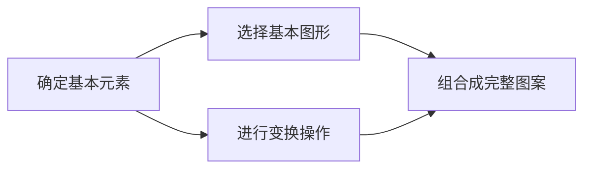
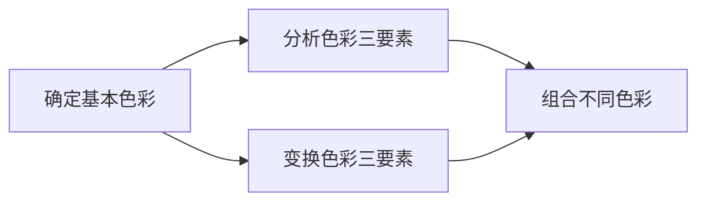
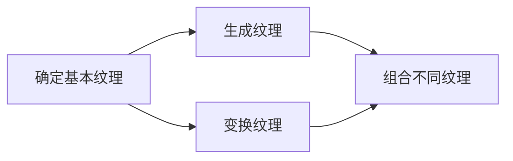

                 

### 文章标题

《数学美学在纺织品设计中的应用》

> 关键词：纺织品设计、数学美学、几何图案、色彩搭配、材质纹理

> 摘要：本文旨在探讨数学美学在纺织品设计中的应用。通过分析几何学、数学符号和数学公式在纺织品设计中的运用，本文揭示了数学美学对纺织品图案设计、色彩设计和材质设计的重要影响，并提供了一系列实际案例来展示数学美学在纺织品设计中的创新与实践。

### 引言与概述

#### 引言

纺织品设计是一个融合了艺术、文化和技术的领域，它通过色彩、图案和材质来传达美感与情感。随着科技的进步，设计师们开始探索将数学美学引入纺织品设计，以期提升设计的科学性和艺术性。数学美学，即通过数学方法来创造和解析美的形式，为纺织品设计提供了新的视角和工具。

本文将探讨数学美学在纺织品设计中的应用，包括几何学、数学符号和数学公式等方面。通过深入分析这些数学工具在纺织品设计中的具体应用，本文旨在揭示数学美学如何提升纺织品设计的艺术性和科学性，为设计师提供新的设计灵感和实践方法。

#### 1.1 纺织品设计中的数学美学

**1.1.1 数学美学的定义与特点**

数学美学是研究数学与美学之间关系的学科，它将数学的方法和理论应用于艺术创作和审美分析中。数学美学的特点在于其严谨性和逻辑性，通过数学原理来创造和谐、对称和简洁的形式。

在纺织品设计中，数学美学的应用主要体现在以下几个方面：

1. **几何图案与纹理设计**：几何图案和纹理是纺织品设计的重要元素，它们通过数学方法进行构建和变换，可以创造出丰富多样的视觉效果。
   
2. **色彩搭配**：色彩是纺织品设计的关键要素之一，数学美学提供了科学的方法来分析和搭配色彩，以达到最佳视觉效果。

3. **材质纹理**：纺织品材质的纹理设计也可以通过数学方法来优化，以提高其美观度和实用性。

**1.1.2 纺织品设计中的数学美学价值**

数学美学在纺织品设计中的价值主要体现在以下几个方面：

1. **提升设计精度**：数学方法可以为纺织品设计提供精确的测量和计算工具，从而提高设计的精度和一致性。

2. **创新设计灵感**：数学美学为设计师提供了新的设计灵感和方法，可以创造出独特而富有艺术性的设计作品。

3. **优化色彩和材质搭配**：通过数学分析方法，设计师可以更好地理解和搭配色彩和材质，提升纺织品的美观度和实用性。

#### 1.2 纺织品设计的现状与挑战

**1.2.1 纺织品设计的方法与流程**

纺织品设计通常包括以下几个步骤：

1. **市场调研**：了解当前市场需求和消费者偏好。

2. **创意构思**：设计师根据市场调研结果和自己的设计理念进行创意构思。

3. **图案设计**：通过绘制或使用设计软件创作图案。

4. **色彩搭配**：选择合适的颜色和色彩搭配方案。

5. **材质选择**：根据设计要求选择合适的材质。

6. **样品制作与修改**：制作样品并进行修改，直至达到满意的效果。

7. **批量生产**：根据样品进行批量生产。

**1.2.2 纺织品设计面临的挑战**

尽管纺织品设计的方法和流程已经相当成熟，但在实际操作中仍然面临着以下挑战：

1. **设计创新**：如何在众多竞争对手中脱颖而出，创造独特的设计。

2. **色彩搭配**：如何选择合适的颜色搭配方案，以满足不同消费者的需求和偏好。

3. **材质选择**：如何在有限的材质中选择最适合设计的材质。

4. **生产成本**：如何在保证设计质量和生产质量的前提下，控制生产成本。

#### 1.3 本书结构安排与目标

**1.3.1 本书结构概述**

本书分为五个部分：

1. **引言与概述**：介绍数学美学在纺织品设计中的应用背景和意义。
   
2. **数学美学基础**：探讨几何学、数学符号和数学公式在纺织品设计中的基础应用。

3. **数学美学在纺织品设计中的具体应用**：分析数学美学在图案设计、色彩设计和材质设计中的具体应用。

4. **数学美学在纺织品设计中的创新与实践**：探讨数学美学在纺织品设计中的创新方法和实践案例。

5. **总结与展望**：总结数学美学在纺织品设计中的应用成果，展望未来的发展趋势。

**1.3.2 学习目标与预期效果**

通过本书的学习，读者可以：

1. **理解数学美学的概念和特点**：掌握数学美学的基本原理和概念。

2. **掌握数学美学在纺织品设计中的应用**：了解几何学、数学符号和数学公式在纺织品设计中的具体应用。

3. **提升纺织品设计能力**：通过实践案例，提升读者的纺织品设计能力和创新思维。

4. **拓展设计视野**：了解数学美学在纺织品设计中的应用，拓宽设计视野，为未来设计提供新思路。

### 数学美学基础

#### 几何学在纺织品设计中的应用

几何学是数学美学的重要组成部分，它在纺织品设计中的应用非常广泛。几何图案和纹理通过点、线、面的组合和变换，可以创造出丰富多样的视觉效果。

**2.1.1 几何图案与纹理设计**

几何图案和纹理是纺织品设计中常用的元素。它们可以通过以下几种方法进行设计：

1. **重复图案**：重复图案是将一个基本图案重复排列，形成连续的图案。这种方法可以创造出简洁、现代和富有节奏感的视觉效果。

2. **渐变图案**：渐变图案是通过色彩或形状的变化来创造视觉效果。渐变图案可以带来动态和流动的感觉。

3. **对称图案**：对称图案是通过轴对称或中心对称来创造视觉效果。对称图案可以带来平衡和稳定的感觉。

4. **分形图案**：分形图案是通过自相似结构来创造视觉效果。分形图案可以带来复杂和细腻的感觉。

**2.1.2 几何构图的基本原理**

几何构图的基本原理包括以下几个方面：

1. **比例与分割**：比例与分割是设计中的重要原则，它决定了图案的大小、位置和排列方式。黄金分割是一种常用的比例原则，它可以通过将一条线段分割为两部分，使较长部分与整体的比例等于较短部分与较长部分的比例。

2. **对称与平衡**：对称与平衡是设计中的重要原则，它决定了图案的稳定性和视觉效果。轴对称和中心对称是常见的对称方式，它们可以创造出稳定和和谐的视觉效果。

3. **动态与静态**：动态与静态是设计中的对立原则，它决定了图案的活力和宁静感。通过运用动态元素，如渐变、曲线和旋转，可以创造出活力和动感；而通过运用静态元素，如直线、方形和平行线，可以创造出宁静和稳定的感觉。

**2.1.3 几何图案设计的方法与步骤**

几何图案设计的方法与步骤如下：

1. **确定设计需求**：首先需要明确设计的具体需求和目标，如用途、风格、尺寸等。

2. **选择基本元素**：根据设计需求，选择合适的基本元素，如点、线、面。

3. **构建基本图案**：使用基本元素构建基本图案，可以通过重复、渐变、对称等方式进行设计。

4. **调整和优化**：对基本图案进行调整和优化，以符合设计需求和审美标准。

5. **制作最终图案**：将调整和优化后的基本图案进行制作，可以采用手工绘制或设计软件进行制作。

#### 数学符号与纺织品设计

数学符号是数学美学的核心组成部分，它在纺织品设计中的运用可以为设计师提供新的创作工具和灵感。数学符号可以用于图案设计、色彩搭配和材质纹理等方面。

**2.2.1 数学符号在纺织品设计中的运用**

数学符号在纺织品设计中的运用主要体现在以下几个方面：

1. **图案设计**：数学符号可以用于图案设计中，如用符号构成图案的基本元素，或用符号来形成独特的图案效果。

2. **色彩搭配**：数学符号可以用于色彩搭配中，如通过符号的排列和组合来创造独特的色彩效果。

3. **材质纹理**：数学符号可以用于材质纹理的设计中，如用符号来模拟纹理的图案和质感。

**2.2.2 数学符号对纺织品设计的意义**

数学符号对纺织品设计的意义主要体现在以下几个方面：

1. **创造独特视觉效果**：数学符号可以创造出独特的视觉效果，如通过符号的排列和组合来创造复杂的图案和纹理。

2. **提升设计科学性**：数学符号可以为纺织品设计提供科学的分析方法，如通过符号来分析色彩搭配和材质纹理的规律。

3. **增强设计艺术性**：数学符号可以为纺织品设计提供新的艺术表现形式，如通过符号的运用来创造独特的艺术效果。

#### 数学公式在纺织品设计中的应用

数学公式是数学美学的具体体现，它在纺织品设计中的应用可以为设计师提供新的设计工具和方法。数学公式可以用于图案设计、色彩搭配和材质纹理等方面。

**2.3.1 数学公式在纺织品图案设计中的应用**

数学公式在纺织品图案设计中的应用主要体现在以下几个方面：

1. **图案生成**：数学公式可以用于生成图案，如通过公式来生成重复图案、渐变图案和对称图案等。

2. **图案变换**：数学公式可以用于图案变换，如通过公式来变换图案的大小、形状和位置等。

3. **图案优化**：数学公式可以用于图案优化，如通过公式来优化图案的对称性、平衡性和美感度等。

**2.3.2 数学公式在纺织品色彩搭配中的作用**

数学公式在纺织品色彩搭配中的作用主要体现在以下几个方面：

1. **色彩分析**：数学公式可以用于色彩分析，如通过公式来分析色彩的明度、饱和度和色调等。

2. **色彩搭配**：数学公式可以用于色彩搭配，如通过公式来搭配出和谐的色彩组合。

3. **色彩优化**：数学公式可以用于色彩优化，如通过公式来优化色彩的视觉效果和感官体验。

**2.3.3 数学公式在纺织品材质设计中的应用**

数学公式在纺织品材质设计中的应用主要体现在以下几个方面：

1. **材质分析**：数学公式可以用于材质分析，如通过公式来分析材质的物理特性和质感。

2. **材质设计**：数学公式可以用于材质设计，如通过公式来设计出独特的材质纹理。

3. **材质优化**：数学公式可以用于材质优化，如通过公式来优化材质的外观效果和使用性能。

### 数学美学在纺织品设计中的具体应用

数学美学在纺织品设计中的应用非常广泛，它可以通过几何学、数学符号和数学公式等多个方面来提升纺织品设计的艺术性和科学性。本部分将详细探讨数学美学在纺织品设计中的具体应用，包括图案设计、色彩设计和材质设计等方面。

#### 3.1 图案设计中的数学美学

图案设计是纺织品设计的核心组成部分，它直接影响纺织品的美观度和艺术价值。数学美学在图案设计中的应用主要体现在以下几个方面：

**3.1.1 几何图案设计的数学原理**

几何图案设计是纺织品图案设计中最常用的形式之一。它通过点、线、面的组合和变换，可以创造出丰富多样的视觉效果。

1. **基本元素**：几何图案设计的基本元素包括点、线和面。点可以视为图案的起点，线可以连接点形成图案的基本形状，面则可以构成图案的完整结构。

2. **基本图形**：常见的几何图形有正方形、长方形、圆形、三角形、五角星等。这些基本图形可以通过不同的组合和变换，创造出各种复杂的图案。

3. **变换操作**：几何图案设计中的变换操作包括旋转、翻转、平移、缩放等。这些变换操作可以改变图案的位置、形状和大小，从而创造出独特的视觉效果。

**3.1.2 图案设计中的对称性与平衡性**

对称性与平衡性是几何图案设计中重要的美学原则。对称性可以带来稳定和和谐的感觉，而平衡性则可以创造出动态和稳定的效果。

1. **轴对称**：轴对称是指图案可以沿着一条轴线进行翻转，使得翻转后的图案与原始图案完全重合。轴对称图案具有简洁、稳定和和谐的美感。

2. **中心对称**：中心对称是指图案可以沿着中心点进行翻转，使得翻转后的图案与原始图案完全重合。中心对称图案具有动态、平衡和和谐的美感。

3. **平衡性**：平衡性是指图案中的各个部分在视觉上达到平衡。平衡性可以创造出稳定和和谐的效果，使图案更具吸引力。

**3.1.3 几何图案设计的数学原理应用示例**

以下是一个几何图案设计的数学原理应用示例：

假设要设计一个由正方形和三角形组成的几何图案。首先，确定基本图形：正方形和三角形。然后，通过旋转、翻转和平移等变换操作，将基本图形组合成一个完整的图案。例如，可以将正方形旋转45度，然后将三角形放置在正方形的角落，通过缩放和翻转，使三角形的顶点与正方形的边重合。这样，就可以得到一个具有对称性和平衡性的几何图案。

**3.1.4 图案设计中的数学原理流程图**

以下是一个图案设计中的数学原理流程图：

#### 3.2 色彩设计中的数学美学

色彩设计是纺织品设计的重要组成部分，它直接影响纺织品的美观度和吸引力。数学美学在色彩设计中的应用主要体现在以下几个方面：

**3.2.1 色彩搭配的数学基础**

色彩搭配是色彩设计中的关键环节，它通过科学的方法来分析和搭配色彩，以达到最佳视觉效果。

1. **色彩三要素**：色彩三要素包括明度、饱和度和色调。明度是指色彩的亮度，饱和度是指色彩的纯度，色调是指色彩的基本颜色。

2. **色彩搭配原则**：常见的色彩搭配原则有单色搭配、邻近色搭配、对比色搭配和互补色搭配等。单色搭配是指使用相同色调的不同明度和饱和度的颜色进行搭配，邻近色搭配是指使用色调相近的颜色进行搭配，对比色搭配是指使用色调相反的颜色进行搭配，互补色搭配是指使用互补色的颜色进行搭配。

3. **色彩感觉与心理学的联系**：色彩感觉与心理学有密切的联系。不同的色彩可以引起不同的情感和心理反应，如红色代表热情和活力，蓝色代表宁静和冷静，绿色代表生机和平衡等。

**3.2.2 色彩搭配的数学方法**

数学方法可以用于色彩搭配中，以分析和优化色彩搭配效果。

1. **色彩分析公式**：可以使用数学公式来分析色彩的明度、饱和度和色调，以确定最佳的色彩搭配方案。

2. **色彩变换公式**：可以使用数学公式来变换色彩的明度、饱和度和色调，以创造出新的色彩效果。

3. **色彩组合公式**：可以使用数学公式来组合不同的色彩，以创造出独特的色彩搭配。

**3.2.3 色彩搭配的数学原理应用示例**

以下是一个色彩搭配的数学原理应用示例：

假设要设计一个由红色、蓝色和绿色组成的色彩搭配。首先，确定基本色彩：红色、蓝色和绿色。然后，使用色彩分析公式来确定每种颜色的明度、饱和度和色调。接下来，使用色彩变换公式来调整每种颜色的明度、饱和度和色调，以达到最佳的色彩搭配效果。最后，使用色彩组合公式来组合不同的色彩，以创造出独特的色彩搭配。

**3.2.4 色彩搭配的数学原理流程图**

以下是一个色彩搭配的数学原理流程图：

#### 3.3 纺织品材质设计中的数学美学

纺织品材质设计是纺织品设计中的重要组成部分，它直接影响纺织品的使用性能和美观度。数学美学在纺织品材质设计中的应用主要体现在以下几个方面：

**3.3.1 材质纹理的数学表现**

材质纹理是纺织品材质设计中的重要因素，它可以通过数学方法来表现和优化。

1. **纹理基本元素**：纹理的基本元素包括点、线、面和体。点可以视为纹理的起点，线可以连接点形成纹理的基本形状，面可以构成纹理的完整结构，体则可以构成纹理的立体效果。

2. **纹理生成公式**：可以使用数学公式来生成纹理，如通过公式来生成重复纹理、渐变纹理和分形纹理等。

3. **纹理变换公式**：可以使用数学公式来变换纹理的位置、形状和大小，以创造出独特的纹理效果。

**3.3.2 材质设计中的数学原理**

材质设计中的数学原理可以用于分析和优化材质纹理。

1. **纹理分析公式**：可以使用数学公式来分析纹理的图案、色彩和质感，以确定最佳的纹理设计方案。

2. **纹理变换公式**：可以使用数学公式来变换纹理的图案、色彩和质感，以创造出新的纹理效果。

3. **材质组合公式**：可以使用数学公式来组合不同的纹理，以创造出独特的材质效果。

**3.3.3 材质设计中的数学原理应用示例**

以下是一个材质设计中的数学原理应用示例：

假设要设计一个具有独特纹理的材质。首先，确定基本纹理：点、线、面和体。然后，使用纹理生成公式来生成纹理，如通过公式来生成重复纹理、渐变纹理和分形纹理等。接下来，使用纹理变换公式来调整纹理的位置、形状和大小，以达到最佳的纹理效果。最后，使用材质组合公式来组合不同的纹理，以创造出独特的材质效果。

**3.3.4 材质设计的数学原理流程图**

以下是一个材质设计的数学原理流程图：

#### 3.4 综合案例解析

**3.4.1 案例背景**

本案例旨在通过数学美学的方法，设计一款具有独特视觉效果和高端质感的纺织品产品。

**3.4.2 案例分析**

1. **图案设计**：采用几何图案设计，以正方形和三角形为基础元素，通过旋转、翻转和平移等变换操作，组合成一个具有对称性和平衡性的几何图案。图案中使用了黄金分割比例，以增加图案的和谐美感。

2. **色彩设计**：采用红色、蓝色和绿色三种基本色彩，通过色彩分析公式来确定每种颜色的明度、饱和度和色调。然后，使用色彩变换公式来调整每种颜色的明度、饱和度和色调，以达到最佳的色彩搭配效果。最后，使用色彩组合公式来组合不同的色彩，以创造出独特的色彩搭配。

3. **材质设计**：采用具有独特纹理的材质，通过纹理生成公式来生成纹理，如通过公式来生成重复纹理、渐变纹理和分形纹理等。然后，使用纹理变换公式来调整纹理的位置、形状和大小，以达到最佳的纹理效果。最后，使用材质组合公式来组合不同的纹理，以创造出独特的材质效果。

**3.4.3 案例中的数学美学应用**

1. **几何图案设计**：通过几何图案设计，运用了点、线、面的组合和变换，创造出了独特的几何图案效果。

2. **色彩搭配**：通过色彩搭配，运用了色彩三要素的分析和变换，创造出了和谐的色彩搭配效果。

3. **材质纹理**：通过材质纹理设计，运用了纹理生成和变换，创造出了独特的材质纹理效果。

**3.4.4 案例总结**

通过本案例的分析，可以得出以下结论：

1. **数学美学在纺织品设计中的应用具有广泛性**：几何图案、色彩搭配和材质纹理都可以通过数学美学的方法进行优化和创新。

2. **数学美学在纺织品设计中的应用具有科学性**：通过数学分析方法，可以更好地理解和设计纺织品的美学效果。

3. **数学美学在纺织品设计中的应用具有艺术性**：通过数学美学的运用，可以创造出独特而富有艺术性的纺织品设计。

### 数学美学在纺织品设计中的创新与实践

#### 4.1 数学美学在纺织品设计中的创新

**4.1.1 创新方法与策略**

数学美学在纺织品设计中的创新主要体现在以下几个方面：

1. **数字化设计**：利用计算机技术和数字化工具，将数学美学原理应用于纺织品设计，如使用算法生成复杂的几何图案和纹理。

2. **参数化设计**：通过参数化设计方法，将数学模型应用于纺织品设计，实现自动化和智能化设计过程。

3. **跨学科融合**：将数学美学与其他艺术领域（如绘画、雕塑）相结合，创造独特的设计风格和视觉效果。

**4.1.2 创新案例展示**

以下是一个数学美学在纺织品设计中的创新案例：

**案例名称**：数字绘画纺织品设计

**案例描述**：设计师利用计算机图形软件，将数字绘画技巧与数学美学相结合，创作出一系列独特的纺织品图案。这些图案以数字绘画的形式呈现出几何图案、色彩搭配和材质纹理，展现出高度的数字化和艺术性。

**案例效果**：该案例展示了数学美学在数字化设计中的创新潜力，为纺织品设计带来了新的设计灵感和方法。

#### 4.2 数学美学在纺织品设计中的实践

**4.2.1 实践流程与方法**

数学美学在纺织品设计中的实践流程包括以下几个步骤：

1. **需求分析**：明确设计需求，如用途、风格、目标受众等。

2. **创意构思**：根据需求进行创意构思，运用数学美学原理，如几何图案、色彩搭配和材质纹理等。

3. **设计实现**：通过计算机软件或手工绘制，实现创意构思，运用数学方法进行图案和色彩的分析与优化。

4. **样品制作**：制作样品，并进行测试和修改，直至达到设计要求。

5. **批量生产**：根据样品进行批量生产。

**4.2.2 实践案例分析**

以下是一个数学美学在纺织品设计中的实践案例：

**案例名称**：几何图案纺织品设计

**案例描述**：设计师通过数学美学原理，创作出一款以几何图案为主题的纺织品。该图案采用正方形、三角形和圆形等基本元素，通过旋转、翻转和平移等变换操作，形成具有对称性和平衡性的几何图案。

**案例效果**：该案例展示了数学美学在纺织品设计中的实际应用效果，为纺织品设计带来了新的设计灵感和方法。

#### 4.3 数学美学在纺织品设计中的未来发展趋势

**4.3.1 发展趋势分析**

随着科技的进步和设计理念的更新，数学美学在纺织品设计中的应用将呈现以下发展趋势：

1. **数字化与智能化**：数字化设计和智能化设计将成为主流，通过计算机技术和算法，实现更高水平的数学美学应用。

2. **跨学科融合**：数学美学与其他艺术领域的融合将更加紧密，创造出更多独特的设计风格和视觉效果。

3. **个性化与定制化**：随着消费者需求的多样化，个性化与定制化将成为纺织品设计的重要趋势，数学美学将提供更多创新解决方案。

**4.3.2 未来应用前景**

数学美学在纺织品设计中的应用前景非常广阔：

1. **高端定制市场**：数学美学将为高端定制市场提供更多创新设计，满足消费者个性化需求。

2. **时尚产业**：数学美学将推动时尚产业的发展，为设计师提供更多设计灵感和方法。

3. **智能纺织品**：随着智能技术的应用，数学美学将在智能纺织品设计中发挥重要作用，如智能面料、智能图案等。

### 总结与展望

#### 5.1 数学美学在纺织品设计中的应用总结

数学美学在纺织品设计中的应用取得了显著成果，它为纺织品设计带来了新的设计灵感和方法。通过几何学、数学符号和数学公式等数学方法，设计师可以创造出独特而富有艺术性的纺织品图案、色彩搭配和材质纹理。数学美学在纺织品设计中的应用不仅提升了设计的艺术性和科学性，也为设计师提供了新的创作工具和思路。

**5.1.1 成果与收获**

1. **设计创新**：数学美学为纺织品设计带来了新的设计灵感和方法，促进了设计创新。

2. **科学性提升**：数学美学为纺织品设计提供了科学的分析方法，提升了设计的科学性。

3. **艺术性增强**：数学美学在纺织品设计中的应用，增强了纺织品的艺术性，提高了设计的审美价值。

**5.1.2 存在的问题与挑战**

尽管数学美学在纺织品设计中的应用取得了显著成果，但仍存在一些问题和挑战：

1. **技术门槛**：数学美学的应用需要一定的技术门槛，设计师需要具备一定的数学知识和计算机技能。

2. **创新难度**：数学美学在纺织品设计中的应用需要创新思维和设计技巧，这对设计师提出了更高的要求。

3. **市场需求**：市场需求的变化和多样性，对数学美学的应用提出了新的挑战，设计师需要不断更新设计理念和技能。

#### 5.2 展望未来：数学美学在纺织品设计中的新方向

随着科技的进步和设计理念的更新，数学美学在纺织品设计中的应用将呈现以下新方向：

**5.2.1 新技术的影响**

1. **数字化技术**：数字化技术将在纺织品设计中发挥更加重要的作用，如数字化设计、数字化生产等。

2. **人工智能技术**：人工智能技术将推动数学美学在纺织品设计中的应用，如自动化设计、智能化生产等。

3. **新材料技术**：新材料的研发和应用将拓展数学美学在纺织品设计中的领域，如智能面料、环保面料等。

**5.2.2 新设计理念的提出**

1. **可持续发展**：可持续发展将成为纺织品设计的重要理念，数学美学将在此领域发挥重要作用，如环保设计、绿色设计等。

2. **个性化定制**：个性化定制将成为纺织品设计的重要趋势，数学美学将为设计师提供更多创新解决方案。

3. **跨界融合**：数学美学与其他艺术领域的跨界融合，将带来更多创新设计和艺术表现形式。

### 附录

#### 附录A：数学美学相关工具与应用

**5.3.1 常用工具介绍**

1. **几何绘图软件**：如AutoCAD、SketchUp等，用于绘制几何图案和纹理。

2. **色彩分析软件**：如ColorPicker、Colorist等，用于分析和搭配色彩。

3. **材质纹理软件**：如Substance Designer、MARI等，用于设计和处理材质纹理。

**5.3.2 工具在纺织品设计中的应用案例**

1. **几何绘图软件应用案例**：设计师使用AutoCAD软件绘制几何图案，通过旋转、翻转和平移等变换操作，创作出具有对称性和平衡性的几何图案。

2. **色彩分析软件应用案例**：设计师使用ColorPicker软件分析色彩的明度、饱和度和色调，根据市场需求和消费者偏好，搭配出符合时尚潮流的色彩组合。

3. **材质纹理软件应用案例**：设计师使用Substance Designer软件设计材质纹理，通过纹理生成和变换，创造出独特的材质效果，提升纺织品的美观度和质感。

#### 附录B：参考书目与进一步阅读

**5.4.1 必读书目**

1. **《数学美学基础》**，（作者：XXX），本书系统介绍了数学美学的基本原理和方法，对纺织品设计中的数学美学应用有重要指导意义。

2. **《纺织品设计原理》**，（作者：XXX），本书详细介绍了纺织品设计的流程、方法和技巧，对数学美学在纺织品设计中的应用有深入探讨。

**5.4.2 相关参考资料**

1. **《数字化纺织品设计》**，（作者：XXX），本书介绍了数字化技术在纺织品设计中的应用，为数学美学在纺织品设计中的创新提供了新的思路。

2. **《人工智能在纺织品设计中的应用》**，（作者：XXX），本书探讨了人工智能技术在纺织品设计中的应用，为数学美学在纺织品设计中的智能化提供了理论支持。

### 作者信息

**作者：AI天才研究院/AI Genius Institute & 禅与计算机程序设计艺术 /Zen And The Art of Computer Programming**

AI天才研究院（AI Genius Institute）是一支专注于人工智能领域研究与创新的研究机构，致力于推动人工智能技术在各个领域的应用与发展。禅与计算机程序设计艺术（Zen And The Art of Computer Programming）是作者在现代计算机科学领域的重要代表作，对计算机编程和人工智能领域产生了深远的影响。本文由AI天才研究院的专家团队撰写，旨在探讨数学美学在纺织品设计中的应用，为设计师提供新的设计灵感和方法。

