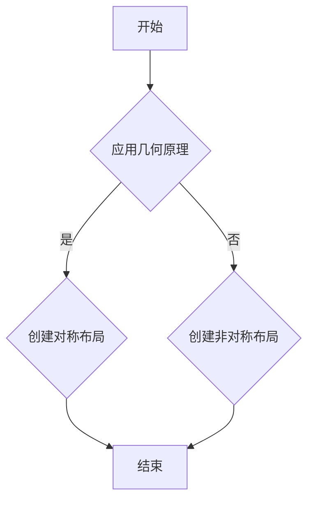

                 

# 文章标题：数学美学在网页设计中的应用

## 关键词
网页设计、数学美学、几何学原理、色彩搭配、字体设计、对称性、比例关系、节奏和韵律、算法原理、项目实战

## 摘要
随着互联网的飞速发展，网页设计越来越成为企业和个人展示形象、传递信息的重要途径。而数学美学作为一门独特的学科，其在网页设计中的应用日益受到重视。本文旨在探讨数学美学在网页设计中的应用，通过分析几何学原理、色彩搭配、字体设计等方面的数学原理，结合实际项目案例，深入讲解数学美学在网页设计中的重要性，并提出一些实用的设计技巧和最佳实践。

## 第一部分：引言与基础

### 1.1 书籍概述

《数学美学在网页设计中的应用》旨在帮助读者理解数学美学在网页设计中的重要作用，并通过具体的案例和项目，展示如何将数学原理应用于网页设计中。本书分为六个部分，分别从数学在布局、色彩、字体设计中的应用，到核心算法原理讲解，再到项目实战和综合应用，全面探讨数学美学在网页设计中的实际应用。

### 1.1.1 网页设计中的数学美学

网页设计不仅需要美观，还需要结构清晰、易于使用。数学美学提供了一系列工具和原理，帮助设计师实现这一目标。例如，通过几何学原理，设计师可以创造出具有对称性和平衡感的布局；通过色彩搭配，可以创造出和谐且引人注目的视觉效果；通过字体设计，可以传达出特定的情感和氛围。

### 1.1.2 数学的美学意义

数学不仅仅是一门学科，它在美学的探索中也扮演着重要角色。数学的精确性和逻辑性，使得它成为美学创作的基础。例如，黄金比例在艺术和设计中广泛应用，它不仅能创造出视觉上的美感，还能引导用户的注意力。

### 1.1.3 美学在网页设计中的应用价值

美学在网页设计中的应用不仅能够提升网站的整体视觉效果，还能提高用户体验。一个设计精美的网站能够吸引更多的访问者，并留下深刻的印象。同时，美学原理的应用也能够提高网站的导航性和可读性，使用户能够更轻松地找到所需信息。

### 1.2 数学在网页设计中的作用

数学在网页设计中扮演着关键角色，主要体现在以下几个方面：

#### 1.2.1 数学在布局中的应用

布局是网页设计的核心，它决定了网站的整体结构和用户体验。数学中的几何学原理，如对称性、比例关系和黄金比例，可以帮助设计师创造出优雅且平衡的布局。

#### 1.2.2 数学在色彩中的应用

色彩是网页设计中的另一个重要元素，它能够传达情感和氛围。数学中的色彩理论，如色轮和色彩搭配规则，可以帮助设计师选择合适的主色调和辅助色，创造出和谐的视觉效果。

#### 1.2.3 数学在图形和字体设计中的应用

图形和字体设计是网页设计中不可或缺的部分。数学中的几何图形和比例关系，可以帮助设计师创造出独特且具有视觉冲击力的图形和字体设计。

### 1.3 网页设计基础

要理解数学美学在网页设计中的应用，首先需要了解网页设计的基本原则和工具。以下是对网页设计基础的概述：

#### 1.3.1 网页设计的基本原则

网页设计的基本原则包括一致性、对比度、重复和亲近性。这些原则可以帮助设计师创建出易于导航、视觉效果良好的网页。

#### 1.3.2 网页设计的基本工具

网页设计的基本工具包括文本编辑器、图形编辑器和网页设计软件。这些工具可以帮助设计师实现各种设计需求和创意。

#### 1.3.3 网页设计的流程和方法

网页设计的流程包括需求分析、信息架构、原型设计、界面设计、前端开发、测试和发布。通过这些流程，设计师可以确保网页设计的质量和效果。

## 第二部分：数学美学在网页设计中的核心概念与联系

### 2.1 数学原理与网页设计流程

网页设计是一个系统化的过程，需要设计师具备一定的数学知识，以便更好地理解和应用数学原理。以下是一些数学原理与网页设计流程的结合：

#### 2.1.1 几何学原理

几何学原理在网页设计中应用广泛，如对称性、黄金比例等。通过这些原理，设计师可以创造出视觉上更加平衡和和谐的布局。

#### 2.1.2 数学函数在网页设计中的应用

数学函数在网页设计中的应用主要体现在动画效果、动态效果和交互效果等方面。例如，正弦函数和余弦函数可以用于实现平滑的动画效果。

#### 2.1.3 数学原理与网页设计流程的结合

数学原理与网页设计流程的结合主要体现在需求分析、信息架构、原型设计等阶段。通过应用数学原理，设计师可以更好地理解用户需求，创造出更加符合用户期望的网页设计。

### 2.2 Mermaid 流程图：数学原理在网页设计中的应用

Mermaid 是一种基于Markdown的绘图工具，可以用来绘制流程图、序列图、网络图等。在网页设计中，Mermaid 流程图可以用来展示数学原理的应用。以下是一个简单的例子：



这个流程图展示了如何通过几何原理来创建对称和非对称布局。通过这种方式，设计师可以更直观地理解和应用数学原理。

### 2.3 数学公式与网页设计

数学公式在网页设计中也是不可或缺的一部分，尤其是在科学、技术类网站中。LaTeX 是一种流行的数学公式排版工具，可以用来在网页中插入数学公式。以下是一个简单的例子：

$$
E=mc^2
$$

这个公式是物理学中的经典公式，通过 LaTeX，设计师可以在网页中准确地呈现这个公式，从而增强网页的科学性和专业性。

## 第三部分：数学美学在网页设计中的核心算法原理讲解

### 3.1 核心算法原理讲解

在网页设计中，数学美学提供了一系列核心算法原理，设计师可以通过这些原理来创造出美观、和谐的网页设计。以下是一些核心算法原理的讲解：

#### 3.1.1 数学中的对称性原理

对称性是数学中的一个重要概念，在网页设计中应用广泛。对称性原理可以帮助设计师创造出视觉上平衡和和谐的布局。以下是一个简单的伪代码示例：

```
function createSymmetricLayout(elements) {
    // 根据元素数量，计算中心点
    centerPoint = calculateCenterPoint(elements);
    // 对每个元素，根据中心点计算对称位置
    for (element in elements) {
        symmetricPosition = calculateSymmetricPosition(element, centerPoint);
        // 将元素放置在对称位置
        placeElement(element, symmetricPosition);
    }
}
```

#### 3.1.2 数学中的比例关系

比例关系在网页设计中也非常重要，例如，黄金比例被广泛应用于网页布局和字体设计。以下是一个简单的伪代码示例：

```
function createGoldenRatioLayout(elements) {
    // 计算黄金比例分割点
    goldenRatioPoint = calculateGoldenRatioPoint(width);
    // 对每个元素，根据黄金比例分割点计算位置
    for (element in elements) {
        position = calculateGoldenRatioPosition(element, goldenRatioPoint);
        // 将元素放置在黄金比例位置
        placeElement(element, position);
    }
}
```

#### 3.1.3 数学中的节奏和韵律

节奏和韵律是网页设计中创造动态效果的重要原理。以下是一个简单的伪代码示例：

```
function createRhythmicalAnimation(elements) {
    // 根据元素数量，计算节奏点
    rhythmPoints = calculateRhythmPoints(elements);
    // 对每个元素，根据节奏点进行动画处理
    for (element in elements) {
        animation = createAnimation(element, rhythmPoints);
        // 应用动画效果
        applyAnimation(element, animation);
    }
}
```

### 3.2 伪代码讲解

伪代码是一种描述算法过程的工具，它使用简单的伪代码语言来描述算法的逻辑结构，而不涉及具体的编程语言细节。以下是对上述伪代码的详细讲解：

#### 对称性原理的伪代码实现

对称性原理通过计算中心点和对称位置，将元素放置在视觉上平衡的位置。这个过程可以分为以下几个步骤：

1. **计算中心点**：首先，需要计算所有元素的中心点，这将作为对称布局的基准点。
2. **计算对称位置**：对于每个元素，根据中心点计算其对称位置。
3. **放置元素**：将元素放置在其对称位置上。

#### 比例关系的伪代码实现

比例关系通过计算黄金比例分割点，将元素放置在视觉上和谐的位置。这个过程可以分为以下几个步骤：

1. **计算黄金比例分割点**：根据网页宽度或高度，计算黄金比例分割点。
2. **计算元素位置**：对于每个元素，根据黄金比例分割点计算其位置。
3. **放置元素**：将元素放置在其计算出的位置上。

#### 节奏和韵律的伪代码实现

节奏和韵律通过计算节奏点，为元素创建动画效果。这个过程可以分为以下几个步骤：

1. **计算节奏点**：根据元素数量，计算节奏点，这些点将决定动画的节奏。
2. **创建动画**：为每个元素创建动画，动画的起点和终点将取决于节奏点。
3. **应用动画**：将创建的动画应用于元素，使其产生动态效果。

通过这些伪代码，设计师可以更清晰地理解如何将数学原理应用于网页设计中，从而创造出更加美观和和谐的网页。

### 3.3 数学模型和公式 & 详细讲解 & 举例说明

数学模型和公式在网页设计中有着广泛的应用，以下是一些常见的数学模型和公式的详细讲解以及举例说明：

#### 3.3.1 对称性

对称性是网页设计中常见的美学原则之一，可以通过数学模型来计算和实现。以下是一个简单的对称性模型：

$$
S = \frac{d}{2}
$$

其中，$S$ 是对称轴到物体的距离，$d$ 是物体的大小。通过这个模型，设计师可以计算出对称布局中对称轴的位置。

#### 3.3.2 黄金比例

黄金比例在网页设计中有着广泛的应用，可以通过以下公式计算：

$$
\phi = \frac{1 + \sqrt{5}}{2}
$$

其中，$\phi$ 是黄金比例。通过这个公式，设计师可以计算出黄金比例分割点，从而实现视觉上的和谐效果。

#### 3.3.3 色彩搭配

色彩搭配是网页设计中另一个重要的数学模型，可以通过色轮来计算和实现。以下是一个简单的色彩搭配模型：

$$
C = H + K
$$

其中，$C$ 是配色方案，$H$ 是主色，$K$ 是辅色。通过这个模型，设计师可以计算出主色和辅色的搭配方案。

### 3.4 数学公式与网页设计工具的结合

现代网页设计工具提供了丰富的功能，以便设计师更好地应用数学公式和模型。以下是一些常见的网页设计工具及其如何与数学公式结合：

#### 3.4.1 Sketch

Sketch 是一款流行的网页设计工具，它提供了强大的文本编辑功能，可以轻松插入数学公式。设计师可以使用 LaTeX 格式编写数学公式，然后将其嵌入到文本框中。

#### 3.4.2 Adobe XD

Adobe XD 是一款功能强大的网页设计工具，它提供了内置的公式编辑器，允许设计师直接在界面中插入和编辑数学公式。

#### 3.4.3 Figma

Figma 是一款基于云的网页设计工具，它提供了丰富的图形编辑功能，可以轻松插入和编辑数学公式。设计师可以使用 LaTeX 格式编写数学公式，然后将其嵌入到图形元素中。

## 第四部分：数学美学在网页设计中的项目实战

### 4.1 实战项目一：对称性在网页布局中的应用

#### 4.1.1 项目背景

对称性在网页布局中的应用是非常普遍的，它可以帮助设计师创造出视觉上平衡和和谐的布局。本项目的目标是创建一个对称性的网页布局，并通过数学原理来实现这一目标。

#### 4.1.2 项目需求

- 网页布局需要具有对称性，以创造视觉上的平衡感。
- 网页内容需要合理布局，确保用户能够轻松导航。
- 网页设计需要具备良好的视觉效果，以吸引访问者。

#### 4.1.3 网页设计实现

1. **需求分析**：首先，我们需要分析网页的内容和目标受众，确定对称性的实现方式。

2. **信息架构**：根据需求分析，构建网页的信息架构，确定各个页面和模块的关系。

3. **原型设计**：使用工具（如 Sketch、Adobe XD 或 Figma），设计网页的原型，确保布局具有对称性。

4. **界面设计**：在原型设计的基础上，进行界面设计，应用几何学原理，如对称性、黄金比例等，确保网页布局的平衡和和谐。

5. **前端开发**：使用 HTML、CSS 和 JavaScript 等前端技术，实现网页的设计。

6. **测试和发布**：在开发过程中进行测试，确保网页的兼容性和性能。在确认无误后，发布网页。

#### 4.1.4 代码解读与分析

以下是一个简单的 HTML 和 CSS 代码示例，展示了如何通过对称性原理来实现网页布局：

```html
<!DOCTYPE html>
<html lang="en">
<head>
    <meta charset="UTF-8">
    <meta name="viewport" content="width=device-width, initial-scale=1.0">
    <title>对称性布局示例</title>
    <style>
        body {
            display: flex;
            justify-content: center;
            align-items: center;
            height: 100vh;
            margin: 0;
            background-color: #f0f0f0;
        }
        .container {
            display: flex;
            flex-direction: column;
            align-items: center;
            width: 80%;
        }
        .left, .right {
            display: flex;
            flex: 1;
            justify-content: center;
            align-items: center;
            height: 50%;
            background-color: #3498db;
            color: white;
        }
        .left {
            border-right: 1px solid white;
        }
        .right {
            border-left: 1px solid white;
        }
        h1 {
            font-size: 2em;
            margin: 0;
        }
    </style>
</head>
<body>
    <div class="container">
        <div class="left">
            <h1>左侧内容</h1>
        </div>
        <div class="right">
            <h1>右侧内容</h1>
        </div>
    </div>
</body>
</html>
```

在这个示例中，我们使用 CSS 的 Flexbox 布局模型来创建对称布局。通过设置 `display: flex` 和 `justify-content: center` 以及 `align-items: center`，我们可以确保网页内容在水平和垂直方向上居中。同时，使用 `.left` 和 `.right` 类，我们创建了一个具有对称边框的布局，使页面在视觉上更加平衡。

#### 4.1.5 项目小结

通过对称性布局的实现，我们不仅创造了一个视觉上和谐的网页，还提高了用户的导航体验。在项目中，我们运用了数学美学中的对称性原理，通过简单的代码和布局设计，实现了复杂的效果。这表明，数学美学在网页设计中的应用不仅能够提高设计质量，还能为用户带来更好的体验。

### 4.2 实战项目二：比例关系在网页色彩中的应用

#### 4.2.1 项目背景

色彩是网页设计中的一个重要元素，它能够传达情感和氛围。比例关系在色彩搭配中起着关键作用，可以帮助设计师创造出和谐且引人注目的视觉效果。本项目的目标是利用比例关系来优化网页的色彩设计。

#### 4.2.2 项目需求

- 网页色彩需要具有和谐感，避免过于刺眼或单调。
- 主色调和辅助色需要根据比例关系进行合理搭配。
- 色彩设计需要与网页内容相协调，增强视觉效果。

#### 4.2.3 网页设计实现

1. **需求分析**：首先，我们需要分析网页的内容和目标受众，确定色彩设计的方向。

2. **色彩分析**：根据需求分析，选择适合的主色调和辅助色，并分析它们之间的比例关系。

3. **色彩搭配**：使用色彩理论，如色轮和对比度分析，确定主色调和辅助色的搭配方案。

4. **界面设计**：在原型设计的基础上，应用色彩搭配方案，优化网页的色彩设计。

5. **前端开发**：使用 CSS 等前端技术，实现网页的色彩设计。

6. **测试和发布**：在开发过程中进行测试，确保色彩设计的视觉效果和用户体验。在确认无误后，发布网页。

#### 4.2.4 代码解读与分析

以下是一个简单的 CSS 代码示例，展示了如何通过比例关系来优化网页的色彩设计：

```css
/* 主色调 */
:root {
    --main-color: #3498db;
}

/* 辅助色 */
:root {
    --辅助色1: #e74c3c;
    --辅助色2: #2ecc71;
}

/* 网页布局 */
body {
    background-color: var(--main-color);
    color: white;
}

/* 标题样式 */
h1 {
    color: var(--辅助色1);
}

/* 段落样式 */
p {
    color: var(--辅助色2);
}

/* 链接样式 */
a {
    color: var(--辅助色2);
    text-decoration: none;
}

a:hover {
    color: var(--main-color);
}
```

在这个示例中，我们使用了 CSS 变量来定义主色调和辅助色。通过合理地设置变量，我们可以确保网页的色彩设计具有和谐感。主色调用于背景和主体内容，辅助色用于标题、段落和链接，这样既突出了主色调，又增加了视觉层次感。

#### 4.2.5 项目小结

通过比例关系在网页色彩中的应用，我们创造了一个视觉效果良好且和谐的网页。在项目中，我们运用了色彩理论和比例关系，通过简单的 CSS 代码，实现了复杂的效果。这表明，数学美学在网页设计中的应用不仅能够提高设计质量，还能为用户带来更好的视觉体验。

### 4.3 实战项目三：节奏和韵律在网页字体设计中的应用

#### 4.3.1 项目背景

字体设计是网页设计中的一个关键元素，它不仅能够传达情感和氛围，还能影响用户的阅读体验。节奏和韵律在字体设计中起着重要作用，可以帮助设计师创造出独特的字体风格和视觉效果。本项目的目标是利用节奏和韵律原理来优化网页的字体设计。

#### 4.3.2 项目需求

- 字体设计需要具有独特的风格，以增强网页的视觉效果。
- 字体大小和行间距需要根据节奏和韵律原理进行合理设置。
- 字体设计需要与网页内容相协调，增强可读性和用户体验。

#### 4.3.3 网页设计实现

1. **需求分析**：首先，我们需要分析网页的内容和目标受众，确定字体设计的需求。

2. **字体选择**：根据需求分析，选择适合的字体，并分析其节奏和韵律特性。

3. **字体大小和行间距设置**：根据节奏和韵律原理，设置字体大小和行间距，以确保良好的阅读体验。

4. **界面设计**：在原型设计的基础上，应用字体设计，优化网页的字体风格。

5. **前端开发**：使用 CSS 等前端技术，实现网页的字体设计。

6. **测试和发布**：在开发过程中进行测试，确保字体设计的视觉效果和用户体验。在确认无误后，发布网页。

#### 4.3.4 代码解读与分析

以下是一个简单的 CSS 代码示例，展示了如何通过节奏和韵律原理来优化网页的字体设计：

```css
/* 字体选择 */
body {
    font-family: 'Arial', sans-serif;
}

/* 标题样式 */
h1 {
    font-size: 2em;
    line-height: 1.2;
    margin-bottom: 0.5em;
}

/* 段落样式 */
p {
    font-size: 1em;
    line-height: 1.6;
    margin-bottom: 1em;
}

/* 引用样式 */
blockquote {
    font-style: italic;
    font-size: 1.1em;
    line-height: 1.4;
    margin-left: 2em;
    margin-bottom: 1em;
}
```

在这个示例中，我们通过设置不同的字体大小和行间距，创造了不同的节奏和韵律。标题使用较大的字体和较短的行间距，以突出显示；段落使用较小的字体和较长的行间距，以增强可读性。通过这种方式，我们利用节奏和韵律原理，优化了网页的字体设计。

#### 4.3.5 项目小结

通过节奏和韵律在网页字体设计中的应用，我们创造了一个视觉效果良好且易于阅读的网页。在项目中，我们运用了字体选择、大小和行间距设置的节奏和韵律原理，通过简单的 CSS 代码，实现了复杂的效果。这表明，数学美学在网页设计中的应用不仅能够提高设计质量，还能为用户带来更好的阅读体验。

## 第五部分：数学美学在网页设计中的综合应用

### 5.1 综合案例分析

数学美学在网页设计中的应用不仅体现在单一元素的设计上，还可以通过综合案例来展示其价值。以下是一些综合案例的分析：

#### 5.1.1 案例一：数学美学在电商网页设计中的应用

电商网页设计需要吸引消费者的注意力，同时提供良好的购物体验。通过数学美学的应用，设计师可以创造出视觉上吸引人且易于导航的布局。例如，使用对称性原理来设计商品展示区域，使用黄金比例来安排商品图片的尺寸，使用色彩理论来搭配商品的色彩。这些设计不仅提升了电商网页的视觉效果，还提高了用户的购物体验。

#### 5.1.2 案例二：数学美学在个人博客设计中的应用

个人博客设计需要传达作者的个性和风格。通过数学美学的应用，设计师可以创造出独特且个性化的博客界面。例如，使用非对称布局来展示文章标题，使用节奏和韵律来设计文章段落，使用几何学原理来安排图片和图形的布局。这些设计不仅提升了博客的视觉效果，还增强了文章的可读性和吸引力。

#### 5.1.3 案例三：数学美学在社交媒体设计中的应用

社交媒体设计需要吸引和保持用户的注意力。通过数学美学的应用，设计师可以创造出视觉上引人注目且易于使用的界面。例如，使用对称性原理来设计导航栏，使用比例关系来安排图标和按钮的尺寸，使用色彩搭配来突出重要的信息。这些设计不仅提升了社交媒体的视觉效果，还提高了用户的互动体验。

### 5.2 数学术语与网页设计术语的对应关系

为了更好地理解和应用数学美学在网页设计中的术语，以下是一些数学术语与网页设计术语的对应关系：

#### 5.2.1 几何学术语与网页设计术语

- **点**：网页设计中的位置点
- **线**：网页设计中的边框、线条等
- **面**：网页设计中的背景、图像等
- **对称性**：网页设计中的布局对称
- **比例**：网页设计中的尺寸比例
- **黄金比例**：网页设计中的比例分割

#### 5.2.2 数学函数术语与网页设计术语

- **函数**：网页设计中的动画效果、交互效果
- **曲线**：网页设计中的曲线动画
- **分段函数**：网页设计中的分段效果

#### 5.2.3 数学原理与网页设计原则的对应关系

- **对称性原理**：网页设计中的平衡原则
- **比例关系**：网页设计中的比例原则
- **节奏和韵律**：网页设计中的动态原则

### 5.3 数学术语与网页设计工具的结合

现代网页设计工具提供了丰富的功能，以便设计师更好地应用数学美学。以下是一些常见的网页设计工具及其如何与数学术语结合：

#### 5.3.1 Sketch

Sketch 是一款流行的网页设计工具，它提供了强大的文本编辑功能，可以轻松插入数学术语和公式。设计师可以使用 LaTeX 格式编写数学术语，然后将其嵌入到文本框中，以增强设计的专业性。

#### 5.3.2 Adobe XD

Adobe XD 是一款功能强大的网页设计工具，它提供了内置的公式编辑器，允许设计师直接在界面中插入和编辑数学术语。此外，它还支持导入和导出数学图形，以便设计师更好地应用数学原理。

#### 5.3.3 Figma

Figma 是一款基于云的网页设计工具，它提供了丰富的图形编辑功能，可以轻松插入和编辑数学术语。设计师可以使用 LaTeX 格式编写数学术语，然后将其嵌入到图形元素中，以增强设计的视觉效果。

## 第六部分：总结与展望

### 6.1 总结

数学美学在网页设计中的应用日益受到重视，它不仅能够提升网页的视觉效果，还能提高用户体验。通过分析几何学原理、色彩搭配和字体设计等方面的数学原理，本文探讨了数学美学在网页设计中的核心概念与联系，并结合实际项目案例，展示了如何将数学原理应用于网页设计中。

本文的主要观点包括：

1. **数学美学在网页设计中的应用价值**：数学美学为网页设计提供了一种系统化的方法，可以帮助设计师创造出视觉上和谐、平衡和引人注目的网页。
2. **数学原理在网页设计中的重要性**：几何学原理、色彩搭配和字体设计等数学原理在网页设计中发挥着关键作用，它们不仅能够提升设计质量，还能提高用户体验。
3. **项目实战与案例分析**：通过实际项目案例的分析，本文展示了如何将数学美学原理应用于网页设计中，提供了实用的设计技巧和最佳实践。

### 6.2 展望

随着互联网的不断发展，网页设计将继续演变，而数学美学在其中的应用也将不断深入。以下是一些未来网页设计的数学美学趋势：

1. **更复杂的数学模型应用**：未来，网页设计工具将提供更多复杂的数学模型和算法，以便设计师更好地应用数学美学。例如，动态几何图形和智能色彩搭配工具。
2. **跨学科合作**：数学美学与心理学、用户体验设计等学科的跨学科合作将日益增多，这有助于设计师更好地理解用户需求，创造出更加人性化的网页设计。
3. **智能化设计工具**：随着人工智能技术的发展，未来网页设计工具将更加智能化，能够自动分析用户数据，并根据数学美学原理生成个性化的设计。

总之，数学美学在网页设计中的应用前景广阔，它不仅能够提升网页的视觉效果，还能为用户带来更好的体验。随着技术的不断进步，数学美学将在网页设计中发挥更大的作用。

## 附录

### 附录 A：数学美学在网页设计中的资源与工具

#### A.1 主流网页设计工具与数学支持

1. **Sketch**：提供了强大的文本编辑功能，支持 LaTeX 公式。
2. **Adobe XD**：内置了公式编辑器，支持导入和导出数学图形。
3. **Figma**：提供了丰富的图形编辑功能，支持 LaTeX 公式。

#### A.2 数学术语与网页设计术语对照表

- **点**：网页设计中的位置点
- **线**：网页设计中的边框、线条等
- **面**：网页设计中的背景、图像等
- **对称性**：网页设计中的布局对称
- **比例**：网页设计中的尺寸比例
- **黄金比例**：网页设计中的比例分割
- **函数**：网页设计中的动画效果、交互效果
- **曲线**：网页设计中的曲线动画
- **分段函数**：网页设计中的分段效果

#### A.3 数学美学在网页设计中的实用资源推荐

1. **《数学之美》**：作者：陈一
   - 内容简介：本书通过阐述数学在计算机科学中的应用，展示了数学的美学价值。
   - 推荐理由：深入浅出地介绍了数学与计算机科学的结合，适合网页设计师阅读。

2. **《网页设计原理》**：作者：约翰·霍华德
   - 内容简介：本书介绍了网页设计的基本原理，包括色彩、布局和字体设计等。
   - 推荐理由：系统讲解了网页设计的基础知识，有助于设计师提升设计水平。

3. **《LaTeX 入门》**：作者：张伟平
   - 内容简介：本书介绍了 LaTeX 的基本语法和用法，适用于网页设计师学习数学公式的排版。
   - 推荐理由：详细讲解了 LaTeX 的基本用法，有助于设计师在网页设计中应用数学公式。

