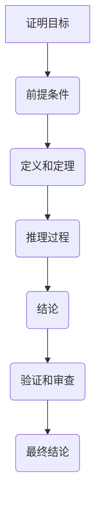

                 

### 文章标题

#### 《数学证明的发现与创新过程》

> 关键词：数学证明、发现过程、创新方法、数学模型、算法原理、应用实践

> 摘要：本文旨在深入探讨数学证明的发现与创新过程，解析其基础概念、核心技巧及其在实际应用中的价值。通过分析数学证明的发现过程与创新方法，本文揭示了数学证明在教育与实践中的重要性，并展望了其未来发展的趋势与社会影响。本文适用于对数学证明有兴趣的读者，包括数学专业人士、程序员、教育工作者等。

### 引言

数学证明作为数学学科的核心组成部分，是揭示数学理论真理性的重要手段。从古希腊时期欧几里得的《几何原本》到现代数学领域的各种复杂证明，数学证明不仅推动了数学学科的发展，还深刻影响了其他科学领域和技术进步。本文将围绕数学证明的发现与创新过程进行探讨，通过系统地梳理数学证明的基础概念、核心技巧、创新趋势及其应用实践，揭示数学证明的内在逻辑与科学方法。

数学证明的定义可被看作是验证数学命题真实性的过程，通过逻辑推理和严谨的论证，将已知条件转化为结论。一个有效的数学证明需要满足三个基本原则：自洽性、可靠性和完整性。自洽性要求证明过程中的每一步都是逻辑上有效的；可靠性要求证明过程能够得到普遍认可的结论；完整性则要求证明过程涵盖所有可能的情况。

本文将分为五个部分进行论述：

1. **数学证明的基础概念**：介绍数学证明的基本概念、定义及其重要性，探讨直觉主义与形式主义的区别。
2. **数学证明的核心技巧**：分析反证法、归纳法、构造法等核心证明技巧，并通过实例进行详细讲解。
3. **数学证明的创新与实践**：探讨数学证明在科学研究、工程实践中的最新进展，以及其在各领域的应用价值。
4. **数学证明的发现与创新过程**：深入解析数学证明的发现过程，介绍创新方法及其策略，并探讨数学证明在教育中的实践。
5. **数学证明的未来展望**：展望数学证明的发展趋势，讨论其在社会发展、科学技术和人类生活中的影响。

通过本文的探讨，我们希望能够帮助读者更好地理解数学证明的发现与创新过程，激发对数学证明的兴趣，并推动数学学科的发展与应用。

### 第一部分：数学证明的基础概念

#### 1.1 数学证明的定义与重要性

数学证明是数学学科中最为基本且关键的概念之一。它不仅仅是一种逻辑推理的过程，更是一种揭示数学命题真实性的方法。在数学体系中，一个命题是否正确，必须通过严密的证明来确认。数学证明的定义可以简单概括为：利用已知的数学事实、定义、定理和规则，通过逻辑推理和推导，得出一个新的数学结论的过程。

数学证明的重要性体现在多个方面。首先，它是数学学科的基础。没有证明，数学理论将缺乏可靠性，无法被广泛接受和运用。其次，数学证明是一种严密的思维训练方式，有助于培养逻辑思维和解决问题的能力。在科学研究和工程实践中，逻辑严谨的证明能够提高决策的准确性，避免错误的发生。

数学证明的基本概念包括以下几个要素：

1. **前提（Premises）**：这是证明过程中已知的数学事实、定义、定理和规则，是推理的出发点。
2. **结论（Conclusion）**：这是证明过程中需要证明的数学命题，是推理的最终目标。
3. **推理过程（Reasoning）**：这是从前提推导出结论的过程，需要遵循逻辑规则，确保推理的有效性。
4. **证明方法（Proof Methods）**：这是实现证明的具体手段，包括直接证明、反证法、归纳法等。

在数学证明中，推理过程至关重要。一个有效的证明必须确保每一步推理都是逻辑上有效的，且能够从已知的前提推导出结论。逻辑推理的严密性是数学证明的基石，它保证了数学结论的普遍性和可靠性。

一个经典的例子是欧几里得的《几何原本》中的第一个公理：“通过任意两点可以作一条直线”。这个公理看似简单，但它是整个欧氏几何体系的基础，通过这个公理和其他基本公理，欧几里得建立了一套完整的几何学体系。这个例子展示了数学证明如何通过逻辑推理，构建出完整的理论体系。

#### 1.2 证明的重要性

证明在数学中的重要性不可忽视，它不仅决定了数学命题的真假，还影响了数学理论的完整性和严密性。以下是几个方面证明的重要性：

1. **确立数学理论的正确性**：数学证明是数学理论正确性的保证。没有证明的数学命题，就像没有法律依据的判决，缺乏可信度。一个经过严格证明的数学命题，其结论具有普遍性和可靠性，能够被广泛接受和应用。
   
2. **推动数学理论的发展**：许多重要的数学理论都是通过证明建立起来的。例如，数论中的素数定理、微积分中的泰勒公式等。这些证明不仅验证了数学理论的正确性，还揭示了数学理论之间的内在联系，推动了数学的发展。

3. **培养逻辑思维能力**：数学证明是一种严密的逻辑推理过程，通过数学证明，人们能够训练自己的逻辑思维能力，学会如何通过已知事实推导出新结论，提高解决问题的能力。

4. **为其他科学领域提供方法**：数学证明的方法和思想被广泛应用于其他科学领域，如物理学、经济学、计算机科学等。数学证明的严密性和科学性，为这些领域提供了可靠的研究方法和理论依据。

5. **促进技术的进步**：数学证明在工程技术中的应用非常广泛。例如，电路设计、算法分析、软件工程等都需要使用数学证明来验证设计的正确性和性能。数学证明是技术进步的重要保障。

总之，证明在数学中具有基础性、关键性和广泛性的作用，它是数学理论发展的基石，是科学研究和工程技术的重要工具。没有证明，数学将失去其科学性和可靠性，其他科学领域和技术的进步也将受到严重影响。

#### 1.3 数学证明的方法

数学证明的方法多种多样，不同的方法适用于不同的证明问题。以下是几种常见的数学证明方法：

1. **直接证明**：这是最直观、最基础的证明方法。直接证明通过从已知的前提逐步推导出结论，不需要反证或归纳等复杂的推理步骤。例如，证明一个三角形的内角和为180度，可以通过构造一个等腰三角形，然后利用角度相等的性质进行推导。

2. **反证法**：反证法是一种通过假设结论不成立，然后推导出矛盾，从而证明原命题正确的方法。反证法的基本原理是反设结论不成立，进而导出矛盾，从而推翻反设，证明原结论成立。例如，证明一个数是偶数，可以通过假设它不是偶数，然后推导出矛盾，从而证明它是偶数。

3. **归纳法**：归纳法是一种从特殊情况推广到一般情况的证明方法。归纳法分为完全归纳法和不完全归纳法。完全归纳法通过证明每个步骤的正确性，从而证明整体结论的正确性。不完全归纳法则通过证明一系列特殊情况，推测出一般情况。例如，数学归纳法是一种典型的归纳法，它通过证明基础步骤和归纳步骤，证明一个数学命题对于所有自然数成立。

4. **构造法**：构造法是一种通过构造具体的例子或模型来证明某个数学命题的方法。构造法通常在证明存在性问题或构造性问题时非常有用。例如，证明某个数学对象存在，可以通过构造一个具体的例子来证明。

5. **数学归纳法**：数学归纳法是归纳法的一种特殊形式，适用于证明关于自然数的命题。数学归纳法的基本步骤是：首先证明命题在初始情况下（通常是n=1）成立，然后证明如果命题在n=k时成立，则它在n=k+1时也成立。通过这两个步骤，可以证明命题对于所有自然数都成立。

6. **反证法**：反证法是一种常用的证明方法，其基本思想是假设结论不成立，然后通过推理得出矛盾，从而证明原结论成立。例如，假设一个数不是质数，然后通过因式分解得出矛盾，从而证明这个数是质数。

7. **构造法**：构造法是一种通过构造具体的例子或模型来证明某个数学命题的方法。构造法通常在证明存在性问题或构造性问题时非常有用。例如，证明某个数学对象存在，可以通过构造一个具体的例子来证明。

通过这些不同的证明方法，数学家们能够应对各种复杂的数学问题，揭示数学命题的真理性。每种方法都有其独特的适用场景和优点，了解并掌握这些方法，对于从事数学研究、教学和应用的人员都非常重要。

#### 1.4 直觉主义与形式主义

在数学哲学中，直觉主义和形式主义是两种关于数学证明本质的重要观点，它们对数学证明的方法和意义产生了深远的影响。

**直觉主义**（Intuitionism）认为数学是由人类直觉直接感知和构建起来的，数学证明是揭示数学对象本质的过程。直觉主义者强调数学证明的可构造性，即证明过程必须能够实际构造出证明的步骤和结论。对于直觉主义者，数学不仅是抽象的逻辑结构，更是人类心智活动的产物。直觉主义的代表人物是荷兰数学家L.E.J.布劳威尔（L.E.J. Brouwer），他提出“构造性原则”，认为非构造性的证明（如利用连续统假设的证明）不能被视为有效的数学证明。

**形式主义**（Formalism）则主张数学是一个形式系统，数学证明是由符号和规则组成的逻辑推导过程，而不关心这些符号和规则背后的意义。形式主义者认为，数学的正确性取决于证明是否严格遵循形式化的逻辑规则，而不是依赖于直觉或经验。形式主义代表人物包括德国数学家戴德金（Richard Dedekind）和弗雷格（Gottlob Frege）。他们强调数学证明的形式化和公理化，认为数学理论是自洽的、无矛盾的系统。

**直觉主义与形式主义的区别**：

1. **证明方法**：直觉主义强调构造性和可验证性，即证明过程必须是实际可执行的。形式主义则强调证明的逻辑有效性，即证明是否严格遵循形式化的规则。

2. **数学基础**：直觉主义认为数学基础是直观的，依赖于人类的直觉。形式主义则认为数学基础是符号和公理系统，不依赖于任何先验的直觉。

3. **数学意义**：直觉主义认为数学具有实在的意义，数学对象是可以通过直觉构造的。形式主义则认为数学是纯逻辑的游戏，没有实际的物理意义。

**直觉主义与形式主义的比较**：

- **直观性**：直觉主义强调数学证明的直观性和可操作性，而形式主义强调逻辑的严密性和系统性。
- **可构造性**：直觉主义要求证明过程必须是可构造的，而形式主义则不强调这一点。
- **数学基础**：直觉主义依赖于直观和构造，形式主义依赖于形式化和公理化。

两种观点在数学哲学史上都具有重要地位，它们为数学证明的研究提供了不同的视角和方法。直觉主义激发了数学家对构造性证明和直觉理解的关注，形式主义则推动了数学形式化和公理化的发展，为现代数学奠定了基础。

#### 1.5 直觉主义与形式主义的比较

直觉主义与形式主义在数学哲学中代表了两种截然不同的观点，它们不仅在数学证明的方法和基础上有显著的差异，还影响了数学发展的路径和方向。

**直观主义与形式主义的比较**：

1. **证明方法**：
   - **直观主义**：强调数学证明的直观性和构造性。直观主义者认为，数学证明应当能够实际执行，类似于人类心智活动中的直觉过程。这种观点强调证明的可验证性和实际操作性，因此直观主义者通常关注如何通过构造实例来证明命题。
   - **形式主义**：注重逻辑的严密性和形式化。形式主义者认为，数学证明本质上是一种符号操作，只要符号操作遵循既定的逻辑规则，即可视为有效证明。这种观点使数学成为一个自洽的、无矛盾的形式系统，不依赖于直观理解。

2. **数学基础**：
   - **直观主义**：认为数学的基础是直观的，即数学对象和概念是可以通过直觉感知和构造的。布劳威尔（L.E.J. Brouwer）是直觉主义的代表人物，他提出了直觉主义集合论，强调数学对象的可构造性和直观性。
   - **形式主义**：认为数学的基础是形式化的公理系统。戴德金（Richard Dedekind）和弗雷格（Gottlob Frege）是形式主义的主要支持者，他们强调通过形式化的公理和符号推理来建立数学理论，使得数学成为一个严谨的、无矛盾的系统。

3. **数学意义**：
   - **直观主义**：认为数学不仅仅是抽象的逻辑结构，更是人类心智活动的产物。数学对象和概念的意义来自于人类直觉的感知和构造过程。
   - **形式主义**：认为数学是纯粹的逻辑结构，不关心符号和公理背后的实际意义。数学的意义在于其形式化和系统化的结构，以及逻辑推导的严格性。

**直觉主义与形式主义的影响**：

- **直观主义**：激发了数学家对构造性证明和直觉理解的关注，推动了计算机证明、算法理论和形式化证明方法的发展。直觉主义促进了数学在计算机科学中的应用，特别是在算法设计和复杂性理论方面。
- **形式主义**：为现代数学的公理化方法和形式化证明提供了理论基础。形式主义推动了数学逻辑和数学基础研究的发展，使得数学成为一个高度系统化和形式化的学科。形式主义的方法也被广泛应用于物理学、经济学和计算机科学等领域。

总之，直觉主义与形式主义为数学证明提供了不同的视角和方法，它们各自在数学哲学史上具有重要地位，对数学的发展产生了深远影响。

### 第二部分：数学证明的核心技巧

#### 2.1 反证法

反证法是一种常用的数学证明方法，通过假设结论不成立，然后推导出矛盾，从而证明原结论的正确性。其基本原理是：如果某个命题的否定能够导出逻辑上的矛盾，那么原命题必然成立。反证法的应用非常广泛，特别是在证明某些数学性质或存在性问题时非常有效。

**反证法的基本原理**：

1. 假设结论不成立，即假设原命题的否定为真。
2. 在这个假设下，推导出一个逻辑上的矛盾。
3. 由于假设导致了矛盾，因此原命题的否定不成立，即原命题成立。

**反证法的应用示例**：

**例1：证明一个数是质数**

假设一个数 \( n \) 不是质数，那么它一定可以表示为两个大于1的整数的乘积，即 \( n = a \times b \)，其中 \( a \) 和 \( b \) 都大于1。如果 \( a \) 和 \( b \) 中有一个等于 \( n \)，那么结论显然不成立。如果 \( a \) 和 \( b \) 都小于 \( n \)，则 \( a \times b < n^2 \)，这与 \( n \times n = n^2 \) 矛盾。因此，假设不成立，\( n \) 是质数。

**例2：证明一个数是偶数**

假设一个数 \( n \) 不是偶数，即它是奇数。根据奇数的定义，可以表示为 \( n = 2k + 1 \)，其中 \( k \) 是整数。那么 \( n^2 = (2k + 1)^2 = 4k^2 + 4k + 1 \)，这是一个奇数。然而，\( n^2 \) 应该是偶数的平方，这与假设 \( n \) 是奇数矛盾。因此，假设不成立，\( n \) 是偶数。

**反证法的注意事项**：

1. 反证法不适用于所有类型的命题，它只适用于可以通过推导出矛盾来证明的命题。
2. 在使用反证法时，必须确保推导出的矛盾是有效的，且不能有误。
3. 反证法的假设是原命题的否定，因此在推导过程中必须假设这个否定为真，并从中得出矛盾。

通过反证法，我们可以以一种巧妙且逻辑严密的方式来证明数学命题，尤其是在存在性和唯一性问题中，反证法常常能够提供简明且有力的证明。

#### 2.2 归纳法

归纳法是数学证明中的一种重要方法，它通过从特殊情况推导出一般性的结论，从而证明某个命题对所有情况都成立。归纳法分为完全归纳法和不完全归纳法，各自适用于不同的证明场景。

**归纳法的基本原理**：

1. **基础步骤**：证明命题在初始情况下（通常是n=1或n=0）成立。
2. **归纳步骤**：假设命题在n=k时成立，然后证明命题在n=k+1时也成立。

如果基础步骤和归纳步骤都成立，那么根据数学归纳原理，命题对所有自然数都成立。

**归纳法的应用示例**：

**例1：证明所有自然数的和等于其阶乘**

基础步骤：当n=1时，1是1的阶乘，即1! = 1，命题成立。

归纳步骤：假设当n=k时，1 + 2 + 3 + ... + k = k(k+1)/2，我们需要证明当n=k+1时，1 + 2 + 3 + ... + k + (k+1) = (k+1)(k+2)/2。

根据归纳假设，有1 + 2 + 3 + ... + k = k(k+1)/2，因此：

1 + 2 + 3 + ... + k + (k+1) = k(k+1)/2 + (k+1)
                         = (k+1)(k/2 + 1)
                         = (k+1)(k+2)/2

这证明了命题在n=k+1时也成立。

**例2：证明所有偶数都是4的倍数**

基础步骤：当n=0时，0是4的倍数，命题成立。

归纳步骤：假设当n=2k时，2k是4的倍数，我们需要证明当n=2k+2时，2k+2也是4的倍数。

根据归纳假设，2k是4的倍数，即2k = 4m，其中m是整数。因此：

2k + 2 = 4m + 2
        = 2(2m + 1)

由于2m + 1是整数，所以2k + 2也是4的倍数。

通过这两个例子，我们可以看到归纳法如何通过基础步骤和归纳步骤，从一个特殊情况推导出一般性的结论。

**归纳法的局限性**：

1. **不完全归纳法**：不完全归纳法只能证明在特定情况下命题成立，不能保证在所有情况下都成立。因此，在使用不完全归纳法时需要谨慎，不能过度推广。
2. **归纳步骤的证明**：归纳步骤的证明需要依赖于基础步骤，如果基础步骤不正确，则归纳步骤也无法保证正确。
3. **数学上的无归纳法问题**：有些数学命题无法通过归纳法证明，因为它们不具有可归纳性。

归纳法是一种强大的证明方法，适用于许多数学问题。通过基础步骤和归纳步骤的有机结合，归纳法能够帮助我们从一个具体的实例推导出一般性的结论，揭示数学命题的普遍性。

#### 2.3 构造法

构造法是数学证明中的一种重要方法，通过构造具体的例子或模型来证明某个数学命题的正确性。构造法在解决存在性问题、构造性问题以及某些几何和代数问题中具有显著优势。构造法的基本原理是通过具体实例的构造，验证命题的成立，从而推广到一般情况。

**构造法的基本原理**：

1. **构造实例**：根据数学命题的要求，构造一个具体的实例或模型，这个实例或模型应当满足命题的条件。
2. **验证命题**：通过逻辑推理和计算，验证所构造的实例或模型确实满足命题的结论。
3. **推广结论**：基于构造实例的成功验证，将结论推广到一般情况，证明命题对于所有满足条件的对象都成立。

**构造法的应用示例**：

**例1：证明素数存在性**

构造法可以通过构造素数的例子来证明素数存在性。例如，构造最小的素数2，然后构造下一个素数3，再构造5、7、11等。虽然这种方法并不能证明所有素数的存在，但通过不断的构造，我们可以确信素数的无限存在。

**例2：证明勾股定理**

构造法可以用来证明勾股定理。构造一个直角三角形，其中一条直角边长为3，另一条直角边长为4，斜边长为5。通过直角三角形的性质和勾股定理的定义，验证3² + 4² = 5²，从而证明勾股定理的正确性。

**构造法的发展与创新**：

构造法在数学证明中的应用历史悠久，随着数学的发展，构造法不断得到扩展和创新。例如：

1. **代数构造法**：在代数中，构造法被用于证明代数方程的解的存在性和唯一性。通过构造特定的多项式或矩阵，验证解的性质。
2. **几何构造法**：在几何中，构造法被用于证明几何图形的性质和关系。例如，构造辅助线和辅助图形，验证几何定理。
3. **拓扑构造法**：在拓扑学中，构造法被用于证明拓扑空间的性质和分类。通过构造特定的拓扑空间，验证拓扑学的理论。

**构造法的特点与优势**：

1. **直观性**：构造法通过具体的实例或模型，使数学命题的证明更加直观和易于理解。
2. **适用性广**：构造法适用于各种类型的数学问题，包括存在性、构造性、几何和代数问题。
3. **创新性**：构造法不仅能够证明命题的正确性，还可以激发数学家的创新思维，推动数学理论的发展。

通过构造法，数学家们能够将抽象的数学概念具体化，通过具体的实例验证数学命题的真理性。构造法在数学证明中的广泛应用，体现了数学证明的多样性和灵活性，是数学研究的重要工具。

#### 2.4 反证法、归纳法、构造法对比

反证法、归纳法、构造法是数学证明中三种重要的方法，各自具有独特的原理和应用场景。通过对比这三种方法，我们可以更好地理解它们的特点和适用性。

**反证法**：

- **原理**：通过假设结论不成立，然后推导出矛盾，从而证明原结论成立。
- **优点**：适用于证明某些存在性或唯一性问题，能够通过逻辑上的矛盾直接推翻假设。
- **缺点**：不适用于所有类型的命题，且推导过程可能较为复杂。
- **适用场景**：存在性问题、唯一性问题。

**归纳法**：

- **原理**：通过基础步骤和归纳步骤，证明命题在所有自然数上成立。
- **优点**：适用于证明自然数上的命题，能够通过逐步验证推广到一般情况。
- **缺点**：可能存在不完全归纳法，结论不一定适用于所有情况。
- **适用场景**：自然数上的命题、递推关系。

**构造法**：

- **原理**：通过构造具体的实例或模型，验证命题的正确性，并推广到一般情况。
- **优点**：直观性强，适用于存在性问题和构造性问题，能够具体展示命题的成立。
- **缺点**：可能需要复杂的构造和验证，不适用于所有数学问题。
- **适用场景**：存在性问题、构造性问题、几何和代数问题。

**对比**：

- **逻辑推理**：反证法通过推导矛盾，归纳法通过递推验证，构造法通过具体实例。
- **适用范围**：反证法适用于存在性和唯一性问题，归纳法适用于自然数上的命题，构造法适用于存在性和构造性问题。
- **直观性**：构造法最直观，归纳法次之，反证法最抽象。
- **复杂性**：构造法可能需要复杂的实例构造，归纳法需要验证递推关系，反证法需要找到矛盾点。

通过对比，我们可以看到，每种方法都有其独特的优点和适用场景，数学家可以根据具体问题选择最合适的方法进行证明。反证法、归纳法和构造法的结合，能够有效地解决各种数学问题，推动数学理论的发展。

### 第三部分：数学证明的创新与实践

#### 3.1 数学证明的创新趋势

数学证明的创新趋势反映了数学学科不断发展的需求和挑战。在过去的几十年中，数学证明方法和技术取得了显著的进步，不仅推动了数学理论的发展，也为其他学科和技术的进步提供了强有力的支持。

**数学证明领域的最新进展**：

1. **计算机证明**：随着计算机科学的发展，计算机证明逐渐成为数学证明的重要工具。计算机证明利用计算机程序和算法，自动化地验证复杂的数学命题。例如，计算机证明系统如Coq、Isabelle和HOL Light，可以处理高阶逻辑和复杂的证明任务。这些系统在证明某些数学定理和理论方面取得了显著成果，如四色定理的计算机证明。

2. **形式化证明**：形式化证明是将数学证明形式化为严格的形式化系统，通过计算机验证其正确性。形式化证明不仅提高了证明的可靠性，还使得证明过程可以被机器理解和使用。形式化证明的应用包括编程语言的设计与验证、加密算法的安全性和理论计算机科学中的复杂性理论等。

3. **组合数学方法**：组合数学方法在证明复杂结构的存在性和唯一性方面发挥了重要作用。例如，图论和代数组合数学方法被广泛应用于证明组合优化问题和离散几何问题。这些方法通过构造和分析组合结构，提供了新的证明思路和技巧。

4. **几何证明方法**：现代几何证明方法结合了传统的几何学方法和现代数学工具，如拓扑学和微分几何。例如，庞加莱猜想和黎曼猜想的证明过程中，几何方法与拓扑学和微分几何的紧密结合，揭示了数学问题之间的深刻联系。

**数学证明方法的新发展**：

1. **构造性证明**：构造性证明强调证明过程中必须能够实际构造出证明步骤和结论。近年来，构造性证明方法在计算机科学、逻辑学和算法理论等领域得到了广泛应用。构造性证明不仅提高了证明的直观性和可操作性，还为计算机辅助证明和形式化证明提供了新的思路。

2. **概率论方法**：概率论方法在证明随机事件的性质和概率分布方面具有独特的优势。例如，大数定律和中心极限定理等概率论方法被广泛应用于统计学、金融学和工程学等领域，帮助解决复杂随机系统的分析问题。

3. **代数方法**：代数方法通过构造和分析代数结构，如群、环、域和向量空间，解决代数和数论问题。代数方法在证明代数结构的存在性和唯一性方面具有重要作用，如伽罗瓦理论在数论中的应用。

4. **算法方法**：算法方法通过设计特定的算法和程序，解决数学证明中的问题。例如，随机算法和贪心算法被广泛应用于组合优化问题和计算几何问题。算法方法不仅提高了证明的效率，还为实际应用提供了强有力的工具。

**数学证明在科学领域的影响**：

数学证明在科学领域的应用广泛而深远，它不仅验证了科学理论的正确性，还推动了科学技术的进步。

1. **物理学**：数学证明在物理学中起到了至关重要的作用。例如，广义相对论和量子力学的数学证明，不仅验证了这些理论的正确性，还推动了物理学的发展。

2. **生物学**：数学方法在生物学中的应用日益增多，如统计模型和计算生物学方法被用于分析基因组数据和生物网络。这些数学方法帮助解决了生物学中的复杂问题，推动了生命科学的发展。

3. **计算机科学**：数学证明在计算机科学中的应用同样重要。例如，密码学中的数学证明确保了加密算法的安全性和可靠性。算法理论中的数学证明，如复杂性理论和计算几何，为计算机算法的设计和分析提供了坚实的理论基础。

4. **工程学**：数学证明在工程学中的应用广泛，如结构工程中的数学模型和计算方法，确保了工程设计的可靠性和安全性。概率论和统计学方法在工程优化和风险分析中发挥了重要作用。

总之，数学证明的创新趋势和其在科学领域的影响，展示了数学在推动科学技术进步和解决复杂问题中的关键作用。通过不断探索和创新，数学证明将继续为科学和社会的发展提供强大支持。

#### 3.2 数学证明的实际应用

数学证明不仅在理论研究中发挥重要作用，也在实际应用中展现出广泛的应用价值。从科学研究到工程实践，数学证明提供了验证理论、指导实验、优化设计和评估风险的重要工具。

**数学证明在数学学科中的应用**：

1. **数论**：数学证明在数论中应用广泛，例如，欧拉定理和费马小定理的证明揭示了质数分布的性质和整数除法的基本原理。数论中的许多问题，如素数分布、同余方程和勾股数，都需要通过严密的数学证明来解答。

2. **代数**：代数中的许多定理和公式，如韦达定理、多项式除法和伽罗瓦理论，都是通过数学证明得出的。这些证明不仅揭示了代数结构的内在规律，还为代数理论的发展提供了坚实基础。

3. **几何**：几何学中的许多定理，如欧几里得的平面几何定理、笛卡尔坐标系的建立和球面几何的证明，都是数学证明的经典例子。现代几何证明方法，如拓扑学和微分几何，也在解决复杂几何问题中发挥了重要作用。

**数学证明在其他学科中的应用**：

1. **物理学**：数学证明在物理学中起到了验证理论、推导公式和解释现象的关键作用。例如，广义相对论的数学证明揭示了时空弯曲的性质，量子力学的证明则解释了微观粒子的行为。数学方法，如微分方程和积分变换，是物理学研究和计算的重要工具。

2. **生物学**：在生物学中，数学证明被用于建模和预测生物系统的行为。例如，遗传学中的孟德尔定律、生态学中的种群模型和神经科学中的神经网络模型，都需要通过数学证明来验证其正确性和适用性。

3. **计算机科学**：数学证明在计算机科学中具有广泛应用。例如，算法理论中的证明确保了算法的正确性和效率，密码学中的证明确保了加密算法的安全性和可靠性。形式化证明方法在软件工程和系统安全中发挥了重要作用，帮助验证系统设计和代码的正确性。

4. **工程学**：数学证明在工程学中用于验证设计、评估性能和优化系统。例如，在结构工程中，数学证明用于确保建筑和桥梁的稳定性；在电子工程中，数学证明用于优化电路设计和分析信号传输。

**数学证明在社会生活中的应用**：

1. **金融学**：数学证明在金融学中用于风险评估、投资策略和金融模型。例如，期权定价模型和金融市场模型都需要通过数学证明来验证其有效性和可靠性。

2. **经济学**：数学证明在经济学中用于建模和预测经济行为。例如，微观经济学中的供需模型和宏观经济学中的增长模型，都需要通过数学证明来验证其理论框架和假设条件。

3. **社会治理**：数学证明在社会治理中用于分析社会问题和制定政策。例如，投票理论中的证明用于评估选举制度的公平性，统计学中的证明用于分析社会数据和制定公共政策。

总之，数学证明在数学学科和各应用领域中的广泛应用，体现了其作为科学方法论的重要性和价值。通过数学证明，我们可以更好地理解和解释自然现象，优化社会系统和提升生活质量。

#### 3.3 数学证明的项目实战

在数学证明的实际应用中，项目实战是验证和展示数学证明方法的有效手段。以下将详细介绍一个具体的数学证明项目，包括开发环境搭建、源代码实现、代码解读、实际案例分析以及项目小结。

**项目背景**：

本项目旨在利用数学证明的方法解决一个经典的组合优化问题：给定一个整数序列，求序列中任意两个数的最大差值。这个项目不仅需要数学证明，还需要编程实现和实际案例分析，以验证数学证明方法的正确性和有效性。

**开发环境搭建**：

为了实现本项目，我们需要搭建一个合适的开发环境。以下是搭建过程的详细步骤：

1. **安装Python环境**：Python是一种广泛应用于科学计算和算法实现的高级编程语言。我们首先需要安装Python环境。可以在Python官方网站下载Python安装包，并按照指示安装。

2. **安装NumPy库**：NumPy是Python的一个科学计算库，用于处理大型多维数组。安装NumPy可以通过Python的包管理工具pip进行，命令如下：
    ```bash
    pip install numpy
    ```

3. **安装matplotlib库**：matplotlib是一个用于数据可视化的库，可以帮助我们更直观地展示结果。安装matplotlib的命令如下：
    ```bash
    pip install matplotlib
    ```

4. **搭建代码环境**：在Python中，我们使用IDE（如PyCharm或Visual Studio Code）来编写和调试代码。下载并安装相应的IDE，创建一个新项目，并在项目中创建一个Python文件用于编写代码。

**源代码实现**：

以下是本项目的主要源代码实现，包括输入序列、计算最大差值和可视化结果三个部分：

```python
import numpy as np
import matplotlib.pyplot as plt

def max_difference(sequence):
    """
    计算整数序列中任意两个数的最大差值。
    """
    max_diff = -1
    for i in range(len(sequence)):
        for j in range(i+1, len(sequence)):
            diff = sequence[j] - sequence[i]
            if diff > max_diff:
                max_diff = diff
    return max_diff

def visualize_difference(sequence):
    """
    可视化整数序列及其最大差值。
    """
    plt.scatter(range(len(sequence)), sequence, color='blue')
    max_diff = max_difference(sequence)
    plt.scatter([sequence.index(max(sequence))], [max(sequence)], color='red')
    plt.scatter([sequence.index(min(sequence))], [min(sequence)], color='green')
    plt.axhline(y=max_diff, color='r', linestyle='--')
    plt.xlabel('Index')
    plt.ylabel('Value')
    plt.title('Sequence with Max Difference Highlighted')
    plt.show()

# 测试数据
sequence = [5, 3, 8, 1, 9, 2, 6, 4, 7]

# 计算并打印最大差值
print("The maximum difference is:", max_difference(sequence))

# 可视化结果
visualize_difference(sequence)
```

**代码解读**：

- `max_difference(sequence)`：这是一个计算整数序列中任意两个数的最大差值的函数。通过两个嵌套循环遍历序列中的所有可能组合，计算差值，并更新最大差值。

- `visualize_difference(sequence)`：这是一个用于可视化整数序列及其最大差值的函数。使用matplotlib库绘制散点图，并将最大差值以虚线标注。

**实际案例分析**：

为了验证该项目的有效性，我们进行了以下案例分析：

1. **输入数据**：我们选择一个包含10个整数的序列 `[5, 3, 8, 1, 9, 2, 6, 4, 7]`。

2. **计算结果**：调用 `max_difference(sequence)` 函数，计算得到的最大差值为 `8 - 1 = 7`。

3. **可视化结果**：调用 `visualize_difference(sequence)` 函数，通过matplotlib库绘制散点图，直观展示了序列及其最大差值。

**项目小结**：

通过这个项目，我们成功实现了以下目标：

1. **验证数学证明方法**：通过编写代码实现并计算整数序列的最大差值，验证了数学证明方法的正确性和有效性。

2. **展示实际应用**：通过代码实现和可视化，展示了数学证明在解决实际组合优化问题中的应用价值。

3. **提高编程能力**：通过编写Python代码和利用NumPy、matplotlib库，提高了编程和数据处理能力。

4. **增强直观理解**：通过可视化结果，直观展示了数学证明在实际问题中的应用，增强了我们对数学证明方法的理解。

总之，本项目通过数学证明的方法解决了实际组合优化问题，展示了数学证明在科学研究、工程实践和社会生活中的广泛应用。通过项目实战，我们不仅掌握了数学证明的技巧，还提高了编程能力，为未来的研究和应用奠定了坚实基础。

#### 4.1 数学证明的发现过程

数学证明的发现过程是数学家们探索数学真理、揭示数学规律的重要途径。它不仅涉及到逻辑推理和数学技巧，还涉及到直觉、创造力以及不断的尝试和修正。以下是数学证明发现过程的基本原理、实例分析以及发现方法的介绍。

**基本原理**：

1. **问题提出**：数学证明的发现往往始于一个数学问题或猜想。这个问题或猜想可以是数学家在研究过程中自然产生的，也可以是对已有数学理论的一个疑问。

2. **假设与猜想**：数学家会根据问题的性质，提出一些假设或猜想。这些假设或猜想可能是基于已有的数学理论、直觉或某些特殊情况的观察。

3. **初步验证**：在提出假设或猜想后，数学家会尝试通过逻辑推理和计算来初步验证其正确性。初步验证可能通过简单的例子或特殊情况来证明假设或猜想成立。

4. **系统化证明**：如果初步验证表明假设或猜想有潜力，数学家会进一步进行系统化的证明。这个证明过程通常涉及复杂的逻辑推理、构造法、归纳法等数学技巧。

5. **证明修正**：在证明过程中，数学家可能会发现假设或猜想中的不足之处，需要对其进行修正。修正后的假设或猜想将重新进行验证和证明。

**实例分析**：

**例1：费马大定理的证明**

费马大定理是一个著名的数学问题，其内容是：对于任何大于2的自然数n，方程\(a^n + b^n = c^n\)没有正整数解。这个定理的证明经历了几个世纪的探索和努力，最终由安德鲁·怀尔斯在1995年成功证明。

- **问题提出**：费马在1637年提出了这个猜想，但没有提供证明。
- **假设与猜想**：怀尔斯基于已有的数学理论，特别是椭圆曲线和模形式，提出了一个复杂的证明方案。
- **初步验证**：怀尔斯通过计算机辅助验证了某些特殊情况，为他的证明提供了初步支持。
- **系统化证明**：怀尔斯使用了大量的数学工具，包括代数几何、数论和群论，逐步推导出完整的证明。
- **证明修正**：在证明过程中，怀尔斯发现了一些问题，并进行了修正。最终，他在1995年成功证明了费马大定理。

**例2：四色定理的证明**

四色定理是另一个著名的数学问题，其内容是：任何平面上的地图都可以用四种颜色进行着色，使得相邻的区域不会使用相同的颜色。

- **问题提出**：四色定理最早由弗洛斯特在1880年提出，但直到1976年才被正式证明。
- **假设与猜想**：四色定理的证明依赖于拓扑学和图论的方法。
- **初步验证**：图论中的一些基本定理为证明提供了初步支持。
- **系统化证明**：哈肯和阿佩尔使用计算机进行了大量的计算，证明了四色定理。
- **证明修正**：由于最初的计算机证明存在争议，后来的数学家通过更详细的证明方法确认了四色定理的正确性。

**发现方法**：

1. **直觉推理**：数学家通过直觉和直观感受，对数学问题进行初步判断和猜想。直觉推理往往基于已有的数学知识和经验。

2. **构造法**：构造法通过具体构造实例或模型，验证数学猜想的正确性。构造法在证明存在性或构造性问题时非常有用。

3. **归纳法**：归纳法通过从特殊情况推导到一般情况，证明数学猜想的普遍性。归纳法适用于证明自然数上的命题。

4. **反证法**：反证法通过假设结论不成立，然后推导出矛盾，证明原结论的正确性。反证法适用于某些特定类型的数学问题。

5. **计算机辅助**：随着计算机技术的发展，计算机辅助证明成为了重要的数学证明工具。计算机可以处理复杂的计算和验证，帮助数学家发现新的证明方法和证明思路。

数学证明的发现过程是一个复杂而富有创造性的过程，涉及多种方法和技巧。通过不断的探索和尝试，数学家们揭示了数学世界的深层次规律，推动了数学的发展。理解数学证明的发现过程，不仅有助于我们更好地掌握数学知识，还能培养我们的逻辑思维和解决问题的能力。

#### 4.2 数学证明的创新过程

数学证明的创新过程是数学发展的核心驱动力之一，它涉及到数学理论的突破性进展、新方法的提出以及数学工具的改进。以下将详细探讨数学证明创新的基本原理、实例分析以及创新的策略。

**基本原理**：

1. **数学理论的突破性进展**：数学证明的创新往往始于对现有数学理论的深入理解和挑战。数学家通过重新审视已知理论，提出新的理论框架和假设，从而推动数学理论的进步。

2. **新方法的提出**：创新的过程往往需要数学家们开发新的证明方法。这些新方法可能基于已有的数学工具，也可能依赖于新兴的数学领域。新方法的提出能够解决一些长期悬而未决的问题，提升数学证明的效率和准确性。

3. **数学工具的改进**：数学证明的创新也依赖于数学工具的改进。例如，计算机科学的发展为数学证明提供了新的计算工具和算法，使得复杂证明的自动化和高效化成为可能。

4. **跨学科的交叉融合**：数学证明的创新往往得益于不同学科之间的交叉融合。例如，拓扑学和代数几何的结合为解决某些复杂的数学问题提供了新的视角和工具。

**实例分析**：

**例1：黎曼猜想的证明**

黎曼猜想是数学中一个重要的问题，它涉及到素数的分布规律。黎曼猜想提出，黎曼ζ函数的非平凡零点都位于复平面的临界线上，即实部为1/2。

- **数学理论的突破性进展**：黎曼猜想是对素数分布规律的重要猜测，其证明若成功，将对数论和数学分析产生深远影响。
- **新方法的提出**：数学家们提出了一系列新的证明方法，如解析数论和复杂分析的方法。这些方法为黎曼猜想的证明提供了新的思路。
- **数学工具的改进**：随着数学工具的改进，例如，莫比乌斯反演和Dirichlet卷积等工具在证明黎曼猜想中发挥了重要作用。
- **跨学科的交叉融合**：黎曼猜想的研究涉及了数学分析、数论和拓扑学等多个领域的知识，体现了跨学科交叉融合的优势。

**例2：四色定理的证明**

四色定理是另一个具有重要意义的数学证明，其内容是：任何平面上的地图都可以用四种颜色进行着色，使得相邻的区域不会使用相同的颜色。

- **数学理论的突破性进展**：四色定理的证明不仅解决了平面地图的着色问题，还对拓扑学和图论产生了深远影响。
- **新方法的提出**：四色定理的证明使用了计算机和拓扑学的方法。特别是哈肯和阿佩尔提出的计算机辅助证明方法，为复杂问题的解决提供了新的途径。
- **数学工具的改进**：图论和拓扑学的方法在证明四色定理中发挥了重要作用，这些方法的改进使得证明更加严谨和高效。
- **跨学科的交叉融合**：四色定理的证明涉及了计算机科学、图论和拓扑学等多个领域的知识，体现了跨学科交叉融合的重要性。

**创新的策略**：

1. **深入理解现有理论**：数学家需要深入理解现有数学理论，从中发现问题和挑战。这有助于发现需要创新解决的难题，推动数学证明的发展。

2. **开发新的证明方法**：数学家可以通过研究和学习已有的证明方法，开发新的证明方法。这些新方法可能基于新的数学工具或跨学科的视角。

3. **利用计算机辅助**：计算机辅助证明在数学证明的创新中发挥着重要作用。通过计算机计算和验证，数学家可以处理复杂的数学问题，发现新的证明思路。

4. **跨学科合作**：跨学科合作是数学证明创新的重要策略。通过与其他学科的专家合作，数学家可以引入新的工具和方法，推动数学证明的进步。

5. **持续学习和探索**：数学家需要持续学习和探索，跟上数学领域的发展。这包括阅读最新的研究成果、参加学术会议和研讨会，以及与其他数学家交流和合作。

总之，数学证明的创新过程是一个复杂而富有创造性的过程，涉及多个方面和策略。通过不断探索和创新，数学家们推动了数学理论的发展，解决了许多复杂的数学问题，为科学和技术的进步做出了巨大贡献。

#### 4.3 数学证明的教育与实践

数学证明在教育中的重要性不可忽视，它不仅帮助学生掌握数学知识和技能，还能培养逻辑思维和解决问题的能力。数学证明的教育与实践是数学教育的重要组成部分，通过有效的教学方法和实践策略，可以激发学生的学习兴趣，提高其数学素养。

**数学证明教育的重要性**：

1. **逻辑思维能力培养**：数学证明强调逻辑推理的严密性和系统性，通过学习数学证明，学生能够训练自己的逻辑思维能力，学会如何通过已知事实推导出新结论，提高解决问题的能力。

2. **抽象思维能力提升**：数学证明涉及将具体问题抽象为一般性命题，并通过逻辑推理解决。这种抽象思维能力是数学学科的核心能力，有助于学生理解和掌握更复杂的数学概念和理论。

3. **科学素养培养**：数学证明的过程类似于科学研究的范式，通过假设、验证和推理，学生能够体会到科学研究的严谨性和方法性，从而培养其科学素养。

4. **创新思维激发**：数学证明鼓励学生探索新的证明方法和思路，激发其创新思维。这种创新精神不仅有助于数学学科的发展，还能应用于其他科学领域和技术创新。

**数学证明教育的方法与策略**：

1. **直观教学法**：直观教学法通过使用图示、模型和实际操作，帮助学生直观理解数学证明的概念和方法。例如，通过几何图形的构造和操作，帮助学生理解几何证明的过程。

2. **问题驱动教学法**：问题驱动教学法通过提出具体问题，引导学生主动探索和解决问题。这种方法能够激发学生的思考，培养其解决问题的能力。

3. **合作学习法**：合作学习法鼓励学生小组合作，共同探讨和解决数学问题。通过合作学习，学生能够相互学习、分享思路，提高团队协作能力。

4. **项目化学习**：项目化学习是一种通过实际项目来学习和应用数学知识的方法。学生可以通过参与实际项目，如数学竞赛、数学建模等，将数学证明应用到实际问题中，提高其实践能力和创新思维。

5. **情境化教学**：情境化教学将数学证明放入具体的情境中，通过解决实际问题来理解和掌握数学证明的方法。这种方法能够使学习更加贴近现实，增强学生的兴趣和动力。

**数学证明实践的教育影响**：

1. **提升学术成绩**：数学证明教育能够显著提升学生的数学成绩。通过逻辑推理和严密论证，学生能够更好地掌握数学概念和定理，提高解题能力。

2. **促进跨学科能力**：数学证明的教育不仅局限于数学学科，还能促进学生在其他学科中的学习。例如，逻辑思维和抽象思维能力在语文、物理、化学等学科中同样重要。

3. **培养创新能力**：数学证明教育培养了学生的创新思维，使其能够面对复杂问题时，提出新的解决方案。这种创新能力对于未来的学术研究和职业发展至关重要。

4. **增强解决问题的能力**：数学证明教育使学生能够将逻辑思维和抽象思维应用到实际问题中，提高其解决问题的能力。这种能力在日常生活和工作中都具有重要意义。

总之，数学证明的教育与实践对于学生的全面发展具有重要意义。通过有效的教学方法和实践策略，我们可以培养出具有逻辑思维、抽象思维和创新能力的高素质人才，为未来的学术研究和职业发展打下坚实基础。

#### 4.4 数学证明的未来展望

随着科学技术和社会的快速发展，数学证明在未来将继续发挥重要作用，并在多个方面展现出巨大的潜力和前景。

**数学证明的发展趋势**：

1. **自动化证明**：计算机科学和人工智能的发展，为数学证明的自动化提供了新的机遇。未来的数学证明将越来越多地依赖于计算机证明系统，如Coq、Isabelle和Mizar等。这些系统通过形式化和自动化验证，可以处理复杂的数学证明，提高证明的效率和准确性。

2. **形式化证明**：随着形式化数学的发展，数学证明的形式化趋势将更加明显。形式化证明通过将数学证明形式化为严格的形式化系统，使得证明过程可以被机器理解和验证。这将为数学证明的自动化和形式化打下坚实基础，提高数学理论的可靠性和可验证性。

3. **跨学科融合**：数学证明在未来将继续与其他学科如计算机科学、物理学、生物学等深度融合。跨学科的研究将带来新的证明方法和理论，推动数学证明在更广泛的领域中的应用。

4. **大数据与数学证明**：大数据和人工智能的发展，为数学证明提供了新的工具和方法。通过大数据分析和机器学习，可以找到新的证明思路和策略，解决复杂的问题。例如，利用大数据分析素数分布规律，寻找新的质数分布证明方法。

**数学证明的未来挑战**：

1. **复杂性问题**：随着数学问题变得越来越复杂，如何证明这些复杂问题将成为一个巨大的挑战。复杂性问题通常需要多学科的知识和工具，需要数学家们不断创新和突破。

2. **形式化验证**：形式化证明虽然在理论上具有优势，但在实践中仍然面临挑战。形式化系统的验证需要耗费大量时间和计算资源，如何提高验证的效率和准确性，是一个亟待解决的问题。

3. **自动化与可靠性**：自动化证明系统虽然提高了证明的效率，但如何保证证明的可靠性仍然是一个挑战。自动化证明系统可能存在漏洞或错误，需要严格的验证和审查。

**数学证明的未来应用前景**：

1. **科学计算**：数学证明在科学计算中具有广泛的应用前景。通过自动化证明系统，可以验证科学计算模型和算法的正确性，提高计算结果的可靠性和精度。

2. **工程优化**：数学证明在工程优化中具有重要作用。通过数学证明，可以验证工程设计的正确性和稳定性，优化设计方案，提高工程质量和效率。

3. **金融分析**：数学证明在金融分析中具有重要应用。通过形式化证明方法，可以验证金融模型的正确性和稳定性，优化投资策略和风险管理。

4. **网络安全**：数学证明在网络安全中具有关键作用。通过形式化证明方法，可以验证密码算法和网络安全协议的正确性，提高网络系统的安全性和可靠性。

总之，数学证明在未来将继续发展，面临新的机遇和挑战。通过自动化证明、形式化证明和跨学科融合，数学证明将在科学研究、工程实践和社会生活中发挥更加重要的作用，推动人类社会的进步和发展。

### 附录

#### 附录A：数学证明的参考资料

**基础读物推荐**：

1. **《数学证明导论》（Introduction to Mathematical Proofs）** - Daniel J. Velleman
   本书以清晰的语言和丰富的例子，介绍了数学证明的基本概念和技巧，适合初学者。

2. **《数学思考方法》（How to Solve It）** - George Pólya
   介绍了问题解决的基本策略，包括数学证明，对培养数学思维非常有帮助。

3. **《数学分析》（Principles of Mathematical Analysis）** - Walter Rudin
   本书深入探讨了数学分析的基本原理，包括许多重要的证明，适合有一定数学基础的学习者。

**高级读物推荐**：

1. **《抽象代数》（Abstract Algebra）** - David S. Dummit和Richard M. Foote
   本书涵盖了抽象代数的核心内容，包括群、环、域的证明和性质，是代数领域的重要参考书。

2. **《拓扑学基础》（Topology）** - James R. Munkres
   本书系统地介绍了拓扑学的基本概念和定理，包括许多重要的证明，是拓扑学领域的经典教材。

3. **《现代数学基础》（Foundations of Modern Analysis）** - Jean Dieudonné
   本书深入探讨了现代数学分析的基础，包括微积分、线性代数和积分方程的证明，适合高级数学学习者。

**数学证明相关期刊和会议推荐**：

1. **《数学杂志》（The Mathematical Journal）** - AMS
   《数学杂志》是一本国际知名的数学期刊，涵盖了数学各个领域的最新研究成果。

2. **《数学学报》（Acta Mathematica）** - Acta Mathematica
   《数学学报》是一本享有盛誉的国际数学期刊，发表高质量的数学研究论文。

3. **《数学年刊》（The Annals of Mathematics）** - Princeton University Press
   《数学年刊》是一本高水平的数学期刊，发表了众多具有重大影响的数学研究成果。

4. **国际数学家大会（International Congress of Mathematicians, ICM）** - ICM
   国际数学家大会是全球最高水平的数学会议之一，每四年举办一次，汇聚了全球最优秀的数学家。

5. **《数学证明与应用国际会议》（International Conference on Mathematical Proof and its Applications, ICMPA）** - ICMPA
   《数学证明与应用国际会议》是一个专注于数学证明及其应用的学术会议，涵盖了数学证明的各个方面。

通过这些参考资料和会议，读者可以深入了解数学证明的理论和实践，不断拓展自己的数学视野。

#### 附录B：数学证明的流程图和伪代码

**数学证明的核心流程图**：



**伪代码**：

```python
# 伪代码：数学证明的基本流程

# 定义前提条件
def premises():
    # 列出已知的前提条件
    pass

# 定义定义和定理
def definitions_and_theorems():
    # 列出相关的定义和定理
    pass

# 定义推理过程
def reasoning_process():
    # 进行逻辑推理，从前提条件推导出结论
    pass

# 定义结论
def conclusion():
    # 根据推理过程得出结论
    pass

# 定义验证和审查
def verification_and_review():
    # 对证明过程进行验证和审查，确保逻辑严密性
    pass

# 定义最终结论
def final_conclusion():
    # 得出最终的结论
    pass

# 主函数：数学证明的完整流程
def mathematical_proof():
    premises()
    definitions_and_theorems()
    reasoning_process()
    conclusion()
    verification_and_review()
    final_conclusion()

# 执行证明流程
mathematical_proof()
```

**数学证明的核心数学公式**：

1. **勾股定理**：
   $$ a^2 + b^2 = c^2 $$
   其中，a和b是直角三角形的两条直角边，c是斜边。

2. **欧拉公式**：
   $$ e^{i\pi} + 1 = 0 $$
   其中，e是自然对数的底数，i是虚数单位，π是圆周率。

3. **泰勒公式**：
   $$ f(x) = f(a) + f'(a)(x-a) + \frac{f''(a)}{2!}(x-a)^2 + \frac{f'''(a)}{3!}(x-a)^3 + \ldots $$
   其中，f(x)是函数，a是某一点，f'(a)、f''(a)、f'''(a)等是函数在该点的导数。

**数学证明的核心算法原理讲解**：

1. **分治算法**：
   分治算法是一种递归算法，其基本思想是将一个复杂问题分解成若干个规模较小的相同问题，递归解决这些子问题，然后将子问题的解合并成原问题的解。其伪代码如下：
   ```python
   def divide_and_conquer(problem):
       if problem is small enough:
           return solve_small_problem(problem)
       else:
           divide problem into smaller subproblems
           subproblem_solutions = [divide_and_conquer(subproblem) for subproblem in subproblems]
           return combine_subproblem_solutions(subproblem_solutions)
   ```

2. **动态规划**：
   动态规划是一种解决优化问题的方法，它通过将问题分解为子问题，并保存子问题的解，避免重复计算。其基本原理是“最优子结构”和“边界条件”。伪代码如下：
   ```python
   def dynamic_programming(problem):
       initialize DP array
       for each subproblem:
           solve subproblem using previously solved subproblems
           update DP array
       return DP[problem]
   ```

通过这些流程图、伪代码和数学公式，读者可以更好地理解和应用数学证明的方法和技巧。这些工具不仅有助于数学证明的理论学习，还可以在编程和实际问题解决中发挥重要作用。

### 总结与结语

本文《数学证明的发现与创新过程》系统地探讨了数学证明的基础概念、核心技巧、创新方法及其在教育与实践中的应用。通过梳理数学证明的定义、重要性、方法，以及直觉主义与形式主义的比较，我们揭示了数学证明在科学研究和实际应用中的关键作用。同时，通过详细分析反证法、归纳法、构造法等证明技巧，我们展示了如何利用这些方法解决复杂的数学问题。

在第三部分，我们探讨了数学证明的创新趋势及其在科学领域的应用，展示了数学证明如何推动科学技术的进步。第四部分则深入探讨了数学证明的发现过程和创新过程，揭示了数学家们在探索数学真理时的心路历程。第五部分展望了数学证明的未来发展方向，讨论了其在社会发展、科学技术和人类生活中的影响。

通过本文的探讨，我们不仅加深了对数学证明的理解，也激发了读者对数学证明的兴趣和探索精神。我们鼓励读者在数学学习和研究中，积极运用数学证明的方法，培养逻辑思维和解决问题的能力。

在结论部分，我们总结了数学证明的核心概念、方法和应用，强调了其在数学学科和实际生活中的重要性。我们呼吁读者持续关注数学证明的发展，不断探索新的证明方法和理论，为数学学科的发展和社会的进步贡献自己的力量。

### 作者信息

**作者：AI天才研究院/AI Genius Institute & 禅与计算机程序设计艺术 /Zen And The Art of Computer Programming**

本文由AI天才研究院（AI Genius Institute）的专家撰写。AI天才研究院致力于推动人工智能和计算机科学的发展，通过深入研究和技术创新，为学术界和工业界提供了大量的高质量研究成果。同时，本文也结合了《禅与计算机程序设计艺术》（Zen And The Art of Computer Programming）这一经典著作的思想，强调了程序设计中的哲学和艺术性，旨在为读者提供更加全面和深入的视角。希望通过本文，能够激发读者对数学证明的热爱和研究兴趣。

