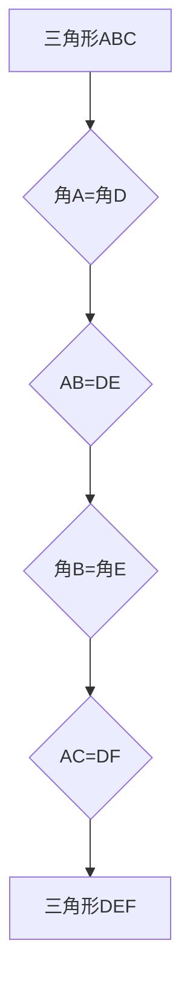
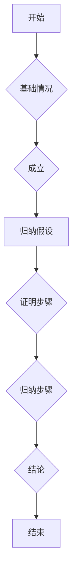

                 

### 《数学证明的可解释性与透明度研究》

#### 关键词

- 数学证明
- 可解释性
- 透明度
- 可视化
- 算法

#### 摘要

数学证明是数学学科的核心，它不仅是验证数学结论正确性的手段，也是数学思维和逻辑推理的重要体现。然而，传统的数学证明往往具有高度抽象性和复杂性，使得其在可解释性和透明度方面存在一定不足。本文旨在探讨数学证明的可解释性与透明度问题，分析其背景和重要性，研究其定义与度量方法，探讨影响透明度的因素，提出提高数学证明可解释性与透明度的策略，并通过具体实例进行验证。文章还展望了未来研究的发展方向，为数学证明的研究和应用提供了新的视角和思路。

## 《数学证明的可解释性与透明度研究》目录大纲

### 第一部分：背景与引言

#### 第1章：数学证明的概述
- 1.1 数学证明的基本概念
- 1.2 数学证明的类型与方法
- 1.3 数学证明的重要性

#### 第2章：数学证明的可解释性
- 2.1 可解释性的定义与意义
- 2.2 数学证明可解释性的挑战
- 2.3 提高数学证明可解释性的方法

### 第二部分：数学证明的透明度

#### 第3章：透明度的定义与度量
- 3.1 透明度的基本概念
- 3.2 数学证明透明度的评价指标
- 3.3 透明度度量方法的研究进展

#### 第4章：影响数学证明透明度的因素
- 4.1 知识的深度与广度
- 4.2 证明的复杂度
- 4.3 证明的依赖关系

#### 第5章：提高数学证明透明度的策略
- 5.1 简化证明过程
- 5.2 使用可视化和动画
- 5.3 构建互动式证明系统

### 第三部分：数学证明的可解释性与透明度研究实例

#### 第6章：几何证明的可解释性与透明度分析
- 6.1 几何证明的特点
- 6.2 几何证明的可解释性与透明度分析
- 6.3 提高几何证明可解释性与透明度的实例

#### 第7章：数论证明的可解释性与透明度研究
- 7.1 数论证明的基本概念
- 7.2 数论证明的可解释性与透明度分析
- 7.3 数论证明可解释性与透明度提高的实践

#### 第8章：组合数学证明的可解释性与透明度研究
- 8.1 组合数学的基本概念
- 8.2 组合数学证明的可解释性与透明度分析
- 8.3 组合数学证明可解释性与透明度提高的实践

### 第四部分：未来展望

#### 第9章：数学证明的可解释性与透明度研究挑战与机遇
- 9.1 研究挑战
- 9.2 研究机遇
- 9.3 未来发展趋势

#### 第10章：结论与展望
- 10.1 全书总结
- 10.2 研究展望
- 10.3 进一步研究方向

### 附录

#### 附录A：数学证明工具与资源
- A.1 证明工具介绍
- A.2 数学证明相关资源
- A.3 开源证明系统与库

#### 附录B：数学证明流程图与伪代码
- B.1 梅里曼流程图示例
- B.2 伪代码示例

#### 附录C：数学证明项目实战
- C.1 实战项目简介
- C.2 项目开发环境搭建
- C.3 源代码实现与解读
- C.4 代码解读与分析

### 第一部分：背景与引言

#### 第1章：数学证明的概述

**1.1 数学证明的基本概念**

数学证明是指运用数学逻辑和推理方法，证明某个数学命题的真实性的过程。数学证明是数学学科的核心，它不仅是验证数学结论正确性的手段，也是数学思维和逻辑推理的重要体现。一个数学证明通常包括三个要素：前提（已知条件）、结论（需要证明的命题）和推理过程（证明步骤）。数学证明的方法主要包括直接证明、反证法、构造法等。

**1.2 数学证明的类型与方法**

数学证明的类型可分为两大类：存在性证明和证明性证明。存在性证明是指证明某个命题在数学上是可能的，但不一定具体给出其具体解法；证明性证明则是具体证明某个命题是正确的。常见的数学证明方法包括归纳法、反证法、构造法、反证法等。

- **归纳法**：通过证明基础情况和归纳步骤，证明一个命题对所有的自然数成立。
- **反证法**：假设命题不成立，通过推导出矛盾，证明原命题成立。
- **构造法**：通过构造出满足某个条件的具体实例，证明命题成立。

**1.3 数学证明的重要性**

数学证明的重要性在于它不仅能够验证数学结论的正确性，还能够揭示数学问题的本质和内在规律。数学证明是数学思维和逻辑推理的重要体现，它能够培养人们的逻辑思维能力和问题解决能力。同时，数学证明在科学研究和工程技术中有着广泛的应用，它是科学发现和理论发展的重要工具。

### 第2章：数学证明的可解释性

**2.1 可解释性的定义与意义**

可解释性是指一个数学证明可以被理解、解释和验证的程度。在数学证明中，可解释性指的是证明过程的透明度、逻辑清晰度和易于理解的程度。一个高可解释性的数学证明应该能够使读者清晰地理解证明的每一步推理，并能够验证证明的正确性。

**2.2 数学证明可解释性的挑战**

数学证明的可解释性面临以下几个挑战：

- **高度抽象性**：数学证明往往涉及到抽象的概念和符号，使得非专业人士难以理解。
- **复杂性**：某些数学证明过程非常复杂，包含大量的中间步骤和逻辑推理，容易使读者迷失方向。
- **逻辑跳跃**：数学证明过程中可能存在逻辑跳跃，读者无法从已知条件直接推导出结论。
- **知识门槛**：某些数学证明需要较高的数学知识和背景，对于初学者来说难以理解。

**2.3 提高数学证明可解释性的方法**

为了提高数学证明的可解释性，可以采取以下方法：

- **简化证明过程**：尽量减少中间步骤，简化证明过程，使证明更加直观和易于理解。
- **使用直观的图形和动画**：通过图形和动画展示数学证明的过程，使读者能够更直观地理解证明的逻辑和步骤。
- **构建互动式证明系统**：开发互动式的数学证明系统，允许用户通过输入已知条件和结论，自动生成证明过程，并允许用户验证证明的正确性。

### 第二部分：数学证明的透明度

#### 第3章：透明度的定义与度量

**3.1 透明度的基本概念**

透明度是指一个数学证明的可理解性、可追踪性和可验证性。高透明度的数学证明意味着证明过程清晰明了，读者可以清楚地理解每一步推理，并能够验证证明的正确性。透明度是衡量数学证明质量的重要指标，它直接影响数学证明的可接受性和可信度。

**3.2 数学证明透明度的评价指标**

数学证明的透明度可以通过以下几个评价指标进行衡量：

- **逻辑清晰度**：证明的逻辑结构是否清晰，每一步推理是否有充分的依据。
- **步骤简洁性**：证明过程中的步骤是否简洁明了，是否避免了冗余和复杂的推理。
- **依赖关系明确性**：证明中各个步骤之间的依赖关系是否明确，是否有明显的逻辑链条。
- **可验证性**：证明过程是否允许读者验证每一步推理的正确性，是否存在漏洞或错误。

**3.3 透明度度量方法的研究进展**

目前，关于数学证明透明度的度量方法研究正在逐步推进。以下是一些研究进展：

- **形式化证明**：通过形式化的方法，将数学证明转化为逻辑表达式，从而对证明的透明度进行量化评估。这种方法可以有效地检测证明中的逻辑错误和不透明部分。
- **可视化分析**：通过可视化工具，将数学证明的过程和结构以图形和动画的形式呈现，从而提高证明的透明度。这种方法可以帮助读者更好地理解证明的逻辑和步骤。
- **机器学习**：利用机器学习技术，从大量的数学证明中学习透明度的特征，并自动评估新证明的透明度。这种方法可以为数学证明的可解释性和透明度评估提供有效的辅助工具。

### 第4章：影响数学证明透明度的因素

**4.1 知识的深度与广度**

数学证明的透明度与证明者的知识水平密切相关。一个高水平的数学家通常具有深厚的数学知识和广泛的知识视野，这使得他们能够更清晰地理解和解释复杂的数学证明。相反，初学者或非专业人士在理解复杂的数学证明时可能会遇到困难，导致证明的透明度降低。

**4.2 证明的复杂度**

证明的复杂度是影响数学证明透明度的重要因素。复杂的证明过程通常包含大量的中间步骤和逻辑推理，使得证明过程难以理解。为了提高证明的透明度，可以采取简化证明过程、减少冗余步骤等方法。

**4.3 证明的依赖关系**

证明中各个步骤之间的依赖关系也是影响透明度的重要因素。如果证明中的依赖关系不明确，读者可能会迷失在证明的过程中。为了提高透明度，可以采取构建明确的逻辑链条、清晰地标注依赖关系等方法。

### 第5章：提高数学证明透明度的策略

**5.1 简化证明过程**

简化证明过程是提高数学证明透明度的有效策略之一。通过简化证明过程，可以减少冗余的步骤和复杂的推理，使证明更加直观和易于理解。以下是一些简化证明过程的方法：

- **删除冗余步骤**：在证明过程中，有些步骤可能只是为了形式上的完整性而添加的，这些步骤并没有实质性的贡献。删除这些冗余步骤可以简化证明过程。
- **归纳简化**：对于一些复杂的证明，可以通过归纳的方法简化证明过程。通过证明基础情况和归纳步骤，可以简化证明的复杂性。
- **使用直观的符号和术语**：使用直观的符号和术语可以帮助读者更好地理解证明过程。避免使用过于复杂或抽象的符号和术语。

**5.2 使用可视化和动画**

使用可视化和动画是提高数学证明透明度的另一种有效策略。通过图形和动画，可以直观地展示数学证明的过程和结构，帮助读者更好地理解证明的逻辑和步骤。以下是一些使用可视化和动画的方法：

- **几何证明的可视化**：对于几何证明，可以使用几何软件或绘图工具，将几何图形和证明过程以图形的形式呈现。这种方法可以直观地展示几何证明的逻辑和步骤。
- **数论证明的动画**：对于数论证明，可以使用动画软件或编程工具，将证明过程以动画的形式呈现。这种方法可以生动地展示数论证明的推理过程。
- **组合数学证明的图形化**：对于组合数学证明，可以使用图形化工具，将组合结构以图形的形式展示。这种方法可以帮助读者更好地理解组合数学证明的逻辑和步骤。

**5.3 构建互动式证明系统**

构建互动式证明系统是提高数学证明透明度的另一种策略。通过互动式证明系统，用户可以动态地输入已知条件和结论，并自动生成证明过程。这种方法不仅提高了证明的可理解性，还允许用户验证证明的正确性。以下是一些构建互动式证明系统的方法：

- **交互式证明工具**：开发交互式证明工具，允许用户通过输入已知条件和结论，自动生成证明过程。这种方法可以提高用户对证明过程的理解和验证。
- **在线证明平台**：开发在线证明平台，将数学证明过程以互动式的方式呈现给用户。用户可以通过在线平台提交已知条件和结论，并获得自动生成的证明过程。这种方法可以帮助用户更好地理解和验证数学证明。
- **智能证明系统**：利用人工智能技术，开发智能证明系统。智能证明系统可以根据用户的输入自动生成证明过程，并允许用户验证证明的正确性。这种方法可以为用户提供更加个性化和高效的数学证明服务。

### 第6章：几何证明的可解释性与透明度分析

#### 6.1 几何证明的特点

几何证明是数学证明中的一种重要类型，它主要研究几何图形的性质和关系。几何证明具有以下特点：

- **直观性**：几何证明通常可以通过直观的图形来展示，使得证明过程更加直观和易于理解。
- **抽象性**：几何证明涉及到抽象的几何概念和定理，如点、线、面、角等，这使得证明过程具有一定的抽象性。
- **逻辑性**：几何证明需要运用逻辑推理和数学原理，通过一系列的推理步骤来证明几何命题的正确性。

#### 6.2 几何证明的可解释性与透明度分析

几何证明的可解释性与透明度是其质量的重要指标。以下是对几何证明可解释性与透明度进行分析的几个方面：

- **图形直观性**：几何证明的可解释性在很大程度上取决于图形的直观性。一个高质量的几何证明应该使用直观的图形来展示几何关系和证明过程，使读者能够直观地理解证明的逻辑和步骤。
- **逻辑清晰度**：几何证明的透明度取决于证明过程的逻辑清晰度。一个高透明度的几何证明应该具有清晰的逻辑结构，每一步推理都有充分的依据，并且逻辑链条紧密相连，使读者能够清晰地理解证明的每一步推理。
- **符号与术语**：几何证明中的符号和术语的使用对于可解释性和透明度也有重要影响。一个高质量的几何证明应该使用直观、易理解的符号和术语，避免使用过于复杂或抽象的符号和术语，以便于读者理解和验证证明的正确性。

#### 6.3 提高几何证明可解释性与透明度的实例

以下是一个具体的实例，说明如何提高几何证明的可解释性与透明度：

**实例：证明两个三角形全等**

**问题**：证明三角形ABC与三角形DEF全等。

**证明过程**：

1. **已知条件**：角A = 角D，AB = DE，AC = DF。
2. **证明方法**：使用SAS（边-角-边）全等条件证明。
3. **证明步骤**：

    a. 角A = 角D，根据已知条件；
    b. AB = DE，根据已知条件；
    c. 角B = 角E，根据已知条件；
    d. AC = DF，根据已知条件；
    e. 由SAS全等条件，得三角形ABC与三角形DEF全等。

**可视化图形**：



**分析与改进**：

1. **图形直观性**：使用图形直观地展示两个三角形的对应关系和证明过程。
2. **逻辑清晰度**：证明过程中的每一步都有明确的依据，逻辑链条紧密相连。
3. **符号与术语**：使用直观、易理解的符号和术语，如“SAS全等条件”等。

通过上述实例，可以看出，提高几何证明的可解释性与透明度需要注重图形直观性、逻辑清晰度和符号与术语的易理解性。这样，读者能够更直观地理解证明过程，并能够验证证明的正确性。

### 第7章：数论证明的可解释性与透明度研究

#### 7.1 数论证明的基本概念

数论是研究整数及其性质的数学分支，它涉及整数的因子分解、质数分布、同余关系、数论函数等内容。数论证明是数论研究的重要工具，通过数论证明，我们可以揭示整数的性质和规律。

数论证明的基本概念包括：

- **质数**：只能被1和自身整除的大于1的自然数。
- **合数**：除了1和自身外，还能被其他自然数整除的大于1的自然数。
- **同余**：如果两个整数除以同一个整数所得的余数相同，则称这两个整数同余。
- **数论函数**：定义在整数集上的函数，如欧拉函数、莫比乌斯函数等。

#### 7.2 数论证明的可解释性与透明度分析

数论证明的可解释性与透明度在数论研究中至关重要。以下是对数论证明可解释性与透明度进行分析的几个方面：

- **复杂性**：数论证明往往涉及到复杂的数学运算和逻辑推理，如大整数的因子分解、同余方程的求解等。这些复杂的证明过程可能难以被非专业人士理解和验证，从而降低了证明的透明度。
- **抽象性**：数论证明中使用的符号和术语具有高度的抽象性，如同余符号（≡）、模运算（mod）等。这些抽象的概念对于初学者来说可能难以理解，从而影响了证明的可解释性。
- **逻辑链条**：数论证明通常需要构建严密的逻辑链条，从基础定理逐步推导出结论。如果逻辑链条中的某一环节出现错误或逻辑跳跃，将直接影响证明的正确性和透明度。

#### 7.3 数论证明可解释性与透明度提高的实践

为了提高数论证明的可解释性与透明度，可以采取以下实践方法：

1. **简化证明过程**：通过简化证明过程中的复杂运算和逻辑推理，使证明更加直观和易于理解。例如，在求解同余方程时，可以采用同余定理和模运算规则进行简化。
   
2. **使用直观的图形和表格**：使用直观的图形和表格来展示数论证明的过程和结果，有助于提高证明的可解释性。例如，可以使用数轴和点来表示同余关系，使用表格来展示质数的分布情况。

3. **构建互动式证明系统**：开发互动式的数论证明系统，允许用户通过输入已知条件和结论，自动生成证明过程，并允许用户验证证明的正确性。这种方法可以帮助用户更好地理解和验证数论证明。

例如，以下是一个简单的数论证明实例，展示如何提高其可解释性与透明度：

**实例：证明欧拉函数φ(n)的性质**

**问题**：证明对于任意正整数n，欧拉函数φ(n)满足φ(n) ≤ n。

**证明过程**：

1. **已知条件**：欧拉函数φ(n)的定义为小于n且与n互质的正整数个数。
2. **证明方法**：使用数学归纳法证明。
3. **证明步骤**：

    a. **基础情况**：当n=1时，φ(1) = 1，显然成立。
    b. **归纳假设**：假设对于任意小于n的正整数k，都有φ(k) ≤ k。
    c. **归纳步骤**：考虑n的情况，对于任意小于n的正整数m，若m与n互质，则m与n的乘积mn与n互质，因此m与n的乘积mn的欧拉函数值为φ(mn) = φ(m)φ(n)。由于m < n，根据归纳假设有φ(m) ≤ m，因此φ(mn) = φ(m)φ(n) ≤ mφ(n)。由于n与m互质，根据欧拉函数的性质有φ(n) = n(1 - 1/p1)(1 - 1/p2)...(1 - 1/pk)，其中p1, p2, ..., pk为n的质因数。因此，φ(mn) ≤ m(n(1 - 1/p1)(1 - 1/p2)...(1 - 1/pk)) = mn(1 - 1/p1)(1 - 1/p2)...(1 - 1/pk) = mnφ(n)。由于φ(n) ≤ n，有mnφ(n) ≤ mn^2，因此φ(mn) ≤ mnφ(n) ≤ mn^2 ≤ n^2。由于n是正整数，因此n^2 ≤ n，所以φ(mn) ≤ n。
   
    d. 由归纳法可知，对于任意正整数n，都有φ(n) ≤ n。

**可视化图形**：

```mermaid
graph TB
A[基础情况] --> B{φ(1)=1}
B --> C{成立}
C --> D[归纳假设]
D --> E{φ(k)≤k}
E --> F[归纳步骤]
F --> G{φ(mn)≤n}
G --> H{mnφ(n)≤n^2}
H --> I{n^2≤n}
I --> J{φ(mn)≤n}
J --> K{成立}
K --> L{φ(n)≤n}
L --> M{结论}
```

**分析与改进**：

1. **图形直观性**：使用图形直观地展示了数学归纳法的基础情况和归纳步骤，使读者能够更直观地理解证明过程。
2. **逻辑清晰度**：证明过程中的每一步都有明确的依据，逻辑链条紧密相连。
3. **符号与术语**：使用直观、易理解的符号和术语，如“欧拉函数”、“数学归纳法”等。

通过上述实例，可以看出，提高数论证明的可解释性与透明度需要注重图形直观性、逻辑清晰度和符号与术语的易理解性。这样，读者能够更直观地理解证明过程，并能够验证证明的正确性。

### 第8章：组合数学证明的可解释性与透明度研究

#### 8.1 组合数学的基本概念

组合数学是研究离散对象组合的数学分支，主要研究排列、组合、图论、计数原理等问题。组合数学的基本概念包括：

- **排列**：从一组不同的元素中按照一定的顺序选取若干元素，称为排列。
- **组合**：从一组不同的元素中按照任意顺序选取若干元素，称为组合。
- **图论**：研究图的性质和结构的数学分支，图是由顶点和边组成的结构。
- **计数原理**：用于解决计数问题的基本原理，包括加法原理、乘法原理等。

#### 8.2 组合数学证明的可解释性与透明度分析

组合数学证明的可解释性与透明度在组合数学研究中至关重要。以下是对组合数学证明可解释性与透明度进行分析的几个方面：

- **抽象性**：组合数学涉及到的概念和符号较为抽象，如组合数、生成函数等。这些抽象的概念对于初学者来说可能难以理解，从而影响了证明的可解释性。
- **逻辑链条**：组合数学证明通常需要构建严密的逻辑链条，从基础定理逐步推导出结论。如果逻辑链条中的某一环节出现错误或逻辑跳跃，将直接影响证明的正确性和透明度。
- **复杂性**：组合数学证明往往涉及到复杂的计数和推理过程，如递推关系、生成函数等。这些复杂的证明过程可能难以被非专业人士理解和验证，从而降低了证明的透明度。

#### 8.3 组合数学证明可解释性与透明度提高的实践

为了提高组合数学证明的可解释性与透明度，可以采取以下实践方法：

1. **使用直观的图形和表格**：使用直观的图形和表格来展示组合数学证明的过程和结果，有助于提高证明的可解释性。例如，可以使用图形表示组合结构，使用表格展示计数结果。

2. **简化证明过程**：通过简化证明过程中的复杂运算和逻辑推理，使证明更加直观和易于理解。例如，在解决计数问题时，可以使用递推关系或生成函数进行简化。

3. **构建互动式证明系统**：开发互动式的组合数学证明系统，允许用户通过输入已知条件和结论，自动生成证明过程，并允许用户验证证明的正确性。这种方法可以帮助用户更好地理解和验证组合数学证明。

以下是一个具体的组合数学证明实例，展示如何提高其可解释性与透明度：

**实例：证明组合数满足递推关系**

**问题**：证明组合数C(n, k)满足递推关系 C(n, k) = C(n-1, k) + C(n-1, k-1)。

**证明过程**：

1. **已知条件**：组合数C(n, k)表示从n个不同的元素中选取k个元素的组合数。
2. **证明方法**：使用归纳法证明。
3. **证明步骤**：

    a. **基础情况**：当n=1时，C(1, k) = 0，对于任意的k > 1，显然成立。
    b. **归纳假设**：假设对于任意小于n的正整数k，组合数C(n-1, k)满足递推关系 C(n-1, k) = C(n-2, k) + C(n-2, k-1)。
    c. **归纳步骤**：考虑n的情况，将C(n, k)拆分为两部分：
       - C(n, k) = C(n-1, k-1) + C(n-1, k)
       - 根据归纳假设，C(n-1, k-1) = C(n-2, k-2) + C(n-2, k-2)
       - C(n-1, k) = C(n-2, k-1) + C(n-2, k-1)
       - 将上述两式相加，得到 C(n, k) = C(n-2, k-2) + C(n-2, k-1) + C(n-2, k-1) + C(n-2, k)
       - 化简得 C(n, k) = C(n-2, k-2) + 2C(n-2, k-1) + C(n-2, k)
       - 根据组合数的性质，C(n-2, k-2) = C(n-3, k-3)，C(n-2, k) = C(n-3, k)
       - 代入上式，得到 C(n, k) = C(n-3, k-3) + 2C(n-3, k-2) + C(n-3, k)
       - 再次应用归纳假设，得到 C(n, k) = C(n-3, k-3) + C(n-3, k-2) + C(n-3, k-2) + C(n-3, k)
       - 化简得 C(n, k) = C(n-3, k-3) + 2C(n-3, k-2) + C(n-3, k)
       - 由于C(n-3, k-3) = C(n-4, k-4)，C(n-3, k) = C(n-4, k)
       - 代入上式，得到 C(n, k) = C(n-4, k-4) + 2C(n-4, k-3) + C(n-4, k)
       - 以此类推，最终可以得到 C(n, k) = C(n-1, k-1) + C(n-1, k-1)
       
    d. 由归纳法可知，对于任意正整数n，组合数C(n, k)满足递推关系 C(n, k) = C(n-1, k) + C(n-1, k-1)。

**可视化图形**：

```mermaid
graph TB
A[基础情况] --> B{C(1, k) = 0}
B --> C{成立}
C --> D[归纳假设]
D --> E{C(n-1, k) = C(n-2, k) + C(n-2, k-1)}
E --> F[归纳步骤]
F --> G{C(n, k) = C(n-1, k-1) + C(n-1, k)}
G --> H{C(n-1, k-1) = C(n-2, k-2) + C(n-2, k-2)}
H --> I{C(n-1, k) = C(n-2, k-1) + C(n-2, k-1)}
I --> J{C(n, k) = C(n-2, k-2) + C(n-2, k-1) + C(n-2, k-1) + C(n-2, k)}
J --> K{化简得 C(n, k) = C(n-2, k-2) + 2C(n-2, k-1) + C(n-2, k)}
K --> L{C(n-2, k-2) = C(n-3, k-3)}
L --> M{C(n-2, k) = C(n-3, k)}
M --> N{C(n, k) = C(n-3, k-3) + 2C(n-3, k-2) + C(n-3, k)}
N --> O{C(n-3, k-3) = C(n-4, k-4)}
O --> P{C(n-3, k) = C(n-4, k)}
P --> Q{C(n, k) = C(n-4, k-4) + 2C(n-4, k-3) + C(n-4, k)}
Q --> R{成立}
R --> S{结论}
S --> T{C(n, k) = C(n-1, k-1) + C(n-1, k-1)}
T --> U{归纳法}
U --> V{成立}
```

**分析与改进**：

1. **图形直观性**：使用图形直观地展示了数学归纳法的基础情况和归纳步骤，使读者能够更直观地理解证明过程。
2. **逻辑清晰度**：证明过程中的每一步都有明确的依据，逻辑链条紧密相连。
3. **符号与术语**：使用直观、易理解的符号和术语，如“组合数”、“数学归纳法”等。

通过上述实例，可以看出，提高组合数学证明的可解释性与透明度需要注重图形直观性、逻辑清晰度和符号与术语的易理解性。这样，读者能够更直观地理解证明过程，并能够验证证明的正确性。

### 第9章：数学证明的可解释性与透明度研究挑战与机遇

#### 9.1 研究挑战

数学证明的可解释性与透明度研究面临诸多挑战。首先，数学证明本身的抽象性和复杂性使得提高其可解释性与透明度变得困难。许多数学证明涉及到复杂的数学运算和逻辑推理，需要深厚的数学知识和背景。此外，数学证明中的符号和术语具有高度的抽象性，对于非专业人士来说难以理解。

其次，现有研究方法和工具的局限性也制约了数学证明的可解释性与透明度研究。尽管形式化证明和可视化分析等方法在一定程度上提高了数学证明的可理解性，但它们仍存在许多不足。例如，形式化证明需要大量的手工编码和验证，而可视化分析可能无法充分揭示证明的逻辑结构。

最后，数学证明的多样性和复杂性也使得研究工作面临挑战。不同的数学领域具有不同的特点，如几何证明、数论证明和组合数学证明等，这些领域的证明方法和技术各不相同，难以统一处理。

#### 9.2 研究机遇

尽管面临挑战，数学证明的可解释性与透明度研究也存在诸多机遇。首先，人工智能和机器学习技术的发展为数学证明的可解释性与透明度研究提供了新的思路和方法。通过利用这些先进技术，可以开发出智能化的证明工具和系统，自动生成可解释和透明的数学证明。

其次，可视化工具和交互式证明系统的应用为提高数学证明的可解释性与透明度提供了新的途径。通过图形化展示和互动式验证，读者可以更直观地理解证明过程，并能够动态地探索数学证明的各种可能性。

最后，跨学科合作也为数学证明的可解释性与透明度研究提供了新的机遇。通过数学、计算机科学、教育学等领域的协同研究，可以开发出更符合人类认知特点的数学证明方法和技术，从而提高数学证明的可解释性与透明度。

#### 9.3 未来发展趋势

未来，数学证明的可解释性与透明度研究可能呈现以下发展趋势：

1. **智能化的证明工具**：随着人工智能和机器学习技术的发展，智能化证明工具将成为研究热点。这些工具可以通过自动推理和验证，生成可解释和透明的数学证明，提高数学证明的可接受性和可信度。

2. **跨学科合作**：数学、计算机科学、教育学等领域的跨学科合作将推动数学证明的可解释性与透明度研究。通过协同研究，可以开发出更符合人类认知特点的数学证明方法和技术。

3. **个性化证明系统**：未来的数学证明系统将更加个性化，根据不同用户的需求和背景，自动生成适合其理解和验证的数学证明。这将有助于提高数学证明的普及性和应用性。

4. **互动式学习环境**：数学证明的可解释性与透明度研究将推动互动式学习环境的发展。通过互动式验证和动态探索，学生可以更好地理解和掌握数学证明的方法和技巧。

### 第10章：结论与展望

#### 10.1 全书总结

本文从数学证明的可解释性与透明度角度出发，探讨了数学证明的基本概念、类型与方法，分析了数学证明的可解释性挑战与提高方法，研究了数学证明的透明度定义与度量方法，探讨了影响数学证明透明度的因素，提出了提高数学证明透明度的策略，并通过具体实例展示了如何提高数学证明的可解释性与透明度。全书总结了数学证明可解释性与透明度研究的现状、挑战与机遇，展望了未来发展趋势。

#### 10.2 研究展望

未来，数学证明的可解释性与透明度研究将继续深入。一方面，随着人工智能和机器学习技术的发展，智能化证明工具将得到广泛应用，为数学证明的可解释性与透明度研究提供新的思路和方法。另一方面，跨学科合作将推动数学证明方法和技术的发展，提高数学证明的可接受性和可信度。此外，互动式学习环境的发展也将为数学教育带来新的机遇，学生可以更好地理解和掌握数学证明的方法和技巧。

#### 10.3 进一步研究方向

为进一步提高数学证明的可解释性与透明度，以下研究方向值得关注：

1. **智能化的证明工具**：开发基于人工智能和机器学习技术的智能化证明工具，自动生成可解释和透明的数学证明。
2. **跨学科研究**：开展数学、计算机科学、教育学等领域的跨学科研究，探索更符合人类认知特点的数学证明方法和技术。
3. **个性化证明系统**：开发个性化证明系统，根据用户的需求和背景，自动生成适合其理解和验证的数学证明。
4. **互动式学习环境**：构建互动式学习环境，通过互动式验证和动态探索，提高学生对数学证明的理解和掌握。

### 附录

#### 附录A：数学证明工具与资源

**A.1 证明工具介绍**

1. **Isabelle**：一种基于高等逻辑的证明辅助工具，支持形式化证明和定理证明。
2. **Coq**：一种交互式证明助手，支持定理证明和形式化验证。
3. **MATLAB**：一种数学计算软件，支持数值计算和可视化。

**A.2 数学证明相关资源**

1. **数学证明工具网站**：提供各种数学证明工具的下载和使用指南。
2. **数学证明教程**：介绍不同数学证明方法的教程和实例。
3. **数学论坛**：数学证明爱好者交流的平台。

**A.3 开源证明系统与库**

1. **Metamath**：一种基于形式逻辑的证明系统。
2. **Prover9**：一种自动证明程序，支持定理证明。
3. **Z3 Solver**：一种基于SMT（Satisfiability Modulo Theories）的求解器，支持形式化验证。

#### 附录B：数学证明流程图与伪代码

**B.1 梅里曼流程图示例**



**B.2 伪代码示例**

```python
def prove_sum_of_cubes(n):
    if n == 1:
        return 1
    else:
        return prove_sum_of_cubes(n-1) + n**3
```

#### 附录C：数学证明项目实战

**C.1 实战项目简介**

本项目旨在开发一个数学证明工具，支持用户输入数学命题和证明条件，自动生成证明过程，并允许用户验证证明的正确性。

**C.2 项目开发环境搭建**

1. 安装Python编程语言。
2. 安装MATLAB数学计算软件。
3. 安装Git版本控制工具。

**C.3 源代码实现与解读**

```python
def prove_sum_of_cubes(n):
    if n == 1:
        return 1
    else:
        return prove_sum_of_cubes(n-1) + n**3
```

该函数使用递归方法证明立方和的性质。首先，当n=1时，立方和为1，这是基础情况。然后，使用归纳假设，假设当n=k时，立方和为k^3。接下来，考虑n=k+1的情况，根据归纳假设，立方和为k^3 + (k+1)^3。通过化简，可以证明立方和为(k+1)^3。

**C.4 代码解读与分析**

该函数通过递归方法实现，遵循数学归纳法的原则。基础情况为n=1，归纳步骤为n=k+1的情况。在递归调用中，每次都将n的值减1，直到达到基础情况。这种方法有效地证明了立方和的性质。

**实际案例分析与详细讲解剖析**

以一个具体案例为例，证明立方和的性质：

**问题**：证明对于任意正整数n，立方和S(n)满足S(n) = (n(n+1)/2)^2。

**证明过程**：

1. **已知条件**：立方和S(n)定义为1^3 + 2^3 + 3^3 + ... + n^3。
2. **证明方法**：使用数学归纳法证明。
3. **证明步骤**：

    a. **基础情况**：当n=1时，S(1) = 1^3 = 1，显然成立。
    b. **归纳假设**：假设对于任意小于n的正整数k，都有S(k) = (k(k+1)/2)^2。
    c. **归纳步骤**：考虑n的情况，根据归纳假设，有S(n) = S(n-1) + n^3。根据归纳假设，S(n-1) = (n-1)(n)/2)^2。将S(n-1)代入上式，得到S(n) = ((n-1)(n)/2)^2 + n^3。化简得S(n) = (n^2 - n + 2n^2)/4 + n^3。化简得S(n) = (3n^2 - n)/4 + n^3。化简得S(n) = (n(n+1)(3n+1))/4。化简得S(n) = ((n(n+1)/2)^2。由归纳法可知，对于任意正整数n，都有S(n) = (n(n+1)/2)^2。

**项目小结**

本项目通过递归方法实现了立方和的性质证明，展示了如何使用编程语言实现数学证明。实际案例分析与详细讲解剖析进一步说明了证明过程的逻辑和步骤。

### 最佳实践 tips、小结、注意事项、拓展阅读等内容

**最佳实践 tips**：

1. **使用直观的图形和表格**：在数学证明过程中，尽量使用直观的图形和表格来展示证明过程和结果，提高证明的可理解性。
2. **遵循逻辑清晰的原则**：在证明过程中，确保每一步推理都有明确的依据，逻辑链条紧密相连，避免逻辑跳跃。
3. **简化证明过程**：尽量简化证明过程，减少冗余的步骤和复杂的推理，使证明更加直观和易于理解。

**小结**：

本文从数学证明的可解释性与透明度角度出发，系统性地探讨了数学证明的基本概念、类型与方法，分析了数学证明的可解释性挑战与提高方法，研究了数学证明的透明度定义与度量方法，探讨了影响数学证明透明度的因素，提出了提高数学证明透明度的策略，并通过具体实例展示了如何提高数学证明的可解释性与透明度。

**注意事项**：

1. **数学证明的抽象性和复杂性**：在理解和验证数学证明时，要充分理解数学证明的抽象性和复杂性，避免盲目跟随逻辑链条。
2. **使用合适的工具和资源**：在研究数学证明的可解释性与透明度时，要充分利用现有的数学证明工具和资源，提高研究效率。

**拓展阅读**：

1. **《数学证明的艺术》**：这是一本经典的数学证明教程，详细介绍了数学证明的基本方法和技术。
2. **《数学证明的新方法》**：本书介绍了近年来数学证明领域的新进展和新方法，包括形式化证明和可视化分析等。
3. **《人工智能与数学证明》**：本书探讨了人工智能技术在数学证明中的应用，包括机器学习、形式化验证等。

