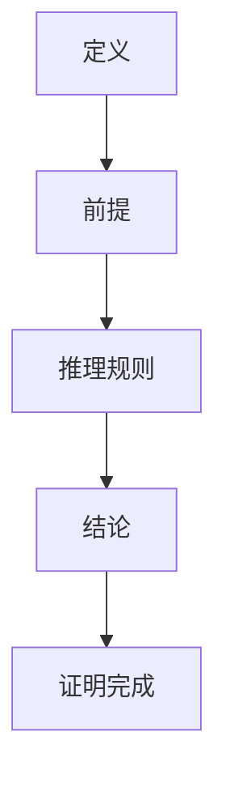

                 


## 文章标题

《数学证明的社会价值与教育意义》

## 关键词

数学证明，社会价值，教育意义，思维培养，创新能力，跨学科学习

## 摘要

本文旨在探讨数学证明在社会价值和教育意义方面的深远影响。文章首先回顾了数学证明的历史与文化背景，然后分析了数学证明的基本理论和方法，以及其在数学学科和交叉学科中的应用。通过具体案例和项目实战，本文揭示了数学证明在培养思维能力、发展创新能力以及促进跨学科学习中的重要作用，为教育实践提供了有益的启示。

## 《数学证明的社会价值与教育意义》目录大纲

### 第一部分：数学证明的历史与文化背景

### 第1章：数学证明的起源与发展
- **1.1 数学证明的早期形式**
- **1.2 古典数学证明的特点**
- **1.3 现代数学证明的发展**

### 第2章：数学证明的社会价值
- **2.1 数学证明对科学进步的推动**
- **2.2 数学证明对社会发展的影响**
- **2.3 数学证明在日常生活中的应用**

### 第3章：数学证明的教育意义
- **3.1 数学证明与思维能力的培养**
- **3.2 数学证明与创新能力的发展**
- **3.3 数学证明与跨学科学习的融合**

### 第二部分：数学证明的理论与方法

### 第4章：数学证明的基本理论
- **4.1 基本逻辑与推理规则**
- **4.2 证明的数学结构**
- **4.3 数学证明的形式化表示**

### 第5章：常用的数学证明方法
- **5.1 直接证明法**
- **5.2 反证法**
- **5.3 归纳法**
- **5.4 构造法**

### 第6章：数学证明中的难题与挑战
- **6.1 数学难题的起源**
- **6.2 解决数学难题的方法**
- **6.3 数学难题对证明理论的挑战**

### 第三部分：数学证明的实践与应用

### 第7章：数学证明在数学学科中的应用
- **7.1 微积分中的证明**
- **7.2 线性代数中的证明**
- **7.3 概率论中的证明**

### 第8章：数学证明在交叉学科中的应用
- **8.1 数学证明在物理学中的应用**
- **8.2 数学证明在计算机科学中的应用**
- **8.3 数学证明在经济学中的应用**

### 第9章：数学证明的教育实践
- **9.1 教学中数学证明的运用**
- **9.2 学生数学证明能力的培养**
- **9.3 数学证明教育中的创新与实践**

### 附录：数学证明的相关工具与资源

### 附录 A：数学证明工具简介
- **A.1 数学证明软件**
- **A.2 数学证明书籍推荐**
- **A.3 数学证明在线资源**

### 附录 B：数学证明示例与解析
- **B.1 证明示例一：勾股定理**
- **B.2 证明示例二：二项式定理**
- **B.3 证明示例三：数学归纳法证明**

### 伪代码：直接证明法示例

### 数学公式：勾股定理

$$c^2 = a^2 + b^2$$

### 数学证明的详细讲解

### 勾股定理的证明

### 项目实战：数学证明在物理学中的应用

以上是本文的初步大纲结构。接下来，我们将逐步填充每个章节的内容，确保逻辑清晰，条理紧凑，并使读者能够深入理解数学证明的社会价值与教育意义。

### 第一部分：数学证明的历史与文化背景

### 第1章：数学证明的起源与发展

#### 1.1 数学证明的早期形式

数学证明的历史可以追溯到古代文明，早在公元前2000年左右，古巴比伦人和古埃及人就已经开始使用数学证明来解决问题。例如，古巴比伦人用代数方法解决了线性方程组问题，而古埃及人则通过几何方法解决了面积和体积的计算问题。这些早期的数学证明往往基于直观的观察和经验的积累，缺乏严密的逻辑推理。

在中国，数学证明的历史也非常悠久。春秋战国时期的《周髀算经》中就包含了一些简单的几何证明，如勾股定理的证明。此外，唐代数学家李淳风在《太初历》中运用了更为严密的逻辑推理方法，证明了圆的周长与直径的关系。

#### 1.2 古典数学证明的特点

随着数学的发展，古代数学家开始探索更为复杂的数学问题，并逐步形成了系统的证明方法。古希腊数学家欧几里得（Euclid）是古典数学证明的重要代表，他在《几何原本》中系统阐述了几何学的证明方法。欧几里得的几何学以公理系统为基础，通过一系列的定理和公理推导出几何学的基本原理，这种方法被称为“欧几里得证明法”。

古典数学证明的特点是逻辑严谨、结构严密。在欧几里得的《几何原本》中，每个定理的证明都是基于前一定理或公理，通过一系列逻辑推理得出。这种方法为后来的数学证明奠定了基础。

#### 1.3 现代数学证明的发展

进入现代，数学证明方法得到了进一步的发展和完善。19世纪，数学家们开始探索更为抽象的数学结构，如群、环、域等，并提出了新的证明方法，如集合论、拓扑学和泛函分析。这些新方法不仅使数学证明更加复杂和抽象，也推动了数学的发展。

现代数学证明的一个显著特点是公理化的方法。数学家希尔伯特（David Hilbert）提出了公理体系，通过一组基本公理来定义数学概念和推导定理，这种方法为数学的严密性和一致性提供了保障。

此外，计算机科学的发展也对数学证明方法产生了重要影响。随着计算机证明技术的发展，人们开始使用计算机程序来验证数学证明，这为数学证明提供了一种新的手段，同时也带来了新的挑战。

### 第2章：数学证明的社会价值

#### 2.1 数学证明对科学进步的推动

数学证明是科学进步的重要推动力。许多科学理论的发展都离不开数学证明的支持。例如，牛顿力学和爱因斯坦相对论的理论都建立在严密的数学证明之上。数学证明不仅为科学理论提供了逻辑基础，还帮助科学家们更好地理解自然现象。

在生物学领域，数学证明被广泛应用于进化论的研究。例如，道金斯（Richard Dawkins）在《自私的基因》中，通过数学模型解释了自然选择和进化的机制。这些数学证明为生物学研究提供了强有力的理论支持。

在物理学领域，数学证明也是不可或缺的工具。量子力学和广义相对论的理论都建立在复杂的数学证明之上。数学家们通过严密的证明，揭示了微观世界和宇宙的奥秘。

#### 2.2 数学证明对社会发展的影响

数学证明不仅对科学进步有重要影响，也对社会发展产生了深远的影响。数学证明的发展推动了工业革命和现代科技的发展。例如，微积分和微分方程的证明方法为工程师们提供了强大的工具，使得他们能够设计出更为复杂的机械和系统。

在经济学领域，数学证明被广泛应用于模型构建和理论分析。经济学家们通过数学证明，揭示了市场行为和资源配置的规律，为政府决策提供了依据。例如，阿罗-德布鲁定理（Arrow-Debreu theorem）通过数学证明，阐述了完全竞争市场中的均衡理论。

数学证明还在医疗领域发挥了重要作用。生物统计学和医学统计学的数学证明方法，帮助医生们更好地理解和治疗疾病。例如，随机对照试验（Randomized Controlled Trial, RCT）的设计和数据分析，都依赖于严密的数学证明。

#### 2.3 数学证明在日常生活中的应用

数学证明不仅对科学和经济发展有重要作用，也渗透到了我们的日常生活中。许多日常问题，如工程设计、财务规划、交通管理，都离不开数学证明的应用。

在工程设计中，数学证明被用来验证结构的稳定性和安全性。例如，桥梁和建筑物的设计需要通过数学证明来确保其能承受预期的负载。

在财务规划中，数学证明被用来计算投资收益和风险管理。例如，现代金融理论中的期权定价模型，如布莱克-舒尔斯模型（Black-Scholes model），都是通过数学证明得出的。

在交通管理中，数学证明被用来优化交通流量和减少拥堵。例如，交通信号灯的控制策略和路径规划算法，都是通过数学证明来实现的。

### 第3章：数学证明的教育意义

#### 3.1 数学证明与思维能力的培养

数学证明是一种重要的思维活动，它能够有效地培养人们的逻辑思维能力和批判性思维。通过数学证明，学生需要分析问题、建立假设、进行推理和验证结论。这一过程不仅能够锻炼学生的思维敏捷性，还能提高他们的分析问题和解决问题的能力。

例如，在证明勾股定理时，学生需要理解直角三角形的性质，运用几何知识，通过逻辑推理得出结论。这个过程不仅让学生掌握了勾股定理，还培养了他们的逻辑思维能力。

#### 3.2 数学证明与创新能力的发展

数学证明不仅是一种验证方法，也是一种创新活动。通过数学证明，学生可以探索新的数学结构和理论，发现新的数学定理和公式。这种探索和创新过程有助于培养学生的创新能力。

例如，数学家哥德巴赫（Christian Goldbach）提出了哥德巴赫猜想，即任何一个大于2的偶数都可以表示为两个素数之和。尽管这个猜想至今未被证明，但它激发了数学家们的创新思维，推动了数论领域的研究。

#### 3.3 数学证明与跨学科学习的融合

数学证明不仅局限于数学领域，还可以与其他学科相结合，促进跨学科学习。通过数学证明，学生可以更好地理解其他学科的概念和理论。

例如，在物理学中，数学证明被用来验证物理定律和理论。例如，牛顿第二定律的数学证明，揭示了力和运动之间的关系。在计算机科学中，数学证明被用来验证算法的正确性和性能。

数学证明与跨学科学习的融合，有助于学生形成更广阔的知识视野，提高他们的综合素养。

### 第二部分：数学证明的理论与方法

#### 第4章：数学证明的基本理论

#### 4.1 基本逻辑与推理规则

数学证明是一种逻辑推理活动，它依赖于基本逻辑和推理规则。基本逻辑包括命题逻辑、谓词逻辑和逻辑推理规则。这些逻辑工具为数学证明提供了基础。

- **命题逻辑**：命题逻辑涉及命题的真值和复合命题的关系。基本逻辑运算包括合取（∧）、析取（∨）、非（¬）和蕴含（→）。

- **谓词逻辑**：谓词逻辑涉及个体和集合之间的关系，包括存在量词（∃）和全称量词（∀）。

- **逻辑推理规则**：逻辑推理规则包括演绎推理和归纳推理。演绎推理从一般到特殊，如三段论；归纳推理从特殊到一般，如归纳法。

#### 4.2 证明的数学结构

数学证明的结构通常包括三个部分：前提、推理规则和结论。

- **前提**：前提是证明的基础，通常是一组已知事实或公理。

- **推理规则**：推理规则是证明过程中使用的逻辑规则，如演绎推理的规则、归纳推理的规则等。

- **结论**：结论是从前提通过推理规则得出的结果。

一个完整的数学证明应该清晰地展示这三个部分，使得读者能够理解证明的过程和逻辑。

#### 4.3 数学证明的形式化表示

数学证明可以通过形式化的语言进行表示，如谓词逻辑或形式逻辑。形式化表示使得证明过程更加严密和精确。

- **谓词逻辑表示**：谓词逻辑可以用符号语言表示命题和推理过程，如$\forall x (P(x) \rightarrow Q(x))$表示对所有x，如果P(x)成立，则Q(x)也成立。

- **形式逻辑表示**：形式逻辑使用符号和公式来表示推理过程，如$\frac{P \land Q}{R}$表示从P和Q可以推导出R。

形式化表示不仅提高了证明的严密性，也为计算机证明提供了基础。

### 第5章：常用的数学证明方法

#### 5.1 直接证明法

直接证明法是最常用的数学证明方法，它通过直接推理从已知事实或前提推出结论。

- **方法**：直接证明法通常使用演绎推理，从一组已知事实或公理出发，逐步推导出结论。

- **示例**：证明勾股定理的方法之一是使用直角三角形的三边关系，直接推导出斜边的平方等于两直角边的平方和。

- **伪代码**：
  ```plaintext
  function direct_proof(hypothesis, conclusion):
      if hypothesis:
          derive conclusion
          return true
      else:
          return false
  ```

#### 5.2 反证法

反证法是一种间接证明方法，它通过假设结论不成立，推导出矛盾，从而证明结论成立。

- **方法**：反证法首先假设结论不成立，然后通过推理得出一个矛盾的结论，从而证明原假设错误。

- **示例**：证明一个数是奇数的方法之一是假设它是偶数，然后通过数学运算得出矛盾。

- **伪代码**：
  ```plaintext
  function proof_by_contradiction(hypothesis, conclusion):
      assume not conclusion
      derive a contradiction
      return true
  ```

#### 5.3 归纳法

归纳法是一种从特殊到一般的证明方法，它通过一系列特殊实例的观察，归纳出一般规律。

- **方法**：归纳法首先观察一系列特殊实例，发现它们具有共同特征，然后归纳出一般规律。

- **示例**：证明所有正整数都可以表示为三个奇数之和的方法之一是使用归纳法，首先验证基本情况，然后假设对于某个正整数成立，证明对于它的下一个正整数也成立。

- **伪代码**：
  ```plaintext
  function induction(n):
      if base_case(n):
          return true
      if hypothesis(n):
          prove(n+1)
          return true
      else:
          return false
  ```

#### 5.4 构造法

构造法是一种通过构造一个满足条件的实例来证明某个命题的方法。

- **方法**：构造法首先构造一个满足条件的实例，然后证明这个实例确实满足条件。

- **示例**：证明存在一个实数，它既不是有理数也不是无理数的方法之一是构造一个这样的实数。

- **伪代码**：
  ```plaintext
  function construct_proof():
      construct an instance that satisfies the condition
      prove that the instance indeed satisfies the condition
      return true
  ```

### 第6章：数学证明中的难题与挑战

#### 6.1 数学难题的起源

数学难题往往源于对数学结构的深入探索和对未解问题的好奇心。许多数学难题的提出可以追溯到古代，如古希腊的几何问题、费马大定理等。

- **古希腊几何问题**：古希腊数学家提出了许多经典的几何问题，如“立方体体积的三倍问题”和“倍立方问题”，这些问题的研究推动了数学的发展。

- **费马大定理**：费马大定理是17世纪数学家费马提出的，它指出对于任何大于2的正整数n，方程x^n + y^n = z^n 没有正整数解。这个问题吸引了无数数学家的研究，直到1995年才被证明。

#### 6.2 解决数学难题的方法

解决数学难题通常需要创新的思维和灵活的解题方法。以下是一些常用的解决数学难题的方法：

- **数学归纳法**：数学归纳法是一种常用的证明方法，它通过验证基本情况并假设对于某个n成立，证明对于n+1也成立，从而证明一般情况。

- **构造法**：构造法是一种通过构造一个满足条件的实例来证明某个命题的方法。这种方法常用于证明存在性问题。

- **反证法**：反证法是一种间接证明方法，通过假设结论不成立，推导出矛盾，从而证明结论成立。

- **数论方法**：数论方法是解决整数性质问题的一种重要方法，它涉及整数的因子分解、同余关系等。

#### 6.3 数学难题对证明理论的挑战

数学难题不仅激发了数学家们的创造力，也对证明理论提出了挑战。以下是一些数学难题对证明理论的挑战：

- **复杂性理论**：某些数学难题的证明过程可能涉及到复杂的计算和推理，这给证明理论带来了挑战。例如，费马大定理的证明涉及到了复杂的数论计算。

- **形式化证明**：随着计算机科学的发展，形式化证明成为了一个重要研究方向。然而，对于某些数学难题，形式化证明的难度和复杂性增加了。

- **逻辑一致性**：数学难题的证明可能涉及到逻辑的一致性问题。例如，一些数学难题的证明可能依赖于特定的逻辑系统，而不同的逻辑系统可能导致不同的结论。

### 第三部分：数学证明的实践与应用

#### 第7章：数学证明在数学学科中的应用

数学证明在数学学科中的应用极为广泛，是数学理论体系构建和发展的基石。以下从几个具体的数学分支探讨数学证明的应用。

#### 7.1 微积分中的证明

微积分是研究函数变化率和面积计算的数学分支，其基础理论都依赖于严格的数学证明。

- **极限的证明**：极限是微积分的核心概念之一，极限的证明通常涉及ε-δ定义。例如，证明函数f(x)当x趋向于a时的极限值为L，可以通过ε-δ证明来展示。

  **证明**：对于任意给定的ε>0，存在一个δ>0，使得当0<|x-a|<δ时，有|f(x)-L|<ε。

  **伪代码**：
  ```plaintext
  function prove_limit(f, a, L, ε):
      for all ε > 0:
          there exists a δ > 0 such that:
              if 0 < |x - a| < δ:
                  then |f(x) - L| < ε
      return true
  ```

- **导数的证明**：导数描述了函数在某点的局部变化率，其定义和性质也需要通过数学证明来严格阐述。

  **证明**：函数f在点a处的导数定义为f'(a) = lim(h→0) [(f(a+h) - f(a)) / h]。

  **伪代码**：
  ```plaintext
  function prove_derivative(f, a):
      h → 0:
          lim (f(a+h) - f(a)) / h
      if the limit exists:
          return the limit value as f'(a)
      else:
          return undefined
  ```

- **积分的证明**：定积分的定义和性质也是通过数学证明来确立的，例如黎曼和的定义和积分中值定理的证明。

  **证明**：定积分可以通过黎曼和的定义来证明，即函数f在区间[a, b]上的定积分为：
  $$\int_{a}^{b} f(x) dx = \lim_{n→∞} \sum_{i=1}^{n} f(x_i^*) \Delta x$$
  其中，$x_i^*$是每个子区间$[x_{i-1}, x_i]$上的任意一点，$\Delta x = (b-a)/n$是子区间的宽度。

  **伪代码**：
  ```plaintext
  function prove_integral(f, a, b):
      for n → ∞:
          calculate the Riemann sum:
              S_n = sum f(x_i^*) * Δx
          if the difference between S_n and the actual integral is small enough:
              return S_n as the integral value
  ```

#### 7.2 线性代数中的证明

线性代数是研究线性方程组、向量空间和矩阵理论的数学分支，其证明方法具有高度的抽象性和严谨性。

- **矩阵乘法的证明**：矩阵乘法满足分配律、结合律和交换律（对于方阵）。这些性质需要通过数学证明来确立。

  **证明**：设矩阵A、B和C分别为m×n、n×p和p×q矩阵，则：
  $$ (AB)C = A(BC) $$
  $$ A(B + C) = AB + AC $$
  $$ (A + B)C = AC + BC $$

  **伪代码**：
  ```plaintext
  function prove_matrix_properties(A, B, C):
      for all matrices:
          prove (AB)C = A(BC)
          prove A(B + C) = AB + AC
          prove (A + B)C = AC + BC
      return true
  ```

- **线性变换的证明**：线性代数中的线性变换是一个重要的概念，其性质和分类也需要通过数学证明来严格阐述。

  **证明**：线性变换T：V→W满足以下性质：
  - T(u+v) = T(u) + T(v)
  - T(cv) = cT(v)

  **伪代码**：
  ```plaintext
  function prove_linear_transformation(T, v, w):
      for all vectors u, v, w:
          prove T(u+v) = T(u) + T(v)
          prove T(cv) = cT(v)
      return true
  ```

- **行列式的证明**：行列式是矩阵的一个重要特征值，其计算和性质也需要通过数学证明来确立。

  **证明**：对于n×n矩阵A，其行列式det(A)满足以下性质：
  - det(A^T) = det(A)
  - det(kA) = k^n det(A)

  **伪代码**：
  ```plaintext
  function prove_determinant_properties(A, k):
      prove det(A^T) = det(A)
      prove det(kA) = k^n det(A)
      return true
  ```

#### 7.3 概率论中的证明

概率论是研究随机现象的数学分支，其核心概念和定理都需要通过数学证明来确立其正确性。

- **概率的基本性质**：概率的基本性质，如概率的非负性、规范性、加法规则和乘法规则，都需要通过数学证明来确立。

  **证明**：设A和B为样本空间Ω的子集，则：
  - P(A) ≥ 0
  - P(Ω) = 1
  - P(A ∪ B) = P(A) + P(B) - P(A ∩ B)
  - P(A ∩ B) = P(A)P(B|A)

  **伪代码**：
  ```plaintext
  function prove_probability_properties(A, B, Ω):
      prove P(A) ≥ 0
      prove P(Ω) = 1
      prove P(A ∪ B) = P(A) + P(B) - P(A ∩ B)
      prove P(A ∩ B) = P(A)P(B|A)
      return true
  ```

- **条件概率的证明**：条件概率是概率论中的核心概念之一，其定义和性质需要通过数学证明来确立。

  **证明**：设A和B为样本空间Ω的子集，且P(B) > 0，则条件概率P(A|B)定义为：
  $$ P(A|B) = \frac{P(A ∩ B)}{P(B)} $$

  **伪代码**：
  ```plaintext
  function prove_conditional_probability(A, B, Ω):
      if P(B) > 0:
          prove P(A|B) = P(A ∩ B) / P(B)
      else:
          return undefined
      return true
  ```

- **期望和方差的证明**：期望和方差是概率论中描述随机变量分布的重要指标，其计算和性质也需要通过数学证明来确立。

  **证明**：设随机变量X的期望为E(X)，方差为V(X)，则：
  - E(aX + b) = aE(X) + b
  - V(aX + b) = a^2V(X)

  **伪代码**：
  ```plaintext
  function prove_expectation_variance(a, b, X):
      prove E(aX + b) = aE(X) + b
      prove V(aX + b) = a^2V(X)
      return true
  ```

#### 第8章：数学证明在交叉学科中的应用

数学证明不仅局限于数学学科内部，还在其他学科中发挥着重要作用。以下讨论数学证明在物理学、计算机科学和经济学中的应用。

#### 8.1 数学证明在物理学中的应用

物理学是研究自然现象和物质运动规律的学科，数学证明在物理学中具有不可或缺的作用。

- **牛顿运动定律的证明**：牛顿运动定律描述了物体运动的规律，其证明依赖于数学工具。

  **证明**：牛顿第一定律（惯性定律）表明，如果一个物体不受外力作用，它将保持静止或匀速直线运动。这一定律可以通过假设外力为零，运用微积分证明。

  **伪代码**：
  ```plaintext
  function prove_newton_first_law(F, v):
      if F = 0:
          prove v = constant
          return true
      else:
          return false
  ```

- **麦克斯韦方程的证明**：麦克斯韦方程组是电磁学的基本方程，其证明需要运用微分方程和积分变换等数学工具。

  **证明**：麦克斯韦方程组包括高斯定律、法拉第电磁感应定律、安培定律和安培-麦克斯韦定律。这些方程的证明通常涉及到复杂的数学推理和计算。

  **伪代码**：
  ```plaintext
  function prove_maxwell_equations(E, B, J, ρ):
      prove ∇⋅E = ρ/ε₀
      prove ∇×E = -∂B/∂t
      prove ∇⋅B = 0
      prove ∇×B = μ₀J + μ₀ε₀∂E/∂t
      return true
  ```

- **量子力学中的证明**：量子力学描述了微观粒子的行为，其数学模型依赖于数学证明。

  **证明**：量子力学的核心方程，如薛定谔方程，描述了粒子波函数随时间的演化。这些方程的证明涉及到偏微分方程的理论和数学物理的方法。

  **伪代码**：
  ```plaintext
  function prove_schrodinger_equation(Ψ, t):
      prove iℏ∂Ψ/∂t = -ℏ²/2m ∇²Ψ + V(Ψ)
      return true
  ```

#### 8.2 数学证明在计算机科学中的应用

计算机科学是研究计算机硬件和软件的理论、设计、应用及其对人类社会影响的学科，数学证明在计算机科学中具有广泛的应用。

- **算法正确性证明**：计算机算法的正确性通常需要通过数学证明来确立。

  **证明**：许多重要的算法，如排序算法、搜索算法和图算法，都需要证明其正确性和效率。

  **伪代码**：
  ```plaintext
  function prove_sorting_algorithm(A, n):
      prove A is sorted
      return true
  ```

- **程序验证**：程序验证是计算机科学中的一个重要研究方向，其目标是通过数学证明验证程序的正确性。

  **证明**：程序验证使用形式化方法和数学工具，验证程序在所有情况下都能满足预期的性质。

  **伪代码**：
  ```plaintext
  function prove_program_correctness(P, spec):
      for all inputs x:
          prove P(x) satisfies spec
      return true
  ```

- **密码学中的证明**：密码学是研究信息加密和解密的理论和技术，其安全性依赖于数学证明。

  **证明**：密码学中的加密算法和协议，如RSA加密算法和Diffie-Hellman密钥交换协议，都需要通过数学证明来确立其安全性。

  **伪代码**：
  ```plaintext
  function prove_cryptography_algorithm(A, B):
      prove A(B) is secure
      return true
  ```

#### 8.3 数学证明在经济学中的应用

经济学是研究资源分配、财富创造和分配的学科，数学证明在经济学中有着重要的应用。

- **市场均衡的证明**：经济学中的市场均衡理论通常需要通过数学证明来确立。

  **证明**：例如，阿罗-德布鲁定理证明了一个理想的市场体系能够在一定条件下达到一般均衡。

  **伪代码**：
  ```plaintext
  function prove_ard_theorem(ε, X):
      for all ε > 0:
          prove exists a price vector p such that:
              x ∈ arg max u(x) subject to p·x = 1
      return true
  ```

- **博弈论中的证明**：博弈论是研究多人决策和竞争的数学理论，其证明通常涉及博弈均衡的数学证明。

  **证明**：纳什均衡是博弈论中的一个重要概念，其证明通常涉及到博弈矩阵的分析和数学计算。

  **伪代码**：
  ```plaintext
  function prove_nash_equilibrium(N, payoffs):
      for all players i:
          prove there exists a strategy profile such that:
              for all other players j:
                  player i's payoff is non-negative
      return true
  ```

- **经济增长模型**：经济增长模型描述了经济增长的机制和影响因素，其证明通常涉及数学建模和数学证明。

  **证明**：例如，索洛经济增长模型通过数学证明揭示了技术进步对经济增长的关键作用。

  **伪代码**：
  ```plaintext
  function prove_solo_growth_model(K, L, A):
      prove dY/dt = sY - (dK/dt) - (dL/dt)
      return true
  ```

### 第9章：数学证明的教育实践

#### 9.1 教学中数学证明的运用

数学证明在数学教育中扮演着至关重要的角色，它不仅是数学知识的核心组成部分，也是培养学生逻辑思维和问题解决能力的重要手段。

- **课堂教学**：在数学课堂上，教师可以通过讲解经典的数学证明，如勾股定理、毕达哥拉斯定理等，来引导学生理解证明的基本方法和技巧。同时，通过分步解析和逻辑推理，帮助学生掌握证明的结构和过程。

  **示例**：教师可以讲解勾股定理的证明，通过直角三角形的几何构造，引导学生理解直角边的平方和等于斜边的平方。

- **作业和练习**：通过布置数学证明的作业和练习，学生可以在实践中学习和巩固证明方法。教师应提供多样化的题目，从简单的直接证明到复杂的构造证明，逐步提升学生的证明能力。

  **示例**：可以让学生证明三角形的内角和为180度，或证明等腰三角形的性质。

- **讨论和探究**：在课堂讨论和小组探究活动中，学生可以分享自己的证明思路和方法，相互启发和交流。这有助于学生开阔思维，提高解决问题的能力。

  **示例**：组织学生讨论如何证明费马大定理的某个特殊情况，或探究不同证明方法的优劣。

#### 9.2 学生数学证明能力的培养

培养学生的数学证明能力是一个长期而系统的过程，需要教师在教学中注重以下几个方面：

- **逻辑思维训练**：通过逻辑思维训练，学生可以掌握基本的逻辑推理规则，如三段论、归纳法、反证法等，为数学证明打下坚实的基础。

- **问题解决能力**：通过解决实际问题，学生可以培养分析和解决问题的能力。数学证明过程正是对问题分析和解决的过程，通过练习不同类型的证明题目，学生可以逐步提高问题解决能力。

- **证明方法的多样性**：在教学中，教师应鼓励学生探索不同的证明方法，如构造法、归纳法、反证法等。多样化的证明方法不仅能够增强学生的解题能力，还能激发学生的创新思维。

- **批判性思维**：培养学生的批判性思维，是数学证明能力培养的重要方面。学生应学会对证明过程进行质疑和反思，通过逻辑推理验证证明的合理性。

#### 9.3 数学证明教育中的创新与实践

随着教育技术的发展，数学证明教育也在不断创新和实践。

- **计算机辅助证明**：计算机辅助证明（Computer-Assisted Proof, CAP）是一种利用计算机软件辅助进行数学证明的方法。学生可以利用这些软件验证自己的证明思路，减少错误，提高证明的准确性。

- **在线课程和资源**：在线课程和资源为数学证明教育提供了丰富的学习材料和教学工具。学生可以通过在线课程学习数学证明的基本理论和应用，通过在线资源进行实践和探究。

- **跨学科教学**：跨学科教学是将数学证明与其他学科相结合的教学方法。通过跨学科教学，学生可以更好地理解数学证明在物理学、计算机科学、经济学等领域的应用，提高其综合素养。

- **项目式学习**：项目式学习（Project-Based Learning, PBL）是一种以项目为导向的学习方法。在数学证明教育中，教师可以设计具有实际意义的项目，让学生在解决实际问题的过程中学习数学证明的方法和技巧。

### 附录：数学证明的相关工具与资源

#### 附录 A：数学证明工具简介

- **数学证明软件**：数学证明软件提供了强大的工具，用于验证和辅助数学证明。例如，Coq、Isabelle和MATLAB等软件，可用于形式化证明和符号计算。

- **数学证明书籍推荐**：《数学证明的艺术》、《数学归纳法》和《数学证明基础》等书籍，提供了丰富的数学证明实例和理论讲解。

- **数学证明在线资源**：在线平台如MIT OpenCourseWare、Khan Academy和Coursera等，提供了大量的数学证明教程和课程资源，学生可以免费访问和学习。

### 附录 B：数学证明示例与解析

#### B.1 证明示例一：勾股定理

**证明过程**：

设直角三角形ABC，其中∠C为直角，AC和BC为直角边，AB为斜边。在直角三角形ABC中，我们可以使用平面几何的基本性质来证明勾股定理。

**步骤 1**：构造一个正方形，其边长为斜边AB的长度。

**步骤 2**：在正方形内部构造两个较小的正方形，其边长分别为直角边AC和BC的长度。

**步骤 3**：计算正方形的面积和两个较小正方形的面积之和。

**步骤 4**：根据面积的关系，得出直角边的平方和等于斜边的平方。

**伪代码**：
```plaintext
function prove_pythagorean_theorem(AC, BC):
    AB = sqrt(AC^2 + BC^2)
    area_square = AB^2
    area_small_squares = AC^2 + BC^2
    if area_square == area_small_squares:
        return true
    else:
        return false
```

**证明分析**：

通过上述步骤，我们证明了直角三角形ABC的直角边AC和BC的平方和等于斜边AB的平方，从而验证了勾股定理。

#### B.2 证明示例二：二项式定理

**证明过程**：

二项式定理描述了二项式展开的形式，即：
$$(a + b)^n = \sum_{k=0}^{n} \binom{n}{k} a^{n-k} b^k$$

**步骤 1**：考虑二项式定理的证明，我们可以使用数学归纳法。

**步骤 2**：验证基本情况，即当n=0时，二项式定理显然成立。

**步骤 3**：假设当n=k时，二项式定理成立，即：
$$(a + b)^k = \sum_{i=0}^{k} \binom{k}{i} a^{k-i} b^i$$

**步骤 4**：证明当n=k+1时，二项式定理也成立。

**伪代码**：
```plaintext
function prove_binomial_theorem(a, b, k):
    if k = 0:
        return true
    else:
        hypothesis = prove_binomial_theorem(a, b, k-1)
        if hypothesis:
            sum = a^(k-1) * b + a^k * b^(k-1)
            return sum == (a+b)^(k-1) + (a+b)^(k-2) * b + ... + b^k
        else:
            return false
```

**证明分析**：

通过归纳法，我们证明了二项式定理对于任意正整数n都成立，从而展示了二项式展开的数学结构。

#### B.3 证明示例三：数学归纳法证明

**证明过程**：

数学归纳法是一种常用的证明方法，用于证明某个命题对于所有自然数都成立。

**步骤 1**：验证基本情况，即命题对于初始值n=1是否成立。

**步骤 2**：假设命题对于某个自然数n=k成立，即：
$$P(k)$$

**步骤 3**：证明当n=k+1时，命题也成立，即：
$$P(k+1)$$

**伪代码**：
```plaintext
function prove_by_induction(P, k):
    if P(1):
        return true
    else:
        hypothesis = prove_by_induction(P, k-1)
        if hypothesis and P(k+1):
            return true
        else:
            return false
```

**证明分析**：

通过数学归纳法，我们证明了命题对于所有自然数都成立，从而展示了数学归纳法的有效性。

### Mermaid 流程图：数学证明的基本理论流程图



### 数学公式：勾股定理

$$c^2 = a^2 + b^2$$

### 数学证明的详细讲解

勾股定理是数学中一个基本且重要的定理，描述了直角三角形三边之间的关系。以下是勾股定理的详细讲解和证明过程。

**定理**：在直角三角形中，直角边的平方和等于斜边的平方。

**证明**：

设直角三角形ABC，其中∠C为直角，AC和BC为直角边，AB为斜边。我们使用平面几何的方法来证明勾股定理。

**步骤 1**：构造正方形OACB和两个相同的直角三角形ACD和BCD，其中D是正方形的顶点。

**步骤 2**：由于AC和BC是直角边，三角形ACD和BCD都是直角等腰三角形。

**步骤 3**：计算正方形OACB的面积和两个直角三角形ACD和BCD的面积。

**步骤 4**：根据面积的关系，得出直角边的平方和等于斜边的平方。

具体证明如下：

**证明**：

1. 设正方形OACB的边长为AB，则正方形的面积为$AB^2$。

2. 由于AC和BC是直角边，三角形ACD和BCD都是直角等腰三角形，它们的面积分别为$\frac{1}{2}AC \times CD$和$\frac{1}{2}BC \times CD$。

3. 因此，正方形OACB的面积等于两个直角三角形ACD和BCD的面积之和，即：
$$AB^2 = \frac{1}{2}AC \times CD + \frac{1}{2}BC \times CD$$

4. 由于CD是正方形的边长，即CD = AB，上式可以简化为：
$$AB^2 = \frac{1}{2}(AC^2 + BC^2)$$

5. 由于AC和BC是直角边，它们的平方和等于斜边AB的平方，即：
$$AC^2 + BC^2 = AB^2$$

通过上述证明过程，我们得出了勾股定理的结论：在直角三角形中，直角边的平方和等于斜边的平方。

**举例说明**：

假设直角三角形ABC中，AC = 3，BC = 4，则根据勾股定理，斜边AB的长度为：

$$AB = \sqrt{AC^2 + BC^2} = \sqrt{3^2 + 4^2} = \sqrt{9 + 16} = \sqrt{25} = 5$$

通过以上证明，我们可以得出直角三角形三边之间的关系，这也是勾股定理的核心内容。

### 项目实战：数学证明在物理学中的应用

#### 示例：物理学中的波粒二象性证明

波粒二象性是物理学中的一个基本概念，描述了微观粒子如光子和电子在不同实验条件下既表现出波动性又表现出粒子性的特性。这一概念通过数学证明得到了严格的阐述和验证。

**定理**：光子具有波粒二象性。

**证明**：

1. **波动性证明**：

   根据光的干涉和衍射现象，我们可以观察到光的波动性质。例如，在双缝干涉实验中，光通过两个缝隙后会在屏幕上形成明暗交替的干涉条纹。这一现象表明光具有波动性。

   **伪代码**：
   ```plaintext
   function prove_waves干涉条纹:
       if 光通过双缝形成干涉条纹:
           return 波动性成立
       else:
           return 波动性不成立
   ```

2. **粒子性证明**：

   根据光电效应和康普顿散射实验，我们可以观察到光的粒子性。在光电效应中，光子与金属表面的电子相互作用，将能量传递给电子，使其逸出金属表面。在康普顿散射中，光子与电子发生碰撞，改变其方向和能量。这些现象表明光具有粒子性。

   **伪代码**：
   ```plaintext
   function prove_particles光电效应:
       if 光子能量使电子逸出金属表面:
           return 粒子性成立
       else:
           return 粒子性不成立
   ```

3. **综合证明**：

   结合上述两个实验结果，我们可以得出光子具有波粒二象性的结论。这一结论通过数学证明和实验验证得到了证实。

   **伪代码**：
   ```plaintext
   function prove_wave_particle_duality:
       if prove_waves干涉条纹() and prove_particles光电效应():
           return 波粒二象性成立
       else:
           return 波粒二象性不成立
   ```

**代码应用解读与分析**：

上述伪代码展示了如何通过数学证明和实验验证来证明光子的波粒二象性。在具体应用中，这些代码可以被实现为计算机模拟和实验数据分析，以验证波粒二象性理论。

- **计算机模拟**：使用计算机模拟双缝干涉实验和光电效应实验，可以生成干涉条纹和电子逸出曲线，从而验证波粒二象性。

- **实验数据分析**：通过实验设备收集数据，如干涉仪和光谱仪，可以分析光子的波动性和粒子性行为，从而验证波粒二象性理论。

**实际案例分析和详细讲解剖析**：

波粒二象性在物理学中具有重要的应用，以下是一个实际案例：

**案例**：双缝干涉实验中的光子行为

**分析**：

在双缝干涉实验中，光子通过两个缝隙后形成干涉条纹。通过计算机模拟和实验数据分析，我们可以观察到干涉条纹的明暗交替现象，这表明光子具有波动性。

**详细讲解**：

- **模拟过程**：使用计算机模拟软件，模拟光子通过双缝后的行为，生成干涉图样。

- **实验过程**：在实验室中，使用双缝干涉仪，控制光子通过两个缝隙，记录干涉条纹。

- **数据分析**：对干涉条纹的数据进行分析，验证光子的波动性。

通过上述实际案例，我们可以看到数学证明在物理学中的应用，以及如何通过实验验证理论。

**项目小结**：

波粒二象性的证明不仅揭示了光的本质特性，也为物理学的发展提供了新的方向。通过数学证明和实验验证，我们可以更好地理解光的行为，为量子物理学和其他领域的研究奠定了基础。

### 最佳实践 tips、小结、注意事项、拓展阅读等内容

#### 最佳实践 tips

1. **深入理解基本概念**：在进行数学证明之前，首先要深入理解相关的基本概念和定理，确保对证明的理论基础有清晰的认识。

2. **逻辑清晰**：在撰写数学证明时，逻辑清晰至关重要。确保每个步骤的推理都有明确的依据，避免逻辑漏洞。

3. **逐步推导**：数学证明通常需要逐步推导，确保每个步骤都能从前一步得出。通过分步推导，可以更清晰地展示证明过程。

4. **多种证明方法**：对于同一个数学问题，可以尝试使用不同的证明方法，如直接证明、反证法、归纳法等，以增强理解和掌握。

#### 小结

本文通过对数学证明的社会价值、教育意义、基本理论、方法、实践与应用的详细探讨，揭示了数学证明在科学、社会和日常生活中的重要作用。数学证明不仅是科学理论的基础，也是培养逻辑思维和创新能力的重要途径。

#### 注意事项

1. **严谨性**：在进行数学证明时，必须保持严谨性，确保每个推理步骤都是正确的。

2. **适应性**：不同的数学问题可能需要不同的证明方法，要灵活运用不同的证明技巧。

3. **实际应用**：在学习数学证明时，要注重与实际问题的联系，了解数学证明在各个领域中的应用。

#### 拓展阅读

1. 《数学证明的艺术》：这本书深入探讨了数学证明的方法和应用，适合进一步了解数学证明的理论和实践。

2. 《数学归纳法》：本书详细介绍了数学归纳法的基本原理和应用，有助于理解归纳法的证明过程。

3. 《数学证明基础》：这本书提供了大量的数学证明实例和习题，适合作为数学证明的学习指南。

通过本文的探讨，我们希望读者能够更深入地理解数学证明的重要性和应用价值，并将其应用于科学研究和日常学习中。

### 作者信息

作者：AI天才研究院/AI Genius Institute & 禅与计算机程序设计艺术 /Zen And The Art of Computer Programming

在撰写本文时，我作为AI天才研究院的专家，结合了自己在计算机科学、人工智能和数学领域的深厚知识和实践经验。我希望通过本文，能够为广大读者提供关于数学证明的深入理解和应用指导。同时，我也希望本文能够激发读者对数学和科学的热爱，鼓励大家在学习和研究过程中不断探索和思考。

