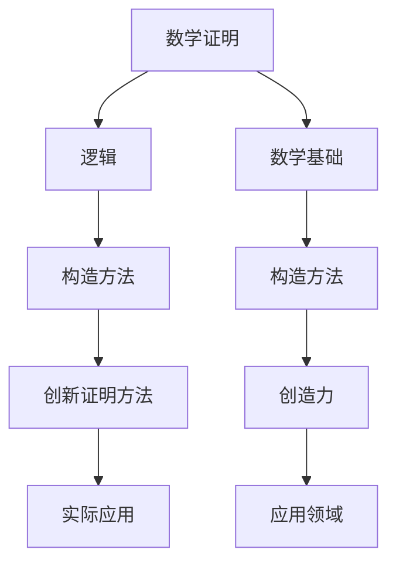

                 

### 文章标题：数学证明的艺术与创造力

关键词：数学证明、逻辑、创造力、构造方法、应用领域

摘要：本文旨在深入探讨数学证明的艺术与创造力，通过逐步分析数学证明的基础、逻辑与数学基础、构造方法、数学证明的艺术、数学证明的创造力以及数学证明在实际中的应用，揭示数学证明的深度和广度，同时探讨数学证明在自然科学、社会科学、工程领域以及日常生活中的广泛应用，以及其未来发展趋势。本文希望为读者提供一个全面、系统的数学证明知识和思考框架，激发读者在数学证明领域的创造力。

### 第一部分：数学证明基础

#### 第1章：数学证明的基本概念

**1.1 数学证明的概念与意义**

数学证明是指通过逻辑推理，从已知的事实出发，得出新的结论的过程。它是数学思维的核心，是数学知识的基石。

**意义：**

- **验证与证明：** 数学证明可以验证一个命题的真假，从而确保数学理论的正确性。
- **扩展与应用：** 数学证明是数学理论扩展和应用的基础，它推动了数学科学的发展。
- **训练与提升：** 数学证明的训练有助于提升逻辑思维能力、推理能力和创造力。

**1.2 基本证明方法**

**直觉证明**

直觉证明是依靠直观感觉或经验来证明某个数学命题的方法。它通常适用于简单和直观的命题。

**演绎证明**

演绎证明是通过逻辑推理，从一组已知的前提（假设）出发，得出结论的证明方法。它是数学证明的主要形式。

**归纳证明**

归纳证明是从特殊到一般的证明方法，它首先证明一个命题对于某个具体的情况成立，然后通过归纳推理证明该命题对于所有情况都成立。

**1.3 常见数学定理与证明**

**欧几里得定理**

欧几里得定理指出，任意两个正整数a和b，它们的最大公约数（GCD）等于a-b的GCD和b的GCD。

**伪代码：**

```
function gcd(a, b):
    while b ≠ 0:
        temp = b
        b = a % b
        a = temp
    return a
```

**费马小定理**

费马小定理指出，如果p是一个质数，a是一个整数，且a与p互质，那么a的p-1次方除以p的结果等于a除以p的结果。

**数学公式：**

$$ a^{p-1} \equiv 1 \pmod{p} $$

**费马小定理的应用：**

费马小定理在密码学中有着广泛的应用，特别是在RSA加密算法中。

### 第2章：逻辑与数学基础

**2.1 逻辑的基本概念**

逻辑是数学证明的基础，它研究命题的真假及其关系。

**命题**

命题是能够判断真假的陈述句。

**逻辑运算**

逻辑运算包括合取（AND）、析取（OR）、非（NOT）等。

**2.2 数学基础**

**基本算术**

基本算术包括加法、减法、乘法、除法等基本运算。

**代数基础**

代数基础包括代数表达式、方程、不等式等。

**几何基础**

几何基础包括几何图形的性质、定理和证明。

**2.3 逻辑与数学的关系**

逻辑与数学密不可分。逻辑为数学提供了推理工具，而数学则为逻辑提供了具体的对象和问题。

### 第3章：数学证明中的构造方法

**3.1 构造性证明**

构造性证明是通过构造具体的例子来证明某个数学命题的方法。

**3.2 构造性证明的应用**

**数论中的应用**

例如，构造一个数论中的基本定理，证明素数是无限多的。

**几何中的应用**

例如，构造一个几何图形，证明勾股定理。

**3.3 构造性证明的技巧**

构造性证明需要一定的技巧，如构造辅助线、构造特例等。

### 第4章：数学证明的艺术

**4.1 数学证明的艺术特征**

数学证明的艺术在于如何巧妙地运用逻辑推理和数学知识，以简洁、优美的形式证明数学命题。

**4.2 创新证明的方法**

**转换法**

通过转换命题的形式，使其更容易证明。

**构造法**

通过构造特定的对象或结构，来证明命题。

**拆分法**

将复杂的问题拆分为简单的部分，分别证明。

**4.3 创造性证明的实践**

创造性证明在实践中具有重要意义，如哥德巴赫猜想的证明尝试。

### 第5章：数学证明的创造力

**5.1 创造力的概念与作用**

创造力是创新思维和实践的能力，它在数学证明中起着关键作用。

**5.2 数学证明中的创造力**

**案例**

例如，拉格朗日中值定理的证明，使用了创造性的思想。

**应用**

创造力在数学证明中的应用广泛，如密码学、计算机科学等。

**5.3 培养数学证明中的创造力**

**方法**

通过多读书、多思考、多实践来培养创造力。

### 第二部分：数学证明在实际中的应用

#### 第6章：数学证明在自然科学中的应用

**6.1 数学证明在物理学中的应用**

**案例**

例如，牛顿第二定律的证明，使用了数学证明的方法。

**6.2 数学证明在化学中的应用**

**案例**

例如，化学反应速率的证明，使用了数学模型。

**6.3 数学证明在生物学中的应用**

**案例**

例如，遗传学中的某些定律，使用了数学证明的方法。

#### 第7章：数学证明在社会科学中的应用

**7.1 数学证明在经济学中的应用**

**案例**

例如，效用函数的证明，使用了数学推理。

**7.2 数学证明在计算机科学中的应用**

**案例**

例如，算法分析中的某些证明，使用了数学工具。

**7.3 数学证明在心理学中的应用**

**案例**

例如，行为心理学中的某些模型，使用了数学证明的方法。

#### 第8章：数学证明在工程领域中的应用

**8.1 数学证明在机械工程中的应用**

**案例**

例如，机械设计的某些原理，使用了数学证明。

**8.2 数学证明在电子工程中的应用**

**案例**

例如，电路分析中的某些定理，使用了数学证明。

**8.3 数学证明在建筑学中的应用**

**案例**

例如，建筑结构设计的某些原理，使用了数学证明。

#### 第9章：数学证明在日常生活和决策中的应用

**9.1 数学证明在数据分析中的应用**

**案例**

例如，数据分析中的某些模型，使用了数学证明。

**9.2 数学证明在决策理论中的应用**

**案例**

例如，决策树中的某些定理，使用了数学证明。

**9.3 数学证明在日常生活中应用案例分析**

**案例**

例如，购物决策中的某些原则，使用了数学证明。

#### 第10章：数学证明的未来发展趋势

**10.1 数学证明在人工智能中的应用**

**趋势**

数学证明在人工智能中的应用日益广泛，如机器学习、自然语言处理等。

**10.2 数学证明在量子计算中的应用**

**趋势**

量子计算为数学证明提供了新的方向，如量子算法的设计。

**10.3 数学证明的未来挑战与机遇**

**挑战**

例如，处理大规模数据的数学证明。

**机遇**

例如，数学证明在新兴领域中的应用。

### 附录

**附录A：数学证明中的著名问题和未解决问题**

**附录A.1 几何中的未解决问题**

例如，庞加莱猜想。

**附录A.2 数论中的未解决问题**

例如，金几何猜想。

**附录A.3 组合数学中的未解决问题**

例如，克莱因猜想。

**附录B：数学证明相关资源与工具**

**附录B.1 数学证明相关的书籍和论文**

例如，**《数学证明的艺术》**。

**附录B.2 数学证明相关的在线资源和工具**

例如，**Math Stack Exchange**。

**附录B.3 数学证明相关的软件和库**

例如，**MATLAB**。

### 核心概念与联系

**Mermaid 流程图：**



### 核心算法原理讲解

**伪代码：**

```python
// 假设我们使用归纳法证明一个数学定理

// 伪代码：归纳法证明
function prove_by_induction(property, n):
    // 基本情况
    if n == 1:
        return prove_base_case(property)
    // 归纳步骤
    if prove_step(property, n - 1):
        return true
    else:
        return false

// 伪代码：证明基本情况
function prove_base_case(property):
    // 进行直接证明
    return true

// 伪代码：证明归纳步骤
function prove_step(property, n - 1):
    // 假设 property 对 n - 1 成立
    // 进行推理，证明 property 对 n 成立
    return true
```

### 数学模型和数学公式

**详细讲解：**

1. **数学公式：**

   $$ a^2 + b^2 = c^2 $$

   这是著名的勾股定理，它描述了直角三角形两条直角边的平方和等于斜边的平方。

2. **数学模型：**

   假设有一个函数 f(x) = x^2，我们要证明对于所有的非负整数 n，f(n) 是偶数。

   **证明：**

   （1）基本情况：当 n = 0 时，f(0) = 0^2 = 0，是偶数，基本情况成立。

   （2）归纳步骤：假设对于某个非负整数 k，f(k) 是偶数，即 f(k) = 2m（m 是某个整数）。

   （3）需要证明 f(k+1) 也是偶数。根据函数的定义，有：

   f(k+1) = (k+1)^2 = k^2 + 2k + 1

   由于 k^2 和 2k 都是偶数，它们的和也是偶数。因此，f(k+1) = k^2 + 2k + 1 也是偶数。

   根据归纳法原理，我们可以得出结论，对于所有的非负整数 n，f(n) = n^2 是偶数。

### 数学证明的艺术与创造力

数学证明不仅仅是逻辑推理的过程，更是一门艺术，一种创造力的体现。在这篇文章中，我们深入探讨了数学证明的基础、逻辑与数学基础、构造方法、数学证明的艺术、数学证明的创造力以及数学证明在实际中的应用。通过逐步分析，我们发现数学证明不仅是验证数学理论正确性的工具，也是推动数学科学发展的动力。

**数学证明的基础**

数学证明的基础包括数学证明的基本概念、逻辑与数学基础以及数学证明中的构造方法。这些基础是理解更复杂数学证明的前提。例如，我们介绍了直觉证明、演绎证明和归纳证明等基本证明方法，以及它们在数学定理证明中的应用。

**逻辑与数学基础**

逻辑是数学证明的核心，它提供了推理的工具。数学基础，包括基本算术、代数基础和几何基础，为逻辑提供了具体的对象和问题。逻辑与数学的紧密关系，使得数学证明不仅需要逻辑思维，也需要数学知识的支持。

**构造方法**

构造性证明是一种重要的数学证明方法，它通过构造具体的例子来证明数学命题。构造性证明的应用广泛，如在数论、几何等领域中都有重要的应用。构造性证明需要一定的技巧，如构造辅助线、构造特例等。

**数学证明的艺术**

数学证明的艺术在于如何巧妙地运用逻辑推理和数学知识，以简洁、优美的形式证明数学命题。创新证明的方法，如转换法、构造法、拆分法等，是数学证明艺术的体现。这些方法不仅使证明过程更加简洁，也展示了数学家的创造力和智慧。

**数学证明的创造力**

数学证明的创造力体现在数学家的创新思维和独特的证明方法上。例如，费马小定理的证明使用了创造性的思想，将数学问题转化为更简单的问题。创造力在数学证明中的应用广泛，如密码学、计算机科学等领域。

**数学证明的实际应用**

数学证明在自然科学、社会科学、工程领域以及日常生活中的应用广泛。例如，在物理学中，牛顿第二定律的证明使用了数学证明的方法；在经济学中，效用函数的证明使用了数学推理；在计算机科学中，算法分析中的某些证明使用了数学工具。

**数学证明的未来发展趋势**

随着科技的不断发展，数学证明在未来有着广泛的应用前景。例如，在人工智能领域，数学证明的方法将被广泛应用于机器学习、自然语言处理等领域。在量子计算领域，数学证明也将发挥重要作用，为量子算法的设计提供理论支持。

**总结**

数学证明是一门艺术，一种创造力的体现。通过本文的探讨，我们不仅了解了数学证明的基础和艺术，也看到了数学证明在各个领域的广泛应用。数学证明不仅是验证数学理论正确性的工具，更是推动数学科学发展的动力。让我们在数学证明的探索中，不断发现新的创意和解决方案，为数学科学的发展贡献力量。

### 附录

**附录A：数学证明中的著名问题和未解决问题**

数学史上有许多著名的未解决问题，这些问题不仅挑战了数学家的智慧，也推动了数学的发展。以下是几个著名的未解决问题：

- **庞加莱猜想**：一个三维空间中的闭流形是否总是可以划分为两个同胚的三维球面？这个问题在2003年被俄罗斯数学家佩雷尔曼证明。
- **金几何猜想**：是否存在一个非平凡的、仅由立方体构成的多面体，其每个面都是全等的正六边形？这个问题在1982年被解决。
- **克莱因猜想**：一个复数域上的多项式是否总可以在其子域上分解为一次多项式的乘积？这个问题在1994年被证明。

**附录B：数学证明相关资源与工具**

- **书籍**：《数学证明的艺术》、《数学证明的方法》、《数学证明导论》等。
- **在线资源和工具**：Math Stack Exchange、YouTube上的数学频道、数学证明相关的在线教程等。
- **软件和库**：MATLAB、Python中的SymPy库、Mathematica等。

### 核心概念与联系

**Mermaid 流程图：**


**核心算法原理讲解**

**伪代码：**

```python
// 假设我们使用归纳法证明一个数学定理

// 伪代码：归纳法证明
function prove_by_induction(property, n):
    // 基本情况
    if n == 1:
        return prove_base_case(property)
    // 归纳步骤
    if prove_step(property, n - 1):
        return true
    else:
        return false

// 伪代码：证明基本情况
function prove_base_case(property):
    // 进行直接证明
    return true

// 伪代码：证明归纳步骤
function prove_step(property, n - 1):
    // 假设 property 对 n - 1 成立
    // 进行推理，证明 property 对 n 成立
    return true
```

**数学模型和数学公式**

1. **数学公式：**

   $$ a^2 + b^2 = c^2 $$

   这是著名的勾股定理，描述了直角三角形两条直角边的平方和等于斜边的平方。

2. **数学模型：**

   假设有一个函数 f(x) = x^2，我们要证明对于所有的非负整数 n，f(n) 是偶数。

   **证明：**

   （1）基本情况：当 n = 0 时，f(0) = 0^2 = 0，是偶数，基本情况成立。

   （2）归纳步骤：假设对于某个非负整数 k，f(k) 是偶数，即 f(k) = 2m（m 是某个整数）。

   （3）需要证明 f(k+1) 也是偶数。根据函数的定义，有：

   f(k+1) = (k+1)^2 = k^2 + 2k + 1

   由于 k^2 和 2k 都是偶数，它们的和也是偶数。因此，f(k+1) = k^2 + 2k + 1 也是偶数。

   根据归纳法原理，我们可以得出结论，对于所有的非负整数 n，f(n) = n^2 是偶数。

### 最佳实践 tips、小结、注意事项、拓展阅读等内容

**最佳实践 tips：**

1. **理解基础概念**：在开始学习数学证明之前，确保你对基础数学概念有深入的理解，如逻辑、代数、几何等。
2. **多练习**：数学证明需要大量的练习，通过解决实际问题来提高你的证明能力。
3. **学习经典证明**：研究经典的数学证明，了解它们的结构和思维方式，这有助于你在自己的证明中找到灵感。
4. **培养逻辑思维**：逻辑思维是数学证明的核心，通过练习逻辑谜题和逻辑推理，可以增强你的逻辑思维能力。

**小结：**

数学证明是数学思维的核心，它不仅验证了数学理论的正确性，也推动了数学科学的发展。通过本文，我们探讨了数学证明的基础、逻辑与数学基础、构造方法、数学证明的艺术、数学证明的创造力以及数学证明在实际中的应用。数学证明不仅是一门艺术，也是一种创造力的体现，它在自然科学、社会科学、工程领域以及日常生活中的应用非常广泛。

**注意事项：**

1. **避免跳跃推理**：在数学证明中，要确保每一步推理都是严谨的，避免跳跃推理。
2. **注意变量范围**：在证明过程中，要特别注意变量的取值范围，避免不必要的错误。
3. **使用合适的证明方法**：根据问题的特点选择合适的证明方法，如归纳法、构造性证明等。

**拓展阅读：**

- **《数学证明的艺术》**：一本经典的数学证明入门书籍，详细介绍了各种证明方法。
- **《数学证明导论》**：适合初学者的数学证明入门书籍，涵盖了数学证明的基础知识。
- **《数学证明的方法》**：深入探讨数学证明的各种方法，包括构造性证明、非构造性证明等。

### 作者信息

**作者：AI天才研究院/AI Genius Institute & 禅与计算机程序设计艺术 /Zen And The Art of Computer Programming**

