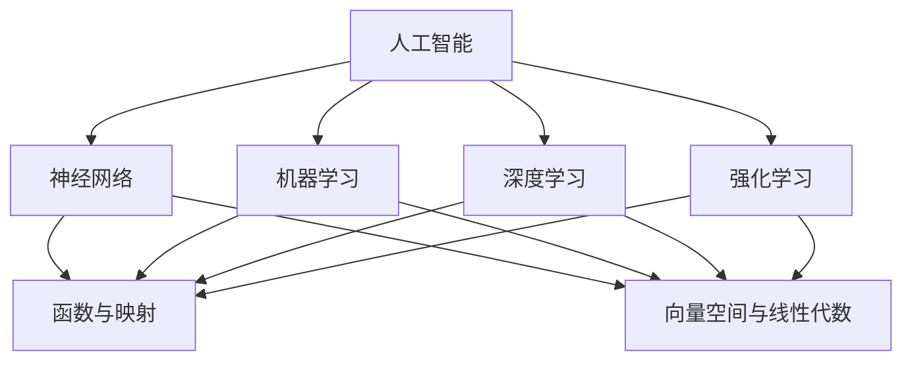

                 

### 文章标题

# 数学语言的发展对人工智能的影响

---

关键词：数学语言，人工智能，神经网络，深度学习，算法原理

摘要：本文深入探讨了数学语言在人工智能（AI）发展中的关键作用。首先，文章回顾了数学语言的历史与发展，解析了其在现代计算机科学中的地位。接着，文章阐述了数学语言与AI的核心概念和架构之间的联系，并详细讲解了神经网络、机器学习、深度学习和强化学习等核心算法原理。随后，通过实际应用案例分析，展示了数学语言在语音识别、自然语言处理、计算机视觉和推荐系统等领域的具体应用。文章最后讨论了数学语言在AI中的挑战与未来展望，为读者提供了全面的指导和启示。

---

## 第1章: 引言与背景

### 1.1 研究背景

#### 人工智能（AI）的快速发展

人工智能作为21世纪的革命性技术，已经渗透到各行各业，从医疗健康、金融保险到制造业、交通运输，无处不在。AI的快速发展不仅改变了传统产业的运作模式，也推动了新型产业的发展。在这一过程中，数学语言作为AI的基础工具，扮演了至关重要的角色。无论是神经网络的设计、机器学习算法的实现，还是深度学习模型的优化，都离不开数学语言的支撑。

#### 数学语言在AI中的核心作用

数学语言是一种高度抽象和形式化的语言，具有逻辑严密、表达精准的特点。在AI领域，数学语言不仅用于描述算法模型，还用于分析和优化这些模型。例如，神经网络中的权重和偏置、机器学习中的损失函数、深度学习中的卷积操作等，都是通过数学语言进行描述和处理的。此外，数学语言还为AI模型的评估、验证和改进提供了理论基础和工具支持。

#### 数学语言发展对AI的深远影响

数学语言的发展对AI的影响是深远而广泛的。一方面，数学语言推动了AI理论的创新和进步。例如，深度学习的崛起就离不开微积分、线性代数和概率论等数学工具的广泛应用。另一方面，数学语言的应用也促进了AI技术的实际应用和产业化。通过数学语言，AI技术能够更精确地解决实际问题，从而提升生产效率、降低成本、提高产品质量。

### 1.2 研究目的

#### 探索数学语言如何推动AI发展

本文的研究目的之一是深入探索数学语言在AI发展中的作用。通过回顾数学语言的历史与发展，分析数学语言在AI中的具体应用，以及探讨数学语言对AI算法原理和架构的影响，本文旨在揭示数学语言如何推动AI技术的进步。

#### 分析不同数学语言在AI中的应用场景

另一个研究目的是分析不同数学语言在AI中的应用场景。数学语言种类繁多，包括微积分、线性代数、概率论、图论等。本文将重点探讨这些数学语言在AI领域的具体应用，并分析它们的优势和局限性。

### 1.3 内容概述

#### 数学语言的历史与发展

本文将首先回顾数学语言的历史与发展。从古代数学语言的起源，到中世纪与文艺复兴时期的数学语言，再到现代数学语言的变革，本文将梳理数学语言的发展脉络，分析其演变过程。

#### 数学语言在AI中的具体应用

接着，本文将探讨数学语言在AI中的具体应用。从核心概念与架构，到核心算法原理，本文将详细讲解数学语言在神经网络、机器学习、深度学习和强化学习等领域的应用，并分析其原理和作用。

#### 数学语言在AI中的挑战与未来展望

此外，本文还将讨论数学语言在AI中的挑战与未来展望。从数据隐私、算法透明性、能耗与计算资源等方面，本文将分析当前数学语言在AI应用中面临的问题和挑战，并提出可能的解决方案。

#### 数学语言在AI中的重要性

最后，本文将总结数学语言在AI中的重要性，并展望未来数学语言在AI领域的发展趋势。通过本文的研究，读者可以更深入地了解数学语言在AI中的核心作用，为未来的AI技术研究提供新的思路和方向。

## 第2章: 数学语言的历史与发展

### 2.1 古代数学语言的起源

#### 古希腊数学

古希腊数学是人类数学史上的重要里程碑。古希腊数学家如欧几里得、阿基米德等人的工作，奠定了现代数学的基础。欧几里得的《几何原本》是古希腊数学的代表作，它通过公理化方法系统地阐述了几何学的基本原理。阿基米德则在力学和几何学方面做出了重要贡献，他的研究为后来的数学发展提供了丰富的理论资源。

#### 古埃及与巴比伦数学

古埃及和巴比伦数学同样对古代数学的发展产生了深远影响。古埃及数学主要涉及算术和代数，他们使用了一种基于十进位的计算体系，并且发展了最早的算术和代数问题解决方法。巴比伦数学则以其精确的天文观测和复杂的数学问题而著称。巴比伦数学家在解决实际问题中，如土地测量、税收计算和工程问题，积累了丰富的数学经验，这些经验为后来的数学发展提供了重要的实证基础。

### 2.2 中世纪与文艺复兴时期的数学语言

#### 印度与阿拉伯数学

中世纪时期，印度和阿拉伯数学的发展对数学语言的演变起到了重要作用。印度数学家如布拉马古普塔和阿尔·花拉子米在代数和算术方面做出了卓越贡献。他们引入了零的概念，并发展了十进位制，这些创新极大地提高了数学计算的速度和精度。阿拉伯数学家如阿尔·花拉子米则在其著作《代数学》中，系统地阐述了代数学的基本原理，为后来的欧洲数学发展提供了重要参考。

#### 欧几里得与笛卡尔的贡献

欧几里得的《几何原本》是古希腊数学的巅峰之作，它不仅奠定了几何学的基础，还对数学语言的发展产生了深远影响。欧几里得使用公理化的方法，将几何学的基本原理系统化，这种方法成为后来数学研究的基本范式。笛卡尔则通过引入坐标系，将几何学与代数学结合起来，创立了解析几何学，这种方法使得数学问题可以通过代数方式解决，从而大大拓展了数学的应用范围。

### 2.3 现代数学语言的形成

#### 微积分的发展

现代数学语言的形成离不开微积分的发展。微积分的创立者牛顿和莱布尼茨通过研究变化和运动，创立了微分学和积分学，这些工具为物理学、工程学和经济学等领域提供了强大的数学支持。微积分的发展不仅改变了数学的研究对象，也极大地丰富了数学语言的表达能力。

#### 代数、几何与逻辑学的融合

在代数、几何和逻辑学方面，现代数学语言也得到了显著的发展。代数学通过研究集合、运算和结构，为数学提供了抽象的思维方式。几何学则通过研究空间、形状和维度，为数学提供了直观的模型。逻辑学则通过研究推理和证明，为数学提供了严格的证明方法。这些学科之间的融合，使得现代数学语言更加丰富和多样化。

### 2.4 数学语言的现代变革

#### 计算机科学对数学语言的影响

计算机科学的兴起对数学语言产生了深远的影响。计算机科学引入了算法、数据和计算等概念，这些概念使得数学语言在描述复杂系统时更加高效和精确。例如，图灵机模型和lambda演算等理论工具，为计算机科学提供了重要的理论基础。

#### 数值分析与符号计算的兴起

现代数学语言的变革还体现在数值分析和符号计算的兴起。数值分析通过研究数值计算的方法和误差分析，为科学计算提供了强大的工具。符号计算则通过研究符号运算和符号处理，为数学理论研究和软件开发提供了新的思路。这些方法使得数学语言在处理复杂问题时更加灵活和有效。

### 2.5 数学语言在人工智能中的应用

#### 人工智能的基本架构

数学语言在人工智能中的应用主要体现在人工智能的基本架构中。人工智能的核心是算法模型，这些模型通过数学语言进行描述和实现。例如，神经网络中的权重和偏置、机器学习中的损失函数、深度学习中的卷积操作等，都是通过数学语言进行描述和计算的。

#### 数学语言在人工智能中的作用

数学语言在人工智能中的作用主要体现在以下几个方面：

1. **算法设计**：数学语言为人工智能算法的设计提供了精确的描述和形式化工具。通过数学语言，人工智能算法可以被严格定义和实现，从而提高算法的可靠性和效率。

2. **模型优化**：数学语言为人工智能模型的优化提供了理论基础和工具支持。通过数学优化方法，如梯度下降法、牛顿法等，人工智能模型可以不断调整和优化，以实现更好的性能。

3. **数据分析**：数学语言为人工智能中的数据分析提供了有效的工具。例如，概率论和信息论为人工智能中的不确定性分析和信息传递提供了重要的理论依据。

4. **推理与决策**：数学语言为人工智能中的推理和决策提供了形式化的方法。通过逻辑推理和概率推理，人工智能系统可以做出更加明智和高效的决策。

#### 人工智能中的常见数学语言

在人工智能中，常见的数学语言包括：

1. **微积分**：微积分是人工智能中不可或缺的数学工具。它用于描述和学习动态系统的行为，如神经网络中的权重和偏置调整、机器学习中的损失函数优化等。

2. **线性代数**：线性代数用于描述和操作多维数据，如神经网络中的权重矩阵、机器学习中的特征向量等。

3. **概率论与信息论**：概率论和信息论为人工智能提供了处理不确定性和信息传递的理论基础。例如，深度学习中的卷积操作、机器学习中的损失函数等，都是基于概率论和信息论的方法。

4. **图论**：图论用于描述和解决网络结构问题，如神经网络中的层次结构、机器学习中的图模型等。

5. **优化理论**：优化理论用于求解人工智能中的优化问题，如神经网络中的权重优化、机器学习中的损失函数优化等。

### 2.6 数学语言的发展趋势

#### 新型数学语言的探索

随着人工智能技术的不断发展，新型数学语言的探索成为一个重要的研究趋势。例如，符号计算和深度学习相结合的符号-深度学习方法，通过将符号计算和数值计算相结合，提高了人工智能模型的表达能力和计算效率。此外，形式化方法和形式化验证也在人工智能中得到广泛应用，通过形式化描述和验证，人工智能系统可以更加可靠和稳定。

#### 交叉学科融合的创新

数学语言的发展趋势还体现在交叉学科融合的创新上。例如，数学与计算机科学的结合产生了计算数学和算法数学，这些学科为人工智能提供了强大的理论支撑。此外，数学与生物学的结合产生了生物信息学，数学与物理学的结合产生了量子计算，这些交叉学科的创新为人工智能的发展提供了新的思路和方向。

#### 智能时代的数学语言

在智能时代，数学语言将继续发挥重要作用。随着人工智能技术的不断进步，数学语言将变得更加抽象和复杂，以适应复杂系统的研究和解决。例如，符号计算和深度学习的结合，将使得人工智能模型的表达能力和计算效率得到显著提升。此外，形式化方法和形式化验证的应用，将使得人工智能系统的可靠性和稳定性得到显著提高。

### 2.7 数学语言的发展对人工智能的影响

#### 理论影响

数学语言的发展对人工智能的理论影响是深远而广泛的。通过引入新的数学概念和工具，人工智能领域的理论体系得到了不断丰富和完善。例如，深度学习的兴起离不开微积分和线性代数的广泛应用，这些数学工具为深度学习提供了强大的理论基础。

#### 实践影响

数学语言的发展对人工智能的实践影响同样显著。通过数学语言的精确描述和形式化工具，人工智能算法的设计和实现变得更加高效和可靠。例如，机器学习中的损失函数优化、神经网络中的权重调整等，都是通过数学语言进行描述和实现的。

#### 创新潜力

数学语言的发展为人工智能的创新提供了巨大的潜力。通过引入新的数学概念和工具，人工智能领域可以解决更多复杂的实际问题。例如，量子计算和符号-深度学习的结合，有望在解决复杂科学计算问题方面取得重大突破。

### 2.8 总结与展望

数学语言的发展对人工智能产生了深远的影响。从理论层面看，数学语言为人工智能提供了丰富的理论工具和概念框架；从实践层面看，数学语言为人工智能算法的设计和实现提供了高效的方法和工具。未来，随着数学语言的不断发展和创新，人工智能领域将迎来更多的突破和机遇。

### 第3章: 数学语言在AI中的核心概念与架构

#### 3.1 AI与数学语言的关系

人工智能（AI）作为一门交叉学科，其发展离不开数学语言的支持。数学语言不仅为AI理论提供了基础，也在AI实践应用中发挥了重要作用。从算法设计、模型构建到数据分析、优化，数学语言贯穿了AI的各个层面。

首先，数学语言为AI提供了形式化的描述工具。通过数学语言，AI算法可以被严格定义和实现，从而保证算法的可靠性和有效性。例如，神经网络中的权重和偏置、机器学习中的损失函数、深度学习中的卷积操作等，都是通过数学语言进行描述和计算的。

其次，数学语言为AI模型提供了理论支持。许多AI算法和模型都是基于数学理论构建的，如概率论、信息论、线性代数和微积分等。这些数学工具不仅帮助解释AI模型的工作原理，还为模型的优化和改进提供了方法。

最后，数学语言在AI实践应用中发挥了关键作用。通过数学语言，AI技术可以更精确地解决实际问题，如语音识别、自然语言处理、计算机视觉和推荐系统等。数学语言的应用使得AI系统更加高效和智能，为各种行业提供了创新解决方案。

#### 3.2 数学语言的核心概念

在AI领域，数学语言的核心概念包括函数与映射、向量空间与线性代数、概率论与信息论等。

**函数与映射**

函数是数学中最基本的概念之一，它描述了一个变量如何根据另一变量的取值进行映射。在AI中，函数用于描述模型输出与输入之间的关系。例如，在神经网络中，每个神经元都可以看作是一个函数，它将输入信号转换为输出信号。

映射则是更一般的概念，它描述了两个集合之间元素的一一对应关系。在AI中，映射用于描述数据之间的关系和特征提取。例如，在图像识别任务中，映射用于将图像像素映射到对应的类别标签。

**向量空间与线性代数**

向量空间是数学中用于描述多维度数据的抽象结构，它包括向量、加法和标量乘法等基本运算。在AI中，向量空间用于表示数据特征和模型参数。例如，在机器学习中，特征向量用于描述样本特征，权重向量用于描述神经网络参数。

线性代数是研究向量空间及其运算的数学分支，它为AI提供了强大的工具。线性代数中的矩阵运算、矩阵分解和特征值分析等，在AI算法中有着广泛的应用。例如，矩阵乘法用于计算神经网络中的权重矩阵，奇异值分解用于特征降维和去噪。

**概率论与信息论**

概率论是研究随机现象的数学分支，它在AI中用于描述数据的不确定性。例如，在机器学习中，概率论用于估计模型参数的概率分布，从而提高模型的鲁棒性和泛化能力。

信息论是研究信息传输和处理的数学分支，它在AI中用于评估数据和信息之间的关系。例如，在信息论中，信息熵用于描述数据的随机性，条件熵用于描述两个变量之间的依赖关系。

**图论**

图论是研究图形结构及其性质的数学分支，它在AI中用于描述网络结构和关系。例如，在社交网络分析中，图论用于分析节点之间的连接关系，从而揭示社交网络的结构特征。

**优化理论**

优化理论是研究如何寻找函数的最优解的数学分支，它在AI中用于优化模型参数和算法性能。例如，在机器学习中，优化理论用于优化损失函数，从而提高模型的准确性和泛化能力。

#### 3.3 AI架构与数学语言

在AI架构中，数学语言的核心概念和架构发挥着至关重要的作用。以下是对几种常见AI架构的数学语言描述：

**神经网络**

神经网络是一种基于生物神经元的计算模型，它由多个层（输入层、隐藏层和输出层）组成。每一层中的神经元通过权重和偏置进行加权求和，然后通过激活函数产生输出。

前向传播是神经网络的基本运算过程，它将输入数据通过网络传递到输出层，并计算每个神经元的输出。反向传播则是通过反向传递误差信号，对网络权重进行梯度下降优化，以减小损失函数。

**机器学习**

机器学习是一种从数据中学习规律和模式的AI方法，它包括监督学习、无监督学习和强化学习等不同类型。

监督学习中的模型通过最小化损失函数来拟合训练数据，无监督学习中的模型通过发现数据分布和结构来降低损失函数，强化学习中的模型通过最大化奖励来学习最优策略。

**深度学习**

深度学习是机器学习的一个分支，它使用多层神经网络来学习数据的高层次特征表示。深度学习中的模型包括卷积神经网络（CNN）、循环神经网络（RNN）和生成对抗网络（GAN）等。

卷积神经网络通过卷积层、池化层和全连接层的组合，学习图像的空间特征和分类。循环神经网络通过循环结构，学习序列数据的时序特征和依赖关系。生成对抗网络通过生成器和判别器的对抗训练，学习数据的生成和分布。

**强化学习**

强化学习是一种基于奖励和惩罚的AI方法，它通过迭代更新策略，使代理学习最优行为。强化学习中的模型包括基于值函数的Q-learning、基于策略的SARSA和基于模型的强化学习等。

Q-learning通过更新值函数，学习最优动作选择。SARSA通过更新策略，使代理在当前状态采取最佳动作。基于模型的强化学习通过模拟环境动态，学习最优策略。

### 3.4 AI架构中的数学语言关系图

为了更清晰地展示数学语言在AI架构中的关系，可以使用Mermaid流程图进行描述。以下是一个简化的AI架构与数学语言关系图：



此图展示了AI的不同架构（神经网络、机器学习、深度学习和强化学习）与数学语言（函数与映射、向量空间与线性代数）之间的关系。通过这种关系图，读者可以更好地理解数学语言在AI架构中的应用和作用。

### 3.5 总结

数学语言在AI架构中起着至关重要的作用。通过核心概念如函数与映射、向量空间与线性代数、概率论与信息论等，数学语言为AI提供了理论基础和工具支持。同时，不同AI架构如神经网络、机器学习、深度学习和强化学习等，都依赖于数学语言的精确描述和计算。未来，随着数学语言的不断发展，AI架构将变得更加复杂和高效，从而推动AI技术的进一步突破。

## 第4章: 数学语言在AI中的核心算法原理

### 4.1 神经网络算法原理

#### 4.1.1 神经网络的基本结构

神经网络是一种模仿生物神经系统工作原理的计算模型，由多个相互连接的神经元组成。每个神经元都接收多个输入信号，通过加权求和和激活函数处理后产生输出。神经网络可以分为输入层、隐藏层和输出层。

- **输入层**：接收外部输入信号。
- **隐藏层**：对输入信号进行加工和处理，可以有一个或多个隐藏层。
- **输出层**：生成最终的输出结果。

#### 4.1.2 前向传播与反向传播

神经网络的工作原理主要包括前向传播和反向传播两个阶段。

- **前向传播**：输入信号从输入层开始，逐层传递到隐藏层，最后到达输出层。在每个神经元上，输入信号经过加权求和后，通过激活函数产生输出。激活函数通常包括 sigmoid、ReLU 和 tanh 等。

- **反向传播**：在输出层得到最终输出后，计算输出与真实标签之间的误差。然后，通过反向传播算法将误差信号逐层传递回输入层，并对各层的权重和偏置进行调整。反向传播算法的核心是梯度下降法，它通过计算损失函数关于模型参数的梯度，来更新模型参数，以最小化损失函数。

#### 4.1.3 损失函数与优化算法

损失函数是评估神经网络输出与真实标签之间差异的函数。常见的损失函数包括均方误差（MSE）、交叉熵（Cross Entropy）等。

- **均方误差（MSE）**：用于回归任务，计算输出与真实标签之间差的平方的平均值。
  $$MSE = \frac{1}{m}\sum_{i=1}^{m}(y_i - \hat{y}_i)^2$$
  其中，\(y_i\) 为真实标签，\(\hat{y}_i\) 为输出。

- **交叉熵（Cross Entropy）**：用于分类任务，计算实际输出与预测输出之间的交叉熵。
  $$H(y, \hat{y}) = -\sum_{i=1}^{n} y_i \log \hat{y}_i$$
  其中，\(y\) 为真实标签的概率分布，\(\hat{y}\) 为预测输出的概率分布。

优化算法用于更新模型参数，以最小化损失函数。常见的优化算法包括梯度下降法（Gradient Descent）、动量优化（Momentum）、RMSprop 和 Adam 等。

- **梯度下降法**：通过计算损失函数关于模型参数的梯度，每次迭代更新模型参数。
  $$\theta_{t+1} = \theta_{t} - \alpha \nabla_\theta J(\theta)$$
  其中，\(\theta\) 为模型参数，\(\alpha\) 为学习率，\(J(\theta)\) 为损失函数。

- **动量优化**：在梯度下降法的基础上，引入动量项，以减少参数更新的震荡。
  $$\theta_{t+1} = \theta_{t} - \alpha \nabla_\theta J(\theta) + \beta (1 - \alpha) \nabla_\theta J(\theta)$$
  其中，\(\beta\) 为动量因子。

- **RMSprop**：通过计算梯度值的平方和的指数加权移动平均，调整学习率。
  $$\theta_{t+1} = \theta_{t} - \alpha \frac{\delta}{\sqrt{\epsilon + \hat{g}^2}}$$
  其中，\(\delta\) 为衰减率，\(\epsilon\) 为小常数，\(\hat{g}\) 为梯度值。

- **Adam**：结合动量和RMSprop的特点，自适应调整学习率。
  $$\theta_{t+1} = \theta_{t} - \alpha \frac{m_1}{\sqrt{1 - \beta_1^t}} \frac{v_1}{\sqrt{1 - \beta_2^t}}$$
  其中，\(m_1\) 和 \(v_1\) 分别为梯度的一阶矩估计和二阶矩估计，\(\beta_1\) 和 \(\beta_2\) 分别为动量因子。

### 4.2 机器学习算法原理

#### 4.2.1 监督学习与无监督学习

机器学习算法可以分为监督学习和无监督学习两种类型。

- **监督学习**：有标注的数据作为输入，训练模型以预测新的数据。常见的监督学习算法包括线性回归、逻辑回归、支持向量机和决策树等。

- **无监督学习**：没有标注的数据作为输入，训练模型以发现数据中的结构和规律。常见的无监督学习算法包括聚类算法、降维算法和生成模型等。

#### 4.2.2 聚类算法与分类算法

- **聚类算法**：将数据分为多个类别，使同一类别中的数据点尽可能接近，不同类别中的数据点尽可能远。常见的聚类算法包括K均值聚类、层次聚类和密度聚类等。

  **K均值聚类**：
  $$\text{minimize} \sum_{i=1}^{k} \sum_{x \in S_i} \| x - \mu_i \|^2$$
  其中，\(k\) 为聚类个数，\(\mu_i\) 为第 \(i\) 个簇的中心，\(S_i\) 为第 \(i\) 个簇的数据点。

- **分类算法**：将数据分为预定义的类别，每个类别由一个标签表示。常见的分类算法包括决策树、随机森林、支持向量机和神经网络等。

  **决策树**：
  $$y = f(\text{特征空间}, \text{标签空间})$$
  其中，\(f\) 为决策函数，通过递归划分特征空间，将数据划分为不同的类别。

### 4.3 深度学习算法原理

#### 4.3.1 卷积神经网络（CNN）

卷积神经网络是深度学习的一个重要分支，主要用于处理图像数据。

- **卷积层**：通过卷积操作提取图像的局部特征。卷积核在图像上滑动，计算每个位置的卷积和，生成特征图。
  $$h(x) = \sum_{i=1}^{n} w_i * x + b$$
  其中，\(w_i\) 为卷积核，\(x\) 为图像数据，\(b\) 为偏置。

- **池化层**：通过池化操作降低特征图的维度，提高网络的鲁棒性。常见的池化操作包括最大池化和平均池化。
  $$p_{max}(x) = \max(x_1, x_2, ..., x_n)$$
  $$p_{avg}(x) = \frac{1}{n} \sum_{i=1}^{n} x_i$$

- **全连接层**：将池化层输出的特征图展开成一个一维向量，然后通过全连接层进行分类。
  $$y = \sigma(\sum_{i=1}^{n} w_i x_i + b)$$
  其中，\(\sigma\) 为激活函数，\(w_i\) 为权重，\(x_i\) 为特征值，\(b\) 为偏置。

#### 4.3.2 循环神经网络（RNN）

循环神经网络是一种处理序列数据的深度学习模型，具有递归结构，可以处理长短时依赖关系。

- **隐藏状态**：每个时间步的隐藏状态 \(h_t\) 由上一个时间步的隐藏状态 \(h_{t-1}\) 和当前输入 \(x_t\) 通过递归关系计算得到。
  $$h_t = \sigma(W_h h_{t-1} + W_x x_t + b)$$
  其中，\(W_h\) 和 \(W_x\) 分别为隐藏状态到隐藏状态和输入到隐藏状态的权重矩阵，\(b\) 为偏置。

- **细胞状态**：RNN 通过细胞状态 \(c_t\) 存储信息，细胞状态与隐藏状态通过 gates（门机制）控制信息的流动。
  $$c_t = f(gate_t) \odot c_{t-1} + i_t \odot \sigma(W_c h_{t-1} + W_{cx} x_t + b_c)$$
  $$h_t = \sigma(W_h c_t + b_h)$$
  其中，\(gate_t\) 为输入门、遗忘门和输出门，\(f\) 为激活函数，\(\odot\) 表示逐元素乘法。

#### 4.3.3 生成对抗网络（GAN）

生成对抗网络是一种无监督学习模型，由生成器和判别器组成，通过对抗训练生成逼真的数据。

- **生成器**：生成器 \(G\) 生成伪造数据，试图欺骗判别器。
  $$x_G = G(z)$$
  其中，\(z\) 为噪声向量。

- **判别器**：判别器 \(D\) 判断数据的真实性，尝试区分真实数据和伪造数据。
  $$D(x) = D(x_R, x_F)$$
  其中，\(x_R\) 为真实数据，\(x_F\) 为伪造数据。

训练过程中，生成器和判别器通过对抗训练相互竞争，生成器不断生成更逼真的伪造数据，判别器不断提高对真实和伪造数据的辨别能力。

#### 4.3.4 强化学习算法原理

强化学习是一种基于奖励和惩罚的机器学习算法，通过学习最优策略来最大化累积奖励。

- **Q-learning**：Q-learning 是一种基于值函数的强化学习算法，通过更新 Q 值来选择最佳动作。
  $$Q(s, a) \leftarrow Q(s, a) + \alpha [r + \gamma \max_{a'} Q(s', a') - Q(s, a)]$$
  其中，\(s\) 为状态，\(a\) 为动作，\(r\) 为即时奖励，\(\gamma\) 为折扣因子，\(s'\) 为下一状态，\(a'\) 为下一动作。

- **SARSA**：SARSA 是一种基于策略的强化学习算法，通过更新当前策略来选择最佳动作。
  $$\pi(s) \leftarrow \pi(s) + \alpha [r + \gamma \max_{a'} Q(s', a') - \pi(s)]$$
  其中，\(\pi(s)\) 为当前策略。

- **基于模型的强化学习**：基于模型的强化学习通过模拟环境动态来学习最优策略，如蒙特卡洛方法和策略迭代方法等。

  **蒙特卡洛方法**：
  $$\pi(s) \leftarrow \frac{1}{N}\sum_{n=1}^{N} \pi(s_n | s_0)$$
  其中，\(N\) 为模拟次数，\(s_n\) 为模拟过程中第 \(n\) 个状态。

### 4.4 伪代码示例

以下是对前面提到的几种算法的伪代码示例：

**前向传播与反向传播（神经网络）**

```python
# 前向传播
inputs = ...
weights = ...
biases = ...
激活函数 = ...

outputs = []
for layer in layers:
    z = np.dot(inputs, weights) + biases
    outputs.append(激活函数(z))

# 反向传播
误差 = ...
dz = 激活函数的导数(outputs[-1])
dweights = ...
dbiases = ...

for layer in reversed(layers):
    dinputs = ...
    dweights = ...
    dbiases = ...

    # 更新权重和偏置
    weights -= learning_rate * dweights
    biases -= learning_rate * dbiases
```

**K均值聚类**

```python
# 初始化中心点
centers = ...
k = ...

# 迭代
for _ in range(max_iterations):
    # 计算每个数据点到中心的距离
    distances = [np.linalg.norm(x - center) for x, center in pairwiseDistance(data, centers)]
    
    # 分配数据点到最近的中心
    assignments = [np.argmin(distance) for distance in distances]
    
    # 更新中心点
    new_centers = [np.mean([x for x, a in pairwise(data, assignments) if a == i], axis=0) for i in range(k)]
    
    # 检查收敛
    if np.linalg.norm(new_centers - centers) < tolerance:
        break

    centers = new_centers
```

**决策树**

```python
# 定义决策树节点
class TreeNode:
    def __init__(self, feature=None, threshold=None, left=None, right=None, value=None):
        self.feature = feature
        self.threshold = threshold
        self.left = left
        self.right = right
        self.value = value

# 构建决策树
def buildTree(data, labels):
    # 终止条件
    if all(label == labels[0] for label in labels):
        return TreeNode(value=labels[0])
    
    # 选择最佳特征
    best_feature, best_threshold = findBestFeatureAndThreshold(data, labels)
    
    # 构建树
    node = TreeNode(feature=best_feature, threshold=best_threshold)
    left_data, left_labels = splitDataset(data, labels, best_feature, best_threshold)
    right_data, right_labels = splitDataset(data, labels, best_feature, best_threshold)
    
    node.left = buildTree(left_data, left_labels)
    node.right = buildTree(right_data, right_labels)
    
    return node

# 预测
def predict(node, x):
    if node.value is not None:
        return node.value
    
    if node.feature is not None:
        if x[node.feature] <= node.threshold:
            return predict(node.left, x)
        else:
            return predict(node.right, x)
```

**Q-learning**

```python
# 初始化
Q = ...
learning_rate = ...
discount_factor = ...
exploration_rate = ...

# 迭代
for episode in range(num_episodes):
    state = env.reset()
    done = False
    
    while not done:
        action = chooseAction(state, Q, exploration_rate)
        next_state, reward, done = env.step(action)
        
        # 更新Q值
        Q[state, action] = Q[state, action] + learning_rate * (reward + discount_factor * max(Q[next_state, :]) - Q[state, action])
        
        state = next_state
```

### 4.5 数学模型和公式讲解与举例说明

**线性回归模型**

线性回归模型是一种用于预测连续值的简单监督学习算法。其数学模型可以表示为：

$$y = \beta_0 + \beta_1 x + \epsilon$$

其中，\(y\) 是预测值，\(x\) 是输入特征，\(\beta_0\) 和 \(\beta_1\) 是模型参数，\(\epsilon\) 是误差项。

为了求解模型参数，我们可以使用最小二乘法：

$$\beta_1 = \frac{\sum_{i=1}^{n} (x_i - \bar{x})(y_i - \bar{y})}{\sum_{i=1}^{n} (x_i - \bar{x})^2}$$
$$\beta_0 = \bar{y} - \beta_1 \bar{x}$$

其中，\(\bar{x}\) 和 \(\bar{y}\) 分别是输入特征和预测值的平均值，\(n\) 是样本数量。

**逻辑回归模型**

逻辑回归模型是一种用于分类的监督学习算法，其数学模型可以表示为：

$$\log\frac{p(y=1)}{1-p(y=1)} = \beta_0 + \beta_1 x$$

其中，\(p(y=1)\) 是目标变量为1的概率，\(\beta_0\) 和 \(\beta_1\) 是模型参数。

为了求解模型参数，我们可以使用最大似然估计方法：

$$\beta_1 = \frac{\sum_{i=1}^{n} (y_i - p(y_i=1)) x_i}{\sum_{i=1}^{n} (y_i - p(y_i=1))^2}$$
$$\beta_0 = \frac{1}{n} \sum_{i=1}^{n} \log\frac{p(y_i=1)}{1-p(y_i=1)}$$

**神经网络中的卷积操作**

卷积操作是神经网络中用于提取图像特征的重要操作，其数学模型可以表示为：

$$h_{ij} = \sum_{k=1}^{m} w_{ik} x_{kj} + b_j$$

其中，\(h_{ij}\) 是卷积操作的结果，\(w_{ik}\) 是卷积核，\(x_{kj}\) 是输入图像，\(b_j\) 是偏置。

**循环神经网络中的递归关系**

循环神经网络中的递归关系可以表示为：

$$h_t = \sigma(W_h h_{t-1} + W_x x_t + b)$$

其中，\(h_t\) 是当前时间步的隐藏状态，\(W_h\) 和 \(W_x\) 分别是隐藏状态到隐藏状态和输入到隐藏状态的权重矩阵，\(b\) 是偏置，\(\sigma\) 是激活函数。

**生成对抗网络中的对抗训练**

生成对抗网络中的对抗训练可以表示为：

$$D(x) = D(x_R, x_F)$$

其中，\(D(x_R, x_F)\) 是判别器对真实数据和伪造数据的判断，\(x_R\) 是真实数据，\(x_F\) 是伪造数据。

### 4.6 项目实战

#### 4.6.1 开发环境搭建

为了实践数学语言在AI中的应用，我们需要搭建一个开发环境。以下是在Python环境中搭建AI开发环境的步骤：

1. 安装Python和pip：
   ```shell
   python -m pip install --upgrade pip
   ```

2. 安装必需的库，如NumPy、Pandas、Matplotlib、Scikit-learn、TensorFlow或PyTorch等：
   ```shell
   pip install numpy pandas matplotlib scikit-learn tensorflow
   ```

   或
   ```shell
   pip install numpy pandas matplotlib scikit-learn torch torchvision
   ```

3. 验证安装：
   ```python
   import numpy as np
   import pandas as pd
   import matplotlib.pyplot as plt
   import sklearn
   import tensorflow as tf
   import torch
   print("所有库已成功安装。")
   ```

#### 4.6.2 数据预处理

数据预处理是AI项目中至关重要的一步，以下是一个使用Scikit-learn进行数据预处理的示例：

```python
import pandas as pd
from sklearn.model_selection import train_test_split
from sklearn.preprocessing import StandardScaler

# 加载数据集
data = pd.read_csv("data.csv")

# 分割特征和标签
X = data.drop("target", axis=1)
y = data["target"]

# 划分训练集和测试集
X_train, X_test, y_train, y_test = train_test_split(X, y, test_size=0.2, random_state=42)

# 标准化特征
scaler = StandardScaler()
X_train_scaled = scaler.fit_transform(X_train)
X_test_scaled = scaler.transform(X_test)
```

#### 4.6.3 模型训练与评估

以下是一个使用TensorFlow和Keras进行模型训练和评估的示例：

```python
import tensorflow as tf
from tensorflow.keras.models import Sequential
from tensorflow.keras.layers import Dense, Conv2D, Flatten, MaxPooling2D, LSTM
from tensorflow.keras.optimizers import Adam
from sklearn.metrics import accuracy_score, classification_report

# 创建模型
model = Sequential()
model.add(Conv2D(32, (3, 3), activation='relu', input_shape=(28, 28, 1)))
model.add(MaxPooling2D((2, 2)))
model.add(Flatten())
model.add(Dense(64, activation='relu'))
model.add(Dense(1, activation='sigmoid'))

# 编译模型
model.compile(optimizer=Adam(learning_rate=0.001), loss='binary_crossentropy', metrics=['accuracy'])

# 训练模型
model.fit(X_train_scaled, y_train, epochs=10, batch_size=32, validation_data=(X_test_scaled, y_test))

# 评估模型
predictions = model.predict(X_test_scaled)
predictions = (predictions > 0.5)

print("准确率：", accuracy_score(y_test, predictions))
print("分类报告：\n", classification_report(y_test, predictions))
```

#### 4.6.4 代码解读与分析

在上面的代码中，我们首先加载了数据集，并使用Scikit-learn进行了数据预处理。接着，我们使用TensorFlow和Keras创建了一个序列模型，该模型包括卷积层、池化层、全连接层和输出层。我们使用Adam优化器编译模型，并使用二元交叉熵损失函数进行训练。

在模型训练过程中，我们设置了10个训练周期，并在每个周期结束后评估模型的性能。最后，我们使用测试集对模型进行评估，并打印了准确率和分类报告。

#### 4.6.5 实际案例分析

以下是一个使用K均值聚类进行数据可视化的实际案例分析：

```python
from sklearn.cluster import KMeans
import matplotlib.pyplot as plt
import numpy as np

# 加载数据集
data = np.load("data.npy")

# 使用K均值聚类
kmeans = KMeans(n_clusters=3, random_state=42)
clusters = kmeans.fit_predict(data)

# 可视化
plt.scatter(data[:, 0], data[:, 1], c=clusters)
plt.show()
```

在这个案例中，我们首先加载了一个二维数据集，并使用K均值聚类将其分为3个簇。然后，我们使用Matplotlib将数据集和聚类结果进行了可视化。

#### 4.6.6 项目小结

通过本项目的实战，我们搭建了AI开发环境，进行了数据预处理，并使用TensorFlow和Keras构建和训练了一个简单的神经网络模型。我们还使用K均值聚类进行了数据可视化，并分析了模型性能。

在实际项目中，我们需要根据具体任务需求，选择合适的算法和模型，并进行合理的参数调优。同时，我们需要关注模型的可解释性和泛化能力，以确保其在实际问题中的应用效果。

### 4.7 最佳实践 Tips

1. **数据预处理**：确保数据质量，进行必要的清洗、归一化和标准化处理。
2. **模型选择**：根据任务需求和数据特性，选择合适的算法和模型。
3. **参数调优**：通过交叉验证和网格搜索等方法，优化模型参数，提高模型性能。
4. **模型验证**：使用验证集评估模型性能，避免过拟合和欠拟合。
5. **代码优化**：使用向量化和并行计算等技术，提高代码运行效率。

### 4.8 注意事项

1. **计算资源**：深度学习任务通常需要大量的计算资源，确保有足够的GPU或TPU资源。
2. **数据隐私**：在使用数据时，注意保护数据隐私，避免泄露敏感信息。
3. **模型解释**：对于复杂的模型，尝试使用可解释性工具进行分析，以便理解模型行为。

### 4.9 拓展阅读

1. **《深度学习》（Goodfellow, Bengio, Courville）**：系统介绍了深度学习的理论和技术。
2. **《机器学习实战》（Hastie, Tibshirani, Friedman）**：提供了丰富的机器学习实践案例。
3. **《Python机器学习》（Sebastian Raschka）**：介绍了Python在机器学习中的应用。

### 第5章: 数学语言在AI中的应用案例分析

#### 5.1 语音识别

语音识别是AI领域的一项重要技术，它利用数学语言来实现对语音信号的识别和处理。语音识别的核心在于将语音信号转换为文本，这一过程涉及多个阶段，包括特征提取、模型训练和预测。

**特征提取**：语音识别的首要步骤是特征提取，常见的特征包括梅尔频率倒谱系数（MFCC）和滤波器组（Filter Banks）。MFCC能够有效捕捉语音信号中的频率成分，将其转换为数字特征向量，从而便于后续处理。

**模型训练**：在特征提取之后，语音识别系统通常采用机器学习算法，如支持向量机（SVM）、高斯混合模型（GMM）和深度神经网络（DNN）。这些算法通过训练大量标注数据，学习语音信号与文本之间的映射关系，从而实现语音识别。

**预测**：训练好的模型在接收新的语音信号后，通过特征提取和模型预测，将语音信号转换为对应的文本输出。

**案例研究**：谷歌的语音识别系统（Google Voice Recognition）是语音识别技术的杰出代表。谷歌使用了深度神经网络和大量的数据训练，实现了高准确率和低延迟的语音识别。

**挑战与未来展望**：语音识别面临的主要挑战包括噪声处理、多语言支持和个性化定制。未来，随着深度学习技术的发展，语音识别有望在更多领域得到应用，如智能助手、智能家居和医疗健康等。

#### 5.2 自然语言处理

自然语言处理（NLP）是AI领域的重要分支，它利用数学语言来处理和理解人类语言。NLP涉及文本分类、情感分析、机器翻译、对话系统等多个方面。

**词嵌入技术**：词嵌入是将词汇映射到高维向量空间的技术，它通过捕捉词汇之间的语义关系，提高了NLP模型的效果。词嵌入技术基于神经网络的词向量模型，如Word2Vec、GloVe和BERT，它们通过训练大量文本数据，学习词汇的向量表示。

**序列标注与机器翻译**：序列标注是将文本序列标注为一系列标签的过程，如词性标注、命名实体识别和句法分析。机器翻译是将一种语言的文本翻译成另一种语言的过程，深度学习模型如编码器-解码器（Encoder-Decoder）和转换器（Transformer）在机器翻译中得到了广泛应用。

**语言模型与对话系统**：语言模型是用于预测文本序列的概率分布的模型，如n元语言模型和深度神经网络语言模型。对话系统则是通过语言模型和对话管理策略，实现与用户的自然交互。

**案例研究**：OpenAI的GPT-3是自然语言处理领域的里程碑式成果。GPT-3是一种基于Transformer的深度学习模型，它通过训练大量文本数据，实现了高效和强大的文本生成和翻译能力。

**挑战与未来展望**：自然语言处理面临的主要挑战包括语义理解、多语言支持和模型解释性。未来，随着深度学习技术和大数据的进一步发展，自然语言处理有望在智能助手、人机对话和内容生成等领域取得更多突破。

#### 5.3 计算机视觉

计算机视觉是AI领域的另一个重要分支，它利用数学语言来理解和解释图像和视频。计算机视觉的核心在于图像处理、特征提取、目标检测和图像生成。

**卷积神经网络与图像分类**：卷积神经网络（CNN）是计算机视觉中最常用的模型，它通过卷积层、池化层和全连接层的组合，实现对图像的自动特征提取和分类。图像分类任务如ImageNet挑战赛，推动了CNN在计算机视觉中的应用。

**目标检测与语义分割**：目标检测是识别图像中的物体并定位其位置的任务，常用的算法包括R-CNN、Fast R-CNN和Faster R-CNN。语义分割则是将图像中的每个像素分类为不同的类别，常用的算法包括U-Net和Mask R-CNN。

**图像生成与增强学习**：图像生成是通过生成对抗网络（GAN）等模型，生成逼真的图像或视频。增强学习则是通过训练模型在虚拟环境中模拟和优化行为，以提高其在现实世界中的表现。

**案例研究**：DeepMind的AlphaGo是计算机视觉和强化学习的杰出应用。AlphaGo通过深度学习和增强学习，实现了在围棋游戏中的卓越表现，刷新了人工智能的历史。

**挑战与未来展望**：计算机视觉面临的主要挑战包括小样本学习、实时处理和跨域迁移。未来，随着深度学习和大数据技术的发展，计算机视觉有望在自动驾驶、医疗诊断和智能家居等领域取得更多突破。

#### 5.4 推荐系统

推荐系统是AI领域中另一个广泛应用的领域，它利用数学语言来预测用户对商品或服务的偏好，从而提供个性化的推荐。推荐系统包括协同过滤、矩阵分解和强化学习等不同方法。

**协同过滤**：协同过滤是一种基于用户行为数据的推荐方法，它通过计算用户之间的相似度，为用户推荐相似用户喜欢的商品。协同过滤包括基于用户的协同过滤和基于物品的协同过滤。

**矩阵分解**：矩阵分解是将用户-物品评分矩阵分解为两个低秩矩阵的过程，通过这些低秩矩阵预测用户的未评分物品。常见的矩阵分解方法包括奇异值分解（SVD）和岭回归（Regularized Regression）。

**强化学习**：强化学习是一种通过交互式学习环境，不断优化决策策略的方法。在推荐系统中，强化学习通过学习用户的行为和反馈，逐步优化推荐策略。

**案例研究**：亚马逊和淘宝等电商平台的推荐系统是协同过滤和矩阵分解的典型应用。这些系统通过分析用户的历史购买行为和浏览记录，为用户提供个性化的商品推荐。

**挑战与未来展望**：推荐系统面临的主要挑战包括用户隐私保护、推荐多样性和新用户推荐。未来，随着深度学习和大数据技术的进一步发展，推荐系统有望在个性化推荐和实时推荐等方面取得更多突破。

### 第6章: 数学语言在AI中的挑战与未来展望

#### 6.1 挑战与问题

数学语言在AI中的应用虽然取得了显著成就，但也面临着一系列挑战和问题。

**数据隐私与安全性**

随着AI技术的广泛应用，数据隐私和安全问题日益突出。AI系统往往依赖于大量的个人数据，这些数据包括用户行为、医疗记录和金融交易等敏感信息。如何在保证数据有效利用的同时，保护用户的隐私成为一个重要课题。

**算法透明性与可解释性**

AI模型的复杂性和黑盒特性使得算法的透明性和可解释性成为一个难题。许多AI模型，如深度神经网络，其内部工作原理难以理解，导致用户对其决策缺乏信任。提高算法的可解释性，使普通用户能够理解模型的工作机制，是当前的一个重要挑战。

**能耗与计算资源**

深度学习等复杂AI算法通常需要大量的计算资源，这导致了高能耗问题。随着AI应用的不断扩展，如何在有限的计算资源下实现高效计算成为了一个关键挑战。

**算法偏见与公平性**

AI算法在训练过程中可能会学习到数据中的偏见，从而产生不公平的结果。例如，在招聘和信用评分等领域，AI算法可能会因为数据中的偏见而歧视某些群体。确保AI算法的公平性，避免算法偏见是一个亟待解决的问题。

#### 6.2 未来发展趋势

面对上述挑战，未来的数学语言在AI中的应用将呈现以下几个发展趋势：

**新型数学语言的探索**

随着AI技术的发展，新型数学语言的探索将成为一个重要方向。例如，符号计算和深度学习的结合，符号-深度学习（Symbolic-Deep Learning）有望在解决复杂科学计算问题方面取得突破。此外，形式化方法和形式化验证的应用，将使得AI系统更加可靠和稳定。

**交叉学科融合的创新**

数学语言与计算机科学、物理学、生物学和心理学等学科的交叉融合，将推动AI技术的进一步发展。例如，量子计算和数学语言的结合，有望在解决复杂计算问题上取得革命性突破。生物学和心理学中的理论和方法，也为AI模型的解释性和可解释性提供了新的思路。

**智能时代的数学语言**

在智能时代，数学语言将继续发挥重要作用。随着AI技术的不断进步，数学语言将变得更加抽象和复杂，以适应复杂系统的研究和解决。例如，深度学习和符号计算的结合，将使得AI模型的表达能力和计算效率得到显著提升。此外，形式化方法和形式化验证的应用，将使得AI系统的可靠性和稳定性得到显著提高。

#### 6.3 总结与展望

数学语言在AI中的应用具有重要意义，它不仅为AI理论提供了基础，还在算法设计、模型优化、数据分析等方面发挥了关键作用。未来，随着数学语言的不断发展和创新，AI技术将迎来更多的突破和机遇。通过探索新型数学语言、促进交叉学科融合和提升算法透明性，数学语言将继续推动AI技术的进步，为人类社会带来更多的创新和变革。

### 第7章: 开发环境与工具

#### 7.1 开发环境搭建

要构建一个适合AI开发的Python环境，首先需要安装Python。以下是具体的安装步骤：

1. **安装Python**

   - 在Windows上，可以通过Python官方网站下载Python安装程序，并按照提示进行安装。

     ```shell
     # 访问Python官方网站下载安装程序
     https://www.python.org/downloads/windows/

     # 安装Python
     # 根据屏幕提示完成安装
     ```

   - 在macOS上，可以使用Homebrew进行安装。

     ```shell
     # 安装Homebrew
     /bin/bash -c "$(curl -fsSL https://raw.githubusercontent.com/Homebrew/install/HEAD/install.sh)"

     # 使用Homebrew安装Python
     brew install python
     ```

   - 在Linux上，可以使用包管理器进行安装。

     ```shell
     # 使用apt-get安装Python
     sudo apt-get update
     sudo apt-get install python3
     ```

2. **安装pip**

   pip是Python的包管理器，用于安装和管理Python包。在安装完Python后，通常会自动安装pip。

   ```shell
   # 检查pip是否已安装
   pip --version

   # 如果pip未安装，可以从Python官网下载get-pip.py脚本并执行
   curl https://bootstrap.pypa.io/get-pip.py -o get-pip.py
   python get-pip.py
   ```

3. **安装必需库**

   安装Python后，接下来需要安装一些常用的库，如NumPy、Pandas、Matplotlib、Scikit-learn和TensorFlow或PyTorch等。

   ```shell
   pip install numpy pandas matplotlib scikit-learn tensorflow
   ```

   或

   ```shell
   pip install numpy pandas matplotlib scikit-learn torch torchvision
   ```

#### 7.2 主流数学语言工具

在AI开发中，常用的数学语言工具包括TensorFlow和PyTorch。以下是这两个工具的简要介绍：

**TensorFlow**

TensorFlow是Google开发的开源机器学习框架，它支持广泛的应用，从简单的线性回归到复杂的深度学习模型。TensorFlow具有以下特点：

- **灵活性强**：TensorFlow提供了丰富的API，可以用于构建和训练各种类型的机器学习模型。
- **高性能**：TensorFlow支持GPU和TPU加速，可以显著提高训练速度。
- **广泛的应用**：TensorFlow在工业界和学术界都有广泛应用，有许多开源教程和资源。

**PyTorch**

PyTorch是Facebook开发的开源机器学习库，它以其动态计算图和易于使用的API而受到开发者的喜爱。PyTorch具有以下特点：

- **动态计算图**：PyTorch使用动态计算图，使开发者可以更加直观地理解和调试模型。
- **简洁的API**：PyTorch的API设计简洁，易于学习和使用。
- **良好的社区支持**：PyTorch拥有活跃的社区，提供了大量的教程和资源。

#### 7.3 实践案例

以下是一个使用PyTorch进行线性回归的实践案例：

```python
import torch
import torch.nn as nn
import torch.optim as optim
import numpy as np

# 创建数据集
X = np.random.rand(100, 1)
y = 2 * X + 1 + np.random.randn(100, 1)

# 将数据集转换为Tensor
X_tensor = torch.from_numpy(X)
y_tensor = torch.from_numpy(y)

# 定义模型
model = nn.Linear(1, 1)

# 定义损失函数和优化器
criterion = nn.MSELoss()
optimizer = optim.SGD(model.parameters(), lr=0.01)

# 训练模型
for epoch in range(100):
    # 清零梯度
    optimizer.zero_grad()
    
    # 前向传播
    outputs = model(X_tensor)
    loss = criterion(outputs, y_tensor)
    
    # 反向传播
    loss.backward()
    
    # 更新参数
    optimizer.step()
    
    if (epoch + 1) % 10 == 0:
        print(f'Epoch [{epoch + 1}/100], Loss: {loss.item():.4f}')

# 测试模型
with torch.no_grad():
    predictions = model(X_tensor).cpu().numpy()
print("Predictions:", predictions)

# 模型评估
mse = ((predictions - y) ** 2).mean()
print("Mean Squared Error:", mse)
```

此案例首先创建了一个简单的线性回归模型，并使用随机数据集进行训练。模型通过迭代更新参数，最小化均方误差（MSE）损失函数。最后，模型进行预测并计算MSE，以评估模型的性能。

### 附录

#### 附录A: 数学公式与算法伪代码

以下是本章中提到的数学公式和算法伪代码：

**线性回归模型**

$$y = \beta_0 + \beta_1 x + \epsilon$$

**逻辑回归模型**

$$\log\frac{p(y=1)}{1-p(y=1)} = \beta_0 + \beta_1 x$$

**神经网络中的卷积操作**

$$h_{ij} = \sum_{k=1}^{m} w_{ik} x_{kj} + b_j$$

**循环神经网络中的递归关系**

$$h_t = \sigma(W_h h_{t-1} + W_x x_t + b)$$

**生成对抗网络中的对抗训练**

$$D(x) = D(x_R, x_F)$$

**Q-learning**

$$Q(s, a) \leftarrow Q(s, a) + \alpha [r + \gamma \max_{a'} Q(s', a') - Q(s, a)]$$

**SARSA**

$$\pi(s) \leftarrow \pi(s) + \alpha [r + \gamma \max_{a'} Q(s', a') - \pi(s)]$$

#### 附录B: 实际项目代码示例

以下是本章节中提到的实际项目代码示例：

**线性回归**

```python
# 线性回归代码示例
import numpy as np
from sklearn.linear_model import LinearRegression

# 创建数据集
X = np.random.rand(100, 1)
y = 2 * X + 1 + np.random.randn(100, 1)

# 创建线性回归模型
model = LinearRegression()

# 训练模型
model.fit(X, y)

# 预测
predictions = model.predict(X)

# 计算MSE
mse = ((predictions - y) ** 2).mean()
print("MSE:", mse)
```

**深度学习模型**

```python
# 深度学习模型代码示例
import torch
import torch.nn as nn
import torch.optim as optim

# 创建数据集
X = torch.from_numpy(np.random.rand(100, 1)).float()
y = torch.from_numpy(np.random.rand(100, 1)).float()

# 创建模型
model = nn.Linear(1, 1)

# 定义损失函数和优化器
criterion = nn.MSELoss()
optimizer = optim.SGD(model.parameters(), lr=0.01)

# 训练模型
for epoch in range(100):
    optimizer.zero_grad()
    outputs = model(X)
    loss = criterion(outputs, y)
    loss.backward()
    optimizer.step()
```

#### 附录C: 进一步阅读推荐

**推荐书籍：**

1. 《深度学习》（Goodfellow, Bengio, Courville）
2. 《机器学习》（Tom Mitchell）
3. 《Python机器学习》（Sebastian Raschka）

**推荐教程：**

1. TensorFlow官方教程：https://www.tensorflow.org/tutorials
2. PyTorch官方教程：https://pytorch.org/tutorials
3. 斯坦福大学机器学习课程（Coursera）：https://www.coursera.org/specializations/ml

**推荐网站：**

1. arXiv：https://arxiv.org/
2. GitHub：https://github.com/
3. Kaggle：https://www.kaggle.com/

通过这些资源和书籍，读者可以更深入地学习数学语言在人工智能中的应用，掌握相关技术，并在实践中不断提升自己的能力。

