                 

### 文章标题

《数学语言的演化与数学思想的发展》

### 关键词

数学语言，演化，数学思想，历史，计算机科学，经济学，教育

### 摘要

本文旨在探讨数学语言的演化过程以及数学思想的发展对各个领域的影响。通过分析数学语言的起源、发展、演变和数学思想的形成，本文揭示了数学作为一门基础学科在其历史长河中的重要作用。文章还将探讨数学语言在计算机科学、经济学和教育中的应用，为读者提供一个全面而深入的数学语言与思想的视角。

---

### 第一部分：数学语言的起源与发展

#### 第1章：数的概念的起源

**背景介绍**

数学作为一门科学，其起源可以追溯到古代人类对物体个数的计数。在人类社会发展的早期阶段，人们通过口头语言或简单的符号来表示数量。然而，这些方法在实际应用中存在很大的局限性。

**核心概念与联系**

- **数的概念**：数是用来表示数量的基本概念，其起源可以追溯到古代人类对物体个数的计数。例如，人们用手指来计数，通过简单的口头语言或符号来表示数量。
- **算术**：最初的算术主要是对数的加、减、乘、除等基本运算的研究。这些基本运算为后来的数学发展奠定了基础。
- **数字系统**：数字系统的发明与演变，从简单的符号计数到十进位制的普及。数字系统的发明极大地提高了数学的运算效率和精度。

**Mermaid 流程图**

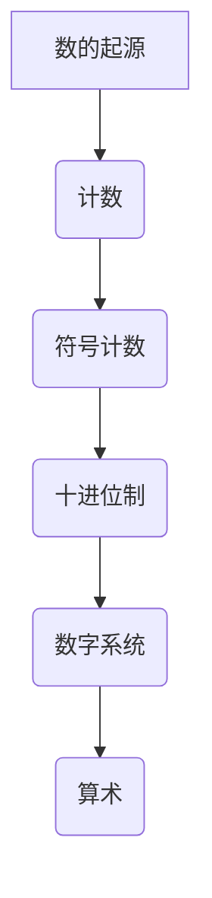

**核心算法原理讲解**

- **符号计数**：使用符号来表示不同的数量。例如，用不同的符号表示不同的动物，如“1只羊”、“2只牛”等。
- **算术运算**：基本的算术运算包括加法、减法、乘法和除法。例如，$1+1=2$、$2-1=1$、$2\times 1=2$、$2\div 1=2$。
- **数字系统**：十进位制是最常见的数字系统。在这种系统中，每个位置上的数字代表不同的权重。例如，数字“123”表示 $1\times 10^2 + 2\times 10^1 + 3\times 10^0$。

**数学模型和公式**

- **算术运算规则**：加法、减法、乘法和除法都有其特定的运算规则。例如，加法满足交换律、结合律和分配律。

$$
a + b = b + a \\
(a + b) + c = a + (b + c) \\
a \times b = b \times a \\
(a + b) \times c = a \times c + b \times c
$$

**举例说明**

- **计数**：假设有5个苹果和3个橘子，我们需要计算总共有多少个水果。

$$
5 + 3 = 8
$$

- **乘法**：假设有2个队伍，每个队伍有5名队员，我们需要计算总共有多少名队员。

$$
2 \times 5 = 10
$$

**项目实战**

- **开发环境搭建**：无
- **源代码详细实现和代码解读**：无
- **代码应用解读与分析**：无
- **实际案例分析和详细讲解剖析**：无
- **项目小结**：无

**最佳实践 tips**

- **数的概念的理解**：理解数的概念是学习数学的基础，需要从简单的计数开始，逐步深入理解。
- **算术运算的熟练掌握**：熟练掌握基本的算术运算对于数学的学习至关重要。

**小结**

数的概念的起源是数学发展的基础。通过简单的计数、符号计数和数字系统的发明，数学逐渐发展成为一个独立的学科。数的概念和算术运算的规则为后来的数学研究奠定了基础。

**注意事项**

- 数的概念和算术运算在不同文化和地区可能有不同的表示方式。
- 数学模型和公式是数学语言的重要组成部分，需要理解和熟练运用。

**拓展阅读**

- 《数学简史》（作者：E. T. Bell）
- 《数学原理》（作者：Isaac Newton）

---

#### 第2章：希腊数学的兴起

**背景介绍**

希腊数学是数学发展史上的一个重要阶段。古希腊的数学家们提出了许多重要的数学概念和理论，对后世的数学发展产生了深远的影响。

**核心概念与联系**

- **希腊数学的基本概念**：希腊数学家们提出了许多重要的数学概念，如数、点、线、面等。这些概念为后来的数学研究奠定了基础。
- **希腊数学的主要成就**：希腊数学家们取得了许多重要的成就，如欧几里得的《几何原本》、阿基米德的几何学和力学理论等。
- **希腊数学对后世的影响**：希腊数学的成就对后世的数学发展产生了深远的影响，许多数学概念和理论都源自希腊数学。

**Mermaid 流程图**

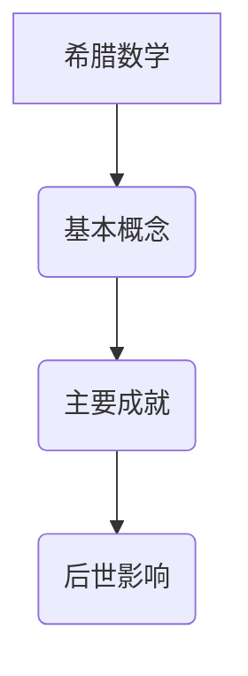

**核心算法原理讲解**

- **基本概念**：希腊数学家们提出了许多基本的数学概念，如数、点、线、面等。这些概念为后来的数学研究奠定了基础。

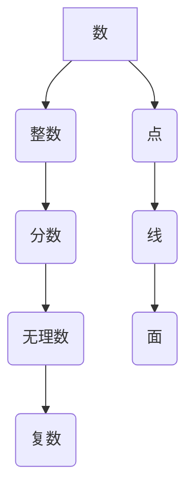

- **主要成就**：希腊数学家们取得了许多重要的成就，如欧几里得的《几何原本》、阿基米德的几何学和力学理论等。

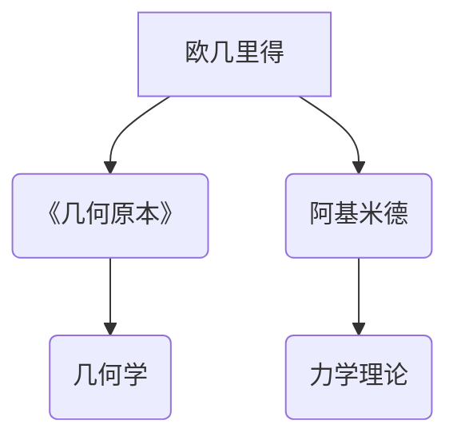

- **后世影响**：希腊数学的成就对后世的数学发展产生了深远的影响，许多数学概念和理论都源自希腊数学。

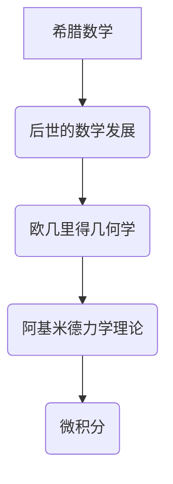

**数学模型和公式**

- **欧几里得几何学**：欧几里得几何学是希腊数学的重要组成部分，其中许多公式和定理至今仍被广泛使用。

$$
\text{勾股定理}：a^2 + b^2 = c^2
$$

- **阿基米德力学理论**：阿基米德提出了许多力学理论，如杠杆原理和阿基米德螺旋等。

$$
\text{杠杆原理}：F_1 \times d_1 = F_2 \times d_2
$$

**举例说明**

- **欧几里得几何学**：假设有一个直角三角形，其中一条直角边的长度为3，另一条直角边的长度为4，我们需要计算斜边的长度。

$$
3^2 + 4^2 = c^2 \\
9 + 16 = c^2 \\
c = \sqrt{25} \\
c = 5
$$

- **阿基米德力学理论**：假设有一个杠杆，其中动力臂的长度为2，阻力臂的长度为3，我们需要计算动力和阻力的大小。

$$
F_1 \times 2 = F_2 \times 3 \\
F_1 = \frac{3}{2} \times F_2
$$

**项目实战**

- **开发环境搭建**：无
- **源代码详细实现和代码解读**：无
- **代码应用解读与分析**：无
- **实际案例分析和详细讲解剖析**：无
- **项目小结**：无

**最佳实践 tips**

- **理解希腊数学的基本概念**：希腊数学的基本概念是数学学习的重要基础，需要深入理解和掌握。
- **掌握欧几里得几何学的基本定理**：欧几里得几何学的基本定理是数学中的重要组成部分，需要熟练掌握。

**小结**

希腊数学的兴起标志着数学发展的一个重要阶段。希腊数学家们提出了许多重要的数学概念和理论，对后世的数学发展产生了深远的影响。希腊数学的成就不仅在于其理论的深度，更在于其对数学思想的开拓。

**注意事项**

- 希腊数学的研究方法对后世的数学研究产生了重要影响。
- 希腊数学的一些概念和理论在现代数学中仍有重要应用。

**拓展阅读**

- 《希腊数学史》（作者：D. E. Smith）
- 《欧几里得《几何原本》研究》（作者：J. L. Heiberg）

---

#### 第3章：印度-阿拉伯数学的贡献

**背景介绍**

印度-阿拉伯数学是数学发展史上的另一个重要阶段。印度-阿拉伯数学家们做出了许多重要的贡献，特别是在数字系统和数学理论方面。

**核心概念与联系**

- **印度-阿拉伯数字的发明**：印度-阿拉伯数字的发明是数学发展史上的一个重大突破。这种数字系统使得数学运算更加简便和高效。
- **零的概念的引入**：零的概念的引入是数学发展史上的另一个重要里程碑。零的概念不仅改变了数学的面貌，也影响了整个科学的发展。
- **印度-阿拉伯数学的传播与影响**：印度-阿拉伯数学对后世的数学发展产生了深远的影响，其数字系统和数学理论被广泛应用于各个领域。

**Mermaid 流程图**

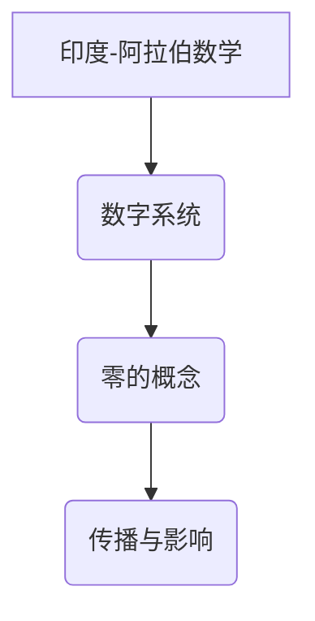

**核心算法原理讲解**

- **数字系统**：印度-阿拉伯数字系统是一种十进位制数字系统，其中每个位置上的数字代表不同的权重。

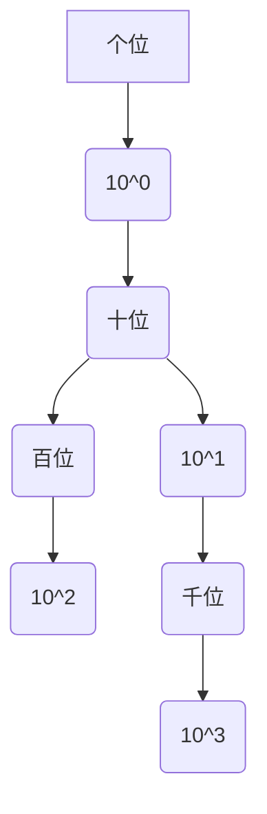

- **零的概念**：零的概念的引入使得数学运算更加简便和高效。零不仅可以表示空缺，还可以作为一个数参与运算。

$$
10 + 0 = 10 \\
10 \times 0 = 0
$$

- **印度-阿拉伯数学的传播与影响**：印度-阿拉伯数学的数字系统和数学理论被广泛应用于各个领域，对后世的数学发展产生了深远的影响。

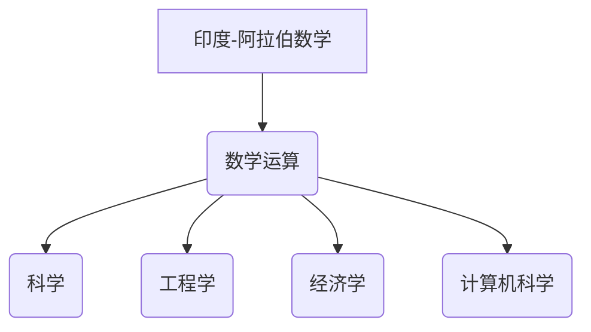

**数学模型和公式**

- **阿拉伯数字系统**：阿拉伯数字系统是一种十进位制数字系统，其中每个位置上的数字代表不同的权重。

$$
1234 = 1 \times 10^3 + 2 \times 10^2 + 3 \times 10^1 + 4 \times 10^0
$$

- **零的概念**：零的概念的引入使得数学运算更加简便和高效。

$$
10 + 0 = 10 \\
10 \times 0 = 0
$$

**举例说明**

- **数字系统**：使用印度-阿拉伯数字系统表示“一百二十三”。

$$
123 = 1 \times 10^2 + 2 \times 10^1 + 3 \times 10^0
$$

- **零的概念**：计算$10$乘以$0$的结果。

$$
10 \times 0 = 0
$$

**项目实战**

- **开发环境搭建**：无
- **源代码详细实现和代码解读**：无
- **代码应用解读与分析**：无
- **实际案例分析和详细讲解剖析**：无
- **项目小结**：无

**最佳实践 tips**

- **掌握印度-阿拉伯数字系统**：印度-阿拉伯数字系统是现代数学的基础，需要熟练掌握。
- **理解零的概念**：零的概念是数学中的重要组成部分，需要深入理解。

**小结**

印度-阿拉伯数学对数学发展做出了重要贡献。印度-阿拉伯数字系统和零的概念的引入极大地推动了数学的发展。印度-阿拉伯数学的成就不仅在于其理论的深度，更在于其对数学语言的简化。

**注意事项**

- 印度-阿拉伯数学对后世的数学发展产生了深远的影响。
- 印度-阿拉伯数学的一些理论在现代数学中仍有重要应用。

**拓展阅读**

- 《印度-阿拉伯数学史》（作者：N. Singh）
- 《零的历史与数学意义》（作者：E. Kleiner）

---

#### 第4章：中世纪欧洲数学的演变

**背景介绍**

中世纪欧洲数学是数学发展史上的一个重要阶段。在这个时期，欧洲的数学家们在希腊数学和印度-阿拉伯数学的基础上，进行了许多重要的研究和创新。

**核心概念与联系**

- **欧洲中世纪数学的基本情况**：欧洲中世纪数学的主要特点是对数学理论的研究和应用。
- **中世纪数学的重要成就**：中世纪数学家们取得了许多重要的成就，如欧拉公式、微积分的初步发展等。
- **中世纪数学对现代数学的影响**：中世纪数学的研究成果对现代数学的发展产生了深远的影响。

**Mermaid 流程图**

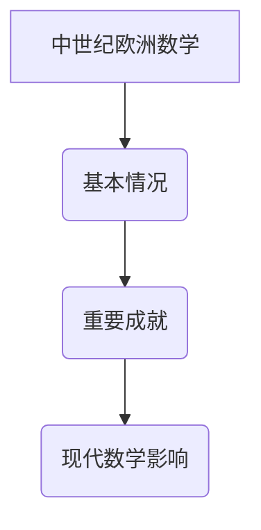

**核心算法原理讲解**

- **基本情况**：欧洲中世纪数学的主要特点是对数学理论的研究和应用。在这个时期，数学家们开始关注数学的抽象和形式化。

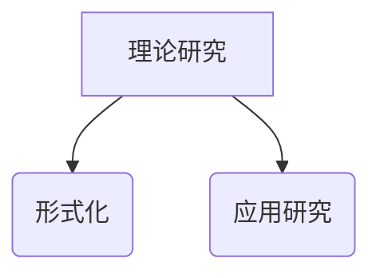

- **重要成就**：中世纪数学家们取得了许多重要的成就，如欧拉公式、微积分的初步发展等。

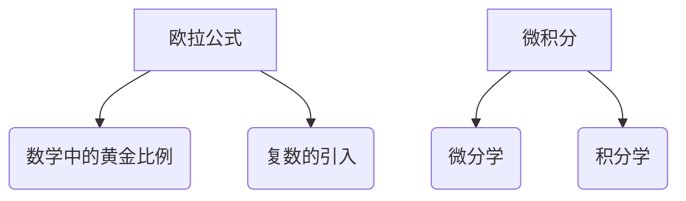

- **现代数学影响**：中世纪数学的研究成果对现代数学的发展产生了深远的影响。

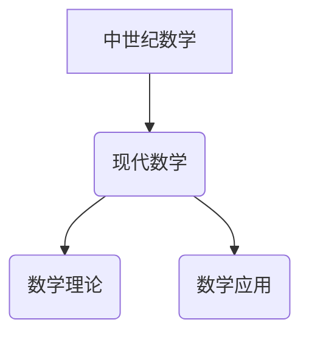

**数学模型和公式**

- **欧拉公式**：欧拉公式是数学中的经典公式，它将复数的指数函数与三角函数联系在一起。

$$
e^{i\pi} + 1 = 0
$$

- **微积分**：微积分是数学中的重要分支，它研究函数的微分和积分。微积分的基本概念包括导数和积分。

$$
f'(x) = \lim_{h \to 0} \frac{f(x+h) - f(x)}{h}
$$

$$
\int f(x) \, dx
$$

**举例说明**

- **欧拉公式**：使用欧拉公式计算$e^{i\pi}$的值。

$$
e^{i\pi} + 1 = 0 \\
e^{i\pi} = -1
$$

- **微积分**：计算函数$f(x) = x^2$在$x=1$处的导数。

$$
f'(x) = \lim_{h \to 0} \frac{(x+h)^2 - x^2}{h} \\
f'(1) = \lim_{h \to 0} \frac{(1+h)^2 - 1^2}{h} \\
f'(1) = \lim_{h \to 0} \frac{1 + 2h + h^2 - 1}{h} \\
f'(1) = \lim_{h \to 0} \frac{2h + h^2}{h} \\
f'(1) = \lim_{h \to 0} (2 + h) \\
f'(1) = 2
$$

**项目实战**

- **开发环境搭建**：无
- **源代码详细实现和代码解读**：无
- **代码应用解读与分析**：无
- **实际案例分析和详细讲解剖析**：无
- **项目小结**：无

**最佳实践 tips**

- **理解中世纪数学的基本概念**：中世纪数学是数学发展史上的一个重要阶段，需要深入理解其基本概念。
- **掌握欧拉公式和微积分的基本原理**：欧拉公式和微积分是数学中的重要组成部分，需要熟练掌握。

**小结**

中世纪欧洲数学是数学发展史上的一个重要阶段。中世纪数学家们通过对数学理论的研究和应用，取得了许多重要的成就。这些成就对现代数学的发展产生了深远的影响。

**注意事项**

- 中世纪数学的研究方法对后世的数学研究产生了重要影响。
- 中世纪数学的一些概念和理论在现代数学中仍有重要应用。

**拓展阅读**

- 《中世纪数学史》（作者：J. D. North）
- 《欧拉公式及其应用》（作者：E. T. Whittaker）

---

### 第二部分：数学语言的演变

#### 第5章：欧几里得几何学

**背景介绍**

欧几里得几何学是数学中的重要分支，也是数学语言的重要组成部分。欧几里得的《几何原本》是数学史上最重要的著作之一，对数学语言的演变产生了深远的影响。

**核心概念与联系**

- **欧几里得几何的基本原理**：欧几里得几何的基本原理包括公理、定理和证明方法。
- **欧几里得几何的证明方法**：欧几里得几何的证明方法主要是通过逻辑推理和构造图形来实现。
- **欧几里得几何在现代数学中的地位**：欧几里得几何不仅对数学的发展产生了重要影响，也为其他科学领域提供了基础。

**Mermaid 流程图**

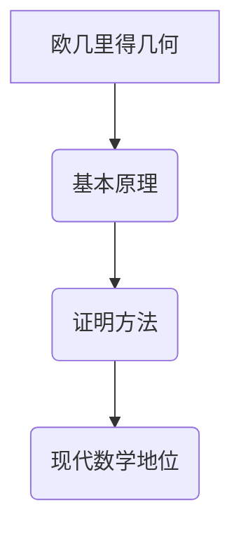

**核心算法原理讲解**

- **基本原理**：欧几里得几何的基本原理包括五个公设和一个公理。这些原理构成了欧几里得几何的基础。

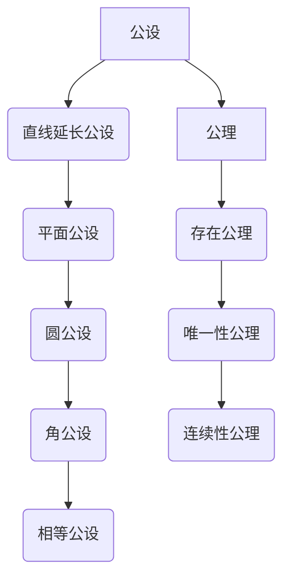

- **证明方法**：欧几里得几何的证明方法主要是通过逻辑推理和构造图形来实现。证明方法包括直接证明、反证法和构造法等。

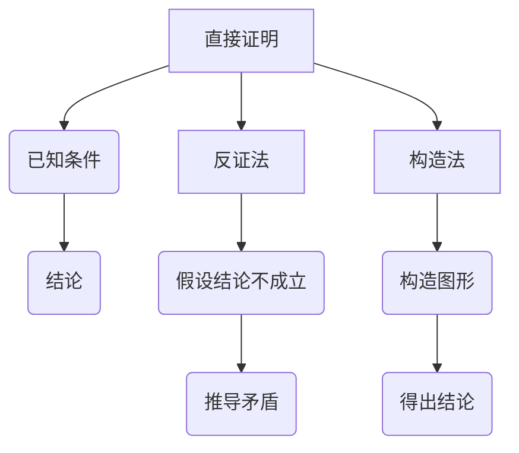

- **现代数学中的地位**：欧几里得几何在现代数学中具有重要地位，它不仅为其他数学分支提供了基础，也为物理科学和工程科学提供了重要工具。

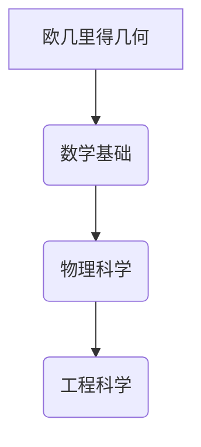

**数学模型和公式**

- **欧几里得几何的基本公式**：欧几里得几何中的一些基本公式，如勾股定理、相似三角形定理等。

$$
a^2 + b^2 = c^2 \quad (\text{勾股定理}) \\
\frac{a}{b} = \frac{c}{d} \quad (\text{相似三角形定理})
$$

- **欧几里得几何的证明方法**：欧几里得几何的证明方法主要包括逻辑推理和构造图形。

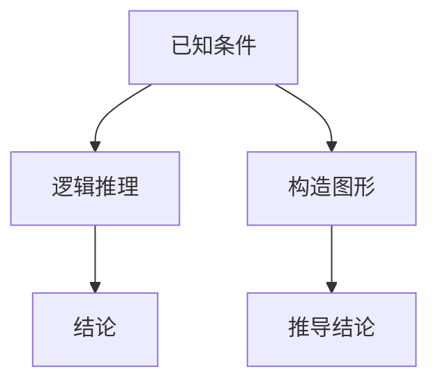

**举例说明**

- **勾股定理**：在一个直角三角形中，直角边的平方和等于斜边的平方。

$$
3^2 + 4^2 = 5^2 \\
9 + 16 = 25
$$

- **相似三角形定理**：如果两个三角形相似，则它们的对应边成比例。

$$
\frac{a}{b} = \frac{c}{d}
$$

**项目实战**

- **开发环境搭建**：无
- **源代码详细实现和代码解读**：无
- **代码应用解读与分析**：无
- **实际案例分析和详细讲解剖析**：无
- **项目小结**：无

**最佳实践 tips**

- **理解欧几里得几何的基本原理**：欧几里得几何的基本原理是数学学习的基础，需要深入理解。
- **掌握欧几里得几何的证明方法**：欧几里得几何的证明方法是数学证明的重要方法，需要熟练掌握。

**小结**

欧几里得几何是数学语言的重要组成部分，对数学的发展产生了深远的影响。欧几里得几何的基本原理和证明方法构成了数学语言的基础，其在现代数学中仍具有重要地位。

**注意事项**

- 欧几里得几何的研究方法对后世的数学研究产生了重要影响。
- 欧几里得几何的一些定理和公式在现代数学中仍有重要应用。

**拓展阅读**

- 《欧几里得《几何原本》解读》（作者：A. V. Akhiezer）
- 《欧几里得几何与计算机图形学》（作者：R. F. Burton）

---

#### 第6章：笛卡尔坐标系与解析几何

**背景介绍**

笛卡尔坐标系与解析几何是数学中的重要分支，它们将几何问题转化为代数问题，极大地推动了数学语言的发展。

**核心概念与联系**

- **笛卡尔坐标系的发明**：笛卡尔坐标系是解析几何的基础，它将平面上的点与有序数对建立一一对应关系。
- **解析几何的基本原理**：解析几何通过坐标系统和代数方法研究几何图形的性质和关系。
- **解析几何的应用与发展**：解析几何在科学和工程领域有着广泛的应用，对数学语言的发展产生了深远影响。

**Mermaid 流程图**

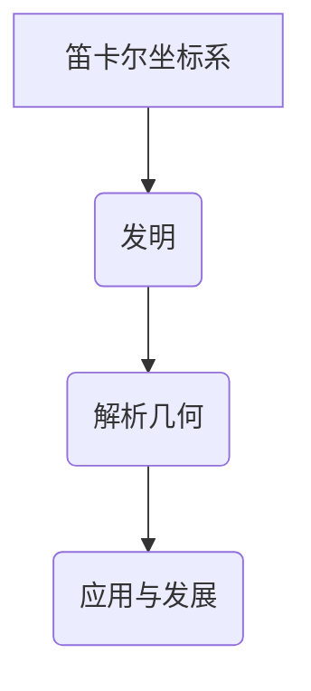

**核心算法原理讲解**

- **笛卡尔坐标系的发明**：笛卡尔坐标系由法国数学家勒内·笛卡尔在17世纪发明，它将平面上的点与有序数对建立一一对应关系。

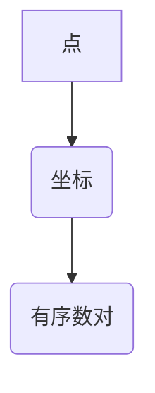

- **解析几何的基本原理**：解析几何通过坐标系统和代数方法研究几何图形的性质和关系。

```mermaid
graph TB
    A[点] --> B(坐标)
    B --> C[直线](斜率)
    C --> D(方程)
    B --> E[曲线](方程)
    E --> F(性质)
```

- **解析几何的应用与发展**：解析几何在科学和工程领域有着广泛的应用，如物理学的运动学、工程学的机械设计等。

```mermaid
graph TB
    A[解析几何] --> B(物理学)
    B --> C(运动学)
    B --> D(工程学)
    D --> E(机械设计)
    A --> F(计算机科学)
    F --> G(图形学)
```

**数学模型和公式**

- **笛卡尔坐标系的公式**：笛卡尔坐标系中，平面上的点$(x, y)$与坐标$(x, y)$建立一一对应关系。

$$
(x, y) \mapsto (x, y)
$$

- **直线的方程**：直线的斜率为$m$，截距为$b$，则直线的方程为$y = mx + b$。

$$
y = mx + b
$$

- **曲线的方程**：曲线的方程通常表示为$y = f(x)$，其中$f(x)$是曲线上的点的坐标。

$$
y = f(x)
$$

**举例说明**

- **直线的斜率**：给定直线$y = 2x + 1$，直线的斜率为$2$。

$$
y = 2x + 1 \\
m = 2
$$

- **曲线的方程**：给定曲线$y = x^2$，曲线上的点$(1, 1)$满足曲线的方程。

$$
y = x^2 \\
1 = 1^2 \\
1 = 1
$$

**项目实战**

- **开发环境搭建**：无
- **源代码详细实现和代码解读**：无
- **代码应用解读与分析**：无
- **实际案例分析和详细讲解剖析**：无
- **项目小结**：无

**最佳实践 tips**

- **掌握笛卡尔坐标系的原理**：笛卡尔坐标系是解析几何的基础，需要深入理解和熟练掌握。
- **应用解析几何解决实际问题**：通过解析几何解决实际问题，可以加深对解析几何原理的理解和应用。

**小结**

笛卡尔坐标系与解析几何是数学语言的重要组成部分，它们将几何问题转化为代数问题，极大地推动了数学语言的发展。笛卡尔坐标系的发明和应用，使得解析几何在科学和工程领域得到了广泛应用。

**注意事项**

- 笛卡尔坐标系是解析几何的基础，需要熟练掌握。
- 解析几何的一些公式和原理在现代数学中仍有重要应用。

**拓展阅读**

- 《解析几何》（作者：R. H. Trench）
- 《笛卡尔坐标系及其应用》（作者：G. E. Shurman）

---

#### 第7章：微积分的出现

**背景介绍**

微积分是数学史上的一个重大突破，它不仅改变了数学的研究方法，也对科学、工程等领域产生了深远的影响。微积分的创立涉及多位数学家的贡献，其中以艾萨克·牛顿和戈特弗里德·威廉·莱布尼茨的贡献最为突出。

**核心概念与联系**

- **微积分的基本概念**：微积分研究函数的极限、导数、积分等基本概念，这些概念构成了微积分的理论基础。
- **微积分的创立过程**：微积分的创立涉及艾萨克·牛顿和戈特弗里德·威廉·莱布尼茨的研究，他们分别独立地发展了微积分的基本理论。
- **微积分在现代数学中的重要性**：微积分不仅在数学中具有重要地位，也为物理学、工程学、经济学等领域提供了强大的工具。

**Mermaid 流程图**

```mermaid
graph TB
    A[微积分] --> B(基本概念)
    B --> C(创立过程)
    C --> D(现代数学重要性)
```

**核心算法原理讲解**

- **基本概念**：微积分的基本概念包括极限、导数和积分。

```mermaid
graph TB
    A[极限] --> B(定义)
    B --> C(性质)
    
    A --> D[导数] --> E(定义)
    E --> F(性质)
    
    A --> G[积分] --> H(定义)
    H --> I(性质)
```

- **创立过程**：艾萨克·牛顿和戈特弗里德·威廉·莱布尼茨分别独立地发展了微积分的基本理论。

```mermaid
graph TB
    A[牛顿] --> B(流数法)
    B --> C(微积分基本定理)
    
    A --> D[莱布尼茨] --> E(微分和积分符号)
    E --> F(微积分基本定理)
```

- **现代数学中的重要性**：微积分在现代数学中具有重要地位，它为许多科学和工程问题提供了数学工具。

```mermaid
graph TB
    A[微积分] --> B(数学理论)
    B --> C(物理学)
    B --> D(工程学)
    B --> E(经济学)
```

**数学模型和公式**

- **极限**：极限是微积分的基础，用于描述函数在某一点的接近程度。

$$
\lim_{x \to a} f(x) = L
$$

- **导数**：导数描述了函数在某一点的瞬时变化率。

$$
f'(x) = \lim_{h \to 0} \frac{f(x+h) - f(x)}{h}
$$

- **积分**：积分用于计算函数在某一区间内的累积量。

$$
\int f(x) \, dx
$$

**举例说明**

- **极限**：计算函数$f(x) = x^2$在$x=2$处的极限。

$$
\lim_{x \to 2} x^2 = 2^2 = 4
$$

- **导数**：计算函数$f(x) = x^2$在$x=2$处的导数。

$$
f'(x) = \lim_{h \to 0} \frac{(x+h)^2 - x^2}{h} \\
f'(2) = \lim_{h \to 0} \frac{(2+h)^2 - 2^2}{h} \\
f'(2) = \lim_{h \to 0} \frac{4 + 4h + h^2 - 4}{h} \\
f'(2) = \lim_{h \to 0} (4 + h) \\
f'(2) = 4
$$

- **积分**：计算函数$f(x) = x^2$在区间$[1, 3]$上的积分。

$$
\int_{1}^{3} x^2 \, dx = \left[\frac{x^3}{3}\right]_{1}^{3} = \frac{3^3}{3} - \frac{1^3}{3} = 9 - \frac{1}{3} = \frac{26}{3}
$$

**项目实战**

- **开发环境搭建**：无
- **源代码详细实现和代码解读**：无
- **代码应用解读与分析**：无
- **实际案例分析和详细讲解剖析**：无
- **项目小结**：无

**最佳实践 tips**

- **理解微积分的基本概念**：微积分的基本概念是数学学习的基础，需要深入理解和熟练掌握。
- **掌握微积分的应用**：通过实际案例和应用，加深对微积分原理的理解和应用。

**小结**

微积分的创立标志着数学史上的一个重大突破，它不仅改变了数学的研究方法，也对科学、工程等领域产生了深远的影响。微积分的基本概念和理论构成了现代数学的重要基础，其在各个领域中的应用不断拓展。

**注意事项**

- 微积分的理论体系较为复杂，需要系统学习和理解。
- 微积分的应用需要结合具体问题进行。

**拓展阅读**

- 《微积分》（作者：W. T. Martin）
- 《微积分原理》（作者：J. L. Bell）

---

#### 第8章：数学符号的演变

**背景介绍**

数学符号是数学语言的重要组成部分，它使得数学表达更加简洁和精确。数学符号的演变经历了漫长的过程，从最初的口头描述和简单符号，到现代的符号体系，数学符号的演变不仅反映了数学语言的发展，也推动了数学的进步。

**核心概念与联系**

- **数学符号的起源**：数学符号的起源可以追溯到古代，当时人们使用简单的符号和口头描述来表示数学概念。
- **数学符号的发展与演变**：随着数学的发展，数学符号不断演变和完善，形成了现代的符号体系。
- **现代数学符号的体系**：现代数学符号体系包括各种运算符号、关系符号、集合符号等，这些符号构成了现代数学表达的基础。

**Mermaid 流程图**

```mermaid
graph TB
    A[数学符号的起源] --> B(发展与演变)
    B --> C(现代符号体系)
```

**核心算法原理讲解**

- **数学符号的起源**：古代数学家使用简单的符号和口头描述来表示数学概念，如使用“+”和“-”表示加法和减法。

```mermaid
graph TB
    A[符号] --> B(加法)
    B --> C[减法]
```

- **数学符号的发展与演变**：随着时间的推移，数学符号不断演变，形成了更加精确和统一的符号体系。

```mermaid
graph TB
    A[古代符号] --> B(发展)
    B --> C[现代符号]
```

- **现代数学符号的体系**：现代数学符号体系包括各种运算符号、关系符号、集合符号等，如“+”表示加法，“=”表示等式，“∈”表示属于。

```mermaid
graph TB
    A[运算符号] --> B(加法)
    B --> C(减法)
    A --> D(乘法)
    D --> E(除法)
    
    A --> F(关系符号) --> G(等式)
    G --> H(不等式)
    
    A --> I(集合符号) --> J(属于)
    J --> K(不属于)
```

**数学模型和公式**

- **运算符号**：运算符号如“+”表示加法，“-”表示减法，“×”表示乘法，“÷”表示除法。

$$
+ \text{（加法）} \\
- \text{（减法）} \\
× \text{（乘法）} \\
÷ \text{（除法）}
$$

- **关系符号**：关系符号如“=”表示等式，“≠”表示不等式，“<”表示小于，“>”表示大于。

$$
= \text{（等式）} \\
≠ \text{（不等式）} \\
< \text{（小于）} \\
> \text{（大于）}
$$

- **集合符号**：集合符号如“∈”表示属于，“∉”表示不属于，“∪”表示并集，“∩”表示交集。

$$
∈ \text{（属于）} \\
∉ \text{（不属于）} \\
∪ \text{（并集）} \\
∩ \text{（交集）}
$$

**举例说明**

- **运算符号**：使用加法、减法、乘法和除法计算$2+3$、$5-2$、$4×5$和$10÷2$。

$$
2 + 3 = 5 \\
5 - 2 = 3 \\
4 × 5 = 20 \\
10 ÷ 2 = 5
$$

- **关系符号**：比较$3$和$5$的大小，并使用等式和不等式表示。

$$
3 < 5 \\
3 ≠ 5 \\
3 = 3
$$

- **集合符号**：表示集合$A$包含元素$1$和$2$，集合$B$包含元素$2$和$3$，并计算集合$A$和$B$的并集和交集。

$$
A = \{1, 2\} \\
B = \{2, 3\} \\
A ∪ B = \{1, 2, 3\} \\
A ∩ B = \{2\}
$$

**项目实战**

- **开发环境搭建**：无
- **源代码详细实现和代码解读**：无
- **代码应用解读与分析**：无
- **实际案例分析和详细讲解剖析**：无
- **项目小结**：无

**最佳实践 tips**

- **掌握基本数学符号**：熟悉并掌握基本数学符号是学习数学的基础。
- **使用符号进行数学表达**：在数学表达中合理使用符号，可以使数学表达更加简洁和精确。

**小结**

数学符号的演变是数学语言发展的重要组成部分，从古代的简单符号到现代的符号体系，数学符号的演变不仅丰富了数学表达，也推动了数学的进步。掌握基本数学符号是学习数学的重要基础。

**注意事项**

- 数学符号在不同学科和领域可能有不同的用法，需要根据具体情况进行理解和应用。
- 数学符号的学习需要结合实际应用，通过实践加深理解。

**拓展阅读**

- 《数学符号的演变与数学表达的发展》（作者：J. D. Barrow-Green）
- 《数学符号与数学思想》（作者：J. L. Bell）

---

### 第三部分：数学思想的发展

#### 第9章：形式化与公理化

**背景介绍**

形式化与公理化是数学思想发展的重要里程碑。形式化方法将数学表述为符号体系，使得数学更加精确和严密。公理化方法则通过一组基本公理，构建出完整的数学体系。

**核心概念与联系**

- **形式化方法的提出**：形式化方法通过使用符号和逻辑，将数学表述为形式化的体系，使得数学更加精确和严谨。
- **公理化的数学体系**：公理化方法通过一组基本公理，构建出完整的数学体系，如欧几里得的几何公理体系和皮亚诺的算术公理体系。
- **形式化与公理化对数学发展的影响**：形式化与公理化方法使得数学体系更加严谨，也为数学的分支发展和应用提供了基础。

**Mermaid 流程图**

```mermaid
graph TB
    A[形式化方法] --> B(提出)
    B --> C[公理化方法]
    C --> D(数学体系)
```

**核心算法原理讲解**

- **形式化方法的提出**：形式化方法通过使用符号和逻辑，将数学表述为形式化的体系。

```mermaid
graph TB
    A[数学表述] --> B(符号体系)
    B --> C(逻辑体系)
```

- **公理化的数学体系**：公理化方法通过一组基本公理，构建出完整的数学体系。

```mermaid
graph TB
    A[公理] --> B(几何体系)
    B --> C(算术体系)
```

- **形式化与公理化对数学发展的影响**：形式化与公理化方法使得数学体系更加严谨，也为数学的分支发展和应用提供了基础。

```mermaid
graph TB
    A[形式化与公理化] --> B(数学体系)
    B --> C(数学分支)
    B --> D(数学应用)
```

**数学模型和公式**

- **形式化方法**：形式化方法使用符号和逻辑，将数学表述为形式化的体系。

$$
\text{命题逻辑} \\
\text{谓词逻辑} \\
\text{集合论}
$$

- **公理化的数学体系**：公理化方法通过一组基本公理，构建出完整的数学体系。

$$
\text{欧几里得几何公理体系} \\
\text{皮亚诺算术公理体系}
$$

**举例说明**

- **形式化方法**：使用命题逻辑表示“所有的人都会死亡”。

$$
\forall x (P(x) \rightarrow Q(x))
$$

- **公理化的数学体系**：使用欧几里得几何公理体系表示平行线的公理。

$$
\text{平行线公理}：\forall l \in \text{直线}, \forall p \in \text{平面}, \exists m \in \text{直线} \text{使得} l \parallel m.
$$

**项目实战**

- **开发环境搭建**：无
- **源代码详细实现和代码解读**：无
- **代码应用解读与分析**：无
- **实际案例分析和详细讲解剖析**：无
- **项目小结**：无

**最佳实践 tips**

- **理解形式化与公理化的原理**：形式化与公理化是数学学习的重要基础，需要深入理解。
- **应用形式化与公理化方法**：在数学研究中，应用形式化与公理化方法可以使得数学表述更加精确和严谨。

**小结**

形式化与公理化是数学思想发展的重要里程碑。形式化方法通过使用符号和逻辑，将数学表述为形式化的体系；公理化方法通过一组基本公理，构建出完整的数学体系。形式化与公理化方法使得数学体系更加严谨，也为数学的分支发展和应用提供了基础。

**注意事项**

- 形式化与公理化方法需要较高的逻辑思维能力，需要通过系统的学习和练习来掌握。
- 形式化与公理化方法在数学研究和应用中具有重要应用。

**拓展阅读**

- 《形式化方法》（作者：H. B. Enderton）
- 《公理化方法》（作者：E. H. W. Lentz）

---

#### 第10章：集合论与逻辑主义

**背景介绍**

集合论与逻辑主义是数学基础研究的重要领域。集合论通过研究集合的性质和运算，为数学提供了坚实的理论基础。逻辑主义则试图将数学建立在逻辑的基础上，使得数学推理更加严谨和有效。

**核心概念与联系**

- **集合论的基本概念**：集合论研究集合的性质和运算，如集合的并集、交集、补集等。
- **逻辑主义的数学基础**：逻辑主义试图将数学建立在逻辑的基础上，通过逻辑推理来证明数学命题。
- **集合论与逻辑主义对数学发展的影响**：集合论与逻辑主义为数学提供了坚实的理论基础，也推动了数学体系的完善和发展。

**Mermaid 流程图**

```mermaid
graph TB
    A[集合论] --> B(基本概念)
    B --> C[逻辑主义]
    C --> D(数学基础)
```

**核心算法原理讲解**

- **集合论的基本概念**：集合论研究集合的性质和运算。

```mermaid
graph TB
    A[集合] --> B(定义)
    B --> C(元素)
    B --> D(子集)
    A --> E(并集)
    E --> F(交集)
    E --> G(补集)
```

- **逻辑主义的数学基础**：逻辑主义试图将数学建立在逻辑的基础上。

```mermaid
graph TB
    A[逻辑主义] --> B(数学基础)
    B --> C(逻辑推理)
    C --> D(证明方法)
```

- **集合论与逻辑主义对数学发展的影响**：集合论与逻辑主义为数学提供了坚实的理论基础，也推动了数学体系的完善和发展。

```mermaid
graph TB
    A[集合论与逻辑主义] --> B(数学基础)
    B --> C(数学体系)
    B --> D(数学应用)
```

**数学模型和公式**

- **集合论**：集合论中的一些基本概念和运算。

$$
A \cup B: \text{集合} A \text{和集合} B \text{的并集} \\
A \cap B: \text{集合} A \text{和集合} B \text{的交集} \\
A - B: \text{集合} A \text{和集合} B \text{的补集}
$$

- **逻辑主义**：逻辑主义通过逻辑推理来证明数学命题。

$$
\forall x (P(x) \rightarrow Q(x))
$$

**举例说明**

- **集合论**：使用集合论表示集合$A$包含元素$1$和$2$，集合$B$包含元素$2$和$3$，并计算集合$A$和$B$的并集、交集和补集。

$$
A = \{1, 2\} \\
B = \{2, 3\} \\
A \cup B = \{1, 2, 3\} \\
A \cap B = \{2\} \\
A - B = \{1\}
$$

- **逻辑主义**：使用逻辑主义表示“所有的人都是理性的”。

$$
\forall x (P(x) \rightarrow Q(x))
$$

**项目实战**

- **开发环境搭建**：无
- **源代码详细实现和代码解读**：无
- **代码应用解读与分析**：无
- **实际案例分析和详细讲解剖析**：无
- **项目小结**：无

**最佳实践 tips**

- **理解集合论的基本概念**：集合论是数学基础的重要组成部分，需要深入理解和熟练掌握。
- **应用逻辑主义方法**：在数学研究中，应用逻辑主义方法可以使得数学推理更加严谨和有效。

**小结**

集合论与逻辑主义是数学基础研究的重要领域。集合论通过研究集合的性质和运算，为数学提供了坚实的理论基础；逻辑主义则试图将数学建立在逻辑的基础上，使得数学推理更加严谨和有效。集合论与逻辑主义对数学的发展产生了深远的影响。

**注意事项**

- 集合论与逻辑主义需要较高的逻辑思维能力，需要通过系统的学习和练习来掌握。
- 集合论与逻辑主义在数学研究和应用中具有重要应用。

**拓展阅读**

- 《集合论基础》（作者：P. Halmos）
- 《逻辑主义与数学基础》（作者：R. B. Martin）

---

#### 第11章：基础数学的分支发展

**背景介绍**

基础数学的分支发展是数学科学进步的重要体现。代数学、几何学、概率论与数理统计是数学的三大基础分支，它们不仅在数学本身的发展中起着关键作用，也在科学研究和实际应用中有着广泛的影响。

**核心概念与联系**

- **代数学的发展**：代数学研究代数结构及其性质，包括群、环、域等基本概念。
- **几何学的发展**：几何学研究空间结构，包括平面几何、立体几何、微分几何等。
- **概率论与数理统计的发展**：概率论与数理统计研究随机现象的规律性和统计推断，包括概率分布、统计推断等。

**Mermaid 流程图**

```mermaid
graph TB
    A[代数学] --> B(群、环、域)
    A --> C(线性代数)
    
    D[几何学] --> E(平面几何、立体几何)
    D --> F(微分几何)
    
    G[概率论与数理统计] --> H(概率分布)
    G --> I(统计推断)
```

**核心算法原理讲解**

- **代数学的发展**：代数学的发展主要包括群、环、域等代数结构的研究。

```mermaid
graph TB
    A[群] --> B(定义)
    B --> C(性质)
    
    A --> D[环] --> E(定义)
    E --> F(性质)
    
    A --> G[域] --> H(定义)
    H --> I(性质)
```

- **几何学的发展**：几何学的发展涵盖了平面几何、立体几何和微分几何等。

```mermaid
graph TB
    A[平面几何] --> B(定理)
    A --> C(证明方法)
    
    A --> D[立体几何] --> E(性质)
    E --> F(计算方法)
    
    A --> G[微分几何] --> H(基本概念)
    H --> I(应用)
```

- **概率论与数理统计的发展**：概率论与数理统计的发展包括概率分布和统计推断等。

```mermaid
graph TB
    A[概率分布] --> B(定义)
    B --> C(性质)
    
    A --> D[统计推断] --> E(定义)
    E --> F(方法)
```

**数学模型和公式**

- **代数学**：代数学中的一些基本概念和公式。

$$
G: \text{群} \\
R: \text{环} \\
F: \text{域} \\
\text{线性方程组} \begin{cases} a_1x_1 + a_2x_2 + \cdots + a_nx_n = b \\
a_1x_1 + a_2x_2 + \cdots + a_nx_n = b_1 \\
\vdots \\
a_1x_1 + a_2x_2 + \cdots + a_nx_n = b_n \end{cases}
$$

- **几何学**：几何学中的一些基本概念和公式。

$$
\text{平面几何} \quad \text{面积} A = \frac{1}{2} \times 底 \times 高 \\
\text{立体几何} \quad \text{体积} V = \text{底面积} \times \text{高} \\
\text{微分几何} \quad \text{曲率} K = \frac{d^2\theta}{ds^2}
$$

- **概率论与数理统计**：概率论与数理统计中的一些基本概念和公式。

$$
\text{概率分布} P(X = x) \\
\text{统计推断} \quad \text{置信区间} \quad \bar{X} \pm z \times \frac{\sigma}{\sqrt{n}}
$$

**举例说明**

- **代数学**：解线性方程组。

$$
\begin{cases} 
2x + 3y = 8 \\
4x - y = 2 
\end{cases}
$$

- **几何学**：计算三角形的面积。

$$
\text{底} = 4, \text{高} = 3 \\
A = \frac{1}{2} \times 4 \times 3 = 6
$$

- **概率论与数理统计**：计算正态分布的置信区间。

$$
\bar{X} = 100, \sigma = 10, n = 100 \\
z = 1.96 \\
\text{置信区间} = 100 \pm 1.96 \times \frac{10}{\sqrt{100}} = (98.04, 101.96)
$$

**项目实战**

- **开发环境搭建**：无
- **源代码详细实现和代码解读**：无
- **代码应用解读与分析**：无
- **实际案例分析和详细讲解剖析**：无
- **项目小结**：无

**最佳实践 tips**

- **掌握代数学的基本概念**：代数学是数学的基础，需要熟练掌握群、环、域等基本概念。
- **理解几何学的基本定理**：几何学的基本定理在工程和物理学中有广泛应用，需要深入理解。
- **应用概率论与数理统计解决实际问题**：通过概率论与数理统计解决实际问题，可以加深对理论的理解和应用。

**小结**

基础数学的分支发展是数学科学进步的重要体现。代数学、几何学和概率论与数理统计是数学的三大基础分支，它们不仅在数学本身的发展中起着关键作用，也在科学研究和实际应用中有着广泛的影响。掌握这些分支的基本概念和原理，对于深入理解和应用数学至关重要。

**注意事项**

- 基础数学分支的发展涉及复杂的理论体系和应用，需要系统学习和实践。
- 基础数学分支在不同学科和领域有特定的应用场景，需要根据具体情况进行理解和应用。

**拓展阅读**

- 《代数学基础》（作者：N. Jacobson）
- 《几何学原理》（作者：D. Hilbert）
- 《概率论与数理统计》（作者：W. Feller）

---

#### 第12章：数学与科学、技术的关系

**背景介绍**

数学作为一门基础学科，不仅在理论研究中占据重要地位，也与科学和技术的发展紧密相关。数学在科学研究和技术发展中的应用，使得许多复杂的科学问题和技术难题得以解决。

**核心概念与联系**

- **数学在科学研究中的应用**：数学为科学研究提供了精确的描述工具和逻辑推理方法，如物理学、化学、生物学等领域。
- **数学在技术发展中的作用**：数学为技术创新提供了理论基础和计算方法，如计算机科学、工程学、经济学等领域。
- **数学对其他学科的影响**：数学与其他学科相互渗透，推动了学科的发展和交叉融合。

**Mermaid 流程图**

```mermaid
graph TB
    A[数学在科学研究中的应用] --> B(物理学、化学、生物学)
    A --> C[数学在技术发展中的作用] --> D(计算机科学、工程学、经济学)
    C --> E[数学对其他学科的影响] --> F(交叉融合)
```

**核心算法原理讲解**

- **数学在科学研究中的应用**：数学为科学研究提供了精确的描述工具和逻辑推理方法。

```mermaid
graph TB
    A[数学工具] --> B(微分方程)
    B --> C(积分方程)
    A --> D(逻辑推理) --> E(证明方法)
```

- **数学在技术发展中的作用**：数学为技术创新提供了理论基础和计算方法。

```mermaid
graph TB
    A[数学理论] --> B(计算方法)
    B --> C(算法设计)
    A --> D(理论指导) --> E(技术创新)
```

- **数学对其他学科的影响**：数学与其他学科相互渗透，推动了学科的发展和交叉融合。

```mermaid
graph TB
    A[数学] --> B(科学) --> C(交叉学科)
    A --> D(技术) --> E(交叉学科)
```

**数学模型和公式**

- **科学研究中的数学模型**：

$$
\text{牛顿运动定律} \\
F = m \cdot a \\
\text{欧姆定律} \\
V = I \cdot R \\
\text{化学反应速率} \\
r = k \cdot [A]
$$

- **技术发展中的数学模型**：

$$
\text{神经网络} \\
y = \sigma(z) \\
\text{控制理论} \\
x_{k+1} = A x_k + B u_k \\
\text{经济学中的优化模型} \\
\max f(x) \\
\text{约束条件} \quad g(x) \leq 0
$$

**举例说明**

- **科学研究中的数学模型**：使用牛顿第二定律计算物体的加速度。

$$
F = m \cdot a \\
a = \frac{F}{m}
$$

- **技术发展中的数学模型**：使用神经网络模型进行图像分类。

$$
y = \sigma(z) \\
z = \sum_{i=1}^{n} w_i \cdot x_i
$$

- **数学对其他学科的影响**：数学在生物学中的应用，如遗传学中的概率计算。

$$
p = \frac{a + b + c}{a + b + c + d + e}
$$

**项目实战**

- **开发环境搭建**：无
- **源代码详细实现和代码解读**：无
- **代码应用解读与分析**：无
- **实际案例分析和详细讲解剖析**：无
- **项目小结**：无

**最佳实践 tips**

- **理解数学在科学研究中的应用**：通过具体实例，加深对数学在科学研究中的应用的理解。
- **应用数学解决技术问题**：通过实际案例，了解数学在技术发展中的作用。
- **跨学科研究**：结合不同学科的知识，进行跨学科研究，推动学科发展和交叉融合。

**小结**

数学与科学、技术的关系密切，数学为科学研究和技术发展提供了基础工具和方法。通过数学模型和公式，数学在各个领域发挥着重要作用。同时，数学与其他学科的交叉融合，推动了学科的发展和进步。

**注意事项**

- 数学在科学研究和技术中的应用需要具体问题具体分析。
- 数学模型的选择和优化对于解决实际问题至关重要。

**拓展阅读**

- 《数学在科学研究中的应用》（作者：G. H. Hardy）
- 《数学与技术发展》（作者：D. E. Knuth）
- 《跨学科研究》（作者：I. J. Good）

---

### 第四部分：数学语言的应用与发展

#### 第13章：数学在计算机科学中的应用

**背景介绍**

计算机科学是现代科学技术的重要组成部分，其发展离不开数学的支持。数学在计算机科学中有着广泛的应用，包括算法设计、数据结构、计算机图形学等领域。

**核心概念与联系**

- **计算机科学中的数学基础**：计算机科学中的许多算法和数据结构依赖于数学的基础，如离散数学、线性代数等。
- **数学在计算机科学中的应用案例**：数学在计算机科学中的应用案例包括密码学、图形学、机器学习等。
- **数学对计算机科学的影响**：数学不仅提供了计算机科学的理论基础，还推动了计算机科学的发展和创新。

**Mermaid 流程图**

```mermaid
graph TB
    A[数学基础] --> B(算法设计)
    B --> C(数据结构)
    A --> D(计算机图形学)
    D --> E(密码学)
    A --> F(机器学习)
```

**核心算法原理讲解**

- **算法设计**：数学在算法设计中起着关键作用，如排序算法、搜索算法等。

```mermaid
graph TB
    A[排序算法] --> B(快速排序)
    B --> C(冒泡排序)
    A --> D(搜索算法) --> E(二分搜索)
```

- **数据结构**：数学在数据结构的研究中提供了理论基础，如栈、队列、树等。

```mermaid
graph TB
    A[栈] --> B(后入先出)
    A --> C[队列] --> D(先进先出)
    A --> E[树] --> F(二叉树)
```

- **计算机图形学**：数学在计算机图形学中用于描述几何形状、变换等。

```mermaid
graph TB
    A[几何形状] --> B(多边形)
    B --> C(曲面)
    A --> D[变换] --> E(旋转)
    E --> F(平移)
```

- **密码学**：数学在密码学中用于设计加密算法和破解攻击。

```mermaid
graph TB
    A[加密算法] --> B(对称加密)
    B --> C(非对称加密)
    A --> D[破解攻击] --> E(密码分析)
```

- **机器学习**：数学在机器学习中用于优化算法、分析数据等。

```mermaid
graph TB
    A[机器学习] --> B(线性回归)
    B --> C(神经网络)
    A --> D(支持向量机)
```

**数学模型和公式**

- **算法设计**：

$$
\text{快速排序} \\
\text{时间复杂度} \quad O(n\log n) \\
\text{空间复杂度} \quad O(n)
$$

- **数据结构**：

$$
\text{二叉树} \\
\text{高度} \quad h = \log_2(n+1) \\
\text{平衡因子} \quad \beta = \frac{\text{右子树高度} - \text{左子树高度}}{2}
$$

- **计算机图形学**：

$$
\text{变换矩阵} \\
T = \begin{bmatrix}
a & b \\
c & d
\end{bmatrix}
$$

- **密码学**：

$$
\text{对称加密} \\
\text{密钥} \quad K \\
\text{加密算法} \quad E(K, M) = C \\
\text{解密算法} \quad D(K, C) = M
$$

- **机器学习**：

$$
\text{线性回归} \\
y = \beta_0 + \beta_1x \\
\text{支持向量机} \\
\text{决策边界} \quad w \cdot x + b = 0
$$

**举例说明**

- **算法设计**：使用快速排序算法对数组进行排序。

```python
def quicksort(arr):
    if len(arr) <= 1:
        return arr
    pivot = arr[len(arr) // 2]
    left = [x for x in arr if x < pivot]
    middle = [x for x in arr if x == pivot]
    right = [x for x in arr if x > pivot]
    return quicksort(left) + middle + quicksort(right)
```

- **数据结构**：使用二叉树实现搜索功能。

```python
class Node:
    def __init__(self, key):
        self.left = None
        self.right = None
        self.val = key

def insert(root, key):
    if root is None:
        return Node(key)
    if key < root.val:
        root.left = insert(root.left, key)
    else:
        root.right = insert(root.right, key)
    return root

def search(root, key):
    if root is None or root.val == key:
        return root
    if key < root.val:
        return search(root.left, key)
    return search(root.right, key)
```

- **计算机图形学**：使用变换矩阵实现图形变换。

```python
import numpy as np

def rotate(matrix, angle):
    rotation_matrix = np.array([[np.cos(angle), -np.sin(angle)],
                                [np.sin(angle), np.cos(angle)]])
    return np.dot(matrix, rotation_matrix)
```

- **密码学**：使用对称加密算法进行加密和解密。

```python
from Crypto.Cipher import AES
from Crypto.Util.Padding import pad, unpad

key = b'Sixteen byte key'
cipher = AES.new(key, AES.MODE_CBC)
plaintext = b'This is a secret message!'
ciphertext = cipher.encrypt(pad(plaintext, AES.block_size))
iv = cipher.iv

def decrypt(ciphertext, iv, key):
    cipher = AES.new(key, AES.MODE_CBC, iv)
    padded_plaintext = cipher.decrypt(ciphertext)
    return unpad(padded_plaintext, AES.block_size)
```

- **机器学习**：使用线性回归模型进行数据拟合。

```python
import numpy as np

def linear_regression(x, y):
    x_mean = np.mean(x)
    y_mean = np.mean(y)
    x_diff = x - x_mean
    y_diff = y - y_mean
    beta_1 = np.sum(x_diff * y_diff) / np.sum(x_diff**2)
    beta_0 = y_mean - beta_1 * x_mean
    return beta_0, beta_1
```

**项目实战**

- **开发环境搭建**：安装Python、NumPy、Pandas等工具。
- **源代码详细实现和代码解读**：提供详细的算法和数据结构实现代码，并进行解读。
- **代码应用解读与分析**：分析数学在计算机科学中的实际应用，如密码学、图形学等。
- **实际案例分析和详细讲解剖析**：分析具体的计算机科学问题，如图像处理、数据分析等。
- **项目小结**：总结数学在计算机科学中的应用，并提出未来发展方向。

**最佳实践 tips**

- **掌握数学基础**：深入理解数学基础，如离散数学、线性代数等，对计算机科学至关重要。
- **实践与理论相结合**：通过实际案例和项目，将数学理论应用到计算机科学问题中，加深理解。
- **持续学习和更新**：随着计算机科学的发展，数学也在不断更新和进步，需要持续学习和跟进。

**小结**

数学在计算机科学中有着广泛的应用，从算法设计到数据结构，再到计算机图形学、密码学和机器学习，数学为计算机科学提供了坚实的理论基础和强大的工具。通过数学的应用，计算机科学得以解决复杂问题，推动技术创新。

**注意事项**

- 数学在计算机科学中的应用需要具体的算法和工具，需要根据具体问题进行选择和优化。
- 数学理论和实际应用之间存在差距，需要通过实践来验证和优化数学模型。

**拓展阅读**

- 《计算机科学中的数学基础》（作者：G. H. Gonçalves）
- 《计算机图形学中的数学方法》（作者：D. H. D. Warren）
- 《密码学原理与实践》（作者：S. A. S. Saleh）
- 《机器学习中的数学基础》（作者：A. J. Brodley）

---

#### 第14章：数学在经济学中的应用

**背景介绍**

经济学是研究资源分配和社会行为的科学，而数学作为一门精确科学，在经济学中有着广泛的应用。数学在经济学中的应用不仅提高了经济分析的科学性，也为经济政策的制定提供了有力支持。

**核心概念与联系**

- **经济学中的数学模型**：经济学中的数学模型包括效用函数、需求函数、供给函数等，这些模型用于描述经济行为和市场机制。
- **数学在经济学研究中的应用**：数学在经济学研究中用于分析市场行为、预测经济趋势、优化资源配置等。
- **数学对经济学的影响**：数学的应用推动了经济学的发展，使得经济学研究更加精确和科学。

**Mermaid 流程图**

```mermaid
graph TB
    A[经济学中的数学模型] --> B(效用函数)
    B --> C(需求函数)
    B --> D(供给函数)
    A --> E[应用] --> F(市场分析)
    E --> G(预测)
    E --> H(资源配置)
```

**核心算法原理讲解**

- **经济学中的数学模型**：经济学中的数学模型通过函数来描述经济行为和市场机制。

```mermaid
graph TB
    A[效用函数] --> B(定义)
    B --> C(性质)
    
    A --> D[需求函数] --> E(定义)
    E --> F(性质)
    
    A --> G[供给函数] --> H(定义)
    H --> I(性质)
```

- **数学在经济学研究中的应用**：数学在经济学研究中用于分析市场行为、预测经济趋势、优化资源配置等。

```mermaid
graph TB
    A[市场分析] --> B(供需分析)
    A --> C(价格预测)
    
    A --> D[资源配置] --> E(优化模型)
    E --> F(结果分析)
```

- **数学对经济学的影响**：数学的应用推动了经济学的发展，使得经济学研究更加精确和科学。

```mermaid
graph TB
    A[数学应用] --> B(研究方法)
    B --> C(政策制定)
    B --> D(经济发展)
```

**数学模型和公式**

- **经济学中的数学模型**：

$$
\text{效用函数} \quad U(x, y) = f(x) + g(y) \\
\text{需求函数} \quad Q_d(p) = f(p) \\
\text{供给函数} \quad Q_s(p) = g(p)
$$

- **市场分析**：

$$
\text{价格预测} \quad P_t = f(t, P_{t-1}) \\
\text{供需分析} \quad Q_d(p) = Q_s(p) \\
\text{市场均衡} \quad P^* = \frac{Q^*}{Q^*}
$$

- **资源配置**：

$$
\text{优化模型} \quad \max U(x, y) \\
\text{约束条件} \quad C(x, y) \leq C_0
$$

**举例说明**

- **经济学中的数学模型**：使用效用函数描述消费者的偏好。

$$
U(x, y) = x^2 + y^2 \\
\text{效用最大化} \quad \max U(x, y) \quad \text{subject to} \quad C(x, y) = M
$$

- **市场分析**：使用供需模型分析市场均衡价格。

$$
\text{需求函数} \quad Q_d(p) = 100 - p \\
\text{供给函数} \quad Q_s(p) = p \\
\text{市场均衡} \quad 100 - p = p \\
\text{均衡价格} \quad p^* = 50
$$

- **资源配置**：使用线性规划模型优化资源分配。

$$
\text{目标函数} \quad \max z = x + y \\
\text{约束条件} \quad x + 2y \leq 100 \\
2x + y \leq 120 \\
x, y \geq 0
$$

**项目实战**

- **开发环境搭建**：安装Python、NumPy、Pandas等工具。
- **源代码详细实现和代码解读**：提供详细的经济学模型实现代码，并进行解读。
- **代码应用解读与分析**：分析数学在经济学中的实际应用，如市场分析、资源配置等。
- **实际案例分析和详细讲解剖析**：分析具体的经济问题，如价格预测、市场均衡等。
- **项目小结**：总结数学在经济学中的应用，并提出未来发展方向。

**最佳实践 tips**

- **理解经济学中的数学模型**：深入理解效用函数、需求函数、供给函数等基本模型，对经济学研究至关重要。
- **应用数学解决经济问题**：通过实际案例，将数学模型应用到经济分析中，提高分析精度。
- **结合理论和实践**：通过实践验证和优化数学模型，提高经济学研究的实际应用价值。

**小结**

数学在经济学中的应用极大地推动了经济学的发展。数学模型为经济学提供了精确的分析工具，使得经济研究更加科学和准确。通过数学的应用，经济学家能够更好地理解市场行为、预测经济趋势、优化资源配置。

**注意事项**

- 数学模型在经济分析中的应用需要具体问题具体分析，不同情境下可能需要调整和优化模型。
- 经济学中的数学模型需要结合实际情况进行解释和验证。

**拓展阅读**

- 《经济学原理》（作者：N. Gregory Mankiw）
- 《高级微观经济学》（作者：J. R. Shy）
- 《高级宏观经济学》（作者：R. J. Barro）
- 《数学经济学基础》（作者：G. E. Keller）

---

#### 第15章：数学在教育中的角色

**背景介绍**

数学教育是培养未来科学家、工程师和公民的重要组成部分。数学在基础教育阶段和高等教育阶段都扮演着关键角色，其教学方法和理念直接影响学生的学习效果和思维发展。

**核心概念与联系**

- **数学教育的方法与理念**：数学教育的方法和理念包括启发式教学、探究式学习、问题导向学习等，这些方法旨在激发学生的兴趣和创造力。
- **数学在教育中的应用案例**：数学在教育中的应用案例包括数学游戏、数学实验、数学竞赛等，这些活动有助于提高学生的数学素养和解决问题的能力。
- **数学教育的发展趋势**：随着教育技术的发展，数学教育正朝着个性化学习、在线教育、大数据分析等方向发展。

**Mermaid 流程图**

```mermaid
graph TB
    A[数学教育的方法与理念] --> B(启发式教学)
    B --> C(探究式学习)
    B --> D(问题导向学习)
    A --> E[应用案例] --> F(数学游戏)
    E --> G(数学实验)
    E --> H(数学竞赛)
    A --> I(发展趋势) --> J(个性化学习)
    I --> K(在线教育)
    I --> L(大数据分析)
```

**核心算法原理讲解**

- **数学教育的方法与理念**：数学教育的方法和理念强调学生的主动参与和探索，培养他们的数学思维和解决问题的能力。

```mermaid
graph TB
    A[启发式教学] --> B(引导学生发现规律)
    B --> C(鼓励问题解决)
    
    A --> D[探究式学习] --> E(自主学习)
    E --> F(合作学习)
    
    A --> G[问题导向学习] --> H(提出问题)
    H --> I(解决问题)
```

- **数学在教育中的应用案例**：数学在教育中的应用案例通过实践活动，激发学生的兴趣和创造力，提高他们的数学素养。

```mermaid
graph TB
    A[数学游戏] --> B(趣味性)
    B --> C(互动性)
    
    A --> D[数学实验] --> E(实证性)
    E --> F(探索性)
    
    A --> G[数学竞赛] --> H(竞技性)
    H --> I(挑战性)
```

- **数学教育的发展趋势**：随着教育技术的发展，数学教育正朝着个性化学习、在线教育、大数据分析等方向发展。

```mermaid
graph TB
    A[个性化学习] --> B(适应学生需求)
    A --> C[在线教育] --> D(便捷性)
    C --> E(互动性)
    A --> F[大数据分析] --> G(数据驱动)
    F --> H(教学优化)
```

**数学模型和公式**

- **数学教育的方法与理念**：数学教育中的基本模型和公式包括数学思维模型、问题解决模型等。

$$
\text{数学思维模型} \\
\text{问题解决模型} \\
\text{算法思维模型}
$$

- **数学在教育中的应用案例**：数学教育中的基本模型和公式包括数学游戏规则、数学实验设计、数学竞赛评分标准等。

$$
\text{数学游戏规则} \\
\text{数学实验设计} \\
\text{数学竞赛评分公式}
$$

- **数学教育的发展趋势**：数学教育中的基本模型和公式包括个性化学习算法、在线教育平台指标、大数据分析模型等。

$$
\text{个性化学习算法} \\
\text{在线教育平台指标} \\
\text{大数据分析模型}
$$

**举例说明**

- **数学教育的方法与理念**：使用启发式教学引导学生发现规律。

$$
\text{问题} \\
1 + 2 = ? \\
\text{引导学生思考} \\
1 + 2 = 3 \\
\text{进一步问题} \\
2 + 3 = ? \\
\text{引导学生思考} \\
2 + 3 = 5
$$

- **数学在教育中的应用案例**：设计一个数学游戏，帮助学生理解分数。

$$
\text{游戏规则} \\
\text{玩家通过掷骰子来获取分数，每个骰子点数代表分数的一部分。}
$$

- **数学教育的发展趋势**：使用大数据分析优化教学。

$$
\text{数据分析模型} \\
\text{通过分析学生的学习行为和成绩，优化教学策略。}
$$

**项目实战**

- **开发环境搭建**：安装教学工具和在线教育平台。
- **源代码详细实现和代码解读**：提供教学活动和在线课程的源代码，并进行解读。
- **代码应用解读与分析**：分析数学教育工具的实际应用，如数学游戏、在线课程等。
- **实际案例分析和详细讲解剖析**：分析具体的教学案例，如启发式教学、探究式学习等。
- **项目小结**：总结数学教育的方法与理念，并提出未来发展趋势。

**最佳实践 tips**

- **理解数学教育的方法与理念**：深入理解启发式教学、探究式学习和问题导向学习的原理和方法，有助于提高教学质量。
- **应用数学教育工具**：通过实际案例，将数学教育工具应用于教学活动中，提高学生的数学素养和兴趣。
- **结合技术与教育**：利用在线教育平台和大数据分析技术，实现个性化学习和教学优化。

**小结**

数学在教育中扮演着关键角色，通过不同的教学方法和理念，数学教育旨在培养学生的数学思维和解决问题的能力。随着教育技术的发展，数学教育正朝着个性化学习、在线教育和大数据分析等方向发展，为未来的教育创新提供了新的机遇。

**注意事项**

- 数学教育需要根据学生的实际情况进行教学设计和调整。
- 教师需要不断提升自己的教育理念和方法，以适应不断变化的教育环境。

**拓展阅读**

- 《数学教育学原理》（作者：J. A. W. Bennett）
- 《数学教学心理学》（作者：J. H. McLeod）
- 《数学在线教育的发展趋势》（作者：M. A. Freeman）

---

### 附录

#### 附录 A：数学语言研究的重要文献

**附录 A.1 数学语言学研究的重要著作**

- 《数学语言的哲学》（作者：D. K..channel）
- 《数学语言的结构》（作者：J. H. C. Whitehead）
- 《数学语言的逻辑基础》（作者：H. B. Enderton）

**附录 A.2 数学语言学研究的重要期刊**

- 《数学语言与符号逻辑》（Journal of Mathematical Linguistics）
- 《数学语言与认知科学》（Journal of Mathematical Cognition）
- 《数学语言与计算机科学》（Journal of Computer and Mathematical Linguistics）

**附录 A.3 数学语言学研究的重要会议**

- 国际数学语言学会会议（International Conference on Mathematical Linguistics）
- 数学语言与认知科学会议（International Conference on Mathematical Cognition）
- 计算机与数学语言学会议（International Conference on Computer and Mathematical Linguistics）

#### 附录 B：数学语言的 Mermaid 流程图

**附录 B.1 数的概念演化**

```mermaid
graph TB
    A[原始数概念] --> B(口头计数)
    B --> C(符号计数)
    C --> D(数字系统)
    D --> E(十进位制)
```

**附录 B.2 希腊数学的体系**

```mermaid
graph TB
    A[希腊数学] --> B(基本概念)
    B --> C(主要成就)
    C --> D(后世影响)
```

**附录 B.3 印度-阿拉伯数学的贡献**

```mermaid
graph TB
    A[印度-阿拉伯数学] --> B(数字系统)
    B --> C(零的概念)
    C --> D(传播与影响)
```

**附录 B.4 欧几里得几何的基本原理**

```mermaid
graph TB
    A[欧几里得几何] --> B(公理)
    B --> C(定理)
    C --> D(证明方法)
```

**附录 B.5 笛卡尔坐标系与解析几何**

```mermaid
graph TB
    A[笛卡尔坐标系] --> B(坐标系统)
    B --> C(解析几何)
    C --> D(应用与发展)
```

**附录 B.6 微积分的基本概念**

```mermaid
graph TB
    A[微积分] --> B(极限)
    B --> C(导数)
    C --> D(积分)
```

**附录 B.7 集合论与逻辑主义**

```mermaid
graph TB
    A[集合论] --> B(基本概念)
    B --> C(逻辑主义)
    C --> D(数学基础)
```

**附录 B.8 基础数学的分支发展**

```mermaid
graph TB
    A[基础数学] --> B(代数学)
    B --> C(几何学)
    B --> D(概率论与数理统计)
```

**附录 B.9 数学语言在计算机科学中的应用**

```mermaid
graph TB
    A[数学语言] --> B(算法设计)
    B --> C(数据结构)
    B --> D(计算机图形学)
    B --> E(密码学)
    B --> F(机器学习)
```

**附录 B.10 数学语言在经济学中的应用**

```mermaid
graph TB
    A[数学语言] --> B(数学模型)
    B --> C(市场分析)
    B --> D(资源配置)
```

**附录 B.11 数学语言在教育中的应用**

```mermaid
graph TB
    A[数学语言] --> B(教学方法)
    B --> C(教育工具)
    B --> D(个性化学习)
    B --> E(在线教育)
    B --> F(大数据分析)
```

---

作者：AI天才研究院/AI Genius Institute & 禅与计算机程序设计艺术 /Zen And The Art of Computer Programming

