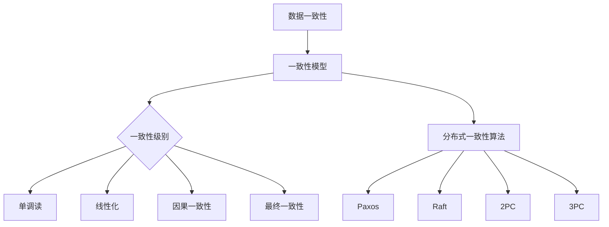
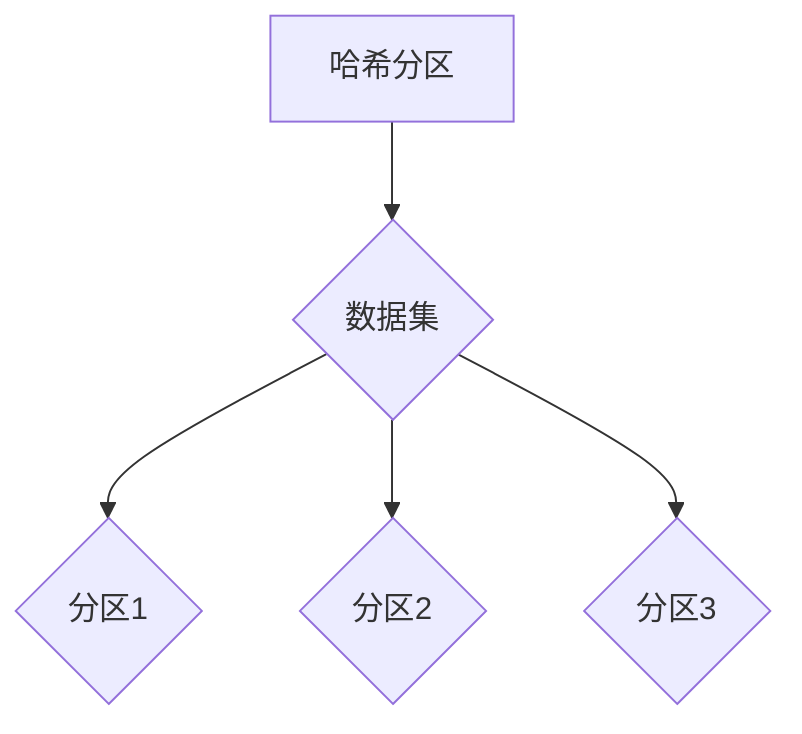
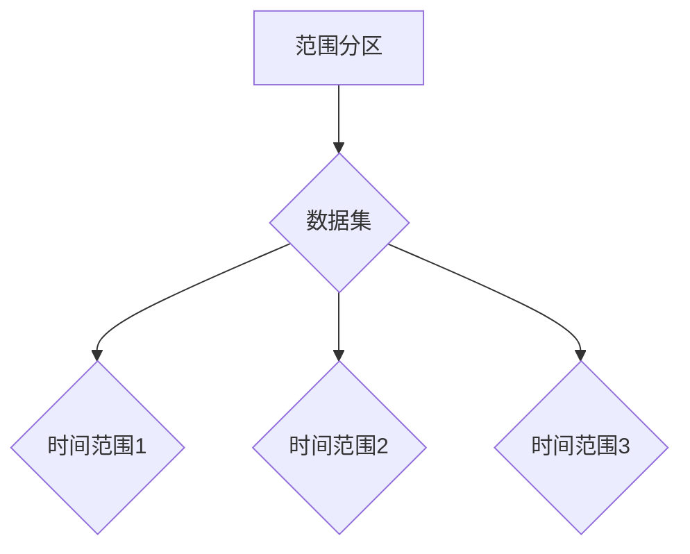
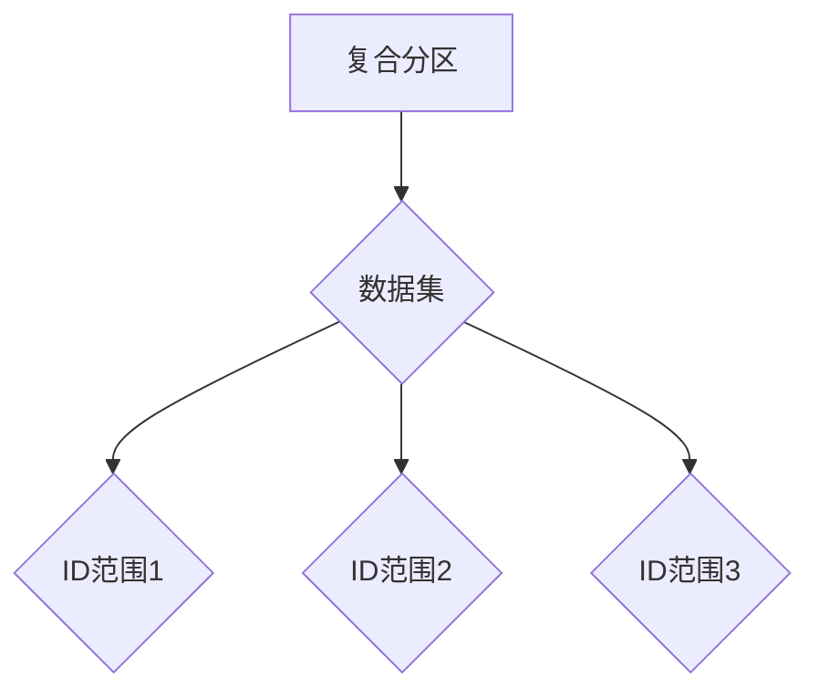
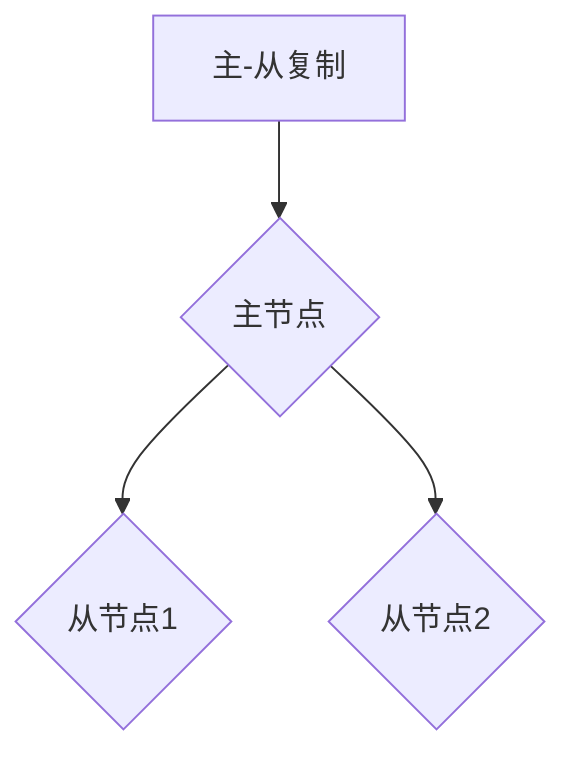
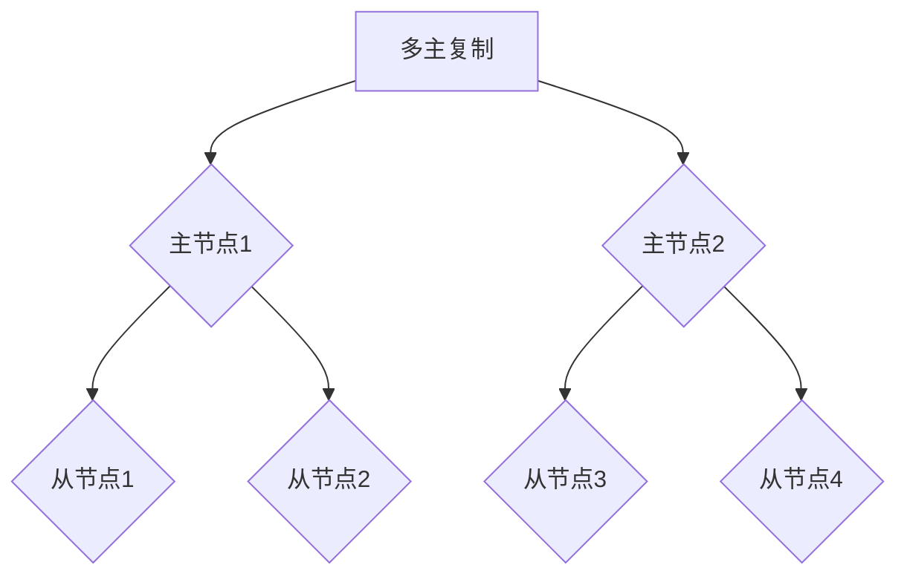
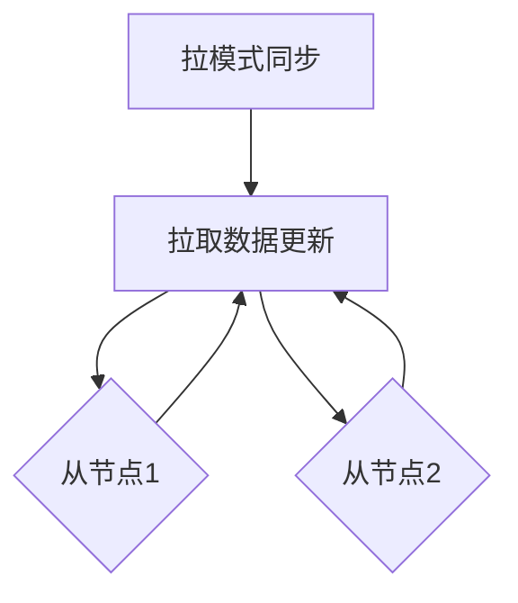
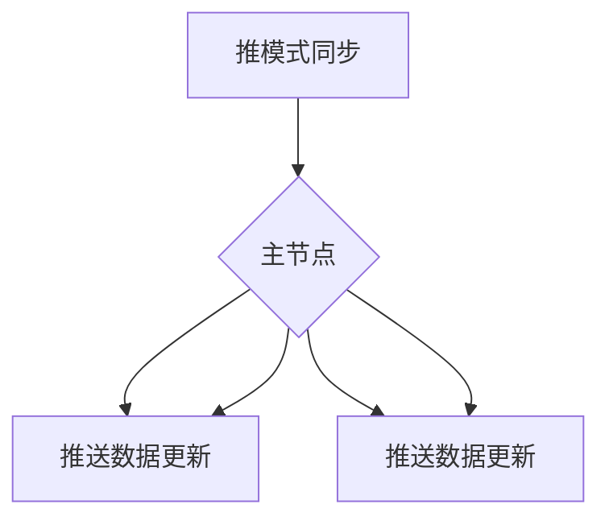

                 


### 文章标题
《数据一致性：分布式LLM系统的挑战与解决方案》

### 关键词
数据一致性，分布式系统，LLM，分布式一致性算法，分布式事务处理，分布式锁，并发控制

### 摘要
本文将深入探讨分布式LLM（大型语言模型）系统中的数据一致性问题。随着计算资源的分布式部署和云计算技术的广泛应用，分布式系统已成为现代计算架构的核心。然而，数据一致性在分布式环境中变得更加复杂和困难。本文将详细介绍数据一致性的概念、重要性、挑战，以及分布式一致性算法、事务处理和并发控制的理论与实践。通过案例分析，本文将探讨分布式系统中的数据一致性问题，并提出相应的解决方案。

### 目录大纲

# 《数据一致性：分布式LLM系统的挑战与解决方案》

## 第一部分：数据一致性基础

### 第1章：数据一致性的概念与重要性

#### 1.1 数据一致性的定义

数据一致性是指分布式系统中数据状态的协调和一致性，即在同一时间，多个节点访问和操作同一数据时，能够保持数据的一致性和准确性。

#### 1.2 数据一致性的挑战

在分布式系统中，数据一致性的挑战主要包括网络延迟、节点故障、并发访问等。

#### 1.3 数据一致性的重要性

数据一致性对于分布式系统的正确性和可靠性至关重要，它关系到数据的有效性、业务流程的连续性和用户体验。

#### 1.4 数据一致性与分布式系统

分布式系统中的数据一致性问题是分布式计算架构的核心挑战之一。

## 第二部分：数据一致性的理论探讨

### 第2章：分布式一致性算法

#### 2.1 PACELC理论

PACELC理论提出了分布式一致性算法的四个关键指标：一致性（Consistency）、可用性（Availability）、分区容错性（Partition Tolerance）、延迟（Latency）。

#### 2.2 GCP一致性模型

GCP（Gossip-Based Consistency and Failure Detectors）模型是一种用于分布式系统中一致性检测和故障检测的方法。

#### 2.3 Raft算法

Raft算法是一种用于分布式系统的强一致性算法，具有简单的算法设计和良好的性能。

#### 2.4 Paxos算法

Paxos算法是一种分布式一致性算法，用于在多个节点之间达成一致决策。

### 第3章：分布式事务处理

#### 4.1 2PC协议

2PC（Two-Phase Commit）协议是一种分布式事务处理协议，用于确保分布式系统中的数据一致性。

#### 4.2 3PC协议

3PC（Three-Phase Commit）协议是对2PC协议的改进，通过引入第三个阶段来提高分布式事务处理的一致性和可用性。

#### 4.3 SMT协议

SMT（Single-Phase Multi-Commit）协议是一种简单且有效的分布式事务处理协议，它通过单阶段提交来提高事务处理的性能。

#### 4.4 分布式事务处理的优势与挑战

分布式事务处理的优势包括数据一致性和高可用性，但同时也面临着一系列挑战，如数据隔离、故障处理和性能优化。

### 第4章：分布式锁与并发控制

#### 5.1 基于版本控制的分布式锁

基于版本控制的分布式锁通过版本号来保证数据的并发访问和一致性。

#### 5.2 基于RY的分布式锁

基于RY（Read-Your-Write）的分布式锁通过读写分离机制来提高系统的并发性能。

#### 5.3 基于时间戳的分布式锁

基于时间戳的分布式锁通过时间戳来保证分布式系统中的数据一致性和并发控制。

#### 5.4 分布式并发控制挑战与解决方案

分布式并发控制面临的主要挑战包括锁竞争、死锁和性能瓶颈，本文将探讨相应的解决方案。

## 第三部分：数据一致性实践

### 第5章：分布式数据存储系统设计

#### 6.1 数据分区策略

数据分区策略通过将数据划分为多个分区来提高系统的并发性能和可扩展性。

#### 6.2 数据复制与容错

数据复制与容错通过在多个节点上存储数据的副本来提高系统的可靠性和数据一致性。

#### 6.3 分布式数据同步

分布式数据同步通过在多个节点之间同步数据来保持数据的一致性和准确性。

#### 6.4 数据一致性保障机制

数据一致性保障机制包括分布式一致性算法、分布式事务处理和分布式锁等，用于确保系统的数据一致性和可靠性。

### 第6章：分布式事务处理实践

#### 7.1 分布式事务处理案例分析

通过实际案例来分析分布式事务处理的实践和应用。

#### 7.2 分布式事务处理平台搭建

介绍如何搭建一个分布式事务处理平台，包括技术选型和架构设计。

#### 7.3 分布式事务处理示例代码

提供分布式事务处理的示例代码，并进行详细解读。

#### 7.4 分布式事务处理优化策略

讨论分布式事务处理的优化策略，包括性能调优和故障处理。

### 第7章：分布式锁与并发控制实践

#### 8.1 分布式锁案例分析

通过实际案例来分析分布式锁的应用和性能。

#### 8.2 分布式锁平台搭建

介绍如何搭建一个分布式锁平台，包括技术选型和架构设计。

#### 8.3 分布式锁示例代码

提供分布式锁的示例代码，并进行详细解读。

#### 8.4 分布式并发控制优化策略

讨论分布式并发控制的优化策略，包括锁竞争和性能调优。

## 第四部分：案例分析

### 第8章：分布式系统数据一致性问题案例分析

#### 9.1 数据丢失案例

分析一个分布式系统中的数据丢失案例，并提出解决方案。

#### 9.2 数据不一致案例

分析一个分布式系统中的数据不一致案例，并提出解决方案。

#### 9.3 案例分析与解决方案

对多个分布式系统数据一致性问题案例进行分析，并总结解决方案。

### 第9章：分布式系统数据一致性解决方案案例分析

#### 10.1 数据复制与容错案例

分析一个分布式系统中的数据复制与容错案例，并提出解决方案。

#### 10.2 一致性算法优化案例

分析一个分布式系统中的一致性算法优化案例，并提出解决方案。

#### 10.3 分布式事务处理优化案例

分析一个分布式系统中的分布式事务处理优化案例，并提出解决方案。

#### 10.4 案例分析与总结

对多个分布式系统数据一致性解决方案案例进行分析，并总结经验教训。

## 附录

### 附录A：分布式数据一致性相关资源

#### A.1 相关论文与资料

推荐一些关于分布式数据一致性的相关论文和资料。

#### A.2 主流分布式系统框架

介绍一些主流的分布式系统框架，如ZooKeeper、Consul、etcd等。

#### A.3 分布式系统相关工具

介绍一些用于分布式系统开发的工具，如Apache Kafka、Apache Flink、Apache Spark等。

#### A.4 社区与论坛推荐

推荐一些关于分布式数据一致性的社区和论坛，供读者交流和学习。

---

### 第一部分：数据一致性基础

### 第1章：数据一致性的概念与重要性

#### 1.1 数据一致性的定义

数据一致性指的是在一个分布式系统中，多个节点对同一数据进行的读写操作能够保持一致的状态。在分布式环境中，数据一致性是确保系统正确性和可靠性的关键因素。它涉及到多个方面，包括数据的准确性、完整性、实时性和可靠性。

**核心概念与联系**

下面是数据一致性的核心概念及其之间的关系架构图：



**核心算法原理讲解**

数据一致性的核心算法包括Paxos、Raft和2PC等。

**Paxos算法**

```pseudo
// Paxos算法伪代码

初始化：
- 选择一个提案编号 N
- 将提案内容 message = (N, value)

准备阶段：
- 节点A发送 Prepare(N) 给其他节点
- 如果收到来自多数节点的 Ack(N)，则进入提交阶段

提交阶段：
- 节点B收到 Prepare(N) 后，返回一个提案编号和提案值：Ack(N, V)
- 节点A根据多数节点的提案值，将 V 作为最终值提交给系统
```

**Raft算法**

```pseudo
// Raft算法伪代码

初始化：
- 选择一个领导者节点

选举阶段：
- 节点A发送投票请求给其他节点
- 如果收到来自多数节点的投票响应，则成为领导者

提交阶段：
- 领导者节点将日志条目提交给所有副本节点
- 副本节点收到日志条目后，将其写入本地日志，并回复领导者节点
```

**2PC协议**

```pseudo
// 2PC协议伪代码

初始化：
- 选择一个协调者节点

投票阶段：
- 协调者节点向所有参与者节点发送投票请求
- 如果参与者节点收到请求，则进行本地事务处理并返回投票结果

提交阶段：
- 协调者节点根据参与者节点的投票结果，决定是否提交事务
- 如果多数参与者节点同意提交，则向所有节点发送提交命令
```

**数学模型和公式**

在分布式系统中，数据一致性的保证可以通过以下数学模型和公式来描述：

$$
\text{一致性} = \frac{\text{正确操作数}}{\text{总操作数}}
$$

**详细讲解与举例说明**

假设一个分布式系统中有三个节点A、B、C，它们对同一个数据集进行读写操作。

- 当节点A读取数据时，它将从本地缓存中获取数据，并立即返回结果。
- 当节点B读取数据时，它将从远程节点A、B、C中获取数据，并选择最新的数据进行返回。
- 当节点C写入数据时，它将首先将数据发送给节点A、B，等待它们确认后再进行写入。

通过这种方式，分布式系统能够保持数据的一致性，确保多个节点访问和操作同一数据时，能够保持数据的一致性和准确性。

#### 1.2 数据一致性的挑战

在分布式系统中，数据一致性的挑战主要包括以下几个方面：

1. **网络延迟**：由于网络延迟的存在，可能导致数据在多个节点之间的传输延迟，从而影响数据的一致性。
2. **节点故障**：在分布式系统中，节点可能会出现故障，导致数据无法及时同步和更新，从而影响数据的一致性。
3. **并发访问**：在分布式系统中，多个节点可能会同时对同一数据进行访问和操作，导致数据冲突和一致性问题。

**分布式系统原理**

分布式系统是一种将计算任务分布在多个节点上的计算架构，通过节点之间的通信和协作，完成复杂的计算任务。分布式系统的核心原理包括：

1. **节点自治**：每个节点都可以独立运行，具有自治能力，不需要依赖中心化的控制。
2. **分布式算法**：分布式系统采用分布式算法来实现任务的分配和协同，如一致性算法、分布式事务处理算法等。
3. **通信机制**：分布式系统通过通信机制实现节点之间的数据传输和同步，如TCP/IP协议、UDP协议等。

**分布式系统挑战**

分布式系统面临的挑战主要包括：

1. **数据一致性**：如何在分布式环境中保持数据的一致性和准确性，是一个重要且具有挑战性的问题。
2. **可用性**：如何在分布式系统中确保服务的可用性和高可用性，是一个重要的挑战。
3. **性能和可扩展性**：如何提高分布式系统的性能和可扩展性，以满足不断增长的计算需求。

#### 1.3 数据一致性的重要性

数据一致性对于分布式系统的重要性不言而喻。它关系到系统的正确性、可靠性和用户体验。以下是数据一致性的几个关键方面：

1. **业务连续性**：在分布式环境中，保持数据一致性是确保业务连续性的关键。如果数据出现不一致，可能会导致业务中断、数据丢失或业务流程错误。
2. **数据准确性**：数据一致性保证了数据的准确性，使系统能够提供正确的数据结果，为业务决策提供可靠依据。
3. **用户体验**：在分布式系统中，保持数据一致性可以提高用户体验，减少数据冲突和错误，提供一致的数据视图。
4. **系统可靠性**：数据一致性是系统可靠性的基础，确保系统在分布式环境中能够稳定运行，提高系统的容错性和健壮性。

#### 1.4 数据一致性与分布式系统

数据一致性与分布式系统密切相关，它们之间的关系可以概括为以下几个方面：

1. **一致性模型**：分布式系统采用一致性模型来描述数据的一致性要求，如线性化、因果一致性、最终一致性等。
2. **一致性算法**：分布式系统采用一致性算法来实现数据一致性的保证，如Paxos、Raft、2PC等。
3. **分布式事务处理**：分布式系统通过分布式事务处理来确保数据的一致性，如2PC、3PC等。
4. **分布式锁与并发控制**：分布式系统通过分布式锁和并发控制来确保数据的并发访问一致性，如基于版本控制的分布式锁、基于RY的分布式锁等。

通过数据一致性和分布式系统的结合，分布式系统能够实现数据的高可用性、高性能和可扩展性，为现代云计算和分布式计算提供坚实的基础。

### 第2章：分布式系统与一致性

#### 2.1 分布式系统的原理

分布式系统是一种将计算任务分布在多个节点上的计算架构，通过节点之间的通信和协作，完成复杂的计算任务。其核心原理包括以下几个方面：

1. **节点自治**：每个节点都可以独立运行，具有自治能力，不需要依赖中心化的控制。这意味着节点可以独立处理本地任务，同时与其他节点协同工作。
2. **分布式算法**：分布式系统采用分布式算法来实现任务的分配和协同，如一致性算法、分布式事务处理算法等。这些算法确保了分布式系统中任务的高效执行和协调。
3. **通信机制**：分布式系统通过通信机制实现节点之间的数据传输和同步，如TCP/IP协议、UDP协议等。这些通信机制确保了节点之间的可靠通信和协同工作。

#### 2.2 分布式系统的挑战

分布式系统面临着一系列挑战，其中最重要的是数据一致性问题。以下是分布式系统面临的几个主要挑战：

1. **数据一致性**：在分布式环境中，如何保持数据的一致性和准确性，是一个重要且具有挑战性的问题。分布式系统需要确保多个节点访问和操作同一数据时，能够保持数据的一致性。
2. **可用性**：如何在分布式系统中确保服务的可用性和高可用性，是一个重要的挑战。分布式系统需要能够处理节点故障、网络故障等异常情况，确保服务的连续性。
3. **性能和可扩展性**：如何提高分布式系统的性能和可扩展性，以满足不断增长的计算需求，是一个关键挑战。分布式系统需要能够在高负载和大规模环境下保持高性能和可扩展性。

**一致性模型**

一致性模型是分布式系统中的核心概念，用于描述数据在不同状态之间的转换和同步。以下是一些常见的一致性模型：

1. **单调读**：单调读是指如果一次读取操作发生在另一次读取操作之后，那么后一次读取操作的结果一定不会比前一次读取操作的结果更差。
2. **线性化**：线性化是指分布式系统中的所有操作按照时间顺序排列，使得每个操作看起来像是顺序执行的一样。
3. **因果一致性**：因果一致性是指如果操作A在操作B之前发生，那么在分布式系统中，操作A的结果必须先于操作B的结果。
4. **最终一致性**：最终一致性是指分布式系统中的所有操作最终会在所有节点上达成一致，但可能需要一定的时间延迟。

**一致性协议**

一致性协议是分布式系统中的关键机制，用于确保数据在不同状态之间的同步和一致性。以下是一些常见的一致性协议：

1. **Paxos协议**：Paxos协议是一种分布式一致性算法，用于在多个节点之间达成一致决策。它通过选举领导者节点和提案机制来实现一致性保证。
2. **Raft算法**：Raft算法是一种分布式一致性算法，基于Paxos算法，但相对于Paxos算法，它具有更简单的算法设计和更好的性能。
3. **2PC协议**：2PC协议（Two-Phase Commit）是一种分布式事务处理协议，用于确保分布式系统中事务的一致性。它通过协调者节点和参与者节点之间的通信来实现事务的提交和回滚。
4. **3PC协议**：3PC协议（Three-Phase Commit）是对2PC协议的改进，通过引入第三个阶段来提高分布式事务处理的一致性和可用性。

通过一致性模型和一致性协议的运用，分布式系统能够确保数据在不同状态之间的同步和一致性，从而实现分布式环境下的数据一致性保障。

### 第3章：分布式一致性算法

分布式一致性算法是分布式系统中的核心机制，用于确保数据在不同状态之间的同步和一致性。本章将深入探讨分布式一致性算法的基本原理，包括PACELC理论、GCP一致性模型、Raft算法和Paxos算法。

#### 3.1 PACELC理论

PACELC理论（Participation Consistency, Availability, Commitment, Latency）是分布式一致性算法的重要理论基础，它提出了分布式一致性算法的四个关键指标：一致性（Consistency）、可用性（Availability）、分区容错性（Partition Tolerance）和延迟（Latency）。这些指标共同决定了分布式系统的性能和可靠性。

**一致性（Consistency）**

一致性是指分布式系统在多个节点之间保持数据的一致性。根据不同的应用需求，一致性可以分为以下几种级别：

1. **单调读**（Monotonic Read）：单调读确保如果一个节点读取数据，那么后续的读取操作不会看到更旧的数据。
2. **因果一致性**（ causal consistency）：因果一致性确保如果一个操作A在操作B之前发生，那么在分布式系统中，操作A的结果必须先于操作B的结果。
3. **线性化**（Linearizability）：线性化确保分布式系统的所有操作在时间上呈现出一种顺序执行的效果。

**可用性（Availability）**

可用性是指分布式系统在面临故障时，能够持续提供服务的能力。根据不同的可用性要求，分布式系统可以分为以下几种类型：

1. **强可用性**（Strong Availability）：强可用性确保分布式系统在面临任何故障时，都能持续提供服务。
2. **最终可用性**（ eventual availability）：最终可用性确保分布式系统在面临故障时，最终能够恢复正常服务。

**分区容错性（Partition Tolerance）**

分区容错性是指分布式系统在面对网络分区和节点故障时，能够继续运行的能力。分区容错性是分布式系统的核心特性，它允许系统在分区和故障情况下，仍然能够提供部分服务。

**延迟（Latency）**

延迟是指分布式系统中数据在不同节点之间的传输和处理时间。降低延迟是提高分布式系统性能的关键因素。延迟可以分为以下几个层次：

1. **网络延迟**：网络延迟是指数据在不同节点之间的传输时间。
2. **处理延迟**：处理延迟是指节点对数据的处理时间。

PACELC理论通过这四个指标，为分布式一致性算法的设计和优化提供了指导。在实际应用中，根据具体的应用场景和需求，分布式一致性算法需要在一致性、可用性、分区容错性和延迟之间做出权衡。

#### 3.2 GCP一致性模型

GCP（Gossip-Based Consistency and Failure Detectors）模型是一种用于分布式系统中一致性检测和故障检测的方法。它基于Gossip协议，通过节点之间的信息交换来维护系统的一致性和检测故障。

**Gossip协议**

Gossip协议是一种分布式通信协议，节点通过发送和接收Gossip消息来交换信息。Gossip消息包含节点的状态信息、故障信息等。Gossip协议的核心思想是通过随机选择邻居节点来交换信息，从而实现系统的全局一致性。

**一致性检测**

GCP模型通过一致性检测来确保分布式系统的数据一致性。一致性检测包括以下步骤：

1. **状态报告**：每个节点定期向其他节点发送自己的状态报告，包括节点的状态信息和维护的一致性信息。
2. **状态验证**：其他节点根据收到的状态报告，验证节点的一致性信息。如果发现不一致，则触发一致性修复机制。
3. **一致性修复**：触发一致性修复机制，包括重新同步数据、选择新的领导者节点等。

**故障检测**

GCP模型通过故障检测来确保分布式系统的故障容错能力。故障检测包括以下步骤：

1. **心跳检测**：每个节点定期向其他节点发送心跳消息，以检测其他节点的存活状态。
2. **故障检测**：如果节点在规定时间内未收到心跳消息，则认为该节点故障，并将其标记为失效节点。
3. **故障恢复**：通过故障恢复机制，包括选择新的领导者节点、重新分配任务等，确保系统继续运行。

GCP模型通过Gossip协议实现一致性检测和故障检测，从而确保分布式系统的数据一致性和故障容错能力。它在分布式系统中被广泛应用于，如分布式存储系统、分布式数据库等。

#### 3.3 Raft算法

Raft算法是一种分布式一致性算法，它旨在提供简单、高效和可靠的分布式一致性保证。Raft算法通过三个核心组件：日志复制、领导者选举和状态机，实现了分布式系统中的强一致性。

**日志复制**

日志复制是Raft算法的核心机制，用于确保分布式系统中所有节点的日志状态一致。日志复制包括以下步骤：

1. **日志条目生成**：当客户端向服务器发送请求时，服务器将请求内容封装为日志条目，并添加唯一标识和日志索引。
2. **日志提交**：服务器将日志条目写入本地日志，并尝试将日志条目同步到其他节点。同步过程采用多数派原则，即当多数派节点确认日志条目后，该日志条目被视为已提交。
3. **日志存储**：服务器将已提交的日志条目存储在持久化存储中，以防止节点故障导致的数据丢失。

**领导者选举**

领导者选举是Raft算法中的关键机制，用于确保分布式系统中的领导者节点能够持续提供服务。领导者选举包括以下步骤：

1. **选举触发**：当领导者节点故障或网络分区时， follower节点会触发领导者选举。
2. **投票阶段**：每个follower节点向其他节点发送投票请求，如果收到来自多数派节点的投票响应，则成为新的领导者节点。
3. **领导者确认**：新的领导者节点向其他节点发送心跳消息，以确保其他节点认可其领导者身份。

**状态机**

状态机是Raft算法中的核心概念，用于确保分布式系统中所有节点的状态一致。状态机包括以下步骤：

1. **状态更新**：当客户端向服务器发送请求时，服务器将请求内容封装为日志条目，并更新状态机。
2. **状态同步**：服务器将已提交的日志条目同步到其他节点，确保所有节点的状态一致。

通过日志复制、领导者选举和状态机，Raft算法实现了分布式系统中的强一致性。它具有简单的算法设计和良好的性能，被广泛应用于分布式存储系统、分布式数据库等领域。

#### 3.4 Paxos算法

Paxos算法是一种分布式一致性算法，用于在多个节点之间达成一致决策。Paxos算法通过多个阶段和多个角色（提议者、接受者、学习者），实现了分布式系统中的强一致性。

**Paxos算法原理**

Paxos算法的核心思想是通过多个阶段的交互，确保分布式系统中所有节点达成一致决策。Paxos算法包括以下阶段：

1. **提议阶段**：提议者生成一个提案（Proposal），并将提案发送给接受者。
2. **接受阶段**：接受者收到提案后，将其与本地日志进行比对，如果提案大于本地日志，则接受提案，并将提案值反馈给提议者。
3. **学习阶段**：提议者收到来自多数派接受者的接受反馈后，将接受者反馈的提案值作为最终决策值，并将其发送给所有学习者。

**Paxos算法角色**

Paxos算法中的角色包括提议者（Proposer）、接受者（Acceptor）和学习者（Learner）：

1. **提议者**：提议者负责生成提案并协调分布式系统中的决策过程。
2. **接受者**：接受者负责接受提议者的提案，并将其反馈给提议者。
3. **学习者**：学习者负责学习最终的决策值，并将决策结果应用到本地状态机上。

通过多个阶段和多个角色的协同工作，Paxos算法实现了分布式系统中的强一致性。它具有简单的算法设计和良好的性能，被广泛应用于分布式存储系统、分布式数据库等领域。

### 第4章：分布式事务处理

分布式事务处理是分布式系统中的关键机制，用于确保分布式环境下的数据一致性和完整性。本章将深入探讨分布式事务处理的基本原理，包括2PC协议、3PC协议和SMT协议。

#### 4.1 2PC协议

2PC协议（Two-Phase Commit）是一种分布式事务处理协议，用于确保分布式系统中事务的一致性和完整性。2PC协议分为两个阶段：准备阶段和提交阶段。

**准备阶段**

在准备阶段，事务协调者向所有参与者节点发送预备投票请求。参与者节点在执行本地事务后，向协调者发送预备投票响应。

1. **事务协调者向参与者发送预备投票请求**：事务协调者向所有参与者节点发送预备投票请求，请求参与者节点执行本地事务。
2. **参与者执行本地事务**：参与者节点在执行本地事务后，向事务协调者发送预备投票响应，表示本地事务是否执行成功。
3. **事务协调者收集参与者响应**：事务协调者收集所有参与者的预备投票响应，判断是否继续提交事务。

**提交阶段**

在提交阶段，事务协调者根据参与者的预备投票响应，决定是否提交事务。如果大多数参与者节点同意提交，则事务协调者向所有参与者节点发送提交命令，否则发送回滚命令。

1. **事务协调者决定提交或回滚**：事务协调者根据参与者的预备投票响应，判断是否继续提交事务。如果大多数参与者节点同意提交，则继续提交；否则，发送回滚命令。
2. **参与者节点提交或回滚事务**：参与者节点在接收到事务协调者的提交或回滚命令后，执行相应操作，提交事务或回滚事务。

通过2PC协议，分布式系统能够确保事务的一致性和完整性。2PC协议的优点是简单易实现，但缺点是存在单点故障和性能瓶颈。因此，在实际应用中，2PC协议通常与其他一致性算法和分布式锁结合使用，以提高系统的性能和可用性。

#### 4.2 3PC协议

3PC协议（Three-Phase Commit）是对2PC协议的改进，通过引入第三个阶段来提高分布式事务处理的一致性和可用性。3PC协议分为三个阶段：预备阶段、提交阶段和确认阶段。

**预备阶段**

在预备阶段，事务协调者向所有参与者节点发送预备投票请求。参与者节点在执行本地事务后，向事务协调者发送预备投票响应。

1. **事务协调者向参与者发送预备投票请求**：事务协调者向所有参与者节点发送预备投票请求，请求参与者节点执行本地事务。
2. **参与者执行本地事务**：参与者节点在执行本地事务后，向事务协调者发送预备投票响应，表示本地事务是否执行成功。
3. **事务协调者收集参与者响应**：事务协调者收集所有参与者的预备投票响应，判断是否继续提交事务。

**提交阶段**

在提交阶段，事务协调者根据参与者的预备投票响应，决定是否提交事务。如果大多数参与者节点同意提交，则事务协调者向所有参与者节点发送提交命令，否则发送回滚命令。

1. **事务协调者决定提交或回滚**：事务协调者根据参与者的预备投票响应，判断是否继续提交事务。如果大多数参与者节点同意提交，则继续提交；否则，发送回滚命令。
2. **参与者节点提交或回滚事务**：参与者节点在接收到事务协调者的提交或回滚命令后，执行相应操作，提交事务或回滚事务。

**确认阶段**

在确认阶段，事务协调者向所有参与者节点发送确认投票请求。参与者节点在执行本地事务后，向事务协调者发送确认投票响应。

1. **事务协调者向参与者发送确认投票请求**：事务协调者向所有参与者节点发送确认投票请求，请求参与者节点执行本地事务。
2. **参与者执行本地事务**：参与者节点在执行本地事务后，向事务协调者发送确认投票响应，表示本地事务是否执行成功。
3. **事务协调者收集参与者响应**：事务协调者收集所有参与者的确认投票响应，判断事务是否最终提交。

通过3PC协议，分布式系统能够提高事务的可靠性和可用性，减少单点故障的风险。3PC协议的优点是具有较高的可靠性和可用性，但缺点是存在性能瓶颈和复杂度增加。在实际应用中，3PC协议通常与其他一致性算法和分布式锁结合使用，以提高系统的性能和可用性。

#### 4.3 SMT协议

SMT协议（Single-Phase Multi-Commit）是一种分布式事务处理协议，通过单阶段提交来提高分布式事务处理的一致性和性能。SMT协议的核心思想是在事务执行过程中，通过预提交和最终提交两个阶段，确保分布式系统的一致性和完整性。

**预提交阶段**

在预提交阶段，事务协调者向所有参与者节点发送预提交请求。参与者节点在执行本地事务后，向事务协调者发送预提交响应。

1. **事务协调者向参与者发送预提交请求**：事务协调者向所有参与者节点发送预提交请求，请求参与者节点执行本地事务。
2. **参与者执行本地事务**：参与者节点在执行本地事务后，向事务协调者发送预提交响应，表示本地事务是否执行成功。
3. **事务协调者收集参与者响应**：事务协调者收集所有参与者的预提交响应，判断是否继续提交事务。

**最终提交阶段**

在最终提交阶段，事务协调者根据参与者的预提交响应，决定是否最终提交事务。如果大多数参与者节点同意提交，则事务协调者向所有参与者节点发送最终提交命令，否则发送回滚命令。

1. **事务协调者决定提交或回滚**：事务协调者根据参与者的预提交响应，判断是否继续提交事务。如果大多数参与者节点同意提交，则继续提交；否则，发送回滚命令。
2. **参与者节点提交或回滚事务**：参与者节点在接收到事务协调者的最终提交或回滚命令后，执行相应操作，提交事务或回滚事务。

通过SMT协议，分布式系统能够在保持一致性的同时，提高事务处理的速度和性能。SMT协议的优点是具有较高的性能和灵活性，但缺点是存在一定的风险，如网络延迟和节点故障可能导致事务失败。在实际应用中，SMT协议通常与其他一致性算法和分布式锁结合使用，以提高系统的性能和可用性。

#### 4.4 分布式事务处理的优势与挑战

分布式事务处理具有以下优势：

1. **数据一致性**：分布式事务处理能够确保分布式系统中的数据一致性，避免数据冲突和错误。
2. **可用性**：分布式事务处理能够提高系统的可用性，通过分布式协调器和参与者节点之间的通信，确保事务的持续执行。
3. **性能和可扩展性**：分布式事务处理能够提高系统的性能和可扩展性，通过并行执行事务，减少系统延迟和响应时间。

然而，分布式事务处理也面临着一系列挑战：

1. **单点故障**：分布式事务处理中的协调器可能成为单点故障点，导致系统性能下降和可用性降低。
2. **网络延迟**：分布式事务处理中的节点之间可能存在网络延迟，影响事务处理的效率和一致性。
3. **数据冲突**：在分布式环境中，多个节点可能同时访问和操作同一数据，导致数据冲突和一致性问题。
4. **故障恢复**：分布式事务处理需要确保在节点故障情况下的事务恢复和一致性维护，增加了系统的复杂性。

为了应对这些挑战，分布式事务处理需要结合分布式一致性算法、分布式锁和分布式存储等技术，确保分布式系统中的数据一致性和可靠性。在实际应用中，根据具体的需求和场景，可以选择合适的分布式事务处理协议和优化策略，以提高系统的性能和可用性。

### 第5章：分布式锁与并发控制

分布式锁与并发控制是确保分布式系统中数据一致性和准确性的重要机制。本章将深入探讨分布式锁的基本原理，包括基于版本控制的分布式锁、基于RY的分布式锁和基于时间戳的分布式锁，以及分布式并发控制的挑战与解决方案。

#### 5.1 基于版本控制的分布式锁

基于版本控制的分布式锁通过版本号来保证分布式系统中的数据并发访问和一致性。每个数据项都关联一个版本号，当数据项被修改时，版本号递增。分布式锁通过检查版本号来确保数据的一致性。

**工作原理**

1. **加锁**：当节点需要访问数据时，首先获取数据项的当前版本号，然后向分布式锁服务请求加锁。分布式锁服务检查版本号，如果版本号未发生变化，则允许加锁。
2. **解锁**：当节点完成数据访问后，释放锁。分布式锁服务将版本号递增，允许其他节点访问数据。

**优点**

- **简单易实现**：基于版本控制的分布式锁实现简单，无需复杂的分布式一致性算法。
- **高可用性**：基于版本控制的分布式锁能够快速响应加锁和解锁请求，提高系统的可用性。

**缺点**

- **数据不一致风险**：如果多个节点同时修改同一数据项，可能导致数据版本号不一致，引发数据冲突。
- **性能瓶颈**：基于版本控制的分布式锁可能需要频繁读取和更新版本号，增加系统的性能开销。

**应用场景**

- **缓存系统**：在缓存系统中，基于版本控制的分布式锁可以确保缓存数据的并发访问和一致性。
- **分布式存储系统**：在分布式存储系统中，基于版本控制的分布式锁可以保证数据的一致性和准确性。

**伪代码**

```python
// 基于版本控制的分布式锁

class VersionLock:
    def __init__(self):
        self.version = 0

    def lock(self, data_item):
        current_version = data_item.version
        if current_version == self.version:
            data_item.version += 1
            self.version += 1
            return True
        else:
            return False

    def unlock(self, data_item):
        if data_item.version == self.version:
            data_item.version += 1
            self.version += 1
        else:
            raise Exception("解锁失败：版本号不一致")
```

#### 5.2 基于RY的分布式锁

基于RY（Read-Your-Write）的分布式锁通过读写分离机制来提高分布式系统的并发性能。RY锁允许节点读取数据时无需加锁，但写入数据时需要加锁。这种锁机制通过减少加锁操作，提高系统的并发性能。

**工作原理**

1. **读取操作**：节点读取数据时，无需加锁，直接访问数据。
2. **写入操作**：节点写入数据时，首先获取分布式锁，确保其他节点无法同时写入同一数据。
3. **解锁**：写入操作完成后，释放分布式锁，允许其他节点访问数据。

**优点**

- **高并发性能**：基于RY的分布式锁通过减少加锁操作，提高系统的并发性能，适用于高并发场景。
- **数据一致性**：基于RY的分布式锁能够确保数据的一致性和准确性，防止多个节点同时写入同一数据。

**缺点**

- **数据一致性风险**：如果多个节点同时读取同一数据，可能导致数据不一致。
- **性能开销**：基于RY的分布式锁可能需要额外的读写分离机制，增加系统的性能开销。

**应用场景**

- **高并发缓存系统**：在需要高并发性能的缓存系统中，基于RY的分布式锁可以确保数据的一致性和准确性。
- **分布式数据库**：在分布式数据库系统中，基于RY的分布式锁可以减少锁竞争，提高系统的并发性能。

**伪代码**

```python
// 基于RY的分布式锁

class ReadWriteLock:
    def __init__(self):
        self.read_count = 0
        self.write_count = 0

    def read(self):
        self.read_count += 1
        return True

    def write(self):
        if self.read_count == 0:
            self.write_count += 1
            return True
        else:
            return False

    def unlock_read(self):
        self.read_count -= 1

    def unlock_write(self):
        if self.write_count > 0:
            self.write_count -= 1
        else:
            raise Exception("解锁失败：版本号不一致")
```

#### 5.3 基于时间戳的分布式锁

基于时间戳的分布式锁通过时间戳来保证分布式系统中的数据一致性和并发控制。每个锁请求都关联一个时间戳，锁服务根据时间戳来决定锁的分配。

**工作原理**

1. **加锁请求**：节点向锁服务发送加锁请求，锁服务根据时间戳判断是否分配锁。如果请求的时间戳大于当前锁的时间戳，则分配锁；否则，拒绝请求。
2. **解锁请求**：节点在完成数据访问后，向锁服务发送解锁请求。锁服务根据时间戳判断是否解锁。如果请求的时间戳等于当前锁的时间戳，则解锁；否则，拒绝请求。

**优点**

- **高效的时间戳管理**：基于时间戳的分布式锁通过高效的时间戳管理，减少锁竞争和冲突，提高系统的性能。
- **简化的一致性保证**：基于时间戳的分布式锁简化了一致性保证，通过时间戳的顺序来确保数据的正确性。

**缺点**

- **时间戳同步问题**：基于时间戳的分布式锁需要确保节点之间的时间戳同步，否则可能导致锁分配不正确。
- **性能开销**：基于时间戳的分布式锁可能需要额外的时钟同步机制，增加系统的性能开销。

**应用场景**

- **高并发缓存系统**：在需要高并发性能的缓存系统中，基于时间戳的分布式锁可以确保数据的一致性和准确性。
- **分布式数据库**：在分布式数据库系统中，基于时间戳的分布式锁可以减少锁竞争，提高系统的并发性能。

**伪代码**

```python
// 基于时间戳的分布式锁

class TimestampLock:
    def __init__(self):
        self.lock_timestamp = 0

    def lock(self, node_timestamp):
        if node_timestamp > self.lock_timestamp:
            self.lock_timestamp = node_timestamp
            return True
        else:
            return False

    def unlock(self, node_timestamp):
        if node_timestamp == self.lock_timestamp:
            self.lock_timestamp += 1
            return True
        else:
            return False
```

#### 5.4 分布式并发控制挑战与解决方案

分布式并发控制面临的主要挑战包括锁竞争、死锁和性能瓶颈。以下是一些常见的挑战和相应的解决方案：

1. **锁竞争**：锁竞争是指多个节点同时请求同一锁资源，导致系统性能下降。解决方案包括：
   - **锁粗粒度化**：通过增加锁的粒度，减少锁竞争。
   - **锁代理**：使用锁代理来减少锁的争用，提高系统的并发性能。

2. **死锁**：死锁是指多个节点之间相互等待对方释放锁资源，导致系统无法继续执行。解决方案包括：
   - **死锁检测与恢复**：使用死锁检测算法，定期检查系统是否存在死锁，并在发现死锁时进行恢复。
   - **锁顺序**：规定锁的顺序，避免节点之间相互等待，减少死锁的可能性。

3. **性能瓶颈**：性能瓶颈是指分布式系统在处理大量并发请求时，可能出现的响应时间增加和吞吐量下降。解决方案包括：
   - **水平扩展**：通过增加节点数量，提高系统的并发处理能力。
   - **性能优化**：对系统的代码和架构进行优化，减少系统的性能瓶颈。

通过解决分布式并发控制的挑战，分布式系统能够确保数据的一致性和准确性，提高系统的性能和可靠性。

### 第6章：分布式数据存储系统设计

分布式数据存储系统设计是构建分布式LLM系统的核心环节，它涉及到数据分区策略、数据复制与容错、分布式数据同步以及数据一致性保障机制等多个方面。本章将深入探讨这些关键要素，为分布式数据存储系统的设计提供理论依据和实践指导。

#### 6.1 数据分区策略

数据分区策略是分布式数据存储系统设计中的一项重要技术，它通过将数据集划分为多个分区，提高系统的并发性能和可扩展性。以下是几种常见的数据分区策略：

1. **哈希分区**：哈希分区通过使用哈希函数将数据集中的每个元素映射到特定的分区。这种方式能够实现数据的均匀分布，并提高数据访问的效率。



2. **范围分区**：范围分区根据数据的某个属性（如时间、ID等）将数据划分为多个连续的分区。这种方式适用于数据的有序访问和范围查询。



3. **复合分区**：复合分区将多个属性结合起来，将数据划分为多个分区。这种方式能够更好地适应数据的访问模式和查询需求。



**优点**

- **提高并发性能**：通过将数据划分为多个分区，可以减少单点瓶颈，提高系统的并发性能。
- **可扩展性**：数据分区策略使得系统可以方便地扩展，增加新的节点或存储设备。

**缺点**

- **数据倾斜**：如果数据分布不均匀，可能导致某些分区承担过多的负载，影响系统的性能。
- **查询复杂度**：范围查询和复合分区查询可能需要跨多个分区进行，增加查询的复杂度。

#### 6.2 数据复制与容错

数据复制是分布式数据存储系统设计中的一项重要技术，它通过在多个节点上存储数据的副本，提高系统的可靠性。以下是一些常见的数据复制策略：

1. **主-从复制**：主-从复制（Master-Slave Replication）是一种简单的数据复制策略，其中主节点负责处理写操作，从节点负责处理读操作。这种方式能够确保数据的一致性和可靠性。



2. **多主复制**：多主复制（Multi-Master Replication）允许多个节点同时处理写操作。这种方式能够提高系统的可用性和扩展性，但需要解决数据一致性问题。



**优点**

- **提高可靠性**：通过在多个节点上存储数据副本，系统能够容忍节点故障，确保数据的持久性和可用性。
- **提高可用性**：多主复制策略允许系统在节点故障时继续提供服务。

**缺点**

- **数据一致性问题**：多主复制策略需要解决数据一致性问题，确保多个节点之间的数据一致性。
- **性能开销**：数据复制需要额外的网络带宽和处理资源，可能会影响系统的性能。

#### 6.3 分布式数据同步

分布式数据同步是确保分布式数据存储系统中各个节点数据一致性的一项关键技术。以下是一些常见的分布式数据同步策略：

1. **拉模式同步**：拉模式同步（Pull-based Synchronization）中，从节点主动从主节点拉取数据更新。这种方式能够减少主节点的负载，但可能引入延迟。



2. **推模式同步**：推模式同步（Push-based Synchronization）中，主节点主动将数据更新推送到从节点。这种方式能够确保从节点及时获取数据更新，但可能增加主节点的负载。



**优点**

- **确保数据一致性**：通过分布式数据同步，系统能够确保各个节点的数据一致性。
- **提高系统可靠性**：分布式数据同步能够容忍节点故障，确保数据的持久性和可用性。

**缺点**

- **延迟问题**：分布式数据同步可能引入数据延迟，影响系统的实时性能。
- **网络带宽消耗**：分布式数据同步需要消耗额外的网络带宽，可能会影响系统的性能。

#### 6.4 数据一致性保障机制

数据一致性保障机制是分布式数据存储系统设计中的关键要素，它确保分布式系统中的数据一致性。以下是一些常见的数据一致性保障机制：

1. **一致性算法**：一致性算法（如Paxos、Raft）通过在多个节点之间协调数据操作，确保分布式系统的一致性。这些算法能够处理节点故障、网络分区等异常情况，确保数据的一致性。

2. **分布式事务处理**：分布式事务处理（如2PC、3PC）通过协调多个节点的事务操作，确保事务的一致性和完整性。分布式事务处理能够处理跨节点的操作，确保数据的一致性。

3. **分布式锁与并发控制**：分布式锁（如基于版本控制的分布式锁、基于RY的分布式锁）通过控制数据的并发访问，确保分布式系统的一致性。分布式锁能够处理并发访问和锁冲突问题，确保数据的一致性。

4. **数据一致性监控与恢复**：数据一致性监控与恢复通过监控系统的状态，及时发现和恢复数据一致性问题。这些机制能够检测数据不一致的情况，并采取相应的措施进行恢复，确保数据的一致性。

通过数据一致性保障机制，分布式数据存储系统能够确保数据的一致性和可靠性，为分布式LLM系统提供坚实的基础。

### 第7章：分布式事务处理实践

分布式事务处理在分布式系统中扮演着至关重要的角色，它能够确保分布式环境中的数据一致性、事务完整性和业务流程的连续性。本章将结合实际案例，介绍分布式事务处理的搭建方法、示例代码以及优化策略。

#### 7.1 分布式事务处理案例分析

在分布式系统中，事务处理的挑战主要体现在以下几个方面：

1. **跨节点事务**：分布式事务通常需要跨多个节点进行，如何在多个节点之间协调事务操作，确保事务的一致性，是一个重要问题。
2. **网络延迟**：分布式系统中的网络延迟可能导致事务处理延迟，影响系统的性能和用户体验。
3. **节点故障**：在分布式环境中，节点可能会出现故障，如何处理节点故障对事务处理的影响，是一个关键问题。

**案例一：分布式电商订单处理**

假设一个电商平台需要进行订单处理，涉及多个节点，如商品库存节点、订单节点和支付节点。订单处理流程包括以下几个步骤：

1. **创建订单**：用户提交订单请求，订单节点创建订单并更新商品库存。
2. **支付订单**：用户完成支付，支付节点更新订单状态。
3. **发货订单**：订单节点根据支付结果，更新订单状态并发货。

在这个案例中，订单处理是一个典型的分布式事务，需要确保多个节点之间的数据一致性。下面是具体的分布式事务处理方案：

1. **2PC协议**：使用2PC协议协调订单创建和商品库存更新。在订单节点向支付节点提交订单前，先与商品库存节点进行通信，确保库存充足后再提交订单。
2. **分布式锁**：使用分布式锁确保订单创建和支付操作的原子性，避免并发访问导致的数据不一致。

**案例二：分布式金融交易**

在金融交易系统中，事务处理的挑战更为复杂，涉及资金流转、风险控制和合规性等多个方面。以下是一个分布式金融交易的事务处理案例：

1. **交易发起**：用户发起交易请求，交易节点创建交易并更新资金账户。
2. **交易确认**：交易节点在完成资金账户更新后，向其他交易节点发送确认请求。
3. **交易结算**：在所有交易节点确认后，交易节点更新交易状态并结算资金。

在这个案例中，分布式事务处理需要考虑以下问题：

1. **分布式锁**：使用分布式锁确保资金账户的并发更新，避免数据冲突。
2. **分布式事务监控**：使用分布式事务监控工具，实时监控事务处理状态，及时发现和解决事务处理问题。

#### 7.2 分布式事务处理平台搭建

搭建一个分布式事务处理平台，需要考虑以下几个方面：

1. **技术选型**：根据业务需求和性能要求，选择合适的技术栈，如分布式数据库、消息队列和分布式锁框架等。
2. **架构设计**：设计分布式事务处理平台的整体架构，包括节点配置、数据同步和事务协调等。
3. **部署与运维**：确保分布式事务处理平台的稳定运行，包括节点的部署、监控和故障恢复等。

以下是一个简单的分布式事务处理平台搭建步骤：

1. **选择技术栈**：选择合适的分布式数据库（如Apache Kafka、Apache Flink、Apache Spark等）和分布式锁框架（如ZooKeeper、Consul、etcd等）。
2. **搭建节点**：在分布式环境中部署多个节点，包括数据库节点、消息队列节点和锁服务节点。
3. **配置数据同步**：配置分布式数据库的数据同步机制，确保各个节点之间的数据一致性。
4. **集成事务协调器**：集成分布式锁和事务协调器，实现分布式事务处理的功能。

#### 7.3 分布式事务处理示例代码

以下是一个基于2PC协议的分布式事务处理示例代码，用于处理订单创建和支付操作：

```python
# 订单创建操作

def create_order(order_id, product_id, quantity):
    # 加锁：确保订单创建和商品库存更新的原子性
    lock = distributed_lock(product_id)
    lock.acquire()
    
    # 检查商品库存
    product_stock = database.get_product_stock(product_id)
    if product_stock < quantity:
        lock.release()
        raise Exception("商品库存不足")
    
    # 更新订单状态
    order = database.create_order(order_id, product_id, quantity)
    
    # 更新商品库存
    database.update_product_stock(product_id, product_stock - quantity)
    
    # 解锁
    lock.release()

# 支付操作

def pay_order(order_id):
    # 加锁：确保订单支付操作的原子性
    lock = distributed_lock(order_id)
    lock.acquire()
    
    # 检查订单状态
    order = database.get_order(order_id)
    if order.status != "CREATED":
        lock.release()
        raise Exception("订单状态不正确")
    
    # 更新订单状态
    database.update_order_status(order_id, "PAID")
    
    # 解锁
    lock.release()
```

在这个示例中，`distributed_lock`函数用于获取分布式锁，`database`模块负责与分布式数据库进行交互。通过使用分布式锁，确保订单创建和支付操作的原子性，避免并发访问导致的数据不一致。

#### 7.4 分布式事务处理优化策略

在分布式事务处理中，优化策略至关重要，它能够提高系统的性能和稳定性。以下是一些常见的优化策略：

1. **数据分区**：通过数据分区策略，将数据集划分为多个分区，提高数据的并发访问性能。合理的数据分区可以减少锁竞争和数据一致性问题。
2. **锁代理**：使用锁代理技术，将锁服务的负载分散到多个节点，提高系统的并发性能。锁代理可以减少锁服务的单点瓶颈，提高系统的可用性。
3. **延迟数据同步**：在分布式事务处理中，延迟数据同步可以降低数据一致性的要求，提高系统的性能。通过延迟同步，可以减少网络带宽的消耗，提高系统的响应速度。
4. **事务监控与报警**：建立分布式事务监控与报警机制，实时监控事务处理状态，及时发现和解决事务处理问题。通过监控和报警，可以确保分布式事务处理的正确性和可靠性。

通过上述优化策略，分布式事务处理平台能够更好地应对高并发场景，提高系统的性能和稳定性。

### 第8章：分布式锁与并发控制实践

分布式锁与并发控制是确保分布式系统中数据一致性和准确性的关键机制。本章将结合实际案例，介绍分布式锁的应用、平台搭建、示例代码以及并发控制优化策略。

#### 8.1 分布式锁案例分析

在分布式系统中，分布式锁的应用非常广泛，它能够确保多个节点对共享资源的并发访问一致性。以下是一个分布式锁的案例分析：

**案例一：分布式缓存系统**

在分布式缓存系统中，分布式锁用于保护缓存数据的并发访问。以下是一个具体的分布式缓存系统案例：

1. **缓存读取**：当用户请求缓存数据时，缓存节点首先尝试从本地缓存中获取数据。
2. **缓存更新**：当缓存节点需要更新数据时，首先使用分布式锁保护数据更新过程。通过分布式锁，确保多个节点对缓存数据的并发更新不会导致数据不一致。

在这个案例中，分布式锁的应用能够确保缓存数据的一致性和准确性。

**案例二：分布式数据库**

在分布式数据库系统中，分布式锁用于保护数据库表的并发访问。以下是一个具体的分布式数据库案例：

1. **表查询**：当用户查询数据库表时，数据库节点首先尝试从本地表缓存中获取数据。
2. **表更新**：当数据库节点需要更新表数据时，首先使用分布式锁保护数据更新过程。通过分布式锁，确保多个节点对数据库表的并发更新不会导致数据不一致。

在这个案例中，分布式锁的应用能够确保数据库数据的一致性和准确性。

#### 8.2 分布式锁平台搭建

搭建一个分布式锁平台，需要考虑以下几个方面：

1. **技术选型**：根据业务需求和性能要求，选择合适的技术栈，如ZooKeeper、Consul、etcd等。
2. **架构设计**：设计分布式锁平台的整体架构，包括节点配置、锁服务、数据同步和故障处理等。
3. **部署与运维**：确保分布式锁平台的稳定运行，包括节点的部署、监控和故障恢复等。

以下是一个简单的分布式锁平台搭建步骤：

1. **选择技术栈**：选择ZooKeeper作为分布式锁框架，因为它具有简单易用的特性，并且在分布式系统中广泛应用。
2. **搭建节点**：在分布式环境中部署多个ZooKeeper节点，确保系统的高可用性和负载均衡。
3. **配置锁服务**：在分布式锁平台中，配置锁服务的监听器和锁管理器，实现分布式锁的功能。
4. **集成分布式锁**：将分布式锁集成到分布式缓存系统和分布式数据库系统中，确保数据的一致性和准确性。

#### 8.3 分布式锁示例代码

以下是一个基于ZooKeeper的分布式锁示例代码，用于保护缓存数据的并发更新：

```python
from kazoo import KazooClient

# 创建ZooKeeper客户端
zk = KazooClient(hosts="zookeeper_server:2181")

# 连接ZooKeeper服务器
zk.start()

# 创建分布式锁
lock = zk.Lock("/my_lock")

# 获取分布式锁
lock.acquire()

# 更新缓存数据
cache.update_data("key", "value")

# 释放分布式锁
lock.release()

# 关闭ZooKeeper客户端
zk.stop()
```

在这个示例中，`kazoo`库用于与ZooKeeper服务器进行通信，`Lock`类用于创建分布式锁。通过使用分布式锁，确保多个节点对缓存数据的并发更新不会导致数据不一致。

#### 8.4 分布式并发控制优化策略

在分布式并发控制中，优化策略至关重要，它能够提高系统的性能和稳定性。以下是一些常见的优化策略：

1. **锁代理**：使用锁代理技术，将锁服务的负载分散到多个节点，提高系统的并发性能。锁代理可以减少锁服务的单点瓶颈，提高系统的可用性。
2. **数据分区**：通过数据分区策略，将数据集划分为多个分区，提高数据的并发访问性能。合理的数据分区可以减少锁竞争和数据一致性问题。
3. **延迟数据同步**：在分布式事务处理中，延迟数据同步可以降低数据一致性的要求，提高系统的性能。通过延迟同步，可以减少网络带宽的消耗，提高系统的响应速度。
4. **锁超时与重试**：设置锁的超时时间和重试机制，避免长期占用锁资源，提高系统的并发性能。通过锁超时和重试，可以确保系统的稳定性，防止死锁和性能瓶颈。
5. **监控与报警**：建立分布式锁监控与报警机制，实时监控锁的状态和性能，及时发现和解决锁相关的问题。通过监控和报警，可以确保分布式锁的正确性和可靠性。

通过上述优化策略，分布式锁和并发控制系统能够更好地应对高并发场景，提高系统的性能和稳定性。

### 第9章：分布式系统数据一致性问题案例分析

在分布式系统中，数据一致性问题是保证系统正确性和可靠性的关键因素。本章将通过具体案例分析分布式系统中的数据一致性问题，包括数据丢失案例和数据不一致案例，并提出相应的解决方案。

#### 9.1 数据丢失案例

**案例背景**：

一个电商系统在分布式架构中，用户下单后，订单信息需要同时写入订单数据库和库存数据库。在一次分布式事务处理中，由于网络异常，导致订单数据库成功，库存数据库失败，最终导致订单已生成但库存未扣减，出现数据丢失问题。

**案例分析与解决方案**：

1. **问题描述**：
   - 用户下单成功，订单数据库记录了订单信息。
   - 库存数据库由于网络异常未能成功扣减库存。
   - 导致订单生成，但库存未减少，出现数据丢失。

2. **分析原因**：
   - 分布式事务处理过程中，订单数据库和库存数据库之间的网络通信出现问题。
   - 事务协调器未能正确处理网络异常，导致库存扣减操作未能执行。

3. **解决方案**：
   - **数据备份与恢复**：通过在分布式系统中引入数据备份机制，确保数据在故障情况下能够恢复。
   - **重试机制**：在分布式事务处理中，引入重试机制，当网络异常导致事务处理失败时，自动重试。
   - **分布式锁与并发控制**：通过分布式锁和并发控制机制，确保订单生成和库存扣减操作的原子性。

#### 9.2 数据不一致案例

**案例背景**：

在一个分布式缓存系统中，缓存数据由多个节点共同维护。在一次缓存更新操作中，由于节点之间的通信异常，导致部分节点缓存的数据更新成功，部分节点缓存的数据未更新，出现数据不一致问题。

**案例分析与解决方案**：

1. **问题描述**：
   - 缓存系统中的数据更新操作，部分节点成功更新，部分节点未更新。
   - 导致用户访问的缓存数据不一致，可能出现数据错误。

2. **分析原因**：
   - 缓存节点之间的通信异常，导致数据同步失败。
   - 缺乏有效的数据一致性保障机制，导致部分节点数据未同步更新。

3. **解决方案**：
   - **一致性算法**：引入一致性算法（如Paxos、Raft），确保缓存节点的数据一致性。
   - **分布式锁与并发控制**：使用分布式锁和并发控制机制，确保缓存节点的并发更新不会导致数据不一致。
   - **数据同步机制**：建立有效的数据同步机制，确保缓存节点之间的数据一致性。

通过具体案例的分析和解决方案，分布式系统中的数据一致性问题可以得到有效的解决，从而保证系统的正确性和可靠性。

### 第10章：分布式系统数据一致性解决方案案例分析

在分布式系统中，数据一致性是确保系统正确性和可靠性的关键。本章将通过具体案例分析分布式系统数据一致性的解决方案，包括数据复制与容错案例、一致性算法优化案例和分布式事务处理优化案例。

#### 10.1 数据复制与容错案例

**案例背景**：

一个金融交易系统在分布式架构中，涉及多个数据库节点，用于处理高并发的交易请求。在一次交易处理中，由于某个数据库节点故障，导致数据未及时同步，出现数据不一致问题。

**案例分析与解决方案**：

1. **问题描述**：
   - 交易请求处理过程中，某个数据库节点出现故障。
   - 数据未及时同步，导致交易记录不一致。

2. **分析原因**：
   - 数据复制与容错机制不足，未能及时检测和恢复故障节点。
   - 缺乏有效的数据同步策略，导致数据未能及时更新。

3. **解决方案**：
   - **数据复制**：引入多主复制策略，确保数据在多个节点之间同步更新。
   - **故障检测与恢复**：使用分布式一致性算法（如Paxos、Raft）进行故障检测和节点恢复。
   - **数据同步策略**：采用高效的数据同步机制，如拉模式同步和推模式同步，确保数据及时更新。

通过多主复制、故障检测与恢复以及高效的数据同步策略，分布式系统能够确保数据的一致性和可靠性。

#### 10.2 一致性算法优化案例

**案例背景**：

一个社交网络系统在分布式架构中，涉及大量用户数据，需要保证数据一致性。然而，在实际应用中发现一致性算法的性能不足，导致系统响应缓慢。

**案例分析与解决方案**：

1. **问题描述**：
   - 一致性算法（如Paxos、Raft）的性能不足，导致系统响应缓慢。
   - 数据一致性保障机制未能有效提高系统性能。

2. **分析原因**：
   - 一致性算法的设计复杂度较高，导致性能瓶颈。
   - 缺乏有效的优化策略，未能充分利用系统资源。

3. **解决方案**：
   - **一致性算法优化**：对一致性算法进行优化，减少算法的复杂度和通信开销。
   - **锁代理**：引入锁代理技术，将锁服务的负载分散到多个节点，提高系统的并发性能。
   - **延迟数据同步**：在确保数据一致性前提下，采用延迟数据同步策略，减少网络带宽的消耗。

通过一致性算法优化、锁代理和延迟数据同步，分布式系统能够提高数据一致性的保障能力，同时保持高性能。

#### 10.3 分布式事务处理优化案例

**案例背景**：

一个电商平台在分布式架构中，涉及大量的订单处理和支付请求。然而，在实际应用中发现分布式事务处理性能不足，导致系统响应缓慢。

**案例分析与解决方案**：

1. **问题描述**：
   - 分布式事务处理性能不足，导致系统响应缓慢。
   - 事务处理过程中存在锁竞争和数据一致性问题。

2. **分析原因**：
   - 事务处理策略不当，未能充分利用系统资源。
   - 缺乏有效的性能优化策略，导致系统响应缓慢。

3. **解决方案**：
   - **数据分区**：通过数据分区策略，将数据集划分为多个分区，提高数据的并发访问性能。
   - **分布式锁优化**：引入分布式锁优化策略，如锁代理和锁超时，减少锁竞争和性能瓶颈。
   - **延迟数据同步**：在确保数据一致性的前提下，采用延迟数据同步策略，提高系统响应速度。

通过数据分区、分布式锁优化和延迟数据同步，分布式系统能够提高分布式事务处理的性能和稳定性。

#### 10.4 案例分析与总结

通过对多个分布式系统数据一致性解决方案案例的分析，我们可以得出以下结论：

1. **数据复制与容错**：通过多主复制、故障检测与恢复以及高效的数据同步策略，分布式系统能够确保数据的一致性和可靠性。
2. **一致性算法优化**：通过一致性算法优化、锁代理和延迟数据同步，分布式系统能够提高数据一致性的保障能力，同时保持高性能。
3. **分布式事务处理优化**：通过数据分区、分布式锁优化和延迟数据同步，分布式系统能够提高分布式事务处理的性能和稳定性。

总之，分布式系统数据一致性的解决方案需要结合具体的应用场景和需求，采用合适的技术和优化策略，确保系统的正确性和可靠性。

### 附录

#### 附录A：分布式数据一致性相关资源

**A.1 相关论文与资料**

- **Paxos算法**：《Paxos Made Simple》（K. S. Park）
- **Raft算法**：《In Search of an Understandable Consensus Algorithm》（D. Ongaro and John Ousterhout）
- **分布式一致性理论**：《Consistency and Concurrency Control in Distributed Systems》（M. Marzi）
- **分布式事务处理**：《Implementing distributed transactions》（M. J. Carey and A. M. Hevner）

**A.2 主流分布式系统框架**

- **ZooKeeper**：Apache ZooKeeper，用于分布式锁和协调。
- **Consul**：HashiCorp Consul，用于服务发现、配置管理和分布式锁。
- **etcd**：CoreOS etcd，用于键值存储和服务发现。

**A.3 分布式系统相关工具**

- **Apache Kafka**：用于分布式消息传递和流处理。
- **Apache Flink**：用于大规模数据处理和流处理。
- **Apache Spark**：用于分布式数据处理和批处理。

**A.4 社区与论坛推荐**

- **LinkedIn Engineering Blog**：详细介绍了分布式系统的最佳实践。
- **Netflix Tech Blog**：分享了大量关于分布式系统和一致性算法的实践经验。
- **Google Cloud Platform Blog**：提供了关于分布式系统设计的技术分享。

通过上述资源和工具，读者可以深入了解分布式数据一致性的理论、实践和最佳实践，为分布式系统设计提供有力支持。

### 文章标题
《数据一致性：分布式LLM系统的挑战与解决方案》

### 关键词
数据一致性，分布式系统，LLM，分布式一致性算法，分布式事务处理，分布式锁，并发控制

### 摘要
本文深入探讨了分布式LLM系统中的数据一致性问题。随着计算资源的分布式部署和云计算技术的广泛应用，分布式系统已成为现代计算架构的核心。然而，数据一致性在分布式环境中变得更加复杂和困难。本文详细介绍了数据一致性的概念、重要性、挑战，以及分布式一致性算法、事务处理和并发控制的理论与实践。通过具体案例分析和解决方案，本文为分布式LLM系统中的数据一致性保障提供了全面的指导。

### 目录大纲

# 《数据一致性：分布式LLM系统的挑战与解决方案》

## 第一部分：数据一致性基础

### 第1章：数据一致性的概念与重要性
#### 1.1 数据一致性的定义
#### 1.2 数据一致性的挑战
#### 1.3 数据一致性的重要性
#### 1.4 数据一致性与分布式系统

### 第2章：分布式系统与一致性
#### 2.1 分布式系统的原理
#### 2.2 分布式系统的挑战
#### 2.3 一致性模型
#### 2.4 一致性协议

## 第二部分：数据一致性的理论探讨

### 第3章：分布式一致性算法
#### 3.1 PACELC理论
#### 3.2 GCP一致性模型
#### 3.3 Raft算法
#### 3.4 Paxos算法

### 第4章：分布式事务处理
#### 4.1 2PC协议
#### 4.2 3PC协议
#### 4.3 SMT协议
#### 4.4 分布式事务处理的优势与挑战

### 第5章：分布式锁与并发控制
#### 5.1 基于版本控制的分布式锁
#### 5.2 基于RY的分布式锁
#### 5.3 基于时间戳的分布式锁
#### 5.4 分布式并发控制挑战与解决方案

## 第三部分：数据一致性实践

### 第6章：分布式数据存储系统设计
#### 6.1 数据分区策略
#### 6.2 数据复制与容错
#### 6.3 分布式数据同步
#### 6.4 数据一致性保障机制

### 第7章：分布式事务处理实践
#### 7.1 分布式事务处理案例分析
#### 7.2 分布式事务处理平台搭建
#### 7.3 分布式事务处理示例代码
#### 7.4 分布式事务处理优化策略

### 第8章：分布式锁与并发控制实践
#### 8.1 分布式锁案例分析
#### 8.2 分布式锁平台搭建
#### 8.3 分布式锁示例代码
#### 8.4 分布式并发控制优化策略

## 第四部分：案例分析

### 第9章：分布式系统数据一致性问题案例分析
#### 9.1 数据丢失案例
#### 9.2 数据不一致案例
#### 9.3 案例分析与解决方案

### 第10章：分布式系统数据一致性解决方案案例分析
#### 10.1 数据复制与容错案例
#### 10.2 一致性算法优化案例
#### 10.3 分布式事务处理优化案例
#### 10.4 案例分析与总结

## 附录

### 附录A：分布式数据一致性相关资源
#### A.1 相关论文与资料
#### A.2 主流分布式系统框架
#### A.3 分布式系统相关工具
#### A.4 社区与论坛推荐

---

### 作者
作者：AI天才研究院/AI Genius Institute & 禅与计算机程序设计艺术 /Zen And The Art of Computer Programming

