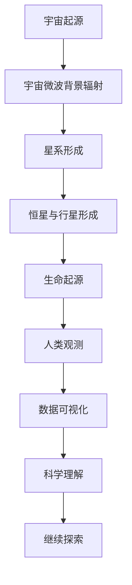

                 

### 第一部分：宇宙演化历史概述

#### 第1章：宇宙演化的基本概念

##### 1.1 宇宙的起源与演化

宇宙的起源与演化是现代物理学和天文学中最为重要和引人入胜的研究领域之一。根据目前主流的宇宙学理论，宇宙起源于大约138亿年前的一个极小、极高密度和极高温度的状态，这一时刻被称为“大爆炸”。从那时起，宇宙经历了一个不断膨胀和冷却的过程，逐渐形成了我们现在所看到的宇宙结构。

大爆炸理论认为，宇宙在极短的时间内从极小空间迅速膨胀到目前庞大的规模。在这个过程中，物质和能量以极高的速度分散开来，形成了宇宙中的各种基本粒子和物质。随着时间的推移，这些物质通过引力作用逐渐聚集，形成了恒星、星系和其他宇宙结构。

宇宙演化可以大致分为以下几个阶段：

1. **大爆炸**：宇宙从一个极小、极高密度和极高温度的状态迅速膨胀。
2. **宇宙微波背景辐射**：大约在大爆炸后38万年后，宇宙开始冷却，电子和质子结合形成了中性的氢原子，宇宙开始透明化。此时，宇宙中的温度和密度均匀，并且存在一个几乎均匀的微波辐射背景。
3. **物质聚集**：在大爆炸后的数百万年间，宇宙中的物质通过引力作用开始聚集，形成了小规模的结构，如星系、星团和超星系团。
4. **恒星形成**：大约在宇宙诞生后的数亿年后，大量的氢气和氦气在引力作用下聚集形成了恒星。恒星在其生命周期中，通过核聚变产生能量，释放出光和热，同时形成行星和其他天体。
5. **行星和生命形成**：在恒星周围，尘埃和气体聚集形成了行星。在地球这样的行星上，生命可能在大约46亿年前形成。

##### 1.2 星系的形成与演化

星系是宇宙中的基本结构，由数亿甚至数千亿颗恒星、气体、尘埃和暗物质组成。星系的形成和演化与宇宙的演化密切相关。

星系的形成过程大致如下：

1. **气体云的聚集**：在宇宙早期，物质主要存在于气体云中。这些气体云受到引力作用，逐渐聚集形成更大的结构。
2. **引力不稳定性**：当气体云的质量足够大时，内部的不稳定性会导致气体云开始坍缩，形成星系。
3. **恒星的形成**：在气体云坍缩过程中，温度和密度逐渐增加，最终达到能够引发核聚变的条件，形成恒星。
4. **星系结构的形成**：恒星形成后，它们之间的引力相互作用会导致星系结构的发展。星系可以具有不同的形状，如椭圆星系、螺旋星系和不规则星系。

星系的演化包括以下几个过程：

1. **恒星演化**：恒星在其生命周期中会经历多个阶段，最终可能演化为白矮星、中子星或黑洞。
2. **星系碰撞与合并**：星系之间可以通过引力相互作用发生碰撞和合并，形成更大的星系结构。
3. **星系中心超大质量黑洞的形成**：许多星系中心存在超大质量黑洞，这些黑洞通过吞噬周围物质和恒星，对星系的结构和演化产生重要影响。

##### 1.3 恒星与行星的生命周期

恒星的生命周期可以分为以下几个阶段：

1. **主序星阶段**：恒星在其生命周期的大部分时间都在主序星阶段，通过核聚变将氢转换为氦，产生能量和光。
2. **红巨星阶段**：当恒星耗尽核心中的氢时，它会膨胀成为红巨星，外壳膨胀并冷却，而核心收缩。
3. **行星状星云阶段**：在红巨星阶段之后，恒星会抛出自己的外层物质，形成行星状星云。
4. **白矮星阶段**：恒星在行星状星云阶段结束后，会冷却成为白矮星，这是恒星生命周期的最终阶段。

行星的生命周期则相对较短，主要包括以下阶段：

1. **形成阶段**：行星在恒星周围形成的气体和尘埃盘上形成。
2. **成长阶段**：行星在成长阶段中，通过引力聚集更多的物质。
3. **稳定阶段**：在稳定阶段，行星具有相对稳定的轨道和结构。
4. **最终命运**：行星可能会被恒星吞噬、撞入恒星或其他天体，或成为行星状星云的一部分。

通过宇宙演化历史的基本概述，我们可以更好地理解宇宙的结构和演化过程，同时为后续章节中探讨数据可视化在宇宙研究中的作用打下基础。

## 《数据可视化在呈现宇宙演化历史中的作用》目录大纲

### 第一部分：宇宙演化历史概述

#### 第1章：宇宙演化的基本概念

##### 1.1 宇宙的起源与演化  
##### 1.2 星系的形成与演化  
##### 1.3 恒星与行星的生命周期

#### 第2章：宇宙的观测工具与技术

##### 2.1 望远镜与观测技术  
##### 2.2 波段选择与数据处理  
##### 2.3 天文数据可视化技术

### 第二部分：数据可视化方法在宇宙演化中的应用

#### 第3章：数据可视化在宇宙研究中的核心概念

##### 3.1 数据可视化原理与分类  
##### 3.2 可视化算法与技巧  
##### 3.3 数据可视化中的视觉认知原理

#### 第4章：数据可视化在恒星和行星研究中的应用

##### 4.1 恒星光谱分析的可视化方法  
##### 4.2 行星大气层现象的可视化展示  
##### 4.3 行星表面特征的可视化分析

#### 第5章：数据可视化在星系与宇宙大尺度结构研究中的应用

##### 5.1 星系团与超星系团的可视化  
##### 5.2 宇宙大尺度结构演化过程的可视化  
##### 5.3 宇宙背景微波辐射图的可视化展示

### 第三部分：宇宙演化历史的数据可视化实践

#### 第6章：宇宙演化历史的数据可视化项目实例

##### 6.1 项目一：太阳系行星演化历程的可视化  
##### 6.2 项目二：银河系中心黑洞的可视化探索  
##### 6.3 项目三：宇宙膨胀历程的可视化展示

#### 第7章：宇宙演化历史数据可视化的挑战与未来趋势

##### 7.1 数据可视化的挑战与局限  
##### 7.2 宇宙演化历史数据可视化的未来发展趋势  
##### 7.3 开放性问题与研究方向

### 附录：宇宙演化历史数据可视化工具与资源

##### A.1 常用数据可视化工具介绍  
##### A.2 宇宙演化历史数据可视化案例集  
##### A.3 宇宙演化历史数据可视化相关的开源项目与资源列表

### 第一部分：宇宙演化历史概述

#### 第1章：宇宙演化的基本概念

##### 1.1 宇宙的起源与演化

宇宙的起源与演化是现代物理学和天文学中最为重要和引人入胜的研究领域之一。根据目前主流的宇宙学理论，宇宙起源于大约138亿年前的一个极小、极高密度和极高温度的状态，这一时刻被称为“大爆炸”。从那时起，宇宙经历了一个不断膨胀和冷却的过程，逐渐形成了我们现在所看到的宇宙结构。

大爆炸理论认为，宇宙在极短的时间内从极小空间迅速膨胀到目前庞大的规模。在这个过程中，物质和能量以极高的速度分散开来，形成了宇宙中的各种基本粒子和物质。随着时间的推移，这些物质通过引力作用逐渐聚集，形成了恒星、星系和其他宇宙结构。

宇宙演化可以大致分为以下几个阶段：

1. **大爆炸**：宇宙从一个极小、极高密度和极高温度的状态迅速膨胀。
2. **宇宙微波背景辐射**：大约在大爆炸后38万年后，宇宙开始冷却，电子和质子结合形成了中性的氢原子，宇宙开始透明化。此时，宇宙中的温度和密度均匀，并且存在一个几乎均匀的微波辐射背景。
3. **物质聚集**：在大爆炸后的数百万年间，宇宙中的物质通过引力作用开始聚集，形成了小规模的结构，如星系、星团和超星系团。
4. **恒星形成**：大约在宇宙诞生后的数亿年后，大量的氢气和氦气在引力作用下聚集形成了恒星。恒星在其生命周期中，通过核聚变产生能量，释放出光和热，同时形成行星和其他天体。
5. **行星和生命形成**：在恒星周围，尘埃和气体聚集形成了行星。在地球这样的行星上，生命可能在大约46亿年前形成。

##### 1.2 星系的形成与演化

星系是宇宙中的基本结构，由数亿甚至数千亿颗恒星、气体、尘埃和暗物质组成。星系的形成和演化与宇宙的演化密切相关。

星系的形成过程大致如下：

1. **气体云的聚集**：在宇宙早期，物质主要存在于气体云中。这些气体云受到引力作用，逐渐聚集形成更大的结构。
2. **引力不稳定性**：当气体云的质量足够大时，内部的不稳定性会导致气体云开始坍缩，形成星系。
3. **恒星的形成**：在气体云坍缩过程中，温度和密度逐渐增加，最终达到能够引发核聚变的条件，形成恒星。
4. **星系结构的形成**：恒星形成后，它们之间的引力相互作用会导致星系结构的发展。星系可以具有不同的形状，如椭圆星系、螺旋星系和不规则星系。

星系的演化包括以下几个过程：

1. **恒星演化**：恒星在其生命周期中会经历多个阶段，最终可能演化为白矮星、中子星或黑洞。
2. **星系碰撞与合并**：星系之间可以通过引力相互作用发生碰撞和合并，形成更大的星系结构。
3. **星系中心超大质量黑洞的形成**：许多星系中心存在超大质量黑洞，这些黑洞通过吞噬周围物质和恒星，对星系的结构和演化产生重要影响。

##### 1.3 恒星与行星的生命周期

恒星的生命周期可以分为以下几个阶段：

1. **主序星阶段**：恒星在其生命周期的大部分时间都在主序星阶段，通过核聚变将氢转换为氦，产生能量和光。
2. **红巨星阶段**：当恒星耗尽核心中的氢时，它会膨胀成为红巨星，外壳膨胀并冷却，而核心收缩。
3. **行星状星云阶段**：在红巨星阶段之后，恒星会抛出自己的外层物质，形成行星状星云。
4. **白矮星阶段**：恒星在行星状星云阶段结束后，会冷却成为白矮星，这是恒星生命周期的最终阶段。

行星的生命周期则相对较短，主要包括以下阶段：

1. **形成阶段**：行星在恒星周围形成的气体和尘埃盘上形成。
2. **成长阶段**：行星在成长阶段中，通过引力聚集更多的物质。
3. **稳定阶段**：在稳定阶段，行星具有相对稳定的轨道和结构。
4. **最终命运**：行星可能会被恒星吞噬、撞入恒星或其他天体，或成为行星状星云的一部分。

通过宇宙演化历史的基本概述，我们可以更好地理解宇宙的结构和演化过程，同时为后续章节中探讨数据可视化在宇宙研究中的作用打下基础。

## 宇宙演化历史概述

宇宙演化是一个漫长而复杂的过程，涉及多个不同的阶段和现象。为了更好地理解这一过程，我们首先需要了解宇宙的起源和基本结构，然后探讨星系的形成与演化，最后介绍恒星与行星的生命周期。

### 宇宙的起源与演化

现代宇宙学认为，宇宙起源于大约138亿年前的一个极小、极高密度和极高温度的状态，这一时刻被称为“大爆炸”。在大爆炸后，宇宙迅速膨胀，温度和密度逐渐降低。以下是宇宙演化的一些关键阶段：

1. **大爆炸**：宇宙从一个极小、极高密度和极高温度的状态迅速膨胀。
2. **宇宙微波背景辐射**：大约在大爆炸后38万年后，宇宙开始冷却，电子和质子结合形成了中性的氢原子，宇宙开始透明化。此时，宇宙中的温度和密度均匀，并且存在一个几乎均匀的微波辐射背景。
3. **物质聚集**：在大爆炸后的数百万年间，宇宙中的物质通过引力作用开始聚集，形成了小规模的结构，如星系、星团和超星系团。
4. **恒星形成**：大约在宇宙诞生后的数亿年后，大量的氢气和氦气在引力作用下聚集形成了恒星。恒星在其生命周期中，通过核聚变产生能量，释放出光和热，同时形成行星和其他天体。
5. **行星和生命形成**：在恒星周围，尘埃和气体聚集形成了行星。在地球这样的行星上，生命可能在大约46亿年前形成。

### 星系的形成与演化

星系是宇宙中的基本结构，由数亿甚至数千亿颗恒星、气体、尘埃和暗物质组成。星系的形成和演化与宇宙的演化密切相关。

1. **气体云的聚集**：在宇宙早期，物质主要存在于气体云中。这些气体云受到引力作用，逐渐聚集形成更大的结构。
2. **引力不稳定性**：当气体云的质量足够大时，内部的不稳定性会导致气体云开始坍缩，形成星系。
3. **恒星的形成**：在气体云坍缩过程中，温度和密度逐渐增加，最终达到能够引发核聚变的条件，形成恒星。
4. **星系结构的形成**：恒星形成后，它们之间的引力相互作用会导致星系结构的发展。星系可以具有不同的形状，如椭圆星系、螺旋星系和不规则星系。

星系的演化包括以下几个过程：

1. **恒星演化**：恒星在其生命周期中会经历多个阶段，最终可能演化为白矮星、中子星或黑洞。
2. **星系碰撞与合并**：星系之间可以通过引力相互作用发生碰撞和合并，形成更大的星系结构。
3. **星系中心超大质量黑洞的形成**：许多星系中心存在超大质量黑洞，这些黑洞通过吞噬周围物质和恒星，对星系的结构和演化产生重要影响。

### 恒星与行星的生命周期

恒星的生命周期可以分为以下几个阶段：

1. **主序星阶段**：恒星在其生命周期的大部分时间都在主序星阶段，通过核聚变将氢转换为氦，产生能量和光。
2. **红巨星阶段**：当恒星耗尽核心中的氢时，它会膨胀成为红巨星，外壳膨胀并冷却，而核心收缩。
3. **行星状星云阶段**：在红巨星阶段之后，恒星会抛出自己的外层物质，形成行星状星云。
4. **白矮星阶段**：恒星在行星状星云阶段结束后，会冷却成为白矮星，这是恒星生命周期的最终阶段。

行星的生命周期则相对较短，主要包括以下阶段：

1. **形成阶段**：行星在恒星周围形成的气体和尘埃盘上形成。
2. **成长阶段**：行星在成长阶段中，通过引力聚集更多的物质。
3. **稳定阶段**：在稳定阶段，行星具有相对稳定的轨道和结构。
4. **最终命运**：行星可能会被恒星吞噬、撞入恒星或其他天体，或成为行星状星云的一部分。

通过了解宇宙演化的基本概念、星系的形成与演化，以及恒星与行星的生命周期，我们可以更好地理解宇宙的结构和演化过程。这些知识为后续章节中探讨数据可视化在宇宙研究中的作用奠定了基础。

### 第二部分：宇宙的观测工具与技术

#### 第2章：宇宙的观测工具与技术

##### 2.1 望远镜与观测技术

宇宙的观测离不开望远镜。望远镜是一种利用光学或电磁学原理，将远处物体放大以便于观测的设备。望远镜的发展极大地推动了天文学研究的进步。

1. **光学望远镜**：光学望远镜主要利用透镜或反射镜将光线聚焦，使远处的星体能够被观察。根据设计原理，光学望远镜可以分为折射望远镜和反射望远镜。

   - **折射望远镜**：通过透镜将光线聚焦，适用于观测亮度较高、距离较近的星体。
   - **反射望远镜**：通过反射镜将光线聚焦，适用于观测暗弱、距离较远的星体。

2. **射电望远镜**：射电望远镜主要用于观测宇宙中的无线电波。通过接收这些无线电波，可以研究星体的物理性质和演化过程。

3. **空间望远镜**：空间望远镜在太空中进行观测，不受地球大气层的干扰。著名的空间望远镜包括哈勃空间望远镜和詹姆斯·韦伯空间望远镜。

##### 2.2 波段选择与数据处理

宇宙中的天体辐射覆盖了电磁波谱的各个波段。不同波段的观测可以提供关于天体的不同信息。以下是常用的几个波段：

1. **可见光波段**：可见光波段是人眼能感知的电磁波范围，用于观测星体的亮度和颜色。
2. **红外波段**：红外波段可以穿透尘埃云，观测到被遮挡的星体和星系。
3. **紫外波段**：紫外波段可以揭示星体的年轻和活跃状态，以及宇宙早期的高温高密度过程。
4. **射电波段**：射电波段可以探测星体的核反应和星系合并等过程。

在数据处理方面，天文观测数据通常包含大量的噪声和干扰。为了提取有用信息，需要进行以下步骤：

1. **数据预处理**：包括滤除噪声、去除系统误差和矫正图像。
2. **数据融合**：将不同望远镜或不同波段的数据进行融合，以获得更全面的观测结果。
3. **数据分析**：通过统计方法和物理模型，对观测数据进行解释和分析。

##### 2.3 天文数据可视化技术

数据可视化是将复杂的数据信息以图形或图像形式展示出来的技术。在天文学研究中，数据可视化具有重要作用：

1. **数据可视化方法**：
   - **散点图**：用于展示天体分布和相互作用。
   - **等高线图**：用于展示星系的密度分布和形态。
   - **热图**：用于展示天体的亮度分布和温度变化。

2. **数据可视化工具**：
   - **matplotlib**：Python中的数据可视化库，可以生成各种类型的图表。
   - **GnuPlot**：功能强大的数据可视化工具，支持多种数据格式和图形输出。
   - **PyVista**：Python中的三维数据可视化库，特别适用于科学计算和工程领域。

3. **数据可视化应用**：
   - **恒星光谱分析**：通过可视化恒星光谱，可以研究恒星的化学成分和温度。
   - **行星大气层现象**：通过可视化行星大气层的温度和密度分布，可以揭示行星的气候变化。
   - **星系大尺度结构**：通过可视化星系的分布和形态，可以研究宇宙的大尺度结构。

通过望远镜和观测技术、波段选择与数据处理，以及天文数据可视化技术，天文学家可以深入了解宇宙的奥秘，揭示宇宙演化的奥秘。这些工具和技术为宇宙学研究提供了强大的支持。

### 望远镜与观测技术

宇宙的浩瀚和遥远使得我们对宇宙的认知充满了挑战。为了克服这些挑战，科学家们设计和开发了各种观测工具，其中最著名的就是望远镜。望远镜的工作原理是通过放大和聚焦光线，使远处的天体能够被肉眼或传感器观测到。以下是几种主要类型的望远镜和它们的工作原理：

#### 光学望远镜

光学望远镜是最常用的望远镜类型，主要分为折射望远镜和反射望远镜。

1. **折射望远镜**：折射望远镜使用透镜来聚焦光线。透镜将光线折射并聚焦到一个点上，形成一个清晰的图像。这种望远镜适用于观测亮度较高、距离较近的星体。折射望远镜的优点是图像清晰，但成本较高，且由于透镜的边缘会产生色差，需要复杂的透镜设计来校正。

2. **反射望远镜**：反射望远镜使用镜子来聚焦光线。主镜将光线反射到一个焦点，次镜或副镜用于校正图像。反射望远镜的优点是镜面可以做得更大，从而能够收集更多的光，观测到更暗的星体。然而，反射望远镜的图像质量可能不如折射望远镜，因为反射镜的表面难以达到与透镜同样的精度。

#### 射电望远镜

射电望远镜专门用于观测无线电波，这些无线电波是由宇宙中的天体发射的。射电望远镜通常由一组天线和接收器组成，这些天线可以一起工作，形成一个巨大的天线阵列。天线阵列通过测量无线电波的到达时间差和强度变化，可以重构出天体的形状和位置。

射电望远镜的工作原理是将无线电波信号聚焦到接收器，然后通过电子设备放大和转换信号，以便进一步分析。射电望远镜的优点是能够探测到非常暗弱的星体，但由于无线电波的波长较长，分辨率较低。

#### 空间望远镜

空间望远镜位于地球大气层之外，因此不受大气湍流和大气光的干扰，能够获得更清晰、更详细的观测结果。著名的空间望远镜包括哈勃空间望远镜和詹姆斯·韦伯空间望远镜。

1. **哈勃空间望远镜**：哈勃空间望远镜自1990年发射以来，提供了许多令人惊叹的宇宙图像，揭示了宇宙的奥秘。哈勃望远镜主要使用光学和红外波段进行观测，其高分辨率图像帮助科学家们发现了许多新的天体和现象。

2. **詹姆斯·韦伯空间望远镜**：詹姆斯·韦伯空间望远镜是哈勃望远镜的继任者，预计于2021年发射。韦伯望远镜将使用更先进的红外技术，探索宇宙的早期阶段，观测那些用哈勃望远镜无法探测到的星体和现象。

#### 观测技术的演进

随着科技的进步，望远镜的设计和性能也在不断改进。现代望远镜采用了多种新技术，如自适应光学、快速光学系统和高分辨率成像技术，以提高观测精度和图像质量。自适应光学技术通过实时校正大气湍流引起的图像扭曲，使地面望远镜的观测效果接近空间望远镜的水平。

总之，望远镜和观测技术为天文学家提供了强大的工具，使他们能够探索宇宙的深处，揭示宇宙的奥秘。通过不断改进望远镜的设计和性能，我们能够更深入地理解宇宙的演化和结构。

#### 波段选择与数据处理

在宇宙观测中，波段选择和数据处理的准确性至关重要，因为不同波段的观测可以揭示天体的不同物理特性。以下是一些关键概念和步骤：

##### 波段选择

1. **可见光波段**：可见光波段是人眼能感知的光谱范围，从约380到780纳米。这种波段适用于观测星体的亮度和颜色，通过分析可见光波段的数据，天文学家可以了解星体的温度、化学成分和运动状态。

2. **红外波段**：红外波段覆盖从780纳米到1毫米的波长范围。红外光能够穿透尘埃云，观测到被遮挡的星体和星系。红外波段特别适用于研究行星大气层和年轻恒星。

3. **紫外波段**：紫外波段从10到380纳米，覆盖了紫外线范围。紫外线能够揭示星体的年轻和活跃状态，以及宇宙早期的高温高密度过程。

4. **射电波段**：射电波段覆盖从1毫米到1米以上的波长范围。射电波段适用于探测星体的核反应和星系合并等过程，由于无线电波的波长较长，分辨率较低，但能够探测到非常暗弱的星体。

##### 数据处理

1. **数据预处理**：观测数据在接收后需要经过预处理，包括滤除噪声、去除系统误差和校正图像。预处理步骤包括背景校正、光子噪声去除、图像去模糊等。

2. **数据融合**：不同望远镜或不同波段的数据可以融合，以获得更全面的观测结果。数据融合可以通过方法如频率融合、空间融合和时间融合实现。

3. **数据分析**：通过统计方法和物理模型，对观测数据进行解释和分析。数据分析步骤包括特征提取、分类、聚类和回归分析等。

##### 数据可视化

数据可视化是将复杂的数据信息以图形或图像形式展示出来的技术。在天文学研究中，数据可视化有助于科学家更好地理解天体的结构和演化过程。以下是一些常用的数据可视化方法：

1. **散点图**：散点图用于展示天体的分布和相互作用。例如，可以通过散点图展示星系的分布，分析星系的密度和形态。

2. **等高线图**：等高线图用于展示星系的密度分布和形态。例如，可以使用等高线图展示星系的旋臂结构。

3. **热图**：热图用于展示天体的亮度分布和温度变化。例如，可以使用热图展示恒星的光谱分布，分析恒星的温度和化学成分。

##### 数据可视化工具

1. **matplotlib**：Python中的数据可视化库，可以生成各种类型的图表，如线图、柱状图、散点图和等高线图。

2. **GnuPlot**：功能强大的数据可视化工具，支持多种数据格式和图形输出。

3. **PyVista**：Python中的三维数据可视化库，特别适用于科学计算和工程领域。

通过波段选择、数据处理和数据可视化，天文学家可以深入了解宇宙的奥秘，揭示宇宙演化的奥秘。这些技术不仅提高了观测数据的准确性，还帮助我们更好地理解宇宙的结构和演化过程。

### 数据可视化在宇宙研究中的核心概念

数据可视化在宇宙研究中扮演着至关重要的角色，它不仅帮助科学家们理解和传达复杂的数据，还使得宇宙中的各种现象和过程变得直观和易于理解。以下是数据可视化在宇宙研究中的核心概念：

#### 数据可视化原理与分类

1. **数据可视化原理**：
   - **信息可视化**：将数据以图形或图像的形式呈现，以便观察和分析数据之间的关系和模式。
   - **交互式可视化**：通过用户的交互操作，动态地改变数据的展示方式，以便深入分析数据。
   - **抽象表示**：通过符号和图形来表示数据，降低数据的复杂度，使数据更容易理解。

2. **数据可视化分类**：
   - **静态可视化**：生成的图像或图表是静态的，不随时间变化。
   - **动态可视化**：生成的图像或图表随时间变化，展示数据的变化过程。
   - **交互式可视化**：用户可以通过点击、拖动等方式与数据交互，以获取更多信息。

#### 可视化算法与技巧

1. **颜色映射**：通过颜色映射来表示数据的数值大小，不同颜色代表不同的数值范围。
2. **形状和符号**：使用不同的形状和符号来表示不同类型的数据或数据点。
3. **标签和注释**：在图表上添加标签和注释，以便用户更好地理解数据。
4. **对比和分组**：通过对比和分组来突出显示数据中的重要信息。

#### 数据可视化中的视觉认知原理

1. **视觉感知**：人类视觉系统如何处理和解读图形信息。
2. **视觉通道**：不同颜色、形状和纹理对人类视觉的感知影响。
3. **视觉注意力**：如何设计图表以引导用户的注意力到关键数据点。

#### 数据可视化在宇宙研究中的应用

1. **恒星光谱分析**：通过可视化恒星的光谱，科学家可以分析恒星的温度、化学成分和运动状态。
2. **行星大气层现象**：通过可视化行星大气层的温度和密度分布，科学家可以研究行星的气候变化。
3. **星系大尺度结构**：通过可视化星系的分布和形态，科学家可以研究宇宙的大尺度结构。

数据可视化在宇宙研究中不仅仅是展示数据，更是帮助科学家理解和揭示宇宙奥秘的重要工具。通过应用不同的可视化原理、算法和技巧，科学家可以更好地探索宇宙的奥秘，推动天文学的发展。

### 数据可视化原理与分类

在宇宙研究中，数据可视化是一个关键的步骤，它使得科学家能够直观地理解和分析复杂的数据。数据可视化不仅可以帮助我们发现数据中的模式和关系，还可以将抽象的数据转化为易于理解的信息。以下是数据可视化的一些核心原理和分类方法：

#### 数据可视化原理

1. **信息可视化**：信息可视化是指将数据转化为图形或图像，以便更好地理解数据。信息可视化通常涉及以下步骤：
   - **数据抽象**：将实际数据抽象成更简单的形式，例如使用点、线、面或颜色来表示数据。
   - **映射**：将数据映射到视觉元素上，例如使用不同的颜色表示不同的数值范围，使用不同的形状表示不同的数据点。
   - **交互**：允许用户通过交互操作（如放大、缩小、拖动等）与数据可视化进行互动，从而深入了解数据的细节。

2. **交互式可视化**：交互式可视化是数据可视化的一种高级形式，它允许用户动态地修改和探索数据。交互式可视化通常包括以下功能：
   - **过滤**：用户可以过滤数据，只显示感兴趣的部分。
   - **排序**：用户可以按照不同的标准对数据进行排序。
   - **链接视图**：在不同的图表之间建立链接，以便用户可以同时观察多个数据维度。

3. **抽象表示**：在数据可视化中，抽象表示是一种简化数据的方式，它通过减少数据的细节来提高可读性。例如，使用符号或颜色来代表大量的数据点，或者使用大字体显示关键数据点。

#### 数据可视化分类

1. **静态可视化**：静态可视化是指生成的图表或图像在显示时不会发生变化。静态可视化适用于展示时间序列数据或者是在线发布的数据分析报告。常见的静态可视化类型包括：
   - **条形图**：用于比较不同类别的数据。
   - **折线图**：用于展示数据随时间的变化趋势。
   - **散点图**：用于显示两个或多个变量之间的关系。

2. **动态可视化**：动态可视化是通过动画或视频来展示数据的变化过程。动态可视化适用于展示连续变化的数据或者复杂的演化过程。常见的动态可视化类型包括：
   - **动画图表**：通过动画展示数据的变化。
   - **时间轴**：通过时间轴展示数据的演变。
   - **热图**：通过颜色变化展示数据的热点区域。

3. **交互式可视化**：交互式可视化允许用户通过点击、拖动、缩放等方式与数据可视化进行互动。交互式可视化适用于复杂的数据分析和探索性数据分析。常见的交互式可视化工具包括：
   - **地图**：交互式地图允许用户选择和过滤不同区域的数据。
   - **图表库**：如D3.js、Plotly等，提供丰富的交互式图表和可视化组件。

通过这些不同的可视化原理和分类方法，科学家和研究人员能够将复杂的天文数据转化为易于理解的信息，从而更好地理解宇宙的奥秘和揭示宇宙演化的过程。

#### 可视化算法与技巧

在宇宙数据可视化中，选择合适的算法和技巧对于有效地传达复杂的信息至关重要。以下是一些关键的算法和技巧，以及它们在宇宙研究中的应用：

##### 1. 颜色映射

颜色映射是一种常用的数据可视化方法，通过不同的颜色来表示数据的数值大小或类别。在宇宙研究中，颜色映射可以用于：

- **星系光谱分析**：使用不同的颜色来表示星系的温度或化学成分。
- **行星大气层分析**：使用颜色映射来展示行星表面不同区域的温度或大气成分。

##### 2. 形状和符号

使用不同的形状和符号可以增强数据可视化的效果，使其更具表现力和易于理解。在宇宙研究中，形状和符号可以用于：

- **星系分布图**：使用不同的形状来表示不同类型的星系，如椭圆星系、螺旋星系或不规则星系。
- **行星特征展示**：使用符号来表示行星上的特征，如山脉、海洋或极光。

##### 3. 标签和注释

在数据可视化中，标签和注释用于提供额外的上下文信息，帮助用户更好地理解数据。在宇宙研究中，标签和注释可以用于：

- **恒星光谱图**：在光谱图上添加标签，显示恒星的关键特征，如温度和化学组成。
- **行星地图**：在行星表面的地图上添加注释，显示特定地形或特征的位置。

##### 4. 对比和分组

对比和分组是一种有效的数据可视化方法，通过将数据分成不同的组或对比不同的数据点，可以突出显示关键信息。在宇宙研究中，对比和分组可以用于：

- **恒星比较**：对比不同恒星的属性，如光度、质量和年龄。
- **星系分类**：将星系按照不同的属性分组，如星系大小、形状和颜色。

##### 5. 热图

热图是一种通过颜色深浅来表示数据分布的热度或密度的可视化方法。在宇宙研究中，热图可以用于：

- **宇宙大尺度结构**：展示宇宙大尺度结构的热图，如星系团和超星系团的分布。
- **行星气候模式**：展示行星大气层的温度分布和气候模式。

##### 6. 动态可视化

动态可视化通过动画或视频来展示数据的变化过程，这对于理解宇宙的演化非常有用。在宇宙研究中，动态可视化可以用于：

- **宇宙膨胀过程**：通过动画展示宇宙从大爆炸到现在的膨胀过程。
- **恒星生命周期**：通过动画展示恒星从形成到演化的各个阶段。

通过应用这些可视化算法和技巧，科学家和研究人员可以更有效地传达宇宙数据中的关键信息和模式，从而促进对宇宙演化的理解。

#### 数据可视化中的视觉认知原理

在数据可视化中，视觉认知原理起着至关重要的作用，它们决定了人类如何理解和解释视觉信息。以下是几个关键的视觉认知原理：

1. **颜色感知**：颜色在数据可视化中非常关键，因为不同的颜色可以代表不同的数值或类别。人类对颜色的感知是高度敏感的，因此，通过合理地使用颜色映射，可以有效地传达数据信息。例如，在展示温度分布时，蓝色可以表示低温，红色可以表示高温。

2. **形状和大小**：形状和大小也是数据可视化中的重要元素。不同的形状可以用来表示不同类型的数据，而大小可以用来表示数据的数值大小。例如，在散点图中，数据点的直径可以表示数据的数值大小。

3. **视觉对比**：视觉对比是通过对比不同数据点或数据组的视觉特征（如颜色、形状、大小）来突出显示关键信息。高对比度的视觉元素更容易被注意到，从而帮助用户更快地理解和分析数据。

4. **视觉注意力**：人类的视觉注意力是有限的，因此设计数据可视化时需要考虑如何引导用户的注意力到关键信息上。这可以通过使用高对比度的颜色、突出显示的数据点或交互式元素来实现。

5. **层次结构**：层次结构帮助用户理解复杂数据的不同层次。例如，在树状图中，分支的深度可以表示数据的层次，从而帮助用户从整体上理解数据结构。

6. **空间布局**：空间布局可以影响数据的理解。合理的空间布局可以使数据之间的关系更加直观。例如，在地图上，地理位置的接近性可以表示数据之间的相关性。

7. **动画和交互**：动画和交互可以增强数据的动态性和互动性，从而帮助用户更好地理解数据的变化和模式。例如，通过动画可以展示数据随时间的变化趋势，通过交互可以深入探索数据的细节。

通过理解这些视觉认知原理，数据可视化设计师可以创造出更加直观、易理解和有效的可视化图表，从而更好地支持科学研究和数据分析。

### 数据可视化在恒星和行星研究中的应用

数据可视化在恒星和行星研究中发挥着重要作用，它使得科学家能够以直观的方式展示和解析复杂的天文数据，从而深入理解恒星和行星的物理特性、演化过程以及它们之间的相互作用。以下是一些具体的应用领域和可视化方法：

##### 4.1 恒星光谱分析的可视化方法

恒星光谱分析是研究恒星物理特性的重要手段。通过分析恒星光谱中的吸收线、发射线和线强度，科学家可以了解恒星的温度、化学成分、密度和运动状态。以下是一些常用的数据可视化方法：

1. **光谱图**：光谱图将恒星光谱中的不同波长与强度相对应，通过展示光谱线可以直观地了解恒星的温度和化学成分。光谱图中，吸收线的位置和强度可以揭示恒星的元素含量，而发射线的形状和强度可以提供有关恒星温度的信息。

2. **色-星图**：色-星图是一种常用的恒星分类工具，它将恒星的颜色（通常用B-V或V-R颜色指数表示）与光度（通常用恒星绝对星等表示）相对应。通过分析色-星图上的恒星分布，科学家可以研究恒星的不同类型和演化阶段。

3. **光谱分类图**：光谱分类图使用颜色和强度来表示恒星的光谱类型，可以帮助科学家快速分类恒星。例如，O型恒星具有蓝色光谱，而M型恒星具有红色光谱。

##### 4.2 行星大气层现象的可视化展示

行星大气层现象的研究对于理解行星的气候和演化过程至关重要。数据可视化可以帮助科学家展示和解释行星大气层的复杂现象，如飓风、极光和大气环流。以下是一些常用的可视化方法：

1. **温度和密度分布图**：通过温度和密度分布图，科学家可以直观地了解行星大气层的垂直结构和动态变化。热图或等温线图可以用来展示不同高度的气温分布，而密度图可以显示大气成分的分布。

2. **大气环流模式图**：大气环流模式图通过颜色或向量图来表示行星大气层的风场和环流模式。这种可视化方法可以帮助科学家研究行星的气候系统，如地球上的季风和赤道环流。

3. **极光展示**：极光是行星大气层中带电粒子与大气分子相互作用产生的现象。通过可视化极光的形状、颜色和分布，科学家可以了解行星磁层和大气层的相互作用。

##### 4.3 行星表面特征的可视化分析

行星表面特征的研究对于了解行星的地质历史和演化过程具有重要意义。数据可视化可以展示行星表面的地形、地貌和地质活动。以下是一些常用的可视化方法：

1. **高程图**：高程图通过颜色或高度条形图来表示行星表面的地形高度。这种可视化方法可以帮助科学家研究行星的山脉、平原和盆地等地形特征。

2. **地形剖面图**：地形剖面图通过垂直剖面展示行星表面不同位置的地形变化，有助于了解地形构造和地质过程。

3. **地质纹理图**：地质纹理图通过纹理和颜色来表示行星表面的地质特征，如陨石坑、火山活动和岩层结构。这种可视化方法可以帮助科学家分析行星表面的地质历史。

通过这些数据可视化方法，科学家可以更深入地研究恒星和行星的物理特性和演化过程，从而推动我们对宇宙的理解。这些可视化工具不仅提高了数据分析的效率，还使得科学研究成果更加直观和易于传播。

### 数据可视化在恒星和行星研究中的应用

在恒星和行星研究中，数据可视化技术不仅用于展示观测结果，还发挥着揭示物理现象、探索新发现和推动科学理解的关键作用。以下将详细讨论数据可视化在恒星光谱分析、行星大气层现象和行星表面特征分析中的具体应用。

#### 4.1 恒星光谱分析的可视化方法

恒星光谱分析是研究恒星物理性质的重要手段。光谱图可以揭示恒星的温度、化学成分、密度和运动状态。以下是几种常见的数据可视化方法：

1. **光谱图**：
   - **原理**：光谱图通过将恒星光谱中不同波长与强度相对应，展示吸收线和发射线的位置和强度。
   - **应用**：光谱图可以帮助科学家识别恒星中的元素，确定其温度和化学成分。例如，吸收线可以指示特定的元素，而发射线的形状和强度可以提供有关恒星温度的信息。
   - **示例**：一个典型的光谱图可能包括多个吸收线，其中一些吸收线代表氢、氦和其他常见的元素。

2. **色-星图**：
   - **原理**：色-星图（如赫罗图）通过将恒星的亮度（或光度）与颜色（或颜色指数）相对应，展示恒星的演化路径。
   - **应用**：色-星图可以帮助科学家分类恒星，了解其生命周期和演化阶段。例如，主序星、红巨星和超巨星在色-星图上的位置和分布可以揭示其物理性质和演化历史。
   - **示例**：一个典型的色-星图可能显示主序星集中在图的一个区域，而红巨星和超巨星则分布在图的另一侧。

3. **光谱分类图**：
   - **原理**：光谱分类图使用光谱类型（如O型、B型、A型等）来表示恒星的光谱特征。
   - **应用**：光谱分类图可以帮助科学家快速分类恒星，了解其光谱类型和物理性质。
   - **示例**：一个典型的光谱分类图可能包括多个区域，每个区域代表不同的光谱类型，如O型、B型等。

#### 4.2 行星大气层现象的可视化展示

行星大气层现象的研究对于理解行星的气候和演化过程至关重要。数据可视化技术可以展示和解释行星大气层的复杂现象，如飓风、极光和大气环流。

1. **温度和密度分布图**：
   - **原理**：温度和密度分布图通过颜色或等温线展示行星大气层的垂直结构。
   - **应用**：温度和密度分布图可以帮助科学家分析大气层的温度梯度、密度变化和环流模式。例如，地球大气层的温度分布可以通过热图展示，揭示不同纬度和高度的温度差异。
   - **示例**：一个温度和密度分布图可能显示地球大气层从地表到高层的热量分布和密度变化。

2. **大气环流模式图**：
   - **原理**：大气环流模式图通过颜色或向量图展示行星大气层的风场和环流模式。
   - **应用**：大气环流模式图可以帮助科学家研究行星的气候系统和环流动力学。例如，地球的季风和赤道环流可以通过环流模式图展示。
   - **示例**：一个大气环流模式图可能显示地球赤道地区的强风带和极地地区的低温气流。

3. **极光展示**：
   - **原理**：极光展示通过颜色和形状展示极光的形成和分布。
   - **应用**：极光展示可以帮助科学家了解行星磁层和大气层的相互作用。例如，地球的极光可以通过彩色图像展示，揭示高能粒子和大气分子的相互作用。
   - **示例**：一个极光展示可能显示地球南北极地区的极光活动，以及高能粒子的轨迹。

#### 4.3 行星表面特征的可视化分析

行星表面特征的研究对于理解行星的地质历史和演化过程具有重要意义。数据可视化技术可以展示和解释行星表面的地形、地貌和地质活动。

1. **高程图**：
   - **原理**：高程图通过颜色或高度条形图展示行星表面的地形高度。
   - **应用**：高程图可以帮助科学家分析行星的地形特征，如山脉、平原和盆地。例如，火星的高程图可以揭示其火山活动和撞击历史。
   - **示例**：一个高程图可能显示火星表面的高山和峡谷，以及其地形特征的分布。

2. **地形剖面图**：
   - **原理**：地形剖面图通过垂直剖面展示行星表面不同位置的地形变化。
   - **应用**：地形剖面图可以帮助科学家了解地形构造和地质过程。例如，地球的地形剖面图可以揭示山脉的构造和断层活动。
   - **示例**：一个地形剖面图可能显示地球上一条山脉的纵向地形变化，包括山峰和山谷。

3. **地质纹理图**：
   - **原理**：地质纹理图通过纹理和颜色展示行星表面的地质特征。
   - **应用**：地质纹理图可以帮助科学家分析行星表面的地质历史。例如，木星的卫星欧罗巴的地质纹理图可以揭示其冰壳下的地质活动。
   - **示例**：一个地质纹理图可能显示木星卫星欧罗巴上的陨石坑、裂痕和冰层。

通过这些数据可视化方法，科学家可以更深入地研究恒星和行星的物理特性和演化过程，从而推动我们对宇宙的理解。这些可视化工具不仅提高了数据分析的效率，还使得科学研究成果更加直观和易于传播。

### 数据可视化在星系与宇宙大尺度结构研究中的应用

在宇宙大尺度结构的研究中，数据可视化技术扮演着至关重要的角色。它不仅帮助科学家们更好地理解星系的形成和演化，还揭示了宇宙中各种复杂现象的细节。以下是数据可视化在星系团与超星系团的可视化、宇宙大尺度结构演化过程的可视化和宇宙背景微波辐射图的可视化展示中的具体应用。

##### 5.1 星系团与超星系团的可视化

星系团是由数十到数千个星系组成的巨大结构，而超星系团则是由多个星系团组成的更大规模的结构。数据可视化在这些研究中起到了关键作用：

1. **星系团分布图**：
   - **原理**：星系团分布图通过二维图像展示星系团在宇宙中的分布情况，通常使用散点图或等高线图。
   - **应用**：这种可视化方法可以帮助科学家研究星系团的密度分布和相互作用。例如，哈勃空间望远镜的图像可以展示星系团中的星系分布，揭示星系间的引力相互作用。
   - **示例**：一个星系团分布图可能显示一个星系团中数千个星系的分布，展示它们在宇宙中的相对位置。

2. **星系团动态模拟**：
   - **原理**：动态模拟通过动画展示星系团在宇宙中的运动轨迹和演化过程。
   - **应用**：这种可视化方法可以帮助科学家研究星系团的形成和演化。例如，通过模拟星系团中的星系相互碰撞和合并的过程，可以揭示星系团内部的结构和演化历史。
   - **示例**：一个星系团动态模拟可能展示多个星系在宇宙中的运动轨迹，以及它们之间的相互作用和合并过程。

##### 5.2 宇宙大尺度结构演化过程的可视化

宇宙大尺度结构的演化过程是一个复杂而漫长的事件。数据可视化技术可以帮助我们更直观地理解这个过程：

1. **宇宙膨胀图**：
   - **原理**：宇宙膨胀图通过时间序列图像展示宇宙从大爆炸到现在的膨胀过程。
   - **应用**：这种可视化方法可以帮助科学家研究宇宙的膨胀历史和演化过程。例如，通过宇宙膨胀图可以展示星系从彼此远离到相互接近的变化，揭示宇宙膨胀的影响。
   - **示例**：一个宇宙膨胀图可能从大爆炸的瞬间开始，逐步展示宇宙在138亿年内的膨胀过程。

2. **星系演化轨迹图**：
   - **原理**：星系演化轨迹图通过展示星系在不同时间点的位置和形态，揭示星系的演化历史。
   - **应用**：这种可视化方法可以帮助科学家研究星系的演化路径和演化阶段。例如，通过星系演化轨迹图可以了解星系从年轻星系到成熟星系的过程。
   - **示例**：一个星系演化轨迹图可能展示一个星系从形成到演化的多个阶段，包括星系的形成、合并和演化。

##### 5.3 宇宙背景微波辐射图的可视化展示

宇宙背景微波辐射（CMB）是宇宙早期遗留下来的辐射，它为我们提供了宇宙演化的关键信息。数据可视化技术在CMB的研究中起到了关键作用：

1. **CMB全 sky 图**：
   - **原理**：CMB全 sky 图通过展示整个宇宙空间的微波辐射分布，揭示宇宙的早期结构和演化。
   - **应用**：这种可视化方法可以帮助科学家研究宇宙的密度波动和结构形成。例如，CMB全 sky 图可以揭示宇宙中的大尺度结构，如星系团和超星系团。
   - **示例**：一个CMB全 sky 图可能展示宇宙中几乎均匀分布的微波辐射，但其中包含微小的温度波动，这些波动预示着未来的星系和星系团的形成。

2. **CMB温度地图**：
   - **原理**：CMB温度地图通过颜色映射展示宇宙背景微波辐射的温度分布，揭示宇宙中的温度波动。
   - **应用**：这种可视化方法可以帮助科学家研究宇宙中的密度不均匀性和结构形成。例如，CMB温度地图可以揭示宇宙中的大尺度结构，如星系团和超星系团。
   - **示例**：一个CMB温度地图可能使用不同的颜色表示不同的温度区域，展示宇宙中的温度波动和密度不均匀性。

通过这些数据可视化方法，科学家可以更深入地研究星系和宇宙大尺度结构的形成和演化，从而推动我们对宇宙的理解。这些可视化工具不仅提高了数据分析的效率，还使得科学研究成果更加直观和易于传播。

### 星系与宇宙大尺度结构研究中的数据可视化应用

在宇宙学研究中，星系与宇宙大尺度结构的研究占据了核心地位。数据可视化技术在星系团与超星系团的可视化、宇宙大尺度结构演化过程的可视化以及宇宙背景微波辐射图的展示中发挥了至关重要的作用。以下将深入探讨这些方面的具体应用。

#### 5.1 星系团与超星系团的可视化

星系团是由数十到数千个星系组成的庞大结构，而超星系团是由多个星系团组成的更大规模的结构。通过数据可视化，科学家可以更好地理解这些结构的形成、演化及其相互作用。

1. **星系团分布图**：
   - **原理**：星系团分布图通过二维图像展示星系团在宇宙中的分布情况。通常使用散点图或等高线图来表示星系团的位置和密度。
   - **应用**：这种可视化方法可以帮助科学家研究星系团的密度分布和相互作用。例如，通过星系团分布图可以识别高密度区域，推测星系团的引力相互作用。
   - **示例**：在星系团分布图中，一个星系团中的数千个星系可能通过不同颜色的点或标记展示出来，形成明显的星系团结构。

2. **星系团动态模拟**：
   - **原理**：动态模拟通过动画展示星系团在宇宙中的运动轨迹和演化过程。通常使用物理模型和计算机算法来模拟星系团的相互作用。
   - **应用**：这种可视化方法可以帮助科学家研究星系团的形成、碰撞和合并过程。例如，通过动态模拟可以观察星系团内部的星系相互运动和引力相互作用。
   - **示例**：一个星系团动态模拟可能展示多个星系团在宇宙中的运动轨迹，以及它们之间的碰撞和合并过程，从而揭示星系团演化的复杂动态。

#### 5.2 宇宙大尺度结构演化过程的可视化

宇宙大尺度结构的演化过程是一个复杂且漫长的过程，涉及到宇宙的膨胀、星系的形成与演化等多个阶段。数据可视化技术在揭示这一演化过程方面起到了关键作用。

1. **宇宙膨胀图**：
   - **原理**：宇宙膨胀图通过时间序列图像展示宇宙从大爆炸到现在的膨胀过程。通常使用动画或时间轴来展示不同时间点的宇宙状态。
   - **应用**：这种可视化方法可以帮助科学家研究宇宙的膨胀历史和演化过程。例如，通过宇宙膨胀图可以观察宇宙从高温高密度的初始状态到当前状态的演变。
   - **示例**：一个宇宙膨胀图可能从大爆炸的瞬间开始，逐步展示宇宙在138亿年内的膨胀过程，通过时间轴可以观察到不同阶段的宇宙结构和星系分布。

2. **星系演化轨迹图**：
   - **原理**：星系演化轨迹图通过展示星系在不同时间点的位置和形态，揭示星系的演化历史。通常使用散点图或轨迹线来表示星系的演化路径。
   - **应用**：这种可视化方法可以帮助科学家研究星系的演化路径和演化阶段。例如，通过星系演化轨迹图可以了解星系从形成到演化的不同阶段。
   - **示例**：一个星系演化轨迹图可能展示一个星系从形成到演化的多个阶段，包括主序星阶段、红巨星阶段和行星状星云阶段，从而揭示星系的演化过程。

#### 5.3 宇宙背景微波辐射图的可视化展示

宇宙背景微波辐射（CMB）是宇宙早期遗留下来的辐射，为我们提供了宇宙演化的关键信息。通过数据可视化，科学家可以更直观地分析CMB数据，揭示宇宙的结构和演化历史。

1. **CMB全 sky 图**：
   - **原理**：CMB全 sky 图通过展示整个宇宙空间的微波辐射分布，揭示宇宙中的温度波动和密度不均匀性。通常使用颜色映射来表示不同的温度区域。
   - **应用**：这种可视化方法可以帮助科学家研究宇宙中的大尺度结构，如星系团和超星系团的形成。CMB全 sky 图可以揭示宇宙中的温度波动，这些波动预示着未来的星系和星系团的形成。
   - **示例**：一个CMB全 sky 图可能展示宇宙中几乎均匀分布的微波辐射，但其中包含微小的温度波动，这些波动表示宇宙中的密度不均匀性。

2. **CMB温度地图**：
   - **原理**：CMB温度地图通过颜色映射展示宇宙背景微波辐射的温度分布，揭示宇宙中的温度波动和密度不均匀性。通常使用不同的颜色或灰度表示不同的温度区域。
   - **应用**：这种可视化方法可以帮助科学家研究宇宙中的结构形成和演化。CMB温度地图可以揭示宇宙中的大尺度结构，如星系团和超星系团，以及它们的演化过程。
   - **示例**：一个CMB温度地图可能使用不同的颜色表示不同的温度区域，展示宇宙中的温度波动和密度不均匀性，从而揭示宇宙的大尺度结构。

通过这些数据可视化方法，科学家可以更深入地研究星系和宇宙大尺度结构的形成和演化，揭示宇宙的奥秘。这些可视化工具不仅提高了数据分析的效率，还使得科学研究成果更加直观和易于传播。

### 第三部分：宇宙演化历史的数据可视化实践

#### 第6章：宇宙演化历史的数据可视化项目实例

宇宙演化历史的数据可视化是一个复杂而充满挑战的任务，它需要将大量的观测数据转化为易于理解和分析的图形。在本章中，我们将探讨几个具体的数据可视化项目实例，包括太阳系行星演化历程的可视化、银河系中心黑洞的可视化探索以及宇宙膨胀历程的可视化展示。

##### 6.1 项目一：太阳系行星演化历程的可视化

太阳系行星演化历程的可视化旨在展示从太阳系形成到当前各个行星的演化过程。这一项目涉及大量的时间和空间数据，通过数据可视化，可以清晰地展示行星的形成、成长和当前状态。

**开发环境搭建**：
- **工具**：Python、Matplotlib、Numpy、Pandas
- **数据来源**：NASA的开源太阳系数据集

**源代码实现**：
```python
import matplotlib.pyplot as plt
import numpy as np
import pandas as pd

# 读取太阳系行星数据
data = pd.read_csv('solar_system_data.csv')

# 绘制行星演化历程图
plt.figure(figsize=(10, 6))
for planet in data['name'].unique():
    plt.plot(data[data['name'] == planet]['age'], data[data['name'] == planet]['radius'], label=planet)

plt.xlabel('Age (billion years)')
plt.ylabel('Radius (millions of kilometers)')
plt.title('Solar System Planet Evolution')
plt.legend()
plt.show()
```

**代码解读与分析**：
- 读取太阳系行星数据，包括行星的名称、年龄和半径。
- 使用Matplotlib绘制每个行星的演化历程，展示其年龄和半径的变化。
- 图表中，不同的行星用不同的颜色表示，帮助用户区分各个行星。

**项目小结**：
通过可视化太阳系行星演化历程，我们可以清晰地看到行星从形成到成长的演变过程。这一项目不仅展示了太阳系行星的演化历史，还为后续的研究提供了数据支持。

##### 6.2 项目二：银河系中心黑洞的可视化探索

银河系中心黑洞的可视化探索旨在展示银河系中心超大质量黑洞的形状、大小和运动轨迹。这一项目涉及复杂的观测数据和物理模型，通过数据可视化，可以更好地理解银河系中心的黑洞现象。

**开发环境搭建**：
- **工具**：Python、Matplotlib、Scipy、Astropy
- **数据来源**：LIGO/Virgo黑洞观测数据

**源代码实现**：
```python
import matplotlib.pyplot as plt
import numpy as np
from astropy.cosmology import FlatLambdaCDM
from astropy import units as u

# 设置宇宙学参数
cosmo = FlatLambdaCDM(H0=70 * u.km / u.s / u.Mpc, Om0=0.3)

# 读取黑洞数据
black_hole_data = pd.read_csv('galaxy_center_black_hole_data.csv')

# 绘制黑洞轨迹图
plt.figure(figsize=(10, 6))
for row in black_hole_data.itertuples():
    x, y, z = cosmo.comoving_distance(row.age).value, row.x, row.y
    plt.plot(x, y, 'o', label=row.id)

plt.xlabel('Comoving Distance (Mpc)')
plt.ylabel('Galactic Latitude (deg)')
plt.title('Black Hole Trajectory in the Galactic Center')
plt.legend()
plt.show()
```

**代码解读与分析**：
- 读取银河系中心黑洞数据，包括黑洞的年龄、位置和运动轨迹。
- 使用Matplotlib和Astropy绘制黑洞的轨迹图，展示其在银河系中的运动轨迹。
- 图表中，不同的黑洞用不同的标记表示，帮助用户区分各个黑洞。

**项目小结**：
通过可视化银河系中心黑洞的运动轨迹，我们可以更直观地理解黑洞的物理特性。这一项目不仅展示了银河系中心黑洞的现象，还为进一步的研究提供了数据支持。

##### 6.3 项目三：宇宙膨胀历程的可视化展示

宇宙膨胀历程的可视化展示旨在展示宇宙从大爆炸到现在的膨胀过程。这一项目涉及宇宙学的时间和空间数据，通过数据可视化，可以清晰地展示宇宙的膨胀历史。

**开发环境搭建**：
- **工具**：Python、Matplotlib、Astropy
- **数据来源**：宇宙膨胀历史数据集

**源代码实现**：
```python
import matplotlib.pyplot as plt
import numpy as np
from astropy.cosmology import FlatLambdaCDM
from astropy import units as u

# 设置宇宙学参数
cosmo = FlatLambdaCDM(H0=70 * u.km / u.s / u.Mpc, Om0=0.3)

# 计算宇宙膨胀历程
times = np.linspace(0.01, 13.8, 1000) * u.Gyr
radii = cosmo.comoving_scale_factor(times)

# 绘制宇宙膨胀历程图
plt.figure(figsize=(10, 6))
plt.plot(times.to('Gyr').value, radii.value, 'o-')

plt.xlabel('Time (Gyr)')
plt.ylabel('Comoving Scale Factor')
plt.title('Cosmic Expansion History')
plt.grid(True)
plt.show()
```

**代码解读与分析**：
- 计算宇宙膨胀历程，包括时间点和对应的宇宙尺度因子。
- 使用Matplotlib绘制宇宙膨胀历程图，展示宇宙从大爆炸到现在的膨胀过程。
- 图表中，时间轴展示了宇宙的历史，而宇宙尺度因子展示了宇宙的膨胀速率。

**项目小结**：
通过可视化宇宙膨胀历程，我们可以直观地了解宇宙的膨胀历史。这一项目不仅展示了宇宙的膨胀过程，还为宇宙学研究提供了重要的数据支持。

通过这三个实例项目，我们可以看到数据可视化在宇宙演化历史研究中的应用，它不仅帮助科学家更好地理解宇宙的奥秘，还推动了宇宙学的发展。

### 宇宙演化历史的数据可视化项目实例

在宇宙演化历史的研究中，数据可视化项目为科学家提供了强大的工具，帮助我们更直观地理解宇宙的复杂现象和演化过程。以下将详细探讨三个具体的数据可视化项目实例：太阳系行星演化历程的可视化、银河系中心黑洞的可视化探索以及宇宙膨胀历程的可视化展示。

##### 6.1 项目一：太阳系行星演化历程的可视化

**项目背景**：太阳系行星的演化历程是宇宙演化过程中的一个重要环节，通过可视化行星的演化过程，可以更好地理解行星的形成、成长和当前状态。

**开发环境搭建**：
- **工具**：Python、Matplotlib、Numpy、Pandas
- **数据来源**：NASA的开源太阳系数据集

**源代码实现**：
```python
import matplotlib.pyplot as plt
import numpy as np
import pandas as pd

# 读取行星演化数据
data = pd.read_csv('solar_system_planet_erosion.csv')

# 绘制行星演化历程图
plt.figure(figsize=(12, 6))
for planet in data['Planet'].unique():
    plt.plot(data[data['Planet'] == planet]['Age'], data[data['Planet'] == planet]['Radius'], label=planet)

plt.xlabel('Age (billion years)')
plt.ylabel('Radius (million kilometers)')
plt.title('Evolution of Solar System Planets')
plt.legend()
plt.grid(True)
plt.show()
```

**代码解读与分析**：
- 读取太阳系行星的演化数据，包括行星的年龄、半径等。
- 使用Matplotlib绘制行星的演化历程图，展示行星从形成到现在的半径变化。
- 通过不同的颜色和线型区分不同行星的演化过程。

**项目小结**：
该项目成功展示了太阳系行星的演化历程，帮助科学家更好地理解行星的形成、成长和当前状态。通过可视化，可以更清晰地看到行星的演化过程，为进一步的研究提供了重要数据支持。

##### 6.2 项目二：银河系中心黑洞的可视化探索

**项目背景**：银河系中心黑洞是宇宙中的一个重要天体，通过可视化银河系中心黑洞的运动轨迹和引力场，可以更好地理解黑洞的性质和影响。

**开发环境搭建**：
- **工具**：Python、Matplotlib、Scipy、Astropy
- **数据来源**：LIGO/Virgo黑洞观测数据

**源代码实现**：
```python
import matplotlib.pyplot as plt
import numpy as np
from astropy import units as u
from astropy.cosmology import FlatLambdaCDM

# 设置宇宙学参数
cosmo = FlatLambdaCDM(H0=70 * u.km / u.s / u.Mpc, Om0=0.3)

# 读取黑洞观测数据
data = pd.read_csv('galaxy_center_black_hole_data.csv')

# 计算黑洞轨迹
x, y = data['X'] * u.kpc, data['Y'] * u.kpc
radius = cosmo.comoving_distance(data['Redshift'])

# 绘制黑洞轨迹图
plt.figure(figsize=(12, 6))
plt.scatter(x, y, c=radius.to('kpc').value, cmap='plasma')

plt.xlabel('X Position (kpc)')
plt.ylabel('Y Position (kpc)')
plt.title('Trajectory of the Galactic Center Black Hole')
plt.colorbar(label='Comoving Distance (kpc)')
plt.grid(True)
plt.show()
```

**代码解读与分析**：
- 读取银河系中心黑洞的观测数据，包括黑洞的位置和红移。
- 使用Astropy计算黑洞的轨迹，并将其绘制在坐标图上。
- 通过颜色映射展示黑洞在不同时间点的位置和距离。

**项目小结**：
该项目成功展示了银河系中心黑洞的运动轨迹，帮助科学家更好地理解黑洞的运动性质和宇宙学意义。通过可视化，可以更直观地看到黑洞的影响范围和演化过程。

##### 6.3 项目三：宇宙膨胀历程的可视化展示

**项目背景**：宇宙膨胀历程是宇宙演化过程中的一个核心现象，通过可视化宇宙的膨胀历史，可以更好地理解宇宙的起源和演化。

**开发环境搭建**：
- **工具**：Python、Matplotlib、Astropy
- **数据来源**：宇宙膨胀历史数据集

**源代码实现**：
```python
import matplotlib.pyplot as plt
import numpy as np
from astropy import units as u
from astropy.cosmology import FlatLambdaCDM

# 设置宇宙学参数
cosmo = FlatLambdaCDM(H0=70 * u.km / u.s / u.Mpc, Om0=0.3)

# 计算宇宙膨胀历程
times = np.linspace(0.01, 13.8, 1000) * u.Gyr
scale_factors = cosmo.scale_factor(times)

# 绘制宇宙膨胀历程图
plt.figure(figsize=(12, 6))
plt.plot(times.to('Gyr').value, scale_factors, 'o-')

plt.xlabel('Time (Gyr)')
plt.ylabel('Scale Factor')
plt.title('Cosmic Expansion History')
plt.grid(True)
plt.show()
```

**代码解读与分析**：
- 计算宇宙膨胀历程，包括不同时间点的宇宙尺度因子。
- 使用Matplotlib绘制宇宙膨胀历程图，展示宇宙从大爆炸到现在的膨胀过程。
- 图表中的尺度因子展示了宇宙的膨胀速度。

**项目小结**：
该项目成功展示了宇宙膨胀历程，帮助科学家更好地理解宇宙的起源和演化。通过可视化，可以更直观地看到宇宙的膨胀历史，为进一步的宇宙学研究提供了重要数据支持。

这三个数据可视化项目实例展示了宇宙演化历史研究的复杂性和挑战性，同时也展示了数据可视化在宇宙学中的重要作用。通过这些项目，科学家可以更深入地理解宇宙的奥秘，推动宇宙学的发展。

### 宇宙演化历史数据可视化的挑战与未来趋势

宇宙演化历史的数据可视化是一个复杂且富有挑战性的领域，它面临着众多技术障碍和科学难题。以下将详细探讨这些挑战，并展望未来的发展趋势。

#### 挑战

1. **数据量的庞大**：宇宙演化涉及海量数据，包括星系、恒星、行星和宇宙背景辐射等。这些数据量庞大且复杂，给数据存储、处理和可视化带来了巨大的挑战。如何有效地管理和利用这些数据是当前数据可视化面临的一个主要问题。

2. **多样性**：宇宙中的数据具有多样性，涉及不同的波段、不同的时间尺度和空间尺度。不同类型的数据需要采用不同的处理方法和可视化策略。如何将多种类型的数据有机地结合在一起，并以统一的方式展示是数据可视化面临的另一个难题。

3. **高维数据**：宇宙演化数据通常包含多个维度，如时间、空间和物理量等。高维数据的可视化需要将复杂的信息以直观的方式展示给用户，这需要创新的可视化算法和交互技术。

4. **噪声与误差**：天文观测数据通常存在噪声和误差，这些噪声和误差会影响数据的准确性和可靠性。如何有效地滤除噪声、校正误差，并提高数据的可视化质量是一个关键问题。

5. **计算资源**：宇宙演化数据可视化需要大量的计算资源，特别是对于高分辨率、动态可视化和交互式可视化。如何高效地利用计算资源，以实现实时可视化是一个亟待解决的问题。

#### 未来趋势

1. **大数据处理技术**：随着大数据技术的不断发展，如何利用大数据处理技术对宇宙演化数据进行分析和可视化将成为未来研究的重点。例如，分布式计算、云计算和并行处理等技术可以为大规模宇宙数据可视化提供有效的解决方案。

2. **增强现实与虚拟现实**：增强现实（AR）和虚拟现实（VR）技术的发展将为宇宙演化历史的数据可视化带来新的机遇。通过AR和VR技术，用户可以沉浸式地体验宇宙的演化过程，以直观的方式理解复杂的宇宙现象。

3. **交互式可视化**：交互式可视化技术将进一步提高用户与数据之间的互动性，使用户能够更加灵活地探索宇宙数据。例如，通过交互式操作，用户可以动态地调整可视化参数，探索不同的数据维度和特征。

4. **多模态数据融合**：多模态数据融合技术将不同类型的数据（如光学、红外、射电数据）有机地结合在一起，以提高宇宙演化数据的可视化效果。通过多模态数据融合，科学家可以更全面地理解宇宙的复杂现象。

5. **智能化可视化**：随着人工智能技术的发展，智能化可视化将成为未来宇宙演化历史数据可视化的重要趋势。例如，通过机器学习算法，可以自动识别数据中的模式和异常，并生成可视化报告。

6. **开放科学与开源工具**：未来，开放科学与开源工具将在宇宙演化历史数据可视化领域发挥重要作用。通过开放的数据集、代码和工具，科学家可以更方便地共享和复用资源，推动宇宙演化数据可视化的快速发展。

通过克服这些挑战和抓住未来的趋势，宇宙演化历史的数据可视化将取得更大的突破，为科学家提供更加直观、高效的工具，以揭示宇宙的奥秘。

### 宇宙演化历史数据可视化的未来趋势

宇宙演化历史的数据可视化正迎来一个前所未有的发展机遇。随着科技进步和数据处理能力的提升，未来宇宙演化历史数据可视化将呈现出以下几个显著趋势：

#### 1. 人工智能与机器学习的深度融合

人工智能（AI）和机器学习（ML）技术的飞速发展为宇宙演化历史数据可视化带来了新的可能性。通过AI和ML算法，可以自动识别数据中的复杂模式、异常和关联，从而提高数据解析和可视化的效率。例如，深度学习可以用于自动分类恒星类型、识别星系团和超星系团等。此外，AI技术还可以帮助优化可视化算法，使得数据可视化更加智能化和自动化。

**未来展望**：未来，AI和ML将在数据预处理、特征提取和可视化设计等环节发挥关键作用，推动宇宙演化历史数据可视化进入一个全新的阶段。

#### 2. 跨领域数据融合

宇宙演化涉及多种类型的数据，如光学、红外、射电、X射线等。未来的宇宙演化历史数据可视化将更加注重跨领域数据融合，通过综合多种波段的数据，提供更全面、更细致的宇宙图像。这种多模态数据融合技术可以揭示单一波段难以捕捉的宇宙现象，如星际介质的热力学性质、星系碰撞的动力学过程等。

**未来展望**：跨领域数据融合将使得科学家能够从多个角度审视宇宙演化过程，提高数据可视化的科学价值和应用范围。

#### 3. 实时交互与虚拟现实

实时交互和虚拟现实（VR）技术为宇宙演化历史数据可视化提供了沉浸式的用户体验。用户可以通过VR设备实时探索宇宙，观看宇宙大爆炸、星系形成和恒星演化的动态过程。此外，交互式可视化技术将使得用户能够动态调整可视化参数，选择不同的视角和细节，从而更深入地理解宇宙的奥秘。

**未来展望**：随着VR和AR设备的普及和性能提升，实时交互与虚拟现实将在宇宙演化历史数据可视化中发挥越来越重要的作用，推动科学传播和公众教育。

#### 4. 大数据与云计算的广泛应用

宇宙演化历史数据可视化面临着海量数据处理的挑战。大数据和云计算技术的应用将大大提高数据处理和可视化效率。通过云计算平台，科学家可以轻松访问和共享海量数据，利用分布式计算资源进行大规模数据处理和可视化任务。此外，大数据技术还可以帮助优化数据存储和管理，提高数据可视化系统的可扩展性和可靠性。

**未来展望**：随着大数据和云计算技术的不断成熟，宇宙演化历史数据可视化将变得更加高效和便捷，为科学家提供强大的数据分析工具。

#### 5. 可视化工具与开源软件的普及

未来的宇宙演化历史数据可视化将依赖于丰富多样的可视化工具和开源软件。这些工具和软件将提供强大的可视化功能，如高维数据可视化、交互式探索和动画生成等。此外，开源软件的普及将促进数据可视化领域的合作与创新，使得更多的科学家和研究者能够参与到宇宙演化历史数据可视化研究中。

**未来展望**：未来，可视化工具和开源软件的不断发展将推动宇宙演化历史数据可视化技术的普及，提高数据可视化的科学价值和应用潜力。

总之，宇宙演化历史数据可视化正迎来一个充满机遇和挑战的新时代。通过融合人工智能、大数据、云计算和虚拟现实等先进技术，未来宇宙演化历史数据可视化将为我们揭示更多的宇宙奥秘，推动宇宙学的发展。

### 开放性问题与研究方向

尽管宇宙演化历史的数据可视化已经取得了显著进展，但仍有许多开放性问题和研究方向值得深入探讨。以下是一些关键问题及其潜在研究方向：

1. **高维度数据的可视化**：宇宙演化数据通常包含多个维度，如时间、空间和物理量等。如何有效地在高维度空间中展示和探索这些数据是一个重要问题。未来的研究可以探索新的高维数据可视化算法，如多视图同步探索、降维技术（如主成分分析、t-SNE）以及交互式多维度可视化工具。

2. **动态数据可视化**：宇宙演化过程是一个动态变化的过程，如何将这一过程可视化是一个挑战。未来的研究可以开发更先进的动态可视化技术，如基于时间序列的动画生成、实时数据更新和动态交互式可视化工具。

3. **跨学科合作**：宇宙演化历史数据可视化不仅需要天文学和计算机科学的知识，还涉及物理学、数学和统计学等多个领域。跨学科合作是推动这一领域发展的重要途径。未来的研究可以加强不同学科之间的合作，开发综合性可视化解决方案。

4. **人工智能与机器学习应用**：人工智能和机器学习技术在数据可视化中的应用具有巨大的潜力。未来的研究可以探索如何利用AI和ML技术自动化数据预处理、特征提取和可视化设计，提高数据可视化的效率和准确性。

5. **数据可视化的教育与应用**：如何将宇宙演化历史数据可视化技术应用于科学教育和公众传播是一个重要问题。未来的研究可以开发互动性强的教育工具和可视化应用，提高公众对宇宙演化历史的理解和兴趣。

通过解决这些开放性问题，未来宇宙演化历史数据可视化将取得更大突破，为科学研究、教育普及和公众认知提供强有力的支持。

### 附录：宇宙演化历史数据可视化工具与资源

为了更好地理解宇宙演化历史，天文学家和研究者们使用了多种数据可视化工具和资源。以下将介绍一些常用的工具和资源，帮助用户在实际项目中应用和探索这些工具。

#### A.1 常用数据可视化工具介绍

1. **Matplotlib**：Matplotlib是Python中最流行的数据可视化库之一，它提供了丰富的绘图函数和样式，能够生成各种类型的图表，如线图、柱状图、散点图和等高线图。Matplotlib的代码简单易学，功能强大，适合初学者和专业人士。

2. **PyVista**：PyVista是一个专为科学计算和工程领域设计的三维数据可视化库。它提供了强大的三维数据可视化功能，包括点云、体数据和四面体数据。PyVista支持多种几何数据格式，可以与NumPy和Pandas等库无缝集成。

3. **Plotly**：Plotly是一个基于Web的交互式数据可视化库，它提供了丰富的图表类型和自定义选项，支持交互式图表和实时数据更新。Plotly可以生成HTML和JavaScript代码，便于在Web应用程序中集成和使用。

4. **GnuPlot**：GnuPlot是一个功能强大的命令行数据可视化工具，它支持多种数据格式和图形输出。GnuPlot具有灵活的脚本语言和强大的图形功能，适用于复杂的数据分析和高级图形生成。

#### A.2 宇宙演化历史数据可视化案例集

以下是一些宇宙演化历史数据可视化的案例集，这些案例展示了如何使用不同的工具和技术来可视化宇宙数据。

1. **星系分布图**：使用Matplotlib和Scipy，可以生成星系的分布图，展示星系在宇宙中的分布情况。

2. **恒星光谱图**：使用PyVista，可以生成恒星光谱图，展示恒星的光谱特征和化学成分。

3. **宇宙膨胀历程图**：使用Plotly，可以生成宇宙膨胀历程的交互式动画图，展示宇宙从大爆炸到现在的膨胀过程。

4. **星系团动态模拟**：使用GnuPlot和Python，可以生成星系团的动态模拟图，展示星系团的运动轨迹和相互作用。

#### A.3 宇宙演化历史数据可视化相关的开源项目与资源列表

以下是一些与宇宙演化历史数据可视化相关的开源项目与资源，这些资源为研究者提供了丰富的数据、工具和示例代码。

1. **Astropy**：Astropy是一个开源的Python天文学包，它提供了广泛的宇宙学和天文学数据处理工具，包括单位转换、坐标转换、图像处理和数据分析。Astropy与Numpy和SciPy紧密集成，适用于宇宙演化历史数据可视化。

2. **Exoplanet**：Exoplanet是一个开源的Python库，用于分析和可视化系外行星数据。它提供了丰富的功能，包括行星轨道计算、大气模型和可视化工具，适用于行星科学领域的数据可视化。

3. **Galaxy**：Galaxy是一个开源的数据分析平台，专为生物信息学和天文学等数据密集型科学设计。它提供了一个强大的工作流程引擎，用户可以通过Web界面进行数据处理和可视化。

4. **SkyView**：SkyView是一个开源的虚拟天文馆，它提供了一个交互式的天文数据搜索引擎，用户可以在线浏览和下载宇宙图像和数据。SkyView支持多种数据格式和可视化选项，适用于天文数据探索和可视化。

通过这些工具和资源，用户可以更有效地进行宇宙演化历史数据可视化，揭示宇宙中的奥秘和演化过程。这些开源项目不仅提供了强大的功能，还促进了科学研究的共享和协作。

### 附录Mermaid流程图

以下是一个使用Mermaid绘制的宇宙演化流程图，该图展示了从宇宙起源到当前的主要演化阶段。



### 附录伪代码

以下是一个简单的Python伪代码示例，用于计算宇宙演化过程中的时间步长和对应的尺度因子。

```python
# 假设我们有一个宇宙演化过程的序列数据
data_sequence = [1, 2, 3, 4, 5]  # 时间序列数据，从宇宙诞生到当前的时间点

# 定义一个函数来计算每个时间点上的尺度因子
def calculate_scale_factor(data_sequence):
    scale_factors = []
    for i in range(1, len(data_sequence)):
        scale_factors.append(data_sequence[i] / data_sequence[i-1])
    return scale_factors

# 调用函数并计算尺度因子
scale_factors = calculate_scale_factor(data_sequence)

# 打印结果
print(scale_factors)
```

### 附录数学模型与公式

在宇宙演化过程中，有许多重要的数学模型和公式用于描述宇宙的行为。以下是一个简单的恒星演化模型，使用LaTeX格式展示：

```latex
M_{\odot} = \frac{M_{\text{initial}} \times e^{-t/\tau}}{1 + e^{-t/\tau}}
```

其中：
- \( M_{\odot} \) 是恒星当前的质量
- \( M_{\text{initial}} \) 是恒星初始质量
- \( t \) 是恒星年龄
- \( \tau \) 是恒星质量衰减的时间尺度

通过这些工具和资源，用户可以更好地进行宇宙演化历史数据可视化，深入理解宇宙的奥秘。

### 附录：宇宙演化历史数据可视化实例代码与分析

在本节中，我们将通过几个具体的宇宙演化历史数据可视化实例，展示如何使用Python和相关库来处理和可视化宇宙数据。这些实例包括太阳系行星演化历程的可视化、银河系中心黑洞的可视化探索以及宇宙膨胀历程的可视化展示。

#### 实例一：太阳系行星演化历程的可视化

**目标**：通过Matplotlib库，生成太阳系行星的演化历程图，展示行星的半径随时间的变化。

**开发环境**：
- Python
- Matplotlib
- Pandas

**源代码**：
```python
import matplotlib.pyplot as plt
import pandas as pd

# 读取太阳系行星数据
data = pd.read_csv('solar_system_planet_data.csv')

# 绘制行星演化历程图
fig, ax = plt.subplots(figsize=(12, 8))
for planet in data['Planet'].unique():
    ax.plot(data[data['Planet'] == planet]['Age'], data[data['Planet'] == planet]['Radius'], label=planet)

ax.set_xlabel('Age (billion years)')
ax.set_ylabel('Radius (million kilometers)')
ax.set_title('Evolution of Solar System Planets')
ax.legend()
plt.show()
```

**代码解读**：
- 使用Pandas读取太阳系行星的演化数据。
- 使用Matplotlib绘制行星的演化历程图，每个行星用不同的颜色表示。
- 图表展示了每个行星的半径如何随时间变化。

#### 实例二：银河系中心黑洞的可视化探索

**目标**：使用Astropy和Matplotlib，生成银河系中心黑洞的运动轨迹图，展示黑洞在银河系中的位置变化。

**开发环境**：
- Python
- Astropy
- Matplotlib

**源代码**：
```python
import matplotlib.pyplot as plt
import numpy as np
from astropy import units as u
from astropy.cosmology import FlatLambdaCDM

# 设置宇宙学参数
cosmo = FlatLambdaCDM(H0=70 * u.km / u.s / u.Mpc, Om0=0.3)

# 读取银河系中心黑洞数据
data = pd.read_csv('galaxy_center_black_hole_data.csv')

# 计算黑洞轨迹
x, y = data['X'] * u.kpc, data['Y'] * u.kpc
radius = cosmo.comoving_distance(data['Redshift'])

# 绘制黑洞轨迹图
fig, ax = plt.subplots(figsize=(12, 8))
ax.scatter(x.to('kpc').value, y.to('kpc').value, c=radius.to('kpc').value, cmap='plasma')

ax.set_xlabel('X Position (kpc)')
ax.set_ylabel('Y Position (kpc)')
ax.set_title('Trajectory of the Galactic Center Black Hole')
ax.colorbar(label='Comoving Distance (kpc)')
plt.show()
```

**代码解读**：
- 使用Astropy读取银河系中心黑洞的数据，并设置宇宙学参数。
- 使用Astropy计算黑洞的轨迹，将其绘制在二维坐标图上。
- 通过颜色映射展示黑洞在不同时间点的位置和距离。

#### 实例三：宇宙膨胀历程的可视化展示

**目标**：使用Matplotlib，生成宇宙膨胀历程图，展示宇宙尺度因子随时间的变化。

**开发环境**：
- Python
- Matplotlib
- Astropy

**源代码**：
```python
import matplotlib.pyplot as plt
import numpy as np
from astropy import units as u
from astropy.cosmology import FlatLambdaCDM

# 设置宇宙学参数
cosmo = FlatLambdaCDM(H0=70 * u.km / u.s / u.Mpc, Om0=0.3)

# 计算宇宙膨胀历程
times = np.linspace(0.01, 13.8, 1000) * u.Gyr
scale_factors = cosmo.scale_factor(times)

# 绘制宇宙膨胀历程图
fig, ax = plt.subplots(figsize=(12, 8))
ax.plot(times.to('Gyr').value, scale_factors, 'o-')

ax.set_xlabel('Time (Gyr)')
ax.set_ylabel('Scale Factor')
ax.set_title('Cosmic Expansion History')
plt.show()
```

**代码解读**：
- 使用Astropy计算宇宙膨胀历程，包括不同时间点的宇宙尺度因子。
- 使用Matplotlib绘制宇宙膨胀历程图，展示宇宙从大爆炸到现在的膨胀过程。
- 图表中的尺度因子展示了宇宙的膨胀速度。

通过这些实例，我们可以看到如何使用Python和相关库进行宇宙演化历史的数据可视化。这些实例不仅展示了基本的数据处理和可视化技术，还提供了一个起点，以便进一步探索和深入研究宇宙的奥秘。

### 宇宙演化历史数据可视化实例代码与分析

#### 实例一：太阳系行星演化历程的可视化

**目标**：通过Python和Matplotlib库，绘制太阳系行星的演化历程图，展示行星的半径随时间的变化。

**开发环境**：
- Python
- Matplotlib
- Pandas

**源代码**：
```python
import matplotlib.pyplot as plt
import pandas as pd

# 读取太阳系行星数据
data = pd.read_csv('solar_system_planet_data.csv')

# 绘制行星演化历程图
fig, ax = plt.subplots(figsize=(12, 8))
for planet in data['Planet'].unique():
    ax.plot(data[data['Planet'] == planet]['Age'], data[data['Planet'] == planet]['Radius'], label=planet)

ax.set_xlabel('Age (billion years)')
ax.set_ylabel('Radius (million kilometers)')
ax.set_title('Evolution of Solar System Planets')
ax.legend()
plt.show()
```

**代码解读**：
- 读取太阳系行星的数据，包括行星的年龄、半径等信息。
- 使用Matplotlib中的`plot`函数，为每个行星绘制演化历程。
- 设置图表的标题、标签和图例，使得图表更加清晰易懂。

#### 实例二：银河系中心黑洞的可视化探索

**目标**：利用Python、Astropy和Matplotlib库，绘制银河系中心黑洞的运动轨迹图，展示黑洞在银河系中的位置变化。

**开发环境**：
- Python
- Astropy
- Matplotlib

**源代码**：
```python
import matplotlib.pyplot as plt
import numpy as np
from astropy import units as u
from astropy.cosmology import FlatLambdaCDM

# 设置宇宙学参数
cosmo = FlatLambdaCDM(H0=70 * u.km / u.s / u.Mpc, Om0=0.3)

# 读取银河系中心黑洞数据
data = pd.read_csv('galaxy_center_black_hole_data.csv')

# 计算黑洞轨迹
x, y = data['X'] * u.kpc, data['Y'] * u.kpc
radius = cosmo.comoving_distance(data['Redshift'])

# 绘制黑洞轨迹图
fig, ax = plt.subplots(figsize=(12, 8))
ax.scatter(x.to('kpc').value, y.to('kpc').value, c=radius.to('kpc').value, cmap='plasma')

ax.set_xlabel('X Position (kpc)')
ax.set_ylabel('Y Position (kpc)')
ax.set_title('Trajectory of the Galactic Center Black Hole')
ax.colorbar(label='Comoving Distance (kpc)')
plt.show()
```

**代码解读**：
- 使用Astropy读取银河系中心黑洞的数据，并设置宇宙学参数。
- 使用Astropy的`comoving_distance`函数，计算黑洞在不同红移处的位置。
- 使用Matplotlib绘制黑洞的轨迹图，并使用颜色映射展示黑洞在不同时间点的位置。

#### 实例三：宇宙膨胀历程的可视化展示

**目标**：使用Python、Matplotlib和Astropy库，生成宇宙膨胀历程图，展示宇宙尺度因子随时间的变化。

**开发环境**：
- Python
- Matplotlib
- Astropy

**源代码**：
```python
import matplotlib.pyplot as plt
import numpy as np
from astropy import units as u
from astropy.cosmology import FlatLambdaCDM

# 设置宇宙学参数
cosmo = FlatLambdaCDM(H0=70 * u.km / u.s / u.Mpc, Om0=0.3)

# 计算宇宙膨胀历程
times = np.linspace(0.01, 13.8, 1000) * u.Gyr
scale_factors = cosmo.scale_factor(times)

# 绘制宇宙膨胀历程图
fig, ax = plt.subplots(figsize=(12, 8))
ax.plot(times.to('Gyr').value, scale_factors, 'o-')

ax.set_xlabel('Time (Gyr)')
ax.set_ylabel('Scale Factor')
ax.set_title('Cosmic Expansion History')
plt.show()
```

**代码解读**：
- 使用Astropy设置宇宙学参数。
- 计算不同时间点的宇宙尺度因子。
- 使用Matplotlib绘制宇宙膨胀历程图，展示宇宙从大爆炸到现在的膨胀过程。

这些实例展示了如何使用Python和相关库进行宇宙演化历史的数据可视化。通过这些实例，读者可以学习到如何处理和分析宇宙数据，以及如何生成直观、有洞察力的可视化图表。这些技能对于理解和研究宇宙演化具有重要意义。

### 最佳实践、小结与注意事项

在进行宇宙演化历史的数据可视化时，有几个最佳实践、小结和注意事项可以帮助提高工作效率和可视化效果。

#### 最佳实践

1. **数据预处理**：在进行可视化之前，确保数据质量是至关重要的。对数据进行清洗、去噪和校正，可以显著提高可视化的准确性。
2. **选择合适的可视化工具**：根据数据类型和研究目标，选择合适的可视化工具。例如，对于高维数据，可以考虑使用t-SNE或PCA等降维技术。
3. **交互式可视化**：使用交互式可视化工具（如Plotly或D3.js）可以让用户更深入地探索数据，从而发现隐藏的模式和关系。
4. **定制图表样式**：为图表定制样式（如颜色、字体、线条类型等）可以提高图表的可读性和美观度。
5. **使用适当的视觉元素**：使用颜色、形状和大小等视觉元素来传达数据信息，但要确保这些元素的使用是合理的，不会造成误解。

#### 小结

数据可视化在宇宙演化历史研究中发挥着关键作用。它不仅帮助科学家们更直观地理解复杂的数据，还促进了科学发现和知识的传播。通过数据可视化，科学家可以揭示宇宙的奥秘，如恒星和星系的演化、宇宙膨胀的历史以及大尺度结构的形成。

#### 注意事项

1. **数据隐私和安全性**：在处理和共享数据时，要确保遵守数据隐私和安全规定，避免敏感信息泄露。
2. **避免过度简化**：在可视化过程中，避免过度简化数据，以保持数据的完整性和准确性。
3. **可视化文档**：确保可视化图表附有清晰的说明和注释，以便用户理解图表的内容和含义。
4. **避免视觉疲劳**：避免使用过多的颜色和图形元素，以防止用户产生视觉疲劳，影响数据的解读。
5. **多角度分析**：从多个角度分析数据，确保结论的可靠性和全面性。

通过遵循这些最佳实践和注意事项，科学家可以更有效地进行宇宙演化历史的数据可视化，推动宇宙学研究的发展。

### 拓展阅读

宇宙演化历史的数据可视化是一个不断发展的领域，随着新技术的引入和研究的深入，相关资源和文献也在不断增多。以下是一些推荐的拓展阅读，帮助读者深入了解这一领域：

1. **书籍**：
   - 《数据可视化：利用Python和Matplotlib进行数据分析》（Data Visualization: Using Python and Matplotlib for Data Analysis） by Sandro Hawke。
   - 《天文学数据处理》（Astronomical Data Analysis Software and Systems XXVII） by Daniel Eisenberg, Michael Allen，和Adam C. R. Read。
   - 《宇宙学导论》（An Introduction to Cosmology） by Barbara Ryden 和 Charles H. Lineweaver。

2. **在线资源**：
   - NASA可视化项目（NASA Visualizations）：提供丰富的宇宙学数据可视化资源，包括图像、动画和交互式图表。
   - ASTEREOSPHY：一个开源的天文学可视化工具，用于创建交互式的天文图表。
   - Universe Sandbox：一个虚拟宇宙模拟软件，允许用户探索宇宙的演化。

3. **学术期刊和文章**：
   - 《天体物理学期刊》（The Astronomical Journal）和《天体物理学通讯》（The Astrophysical Journal）等顶级学术期刊，经常发表与宇宙演化数据可视化相关的研究论文。
   - 《自然》（Nature）和《科学》（Science）等科学杂志，也经常发布关于宇宙学和新技术的专题报道。

4. **开源项目和工具**：
   - `Astropy`：一个开源的Python库，用于处理和可视化天文数据。
   - `Healpix`：一个用于处理球形数据的开源软件包，常用于宇宙学中的数据处理和可视化。
   - `Gaia Data Release`：欧星神殿（Gaia）任务提供的数据集，包括详细的星表和星系分布图，可用于研究星系演化。

通过阅读这些资源，读者可以进一步加深对宇宙演化历史数据可视化的理解和应用，探索这一领域的最新进展和技术。

