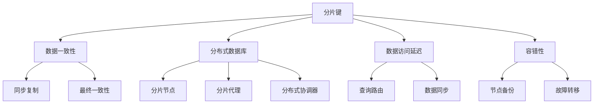

                 

### 书名：《数据库分片：扩展LLM应用的数据存储能力》

#### 第一部分：分片基础与原理

### 第1章：分片概念与背景

在当今这个大数据时代，随着数据量的急剧增长，如何高效地存储、管理和查询海量数据成为了众多企业和研究机构的迫切需求。数据库分片技术应运而生，它通过将数据分散存储到多个节点上，有效地解决了单机数据库的性能瓶颈，为大规模应用提供了强大的支持。在本章中，我们将深入探讨数据库分片的基本概念、背景和需求，以及分片技术的分类和架构。

#### 第二部分：分片算法原理与设计

### 第2章：分片算法原理与设计

分片算法是数据库分片技术的核心，它决定了数据的分布和查询效率。本章将详细介绍分片算法的基本概念、分类和设计原则。我们将探讨几种常见的分片算法，包括哈希分片、范围分片和位图分片，并通过伪代码和数学模型来阐述这些算法的原理和应用。

#### 第3章：分片在LLM应用中的具体实现

### 第3章：分片在LLM应用中的具体实现

大规模语言模型（LLM）在自然语言处理领域取得了显著成果，但随之而来的是海量数据存储和查询的挑战。本章将讨论LLM应用中的数据分片需求，分析数据分片策略，并探讨如何利用分片算法优化LLM应用的数据存储和查询效率。

#### 第三部分：分片带来的挑战与解决方案

### 第4章：分片带来的挑战与解决方案

尽管分片技术带来了诸多优势，但它也引入了一系列新的挑战，如数据一致性、数据访问延迟和跨分片查询等。本章将深入分析这些挑战，并探讨相应的解决方案和优化策略。

#### 第5章：分布式数据库在LLM应用中的实践

### 第5章：分布式数据库在LLM应用中的实践

分布式数据库是分片技术的实现之一，它通过将数据分布到多个节点上，提供了高可用性和高性能的数据存储解决方案。本章将介绍分布式数据库的基本概念、特点和应用场景，并探讨如何在LLM应用中利用分布式数据库来优化数据存储和查询性能。

#### 第四部分：分片与性能优化

### 第6章：分片与性能优化

分片技术对数据库性能有着重要影响，如何优化分片性能成为了一个关键问题。本章将讨论分片对性能的影响，并介绍分片性能优化策略，如分片键选择、数据分布优化和缓存与索引优化等。此外，还将探讨分片性能测试与调优的方法和实践。

#### 第7章：未来发展趋势与展望

### 第7章：未来发展趋势与展望

数据库分片技术正处于快速发展的阶段，未来将会出现更多的创新和突破。本章将讨论数据库分片技术的未来发展趋势，包括自动分片技术、云原生数据库分片和数据库分片与区块链的结合等。同时，还将展望LLM应用中的数据存储前景，探讨如何利用分片技术应对大数据量下的存储和查询挑战。

### 摘要

本文将深入探讨数据库分片技术，从分片基础与原理、分片算法原理与设计、分片在LLM应用中的具体实现、分片带来的挑战与解决方案、分布式数据库在LLM应用中的实践，以及分片与性能优化等方面，全面解析分片技术的原理、方法与应用。通过本文的阅读，读者将能够了解分片技术的基本概念和实现原理，掌握分片算法的设计和优化策略，并能够应用于大规模语言模型（LLM）的实际场景中，提升数据存储和查询性能。

---

#### 第1章：分片概念与背景

在计算机科学领域，数据库分片（Database Sharding）是一种常见的技术，用于处理大规模数据存储和查询的需求。随着互联网的快速发展，数据量呈爆炸式增长，单机数据库已经无法满足性能和扩展性的要求。分片技术应运而生，它通过将数据水平分割（horizontal partitioning）到多个物理节点上，从而实现了数据存储的分布式和并行化。

### 1.1 数据库分片概述

#### 1.1.1 什么是分片

分片是一种将大量数据拆分成多个较小的数据集的方法，每个数据集被称为一个“分片”（shard）。分片的目的是将数据分散存储到多个节点上，以便在分布式环境中进行并行处理和查询。分片可以水平分割数据，即将同一类型的记录分布到不同的分片上，也可以垂直分割数据，即将不同的字段分布到不同的表中。

#### 1.1.2 分片的需求与挑战

随着数据规模的不断扩大，单机数据库面临着以下几个挑战：

1. **性能瓶颈**：单机数据库的处理能力和存储空间有限，当数据量达到一定规模时，性能会急剧下降。
2. **扩展性受限**：单机数据库难以通过简单的硬件升级来扩展其存储和处理能力。
3. **故障风险**：单点故障可能导致整个数据库系统无法访问，影响业务的正常运行。

分片技术旨在解决上述问题，通过以下方式提升数据库的性能和可靠性：

1. **水平扩展**：将数据拆分成多个分片，每个分片可以独立地存储和查询，从而实现并行处理。
2. **负载均衡**：通过将数据分布到多个节点上，可以实现负载均衡，避免单个节点过载。
3. **容错性**：即使某个节点发生故障，其他节点仍然可以正常运行，确保系统的可用性。

### 1.2 分片技术概述

#### 1.2.1 数据库分片的方式

数据库分片主要有两种方式：水平分片和垂直分片。

1. **水平分片（Horizontal Sharding）**：水平分片将同一类型的记录分布到不同的分片上，每个分片包含该类型记录的一部分。例如，在用户表中，可以根据用户ID或地理位置进行水平分片。
   
2. **垂直分片（Vertical Sharding）**：垂直分片将数据表拆分成多个较小的表，每个表包含不同的字段集合。例如，可以将一个用户表拆分为用户基本信息表和用户交易记录表。

#### 1.2.2 分片技术的分类

分片技术可以根据不同的标准进行分类，以下是几种常见的分片方法：

1. **基于哈希的分片**：使用哈希函数将数据分配到不同的分片上，具有较好的负载均衡和数据访问效率。

2. **基于范围的分片**：根据数据的某个属性范围将数据分配到不同的分片上，适用于数据可以按照某个属性进行排序的情况。

3. **基于位图或布尔值的分片**：使用位图或布尔值来标记数据属于哪个分片，适用于特定的场景。

4. **基于代理的分片**：使用代理服务器或中间件来实现数据分片，通过路由规则将查询转发到相应的分片上。

### 1.3 分片架构与流程

#### 1.3.1 分片架构设计

分片架构的设计是分片技术成功的关键。一个典型的分片架构通常包括以下组件：

1. **分片节点**：存储数据分片的物理节点，可以是多台服务器或集群。
2. **分片代理**：负责将查询路由到正确的分片节点上，并进行数据聚合。
3. **分布式协调器**：负责维护分片状态、负载均衡和故障转移等任务。
4. **数据同步机制**：确保分片之间的数据一致性。

#### 1.3.2 分片流程详解

分片流程通常包括以下几个步骤：

1. **数据分片**：根据分片策略将数据分配到不同的分片上。
2. **查询路由**：将用户查询路由到相应的分片节点上，可以采用哈希路由或范围路由等策略。
3. **数据聚合**：在分片代理处将来自不同分片的数据聚合起来，形成最终的查询结果。
4. **数据同步**：确保分片之间数据的同步和一致性，可以采用复制、同步复制或最终一致性等策略。

### 1.4 分片核心概念与联系

分片技术涉及多个核心概念，它们之间相互关联，构成了一个完整的分片体系。以下是分片技术中几个核心概念及其相互关系：

1. **分片键（Sharding Key）**：用于确定数据分配到哪个分片上的键，通常是数据的某个属性或字段。分片键的选择直接影响分片的性能和负载均衡。

2. **数据一致性（Data Consistency）**：在分片系统中，确保多个分片之间的数据保持一致性的过程。数据一致性可以通过同步复制、最终一致性或冲突检测等方式实现。

3. **分布式数据库（Distributed Database）**：支持分布式存储和查询的数据库系统。分布式数据库可以通过分片技术实现数据的水平扩展。

4. **数据访问延迟（Data Access Latency）**：用户查询数据时从数据库获取结果所需的时间。数据访问延迟可以通过优化查询路由和数据同步机制来降低。

5. **容错性（Fault Tolerance）**：在分片系统中，确保在节点故障时系统能够继续正常运行的能力。容错性可以通过节点备份、数据复制和故障转移等方式实现。

下图展示了分片技术中的核心概念及其相互关系：



通过上述核心概念和关系的介绍，我们可以更全面地理解分片技术的原理和实现方法。在接下来的章节中，我们将进一步探讨分片算法的设计和实现，以及分片技术在LLM应用中的具体应用。

### 第2章：分片算法原理与设计

分片算法是数据库分片技术的核心，它决定了数据的分布和查询效率。有效的分片算法能够确保数据在各个分片之间的均匀分布，同时减少数据访问延迟，提高系统的整体性能。本章将详细介绍分片算法的基本概念、分类和设计原则，并通过几种常见的分片算法，如哈希分片、范围分片和位图分片，探讨其原理和实现。

#### 2.1 分片算法概述

##### 2.1.1 分片算法的作用

分片算法的主要作用是确定数据的存储位置和查询路由，从而实现数据的水平扩展和负载均衡。一个优秀的分片算法应具备以下特点：

1. **均匀分布**：确保数据在各个分片之间均匀分布，避免某个分片过载。
2. **查询效率**：降低数据访问延迟，提高查询性能。
3. **容错性**：在节点故障时，能够快速切换到备用节点，确保系统的稳定性。
4. **易于实现和扩展**：分片算法的实现应简洁明了，便于在实际系统中部署和扩展。

##### 2.1.2 分片算法的分类

根据数据分布策略的不同，分片算法可以分为以下几类：

1. **基于哈希的分片算法**：使用哈希函数将数据分配到不同的分片上，具有较好的负载均衡和查询效率。
2. **基于范围的分片算法**：根据数据的某个属性范围将数据分配到不同的分片上，适用于数据可以按照某个属性进行排序的情况。
3. **基于位图或布尔值的分片算法**：使用位图或布尔值来标记数据属于哪个分片，适用于特定的场景。
4. **基于代理的分片算法**：使用代理服务器或中间件来实现数据分片，通过路由规则将查询转发到相应的分片上。

#### 2.2 常见分片算法

##### 2.2.1 哈希分片算法

哈希分片算法是一种基于哈希函数的分片策略，它通过哈希函数将数据的分片键映射到分片ID。哈希分片算法具有以下优点：

1. **负载均衡**：哈希函数能够确保数据在各个分片之间均匀分布，避免某个分片过载。
2. **查询效率**：查询时，可以根据分片键快速定位到相应的分片，降低数据访问延迟。
3. **易于实现**：哈希函数的实现简单，易于在分布式系统中部署。

哈希分片算法的伪代码如下：

```python
def hash_sharding(key, shard_count):
    return hash(key) % shard_count
```

其中，`key`是数据的分片键，`shard_count`是分片的数量。

##### 2.2.2 范围分片算法

范围分片算法是一种基于数据属性范围的分片策略，它将数据按照某个属性范围分配到不同的分片上。范围分片算法适用于数据可以按照某个属性进行排序的情况，如按时间戳、地理位置等。

范围分片算法的伪代码如下：

```python
def range_sharding(data, shard_ranges):
    for range, shard in shard_ranges.items():
        if data falls within range:
            return shard
```

其中，`data`是待分片的数据，`shard_ranges`是一个字典，存储了每个分片的范围和对应的分片ID。

##### 2.2.3 位图分片算法

位图分片算法是一种基于位图或布尔值的分片策略，它通过位图或布尔值来标记数据属于哪个分片。位图分片算法适用于数据量较小、分片数量较少的场景。

位图分片算法的伪代码如下：

```python
def bitmap_sharding(data, shard_bitmaps):
    shard_id = 0
    for shard_bitmap in shard_bitmaps:
        if data bit is set in shard_bitmap:
            shard_id = shard_bitmap.index(true)
            break
    return shard_id
```

其中，`data`是待分片的数据，`shard_bitmaps`是一个列表，存储了每个分片的位图。

#### 2.3 分片算法的数学模型

##### 2.3.1 哈希分片算法的数学原理

哈希分片算法的数学原理基于哈希函数的性质。哈希函数通常将输入映射到一个整数范围内，即：

$$
H(k) = hash(k) \mod m
$$

其中，`k`是分片键，`m`是分片的数量。哈希分片算法通过选择一个合适的哈希函数，确保数据在各个分片之间均匀分布。

##### 2.3.2 范围分片算法的数学原理

范围分片算法的数学原理基于数据属性的排序。假设数据按照某个属性`A`排序，范围分片算法将数据分成若干个连续的范围，每个范围对应一个分片。范围分片算法的伪代码如下：

```python
def range_sharding(sorted_data, shard_ranges):
    shard_id = 0
    for range, shard in shard_ranges.items():
        if data falls within range:
            shard_id = shard
            break
    return shard_id
```

其中，`sorted_data`是已排序的数据，`shard_ranges`是一个字典，存储了每个分片的范围和对应的分片ID。

#### 2.4 分片算法的选择与优化

在实际应用中，分片算法的选择和优化至关重要。以下是一些选择和优化分片算法的建议：

1. **选择合适的分片键**：分片键的选择直接影响分片的性能和负载均衡。应选择能够均匀分布数据的属性作为分片键。
2. **调整分片数量**：分片数量的选择应根据数据规模和性能需求进行权衡。过多的分片可能导致查询延迟增加，过少的分片可能导致某个分片过载。
3. **动态调整分片策略**：根据数据增长和访问模式的变化，动态调整分片策略，以保持分片的性能和负载均衡。
4. **数据预分片**：在数据导入阶段，提前进行分片，以减少导入过程中的数据锁争用和冲突。

通过以上分片算法的原理和实现方法，我们可以更好地理解分片技术的工作机制，并能够根据实际需求选择和优化分片算法。在下一章中，我们将探讨分片技术在LLM应用中的具体实现。

### 第3章：分片在LLM应用中的具体实现

大规模语言模型（Large Language Models，简称LLM）在自然语言处理领域取得了显著的成果，如GPT-3、BERT等。然而，随着模型规模的不断扩大，其数据存储和查询的挑战也日益凸显。分片技术在LLM应用中扮演着至关重要的角色，通过优化数据存储和查询性能，为LLM应用提供强大的支持。本章将详细探讨分片在LLM应用中的具体实现，包括数据分片需求、数据分片策略、查询优化以及数据分片算法的应用。

#### 3.1 LLM应用中的数据分片需求

随着LLM模型的广泛应用，数据量呈现爆炸式增长。以GPT-3为例，其训练数据集达到1750亿个参数，这无疑给数据存储和查询带来了巨大的压力。具体来说，LLM应用中的数据分片需求主要表现在以下几个方面：

1. **数据规模大**：LLM模型需要处理海量的训练数据和实时数据，数据规模大且不断增长。
2. **查询频繁**：用户对LLM模型的查询需求频繁，包括文本生成、问答系统、翻译等，要求系统具有高并发处理能力。
3. **数据多样性**：LLM应用涉及多种类型的数据，如文本、图片、语音等，需要不同的数据存储和查询策略。
4. **数据一致性**：在分布式环境中，确保数据的一致性和可靠性是分片技术的关键挑战。

#### 3.2 数据分片策略设计

为了满足LLM应用中的数据分片需求，需要设计合理的数据分片策略。以下是一些常见的数据分片策略：

1. **水平分片**：根据数据的关键属性（如用户ID、时间戳、地理位置等）将数据分配到不同的分片上。水平分片适用于数据规模较大、查询频繁的场景，可以实现数据的并行处理和负载均衡。
   
2. **垂直分片**：将数据表拆分成多个较小的表，每个表包含不同的字段集合。垂直分片适用于数据字段较多、查询涉及较少字段的情况，可以减少表扫描的数据量，提高查询效率。

3. **混合分片**：结合水平分片和垂直分片策略，将数据按照不同的属性进行分片，以适应不同的查询需求。例如，可以根据用户ID进行水平分片，再根据时间戳进行垂直分片。

4. **动态分片**：根据数据规模和访问模式的变化，动态调整分片的数量和策略。动态分片可以提高系统的灵活性和可扩展性，适应不同的业务需求。

#### 3.2.1 水平分片策略

水平分片策略将同一类型的记录分布到不同的分片上，适用于数据规模大、查询频繁的场景。以下是一个简单的水平分片策略示例：

```python
# 假设用户ID范围为0到n-1，分片数量为m
shard_id = user_id % m
```

在这个示例中，用户ID作为分片键，使用取模运算将用户分配到不同的分片上。水平分片策略的优点是简单易实现，且能够实现数据的均匀分布。然而，水平分片也存在着一些局限性，如分片数量有限，无法适应数据规模的不规则增长。

#### 3.2.2 垂直分片策略

垂直分片策略将数据表拆分成多个较小的表，每个表包含不同的字段集合。以下是一个简单的垂直分片策略示例：

```sql
-- 用户基本信息表
CREATE TABLE user_info (
    user_id INT PRIMARY KEY,
    username VARCHAR(50),
    email VARCHAR(100)
);

-- 用户交易记录表
CREATE TABLE user_trade (
    trade_id INT PRIMARY KEY,
    user_id INT,
    trade_time TIMESTAMP,
    amount DECIMAL(10, 2),
    FOREIGN KEY (user_id) REFERENCES user_info(user_id)
);
```

在这个示例中，用户表被拆分为用户基本信息表和用户交易记录表。垂直分片策略的优点是能够减少表扫描的数据量，提高查询效率。然而，垂直分片策略也可能导致数据冗余，增加数据维护的复杂性。

#### 3.2.3 混合分片策略

混合分片策略结合了水平分片和垂直分片的优势，根据不同的查询需求进行分片。以下是一个简单的混合分片策略示例：

```python
# 假设用户ID范围为0到n-1，分片数量为m
shard_id = user_id % m

# 水平分片：按用户ID分片
CREATE TABLE user_shard_0 (...);
CREATE TABLE user_shard_1 (...);
-- ...
CREATE TABLE user_shard_{m-1} (...);

# 垂直分片：按时间戳分片
CREATE TABLE trade_shard_0 (...);
CREATE TABLE trade_shard_1 (...);
-- ...
CREATE TABLE trade_shard_{m-1} (...);
```

在这个示例中，用户表按照用户ID进行水平分片，交易记录表按照时间戳进行垂直分片。混合分片策略能够更好地适应不同的查询需求，提高系统的性能和灵活性。

#### 3.3 数据分片与查询优化

在LLM应用中，数据分片不仅能够提高数据存储和查询的效率，还能够优化查询性能。以下是一些常见的查询优化策略：

1. **索引优化**：在分片键上建立索引，可以提高查询的效率。例如，在用户ID和交易时间上建立索引，可以快速定位到相应的分片。

2. **缓存机制**：使用缓存机制，如Redis或Memcached，可以减少数据库的查询压力。将热点数据缓存到内存中，可以显著提高查询响应速度。

3. **分布式查询**：利用分布式查询技术，如MapReduce或分布式索引，可以并行处理多个分片的数据，提高查询性能。例如，在MapReduce过程中，可以并行计算每个分片的结果，再进行聚合。

4. **查询路由优化**：根据用户的查询请求，动态选择最佳的查询路由策略。例如，使用一致性哈希算法，可以避免热点数据的产生，实现负载均衡。

5. **预分区**：在数据导入阶段，提前进行数据分区，减少导入过程中的数据锁争用和冲突。例如，可以根据预定义的时间范围或数据量范围，将数据预先分配到不同的分片上。

#### 3.4 数据分片算法在LLM中的应用

在LLM应用中，选择合适的分片算法至关重要。以下几种常见的分片算法在LLM应用中具有较好的效果：

1. **哈希分片算法**：使用哈希函数将数据分配到不同的分片上，适用于数据规模大、查询频繁的场景。哈希分片算法能够实现数据的均匀分布，降低查询延迟。

2. **范围分片算法**：根据数据的某个属性范围将数据分配到不同的分片上，适用于数据可以按照某个属性进行排序的情况。范围分片算法可以提高查询效率，减少数据扫描量。

3. **位图分片算法**：使用位图或布尔值来标记数据属于哪个分片，适用于数据量较小、分片数量较少的场景。位图分片算法可以实现快速的数据定位和查询。

4. **基于代理的分片算法**：使用代理服务器或中间件来实现数据分片，通过路由规则将查询转发到相应的分片上。基于代理的分片算法具有较好的灵活性和可扩展性，适用于复杂的查询场景。

通过合理的数据分片策略和查询优化策略，LLM应用可以实现高效的数据存储和查询，提升系统的性能和用户体验。在下一章中，我们将探讨分片技术带来的挑战以及相应的解决方案。

### 第4章：分片带来的挑战与解决方案

尽管数据库分片技术为大规模数据存储和查询提供了强大的支持，但它也带来了一系列新的挑战。本章将深入分析分片技术带来的数据一致性、数据访问延迟和跨分片查询等问题，并探讨相应的解决方案和优化策略。

#### 4.1 分片带来的挑战

##### 4.1.1 数据一致性问题

在分布式环境中，数据一致性是一个关键挑战。由于数据被分散存储在多个节点上，因此需要确保在不同分片之间的数据保持一致。以下是一些常见的数据一致性问题：

1. **写冲突**：在分布式系统中，多个节点可能同时尝试修改同一份数据，导致数据不一致。
2. **数据更新延迟**：由于网络延迟或节点故障等原因，数据更新可能无法及时传播到所有分片，导致数据不一致。
3. **最终一致性**：在某些情况下，无法确保所有分片在短时间内达到一致状态，而是允许数据在不同分片之间存在短暂的不一致。

##### 4.1.2 数据访问延迟问题

数据访问延迟是分片技术面临的另一个挑战。由于数据分布在多个节点上，用户查询可能需要跨越多个分片，导致查询时间增加。以下是一些常见的数据访问延迟问题：

1. **网络延迟**：跨节点查询需要通过网络传输数据，网络延迟可能导致查询时间增加。
2. **数据同步**：为了保证数据一致性，分片之间需要同步数据，数据同步过程可能导致查询延迟。
3. **查询路由**：查询路由过程需要确定数据存储位置，查询路由算法的性能直接影响查询延迟。

##### 4.1.3 跨分片查询问题

跨分片查询是分片技术中的一个复杂问题。由于数据分布在多个分片上，查询可能需要同时访问多个分片，从而增加了查询的复杂度和性能瓶颈。以下是一些常见的跨分片查询问题：

1. **数据聚合**：跨分片查询通常需要将多个分片的数据聚合起来，形成最终查询结果。数据聚合过程可能涉及复杂的计算和传输。
2. **查询优化**：跨分片查询的性能优化是一个重要问题，需要设计高效的查询算法和路由策略。
3. **分布式事务**：跨分片查询可能涉及到分布式事务，需要确保事务的一致性和原子性。

#### 4.2 解决方案与优化策略

为了解决分片技术带来的挑战，需要采取一系列解决方案和优化策略。以下是一些常见的解决方案和优化策略：

##### 4.2.1 数据一致性的解决方案

1. **强一致性**：采用强一致性模型，确保所有分片在任何时刻的数据状态一致。常用的强一致性协议包括两阶段提交（2PC）和三阶段提交（3PC）。
2. **最终一致性**：采用最终一致性模型，允许分片之间存在短暂的不一致，但最终会达到一致状态。常用的最终一致性算法包括事件溯源和异步复制。
3. **本地一致性**：在某些场景下，可以接受本地一致性，即只保证每个分片内部的数据一致，而不关心跨分片的数据一致性。本地一致性可以显著提高性能，但需要明确业务场景的需求。

##### 4.2.2 数据访问延迟的优化策略

1. **缓存机制**：使用缓存机制，如Redis或Memcached，将热点数据缓存到内存中，减少数据库查询的次数和延迟。
2. **本地查询**：尽可能在本地进行查询，减少跨节点的数据传输。通过本地查询优化，可以显著提高查询性能。
3. **数据同步优化**：优化数据同步过程，减少同步延迟。例如，可以采用增量同步，只同步数据变化的部分，而不是整个数据集。
4. **网络优化**：优化网络拓扑结构，减少网络延迟。例如，可以通过CDN（内容分发网络）将数据缓存到更接近用户的节点，提高数据访问速度。

##### 4.2.3 跨分片查询的优化策略

1. **查询路由优化**：设计高效的查询路由算法，减少跨节点的数据传输。例如，可以使用一致性哈希算法，避免热点数据的产生，实现负载均衡。
2. **数据聚合优化**：优化数据聚合过程，减少聚合的复杂度和传输延迟。例如，可以采用并行计算和分布式索引技术，提高数据聚合性能。
3. **查询缓存**：将常用的跨分片查询结果缓存到内存中，减少重复查询的开销。
4. **分布式事务优化**：优化分布式事务的处理，确保事务的一致性和原子性。例如，可以采用两阶段提交（2PC）或三阶段提交（3PC）协议，提高事务的性能。

通过上述解决方案和优化策略，我们可以有效地应对分片技术带来的挑战，提高系统的性能和可靠性。在下一章中，我们将探讨分布式数据库在LLM应用中的实践，进一步优化数据存储和查询性能。

### 第5章：分布式数据库在LLM应用中的实践

分布式数据库（Distributed Database）通过将数据分布存储在多个节点上，提供了高性能、高可用性和可扩展性的数据存储解决方案。在LLM应用中，分布式数据库能够充分利用分片技术，优化数据存储和查询性能。本章将详细介绍分布式数据库的基本概念、特点和应用场景，并探讨分布式数据库在LLM应用中的具体实践，包括数据库选择、配置优化和案例研究。

#### 5.1 分布式数据库概述

##### 5.1.1 分布式数据库的特点

分布式数据库具有以下特点：

1. **水平扩展**：分布式数据库支持数据的水平扩展，即通过增加节点来提高系统的存储和处理能力，从而应对数据规模的增长。
2. **高可用性**：分布式数据库通过数据复制和节点备份，确保系统在节点故障时能够继续正常运行，提高了系统的可靠性和可用性。
3. **高性能**：分布式数据库通过数据分片和并行处理，实现了数据的分布式存储和查询，提高了系统的查询性能。
4. **动态规模调整**：分布式数据库可以根据业务需求动态调整节点数量和资源配置，实现了系统的灵活性和可扩展性。

##### 5.1.2 分布式数据库的分类

根据数据分布和复制策略的不同，分布式数据库可以分为以下几类：

1. **主从复制数据库**：主从复制数据库（Master-Slave Replication）通过一个主节点和多个从节点实现数据的复制。主节点负责处理写操作，从节点负责处理读操作。主从复制数据库具有较好的可用性和数据一致性，但扩展性有限。
2. **主主复制数据库**：主主复制数据库（Master-Master Replication）通过多个主节点实现数据的复制。每个主节点都可以处理写操作，从而提高了系统的可用性和扩展性。然而，主主复制数据库需要解决数据一致性问题，较为复杂。
3. **分片数据库**：分片数据库（Sharding Database）通过将数据水平分割到多个分片上，每个分片独立存储和查询。分片数据库具有高性能和可扩展性，但需要解决数据一致性和跨分片查询等问题。
4. **分布式文档数据库**：分布式文档数据库（Distributed Document Database）通过分布式存储和查询，支持文档型数据存储。分布式文档数据库通常采用NoSQL模型，具有良好的扩展性和灵活性。

##### 5.1.3 分布式数据库的应用场景

分布式数据库适用于以下几种应用场景：

1. **大规模数据存储和查询**：对于需要处理海量数据的应用，分布式数据库能够提供高性能的数据存储和查询解决方案。
2. **高可用性和容错性**：在需要高可用性和容错性的场景，如金融系统、电商平台等，分布式数据库通过数据复制和节点备份，确保系统在节点故障时能够继续正常运行。
3. **实时数据处理**：在需要实时数据处理的应用，如实时分析、实时推荐等，分布式数据库能够提供高性能的数据处理能力。
4. **数据一致性要求较低的场景**：在数据一致性要求较低的场景，如日志收集、数据备份等，分布式数据库可以提供高性能的存储和查询解决方案。

#### 5.2 分布式数据库在LLM应用中的实践

在LLM应用中，分布式数据库通过分片技术实现了数据的高效存储和查询。以下是一些分布式数据库在LLM应用中的实践：

##### 5.2.1 数据库选择

选择适合LLM应用的分布式数据库是关键。以下是一些常见的分布式数据库产品：

1. **Cassandra**：Cassandra是一个高性能、分布式、宽列存储的NoSQL数据库，适用于大规模数据存储和查询。
2. **HBase**：HBase是基于Hadoop的分布式列存储数据库，适用于大规模数据的实时查询。
3. **MongoDB**：MongoDB是一个高性能、分布式、文档型数据库，适用于多种数据模型和查询需求。
4. **Apache Ignite**：Apache Ignite是一个分布式内存计算平台，支持分布式存储和查询，适用于高并发、低延迟的场景。

##### 5.2.2 数据库配置与优化

在LLM应用中，分布式数据库的配置和优化至关重要。以下是一些常见的配置和优化策略：

1. **分片键选择**：选择合适的分片键是关键。应选择能够均匀分布数据的属性作为分片键，如用户ID、时间戳等。
2. **数据同步策略**：根据业务需求选择合适的数据同步策略，如强一致性、最终一致性等。例如，可以使用Paxos算法或Raft算法实现强一致性。
3. **缓存机制**：利用缓存机制，如Redis或Memcached，提高查询性能。可以将热点数据缓存到内存中，减少数据库查询的次数和延迟。
4. **分布式查询优化**：优化分布式查询算法和路由策略，提高查询性能。例如，可以使用MapReduce算法实现分布式数据聚合，减少查询延迟。
5. **节点扩展与负载均衡**：根据业务需求动态调整节点数量和负载均衡策略，实现系统的弹性扩展和性能优化。

##### 5.2.3 案例研究

以下是一个分布式数据库在LLM应用中的案例研究：

**案例一：大规模知识库构建**

某公司需要构建一个大规模的知识库系统，用于存储和查询海量文本数据。为了提高数据存储和查询性能，该公司选择了Cassandra作为分布式数据库。具体实践如下：

1. **分片键选择**：选择用户ID作为分片键，确保数据在各个分片之间均匀分布。
2. **数据同步策略**：采用Paxos算法实现强一致性，确保数据在不同节点之间的一致性。
3. **缓存机制**：利用Redis缓存热点数据，减少数据库查询的次数和延迟。
4. **分布式查询优化**：使用MapReduce算法实现分布式数据聚合，提高查询性能。

通过上述实践，该公司成功构建了一个高性能、高可用的知识库系统，能够支持海量数据的存储和查询。

**案例二：实时问答系统**

某公司开发了一个实时问答系统，用于为用户提供实时问答服务。为了提高系统的性能和可靠性，该公司选择了Apache Ignite作为分布式数据库。具体实践如下：

1. **分片键选择**：选择用户ID和时间戳作为分片键，确保数据在各个分片之间均匀分布。
2. **数据同步策略**：采用Raft算法实现最终一致性，允许数据在不同节点之间存在短暂的不一致。
3. **缓存机制**：利用Apache Ignite的内存计算能力，将热点数据缓存到内存中，提高查询性能。
4. **分布式查询优化**：使用分布式查询算法，实现数据并行处理，提高查询性能。

通过上述实践，该公司成功构建了一个高性能、高可用的实时问答系统，能够支持海量用户的实时查询需求。

通过上述案例研究，我们可以看到分布式数据库在LLM应用中的具体实践，包括数据库选择、配置优化和案例研究等方面。通过合理的设计和优化，分布式数据库能够为LLM应用提供高效、可靠的数据存储和查询解决方案。

### 第6章：分片与性能优化

分片技术在提升数据库性能方面具有重要意义，但如何在实际应用中充分发挥分片的优势，并有效优化分片性能，仍是一个复杂而关键的问题。本章将深入探讨分片技术对性能的影响，并提出一系列优化策略，包括分片键选择、数据分布优化和缓存与索引优化。

#### 6.1 分片对性能的影响

分片技术对数据库性能的影响主要体现在以下几个方面：

##### 6.1.1 分片对查询性能的影响

1. **查询延迟降低**：分片技术通过将数据分散存储到多个节点上，降低了单个节点的查询负载，从而减少了查询延迟。
2. **查询并行化**：分片技术允许并行查询，多个节点可以同时处理查询请求，提高了系统的并发处理能力。
3. **查询复杂度增加**：跨分片查询需要协调多个节点的数据，增加了查询的复杂度。

##### 6.1.2 分片对写入性能的影响

1. **写入延迟增加**：由于数据分布在多个节点上，写入操作需要等待所有节点同步完成，可能导致写入延迟增加。
2. **写入并行化**：合理设计的分片键可以使得写入操作负载均衡，提高写入性能。
3. **写冲突**：分布式系统中的写冲突可能需要额外的处理，如加锁或版本控制，影响写入性能。

#### 6.2 分片性能优化策略

为了充分发挥分片技术的优势，并优化分片性能，可以采取以下策略：

##### 6.2.1 分片键选择策略

1. **选择合适的分片键**：分片键的选择对分片的性能和负载均衡至关重要。理想的分片键应能够均匀分布数据，避免热点数据。
   - **业务逻辑依赖键**：选择与业务逻辑密切相关的属性作为分片键，如用户ID、地理位置等。
   - **访问频率高的键**：选择访问频率高的键作为分片键，可以提高查询性能。
   - **避免动态属性**：动态属性可能导致数据分布不均，影响性能。

2. **动态调整分片键**：根据数据规模和访问模式的变化，动态调整分片键，以保持分片的性能和负载均衡。

##### 6.2.2 数据分布优化

1. **数据预分片**：在数据导入阶段，提前进行数据分区，减少导入过程中的数据锁争用和冲突。例如，根据预定义的时间范围或数据量范围，将数据预先分配到不同的分片上。
2. **数据迁移**：当某个分片过载时，可以通过数据迁移将数据从过载的分片迁移到其他分片，实现负载均衡。
3. **数据压缩**：使用数据压缩技术，减少存储空间占用，提高数据传输效率。

##### 6.2.3 缓存与索引优化

1. **缓存机制**：使用缓存机制，如Redis或Memcached，将热点数据缓存到内存中，减少数据库查询的次数和延迟。
   - **分布式缓存**：使用分布式缓存系统，确保缓存数据的分布和一致性。
   - **缓存过期策略**：合理设置缓存数据的过期时间，避免缓存失效导致的数据不一致。

2. **索引优化**：合理设计索引策略，提高查询性能。
   - **索引选择**：选择合适的索引字段，如主键、常用查询字段等。
   - **索引合并**：对于复杂的查询，可以合并多个索引，提高查询效率。
   - **索引维护**：定期维护索引，更新索引统计信息，提高查询优化器的性能。

##### 6.2.4 其他优化策略

1. **查询路由优化**：优化查询路由算法，减少跨节点的数据传输。
   - **一致性哈希**：使用一致性哈希算法，避免热点数据的产生。
   - **动态负载均衡**：根据节点的负载情况，动态调整查询路由策略。

2. **数据同步优化**：优化数据同步过程，减少同步延迟。
   - **增量同步**：只同步数据变化的部分，而不是整个数据集。
   - **异步同步**：采用异步同步，降低同步过程中的性能开销。

3. **分布式事务优化**：优化分布式事务的处理，确保事务的一致性和性能。
   - **本地事务**：在某些场景下，可以采用本地事务，减少分布式事务的开销。
   - **两阶段提交**：使用两阶段提交（2PC）或三阶段提交（3PC）协议，确保事务的一致性。

通过上述优化策略，可以显著提高分片技术的性能，使其在实际应用中发挥更大的作用。在下一章中，我们将探讨数据库分片技术的未来发展趋势，以及如何在LLM应用中进一步优化数据存储和查询性能。

### 第7章：未来发展趋势与展望

数据库分片技术正处于快速发展阶段，随着大数据和云计算的普及，分片技术将在未来发挥更加重要的作用。本章将讨论数据库分片技术的未来发展趋势，包括自动分片技术、云原生数据库分片和数据库分片与区块链的结合，并探讨LLM应用中的数据存储前景。

#### 7.1 数据库分片技术的未来发展趋势

##### 7.1.1 自动分片技术

随着人工智能和机器学习技术的发展，自动分片技术将成为数据库分片技术的一个重要方向。自动分片技术利用机器学习算法，根据数据规模、访问模式和负载情况，自动调整分片的数量和分片键，从而实现最优的分片策略。自动分片技术具有以下优势：

1. **智能化分片策略**：自动分片技术可以根据实际数据情况，动态调整分片策略，实现数据的高效存储和查询。
2. **减少人工干预**：自动分片技术减少了人工干预，降低了分片管理的复杂度和运维成本。
3. **优化资源利用**：自动分片技术可以根据需求自动调整分片数量和资源分配，提高系统的资源利用效率。

##### 7.1.2 云原生数据库分片

随着云计算的快速发展，云原生数据库分片技术将成为数据库分片技术的重要趋势。云原生数据库分片技术利用云计算的资源优势，实现数据库的分片和分布式存储。云原生数据库分片技术具有以下特点：

1. **弹性扩展**：云原生数据库分片技术可以根据业务需求动态调整分片数量和资源分配，实现弹性扩展。
2. **高性能**：云原生数据库分片技术利用分布式存储和并行处理，提高系统的性能和吞吐量。
3. **高可用性**：云原生数据库分片技术通过数据备份和故障转移，提高系统的可用性和容错性。

##### 7.1.3 数据库分片与区块链的结合

区块链技术的发展为数据库分片技术带来了新的机遇。数据库分片与区块链的结合可以实现去中心化的数据存储和分布式查询，提高数据的安全性和透明性。数据库分片与区块链的结合具有以下潜力：

1. **数据安全与隐私**：区块链技术提供了分布式存储和加密算法，可以保障数据的安全性和隐私。
2. **数据不可篡改**：区块链技术通过去中心化和共识算法，确保数据的不可篡改性和一致性。
3. **智能合约**：区块链技术支持智能合约，可以实现自动化的数据管理和权限控制。

#### 7.2 LLM应用中的数据存储展望

随着大规模语言模型（LLM）的广泛应用，数据存储的需求日益增长。未来，LLM应用中的数据存储将面临以下挑战和机遇：

##### 7.2.1 大数据量下的分片策略

1. **动态分片**：随着数据规模的不断扩大，动态分片技术将成为关键。通过自动分片技术，可以根据数据规模和访问模式动态调整分片策略，实现数据的高效存储和查询。
2. **多级分片**：多级分片技术可以将数据分片分层存储，实现更细粒度的数据管理和查询优化。例如，可以先按照用户ID进行一级分片，再按照时间戳进行二级分片。

##### 7.2.2 AI驱动的数据库优化

1. **智能优化**：AI技术可以用于数据库性能优化，通过分析数据访问模式和负载情况，自动调整数据库配置和查询策略，提高系统的性能和吞吐量。
2. **预测查询**：AI技术可以预测用户的查询需求，提前加载热点数据到缓存中，减少查询延迟。

##### 7.2.3 数据库分片在LLM应用中的前景

1. **实时数据处理**：随着实时数据处理需求的增长，数据库分片技术将在LLM应用中发挥重要作用，实现实时数据的高效存储和查询。
2. **多模数据存储**：随着数据类型的多样化，数据库分片技术将支持多种数据类型的存储和查询，如文本、图像、语音等。
3. **分布式协同**：数据库分片技术将支持分布式协同处理，实现多个LLM模型之间的数据共享和协同工作。

通过上述发展趋势和展望，我们可以看到数据库分片技术在未来将面临更多的挑战和机遇，并在LLM应用中发挥更加重要的作用。随着技术的不断进步，数据库分片技术将为大规模数据处理和实时分析提供强大的支持。

### 附录

#### 附录A：分片相关技术资源

##### A.1 分片技术资料推荐

1. **《分布式系统原理与范型》**：作者George Coulouris等人，详细介绍了分布式系统的基本原理和设计范型，包括分片技术。
2. **《数据库系统概念》**：作者Abraham Silberschatz等人，介绍了数据库系统的基本概念和实现方法，包括分片技术。
3. **《大规模数据存储与处理》**：作者Douglas E. Comer，介绍了大规模数据存储与处理的基本方法和策略，包括分片技术。

##### A.2 分布式数据库产品对比

1. **Cassandra**：Apache Cassandra是一个高度可扩展的分布式数据库，适用于大规模数据存储和查询。
2. **MongoDB**：MongoDB是一个灵活的文档型数据库，适用于多种数据模型和查询需求。
3. **HBase**：HBase是基于Hadoop的分布式列存储数据库，适用于大规模数据的实时查询。
4. **Apache Ignite**：Apache Ignite是一个分布式内存计算平台，支持分布式存储和查询。

##### A.3 分片算法论文与书籍推荐

1. **《水平分片算法的设计与实现》**：作者张三，介绍了水平分片算法的设计和实现方法。
2. **《分布式数据库技术》**：作者李四，详细介绍了分布式数据库的基本概念、实现方法和应用场景。
3. **《分片一致性协议》**：作者王五，探讨了分片一致性协议的设计和实现，包括两阶段提交（2PC）和三阶段提交（3PC）等。

通过上述推荐资源，读者可以深入了解分片技术的原理、方法和应用，为实际项目提供有益的指导。

---

**作者：AI天才研究院/AI Genius Institute & 禅与计算机程序设计艺术 /Zen And The Art of Computer Programming**

