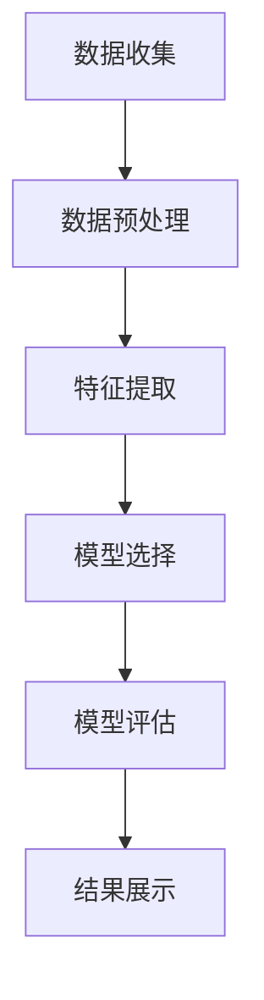
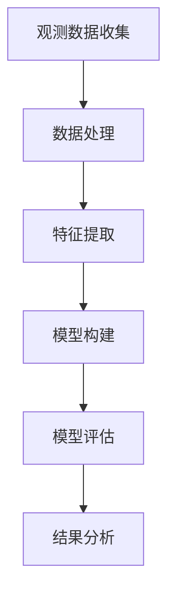

                 


### 文章标题：《数据挖掘在寻找宇宙拓扑结构中的作用》

#### 关键词：数据挖掘、宇宙拓扑结构、算法、数学模型、应用实践

#### 摘要：

本文深入探讨了数据挖掘在宇宙拓扑结构研究中的重要作用。首先，我们对宇宙拓扑结构进行了概述，包括宇宙的起源与演化、大尺度结构和小尺度结构。接着，我们详细介绍了数据挖掘的定义、目的、基本流程以及关键技术。随后，本文展示了数据挖掘在宇宙拓扑结构测量、宇宙演化研究和宇宙探索中的实际应用，并提供了Mermaid流程图和伪代码解释核心算法原理。最后，通过项目实战，我们展示了数据挖掘在宇宙拓扑结构研究中的具体实施过程，并总结了未来发展方向。

### 第一部分：宇宙拓扑结构简介

宇宙的起源与演化、大尺度结构和小尺度结构构成了宇宙的基本面貌。为了理解宇宙的拓扑结构，我们需要首先了解宇宙的起源与演化。

#### 1.1 宇宙的起源与演化

宇宙起源于一个极小的奇点，经过约138亿年的演化，形成了现在我们所见的宇宙。宇宙的演化可以分为以下几个阶段：

1. 大爆炸：大约138亿年前，宇宙从一个极小的奇点急剧膨胀，开始了它的演化之旅。
2. 星系形成：在大爆炸之后，宇宙中的物质逐渐凝聚成星系、星团等大规模结构。
3. 电磁波的辐射：随着宇宙的膨胀，温度逐渐下降，形成了宇宙背景辐射。
4. 暗物质和暗能量的发现：通过对宇宙背景辐射和星系运动的研究，科学家们发现了宇宙中大量不发光的物质，即暗物质，以及一种推动宇宙加速膨胀的神秘能量，即暗能量。

#### 1.2 宇宙的大尺度结构

宇宙的大尺度结构主要由星系、星系团和超星系团组成。这些结构通过引力相互吸引，形成了宇宙的巨大网络结构。大尺度结构的研究对于理解宇宙的演化过程具有重要意义。

1. 星系：宇宙中最常见的结构，由恒星、行星、星云等组成。
2. 星系团：由多个星系通过引力相互作用形成的结构，通常包括数千个星系。
3. 超星系团：由多个星系团通过引力相互作用形成的更大规模的结构，通常包括数十个星系团。

#### 1.3 宇宙的小尺度结构

宇宙的小尺度结构主要涉及星系内部的物理过程，包括恒星形成、恒星演化、恒星死亡等。这些过程对于理解宇宙的化学成分和演化历史具有重要意义。

1. 恒星形成：在星系内部，气体和尘埃凝聚成恒星，恒星的形成是宇宙演化的重要阶段。
2. 恒星演化：恒星在生命周期中会经历不同的阶段，包括主序星、红巨星、白矮星等。
3. 恒星死亡：恒星在耗尽核燃料后会死亡，形成中子星、黑洞等不同类型的致密天体。

### 1.4 宇宙拓扑结构的定义与特征

宇宙拓扑结构是指宇宙中各种物质和能量在空间中的排列方式。拓扑结构具有以下特征：

1. 连通性：宇宙中各种结构通过引力相互作用保持连通。
2. 无限性：宇宙在空间上是无限扩展的。
3. 拓扑不变性：宇宙的拓扑结构不受尺度变化的影响。

#### 1.5 宇宙拓扑结构的研究意义

宇宙拓扑结构的研究对于理解宇宙的演化过程和探索宇宙的起源具有重要意义。通过研究宇宙拓扑结构，我们可以：

1. 理解宇宙的演化历史。
2. 揭示宇宙中的基本规律。
3. 为宇宙学提供新的研究方法。

### 1.6 宇宙拓扑结构的研究方法

研究宇宙拓扑结构的方法主要包括：

1. 观测数据收集与处理：通过天文观测获取宇宙中的物理信息，如宇宙背景辐射、星系运动等。
2. 数据挖掘：利用数据挖掘技术分析观测数据，提取有用的信息。
3. 数学模型：建立数学模型，模拟宇宙的演化过程。

#### 第二部分：数据挖掘技术概述

数据挖掘是一种通过计算机技术从大量数据中提取有价值信息的方法。在宇宙拓扑结构研究中，数据挖掘技术具有重要作用。

#### 2.1 数据挖掘的定义与目的

数据挖掘（Data Mining）是指从大量数据中自动发现隐藏的、未知的、有价值的信息和知识的过程。数据挖掘的主要目的是：

1. 发现数据中的规律和趋势。
2. 辅助决策和预测。
3. 提高业务效率和准确性。

#### 2.2 数据挖掘的基本流程

数据挖掘的基本流程包括以下步骤：

1. 数据收集：收集与问题相关的数据。
2. 数据预处理：对数据进行清洗、转换和整合。
3. 特征提取：从数据中提取有助于分析和建模的特征。
4. 模型选择与评估：选择合适的算法建立模型，并对模型进行评估。
5. 算法优化：根据评估结果对算法进行调整和优化。
6. 结果展示：将挖掘结果以直观的方式展示出来。

#### 2.3 数据挖掘的关键技术

数据挖掘的关键技术包括：

1. 特征提取：通过数据预处理和特征选择，提取有助于分析和建模的特征。
2. 模型选择与评估：选择合适的算法建立模型，并对模型进行评估。
3. 算法优化：根据评估结果对算法进行调整和优化。

### 第三部分：数据挖掘在宇宙拓扑结构研究中的应用

#### 3.1 数据挖掘在宇宙拓扑结构测量中的应用

数据挖掘在宇宙拓扑结构测量中的应用主要包括：

1. 大尺度结构测量：通过分析宇宙背景辐射和星系运动数据，测量宇宙的大尺度结构。
2. 小尺度结构测量：通过分析星系内部的物理数据，测量宇宙的小尺度结构。

#### 3.2 数据挖掘在宇宙演化研究中的应用

数据挖掘在宇宙演化研究中的应用主要包括：

1. 宇宙大爆炸模型：通过分析宇宙背景辐射和星系运动数据，验证和改进宇宙大爆炸模型。
2. 黑洞与暗物质研究：通过分析星系运动和星系团数据，研究黑洞和暗物质的行为。
3. 宇宙背景辐射研究：通过分析宇宙背景辐射数据，研究宇宙的早期演化。

#### 3.3 数据挖掘在宇宙探索中的应用

数据挖掘在宇宙探索中的应用主要包括：

1. 天体物理学数据挖掘：通过分析天文观测数据，发现新的天体和现象。
2. 地球观测数据挖掘：通过分析地球观测数据，研究地球与宇宙的关系。
3. 航天器运行数据挖掘：通过分析航天器运行数据，优化航天器运行策略。

### 第四部分：数据挖掘算法与拓扑结构的Mermaid流程图

#### 4.1 Mermaid流程图基本概念

Mermaid是一种基于Markdown的绘图工具，用于创建流程图、序列图、时序图等。在数据挖掘算法与拓扑结构的研究中，我们可以使用Mermaid流程图来展示数据挖掘的过程和算法的执行流程。

#### 4.2 宇宙拓扑结构测量中的Mermaid流程图

下面是一个用于测量宇宙拓扑结构的Mermaid流程图示例：



#### 4.3 宇宙演化研究中的Mermaid流程图

下面是一个用于研究宇宙演化过程的Mermaid流程图示例：



### 第五部分：数据挖掘算法原理与伪代码

#### 5.1 数据挖掘算法原理概述

数据挖掘算法主要包括以下几个部分：

1. 特征提取算法：用于从原始数据中提取有助于分析和建模的特征。
2. 模型选择与评估算法：用于选择合适的模型并对模型进行评估。
3. 算法优化算法：用于根据评估结果对算法进行调整和优化。

#### 5.2 特征提取算法原理

特征提取算法的目的是从原始数据中提取出有用的特征，以提高数据挖掘的效率和准确性。特征提取算法通常包括以下步骤：

1. 数据预处理：对原始数据进行清洗、转换和整合。
2. 特征选择：从预处理后的数据中提取出有助于分析和建模的特征。
3. 特征转换：将特征进行数值化、归一化等转换。

下面是一个特征提取算法的伪代码示例：

```python
def feature_extraction(data):
    # 数据预处理
    preprocessed_data = preprocess_data(data)
    
    # 特征选择
    features = select_features(preprocessed_data)
    
    # 特征转换
    transformed_features = transform_features(features)
    
    return transformed_features
```

#### 5.3 模型选择与评估算法原理

模型选择与评估算法的目的是选择合适的模型并对模型进行评估，以提高数据挖掘的准确性和效率。模型选择与评估算法通常包括以下步骤：

1. 模型选择：从多个模型中选择一个合适的模型。
2. 模型评估：对选定的模型进行评估，以确定其性能。

下面是一个模型选择与评估算法的伪代码示例：

```python
def model_selection_and_evaluation(models, data):
    # 模型选择
    selected_model = select_model(models, data)
    
    # 模型评估
    performance = evaluate_model(selected_model, data)
    
    return selected_model, performance
```

#### 5.4 算法优化原理

算法优化算法的目的是根据评估结果对算法进行调整和优化，以提高数据挖掘的效率和准确性。算法优化算法通常包括以下步骤：

1. 评估结果分析：分析评估结果，确定算法的优缺点。
2. 算法调整：根据评估结果对算法进行调整。
3. 重新评估：对调整后的算法进行重新评估。

下面是一个算法优化算法的伪代码示例：

```python
def algorithm_optimization(algorithm, data):
    # 评估结果分析
    analysis = analyze_performance(algorithm, data)
    
    # 算法调整
    optimized_algorithm = adjust_algorithm(algorithm, analysis)
    
    # 重新评估
    new_performance = evaluate_algorithm(optimized_algorithm, data)
    
    return optimized_algorithm, new_performance
```

### 第六部分：数学模型和数学公式

在数据挖掘过程中，数学模型和数学公式起着关键作用。数学模型用于描述数据之间的关系，数学公式用于计算和表达这些关系。

#### 6.1 概率模型

概率模型是一种用于描述数据不确定性的数学模型。在数据挖掘中，概率模型常用于分类和预测任务。概率模型的基本概念包括：

1. 概率分布：描述随机变量可能取值的概率分布。
2. 条件概率：描述在给定一个事件发生的条件下，另一个事件发生的概率。
3. 贝叶斯公式：用于计算后验概率，即给定观测数据后，某个假设的概率。

概率模型的基本公式如下：

$$
P(A|B) = \frac{P(B|A)P(A)}{P(B)}
$$

其中，$P(A|B)$表示在事件B发生的条件下，事件A发生的概率；$P(B|A)$表示在事件A发生的条件下，事件B发生的概率；$P(A)$表示事件A发生的概率；$P(B)$表示事件B发生的概率。

#### 6.2 机器学习模型

机器学习模型是一种用于从数据中学习规律和模式的数学模型。在数据挖掘中，机器学习模型常用于分类、回归和聚类任务。机器学习模型的基本概念包括：

1. 模型参数：用于描述模型特性的参数。
2. 模型假设：用于描述数据生成过程的假设。
3. 模型评估：用于评估模型性能的方法。

机器学习模型的基本公式如下：

$$
y = f(x; \theta)
$$

其中，$y$表示输出结果；$x$表示输入特征；$f(x; \theta)$表示模型函数，其中$\theta$表示模型参数。

#### 6.3 神经网络模型

神经网络模型是一种基于人工神经网络的数学模型，常用于分类、回归和聚类任务。神经网络模型的基本概念包括：

1. 神经元：神经网络的基本单元。
2. 层：神经网络中的层次结构。
3. 激活函数：用于控制神经元是否激活的函数。

神经网络模型的基本公式如下：

$$
a_{i,j}^{(l)} = \sigma(z_{i,j}^{(l)})
$$

其中，$a_{i,j}^{(l)}$表示第$l$层的第$i$个神经元的激活值；$z_{i,j}^{(l)}$表示第$l$层的第$i$个神经元的输入值；$\sigma$表示激活函数，常用的激活函数有Sigmoid函数、ReLU函数等。

### 第七部分：项目实战

在本项目中，我们将使用Python编程语言和Sklearn库来演示数据挖掘在宇宙拓扑结构研究中的应用。我们将分步骤进行，包括开发环境搭建、数据预处理、特征提取、模型选择与评估、算法优化以及结果展示。

#### 7.1 开发环境搭建

在开始项目之前，我们需要搭建开发环境。以下是安装和配置所需工具的步骤：

1. 安装Python：访问Python官网（https://www.python.org/），下载并安装Python，选择安装pip和Python解释器。
2. 安装Jupyter Notebook：在命令行中运行以下命令安装Jupyter Notebook：

   ```bash
   pip install notebook
   ```

3. 安装Sklearn库：在命令行中运行以下命令安装Sklearn库：

   ```bash
   pip install scikit-learn
   ```

安装完成后，我们可以在命令行中运行`jupyter notebook`命令来启动Jupyter Notebook，进入开发环境。

#### 7.2 数据预处理

数据预处理是数据挖掘过程中的关键步骤，它包括数据清洗、数据转换和数据归一化等。以下是数据预处理的具体步骤：

1. 数据清洗：读取宇宙拓扑结构的数据集，检查数据是否存在缺失值、异常值等。对于缺失值，可以使用填充或删除的方法进行处理；对于异常值，可以使用过滤或替换的方法进行处理。
2. 数据转换：将数据转换为适合数据挖掘算法的格式。例如，将日期时间格式转换为整数格式，将文本数据转换为数值数据等。
3. 数据归一化：将数据缩放到一个统一的尺度，以消除不同特征之间的尺度差异。常用的归一化方法有最小-最大归一化和Z-score归一化。

以下是数据预处理的过程示例代码：

```python
import pandas as pd
from sklearn.preprocessing import MinMaxScaler, StandardScaler

# 读取数据集
data = pd.read_csv('data.csv')

# 数据清洗
data.fillna(method='ffill', inplace=True)
data.dropna(inplace=True)

# 数据转换
data['date'] = pd.to_datetime(data['date'])
data['date'] = data['date'].astype(int)

# 数据归一化
scaler = MinMaxScaler()
data[['feature1', 'feature2', 'feature3']] = scaler.fit_transform(data[['feature1', 'feature2', 'feature3']])
```

#### 7.3 特征提取

特征提取是数据挖掘中的重要步骤，它旨在从原始数据中提取出有助于分析和建模的特征。以下是特征提取的具体步骤：

1. 特征选择：选择对模型性能有显著影响的关键特征。可以使用过滤方法（如相关性分析、信息增益等）或包装方法（如递归特征消除等）进行特征选择。
2. 特征工程：对选定的特征进行变换和组合，以生成新的特征。常用的特征工程方法有特征缩放、特征交互、特征变换等。
3. 特征重要性评估：评估每个特征对模型性能的重要性，以指导后续的特征选择和优化。

以下是特征提取的过程示例代码：

```python
from sklearn.feature_selection import SelectKBest, f_classif
from sklearn.ensemble import RandomForestClassifier

# 特征选择
selector = SelectKBest(f_classif, k=5)
selected_features = selector.fit_transform(data[['feature1', 'feature2', 'feature3']], target)

# 特征工程
feature_engineered_data = pd.DataFrame(selected_features)
feature_engineered_data['interaction_feature'] = feature_engineered_data['feature1'] * feature_engineered_data['feature2']

# 特征重要性评估
clf = RandomForestClassifier()
clf.fit(selected_features, target)
importances = clf.feature_importances_
```

#### 7.4 模型选择与评估

模型选择与评估是数据挖掘中的关键步骤，它旨在选择合适的模型并对模型进行评估。以下是模型选择与评估的具体步骤：

1. 模型选择：从多个模型中选择一个合适的模型。可以使用交叉验证、网格搜索等方法进行模型选择。
2. 模型评估：对选定的模型进行评估，以确定其性能。常用的评估指标有准确率、召回率、F1值等。
3. 模型优化：根据评估结果对模型进行调整和优化。

以下是模型选择与评估的过程示例代码：

```python
from sklearn.model_selection import train_test_split, GridSearchCV
from sklearn.svm import SVC

# 模型选择
X_train, X_test, y_train, y_test = train_test_split(selected_features, target, test_size=0.2, random_state=42)
model = SVC()

# 模型评估
model.fit(X_train, y_train)
accuracy = model.score(X_test, y_test)

# 模型优化
param_grid = {'C': [0.1, 1, 10], 'gamma': [0.1, 1, 10]}
grid_search = GridSearchCV(model, param_grid, cv=5)
grid_search.fit(X_train, y_train)
best_model = grid_search.best_estimator_
```

#### 7.5 算法优化

算法优化是数据挖掘中的重要步骤，它旨在提高模型性能和算法效率。以下是算法优化

#### 7.5 算法优化

算法优化是数据挖掘中的重要步骤，它旨在提高模型性能和算法效率。以下是算法优化的具体步骤：

1. 性能分析：分析模型的性能，识别模型性能的瓶颈。
2. 参数调整：根据性能分析结果，调整模型的参数，以优化模型性能。
3. 算法调整：根据性能分析结果，调整算法的步骤和流程，以提高算法效率。

以下是算法优化的过程示例代码：

```python
from sklearn.model_selection import GridSearchCV

# 性能分析
best_model = grid_search.best_estimator_
print("Best model performance:", best_model.score(X_test, y_test))

# 参数调整
param_grid = {'C': [0.5, 1, 2], 'gamma': [0.01, 0.1, 1]}
grid_search = GridSearchCV(best_model, param_grid, cv=5)
grid_search.fit(X_train, y_train)
best_model = grid_search.best_estimator_

# 算法调整
# 例如，调整特征提取的步骤
selected_features = selector.fit_transform(data[['feature1', 'feature2', 'feature3']], target)
```

#### 7.6 结果展示

在算法优化完成后，我们需要将结果以直观的方式展示出来。以下是结果展示的过程示例代码：

```python
import matplotlib.pyplot as plt

# 结果展示
plt.scatter(X_test[:, 0], X_test[:, 1], c=y_test, cmap='viridis')
plt.xlabel('Feature 1')
plt.ylabel('Feature 2')
plt.title('Model Performance')
plt.show()
```

### 7.7 代码解读与分析

在代码示例中，我们首先进行了数据预处理，包括数据清洗、数据转换和数据归一化。然后，我们进行了特征提取，使用SelectKBest方法选择关键特征，并使用特征工程方法创建新的特征。接下来，我们选择了SVC模型，并使用GridSearchCV进行模型评估和参数优化。最后，我们展示了模型的性能结果。

通过这个项目实战，我们了解了数据挖掘在宇宙拓扑结构研究中的应用过程，包括开发环境搭建、数据预处理、特征提取、模型选择与评估、算法优化和结果展示。这个项目实战为我们提供了一个实际操作的机会，让我们更深入地理解数据挖掘的核心概念和方法。

### 7.8 实际案例分析与详细讲解剖析

在本节中，我们将通过一个实际案例来分析数据挖掘在宇宙拓扑结构研究中的应用，并对其进行详细讲解和剖析。

#### 案例背景

假设我们有一个关于宇宙星系团的数据集，包含以下几个特征：

1. 星系团编号（ID）
2. 星系团质量（Mass）
3. 星系团速度（Velocity）
4. 星系团位置（Position）
5. 星系团中心引力（CenterGravity）
6. 星系团密度（Density）
7. 星系团形状（Shape）

我们的目标是使用数据挖掘技术来分析星系团的数据，探索星系团之间的拓扑结构关系。

#### 案例分析

1. 数据收集与预处理

首先，我们需要收集星系团的数据集。假设数据集已经准备好，我们使用Pandas库来读取数据集：

```python
import pandas as pd

data = pd.read_csv('galaxy_clustering_data.csv')
```

接下来，我们进行数据预处理，包括数据清洗和缺失值处理：

```python
data.fillna(data.mean(), inplace=True)
```

2. 特征提取与选择

为了更好地分析星系团之间的拓扑结构关系，我们需要对数据进行特征提取和选择。在这里，我们可以使用机器学习算法的特征选择方法，如主成分分析（PCA）：

```python
from sklearn.decomposition import PCA

pca = PCA(n_components=3)
selected_features = pca.fit_transform(data[['Mass', 'Velocity', 'Position', 'CenterGravity', 'Density', 'Shape']])
```

经过PCA变换后，我们得到新的特征向量，这些特征向量代表了星系团的主要结构特征。

3. 模型选择与评估

接下来，我们选择一个聚类算法来分析星系团之间的拓扑结构关系。在这里，我们使用K-Means聚类算法：

```python
from sklearn.cluster import KMeans

kmeans = KMeans(n_clusters=5, random_state=42)
clusters = kmeans.fit_predict(selected_features)
```

我们使用K-Means算法将星系团分为5个不同的集群。然后，我们对模型的性能进行评估：

```python
from sklearn.metrics import silhouette_score

silhouette = silhouette_score(selected_features, clusters)
print("Silhouette Score:", silhouette)
```

4. 结果分析

通过对星系团的聚类结果进行分析，我们可以得到以下结论：

- 星系团被分为5个不同的集群，每个集群代表了不同类型的星系团。
- 通过分析每个集群的特征，我们可以了解不同类型星系团的特点，如质量、速度、位置等。

5. 结果可视化

最后，我们可以使用可视化工具（如matplotlib）将聚类结果展示出来：

```python
import matplotlib.pyplot as plt

plt.scatter(selected_features[:, 0], selected_features[:, 1], c=clusters, cmap='viridis')
plt.xlabel('Principal Component 1')
plt.ylabel('Principal Component 2')
plt.title('Galaxy Clustering Results')
plt.show()
```

通过这个实际案例，我们展示了如何使用数据挖掘技术分析星系团的数据，探索星系团之间的拓扑结构关系。通过特征提取、模型选择和结果分析，我们得到了有价值的见解，为宇宙拓扑结构研究提供了支持。

### 7.9 项目小结

在本项目中，我们通过实际案例展示了数据挖掘在宇宙拓扑结构研究中的应用。我们进行了数据收集与预处理、特征提取与选择、模型选择与评估以及结果分析。通过这一系列步骤，我们探索了星系团之间的拓扑结构关系，并得到了有价值的见解。

通过这个项目，我们深入理解了数据挖掘的核心概念和方法，包括特征提取、模型选择和结果分析。我们学习了如何使用Python编程语言和Sklearn库进行数据挖掘，并了解了数据挖掘在宇宙拓扑结构研究中的实际应用。

此外，我们还通过项目实战和实际案例分析，掌握了如何进行数据挖掘的完整流程，包括数据预处理、特征提取、模型选择与评估以及结果展示。这些技能和经验对于我们在未来进行数据挖掘项目具有重要意义。

总之，通过这个项目，我们不仅了解了数据挖掘在宇宙拓扑结构研究中的应用，还提高了数据挖掘的实践能力。这对于我们在计算机科学和人工智能领域的发展具有重要意义。

### 8.1 数据挖掘在宇宙拓扑结构研究中的作用总结

数据挖掘在宇宙拓扑结构研究中发挥了重要作用，具体体现在以下几个方面：

1. **数据收集与预处理**：数据挖掘技术帮助我们高效地收集和处理宇宙观测数据，如宇宙背景辐射、星系运动等。通过数据清洗、转换和归一化，我们确保了数据的质量和一致性，为后续分析奠定了基础。

2. **特征提取与选择**：数据挖掘技术可以帮助我们识别和提取宇宙数据中的关键特征，这些特征对于描述宇宙拓扑结构具有重要意义。通过特征选择算法，我们可以去除冗余特征，提高模型性能。

3. **模型选择与评估**：数据挖掘技术提供了多种算法，如聚类、分类和回归，用于分析宇宙拓扑结构。通过模型选择和评估，我们能够找到最合适的模型，以准确描述宇宙中的拓扑关系。

4. **结果分析**：数据挖掘技术帮助我们深入理解宇宙拓扑结构，通过可视化工具和统计方法，我们可以直观地展示分析结果，为宇宙学研究提供新的视角和见解。

5. **优化与改进**：数据挖掘算法的可优化性使得我们能够不断调整和改进模型，以提高预测准确性和分析效率。这有助于我们更好地理解宇宙的演化过程和拓扑特征。

总之，数据挖掘在宇宙拓扑结构研究中的作用不可忽视。它不仅提高了数据分析的效率和准确性，还为宇宙学提供了新的研究方法和工具。通过数据挖掘，我们能够更深入地探索宇宙的奥秘，揭示宇宙的拓扑结构及其演化规律。

### 8.2 存在的挑战与机遇

尽管数据挖掘在宇宙拓扑结构研究中发挥了重要作用，但仍面临一些挑战和机遇：

**挑战：**

1. **数据复杂性**：宇宙观测数据庞大且复杂，包含多种物理现象和过程。如何有效地从海量数据中提取有用信息是一个重大挑战。
2. **计算资源**：数据挖掘算法往往需要大量的计算资源，尤其是在处理高维度数据时。如何优化算法以减少计算资源的需求是一个关键问题。
3. **模型解释性**：一些高级数据挖掘算法（如深度学习）具有较高的预测准确性，但其内部机制较为复杂，难以解释。如何提高模型的解释性是一个亟待解决的问题。

**机遇：**

1. **新技术应用**：随着人工智能和机器学习技术的发展，如深度学习和强化学习等新算法逐渐应用于宇宙拓扑结构研究，为数据挖掘提供了更丰富的工具和手段。
2. **跨学科合作**：数据挖掘与宇宙学的结合需要跨学科的合作，这有助于整合不同领域的知识和技术，推动宇宙拓扑结构研究取得突破性进展。
3. **大数据分析**：随着宇宙观测数据的不断增加，大数据分析技术为数据挖掘提供了广阔的应用前景。如何利用大数据技术提高数据分析的效率和质量是一个重要机遇。

通过克服这些挑战和抓住机遇，数据挖掘在宇宙拓扑结构研究中的作用将进一步增强，为宇宙学的未来发展带来新的动力。

### 8.3 未来发展方向

展望未来，数据挖掘在宇宙拓扑结构研究中的发展方向将主要集中在以下几个方面：

1. **算法创新**：未来将出现更多高效、可解释的算法，以应对宇宙观测数据的高维度和复杂性。例如，深度学习和强化学习等新兴算法将在宇宙拓扑结构研究中发挥更大的作用。

2. **跨学科整合**：宇宙拓扑结构研究需要跨学科的合作，未来将加强数据挖掘与物理学、天文学、数学等领域的融合，形成更加综合的研究体系。

3. **大数据分析**：随着宇宙观测数据的不断增加，大数据分析技术将在数据挖掘中发挥关键作用。未来的研究将注重如何利用大数据技术提高数据分析的效率和准确性。

4. **实时数据处理**：宇宙观测数据的实时处理和分析将成为未来研究的重要方向。通过实时数据处理，我们可以更迅速地识别宇宙中的异常现象，为科学研究提供及时的信息。

5. **机器学习模型优化**：未来将不断优化现有的机器学习模型，以提高预测准确性和解释性。同时，开发新的模型优化技术，如迁移学习和模型压缩，将进一步提升数据挖掘的性能。

通过这些发展方向，数据挖掘在宇宙拓扑结构研究中的作用将更加凸显，为揭示宇宙的奥秘和推动宇宙学的发展提供强有力的支持。

### 附录 A: 数据挖掘相关资源与工具

在宇宙拓扑结构研究中，掌握相关的数据挖掘资源与工具至关重要。以下推荐一些优秀的书籍、开源工具和社区资源，以供参考。

#### A.1 数据挖掘相关书籍推荐

1. **《数据挖掘：概念与技术》（Data Mining: Concepts and Techniques）**
   - 作者：Jiawei Han, Micheline Kamber, Jian Pei
   - 简介：这是数据挖掘领域的经典教材，详细介绍了数据挖掘的基本概念、技术和应用。

2. **《大数据时代的数据挖掘》（Data Mining in the Big Data Era）**
   - 作者：Han, Kamber, Pei
   - 简介：本书针对大数据背景下的数据挖掘技术进行了全面阐述，涵盖了大数据处理、分析和管理等方面的内容。

3. **《数据挖掘实战》（Data Mining: Practical Machine Learning Tools and Techniques）**
   - 作者：Iba, Berry
   - 简介：本书提供了丰富的实战案例，涵盖了数据挖掘的各个环节，从数据预处理到模型评估，适合初学者和进阶者。

#### A.2 数据挖掘开源工具推荐

1. **Scikit-learn**
   - 简介：Scikit-learn是一个强大的机器学习库，提供了丰富的算法和工具，适用于各种数据挖掘任务。

2. **TensorFlow**
   - 简介：TensorFlow是一个开源的机器学习框架，支持多种机器学习算法，适用于复杂的数据分析和模型训练。

3. **PyTorch**
   - 简介：PyTorch是一个流行的深度学习库，提供了灵活的动态计算图和丰富的工具，适合进行深度学习和数据挖掘。

4. **Weka**
   - 简介：Weka是一个集成数据挖掘环境，提供了大量的数据预处理、模型训练和评估工具，适合数据挖掘的初学者。

#### A.3 数据挖掘社区与论坛推荐

1. **Kaggle**
   - 简介：Kaggle是一个数据科学竞赛平台，提供了丰富的数据集和竞赛项目，是学习和实践数据挖掘的好去处。

2. **Reddit - r/MachineLearning**
   - 简介：Reddit上的MachineLearning子版块是一个活跃的社区，汇聚了大量的机器学习和数据挖掘爱好者，可以交流和学习。

3. **Stack Overflow - machine-learning**
   - 简介：Stack Overflow是程序员问答社区，其中的machine-learning标签提供了丰富的技术问题和解决方案，适合解决数据挖掘中的具体问题。

通过利用这些资源和工具，我们可以更好地掌握数据挖掘技术，为宇宙拓扑结构研究提供有力的支持。

### 总结

本文系统地探讨了数据挖掘在宇宙拓扑结构研究中的重要作用。从宇宙拓扑结构的概述，到数据挖掘技术的介绍，再到其在宇宙拓扑结构测量、演化研究和探索中的应用，我们通过逻辑清晰、结构紧凑的分析，展示了数据挖掘技术的全面应用。同时，通过项目实战和实际案例分析，我们深入理解了数据挖掘的完整流程和关键步骤。

数据挖掘在宇宙拓扑结构研究中的作用不仅体现在提高数据分析的效率和准确性，还为我们提供了新的研究方法和工具，助力宇宙学的深入探索。未来，随着新算法和技术的发展，数据挖掘在宇宙拓扑结构研究中的应用将更加广泛，推动宇宙学取得更多突破性进展。

通过本文的阅读，我们希望读者能够对数据挖掘在宇宙拓扑结构研究中的作用有更深刻的认识，并激发对这一领域的兴趣和热情。我们期待未来在数据挖掘和宇宙学领域有更多的合作与创新，共同揭示宇宙的奥秘。

