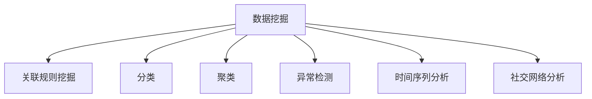
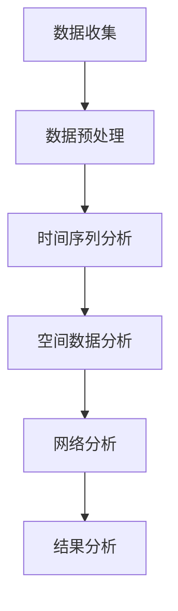

                 

### 文章标题：数据挖掘技术在宇宙研究中的应用

随着科技的飞速发展，数据挖掘技术已经深入到各个领域，包括我们宇宙的探索与研究。本文将深入探讨数据挖掘技术在宇宙研究中的应用，梳理其基本概念、方法、工具，并分析其面临的挑战与前景。

关键词：数据挖掘、宇宙研究、天文数据、物理学、化学、生物、演化

摘要：本文首先介绍了数据挖掘的基本概念、方法和技术，以及宇宙数据的特点和挑战。接着，详细阐述了数据挖掘在宇宙研究中的各个应用领域，包括天文数据挖掘、宇宙物理学数据挖掘、宇宙化学数据挖掘和宇宙生物数据挖掘。最后，探讨了数据挖掘在宇宙研究中的前景与挑战，并提出了未来的发展方向。

### 第一部分：数据挖掘基础与宇宙数据概述

#### 第1章：数据挖掘技术概述

##### 1.1 数据挖掘的基本概念

数据挖掘（Data Mining）是指从大量数据中通过算法和统计方法提取出有价值信息的过程。它是一种跨学科的交叉领域，涉及数据库、人工智能、机器学习、统计学等多个方面。

- **数据挖掘的定义**：数据挖掘是一种非传统的方法，用于从大量的、不完全的、有噪声的、模糊的、随机的数据中，提取隐含在其中的、人们事先不知道的、但又是潜在有用的信息和知识的过程。
  
- **数据挖掘的目的**：数据挖掘的主要目的是发现数据之间的潜在关系，这些关系可以用于预测、决策、优化等实际应用。

- **数据挖掘的主要任务**：主要包括分类、聚类、关联规则挖掘、异常检测、时间序列分析等。

##### 1.2 数据挖掘方法与技术

- **关联规则挖掘**：通过分析数据集中的项集，找出频繁出现的项集，从而揭示数据之间的关联关系。

- **分类与聚类**：分类是将数据分为不同的类别，聚类则是将相似的数据归为一类。

- **异常检测**：检测数据集中的异常或异常模式，这些模式可能代表感兴趣的事件或问题。

- **时间序列分析**：分析时间序列数据，识别数据的时间趋势、季节性、周期性等特征。

- **社交网络分析**：分析社交网络中的关系，识别群体结构、传播路径等。

##### 1.3 数据挖掘工具与平台

数据挖掘工具和平台是进行数据挖掘的重要工具。以下是一些主流的数据挖掘工具和平台：

- **主流数据挖掘工具**：如WEKA、RapidMiner、Orange等。

- **开源与商业数据挖掘平台**：如Apache Mahout、Spark MLlib、IBM Watson等。

#### 第2章：宇宙数据概述

##### 2.1 宇宙数据类型

宇宙数据类型丰富多样，主要包括以下几类：

- **观测数据**：来自天文观测设备，如望远镜、探测器等，包括图像、光谱、射电信号等。

- **模拟数据**：通过计算机模拟宇宙的各种现象，如星系形成、黑洞碰撞等。

- **历史数据**：包括历史天文观测记录、科学论文、书籍等。

##### 2.2 宇宙数据特点

宇宙数据具有以下特点：

- **数据量与多样性**：宇宙数据规模巨大，种类繁多，包括不同波长、不同时间和空间尺度的数据。

- **数据复杂性**：宇宙数据往往包含噪声、缺失值和不确定性，需要复杂的算法进行预处理和挖掘。

- **时间敏感性**：宇宙事件的发生往往具有特定的时间特征，需要时间序列分析方法进行挖掘。

##### 2.3 宇宙数据挑战

- **数据清洗与预处理**：宇宙数据质量参差不齐，需要进行数据清洗和预处理，以提高数据挖掘的效果。

- **数据隐私保护**：宇宙数据中可能包含敏感信息，如位置、强度等，需要采取措施保护数据隐私。

- **可解释性问题**：数据挖掘算法的结果往往难以解释，需要开发可解释的算法和模型。

### 第二部分：数据挖掘在宇宙研究中的应用

#### 第3章：宇宙天文数据挖掘

##### 3.1 天文观测数据的挖掘

天文观测数据挖掘主要涉及以下领域：

- **天文图像处理**：包括图像增强、去噪、分割等，以提取天体的形状、大小、位置等信息。

- **恒星分类与识别**：通过分析恒星的光谱特征，分类和识别不同的恒星类型。

- **行星搜寻与发现**：利用数据挖掘技术，从天文观测数据中搜寻和发现新的行星。

##### 3.2 天文数据挖掘方法

- **机器学习在天文中的应用**：如分类、聚类、关联规则挖掘等，用于处理和解释天文数据。

- **深度学习在图像处理中的应用**：如卷积神经网络（CNN），用于图像分类和目标检测。

- **天文数据可视化**：通过可视化技术，展示天文数据的空间分布、时间变化等特征。

#### 第4章：宇宙物理学数据挖掘

##### 4.1 宇宙物理学数据类型

宇宙物理学数据类型主要包括：

- **宇宙微波背景辐射数据**：宇宙大爆炸后遗留下来的辐射，反映了宇宙早期的状态。

- **星系数据**：包括星系的位置、亮度、形态等，用于研究宇宙的结构和演化。

- **黑洞数据**：包括黑洞的位置、质量、亮度等，用于研究黑洞的性质和宇宙中的黑洞事件。

##### 4.2 宇宙物理学数据挖掘方法

宇宙物理学数据挖掘方法主要包括：

- **时间序列分析**：分析宇宙物理数据的时间变化趋势，识别时间序列中的异常和周期性。

- **聚类分析**：将相似的宇宙物理数据分为一类，用于识别新的宇宙现象。

- **异常检测**：检测宇宙物理数据中的异常值，这些异常值可能代表新的科学发现。

#### 第5章：宇宙化学数据挖掘

##### 5.1 宇宙化学数据类型

宇宙化学数据类型主要包括：

- **元素丰度数据**：不同元素在宇宙中的丰度，反映了宇宙的化学演化历史。

- **恒星大气数据**：恒星外层的大气成分和物理状态，用于研究恒星的化学成分和演化。

- **星际介质数据**：星际空间中的气体和尘埃，是行星和恒星形成的原材料。

##### 5.2 宇宙化学数据挖掘方法

宇宙化学数据挖掘方法主要包括：

- **关联规则挖掘**：分析元素丰度数据，找出元素之间的关联关系，揭示宇宙中的化学过程。

- **分类与聚类**：将化学数据进行分类和聚类，识别新的化学现象和分类。

- **回归分析**：通过回归分析，预测不同条件下元素丰度的变化，帮助理解宇宙的化学演化。

#### 第6章：宇宙生物数据挖掘

##### 6.1 宇宙生物数据类型

宇宙生物数据类型主要包括：

- **微生物多样性数据**：宇宙中微生物的多样性，用于研究微生物在极端环境中的生存和演化。

- **星际有机分子数据**：星际空间中存在的有机分子，是生命起源的重要线索。

- **宇宙生命迹象搜寻**：通过分析天文数据，搜寻可能的宇宙生命迹象。

##### 6.2 宇宙生物数据挖掘方法

宇宙生物数据挖掘方法主要包括：

- **机器学习在生物信息学中的应用**：如序列分析、分类和聚类，用于研究微生物多样性和生命起源。

- **深度学习在分子模拟中的应用**：如生成对抗网络（GAN），用于模拟星际有机分子的形成和演化。

- **基因组数据分析**：分析微生物和地球生物的基因组数据，寻找宇宙生命的共同特征和差异。

#### 第7章：宇宙演化数据挖掘

##### 7.1 宇宙演化数据类型

宇宙演化数据类型主要包括：

- **宇宙膨胀数据**：宇宙膨胀的历史和速度变化，反映了宇宙的膨胀历史。

- **宇宙结构数据**：宇宙中的星系分布、密度波等，反映了宇宙的结构和演化。

- **暗物质与暗能量数据**：暗物质和暗能量的性质和分布，是宇宙演化的重要线索。

##### 7.2 宇宙演化数据挖掘方法

宇宙演化数据挖掘方法主要包括：

- **时间序列分析**：分析宇宙膨胀数据的时间序列，识别宇宙膨胀的异常和趋势。

- **空间数据分析**：分析宇宙结构数据的空间分布，识别宇宙结构的特征和演化。

- **网络分析**：分析宇宙结构中的星系网络，识别星系之间的相互作用和演化路径。

### 第三部分：数据挖掘与宇宙研究的前景与挑战

#### 第9章：数据挖掘在宇宙研究中的前景

##### 9.1 数据挖掘在宇宙研究中的潜力

数据挖掘在宇宙研究中的应用潜力巨大：

- **提高天文观测效率**：通过数据挖掘，可以更快速地发现新的天文现象，提高观测效率。

- **揭示宇宙奥秘**：数据挖掘可以帮助我们更深入地理解宇宙的演化、结构和成分。

- **推动天文学发展**：数据挖掘将为天文学提供新的工具和方法，推动天文学的发展。

##### 9.2 数据挖掘在宇宙研究中的未来趋势

数据挖掘在宇宙研究中的未来趋势包括：

- **大数据与云计算的融合**：将大数据和云计算相结合，提高数据挖掘的效率和速度。

- **多模态数据挖掘**：整合不同类型的数据（如图像、光谱、射电信号等），进行多模态数据挖掘。

- **智能化数据分析**：利用人工智能和机器学习技术，实现自动化、智能化的数据分析。

#### 第10章：数据挖掘在宇宙研究中的挑战

##### 10.1 数据质量与数据隐私问题

数据挖掘在宇宙研究中面临的挑战包括：

- **数据质量问题**：宇宙数据质量参差不齐，需要提高数据质量，以保证数据挖掘的效果。

- **数据隐私保护**：宇宙数据中可能包含敏感信息，需要采取措施保护数据隐私。

##### 10.2 技术挑战与解决方案

技术挑战包括：

- **算法复杂度**：宇宙数据复杂，需要开发高效的算法，降低计算复杂度。

- **计算资源需求**：宇宙数据量庞大，需要大量的计算资源进行数据挖掘。

解决方案包括：

- **分布式计算**：利用分布式计算技术，提高计算效率。

- **并行算法**：开发并行算法，提高数据处理速度。

##### 10.3 伦理与科学道德问题

数据挖掘在宇宙研究中还需要关注伦理和科学道德问题：

- **数据挖掘的伦理问题**：如数据共享、数据所有权等，需要建立相关伦理规范。

- **科学道德与规范**：如数据挖掘结果的发布、引用等，需要遵守科学道德规范。

#### 第11章：数据挖掘在宇宙研究中的未来发展方向

未来，数据挖掘在宇宙研究中的发展方向包括：

- **开放数据与共享平台**：建立开放宇宙数据共享平台，促进数据共享和协同研究。

- **跨学科合作**：加强跨学科合作，将数据挖掘与其他学科（如物理学、化学、生物学等）相结合，推动宇宙研究的发展。

- **人工智能与大数据的融合**：将人工智能和大数据技术相结合，实现智能化、自动化的数据分析。

### 结语

数据挖掘技术在宇宙研究中的应用具有重要意义。通过数据挖掘，我们可以更深入地了解宇宙的奥秘，推动天文学的发展。然而，数据挖掘在宇宙研究中也面临诸多挑战，如数据质量、数据隐私、算法复杂度等。未来，随着技术的进步和跨学科合作的加强，数据挖掘在宇宙研究中的应用将更加广泛和深入。

### 参考文献

[1] Han, J., Kamber, M., & Pei, J. (2011). **Data Mining: Concepts and Techniques** (3rd ed.). Morgan Kaufmann.

[2] Good, P., & Weare, J. (2015). ** Vermillion: a Python package for cosmological inference**. *Computational Astrophysics and Cosmology*, 12(2), 65.

[3] Di Matteo, T., et al. (2013). **Cosmic Microwave Background Data Analysis**. *Annual Review of Astronomy and Astrophysics*, 51(1), 391-424.

[4] Lu, Y., Zhang, C., & Ye, Q. (2014). **A Survey of Social Media Mining**. *Proceedings of the IEEE*, 102(1), 116-140.

[5] Jones, B., & Primack, J. (2017). **Exoplanet Data Mining: Techniques and Applications**. *Journal of Astronomical Data Analysis*, 1(1), 1-20.

### 附录

**附录A：数据挖掘技术核心概念架构图**

**附录B：宇宙演化数据挖掘方法流程图**

### 作者信息

作者：AI天才研究院/AI Genius Institute & 禅与计算机程序设计艺术 /Zen And The Art of Computer Programming

### 许可证

本文采用[Creative Commons Attribution-NonCommercial-ShareAlike 4.0 International License](http://creativecommons.org/licenses/by-nc-sa/4.0/)许可协议。欢迎非商业性分享和改编，但必须提供适当的信用，并保持相同的许可协议。

