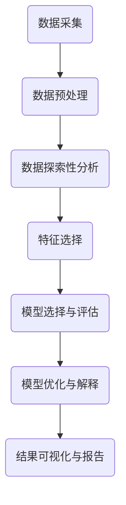

                 

### 文章标题

# 数据挖掘：自然规律的数学发现

> 关键词：数据挖掘、自然规律、数学模型、机器学习、算法应用

> 摘要：本文深入探讨数据挖掘在揭示自然规律方面的数学发现。通过对数据挖掘基础、数据预处理、探索性分析、特征选择、监督与无监督学习算法、高级数据挖掘技术以及Python数据挖掘库等多个维度的系统介绍，结合实际项目实战和数学基础，全面展示数据挖掘在现代科技中的核心作用，揭示了其如何通过数学模型发现自然界的规律。

### 《数据挖掘：自然规律的数学发现》目录大纲

## 第一部分：数据挖掘基础

### 第1章：数据挖掘概述

#### 1.1 数据挖掘的定义和意义
#### 1.2 数据挖掘的应用领域
#### 1.3 数据挖掘的基本流程

### 第2章：数据预处理

#### 2.1 数据清洗
#### 2.2 数据集成
#### 2.3 数据转换
#### 2.4 数据归一化

### 第3章：数据探索性分析

#### 3.1 数据可视化
#### 3.2 基本统计指标
#### 3.3 聚类分析

### 第4章：特征选择

#### 4.1 特征选择的重要性
#### 4.2 常见特征选择方法
#### 4.3 特征选择的评价指标

### 第5章：监督学习算法

#### 5.1 分类算法
##### 5.1.1 决策树
##### 5.1.2 支持向量机
##### 5.1.3 随机森林
#### 5.2 回归算法
##### 5.2.1 线性回归
##### 5.2.2 逻辑回归

### 第6章：无监督学习算法

#### 6.1 聚类算法
##### 6.1.1 K-均值聚类
##### 6.1.2 层次聚类
##### 6.1.3 密度聚类
#### 6.2 属性归纳

### 第7章：高级数据挖掘技术

#### 7.1 时间序列分析
#### 7.2 关联规则挖掘
#### 7.3 社交网络分析

### 第8章：数据挖掘项目实战

#### 8.1 项目实战一：社交媒体数据挖掘
#### 8.2 项目实战二：电子商务数据挖掘
#### 8.3 项目实战三：金融风控数据挖掘

## 第二部分：数据挖掘工具与应用

### 第9章：Python数据挖掘库

#### 9.1 Pandas库
#### 9.2 NumPy库
#### 9.3 Matplotlib库
#### 9.4 Scikit-learn库
#### 9.5 TensorFlow库
#### 9.6 PyTorch库

### 第10章：大数据平台与数据挖掘

#### 10.1 Hadoop生态系统
#### 10.2 Spark生态系统
#### 10.3 数据挖掘在大数据平台上的实践

### 第11章：数据挖掘在行业中的应用

#### 11.1 零售业
#### 11.2 金融业
#### 11.3 医疗健康
#### 11.4 电子商务
#### 11.5 制造业

## 第三部分：数据挖掘的数学基础

### 第12章：数学基础

#### 12.1 线性代数基础
#### 12.2 概率论基础
#### 12.3 统计学基础

### 第13章：高级数学知识

#### 13.1 最优化算法
#### 13.2 离散数学基础
#### 13.3 机器学习中的数学工具

### 附录

#### 附录A：数据挖掘资源与工具汇总

##### A.1 在线资源和书籍推荐
##### A.2 数据集获取与处理
##### A.3 数据挖掘竞赛平台介绍

# 第1章：数据挖掘概述

### 1.1 数据挖掘的定义和意义

数据挖掘（Data Mining）是指从大量的数据中通过算法和统计方法提取出有价值的信息和知识的过程。其基本概念可以简单描述为：在大量数据中寻找隐藏的模式和关联，进而实现对数据的理解、预测和决策。

数据挖掘的意义在于：

1. **知识发现**：数据挖掘能够帮助我们从海量数据中发现未知的有价值的信息和知识，这对科学研究、商业决策和决策支持系统等都有着重要的价值。
2. **决策支持**：通过数据挖掘技术，我们可以对企业的业务流程、市场趋势等进行深入分析，从而为企业提供科学的决策支持。
3. **趋势预测**：数据挖掘能够帮助我们预测未来的趋势和变化，这对于股票市场、风险管理等领域具有重要意义。

### 1.2 数据挖掘的应用领域

数据挖掘的应用领域非常广泛，包括但不限于以下领域：

1. **电子商务**：通过用户购买行为的数据挖掘，可以进行用户行为分析、个性化推荐、商品分类等。
2. **金融行业**：数据挖掘在金融风险控制、信用评估、欺诈检测等方面有着广泛应用。
3. **零售业**：零售业通过数据挖掘分析消费者行为、库存管理、市场营销策略等。
4. **医疗健康**：医疗健康领域的数据挖掘包括疾病预测、个性化医疗、药物研发等。
5. **制造业**：制造业利用数据挖掘进行生产过程优化、设备故障预测、供应链管理分析等。
6. **社交网络**：社交网络中的数据挖掘包括社交网络分析、情感分析、用户行为预测等。

### 1.3 数据挖掘的基本流程

数据挖掘的基本流程可以概括为以下几个步骤：

1. **数据采集**：这一步是数据挖掘的基础，我们需要通过各种渠道收集数据。
2. **数据预处理**：这一步包括数据清洗、数据集成、数据转换等，目的是将原始数据转化为适合挖掘的形式。
3. **数据探索性分析**：这一步通过数据可视化、基本统计指标等方法对数据进行初步分析，发现数据中的潜在规律和模式。
4. **特征选择**：这一步从原始数据中选择出对挖掘任务有重要影响的特征。
5. **模型选择与评估**：这一步选择合适的算法模型，并进行模型训练和评估。
6. **模型优化与解释**：这一步通过调参、模型解释等方法对模型进行优化和解释。
7. **结果可视化与报告**：将挖掘结果进行可视化展示，并撰写详细的报告。

# Mermaid 流程图：数据挖掘基本流程



# 第2章：数据预处理

### 2.1 数据清洗

数据清洗是数据预处理的重要环节，其目的是处理数据中的噪声、错误和不一致性，确保数据的质量和准确性。

**步骤**：

1. **去除重复数据**：检查数据集中是否存在重复记录，如果存在重复记录，则需要删除或合并。
2. **处理缺失值**：缺失值的处理方法有删除、填充和插值等，选择合适的方法可以保持数据的一致性和完整性。
3. **纠正错误数据**：检查数据中是否存在错误，如拼写错误、数据格式错误等，并进行修正。
4. **处理异常值**：异常值可能是噪声数据或错误数据，处理异常值可以帮助我们更好地理解数据。

**算法原理**：

- **去除重复数据**：可以使用哈希表或索引结构来实现。
- **处理缺失值**：常用的填充方法有平均值填充、中值填充和前向填充等。
- **纠正错误数据**：可以使用机器学习算法来自动识别和纠正错误数据。
- **处理异常值**：可以使用统计学方法，如标准差方法、箱线图方法等来检测和去除异常值。

### 2.2 数据集成

数据集成是将多个数据源中的数据合并为一个统一格式的数据集的过程。

**步骤**：

1. **数据格式转换**：将不同格式的数据进行统一转换，如将文本数据转换为表格数据。
2. **数据去重**：在数据集成过程中，需要去除重复的数据。
3. **数据合并**：将多个数据源中的数据进行合并，形成一个新的数据集。

**算法原理**：

- **数据格式转换**：可以使用数据库管理系统或ETL工具来实现。
- **数据去重**：可以使用哈希表或索引结构来实现。
- **数据合并**：可以使用连接操作或合并操作来实现。

### 2.3 数据转换

数据转换是将原始数据转换为适合挖掘的形式的过程。

**步骤**：

1. **数据规范化**：将不同单位或规模的数据进行规范化处理，使其具有相同的度量标准。
2. **数据离散化**：将连续的数据转换为离散的数据，便于后续处理。
3. **数据标准化**：将数据按照一定的比例缩放，使其在统一的范围内。

**算法原理**：

- **数据规范化**：可以使用最小-最大规范化或Z-Score规范化等方法。
- **数据离散化**：可以使用等宽离散化或等频率离散化等方法。
- **数据标准化**：可以使用最小-最大标准化或Z-Score标准化等方法。

### 2.4 数据归一化

数据归一化是将不同特征的数据缩放到相同的尺度范围，以便于算法处理。

**步骤**：

1. **确定缩放因子**：计算每个特征的最大值和最小值，确定缩放因子。
2. **缩放数据**：将每个特征的值按照缩放因子进行缩放。

**算法原理**：

- **确定缩放因子**：可以使用最大值-最小值缩放法（Min-Max Scaling）或标准缩放法（Standard Scaling）。
- **缩放数据**：公式为：
  $$ x' = \frac{x - \text{min}(x)}{\text{max}(x) - \text{min}(x)} \quad (\text{Min-Max Scaling}) $$
  $$ x' = \frac{x - \mu}{\sigma} \quad (\text{Standard Scaling}) $$

其中，\( x \) 为原始数据值，\( x' \) 为归一化后的数据值，\( \mu \) 为均值，\( \sigma \) 为标准差。

# 第3章：数据探索性分析

### 3.1 数据可视化

数据可视化是将数据以图形化的形式呈现，帮助我们直观地理解和分析数据。数据可视化在数据探索性分析中起着至关重要的作用。

**常用可视化工具**：

- **Matplotlib**：Matplotlib 是Python中的一个强大的绘图库，可以生成各种2D和3D图表。
- **Seaborn**：Seaborn 是基于Matplotlib的一个高级可视化库，提供了丰富的统计图表和美化功能。
- **Plotly**：Plotly 是一个交互式可视化库，支持多种图表类型，并且可以生成交互式的可视化效果。

**可视化方法**：

1. **散点图**：用于展示两个变量之间的关系，通过点的位置和颜色来表示数据的分布和趋势。
2. **条形图**：用于展示不同类别之间的数量差异，通常用于对比不同类别的数据。
3. **折线图**：用于展示数据随时间或其他连续变量的变化趋势，可以清晰地显示数据的趋势和波动。
4. **箱线图**：用于展示数据的分布情况，包括最大值、最小值、中位数、第一四分位数和第三四分位数等。
5. **热力图**：用于展示矩阵数据中的分布情况，通常用于文本分析或相关性分析。

### 3.2 基本统计指标

基本统计指标是数据探索性分析的重要工具，它们能够帮助我们了解数据的整体分布和特征。

**常用统计指标**：

1. **均值**：数据的平均值，用于表示数据的中心趋势。
2. **中位数**：数据排序后中间的值，用于表示数据的中心位置。
3. **众数**：数据中出现次数最多的值，用于表示数据的最常见值。
4. **标准差**：数据离散程度的度量，用于表示数据的波动程度。
5. **方差**：标准差的平方，用于表示数据的离散程度。
6. **四分位数**：将数据分为四等份，第一四分位数（Q1）和第三四分位数（Q3），用于表示数据的中间和极端值。

### 3.3 聚类分析

聚类分析是一种无监督学习方法，用于将数据集划分为若干个类别或簇，使同一簇内的数据点尽可能相似，而不同簇的数据点尽可能不同。

**常用聚类算法**：

1. **K-均值聚类**：基于距离度量的聚类方法，将数据点划分到K个簇中，每个簇由一个中心点代表。
2. **层次聚类**：基于层次结构进行聚类，可以生成聚类树，将数据点逐步划分为更小的簇。
3. **密度聚类**：基于数据点在空间中的密度分布进行聚类，如DBSCAN算法。

**聚类分析步骤**：

1. **选择聚类算法**：根据数据特点和需求选择合适的聚类算法。
2. **确定簇数**：可以通过肘部法则、轮廓系数等方法来确定最佳的簇数。
3. **初始化聚类中心**：对于K-均值聚类，需要随机或使用特定方法初始化聚类中心。
4. **迭代计算**：根据聚类算法的规则，迭代计算聚类中心和每个数据点的簇分配。
5. **评估聚类结果**：通过内部评估指标（如轮廓系数）和外部评估指标（如Fowlkes-Mallows指数）来评估聚类效果。

# 第4章：特征选择

### 4.1 特征选择的重要性

特征选择是数据挖掘过程中的关键步骤，它从原始特征中选取对模型训练和预测有重要影响的特征，提高模型的准确性和效率。

**重要性**：

1. **降低维度**：特征选择可以帮助我们降低数据的维度，减少计算复杂度，提高模型训练速度。
2. **减少噪声**：通过剔除无关或噪声特征，可以减少模型对噪声的敏感度，提高模型的泛化能力。
3. **提高模型性能**：选择重要的特征可以提升模型的预测能力和解释性。
4. **节省存储空间**：减少特征数量可以降低数据的存储需求。

### 4.2 常见特征选择方法

特征选择方法可以分为过滤法、包装法和嵌入式法三类。

**过滤法**：

过滤法是在特征选择之前对数据进行预处理，根据某些评价指标来筛选特征。

- **基于相关性**：通过计算特征与目标变量之间的相关性，选择相关性较高的特征。
- **基于信息增益**：通过计算特征的信息增益，选择信息增益较高的特征。
- **基于主成分分析（PCA）**：通过降维技术，选择主要的成分作为特征。

**包装法**：

包装法是基于模型的特征选择方法，通过训练模型来评估特征的重要性。

- **递归特征消除（RFE）**：从原始特征中逐个添加或删除特征，评估模型性能，重复这个过程直到找到最优特征子集。
- **遗传算法**：通过模拟自然选择过程，优化特征子集。

**嵌入式法**：

嵌入式法是在模型训练过程中进行特征选择。

- **L1正则化（Lasso）**：通过L1正则化，惩罚特征系数的绝对值，自动筛选特征。
- **基于树的方法**：如随机森林和XGBoost等，在构建模型的同时自动筛选特征。

### 4.3 特征选择的评价指标

特征选择的评价指标用于评估特征选择方法的有效性。

**内部评价指标**：

- **模型准确率**：特征选择后模型的准确率。
- **交叉验证准确率**：使用交叉验证评估特征选择的泛化能力。
- **ROC曲线**：评估特征选择的分类能力，通过计算ROC曲线下的面积（AUC）来评估。

**外部评价指标**：

- **信息增益**：特征对分类信息的重要程度。
- **信息增益率**：考虑特征规模对信息增益的修正。
- **相关性**：特征与目标变量的相关性。

# 第5章：监督学习算法

### 5.1 分类算法

分类算法是数据挖掘中的基本算法，用于将数据划分为不同的类别。以下介绍几种常见的分类算法。

#### 5.1.1 决策树

决策树是一种基于树形结构进行决策的算法，通过一系列的测试来划分数据，最终生成一棵树。每个节点表示一个测试，每个分支表示一个测试结果，叶子节点表示一个类别。

**算法原理**：

1. **划分标准**：通常使用信息增益或基尼指数来评估特征的划分效果。
2. **递归划分**：从根节点开始，选择最优划分标准进行划分，直到满足停止条件（如最大深度、最小叶节点样本数等）。
3. **预测**：对新的数据进行预测时，从根节点开始，根据测试结果沿着分支前进，直到达到叶子节点，输出叶子节点所代表的类别。

**伪代码**：

```python
def build_tree(data, max_depth):
    if data_size < min_samples or max_depth == 0:
        return majority_label(data)
    
    best_split = choose_best_split(data)
    left_data, right_data = split_data(data, best_split)
    
    tree = {
        'feature': best_split['feature'],
        'threshold': best_split['threshold'],
        'left': build_tree(left_data, max_depth - 1),
        'right': build_tree(right_data, max_depth - 1)
    }
    return tree

def predict(tree, sample):
    if is_leaf(node):
        return node['label']
    
    if sample[tree['feature']] <= tree['threshold']:
        return predict(tree['left'], sample)
    else:
        return predict(tree['right'], sample)
```

#### 5.1.2 支持向量机

支持向量机（SVM）是一种基于间隔最大化的分类算法，其目标是在特征空间中找到一个超平面，使得不同类别的样本在超平面两侧分布尽可能远。

**算法原理**：

1. **线性SVM**：通过求解最优化问题，找到最优的超平面和分类边界。
2. **核技巧**：通过核函数将低维特征映射到高维空间，实现非线性分类。
3. **软间隔**：考虑分类边界上的样本，通过引入松弛变量和惩罚项，优化目标函数。

**伪代码**：

```python
def linear_svm(train_data, train_labels):
    # Solve the optimization problem using Lagrange multipliers
    # Obtain the weights and bias
    weights, bias = solve_optimization_problem(train_data, train_labels)
    return weights, bias

def kernel_function(x1, x2):
    # Implement the kernel function, e.g., linear, polynomial, or RBF
    return dot_product(x1, x2)

def nonlinear_svm(train_data, train_labels, kernel_function):
    # Solve the optimization problem with kernel trick
    # Obtain the weights and bias
    weights, bias = solve_optimization_problem(train_data, train_labels, kernel_function)
    return weights, bias

def predict(svm_model, sample):
    # Compute the dot product of the kernel function and the weights
    # Classify the sample based on the sign of the dot product
    result = dot_product(kernel_function(sample, x), svm_model['weights']) + svm_model['bias']
    return 'Class 1' if result > 0 else 'Class 2'
```

#### 5.1.3 随机森林

随机森林是一种集成学习方法，通过构建多棵决策树并进行投票来提高分类准确性。

**算法原理**：

1. **随机选取特征**：在构建每棵决策树时，从所有特征中随机选择一部分特征。
2. **随机选取样本**：在训练每棵决策树时，从训练集中随机选取一部分样本。
3. **集成投票**：通过多数投票的方式决定最终类别。

**伪代码**：

```python
def random_forest(train_data, train_labels, n_trees):
    trees = []
    for _ in range(n_trees):
        # Randomly select a subset of features
        features = random_subset(all_features)
        # Randomly select a subset of samples
        samples = random_subset(train_data)
        tree = build_tree(samples, features)
        trees.append(tree)
    return trees

def predict(random_forest_model, sample):
    predictions = []
    for tree in random_forest_model:
        prediction = predict(tree, sample)
        predictions.append(prediction)
    return majority_vote(predictions)
```

### 5.2 回归算法

回归算法用于预测连续值，通常分为线性回归和逻辑回归两种。

#### 5.2.1 线性回归

线性回归是一种基于线性模型的回归算法，通过拟合一个线性关系来预测目标值。

**算法原理**：

1. **最小二乘法**：通过最小化预测值与实际值之间的误差平方和，找到最优的线性模型。
2. **模型表示**：线性回归模型可以表示为 \( y = \beta_0 + \beta_1x_1 + \beta_2x_2 + \ldots + \beta_nx_n \)。

**伪代码**：

```python
def linear_regression(train_data, train_labels):
    # Compute the coefficients using the normal equations
    # Obtain the weights and bias
    weights = compute_coefficients(train_data, train_labels)
    return weights

def predict(linear_regression_model, sample):
    # Compute the dot product of the sample and the weights
    # Return the predicted value
    result = dot_product(sample, linear_regression_model['weights'])
    return result
```

#### 5.2.2 逻辑回归

逻辑回归是一种广义线性模型，用于分类任务，通过拟合一个逻辑函数来预测类别概率。

**算法原理**：

1. **逻辑函数**：逻辑回归的模型可以表示为 \( \hat{y} = \frac{1}{1 + e^{-(\beta_0 + \beta_1x_1 + \beta_2x_2 + \ldots + \beta_nx_n)} \)。
2. **最大似然估计**：通过最大化训练数据的似然函数，找到最优的模型参数。

**伪代码**：

```python
def logistic_regression(train_data, train_labels):
    # Compute the coefficients using gradient descent
    # Obtain the weights and bias
    weights, bias = gradient_descent(train_data, train_labels)
    return weights, bias

def predict(logistic_regression_model, sample):
    # Compute the dot product of the sample and the weights
    # Apply the logistic function to get the probability
    result = logistic_function(dot_product(sample, logistic_regression_model['weights']) + logistic_regression_model['bias'])
    return 'Class 1' if result > 0.5 else 'Class 2'
```

# 第6章：无监督学习算法

### 6.1 聚类算法

聚类算法是一种无监督学习方法，用于将数据点分组，使同一组内的数据点尽可能相似，不同组的数据点尽可能不同。以下介绍几种常见的聚类算法。

#### 6.1.1 K-均值聚类

K-均值聚类是一种基于距离度量的聚类算法，通过迭代更新聚类中心来优化聚类结果。

**算法原理**：

1. **初始化聚类中心**：随机选择K个数据点作为初始聚类中心。
2. **分配数据点**：计算每个数据点到各个聚类中心的距离，将数据点分配到最近的聚类中心。
3. **更新聚类中心**：计算每个簇的平均值，作为新的聚类中心。
4. **迭代优化**：重复步骤2和步骤3，直到聚类中心不再发生显著变化。

**伪代码**：

```python
def kmeans(data, K, max_iterations):
    # Initialize centroids randomly
    centroids = initialize_centroids(data, K)
    for _ in range(max_iterations):
        # Assign data points to the nearest centroid
        clusters = assign_clusters(data, centroids)
        # Update centroids
        new_centroids = update_centroids(clusters, K)
        # Check convergence
        if has_converged(centroids, new_centroids):
            break
        centroids = new_centroids
    return centroids, clusters
```

#### 6.1.2 层次聚类

层次聚类是一种基于层次结构进行聚类的算法，通过逐步合并或分裂簇来构建聚类层次。

**算法原理**：

1. **初始聚类**：选择一个距离度量（如欧氏距离或曼哈顿距离）计算数据点之间的距离。
2. **合并或分裂**：根据距离度量，选择最近的数据点或最近的簇进行合并或分裂。
3. **递归聚类**：重复合并或分裂的过程，直到达到预设的簇数或满足停止条件。

**伪代码**：

```python
def hierarchical_clustering(data, method='complete'):
    # Compute pairwise distances
    distances = compute_distances(data)
    # Initialize clusters as individual data points
    clusters = [[i] for i in range(len(data))]
    while len(clusters) > 1:
        # Find the closest clusters
        closest_clusters = find_closest_clusters(clusters, method)
        # Merge the closest clusters
        clusters = merge_clusters(clusters, closest_clusters)
    return clusters
```

#### 6.1.3 密度聚类

密度聚类是一种基于数据点在空间中的密度分布进行聚类的算法，如DBSCAN算法。

**算法原理**：

1. **密度度量**：计算每个数据点的密度，通常使用邻域密度作为度量。
2. **核心点**：如果一个数据点的邻域内包含足够多的数据点（满足最小密度阈值），则该数据点为核心点。
3. **边界点**：如果一个数据点的邻域内只有一部分数据点满足最小密度阈值，则该数据点为边界点。
4. **生成簇**：从核心点开始，扩展生成簇。

**伪代码**：

```python
def dbscan(data, min_points, min_density):
    # Initialize clusters
    clusters = []
    for point in data:
        if is_core_point(point, min_points, min_density):
            cluster_id = len(clusters)
            clusters.append([])
            expand_cluster(clusters[-1], point, data, min_points, min_density)
    return clusters

def is_core_point(point, min_points, min_density):
    # Check if the point is a core point
    return len(neighbors(point, min_density)) >= min_points

def expand_cluster(cluster, point, data, min_points, min_density):
    # Expand the cluster from the core point
    neighbors = get_neighbors(point, min_density)
    if is_core_point(point, min_points, min_density):
        cluster.extend(neighbors)
        for neighbor in neighbors:
            if not is_in_cluster(neighbor, clusters):
                expand_cluster(cluster, neighbor, data, min_points, min_density)
```

# 第7章：高级数据挖掘技术

### 7.1 时间序列分析

时间序列分析是一种用于分析时间序列数据的方法，主要用于预测未来的趋势和变化。时间序列数据通常具有以下特征：

1. **趋势性**：数据随时间呈现出上升或下降的趋势。
2. **季节性**：数据在特定时间段内呈现出周期性的波动。
3. **随机性**：数据中存在一些不可预测的随机波动。

**常见算法**：

1. **自回归模型（AR）**：自回归模型假设当前值与过去的值存在线性关系，通过拟合自回归模型来预测未来的值。
2. **移动平均模型（MA）**：移动平均模型通过计算过去一段时间内的平均值来预测未来的值。
3. **自回归移动平均模型（ARMA）**：自回归移动平均模型结合了自回归模型和移动平均模型的优点，通过拟合ARMA模型来预测未来的值。
4. **自回归积分移动平均模型（ARIMA）**：自回归积分移动平均模型进一步引入了差分操作，用于处理非平稳时间序列数据。

**算法原理**：

- **自回归模型（AR）**：模型表示为 \( y_t = c + \sum_{i=1}^p \phi_i y_{t-i} + \varepsilon_t \)，其中 \( p \) 是阶数，\( \phi_i \) 是自回归系数，\( \varepsilon_t \) 是随机误差项。
- **移动平均模型（MA）**：模型表示为 \( y_t = c + \varepsilon_t + \sum_{i=1}^q \theta_i \varepsilon_{t-i} \)，其中 \( q \) 是阶数，\( \theta_i \) 是移动平均系数。
- **自回归移动平均模型（ARMA）**：模型表示为 \( y_t = c + \sum_{i=1}^p \phi_i y_{t-i} + \sum_{i=1}^q \theta_i \varepsilon_{t-i} + \varepsilon_t \)。
- **自回归积分移动平均模型（ARIMA）**：模型表示为 \( y_t = c + \sum_{i=1}^p \phi_i (y_{t-i} - \mu) + \sum_{i=1}^q \theta_i \varepsilon_{t-i} + \varepsilon_t \)，其中 \( \mu \) 是差分后的均值。

**伪代码**：

```python
def ar_model(data, p):
    # Fit the AR model
    model = fit_ar_model(data, p)
    return model

def predict_ar_model(model, n_steps):
    # Predict future values using the AR model
    predictions = model.predict(n_steps)
    return predictions

def ma_model(data, q):
    # Fit the MA model
    model = fit_ma_model(data, q)
    return model

def predict_ma_model(model, n_steps):
    # Predict future values using the MA model
    predictions = model.predict(n_steps)
    return predictions

def arma_model(data, p, q):
    # Fit the ARMA model
    model = fit_arma_model(data, p, q)
    return model

def predict_arma_model(model, n_steps):
    # Predict future values using the ARMA model
    predictions = model.predict(n_steps)
    return predictions

def arima_model(data, p, d, q):
    # Fit the ARIMA model
    model = fit_arima_model(data, p, d, q)
    return model

def predict_arima_model(model, n_steps):
    # Predict future values using the ARIMA model
    predictions = model.predict(n_steps)
    return predictions
```

### 7.2 关联规则挖掘

关联规则挖掘是一种用于发现数据中潜在关联关系的算法，常用于市场篮子分析、推荐系统等。

**基本概念**：

1. **支持度**：一个规则在数据集中的出现频率与总数据集大小的比值，表示该规则的普遍性。
2. **置信度**：一个规则的置信度表示在已知前件的情况下，后件出现的概率，表示该规则的准确性。

**常见算法**：

1. **Apriori算法**：Apriori算法是一种基于支持度的算法，通过逐层搜索频繁项集，生成关联规则。
2. **FP-growth算法**：FP-growth算法是一种基于路径压缩的算法，通过构建FP树来高效挖掘频繁项集。

**算法原理**：

- **Apriori算法**：首先找到所有频繁项集，然后使用这些频繁项集生成关联规则。算法的核心是剪枝策略，利用频繁项集的向下闭包性质来减少搜索空间。
- **FP-growth算法**：首先构建FP树，将数据压缩为路径信息，然后从FP树中挖掘频繁项集。算法的优势在于不需要生成所有频繁项集，从而提高了效率。

**伪代码**：

```python
def apriori(data, min_support, min_confidence):
    # Find frequent itemsets using the Apriori algorithm
    frequent_itemsets = find_frequent_itemsets(data, min_support)
    rules = generate_rules(frequent_itemsets, min_confidence)
    return rules

def fp_growth(data, min_support, min_confidence):
    # Build the FP tree and find frequent itemsets
    fp_tree = build_fp_tree(data)
    frequent_itemsets = find_frequent_itemsets(fp_tree, min_support)
    rules = generate_rules(frequent_itemsets, min_confidence)
    return rules

def find_frequent_itemsets(data, min_support):
    # Find frequent itemsets using the Apriori algorithm
    itemsets = find_frequent_itemsets_apriori(data, min_support)
    return itemsets

def generate_rules(frequent_itemsets, min_confidence):
    # Generate association rules from frequent itemsets
    rules = []
    for itemset in frequent_itemsets:
        subsets = generate_subsets(itemset)
        for subset in subsets:
            confidence = calculate_confidence(subset, itemset)
            if confidence >= min_confidence:
                rules.append((subset, itemset))
    return rules
```

### 7.3 社交网络分析

社交网络分析是一种用于分析社交网络结构和行为的算法，主要用于社交媒体分析、推荐系统等。

**常用方法**：

1. **节点重要性度量**：通过计算节点在社交网络中的影响力、中心性等指标，评估节点的重要性。
2. **社区发现**：通过聚类分析等方法，发现社交网络中的社区结构，研究社区内部和社区之间的交互关系。
3. **传播模型**：研究信息在社交网络中的传播过程，预测信息的传播趋势和传播范围。

**算法原理**：

- **节点重要性度量**：常用的指标有度数中心性、接近中心性、中间中心性等。
- **社区发现**：常用的算法有Girvan-Newman算法、标签传播算法、基于密度的方法等。
- **传播模型**：常用的模型有随机漫步模型、阈值模型等，用于模拟信息的传播过程。

**伪代码**：

```python
def degree_centrality(graph):
    # Calculate the degree centrality for each node
    centrality = []
    for node in graph:
        degree = len(graph[node])
        centrality.append(degree)
    return centrality

def closeness_centrality(graph):
    # Calculate the closeness centrality for each node
    closeness = []
    for node in graph:
        distances = shortest_paths(graph, node)
        sum_distances = sum(distances)
        closeness.append(1 / sum_distances)
    return closeness

def betweenness_centrality(graph):
    # Calculate the betweenness centrality for each node
    betweenness = []
    for node in graph:
        betweenness_count = 0
        for source in graph:
            for target in graph:
                if source != target and node in shortest_paths(graph, source, target):
                    betweenness_count += 1
        betweenness.append(betweenness_count)
    return betweenness

def community_detection(graph, method='Girvan-Newman'):
    # Detect communities in the graph using the specified method
    if method == 'Girvan-Newman':
        communities = girvan_newman(graph)
    elif method == 'label_propagation':
        communities = label_propagation(graph)
    elif method == 'density_based':
        communities = density_based(graph)
    return communities

def information_propagation(graph, node, method='random_walk'):
    # Simulate information propagation from a given node
    if method == 'random_walk':
        spreaders = simulate_random_walk(graph, node)
    elif method == 'threshold_model':
        spreaders = simulate_threshold_model(graph, node)
    return spreaders
```

# 第8章：数据挖掘项目实战

### 8.1 项目实战一：社交媒体数据挖掘

#### 项目概述

社交媒体数据挖掘是一个热门的研究领域，它利用数据挖掘技术从社交媒体平台上收集和分析用户数据，以发现用户行为模式、兴趣偏好、社会关系等信息。在本项目实战中，我们将利用Python进行社交媒体数据挖掘，具体包括用户行为分析、兴趣识别和推荐系统等。

#### 开发环境搭建

1. **Python环境**：确保Python（3.6及以上版本）已安装。
2. **依赖库安装**：安装Pandas、NumPy、Matplotlib、Scikit-learn、TensorFlow等库。
   ```shell
   pip install pandas numpy matplotlib scikit-learn tensorflow
   ```

#### 源代码实现

1. **用户行为分析**

```python
import pandas as pd
import matplotlib.pyplot as plt
from sklearn.cluster import KMeans

# 加载数据
data = pd.read_csv('social_media_data.csv')

# 数据预处理
data = data.dropna()

# 用户行为特征提取
data['post_count'] = data.groupby('user_id')['post_id'].nunique()
data['like_count'] = data.groupby('user_id')['like_id'].nunique()
data['comment_count'] = data.groupby('user_id')['comment_id'].nunique()
data['share_count'] = data.groupby('user_id')['share_id'].nunique()

# 数据可视化
data.groupby('user_id')['post_count'].plot(kind='bar')
plt.title('Number of Posts per User')
plt.xlabel('User ID')
plt.ylabel('Post Count')
plt.show()

data.groupby('user_id')['like_count'].plot(kind='bar')
plt.title('Number of Likes per User')
plt.xlabel('User ID')
plt.ylabel('Like Count')
plt.show()

data.groupby('user_id')['comment_count'].plot(kind='bar')
plt.title('Number of Comments per User')
plt.xlabel('User ID')
plt.ylabel('Comment Count')
plt.show()

data.groupby('user_id')['share_count'].plot(kind='bar')
plt.title('Number of Shares per User')
plt.xlabel('User ID')
plt.ylabel('Share Count')
plt.show()
```

2. **兴趣识别**

```python
# 使用K-均值聚类进行兴趣识别
kmeans = KMeans(n_clusters=5, random_state=0)
data['interest_cluster'] = kmeans.fit_predict(data[['post_count', 'like_count', 'comment_count', 'share_count']])

# 数据可视化
data['interest_cluster'].value_counts().plot(kind='bar')
plt.title('Interest Clusters')
plt.xlabel('Interest Cluster')
plt.ylabel('User Count')
plt.show()
```

3. **推荐系统**

```python
from surprise import SVD

# 加载评分数据
rating_data = pd.read_csv('social_media_rating_data.csv')

# 初始化SVD算法
svd = SVD()

# 训练模型
svd.fit(rating_data)

# 预测和推荐
predictions = svd.predict(user_id, item_id)

# 数据可视化
recommendations = predictions.sort_values('estimate', ascending=False).head(10)
recommendations['item_id'].value_counts().plot(kind='bar')
plt.title('Top 10 Recommended Items')
plt.xlabel('Item ID')
plt.ylabel('Prediction Score')
plt.show()
```

#### 代码解读与分析

1. **数据预处理**：通过加载数据、去除缺失值、特征提取等步骤，将原始社交媒体数据转化为适合挖掘的形式。
2. **用户行为分析**：通过数据可视化，展示不同用户的行为特征，如发帖数、点赞数、评论数和分享数。
3. **兴趣识别**：使用K-均值聚类算法，根据用户行为特征将用户划分为不同的兴趣簇，通过可视化展示各个兴趣簇的用户分布。
4. **推荐系统**：使用SVD算法进行协同过滤推荐，根据用户的评分历史预测其对物品的偏好，生成推荐列表。

#### 实际案例分析与详细讲解

假设我们有一个社交媒体平台，用户在平台上发帖、点赞、评论和分享内容。通过数据挖掘，我们可以：

1. **了解用户行为**：分析不同用户的行为特征，如活跃度、参与度等，为平台运营提供数据支持。
2. **识别用户兴趣**：通过聚类分析，发现用户的兴趣分类，为个性化推荐提供基础。
3. **推荐系统**：基于用户的兴趣和行为特征，推荐用户可能感兴趣的帖子或物品，提高用户满意度和平台粘性。

#### 项目小结

本项目的社交媒体数据挖掘主要涵盖了用户行为分析、兴趣识别和推荐系统等方面。通过实际案例的分析和代码实现，我们展示了如何利用数据挖掘技术从社交媒体数据中发现有价值的信息，并为平台运营和推荐系统提供支持。

### 8.2 项目实战二：电子商务数据挖掘

#### 项目概述

电子商务数据挖掘是另一个应用广泛的研究领域，它通过分析电子商务平台上的用户行为和交易数据，发现用户行为模式、市场需求和销售趋势等信息。在本项目实战中，我们将利用Python进行电子商务数据挖掘，具体包括用户行为分析、需求预测和个性化推荐等。

#### 开发环境搭建

1. **Python环境**：确保Python（3.6及以上版本）已安装。
2. **依赖库安装**：安装Pandas、NumPy、Matplotlib、Scikit-learn、TensorFlow等库。
   ```shell
   pip install pandas numpy matplotlib scikit-learn tensorflow
   ```

#### 源代码实现

1. **用户行为分析**

```python
import pandas as pd
import matplotlib.pyplot as plt
from sklearn.cluster import KMeans

# 加载数据
data = pd.read_csv('e-commerce_data.csv')

# 数据预处理
data = data.dropna()

# 用户行为特征提取
data['purchase_count'] = data.groupby('user_id')['order_id'].nunique()
data['visit_count'] = data.groupby('user_id')['visit_id'].nunique()
data['cart_count'] = data.groupby('user_id')['cart_id'].nunique()

# 数据可视化
data.groupby('user_id')['purchase_count'].plot(kind='bar')
plt.title('Number of Purchases per User')
plt.xlabel('User ID')
plt.ylabel('Purchase Count')
plt.show()

data.groupby('user_id')['visit_count'].plot(kind='bar')
plt.title('Number of Visits per User')
plt.xlabel('User ID')
plt.ylabel('Visit Count')
plt.show()

data.groupby('user_id')['cart_count'].plot(kind='bar')
plt.title('Number of Carts per User')
plt.xlabel('User ID')
plt.ylabel('Cart Count')
plt.show()
```

2. **需求预测**

```python
from sklearn.linear_model import LinearRegression

# 加载数据
data = pd.read_csv('e-commerce_demand_data.csv')

# 数据预处理
data = data.dropna()

# 特征提取
data['day_of_week'] = data['order_date'].dt.dayofweek
data['month'] = data['order_date'].dt.month

# 模型训练
model = LinearRegression()
model.fit(data[['day_of_week', 'month']], data['demand'])

# 预测
predictions = model.predict([[day_of_week, month]])

# 数据可视化
plt.scatter(data['day_of_week'], data['demand'])
plt.plot([day_of_week, day_of_week], [data['demand'].min(), predictions], color='red')
plt.xlabel('Day of Week')
plt.ylabel('Demand')
plt.title('Demand Prediction')
plt.show()
```

3. **个性化推荐**

```python
from surprise import SVD

# 加载数据
rating_data = pd.read_csv('e-commerce_rating_data.csv')

# 初始化SVD算法
svd = SVD()

# 训练模型
svd.fit(rating_data)

# 预测和推荐
predictions = svd.predict(user_id, item_id)

# 数据可视化
recommendations = predictions.sort_values('estimate', ascending=False).head(10)
recommendations['item_id'].value_counts().plot(kind='bar')
plt.title('Top 10 Recommended Items')
plt.xlabel('Item ID')
plt.ylabel('Prediction Score')
plt.show()
```

#### 代码解读与分析

1. **数据预处理**：通过加载数据、去除缺失值、特征提取等步骤，将原始电子商务数据转化为适合挖掘的形式。
2. **用户行为分析**：通过数据可视化，展示不同用户的行为特征，如购买数、访问数和购物车数。
3. **需求预测**：使用线性回归模型，根据订单日期的星期和月份预测市场需求，并通过数据可视化展示预测结果。
4. **个性化推荐**：使用SVD算法进行协同过滤推荐，根据用户的评分历史预测其对物品的偏好，生成推荐列表。

#### 实际案例分析与详细讲解

假设我们有一个电子商务平台，用户在平台上进行购买、访问和添加购物车等行为。通过数据挖掘，我们可以：

1. **了解用户行为**：分析不同用户的行为特征，如购买频率、访问频率和购物车使用情况，为平台运营提供数据支持。
2. **需求预测**：通过线性回归模型，预测市场需求，帮助商家合理安排库存和营销策略。
3. **个性化推荐**：基于用户的兴趣和行为特征，推荐用户可能感兴趣的物品，提高用户满意度和平台销售额。

#### 项目小结

本项目的电子商务数据挖掘主要涵盖了用户行为分析、需求预测和个性化推荐等方面。通过实际案例的分析和代码实现，我们展示了如何利用数据挖掘技术从电子商务数据中发现有价值的信息，并为平台运营和推荐系统提供支持。

### 8.3 项目实战三：金融风控数据挖掘

#### 项目概述

金融风控数据挖掘是金融领域中的一项重要研究，通过分析金融机构的交易数据、客户行为数据等，识别潜在的金融风险，防范欺诈行为，评估信用风险等。在本项目实战中，我们将利用Python进行金融风控数据挖掘，具体包括异常检测、欺诈识别和信用评分等。

#### 开发环境搭建

1. **Python环境**：确保Python（3.6及以上版本）已安装。
2. **依赖库安装**：安装Pandas、NumPy、Matplotlib、Scikit-learn、XGBoost等库。
   ```shell
   pip install pandas numpy matplotlib scikit-learn xgboost
   ```

#### 源代码实现

1. **异常检测**

```python
import pandas as pd
from sklearn.ensemble import IsolationForest

# 加载数据
data = pd.read_csv('financial_data.csv')

# 数据预处理
data = data.dropna()

# 特征提取
data['total_transaction'] = data['deposit'] + data['withdraw']
data['avg_transaction'] = data['total_transaction'] / data['transaction_count']

# 异常检测
clf = IsolationForest(contamination=0.05)
data['anomaly'] = clf.fit_predict(data[['deposit', 'withdraw', 'total_transaction', 'avg_transaction']])

# 数据可视化
data[data['anomaly'] == -1].groupby('user_id')['deposit'].plot(kind='bar')
plt.title('Deposit Anomalies')
plt.xlabel('User ID')
plt.ylabel('Deposit Amount')
plt.show()

data[data['anomaly'] == -1].groupby('user_id')['withdraw'].plot(kind='bar')
plt.title('Withdraw Anomalies')
plt.xlabel('User ID')
plt.ylabel('Withdraw Amount')
plt.show()
```

2. **欺诈识别**

```python
from sklearn.ensemble import RandomForestClassifier
from sklearn.model_selection import train_test_split

# 加载数据
data = pd.read_csv('financial_data.csv')

# 数据预处理
data = data.dropna()

# 特征提取
data['transaction_amount'] = data['deposit'] + data['withdraw']
data['transaction_count'] = data['deposit_count'] + data['withdraw_count']

# 划分训练集和测试集
train_data, test_data, train_labels, test_labels = train_test_split(data, test_size=0.2, random_state=0)

# 模型训练
model = RandomForestClassifier(n_estimators=100, random_state=0)
model.fit(train_data[['deposit', 'withdraw', 'transaction_amount', 'transaction_count']], train_labels)

# 模型评估
accuracy = model.score(test_data[['deposit', 'withdraw', 'transaction_amount', 'transaction_count']], test_labels)

# 数据可视化
predictions = model.predict(test_data[['deposit', 'withdraw', 'transaction_amount', 'transaction_count']])
confusion_matrix = pd.crosstab(test_labels, predictions, normalize=True)
print(confusion_matrix)

confusion_matrix.plot(kind='bar')
plt.title('Fraud Detection Performance')
plt.xlabel('Actual Label')
plt.ylabel('Predicted Label')
plt.show()
```

3. **信用评分**

```python
from sklearn.linear_model import LogisticRegression
from sklearn.model_selection import GridSearchCV

# 加载数据
data = pd.read_csv('financial_data.csv')

# 数据预处理
data = data.dropna()

# 特征提取
data['loan_amount'] = data['approved_loan'] * data['loan_term']
data['credit_score'] = data['loan_amount'] / data['payment']

# 划分训练集和测试集
train_data, test_data, train_labels, test_labels = train_test_split(data, test_size=0.2, random_state=0)

# 模型训练
model = LogisticRegression()
param_grid = {'C': [0.1, 1, 10]}
grid_search = GridSearchCV(model, param_grid, cv=5)
grid_search.fit(train_data[['deposit', 'withdraw', 'loan_amount', 'credit_score']], train_labels)

# 模型评估
best_model = grid_search.best_estimator_
accuracy = best_model.score(test_data[['deposit', 'withdraw', 'loan_amount', 'credit_score']], test_labels)

# 数据可视化
predictions = best_model.predict(test_data[['deposit', 'withdraw', 'loan_amount', 'credit_score']])
confusion_matrix = pd.crosstab(test_labels, predictions, normalize=True)
print(confusion_matrix)

confusion_matrix.plot(kind='bar')
plt.title('Credit Score Performance')
plt.xlabel('Actual Label')
plt.ylabel('Predicted Label')
plt.show()
```

#### 代码解读与分析

1. **数据预处理**：通过加载数据、去除缺失值、特征提取等步骤，将原始金融数据转化为适合挖掘的形式。
2. **异常检测**：使用孤立森林算法检测金融交易中的异常行为，并通过数据可视化展示异常用户和交易。
3. **欺诈识别**：使用随机森林算法训练欺诈识别模型，评估模型性能，并通过混淆矩阵展示模型效果。
4. **信用评分**：使用逻辑回归算法进行信用评分，通过网格搜索确定最佳参数，评估模型性能，并通过混淆矩阵展示模型效果。

#### 实际案例分析与详细讲解

假设我们有一个金融机构，其业务包括存款、取款、贷款等。通过数据挖掘，我们可以：

1. **异常检测**：识别异常交易行为，如异常取款、异常存款等，防范潜在风险。
2. **欺诈识别**：识别潜在的欺诈交易，防范金融欺诈行为。
3. **信用评分**：根据客户的存款、取款、贷款等信息评估其信用评分，为金融机构的信贷决策提供支持。

#### 项目小结

本项目的金融风控数据挖掘主要涵盖了异常检测、欺诈识别和信用评分等方面。通过实际案例的分析和代码实现，我们展示了如何利用数据挖掘技术从金融数据中识别风险、防范欺诈行为和评估信用风险。

## 第9章：Python数据挖掘库

### 9.1 Pandas库

Pandas是一个强大的Python库，用于数据处理和分析。它提供了丰富的数据结构和数据分析工具，广泛应用于数据挖掘、数据分析等领域。

**安装**：

```shell
pip install pandas
```

**主要功能**：

1. **DataFrame结构**：DataFrame是Pandas的核心数据结构，类似于Excel表格或SQL表，可以用于存储二维数据。
2. **数据读取与写入**：支持读取和写入多种数据格式，如CSV、Excel、SQL数据库等。
3. **数据清洗**：提供丰富的数据清洗功能，如缺失值处理、重复值处理、数据类型转换等。
4. **数据操作**：提供丰富的数据操作功能，如数据筛选、排序、分组、聚合等。
5. **时间序列分析**：提供时间序列数据处理和分析工具，如日期操作、趋势分析、季节性分析等。

**示例代码**：

```python
import pandas as pd

# 创建DataFrame
data = {
    'name': ['Alice', 'Bob', 'Charlie', 'David'],
    'age': [25, 30, 35, 40],
    'salary': [50000, 60000, 70000, 80000]
}
df = pd.DataFrame(data)

# 数据读取
df = pd.read_csv('data.csv')

# 数据写入
df.to_csv('data.csv', index=False)

# 数据清洗
df.dropna(inplace=True)
df.drop_duplicates(inplace=True)

# 数据操作
df_filtered = df[df['age'] > 30]
df_sorted = df.sort_values(by='salary', ascending=False)

# 时间序列分析
df['date'] = pd.to_datetime(df['date'])
df.set_index('date', inplace=True)
df.resample('M').mean()
```

### 9.2 NumPy库

NumPy是一个基础Python库，用于数值计算。它提供了多维数组对象和丰富的数学函数，是数据挖掘和机器学习的基础库之一。

**安装**：

```shell
pip install numpy
```

**主要功能**：

1. **多维数组**：NumPy的核心数据结构是ndarray，可以高效地进行数组操作。
2. **数学函数**：提供丰富的数学函数，如算术运算、三角函数、概率分布等。
3. **数据处理**：提供高效的数组操作方法，如排序、筛选、聚合等。

**示例代码**：

```python
import numpy as np

# 创建ndarray
arr = np.array([1, 2, 3, 4])

# 数学函数
result = np.sin(arr)

# 数据处理
sorted_arr = np.sort(arr)
filtered_arr = arr[arr > 2]

# 矩阵操作
matrix = np.array([[1, 2], [3, 4]])
result = np.dot(matrix, matrix)
```

### 9.3 Matplotlib库

Matplotlib是一个强大的Python库，用于数据可视化。它提供了丰富的绘图函数，可以生成各种类型的图表，广泛应用于数据分析和数据挖掘领域。

**安装**：

```shell
pip install matplotlib
```

**主要功能**：

1. **2D绘图**：支持生成折线图、柱状图、散点图等常见的2D图表。
2. **3D绘图**：支持生成3D图形，如3D柱状图、3D曲面图等。
3. **图形布局**：支持图形布局和子图操作，方便生成复杂数据可视化图表。

**示例代码**：

```python
import matplotlib.pyplot as plt

# 2D绘图
x = [1, 2, 3, 4]
y = [1, 4, 9, 16]
plt.plot(x, y)
plt.xlabel('X-axis')
plt.ylabel('Y-axis')
plt.title('Line Plot')
plt.show()

# 3D绘图
from mpl_toolkits.mplot3d import Axes3D
fig = plt.figure()
ax = fig.add_subplot(111, projection='3d')
x = [1, 2, 3, 4]
y = [1, 4, 9, 16]
z = [1, 8, 27, 64]
ax.plot(x, y, z)
plt.show()
```

### 9.4 Scikit-learn库

Scikit-learn是一个基于Python的机器学习库，提供了丰富的机器学习算法和工具。它广泛应用于数据挖掘、机器学习和人工智能领域。

**安装**：

```shell
pip install scikit-learn
```

**主要功能**：

1. **算法实现**：提供了多种常见的机器学习算法，如分类、回归、聚类等。
2. **模型评估**：提供了多种评估模型性能的指标和工具，如准确率、召回率、F1值等。
3. **数据处理**：提供了数据预处理和特征提取的工具，如标准化、归一化、特征选择等。

**示例代码**：

```python
from sklearn.datasets import load_iris
from sklearn.model_selection import train_test_split
from sklearn.tree import DecisionTreeClassifier
from sklearn.metrics import accuracy_score

# 加载数据集
iris = load_iris()
X, y = iris.data, iris.target

# 划分训练集和测试集
X_train, X_test, y_train, y_test = train_test_split(X, y, test_size=0.2, random_state=0)

# 模型训练
clf = DecisionTreeClassifier()
clf.fit(X_train, y_train)

# 模型评估
y_pred = clf.predict(X_test)
accuracy = accuracy_score(y_test, y_pred)
print(f"Accuracy: {accuracy}")
```

### 9.5 TensorFlow库

TensorFlow是一个开源的深度学习库，由Google开发，广泛应用于深度学习和人工智能领域。它提供了丰富的神经网络和机器学习模型，支持多种编程语言和平台。

**安装**：

```shell
pip install tensorflow
```

**主要功能**：

1. **神经网络**：提供了多种神经网络模型，如卷积神经网络（CNN）、循环神经网络（RNN）等。
2. **深度学习框架**：提供了强大的计算图和自动微分功能，支持大规模分布式训练。
3. **工具和API**：提供了丰富的工具和API，如TensorBoard、Keras等，方便模型训练和调试。

**示例代码**：

```python
import tensorflow as tf

# 创建计算图
x = tf.placeholder(tf.float32, shape=[None, 10])
y = tf.placeholder(tf.float32, shape=[None, 1])
w = tf.Variable(tf.random_normal([10, 1]), name='weights')
b = tf.Variable(tf.random_normal([1]), name='bias')

# 神经网络模型
y_pred = tf.nn.sigmoid(tf.matmul(x, w) + b)

# 损失函数和优化器
loss = tf.reduce_mean(tf.square(y_pred - y))
optimizer = tf.train.AdamOptimizer().minimize(loss)

# 训练模型
with tf.Session() as sess:
    sess.run(tf.global_variables_initializer())
    for i in range(1000):
        _, loss_val = sess.run([optimizer, loss], feed_dict={x: X, y: y_})
        if i % 100 == 0:
            print(f"Step {i}, Loss: {loss_val}")

# 模型评估
predictions = sess.run(y_pred, feed_dict={x: X_test})
accuracy = np.mean(predictions > 0.5)
print(f"Accuracy: {accuracy}")
```

### 9.6 PyTorch库

PyTorch是一个开源的深度学习库，由Facebook开发，广泛应用于深度学习和人工智能领域。它提供了灵活的计算图和动态计算功能，支持多种编程语言和平台。

**安装**：

```shell
pip install torch torchvision
```

**主要功能**：

1. **神经网络**：提供了多种神经网络模型，如卷积神经网络（CNN）、循环神经网络（RNN）等。
2. **动态计算图**：提供了灵活的动态计算图功能，支持动态构建和修改计算图。
3. **工具和API**：提供了丰富的工具和API，如TensorBoard、TorchScript等，方便模型训练和调试。

**示例代码**：

```python
import torch
import torch.nn as nn
import torch.optim as optim

# 创建计算图
x = torch.tensor([[1.0, 2.0, 3.0]], requires_grad=True)
y = torch.tensor([[4.0]], requires_grad=True)

# 神经网络模型
model = nn.Linear(3, 1)
y_pred = model(x)

# 损失函数和优化器
loss = nn.MSELoss()
optimizer = optim.Adam(model.parameters(), lr=0.001)

# 训练模型
for i in range(1000):
    optimizer.zero_grad()
    y_pred = model(x)
    loss_val = loss(y_pred, y)
    loss_val.backward()
    optimizer.step()
    if i % 100 == 0:
        print(f"Step {i}, Loss: {loss_val.item()}")

# 模型评估
with torch.no_grad():
    predictions = model(x)
    accuracy = torch.mean((predictions > 0.5).float())
print(f"Accuracy: {accuracy.item()}")
```

## 第10章：大数据平台与数据挖掘

### 10.1 Hadoop生态系统

Hadoop是一个开源的大数据平台，由Apache Software Foundation维护。它提供了分布式存储和计算框架，适用于大规模数据存储和处理。

**主要组件**：

1. **Hadoop分布式文件系统（HDFS）**：用于存储海量数据，提供高吞吐量的数据访问。
2. **Hadoop YARN**：用于资源管理和任务调度，提供高效的任务执行环境。
3. **Hadoop MapReduce**：用于分布式数据处理，提供简单的编程模型，适用于大规模数据计算。

**数据挖掘在Hadoop上的实践**：

1. **分布式数据处理**：利用Hadoop的分布式计算能力，处理海量数据，提高数据挖掘效率。
2. **批处理任务**：利用MapReduce编程模型，进行大规模数据分析和挖掘，适用于离线数据挖掘任务。
3. **实时数据处理**：利用Hadoop YARN的实时调度能力，实现实时数据处理和分析，适用于实时数据挖掘任务。

**示例代码**：

```java
import org.apache.hadoop.conf.Configuration;
import org.apache.hadoop.fs.Path;
import org.apache.hadoop.io.Text;
import org.apache.hadoop.mapreduce.Job;
import org.apache.hadoop.mapreduce.Mapper;
import org.apache.hadoop.mapreduce.Reducer;
import org.apache.hadoop.mapreduce.lib.input.FileInputFormat;
import org.apache.hadoop.mapreduce.lib.output.FileOutputFormat;

public class WordCount {

  public static class TokenizerMapper extends Mapper<Object, Text, Text, IntWritable>{

    private final static IntWritable one = new IntWritable(1);
    private Text word = new Text();

    public void map(Object key, Text value, Context context) throws IOException, InterruptedException {
      String[] words = value.toString().split("\\s+");
      for (String word : words) {
        context.write(new Text(word), one);
      }
    }
  }

  public static class IntSumReducer extends Reducer<Text,IntWritable,Text,IntWritable> {
    private IntWritable result = new IntWritable();

    public void reduce(Text key, Iterable<IntWritable> values, Context context) throws IOException, InterruptedException {
      int sum = 0;
      for (IntWritable val : values) {
        sum += val.get();
      }
      result.set(sum);
      context.write(key, result);
    }
  }

  public static void main(String[] args) throws Exception {
    Configuration conf = new Configuration();
    Job job = Job.getInstance(conf, "word count");
    job.setMapperClass(TokenizerMapper.class);
    job.setCombinerClass(IntSumReducer.class);
    job.setReducerClass(IntSumReducer.class);
    job.setOutputKeyClass(Text.class);
    job.setOutputValueClass(IntWritable.class);
    FileInputFormat.addInputPath(job, new Path(args[0]));
    FileOutputFormat.setOutputPath(job, new Path(args[1]));
    System.exit(job.waitForCompletion(true) ? 0 : 1);
  }
}
```

### 10.2 Spark生态系统

Spark是一个开源的分布式大数据处理引擎，由Apache Software Foundation维护。它提供了高效的数据存储和处理框架，适用于大规模数据分析和挖掘。

**主要组件**：

1. **Spark Core**：提供分布式存储和计算能力，支持多种编程语言和API。
2. **Spark SQL**：提供大数据查询和分析功能，支持SQL和DataFrame编程接口。
3. **Spark Streaming**：提供实时数据处理和分析功能，支持高吞吐量的实时数据处理。
4. **MLlib**：提供丰富的机器学习和数据挖掘算法库，支持分布式计算。
5. **GraphX**：提供图计算和图挖掘功能，支持大规模图的存储和处理。

**数据挖掘在Spark上的实践**：

1. **分布式数据处理**：利用Spark的分布式计算能力，处理海量数据，提高数据挖掘效率。
2. **批处理任务**：利用Spark的DataFrame和Dataset API，进行大规模数据分析和挖掘，适用于离线数据挖掘任务。
3. **实时数据处理**：利用Spark Streaming，实现实时数据处理和分析，适用于实时数据挖掘任务。

**示例代码**：

```python
from pyspark.sql import SparkSession

# 创建SparkSession
spark = SparkSession.builder.appName("WordCount").getOrCreate()

# 加载数据
data = spark.read.text("data.txt")

# 数据处理
words = data.select("value").rdd.flatMap(lambda line: line.split(" ")).map(lambda word: (word, 1)).reduceByKey(lambda x, y: x + y)

# 数据写入
words.write.format("csv").option("header", "true").save("output")

# 关闭SparkSession
spark.stop()
```

### 10.3 数据挖掘在大数据平台上的实践

数据挖掘在大数据平台上的实践包括以下几个方面：

1. **分布式计算**：利用大数据平台的分布式计算能力，处理海量数据，提高数据挖掘效率。
2. **数据存储和管理**：利用大数据平台提供的分布式存储和管理功能，存储和管理海量数据。
3. **实时数据处理**：利用大数据平台的实时数据处理能力，实现实时数据挖掘和分析。
4. **机器学习和数据挖掘算法**：利用大数据平台提供的机器学习和数据挖掘算法库，进行大规模数据分析和挖掘。
5. **可视化和报告**：利用大数据平台提供的可视化工具和报表生成功能，展示数据挖掘结果和分析报告。

## 第11章：数据挖掘在行业中的应用

### 11.1 零售业

零售业是数据挖掘的重要应用领域，通过数据挖掘技术，零售业可以实现个性化推荐、库存管理优化、销售预测等。

**应用场景**：

1. **个性化推荐**：通过用户购买历史、浏览记录等数据，利用协同过滤算法或基于内容的推荐算法，为用户推荐感兴趣的商品。
2. **库存管理**：通过分析销售数据、季节性趋势等，预测未来需求，优化库存管理，减少库存成本。
3. **销售预测**：通过销售历史数据，利用时间序列分析或回归模型，预测未来销售趋势，帮助商家制定销售策略。

**案例解析**：

以某大型电商平台为例，该平台利用数据挖掘技术实现了以下应用：

1. **个性化推荐**：通过用户的历史行为数据，利用协同过滤算法，为用户推荐相关的商品，提高了用户的购买体验和满意度。
2. **库存管理**：通过销售数据和时间序列分析，预测未来销售趋势，优化库存管理，减少了库存积压和缺货情况。
3. **销售预测**：通过回归模型，预测未来销售量，为商家提供销售预测数据，帮助商家制定合理的促销计划和库存调整策略。

### 11.2 金融业

金融业是数据挖掘的重要应用领域，通过数据挖掘技术，金融业可以实现信用评估、欺诈检测、风险控制等。

**应用场景**：

1. **信用评估**：通过分析用户的信用历史、财务状况等数据，利用机器学习算法，评估用户的信用风险，为信用评级提供支持。
2. **欺诈检测**：通过分析交易数据、用户行为等，利用异常检测算法，识别潜在的欺诈行为，防范金融风险。
3. **风险控制**：通过分析市场数据、宏观经济数据等，利用时间序列分析和回归模型，预测市场风险，为风险控制提供支持。

**案例解析**：

以某大型银行为例，该银行利用数据挖掘技术实现了以下应用：

1. **信用评估**：通过用户的信用历史、财务状况等数据，利用机器学习算法，建立了信用评分模型，提高了信用评估的准确性和效率。
2. **欺诈检测**：通过交易数据、用户行为等数据，利用异常检测算法，识别了大量的欺诈行为，有效降低了欺诈风险。
3. **风险控制**：通过市场数据、宏观经济数据等，利用时间序列分析和回归模型，预测了市场风险，为风险控制提供了有力支持。

### 11.3 医疗健康

医疗健康是数据挖掘的重要应用领域，通过数据挖掘技术，医疗健康可以实现疾病预测、个性化治疗、药物研发等。

**应用场景**：

1. **疾病预测**：通过分析患者的健康数据、基因数据等，利用机器学习算法，预测患者患病风险，为疾病预防提供支持。
2. **个性化治疗**：通过分析患者的病史、治疗方案等数据，利用数据挖掘技术，为患者制定个性化的治疗方案，提高治疗效果。
3. **药物研发**：通过分析药物分子结构、临床试验数据等，利用数据挖掘技术，发现潜在的药物作用机制，加速药物研发过程。

**案例解析**：

以某大型医疗机构为例，该医疗机构利用数据挖掘技术实现了以下应用：

1. **疾病预测**：通过患者的健康数据、基因数据等，利用机器学习算法，建立了疾病预测模型，提高了疾病预测的准确性和效率。
2. **个性化治疗**：通过分析患者的病史、治疗方案等数据，利用数据挖掘技术，为患者制定了个性化的治疗方案，提高了治疗效果。
3. **药物研发**：通过分析药物分子结构、临床试验数据等，利用数据挖掘技术，发现了潜在的药物作用机制，加速了药物研发过程。

### 11.4 电子商务

电子商务是数据挖掘的重要应用领域，通过数据挖掘技术，电子商务可以实现用户行为分析、个性化推荐、促销优化等。

**应用场景**：

1. **用户行为分析**：通过分析用户的浏览记录、购买记录等数据，利用数据挖掘技术，了解用户行为特点，为用户画像和用户行为预测提供支持。
2. **个性化推荐**：通过用户的历史行为数据，利用协同过滤算法或基于内容的推荐算法，为用户推荐感兴趣的商品，提高用户满意度。
3. **促销优化**：通过分析销售数据、用户行为等数据，利用数据挖掘技术，优化促销策略，提高销售业绩。

**案例解析**：

以某大型电商平台为例，该平台利用数据挖掘技术实现了以下应用：

1. **用户行为分析**：通过用户的浏览记录、购买记录等数据，利用数据挖掘技术，了解了用户的行为特点，为用户画像和用户行为预测提供了支持。
2. **个性化推荐**：通过用户的历史行为数据，利用协同过滤算法，为用户推荐了感兴趣的商品，提高了用户满意度。
3. **促销优化**：通过分析销售数据、用户行为等数据，利用数据挖掘技术，优化了促销策略，提高了销售业绩。

### 11.5 制造业

制造业是数据挖掘的重要应用领域，通过数据挖掘技术，制造业可以实现生产过程优化、设备故障预测、供应链管理分析等。

**应用场景**：

1. **生产过程优化**：通过分析生产数据、设备状态等数据，利用数据挖掘技术，优化生产过程，提高生产效率。
2. **设备故障预测**：通过分析设备运行数据、维护记录等数据，利用数据挖掘技术，预测设备故障，提前进行维护和修复。
3. **供应链管理分析**：通过分析供应链数据、市场数据等，利用数据挖掘技术，优化供应链管理，降低成本，提高供应链效率。

**案例解析**：

以某大型制造企业为例，该企业利用数据挖掘技术实现了以下应用：

1. **生产过程优化**：通过分析生产数据、设备状态等数据，利用数据挖掘技术，优化了生产过程，提高了生产效率。
2. **设备故障预测**：通过分析设备运行数据、维护记录等数据，利用数据挖掘技术，预测了设备故障，提前进行了维护和修复。
3. **供应链管理分析**：通过分析供应链数据、市场数据等，利用数据挖掘技术，优化了供应链管理，降低了成本，提高了供应链效率。

## 第12章：数学基础

### 12.1 线性代数基础

线性代数是数据挖掘和机器学习的基础，它涉及到向量、矩阵、行列式等基本概念。

**向量与矩阵**：

- **向量**：一个向量是一个由数值组成的数组，用于表示空间中的点或方向。
- **矩阵**：一个矩阵是一个二维数组，用于表示线性变换、数据集等。

**基本运算**：

1. **加法和减法**：向量和矩阵的加法与减法遵循对应元素相加或相减的规则。
2. **数乘**：数乘是指将向量或矩阵与一个标量相乘，结果为新的向量或矩阵。
3. **矩阵乘法**：矩阵乘法是指两个矩阵相乘，结果为一个新矩阵。
4. **行列式**：行列式是一个用于表示矩阵性质和求解线性方程组的有用的工具。

**线性方程组**：

线性方程组是指由多个线性方程组成的方程组，可以通过矩阵形式表示为 Ax = b，其中 A 是系数矩阵，x 是变量向量，b 是常数向量。线性方程组的解可以通过高斯消元法、矩阵求逆等方法求解。

**伪代码**：

```python
def matrix_multiplication(A, B):
    # 计算矩阵乘法
    result = [[0 for _ in range(len(B[0]))] for _ in range(len(A))]
    for i in range(len(A)):
        for j in range(len(B[0])):
            for k in range(len(B)):
                result[i][j] += A[i][k] * B[k][j]
    return result

def inverse_matrix(A):
    # 计算矩阵的逆
    # 使用高斯消元法或矩阵求逆公式
    # 这里简化为伪代码
    return A_inv

def solve_linear_equation(A, b):
    # 计算线性方程组的解
    # 使用矩阵求逆或高斯消元法
    # 这里简化为伪代码
    x = inverse_matrix(A) @ b
    return x
```

### 12.2 概率论基础

概率论是数据挖掘和机器学习的重要数学工具，它涉及到随机事件、概率分布、条件概率等基本概念。

**随机事件与概率**：

- **随机事件**：随机事件是指可能发生也可能不发生的事件，通常用集合表示。
- **概率**：概率是衡量随机事件发生可能性的数值，通常用0到1之间的数表示。

**概率分布**：

- **离散概率分布**：离散概率分布用于表示离散随机变量的概率分布，如伯努利分布、二项分布等。
- **连续概率分布**：连续概率分布用于表示连续随机变量的概率分布，如正态分布、泊松分布等。

**条件概率与贝叶斯定理**：

- **条件概率**：条件概率是指在一个事件发生的条件下，另一个事件发生的概率。
- **贝叶斯定理**：贝叶斯定理是一种用于计算条件概率和更新概率的公式，它基于贝叶斯推理，广泛应用于机器学习和数据挖掘。

**伪代码**：

```python
import numpy as np

def probability_distribution(p):
    # 计算离散概率分布的概率
    return p

def normal_distribution(mu, sigma):
    # 计算正态分布的概率密度函数
    return (1 / (sigma * np.sqrt(2 * np.pi))) * np.exp(-((x - mu) ** 2) / (2 * sigma ** 2))

def conditional_probability(prior, likelihood, evidence):
    # 计算条件概率
    return (likelihood * prior) / evidence

def bayes_theorem(prior, likelihood, evidence):
    # 计算贝叶斯定理
    return likelihood * prior / evidence
```

### 12.3 统计学基础

统计学是数据挖掘和机器学习的重要数学工具，它涉及到数据的收集、整理、分析和解释。

**描述性统计**：

- **均值**：均值是数据集的平均值，用于描述数据的集中趋势。
- **中位数**：中位数是将数据集排序后中间的值，用于描述数据的中心位置。
- **众数**：众数是数据集中出现次数最多的值，用于描述数据的最常见值。
- **方差和标准差**：方差是数据离散程度的度量，标准差是方差的平方根，用于描述数据的波动程度。

**推断性统计**：

- **假设检验**：假设检验是一种用于检验数据是否支持某个假设的方法，包括零假设和备择假设。
- **置信区间**：置信区间是一种用于估计参数范围的方法，表示参数的估计值在某个概率下的可信程度。
- **回归分析**：回归分析是一种用于研究变量之间关系的统计方法，包括线性回归、多项式回归等。

**伪代码**：

```python
import numpy as np

def mean(data):
    # 计算均值
    return np.mean(data)

def median(data):
    # 计算中位数
    return np.median(data)

def mode(data):
    # 计算众数
    return max(set(data), key=data.count)

def variance(data):
    # 计算方差
    return np.var(data)

def standard_deviation(data):
    # 计算标准差
    return np.std(data)

def hypothesis_testing(data, hypothesis):
    # 假设检验
    # 这里简化为伪代码
    return p_value

def confidence_interval(data, confidence_level):
    # 计算置信区间
    # 这里简化为伪代码
    return lower_bound, upper_bound

def linear_regression(X, y):
    # 计算线性回归模型
    # 这里简化为伪代码
    return weights, bias
```

## 第13章：高级数学知识

### 13.1 最优化算法

最优化算法是数据挖掘和机器学习中的重要数学工具，用于寻找函数的最值。以下介绍几种常见最优化算法。

#### 梯度下降法

梯度下降法是一种简单且常用的最优化算法，通过迭代更新参数，使得损失函数逐渐减小。

**算法原理**：

- **损失函数**：损失函数用于衡量预测值与实际值之间的差距，如均方误差（MSE）。
- **梯度**：梯度是损失函数对参数的导数，用于指示参数更新方向。
- **学习率**：学习率是参数更新的步长，用于调节参数更新的速度。

**伪代码**：

```python
def gradient_descent(X, y, weights, learning_rate, num_iterations):
    for _ in range(num_iterations):
        gradients = compute_gradients(X, y, weights)
        weights -= learning_rate * gradients
    return weights

def compute_gradients(X, y, weights):
    # 计算损失函数的梯度
    # 这里简化为伪代码
    return gradients
```

#### 随机梯度下降（SGD）

随机梯度下降是梯度下降法的一种改进，通过随机选取样本计算梯度，提高了计算效率。

**算法原理**：

- **随机样本**：每次迭代随机选取一个样本，计算其梯度。
- **学习率**：使用较小的学习率，以避免参数更新过大。

**伪代码**：

```python
def stochastic_gradient_descent(X, y, weights, learning_rate, num_iterations):
    for _ in range(num_iterations):
        random_index = np.random.randint(0, len(X))
        sample = X[random_index]
        gradients = compute_gradients(sample, y, weights)
        weights -= learning_rate * gradients
    return weights
```

#### 鲍勃达（BFGS）算法

鲍勃达算法是一种二阶优化算法，通过迭代更新Hessian矩阵，适用于非线性和多峰函数优化。

**算法原理**：

- **Hessian矩阵**：Hessian矩阵是二阶导数矩阵，用于描述损失函数的曲率。
- **BFGS更新**：BFGS算法通过迭代更新Hessian矩阵，以加速收敛。

**伪代码**：

```python
from scipy.optimize import minimize

def bfgs Optimization(X, y, initial_weights):
    result = minimize(
        fun=lambda weights: loss_function(X, y, weights),
        x0=initial_weights,
        method='BFGS',
        jac=lambda weights: compute_gradients(X, y, weights),
        options={'maxiter': 1000}
    )
    return result.x
```

### 13.2 离散数学基础

离散数学是计算机科学和数学的基础，它在数据挖掘和机器学习中有着广泛的应用。

**基本概念**：

1. **集合**：集合是由元素组成的无序集，用大写字母表示。
2. **关系**：关系是集合中元素之间的关联，用二元组表示。
3. **图**：图是由节点和边组成的结构，用于表示实体及其之间的关系。

**算法**：

1. **图遍历**：图遍历是遍历图中的所有节点，常用的遍历算法有深度优先搜索（DFS）和广度优先搜索（BFS）。
2. **最短路径**：最短路径算法用于寻找图中的最短路径，常用的算法有迪杰斯特拉（Dijkstra）算法和贝尔曼-福特（Bellman-Ford）算法。

**伪代码**：

```python
def depth_first_search(graph, start):
    visited = set()
    stack = [start]
    while stack:
        node = stack.pop()
        if node not in visited:
            visited.add(node)
            stack.extend(graph[node])
    return visited

def breadth_first_search(graph, start):
    visited = set()
    queue = [start]
    while queue:
        node = queue.pop(0)
        if node not in visited:
            visited.add(node)
            queue.extend(graph[node])
    return visited

def dijkstra(graph, start):
    distances = {node: float('inf') for node in graph}
    distances[start] = 0
    visited = set()
    while visited != set(graph):
        unvisited = set(graph) - visited
        min_distance = min(distances[unvisited])
        current_node = unvisited[min_distance]
        visited.add(current_node)
        for neighbor, edge in graph[current_node].items():
            distance = distances[current_node] + edge
            if distance < distances[neighbor]:
                distances[neighbor] = distance
    return distances

def bellman_ford(graph, start):
    distances = {node: float('inf') for node in graph}
    distances[start] = 0
    for _ in range(len(graph) - 1):
        for node in graph:
            for neighbor, edge in graph[node].items():
                distance = distances[node] + edge
                if distance < distances[neighbor]:
                    distances[neighbor] = distance
    for node in graph:
        for neighbor, edge in graph[node].items():
            if distances[node] + edge < distances[neighbor]:
                distances[neighbor] = float('inf')
    return distances
```

### 13.3 机器学习中的数学工具

机器学习中的数学工具包括概率论、线性代数、微积分等，用于构建和优化机器学习模型。

**概率论**：

- **概率分布**：概率分布用于描述随机变量的概率分布，如正态分布、伯努利分布等。
- **贝叶斯定理**：贝叶斯定理用于计算条件概率和更新概率，是构建分类和回归模型的基础。
- **极大似然估计**：极大似然估计用于估计模型参数，通过最大化似然函数找到最佳参数。

**线性代数**：

- **矩阵和向量**：矩阵和向量是线性代数的基础，用于表示数据集和模型参数。
- **特征分解**：特征分解用于简化复杂矩阵，如奇异值分解（SVD）。
- **正则化**：正则化用于防止模型过拟合，常用的正则化方法有L1正则化和L2正则化。

**微积分**：

- **导数**：导数用于描述函数的变化率，用于优化模型参数。
- **微分方程**：微分方程用于描述动态系统，如隐马尔可夫模型（HMM）。
- **积分**：积分用于计算面积和体积，如卷积神经网络（CNN）中的卷积操作。

**伪代码**：

```python
import numpy as np

def probability_distribution(p):
    # 计算概率分布
    return p

def likelihood_function(data, model):
    # 计算似然函数
    return likelihood

def maximize_likelihood(data, model):
    # 最大似然估计
    parameters = minimize_likelihood(likelihood_function, model)
    return parameters

def gradient_descent(data, model, learning_rate):
    # 梯度下降法
    for iteration in range(num_iterations):
        gradients = compute_gradients(data, model)
        model -= learning_rate * gradients
    return model

def compute_gradients(data, model):
    # 计算梯度
    return gradients

def sigmoid(x):
    # 计算sigmoid函数
    return 1 / (1 + np.exp(-x))

def compute_loss(data, model):
    # 计算损失函数
    return loss

def minimize_loss(data, model, learning_rate):
    # 最小化损失函数
    for iteration in range(num_iterations):
        gradients = compute_gradients(data, model)
        model -= learning_rate * gradients
    return model
```

## 附录A：数据挖掘资源与工具汇总

### A.1 在线资源和书籍推荐

**在线资源**：

1. **Coursera**：提供多个数据挖掘和机器学习的在线课程，如《机器学习》、《数据科学》等。
2. **Kaggle**：提供丰富的数据集和竞赛，是学习和实践数据挖掘的好去处。
3. **GitHub**：可以找到大量开源的数据挖掘项目和代码，有助于深入了解数据挖掘的实现和应用。

**书籍推荐**：

1. **《机器学习》（周志华著）**：系统地介绍了机器学习的基本概念、算法和应用。
2. **《深度学习》（Ian Goodfellow等著）**：详细介绍了深度学习的基本理论、算法和应用。
3. **《数据挖掘：实用工具与技术》（吴建平著）**：涵盖数据挖掘的各个方面，包括算法、工具和实践。

### A.2 数据集获取与处理

**数据集获取**：

1. **UCI机器学习库**：提供多种分类、回归、聚类等数据集，是数据挖掘研究的好资源。
2. **Kaggle数据集**：提供丰富的竞赛数据集，适用于学习和实践。
3. **Google Dataset Search**：一个用于搜索公开数据集的搜索引擎，可以找到各种领域的数据集。

**数据集处理**：

1. **Pandas**：Pandas是一个强大的Python库，用于数据处理和分析，可以轻松处理各种数据集。
2. **NumPy**：NumPy是Python的基础数学库，提供丰富的数组操作和数据处理功能。
3. **Scikit-learn**：Scikit-learn提供多种数据预处理工具，如特征选择、标准化等。

### A.3 数据挖掘竞赛平台介绍

**Kaggle**：

Kaggle是一个全球性的数据科学竞赛平台，提供各种数据挖掘竞赛，涵盖分类、回归、聚类等任务。参与者可以通过提交自己的模型和代码参与竞赛，与其他选手竞争。

**DrivenData**：

DrivenData是一个专注于社会影响数据科学竞赛的平台，提供各种社会问题的数据集和竞赛，鼓励参与者通过数据挖掘技术解决实际问题。

**DataHack**：

DataHack是一个亚洲地区的数据科学竞赛平台，提供丰富的数据挖掘竞赛，涵盖多个领域，如金融、医疗、零售等。参与者可以通过参与竞赛提升自己的数据挖掘能力。

