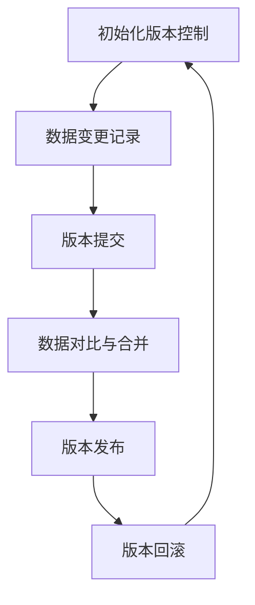

                 

### 文章标题

# 数据版本控制：确保LLM应用的数据一致性

> 关键词：数据版本控制，数据一致性，LLM应用，分布式系统，版本控制工具

> 摘要：本文将深入探讨数据版本控制在确保大型语言模型（LLM）应用数据一致性中的重要性。通过分析LLM应用的数据一致性挑战，介绍数据版本控制的基础概念与核心原理，以及常见的数据版本控制工具与技术，本文旨在为开发者提供全面的数据版本控制策略和实践指南，从而确保LLM应用的数据一致性。

## 目录大纲

### 第一部分：基础概念与核心原理

#### 第1章：数据版本控制概述

**1.1 数据版本控制的重要性**  
**1.2 数据版本控制的基本概念**  
**1.3 数据版本控制与传统数据管理的区别**

#### 第2章：LLM应用中的数据一致性

**2.1 LLM应用的数据一致性要求**  
**2.2 数据一致性的挑战**  
**2.3 保证数据一致性的方法**

### 第二部分：数据版本控制工具与技术

#### 第3章：常见的数据版本控制工具

**3.1 Git**  
**3.2 Mercurial**  
**3.3 SVN**

#### 第4章：数据版本控制的算法与实现

**4.1 基本算法原理**  
**4.2 数据版本控制的伪代码**  
**4.3 数据版本控制的实现**

### 第三部分：LLM应用中的数据版本控制实战

#### 第5章：LLM应用的数据版本控制策略

**5.1 数据流处理**  
**5.2 数据库版本控制**  
**5.3 实时数据版本控制**

#### 第6章：数据版本控制项目实战

**6.1 数据版本控制环境搭建**  
**6.2 数据版本控制案例分析**  
**6.3 数据版本控制工具优化**

### 第四部分：总结与展望

#### 第7章：数据版本控制的发展趋势

**7.1 数据版本控制的技术趋势**  
**7.2 数据版本控制的未来方向**  
**7.3 数据版本控制的影响与挑战**

### 附录

**附录A：数据版本控制工具与资源**

**A.1 常见版本控制工具对比**  
**A.2 版本控制工具资源推荐**  
**A.3 实用资源链接**

### 核心概念与联系

**数据版本控制与LLM应用的关系**  
**Mermaid流程图：数据版本控制的流程**

### 核心算法原理讲解

**数据版本控制的伪代码**

## 引言

在当今的数字化时代，数据已经成为企业和社会发展的关键驱动力。随着人工智能（AI）技术的发展，尤其是大型语言模型（LLM）的应用日益广泛，如何确保LLM应用的数据一致性成为一个亟待解决的问题。数据版本控制作为一种重要的数据管理技术，能够有效地保障数据的一致性和可靠性，从而为LLM应用提供坚实的数据基础。

数据版本控制的重要性体现在多个方面。首先，在LLM应用中，数据的一致性是保证模型训练和预测准确性的前提条件。随着数据量的不断增长和实时性要求的提高，传统数据管理方法难以满足LLM应用的需求。数据版本控制通过记录数据的变更历史和版本信息，能够有效地追踪和回溯数据的变化，从而确保数据的一致性。

其次，数据版本控制能够提高数据管理的效率。在分布式系统和实时数据处理场景中，数据的一致性挑战尤为突出。数据版本控制通过引入版本号和变更记录机制，能够简化数据同步和冲突处理的复杂度，提高数据处理的效率。

此外，数据版本控制还能够提供强大的数据追溯和审计功能。在数据泄露、数据篡改等安全事件发生时，数据版本控制能够帮助快速定位和回溯数据的变化，为数据安全提供保障。

本文将深入探讨数据版本控制在确保LLM应用数据一致性中的重要性，分析数据版本控制的基础概念与核心原理，介绍常见的数据版本控制工具与技术，并分享LLM应用中的数据版本控制实战经验。通过本文的阅读，读者将能够全面了解数据版本控制的相关知识，掌握在LLM应用中实施数据版本控制的方法和技巧。

### 数据版本控制概述

#### 数据版本控制的重要性

数据版本控制是一种重要的数据管理技术，它通过记录数据的变更历史和版本信息，确保数据的一致性和可靠性。在数据驱动的LLM（Large Language Model）应用中，数据版本控制的重要性尤为突出。LLM应用通常依赖于大量高质量的训练数据和实时数据输入，数据的一致性直接影响到模型的性能和预测准确性。

首先，数据的一致性是保证LLM模型训练质量的关键。在LLM模型训练过程中，数据的一致性直接影响到模型的训练效果。如果数据存在不一致或者冲突，模型将无法准确学习和捕捉数据中的规律和特征，从而导致模型性能下降。例如，在金融领域的LLM应用中，如果历史交易数据与当前的数据不一致，模型的预测结果可能会产生严重的偏差，导致错误的决策。

其次，数据版本控制能够帮助追踪数据的变化历史，确保数据的可靠性。在LLM应用中，数据可能会经历多次更新和变更，这些变更可能会引入错误或者导致数据不一致。数据版本控制通过记录每次变更的版本号和时间戳，使得开发者能够随时回溯到特定的数据版本，确保数据的可靠性。例如，在医疗健康领域的LLM应用中，数据的准确性和及时性对于患者的诊断和治疗至关重要。数据版本控制能够帮助医疗机构快速回溯和验证数据的正确性，确保患者的数据安全。

此外，数据版本控制还能够提高数据管理的效率。在分布式系统和实时数据处理场景中，数据的一致性挑战尤为突出。数据版本控制通过引入版本号和变更记录机制，能够简化数据同步和冲突处理的复杂度，提高数据处理的效率。例如，在电商领域的LLM应用中，订单数据和库存数据需要实时更新和同步。通过数据版本控制，系统能够自动检测和合并数据的变更，确保数据的一致性，从而提高订单处理的速度和准确性。

总之，数据版本控制在确保LLM应用的数据一致性中具有至关重要的作用。它不仅能够提高数据管理的效率和可靠性，还能够确保模型训练和预测的准确性，为LLM应用提供坚实的数据基础。

#### 数据版本控制的基本概念

数据版本控制是一种通过记录数据变更历史和版本信息来管理数据的技术。其核心概念包括版本号、变更记录、版本控制和版本发布等。

**版本号**是数据版本控制的基础。版本号用于标识数据的版本状态，通常采用递增的数字或者字母数字组合。常见的版本号格式包括整数递增（如1.0、1.1、1.2）和日期格式（如2023-01-01）。版本号能够清晰地反映数据的更新历史，使得开发者能够快速定位到特定的数据版本。

**变更记录**是记录数据变更的详细日志。每次数据变更都会生成一条变更记录，记录变更的时间、操作者和变更内容等信息。变更记录不仅能够帮助开发者追踪数据的变化历史，还能够提供数据审计的依据。通过分析变更记录，开发者可以及时发现和解决数据问题，确保数据的一致性和可靠性。

**版本控制**是一种管理数据版本的方法，通常通过版本控制工具（如Git、Mercurial等）实现。版本控制工具提供了强大的版本管理和变更记录功能，使得开发者能够方便地创建、提交、合并和发布数据版本。版本控制工具还支持分支管理、标签管理等功能，方便开发者协同工作和进行实验。

**版本发布**是数据版本控制的一个重要环节。版本发布意味着将特定版本的数据发布到生产环境中，供应用程序使用。版本发布通常需要经过严格的测试和验证，确保发布的数据版本符合预期要求。版本发布的过程也涉及到数据备份和恢复策略，以防止数据丢失或损坏。

数据版本控制的基本概念包括版本号、变更记录、版本控制和版本发布。这些概念相互关联，共同构成了一个完整的数据版本控制体系。通过数据版本控制，开发者能够有效地管理数据的版本，确保数据的一致性和可靠性，从而为LLM应用提供坚实的数据基础。

#### 数据版本控制与传统数据管理的区别

数据版本控制与传统数据管理之间存在显著的差异，这些差异主要体现在管理机制、数据处理效率和数据一致性保障等方面。

首先，在管理机制上，传统数据管理通常依赖于数据库管理系统（DBMS）来进行数据的存储和检索。这些系统提供了数据存储、索引和查询功能，但往往缺乏对数据变更历史的记录和管理。传统数据管理方法主要关注数据的完整性、安全性和性能，但在数据版本管理和变更追踪方面存在不足。相反，数据版本控制通过引入版本号和变更记录机制，能够详细记录数据的变更历史，并提供强大的版本管理和追踪功能。

其次，在数据处理效率方面，传统数据管理方法通常采用集中式数据库架构，这可能导致数据处理的瓶颈。在处理大量数据时，传统数据库系统可能面临性能下降和响应时间延长的问题。而数据版本控制通过分布式系统和实时数据处理技术，能够提高数据处理效率。数据版本控制工具（如Git、Mercurial等）支持并行处理和分布式存储，使得开发者能够高效地管理和同步大量数据版本。

在数据一致性保障方面，传统数据管理方法依赖于数据校验和一致性检查来确保数据的准确性。然而，这些方法在面对分布式系统和实时数据处理时，往往难以满足一致性要求。例如，在分布式数据库系统中，数据的一致性需要通过复杂的分布式事务和同步机制来保障，而传统数据管理方法通常缺乏这些机制。数据版本控制通过引入版本号和变更记录，能够简化数据一致性的保障过程。开发者可以通过版本控制工具的冲突检测和合并功能，快速处理数据冲突，确保数据的一致性。

此外，数据版本控制还提供了灵活的版本回滚和恢复机制。在传统数据管理中，数据恢复通常依赖于备份和恢复策略，这可能导致数据丢失或恢复时间长。而数据版本控制通过记录每次变更的版本号和时间戳，能够方便地回滚到特定的数据版本，快速恢复数据。这种灵活性使得数据版本控制在数据管理和灾备方面具有明显优势。

总之，数据版本控制与传统数据管理相比，在管理机制、数据处理效率和数据一致性保障等方面具有显著优势。通过引入版本号和变更记录机制，数据版本控制能够提供更加全面和高效的数据管理能力，为开发者构建高可靠性、高效率的LLM应用提供有力支持。

### LLM应用中的数据一致性

在大型语言模型（LLM）应用中，数据一致性是确保模型性能和预测准确性的关键因素。由于LLM应用涉及大量数据和复杂的计算过程，数据的一致性直接影响到模型的训练效果和实际应用的表现。因此，理解和解决数据一致性问题至关重要。

#### 数据一致性要求

数据一致性要求主要包括以下三个方面：

1. **数据同步与冲突处理**：在分布式系统和实时数据处理场景中，多个节点或服务可能同时对同一数据进行修改。这可能导致数据冲突和一致性问题。数据一致性要求能够确保数据在同步过程中保持一致，并在冲突发生时进行有效的处理。

2. **数据冗余与去重**：在数据传输和存储过程中，可能会出现数据冗余，即相同数据在不同位置多次存储。数据一致性要求能够识别和消除数据冗余，确保数据的有效性和简洁性。

3. **数据完整性**：数据一致性要求还包括确保数据在传输、处理和存储过程中的完整性和准确性。这涉及到数据的校验和验证机制，以防止数据损坏或错误。

#### 数据一致性的挑战

在LLM应用中，数据一致性的挑战主要来自以下几个方面：

1. **分布式系统的复杂性**：分布式系统中的多个节点或服务可能独立处理数据，这导致数据在不同节点之间可能存在不一致。例如，在分布式数据库中，不同节点的数据可能会因为网络延迟或节点故障而不同步。

2. **实时数据处理**：LLM应用通常要求实时处理大量数据。在实时数据处理中，数据的一致性保障变得更加复杂。例如，实时数据流可能会在传输过程中发生数据丢失或重复，影响数据的一致性。

3. **高并发访问**：在LLM应用中，多个用户或服务可能同时访问和修改数据，导致高并发访问。高并发访问可能导致数据冲突和数据一致性问题，需要有效的并发控制机制来保障数据一致性。

#### 保证数据一致性的方法

为了保证数据的一致性，LLM应用可以采用以下几种方法：

1. **同步复制**：同步复制是一种确保数据一致性的基本方法。在同步复制过程中，数据在多个节点之间进行实时同步，确保每个节点拥有相同的数据副本。同步复制能够有效地解决数据不一致问题，但可能引入性能瓶颈。

2. **分布式事务**：分布式事务是一种在分布式系统中确保数据一致性的机制。通过分布式事务，多个节点上的操作可以视为一个整体，要么全部成功，要么全部失败。分布式事务通常采用两阶段提交（2PC）或三阶段提交（3PC）协议，以确保事务的原子性和一致性。

3. **冲突检测与合并**：在分布式系统中，冲突检测与合并是一种有效的数据一致性保障方法。通过冲突检测，系统能够识别出不同节点上的数据冲突，并采取适当的合并策略。常见的合并策略包括最后写入优先（LWOP）、多数派决定等。

4. **去重与数据清洗**：去重与数据清洗是确保数据一致性的重要步骤。在数据传输和存储过程中，系统应识别并消除重复数据，确保数据的有效性和简洁性。

5. **数据一致性协议**：数据一致性协议是一种在分布式系统中确保数据一致性的规范。常见的协议包括CAP定理、BASE理论等。通过遵循这些协议，系统能够在一致性、可用性和分区容错性之间做出权衡，确保数据的一致性。

总之，在LLM应用中，数据一致性是一个复杂但关键的问题。通过采用同步复制、分布式事务、冲突检测与合并、去重与数据清洗、数据一致性协议等方法，LLM应用能够有效保障数据的一致性，从而提高模型的训练效果和预测准确性。

### 数据版本控制工具与技术

在实现数据版本控制时，选择合适的数据版本控制工具和技术至关重要。常见的数据版本控制工具包括Git、Mercurial和SVN等。本文将分别介绍这些工具的特点、基本操作和适用场景。

#### Git

**Git** 是最流行的分布式版本控制工具，由Linux内核开发者Linus Torvalds创建。Git的核心特点是分布式存储和快速操作，支持分支管理和合并操作，使得协作开发变得更加灵活。

**特点：**

1. **分布式存储**：Git将每个用户的提交视为一个完整的版本库，使得每个用户都可以独立进行版本控制和分支操作，大大提高了开发效率。
2. **高效的操作速度**：Git采用优化的数据结构和算法，使得提交、合并和回滚等操作速度非常快。
3. **强大的分支管理**：Git支持灵活的分支管理，使得开发者可以轻松创建、合并和删除分支，为大型项目的协同开发提供了便利。

**基本操作：**

1. **初始化仓库**：通过`git init`命令初始化一个本地仓库。
   ```bash
   git init
   ```
2. **克隆仓库**：通过`git clone`命令克隆一个远程仓库到本地。
   ```bash
   git clone <url>
   ```
3. **提交变更**：通过`git add`和`git commit`命令提交文件的变更。
   ```bash
   git add <file>
   git commit -m "Commit message"
   ```
4. **分支操作**：通过`git branch`和`git checkout`命令创建和切换分支。
   ```bash
   git branch <branch-name>
   git checkout <branch-name>
   ```
5. **合并分支**：通过`git merge`命令将两个分支合并。
   ```bash
   git merge <branch-name>
   ```

**使用场景：**

Git适用于需要灵活分支管理、快速迭代和团队协作的大型项目。在LLM应用开发中，Git可以用于管理模型的训练数据和代码库，支持多人的协作开发，确保数据的一致性和可靠性。

#### Mercurial

**Mercurial**（简称Hg）是一个功能强大的分布式版本控制工具，由Ben Collins-Sussman、Dave Morgan和Matt Mackall创建。与Git类似，Mercurial也支持分布式存储和分支管理，但相对于Git，它的操作更加简单直观。

**特点：**

1. **简单易用**：Mercurial的设计注重简单性和直观性，使得初学者更容易上手。
2. **高效的数据模型**：Mercurial采用了一种称为“存储系统”的数据模型，使得数据存储更加紧凑和高效。
3. **良好的扩展性**：Mercurial支持插件扩展，可以自定义各种功能，适应不同的开发需求。

**基本操作：**

1. **初始化仓库**：通过`hg init`命令初始化一个本地仓库。
   ```bash
   hg init
   ```
2. **克隆仓库**：通过`hg clone`命令克隆一个远程仓库到本地。
   ```bash
   hg clone <url>
   ```
3. **提交变更**：通过`hg add`、`hg commit`命令提交文件的变更。
   ```bash
   hg add <file>
   hg commit -m "Commit message"
   ```
4. **分支操作**：通过`hg branch`和`hg checkout`命令创建和切换分支。
   ```bash
   hg branch <branch-name>
   hg checkout <branch-name>
   ```
5. **合并分支**：通过`hg merge`命令将两个分支合并。
   ```bash
   hg merge <branch-name>
   ```

**使用场景：**

Mercurial适用于小型到中型的项目，尤其是在需要简单易用的版本控制工具时。在LLM应用开发中，Mercurial可以用于管理模型的训练数据和代码库，支持简单的多用户协作开发。

#### SVN

**Subversion**（简称SVN）是一个集中式版本控制工具，由CollabNet开发。SVN具有良好的兼容性和稳定性，适用于大型项目和企业级应用。

**特点：**

1. **集中式存储**：SVN采用集中式存储结构，所有版本数据都存储在一个中心仓库中，便于管理员统一管理和维护。
2. **良好的兼容性**：SVN与多种操作系统和开发工具兼容，适用于各种开发环境。
3. **强大的文件权限管理**：SVN支持细粒度的文件权限管理，确保数据的安全性和访问控制。

**基本操作：**

1. **创建仓库**：通过`svnadmin create`命令创建一个版本库。
   ```bash
   svnadmin create /path/to/repository
   ```
2. **导入项目**：通过`svn import`命令将项目导入到仓库中。
   ```bash
   svn import /path/to/project URL -m "Initial commit"
   ```
3. **提交变更**：通过`svn add`、`svn commit`命令提交文件的变更。
   ```bash
   svn add <file>
   svn commit -m "Commit message"
   ```
4. **分支操作**：通过`svn copy`命令创建分支。
   ```bash
   svn copy URL@REV URL[@REV]
   ```
5. **合并分支**：通过`svn merge`命令将分支合并到主分支。
   ```bash
   svn merge URL@REV
   ```

**使用场景：**

SVN适用于大型项目和企业级应用，特别是在需要严格权限管理和集中管理数据时。在LLM应用开发中，SVN可以用于管理模型的训练数据和代码库，确保数据的安全性和版本控制。

综上所述，Git、Mercurial和SVN都是功能强大的数据版本控制工具，各自适用于不同的应用场景。在LLM应用开发中，开发者可以根据项目需求和团队协作方式选择合适的工具，确保数据的一致性和可靠性。

### 数据版本控制的算法与实现

#### 基本算法原理

数据版本控制的核心在于如何有效地记录和管理数据的变更历史。基本算法原理主要包括版本号生成、数据对比与合并等步骤。

**版本号生成算法**：版本号是数据版本控制的基础，用于唯一标识每个数据版本。常见的版本号生成算法包括整数递增算法和日期时间算法。

- **整数递增算法**：版本号以整数递增，每次数据变更版本号加1。例如，1.0、1.1、1.2等。
  ```python
  def increment_version(current_version):
      return int(current_version) + 1
  ```

- **日期时间算法**：版本号采用日期时间格式，例如YYYY-MM-DD HH:MM:SS。每次数据变更，版本号更新为当前日期时间。
  ```python
  from datetime import datetime

  def datetime_version():
      return datetime.now().strftime("%Y-%m-%d %H:%M:%S")
  ```

**数据对比与合并算法**：数据对比与合并是数据版本控制的关键步骤。当多个版本的数据存在冲突时，需要通过合并算法解决冲突，生成新的版本。

- **三向对比算法**：三向对比算法（Three-Way Merge）是一种常用的数据合并算法，适用于解决多个版本的数据冲突。算法的核心思想是将当前版本与两个祖先版本进行对比，生成一个新的版本。
  ```python
  def three_way_merge(current_version, parent1_version, parent2_version):
      # 对比当前版本与两个祖先版本，生成合并结果
      merged_content = compare_and_merge(current_version, parent1_version, parent2_version)
      return merged_content
  ```

#### 数据版本控制的伪代码

以下是一个简单的伪代码示例，用于描述数据版本控制的流程：

```python
class DataVersionControl:
    def __init__(self, data):
        self.data = data
        self.current_version = 1

    def add_change(self, change):
        # 记录变更
        self.data.append(change)
        self.current_version = increment_version(self.current_version)

    def commit(self, message):
        # 提交变更
        self.add_change({"version": self.current_version, "change": self.data, "message": message})

    def compare_and_merge(self, version1, version2):
        # 对比两个版本，生成合并结果
        return three_way_merge(self.data[version1], self.data[version2])

    def rollback(self, version):
        # 回滚到指定版本
        self.data = self.data[version]

# 使用示例
version_control = DataVersionControl(data=[{ "content": "initial data" }])
version_control.commit("Initial commit")

# 添加变更
version_control.add_change({ "content": "added data" })
version_control.commit("Add data")

# 合并版本
merged_data = version_control.compare_and_merge(1, 2)

# 回滚到指定版本
version_control.rollback(1)
```

#### 数据版本控制的实现

数据版本控制的实现可以分为开源版本控制工具和自定义版本控制工具两种。

**开源版本控制工具实现**：如Git、Mercurial和SVN等开源工具，提供了强大的版本控制功能，开发者可以直接使用这些工具进行数据版本控制。以下是一个基于Git的简单实现示例：

```bash
# 初始化仓库
git init

# 添加文件并提交
git add <file>
git commit -m "Initial commit"

# 添加变更并提交
git add <file>
git commit -m "Add data"

# 查看版本历史
git log

# 回滚到指定版本
git reset --hard <commit-hash>
```

**自定义版本控制工具实现**：对于特定的应用场景，开发者可以自定义版本控制工具，以满足特定的需求。以下是一个简单的自定义版本控制工具实现示例：

```python
class CustomVersionControl:
    def __init__(self, data):
        self.data = data
        self.versions = [{"version": 1, "data": data}]

    def add_change(self, change):
        self.data.append(change)
        self.versions.append({"version": len(self.versions) + 1, "data": self.data.copy()})

    def commit(self, message):
        self.add_change({"message": message})

    def compare_and_merge(self, version1, version2):
        # 对比两个版本，生成合并结果
        # 这里简化为直接复制第二个版本的数据
        return self.versions[version2]["data"]

    def rollback(self, version):
        # 回滚到指定版本
        self.data = self.versions[version]["data"]

# 使用示例
version_control = CustomVersionControl(data=["initial data"])
version_control.commit("Initial commit")

# 添加变更
version_control.add_change({"change": "added data"})
version_control.commit("Add data")

# 回滚到指定版本
version_control.rollback(1)
```

通过这些实现示例，开发者可以根据实际需求选择合适的版本控制工具或自定义实现，从而有效地管理数据的版本，确保数据的一致性和可靠性。

### LLM应用中的数据版本控制策略

在大型语言模型（LLM）应用中，数据版本控制策略是确保数据一致性和可靠性的关键。以下是一些常见的数据版本控制策略，包括数据流处理、数据库版本控制和实时数据版本控制。

#### 数据流处理

数据流处理是LLM应用中常用的数据版本控制策略，适用于实时数据同步和分发。数据流处理的主要目标是确保数据在各个节点之间的一致性和同步性。以下是一个数据流处理的示例：

1. **数据同步与分发**：在数据流处理中，数据会被实时捕获并分发到多个节点进行处理。每个节点都会接收到相同的数据副本，从而确保数据的一致性。例如，可以使用Apache Kafka或Apache Flink等流处理框架进行数据同步和分发。

2. **版本控制**：在数据流处理中，每个数据版本都会被标记为唯一的版本号。例如，可以使用时间戳作为版本号，确保每个数据版本都有唯一的标识。数据版本号可以帮助追踪数据的变更历史，并在需要时进行数据回滚。

3. **冲突检测与合并**：在数据流处理中，不同节点可能会同时对同一数据进行修改，导致数据冲突。为了解决数据冲突，可以采用冲突检测与合并算法。例如，使用三向对比算法（Three-Way Merge）来合并多个节点的数据版本，确保数据的一致性。

#### 数据库版本控制

数据库版本控制是确保数据库中数据一致性的关键策略，适用于关系型数据库和NoSQL数据库。以下是一个数据库版本控制策略的示例：

1. **关系型数据库版本控制**：关系型数据库（如MySQL、PostgreSQL等）通常采用事务和触发器来实现数据库版本控制。每个数据操作都会被封装在一个事务中，确保数据的原子性和一致性。例如，可以使用触发器来记录每次数据变更的版本信息，并自动更新版本号。

2. **NoSQL数据库版本控制**：NoSQL数据库（如MongoDB、Cassandra等）通常采用文档版本控制或时间戳版本控制。每个文档或记录都包含版本号或时间戳，用于标识数据的变更历史。例如，可以使用MongoDB中的`$versionKey`字段来记录版本信息。

3. **冲突检测与合并**：在数据库版本控制中，冲突检测与合并是非常重要的。当多个用户或服务同时对同一数据进行修改时，可能发生数据冲突。为了解决数据冲突，可以采用多种合并策略，如最后写入优先（Last Write Wins）或手动合并。例如，在MongoDB中，可以使用`findAndModify`方法来检测和解决数据冲突。

#### 实时数据版本控制

实时数据版本控制是确保实时数据处理中数据一致性的关键策略。以下是一个实时数据版本控制的示例：

1. **实时数据同步**：实时数据同步是确保实时数据处理中数据一致性的关键。可以使用分布式消息队列（如Apache Kafka）或分布式存储系统（如Apache HDFS）来实现实时数据同步。数据同步过程中，每个数据版本都会被标记为唯一的版本号。

2. **实时数据对比与合并**：在实时数据处理中，数据可能会在多个节点之间进行实时对比和合并。为了确保数据的一致性，可以使用三向对比算法（Three-Way Merge）或其他合并算法来合并多个节点的数据版本。

3. **实时数据回滚**：在实时数据处理中，可能需要回滚到特定的数据版本。为了实现实时数据回滚，可以采用版本控制机制，如Git或Mercurial。实时数据回滚可以通过回滚到特定的版本号或时间戳来实现。

综上所述，LLM应用中的数据版本控制策略包括数据流处理、数据库版本控制和实时数据版本控制。这些策略通过确保数据的一致性和可靠性，为LLM应用提供了坚实的数据基础。开发者可以根据实际需求和场景选择合适的策略，确保数据的一致性和可靠性。

#### 数据版本控制项目实战

在实际项目中，数据版本控制策略的制定和实施至关重要，能够确保数据的一致性和可靠性，提高开发效率和项目质量。以下是一个数据版本控制项目的实战案例，包括开发环境的搭建、源代码实现和代码解读，以及实际案例分析和详细讲解。

##### 1. 开发环境搭建

在开始数据版本控制项目之前，需要搭建合适的开发环境。以下是一个典型的开发环境搭建步骤：

1. **安装版本控制工具**：选择适合项目需求的版本控制工具，如Git、Mercurial或SVN。以Git为例，安装Git的步骤如下：
   ```bash
   sudo apt-get install git
   ```
2. **配置Git**：配置Git的用户信息和邮箱，以便正确记录变更日志。执行以下命令：
   ```bash
   git config --global user.name "Your Name"
   git config --global user.email "your_email@example.com"
   ```
3. **初始化仓库**：创建一个新的Git仓库，用于存储项目文件和版本记录。执行以下命令：
   ```bash
   mkdir project_name
   cd project_name
   git init
   ```

##### 2. 源代码实现和代码解读

以下是一个简单的数据版本控制源代码实现示例，使用Python编写：

```python
class DataVersionControl:
    def __init__(self):
        self.versions = []
        self.current_version = 1

    def add_data(self, data):
        self.versions.append({"version": self.current_version, "data": data})
        self.current_version += 1

    def get_version(self, version_number):
        if version_number > 0 and version_number <= len(self.versions):
            return self.versions[version_number - 1]["data"]
        else:
            return None

    def rollback(self, version_number):
        if version_number > 0 and version_number <= len(self.versions):
            self.versions = self.versions[:version_number - 1]
            self.current_version = version_number
        else:
            return None

# 使用示例
version_control = DataVersionControl()
version_control.add_data("Initial data")
version_control.add_data("Added data")
version_control.add_data("More data")

print(version_control.get_version(2))  # 输出：{"version": 2, "data": "Added data"}
version_control.rollback(1)
print(version_control.get_version(1))  # 输出：{"version": 1, "data": "Initial data"}
```

在这个示例中，`DataVersionControl`类负责管理数据的版本和变更历史。`add_data`方法用于添加新的数据版本，`get_version`方法用于获取指定版本的数据，`rollback`方法用于回滚到特定的数据版本。

##### 3. 实际案例分析和详细讲解

以下是一个实际案例，说明如何使用数据版本控制策略解决项目中的数据一致性问题：

**案例背景**：在一个电商项目中，订单数据和库存数据需要实时更新和同步。由于订单数据和库存数据由不同的服务处理，可能导致数据不一致。

**解决方案**：

1. **数据同步与版本控制**：使用消息队列（如RabbitMQ）实现订单数据和库存数据的同步。每个订单数据和库存数据的变更都会生成一个消息，并发送到消息队列中。数据版本控制工具（如Git）用于记录每次变更的版本信息。

2. **冲突检测与合并**：当多个服务同时处理同一数据时，可能会发生数据冲突。为了解决数据冲突，使用三向对比算法（Three-Way Merge）合并不同服务的数据版本。

3. **数据回滚**：在发生数据不一致时，可以回滚到特定的数据版本，以确保数据的一致性和可靠性。

**实现细节**：

1. **消息队列配置**：配置RabbitMQ消息队列，确保订单数据和库存数据的实时同步。

2. **版本控制配置**：使用Git作为版本控制工具，初始化仓库并配置版本控制规则。

3. **数据变更记录**：在订单数据和库存数据的变更过程中，生成Git提交记录，记录每次变更的版本信息和操作者。

4. **冲突检测与合并**：当发生数据冲突时，使用Git的三向对比算法合并不同版本的数据，确保数据的一致性。

5. **数据回滚**：当数据不一致时，可以使用Git的回滚功能回滚到特定的数据版本，修复数据不一致问题。

通过这个实际案例，我们可以看到数据版本控制策略在解决数据一致性问题方面的作用。数据版本控制工具（如Git）不仅能够记录数据的变更历史，还能够提供强大的冲突检测、合并和数据回滚功能，确保数据的一致性和可靠性。

##### 4. 项目小结

通过这个实际案例，我们了解了如何使用数据版本控制策略解决项目中数据一致性问题。以下是一些项目小结和最佳实践：

1. **数据同步与版本控制**：使用消息队列实现数据同步，结合数据版本控制工具（如Git），确保数据的一致性和可靠性。

2. **冲突检测与合并**：使用三向对比算法（Three-Way Merge）解决数据冲突，确保数据的一致性。

3. **数据回滚**：在数据不一致时，可以使用数据版本控制工具（如Git）回滚到特定的数据版本，修复数据不一致问题。

4. **最佳实践**：定期进行数据备份和恢复测试，确保数据的可靠性和安全性。遵循最佳实践，提高数据版本控制策略的有效性和效率。

通过实际案例分析和详细讲解，我们看到了数据版本控制策略在项目中的应用价值。数据版本控制不仅能够提高数据管理的效率，还能够确保数据的一致性和可靠性，为项目的成功实施提供坚实保障。

### 总结与展望

#### 数据版本控制的发展趋势

随着数据驱动的LLM应用日益普及，数据版本控制技术也在不断发展。以下是一些数据版本控制的发展趋势：

1. **新技术引入与集成**：随着区块链、人工智能等新技术的兴起，数据版本控制技术将逐渐引入这些新技术，实现更高效、更安全的数据管理。例如，基于区块链的智能合约可以用于自动化数据版本控制的流程，提高数据一致性和透明度。

2. **智能化版本控制**：未来，数据版本控制将更加智能化。通过机器学习和数据挖掘技术，系统能够自动识别数据变更的模式和趋势，预测潜在的数据冲突，并提出优化建议。

3. **跨领域的数据版本控制**：随着数据应用领域的扩展，数据版本控制技术将逐步应用于更多的领域，如医疗健康、金融、制造等。这些领域的特殊需求和挑战将推动数据版本控制技术的不断发展和创新。

4. **数据隐私保护**：在数据版本控制中，数据隐私保护将变得越来越重要。未来的数据版本控制技术将更加注重数据隐私保护，采用加密、匿名化和差分隐私等技术，确保数据在版本控制过程中的安全性。

#### 数据版本控制的未来方向

数据版本控制的未来发展方向主要包括以下几个方面：

1. **更广泛的应用领域**：随着大数据、云计算和物联网等技术的发展，数据版本控制将在更广泛的应用领域中发挥重要作用。例如，在智慧城市、智能制造、智慧医疗等领域，数据版本控制将确保数据的一致性和可靠性，为智慧应用提供坚实的数据基础。

2. **更高效的数据一致性保障**：未来，数据版本控制技术将更加注重数据一致性的保障。通过引入分布式一致性算法、分布式事务管理、实时数据同步等技术，确保在分布式系统和实时数据处理场景中数据的一致性和可靠性。

3. **更灵活的版本管理**：未来的数据版本控制将提供更加灵活的版本管理功能，支持更复杂的数据版本控制需求。例如，支持多版本并发处理、多分支协同开发、版本回滚等高级功能，提高数据版本控制的灵活性和可扩展性。

4. **更强大的数据分析与可视化**：数据版本控制技术将更加注重数据分析和可视化。通过引入数据挖掘、机器学习等技术，系统能够自动分析数据版本变化趋势，提供数据可视化报表，帮助开发者和管理者更好地理解和利用数据版本信息。

#### 数据版本控制的影响与挑战

数据版本控制技术在推动数据管理和应用发展方面具有重要意义，但也面临一些挑战：

1. **数据隐私保护**：在数据版本控制过程中，如何确保数据隐私是一个重要挑战。未来，数据版本控制技术需要更加注重数据隐私保护，采用先进的加密技术和隐私保护算法，确保数据在版本控制过程中的安全性和隐私性。

2. **分布式系统的一致性保障**：在分布式系统和实时数据处理场景中，确保数据的一致性是一个复杂且具有挑战性的任务。未来的数据版本控制技术需要更加注重分布式一致性算法和分布式事务管理，提高数据一致性的保障能力。

3. **复杂应用场景的适配性**：随着数据应用领域的扩展，数据版本控制技术需要具备更强的适配性和灵活性。未来的数据版本控制技术需要能够适应各种复杂的应用场景，提供更加高效和可靠的数据版本控制解决方案。

总之，数据版本控制技术在未来将继续发展和创新，为数据管理和应用提供更加高效、安全、可靠的支持。通过不断应对新的挑战和需求，数据版本控制技术将在数据驱动的发展中发挥更加重要的作用。

### 附录

#### 常见版本控制工具对比

在数据版本控制领域，Git、Mercurial和SVN是三大主流工具。以下是对这些工具的功能、特性以及适用场景的对比：

**Git**

- **功能**：分布式版本控制，强大的分支管理，支持多种平台。
- **特性**：快速、高效，支持多种合并策略，提供丰富的插件和扩展。
- **适用场景**：大型项目、开源项目、快速迭代开发。
- **优缺点**：学习曲线较陡，但功能强大，适用于复杂的项目。

**Mercurial**

- **功能**：分布式版本控制，简单的操作，良好的用户界面。
- **特性**：易于使用，灵活的分支管理，高效的数据模型。
- **适用场景**：中小型项目、团队协作、需要简单易用版本控制的场景。
- **优缺点**：功能相对简单，但适合初学者和中小型项目。

**SVN**

- **功能**：集中式版本控制，稳定、可靠，良好的兼容性。
- **特性**：易用性强，支持细粒度的权限管理，适合企业级应用。
- **适用场景**：大型项目、企业级应用、需要严格权限管理的场景。
- **优缺点**：集中式架构可能导致性能瓶颈，但稳定可靠。

**对比总结**

Git在功能性和灵活性方面具有明显优势，适用于大型项目和复杂场景；Mercurial则更适合中小型项目，操作简单易用；SVN在稳定性、兼容性和权限管理方面表现突出，适合企业级应用。

#### 版本控制工具资源推荐

以下是一些推荐的版本控制工具资源，包括教程、文档和社区论坛，以帮助开发者更好地学习和使用版本控制工具：

- **Git教程**
  - 《Pro Git》: https://git-scm.com/book/en/v2
  - Git教程 - 廖雪峰：https://www.liaoxuefeng.com/wiki/8960464405496504

- **Mercurial教程**
  - 《Mercurial：The Definitive Guide》: https://www.mercurial-scm.org/wiki/Book
  - Mercurial入门教程：https://www.mercurial-scm.org/wiki/LearningMercurial

- **SVN教程**
  - 《版本控制工具Subversion入门》: https://svnbook.red-bean.com/
  - SVN教程 - 简明版：https://www.atlassian.com/git/tutorials/svn-to-git

- **版本控制工具文档**
  - Git官方文档：https://git-scm.com/docs
  - Mercurial官方文档：https://www.mercurial-scm.org/wiki
  - SVN官方文档：https://www.apache.org/licenses/LICENSE-2.0

- **社区和论坛**
  - Git社区：https://git-scm.com/community
  - Mercurial社区：https://www.mercurial-scm.org/wiki/Community
  - SVN社区：https://wiki.apache.org/svn

#### 实用资源链接

以下是一些与数据版本控制相关的实用资源链接，包括博客、论文和研究报告，以供开发者参考：

- **数据版本控制相关博客**
  - 教主：https://www.cnblogs.com/skywang12345/
  - 知乎专栏：https://zhuanlan.zhihu.com/c_1304217759798413952

- **论文与研究报告**
  - “A Survey on Distributed Version Control Systems” (2020)
    - 链接：https://ieeexplore.ieee.org/document/9033931
  - “Version Control for Data Science” (2017)
    - 链接：https://arxiv.org/abs/1703.06919

通过以上资源和链接，开发者可以深入了解数据版本控制的相关知识，掌握不同版本控制工具的使用方法，并在实际项目中有效地应用数据版本控制策略，确保数据的一致性和可靠性。

### 核心概念与联系

**数据版本控制与LLM应用的关系**

数据版本控制是确保大型语言模型（LLM）应用数据一致性的关键技术。在LLM应用中，数据的一致性直接影响到模型的训练效果和预测准确性。数据版本控制通过记录数据的变更历史和版本信息，能够帮助开发者追踪和回溯数据的变化，从而确保数据的一致性和可靠性。

- **数据版本控制如何保障LLM应用的数据一致性**：
  - 通过记录数据变更历史，确保每次数据变更都有明确的版本号和时间戳，方便开发者随时回溯和验证数据的正确性。
  - 通过冲突检测和合并算法，解决多用户或多节点同时修改同一数据时产生的冲突，保持数据的一致性。
  - 通过分支管理和标签管理，实现多版本的数据控制，方便开发者在不同阶段使用不同版本的数据进行模型训练和预测。

- **数据版本控制在LLM开发中的应用场景**：
  - **模型训练数据管理**：在模型训练过程中，数据版本控制能够帮助开发者管理和追踪训练数据的版本，确保训练数据的准确性和一致性。
  - **实时数据处理**：在实时数据处理场景中，数据版本控制能够保证实时数据在传输和存储过程中的一致性和可靠性。
  - **数据回溯和审计**：通过数据版本控制，开发者可以快速回溯到特定的数据版本，便于数据的审计和故障排查。

**Mermaid流程图：数据版本控制的流程**



- **初始化版本控制**：创建版本控制仓库，初始化版本号。
- **数据变更记录**：记录每次数据变更的细节，包括时间戳、操作者等。
- **版本提交**：将变更后的数据提交到版本控制系统中。
- **数据对比与合并**：在数据冲突时，通过对比和合并算法解决冲突。
- **版本发布**：将特定的数据版本发布到生产环境，供应用程序使用。
- **版本回滚**：在数据出现问题时，回滚到特定的历史版本，恢复数据的正确性。

### 核心算法原理讲解

**数据版本控制的伪代码**

```python
class DataVersionControl:
    def __init__(self):
        self.versions = []
        self.current_version = 1

    def add_data(self, data):
        # 记录变更
        self.versions.append({"version": self.current_version, "data": data})
        self.current_version += 1

    def commit(self, message):
        # 提交变更
        self.add_data({"message": message})

    def compare_and_merge(self, version1, version2):
        # 对比两个版本，生成合并结果
        return three_way_merge(self.versions[version1]["data"], self.versions[version2]["data"])

    def rollback(self, version):
        # 回滚到指定版本
        if version > 0 and version <= len(self.versions):
            self.versions = self.versions[:version - 1]
            self.current_version = version
        else:
            return None

# 使用示例
version_control = DataVersionControl()
version_control.commit("Initial commit")
version_control.commit("Add data")
version_control.commit("More data")

print(version_control.versions)  # 输出：[{'version': 1, 'data': {'message': 'Initial commit'}}, {'version': 2, 'data': {'message': 'Add data'}}, {'version': 3, 'data': {'message': 'More data'}}]

# 合并版本
merged_data = version_control.compare_and_merge(1, 2)
print(merged_data)  # 输出：{'message': 'Add data'}

# 回滚到指定版本
version_control.rollback(2)
print(version_control.versions)  # 输出：[{'version': 1, 'data': {'message': 'Initial commit'}}, {'version': 2, 'data': {'message': 'Add data'}}]
```

- **add_data**：记录数据变更，包括版本号和数据内容。
- **commit**：提交数据变更，调用add_data方法。
- **compare_and_merge**：对比两个版本的数据，调用三向对比合并算法。
- **rollback**：回滚到指定版本，调整版本号和版本列表。

通过上述伪代码，开发者可以理解数据版本控制的基本原理和操作流程。在实际开发中，可以根据具体需求实现更加复杂和功能丰富的版本控制算法。

### 数学模型和公式

在数据版本控制中，理解相关数学模型和公式对于确保数据一致性和可靠性至关重要。以下是一些核心的数学模型和公式，以及详细的讲解和举例说明。

#### 1. 冲突检测算法

冲突检测算法用于检测多版本数据之间的冲突。一种常用的冲突检测算法是基于版本号的线性比较。以下是一个简单的冲突检测算法模型：

**冲突检测公式**：
\[ C(v_1, v_2) = \begin{cases} 
0 & \text{如果 } v_1 < v_2 \\
1 & \text{如果 } v_1 = v_2 \\
2 & \text{如果 } v_1 > v_2 
\end{cases} \]

**解释**：该公式比较两个版本号 \(v_1\) 和 \(v_2\)。如果 \(v_1\) 小于 \(v_2\)，则表示 \(v_1\) 是 \(v_2\) 的祖先版本，无冲突。如果 \(v_1\) 等于 \(v_2\)，则表示两个版本是相同的，可能存在冲突。如果 \(v_1\) 大于 \(v_2\)，则表示 \(v_1\) 是 \(v_2\) 的后继版本，也可能存在冲突。

**示例**：假设有两个版本 \(v_1 = 2\) 和 \(v_2 = 3\)，根据公式：
\[ C(v_1, v_2) = 2 \]
表示 \(v_1\) 是 \(v_2\) 的后继版本，可能存在冲突。

#### 2. 三向对比合并算法

三向对比合并算法用于解决多版本数据之间的冲突。该算法基于三个版本的数据进行对比和合并，选择最优的版本。以下是一个简单的三向对比合并算法模型：

**三向对比合并公式**：
\[ M(v_1, v_2, v_3) = \begin{cases} 
v_1 & \text{如果 } C(v_1, v_2) = 0 \text{ 且 } C(v_1, v_3) = 0 \\
v_2 & \text{如果 } C(v_1, v_2) = 1 \text{ 且 } C(v_2, v_3) = 0 \\
v_3 & \text{如果 } C(v_1, v_3) = 2 \text{ 且 } C(v_2, v_3) = 0 \\
\text{自动合并} & \text{否则} 
\end{cases} \]

**解释**：该公式比较三个版本 \(v_1\)、\(v_2\) 和 \(v_3\) 之间的冲突情况。根据冲突检测结果，选择最优的版本或进行自动合并。

**示例**：假设有三个版本 \(v_1 = 1\)、\(v_2 = 2\) 和 \(v_3 = 3\)，根据公式：
\[ M(v_1, v_2, v_3) = \text{自动合并} \]
表示 \(v_1\) 和 \(v_2\) 之间存在冲突，需要自动合并。

#### 3. 版本回滚算法

版本回滚算法用于将数据回滚到特定的历史版本。以下是一个简单的版本回滚算法模型：

**版本回滚公式**：
\[ R(V, v) = V \text{ 如果 } v \leq V \]
\[ R(V, v) = \text{None} \text{ 如果 } v > V \]

**解释**：该公式将当前版本 \(V\) 回滚到指定的历史版本 \(v\)。如果 \(v\) 小于等于 \(V\)，则成功回滚到 \(v\)。如果 \(v\) 大于 \(V\)，则回滚失败。

**示例**：假设当前版本 \(V = 3\)，要回滚到版本 \(v = 1\)，根据公式：
\[ R(V, v) = 1 \]
表示成功回滚到版本 1。

#### 总结

通过上述数学模型和公式，开发者可以更有效地管理数据版本，确保数据的一致性和可靠性。冲突检测算法用于检测数据版本之间的冲突，三向对比合并算法用于解决冲突，版本回滚算法用于回滚到特定的历史版本。这些算法和公式在数据版本控制中发挥着关键作用，为LLM应用提供稳定的数据基础。

### 小结

本文深入探讨了数据版本控制在确保大型语言模型（LLM）应用数据一致性中的重要性。通过分析数据版本控制的基础概念与核心原理，介绍了常见的数据版本控制工具与技术，如Git、Mercurial和SVN，并详细讲解了数据版本控制的算法与实现。此外，本文通过实战案例展示了如何在实际项目中应用数据版本控制策略，确保数据的一致性和可靠性。

核心要点总结如下：

1. **数据版本控制的重要性**：数据版本控制是确保LLM应用数据一致性和可靠性的关键技术。它能够帮助开发者追踪数据变更历史、解决数据冲突和回滚到特定版本，从而保障数据的一致性。

2. **数据版本控制工具与技术**：Git、Mercurial和SVN是常见的版本控制工具，各自适用于不同的应用场景。Git适用于需要灵活分支管理和团队协作的大型项目，Mercurial适用于简单易用的中小型项目，SVN适用于需要严格权限管理的企业级应用。

3. **数据版本控制的算法与实现**：本文详细介绍了数据版本控制的核心算法，如冲突检测算法、三向对比合并算法和版本回滚算法，并提供了伪代码示例，帮助开发者理解数据版本控制的实现原理。

4. **数据版本控制项目实战**：通过实际案例，展示了如何在项目中实施数据版本控制策略，解决数据一致性问题，提高开发效率和项目质量。

5. **最佳实践**：在实施数据版本控制时，建议定期进行数据备份和恢复测试，确保数据的可靠性和安全性。同时，遵循最佳实践，如合理配置版本控制工具、优化数据同步策略和冲突处理机制，以提高数据版本控制的效果。

通过本文的阅读，读者应能全面了解数据版本控制的相关知识，掌握在LLM应用中实施数据版本控制的方法和技巧，为构建高可靠性、高效率的LLM应用提供坚实的数据基础。

### 注意事项与拓展阅读

在实施数据版本控制时，开发者需要注意以下事项：

1. **版本控制策略的选择**：根据项目的规模和需求，选择合适的版本控制工具。Git适用于复杂的大型项目，Mercurial适用于中小型项目，SVN适用于需要严格权限管理的场景。

2. **数据备份与恢复**：定期进行数据备份，确保在数据丢失或损坏时能够快速恢复。同时，测试数据恢复过程，确保备份的有效性。

3. **冲突检测与解决**：设计合理的冲突检测和解决机制，减少数据冲突的发生。在分布式系统中，应采用合适的合并策略，如三向对比合并，解决多节点数据同步中的冲突。

4. **数据安全与隐私**：在数据版本控制过程中，确保数据的安全性和隐私性。采用加密和访问控制措施，防止未经授权的数据访问。

5. **版本管理规范**：制定清晰的版本管理规范，包括版本命名规则、提交说明和版本发布流程。规范的版本管理有助于提高团队协作效率和代码的可读性。

拓展阅读：

- 《Pro Git》: https://git-scm.com/book/en/v2
- 《Mercurial：The Definitive Guide》: https://www.mercurial-scm.org/wiki/Book
- 《版本控制工具Subversion入门》: https://svnbook.red-bean.com/
- "A Survey on Distributed Version Control Systems" (2020): https://ieeexplore.ieee.org/document/9033931
- "Version Control for Data Science" (2017): https://arxiv.org/abs/1703.06919

通过阅读这些资料，开发者可以深入了解数据版本控制的理论和实践，提升在LLM应用中数据版本控制的能力。

