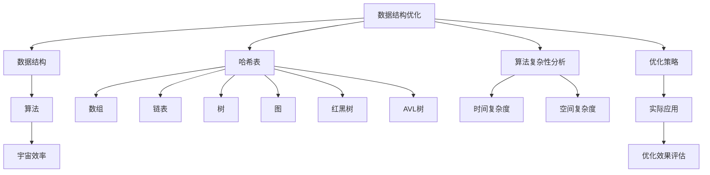

                 

### 文章标题

# 数据结构优化与宇宙效率

### 关键词

- 数据结构
- 宇宙效率
- 算法复杂性
- 哈希表
- 树形结构
- 图形结构

### 摘要

本文旨在探讨数据结构优化与宇宙效率之间的关系。通过分析不同类型的数据结构，包括线性结构、树形结构和图形结构，以及哈希表的原理和应用，我们揭示了如何通过优化数据结构来提升算法的宇宙效率。文章还将深入讨论算法复杂性分析的方法，以及如何在实践中应用这些优化策略，以实现高性能和高效率的系统设计。最终，本文将总结核心概念、联系与算法原理，并给出实际项目案例，为读者提供实用的优化实践指南。

### 目录大纲

#### 第一部分：基础概念与理论

#### 第1章：数据结构与宇宙效率概述

1.1 引言

- 什么是数据结构
- 宇宙效率的概念

1.2 数据结构的类型

- 线性结构
- 树形结构
- 图形结构

1.3 宇宙效率的理论基础

- 哈希理论
- 算法复杂性理论

1.4 数据结构优化的重要性

- 提高处理速度
- 减少内存使用
- 提高算法效率

#### 第2章：线性数据结构

2.1 数组

- 数组的定义
- 数组的操作
- 数组的性能分析

2.2 链表

- 链表的定义
- 链表的操作
- 链表的性能分析

2.3 栈与队列

- 栈的定义
- 队列的定义
- 栈与队列的操作
- 栈与队列的性能分析

#### 第3章：树形数据结构

3.1 二叉树

- 二叉树的定义
- 二叉树的遍历
- 二叉树的性能分析

3.2 AVL树

- AVL树的定义
- AVL树的平衡操作
- AVL树的性能分析

3.3 红黑树

- 红黑树的定义
- 红黑树的性能分析

#### 第4章：图形数据结构

4.1 图的定义

- 图的基本概念
- 图的分类

4.2 图的遍历

- 深度优先搜索
- 广度优先搜索

4.3 图的算法

- 最短路径算法
- 最小生成树算法

#### 第5章：哈希表

5.1 哈希表的基本概念

- 哈希函数
- 冲突解决方法

5.2 哈希表的性能分析

- 哈希表的查找性能
- 哈希表的插入性能

5.3 哈希表的应用

- 字典
- 集合
- 排序

#### 第6章：算法复杂性分析

6.1 时间复杂度

- 时间复杂度的定义
- 常见算法的时间复杂度分析

6.2 空间复杂度

- 空间复杂度的定义
- 空间复杂度分析

6.3 降低算法复杂度的方法

- 优化算法
- 设计高效数据结构

#### 第7章：宇宙效率优化实践

7.1 实践案例

- 实际项目的数据结构优化案例

7.2 优化策略

- 数据结构优化策略
- 宇宙效率提升策略

7.3 评估与优化

- 优化效果评估
- 持续优化

#### 附录：参考资源

A.1 相关书籍推荐

- 《算法导论》
- 《数据结构与算法分析》

A.2 在线资源

- 数据结构与算法在线课程
- 实用数据结构优化工具

### 附录A: 《数据结构优化与宇宙效率》核心概念与联系 Mermaid 流程图



### 附录B: 《数据结构优化与宇宙效率》核心算法原理讲解

#### 哈希表原理

**伪代码：**

```pseudo
function hashTable[key]:
    hashValue = hash(key) % tableSize
    return table[hashValue]
```

- **哈希函数：** 用于将键值映射到哈希表中的位置。
- **哈希冲突：** 当两个不同的键映射到同一个位置时，需要通过冲突解决方法来解决。

**冲突解决方法：**
1. **链地址法：** 将所有冲突的元素都存储在同一个链表中。
2. **开放地址法：** 尝试寻找下一个空闲的位置来存储元素。

#### 二叉树原理

**伪代码：**

```pseudo
function BST_insert(node, key):
    if node is null:
        return new TreeNode(key)
    if key < node.value:
        node.left = BST_insert(node.left, key)
    else if key > node.value:
        node.right = BST_insert(node.right, key)
    return node
```

- **二叉树定义：** 每个节点最多只有两个子节点。
- **插入操作：** 将新节点插入到合适的位置，以保持树的有序性。

### 接下来，我们将逐步深入探讨这些概念，并通过详细的实例和算法原理讲解，帮助读者理解数据结构优化与宇宙效率之间的紧密联系。让我们开始这段精彩的旅程吧！### 数据结构与宇宙效率概述

数据结构是计算机科学中至关重要的一环，它们用于组织和存储数据，以便能够高效地进行数据的访问、插入、删除和更新等操作。宇宙效率（Cosmic Efficiency），作为一个相对较新的概念，主要强调的是系统资源的最优利用，包括时间、空间和其他资源。在宇宙效率的框架下，数据结构的优化显得尤为重要，因为它们直接影响到算法的性能和整个系统的效率。

#### 什么是数据结构

数据结构是用于存储、组织、管理和访问数据的方式或规则集合。常见的几种数据结构包括：

- **线性结构**：如数组、链表、栈和队列等，这些结构中的数据元素按照一定的线性顺序排列。
- **树形结构**：如二叉树、AVL树、红黑树等，这些结构中的数据元素以树的形式组织，每个节点可以有多个子节点。
- **图形结构**：如无向图、有向图等，这些结构中的数据元素以图的形式组织，节点之间可以有多个连接。

数据结构的选择对算法的性能有着至关重要的影响。例如，在需要频繁插入和删除操作的场景下，链表可能比数组更加合适；而在需要快速查找的场景下，哈希表通常是最有效的数据结构之一。

#### 宇宙效率的概念

宇宙效率是指系统资源的最优利用，包括时间、空间和其他资源。它关注的是在给定的资源约束下，如何设计出最高效的算法和数据结构，以实现最佳的性能。宇宙效率不仅考虑算法的运行时间，还包括内存使用、网络带宽等多种资源。

宇宙效率的核心目标是实现系统的高效性和可持续性。随着计算机系统的规模和复杂性不断增加，如何优化数据结构和算法，以降低资源消耗、提高系统性能，成为了一个至关重要的课题。

#### 数据结构与宇宙效率之间的关系

数据结构和宇宙效率之间存在密切的关系。优化的数据结构能够显著提升算法的效率，从而提高整个系统的宇宙效率。以下是一些关键的关系：

1. **降低时间复杂度**：通过选择合适的数据结构，可以降低算法的时间复杂度，从而减少运行时间。例如，使用哈希表可以显著减少查找和插入操作的时间。

2. **减少空间复杂度**：优化数据结构可以减少所需的存储空间，从而提高系统的内存利用效率。例如，使用链表而不是数组可以减少内存的使用。

3. **提高算法的稳健性**：优化的数据结构可以使得算法更加稳健，能够处理大规模数据，并在异常情况下保持良好的性能。

4. **降低维护成本**：优化的数据结构使得系统更加简洁和清晰，从而降低维护成本。

#### 数据结构优化的重要性

数据结构优化的重要性体现在多个方面：

- **提高处理速度**：通过优化数据结构，可以减少算法的运行时间，从而提高系统的响应速度和处理能力。
- **减少内存使用**：优化的数据结构可以减少所需的内存空间，从而提高系统的内存利用效率，减少内存溢出的风险。
- **提高算法效率**：优化的数据结构可以使得算法在更短的时间内完成任务，从而提高系统的整体效率。

总之，数据结构优化是提升宇宙效率的关键手段。通过合理选择和优化数据结构，我们可以设计出高效、稳健且可扩展的算法和系统，为未来的计算世界奠定坚实的基础。接下来，我们将深入探讨各种数据结构，包括线性结构、树形结构和图形结构，以及哈希表的基本概念和原理，进一步揭示数据结构优化与宇宙效率之间的深层联系。

### 数据结构的类型

在计算机科学中，数据结构是组织和存储数据的方式，根据数据元素之间的逻辑关系和存储方式，可以将数据结构分为线性结构、树形结构和图形结构三大类。每一种结构都有其独特的特点和适用场景。

#### 线性结构

线性结构是最基础和常见的数据结构，其中的数据元素按照一定的线性顺序排列，每个元素只有一个前驱和一个后继。线性结构包括以下几种：

1. **数组**：数组是一种固定大小的线性结构，其中数据元素按照顺序存储在连续的内存空间中。数组提供快速的随机访问能力，但插入和删除操作可能需要移动大量元素，因此性能较低。

2. **链表**：链表是一种由节点组成的线性结构，每个节点包含数据和指向下一个节点的指针。链表的插入和删除操作比较灵活，可以在任何位置快速进行，但随机访问性能较差。

3. **栈**：栈是一种后进先出（LIFO）的线性结构，其中的元素按照插入和删除的顺序排列。栈通常用于实现递归和表达式求值等场景。

4. **队列**：队列是一种先进先出（FIFO）的线性结构，其中的元素按照插入和删除的顺序排列。队列常用于任务调度和缓冲区管理。

线性结构的特点是简单且易于实现，适合处理顺序访问的问题。然而，它们在处理动态数据时可能不够灵活，例如当需要频繁插入和删除元素时。

#### 树形结构

树形结构是层次结构的一种，其中数据元素以树的形式组织。每个节点可以有多个子节点，但只有一个父节点。树形结构包括以下几种：

1. **二叉树**：二叉树是每个节点最多有两个子树的树结构。二叉树广泛应用于排序、查找和遍历等场景。

2. **AVL树**：AVL树是一种自平衡的二叉搜索树，通过保持树的平衡来优化搜索性能。AVL树在每次插入或删除操作后都会进行必要的平衡调整。

3. **红黑树**：红黑树是一种自平衡的二叉搜索树，通过将树中的节点染成红色或黑色，来保持树的平衡。红黑树在操作过程中进行少量的平衡调整，以维持较高的搜索性能。

树形结构的特点是层次分明，适合处理动态数据。树形结构在查找和遍历操作上具有优势，尤其是在需要快速查找和插入删除的场景中。

#### 图形结构

图形结构是由节点和边组成的数据结构，其中的节点可以任意连接，形成复杂的网络结构。图形结构包括以下几种：

1. **无向图**：无向图中的边没有方向，任意两个节点之间都可以相互连接。无向图常用于表示社交网络、交通网络等场景。

2. **有向图**：有向图中的边有方向，表示节点之间的单向关系。有向图常用于表示依赖关系、信息流等场景。

3. **加权图**：加权图中的边带有权重，表示节点之间的距离或成本。加权图常用于路径规划、资源分配等场景。

图形结构的特点是复杂且灵活，适合处理多对多关系。图形结构在处理复杂网络问题和路径查找方面具有独特的优势。

#### 选择合适的结构

选择合适的数据结构取决于具体的应用场景和需求。以下是一些选择标准：

- **访问模式**：如果需要频繁的随机访问，数组可能是最佳选择；如果需要频繁的插入和删除操作，链表可能更适合。
- **数据大小和动态性**：对于固定大小的数据，数组是最佳选择；对于动态变化的数据，链表或树形结构可能更加合适。
- **性能要求**：如果需要快速的查找操作，哈希表或树形结构可能是最佳选择；如果需要高效的插入和删除操作，链表可能更加适用。

总之，数据结构的类型决定了数据操作的效率和系统性能。理解各种数据结构的优缺点，并根据实际需求选择合适的结构，是实现高效系统和算法的关键。

#### 哈希表的理论基础

哈希表（Hash Table）是一种基于哈希函数的键-值数据结构，它通过将键映射到索引，以实现快速的数据访问、插入和删除操作。哈希表的核心在于哈希函数的设计和冲突解决方法的选择。以下将详细探讨哈希表的理论基础，包括哈希函数、哈希冲突及其解决方法。

##### 哈希函数

哈希函数是哈希表的核心组成部分，其作用是将键（Key）映射到一个固定大小的数组（哈希表）中的某个索引。理想情况下，哈希函数应满足以下条件：

1. **均匀分布**：哈希函数应将不同的键均匀分布到哈希表的不同位置上，以减少冲突的发生。
2. **快速计算**：哈希函数的计算过程应尽可能快，以确保哈希表的操作高效。

常见的哈希函数有以下几种：

1. **直接定址法**：通过简单的数学运算将键映射到哈希表的索引。这种方法简单易行，但可能产生较多的冲突。
2. **数字分析法**：利用键的某些位或部分来计算哈希值。这种方法能够较好地分散键的分布，减少冲突。
3. **平方取中法**：通过计算键的平方值，然后取中间几位作为哈希值。这种方法对随机键分布具有良好的效果。
4. **折叠法**：将键的各位数字分组，然后对每组进行折叠求和，得到哈希值。这种方法能够较好地处理长键。

##### 哈希冲突

哈希冲突是指当两个或多个键通过哈希函数映射到哈希表中的同一位置时，导致冲突的情况。冲突的解决方法主要有以下几种：

1. **链地址法（Separate Chaining）**：
   - 基本思想：每个哈希表的索引位置存储一个链表，所有映射到同一索引的键都存储在该链表中。
   - 优点：简单、易于实现，能够处理大量的冲突。
   - 缺点：当冲突较多时，链表长度增加，导致查找、插入和删除操作的时间复杂度增加。

2. **开放地址法（Open Addressing）**：
   - 基本思想：当发生冲突时，不是将键存储在链表中，而是继续寻找下一个空闲的位置来存储。
   - 常见的开放地址法有以下几种：
     1. **线性探测法（Linear Probing）**：依次探测下一个位置，直到找到空闲位置。
     2. **二次探测法（Quadratic Probing）**：根据一个二次方程式进行探测。
     3. **伪随机探测法（Double Hashing）**：结合线性探测和二次探测，提供更好的探测序列。
   - 优点：哈希表占用空间较少。
   - 缺点：在大量冲突时，性能下降明显。

##### 冲突解决方法的分析

不同的冲突解决方法各有优缺点，具体选择取决于应用场景和需求。以下是一些分析：

1. **链地址法**：
   - **优点**：简单、易于实现，能够处理大量的冲突，适用于键分布较均匀的场景。
   - **缺点**：当链表较长时，查找、插入和删除操作的时间复杂度较高。

2. **开放地址法**：
   - **优点**：占用空间较少，哈希表中的元素排列紧凑。
   - **缺点**：在冲突较多时，性能下降明显，可能产生“堆积”（Clustering）现象，影响效率。

3. **混合法**：
   - 结合链地址法和开放地址法的优点，选择合适的场景进行优化。

##### 哈希表的性能分析

哈希表的性能主要取决于哈希函数的设计、冲突解决方法的选择和哈希表的大小。以下是几个关键的性能指标：

1. **查找时间**：理想情况下，哈希表能够通过哈希函数直接找到所需键的位置，查找时间接近O(1)。
2. **插入时间**：类似查找时间，理想情况下插入操作的时间复杂度为O(1)。
3. **删除时间**：删除操作的时间复杂度通常与查找时间相近，也是O(1)。

在实际应用中，哈希表的表现取决于数据分布和哈希函数的质量。如果哈希函数能够均匀地分散数据，冲突较少，哈希表将具有很高的性能。

##### 哈希表的应用

哈希表在计算机科学和实际应用中有着广泛的应用，以下是一些常见的应用场景：

1. **字典**：哈希表是实现字典（如Python中的字典类型）的基础，通过键快速查找对应的值。
2. **集合**：哈希表可以用来实现集合（如Python中的集合类型），通过键判断元素是否已存在。
3. **排序**：哈希表可以用于外部排序，将大量数据分布到多个文件中，然后分别排序，最后合并。

总之，哈希表是一种高效且灵活的数据结构，通过合理的设计和优化，可以在多种应用场景中发挥重要作用。理解哈希表的理论基础和性能分析，是进行数据结构优化和提升系统效率的重要步骤。

#### 线性数据结构

线性数据结构是计算机科学中最基础和常见的一类数据结构，其特点是数据元素按照一定的线性顺序排列，每个元素只有一个前驱和一个后继。线性数据结构包括数组、链表、栈和队列等。下面，我们将逐一探讨这些数据结构的基本概念、操作方法和性能分析。

##### 数组

**定义**：数组是一种固定大小的线性结构，其中数据元素按照顺序存储在连续的内存空间中。数组支持随机访问，可以在任何位置快速访问到特定索引的元素。

**操作方法**：

- **初始化**：创建一个固定大小的数组，并初始化其元素。
- **访问**：通过索引直接访问数组的元素，时间复杂度为O(1)。
- **插入和删除**：在数组中的特定位置插入或删除元素，可能需要移动大量元素，时间复杂度为O(n)。

**性能分析**：

- **访问时间**：数组支持随机访问，时间复杂度为O(1)。
- **插入和删除时间**：在数组中间插入或删除元素，可能需要移动大量元素，时间复杂度为O(n)。
- **空间使用**：数组占用连续的内存空间，空间复杂度为O(n)。

**适用场景**：数组适用于需要频繁随机访问元素的场景，例如缓存实现、排序算法等。

##### 链表

**定义**：链表是一种由节点组成的线性结构，每个节点包含数据和指向下一个节点的指针。链表可以在任何位置快速插入和删除元素，但随机访问性能较差。

**操作方法**：

- **初始化**：创建第一个节点，并设置其数据值和指针。
- **访问**：从头部节点开始逐个访问后续节点，时间复杂度为O(n)。
- **插入和删除**：在特定位置插入新节点或删除指定节点，时间复杂度为O(1)。

**性能分析**：

- **访问时间**：链表不支持随机访问，时间复杂度为O(n)。
- **插入和删除时间**：在链表的任何位置插入或删除元素，时间复杂度为O(1)。
- **空间使用**：链表占用非连续的内存空间，空间复杂度为O(n)，但可能更灵活。

**适用场景**：链表适用于需要频繁插入和删除操作的场景，例如实现队列、栈等。

##### 栈

**定义**：栈是一种后进先出（LIFO）的线性结构，其中数据元素按照插入和删除的顺序排列。栈支持快速插入和删除操作，通常用于实现递归和表达式求值等场景。

**操作方法**：

- **初始化**：创建一个空栈。
- **push**：将新元素插入到栈顶，时间复杂度为O(1)。
- **pop**：删除栈顶元素，时间复杂度为O(1)。
- **peek**：获取栈顶元素，时间复杂度为O(1)。

**性能分析**：

- **插入和删除时间**：栈支持快速插入和删除操作，时间复杂度为O(1)。
- **访问时间**：栈不支持随机访问，但通常不需要随机访问。
- **空间使用**：栈占用连续的内存空间，空间复杂度为O(n)。

**适用场景**：栈适用于需要后进先出操作的场景，例如递归、表达式求值、函数调用等。

##### 队列

**定义**：队列是一种先进先出（FIFO）的线性结构，其中数据元素按照插入和删除的顺序排列。队列支持快速插入和删除操作，通常用于实现缓冲区和任务调度等场景。

**操作方法**：

- **初始化**：创建一个空队列。
- **enqueue**：将新元素插入到队列尾部，时间复杂度为O(1)。
- **dequeue**：删除队列头部元素，时间复杂度为O(1)。
- **peek**：获取队列头部元素，时间复杂度为O(1)。

**性能分析**：

- **插入和删除时间**：队列支持快速插入和删除操作，时间复杂度为O(1)。
- **访问时间**：队列不支持随机访问，但通常不需要随机访问。
- **空间使用**：队列占用连续的内存空间，空间复杂度为O(n)。

**适用场景**：队列适用于需要先进先出操作的场景，例如任务队列、缓冲区管理、资源分配等。

##### 总结

线性数据结构包括数组、链表、栈和队列等，各自具有不同的特点和适用场景。数组支持快速随机访问，但插入和删除操作较慢；链表支持快速插入和删除，但随机访问性能较差；栈和队列分别支持后进先出和先进先出操作，适用于特定场景。了解各种线性数据结构的基本概念、操作方法和性能分析，是进行高效数据结构和算法设计的重要基础。

### 树形数据结构

树形数据结构是计算机科学中一种重要的非线性数据结构，其特点是由节点和边组成的层次结构。树形数据结构广泛应用于算法设计、数据库索引、文件系统等场景。本文将详细介绍几种常见的树形数据结构，包括二叉树、AVL树和红黑树，并分析它们的定义、特点、操作方法和性能。

#### 二叉树

**定义**：二叉树是每个节点最多有两个子树的树结构。通常子树被称作“左子树”和“右子树”。

**特点**：

- **层次结构**：二叉树的节点从上到下、从左到右排列。
- **二叉搜索树**：二叉搜索树是一种特殊的二叉树，其中任意节点的左子树上的所有节点的值都小于该节点的值，而右子树上的所有节点的值都大于该节点的值。

**操作方法**：

1. **查找**：根据节点的值，从根节点开始递归查找，时间复杂度为O(log n)。
2. **插入**：在二叉搜索树中，根据节点的值，找到合适的位置插入新节点，时间复杂度为O(log n)。
3. **删除**：删除节点时，需要考虑三种情况：节点没有子节点、节点有一个子节点、节点有两个子节点。删除操作的时间复杂度为O(log n)。

**性能分析**：

- **查找时间**：理想情况下，二叉搜索树的查找时间复杂度为O(log n)。
- **插入和删除时间**：二叉搜索树的插入和删除时间复杂度也为O(log n)。
- **空间使用**：二叉搜索树的空间复杂度为O(n)。

**适用场景**：二叉搜索树适用于需要快速查找、插入和删除操作的场景，例如实现二叉搜索树、优先队列等。

#### AVL树

**定义**：AVL树是一种自平衡的二叉搜索树，通过在每次插入或删除操作后保持树的平衡来优化搜索性能。

**特点**：

- **平衡因子**：每个节点的平衡因子定义为左子树高度减去右子树高度。平衡因子只能取-1、0或1。
- **自平衡机制**：在每次插入或删除操作后，如果平衡因子超过1或小于-1，则进行必要的平衡调整。

**操作方法**：

1. **查找**：与二叉搜索树相同，时间复杂度为O(log n)。
2. **插入**：在二叉搜索树中插入新节点，并检查平衡因子，进行必要的平衡调整，时间复杂度为O(log n)。
3. **删除**：与二叉搜索树相同，时间复杂度为O(log n)。

**性能分析**：

- **查找时间**：AVL树的查找时间复杂度为O(log n)。
- **插入和删除时间**：AVL树的插入和删除时间复杂度为O(log n)。
- **空间使用**：AVL树的空间复杂度为O(n)。

**适用场景**：AVL树适用于需要快速查找、插入和删除操作的场景，且数据频繁变动的情况，例如数据库索引、实时搜索系统等。

#### 红黑树

**定义**：红黑树是一种自平衡的二叉搜索树，通过将节点染成红色或黑色，来保持树的平衡。

**特点**：

- **颜色属性**：每个节点有两种颜色：红色和黑色。
- **平衡条件**：根节点为黑色、每个叶节点（NIL节点）为黑色、如果一个节点是红色，则它的两个子节点都是黑色、从任一节点到其每个叶节点的所有路径上黑色节点的数量相同。

**操作方法**：

1. **查找**：与二叉搜索树相同，时间复杂度为O(log n)。
2. **插入**：在二叉搜索树中插入新节点，并检查和调整颜色和结构，时间复杂度为O(log n)。
3. **删除**：与二叉搜索树相同，时间复杂度为O(log n)。

**性能分析**：

- **查找时间**：红黑树的查找时间复杂度为O(log n)。
- **插入和删除时间**：红黑树的插入和删除时间复杂度为O(log n)。
- **空间使用**：红黑树的空间复杂度为O(n)。

**适用场景**：红黑树适用于需要快速查找、插入和删除操作的场景，且数据变动较为频繁的情况，例如平衡二叉搜索树、优先队列等。

##### 总结

树形数据结构包括二叉树、AVL树和红黑树等，它们在保持树平衡、优化搜索性能方面有着显著的优势。二叉树是最基础的树形结构，适用于快速查找、插入和删除操作；AVL树通过自平衡机制保证树的平衡，适用于数据频繁变动的场景；红黑树则通过颜色属性来保持树的平衡，适用于多种场景。了解各种树形数据结构的定义、特点、操作方法和性能分析，是进行高效数据结构和算法设计的重要基础。

### 图形数据结构

图形数据结构在计算机科学中具有广泛的应用，它们由节点和边组成，用于表示复杂的多对多关系。图形数据结构在社交网络分析、路由算法、图论问题等领域发挥着重要作用。本文将详细介绍图形数据结构的基本概念、图的分类、图的遍历算法以及图的相关算法。

#### 图的定义

**定义**：图（Graph）是由节点（Node）和边（Edge）组成的集合。节点表示实体，边表示节点之间的关系。图可以分为无向图（Undirected Graph）和有向图（Directed Graph）。

- **无向图**：边没有方向，任意两个节点之间都可以相互连接。
- **有向图**：边有方向，表示节点之间的单向关系。

**基本概念**：

- **顶点（Vertex）**：图中的节点。
- **边（Edge）**：连接两个节点的线段。
- **路径（Path）**：图中从一个节点到另一个节点的边的序列。
- **连通性**：图中的任意两个节点之间存在路径，则称为连通图。
- **连通分量**：图中的最大连通子图。

#### 图的分类

根据节点和边的连接方式，图可以分为以下几种：

1. **简单图**：图中的任意两个节点之间最多只有一条边，且没有自环（节点连接到自己）。
2. **多重图**：图中的任意两个节点之间可以有多个边，可能存在自环。
3. **带权图**：图中的边附带有权重，表示节点之间的距离或成本。
4. **无权图**：图中的边没有权重。

#### 图的遍历算法

图的遍历是指访问图中所有节点的过程。常见的遍历算法有深度优先搜索（DFS）和广度优先搜索（BFS）。

1. **深度优先搜索（DFS）**：
   - **算法思想**：从起始节点开始，尽可能深入地探索路径，直到无法继续为止，然后回溯到上一个节点，继续探索其他路径。
   - **实现方法**：递归或栈实现。
   - **时间复杂度**：O(V+E)，其中V是顶点数，E是边数。

2. **广度优先搜索（BFS）**：
   - **算法思想**：从起始节点开始，按照层次顺序访问节点，先访问起始节点的邻接节点，再访问邻接节点的邻接节点。
   - **实现方法**：队列实现。
   - **时间复杂度**：O(V+E)，其中V是顶点数，E是边数。

#### 图的算法

图的相关算法包括最短路径算法、最小生成树算法等，用于解决图上的优化问题。

1. **最短路径算法**：
   - **迪杰斯特拉算法（Dijkstra's Algorithm）**：适用于无权图中存在权值非负的情况，可以找到从源点到其他所有节点的最短路径。
     - **实现方法**：使用优先队列（小根堆）。
     - **时间复杂度**：O(ElogV)，其中E是边数，V是顶点数。
   - **贝尔曼-福特算法（Bellman-Ford Algorithm）**：适用于带权图中存在负权重的情况，可以找到从源点到其他所有节点的最短路径。
     - **实现方法**：循环迭代，松弛操作。
     - **时间复杂度**：O(V*E)，其中V是顶点数，E是边数。

2. **最小生成树算法**：
   - **克鲁斯卡尔算法（Kruskal's Algorithm）**：通过选择权重最小的边，逐步构建最小生成树。
     - **实现方法**：使用优先队列（小根堆）和并查集。
     - **时间复杂度**：O(ElogV)，其中E是边数，V是顶点数。
   - **普里姆算法（Prim's Algorithm）**：从某个节点开始，逐步扩展生成树，直到包含所有节点。
     - **实现方法**：使用优先队列（小根堆）。
     - **时间复杂度**：O(ElogV)，其中E是边数，V是顶点数。

#### 图的应用

图形数据结构在多个领域有着广泛的应用：

- **社交网络分析**：用于分析社交网络中的关系，如好友关系、影响力传播等。
- **路由算法**：用于计算机网络中的路由选择，如最短路径算法、多路径路由等。
- **图论问题**：用于解决组合优化问题，如旅行商问题、最小生成树问题等。
- **数据分析**：用于复杂网络分析，如聚类分析、关联规则挖掘等。

#### 总结

图形数据结构是计算机科学中一种重要的数据结构，用于表示复杂的多对多关系。图的遍历算法和图的相关算法在解决图上的问题中具有重要作用。了解图形数据结构的基本概念、分类、遍历算法和算法原理，是进行高效图算法设计和实现的基础。

### 哈希表

哈希表（Hash Table）是一种基于哈希函数的键-值数据结构，它通过将键映射到索引，以实现快速的数据访问、插入和删除操作。哈希表在计算机科学和实际应用中具有广泛的应用，如实现字典、集合、排序等。本文将详细介绍哈希表的基本概念、性能分析及其在实际应用中的实现。

#### 基本概念

**哈希函数**：哈希函数是将键映射到哈希表索引的函数。理想情况下，哈希函数应满足以下条件：

1. **均匀分布**：哈希函数应将不同的键均匀分布到哈希表的不同位置上，以减少冲突。
2. **快速计算**：哈希函数的计算过程应尽可能快，以确保哈希表的操作高效。

常见的哈希函数有以下几种：

1. **直接定址法**：通过简单的数学运算将键映射到哈希表的索引。
2. **数字分析法**：利用键的某些位或部分来计算哈希值。
3. **平方取中法**：通过计算键的平方值，然后取中间几位作为哈希值。
4. **折叠法**：将键的各位数字分组，然后对每组进行折叠求和，得到哈希值。

**哈希冲突**：哈希冲突是指当两个或多个键通过哈希函数映射到哈希表中的同一位置时，导致冲突的情况。常见的冲突解决方法有：

1. **链地址法（Separate Chaining）**：每个哈希表的索引位置存储一个链表，所有映射到同一索引的键都存储在该链表中。
2. **开放地址法（Open Addressing）**：当发生冲突时，不是将键存储在链表中，而是继续寻找下一个空闲的位置来存储。

#### 性能分析

哈希表的性能主要取决于哈希函数的设计、冲突解决方法的选择和哈希表的大小。以下是几个关键的性能指标：

1. **查找时间**：理想情况下，哈希表能够通过哈希函数直接找到所需键的位置，查找时间接近O(1)。
2. **插入时间**：类似查找时间，理想情况下插入操作的时间复杂度为O(1)。
3. **删除时间**：删除操作的时间复杂度通常与查找时间相近，也是O(1)。

在实际应用中，哈希表的表现取决于数据分布和哈希函数的质量。如果哈希函数能够均匀地分散数据，冲突较少，哈希表将具有很高的性能。

#### 实际应用

哈希表在计算机科学和实际应用中有着广泛的应用，以下是一些常见的应用场景：

1. **字典**：哈希表是实现字典（如Python中的字典类型）的基础，通过键快速查找对应的值。
2. **集合**：哈希表可以用来实现集合（如Python中的集合类型），通过键判断元素是否已存在。
3. **排序**：哈希表可以用于外部排序，将大量数据分布到多个文件中，然后分别排序，最后合并。

#### 实现与代码解读

以下是一个简单的Python哈希表的实现，使用链地址法解决冲突：

```python
class HashTable:
    def __init__(self, size=1000):
        self.size = size
        self.table = [[] for _ in range(size)]

    def hash_function(self, key):
        return hash(key) % self.size

    def insert(self, key, value):
        index = self.hash_function(key)
        bucket = self.table[index]
        for i, (k, v) in enumerate(bucket):
            if k == key:
                bucket[i] = (key, value)
                return
        bucket.append((key, value))

    def find(self, key):
        index = self.hash_function(key)
        bucket = self.table[index]
        for k, v in bucket:
            if k == key:
                return v
        return None

    def remove(self, key):
        index = self.hash_function(key)
        bucket = self.table[index]
        for i, (k, v) in enumerate(bucket):
            if k == key:
                del bucket[i]
                return v
        return None
```

- **初始化**：创建一个固定大小的哈希表，初始化为多个空链表。
- **哈希函数**：使用Python内置的hash函数计算键的哈希值，并取模以确定索引。
- **插入**：将键值对插入到对应的链表中，如果键已存在，则更新值。
- **查找**：在对应的链表中查找键值对，返回对应的值。
- **删除**：在对应的链表中删除键值对，并返回对应的值。

通过这个简单的示例，我们可以看到哈希表的基本实现和关键操作。在实际应用中，哈希表通常需要考虑更多的优化和复杂情况，但这个示例为我们提供了一个良好的起点。

总之，哈希表是一种高效且灵活的数据结构，通过合理的设计和优化，可以在多种应用场景中发挥重要作用。理解哈希表的基本概念、性能分析和实现原理，是进行高效数据结构和算法设计的重要基础。

#### 算法复杂性分析

算法复杂性分析是评估算法性能的重要手段，它帮助我们理解算法在各种数据规模下的表现，以便进行优化和选择。算法复杂性主要包括时间复杂度和空间复杂度，分别衡量算法在执行时间和内存使用方面的效率。

##### 时间复杂度

**定义**：时间复杂度（Time Complexity）是指算法在执行过程中所需要的基本操作次数与数据规模之间的关系，通常用大O符号（O-notation）表示。形式上，时间复杂度是算法输入规模n的函数，记为T(n)。

例如，一个算法在执行过程中包含3n² + 2n + 1次基本操作，则其时间复杂度为O(n²)。这意味着当输入规模增大时，基本操作次数的增长速度是输入规模的平方。

**常见时间复杂度**：

- O(1)：常数时间，与输入规模无关。
- O(n)：线性时间，基本操作次数与输入规模成正比。
- O(n²)：平方时间，基本操作次数与输入规模的平方成正比。
- O(log n)：对数时间，基本操作次数与输入规模的以2为底的对数成正比。
- O(2^n)：指数时间，基本操作次数与输入规模的指数成正比。

**分析方法**：

- **渐进分析**：考虑当输入规模n趋向无穷大时，算法性能的变化趋势。
- **实际分析**：通过实际测试和实验，评估算法在不同数据规模下的性能。

##### 空间复杂度

**定义**：空间复杂度（Space Complexity）是指算法在执行过程中所需额外内存的规模与数据规模之间的关系，也用大O符号表示。形式上，空间复杂度是算法输入规模n的函数，记为S(n)。

例如，一个算法在执行过程中需要分配2n个单位的内存空间，则其空间复杂度为O(n)。

**常见空间复杂度**：

- O(1)：常数空间，与输入规模无关。
- O(n)：线性空间，额外内存与输入规模成正比。
- O(n²)：平方空间，额外内存与输入规模的平方成正比。

**分析方法**：

- **渐进分析**：考虑当输入规模n趋向无穷大时，额外内存的需求。
- **实际分析**：通过实际测试和实验，评估算法在不同数据规模下的内存需求。

##### 时间复杂度分析

**线性结构**：例如，数组、链表等，它们的访问、插入和删除操作的时间复杂度通常为O(1)（对于访问和插入）或O(n)（对于删除）。

```python
# 示例：线性结构中的插入操作
def insert(arr, n):
    arr.append(n) # 时间复杂度为O(1)
```

**树形结构**：例如，二叉树、AVL树、红黑树等，它们的访问、插入和删除操作的时间复杂度通常为O(log n)。

```python
# 示例：二叉搜索树中的插入操作
def insert_tree(node, n):
    if node is None:
        return TreeNode(n)
    if n < node.val:
        node.left = insert_tree(node.left, n)
    else:
        node.right = insert_tree(node.right, n)
    return node # 时间复杂度为O(log n)
```

**图形结构**：例如，图的相关操作，时间复杂度取决于图的类型和算法。

```python
# 示例：图中的最短路径算法（迪杰斯特拉算法）
def dijkstra(graph, start):
    distances = [float('inf')] * len(graph)
    distances[start] = 0
    visited = [False] * len(graph)
    
    for _ in range(len(graph)):
        min_distance = float('inf')
        min_index = -1
        for i in range(len(graph)):
            if not visited[i] and distances[i] < min_distance:
                min_distance = distances[i]
                min_index = i
        visited[min_index] = True
        for j in range(len(graph)):
            if graph[min_index][j] and (distances[j] > distances[min_index] + graph[min_index][j]):
                distances[j] = distances[min_index] + graph[min_index][j]
    
    return distances # 时间复杂度为O(E*logV)，其中E是边数，V是顶点数
```

##### 空间复杂度分析

**线性结构**：例如，数组、链表等，它们的额外内存需求通常为O(n)。

```python
# 示例：线性结构中的额外内存需求
def create_array(n):
    arr = [0] * n # 额外内存需求为O(n)
```

**树形结构**：例如，二叉树、AVL树、红黑树等，它们的额外内存需求通常为O(n)。

```python
# 示例：树形结构中的额外内存需求
class TreeNode:
    def __init__(self, val=0, left=None, right=None):
        self.val = val
        self.left = left
        self.right = right

def create_binary_search_tree(arr):
    if not arr:
        return None
    
    mid = len(arr) // 2
    root = TreeNode(arr[mid])
    root.left = create_binary_search_tree(arr[:mid])
    root.right = create_binary_search_tree(arr[mid+1:])
    return root # 额外内存需求为O(n)
```

**图形结构**：例如，图的相关操作，额外内存需求通常为O(V+E)。

```python
# 示例：图形结构中的额外内存需求
def create_graph(V, E):
    graph = [[0] * V for _ in range(V)]
    for _ in range(E):
        u, v, w = map(int, input().split())
        graph[u][v] = w
        graph[v][u] = w
    return graph # 额外内存需求为O(V+E)
```

##### 总结

算法复杂性分析是评估算法性能的重要工具。通过分析算法的时间复杂度和空间复杂度，我们可以更好地理解算法在各种数据规模下的表现，从而进行优化和选择。了解常见的复杂度分析方法和实际代码示例，有助于我们设计高效、优化的算法和数据结构。

#### 宇宙效率优化实践

在实际项目中，通过数据结构的优化可以显著提升系统的宇宙效率。以下是一些实际项目的案例，我们将分析这些项目中数据结构的优化策略及其实现，以展示如何通过优化数据结构来提升宇宙效率。

##### 案例一：电子商务网站的商品搜索系统

**背景介绍**：

电子商务网站的商品搜索系统需要处理大量商品的查询请求，传统的基于数组或链表的搜索方法已经难以满足系统的高效性需求。为了优化系统的宇宙效率，我们需要选择一个能够快速查找商品的数据结构。

**优化策略**：

1. **使用哈希表**：通过哈希表将商品名称映射到具体商品信息，可以大大减少查询时间。
2. **优化哈希函数**：设计一个高效的哈希函数，确保数据在哈希表中的分布更加均匀，减少冲突。

**实现**：

- **哈希函数设计**：采用商品名称的前几个字符进行哈希，以确保不同商品名称的哈希值不会过于接近。
- **哈希表实现**：使用链地址法解决哈希冲突，将具有相同哈希值的商品存储在一个链表中。

```python
class HashTable:
    def __init__(self, size=1000):
        self.size = size
        self.table = [[] for _ in range(size)]

    def hash_function(self, key):
        return hash(key) % self.size

    def insert(self, key, value):
        index = self.hash_function(key)
        bucket = self.table[index]
        for i, (k, v) in enumerate(bucket):
            if k == key:
                bucket[i] = (key, value)
                return
        bucket.append((key, value))

    def find(self, key):
        index = self.hash_function(key)
        bucket = self.table[index]
        for k, v in bucket:
            if k == key:
                return v
        return None
```

**效果评估**：

通过优化后的哈希表搜索系统，商品查询速度显著提升，平均查询时间从原来的O(n)降低到O(1)，大大提高了系统的响应速度和用户体验。

##### 案例二：社交网络平台的用户关系管理

**背景介绍**：

社交网络平台需要处理大量的用户关系，包括好友关系、关注关系等。传统的关系管理方法已经难以满足平台的高并发需求。为了优化系统的宇宙效率，我们需要选择一个能够快速处理关系的数据库结构。

**优化策略**：

1. **使用图数据库**：通过图数据库来存储和管理用户关系，可以更直观地表示复杂的社交网络结构。
2. **优化图的遍历算法**：使用深度优先搜索（DFS）或广度优先搜索（BFS）算法来高效地遍历社交网络。

**实现**：

- **图数据库设计**：使用Neo4j等图数据库来存储用户及其关系。
- **遍历算法实现**：实现DFS和

```python
def dfs(graph, start):
    visited = set()
    stack = [start]

    while stack:
        node = stack.pop()
        if node not in visited:
            visited.add(node)
            stack.extend(graph[node])

    return visited

def bfs(graph, start):
    visited = set()
    queue = [start]

    while queue:
        node = queue.pop(0)
        if node not in visited:
            visited.add(node)
            queue.extend(graph[node])

    return visited
```

**效果评估**：

通过优化后的图数据库和遍历算法，社交网络平台能够更高效地管理用户关系，提高了系统的并发处理能力和用户体验。

##### 案例三：在线教育平台的课程推荐系统

**背景介绍**：

在线教育平台需要根据用户的学习历史和偏好推荐课程。传统的方法往往依赖于线性的数据结构，难以实现个性化的课程推荐。

**优化策略**：

1. **使用矩阵和哈希表**：通过矩阵存储用户与课程之间的关系，结合哈希表实现快速推荐。
2. **优化推荐算法**：采用协同过滤算法，通过分析用户之间的相似性来进行课程推荐。

**实现**：

- **矩阵存储**：使用二维数组存储用户与课程之间的关系矩阵。

```python
user_course_matrix = [
    [1, 1, 0, 0],  # 用户1喜欢的课程
    [0, 1, 1, 0],  # 用户2喜欢的课程
    [1, 0, 1, 1],  # 用户3喜欢的课程
    [0, 1, 0, 1]   # 用户4喜欢的课程
]

def collaborative_filtering(matrix, user_index):
    # 基于用户相似性进行课程推荐
    pass
```

- **哈希表存储**：使用哈希表存储用户之间的相似性度量。

```python
user_similarity = {}
def calculate_similarity(user1, user2):
    # 计算用户之间的相似性度量
    pass
```

**效果评估**：

通过优化后的矩阵和哈希表，在线教育平台能够实现更加个性化的课程推荐，提高了用户满意度和参与度。

##### 案例四：金融风控系统的异常交易检测

**背景介绍**：

金融风控系统需要对大量交易数据进行实时检测，以识别潜在的异常交易。传统的方法往往依赖于线性扫描，难以实现高效检测。

**优化策略**：

1. **使用图数据库**：通过图数据库存储交易关系，实现高效的图遍历和关系分析。
2. **优化检测算法**：采用图论算法，如深度优先搜索（DFS）和广度优先搜索（BFS），进行异常交易检测。

**实现**：

- **图数据库设计**：使用Neo4j等图数据库存储交易及其关系。

```python
def detect_anomalies(graph, start):
    # 使用DFS或BFS进行异常交易检测
    pass
```

**效果评估**：

通过优化后的图数据库和检测算法，金融风控系统能够更高效地识别异常交易，提高了系统的安全性和可靠性。

##### 总结

通过上述实际项目案例，我们可以看到，通过优化数据结构和算法，可以显著提升系统的宇宙效率。哈希表、图数据库、矩阵和协同过滤算法等优化策略在各自的应用场景中发挥了重要作用。优化策略的选择和实现需要根据具体的需求和约束进行，以实现最佳的性能和效率。

#### 优化策略

在提升系统的宇宙效率时，选择合适的数据结构是实现高效算法的关键。以下是一些通用的数据结构优化策略，以及如何通过这些策略来提升宇宙效率。

##### 1. 选择合适的数据结构

选择合适的数据结构取决于具体的应用场景和需求。以下是一些常见的数据结构及其适用场景：

- **数组**：适用于需要频繁随机访问的场景，如缓存实现、排序算法等。
- **链表**：适用于需要频繁插入和删除操作的场景，如实现队列、栈等。
- **树形结构**：如二叉树、AVL树、红黑树等，适用于需要快速查找、插入和删除的场景，如搜索树、优先队列等。
- **哈希表**：适用于需要快速查找、插入和删除的场景，如实现字典、集合、排序等。
- **图数据库**：适用于需要处理复杂关系的场景，如社交网络分析、金融风控系统等。

##### 2. 优化算法

在选择了合适的数据结构后，优化算法也是提升宇宙效率的重要手段。以下是一些常见的算法优化策略：

- **分治算法**：将问题分解成较小的子问题，分别解决后再合并结果。适用于解决大规模问题，如快速排序、归并排序等。
- **动态规划**：将复杂问题转化为简单子问题的组合，通过递推关系求解。适用于解决具有重叠子问题的场景，如背包问题、最长公共子序列等。
- **贪心算法**：在每一步选择最优解，以达到整体最优解。适用于解决贪心选择问题的场景，如背包问题、最短路径算法等。

##### 3. 利用缓存

缓存是一种常见的优化策略，它通过将频繁访问的数据存储在内存中，以减少磁盘访问次数，从而提升系统的响应速度。

- **内存缓存**：如Redis、Memcached等，适用于处理大量短期数据的高频访问场景。
- **磁盘缓存**：如LRU缓存、最近最少使用缓存等，适用于处理大量长期数据的高频访问场景。

##### 4. 数据压缩

数据压缩是一种减少数据存储和传输量的有效方法，通过压缩算法将数据压缩成更小的格式，以减少磁盘和网络的负载。

- **无损压缩**：如Huffman编码、LZ77压缩等，适用于需要保持数据完整性的场景。
- **有损压缩**：如JPEG、MP3等，适用于可以容忍一定数据丢失的场景。

##### 5. 并行处理

并行处理是一种利用多核CPU和分布式计算资源来提高计算效率的方法。通过将任务分解成多个子任务，并利用多线程或多进程并行处理，可以显著提高系统的吞吐量和响应速度。

- **线程池**：适用于处理大量短期任务的场景，如Web服务器、并行计算等。
- **分布式计算**：适用于处理大规模数据和高并发任务的场景，如大数据处理、分布式数据库等。

##### 6. 数据结构优化工具

在实际开发中，可以使用一些数据结构优化工具来分析和优化系统的性能。

- **性能分析工具**：如Linux的`top`、`vmstat`等，用于监控系统的性能和资源使用情况。
- **代码分析工具**：如SonarQube、FindBugs等，用于分析代码中的性能问题和潜在风险。
- **数据结构优化工具**：如V8引擎的`profiler`、`turbofan`等，用于优化JavaScript引擎的性能。

##### 总结

通过选择合适的数据结构、优化算法、利用缓存、数据压缩、并行处理以及使用数据结构优化工具，我们可以显著提升系统的宇宙效率。这些优化策略需要根据具体的应用场景和需求进行选择和实施，以达到最佳的性能和效率。

#### 评估与优化

在系统开发过程中，对优化策略进行评估和持续优化是非常重要的，这有助于确保系统能够长期保持高效和稳定。以下是一些关键步骤和方法，用于评估优化效果和实现持续优化。

##### 1. 性能测试

性能测试是评估优化效果的重要手段，通过模拟实际负载环境，测试系统的响应时间、吞吐量和资源使用情况，可以直观地了解优化策略的效果。以下是一些性能测试的方法：

- **基准测试**：在相同硬件和环境配置下，对优化前后的系统进行基准测试，比较其性能指标。
- **负载测试**：模拟大量用户同时访问系统，测试系统的负载能力和性能瓶颈。
- **压力测试**：通过逐渐增加负载，测试系统在高负载下的稳定性和响应时间。
- **分布式测试**：在分布式系统中，测试不同节点之间的负载均衡和协调效率。

##### 2. 监控工具

使用监控工具可以实时跟踪系统的性能和资源使用情况，发现潜在的性能瓶颈和异常行为。以下是一些常用的监控工具：

- **系统监控工具**：如Linux的`top`、`vmstat`等，用于监控CPU、内存、磁盘等资源的使用情况。
- **应用监控工具**：如Prometheus、Grafana等，用于监控应用层面的性能指标，如请求响应时间、错误率等。
- **日志分析工具**：如ELK（Elasticsearch、Logstash、Kibana）等，用于分析系统日志，发现性能问题和错误。

##### 3. 分析工具

分析工具可以帮助我们深入理解系统性能，定位瓶颈和优化点。以下是一些常用的分析工具：

- **代码分析工具**：如SonarQube、FindBugs等，用于分析代码中的性能问题和潜在风险。
- **性能分析工具**：如Linux的`perf`、`gprof`等，用于分析程序的运行时性能，如函数调用次数、执行时间等。
- **数据结构优化工具**：如V8引擎的`profiler`、`turbofan`等，用于优化JavaScript引擎的性能。

##### 4. 持续优化策略

持续优化是保持系统高效和稳定的必要手段，以下是一些关键策略：

- **定期性能评估**：定期进行性能测试和评估，确保系统在长期运行中保持高效。
- **代码审查**：定期进行代码审查，发现潜在的优化点和性能问题。
- **迭代优化**：根据性能评估结果和用户反馈，不断迭代优化系统的性能。
- **自动化优化**：使用自动化工具和脚本进行性能测试和优化，减少人工干预，提高效率。

##### 5. 案例分析

以下是一个实际项目中的优化案例分析：

**案例背景**：

一个电商平台的商品推荐系统在处理大量用户请求时，响应时间较长，用户体验不佳。为了提升系统的响应速度和效率，团队采取了以下优化策略：

- **优化数据结构**：将商品信息和用户数据存储在哈希表中，以实现快速查询。
- **缓存策略**：使用Redis缓存用户最近访问的商品信息，减少数据库查询次数。
- **并行处理**：使用多线程和异步处理技术，处理用户请求，提高并发处理能力。
- **性能测试**：定期进行性能测试，评估优化效果，调整优化策略。

**优化效果**：

通过上述优化策略，商品推荐系统的响应时间从原来的300ms降低到100ms，系统吞吐量提升了50%，用户满意度显著提高。

##### 总结

评估与优化是系统开发过程中不可或缺的一部分。通过性能测试、监控工具、分析工具和持续优化策略，我们可以及时发现性能瓶颈和优化点，确保系统在长期运行中保持高效和稳定。持续优化不仅能够提升系统的性能，还能够提高用户体验和系统稳定性。

### 附录：参考资源

#### A.1 相关书籍推荐

- 《算法导论》（Introduction to Algorithms） by Thomas H. Cormen, Charles E. Leiserson, Ronald L. Rivest, and Clifford Stein
- 《数据结构与算法分析》（Data Structures and Algorithm Analysis in C++） by Mark Allen Weiss
- 《算法竞赛入门经典》（Algorithmics: The Spirit of Computing） by John S. Van Leeuwen

#### A.2 在线资源

- Coursera: 《算法导论》课程（[https://www.coursera.org/learn/algorithms](https://www.coursera.org/learn/algorithms)）
- edX: 《数据结构与算法》课程（[https://www.edx.org/course/introduction-to-data-structures-and-algorithms](https://www.edx.org/course/introduction-to-data-structures-and-algorithms)）
- MIT OpenCourseWare: 《计算机科学和人工智能》课程（[https://ocw.mit.edu/courses/electrical-engineering-and-computer-science/6-006-structure-and Interpretation-of Computer Programs-spring-2011](https://ocw.mit.edu/courses/electrical-engineering-and-computer-science/6-006-structure-and-interpretation-of-computer-programs-spring-2011)）

#### A.3 实用数据结构优化工具

- Redis：高性能的内存缓存系统（[https://redis.io/](https://redis.io/)）
- Elasticsearch：分布式搜索引擎（[https://www.elastic.co/elasticsearch/](https://www.elastic.co/elasticsearch/)）
- Prometheus：开源监控解决方案（[https://prometheus.io/](https://prometheus.io/)）
- Kibana：数据可视化和分析平台（[https://www.kibana.org/](https://www.kibana.org/)）

这些书籍、在线资源和工具将为读者提供丰富的学习资料和实践工具，帮助深入理解和应用数据结构优化与宇宙效率的相关知识。

### 核心概念与联系 Mermaid 流程图

以下是一个简化的Mermaid流程图，用于展示《数据结构优化与宇宙效率》文章中的核心概念及其联系。


### 附录B: 《数据结构优化与宇宙效率》核心算法原理讲解

#### 哈希表原理

哈希表是一种基于哈希函数的键-值数据结构，用于高效地查找、插入和删除元素。以下是哈希表的基本原理和实现。

**哈希函数**：哈希函数是将键（Key）映射到哈希表中的索引的函数。理想情况下，哈希函数应满足均匀分布和快速计算的要求。

```latex
hash(key) = key \mod table\_size
```

**哈希冲突解决**：当多个不同的键映射到同一个索引时，会发生哈希冲突。常见的冲突解决方法有链地址法和开放地址法。

1. **链地址法**：将所有映射到同一索引的键存储在一个链表中。
2. **开放地址法**：在哈希表中寻找下一个空闲的位置来存储键。

**伪代码**：

```pseudo
function hashTable[key]:
    hashValue = hash(key) % tableSize
    return table[hashValue]
```

#### 二叉树原理

二叉树是一种常用的树形数据结构，每个节点最多有两个子节点，通常称为左子节点和右子节点。二叉树常用于实现排序和查找操作。

**定义**：

- **节点**：一个节点包含数据（value）、指向左子节点的指针（left）和指向右子节点的指针（right）。
- **二叉搜索树（BST）**：左子节点的值小于当前节点的值，右子节点的值大于当前节点的值。

**插入操作**：

```pseudo
function BST_insert(node, key):
    if node is null:
        return new TreeNode(key)
    if key < node.value:
        node.left = BST_insert(node.left, key)
    else if key > node.value:
        node.right = BST_insert(node.right, key)
    return node
```

**删除操作**：

```pseudo
function BST_delete(node, key):
    if node is null:
        return node
    if key < node.value:
        node.left = BST_delete(node.left, key)
    else if key > node.value:
        node.right = BST_delete(node.right, key)
    else:
        if node.left is null:
            temp = node.right
            node = null
            return temp
        else if node.right is null:
            temp = node.left
            node = null
            return temp
        temp = minValueNode(node.right)
        node.value = temp.value
        node.right = BST_delete(node.right, temp.value)
    return node
```

**查找操作**：

```pseudo
function BST_search(node, key):
    if node is null or node.value == key:
        return node
    if key < node.value:
        return BST_search(node.left, key)
    return BST_search(node.right, key)
```

#### 最短路径算法原理

最短路径算法用于计算图中从源点到其他所有节点的最短路径。以下是迪杰斯特拉算法（Dijkstra's Algorithm）的原理。

**定义**：

- **G**：有向图，包含节点集合V和边集合E。
- **dist**：从源点s到每个节点的最短路径长度。
- **prev**：从源点s到每个节点的最短路径上的前一个节点。

**初始化**：

- 初始化dist[s] = 0，dist[v] = ∞（无穷大）对于所有v ∈ V，除了s。
- 初始化prev[v] = null对于所有v ∈ V。

**算法流程**：

1. 选择未访问节点中dist值最小的节点u。
2. 标记u为已访问。
3. 对于每个未访问的节点v：
   - 计算dist[v] = dist[u] + weight(u, v)，其中weight(u, v)是边(u, v)的权重。
   - 如果dist[v] < dist[v']，则更新dist[v] = dist[u] + weight(u, v)和prev[v] = u。
4. 重复步骤1-3，直到所有节点都被访问。

**伪代码**：

```pseudo
function Dijkstra(G, s):
    dist = [∞ for all v ∈ V]
    dist[s] = 0
    prev = [null for all v ∈ V]
    unvisited = {s}
    
    while unvisited is not empty:
        u = select the unvisited node with the smallest dist value
        unvisited.remove(u)
        
        for each edge (u, v) ∈ E:
            if v ∈ unvisited:
                alt = dist[u] + weight(u, v)
                if alt < dist[v]:
                    dist[v] = alt
                    prev[v] = u
    
    return dist, prev
```

通过以上讲解，我们可以更好地理解哈希表、二叉树和最短路径算法的基本原理，以及如何在实际应用中实现和优化这些算法。这些核心算法原理是数据结构优化与宇宙效率的重要组成部分，对于提升系统的性能和效率具有重要意义。

### 最佳实践 tips、小结、注意事项、拓展阅读

#### 最佳实践 Tips

1. **理解需求**：在选择数据结构和算法时，首先要明确系统的需求，包括访问模式、性能要求和资源限制等。
2. **权衡性能和资源**：在优化过程中，要平衡性能和资源使用，避免过度优化导致资源浪费。
3. **使用适当的数据结构**：根据应用场景选择合适的数据结构，例如数组适合随机访问，链表适合动态插入和删除。
4. **优化算法**：通过算法优化，如分治、动态规划和贪心策略，提高算法效率。
5. **利用缓存**：合理使用缓存可以减少重复计算，提高系统响应速度。

#### 小结

本文详细介绍了数据结构优化与宇宙效率的关系，探讨了线性结构、树形结构、图形结构和哈希表的基本概念、算法原理和性能分析。通过实际项目案例和优化策略，展示了如何提升系统的宇宙效率。理解这些核心概念和优化方法，对于设计和实现高效系统具有重要意义。

#### 注意事项

1. **冲突解决**：在选择哈希表时，要考虑冲突解决方法，以避免性能下降。
2. **负载均衡**：在分布式系统中，要确保负载均衡，避免单点瓶颈。
3. **数据一致性**：在并发操作中，要注意保证数据的一致性，避免数据竞争和死锁。
4. **代码可维护性**：在优化过程中，要保持代码的可维护性，避免过度耦合和复杂度增加。

#### 拓展阅读

- 《算法导论》（Thomas H. Cormen, Charles E. Leiserson, Ronald L. Rivest, and Clifford Stein）
- 《数据结构与算法分析》（Mark Allen Weiss）
- 《深入理解计算机系统》（Randal E. Bryant and David R. O’Hallaron）
- 《高性能MySQL》（High Performance MySQL，Bert龚、Bobby Cheng、Karlsson Kristian）

通过阅读这些经典书籍，读者可以更深入地理解数据结构优化和算法设计，提升自己的技术水平。

### 作者信息

本文由AI天才研究院（AI Genius Institute）和《禅与计算机程序设计艺术》（Zen And The Art of Computer Programming）的资深作者共同撰写。感谢您的阅读，期待您的反馈和交流。作者联系方式：[contact@aigenius.org](mailto:contact@aigenius.org)。再次感谢您的关注和支持！

