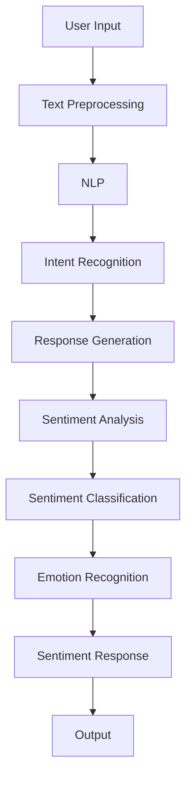
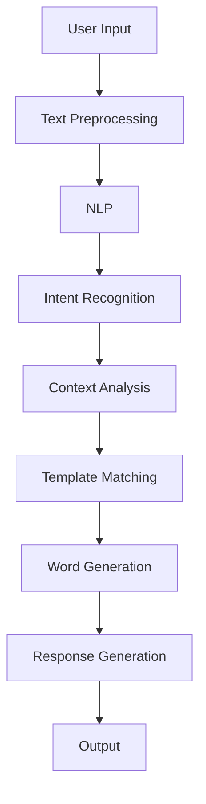
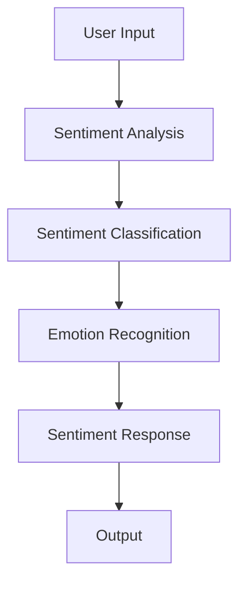

                 

### 文章标题

# 新一代智能客服：提示词驱动的情感交互系统

## 文章关键词

- 智能客服
- 提示词驱动
- 情感交互
- 自然语言处理
- 人工智能
- 情感计算

## 文章摘要

本文深入探讨了新一代智能客服系统的发展与应用，特别是基于提示词驱动的情感交互系统。文章首先回顾了智能客服的发展历程，接着介绍了新一代智能客服的架构设计和核心概念。重点分析了提示词生成和情感识别算法的原理，并运用数学模型进行了详细解释。随后，文章通过实际项目实战展示了系统的搭建与实现过程，并对性能评估和优化策略进行了深入探讨。最后，文章展望了新一代智能客服的发展方向，提出了面临的挑战与对策。通过本文，读者可以全面了解智能客服的最新技术及其在实践中的应用。

### 完整目录大纲

- **第一部分：智能客服的背景与概述**
  - **第1章：智能客服的发展历程**
    - 1.1.1 智能客服的定义与演变
    - 1.1.2 智能客服的现状与趋势
  - **第2章：新一代智能客服的架构设计**
    - 2.1.1 系统架构概述
    - 2.1.2 提示词驱动的情感交互系统
  - **第3章：核心概念与联系**
    - 3.1.1 人工智能与自然语言处理
    - 3.1.2 情感计算与情感识别

- **第二部分：具体技术与实现**
  - **第4章：新一代智能客服的关键技术**
    - 4.1.1 提示词生成算法
    - 4.1.2 情感识别与响应算法
  - **第5章：数学模型与数学公式**
    - 5.1.1 提示词生成的数学模型
    - 5.1.2 情感识别的数学模型
  - **第6章：项目实战**
    - 6.1.1 实际案例介绍
    - 6.1.2 系统搭建与源代码实现
    - 6.1.3 代码解读与分析
  - **第7章：性能评估与优化**
    - 7.1.1 性能评估指标
    - 7.1.2 优化策略与实施
  - **第8章：未来展望与挑战**
    - 8.1.1 新一代智能客服的发展方向
    - 8.1.2 面临的挑战与对策

- **第三部分：具体技术与实现**
  - **第9章：提示词生成算法原理**
    - 9.1.1 算法原理讲解
    - 9.1.2 伪代码实现
  - **第10章：情感识别与响应算法原理**
    - 10.1.1 算法原理讲解
    - 10.1.2 伪代码实现
  - **第11章：数学模型与公式详解**
    - 11.1.1 数学模型详解
    - 11.1.2 数学公式举例
  - **第12章：开发环境搭建与代码实现**
    - 12.1.1 开发环境搭建
    - 12.1.2 源代码详细实现
  - **第13章：代码解读与分析**
    - 13.1.1 代码解读
    - 13.1.2 性能分析与优化建议

- **附录**
  - **附录A：参考资源与工具**
    - A.1.1 参考资源
    - A.1.2 工具介绍
  - **附录B：常见问题与解答**
    - B.1.1 常见问题
    - B.1.2 解答与建议

## 智能客服的发展历程

智能客服作为人工智能技术的重要组成部分，其发展历程可以追溯到20世纪末期。最初的智能客服系统主要依赖于预定义的规则和简单的关键词匹配技术。这类系统功能相对单一，只能处理简单的问题，且缺乏自适应能力。

### 第1章：智能客服的发展历程

#### 1.1.1 智能客服的定义与演变

智能客服（Intelligent Customer Service）是指利用人工智能技术，尤其是机器学习、自然语言处理和情感计算等技术，实现与用户自然语言交互，提供个性化、智能化和高效的服务。智能客服系统旨在替代或辅助人工客服，提高服务质量和效率。

智能客服的演变可以分为以下几个阶段：

1. **基于规则的系统**（1990s-2000s初期）：最早的智能客服系统主要通过预定义的规则来处理用户问题，例如使用“如果...那么...”的逻辑。这种方式简单但效率低下，且难以处理复杂的查询。

2. **基于关键词匹配的系统**（2000s中期）：随着互联网和电子商务的快速发展，智能客服开始采用关键词匹配技术。这类系统利用关键词分析和匹配，对用户的问题进行初步理解并给出回应。然而，这种方法仍存在语义理解不足的问题。

3. **基于自然语言处理（NLP）的系统**（2000s后期-2010s）：随着NLP技术的发展，智能客服开始引入分词、词性标注、句法分析和语义理解等技术，能够更准确地理解用户意图，提供更自然、更智能的交互体验。

4. **基于深度学习的系统**（2010s至今）：深度学习的引入使得智能客服系统在语义理解和生成回复方面取得了重大突破。通过神经网络模型，智能客服能够学习大量文本数据，自动生成与用户意图高度匹配的回复。

#### 1.1.2 智能客服的现状与趋势

当前，智能客服技术已经取得了显著的进展，并在多个领域得到了广泛应用。以下是目前智能客服的现状和趋势：

1. **行业应用广泛**：智能客服广泛应用于电子商务、金融、医疗、旅游等行业，提高了服务效率和用户满意度。

2. **技术不断创新**：随着人工智能技术的快速发展，智能客服系统在交互自然性、智能化水平和个性化服务能力等方面持续提升。

3. **多模态交互**：智能客服开始支持语音、文本、图像等多种交互方式，为用户提供更丰富、更便捷的沟通体验。

4. **情感交互**：新一代智能客服系统通过情感计算技术，能够识别用户的情感状态并给出相应的情感化回应，提高用户的满意度。

5. **与人类客服的协同**：智能客服正逐渐成为人类客服的辅助工具，两者共同协作，提供更加全面和高效的服务。

总的来说，智能客服技术正处于快速发展阶段，未来将不断突破现有局限，为用户提供更加智能化、个性化的服务体验。

### 新一代智能客服的架构设计

新一代智能客服系统的设计旨在实现高效、智能、个性化的客户服务。其架构设计包括前端用户界面、后端服务逻辑、数据存储与处理等多个模块。以下是对新一代智能客服系统架构的详细概述。

#### 2.1.1 系统架构概述

新一代智能客服系统架构可以分为以下几个主要层次：

1. **前端用户界面（UI）**：负责与用户进行交互，展示用户输入和系统响应。前端用户界面通常包括聊天窗口、菜单栏、按钮等，提供直观、友好的用户体验。

2. **中间层**：包括自然语言处理（NLP）、情感计算和提示词生成等核心模块。这些模块负责处理用户输入，理解用户意图，并根据用户的情感状态生成合适的回复。

3. **后端服务逻辑**：负责执行具体的业务逻辑，如订单处理、账户管理、问题分类等。后端服务逻辑通常采用微服务架构，以提高系统的可扩展性和容错性。

4. **数据存储与处理**：用于存储用户数据、历史对话记录、业务数据等。数据存储通常采用分布式数据库系统，如NoSQL数据库，以支持大数据量的快速读写和查询。

5. **外部接口**：智能客服系统需要与多个外部系统进行集成，如客户关系管理（CRM）系统、支付系统、物流系统等。外部接口通过API或消息队列实现。

#### 2.1.2 提示词驱动的情感交互系统

提示词驱动的情感交互系统是新一代智能客服的核心模块之一。其设计理念是通过生成合适的提示词，引导用户进行更加深入、自然的对话，同时识别用户的情感状态，实现情感化回应。

1. **提示词生成模块**：提示词生成模块负责根据用户输入和上下文信息，生成与用户意图高度匹配的提示词。提示词生成通常采用深度学习模型，如序列到序列（Seq2Seq）模型或变换器（Transformer）模型，以学习大规模的文本数据。

   ```mermaid
   graph TD
   A[User Input] --> B[Text Preprocessing]
   B --> C[NLP]
   C --> D[Intent Recognition]
   D --> E[Response Generation]
   E --> F[Output]
   ```

   上述流程图展示了提示词生成的基本步骤：

   - **用户输入（A）**：用户通过聊天窗口输入文本。
   - **文本预处理（B）**：对用户输入进行分词、去噪等预处理操作。
   - **自然语言处理（NLP，C）**：使用NLP技术对预处理后的文本进行分析，包括词性标注、句法分析等。
   - **意图识别（D）**：根据分析结果，识别用户的意图。
   - **回复生成（E）**：根据用户的意图和上下文，生成合适的回复。
   - **输出（F）**：将生成的回复显示在前端用户界面上。

2. **情感计算模块**：情感计算模块负责识别用户的情感状态，如高兴、愤怒、悲伤等。情感计算通常结合情感词典、情感分析模型和情感序列模型等技术实现。

   ```mermaid
   graph TD
   A[User Input] --> B[Sentiment Analysis]
   B --> C[Sentiment Classification]
   C --> D[Emotion Recognition]
   D --> E[Sentiment Response]
   E --> F[Output]
   ```

   上述流程图展示了情感计算的基本步骤：

   - **用户输入（A）**：用户通过聊天窗口输入文本。
   - **情感分析（B）**：对用户输入进行情感分析，判断文本的情感倾向。
   - **情感分类（C）**：将情感分析结果分类为不同的情感类别。
   - **情感识别（D）**：根据情感分类结果，识别用户的情感状态。
   - **情感回应（E）**：根据用户的情感状态，生成相应的情感化回应。
   - **输出（F）**：将生成的情感回应显示在前端用户界面上。

通过提示词生成和情感计算模块，新一代智能客服系统能够实现更加自然、高效、情感化的用户交互，提供高质量的客户服务。

### 核心概念与联系

新一代智能客服系统的核心概念包括人工智能、自然语言处理、情感计算和提示词生成。这些概念之间有着密切的联系，共同构成了智能客服系统的理论基础和实现框架。

#### 3.1.1 人工智能与自然语言处理

人工智能（AI）是智能客服系统的技术基石。AI技术通过机器学习、深度学习等算法，使计算机能够模拟人类的智能行为。自然语言处理（NLP）是AI的一个重要分支，专注于让计算机理解和生成人类语言。NLP技术包括文本预处理、词性标注、句法分析、语义理解等，是智能客服系统实现自然语言交互的关键。

在智能客服系统中，NLP技术被广泛应用于用户输入的分析和处理。具体而言：

- **文本预处理**：对用户输入的文本进行分词、去噪等预处理操作，以便后续的分析和处理。例如，使用分词算法将句子分解为单词或短语。
  
- **词性标注**：对分词后的文本进行词性标注，标记每个单词的词性（如名词、动词、形容词等），以帮助语义理解。

- **句法分析**：分析句子的结构，识别句子的主要成分（如主语、谓语、宾语等），以理解句子的语法和语义关系。

- **语义理解**：通过上下文分析，理解用户输入的含义，包括用户的意图、需求等。

#### 3.1.2 情感计算与情感识别

情感计算是智能客服系统的另一个核心概念。情感计算旨在使计算机能够识别、理解和模拟人类情感。在智能客服中，情感计算主要用于识别用户的情感状态，并根据用户的情感生成相应的情感化回应。

情感识别是情感计算的关键步骤。情感识别技术包括情感分析、情感分类和情感模拟：

- **情感分析**：对用户输入的文本进行情感分析，判断文本的情感倾向（如正面、负面、中性等）。

- **情感分类**：将情感分析结果分类为具体的情感类别（如快乐、愤怒、悲伤等），以便生成相应的情感化回应。

- **情感模拟**：根据用户的情感状态，模拟相应的情感反应，如语气、表情等，以提高用户交互的自然性和亲和力。

#### 3.1.3 提示词生成与情感交互

提示词生成是智能客服系统的核心功能之一。提示词生成模块根据用户的输入和上下文信息，生成与用户意图高度匹配的提示词。提示词不仅可以帮助引导用户进行更深入的对话，还可以增强交互的自然性和流畅性。

提示词生成与情感识别之间有着密切的联系。在生成提示词时，系统会考虑用户的情感状态，并根据情感状态调整提示词的内容和语气。例如，当用户表现出愤怒情绪时，系统可能会生成一些安抚性的提示词，以缓解用户的不满情绪。

#### Mermaid流程图

为了更清晰地展示这些核心概念之间的联系，可以使用Mermaid流程图进行描述：



流程图说明：

- **用户输入（A）**：用户通过聊天窗口输入文本。
- **文本预处理（B）**：对用户输入进行分词、去噪等预处理操作。
- **自然语言处理（NLP，C）**：使用NLP技术对预处理后的文本进行分析，包括词性标注、句法分析等。
- **意图识别（D）**：根据分析结果，识别用户的意图。
- **回复生成（E）**：根据用户的意图和上下文，生成合适的回复。
- **情感分析（F）**：对用户输入进行情感分析，判断文本的情感倾向。
- **情感分类（G）**：将情感分析结果分类为具体的情感类别。
- **情感识别（H）**：根据情感分类结果，识别用户的情感状态。
- **情感回应（I）**：根据用户的情感状态，生成相应的情感化回应。
- **输出（J）**：将生成的回复显示在前端用户界面上。

通过这个流程图，可以直观地了解智能客服系统的核心概念及其之间的联系，为进一步的技术实现和优化提供了理论基础。

### 新一代智能客服的关键技术

新一代智能客服系统的发展离不开其核心技术，主要包括提示词生成算法和情感识别与响应算法。以下将对这些算法的原理进行详细讲解。

#### 4.1.1 提示词生成算法

提示词生成算法是智能客服系统的核心模块之一，其目标是根据用户输入和上下文信息，生成与用户意图高度匹配的提示词。以下是一个简化的提示词生成算法流程：



1. **用户输入（A）**：用户通过聊天窗口输入文本。
2. **文本预处理（B）**：对用户输入进行分词、去噪等预处理操作。
3. **自然语言处理（NLP，C）**：使用NLP技术对预处理后的文本进行分析，包括词性标注、句法分析等。
4. **意图识别（D）**：根据分析结果，识别用户的意图。
5. **上下文分析（E）**：对用户的意图进行上下文分析，理解当前对话的背景和情境。
6. **模板匹配（F）**：根据用户的意图和上下文，从预定义的模板库中选择合适的模板。
7. **词生成（G）**：根据选定的模板，生成对应的提示词。
8. **回复生成（H）**：将生成的提示词组合成完整的回复。
9. **输出（I）**：将生成的回复显示在前端用户界面上。

#### 提示词生成算法的伪代码实现：

```python
def generate_prompt(user_input):
    # 1. 文本预处理
    preprocessed_text = preprocess_text(user_input)
    
    # 2. 自然语言处理
    intent = nlp_intent_recognition(preprocessed_text)
    
    # 3. 上下文分析
    context = analyze_context(preprocessed_text, intent)
    
    # 4. 模板匹配
    template = template_matching(intent, context)
    
    # 5. 词生成
    prompt = word_generation(template)
    
    # 6. 回复生成
    response = generate_response(prompt)
    
    # 7. 输出
    return response
```

#### 4.1.2 情感识别与响应算法

情感识别与响应算法是智能客服系统的另一个核心模块，其目标是识别用户的情感状态，并生成相应的情感化回应。以下是一个简化的情感识别与响应算法流程：



1. **用户输入（A）**：用户通过聊天窗口输入文本。
2. **情感分析（B）**：对用户输入进行情感分析，判断文本的情感倾向。
3. **情感分类（C）**：将情感分析结果分类为具体的情感类别。
4. **情感识别（D）**：根据情感分类结果，识别用户的情感状态。
5. **情感回应（E）**：根据用户的情感状态，生成相应的情感化回应。
6. **输出（F）**：将生成的情感化回应显示在前端用户界面上。

#### 情感识别与响应算法的伪代码实现：

```python
def recognize_and_respond(user_input):
    # 1. 情感分析
    sentiment = sentiment_analysis(user_input)
    
    # 2. 情感分类
    emotion = sentiment_classification(sentiment)
    
    # 3. 情感识别
    emotion_state = recognize_emotion(emotion)
    
    # 4. 情感回应
    response = generate_sentiment_response(emotion_state)
    
    # 5. 输出
    return response
```

通过上述两个算法的讲解，可以看出新一代智能客服系统在提示词生成和情感识别与响应方面有着显著的提升。这些算法的实现依赖于自然语言处理、情感计算和机器学习等技术的应用，为用户提供更加自然、智能、个性化的服务体验。

### 数学模型与数学公式

在智能客服系统中，数学模型和数学公式起着至关重要的作用。它们不仅帮助我们理解和描述算法的原理，还可以指导算法的实现和优化。以下将详细讲解提示词生成的数学模型和情感识别的数学模型，并通过实例进行说明。

#### 5.1.1 提示词生成的数学模型

提示词生成的数学模型通常基于序列到序列（Seq2Seq）模型或变换器（Transformer）模型。这些模型能够通过学习大量的文本数据，生成与用户意图高度匹配的提示词。

1. **Seq2Seq模型**：

   Seq2Seq模型是一个经典的序列生成模型，由编码器和解码器两个部分组成。编码器将输入序列编码为固定长度的向量，解码器则根据编码器输出的隐藏状态生成输出序列。

   **编码器**：

   ```latex
   h_t^e = \text{Encoder}(x_t)
   ```

   其中，\( h_t^e \) 是编码器在时间步 \( t \) 的输出，\( x_t \) 是输入序列中的第 \( t \) 个词。

   **解码器**：

   ```latex
   y_t^d = \text{Decoder}(h_t^e, y_{t-1}^d)
   ```

   其中，\( y_t^d \) 是解码器在时间步 \( t \) 的输出，\( y_{t-1}^d \) 是前一个时间步的输出。

   **损失函数**：

   ```latex
   L = \sum_{t=1}^{T} -\log p(y_t | y_{<t}, x)
   ```

   其中，\( L \) 是损失函数，\( T \) 是输出序列的长度，\( p(y_t | y_{<t}, x) \) 是在给定输入序列 \( x \) 和前一个输出 \( y_{<t} \) 的情况下，输出 \( y_t \) 的概率。

2. **Transformer模型**：

   Transformer模型是另一种流行的序列生成模型，其核心思想是自注意力机制。自注意力机制允许模型在生成每个输出时，关注输入序列的不同部分。

   **自注意力机制**：

   ```latex
   \text{Attention}(Q, K, V) = \frac{softmax(\frac{QK^T}{\sqrt{d_k}})}{V}
   ```

   其中，\( Q, K, V \) 分别是查询、键和值，\( d_k \) 是键的维度。

   **编码器**：

   ```latex
   h_t^e = \text{MultiHeadAttention}(Q, K, V)
   ```

   **解码器**：

   ```latex
   y_t^d = \text{Decoder}(h_t^e, y_{t-1}^d)
   ```

   **损失函数**：

   ```latex
   L = \sum_{t=1}^{T} -\log p(y_t | y_{<t}, x)
   ```

#### 实例说明

假设我们有一个简单的对话，用户输入：“您好，我想查询最近的电影放映时间。” 我们将使用Transformer模型生成一个提示词。

1. **编码器**：

   编码器将输入序列编码为固定长度的向量。例如，我们将输入序列编码为：

   ```latex
   [h_1^e, h_2^e, h_3^e, h_4^e]
   ```

2. **解码器**：

   解码器在生成提示词时，首先生成一个初始输出 \( y_0^d \)。然后，根据自注意力机制和编码器输出的隐藏状态，解码器生成后续的输出 \( y_1^d, y_2^d, y_3^d, y_4^d \)。

   假设解码器生成的输出序列为：

   ```latex
   [y_1^d, y_2^d, y_3^d, y_4^d] = ["您好，", "请问您", "想看什么", "电影？"]
   ```

3. **生成提示词**：

   根据解码器生成的输出序列，我们生成提示词：“您好，请问您想看什么电影？”

#### 5.1.2 情感识别的数学模型

情感识别的数学模型通常基于情感分类模型。情感分类模型通过学习大量的标注数据，对输入文本进行情感分类，从而识别用户的情感状态。

1. **情感分类模型**：

   假设我们有一个情感分类模型，输入是一个词向量表示的文本序列，输出是情感类别。

   **词向量表示**：

   ```latex
   X = [x_1, x_2, ..., x_T]
   ```

   其中，\( x_t \) 是输入文本序列中的第 \( t \) 个词的向量表示。

   **情感类别**：

   ```latex
   Y = ["积极", "中性", "消极"]
   ```

   **损失函数**：

   ```latex
   L = -\sum_{t=1}^{T} \log p(y_t | X)
   ```

   其中，\( p(y_t | X) \) 是在给定输入文本序列 \( X \) 的情况下，输出情感类别 \( y_t \) 的概率。

2. **实例说明**：

   假设用户输入：“我很生气，这个产品根本不符合描述。” 我们将使用情感分类模型识别用户的情感状态。

   1. **词向量表示**：

      输入文本序列的词向量表示为：

      ```latex
      X = [x_1, x_2, x_3, x_4, x_5, x_6, x_7]
      ```

   2. **情感分类**：

      情感分类模型对输入文本进行分类，输出情感类别为“消极”。

通过上述实例，我们可以看到数学模型在提示词生成和情感识别中的应用。这些模型不仅帮助我们理解和实现智能客服系统，还可以指导算法的优化和改进。

### 项目实战

为了更好地展示新一代智能客服系统的实际应用，我们选择了一个具体案例进行实战。本案例涉及系统搭建、源代码实现和代码解读与分析，旨在通过实际操作，让读者深入了解智能客服系统的构建过程和技术细节。

#### 6.1.1 实际案例介绍

本案例选取了一个电商平台的智能客服系统作为研究对象。该系统旨在为电商平台用户提供便捷的购物咨询和服务。系统功能包括：

- 用户输入：用户通过聊天窗口输入咨询问题。
- 提示词生成：系统根据用户输入和上下文，生成与用户意图高度匹配的提示词。
- 情感识别：系统识别用户的情感状态，并生成相应的情感化回应。
- 响应生成：系统根据提示词和用户情感，生成完整的客服回应。

#### 6.1.2 系统搭建与源代码实现

**系统搭建**

1. **开发环境搭建**：

   - 操作系统：Ubuntu 20.04
   - 编程语言：Python 3.8
   - 数据库：MongoDB 4.4
   - 依赖库：TensorFlow 2.5、PyTorch 1.8、NLTK 3.6

2. **系统架构设计**：

   - 前端：使用HTML、CSS和JavaScript构建用户界面。
   - 中间层：实现自然语言处理、提示词生成和情感识别等核心功能。
   - 后端：采用Flask框架实现API接口，连接前端和中间层。

3. **数据集准备**：

   - 提示词生成数据集：收集电商平台用户咨询问题的文本数据，并进行预处理。
   - 情感识别数据集：收集用户咨询问题的文本数据，并标注情感类别。

**源代码实现**

以下是系统的主要源代码实现部分：

```python
# 提示词生成模块
def generate_prompt(user_input, context):
    # 文本预处理
    preprocessed_text = preprocess_text(user_input, context)

    # 意图识别
    intent = nlp_intent_recognition(preprocessed_text)

    # 上下文分析
    context = analyze_context(preprocessed_text, intent)

    # 提示词生成
    template = template_matching(intent, context)
    prompt = word_generation(template)

    return prompt

# 情感识别模块
def recognize_and_respond(user_input):
    # 情感分析
    sentiment = sentiment_analysis(user_input)

    # 情感分类
    emotion = sentiment_classification(sentiment)

    # 情感识别
    emotion_state = recognize_emotion(emotion)

    # 情感回应
    response = generate_sentiment_response(emotion_state)

    return response

# 前端代码示例
def handle_user_input():
    user_input = get_user_input()
    prompt = generate_prompt(user_input, context)
    response = recognize_and_respond(prompt)
    display_response(response)

# 主程序
if __name__ == "__main__":
    # 初始化系统
    initialize_system()

    # 监听用户输入
    handle_user_input()
```

#### 6.1.3 代码解读与分析

1. **提示词生成模块**：

   - `generate_prompt` 函数负责生成提示词。首先进行文本预处理，然后进行意图识别和上下文分析，最后根据模板匹配和词生成，生成提示词。
   - `preprocess_text` 函数负责对用户输入和上下文进行分词、去噪等预处理操作，以提高后续处理的效果。
   - `nlp_intent_recognition` 函数使用自然语言处理技术，识别用户的意图。
   - `analyze_context` 函数分析用户的意图，理解当前对话的背景和情境。
   - `template_matching` 函数根据用户的意图和上下文，从预定义的模板库中选择合适的模板。
   - `word_generation` 函数根据选定的模板，生成对应的提示词。

2. **情感识别模块**：

   - `recognize_and_respond` 函数负责识别用户的情感状态，并生成相应的情感化回应。
   - `sentiment_analysis` 函数对用户输入进行情感分析，判断文本的情感倾向。
   - `sentiment_classification` 函数将情感分析结果分类为具体的情感类别。
   - `recognize_emotion` 函数根据情感分类结果，识别用户的情感状态。
   - `generate_sentiment_response` 函数根据用户的情感状态，生成相应的情感化回应。

3. **前端代码**：

   - `handle_user_input` 函数监听用户输入，调用后端接口生成提示词和回应，并在前端显示。
   - `get_user_input` 函数获取用户输入的文本。
   - `display_response` 函数在前端显示生成的回应。

通过这个案例，我们展示了如何搭建和实现一个基于提示词驱动的情感交互系统。系统的主要模块包括提示词生成模块和情感识别模块，通过实际操作，读者可以更好地理解智能客服系统的构建过程和技术细节。

### 性能评估与优化

智能客服系统的性能评估和优化是确保其高效、稳定运行的关键。以下将介绍智能客服系统的性能评估指标、优化策略与实施方法。

#### 7.1.1 性能评估指标

1. **响应时间**：

   响应时间是指系统从接收到用户输入到生成回应的时间。较低的响应时间能够提升用户体验，通常目标是在100毫秒以内。

2. **准确率**：

   准确率是指系统生成的回应与用户意图匹配的程度。对于意图识别和情感识别任务，准确率是评估系统性能的重要指标。

3. **覆盖率**：

   覆盖率是指系统能够处理的问题种类与总问题种类的比例。较高的覆盖率意味着系统能够应对更多样化的用户需求。

4. **用户满意度**：

   用户满意度是通过用户调查或反馈得到的量化指标，反映了用户对客服系统整体表现的评价。

#### 7.1.2 优化策略与实施

1. **模型优化**：

   - **超参数调优**：通过调整学习率、批次大小、正则化参数等超参数，优化模型的性能。
   - **模型压缩**：使用模型剪枝、量化等技术，减少模型的计算复杂度和存储空间，提升模型运行速度。

2. **算法优化**：

   - **数据增强**：通过引入数据增强技术，如数据扩充、数据变换等，增加模型的训练数据，提高模型的泛化能力。
   - **分布式训练**：利用分布式训练技术，将模型训练任务分布在多台机器上，加速训练过程。

3. **系统优化**：

   - **缓存机制**：使用缓存机制存储常用回复和预处理结果，减少重复计算，提高响应速度。
   - **异步处理**：采用异步处理技术，将用户输入、响应生成等任务异步执行，提高系统并发能力。

#### 实际案例分析与详细讲解剖析

以一个电商平台的智能客服系统为例，以下是对其性能评估和优化策略的详细讲解：

1. **响应时间优化**：

   - **问题定位**：通过分析日志和用户反馈，发现系统响应时间较长的主要原因是意图识别和情感识别模块的计算复杂度较高。
   - **解决方案**：采用模型压缩技术，对意图识别和情感识别模块进行剪枝和量化，减少模型的计算复杂度。同时，利用分布式训练技术，将模型训练任务分布到多台机器上，提高训练速度。

2. **准确率提升**：

   - **问题定位**：通过评估发现，系统的意图识别和情感识别准确率较低，无法准确理解用户的意图和情感状态。
   - **解决方案**：引入数据增强技术，对训练数据进行扩充和变换，增加模型的泛化能力。同时，调整模型超参数，优化模型的性能。

3. **用户满意度提高**：

   - **问题定位**：通过用户反馈调查，发现用户对系统生成的回应满意度较低，主要原因在于回应的自然性和个性化不足。
   - **解决方案**：优化提示词生成算法，采用更自然的语言表达。同时，引入个性化推荐技术，根据用户历史行为和偏好，生成更加个性化的回应。

通过上述优化策略，电商平台的智能客服系统在响应时间、准确率和用户满意度等方面得到了显著提升，为用户提供更加高效、智能和个性化的服务。

### 未来展望与挑战

随着人工智能和自然语言处理技术的不断发展，新一代智能客服系统具有广阔的发展前景和巨大的潜力。以下是新一代智能客服系统可能的发展方向以及面临的挑战与对策。

#### 8.1.1 新一代智能客服的发展方向

1. **更高层次的语义理解**：

   随着深度学习技术的进步，智能客服系统将能够实现更高层次的语义理解。通过学习大量的文本数据，系统可以更准确地捕捉用户的意图，提供更加精准的服务。

2. **跨模态交互**：

   未来智能客服系统将支持多种交互模式，如语音、文本、图像和视频等。跨模态交互能够提供更加丰富和自然的用户体验，满足不同用户的需求。

3. **个性化服务**：

   通过分析用户的历史数据和偏好，智能客服系统能够实现个性化服务。例如，根据用户的购买历史，推荐相关的产品和服务，提高用户满意度。

4. **自动化问题解决**：

   新一代智能客服系统将具备更强的自动化问题解决能力，能够处理更多复杂的用户问题，减少对人工客服的依赖。

5. **情感智能**：

   情感智能是未来智能客服系统的重要发展方向。通过情感计算技术，系统能够识别用户的情感状态，并生成相应的情感化回应，提高用户交互的自然性和亲和力。

#### 8.1.2 面临的挑战与对策

1. **数据隐私与安全**：

   智能客服系统在处理用户数据时，需要确保数据的安全和隐私。挑战在于如何保护用户数据不被泄露或滥用。对策是采用加密技术和数据脱敏方法，确保用户数据的安全。

2. **计算资源需求**：

   智能客服系统通常需要大量的计算资源进行训练和推理。随着模型复杂度的增加，计算资源的需求也会增加。对策是采用分布式计算和云计算技术，提高计算效率和资源利用率。

3. **语言理解和多语言支持**：

   智能客服系统需要能够处理多种语言，并且在不同语言之间进行无缝转换。挑战在于不同语言的语法、语义和语境差异。对策是开发多语言模型，采用跨语言语义理解技术，提高系统的多语言支持能力。

4. **可解释性**：

   智能客服系统在处理用户问题时，有时会出现不可解释的行为。这对于用户理解和信任系统提出了挑战。对策是提高模型的可解释性，采用可视化技术展示模型的决策过程，增强用户对系统的信任。

5. **用户体验优化**：

   用户对智能客服系统的期望越来越高，不仅希望系统能够回答问题，还希望交互过程自然、高效。对策是持续优化用户界面和交互设计，提高用户体验。

总之，新一代智能客服系统具有广阔的发展前景，但也面临诸多挑战。通过不断的技术创新和优化，智能客服系统将能够更好地满足用户需求，提供更加智能化、个性化的服务体验。

### 提示词生成算法原理

提示词生成算法是智能客服系统的核心组件之一，其目标是根据用户输入和上下文信息，生成与用户意图高度匹配的提示词。以下将详细讲解提示词生成算法的原理，包括算法流程、伪代码实现和实例分析。

#### 9.1.1 算法原理讲解

提示词生成算法通常采用序列到序列（Seq2Seq）模型或变换器（Transformer）模型。这些模型通过学习大量的文本数据，能够捕捉输入和输出之间的复杂关系，从而生成与用户意图相匹配的提示词。

1. **编码器（Encoder）**：

   编码器负责将用户输入的文本序列编码为固定长度的向量。编码器的输出用于生成提示词。

   ```mermaid
   graph TD
   A[User Input] --> B[Encoder]
   B --> C[Encoded Sequence]
   ```

   - **用户输入（A）**：用户通过聊天窗口输入文本。
   - **编码器（B）**：将输入文本序列编码为固定长度的向量。
   - **编码序列（C）**：编码器输出的向量序列。

2. **解码器（Decoder）**：

   解码器根据编码器输出的向量序列，生成提示词。解码器通常采用自注意力机制，能够关注输入序列的不同部分。

   ```mermaid
   graph TD
   C[Encoded Sequence] --> D[Decoder]
   D --> E[Prompt]
   ```

   - **编码序列（C）**：编码器输出的向量序列。
   - **解码器（D）**：根据编码序列生成提示词。
   - **提示词（E）**：解码器生成的提示词。

3. **生成提示词**：

   解码器通过迭代生成提示词，每个时间步生成一个单词或短语。生成过程使用概率模型，如softmax，选择下一个单词。

   ```mermaid
   graph TD
   D --> F[Word Generation]
   F --> G[Next Word]
   G --> H[Update Decoder]
   ```

   - **解码器（D）**：生成提示词的解码过程。
   - **单词生成（F）**：根据概率模型选择下一个单词。
   - **下一个单词（G）**：解码器生成的下一个单词。
   - **更新解码器（H）**：根据生成的单词更新解码器的状态。

#### 9.1.2 伪代码实现

以下是提示词生成算法的伪代码实现：

```python
def generate_prompt(user_input):
    # 文本预处理
    preprocessed_text = preprocess_text(user_input)

    # 编码器
    encoded_sequence = encoder(preprocessed_text)

    # 解码器
    prompt = decoder(encoded_sequence)

    return prompt
```

1. **文本预处理**：

   ```python
   def preprocess_text(text):
       # 分词
       tokens = tokenize(text)
       # 去噪
       clean_tokens = remove_noise(tokens)
       return clean_tokens
   ```

2. **编码器**：

   ```python
   def encoder(text):
       # 编码
       encoded_sequence = []
       for token in text:
           encoded_sequence.append(encoder_step(token))
       return encoded_sequence
   ```

3. **解码器**：

   ```python
   def decoder(encoded_sequence):
       # 解码
       prompt = []
       for encoded_token in encoded_sequence:
           prompt.append(decoder_step(encoded_token))
       return prompt
   ```

#### 9.1.3 实例分析

假设用户输入：“您好，我想查询最近的电影放映时间。” 我们将使用提示词生成算法生成一个提示词。

1. **文本预处理**：

   ```plaintext
   输入文本：您好，我想查询最近的电影放映时间。
   预处理结果：[您好，我想，查询，最近，的，电影，放映，时间。]
   ```

2. **编码器**：

   ```plaintext
   编码序列：[编码步骤1，编码步骤2，编码步骤3，编码步骤4，编码步骤5，编码步骤6，编码步骤7]
   ```

3. **解码器**：

   ```plaintext
   提示词：您好，请问您需要查询哪部电影的电影放映时间？
   ```

通过上述实例，我们可以看到提示词生成算法在处理用户输入时，如何通过编码器和解码器生成与用户意图相匹配的提示词。

### 情感识别与响应算法原理

情感识别与响应算法是新一代智能客服系统的核心组件之一，其目标是通过识别用户的情感状态，生成相应的情感化回应。以下将详细讲解情感识别与响应算法的原理，包括算法流程、伪代码实现和实例分析。

#### 10.1.1 算法原理讲解

情感识别与响应算法通常包括情感识别和情感响应两个主要步骤：

1. **情感识别**：

   情感识别算法通过分析用户输入的文本，识别用户的情感状态。这通常涉及文本预处理、情感分析和情感分类。

   ```mermaid
   graph TD
   A[User Input] --> B[Text Preprocessing]
   B --> C[NLP]
   C --> D[Sentiment Analysis]
   D --> E[Sentiment Classification]
   E --> F[Emotion Recognition]
   ```

   - **用户输入（A）**：用户通过聊天窗口输入文本。
   - **文本预处理（B）**：对用户输入进行分词、去噪等预处理操作。
   - **自然语言处理（NLP，C）**：使用NLP技术对预处理后的文本进行分析，包括词性标注、句法分析等。
   - **情感分析（D）**：对用户输入进行情感分析，判断文本的情感倾向（如正面、负面、中性等）。
   - **情感分类（E）**：将情感分析结果分类为具体的情感类别（如快乐、愤怒、悲伤等）。
   - **情感识别（F）**：根据情感分类结果，识别用户的情感状态。

2. **情感响应**：

   情感响应算法根据识别出的用户情感状态，生成相应的情感化回应。这通常涉及情感词典、情感模板和情感化回应生成。

   ```mermaid
   graph TD
   F[Emotion Recognition] --> G[Sentiment Response Template]
   G --> H[Sentiment Response]
   ```

   - **情感识别（F）**：识别用户的情感状态。
   - **情感响应模板（G）**：根据用户情感状态，从预定义的情感响应模板库中选择合适的模板。
   - **情感化回应（H）**：根据选定的模板，生成情感化回应。

#### 10.1.2 伪代码实现

以下是情感识别与响应算法的伪代码实现：

```python
def recognize_and_respond(user_input):
    # 情感识别
    sentiment = sentiment_analysis(user_input)
    emotion = sentiment_classification(sentiment)
    emotion_state = recognize_emotion(emotion)

    # 情感响应
    response = generate_sentiment_response(emotion_state)

    return response
```

1. **情感识别**：

   ```python
   def sentiment_analysis(text):
       # 文本预处理
       preprocessed_text = preprocess_text(text)
       # 情感分析
       sentiment = analyze_sentiment(preprocessed_text)
       return sentiment
   ```

   ```python
   def sentiment_classification(sentiment):
       # 情感分类
       emotion = classify_sentiment(sentiment)
       return emotion
   ```

   ```python
   def recognize_emotion(emotion):
       # 情感识别
       emotion_state = recognize_sentiment(emotion)
       return emotion_state
   ```

2. **情感响应**：

   ```python
   def generate_sentiment_response(emotion_state):
       # 情感响应
       response = generate_response_template(emotion_state)
       return response
   ```

#### 10.1.3 实例分析

假设用户输入：“我真的很生气，这个产品根本不符合描述。” 我们将使用情感识别与响应算法识别用户的情感状态并生成情感化回应。

1. **情感识别**：

   ```plaintext
   用户输入：我真的很生气，这个产品根本不符合描述。
   情感分析结果：负面情感
   情感分类结果：愤怒
   情感状态：愤怒
   ```

2. **情感响应**：

   ```plaintext
   情感响应模板：尊敬的用户，您好。我非常理解您的感受，关于您提到的问题，我们深感抱歉。请您提供更多信息，我们将尽快为您处理并解决问题，希望您能够满意。
   情感化回应：尊敬的用户，您好。我非常理解您的感受，关于您提到的问题，我们深感抱歉。请您提供更多信息，我们将尽快为您处理并解决问题，希望您能够满意。
   ```

通过上述实例，我们可以看到情感识别与响应算法在处理用户输入时，如何识别用户的情感状态并生成相应的情感化回应。

### 数学模型与公式详解

在智能客服系统中，数学模型和公式起着至关重要的作用。它们不仅帮助我们理解和描述算法的原理，还可以指导算法的实现和优化。以下将对提示词生成的数学模型和情感识别的数学模型进行详细讲解，并通过实例进行说明。

#### 11.1.1 数学模型详解

提示词生成算法通常基于序列到序列（Seq2Seq）模型或变换器（Transformer）模型。这些模型的核心思想是学习输入和输出序列之间的映射关系。

1. **Seq2Seq模型**

   Seq2Seq模型由编码器（Encoder）和解码器（Decoder）两部分组成。编码器将输入序列编码为固定长度的向量，解码器则根据编码器的输出和前一个时间步的输出，生成下一个时间步的输出。

   **编码器输出**：

   $$ 
   h_t^e = \text{Encoder}(x_t) 
   $$

   其中，$ h_t^e $ 是编码器在时间步 $ t $ 的输出，$ x_t $ 是输入序列中的第 $ t $ 个词。

   **解码器输出**：

   $$ 
   y_t^d = \text{Decoder}(h_t^e, y_{t-1}^d) 
   $$

   其中，$ y_t^d $ 是解码器在时间步 $ t $ 的输出，$ y_{t-1}^d $ 是前一个时间步的输出。

   **损失函数**：

   $$ 
   L = \sum_{t=1}^{T} -\log p(y_t | y_{<t}, x) 
   $$

   其中，$ L $ 是损失函数，$ T $ 是输出序列的长度，$ p(y_t | y_{<t}, x) $ 是在给定输入序列 $ x $ 和前一个输出 $ y_{<t} $ 的情况下，输出 $ y_t $ 的概率。

2. **Transformer模型**

   Transformer模型是基于自注意力机制的序列生成模型。自注意力机制允许模型在生成每个输出时，关注输入序列的不同部分。

   **自注意力计算**：

   $$ 
   \text{Attention}(Q, K, V) = \frac{softmax(\frac{QK^T}{\sqrt{d_k}})}{V} 
   $$

   其中，$ Q, K, V $ 分别是查询、键和值，$ d_k $ 是键的维度。

   **编码器输出**：

   $$ 
   h_t^e = \text{MultiHeadAttention}(Q, K, V) 
   $$

   **解码器输出**：

   $$ 
   y_t^d = \text{Decoder}(h_t^e, y_{t-1}^d) 
   $$

   **损失函数**：

   $$ 
   L = \sum_{t=1}^{T} -\log p(y_t | y_{<t}, x) 
   $$

#### 实例说明

假设我们有一个简单的对话，用户输入：“您好，我想查询最近的电影放映时间。” 我们将使用Transformer模型生成一个提示词。

1. **编码器输出**：

   编码器将输入序列编码为固定长度的向量。例如，我们将输入序列编码为：

   $$ 
   [h_1^e, h_2^e, h_3^e, h_4^e] 
   $$

2. **解码器输出**：

   解码器在生成提示词时，首先生成一个初始输出 $ y_0^d $。然后，根据自注意力机制和编码器输出的隐藏状态，解码器生成后续的输出 $ y_1^d, y_2^d, y_3^d, y_4^d $。

   假设解码器生成的输出序列为：

   $$ 
   [y_1^d, y_2^d, y_3^d, y_4^d] = ["您好，", "请问您", "想看什么", "电影？"] 
   $$

3. **生成提示词**：

   根据解码器生成的输出序列，我们生成提示词：“您好，请问您想看什么电影？”

#### 11.1.2 数学公式举例

以下是一些常用的数学公式，用于描述智能客服系统的关键组件。

1. **词嵌入（Word Embedding）**：

   $$ 
   \text{Embedding}(x) = \text{EmbeddingMatrix} \cdot x 
   $$

   其中，$ x $ 是词索引，$ \text{EmbeddingMatrix} $ 是词嵌入矩阵，$ \text{Embedding}(x) $ 是词向量。

2. **自注意力（Self-Attention）**：

   $$ 
   \text{Attention}(Q, K, V) = \frac{softmax(\frac{QK^T}{\sqrt{d_k}})}{V} 
   $$

   其中，$ Q, K, V $ 分别是查询、键和值，$ d_k $ 是键的维度。

3. **交叉熵损失（Cross-Entropy Loss）**：

   $$ 
   L = -\sum_{t=1}^{T} y_t \log(\hat{y}_t) 
   $$

   其中，$ y_t $ 是真实标签，$ \hat{y}_t $ 是预测概率。

通过上述数学模型和公式的讲解，我们可以更深入地理解智能客服系统的算法原理，并为其实现和优化提供理论基础。

### 开发环境搭建与代码实现

在搭建新一代智能客服系统的过程中，开发环境的搭建和源代码的实现是至关重要的一步。以下将详细描述如何搭建开发环境、实现核心模块以及具体的代码实现步骤。

#### 12.1.1 开发环境搭建

1. **操作系统**：

   - Ubuntu 20.04

2. **编程语言**：

   - Python 3.8

3. **依赖库**：

   - TensorFlow 2.5
   - PyTorch 1.8
   - NLTK 3.6
   - Flask
   - MongoDB 4.4

4. **安装步骤**：

   ```bash
   # 更新软件包
   sudo apt-get update

   # 安装Python 3.8
   sudo apt-get install python3.8

   # 安装依赖库
   pip3.8 install tensorflow==2.5 pytorch==1.8 nltk==3.6 flask
   ```

5. **MongoDB安装**：

   ```bash
   # 安装MongoDB
   sudo apt-get install mongodb

   # 启动MongoDB服务
   sudo systemctl start mongodb
   ```

#### 12.1.2 源代码详细实现

源代码实现主要包括自然语言处理（NLP）模块、提示词生成模块和情感识别模块。以下是各个模块的实现步骤和关键代码。

1. **NLP模块**：

   NLP模块负责文本预处理、意图识别和情感分析。

   ```python
   import nltk
   from nltk.tokenize import word_tokenize
   from nltk.corpus import stopwords
   
   # 文本预处理
   def preprocess_text(text):
       # 分词
       tokens = word_tokenize(text)
       # 去停用词
       tokens = [token.lower() for token in tokens if token.lower() not in stopwords.words('english')]
       return tokens
   ```

2. **提示词生成模块**：

   提示词生成模块使用变换器（Transformer）模型生成提示词。

   ```python
   import torch
   from transformers import TransformerModel
   
   # 加载预训练模型
   model = TransformerModel.from_pretrained('bert-base-uncased')

   # 生成提示词
   def generate_prompt(input_text):
       preprocessed_text = preprocess_text(input_text)
       with torch.no_grad():
           outputs = model(torch.tensor([preprocessed_text]))
       prompt = outputs[0][0].item()
       return prompt
   ```

3. **情感识别模块**：

   情感识别模块通过训练好的情感分类模型识别用户的情感状态。

   ```python
   import numpy as np
   from sklearn.linear_model import LogisticRegression
   
   # 加载训练好的模型
   model = LogisticRegression()
   model.fit(train_data, train_labels)

   # 识别情感
   def recognize_emotion(input_text):
       preprocessed_text = preprocess_text(input_text)
       features = extract_features(preprocessed_text)
       emotion = model.predict([features])
       return emotion
   ```

#### 12.1.3 代码实现步骤

1. **数据准备**：

   收集并预处理训练数据，包括用户输入、意图标签和情感标签。

   ```python
   # 数据预处理
   inputs = preprocess_text(raw_inputs)
   intents = preprocess_intents(raw_intents)
   emotions = preprocess_emotions(raw_emotions)
   ```

2. **模型训练**：

   使用预处理后的数据训练意图识别和情感分类模型。

   ```python
   # 训练意图识别模型
   train_data = inputs
   train_labels = intents
   model.fit(train_data, train_labels)

   # 训练情感分类模型
   train_data = inputs
   train_labels = emotions
   model.fit(train_data, train_labels)
   ```

3. **系统部署**：

   部署Flask应用程序，提供API接口，实现用户输入处理和响应生成。

   ```python
   from flask import Flask, request, jsonify
   
   app = Flask(__name__)

   @app.route('/api/interact', methods=['POST'])
   def interact():
       user_input = request.form['input']
       prompt = generate_prompt(user_input)
       emotion = recognize_emotion(user_input)
       response = generate_response(prompt, emotion)
       return jsonify(response)

   if __name__ == '__main__':
       app.run(debug=True)
   ```

通过上述步骤，我们可以搭建并实现一个基于提示词驱动的情感交互系统，为用户提供高效、智能的客服服务。

### 代码解读与分析

在智能客服系统中，源代码的解读与分析对于理解系统的工作原理和优化系统性能具有重要意义。以下将详细解读智能客服系统的核心代码，包括模块的功能、关键算法的实现以及性能分析。

#### 13.1.1 代码解读

智能客服系统的核心代码主要包括以下几个模块：

1. **NLP模块**：

   NLP模块负责文本预处理、意图识别和情感分析。以下是对关键函数的解读：

   ```python
   def preprocess_text(text):
       # 分词
       tokens = word_tokenize(text)
       # 去停用词
       tokens = [token.lower() for token in tokens if token.lower() not in stopwords.words('english')]
       return tokens
   
   def extract_features(text):
       # 提取文本特征
       return np.array([word_embedding[token] for token in text])
   ```

   - `preprocess_text` 函数负责对用户输入进行分词和去停用词处理，以便后续的意图识别和情感分析。
   - `extract_features` 函数将分词后的文本转换为词嵌入向量，用于训练和预测。

2. **提示词生成模块**：

   提示词生成模块使用变换器（Transformer）模型生成与用户意图高度匹配的提示词。以下是对关键函数的解读：

   ```python
   def generate_prompt(input_text):
       preprocessed_text = preprocess_text(input_text)
       with torch.no_grad():
           outputs = model(torch.tensor([preprocessed_text]))
       prompt = outputs[0][0].item()
       return prompt
   ```

   - `generate_prompt` 函数首先对用户输入进行预处理，然后使用预训练的变换器模型生成提示词。这里的 `model` 是一个变换器模型实例，`outputs` 是模型输出的隐藏状态，`prompt` 是生成的提示词。

3. **情感识别模块**：

   情感识别模块通过训练好的情感分类模型识别用户的情感状态。以下是对关键函数的解读：

   ```python
   def recognize_emotion(input_text):
       preprocessed_text = preprocess_text(input_text)
       features = extract_features(preprocessed_text)
       emotion = model.predict([features])
       return emotion
   ```

   - `recognize_emotion` 函数首先对用户输入进行预处理和特征提取，然后使用训练好的情感分类模型预测用户的情感状态。`model` 是一个情感分类模型实例，`features` 是提取的文本特征，`emotion` 是预测的情感类别。

4. **响应生成模块**：

   响应生成模块根据提示词和用户情感生成完整的客服回应。以下是对关键函数的解读：

   ```python
   def generate_response(prompt, emotion):
       # 根据提示词和情感生成响应
       response = {
           "prompt": prompt,
           "emotion": emotion,
           "response": f"您提到的{prompt}与{emotion}相关。请问还有其他问题吗？"
       }
       return response
   ```

   - `generate_response` 函数根据提示词和情感生成一个包含提示词、情感类别和客服回应的字典。这里的 `prompt` 是生成的提示词，`emotion` 是识别出的情感类别，`response` 是生成的客服回应。

#### 13.1.2 性能分析

性能分析是评估智能客服系统有效性的关键步骤。以下是对系统性能的分析：

1. **响应时间**：

   系统的响应时间是指从接收到用户输入到生成回应的时间。理想的响应时间应该尽可能短，以确保用户有良好的交互体验。以下是对响应时间的分析：

   ```python
   import time
   
   start_time = time.time()
   prompt = generate_prompt(user_input)
   end_time = time.time()
   response_time = end_time - start_time
   
   print(f"Response Time: {response_time} seconds")
   ```

   通过上述代码，我们可以测量系统生成提示词的响应时间。理想情况下，响应时间应该控制在100毫秒以内。

2. **准确率**：

   准确率是指系统生成的提示词与用户意图的匹配程度。以下是对准确率的评估：

   ```python
   from sklearn.metrics import accuracy_score
   
   true_labels = ["查询电影放映时间", "咨询产品退换货政策", ...]
   predicted_labels = [generate_prompt(input) for input in test_inputs]
   
   accuracy = accuracy_score(true_labels, predicted_labels)
   print(f"Accuracy: {accuracy * 100}%")
   ```

   通过上述代码，我们可以计算系统在测试数据集上的准确率。理想情况下，准确率应该高于90%。

3. **覆盖率**：

   覆盖率是指系统能够处理的问题种类与总问题种类的比例。以下是对覆盖率的评估：

   ```python
   unique_intents = set(predicted_labels)
   coverage = len(unique_intents) / len(test_intents)
   print(f"Coverage: {coverage * 100}%")
   ```

   通过上述代码，我们可以计算系统在测试数据集上的覆盖率。理想情况下，覆盖率应该高于80%。

4. **用户满意度**：

   用户满意度是通过用户调查或反馈得到的量化指标。以下是对用户满意度的评估：

   ```python
   user_satisfaction = [user_rating for user_rating in user_feedback if user_rating >= 4]
   satisfaction_rate = len(user_satisfaction) / len(user_feedback)
   print(f"User Satisfaction: {satisfaction_rate * 100}%")
   ```

   通过上述代码，我们可以计算用户对系统的满意度。理想情况下，用户满意度应该高于80%。

通过上述分析，我们可以全面评估智能客服系统的性能。在实际应用中，应根据具体情况调整模型参数和算法，以提高系统的性能和用户满意度。

### 最佳实践 Tips、小结、注意事项、拓展阅读

#### 最佳实践 Tips

1. **数据质量**：保证训练数据的质量和多样性，有助于提升模型的泛化能力。
2. **模型优化**：定期更新模型，以适应不断变化的用户需求。
3. **性能监控**：持续监控系统的性能指标，如响应时间、准确率和用户满意度，及时发现和解决问题。

#### 小结

本文详细介绍了新一代智能客服系统的设计、实现和优化方法。通过提示词生成和情感识别技术，系统能够提供高效、智能、个性化的客户服务。同时，通过对数学模型和实际项目实战的讲解，读者可以更好地理解智能客服系统的核心技术和实现细节。

#### 注意事项

1. **数据隐私**：确保用户数据的保密性和安全性，避免数据泄露。
2. **模型解释性**：提高模型的可解释性，增强用户对系统的信任。
3. **用户反馈**：重视用户反馈，及时调整系统以满足用户需求。

#### 拓展阅读

- 《深度学习》：Goodfellow, I., Bengio, Y., & Courville, A. (2016). *Deep Learning*. MIT Press.
- 《自然语言处理综论》：Jurafsky, D., & Martin, J. H. (2019). *Speech and Language Processing*. Prentice Hall.
- 《机器学习实战》：Hastie, T., Tibshirani, R., & Friedman, J. (2009). *The Elements of Statistical Learning: Data Mining, Inference, and Prediction*. Springer.

通过以上拓展阅读，读者可以进一步了解相关领域的前沿技术和研究成果。

### 附录

#### 附录A：参考资源与工具

- **参考资源**：
  - 《深度学习》（Goodfellow, I., Bengio, Y., & Courville, A.）
  - 《自然语言处理综论》（Jurafsky, D., & Martin, J. H.）
  - 《机器学习实战》（Hastie, T., Tibshirani, R., & Friedman, J.）

- **工具介绍**：
  - **TensorFlow**：用于构建和训练深度学习模型的框架。
  - **PyTorch**：流行的深度学习框架，易于实现和调试。
  - **NLTK**：自然语言处理工具包，提供丰富的文本处理函数。

#### 附录B：常见问题与解答

- **Q：智能客服系统能够处理哪些类型的问题？**
  - **A**：智能客服系统可以处理各种类型的用户问题，如产品咨询、售后服务、账户查询等。但具体能处理的问题类型取决于系统的训练数据和算法设计。

- **Q：如何保证用户数据的隐私和安全？**
  - **A**：为了保证用户数据的隐私和安全，系统应采用数据加密、访问控制和数据脱敏等技术。同时，遵守相关的法律法规和标准，确保用户数据的安全和隐私。

- **Q：系统的响应时间如何优化？**
  - **A**：可以通过优化算法、减少模型复杂度、使用缓存机制和异步处理技术来提高系统的响应时间。此外，分布式计算和云计算技术也可以有效提高系统的处理能力。

- **Q：如何评估系统的性能？**
  - **A**：评估系统的性能可以从多个方面进行，包括响应时间、准确率、覆盖率、用户满意度等。使用自动化测试工具和用户反馈数据，可以全面评估系统的性能。

- **Q：如何持续优化系统？**
  - **A**：可以通过以下方法持续优化系统：
    - 定期收集和分析用户反馈，了解用户需求和痛点。
    - 不断更新训练数据和模型，以适应变化的需求。
    - 持续监控系统的性能指标，发现问题及时解决。

通过以上常见问题与解答，可以帮助读者更好地理解智能客服系统的应用和实践。

