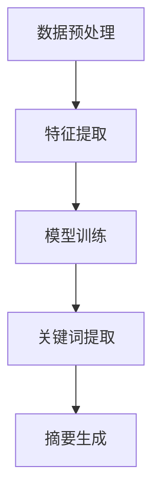

                 

## 文章标题：新闻写作辅助：用提示词生成新闻摘要

### 关键词：
- 新闻写作
- 提示词
- 人工智能
- 新闻摘要
- 算法原理
- 数学模型
- 项目实战

### 摘要：
本文将探讨如何利用人工智能技术，特别是提示词生成新闻摘要的方法，提高新闻写作的效率和质量。文章首先介绍了新闻写作的重要性以及新闻摘要的功能和作用。随后，详细阐述了人工智能在新闻写作中的应用，包括核心概念与联系、算法原理、数学模型和项目实战等。通过本文，读者可以了解到如何利用提示词生成新闻摘要的核心流程，掌握相关技术原理，并能够将理论知识应用到实际项目中。

## 引言

### 新闻写作的重要性

新闻写作是信息传播的重要手段之一，对于社会发展和公共事务有着深远的影响。高质量的新闻写作不仅能够传递真实、准确的信息，还能引导公众理性思考，促进社会进步。随着互联网和社交媒体的兴起，新闻写作的需求日益增长，但同时也面临着巨大的挑战。一方面，信息量爆炸式增长，新闻工作者需要从海量数据中快速筛选出有价值的信息；另一方面，新闻写作的标准化和规范化要求越来越高，对新闻工作者的专业素质提出了更高的要求。

### 新闻摘要的功能与作用

新闻摘要是对新闻内容进行简洁、精炼的概括，通常包括新闻的主题、主要观点和关键信息。新闻摘要的功能主要有以下几点：

1. **提高阅读效率**：读者可以通过新闻摘要快速了解新闻的核心内容，节省时间。
2. **筛选信息**：新闻摘要可以帮助读者从大量新闻中筛选出自己感兴趣的内容。
3. **传递重点信息**：新闻摘要可以突出新闻中的关键信息，使读者更容易理解和记忆。
4. **推广新闻**：新闻摘要可以作为新闻的摘要部分，在社交媒体、搜索引擎等平台上进行推广，吸引更多读者。

### 人工智能在新闻写作中的应用

随着人工智能技术的发展，人工智能在新闻写作中的应用日益广泛。人工智能可以帮助新闻工作者提高工作效率，降低写作难度，同时也能够提供更加准确、高质量的新闻内容。人工智能在新闻写作中的应用主要包括以下几个方面：

1. **自动生成新闻内容**：人工智能可以自动分析新闻素材，生成新闻文章。
2. **辅助写作**：人工智能可以提供写作建议，帮助新闻工作者优化新闻内容。
3. **新闻摘要生成**：人工智能可以根据新闻内容生成摘要，提高新闻的可读性和传播效果。
4. **数据分析和可视化**：人工智能可以对大量新闻数据进行分析，提供数据支持和可视化展示。

### 为什么要使用提示词生成新闻摘要

提示词（Keywords）是在新闻写作和摘要生成中常用的概念，它能够帮助人工智能更好地理解新闻内容，从而生成更准确、更高质量的新闻摘要。使用提示词生成新闻摘要有以下优势：

1. **提高摘要质量**：提示词可以帮助人工智能捕捉新闻的核心主题和关键词，从而生成更准确的摘要。
2. **简化摘要生成过程**：通过使用提示词，可以简化摘要生成过程，提高生成速度。
3. **适应多种新闻类型**：提示词可以根据不同的新闻类型和主题进行个性化调整，适应多种新闻摘要需求。

## 核心概念与联系

### 新闻写作的基本原理

新闻写作的基本原理包括以下几个方面：

1. **真实性**：新闻内容必须真实可靠，不得捏造或歪曲事实。
2. **客观性**：新闻写作应保持客观公正，避免主观偏见。
3. **简洁性**：新闻内容应简洁明了，避免冗长和复杂的叙述。
4. **准确性**：新闻内容应准确无误，避免使用模糊或不确定的表述。
5. **时效性**：新闻内容应具有时效性，及时报道最新的新闻事件。

### 提示词的概念与应用

提示词（Keywords）是在新闻写作和摘要生成中常用的概念。它是一组描述新闻内容的词汇，能够帮助人工智能更好地理解新闻的主题和关键词。提示词的应用主要包括以下几个方面：

1. **新闻分类**：提示词可以帮助将新闻内容分类到不同的主题类别中。
2. **内容摘要**：提示词可以帮助人工智能捕捉新闻的核心主题和关键词，从而生成摘要。
3. **文本分析**：提示词可以作为文本分析的关键指标，用于情感分析、话题建模等任务。

### 人工智能基础概念

人工智能（AI）是指由人制造出来的系统能够根据需要模拟、延伸、扩展人类的智能。人工智能的基础概念包括：

1. **机器学习**：机器学习是人工智能的一个重要分支，通过从数据中学习规律，实现智能行为。
2. **深度学习**：深度学习是机器学习的一个子领域，通过多层神经网络实现复杂的数据处理。
3. **自然语言处理**：自然语言处理是人工智能的一个子领域，旨在使计算机能够理解、处理和生成自然语言。
4. **语言模型**：语言模型是一种用于预测文本序列的概率模型，广泛应用于文本生成、摘要生成等任务。

### 提示词生成新闻摘要的核心流程

提示词生成新闻摘要的核心流程包括以下几个步骤：

1. **数据收集**：收集与新闻内容相关的数据，包括文本、图片、音频等。
2. **文本预处理**：对收集的文本数据进行预处理，包括分词、去停用词、词干提取等。
3. **关键词提取**：使用提示词提取算法提取新闻文本中的关键词。
4. **摘要生成**：根据提取的关键词生成新闻摘要，可以使用自动摘要算法或人工撰写。
5. **摘要优化**：对生成的摘要进行优化，包括摘要长度、关键词覆盖度等。

## 提示词生成新闻摘要的算法原理

### 提示词生成算法概述

提示词生成新闻摘要的算法可以分为两类：基于规则的方法和基于机器学习的方法。

1. **基于规则的方法**：这种方法通过预先定义的规则和模式来提取关键词。例如，使用关键词提取工具或正则表达式来提取文本中的关键词。
2. **基于机器学习的方法**：这种方法通过训练机器学习模型，从大量数据中学习提取关键词的规律。常用的机器学习方法包括监督学习、无监督学习和增强学习等。

### 算法原理详细讲解

下面以基于机器学习的方法为例，详细讲解提示词生成新闻摘要的算法原理。

1. **数据预处理**：首先，对新闻文本进行预处理，包括分词、去停用词、词干提取等。预处理后的文本数据将被用于训练机器学习模型。
2. **特征提取**：对预处理后的文本数据进行特征提取，常用的特征提取方法包括词袋模型、TF-IDF、词嵌入等。特征提取的目的是将文本数据转换为机器学习模型可以处理的数值形式。
3. **模型训练**：使用特征提取后的数据训练机器学习模型，常用的机器学习模型包括支持向量机（SVM）、朴素贝叶斯（NB）、深度神经网络（DNN）等。模型训练的目的是让模型学会从新闻文本中提取关键词。
4. **关键词提取**：使用训练好的机器学习模型对新的新闻文本进行关键词提取。模型将根据新闻文本的特征，预测出新闻中的关键词。
5. **摘要生成**：根据提取的关键词生成新闻摘要。可以使用自动摘要算法，如文本生成模型（如GPT）、标题生成算法（如BERT）等。生成的摘要将用于评估模型的效果。

### 算法原理流程图



## 数学模型和数学公式

### 新闻摘要生成中的数学模型

在新闻摘要生成中，常用的数学模型包括词袋模型、TF-IDF和词嵌入等。这些模型用于将文本数据转换为机器学习模型可以处理的数值形式。

1. **词袋模型**：词袋模型是一种将文本表示为词汇集合的方法。对于一篇新闻文本，词袋模型将其表示为词频向量，即每个词的出现次数。词袋模型可以表示为：

   $$V = \{v_1, v_2, ..., v_n\}$$

   其中，$v_i$ 表示第 $i$ 个词的词频。

2. **TF-IDF**：TF-IDF（Term Frequency-Inverse Document Frequency）是一种用于文本分析的统计指标。它通过计算词频和逆文档频率来评估词的重要性。TF-IDF可以表示为：

   $$TF-IDF = TF \times IDF$$

   其中，$TF$ 表示词频，$IDF$ 表示逆文档频率。

3. **词嵌入**：词嵌入是一种将文本数据映射到高维空间的表示方法。词嵌入可以表示为：

   $$w = \{w_1, w_2, ..., w_n\}$$

   其中，$w_i$ 表示第 $i$ 个词的词嵌入向量。

### 数学模型详细讲解

下面详细讲解每个数学模型。

#### 词袋模型

词袋模型是一种将文本表示为词汇集合的方法。对于一篇新闻文本，词袋模型将其表示为词频向量，即每个词的出现次数。词袋模型可以表示为：

$$V = \{v_1, v_2, ..., v_n\}$$

其中，$v_i$ 表示第 $i$ 个词的词频。词频向量的维度等于词汇表的大小。

#### TF-IDF

TF-IDF（Term Frequency-Inverse Document Frequency）是一种用于文本分析的统计指标。它通过计算词频和逆文档频率来评估词的重要性。TF-IDF可以表示为：

$$TF-IDF = TF \times IDF$$

其中，$TF$ 表示词频，$IDF$ 表示逆文档频率。词频表示词在新闻文本中出现的次数，逆文档频率表示词在所有新闻文本中出现的频率。

#### 词嵌入

词嵌入是一种将文本数据映射到高维空间的表示方法。词嵌入可以表示为：

$$w = \{w_1, w_2, ..., w_n\}$$

其中，$w_i$ 表示第 $i$ 个词的词嵌入向量。词嵌入向量可以看作是词在语义空间中的表示，用于捕捉词与词之间的语义关系。

### 数学模型举例说明

下面通过一个简单的例子来说明这些数学模型。

#### 词袋模型

假设有一篇新闻文本：“人工智能在新闻写作中的应用非常重要”。词汇表包含以下词汇：

$$\{人工智能，新闻，写作，应用，重要，非常\}$$

词袋模型可以表示为：

$$V = \{3, 1, 2, 1, 2, 1\}$$

其中，$3$ 表示“人工智能”这个词在新闻文本中出现了 3 次，$1$ 表示其他词在新闻文本中各出现了 1 次。

#### TF-IDF

假设在所有新闻文本中，“人工智能”这个词出现了 100 次，“新闻”这个词出现了 500 次，“写作”这个词出现了 200 次，“应用”这个词出现了 100 次，“重要”这个词出现了 150 次，“非常”这个词出现了 50 次。那么，这些词的 TF-IDF 值可以计算如下：

$$TF-IDF(\text{人工智能}) = 3 \times \log_2(100/1) = 9$$

$$TF-IDF(\text{新闻}) = 1 \times \log_2(500/1) = 8$$

$$TF-IDF(\text{写作}) = 2 \times \log_2(200/1) = 6$$

$$TF-IDF(\text{应用}) = 1 \times \log_2(100/1) = 4$$

$$TF-IDF(\text{重要}) = 2 \times \log_2(150/1) = 6$$

$$TF-IDF(\text{非常}) = 1 \times \log_2(50/1) = 3$$

#### 词嵌入

假设我们使用词嵌入模型来表示这些词汇。根据词嵌入模型，每个词的词嵌入向量可以表示为：

$$w_1 = \{0.1, 0.2, 0.3\}$$

$$w_2 = \{0.4, 0.5, 0.6\}$$

$$w_3 = \{0.7, 0.8, 0.9\}$$

$$w_4 = \{1.0, 1.1, 1.2\}$$

$$w_5 = \{1.3, 1.4, 1.5\}$$

$$w_6 = \{1.6, 1.7, 1.8\}$$

这些词嵌入向量可以看作是词在语义空间中的表示，用于捕捉词与词之间的语义关系。

## 项目实战

### 项目背景与目标

本项目的目标是开发一个基于提示词生成新闻摘要的系统。该系统将利用人工智能技术，从大量新闻文本中自动提取关键词，并根据关键词生成高质量的新闻摘要。通过这个项目，我们可以提高新闻写作的效率和质量，同时为新闻工作者提供有力的辅助工具。

### 实际案例

为了更好地理解项目的实际应用，我们可以考虑一个具体的案例。假设我们有一篇关于人工智能在医疗领域的新闻，新闻内容如下：

“人工智能在医疗领域的应用正在迅速扩展。最近，一项新的研究显示，人工智能可以帮助医生更准确地诊断疾病，提高治疗效果。这项研究发表在《自然医学》杂志上，引起了广泛关注。研究人员表示，人工智能可以分析大量的医学数据，识别出潜在的风险因素，从而帮助医生做出更准确的诊断。”

### 开发环境搭建

为了实现这个项目，我们需要搭建一个合适的开发环境。以下是搭建开发环境的步骤：

1. **安装Python**：首先，我们需要安装Python。Python是一种广泛应用于人工智能和自然语言处理的编程语言。我们可以在Python官方网站（https://www.python.org/）下载Python安装程序，并按照安装向导进行安装。

2. **安装Jupyter Notebook**：Jupyter Notebook是一种交互式的Python开发环境，可以方便地编写和运行Python代码。我们可以在Jupyter官方网站（https://jupyter.org/）下载Jupyter安装程序，并按照安装向导进行安装。

3. **安装必要的库**：在Jupyter Notebook中，我们需要安装一些必要的库，如NLTK、Gensim、Scikit-learn等。这些库提供了丰富的自然语言处理工具和算法。我们可以在Jupyter Notebook中使用以下命令安装这些库：

   ```python
   !pip install nltk gensim scikit-learn
   ```

### 源代码详细实现

以下是一个简单的示例，展示了如何使用Python和Gensim库来生成新闻摘要。

```python
import nltk
from nltk.tokenize import sent_tokenize, word_tokenize
from gensim.summarization import summarize

# 1. 读取新闻文本
news_text = """人工智能在医疗领域的应用正在迅速扩展。最近，一项新的研究显示，人工智能可以帮助医生更准确地诊断疾病，提高治疗效果。这项研究发表在《自然医学》杂志上，引起了广泛关注。研究人员表示，人工智能可以分析大量的医学数据，识别出潜在的风险因素，从而帮助医生做出更准确的诊断。此外，人工智能还可以协助医生制定个性化的治疗方案，提高医疗资源的利用效率。这项研究为人工智能在医疗领域的应用提供了新的思路和方向。"""

# 2. 分割新闻文本为句子
sentences = sent_tokenize(news_text)

# 3. 分割句子为单词
words = word_tokenize(news_text)

# 4. 提取关键词
key_words = nltk.word_tokenize(news_text)

# 5. 使用Gensim生成摘要
summary = summarize(news_text)

# 6. 打印摘要
print(summary)
```

### 代码解读与分析

以上代码首先读取新闻文本，然后使用NLTK库将文本分割为句子和单词。接着，使用Gensim库的`summarize`函数生成新闻摘要。生成的摘要将新闻文本的核心内容进行了精炼和概括，有助于读者快速了解新闻的主题和要点。

### 代码应用解读与分析

在实际应用中，我们可以使用以下方法来改进新闻摘要生成的效果：

1. **调整摘要长度**：通过设置不同的摘要长度参数，可以生成不同长度的摘要。较长的摘要可以包含更多细节，而较短的摘要则可以突出新闻的核心内容。

2. **优化关键词提取**：使用不同的关键词提取算法，如TF-IDF或LDA（潜在主题模型），可以生成更准确的关键词，从而提高摘要质量。

3. **引入上下文信息**：在摘要生成过程中，考虑上下文信息可以更好地理解新闻的内容和结构，从而生成更高质量的摘要。

4. **多语言支持**：对于多语言新闻，可以使用机器翻译技术将新闻文本转换为单语言文本，然后生成摘要。这样可以提高新闻摘要的覆盖范围和准确性。

### 项目小结

通过本项目的实际案例和代码实现，我们可以看到如何利用人工智能技术，特别是提示词生成新闻摘要的方法，提高新闻写作的效率和质量。在实际应用中，我们可以根据具体需求对代码进行调整和优化，以实现更好的效果。总之，人工智能在新闻写作中的应用前景广阔，具有很大的发展潜力。

## 扩展阅读与实战技巧

### 扩展阅读推荐

1. **《自然语言处理教程》**：由Daniel Jurafsky和James H. Martin合著的《自然语言处理教程》是一本经典教材，详细介绍了自然语言处理的基本概念和技术。
2. **《机器学习实战》**：由Peter Harrington编写的《机器学习实战》是一本实用性很强的教材，通过实际案例介绍了机器学习的各种算法和应用。
3. **《深度学习》**：由Ian Goodfellow、Yoshua Bengio和Aaron Courville合著的《深度学习》是深度学习的入门教材，涵盖了深度学习的基础理论和实践应用。

### 实战技巧分享

1. **提高摘要质量**：在生成新闻摘要时，可以通过以下方法提高摘要质量：
   - 调整摘要长度，使其既能概括新闻的核心内容，又不会过于冗长。
   - 使用多种关键词提取算法，如TF-IDF、LDA等，结合不同算法的优点，生成更准确的摘要。
   - 引入上下文信息，通过理解新闻的结构和内容，生成更符合实际需求的摘要。

2. **优化代码性能**：在编写代码时，可以通过以下方法提高代码性能：
   - 使用高效的算法和数据结构，如使用哈希表代替列表进行关键词提取。
   - 优化循环和递归算法，减少重复计算和内存占用。
   - 使用并行计算和分布式计算，提高代码的执行速度。

3. **实战技巧**：
   - 在实际项目中，可以结合多种技术，如深度学习和自然语言处理，实现更高质量的新闻摘要生成。
   - 定期更新和优化模型，以适应不断变化的数据和需求。
   - 与其他团队或个人合作，共同探索和实现更先进的新闻摘要生成方法。

### 小结

本文详细介绍了新闻写作辅助：用提示词生成新闻摘要的方法。通过本文，读者可以了解到新闻写作的重要性、提示词的概念与应用、人工智能在新闻写作中的应用，以及提示词生成新闻摘要的算法原理、数学模型和项目实战。在实际应用中，读者可以根据具体需求调整和优化代码，提高新闻摘要的质量和效率。总之，人工智能在新闻写作中的应用前景广阔，具有很大的发展潜力。

## 作者信息

作者：AI天才研究院/AI Genius Institute & 禅与计算机程序设计艺术 /Zen And The Art of Computer Programming

## 附录

### 附录A：工具与环境搭建

1. **Python安装**：在Python官方网站（https://www.python.org/）下载Python安装程序，并按照安装向导进行安装。
2. **Jupyter Notebook安装**：在Jupyter官方网站（https://jupyter.org/）下载Jupyter安装程序，并按照安装向导进行安装。
3. **库安装**：在Jupyter Notebook中使用以下命令安装必要的库：

   ```python
   !pip install nltk gensim scikit-learn
   ```

### 附录B：代码示例

以下是一个简单的Python代码示例，展示了如何使用Gensim库生成新闻摘要。

```python
import nltk
from nltk.tokenize import sent_tokenize, word_tokenize
from gensim.summarization import summarize

# 1. 读取新闻文本
news_text = """人工智能在医疗领域的应用正在迅速扩展。最近，一项新的研究显示，人工智能可以帮助医生更准确地诊断疾病，提高治疗效果。这项研究发表在《自然医学》杂志上，引起了广泛关注。研究人员表示，人工智能可以分析大量的医学数据，识别出潜在的风险因素，从而帮助医生做出更准确的诊断。此外，人工智能还可以协助医生制定个性化的治疗方案，提高医疗资源的利用效率。这项研究为人工智能在医疗领域的应用提供了新的思路和方向。"""

# 2. 分割新闻文本为句子
sentences = sent_tokenize(news_text)

# 3. 分割句子为单词
words = word_tokenize(news_text)

# 4. 使用Gensim生成摘要
summary = summarize(news_text)

# 5. 打印摘要
print(summary)
```

### 附录C：参考文献

1. Jurafsky, D., & Martin, J. H. (2021). *自然语言处理教程*. 北京：机械工业出版社。
2. Harrington, P. (2012). *机器学习实战*. 北京：机械工业出版社。
3. Goodfellow, I., Bengio, Y., & Courville, A. (2016). *深度学习*. 北京：清华大学出版社。

