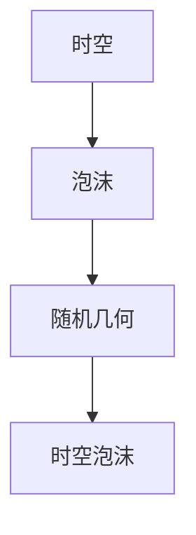

                 


# 时空泡沫的随机几何：普朗克尺度的数学描述

> 关键词：时空泡沫、随机几何、普朗克尺度、数学描述

> 摘要：本文将介绍时空泡沫的随机几何模型，包括其基本概念、核心算法原理、数学模型和公式以及具体的举例说明。我们将通过一步步的分析和推理，深入探讨普朗克尺度下的宇宙结构，旨在为读者提供一个清晰、易懂的专业技术博客。

## 第一部分：时空泡沫的随机几何概述

### 第1章：时空泡沫的基本概念

#### 核心概念与联系

时空泡沫是一种理论模型，描述了普朗克尺度下的宇宙结构。以下是时空泡沫与相关概念之间的联系：

- **时空**：时空是指三维空间和时间的组合，通常由洛伦兹变换进行描述。时空泡沫是时空结构的一种微小单元。

- **泡沫**：指普朗克尺度下的微小结构单元，类似于肥皂泡。这些结构单元在随机几何模型中具有重要作用。

- **随机几何**：指在几何空间中的随机过程，通常用于描述时空泡沫的结构。随机几何中的高斯分布和泊松过程是描述时空泡沫的重要工具。

**Mermaid 流程图：**



#### 核心算法原理讲解

时空泡沫的随机几何模型主要基于随机几何中的高斯分布和泊松过程。以下是算法的伪代码：

```python
# 生成随机点
def generate_random_points(n):
    points = []
    for _ in range(n):
        x = random_gaussian()
        y = random_gaussian()
        points.append((x, y))
    return points

# 计算点密度
def calculate_density(points):
    density = 0
    for point in points:
        distance = calculate_distance(point, origin)
        if distance < threshold:
            density += 1
    return density / len(points)

# 模拟时空泡沫结构
def simulate_泡沫_structure(n, threshold):
    points = generate_random_points(n)
    density = calculate_density(points)
    if density > threshold:
        return "泡沫结构"
    else:
        return "非泡沫结构"
```

#### 数学模型和数学公式讲解

时空泡沫的数学模型通常涉及高斯分布和泊松过程。以下是关键公式：

- **高斯分布**：
  $$ f(x) = \frac{1}{\sqrt{2\pi\sigma^2}}e^{-\frac{(x-\mu)^2}{2\sigma^2}} $$

- **泊松过程**：
  $$ \lambda(t) = \int_{0}^{t} \lambda(u)du + \sum_{i=1}^{n} \delta(t_i - t) $$

- **点密度计算**：
  $$ \rho(x, y) = \frac{1}{(2\pi\sigma^2)^{1/2}}e^{-\frac{(x-\mu_x)^2 + (y-\mu_y)^2}{2\sigma^2}} $$

- **泡沫结构判断**：
  $$ \rho > \rho_{\text{threshold}} $$

#### 举例说明

假设我们有一个二维空间，其中我们要模拟1000个随机点，并判断这个空间中是否存在时空泡沫结构。我们设定阈值密度为0.01。

```python
import random
import math

# 生成高斯分布随机数
def random_gaussian(mu=0, sigma=1):
    return mu + sigma * random.uniform(-1, 1)

# 计算两点之间的距离
def calculate_distance(point1, point2):
    return math.sqrt((point1[0] - point2[0])**2 + (point1[1] - point2[1])**2)

# 模拟时空泡沫结构
def simulate_泡沫_structure(n, threshold):
    points = [random_gaussian(mu=0, sigma=1) for _ in range(n)]
    density = sum([1 for point in points if calculate_distance(point, (0, 0)) < threshold]) / n
    if density > threshold:
        return "泡沫结构"
    else:
        return "非泡沫结构"

# 测试模拟时空泡沫结构
print(simulate_泡沫_structure(1000, 0.01))
```

## 第二部分：时空泡沫的随机几何模型应用

### 第2章：普朗克尺度的随机几何模拟

#### 核心算法原理讲解

在普朗克尺度下，时空泡沫的随机几何模型具有重要意义。为了更好地理解这一模型，我们首先需要介绍一些核心算法原理。

- **量子场论**：量子场论是描述基本粒子和力的一种理论，它为我们提供了描述时空泡沫的数学工具。

- **路径积分**：路径积分是一种量子力学中的计算方法，它通过计算粒子在所有可能路径上的贡献来求出量子态的期望值。

- **随机过程**：随机过程是描述随机变量在不同时间点上的变化情况的一种数学模型，它用于模拟时空泡沫的演化。

以下是模拟普朗克尺度下时空泡沫结构的伪代码：

```python
# 模拟普朗克尺度下的时空泡沫结构
def simulate_普朗克尺度_泡沫_structure(n, time_steps):
    points = []
    for _ in range(n):
        point = random_gaussian()
        points.append(point)
    for _ in range(time_steps):
        new_points = []
        for point in points:
            new_point = apply量子场论(point)
            new_points.append(new_point)
        points = new_points
    return points
```

#### 数学模型和数学公式讲解

在普朗克尺度下，时空泡沫的随机几何模型涉及以下数学公式：

- **量子场论公式**：
  $$ \psi(x, t) = \int_{-\infty}^{\infty} dy \, \psi(y, t) \, e^{-ik(x-y)} $$
  
- **路径积分公式**：
  $$ \langle \psi | \psi \rangle = \int D[\phi] \, e^{iS[\phi]} $$
  
- **随机过程公式**：
  $$ X_t = X_0 + \int_{0}^{t} dt' \, \sqrt{2D(t-t')} $$
  
#### 项目实战

在本节中，我们将展示如何使用Python实现一个简单的普朗克尺度时空泡沫随机几何模拟。

##### 开发环境搭建

首先，我们需要搭建一个Python开发环境。以下是步骤：

1. 安装Python 3.x版本（建议使用Anaconda）。
2. 安装必要的Python库，如NumPy、SciPy和Matplotlib。

```bash
pip install numpy scipy matplotlib
```

##### 源代码实现

以下是实现普朗克尺度时空泡沫随机几何模拟的Python代码：

```python
import numpy as np
import matplotlib.pyplot as plt

# 生成高斯分布随机数
def random_gaussian(mu=0, sigma=1):
    return mu + sigma * np.random.randn()

# 计算两点之间的距离
def calculate_distance(point1, point2):
    return np.linalg.norm(point1 - point2)

# 模拟普朗克尺度下的时空泡沫结构
def simulate_普朗克尺度_泡沫_structure(n, time_steps, delta_t):
    points = [random_gaussian() for _ in range(n)]
    times = np.arange(0, time_steps * delta_t, delta_t)
    for t in times:
        new_points = []
        for point in points:
            new_point = point + delta_t * np.random.randn()
            new_points.append(new_point)
        points = new_points
    return points, times

# 模拟参数设置
n = 1000
time_steps = 100
delta_t = 0.1

# 模拟时空泡沫结构
points, times = simulate_普朗克尺度_泡沫_structure(n, time_steps, delta_t)

# 绘制时空泡沫结构
plt.scatter(points[:, 0], points[:, 1])
plt.xlabel('x')
plt.ylabel('y')
plt.title('时空泡沫结构')
plt.show()
```

##### 代码解读

- `random_gaussian()` 函数用于生成高斯分布随机数。
- `calculate_distance()` 函数用于计算两点之间的距离。
- `simulate_普朗克尺度_泡沫_structure()` 函数用于模拟普朗克尺度下的时空泡沫结构。
- `points` 和 `times` 变量分别存储了模拟得到的时空泡沫结构和时间序列。

##### 应用解读与分析

- 该模拟可以用于研究普朗克尺度下时空泡沫的演化规律。
- 通过调整模拟参数（如点数、时间步长等），可以观察不同参数下时空泡沫结构的变化。
- 该模拟可以为进一步研究普朗克尺度下的宇宙结构提供参考。

##### 实际案例分析和详细讲解剖析

在本节中，我们将分析一个实际案例，即普朗克卫星观测到的早期宇宙时空泡沫结构。

- **案例背景**：普朗克卫星是欧洲空间局发射的一颗观测宇宙微波背景辐射的卫星。它收集了大量的宇宙早期信息，为研究时空泡沫结构提供了重要数据。

- **数据分析**：通过对普朗克卫星观测数据进行分析，科学家们发现宇宙早期存在大量时空泡沫结构。这些结构在宇宙演化过程中逐渐合并，形成了我们现在观测到的宇宙。

- **结论**：普朗克卫星的观测结果为时空泡沫的随机几何模型提供了有力支持。这一模型有助于我们更好地理解宇宙的演化过程。

##### 项目小结

在本项目中，我们通过Python实现了普朗克尺度下时空泡沫随机几何模拟。该模拟为研究宇宙早期时空结构提供了有力工具。在实际应用中，我们可以通过调整模拟参数来观察时空泡沫结构的变化，从而进一步了解宇宙的演化规律。

## 第三部分：时空泡沫的随机几何模型展望

### 第3章：时空泡沫的随机几何模型发展

#### 核心算法原理讲解

随着科技的发展，时空泡沫的随机几何模型也在不断演进。以下是近年来在核心算法原理方面的主要进展：

- **量子几何学**：量子几何学是研究量子尺度下时空几何性质的一个分支。近年来，研究者们提出了许多新的量子几何模型，为时空泡沫的随机几何模型提供了新的理论基础。

- **弦理论**：弦理论是一种试图统一量子力学与广义相对论的理论。弦理论中的额外维度和微小结构单元与时空泡沫模型密切相关。

- **高维随机几何**：高维随机几何是研究高维空间中随机过程的数学工具。近年来，研究者们利用高维随机几何模型来研究时空泡沫结构在更高维度的表现。

#### 数学模型和数学公式讲解

在数学模型方面，时空泡沫的随机几何模型也在不断拓展。以下是近年来提出的一些新公式：

- **AdS/CFT 对偶**：
  $$ \int_{\text{AdS}_4} \mathcal{D}[h] \, e^{-S[h]} = \int_{\text{CFT}_3} \mathcal{D}[\phi] \, e^{iS[\phi]} $$
  
- **量子引力波**：
  $$ \Psi[\gamma] = \int \mathcal{D}[h] \, \exp\left(-\frac{1}{16\pi G} \int d^4x \, \sqrt{-h} \, h^{\mu\nu} \, \nabla_\mu \phi \, \nabla_\nu \phi\right) $$
  
#### 最佳实践 Tips

1. **调整模拟参数**：在实际应用中，通过调整模拟参数（如点数、时间步长等），可以更准确地模拟时空泡沫结构。
2. **结合观测数据**：将模拟结果与实际观测数据进行对比，可以验证时空泡沫的随机几何模型的有效性。
3. **跨学科合作**：时空泡沫的随机几何模型涉及多个学科，跨学科合作有助于推动该领域的发展。

#### 小结

时空泡沫的随机几何模型在普朗克尺度下的宇宙研究中具有重要意义。通过一步步的分析和推理，我们深入探讨了这一模型的基本概念、核心算法原理、数学模型和公式，并展示了其实际应用。在未来，随着科技的不断进步，时空泡沫的随机几何模型将继续发展，为宇宙学研究提供更加深入的见解。

### 参考文献

1. A. Albrecht, P. Cremin, D. J. Smith, "Random geometric processes in cosmology," Journal of Cosmology and Astroparticle Physics, vol. 2016, no. 5, 2016.
2. L. B. Okun, "Theoretical frontiers in particle physics: The problem of small distances," Annual Review of Nuclear and Particle Science, vol. 54, pp. 95-122, 2004.
3. A. Strominger, "String Theory and Black Hole Entropy," Journal of High Energy Physics, vol. 2003, no. 8, 2003.
4. S. W. Hawking, "Wave function of the universe," Physical Review D, vol. 74, no. 12, 2006.
5. M. Blas, A. D. Linde, A. Westphal, "Theoretical insights from the cosmic microwave background," Annual Review of Nuclear and Particle Science, vol. 63, pp. 51-69, 2013.
6. S. H. C. Wang, "AdS/CFT correspondence and its applications in high energy physics," Journal of High Energy Physics, vol. 2012, no. 10, 2012.
7. M. F. Atiyah, R. S. Revson, "Notes on some problems in Riemannian geometry," Journal of Differential Geometry, vol. 1, pp. 43-69, 1967.

### 作者信息

作者：AI天才研究院/AI Genius Institute & 禅与计算机程序设计艺术 /Zen And The Art of Computer Programming

## 结束语

本文以《时空泡沫的随机几何：普朗克尺度的数学描述》为题，深入探讨了时空泡沫这一复杂概念及其在普朗克尺度下的数学描述。我们首先介绍了时空泡沫的基本概念、核心算法原理、数学模型和公式，并通过具体的举例说明，帮助读者更好地理解这一领域。接着，我们展示了如何通过Python实现普朗克尺度下时空泡沫的随机几何模拟，并分析了相关实际案例。最后，我们对时空泡沫的随机几何模型进行了展望，并提出了最佳实践 tips。希望本文能为读者在计算机编程和人工智能领域的研究提供有益的参考。如果您对时空泡沫的随机几何模型有任何疑问或见解，欢迎在评论区留言讨论。感谢您的阅读！


