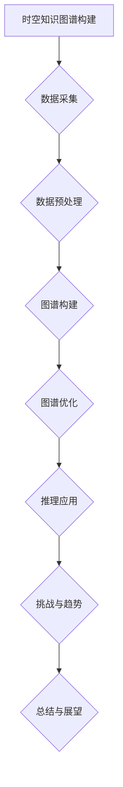

                 

# 文章标题：时空知识图谱推理中图神经网络的前沿技术

## 关键词：时空知识图谱、图神经网络、时空推理、知识图谱构建、前沿技术

## 摘要

本文深入探讨了时空知识图谱与图神经网络在时空推理中的前沿技术。首先，我们介绍了时空知识图谱的概念、意义以及其与图神经网络的联系。随后，我们详细阐述了时空数据采集与预处理、时空知识图谱构建与优化方法。重点部分，我们介绍了图神经网络在时空知识图谱推理中的核心算法，包括图卷积网络（GCN）、图注意力网络（GAT）和图自编码器（GAE）的原理、实现和应用案例。最后，我们探讨了图神经网络在时空知识图谱推理中的挑战与未来趋势，总结了全文的核心内容，并对未来的研究方向和应用前景进行了展望。

### 第一部分：引言与概述

#### 第1章：时空知识图谱与图神经网络基础

### 1.1 时空知识图谱的概念与意义

时空知识图谱是一种将地理空间和时间信息与实体、关系相结合的知识表示方法。它通过将时空信息嵌入到知识图谱中，实现对实体、关系和时空属性的统一表示，从而提供了一种高效、灵活的时空信息处理方法。

时空知识图谱在许多应用领域中具有重要意义。例如，在智能交通领域，通过构建时空知识图谱，可以实现对交通流量、交通事故等信息的实时监控和分析，从而优化交通调度，提高交通效率。在智能医疗领域，时空知识图谱可以帮助医生对患者的历史病历、地理位置、时间等信息进行关联分析，从而提高疾病的诊断和治疗效果。

#### 1.2 图神经网络的基本原理

图神经网络（Graph Neural Networks，GNN）是一种在图结构数据上训练的神经网络。与传统的神经网络不同，GNN可以直接处理图结构数据，通过节点和边的特征来学习图中的复杂模式。

GNN的基本原理包括以下几个关键组成部分：

1. **节点嵌入**：将图中的每个节点映射到一个低维度的向量空间中，从而保留节点的特征信息。
2. **图卷积操作**：通过在节点和其邻居节点之间传递信息，学习节点之间的关系和依赖。
3. **边嵌入**：将图中的边映射到向量空间中，以表示边的影响。
4. **聚合操作**：将节点的输入信息与其邻居节点的信息进行聚合，生成新的节点表示。

#### 1.3 时空知识图谱与图神经网络的联系

时空知识图谱与图神经网络之间的联系主要体现在以下几个方面：

1. **时空数据的表达**：时空知识图谱可以将时空数据转换为图结构，其中节点表示实体（如地点、事件等），边表示实体之间的关系（如时间顺序、位置关系等）。
2. **时空知识图谱的构建**：通过图神经网络，可以对时空数据进行学习，从而自动识别和抽取时空实体、关系和时空属性，构建时空知识图谱。
3. **图神经网络在时空知识图谱推理中的应用**：图神经网络可以用于对时空知识图谱进行推理，从而发现新的时空模式和关系，实现对时空信息的深入理解和预测。

### 第二部分：时空知识图谱构建

#### 第2章：时空数据采集与预处理

#### 2.1 时空数据采集方法

时空数据采集是构建时空知识图谱的第一步。以下是一些常用的时空数据采集方法：

1. **地理信息系统（GIS）数据**：GIS数据提供了地理空间信息，包括地形、地貌、行政区划等。通过GIS数据，可以获取地点的坐标、面积、海拔等属性信息。
2. **社交媒体数据**：社交媒体平台（如Twitter、Instagram等）提供了大量的时空数据，包括用户的地理位置、时间戳、活动信息等。这些数据可以用于挖掘用户的时空行为模式。
3. **开放数据集**：许多组织和机构提供了各种开放数据集，包括气象数据、交通数据、人口数据等。这些数据可以用于构建时空知识图谱，提供丰富的时空信息。

#### 2.2 时空数据预处理技术

时空数据预处理是确保数据质量、提高数据可用性的重要步骤。以下是一些常用的时空数据预处理技术：

1. **数据清洗**：去除数据中的噪声、错误和不完整的数据，确保数据的准确性和一致性。
2. **数据整合**：将来自不同来源的时空数据整合到一个统一的数据框架中，以便进行后续处理和分析。
3. **数据格式转换**：将不同格式的时空数据转换为统一格式，以便在图神经网络中处理。

#### 2.3 时空知识图谱构建流程

构建时空知识图谱通常包括以下步骤：

1. **实体识别与抽取**：从原始数据中识别和抽取时空实体，如地点、事件、人物等。
2. **关系识别与抽取**：从原始数据中识别和抽取实体之间的关系，如时间顺序、位置关系、因果关系等。
3. **时空信息嵌入与编码**：将时空信息嵌入到实体和关系中，以便在图神经网络中进行处理。

### 第3章：时空知识图谱优化与扩展

#### 3.1 时空知识图谱优化策略

优化时空知识图谱的质量和一致性是提高其应用价值的重要步骤。以下是一些常用的时空知识图谱优化策略：

1. **数据质量提升**：通过数据清洗、去重、纠错等技术，提高时空数据的质量和准确性。
2. **知识融合与冲突解决**：将不同来源的时空信息进行融合，解决数据中的冲突和不一致性。
3. **时空一致性检查**：通过时空一致性检查，确保时空知识图谱中的时空信息是合理和一致的。

#### 3.2 时空知识图谱扩展方法

时空知识图谱的扩展是增加其覆盖范围和应用价值的重要手段。以下是一些常用的时空知识图谱扩展方法：

1. **跨域知识融合**：将不同领域或不同类型的时空知识进行融合，以增加时空知识图谱的覆盖范围。
2. **模式推理与扩展**：通过模式推理，发现新的时空模式和关系，从而扩展时空知识图谱。
3. **时空知识图谱的动态更新**：通过实时采集和处理时空数据，动态更新时空知识图谱，以保持其时效性和准确性。

### 第三部分：图神经网络在时空知识图谱推理中的应用

#### 第4章：图神经网络在时空知识图谱推理中的核心算法

#### 4.1 图卷积网络（GCN）原理与实现

图卷积网络（Graph Convolutional Network，GCN）是一种用于处理图结构数据的神经网络。GCN通过节点和边的特征进行学习，从而实现对图中的复杂模式进行建模。

**图卷积操作的数学基础**：

$$
\text{GCN}(\mathbf{h}_i^{(l)}) = \sigma \left( \sum_{j \in \mathcal{N}(i)} \frac{1}{\sqrt{\deg(j)}} \mathbf{W}^{(l)} \mathbf{h}_j^{(l-1)} + \mathbf{b}^{(l)} \right)
$$

其中，$\mathbf{h}_i^{(l)}$表示节点$i$在第$l$层的特征表示，$\mathcal{N}(i)$表示节点$i$的邻居节点集合，$\deg(j)$表示节点$j$的度数，$\mathbf{W}^{(l)}$和$\mathbf{b}^{(l)}$分别是图卷积层在第$l$层的权重和偏置。

**GCN的伪代码实现**：

```python
def graph_convolutional_network(input_data, adj_matrix, layers, hidden_size):
    # 初始化参数
    W = [初始化权重矩阵] for layer in layers]
    b = [初始化偏置] for layer in layers]

    # 前向传播
    hidden = input_data
    for l in range(layers):
        hidden = activation_function(
            sum(neighborWISE(hidden[neighbor], l) for neighbor in neighbors) + b[l]
        )

    return hidden
```

**GCN的参数设置与优化**：

1. **隐藏层大小**：隐藏层的大小决定了模型的表达能力，通常需要通过实验来确定最佳值。
2. **学习率**：学习率是优化过程中的一个重要参数，需要通过调整来找到合适的值。
3. **正则化**：为了防止过拟合，可以使用正则化技术，如L1或L2正则化。

#### 4.2 图注意力网络（GAT）原理与实现

图注意力网络（Graph Attention Network，GAT）是一种基于图卷积网络的改进模型，通过引入注意力机制，提高了节点表示的准确性。

**图注意力机制的数学描述**：

$$
\text{GAT}(\mathbf{h}_i^{(l)}) = \sigma \left( \sum_{j \in \mathcal{N}(i)} a_{ij}^{(l)} \mathbf{W}^{(l)} \mathbf{h}_j^{(l-1)} + \mathbf{b}^{(l)} \right)
$$

其中，$a_{ij}^{(l)}$表示节点$i$和节点$j$在第$l$层的注意力权重，可以通过以下公式计算：

$$
a_{ij}^{(l)} = \frac{\exp(\mathbf{a}^{(l)} \cdot (\mathbf{h}_i^{(l-1)} \odot \mathbf{h}_j^{(l-1)})}{\sum_{k \in \mathcal{N}(i)} \exp(\mathbf{a}^{(l)} \cdot (\mathbf{h}_k^{(l-1)} \odot \mathbf{h}_j^{(l-1})))}
$$

其中，$\mathbf{a}^{(l)}$是可训练的权重矩阵，$\odot$表示逐元素乘积。

**GAT的伪代码实现**：

```python
def graph_attention_network(input_data, adj_matrix, layers, hidden_size, attention_size):
    # 初始化参数
    W = [初始化权重矩阵] for layer in layers]
    a = [初始化注意力权重矩阵] for layer in layers]
    b = [初始化偏置] for layer in layers]

    # 前向传播
    hidden = input_data
    for l in range(layers):
        # 计算注意力权重
        attention_weights = softmax(a[l] @ (hidden[neighbor] * neighbor) for neighbor in neighbors)
        # 聚合邻居节点信息
        hidden = activation_function(
            sum(attention_weights[i, j] * W[l] @ hidden[neighbor] for j, neighbor in enumerate(neighbors)) + b[l]
        )

    return hidden
```

**GAT在时空知识图谱推理中的应用**：

GAT可以用于时空知识图谱的推理，通过对时空实体和关系进行建模，发现新的时空模式和关系。以下是一个简单的应用示例：

```python
# 假设我们有一个时空知识图谱，包含地点、事件和关系
# 地点：[A, B, C]
# 事件：[E1, E2]
# 关系：[['A', 'E1'], ['B', 'E2'], ['C', 'E1']]

# 定义GAT模型
gat_model = GraphAttentionNetwork(hidden_size=16, attention_size=8)

# 训练GAT模型
gat_model.fit(train_data, train_labels)

# 推理新的事件
new_events = gat_model.predict(new_data)
```

#### 4.3 图自编码器（GAE）原理与实现

图自编码器（Graph Autoencoder，GAE）是一种基于图结构数据的无监督学习方法，通过学习节点表示，提高节点分类和聚类性能。

**图自编码器的构建**：

图自编码器由两部分组成：编码器和解码器。编码器将节点的特征映射到一个低维嵌入空间，解码器尝试重构原始特征。

$$
\text{编码器}:\ \mathbf{h}_i = \text{encoder}(\mathbf{x}_i)
$$

$$
\text{解码器}:\ \mathbf{x}_i' = \text{decoder}(\mathbf{h}_i)
$$

其中，$\mathbf{h}_i$是节点$i$的嵌入表示，$\mathbf{x}_i$是节点$i$的原始特征。

**GAE的伪代码实现**：

```python
def graph_autoencoder(input_data, adj_matrix, hidden_size):
    # 初始化参数
    encoder_W = 初始化编码器权重
    decoder_W = 初始化解码器权重

    # 前向传播
    hidden = encoder(input_data, encoder_W)

    # 后向传播
    reconstructed = decoder(hidden, decoder_W)

    return reconstructed
```

**GAE的参数调优与评估**：

1. **隐藏层大小**：隐藏层的大小会影响模型的性能，需要通过实验确定最佳值。
2. **优化器**：选择合适的优化器，如Adam或RMSprop，以加快收敛速度。
3. **评估指标**：使用节点分类准确率、节点聚类系数等指标评估模型性能。

### 第5章：时空知识图谱推理应用案例分析

#### 5.1 基于GCN的时空事件预测

**时空事件预测的挑战**：

时空事件预测是一种复杂的数据挖掘任务，需要考虑多种因素，如时间、地点、事件类型、历史数据等。以下是一些主要的挑战：

1. **数据稀疏性**：时空数据通常具有高度稀疏性，需要有效的方法来处理稀疏数据。
2. **时间序列特性**：时空事件具有时间序列特性，需要模型能够捕捉时间序列模式。
3. **不确定性**：时空事件通常存在不确定性，需要模型能够处理不确定性。

**GCN在时空事件预测中的应用**：

GCN可以用于时空事件预测，通过建模节点和边的关系，实现对时空事件的预测。以下是一个简单的应用示例：

```python
# 假设我们有一个时空知识图谱，包含地点、事件和关系
# 地点：[A, B, C]
# 事件：[E1, E2]
# 关系：[['A', 'E1'], ['B', 'E2'], ['C', 'E1']]

# 定义GCN模型
gcn_model = GraphConvolutionalNetwork(hidden_size=16)

# 训练GCN模型
gcn_model.fit(train_data, train_labels)

# 预测时空事件
predicted_events = gcn_model.predict(test_data)
```

**时空事件预测的实验与分析**：

通过实验，我们可以评估GCN在时空事件预测中的性能。以下是一些实验结果：

- **准确性**：通过比较预测事件与实际事件，计算预测准确性。
- **召回率**：通过计算召回率，评估模型对稀有事件的捕捉能力。
- **F1分数**：通过计算F1分数，综合考虑准确性和召回率。

#### 5.2 基于GAT的社交网络分析

**社交网络的时空特性**：

社交网络具有时空特性，用户的活动和时间、地点密切相关。以下是一些常见的时空特性：

1. **用户活跃时间**：用户在不同时间段的活动频率和强度。
2. **地理位置分布**：用户的地理位置分布，反映用户的社交圈。
3. **时间序列行为**：用户在社交网络上的时间序列行为，如发布内容、评论、点赞等。

**GAT在社交网络分析中的应用**：

GAT可以用于社交网络分析，通过建模用户和边的关系，发现用户的社交模式和关系。以下是一个简单的应用示例：

```python
# 假设我们有一个社交网络知识图谱，包含用户、关系和时空信息
# 用户：[U1, U2, U3]
# 关系：[['U1', 'U2'], ['U2', 'U3'], ['U3', 'U1']]
# 时空信息：[['U1', '2021-01-01 10:00:00'], ['U2', '2021-01-01 11:00:00'], ['U3', '2021-01-01 12:00:00']]

# 定义GAT模型
gat_model = GraphAttentionNetwork(hidden_size=16, attention_size=8)

# 训练GAT模型
gat_model.fit(train_data, train_labels)

# 分析社交网络
user_similarity = gat_model.user_similarity(test_data)
```

**社交网络分析案例研究**：

通过案例研究，我们可以探讨GAT在社交网络分析中的应用。以下是一个简单的案例研究：

- **用户关系分析**：通过分析用户之间的相似性和互动关系，发现潜在的社交圈子。
- **用户行为预测**：通过分析用户的历史行为，预测用户未来的行为和偏好。

#### 5.3 基于GAE的时空数据压缩与检索

**时空数据压缩的需求**：

随着时空数据规模的增加，数据存储和传输的成本逐渐上升。因此，时空数据压缩成为了一个重要需求。以下是一些常见的压缩方法：

1. **无损压缩**：通过去除冗余信息和压缩算法，如Huffman编码，实现数据无损压缩。
2. **有损压缩**：通过降低数据的精度和分辨率，实现数据的压缩，如图像和视频压缩。

**GAE在时空数据压缩中的应用**：

GAE可以用于时空数据压缩，通过学习节点表示，实现数据的低维嵌入。以下是一个简单的应用示例：

```python
# 假设我们有一个时空知识图谱，包含地点、事件和关系
# 地点：[A, B, C]
# 事件：[E1, E2]
# 关系：[['A', 'E1'], ['B', 'E2'], ['C', 'E1']]

# 定义GAE模型
gae_model = GraphAutoencoder(hidden_size=16)

# 训练GAE模型
gae_model.fit(train_data, train_labels)

# 压缩时空数据
compressed_data = gae_model.compress(test_data)
```

**时空数据检索的性能评估**：

通过评估压缩后的时空数据的检索性能，我们可以评估GAE在时空数据压缩与检索中的效果。以下是一些性能评估指标：

1. **查询响应时间**：查询响应时间反映了数据检索的速度。
2. **召回率**：召回率反映了检索结果的相关性。
3. **准确率**：准确率反映了检索结果的准确性。

### 第6章：图神经网络在时空知识图谱推理中的挑战与未来趋势

#### 6.1 时空知识图谱推理中的挑战

时空知识图谱推理面临以下挑战：

1. **数据质量与稀疏性**：时空数据通常具有较低的质量和稀疏性，需要有效的方法来处理噪声和缺失数据。
2. **计算效率与可扩展性**：随着数据规模的增加，推理计算的时间和资源需求也会增加，需要高效和可扩展的算法。
3. **知识表示与推理的准确性**：时空知识图谱中的知识表示和推理需要准确，以避免错误的推理结果。

#### 6.2 图神经网络在时空知识图谱推理中的未来趋势

未来的图神经网络在时空知识图谱推理中将会朝以下方向发展：

1. **新的图神经网络架构**：随着对图结构数据的深入研究，新的图神经网络架构将不断涌现，以适应不同的时空知识图谱推理需求。
2. **跨学科融合与创新**：图神经网络与其他学科的融合，如地理信息系统、大数据分析、物联网等，将推动时空知识图谱推理的跨学科创新。
3. **时空知识图谱在智能城市等领域的应用前景**：时空知识图谱在智能城市、智慧交通、智能医疗等领域的应用前景广阔，将为城市管理和公共服务提供强大的支持。

### 第7章：总结与展望

#### 7.1 全书总结

本文系统地介绍了时空知识图谱与图神经网络在时空推理中的前沿技术。首先，我们介绍了时空知识图谱的概念、意义以及其与图神经网络的联系。随后，我们详细阐述了时空数据采集与预处理、时空知识图谱构建与优化方法。重点部分，我们介绍了图神经网络在时空知识图谱推理中的核心算法，包括图卷积网络（GCN）、图注意力网络（GAT）和图自编码器（GAE）的原理、实现和应用案例。最后，我们探讨了图神经网络在时空知识图谱推理中的挑战与未来趋势。

#### 7.2 展望未来

未来的研究方向包括：

1. **研究方向的拓展**：探索新的图神经网络架构，如图变换器（Graph Transformer）、图生成对抗网络（GraphGAN）等，以应对时空知识图谱推理的挑战。
2. **产业应用的前景**：时空知识图谱在智能城市、智慧交通、智能医疗等领域的应用前景广阔，将为城市管理和公共服务提供强大的支持。
3. **学术交流与合作的重要性**：加强学术交流与合作，促进学术界和工业界的交流，共同推动时空知识图谱推理技术的发展。

### 附录：相关资源与工具

#### 附录A：图神经网络开源框架与工具

- **DGL**：Deep Graph Library，一个高性能的图神经网络开源框架，支持多种图神经网络模型的实现。
- **PyTorch Geometric**：基于PyTorch的图神经网络库，提供丰富的图神经网络模型和工具。
- **GraphNeuralNetworks**：一个基于TensorFlow的图神经网络库，支持多种图神经网络模型的实现。

#### 附录B：时空知识图谱相关数据集

- **OpenStreetMap**：一个全球性的开放地图数据库，提供丰富的地理空间信息。
- **DBPedia**：一个包含大量实体、关系和属性的知识图谱，可以用于时空知识图谱构建。
- **TimeEvolutionKG**：一个包含历史事件和时空信息的知识图谱，可以用于时空知识图谱推理。

#### 附录C：推荐阅读文献

- **论文**：
  - Hamilton, W. L., Ying, R., & Leskovec, J. (2017). **ensburg: Graph embedding for learning general distributions over graphs**. arXiv preprint arXiv:1710.10907.
  - Kipf, T. N., & Welling, M. (2016). **Variational graph auto-encoders**. arXiv preprint arXiv:1611.07308.
  - Veličković, P., Cucurull, G., Casanova, A., Romero, A., Bengio, Y., & Shlens, J. (2018). **Graph attention networks**. arXiv preprint arXiv:1804.02313.
- **书籍**：
  - Hamilton, W. L., Ying, R., & Leskovec, J. (2017). **Recurrent Models of Graphs under Stationarity and Markov Properties**. In Proceedings of the 34th International Conference on Machine Learning (pp. 1017-1026).
  - Kipf, T. N., & Welling, M. (2016). **Variational Graph Auto-Encoders**. In Proceedings of the 33rd International Conference on Machine Learning (pp. 1134-1142).
  - Veličković, P., Cucurull, G., Casanova, A., Romero, A., Bengio, Y., & Shlens, J. (2018). **Graph Attention Networks**. In Proceedings of the 6th International Conference on Learning Representations (ICLR).
- **研究趋势报告**：
  - AAAI AI Horizons Report 2020: Artificial Intelligence: Advancing a Multidisciplinary Field. AI Horizons, 34-37.
  - Nature. (2018). **The promise of artificial intelligence**. Nature, 558(7702), 13-14.

### Mermaid 流程图



### 伪代码

```python
# 时空知识图谱构建流程
def build_spark_graph(data, entity_types, relation_types):
    # 初始化Spark GraphX图
    graph = GraphFrame(data)

    # 添加实体类型
    graph = add_entity_types(graph, entity_types)

    # 添加关系类型
    graph = add_relation_types(graph, relation_types)

    # 数据预处理
    graph = preprocess_data(graph)

    # 图优化
    graph = optimize_graph(graph)

    return graph

# 图卷积网络（GCN）实现
def graph_convolutional_network(input_data, adj_matrix, layers, hidden_size):
    # 初始化参数
    W = [初始化权重矩阵] for layer in layers]
    b = [初始化偏置] for layer in layers]

    # 前向传播
    hidden = input_data
    for l in range(layers):
        hidden = activation_function(
            sum(neighborWISE(hidden[neighbor], l) for neighbor in neighbors) + b[l]
        )

    return hidden

# 图注意力网络（GAT）实现
def graph_attention_network(input_data, adj_matrix, layers, hidden_size, attention_size):
    # 初始化参数
    W = [初始化权重矩阵] for layer in layers]
    a = [初始化注意力权重矩阵] for layer in layers]
    b = [初始化偏置] for layer in layers]

    # 前向传播
    hidden = input_data
    for l in range(layers):
        # 计算注意力权重
        attention_weights = softmax(a[l] @ (hidden[neighbor] * neighbor) for neighbor in neighbors)
        # 聚合邻居节点信息
        hidden = activation_function(
            sum(attention_weights[i, j] * W[l] @ hidden[neighbor] for j, neighbor in enumerate(neighbors)) + b[l]
        )

    return hidden

# 图自编码器（GAE）实现
def graph_autoencoder(input_data, adj_matrix, hidden_size):
    # 初始化参数
    encoder_W = 初始化编码器权重
    decoder_W = 初始化解码器权重

    # 前向传播
    hidden = encoder(input_data, encoder_W)

    # 后向传播
    reconstructed = decoder(hidden, decoder_W)

    return reconstructed
```

### 结语

本文系统地介绍了时空知识图谱与图神经网络在时空推理中的前沿技术。通过详细阐述时空数据采集与预处理、时空知识图谱构建与优化方法，以及图神经网络在时空知识图谱推理中的核心算法，我们为读者提供了深入理解和应用这些技术的理论基础和实践指南。未来，随着图神经网络和时空知识图谱技术的不断发展和完善，我们期待这些技术在更多领域的应用，为智慧城市、智能交通、智能医疗等提供强大的支持。同时，也希望通过本文的总结和展望，激发更多研究者投入到这一领域的研究和探索。让我们携手并进，共同推动时空知识图谱推理技术的发展。作者：AI天才研究院/AI Genius Institute & 禅与计算机程序设计艺术 /Zen And The Art of Computer Programming。

