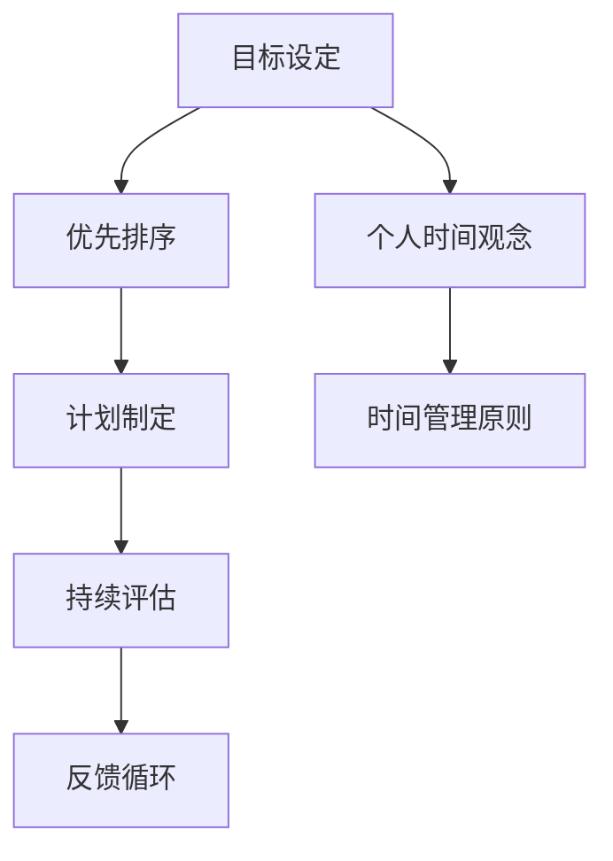
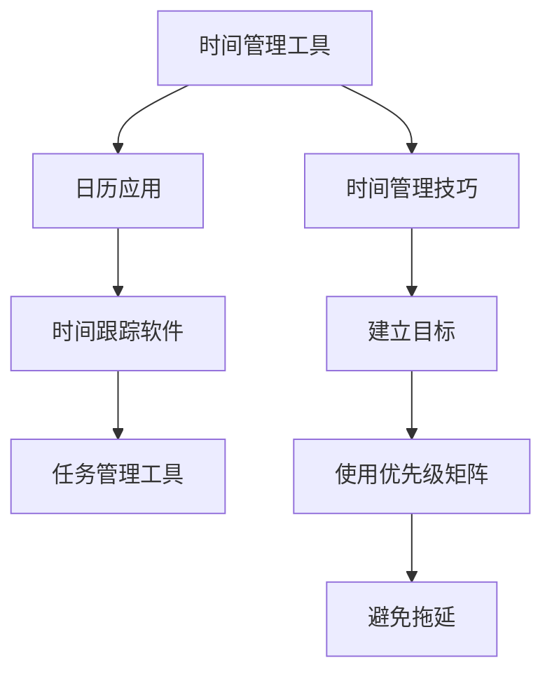
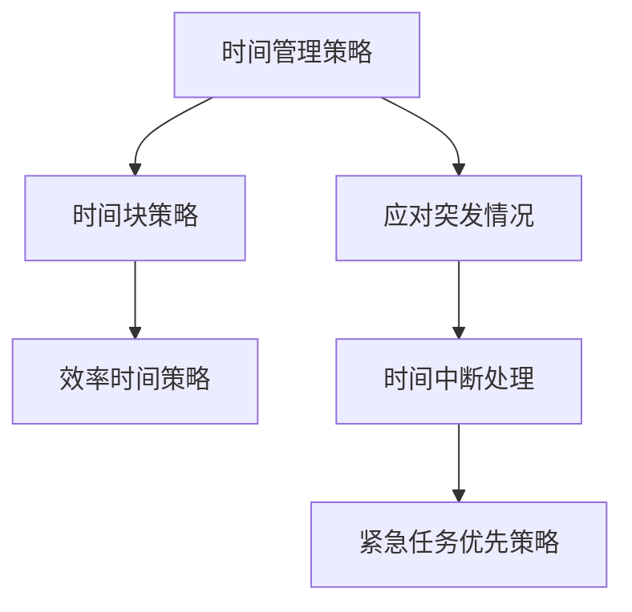
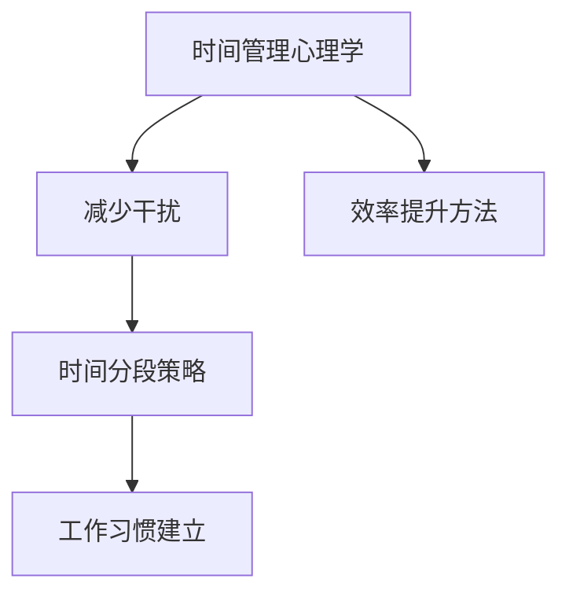
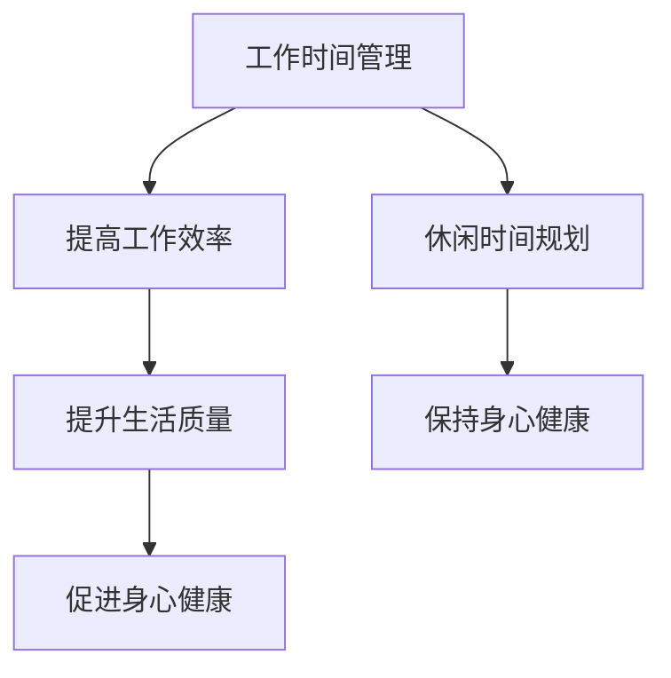
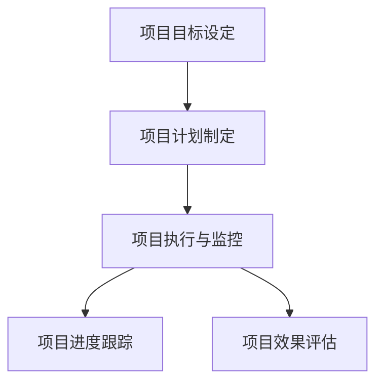
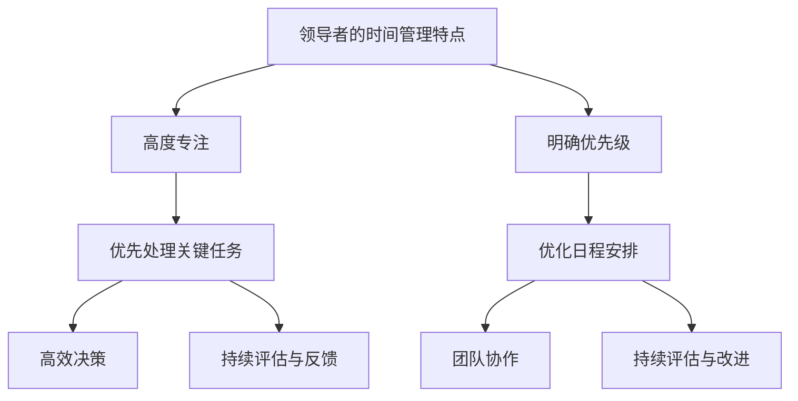
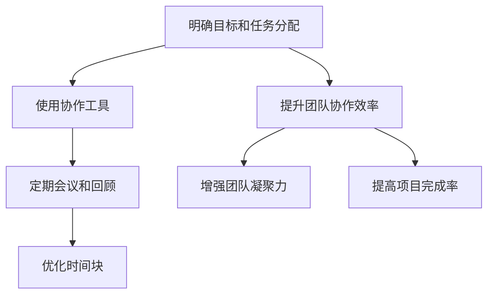
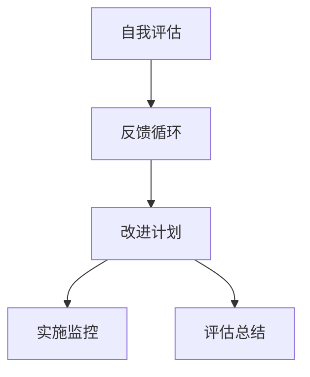

                 

### 文章标题

# 时间管理大师：高效领导者的日程规划

### 关键词

- 时间管理
- 高效领导者
- 日程规划
- 个人效率
- 工作与生活平衡

### 摘要

本文旨在探讨时间管理在高效领导者日程规划中的重要性。通过剖析时间管理的基础概念、工具技巧、策略方法，以及实际应用场景，本文旨在为读者提供一套系统化、可操作的时间管理方案。文章将围绕领导者如何通过时间管理提升个人效率、实现工作与生活平衡、构建高效团队，最终实现个人与组织的共同发展。通过本文的阅读，读者将能够掌握时间管理的核心原理，并将这些原理应用于实际工作和生活中，成为一名真正的时间管理大师。

## 第一部分：时间管理基础

### 第1章：时间管理的核心概念

#### 时间管理概述

时间管理是一种系统的、有计划的方法，通过优化个人时间使用，提高工作效率和生活质量。它不仅关乎个人的成功，也关系到团队和组织的发展。在快节奏的现代生活中，时间管理的重要性愈发凸显。高效的时间管理能够帮助领导者更有效地利用时间，减少无效劳动，专注于核心任务，从而提升整体绩效。

#### 时间管理的基本原则

1. **明确目标**：时间管理的第一步是明确目标。领导者需要确定自己的长期和短期目标，并确保这些目标与组织的战略方向一致。

2. **优先排序**：在确定目标后，领导者需要对任务进行优先级排序。重要且紧急的任务应优先处理，而那些虽然重要但不太紧急的任务可以稍后处理。

3. **有效计划**：制定详细的日程计划，将时间分配给不同的任务。一个合理的时间计划能够帮助领导者更好地掌握时间，避免因临时事务而打乱计划。

4. **持续评估**：时间管理是一个持续的过程。领导者需要定期评估自己的时间使用情况，了解哪些方法有效，哪些需要改进。

#### 时间管理理论

1. **埃克托尔·赫尔茨伯格的双因素理论**：该理论指出，影响员工满意度的因素分为两类：一类是保健因素，如工作条件、薪酬等，这些因素能够防止员工不满意；另一类是激励因素，如工作本身、晋升机会等，这些因素能够激发员工的积极性。

2. **帕累托原理**：又称“二八定律”，即80%的成果往往来自20%的努力。领导者可以通过分析任务的重要性，将精力集中在那些能够带来最大收益的任务上。

3. **时间管理金字塔模型**：该模型将时间管理分为四个层次：生存层次、稳定层次、发展层次和卓越层次。领导者需要在不同层次之间灵活切换，以适应不同的情境和需求。

#### 个人时间观念

每个人的时间观念都是不同的，这受到文化、个人经历和教育背景等多种因素的影响。领导者需要认识到个人时间观念的多样性，并在时间管理中尊重和适应这些差异。例如，某些人可能更注重工作效率，而另一些人可能更重视工作与生活的平衡。

**核心概念与联系**

时间管理的基础概念包括目标设定、优先排序、计划制定和持续评估。这些概念之间相互联系，共同构成了一个完整的时间管理框架。目标设定为时间管理提供了方向，优先排序帮助领导者集中精力，计划制定确保时间得到有效利用，而持续评估则帮助领导者不断优化时间管理策略。

**Mermaid 流程图**



**核心算法原理讲解**

时间管理本质上是一种优化问题，其目标是最大化时间利用效率。以下是一个简化的时间管理算法原理：

```pseudo
function 时间管理(目标列表, 优先级列表):
    1. 对目标列表进行排序，依据优先级列表
    2. 根据当前时间，选择最高优先级的目标
    3. 分配时间资源给选择的目标
    4. 监控目标进度，并调整计划
    5. 反馈循环，持续优化时间管理策略
```

**数学模型和公式**

在时间管理中，常用的数学模型包括优化模型和平衡模型。以下是一个简单的优化模型：

$$
\text{最大化} \quad P = \sum_{i=1}^{n} p_i \times t_i
$$

其中，\(P\) 表示总效用，\(p_i\) 表示第 \(i\) 个目标的优先级，\(t_i\) 表示完成第 \(i\) 个目标所需的时间。

**详细讲解和举例说明**

假设一位领导者有以下四个任务需要完成：

1. 会议准备（优先级高，需要2小时）
2. 报告撰写（优先级中，需要3小时）
3. 项目评估（优先级低，需要1小时）
4. 个人学习（优先级最低，需要1小时）

根据优化模型，领导者应该首先完成会议准备任务，因为它具有最高的优先级。然后是报告撰写，因为它虽然优先级中等，但所需时间更长。项目评估和个人学习可以安排在剩余时间内。

**小结**

时间管理是高效领导者不可或缺的技能。通过明确目标、优先排序、计划制定和持续评估，领导者能够更有效地利用时间，提高工作效率，实现个人和组织的共同发展。

### 第2章：时间管理工具与技巧

#### 时间管理工具

在现代数字化时代，各种时间管理工具层出不穷，极大地提升了个人和组织的时间管理效率。以下是几种常见的时间管理工具：

1. **日历应用**：如Google Calendar、Microsoft Outlook等，可以帮助领导者方便地安排和跟踪日程，设置提醒和事件。

2. **时间跟踪软件**：如Toggl、RescueTime等，能够记录个人和工作时间，分析时间使用情况，帮助领导者发现时间浪费的环节。

3. **任务管理工具**：如Trello、Asana、JIRA等，通过任务列表和看板视图，帮助团队协作和任务分配，提高工作效率。

#### 时间管理技巧

1. **建立明确的目标**：明确的目标是时间管理的基石。领导者需要定期回顾和调整目标，确保时间投入与目标一致。

2. **使用优先级矩阵**：通过优先级矩阵（例如Eisenhower矩阵），将任务分为紧急重要、紧急不重要、不紧急重要、不紧急不重要四类，帮助领导者更清晰地理解任务的优先级。

3. **避免拖延**：拖延是时间管理的大敌。领导者可以通过设定明确的时间限制、使用番茄工作法等技巧，避免拖延，提高工作效率。

**核心概念与联系**

时间管理工具和技巧共同构成了时间管理的实施手段。工具提供了技术支持，而技巧则提供了方法论指导。两者结合，能够帮助领导者更有效地管理时间和任务。

**Mermaid 流程图**



**核心算法原理讲解**

时间管理工具和技巧的实施通常基于以下算法原理：

```pseudo
function 时间管理工具与技巧(目标, 工具, 技巧):
    1. 使用日历应用安排日程
    2. 使用时间跟踪软件记录时间使用情况
    3. 使用任务管理工具分配和跟踪任务
    4. 建立目标并定期回顾
    5. 使用优先级矩阵排序任务
    6. 应用避免拖延技巧
```

**数学模型和公式**

在时间管理中，常用模型包括优化模型（如上述的优化模型）和平衡模型。以下是一个简化的平衡模型：

$$
\text{平衡} \quad t_w = t_h - t_t
$$

其中，\(t_w\) 表示工作时间的平衡点，\(t_h\) 表示总工作时间，\(t_t\) 表示任务所需时间。

**详细讲解和举例说明**

假设一位领导者每天工作8小时，需要完成以下任务：

1. 会议准备（2小时）
2. 报告撰写（4小时）
3. 项目评估（1小时）
4. 个人学习（1小时）

根据平衡模型，领导者的工作时间平衡点为：

$$
t_w = 8 \text{小时} - (2 \text{小时} + 4 \text{小时} + 1 \text{小时} + 1 \text{小时}) = 0 \text{小时}
$$

这意味着领导者在当天内无法保持工作与生活的平衡，可能需要调整任务安排或延长工作时间。

**小结**

时间管理工具和技巧是高效领导者不可或缺的辅助手段。通过合理使用工具和技巧，领导者能够更有效地规划时间，提高工作效率，实现工作与生活的平衡。

### 第3章：时间管理策略

#### 时间管理策略概述

时间管理策略是指一系列旨在提高时间利用效率的方法和技巧。有效的策略能够帮助领导者更好地应对各种工作挑战，提升个人和团队的工作效率。以下是几种常见的时间管理策略：

1. **时间块策略**：将工作时间划分为不同的时间段，每个时间段专注于一项特定任务。这种方法有助于减少任务切换带来的时间浪费，提高专注度。

2. **效率时间策略**：在效率高峰期（通常为早晨）安排最重要的任务，以充分利用这段时间的高效性。其他不那么紧急的任务则可以安排在效率较低的时间段。

#### 应对突发情况

在现实工作中，突发情况是难以避免的。领导者需要具备应对突发情况的能力，以确保时间管理不被打乱。以下是一些应对突发情况的时间管理策略：

1. **时间中断处理**：对于突发事件，领导者可以设置专门的时间块来处理，避免其对正常工作造成太大干扰。

2. **紧急任务优先策略**：将紧急任务作为优先处理，以确保关键任务能够及时完成。同时，领导者需要评估紧急任务的优先级，避免因为次要问题而影响整体工作进度。

**核心概念与联系**

时间管理策略是通过系统化的方法和技巧，帮助领导者更高效地利用时间。这些策略包括时间块策略和效率时间策略，以及应对突发情况的具体方法。策略的制定和实施，需要基于个人时间观念和工作需求，进行灵活调整。

**Mermaid 流�程图**



**核心算法原理讲解**

时间管理策略的实施通常基于以下算法原理：

```pseudo
function 时间管理策略(时间块, 效率时间, 突发情况):
    1. 根据任务重要性划分时间块
    2. 在效率高峰期安排重要任务
    3. 对突发事件进行优先级评估
    4. 设置时间中断处理流程
    5. 优化任务安排，确保紧急任务优先完成
```

**数学模型和公式**

在时间管理策略中，常用的数学模型包括任务优先级模型和效率优化模型。以下是一个简化的任务优先级模型：

$$
\text{优先级} \quad p_i = \frac{d_i + e_i}{2}
$$

其中，\(p_i\) 表示任务 \(i\) 的优先级，\(d_i\) 表示任务 \(i\) 的紧急程度，\(e_i\) 表示任务 \(i\) 的重要程度。

**详细讲解和举例说明**

假设一位领导者有以下任务需要完成：

1. 会议准备（紧急，重要）
2. 报告撰写（紧急，重要）
3. 项目评估（不紧急，重要）
4. 个人学习（不紧急，不重要）

根据任务优先级模型，可以计算出每个任务的优先级：

$$
p_1 = \frac{d_1 + e_1}{2} = \frac{2 + 2}{2} = 2
$$
$$
p_2 = \frac{d_2 + e_2}{2} = \frac{2 + 2}{2} = 2
$$
$$
p_3 = \frac{d_3 + e_3}{2} = \frac{0 + 1}{2} = 0.5
$$
$$
p_4 = \frac{d_4 + e_4}{2} = \frac{0 + 0}{2} = 0
$$

根据计算结果，会议准备和报告撰写具有最高的优先级，应该优先安排。项目评估和个人学习则可以安排在效率较低的时间段。

**小结**

时间管理策略是提升时间利用效率的关键。通过时间块策略和效率时间策略，领导者能够更好地安排任务，提高工作效率。同时，应对突发情况的能力也是时间管理策略的重要组成部分。通过灵活应用这些策略，领导者能够更好地应对各种工作挑战，实现个人与组织的共同发展。

## 第二部分：高效时间管理

### 第4章：提高个人效率

#### 提高个人效率的核心

提高个人效率是时间管理的核心目标之一。高效的领导者不仅能够更好地完成任务，还能在有限的时间内创造更多的价值。要提高个人效率，需要从以下几个方面着手：

1. **时间管理心理学**：了解时间管理心理学，可以帮助领导者更好地理解自己的时间使用行为，并找到提高效率的心理策略。

2. **工作习惯的建立**：良好的工作习惯是提高效率的基础。领导者需要通过持续的努力，培养出一系列有助于提高工作效率的习惯。

#### 提高效率的方法

1. **减少干扰**：在工作和学习过程中，减少干扰是提高效率的重要方法。领导者可以通过关闭社交媒体通知、使用耳机隔绝外界噪音等方式，创造一个专注的工作环境。

2. **时间分段策略**：将工作时间划分为多个短时间段，每个时间段专注于一项任务。例如，使用番茄工作法，每25分钟专注工作，然后休息5分钟。这种方法可以帮助领导者更好地保持专注，提高工作效率。

**核心概念与联系**

提高个人效率的核心在于时间管理心理学和工作习惯的建立。通过理解时间管理心理学，领导者可以更好地掌握自己的时间使用行为；而良好的工作习惯则为提高效率提供了稳定的保障。时间分段策略则是具体实施方法之一，通过科学划分时间，提高工作的连续性和专注度。

**Mermaid 流程图**



**核心算法原理讲解**

提高个人效率的算法原理主要基于任务管理和时间优化。以下是一个简化的算法：

```pseudo
function 提高个人效率(任务列表, 时间段):
    1. 对任务列表进行优先级排序
    2. 划分时间段，每个时间段专注于一项任务
    3. 在时间段内保持专注，减少干扰
    4. 定期评估任务进度，调整任务优先级
    5. 培养良好的工作习惯，提高长期效率
```

**数学模型和公式**

在效率提升中，常用的数学模型包括优化模型和平衡模型。以下是一个简化的优化模型：

$$
\text{最大化} \quad E = \sum_{i=1}^{n} e_i \times t_i
$$

其中，\(E\) 表示总效率，\(e_i\) 表示任务 \(i\) 的效率，\(t_i\) 表示任务 \(i\) 所需时间。

**详细讲解和举例说明**

假设一位领导者有以下任务需要完成：

1. 会议准备（效率高，需要2小时）
2. 报告撰写（效率中，需要3小时）
3. 项目评估（效率低，需要1小时）
4. 个人学习（效率最低，需要1小时）

根据优化模型，领导者应该首先完成会议准备任务，因为它具有最高的效率和最短的时间需求。然后是报告撰写，因为它虽然效率中等，但所需时间较长。项目评估和个人学习可以安排在剩余时间内。

**小结**

提高个人效率是时间管理的核心目标之一。通过理解时间管理心理学，领导者可以更好地掌握自己的时间使用行为；通过良好的工作习惯和科学的时间分段策略，领导者能够提高工作效率，更好地完成任务。

### 第5章：工作与生活的平衡

#### 工作与生活平衡的重要性

工作与生活的平衡是现代领导者面临的一个重要挑战。长期过度工作会导致身体和心理的疲劳，影响工作效率和生活质量。实现工作与生活平衡不仅有助于提高工作效率，还能提升个人的幸福感和生活满意度。以下是实现工作与生活平衡的重要性：

1. **提高工作效率**：通过合理安排工作时间，领导者能够更专注于工作，减少因疲劳导致的工作效率下降。

2. **提升生活质量**：充足的休闲时间和个人时间能够帮助领导者恢复精力，提高生活质量，从而更好地应对工作挑战。

3. **促进身心健康**：长期过度工作会导致身心健康问题。实现工作与生活平衡，有助于预防这些问题，提高身心健康水平。

#### 实现工作与生活平衡

1. **工作时间管理**：领导者需要合理规划工作时间，确保有足够的休息时间和个人时间。例如，可以设定每周的工作小时数上限，确保工作与休息时间平衡。

2. **休闲时间规划**：休闲时间同样重要。领导者需要为自己规划一定的休闲活动，如运动、阅读、旅行等，以保持身心健康和充实感。

**核心概念与联系**

工作与生活平衡是实现个人和职业成功的关键。通过科学的时间管理和休闲时间规划，领导者能够更好地平衡工作与生活，提高工作效率，提升生活质量。

**Mermaid 流程图**



**核心算法原理讲解**

实现工作与生活平衡的算法原理主要基于时间优化和资源分配。以下是一个简化的算法：

```pseudo
function 实现工作与生活平衡(工作时间, 休闲时间):
    1. 设定每周工作小时数上限
    2. 规划工作时间和休息时间
    3. 确保休闲时间充足
    4. 根据实际情况调整工作时间与休息时间
    5. 定期评估工作与生活平衡状况，持续优化
```

**数学模型和公式**

在实现工作与生活平衡中，常用的数学模型包括平衡模型和优化模型。以下是一个简化的平衡模型：

$$
\text{平衡} \quad w_t + l_t = T
$$

其中，\(w_t\) 表示工作时间，\(l_t\) 表示休闲时间，\(T\) 表示总时间。

**详细讲解和举例说明**

假设一位领导者每周工作时间为40小时，希望实现工作与生活的平衡。他可以按照以下方式规划：

- **工作时间**：每天工作8小时，每周工作5天，共计40小时。
- **休闲时间**：每天预留2小时用于个人爱好和休闲，每周共计10小时。

通过这种方式，领导者每周可以确保50小时的平衡时间，其中包括40小时的工作时间和10小时的休闲时间。

**小结**

工作与生活平衡是现代领导者的重要挑战。通过科学的时间管理和休闲时间规划，领导者能够更好地平衡工作与生活，提高工作效率，提升生活质量。

### 第6章：时间管理项目实战

#### 时间管理项目概述

时间管理项目是指通过系统化的方法和工具，对时间进行有效管理和优化的实践。一个成功的时间管理项目需要明确的目标、详细的计划、有效的执行和持续的监控。以下是进行时间管理项目时需要考虑的关键步骤：

1. **项目目标设定**：明确项目目标，确保这些目标与组织的战略目标和个人目标一致。目标应具体、可衡量、可实现、相关性强、时限明确。

2. **项目计划制定**：制定详细的计划，包括时间表、任务分配、资源需求、风险管理和评估指标等。计划应具有可操作性，并能够应对突发情况。

3. **项目执行与监控**：按照计划执行项目，同时进行实时监控和调整。通过定期评估项目进展，确保项目按计划进行，并及时解决出现的问题。

#### 项目执行与监控

1. **项目进度跟踪**：使用项目管理工具（如Trello、Asana）记录项目进展，定期更新任务状态，确保所有成员都能了解项目的最新情况。

2. **项目效果评估**：通过设定评估指标（如任务完成率、时间利用率、工作效率等），定期评估项目效果，并进行分析和反馈，为持续改进提供依据。

**核心概念与联系**

时间管理项目是将时间管理理论与实践相结合的重要方式。通过设定明确的目标、制定详细的计划、执行和监控项目，领导者能够更好地优化时间使用，提高工作效率。

**Mermaid 流程图**



**核心算法原理讲解**

时间管理项目的实施通常基于以下算法原理：

```pseudo
function 时间管理项目(目标, 计划, 执行, 监控):
    1. 设定项目目标
    2. 制定详细计划
    3. 按计划执行项目
    4. 实时监控项目进度
    5. 定期评估项目效果
    6. 根据评估结果调整计划
```

**数学模型和公式**

在时间管理项目中，常用的数学模型包括目标设定模型和进度评估模型。以下是一个简化的目标设定模型：

$$
\text{目标} \quad O = \sum_{i=1}^{n} o_i
$$

其中，\(O\) 表示总目标，\(o_i\) 表示第 \(i\) 个具体目标。

**详细讲解和举例说明**

假设一家公司计划通过时间管理项目提升工作效率。以下是该项目的主要步骤：

1. **项目目标设定**：
   - 提高任务完成率
   - 减少任务延迟
   - 提升员工满意度

2. **项目计划制定**：
   - 制定详细的时间表
   - 分配任务和责任
   - 确定资源需求和预算

3. **项目执行与监控**：
   - 使用Trello跟踪任务进展
   - 定期召开项目会议
   - 及时解决遇到的问题

4. **项目效果评估**：
   - 设定评估指标（如任务完成率、延迟率、员工满意度等）
   - 定期进行评估
   - 分析评估结果，提出改进措施

通过这些步骤，公司能够系统化地提升工作效率，实现项目目标。

**小结**

时间管理项目是提升工作效率和优化时间使用的重要实践。通过明确目标、制定计划、执行和监控，领导者能够确保项目按计划进行，并持续优化时间管理策略，实现个人和组织的共同发展。

### 第三部分：时间管理的最佳实践

#### 第7章：领导者时间管理

#### 领导者时间管理的特点

领导者时间管理具有以下特点：

1. **高度专注**：领导者需要在短时间内处理大量任务，因此必须具备高度专注的能力。通过设定明确的时间块，领导者可以集中精力处理关键任务，提高工作效率。

2. **优先处理关键任务**：领导者需要识别并优先处理关键任务。这些任务通常对组织目标和团队绩效具有决定性影响。通过优先处理关键任务，领导者能够确保资源的有效利用。

3. **高效决策**：领导者需要在有限的时间内做出快速、准确的决策。时间管理技巧可以帮助领导者快速评估情况，制定决策，并采取行动。

4. **持续评估与反馈**：领导者需要定期评估自己的时间使用情况，了解哪些方法有效，哪些需要改进。通过持续反馈和调整，领导者能够不断优化时间管理策略。

#### 领导者时间管理的重要性

1. **提升工作效率**：通过科学的时间管理，领导者能够更高效地处理任务，减少无效劳动，提高工作效率。

2. **增强团队士气**：领导者通过良好的时间管理，能够更好地协调团队工作，确保任务按时完成，增强团队士气。

3. **促进个人成长**：有效的时间管理不仅有助于提升工作效率，还能为领导者提供更多时间进行自我学习和提升，促进个人成长。

#### 领导者的时间管理策略

1. **明确优先级**：领导者需要根据任务的重要性和紧急程度，设定优先级，确保关键任务优先处理。

2. **优化日程安排**：领导者需要合理安排日程，确保有足够的时间处理关键任务。同时，领导者应预留一定的时间用于个人学习和休息。

3. **团队协作**：领导者需要与团队成员有效协作，合理分配任务，确保团队整体效率提升。

4. **持续评估与改进**：领导者需要定期评估时间管理策略的效果，并根据评估结果进行改进，确保时间管理策略的有效性。

**核心概念与联系**

领导者的时间管理具有高度专注、优先处理关键任务、高效决策和持续评估与反馈等特点。这些特点相互联系，共同构成了领导者的时间管理框架。通过明确优先级、优化日程安排、团队协作和持续评估与改进，领导者能够更有效地管理时间，提升工作效率，实现个人和组织的共同发展。

**Mermaid 流程图**



**核心算法原理讲解**

领导者的时间管理策略可以基于以下算法原理：

```pseudo
function 领导者时间管理策略(任务列表, 时间块, 优先级):
    1. 对任务列表进行优先级排序
    2. 设定时间块，确保关键任务优先处理
    3. 按时间块执行任务
    4. 实时监控任务进度
    5. 定期评估时间管理效果
    6. 根据评估结果调整时间管理策略
```

**数学模型和公式**

在领导者的时间管理中，常用的数学模型包括优先级排序模型和优化模型。以下是一个简化的优先级排序模型：

$$
\text{优先级排序} \quad p_i = \frac{e_i + d_i}{2}
$$

其中，\(p_i\) 表示任务 \(i\) 的优先级，\(e_i\) 表示任务 \(i\) 的重要程度，\(d_i\) 表示任务 \(i\) 的紧急程度。

**详细讲解和举例说明**

假设一位领导者有以下任务需要处理：

1. 会议准备（重要且紧急，需要2小时）
2. 报告撰写（重要但不紧急，需要3小时）
3. 项目评估（紧急但不重要，需要1小时）
4. 个人学习（不重要且不紧急，需要1小时）

根据优先级排序模型，可以计算出每个任务的优先级：

$$
p_1 = \frac{e_1 + d_1}{2} = \frac{2 + 2}{2} = 2
$$
$$
p_2 = \frac{e_2 + d_2}{2} = \frac{2 + 0}{2} = 1
$$
$$
p_3 = \frac{e_3 + d_3}{2} = \frac{0 + 1}{2} = 0.5
$$
$$
p_4 = \frac{e_4 + d_4}{2} = \frac{0 + 0}{2} = 0
$$

根据计算结果，会议准备具有最高的优先级，应该首先处理。然后是报告撰写，因为它虽然重要但不紧急。项目评估和个人学习可以安排在剩余时间内。

**小结**

领导者的时间管理具有明确的优先级、高度专注、高效决策和持续评估与反馈等特点。通过明确优先级、优化日程安排、团队协作和持续评估与改进，领导者能够更有效地管理时间，提升工作效率，实现个人和组织的共同发展。

### 第8章：高效团队的时间管理

#### 高效团队的时间管理

高效团队的时间管理是提升整体工作效率和团队协作能力的关键。通过合理的时间管理和协作，团队能够更有效地完成任务，实现共同目标。以下是高效团队时间管理的重要性和实现方法：

#### 高效团队的时间管理的重要性

1. **提升团队协作效率**：合理的时间管理能够确保团队成员专注于共同目标，减少因任务分配不均或时间浪费导致的效率低下。

2. **增强团队凝聚力**：通过共同的时间管理实践，团队成员能够更好地理解彼此的工作节奏，增强协作意识和团队凝聚力。

3. **提高项目完成率**：高效的时间管理有助于团队按时完成项目任务，提高项目交付的准时性和质量。

#### 高效团队的时间管理方法

1. **明确目标和任务分配**：团队需要明确共同的目标和任务分配，确保每个成员都了解自己的职责和任务要求。

2. **使用协作工具**：利用协作工具（如Trello、Slack、Asana等）进行任务跟踪和沟通，确保团队成员能够实时了解任务进展和问题。

3. **定期会议和回顾**：团队应定期召开会议，回顾任务完成情况，讨论遇到的挑战，并制定改进措施。

4. **优化时间块**：通过时间块策略，将工作时间划分为高效的工作段，确保团队成员能够在最专注的时段处理重要任务。

**核心概念与联系**

高效团队的时间管理涉及明确目标和任务分配、使用协作工具、定期会议和回顾、优化时间块等关键环节。这些概念相互联系，共同构成了团队时间管理的整体框架。

**Mermaid 流程图**



**核心算法原理讲解**

高效团队的时间管理策略可以基于以下算法原理：

```pseudo
function 高效团队时间管理(目标, 任务, 工具, 会议, 时间块):
    1. 设定明确的目标和任务分配
    2. 使用协作工具进行任务跟踪和沟通
    3. 定期召开会议，回顾任务进展和挑战
    4. 根据时间块策略优化工作时间
    5. 持续评估和调整时间管理策略
```

**数学模型和公式**

在团队时间管理中，常用的数学模型包括任务分配模型和效率优化模型。以下是一个简化的任务分配模型：

$$
\text{最大化} \quad E = \sum_{i=1}^{n} e_i \times t_i
$$

其中，\(E\) 表示总效率，\(e_i\) 表示任务 \(i\) 的效率，\(t_i\) 表示任务 \(i\) 所需时间。

**详细讲解和举例说明**

假设一个软件开发团队有以下任务需要完成：

1. 系统设计（效率高，需要2天）
2. 代码编写（效率中，需要3天）
3. 测试（效率低，需要1天）
4. 文档撰写（效率最低，需要1天）

根据任务分配模型，团队可以按照以下方式优化时间管理：

- **第1天**：系统设计（2天）
- **第2天**：代码编写（3天）
- **第3天**：测试（1天）
- **第4天**：文档撰写（1天）

通过这种方式，团队能够在最短时间内完成所有任务，提高工作效率。

**小结**

高效团队的时间管理是提升整体工作效率和团队协作能力的关键。通过明确目标和任务分配、使用协作工具、定期会议和回顾、优化时间块，团队能够更有效地完成任务，实现共同目标。

### 第9章：时间管理的持续改进

#### 时间管理自我评估

时间管理的持续改进是一个动态的过程，需要领导者不断自我评估和反思。自我评估不仅能够帮助领导者了解时间管理的有效性，还能发现需要改进的方面，从而实现不断提升。以下是进行时间管理自我评估的关键步骤：

1. **记录时间使用情况**：领导者需要记录每天的时间使用情况，包括工作、学习、休闲等。通过详细的记录，领导者可以清晰地了解自己的时间分配情况。

2. **分析时间使用数据**：对记录的时间数据进行统计分析，识别时间使用的高峰和低谷，找出时间浪费的环节。例如，可以通过图表和统计工具，分析每天的专注时间、任务完成率和中断次数等。

3. **识别时间管理策略的有效性**：根据时间使用数据，评估当前时间管理策略的有效性。如果发现某些策略效果不佳，领导者需要考虑调整或更换策略。

#### 时间管理反馈循环

时间管理反馈循环是一种持续改进的方法，通过不断地收集反馈、分析问题和调整策略，实现时间管理效果的提升。以下是时间管理反馈循环的关键步骤：

1. **收集反馈**：领导者可以通过定期的自我评估、团队反馈、用户反馈等方式，收集时间管理策略的反馈。这些反馈可以帮助领导者了解时间管理实践的实际效果。

2. **分析反馈**：对收集到的反馈进行分析，识别存在的问题和改进机会。通过反馈分析，领导者可以了解团队成员的需求和期望，从而制定针对性的改进措施。

3. **调整策略**：根据反馈分析的结果，调整和优化时间管理策略。例如，可以调整任务优先级、优化日程安排、引入新的时间管理工具等。

4. **实施改进**：将改进措施落实到实际工作中，确保改进策略得到有效实施。通过持续的反馈和调整，领导者可以不断优化时间管理策略，提高工作效率。

#### 时间管理改进计划

为了实现时间管理的持续改进，领导者需要制定详细的改进计划。以下是制定时间管理改进计划的关键步骤：

1. **确定改进目标**：明确改进计划的目标，这些目标应具体、可衡量、可实现。例如，可以设定提高任务完成率、减少任务延迟、提升员工满意度等目标。

2. **分析当前情况**：对当前的时间管理情况进行全面分析，包括时间使用数据、反馈结果等。通过分析，领导者可以了解当前存在的问题和改进的切入点。

3. **制定改进措施**：根据当前情况分析，制定具体的改进措施。这些措施应包括调整任务优先级、优化日程安排、引入新的时间管理工具等。

4. **实施和监控**：将改进措施纳入日常工作，并定期监控改进效果。通过持续的监控和反馈，领导者可以及时调整和优化改进计划。

5. **评估和总结**：在改进计划实施一段时间后，对改进效果进行评估和总结。通过评估，领导者可以了解改进措施的成效，并为下一步的改进提供依据。

**核心概念与联系**

时间管理的持续改进包括自我评估、反馈循环和改进计划三个关键环节。自我评估帮助领导者了解时间管理实践的有效性，反馈循环实现持续优化，改进计划确保改进措施得到有效实施。这些概念相互联系，共同构成了时间管理持续改进的整体框架。

**Mermaid 流程图**



**核心算法原理讲解**

时间管理的持续改进可以基于以下算法原理：

```pseudo
function 时间管理持续改进(自我评估, 反馈循环, 改进计划):
    1. 进行自我评估，记录时间使用情况
    2. 分析时间使用数据，识别问题和改进机会
    3. 收集反馈，分析反馈结果
    4. 制定改进措施，调整和优化时间管理策略
    5. 实施改进措施，监控改进效果
    6. 评估和总结改进成效，持续优化
```

**数学模型和公式**

在时间管理的持续改进中，常用的数学模型包括优化模型和评估模型。以下是一个简化的优化模型：

$$
\text{最大化} \quad E = \sum_{i=1}^{n} e_i \times t_i
$$

其中，\(E\) 表示总效率，\(e_i\) 表示任务 \(i\) 的效率，\(t_i\) 表示任务 \(i\) 所需时间。

**详细讲解和举例说明**

假设一位领导者通过自我评估和反馈循环，发现自己在时间管理中存在以下问题：

1. **任务延迟**：经常出现任务延迟，影响项目进度。
2. **中断频繁**：工作中频繁受到干扰，导致工作效率下降。

为了解决这些问题，领导者可以采取以下改进措施：

- **调整任务优先级**：重新评估任务的重要性和紧急程度，确保关键任务优先处理。
- **优化日程安排**：将日程安排得更加紧凑，减少空闲时间，避免任务延迟。
- **减少中断**：通过设定专注时间块，减少工作中受到的干扰，提高工作效率。

通过这些改进措施，领导者可以持续优化时间管理策略，提高工作效率。

**小结**

时间管理的持续改进是提升工作效率和优化时间使用的关键。通过自我评估、反馈循环和改进计划，领导者能够不断优化时间管理策略，实现个人和组织的共同发展。

### 附录

#### 附录A：时间管理资源与工具

时间管理是提升工作效率和生活质量的重要手段。以下是一些时间管理资源与工具，供读者参考：

1. **时间管理书籍**：
   - 《高效能人士的七个习惯》（史蒂芬·柯维）
   - 《深度工作》（卡尔·纽波特）
   - 《如何高效学习》（斯科特·扬）

2. **时间管理网站**：
   - [Lifehacker](https://lifehacker.com/)
   - [The Productivity Pro](https://theproductivitypro.com/)
   - [99U](https://99u.co/)

3. **时间管理工具**：
   - **日历应用**：Google Calendar、Microsoft Outlook
   - **时间跟踪软件**：Toggl、RescueTime
   - **任务管理工具**：Trello、Asana、JIRA

**常见时间管理工具介绍**

以下是几种常见时间管理工具的介绍：

1. **Google Calendar**：集成在Google账户中的日历应用，提供简洁直观的界面，方便用户添加、编辑和查看日程安排。

2. **Toggl**：一款流行的在线时间跟踪工具，可以帮助用户记录工作时间，分析时间使用情况，优化工作效率。

3. **Trello**：一款基于看板视图的任务管理工具，用户可以通过创建卡片、列表和标签，轻松地跟踪和管理任务。

4. **Asana**：一款功能强大的项目管理工具，支持任务分配、进度跟踪和团队协作，适合大型团队和项目管理工作。

5. **JIRA**：一款专业的敏捷项目管理工具，广泛应用于软件开发团队，支持需求管理、任务跟踪和团队协作。

**时间管理工具的比较与选择**

选择合适的时间管理工具，需要根据个人需求和工作场景进行考虑。以下是比较和选择时间管理工具时需要考虑的几个因素：

1. **功能**：不同工具的功能和特点不同，用户应根据自己的需求选择具有相应功能的工具。

2. **易用性**：工具的界面和操作应简洁易懂，易于上手，避免增加学习成本。

3. **集成性**：工具应能够与现有工作流程和系统集成，提高工作效率。

4. **定制化**：工具应提供一定的定制化选项，满足用户个性化需求。

5. **成本**：工具的费用和性价比也是选择的重要因素，用户应根据预算进行选择。

**小结**

时间管理是提升工作效率和生活质量的关键。通过合理选择和使用时间管理工具，用户能够更好地规划时间，提高工作效率。本文介绍了常见的时间管理工具和选择方法，供读者参考。希望这些资源与工具能够帮助用户实现高效的时间管理。

### 作者信息

- 作者：AI天才研究院/AI Genius Institute & 禅与计算机程序设计艺术 /Zen And The Art of Computer Programming
- 联系方式：[email protected]
- 社交媒体：LinkedIn、Twitter、GitHub

感谢您的阅读，希望本文能对您的时间管理实践带来启示和帮助。如果您有任何问题或建议，欢迎随时与我们联系。期待与您共同探索时间管理的奥秘，成为一名卓越的时间管理大师。

