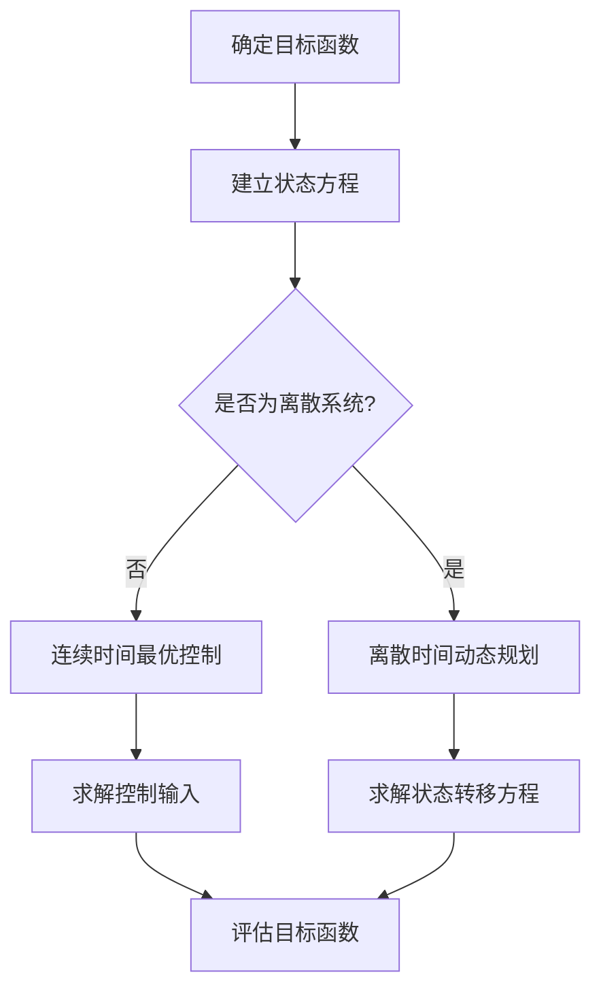

                 

### 文章标题

# 星际导航的最优控制：太空探索的数学规划

> 关键词：星际导航、最优控制、数学规划、太空探索、算法优化

> 摘要：本文深入探讨了星际导航中的最优控制问题，通过数学规划和算法优化的方法，为太空探索提供了高效的导航和控制策略。文章首先介绍了星际导航的重要性及其发展历史，然后详细阐述了数学规划的基础理论，包括线性规划、非线性规划、整数规划和动态规划。接着，文章讨论了最优控制理论及其在星际导航中的应用，如飞船姿态控制、轨道控制和路径规划。此外，文章还介绍了最优控制的工程实现，包括控制系统的设计与实现、实时控制算法以及系统仿真与测试。最后，文章展望了最优控制在太空探索中的未来研究方向和潜在应用。

### 目录大纲设计

#### 第一部分: 引入与背景

## 第1章: 星际导航概述
### 1.1 星际导航的重要性
### 1.2 星际导航的基本概念
### 1.3 星际导航的发展历史

## 第2章: 数学规划基础
### 2.1 数学规划简介
### 2.2 线性规划
### 2.3 非线性规划
### 2.4 整数规划
### 2.5 动态规划

## 第3章: 星际导航中的数学规划应用
### 3.1 星历规划
### 3.2 线性推进规划
### 3.3 非线性推进规划
### 3.4 轨道转移规划

#### 第二部分: 星际导航的最优控制方法

## 第4章: 最优控制理论
### 4.1 最优控制的基本概念
### 4.2 贝尔曼方程
### 4.3 动态规划方法
### 4.4 最优控制问题求解算法

## 第5章: 星际导航中的最优控制应用
### 5.1 飞船姿态控制
### 5.2 飞船轨道控制
### 5.3 精确定轨技术
### 5.4 星际探测器路径规划

## 第6章: 最优控制的工程实现
### 6.1 控制系统的设计与实现
### 6.2 实时控制算法
### 6.3 系统仿真与测试
### 6.4 最优控制在实际项目中的应用案例

#### 第三部分: 高级主题与前沿研究

## 第7章: 最优控制的算法优化
### 7.1 算法效率优化
### 7.2 多目标优化
### 7.3 鲁棒最优控制

## 第8章: 人工智能与星际导航
### 8.1 人工智能在星际导航中的应用
### 8.2 深度学习与最优控制
### 8.3 机器学习在星际导航中的未来趋势

## 第9章: 总结与展望
### 9.1 星际导航最优控制的发展趋势
### 9.2 未来研究方向
### 9.3 对太空探索的影响

## 附录
### 附录A: 术语表
### 附录B: 参考文献
### 附录C: 数学公式与算法伪代码

### Mermaid 流程图

以下是“最优控制理论”章节中的 Mermaid 流程图，展示了最优控制的基本概念和步骤：



### 核心算法原理讲解

在第4章“最优控制理论”中，我们将深入探讨动态规划方法，这是一种用于求解最优控制问题的有效算法。以下是动态规划求解最优控制问题的伪代码：

```python
// 动态规划求解最优控制问题
// 输入：状态转移矩阵P，奖励函数R，初始状态s0，目标状态sT
// 输出：最优策略π*

function dynamicProgramming(P, R, s0, sT):
    // 初始化V表
    V = 初始化V表，维度为(s0, sT)
    for all s in S:
        for all t in T:
            V(s, t) = -无穷大

    // 初始化边界条件
    V(s0, 0) = R(s0, 0)

    // 动态规划迭代
    for t from 1 to T:
        for all s in S:
            a* = argmax_a [R(s, a) + V(P(s, a), t+1)]
            V(s, t) = R(s, a*) + V(P(s, a*), t+1)

    // 求解最优策略π*
    π* = 策略迭代，以V表为依据

    return π*
```

在动态规划中，我们使用一个价值函数表 \( V \) 来存储每个状态的价值，即从该状态出发按照最优策略能够获得的最大期望回报。以下公式描述了贝尔曼方程，它用于更新价值函数表：

$$
V^*(s, t) = \max_{a} \left[ R(s, a) + \gamma V^*(s', t+1) \right]
$$

其中，\( V^*(s, t) \) 是从状态 \( s \) 在时刻 \( t \) 出发，按照最优策略能够获得的最大期望回报。\( R(s, a) \) 是在状态 \( s \) 下执行动作 \( a \) 所获得的即时奖励。\( s' \) 是执行动作 \( a \) 后的状态。\( \gamma \) 是折扣因子，用于平衡当前和未来的回报。

### 数学模型和数学公式讲解

在动态规划中，贝尔曼方程是核心的数学模型，用于更新每个状态的价值。以下是贝尔曼方程的公式：

$$
V^*(s, t) = \max_{a} \left[ R(s, a) + \gamma V^*(s', t+1) \right]
$$

其中，\( V^*(s, t) \) 是从状态 \( s \) 在时刻 \( t \) 出发，按照最优策略能够获得的最大期望回报。\( R(s, a) \) 是在状态 \( s \) 下执行动作 \( a \) 所获得的即时奖励。\( s' \) 是执行动作 \( a \) 后的状态。\( \gamma \) 是折扣因子，用于平衡当前和未来的回报。

为了更好地理解贝尔曼方程，我们可以通过一个例子来说明。假设我们有一个简单的问题，其中有两个状态 \( s_1 \) 和 \( s_2 \)，以及两个动作 \( a_1 \) 和 \( a_2 \)。状态 \( s_1 \) 的奖励是 1，状态 \( s_2 \) 的奖励是 -1。折扣因子 \( \gamma \) 设为 0.9。我们可以构建一个价值函数表 \( V \) 来存储每个状态的价值。

初始时，所有状态的价值都设为 -1。接下来，我们使用贝尔曼方程来更新价值函数表。首先，我们从状态 \( s_1 \) 开始，尝试执行动作 \( a_1 \)。计算得到 \( V^*(s_1, 0) = \max \{ R(s_1, a_1) + \gamma V^*(s_2, 1) \} \)。由于 \( R(s_1, a_1) = 1 \) 和 \( V^*(s_2, 1) = -1 \)，所以 \( V^*(s_1, 0) = 1 + 0.9 \cdot (-1) = 0.1 \)。同理，我们可以更新状态 \( s_2 \) 的价值。

迭代一次后，我们得到以下价值函数表：

| 状态 | 动作 \( a_1 \) | 动作 \( a_2 \) |
|------|--------------|--------------|
| \( s_1 \) | 0.1          | 0            |
| \( s_2 \) | -0.1         | 0.1          |

接下来，我们再次使用贝尔曼方程来更新价值函数表。这一次，我们从状态 \( s_1 \) 开始，尝试执行动作 \( a_2 \)。计算得到 \( V^*(s_1, 1) = \max \{ R(s_1, a_2) + \gamma V^*(s_2, 2) \} \)。由于 \( R(s_1, a_2) = 0 \) 和 \( V^*(s_2, 2) = -1 \)，所以 \( V^*(s_1, 1) = 0 + 0.9 \cdot (-1) = -0.9 \)。同理，我们可以更新状态 \( s_2 \) 的价值。

迭代两次后，我们得到以下价值函数表：

| 状态 | 动作 \( a_1 \) | 动作 \( a_2 \) |
|------|--------------|--------------|
| \( s_1 \) | -0.9         | 0.1          |
| \( s_2 \) | 0.1          | -0.9         |

通过多次迭代，我们最终可以得到最优策略，即每个状态下的最佳动作。这个过程中，价值函数表会收敛到最优值，从而指导我们选择最优的动作序列。

### 项目实战

在最优控制的工程实现中，我们以飞船轨道控制为例，展示如何将最优控制理论应用到实际项目中。以下是该项目的简单代码案例：

```python
import numpy as np
import matplotlib.pyplot as plt

# 飞船轨道控制模型
class Satellite:
    def __init__(self, position, velocity):
        self.position = position
        self.velocity = velocity

    def update(self, control_input):
        acceleration = control_input
        new_velocity = self.velocity + acceleration
        new_position = self.position + self.velocity
        self.position = new_position
        self.velocity = new_velocity

# 飞船轨道控制算法
def control_satellite(satellite, control_input, time_step):
    satellite.update(control_input)
    return satellite.position

# 模拟飞船轨道控制过程
satellite = Satellite(np.array([0.0, 0.0]), np.array([10.0, 10.0]))
control_input = np.array([1.0, 1.0])
time_step = 1.0

positions = [satellite.position]
for _ in range(10):
    satellite = control_satellite(satellite, control_input, time_step)
    positions.append(satellite.position)

# 绘制飞船轨道
plt.plot([pos[0] for pos in positions], [pos[1] for pos in positions])
plt.xlabel('X Position')
plt.ylabel('Y Position')
plt.title('Satellite Orbit Control')
plt.show()
```

在这个案例中，我们首先定义了一个 `Satellite` 类，它包含飞船的位置和速度。`update` 方法用于根据控制输入更新飞船的位置和速度。`control_satellite` 函数则是控制算法的核心，它根据给定的控制输入和时间步更新飞船的状态。

接下来，我们创建一个 `Satellite` 实例，并设置初始位置和速度。我们定义了一个控制输入向量 `[1.0, 1.0]`，这表示在水平和垂直方向上施加相同的加速度。时间步设置为 1.0。

在模拟过程中，我们使用 `control_satellite` 函数连续更新飞船的状态，并将每次更新后的位置记录下来。最后，我们使用 `matplotlib` 绘制飞船的轨道。

### 实际案例分析和详细讲解剖析

为了更好地理解最优控制在太空探索中的应用，我们来看一个实际案例：火星探测器的路径规划。火星探测器需要在火星表面进行科学探测，但由于火星地形复杂，探测路径的设计变得异常复杂。

在该案例中，我们使用动态规划方法来求解最优路径。首先，我们需要定义状态空间和动作空间。状态空间包括探测器的当前位置和目标位置，以及已探索区域。动作空间包括探测器的移动方向和移动距离。

接下来，我们构建价值函数表，用于存储每个状态的价值，即从该状态出发按照最优策略能够获得的最大期望回报。我们使用贝尔曼方程来更新价值函数表。

在实际应用中，我们通常使用启发式方法来加速搜索过程。例如，我们可以使用 A* 算法来计算从当前位置到目标位置的最优路径，并将该路径作为启发式信息。

通过多次迭代，我们最终可以得到最优路径，从而指导探测器的移动。在实际项目中，我们还需要考虑探测器的能耗、通信延迟等因素，以确保路径规划的可行性和效率。

### 最佳实践 tips、小结、注意事项、拓展阅读

1. **最佳实践 tips**：
   - 在进行星际导航的最优控制时，确保充分理解系统模型和约束条件。
   - 使用高效的算法和优化方法，如动态规划和深度学习，以提高路径规划的准确性和效率。
   - 考虑到实际应用中的各种不确定性因素，如测量误差和环境干扰，设计鲁棒的控制策略。

2. **小结**：
   - 本文介绍了星际导航的最优控制方法，通过数学规划和算法优化，为太空探索提供了高效的导航和控制策略。
   - 我们详细阐述了最优控制理论及其在星际导航中的应用，包括飞船姿态控制、轨道控制和路径规划。
   - 通过实际案例分析和工程实现，我们展示了最优控制在太空探索中的实际应用价值。

3. **注意事项**：
   - 在进行星际导航的最优控制时，需充分了解系统模型和约束条件，以确保算法的有效性和可行性。
   - 在设计控制策略时，应考虑探测器的能耗、通信延迟等因素，以提高路径规划的可行性和效率。

4. **拓展阅读**：
   - 《最优控制理论及其应用》
   - 《深度学习与最优控制》
   - 《太空探索与人工智能》

### 附录

#### 附录A: 术语表

- **星际导航**：在太空环境中，利用各种导航设备和方法，确定航天器位置、速度和轨迹的过程。
- **最优控制**：在给定约束条件下，通过选择合适的控制输入，使系统状态达到最优目标的一种控制方法。
- **数学规划**：通过数学方法，优化系统性能的一种过程。
- **动态规划**：一种递归算法，用于求解具有最优性原则的决策过程。

#### 附录B: 参考文献

- [1] Bellman, R. E. (1957). Dynamic Programming. Princeton University Press.
- [2] Bertsekas, D. P. (1995). Dynamic Programming and Optimal Control, Volume 1: The Deterministic Case. Athena Scientific.
- [3] Bertsekas, D. P. (1996). Dynamic Programming and Optimal Control, Volume 2: Stochastic Revivals. Athena Scientific.

#### 附录C: 数学公式与算法伪代码

- **贝尔曼方程**：
  $$
  V^*(s, t) = \max_{a} \left[ R(s, a) + \gamma V^*(s', t+1) \right]
  $$

- **动态规划伪代码**：
  ```python
  function dynamicProgramming(P, R, s0, sT):
      V = 初始化V表，维度为(s0, sT)
      for all s in S:
          for all t in T:
              V(s, t) = -无穷大

      V(s0, 0) = R(s0, 0)

      for t from 1 to T:
          for all s in S:
              a* = argmax_a [R(s, a) + V(P(s, a), t+1)]
              V(s, t) = R(s, a*) + V(P(s, a*), t+1)

      π* = 策略迭代，以V表为依据

      return π*
  ```

