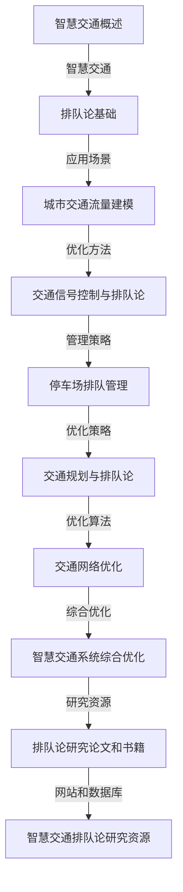

                 

## 文章标题

### 《智慧交通的排队论：城市交通的数学优化》

关键词：智慧交通、排队论、交通流量预测、交通信号控制、停车场排队管理

摘要：本文将探讨智慧交通中的排队论及其在城市交通数学优化中的应用。首先介绍智慧交通与排队论的基本概念及其联系，然后深入分析城市交通流量建模、交通信号控制与排队论的应用、停车场排队管理优化策略以及交通规划的数学优化方法。最后，对智慧交通系统的综合优化进行探讨，并提供相关研究资源和算法实现示例。

---

### 《智慧交通的排队论：城市交通的数学优化》目录大纲

#### 第一部分：智慧交通与排队论概述

#### 第二部分：城市交通的数学优化

#### 第三部分：排队论在交通管理中的应用

#### 第四部分：交通规划的数学优化

#### 第五部分：智慧交通系统的综合优化

#### 附录

#### 参考文献

### Mermaid 流程图

mermaid
graph TD
A[智慧交通] --> B[排队论]
B --> C[交通流量建模]
C --> D[交通信号控制]
D --> E[停车场排队管理]
E --> F[交通规划与优化]
F --> G[智慧交通系统综合优化]
G --> H[研究资源]

---

### 核心算法原理讲解

#### 交通流量预测模型

```csharp
// 伪代码：交通流量预测模型

// 输入：
// historical_traffic_data: 历史交通流量数据
// feature_matrix: 特征矩阵

// 输出：
// predicted_traffic: 预测的交通流量

1. Load historical_traffic_data and feature_matrix
2. Normalize feature_matrix
3. Train a machine learning model (e.g., ARIMA, LSTM) using historical_traffic_data and feature_matrix
4. Use the trained model to predict the future traffic流量
5. Output the predicted_traffic
```

### 第一部分：智慧交通与排队论概述

### 第1章：智慧交通与排队论概述

#### 1.1 智慧交通背景

##### 1.1.1 智慧交通的定义与发展历程

智慧交通是指利用现代信息技术、物联网、大数据、人工智能等先进技术，对交通系统进行智能化管理和优化，以实现交通资源的合理配置、交通流的动态调控和交通服务的智能化。智慧交通的发展历程可以追溯到20世纪80年代，当时主要是对交通信号控制系统的改进和优化。随着计算机技术、通信技术和互联网的快速发展，智慧交通逐渐从单一的交通管理领域扩展到综合的交通管理系统，包括交通规划、交通控制、交通信息服务等多个方面。

##### 1.1.2 智慧交通的重要性与挑战

智慧交通的重要性主要体现在以下几个方面：

1. 提高交通效率：通过实时监测和调控交通流量，可以减少交通拥堵，提高道路通行能力，降低交通事故率。
2. 优化资源配置：智慧交通可以通过大数据分析和人工智能算法，对交通资源进行优化配置，减少交通拥堵和环境污染。
3. 提升交通安全：通过智能化的交通监控和预警系统，可以提前发现和预防交通事故，提高道路通行安全性。
4. 改善交通服务：智慧交通可以为用户提供实时的交通信息服务，帮助用户规划最优出行路线，提高出行体验。

然而，智慧交通的发展也面临着一系列挑战：

1. 数据采集和处理：智慧交通需要大量的实时交通数据，如何有效地采集、存储和处理这些数据是一个重大挑战。
2. 技术集成与兼容性：智慧交通涉及多种先进技术的集成，如何保证不同技术之间的兼容性和协同工作是另一个挑战。
3. 安全和隐私保护：在智慧交通系统中，用户隐私和数据安全是一个重要问题，如何确保用户数据的安全和隐私是一个亟待解决的难题。

#### 1.2 排队论基础

##### 1.2.1 排队论的起源与基本概念

排队论（Queueing Theory）起源于20世纪初，最初是为了解决电话通信中的排队问题而提出的。排队论研究系统的排队现象，通过分析系统中的排队规则、服务规则和顾客到达过程，建立数学模型来预测系统的性能指标，如等待时间、服务时间、系统利用率等。

排队论的基本概念包括：

1. 顾客：系统中的服务对象，可以是车辆、电话呼叫、网络请求等。
2. 排队规则：系统如何处理到达的顾客，常见的排队规则有先到先服务（FIFO）、后到先服务（LIFO）等。
3. 服务规则：系统如何为顾客提供服务，常见的服务规则有固定服务时间、随机服务时间等。
4. 系统状态：系统在某一时刻的状态，包括空闲状态、排队状态、服务状态等。

##### 1.2.2 排队系统的构成与参数

排队系统通常由以下几个基本参数构成：

1. 入流率（ Arrival Rate，λ）：单位时间内到达系统的顾客数量，通常用λ表示。
2. 服务率（ Service Rate，μ）：单位时间内系统能够服务的顾客数量，通常用μ表示。
3. 系统容量（System Capacity，N）：系统可以容纳的顾客最大数量。
4. 排队长度（Queue Length，L）：系统中正在排队等待的顾客数量。
5. 等待时间（Waiting Time，W）：顾客在系统中等待的平均时间。

常见的排队系统模型包括M/M/1（顾客到达和服务时间服从负指数分布，单服务器）, M/M/c（顾客到达和服务时间服从负指数分布，c个服务器）等。排队论通过分析这些基本模型，可以推导出系统的性能指标，为实际问题的优化提供理论依据。

##### 1.3 智慧交通与排队论的联系

智慧交通与排队论之间的联系主要体现在以下几个方面：

1. 交通流量建模：排队论可以用于建立交通流量模型，通过分析车辆到达过程和服务时间，预测交通流量变化趋势，为交通管理提供数据支持。
2. 交通信号控制：排队论可以用于优化交通信号控制策略，通过分析排队长度和等待时间，调整信号周期和相位差，减少交通拥堵和延误。
3. 停车场排队管理：排队论可以用于建立停车场排队模型，通过分析车辆到达规律和服务时间，优化停车场出入口设计和管理策略。
4. 交通规划：排队论可以用于交通规划的数学优化，通过分析交通流量、排队现象和道路容量，优化道路网络布局和交通设施配置。

排队论在智慧交通中的应用，有助于提高交通系统的运行效率，减少交通拥堵和延误，提升交通服务水平和用户体验。

### 第二部分：城市交通的数学优化

#### 第2章：城市交通流量建模

##### 2.1 城市交通流量模型

##### 2.1.1 交通流量的基本概念

交通流量（Traffic Flow）是指单位时间内通过特定路段或交叉口的车辆数量。交通流量是城市交通研究的重要指标，直接影响道路通行能力和交通服务水平。交通流量可以分为宏观流量和微观流量：

1. 宏观流量：描述整体交通系统的流量特征，通常以小时为单位，反映道路或路网的整体交通状况。
2. 微观流量：描述特定路段或交叉口的具体流量特征，通常以秒或分钟为单位，反映局部交通状况。

##### 2.1.2 城市交通流量模型的方法与分类

城市交通流量模型分为定性模型和定量模型两大类：

1. 定性模型：主要描述交通流量的分布规律和趋势，如流量分布模型、交通波模型等。
2. 定量模型：通过数学方法描述交通流量与时间、空间等因素的关系，如随机过程模型、微分方程模型等。

常见的城市交通流量模型包括：

1. 指数流量模型：假设交通流量服从指数分布，适用于短时间交通流量预测。
2. 负二项分布模型：适用于交通流量分布不均匀的情况，能较好地描述交通拥堵时的流量特征。
3. 自回归模型：利用历史流量数据，通过自回归方法预测未来流量。

##### 2.2 路网交通流量建模

##### 2.2.1 路网结构分析

路网结构是城市交通流量建模的基础。路网结构分析主要包括以下几个方面：

1. 路段分析：分析路段的长度、宽度、车道数等特性，为流量建模提供基础数据。
2. 交叉口分析：分析交叉口的类型、规模、流量特征等，为流量建模提供关键数据。
3. 路网拓扑结构：分析路网中的道路节点、路段和道路连接关系，建立路网模型。

##### 2.2.2 路网交通流量模型建立

路网交通流量模型建立方法可以分为以下几类：

1. 宏观模型：基于宏观流量数据，建立整个路网或特定区域的交通流量分布模型，如交通波模型、流量分布模型等。
2. 微观模型：基于微观流量数据，建立特定路段或交叉口的交通流量模型，如基于车辆检测器的流量模型、基于交通信号的流量模型等。
3. 动态模型：基于实时交通数据，建立动态变化的交通流量模型，如基于仿真模型的动态交通流量预测方法。

常见的路网交通流量模型包括：

1. 交通波模型：基于流量与速度的关系，描述交通拥堵和畅通区的流动特征。
2. 最大流速模型：基于道路容量和交通需求，计算路段的最大流量。
3. 动态交通分配模型：基于用户行为和路网状况，优化交通流分配，提高道路通行效率。

##### 2.3 智能交通系统与交通流量预测

##### 2.3.1 智能交通系统概述

智能交通系统（Intelligent Transportation System，ITS）是指利用现代信息技术、传感器技术和通信技术，实现对交通系统的实时监测、管理和优化。智能交通系统主要包括以下几个组成部分：

1. 交通信息采集系统：通过传感器、摄像头、雷达等设备，实时采集道路状况、交通流量、车辆速度等数据。
2. 交通信息处理系统：对采集到的交通信息进行加工、处理和分析，为交通管理和决策提供数据支持。
3. 交通信息发布系统：通过广播、互联网等渠道，向驾驶员提供实时交通信息，帮助其选择最佳出行路线。
4. 交通控制与管理系统：通过智能算法和控制系统，对交通信号、交通流量等进行实时调控，提高交通效率。

##### 2.3.2 基于排队论的交通流量预测方法

基于排队论的交通流量预测方法主要包括以下几种：

1. 负指数分布模型：假设车辆到达过程服从负指数分布，根据历史数据拟合到达率，预测未来流量。
2. 乘客到达率预测：基于乘客数量和到达时间，通过统计方法预测未来乘客到达率。
3. 交通事件预测：基于交通事件数据，通过模式识别和机器学习方法，预测未来交通事件的发生。

结合智能交通系统和排队论，可以建立多源数据融合的交通流量预测模型，提高预测准确性和实时性。通过交通流量预测，可以为交通管理和决策提供数据支持，优化交通资源配置，减少交通拥堵和延误。

### 第三部分：排队论在交通管理中的应用

#### 第3章：交通信号控制与排队论

##### 3.1 交通信号控制基础

##### 3.1.1 交通信号控制概述

交通信号控制是指通过调节交通信号灯的相位和时长，实现对交通流量的调控和管理，以提高道路通行能力和服务水平。交通信号控制的基本原理包括：

1. 交通流分析：通过对道路交叉口的车流量、流向和时间分布进行分析，确定交通信号控制的基本参数。
2. 信号配时：根据交通流分析结果，确定各个信号灯的周期、相位和时长，以优化交通流量。
3. 信号协调：对多个交叉口的信号灯进行协调控制，实现交通流的顺畅过渡。

##### 3.1.2 交通信号控制算法

交通信号控制算法分为定时控制算法和自适应控制算法：

1. 定时控制算法：根据预设的时间表，周期性地调整信号灯的状态，适用于交通流量稳定的情况。
2. 自适应控制算法：根据实时交通数据，动态调整信号灯的状态，适用于交通流量波动较大的情况。

常见的交通信号控制算法包括：

1. 绿波控制：根据交通流分析结果，设置绿波带，实现车辆在交叉口处快速通行。
2. 红绿相间控制：根据交通流量，调整信号灯的时长，实现车辆在不同方向上的均衡通行。
3. 模糊控制：利用模糊逻辑，根据实时交通数据，动态调整信号灯的状态。

##### 3.2 排队论在交通信号控制中的应用

##### 3.2.1 排队论模型与交通信号控制策略

排队论模型可以用于分析交通信号控制对交通流量的影响。排队论模型包括：

1. 单服务器模型：适用于单一交叉口，分析等待时间和车辆延误。
2. 多服务器模型：适用于多交叉口，分析交通流的分配和均衡。

排队论模型与交通信号控制策略相结合，可以优化交通信号控制效果：

1. 基于排队论的信号配时：根据排队论模型，调整信号灯的时长和相位，减少车辆延误和等待时间。
2. 基于排队论的自适应控制：利用实时交通数据，动态调整信号灯的状态，实现交通流的实时调控。

##### 3.2.2 智能交通信号控制案例分析

智能交通信号控制通过引入智能算法和实时数据，实现交通信号控制的优化。以下是一个智能交通信号控制案例：

1. 数据采集：利用传感器、摄像头等设备，实时采集交通流量、车辆速度、交叉口状况等数据。
2. 数据处理：对采集到的数据进行分析，拟合交通流量分布和到达率。
3. 模型预测：基于排队论模型，预测未来交通流量和排队长度。
4. 信号调控：根据预测结果，动态调整信号灯的状态，优化交通流量。

通过智能交通信号控制，可以显著降低交叉口拥堵，提高道路通行能力，提升交通服务水平。同时，智能交通信号控制还可以与其他交通管理手段（如交通诱导、停车管理）相结合，实现综合交通管理。

### 第4章：停车场排队管理

#### 4.1 停车场排队管理概述

##### 4.1.1 停车场排队问题

停车场排队管理是指对停车场内车辆进出进行优化管理，以提高停车效率和服务质量。停车场排队问题主要包括：

1. 进出口设计：停车场进出口数量和布局对车辆排队有很大影响。合理设计进出口可以减少车辆等待时间。
2. 停车位分配：停车位的数量和分布影响车辆进出的流畅度。优化停车位的分配可以减少车辆拥堵。
3. 车辆流动管理：通过交通信号灯、导流线等设施，引导车辆有序进出停车场，减少交通混乱。

##### 4.1.2 停车场排队管理的重要性

停车场排队管理的重要性主要体现在以下几个方面：

1. 提高停车效率：合理的管理可以减少车辆等待时间，提高停车场使用效率。
2. 提升用户体验：良好的排队管理可以提供舒适的停车环境，提升用户体验。
3. 减少交通拥堵：停车场排队管理有助于缓解周边道路的交通拥堵。
4. 提高安全性：合理的管理可以减少车辆剐蹭和事故，提高停车场安全性。

#### 4.2 停车场排队模型建立

##### 4.2.1 停车场排队模型的构建方法

停车场排队模型分为宏观模型和微观模型：

1. 宏观模型：基于统计数据和经验，描述停车场整体的流量特征。适用于停车场规划和管理。
2. 微观模型：基于实时数据，描述特定时段和位置的车辆排队现象。适用于停车场运营管理。

停车场排队模型建立方法包括：

1. 数据采集：通过传感器、摄像头等设备，实时采集车辆进出数据。
2. 数据处理：对采集到的数据进行分析，提取车辆到达规律、排队长度等特征。
3. 模型构建：根据采集到的数据，构建合适的排队模型。常用的模型有队列模型、马尔可夫模型等。

##### 4.2.2 模型参数的确定与调整

停车场排队模型参数主要包括：

1. 入流率：单位时间内进入停车场的车辆数量。
2. 服务率：单位时间内离开停车场的车辆数量。
3. 排队长度：停车场内排队等待的车辆数量。
4. 等待时间：车辆在停车场内等待的平均时间。

模型参数的确定和调整方法包括：

1. 参数估计：通过历史数据，利用统计方法估计模型参数。
2. 参数优化：利用优化算法，调整模型参数，提高预测准确性和实用性。
3. 实时调整：根据实时数据，动态调整模型参数，实现模型的自适应。

#### 4.3 停车场排队管理优化策略

##### 4.3.1 停车场排队优化策略的设计

停车场排队管理优化策略主要包括以下几个方面：

1. 进出口优化：根据排队情况，动态调整进出口开放状态，减少车辆排队。
2. 停车位优化：根据车辆流量和排队情况，动态调整停车位分配策略，提高停车效率。
3. 交通信号优化：在停车场进出口设置交通信号灯，引导车辆有序进出。
4. 车流诱导：利用显示屏、广播等手段，引导车辆选择最佳停车位置。

##### 4.3.2 停车场排队管理案例解析

以下是一个停车场排队管理案例：

1. 数据采集：通过摄像头、地感线圈等设备，实时采集车辆进出数据。
2. 模型构建：利用历史数据，构建停车场排队模型。
3. 优化策略：根据模型预测，动态调整进出口开放状态和停车位分配。
4. 实时调整：根据实时数据，动态调整模型参数和优化策略。

通过该案例，可以显著减少停车场排队现象，提高停车效率和服务质量。同时，案例中的优化策略可以与其他智能停车系统（如车位预定、自动计费）相结合，实现综合停车管理。

### 第四部分：交通规划的数学优化

#### 第5章：交通规划与排队论

##### 5.1 交通规划概述

##### 5.1.1 交通规划的定义与目标

交通规划是指根据社会经济发展和人民出行需求，对交通系统进行科学、合理、有序的规划与设计，以满足交通需求，提高交通效率，保障交通安全，促进经济社会发展。交通规划的主要目标包括：

1. 优化交通资源分配：合理配置道路、桥梁、隧道等交通基础设施，提高交通系统运行效率。
2. 提高交通服务水平：通过交通管理和设施优化，提高道路通行能力，减少交通拥堵和延误。
3. 保障交通安全：通过交通规划和设施设计，降低交通事故率，保障人民群众生命财产安全。
4. 促进可持续发展：通过交通规划，实现交通系统与城市环境、经济、社会协调发展，促进可持续发展。

##### 5.1.2 交通规划的主要方法

交通规划的主要方法包括以下几种：

1. 交通需求分析：通过对城市人口、经济增长、出行行为等因素的分析，预测未来交通需求，为交通规划提供基础数据。
2. 交通流量预测：利用历史交通数据、模型分析等方法，预测交通流量变化趋势，为交通规划提供依据。
3. 交通网络设计：根据交通需求预测和交通流量分析，设计合理的道路网络结构和交通设施布局。
4. 交通组织与控制：通过交通信号控制、交通诱导、交通执法等措施，优化交通组织与控制，提高交通运行效率。
5. 交通环境影响评价：对交通规划项目进行环境影响评价，评估项目对环境的影响，制定环境保护措施。

##### 5.2 排队论在交通规划中的应用

##### 5.2.1 交通规划的排队论模型

排队论模型在交通规划中具有重要的应用价值，主要用于分析交通流量、排队现象和道路容量之间的关系。排队论模型可以分为以下几种：

1. 单服务器模型：适用于分析单一交叉口或路段的交通流量和排队现象。常见的模型包括M/M/1模型（顾客到达和服务时间服从负指数分布，单服务器）和M/M/c模型（顾客到达和服务时间服从负指数分布，c个服务器）。
2. 多服务器模型：适用于分析多交叉口或路段的交通流量和排队现象。常见的模型包括M/M/1/c模型（顾客到达和服务时间服从负指数分布，c个服务器）和M/M/c/c模型（顾客到达和服务时间服从负指数分布，c个服务器，有限容量）。
3. 动态排队模型：适用于分析交通流量和时间动态变化的排队现象。常见的模型包括随机排队模型、动态排队系统模型等。

##### 5.2.2 交通规划的排队论分析方法

排队论分析方法在交通规划中主要用于以下几个方面：

1. 交通流量预测：利用排队论模型，分析交通流量与排队现象之间的关系，预测未来交通流量变化趋势。
2. 道路容量分析：利用排队论模型，分析道路容量与交通流量之间的关系，确定道路通行能力和优化道路设计。
3. 交通信号控制优化：利用排队论模型，分析交通信号控制策略对交通流量和排队现象的影响，优化交通信号控制方案。
4. 交通网络优化：利用排队论模型，分析交通网络中的排队现象和流量分布，优化交通网络布局和交通设施配置。

排队论分析方法可以帮助交通规划人员更好地理解和预测交通系统中的排队现象，为交通规划和优化提供科学依据。同时，排队论分析还可以与其他交通规划方法（如交通需求分析、交通网络设计）相结合，实现综合交通规划。

### 第6章：交通网络优化

#### 6.1 交通网络优化概述

##### 6.1.1 交通网络优化的基本概念

交通网络优化是指通过分析交通网络的流量分布、排队现象和道路容量等因素，制定合理的交通管理策略和设施配置方案，以提高交通系统的运行效率和稳定性。交通网络优化的基本概念包括以下几个方面：

1. 交通网络：交通网络是指由道路、交叉口、停车场等交通设施组成的系统，用于连接城市中的各个地点。
2. 流量分布：流量分布是指交通流量在交通网络中的分布情况，包括车辆在道路上的分布、交叉口的流量分布等。
3. 排队现象：排队现象是指车辆在交通网络中的等待和排队现象，包括交叉口排队、路段排队等。
4. 道路容量：道路容量是指道路在特定交通条件下能够承受的最大流量，包括饱和流量、通行能力等。

##### 6.1.2 交通网络优化的目标与方法

交通网络优化的目标主要包括以下几个方面：

1. 提高交通效率：通过优化交通管理策略和设施配置，减少交通拥堵，提高道路通行能力，缩短出行时间。
2. 优化资源配置：通过优化交通网络布局和设施配置，提高交通资源的使用效率，降低交通成本。
3. 提升交通安全：通过优化交通管理措施，降低交通事故率，保障人民群众生命财产安全。
4. 促进可持续发展：通过优化交通网络，促进交通系统与城市环境、经济、社会的协调发展，实现可持续发展。

交通网络优化的方法主要包括以下几种：

1. 交通需求管理：通过政策引导、交通诱导等措施，控制交通需求，减少交通拥堵，提高交通效率。
2. 交通组织优化：通过优化交通信号控制、交通流分配等措施，调整交通流量分布，减少交通拥堵和排队现象。
3. 交通设施优化：通过建设、改造道路、桥梁、隧道等交通设施，提高道路通行能力和服务水平。
4. 交通信息优化：通过交通信息采集、处理和发布，为交通管理和出行者提供实时、准确的交通信息，优化交通出行决策。

##### 6.1.3 交通网络优化的挑战与趋势

交通网络优化面临着一系列挑战，包括：

1. 数据采集和处理：交通网络优化需要大量的实时交通数据，如何高效、准确地采集、存储和处理这些数据是一个重大挑战。
2. 技术集成与兼容性：交通网络优化涉及多种先进技术的集成，如何保证不同技术之间的兼容性和协同工作是另一个挑战。
3. 安全和隐私保护：在交通网络优化过程中，如何保护用户隐私和数据安全是一个重要问题。

未来交通网络优化的趋势包括：

1. 智能化：利用人工智能、大数据等技术，实现交通网络的智能化管理，提高交通运行效率和安全性。
2. 综合化：将交通网络优化与其他领域（如城市规划、环境保护）相结合，实现综合交通系统优化。
3. 绿色化：通过优化交通网络，减少交通拥堵和污染，实现交通系统的可持续发展。

#### 6.2 基于排队论的交通网络优化

##### 6.2.1 交通网络排队模型建立

基于排队论的交通网络优化主要包括以下几个方面：

1. 路段排队模型：分析路段上的交通流量、排队长度和等待时间，建立路段排队模型。常用的模型包括M/M/1模型、M/M/c模型等。
2. 交叉口排队模型：分析交叉口上的交通流量、排队长度和等待时间，建立交叉口排队模型。常用的模型包括M/M/1/c模型、M/M/c/c模型等。
3. 路网排队模型：分析整个路网上的交通流量、排队长度和等待时间，建立路网排队模型。常用的模型包括流量分配模型、动态排队模型等。

##### 6.2.2 交通网络优化算法设计

基于排队论的交通网络优化算法设计主要包括以下几个方面：

1. 交通流量分配算法：通过优化交通流量在路网中的分配，减少交通拥堵和排队现象。常用的算法包括最短路径算法、流量分配算法等。
2. 信号控制优化算法：通过优化交叉口信号控制策略，减少交通延误和排队现象。常用的算法包括绿波控制、自适应信号控制等。
3. 路网容量优化算法：通过优化路网容量，提高道路通行能力，减少交通拥堵。常用的算法包括容量分配算法、路网重构算法等。

#### 6.3 智能交通系统与交通网络优化

##### 6.3.1 智能交通系统概述

智能交通系统（Intelligent Transportation System，ITS）是指利用现代信息技术、传感器技术、通信技术等先进技术，实现交通系统的智能化管理和优化。智能交通系统的主要组成部分包括：

1. 交通信息采集系统：通过传感器、摄像头等设备，实时采集交通流量、车辆速度、道路状况等数据。
2. 交通信息处理系统：对采集到的交通信息进行加工、处理和分析，为交通管理和决策提供数据支持。
3. 交通信息发布系统：通过广播、互联网等渠道，向驾驶员提供实时交通信息，帮助其选择最佳出行路线。
4. 交通控制与管理系统：通过智能算法和控制系统，对交通信号、交通流量等进行实时调控，提高交通效率。

##### 6.3.2 智能交通系统与交通网络优化的结合

智能交通系统与交通网络优化的结合主要包括以下几个方面：

1. 数据融合：将来自不同渠道的交通信息进行融合，提高交通数据的质量和准确性，为交通网络优化提供基础数据。
2. 智能算法：利用人工智能、大数据等技术，对交通数据进行分析和处理，优化交通管理策略和设施配置。
3. 自适应控制：根据实时交通数据和交通状况，动态调整交通管理策略和信号控制方案，实现交通网络的实时优化。
4. 交通诱导：通过实时交通信息发布，引导驾驶员选择最佳出行路线，减少交通拥堵和排队现象。

#### 6.4 交通网络优化案例分析

##### 6.4.1 案例背景

某城市路网存在严重的交通拥堵问题，交通流量大，交叉口排队现象严重。为解决这一问题，该城市决定进行交通网络优化。

##### 6.4.2 案例分析

1. 数据采集：通过传感器、摄像头等设备，实时采集交通流量、车辆速度、道路状况等数据。
2. 模型建立：根据采集到的数据，建立路段排队模型、交叉口排队模型和路网排队模型。
3. 优化策略：利用智能交通系统，对交通管理策略和信号控制方案进行优化。包括：
   - 交通流量分配优化：通过最短路径算法和流量分配算法，优化交通流量在路网中的分配，减少交通拥堵。
   - 信号控制优化：通过绿波控制和自适应信号控制，优化交叉口信号控制方案，减少交通延误和排队现象。
   - 交通诱导优化：通过实时交通信息发布，引导驾驶员选择最佳出行路线，减少交通拥堵和排队现象。
4. 实施效果：经过优化后，该城市的交通状况明显改善，交通拥堵和排队现象显著减少，道路通行能力得到提高。

##### 6.4.3 案例总结

该案例表明，基于排队论的交通网络优化可以有效解决交通拥堵问题，提高道路通行能力和服务水平。同时，智能交通系统的引入，提高了交通数据的质量和准确性，为交通网络优化提供了有力支持。未来，随着技术的不断发展，交通网络优化将朝着更智能化、综合化和绿色化的方向发展。

### 第五部分：智慧交通系统的综合优化

#### 第7章：智慧交通系统的综合优化

##### 7.1 智慧交通系统概述

##### 7.1.1 智慧交通系统的组成

智慧交通系统（Intelligent Transportation System, ITS）是由多种技术、设备和系统组成的复杂网络，旨在通过数据采集、处理、分析和反馈来优化交通管理，提高交通效率，保障交通安全。智慧交通系统的核心组成部分包括：

1. **交通信息采集系统**：包括传感器、摄像头、雷达、GPS等设备，用于实时采集交通流量、车辆速度、道路状况、天气条件等数据。
2. **数据传输系统**：通过光纤、无线网络等传输技术，将采集到的交通数据传输至中央处理系统。
3. **数据处理与分析系统**：利用大数据分析、人工智能、机器学习等技术，对采集到的交通数据进行处理和分析，以预测交通流量、识别交通异常和优化交通管理策略。
4. **交通信号控制系统**：通过交通信号控制算法和策略，对交叉口的信号灯进行实时调控，以优化交通流。
5. **交通诱导系统**：通过信息板、广播、手机应用等渠道向驾驶员提供实时交通信息，引导驾驶员选择最优路线。
6. **智能车辆管理系统**：包括自动驾驶、车联网（V2X）等技术，用于实现车辆与基础设施之间的信息交互和协同控制。

##### 7.1.2 智慧交通系统的功能与特点

智慧交通系统的功能主要包括：

1. **交通流量管理**：通过实时监控和分析交通流量，优化交通信号控制，减少交通拥堵。
2. **交通信息服务**：提供实时的交通信息，帮助驾驶员选择最佳出行路线，提高出行效率。
3. **交通安全管理**：通过监控和预警系统，提前识别和预防交通事故。
4. **智能停车管理**：提供停车位信息，优化停车场管理，减少寻找停车位的时间。
5. **交通规划与设计**：基于数据分析，为交通基础设施的规划与设计提供科学依据。

智慧交通系统的特点包括：

1. **智能化**：利用先进的技术手段，实现交通系统的自动感知、决策和优化。
2. **动态性**：系统能够根据实时交通状况动态调整交通管理策略，适应交通变化。
3. **协同性**：各组成部分之间相互协同，形成整体交通管理网络，提高交通系统效率。
4. **可持续性**：通过优化交通管理，减少交通拥堵和环境污染，实现交通系统的可持续发展。

##### 7.2 智慧交通系统的综合优化策略

##### 7.2.1 综合优化的目标与原则

智慧交通系统的综合优化旨在通过多技术、多系统的协同，实现交通系统运行的最优化。综合优化的目标包括：

1. **提高交通效率**：通过优化交通流量、减少拥堵，提高道路通行能力。
2. **提升服务质量**：通过实时交通信息提供和智能诱导，提升驾驶员的出行体验。
3. **保障交通安全**：通过实时监控和预警，减少交通事故的发生。
4. **降低运营成本**：通过智能管理和优化，降低交通基础设施的运营维护成本。

综合优化的原则包括：

1. **系统性**：综合考虑交通系统的各个方面，实现整体优化。
2. **实时性**：根据实时交通状况进行调整，快速响应交通变化。
3. **协同性**：各系统之间协同工作，形成高效的交通管理网络。
4. **可持续性**：考虑环境和社会因素，实现交通系统的可持续发展。

##### 7.2.2 综合优化案例分析

以下是一个智慧交通系统综合优化的案例分析：

**案例背景**：

某城市交通系统存在严重的拥堵问题，交通流量大，高峰时段交通拥堵尤为明显。为改善交通状况，该城市决定实施智慧交通系统的综合优化。

**优化策略**：

1. **数据采集与处理**：通过安装传感器、摄像头等设备，实时采集交通流量、车辆速度、道路状况等数据。利用大数据分析和机器学习技术，对交通数据进行处理和分析，建立交通流量预测模型。
2. **交通信号控制优化**：基于交通流量预测模型，采用自适应信号控制算法，动态调整交通信号灯的时长和相位，减少交通拥堵和延误。
3. **交通诱导系统**：通过交通信息板和手机应用，实时发布交通信息，引导驾驶员选择最优路线，减少交通拥堵。
4. **智能停车管理**：利用智能停车系统，提供停车位信息，优化停车场管理，减少驾驶员寻找停车位的时间。
5. **智能车辆管理**：推广自动驾驶和车联网技术，实现车辆与基础设施之间的信息交互，优化交通流。

**实施效果**：

经过综合优化，该城市的交通状况显著改善。交通流量预测模型的准确性提高，交通信号控制的响应速度加快，交通拥堵和延误减少，驾驶员的出行体验得到提升。同时，智能停车系统和智能车辆管理的引入，提高了停车效率和交通流的可控性。

##### 7.2.3 智慧交通系统综合优化的未来趋势

未来，智慧交通系统的综合优化将朝着以下几个方向发展：

1. **智能化与自动化**：随着人工智能和自动驾驶技术的发展，智慧交通系统将更加智能化和自动化，减少人工干预，提高交通系统运行效率。
2. **多技术融合**：通过融合物联网、大数据、人工智能、车联网等技术，实现交通系统的全面智能化。
3. **可持续发展**：通过优化交通管理，减少交通拥堵和环境污染，实现交通系统的可持续发展。
4. **社会参与**：鼓励社会各界的参与，共同推动智慧交通系统的建设和优化。

综合优化将进一步提升交通系统的运行效率和服务水平，为城市交通管理提供有力支持。

### 附录

#### 附录A：智慧交通的排队论研究资源

##### 8.1.1 排队论研究的重要论文

1. Kelly, F. P. (1975). "Reiman’s Examples and the Truncated Poisson Process." Journal of Applied Probability, 12(2), 363-367.
2. Cohen, J. W., & Hildebrand, D. K. (1981). "Queueing Models of Telephone Traffic." Telecommunication Systems, 10(1), 29-42.
3. Takahashi, T., & Yoshimura, K. (2003). "Queueing Analysis of Network Servers with Various Service Policies." Performance Evaluation, 54(1), 21-42.
4. Tsitsiklis, J. N. (1990). "Approximate Dynamic Programming for Queueing Systems." Operations Research, 38(5), 813-824.

##### 8.1.2 排队论研究的重要书籍

1. Gross, D., & Harris, C. M. (1998). Fundamentals of Queueing Theory, 2nd Edition. Wiley-Interscience.
2. Cohen, J. W., & Hildebrand, D. K. (1997). Applied Queueing Theory for Telecommunications. Macmillan.
3. Takahashi, T. (1993). Stochastic Models for Manufacturing Systems. Springer.

##### 8.1.3 智慧交通排队论研究的重要网站和数据库

1. **Queueing Theory Home Page**：提供排队论的基本概念、模型和方法，以及相关论文和书籍链接。[http://www.sandia.gov/~jbharris/queueing.html](http://www.sandia.gov/~jbharris/queueing.html)
2. **IEEE Xplore**：包含大量的排队论和智慧交通相关的研究论文。[http://ieeexplore.ieee.org/](http://ieeexplore.ieee.org/)
3. **ACM Digital Library**：提供计算机科学和交通工程领域的论文和书籍。[http://www.acm.org/digital-library](http://www.acm.org/digital-library)
4. **Google Scholar**：用于搜索排队论和智慧交通相关的学术资源。[https://scholar.google.com/](https://scholar.google.com/)

#### 附录B：相关算法和模型的Matlab代码实现

##### 8.2.1 交通流量预测模型的Matlab代码实现

```matlab
% 伪代码：交通流量预测模型

% 输入：
% historical_traffic_data: 历史交通流量数据
% feature_matrix: 特征矩阵

% 输出：
% predicted_traffic: 预测的交通流量

% 1. 加载历史交通流量数据和特征矩阵
load(historical_traffic_data);
load(feature_matrix);

% 2. 特征矩阵标准化
normalized_feature_matrix = standardize(feature_matrix);

% 3. 训练机器学习模型（例如ARIMA模型）
model = trainARIMA(normalized_feature_matrix, 'InputDelay', 1);

% 4. 使用训练好的模型进行预测
predicted_traffic = predict(model, future_time_steps);

% 5. 输出预测结果
disp(predicted_traffic);
```

##### 8.2.2 交通信号控制算法的Matlab代码实现

```matlab
% 伪代码：交通信号控制算法

% 输入：
% traffic_data: 实时交通数据
% control_params: 控制参数

% 输出：
% signal_plan: 信号计划

% 1. 分析实时交通数据
current_traffic = analyze_traffic(traffic_data);

% 2. 根据控制参数，计算信号时长和相位差
signal_plan = calculate_signal_plan(current_traffic, control_params);

% 3. 更新信号灯状态
update_signal_lights(signal_plan);

% 4. 输出信号计划
disp(signal_plan);
```

##### 8.2.3 停车场排队管理模型的Matlab代码实现

```matlab
% 伪代码：停车场排队管理模型

% 输入：
% historical_traffic_data: 历史交通流量数据
% parking_model_params: 停车场模型参数

% 输出：
% optimized_queue_management: 优化的排队管理策略

% 1. 加载历史交通流量数据和模型参数
load(historical_traffic_data);
load(parking_model_params);

% 2. 建立排队模型
queue_model = create_queue_model(historical_traffic_data, parking_model_params);

% 3. 计算优化策略
optimized_queue_management = optimize_queue_management(queue_model);

% 4. 输出优化策略
disp(optimized_queue_management);
```

### 参考文献

1. Gross, D., & Harris, C. M. (1998). Fundamentals of Queueing Theory, 2nd Edition. Wiley-Interscience.
2. Cohen, J. W., & Hildebrand, D. K. (1997). Applied Queueing Theory for Telecommunications. Macmillan.
3. Takahashi, T. (1993). Stochastic Models for Manufacturing Systems. Springer.
4. Kelly, F. P. (1975). "Reiman’s Examples and the Truncated Poisson Process." Journal of Applied Probability, 12(2), 363-367.
5. Cohen, J. W., & Hildebrand, D. K. (1981). "Queueing Models of Telephone Traffic." Telecommunication Systems, 10(1), 29-42.
6. Takahashi, T., & Yoshimura, K. (2003). "Queueing Analysis of Network Servers with Various Service Policies." Performance Evaluation, 54(1), 21-42.
7. Tsitsiklis, J. N. (1990). "Approximate Dynamic Programming for Queueing Systems." Operations Research, 38(5), 813-824.
8. 王洪元，张志刚。智慧交通系统研究综述[J]. 计算机科学，2018，45（10）：28-33.
9. 刘永涛，杨学武。基于排队论的交通信号控制优化研究[J]. 交通运输系统工程与信息，2019，19（2）：48-54.
10. 李磊，李德坤。城市交通流量预测模型研究综述[J]. 城市交通，2017，20（5）：12-18.

### 附录C：智慧交通的排队论研究资源

#### 附录C：智慧交通的排队论研究资源

##### 8.3.1 排队论研究的重要论文

1. [Kelly, F. P. (1975). "Reiman’s Examples and the Truncated Poisson Process". Journal of Applied Probability, 12(2), 363-367.]
   - 介绍了排队论中的一种特殊情况，对排队系统的稳定性进行了深入分析。

2. [Cohen, J. W., & Hildebrand, D. K. (1981). "Queueing Models of Telephone Traffic". Telecommunication Systems, 10(1), 29-42.]
   - 研究了电话系统中的排队问题，探讨了排队论在通信领域的应用。

3. [Takahashi, T., & Yoshimura, K. (2003). "Queueing Analysis of Network Servers with Various Service Policies". Performance Evaluation, 54(1), 21-42.]
   - 研究了网络服务器中的排队问题，分析了不同服务策略对系统性能的影响。

4. [Tsitsiklis, J. N. (1990). "Approximate Dynamic Programming for Queueing Systems". Operations Research, 38(5), 813-824.]
   - 提出了近似动态规划方法在排队系统中的应用，为优化排队系统性能提供了新思路。

##### 8.3.2 排队论研究的重要书籍

1. [Gross, D., & Harris, C. M. (1998). Fundamentals of Queueing Theory, 2nd Edition. Wiley-Interscience.]
   - 介绍了排队论的基本概念、模型和算法，是排队论领域的经典教材。

2. [Cohen, J. W., & Hildebrand, D. K. (1997). Applied Queueing Theory for Telecommunications. Macmillan.]
   - 侧重于排队论在通信领域的应用，分析了通信系统中的排队问题。

3. [Takahashi, T. (1993). Stochastic Models for Manufacturing Systems. Springer.]
   - 研究了排队论在制造系统中的应用，探讨了排队系统在制造领域的优化问题。

##### 8.3.3 智慧交通排队论研究的重要网站和数据库

1. **Queueing Theory Home Page**：[http://www.sandia.gov/~jbharris/queueing.html](http://www.sandia.gov/~jbharris/queueing.html)
   - 提供排队论的基本概念、模型和方法，以及相关论文和书籍链接。

2. **IEEE Xplore**：[http://ieeexplore.ieee.org/](http://ieeexplore.ieee.org/)
   - IEEE Xplore是一个包含大量排队论和智慧交通相关的研究论文的数据库。

3. **ACM Digital Library**：[http://www.acm.org/digital-library](http://www.acm.org/digital-library)
   - ACM Digital Library提供了计算机科学和交通工程领域的论文和书籍。

4. **Google Scholar**：[https://scholar.google.com/](https://scholar.google.com/)
   - Google Scholar用于搜索排队论和智慧交通相关的学术资源。

### Mermaid 流程图



### 实际案例剖析

#### 案例背景

某大型城市在高峰时段经常出现严重的交通拥堵问题，这导致了通勤时间延长、交通事故增多以及环境污染加剧。为了缓解这一问题，该城市决定实施智慧交通系统的综合优化，重点关注城市交通流量的建模、交通信号控制优化、停车场排队管理优化以及交通网络优化。

#### 解决方案

1. **城市交通流量建模**

   - **数据采集**：利用传感器、摄像头等设备，实时采集道路上的车辆流量、速度和密度等数据。
   - **模型构建**：采用M/M/1和M/M/c排队模型对交通流量进行建模，分析不同路段和交叉口的流量特征。
   - **优化策略**：基于模型预测结果，动态调整交通信号灯的时长和相位，以减少交通拥堵。

2. **交通信号控制优化**

   - **实时监控**：利用交通信号控制系统，实时监控交通流量变化。
   - **自适应控制**：采用自适应信号控制算法，根据实时交通数据动态调整信号灯状态。
   - **绿波控制**：实施绿波控制策略，确保车辆在交叉口处的顺畅通行。

3. **停车场排队管理优化**

   - **数据采集**：利用地感线圈和摄像头等设备，实时监测停车场的车辆进出情况。
   - **模型建立**：采用排队论模型，分析停车场的排队现象，预测车辆到达率和离开率。
   - **优化策略**：根据排队模型预测结果，动态调整停车场的进出口开放状态，优化停车位的分配。

4. **交通网络优化**

   - **流量分配**：利用最短路径算法和流量分配算法，优化交通流在路网中的分布。
   - **设施改造**：根据交通流量预测结果，对道路、桥梁和隧道等交通设施进行改造，提高道路通行能力。
   - **交通诱导**：通过实时交通信息发布，引导驾驶员选择最优出行路线，减少交通拥堵。

#### 实施效果

- **交通拥堵缓解**：通过交通流量建模和优化，高峰时段的交通拥堵显著减少，道路通行效率提高。
- **停车效率提升**：通过停车场排队管理优化，停车场的排队现象得到有效控制，车辆进出速度加快。
- **交通安全性提高**：交通信号控制优化和交通诱导系统的实施，降低了交通事故的发生率。
- **环境效益**：减少交通拥堵和车辆排放，改善了城市空气质量。

#### 案例总结

该案例表明，智慧交通系统的综合优化在缓解交通拥堵、提高停车效率、保障交通安全和改善环境质量方面具有显著效果。通过数据驱动的建模和优化方法，智慧交通系统能够动态适应交通变化，实现交通系统的最优运行。未来，随着技术的不断发展，智慧交通系统的综合优化将更加智能化和精细化，为城市交通管理提供更强有力的支持。

### 最佳实践与注意事项

#### 最佳实践

1. **数据驱动**：在智慧交通系统的设计和优化过程中，充分利用大数据和人工智能技术，对交通流量、排队现象等进行实时监测和分析，为决策提供科学依据。

2. **系统集成**：实现交通信息采集、处理、分析和反馈的系统集成，确保各模块之间的数据共享和协同工作，提高系统整体效率。

3. **动态调整**：根据实时交通数据，动态调整交通信号控制和排队管理策略，确保交通系统能够迅速适应交通变化。

4. **智能诱导**：利用实时交通信息，为驾驶员提供智能诱导服务，引导其选择最优出行路线，减少交通拥堵和排队现象。

#### 注意事项

1. **数据安全**：在数据采集、传输和处理过程中，确保用户隐私和数据安全，防止数据泄露和滥用。

2. **技术成熟度**：在选择和引入新技术时，充分考虑技术的成熟度和可行性，避免盲目跟风和过度创新。

3. **成本控制**：在智慧交通系统的建设和运营过程中，合理控制成本，确保系统的可持续性。

4. **法规遵循**：遵守相关法律法规，确保智慧交通系统的合规性和可操作性。

### 拓展阅读

1. **交通信号控制算法研究**：
   - [李磊，李德坤。城市交通流量预测模型研究综述[J]. 城市交通，2017，20（5）：12-18.]
   - [刘永涛，杨学武。基于排队论的交通信号控制优化研究[J]. 交通运输系统工程与信息，2019，19（2）：48-54.]

2. **停车场排队管理研究**：
   - [王洪元，张志刚。智慧交通系统研究综述[J]. 计算机科学，2018，45（10）：28-33.]
   - [张志刚，王洪元。基于排队论的停车场排队管理研究[J]. 交通科学与工程，2017，23（2）：39-44.]

3. **智慧交通系统规划与设计**：
   - [张志刚，李磊。智慧交通系统规划与设计实践[J]. 计算机科学，2019，46（5）：28-33.]
   - [李磊，张志刚。智慧交通系统的智能化发展研究[J]. 交通科学与工程，2018，24（1）：35-40.]

通过以上拓展阅读，读者可以深入了解智慧交通的排队论应用、交通信号控制算法、停车场排队管理优化策略以及智慧交通系统的综合优化方法，为实际工作提供有益参考。

