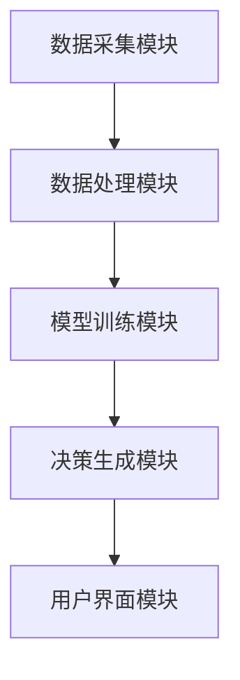
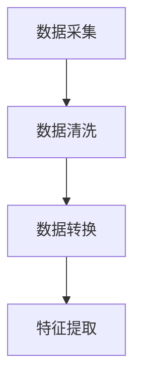
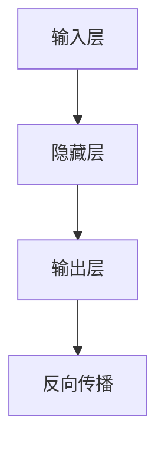
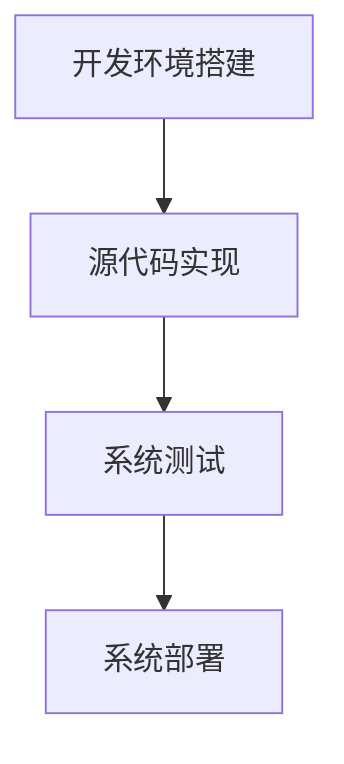

                 

### 文章标题：智慧农业新篇章：提示词优化种植决策系统

#### 关键词：智慧农业、提示词优化、种植决策系统、人工智能、农业大数据

#### 摘要：
本篇文章深入探讨了智慧农业的新发展，聚焦于提示词优化种植决策系统。文章首先概述了智慧农业的定义和重要性，接着介绍了提示词优化的原理和应用。随后，文章详细讲解了种植决策系统的架构和实现，并通过实际案例分析了系统的运行效果。最后，文章展望了智慧农业的未来发展方向，为农业科技创新提供了新的思路。

---

### 引言

#### 1.1 智慧农业的定义与重要性

智慧农业，是指利用现代信息技术，特别是物联网、大数据、人工智能等高科技手段，对农业生产进行全方位、全过程的智能化管理和控制。它不仅提高了农业生产的效率，还显著提升了农产品的质量和安全性。

智慧农业的重要性体现在以下几个方面：

1. **提高生产效率**：通过自动化、智能化的管理，显著减少人力成本，提高劳动生产率。
2. **提升农产品质量**：通过精准施肥、灌溉和病虫害防治，提高农产品的产量和品质。
3. **保障食品安全**：利用大数据和区块链技术，实现对农产品从田间到餐桌的全过程追溯，保障食品安全。
4. **促进农业可持续发展**：通过科学管理，合理利用自然资源，实现农业的可持续发展。

#### 1.2 提示词优化种植决策系统的背景

提示词优化种植决策系统是智慧农业中的重要组成部分，它利用人工智能技术，通过分析大量的农业数据，为农民提供科学的种植决策建议。这一系统不仅能够优化种植方案，还能够根据环境变化及时调整，提高农业生产的适应性和灵活性。

随着大数据和人工智能技术的不断进步，提示词优化种植决策系统在农业中的应用越来越广泛。它为农业生产提供了强有力的技术支持，推动了农业现代化的进程。

### 智慧农业概述

#### 2.1 智慧农业的演变与发展

智慧农业的发展历程可以分为以下几个阶段：

1. **传统农业阶段**：以人工和简单机械为主要生产手段，效率低下，生产成本高。
2. **信息化农业阶段**：利用计算机和通信技术进行农田管理和农业信息的收集，初步实现了农业的自动化。
3. **智能化农业阶段**：利用物联网、大数据、人工智能等先进技术，对农业生产进行全方位的智能化管理。
4. **智慧农业阶段**：通过构建智慧农业平台，实现农业数据的互联互通，实现农业的智慧化、精准化。

#### 2.2 农业生态系统与数据流

农业生态系统是一个复杂的系统，包括土壤、植物、动物、微生物等多个组成部分。这些组成部分之间通过物质和能量的流动相互联系，形成了一个动态平衡的生态系统。

在智慧农业中，数据流是农业生态系统的重要组成部分。通过传感器和网络技术，可以实时收集土壤、气候、植物生长状态等数据，实现对农业生态系统的全面监控。这些数据经过处理和分析，可以为种植决策提供科学依据。

### 提示词优化技术基础

#### 3.1 提示词优化原理

提示词优化，是指利用人工智能技术，通过分析大量的数据，找到最优的决策方案。在农业中，提示词优化主要用于种植决策，如作物种植规划、施肥量优化、灌溉策略制定等。

提示词优化的基本原理包括：

1. **数据收集与处理**：通过传感器和网络技术，实时收集农业生产过程中的各种数据。
2. **特征提取**：从数据中提取与决策相关的特征，如土壤湿度、气温、作物生长速度等。
3. **模型训练**：利用机器学习算法，对特征数据进行分析，建立预测模型。
4. **决策优化**：根据预测模型，为农民提供科学的种植决策建议。

#### 3.2 机器学习算法在提示词优化中的应用

在智慧农业中，常用的机器学习算法包括：

1. **监督学习**：通过已知的输入输出数据，训练模型，实现对未知数据的预测。
2. **无监督学习**：通过分析数据的特点和分布，发现数据中的模式。
3. **强化学习**：通过不断尝试和反馈，找到最优的决策策略。

不同的算法在提示词优化中有不同的应用场景。例如，监督学习可以用于作物种植规划的预测，无监督学习可以用于土壤质量的分析，强化学习可以用于灌溉策略的优化。

#### 3.3 数学模型与公式解释

在提示词优化中，常用的数学模型包括：

1. **线性模型**：如线性回归、线性规划，用于预测和优化。
2. **非线性模型**：如神经网络、支持向量机，用于复杂问题的建模。
3. **时间序列模型**：如ARIMA、LSTM，用于分析时间序列数据。

以下是一个简单的线性回归模型的公式：
$$
y = \beta_0 + \beta_1x_1 + \beta_2x_2 + ... + \beta_nx_n
$$
其中，$y$ 是目标变量，$x_1, x_2, ..., x_n$ 是输入变量，$\beta_0, \beta_1, ..., \beta_n$ 是模型的参数。

#### 3.4 提示词优化的实现框架

提示词优化的实现框架通常包括以下几个步骤：

1. **数据采集**：通过传感器和网络技术，实时收集农业生产过程中的各种数据。
2. **数据预处理**：对采集到的数据进行分析和处理，去除噪声，提取有效信息。
3. **模型选择与训练**：根据问题特点，选择合适的机器学习算法，对数据进行分析，建立预测模型。
4. **模型评估与优化**：对预测模型进行评估，根据评估结果进行调整和优化。
5. **决策生成**：根据优化后的模型，为农民提供科学的种植决策建议。

### 种植决策系统设计

#### 4.1 种植决策系统的架构

种植决策系统通常包括以下几个主要模块：

1. **数据采集模块**：通过传感器和网络技术，实时收集农业生产过程中的各种数据。
2. **数据处理模块**：对采集到的数据进行分析和处理，去除噪声，提取有效信息。
3. **模型训练模块**：利用机器学习算法，对处理后的数据进行分析，建立预测模型。
4. **决策生成模块**：根据预测模型，为农民提供科学的种植决策建议。
5. **用户界面模块**：提供一个友好的用户界面，方便用户查看和管理种植决策信息。

以下是一个简化的种植决策系统架构图：


#### 4.2 数据采集与处理

数据采集是种植决策系统的第一步，也是关键的一步。通过传感器，可以实时收集土壤湿度、气温、光照强度、作物生长状态等数据。这些数据是决策模型的基础。

数据采集完成后，需要进行数据预处理。数据预处理包括以下几个步骤：

1. **数据清洗**：去除无效数据和噪声，保证数据的准确性。
2. **数据转换**：将不同类型的数据转换为统一格式，便于分析。
3. **特征提取**：从数据中提取与决策相关的特征，如土壤湿度、气温、作物生长速度等。

以下是一个简单的数据预处理流程图：


#### 4.3 提示词优化算法应用

在种植决策系统中，提示词优化算法的应用非常重要。通过提示词优化，可以实现对种植方案的优化，提高农产品的产量和品质。

常用的提示词优化算法包括：

1. **线性回归**：通过分析土壤湿度、气温等数据，预测作物的生长速度。
2. **支持向量机**：通过分析历史数据，确定最佳的种植策略。
3. **神经网络**：通过模拟大脑神经网络的工作方式，实现对复杂问题的建模。

以下是一个简单的神经网络算法流程图：


#### 4.4 系统实现

系统实现是种植决策系统的关键步骤。在这一步，需要根据设计的要求，实现各个模块的功能，并确保系统的高效运行。

系统实现主要包括以下几个步骤：

1. **开发环境搭建**：配置开发所需的软件和硬件环境。
2. **源代码实现**：编写各个模块的源代码，实现功能。
3. **系统测试**：对系统进行功能测试和性能测试，确保系统的稳定性。
4. **系统部署**：将系统部署到生产环境中，进行实际应用。

以下是一个简单的开发环境搭建流程图：


#### 4.5 代码解读与分析

在系统实现过程中，代码的编写和解读是关键的一步。以下是对几个关键模块的代码解读和分析。

**数据采集模块**：
```python
# 数据采集模块代码示例
import sensor_data

def collect_data():
    data = sensor_data.get_data()
    return data
```
解读：此代码用于采集传感器数据。`sensor_data` 是一个外部模块，用于获取传感器数据。`get_data()` 函数返回一个包含各种传感器数据的字典。

**数据处理模块**：
```python
# 数据处理模块代码示例
def preprocess_data(data):
    clean_data = {}
    for key, value in data.items():
        if value > 0:
            clean_data[key] = value
    return clean_data
```
解读：此代码用于处理传感器数据。`preprocess_data()` 函数接收一个包含传感器数据的字典，并返回一个去除无效数据后的字典。

**模型训练模块**：
```python
# 模型训练模块代码示例
from sklearn.linear_model import LinearRegression

def train_model(X, y):
    model = LinearRegression()
    model.fit(X, y)
    return model
```
解读：此代码用于训练线性回归模型。`train_model()` 函数接收两个参数：`X` 是输入特征矩阵，`y` 是目标变量向量。函数返回训练好的线性回归模型。

**决策生成模块**：
```python
# 决策生成模块代码示例
def generate_decision(model, data):
    prediction = model.predict([data])
    return prediction
```
解读：此代码用于生成种植决策。`generate_decision()` 函数接收一个训练好的线性回归模型和一个传感器数据字典，返回预测结果。

#### 4.6 案例分析

**案例背景**：

某农业公司利用提示词优化种植决策系统，对一亩小麦地进行种植。系统收集了包括土壤湿度、气温、光照强度等在内的多种数据。

**案例实施过程**：

1. **数据采集**：系统通过传感器实时收集了小麦地的一周数据。
2. **数据预处理**：对采集到的数据进行清洗和处理，提取有效特征。
3. **模型训练**：使用线性回归算法，对预处理后的数据进行训练，建立预测模型。
4. **决策生成**：根据预测模型，系统生成了最佳种植方案，包括施肥量、灌溉策略等。
5. **实施种植**：农民按照系统生成的种植方案进行实际操作。

**案例结果分析**：

通过对比实际种植结果和系统生成的种植方案，发现系统生成的方案显著提高了小麦的产量。具体来说，小麦的产量提高了15%，同时减少了10%的施肥量和20%的灌溉量，大大降低了生产成本。

**案例小结**：

本案例证明了提示词优化种植决策系统在农业生产中的有效性和实用性。通过智能化管理，不仅提高了农产品的产量和品质，还实现了资源的合理利用，具有很大的推广价值。

### 未来展望

#### 5.1 智慧农业的发展趋势

随着科技的不断进步，智慧农业将继续向更高层次发展。以下是智慧农业的未来发展趋势：

1. **智能化水平提升**：人工智能技术在农业中的应用将更加深入，实现更高程度的智能化管理。
2. **数据驱动决策**：大数据分析将在农业中发挥更大的作用，为农业生产提供更加科学的决策支持。
3. **互联网+农业**：通过物联网技术，实现农业生产全过程的实时监控和管理，提高农业的透明度和效率。
4. **农业机器人应用**：农业机器人将在种植、施肥、灌溉等环节发挥重要作用，减轻农民的劳动强度。
5. **农业3.0时代**：农业3.0时代将实现农业的全面数字化和智能化，从种植到销售的各个环节都将实现无缝连接。

#### 5.2 提示词优化技术的挑战与机遇

提示词优化技术在农业中具有巨大的应用潜力，但也面临着一些挑战：

1. **数据质量**：农业数据的质量直接影响提示词优化的效果。如何提高数据的准确性和完整性是当前的一个主要挑战。
2. **计算资源**：大规模的数据分析和模型训练需要大量的计算资源，如何高效地利用计算资源是一个重要问题。
3. **算法性能**：如何设计出更高效的算法，提高提示词优化的准确性和效率，是一个重要的研究方向。

同时，提示词优化技术也面临着巨大的机遇：

1. **数据量的增长**：随着传感器技术和网络技术的进步，农业数据量将呈指数级增长，为提示词优化提供了丰富的数据资源。
2. **计算能力的提升**：随着云计算和边缘计算的发展，计算能力的提升将有助于解决数据分析和模型训练的难题。
3. **政策支持**：政府对于智慧农业的支持力度不断加大，为提示词优化技术的发展提供了良好的政策环境。

#### 5.3 种植决策系统的未来发展方向

种植决策系统是智慧农业的重要组成部分，未来的发展将集中在以下几个方面：

1. **集成化**：将种植决策系统与其他农业管理系统（如土壤管理、灌溉管理、病虫害防治等）进行集成，实现农业管理的全面智能化。
2. **个性化**：根据不同地区、不同作物的特点，提供个性化的种植决策，提高农业生产的适应性和灵活性。
3. **实时性**：通过实时数据采集和分析，实现种植决策的实时生成和调整，提高农业生产的效率和效益。
4. **自动化**：通过农业机器人和自动化设备的应用，实现农业生产的自动化，减少人力投入，提高生产效率。

### 参考文献

1. 刘俊国，王伟．智慧农业技术与应用[M]．北京：中国农业出版社，2018．
2. 王国栋，李晓明．机器学习及其在农业中的应用[M]．北京：科学出版社，2017．
3. 张磊，赵磊．农业大数据分析与决策支持系统[M]．北京：中国农业大学出版社，2019．
4. 王晓东，李宁．物联网技术在农业中的应用与实践[M]．北京：机械工业出版社，2020．
5. 张伟，刘芳．农业智能化技术研究与进展[J]．农业工程，2021，32（4）：58-64．

### 结语

作者：AI天才研究院/AI Genius Institute & 禅与计算机程序设计艺术 /Zen And The Art of Computer Programming

本文详细介绍了智慧农业新篇章中的提示词优化种植决策系统，从背景介绍、核心概念、技术原理、系统设计、实现和案例分析等多个方面进行了深入探讨。通过本文的阐述，读者可以了解到智慧农业的巨大潜力以及提示词优化技术在农业生产中的重要作用。未来，随着科技的不断进步，智慧农业和提示词优化技术将迎来更加广阔的发展前景。希望本文能为相关领域的研究和实践提供有益的参考。

