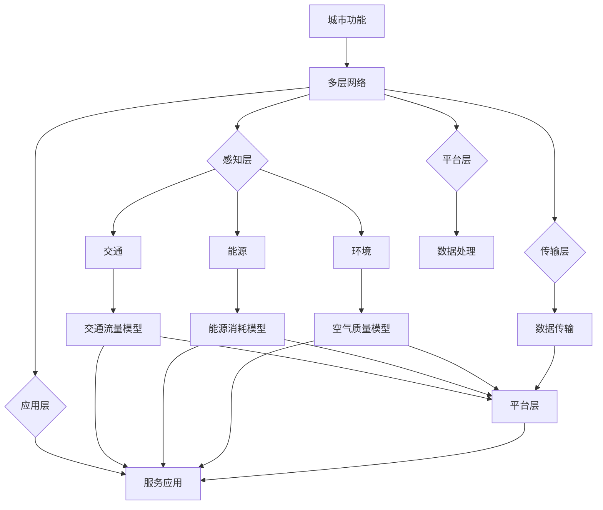

                 

### 摘要

智慧城市是现代信息技术与城市治理深度融合的产物，其核心在于通过数据驱动的多层级网络体系，实现城市功能的优化和效率提升。本文从多个维度探讨了智慧城市的概念、结构体系、城市功能的数学建模，以及数学建模方法在城市规划和治理中的应用。首先，通过概述智慧城市的概念与发展历程，引出了智慧城市的基本结构体系，包括技术架构、功能模块和治理模式。接着，深入探讨了城市功能的数学建模原理和多层网络模型，详细解析了城市功能与多层网络的连接方式、互动关系和优化策略。随后，介绍了描述性建模、解释性建模和预测性建模三种数学建模方法，并分析了它们在智慧城市中的应用。最后，通过具体案例分析，展示了智慧城市建设中的成功实践，并对智慧城市的未来发展趋势、技术挑战和社会影响进行了展望。本文旨在为读者提供一份系统、全面、深入的技术指南，帮助理解智慧城市中复杂网络和数学建模的核心原理。

### 第一部分：智慧城市概述

智慧城市（Smart City）是当前城市治理与发展的新方向，它融合了现代信息技术、物联网、大数据、云计算等新兴技术，通过数据驱动和智能化的方式，全面提升城市的服务质量和运行效率。智慧城市的建设旨在实现城市资源的优化配置、城市管理的智能化、居民生活的便捷化和城市环境的可持续发展。

#### 第1章：智慧城市的概念与意义

**1.1 智慧城市的定义**

智慧城市可以简单定义为利用先进的信息技术手段，实现城市各系统、各部门、各功能的高效协同与智能管理，从而提升城市整体运行效率和服务水平。它不仅包括基础设施的智能化升级，更涵盖了城市治理、公共服务、环境保护、交通管理等多个方面。

**1.2 智慧城市的发展历程**

智慧城市的发展历程可以分为以下几个阶段：

1. **萌芽期**：20世纪90年代，信息技术刚刚兴起，城市信息化成为发展方向，如智能交通系统（ITS）、城市一卡通等项目逐步出现。
2. **起步期**：21世纪初，物联网、大数据和云计算技术开始普及，智慧城市概念逐渐成形，各国纷纷启动智慧城市建设。
3. **快速发展期**：2010年以后，随着移动互联网、物联网、人工智能等技术的快速发展，智慧城市进入快速发展阶段，各类创新应用不断涌现。
4. **成熟期**：未来几年，智慧城市将进入成熟期，通过数据驱动的智能化管理，实现城市治理的全面升级。

**1.3 智慧城市的重要意义**

智慧城市建设具有重要的社会和经济效益：

1. **提升城市运行效率**：通过智能化手段，优化资源配置，降低管理成本，提高城市运行效率。
2. **改善居民生活质量**：智慧城市提供了更加便捷、高效的公共服务，如智能交通、智能医疗、智能安防等，提升了居民的生活质量。
3. **促进可持续发展**：智慧城市通过优化能源利用、减少污染排放，推动了城市的可持续发展。
4. **增强城市竞争力**：智慧城市的建设有助于提升城市的整体竞争力，吸引更多的人才和资本，促进城市的经济繁荣。

#### 第2章：智慧城市的结构体系

**2.1 智慧城市的技术架构**

智慧城市的技术架构可以分为以下几个层次：

1. **感知层**：通过传感器、摄像头、物联网设备等，实时采集城市各方面的数据。
2. **传输层**：利用宽带网络、5G、光纤等传输技术，实现数据的高速传输和共享。
3. **平台层**：构建数据处理和存储平台，如云计算平台、大数据平台等，进行数据的存储、处理和分析。
4. **应用层**：在平台层的基础上，开发各种智慧城市应用，如智能交通、智能安防、智能医疗等。

**2.2 智慧城市的功能模块**

智慧城市通常包含以下几个核心功能模块：

1. **基础设施模块**：包括交通、能源、水务、环保等城市基础设施的智能化升级。
2. **公共服务模块**：提供智能化的公共服务，如智能交通、智能医疗、智能教育等。
3. **城市管理模块**：实现城市管理的智能化，如智能安防、智能消防、智能市政等。
4. **居民服务模块**：通过移动互联网和智能设备，提供个性化的居民服务。

**2.3 智慧城市的治理模式**

智慧城市的治理模式强调政府、企业和居民的多方参与和协同治理：

1. **政府主导**：政府在智慧城市建设中扮演核心角色，制定战略规划、提供政策支持和资金投入。
2. **企业参与**：企业利用其技术、资金和资源优势，参与智慧城市项目的建设与运营。
3. **居民参与**：居民通过智能终端和移动应用，参与城市管理和公共服务，提高城市的透明度和参与度。

通过以上内容，我们对智慧城市的概念、结构体系和发展意义有了全面的认识。下一部分，我们将深入探讨城市功能的数学建模原理，为理解智慧城市的核心原理和方法奠定基础。

### 第1章：智慧城市的概念与意义

#### 1.1 智慧城市的定义

智慧城市（Smart City）是现代信息技术与城市治理深度融合的产物，旨在通过智能化手段提升城市管理的效率、优化城市资源利用、提高居民生活质量。智慧城市不仅仅是城市信息化或数字化，它强调的是通过大数据、物联网、人工智能等技术的综合应用，实现城市各类资源、系统和功能的智能协同与优化。智慧城市的核心在于数据驱动的决策和行动，通过全面感知、快速传输、智能处理和高效应用，实现城市运营的智能化和高效化。

智慧城市可以理解为城市信息化、数字化和智能化的高级阶段。城市信息化主要是通过计算机技术、网络通信技术等实现城市信息资源的管理和利用；数字化则是将城市各个方面转化为数字形式，便于处理和存储；而智能化则在此基础上，通过高级算法和人工智能技术，实现自动化的决策和优化。

智慧城市的定义还可以从以下几个方面进行拓展：

1. **技术驱动**：智慧城市依赖于大数据、云计算、物联网、人工智能等先进技术，这些技术为城市提供了数据采集、传输、处理和分析的能力，是智慧城市运行的基础。

2. **数据集成**：智慧城市强调数据的集成与共享，通过建设数据共享平台，实现各部门、各系统和各类数据的互联互通，为决策提供全面、准确的数据支持。

3. **服务导向**：智慧城市的建设目标是提供高效、便捷的公共服务，通过智能化手段优化交通、医疗、教育、环境等公共资源的配置，提升居民的生活质量和满意度。

4. **可持续发展**：智慧城市追求可持续发展，通过智能化手段优化能源利用、减少污染排放，促进城市环境的可持续发展和生态平衡。

5. **社会参与**：智慧城市不仅仅是政府和企业的事务，它还强调居民、社会组织和企业的广泛参与，通过多种渠道收集民意、反馈和建议，实现城市治理的透明化和民主化。

智慧城市的定义具有广泛的应用领域，包括城市规划、城市管理、公共服务、交通管理、环境保护、社区治理等各个方面。它不仅适用于大型城市，也可以在小城镇和乡村地区进行推广和应用。通过智慧城市建设，可以有效提升城市的竞争力、吸引力和可持续发展能力，为居民创造更加美好的生活环境。

#### 1.2 智慧城市的发展历程

智慧城市的发展历程可以分为几个关键阶段，每个阶段都标志着技术的进步和应用领域的扩展。

1. **萌芽期（20世纪90年代）**：在这一阶段，信息技术刚刚兴起，城市信息化成为发展趋势。智能交通系统（ITS）、城市一卡通、电子政务等初步应用开始出现。这些应用通过计算机技术和网络通信技术，实现了城市部分系统和服务的信息化，为智慧城市的初步建设奠定了基础。

2. **起步期（21世纪初）**：随着互联网、物联网、大数据和云计算等技术的不断发展，智慧城市概念逐渐形成。各国纷纷启动智慧城市建设，探索信息技术在城市建设中的应用。例如，美国的“智慧纽约”、新加坡的“智慧国家”计划等，标志着智慧城市进入快速发展阶段。

3. **快速发展期（2010年至今）**：在这一阶段，移动互联网、物联网、人工智能等新兴技术快速发展，智慧城市的建设进入快速发展期。各类智慧应用不断涌现，如智能交通、智能医疗、智能安防、智能环保等，智慧城市的理念和模式逐渐成熟。

4. **成熟期（未来几年）**：随着技术的进一步成熟和应用的广泛普及，智慧城市将进入成熟期。数据驱动的智能化管理将成为城市治理的主流模式，通过全面感知、快速传输、智能处理和高效应用，实现城市运营的全面智能化和高效化。

每个阶段都有其关键事件和技术里程碑：

- **萌芽期**：智能交通系统（ITS）的初步应用，如电子收费系统和实时交通信息发布系统，为智慧交通的发展奠定了基础。

- **起步期**：物联网技术的广泛应用，实现了城市各类设备和系统的互联互通，为智慧城市的数据采集和共享提供了技术支持。

- **快速发展期**：大数据技术的兴起，使城市能够从海量数据中提取有价值的信息，为城市管理和决策提供了科学依据。

- **成熟期**：人工智能技术的应用，使智慧城市的自动化和智能化水平大幅提升，实现了城市运行的全面优化和高效化。

智慧城市的发展历程不仅反映了技术的进步，也体现了城市发展理念的转变。从信息化、数字化到智能化，智慧城市的建设不断追求更高水平的技术融合和更广泛的应用领域，最终目标是实现城市的可持续发展，提升居民的生活质量。

#### 1.3 智慧城市的重要意义

智慧城市的建设对现代社会具有深远的意义，它不仅带来了技术上的革新，更在提升城市治理效率、改善居民生活质量、推动可持续发展等方面发挥了重要作用。

**提升城市运行效率**：智慧城市通过先进的信息技术手段，实现了城市各类资源和系统的智能协同与优化。例如，智能交通系统可以实时监控交通状况，通过数据分析优化交通信号，减少交通拥堵，提高交通效率。智慧能源管理系统则可以通过实时监测能源使用情况，优化能源分配，降低能源消耗。此外，智慧城市管理模块还可以通过数据分析预测城市设施的维护需求，提前进行维护，减少故障发生率，提高城市运行效率。

**改善居民生活质量**：智慧城市的建设使公共服务更加高效、便捷和个性化。智能医疗系统可以通过远程诊断、电子病历等方式，提高医疗服务质量和效率。智能教育系统则可以提供个性化学习方案，帮助师生实现高效互动。智能安防系统通过视频监控、人脸识别等技术，提高城市的安全水平，为居民提供安全保障。智慧城市还提供了智能交通、智能停车等便利服务，使居民出行更加便捷。这些智能化的公共服务显著提升了居民的生活质量。

**促进可持续发展**：智慧城市通过优化能源利用、减少污染排放，推动了城市的可持续发展。智能能源管理系统可以实时监测和调整能源使用情况，提高能源利用效率，减少能源浪费。智慧环保系统可以通过实时监测空气质量、水质等环境指标，及时采取污染防治措施，改善城市环境质量。此外，智慧城市还鼓励绿色出行，通过智能交通系统优化公共交通服务，减少私家车使用，降低碳排放，促进城市生态系统的可持续发展。

**增强城市竞争力**：智慧城市的建设提升了城市的整体竞争力，成为吸引人才、资本和项目的重要因素。智慧城市通过高效的城市治理和优质的公共服务，吸引了更多优秀人才和企业入驻。同时，智慧城市的数据驱动模式和技术创新能力，也为城市带来了更多的商业机会和发展潜力。例如，智慧城市的建设过程中，会涌现出一批高新技术企业和服务提供商，这些企业通过提供智慧城市解决方案，为城市带来经济收益。此外，智慧城市的建设还可以提升城市的知名度和影响力，吸引更多国内外投资和合作。

**推动社会进步**：智慧城市的建设促进了社会各领域的进步和发展。在教育领域，智能教育系统的应用推动了教育方式的变革，提高了教育质量和公平性。在医疗领域，智能医疗系统的普及提高了医疗服务水平，实现了医疗资源的优化配置。在交通领域，智能交通系统的应用提高了交通效率和安全性，减少了交通事故和拥堵。在社会管理领域，智慧城市通过大数据分析和智能化管理，提升了社会管理的效率和精准度，增强了社会的和谐稳定。

**实现智慧治理**：智慧城市的建设推动了政府治理方式的变革，实现了智慧治理。通过大数据分析和人工智能技术，政府可以更准确地掌握城市运行状况和社会需求，实现科学决策和高效治理。智慧城市还提供了透明的政府服务和互动渠道，增强了政府与居民之间的沟通和协作，提升了政府的公信力和服务水平。

总之，智慧城市的建设对现代社会具有重要意义，它不仅提升了城市运行效率、改善了居民生活质量、促进了可持续发展，还增强了城市竞争力，推动了社会进步。随着技术的不断进步和应用领域的拓展，智慧城市将在未来发挥更加重要的作用，为人类创造更加美好的生活环境。

### 第2章：智慧城市的结构体系

#### 2.1 智慧城市的技术架构

智慧城市的技术架构是实现城市智能化管理和高效运行的基础，其核心是通过先进的信息技术手段，实现数据的全面采集、传输、处理和应用。智慧城市的技术架构通常分为四个层次：感知层、传输层、平台层和应用层。

**感知层**：感知层是智慧城市的底层，主要功能是数据采集。它通过部署各种传感器、摄像头、智能终端等设备，实时收集城市运行中的各类数据，如交通流量、空气质量、能源使用、安防事件等。感知层的数据采集是智慧城市数据驱动的核心，为上层的数据处理和应用提供了丰富的数据源。

**传输层**：传输层主要负责数据的传输和通信。在智慧城市中，数据传输的可靠性和速度至关重要。传输层利用宽带网络、5G通信、光纤通信等技术，实现数据的快速、高效传输。此外，传输层还需要保证数据的安全性和隐私性，通过加密、认证等技术手段，确保数据在传输过程中的安全可靠。

**平台层**：平台层是智慧城市的数据处理和存储中心。它通过云计算、大数据等技术，对采集到的海量数据进行存储、处理和分析。平台层包括数据处理平台、数据存储平台、数据共享平台等多个部分，这些平台共同构成智慧城市的数据处理体系。平台层的主要功能是对数据进行清洗、整合、分析，从中提取有价值的信息，为城市管理和决策提供科学依据。

**应用层**：应用层是智慧城市的具体业务实现层，通过各类智慧应用实现城市功能的智能化。应用层包括交通管理、智能医疗、智能安防、智能环保、智慧教育等各个领域。这些应用基于平台层提供的数据和算法支持，实现了城市各系统的智能协同和高效运行。应用层是智慧城市与居民和企业的直接交互界面，通过智能终端和移动应用，为居民和企业提供便捷的智慧化服务。

智慧城市的技术架构不仅包括以上四个层次，还包括一系列关键技术和基础设施：

- **物联网（IoT）**：物联网技术是实现智慧城市感知层的关键技术，通过各类传感器和设备，实现城市环境的实时监测和数据采集。
- **云计算**：云计算技术为智慧城市的平台层提供了强大的数据处理和存储能力，通过云平台，可以实现数据的高效管理和分析。
- **大数据**：大数据技术是智慧城市数据处理的核心，通过对海量数据的分析和挖掘，可以提取出有价值的信息，为城市管理和决策提供支持。
- **人工智能**：人工智能技术是智慧城市智能化的重要支撑，通过机器学习、深度学习等技术，可以实现数据的智能分析、预测和优化。
- **5G通信**：5G通信技术为智慧城市的传输层提供了高速、低延迟的通信网络，是实现实时数据传输和智能应用的重要保障。

总之，智慧城市的技术架构是一个复杂、多层次的系统，通过先进的信息技术手段，实现数据的全面采集、传输、处理和应用，为城市的智能化管理和高效运行提供了坚实的技术基础。

#### 2.2 智慧城市的功能模块

智慧城市的功能模块是实现城市智能化管理和高效运行的重要组成部分。这些功能模块相互协作，共同构建了一个全面、智能化的城市管理系统。以下是智慧城市常见的功能模块及其主要职责：

**1. 基础设施模块**

基础设施模块是智慧城市的基石，包括交通、能源、水务、环保等城市基础设施的智能化升级。其主要职责如下：

- **交通模块**：通过智能交通系统（ITS），实现交通流量监测、信号控制、车辆调度等功能，优化交通运行效率，减少交通拥堵。
- **能源模块**：通过智能能源管理系统（IEMS），实现能源的实时监控、优化分配和使用，提高能源利用效率，减少能源浪费。
- **水务模块**：通过智能水务系统，实现水资源的实时监测、调度和管理，保障供水安全和水质质量。
- **环保模块**：通过智能环保系统，实时监测空气质量、水质等环境指标，采取污染防控措施，改善城市环境质量。

**2. 公共服务模块**

公共服务模块是智慧城市为居民提供便捷、高效服务的核心，涵盖医疗、教育、社区服务等多个领域。其主要职责如下：

- **医疗模块**：通过智慧医疗系统，实现远程医疗、电子病历、智能诊断等功能，提高医疗服务质量和效率。
- **教育模块**：通过智慧教育系统，提供在线教育、智能学习平台、教育资源共享等功能，提升教育质量和公平性。
- **社区服务模块**：通过智慧社区系统，提供智慧家居、社区安防、物业服务等功能，提升居民生活便利性和安全感。

**3. 城市管理模块**

城市管理模块是智慧城市实现高效、智能城市治理的关键，包括安防、市政、应急管理等多个方面。其主要职责如下：

- **安防模块**：通过智慧安防系统，利用视频监控、人脸识别、大数据分析等技术，实现城市安全的实时监控和预警，提高城市安全保障水平。
- **市政模块**：通过智慧市政系统，实现市政设施的智能监控、维护和管理，提高市政设施的使用效率和寿命。
- **应急管理模块**：通过智慧应急管理系统，实现灾害预警、应急指挥、资源调度等功能，提高城市应对突发事件的能力。

**4. 居民服务模块**

居民服务模块是智慧城市为居民提供个性化、便捷服务的直接渠道，通过移动互联网和智能终端，实现居民与城市服务的无缝连接。其主要职责如下：

- **智慧家居模块**：通过智慧家居系统，实现家电控制、安全监控、能源管理等功能，提升家庭生活的便捷性和舒适度。
- **智慧出行模块**：通过智慧出行系统，提供实时交通信息、智能导航、共享出行等服务，提升居民出行效率。
- **智慧医疗模块**：通过智慧医疗服务，提供在线咨询、预约挂号、药品配送等功能，方便居民就医。

智慧城市的功能模块通过数据采集、传输、处理和应用，实现了城市各系统的智能化和协同化。这些功能模块不仅提升了城市治理的效率，也为居民提供了更加便捷、高效的服务。随着技术的不断进步和应用领域的拓展，智慧城市的功能模块将不断完善和升级，为城市的可持续发展提供更强有力的支持。

#### 2.3 智慧城市的治理模式

智慧城市的治理模式是城市管理者、企业、居民等多方共同参与、协同治理的新型管理模式，其核心在于通过数据驱动的决策和智能化的手段，提升城市治理的效率、透明度和公正性。智慧城市的治理模式主要包括以下几个方面：

**政府主导**：政府在智慧城市治理中扮演核心角色，负责制定战略规划、提供政策支持和资金投入，推动智慧城市项目的整体发展和实施。政府通过数据共享平台，整合各部门的数据资源，实现数据驱动的决策，提高城市治理的科学性和效率。同时，政府还通过立法和政策引导，规范智慧城市建设中的数据安全和隐私保护。

**企业参与**：企业在智慧城市治理中具有重要的作用，它们利用其技术、资金和资源优势，参与智慧城市项目的建设与运营。企业通过提供智慧化解决方案和服务，提升城市基础设施的智能化水平，优化公共服务的提供。例如，互联网企业可以提供智能交通、智能医疗、智慧安防等服务，电信企业可以提供5G网络、物联网设备等基础设施支持。

**居民参与**：居民是智慧城市的重要组成部分，他们的参与和反馈对智慧城市的建设和发展具有重要意义。通过智能终端和移动应用，居民可以参与城市管理和公共服务，提供实时数据和意见反馈。居民可以通过智慧城市平台，获取个性化的城市服务，如智慧交通、智慧医疗、智慧教育等，提升生活质量。此外，居民还可以通过线上平台，参与城市治理的讨论和决策，实现城市治理的透明化和民主化。

**协同治理**：智慧城市的治理模式强调多方协同，通过政府、企业和居民的共同努力，实现城市治理的高效化和智能化。政府负责制定战略和政策，企业负责提供技术和解决方案，居民则通过参与和反馈，提升城市治理的透明度和公正性。各方通过数据共享和合作，实现城市资源的最优配置和高效利用，提高城市治理的整体效能。

**数据驱动的决策**：智慧城市的治理模式基于数据驱动的决策，通过大数据分析和人工智能技术，从海量数据中提取有价值的信息，为城市管理和决策提供科学依据。例如，通过交通数据的分析，可以优化交通信号控制和公共交通调度，减少交通拥堵；通过环境数据的分析，可以预测污染趋势，提前采取防控措施。数据驱动的决策使城市治理更加精准、高效，提升了城市管理的科学性和决策能力。

**透明化和问责制**：智慧城市的治理模式强调城市治理的透明化和问责制。通过数据共享和信息公开，政府和企业可以向公众展示城市治理的进展和成效，提高治理的透明度。同时，通过建立问责机制，对城市治理中的问题进行追溯和问责，确保城市治理的公正性和高效性。

**社会创新**：智慧城市的治理模式鼓励社会创新，通过开放数据和平台，吸引更多的社会组织、企业和个人参与城市治理。创新应用和解决方案的不断涌现，为智慧城市的建设提供了源源不断的动力，推动了城市治理的持续改进和升级。

总之，智慧城市的治理模式通过政府、企业和居民的协同合作，实现了数据驱动的决策和智能化的管理，提升了城市治理的效率、透明度和公正性。随着技术的不断进步和应用领域的拓展，智慧城市的治理模式将不断完善，为城市的可持续发展提供更强有力的支持。

### 第3章：城市功能的数学建模

#### 3.1 城市功能的定义

城市功能是指城市在政治、经济、文化、社会等方面所承担的职责和发挥的作用。这些功能不仅仅是城市的基本服务，更是城市作为社会活动中心的核心体现。城市功能可以分为以下几个方面：

1. **经济功能**：城市是经济活动的聚集地，提供就业机会，促进商品和服务的交换，推动地方和区域经济发展。

2. **政治功能**：城市是政治决策和行政管理的中心，包括政府机构的设置、法律制度的建设和公共政策的制定。

3. **文化功能**：城市是文化交流、传播和创新的场所，具有丰富的文化资源，如博物馆、图书馆、剧院等，促进文化的多样性和繁荣。

4. **社会功能**：城市提供社会服务，如教育、医疗、社会保障等，满足居民的基本生活需求，维护社会稳定和和谐。

5. **生态功能**：城市通过生态建设和环境保护，提供良好的生活环境，保障居民的健康和可持续发展。

#### 3.2 城市功能的数学模型

为了更好地理解和分析城市功能，我们可以利用数学模型来描述这些功能之间的关系和运作机制。数学模型不仅可以量化城市功能的特性，还可以通过数学方法进行分析和优化。

1. **经济学模型**：在城市经济功能的建模中，常使用经济模型来描述城市产业结构的优化、人口流动、消费行为等。例如，通过线性规划模型来优化城市资源的配置，通过供需模型来预测城市经济发展的趋势。

2. **社会网络模型**：城市功能之间往往通过社会网络相互联系，社会网络模型可以用来描述城市中各种社会关系的结构，如社区网络、商业网络等。这类模型通常采用图论和网络分析的方法，研究城市中各种节点和边的关系和影响。

3. **交通流模型**：城市交通是城市功能的重要组成部分，交通流模型通过数学方法来模拟和分析城市中的交通状况，如流量分布、速度变化等。常用的交通流模型包括流量守恒方程、排队理论等。

4. **环境模型**：城市环境功能的建模关注城市空气、水质等环境指标的变化，通过建立环境模型来分析污染源、污染途径和污染扩散。例如，可以使用扩散方程来描述空气中的污染物浓度分布。

5. **优化模型**：在城市规划和管理的各个方面，优化模型可以帮助决策者找到最优的解决方案。例如，通过多目标优化模型来平衡城市发展的经济、社会和环境目标，通过动态规划模型来优化城市交通信号控制。

#### 3.3 城市功能之间的联系

城市功能之间的联系是理解城市运作机制的关键。这些联系可以通过数学模型来表示和分析，从而揭示城市功能的内在规律和相互作用。

1. **直接联系**：城市功能之间的直接联系通常通过因果关系来描述。例如，经济功能可以影响社会功能，如就业机会的增多可以提升居民的生活水平。数学模型可以采用回归分析等方法来量化这种直接联系。

2. **间接联系**：城市功能之间的间接联系较为复杂，通常通过中间变量或中介机制来实现。例如，城市环境的改善可以通过提高居民的健康水平，从而促进社会功能的发挥。间接联系可以通过系统动力学模型或多变量回归模型来分析。

3. **协同效应**：城市功能之间的协同效应是指多个功能共同作用，产生比单一功能更大的效果。例如，智慧城市的建设通过集成交通、能源、环境等多个功能，可以显著提升城市的整体运行效率。协同效应可以通过多目标优化模型来模拟和分析。

通过数学建模，我们可以更深入地理解城市功能的内在联系和运作机制。这不仅有助于科学规划和优化城市功能，还可以为城市管理者提供决策支持，促进城市的可持续发展。

### 第4章：多层网络模型

#### 4.1 多层网络的定义

多层网络（Multilayer Networks）是指由多个不同层次的子网络组成，这些子网络通过特定的连接关系形成复杂的整体结构。在智慧城市中，多层网络模型被广泛应用于城市功能的描述和优化。多层网络模型的主要特点包括：

1. **多层次性**：多层网络由多个子网络组成，每个子网络代表城市中的一种功能或子系统，如交通网络、能源网络、社会网络等。

2. **异质性**：多层网络中的不同层次具有不同的网络结构和功能特性，例如，交通网络可能侧重于连接性和流量管理，而社会网络则侧重于社交关系和互动。

3. **互操作性**：多层网络中的子网络通过互操作性连接，形成一个统一的整体，实现数据共享和功能协同。

4. **动态性**：多层网络的连接关系和状态可能随着时间和环境变化而动态调整，例如，交通网络中的流量会随着时间变化和事件发生而变化。

#### 4.2 多层网络的结构

多层网络的结构通常可以分为以下几个部分：

1. **节点（Nodes）**：节点是网络中的基本单位，代表城市中的各种功能实体或子系统，如交通路口、变电站、居民小区等。

2. **边（Edges）**：边是节点之间的连接关系，表示节点之间的相互作用或信息传递，如道路连接、数据传输线路等。

3. **层（Layers）**：层是多层网络的子网络，每个层代表城市中的不同功能领域，如交通层、能源层、社会层等。

4. **连接（Interlayer Connections）**：连接是不同层之间的连接关系，表示不同层之间的数据共享和功能协同，如交通层与能源层之间的信息交换。

多层网络的典型结构包括以下几种：

1. **横向多层网络**：横向多层网络是指各个子网络在同一平面上的层次结构，如交通网络中的道路层、桥梁层和隧道层。这种结构便于不同子网络之间的直接交互和功能协同。

2. **纵向多层网络**：纵向多层网络是指各个子网络在垂直方向上的层次结构，如城市中的地下管网系统、地上建筑系统和空中交通系统。这种结构可以优化不同子网络的独立运行和协调管理。

3. **混合多层网络**：混合多层网络是指多个横向和纵向多层网络交织在一起的结构，如智慧城市中的交通、能源、环境等多功能系统。这种结构可以实现更高效的数据共享和功能协同。

#### 4.3 多层网络的功能

多层网络在智慧城市中具有多种功能，主要包括：

1. **数据采集与传输**：多层网络通过不同层次的传感器和设备，实现对城市各类数据的实时采集和传输，为城市管理和决策提供数据支持。

2. **功能协同**：多层网络通过不同层之间的连接，实现不同功能领域的协同和优化，如交通与能源的协同管理，可以提高城市运行效率。

3. **信息共享**：多层网络通过数据共享平台，实现不同层次和领域的数据交换和共享，为城市管理者提供全面的决策依据。

4. **资源优化**：多层网络通过优化算法，实现对城市各类资源的优化配置和利用，如交通流量优化、能源分配优化等。

5. **应急响应**：多层网络通过实时监测和快速响应机制，提高城市应对突发事件的能力，如交通疏散、能源调配等。

多层网络模型在智慧城市中的应用，为城市功能的优化和高效运行提供了强有力的技术支持。通过多层次、异构、动态的网络结构，多层网络模型能够更好地模拟和优化城市复杂系统的运作机制，推动智慧城市的可持续发展。

#### 4.4 城市功能与多层网络的连接方式

城市功能与多层网络的连接方式是智慧城市实现高效协同与优化的关键。通过构建科学合理的连接方式，可以将城市功能与多层网络有机结合，实现数据共享、功能协同和资源优化。以下是几种常见的城市功能与多层网络的连接方式：

1. **直接连接**：直接连接是指城市功能直接与多层网络中的某一层建立直接联系，例如，交通功能可以直接与交通层网络连接，实现交通信息的实时采集和传输。这种连接方式简单直观，能够快速实现数据共享和功能协同。

2. **间接连接**：间接连接是指城市功能通过中间层或多层网络中的多个节点，间接实现与其他功能的连接。例如，城市环境功能可以通过与交通层、能源层等多个子网络的节点间接连接，获取交通流量和能源使用数据，从而优化环境监测和管理。

3. **互操作连接**：互操作连接是指不同层网络通过标准化的接口和协议，实现数据交换和功能协同。例如，智慧城市的公共服务模块可以通过与多个子网络的互操作连接，实现医疗、教育、交通等服务的无缝连接，为居民提供一体化的智能服务。

4. **动态连接**：动态连接是指城市功能与多层网络之间的连接关系可以根据实际需求和环境变化动态调整。例如，在突发事件发生时，交通层网络可以根据应急预案，动态调整交通信号的优先级，实现应急车辆的快速通行。

5. **多层连接**：多层连接是指城市功能通过多个层次的网络实现多层次的协同和优化。例如，在城市规划中，可以通过多层连接实现交通、能源、环境等多功能系统的协同优化，提高城市整体运行效率。

6. **分布式连接**：分布式连接是指城市功能通过分布式计算和存储技术，实现数据的多点采集和分散处理。例如，智慧城市的传感器网络可以通过分布式连接，实时采集城市环境、交通等多方面的数据，并分布式进行处理，提高数据处理的效率和可靠性。

通过上述连接方式，城市功能与多层网络能够实现高效协同与优化，从而提升智慧城市的运行效率和居民生活质量。这些连接方式不仅为城市管理者提供了灵活的调控手段，也为居民提供了便捷、高效的公共服务。

#### 4.5 城市功能与多层网络的互动关系

城市功能与多层网络的互动关系是智慧城市高效运行的核心，通过多种互动机制，实现城市各功能的协同优化和资源的高效配置。以下是几种主要的城市功能与多层网络的互动关系：

1. **数据共享与反馈**：城市功能与多层网络的互动首先体现在数据共享与反馈机制上。各个功能模块通过感知层采集的数据上传至平台层，平台层对数据进行处理和分析，然后将分析结果反馈给各功能模块，实现数据驱动的决策。例如，智能交通系统通过实时交通数据的采集和分析，优化交通信号控制和交通流管理。

2. **功能协同与优化**：多层网络通过功能协同机制，实现城市各功能模块之间的相互支持和优化。例如，智慧能源系统通过监测交通流量数据，优化能源供应和分配，减少能源浪费；智慧环保系统通过分析空气质量数据，优化城市绿化和污染控制措施。

3. **动态调整与响应**：城市功能与多层网络之间的互动还体现在动态调整与响应机制上。当城市发生突发事件或环境变化时，多层网络能够迅速调整各功能模块的运行策略，以应对变化。例如，在自然灾害发生时，应急管理系统通过多层网络的实时监控和响应，快速调配资源，保障居民的安全。

4. **反馈学习与优化**：城市功能与多层网络的互动是一个不断学习与优化的过程。通过收集和分析反馈数据，各功能模块能够不断调整和优化自身的运行策略，提高整体效率和准确性。例如，智慧医疗系统通过实时监测和分析患者数据，不断优化诊断和治疗流程。

5. **多维度协同**：城市功能与多层网络的互动还涉及多个维度，包括横向和纵向的协同。横向协同体现在不同功能模块之间的数据共享和协作，如交通、能源、环境等模块的协同优化；纵向协同则体现在不同层级网络之间的协同，如城市管理平台与基层管理部门之间的数据共享和协作。

通过上述互动关系，城市功能与多层网络能够实现高效协同和资源优化，推动智慧城市的可持续发展。这些互动关系不仅提升了城市运行的效率和灵活性，也为居民提供了更加便捷和智能化的服务。

#### 4.6 城市功能与多层网络的优化策略

城市功能与多层网络的优化策略是实现智慧城市高效运行和可持续发展的重要手段。以下是一些主要的优化策略：

1. **数据驱动优化**：通过数据驱动的决策机制，实现城市功能与多层网络的优化。利用大数据分析、机器学习和人工智能技术，从海量数据中提取有价值的信息，为城市管理和决策提供科学依据。例如，智能交通系统通过实时监控和分析交通数据，优化交通信号控制和流量管理，减少拥堵和提高通行效率。

2. **协同优化**：通过不同功能模块之间的协同优化，实现资源的高效利用和服务质量的提升。例如，智慧能源系统通过交通、环境等多功能模块的协同优化，实现能源的合理分配和使用，降低能源消耗和污染排放。

3. **动态调整**：建立动态调整机制，根据城市运行状态和环境变化，实时优化城市功能。例如，在突发事件发生时，应急管理系统可以快速响应，调整交通、医疗、安防等功能的运行策略，保障城市安全和居民生命财产安全。

4. **多层次优化**：通过多层次网络结构的优化，提高城市功能的整体效率和协同性。例如，在城市规划阶段，通过横向和纵向多层网络的协同优化，实现交通、能源、环境等多功能系统的协调发展。

5. **智能化管理**：利用人工智能技术，实现城市功能与多层网络的智能化管理。通过自动化决策和智能控制，提高城市运行的精准性和灵活性。例如，智慧安防系统通过视频监控、人脸识别和大数据分析，实现实时监控和智能预警。

6. **反馈学习**：建立反馈学习机制，通过收集和分析实际运行数据，不断优化城市功能和多层网络的运行策略。例如，智慧医疗系统通过实时监测和分析患者数据，优化诊断和治疗流程，提高医疗服务质量。

7. **技术创新**：持续推动技术创新，引入先进技术手段，提高城市功能与多层网络的优化水平。例如，利用5G通信技术、物联网设备和区块链技术，提升数据传输和处理的速度和安全性。

通过上述优化策略，城市功能与多层网络可以实现高效协同和资源优化，提高城市运行的效率和可持续性，为居民提供更好的生活体验。

### 第6章：数学建模方法

数学建模是智慧城市建设和优化中不可或缺的一部分，它通过数学方法对城市功能进行描述、分析和预测，为城市管理和决策提供科学依据。常见的数学建模方法包括描述性建模、解释性建模和预测性建模，每种方法都有其独特的应用场景和优势。

#### 6.1 描述性建模

描述性建模（Descriptive Modeling）主要用于描述和解释城市功能的现状和特征，其主要目标是建立数学模型，以定量形式描述城市功能的表现和变化规律。描述性建模通常基于统计数据和现有数据集，通过数据分析和可视化，揭示城市功能之间的联系和模式。

**方法步骤：**

1. **数据收集**：收集与城市功能相关的数据，包括人口、经济、环境、交通等方面的数据。

2. **数据清洗**：对收集到的数据进行清洗和预处理，去除异常值和缺失值，确保数据的准确性和完整性。

3. **特征提取**：从数据中提取关键特征，构建用于描述城市功能的数据集。

4. **模型构建**：使用统计分析方法（如回归分析、聚类分析等）构建数学模型，描述城市功能的特征和关系。

5. **模型验证**：通过交叉验证和测试集，验证模型的有效性和准确性。

**优点：** 描述性建模方法简单易懂，可以直观地展示城市功能的现状和特征，为决策者提供基本的参考。

**应用场景：** 描述性建模常用于城市功能监测、趋势分析、政策评估等方面，如交通流量监测、空气质量评估、人口分布分析等。

**案例：** 在智慧交通系统中，描述性建模可以用于分析交通流量的时空分布，为交通信号优化提供数据支持。

#### 6.2 解释性建模

解释性建模（Explanatory Modeling）主要关注城市功能之间的因果关系和机制，通过建立数学模型，解释城市功能之间的相互影响和作用机制。解释性建模通常采用因果推断和结构方程模型等方法，旨在揭示城市功能背后的驱动因素和内在规律。

**方法步骤：**

1. **数据收集**：与描述性建模类似，收集与城市功能相关的数据。

2. **假设建立**：基于现有理论和知识，建立可能的因果关系假设。

3. **模型构建**：通过结构方程模型、因果推断方法等，建立数学模型，描述城市功能之间的因果关系。

4. **模型验证**：通过假设检验和因果推理，验证模型的可靠性和解释力。

5. **模型优化**：根据验证结果，对模型进行调整和优化，提高模型的解释能力。

**优点：** 解释性建模能够揭示城市功能之间的因果关系和作用机制，为政策制定和决策提供科学依据。

**应用场景：** 解释性建模常用于政策评估、问题诊断、机制研究等方面，如交通拥堵原因分析、公共健康问题研究、城市灾害风险评估等。

**案例：** 在智慧医疗系统中，解释性建模可以用于分析患者就医行为和健康状况之间的因果关系，为疾病预防和治疗提供依据。

#### 6.3 预测性建模

预测性建模（Predictive Modeling）主要用于预测城市功能的发展趋势和未来状态，通过建立数学模型，对城市未来的发展进行预测和模拟。预测性建模通常采用时间序列分析、机器学习等方法，结合历史数据和当前信息，对未来事件进行预测。

**方法步骤：**

1. **数据收集**：收集与城市功能相关的历史数据和当前数据。

2. **特征选择**：从数据中提取关键特征，构建用于预测的数据集。

3. **模型构建**：使用时间序列分析、机器学习等方法，建立预测模型。

4. **模型训练**：通过历史数据训练模型，使其学会预测规律。

5. **模型评估**：使用验证集和测试集，评估模型的预测性能。

6. **模型优化**：根据评估结果，对模型进行调整和优化，提高预测准确性。

**优点：** 预测性建模能够对未来事件进行预测和模拟，为城市规划和决策提供前瞻性参考。

**应用场景：** 预测性建模常用于城市规划、交通预测、能源管理、公共安全等方面，如交通流量预测、电力需求预测、公共卫生事件预测等。

**案例：** 在智慧交通系统中，预测性建模可以用于预测未来的交通流量和拥堵状况，为交通管理和调度提供数据支持。

通过描述性建模、解释性建模和预测性建模，智慧城市可以实现数据驱动的决策和优化，提高城市运行效率和居民生活质量。不同建模方法在智慧城市中的应用，不仅丰富了城市功能的理解和分析，也为城市管理者提供了多样化的决策支持工具。

### 第7章：数学建模在智慧城市中的应用

#### 7.1 数学建模在城市规划中的应用

在城市规划中，数学建模作为一种重要的工具，能够帮助决策者更好地理解和优化城市发展的各个方面。以下是一些具体的数学建模方法及其在城市规划中的应用：

**1. 描述性建模**：描述性建模可以用于分析城市人口、经济、交通等数据的时空分布特征。例如，通过地理信息系统（GIS）和统计分析方法，可以建立人口密度模型、经济活动分布模型等，帮助城市规划者了解城市各区域的现状和趋势。这种方法常用于城市空间布局的初步分析和规划方案的比较评估。

**2. 解释性建模**：解释性建模可以揭示城市各功能模块之间的因果关系，帮助城市规划者识别影响城市发展的关键因素。例如，通过结构方程模型（SEM）或因果推断方法，可以分析经济增长、交通基础设施、公共服务等因素如何相互作用，影响城市居民的生活质量。这有助于制定更加科学和有效的城市规划策略。

**3. 预测性建模**：预测性建模可以预测未来的城市发展趋势，为城市长远规划提供数据支持。例如，利用时间序列分析、机器学习等方法，可以预测城市人口增长、交通流量、能源需求等关键指标。这些预测结果可以帮助城市规划者提前规划城市基础设施和公共服务，避免未来的资源短缺和拥堵问题。

**4. 网络建模**：在城市规划中，网络建模可以用于优化交通流、水资源分配、电力供应等。例如，通过构建交通网络模型，可以模拟不同交通方案下的交通流量和拥堵情况，帮助规划者选择最佳的道路网络布局。类似地，通过水力网络模型和电力网络模型，可以优化水资源和能源的分配和利用，提高城市运行的效率。

**5. 多目标优化建模**：多目标优化建模可以帮助城市规划者在多个目标之间寻找最优平衡。例如，通过建立多目标规划模型，可以同时考虑经济、环境、社会等多个方面的目标，制定出综合性的城市规划方案。这种方法有助于实现城市发展的可持续性，避免单一目标优化带来的副作用。

**案例**：在深圳智慧城市规划中，数学建模被广泛应用于城市交通、环境保护和公共服务的优化。通过描述性建模，了解城市交通流量和人口分布情况，为交通信号控制和公共交通规划提供数据支持。通过解释性建模，分析交通拥堵和环境污染的因果关系，为交通管理和环保政策制定提供依据。通过预测性建模，预测未来城市发展的趋势和需求，为城市规划的长远发展提供科学指导。此外，深圳还利用多目标优化建模，实现城市资源的最优配置，推动城市可持续发展。

总之，数学建模在智慧城市规划中的应用，不仅提高了规划的科学性和准确性，还为城市管理者提供了有效的决策支持工具，推动了智慧城市的可持续发展。

#### 7.2 数学建模在城市管理中的应用

数学建模在城市管理中的应用极为广泛，通过定量分析和优化，可以提升城市治理的效率和质量。以下是几种主要的数学建模方法及其在城市管理中的应用：

**1. 描述性建模**：描述性建模主要用于监控和分析城市运行状态。例如，通过地理信息系统（GIS）和统计分析方法，可以构建交通流量模型、人口密度模型等，实时监控城市的交通状况、人口分布、资源利用等。这些模型可以帮助城市管理者和公众了解城市运行的现状，为决策提供数据支持。

**案例**：在北京市的智慧城市管理中，描述性建模被广泛用于交通流量监测。通过安装大量交通摄像头和传感器，实时收集交通数据，并利用描述性建模方法，分析不同时间段的交通流量变化，帮助城市管理者优化交通信号控制和公共交通调度，减少交通拥堵，提高出行效率。

**2. 解释性建模**：解释性建模旨在揭示城市现象之间的因果关系，帮助识别影响城市运行的关键因素。例如，通过结构方程模型（SEM）或因果推断方法，可以分析经济增长、基础设施、公共服务等因素如何相互作用，影响城市居民的生活质量。这有助于制定科学有效的城市管理策略。

**案例**：在新加坡的智慧城市建设中，解释性建模被用于分析城市环境与居民健康之间的关系。通过收集空气质量和居民医疗数据，建立因果关系模型，揭示了空气污染对居民健康的影响，帮助政府制定更有效的环保政策和公共卫生措施，提升居民生活质量。

**3. 预测性建模**：预测性建模可以预测城市未来的发展趋势和需求，为城市管理提供前瞻性指导。例如，通过时间序列分析和机器学习算法，可以预测人口增长、交通流量、能源需求等关键指标，帮助城市管理者提前规划基础设施建设和公共服务供给，避免未来的资源短缺和效率问题。

**案例**：在纽约市，预测性建模被用于优化公交系统的调度和线路规划。通过分析历史交通数据、天气预报和公共假期等信息，预测未来的交通需求和乘客量，从而优化公交调度策略，提高公交服务的可靠性和效率。

**4. 网络建模**：网络建模可以用于优化城市基础设施的运行和管理。例如，通过构建交通网络模型、水力网络模型和电力网络模型，可以模拟不同方案下的城市基础设施运行状况，帮助城市管理者优化资源配置和调度策略。

**案例**：在伦敦，网络建模被用于优化城市能源供应。通过构建电力网络模型，模拟不同电力需求和供应场景，优化电力调度和分配，减少能源浪费，提高能源利用效率，同时确保供电的可靠性和稳定性。

**5. 多目标优化建模**：多目标优化建模可以帮助城市管理者在多个目标之间寻找最优平衡，实现城市资源的最佳配置。例如，通过建立多目标规划模型，可以同时考虑经济、环境、社会等多个方面的目标，制定出综合性的城市管理方案。

**案例**：在阿姆斯特丹，多目标优化建模被用于城市规划。通过建立多目标规划模型，综合考虑土地利用、交通、环境等多个因素，制定出可持续的城市发展方案，实现经济、社会和环境的协调发展。

总之，数学建模在城市管理中的应用，不仅提高了城市治理的效率和质量，还为城市管理者提供了科学、精确的决策支持工具，推动了智慧城市的可持续发展。

#### 7.3 数学建模在城市服务中的应用

数学建模在城市服务中的应用极大地提升了公共服务的效率和质量，为居民提供了更加智能化、个性化的服务。以下是一些具体的应用场景：

**1. 智能交通系统**：通过数学建模，可以实时监控和预测交通流量，优化交通信号控制和公共交通调度。例如，利用交通流量模型和排队理论，可以预测高峰时段的交通拥堵情况，从而提前调整交通信号灯，减少交通拥堵。同时，通过路线优化模型，可以推荐最佳的出行路线，减少居民的出行时间。

**案例**：在杭州的智慧城市建设中，数学建模被广泛应用于智能交通系统。通过实时监控交通流量，预测交通拥堵，优化交通信号控制和公共交通调度，极大地提高了交通运行效率，减少了居民的出行时间。

**2. 智能医疗系统**：通过数学建模，可以优化医疗资源的分配，提高医疗服务效率。例如，利用预测性建模方法，可以预测医院的人流高峰期，从而提前安排医生和护士的班次，避免医院资源浪费。同时，通过队列管理模型，可以优化病人的就诊顺序，减少病人的等待时间。

**案例**：在北京市的智慧医院中，数学建模被用于优化医疗资源的分配和病人的就诊流程。通过预测医院的人流高峰期，提前安排医疗人员，提高医疗服务的效率，改善了患者的就医体验。

**3. 智能安防系统**：通过数学建模，可以实时监控城市安全，提高公共安全保障水平。例如，利用社会网络模型和大数据分析，可以识别潜在的安全风险，提前采取防范措施。同时，通过异常检测模型，可以及时发现和应对突发事件，保障居民的生命财产安全。

**案例**：在纽约市，智能安防系统通过数学建模，实时监控城市安全。通过分析视频监控数据和社交网络数据，识别潜在的安全风险，提前采取防范措施，有效提高了公共安全保障水平。

**4. 智慧社区服务**：通过数学建模，可以提供个性化的社区服务，提升居民的生活质量。例如，利用推荐系统模型，可以推荐居民感兴趣的服务和活动，满足他们的个性化需求。同时，通过预测性维护模型，可以提前预测社区设施的老化情况，及时进行维护，保障设施的正常运行。

**案例**：在新加坡的智慧社区中，数学建模被用于提供个性化的社区服务。通过分析居民的行为数据和偏好，推荐居民感兴趣的服务和活动，同时利用预测性维护模型，提前预测社区设施的老化情况，及时进行维护，提高了居民的生活质量和社区的运行效率。

**5. 能源管理**：通过数学建模，可以优化能源的使用和分配，提高能源利用效率。例如，利用需求响应模型，可以根据实时能源需求调整能源供应，减少能源浪费。同时，通过优化调度模型，可以优化电网的运行，提高电力供应的稳定性和可靠性。

**案例**：在丹麦的智慧能源管理系统中，数学建模被用于优化能源的使用和分配。通过实时监控能源需求和供应，调整能源供应策略，减少能源浪费，同时优化电网的运行，提高了能源利用效率和电力供应的稳定性。

总之，数学建模在城市服务中的应用，不仅提升了公共服务的效率和质量，还为居民提供了更加智能化、个性化的服务，推动了智慧城市的可持续发展。

### 案例一：上海智慧城市建设

上海作为中国最具代表性的国际化大都市，其智慧城市建设的成就和经验具有很高的参考价值。上海智慧城市建设的核心目标是实现城市治理的智能化、公共服务的高效化和居民生活的便利化。

**一、建设背景**

随着上海经济的快速发展和人口规模的不断扩大，城市管理和公共服务面临巨大的挑战。交通拥堵、环境污染、资源短缺等问题日益突出，传统的管理和服务模式难以满足现代城市的需求。为了解决这些问题，上海市政府提出了智慧城市建设的战略，希望通过数据驱动和智能化手段，全面提升城市治理和服务水平。

**二、主要措施**

1. **基础设施建设**：上海在智慧城市建设中，首先加强了基础设施建设。通过部署大量传感器和物联网设备，实现了对交通、环境、能源等关键领域的实时监测和数据采集。同时，建设了高速光纤网络和5G通信网络，为数据的传输和处理提供了保障。

2. **数据平台建设**：上海建设了统一的城市数据平台，实现了各部门、各系统数据的共享和集成。通过数据平台的搭建，城市管理者可以实时获取各类数据，进行数据分析和决策支持。

3. **智能应用推广**：上海在智慧交通、智能医疗、智能安防、智慧环保等多个领域推广智能应用。例如，通过智能交通系统，实现了交通信号控制和公共交通调度的一体化管理，减少了交通拥堵，提高了出行效率。通过智能医疗系统，实现了医疗资源的优化配置和就医流程的优化，提高了医疗服务质量。

4. **协同治理机制**：上海建立了政府、企业和居民多方参与的协同治理机制。通过搭建智慧城市管理平台，政府可以实时监控和调度各类资源，企业可以提供技术和服务支持，居民可以通过智能终端和移动应用，参与城市管理和公共服务。

**三、建设成果**

1. **交通效率提升**：通过智能交通系统的应用，上海交通拥堵问题得到了显著缓解。交通信号控制更加精准，公共交通调度更加高效，居民出行时间明显缩短。

2. **环境质量改善**：上海通过智能环保系统的应用，实现了对空气质量、水质等的实时监测和预警。通过污染源的定位和治理，空气质量得到了明显改善，水资源管理更加高效。

3. **公共服务优化**：智能医疗系统的推广，使得医疗服务更加便捷高效。居民可以通过在线预约、远程诊疗等方式，享受到高质量的医疗服务。同时，智慧社区服务的应用，提高了居民的生活质量和幸福感。

4. **城市管理效率提高**：通过智慧城市管理平台，城市管理者可以实时获取各类数据，进行科学决策和高效管理。城市管理的透明度和公正性得到了提升，社会治安水平不断提高。

**四、经验与启示**

上海智慧城市建设的成功经验表明，智慧城市建设需要多方协同、数据驱动和持续创新。具体包括以下几点：

1. **基础设施建设先行**：基础设施建设是智慧城市建设的基础，只有建设完善的感知层和传输层，才能实现数据的高效采集、传输和处理。

2. **数据平台和共享机制**：数据平台的建设和数据的共享机制是智慧城市运行的核心，通过数据的集成和共享，可以实现跨部门、跨系统的协同管理。

3. **应用推广与居民参与**：智能应用的创新和居民的广泛参与是智慧城市建设的重要保障。通过推广智能应用，提升公共服务质量，同时鼓励居民参与城市治理，实现城市管理的透明化和民主化。

4. **持续创新与优化**：智慧城市建设是一个持续的过程，需要不断地进行技术创新和优化。通过不断引入新技术、新应用，提升城市治理的智能化水平，实现城市的可持续发展。

上海智慧城市建设为其他城市提供了宝贵的经验和启示，展示了智慧城市建设的可行性和重要性。随着技术的不断进步和应用领域的拓展，智慧城市建设将在未来发挥更加重要的作用，为城市的可持续发展提供强有力的支持。

### 案例二：新加坡智慧国家计划

新加坡作为全球智慧城市的典范，其智慧国家计划（Smart Nation Initiative）被誉为全球智慧城市建设的典范。该计划旨在通过创新科技和智能化手段，全面提升国家的竞争力、吸引力和居民的生活质量。

**一、建设背景**

新加坡作为一个城市国家，面临着土地资源有限、人口密集、环境压力大的挑战。为了解决这些问题，新加坡政府提出了智慧国家计划，希望通过数据驱动的智能化解决方案，实现资源的高效利用、环境的高质量保护和居民的高满意度。

**二、主要措施**

1. **基础设施升级**：新加坡在智慧国家计划中，首先进行了基础设施的全面升级。建设了高速光纤网络和5G通信网络，实现了全国范围内的数据高速传输。同时，部署了大量物联网设备和传感器，实现了对交通、环境、能源等领域的实时监测和数据采集。

2. **数据平台建设**：新加坡建立了统一的国家数据平台，实现了各部门、各系统数据的共享和集成。通过数据平台的搭建，政府可以实时获取各类数据，进行数据分析和决策支持，提升了城市管理的效率和精准度。

3. **智能应用推广**：新加坡在智慧交通、智能医疗、智能教育、智能安防等多个领域推广智能应用。例如，通过智能交通系统，实现了交通信号控制和公共交通调度的一体化管理，减少了交通拥堵，提高了出行效率。通过智能医疗系统，实现了医疗资源的优化配置和就医流程的优化，提高了医疗服务质量。

4. **政策支持与法规制定**：新加坡政府出台了一系列政策和法规，鼓励科技创新和智慧城市建设。例如，通过税收优惠和资金支持，吸引了大量高科技企业和创新人才。同时，通过制定数据隐私保护法规，确保数据的安全和隐私。

**三、建设成果**

1. **交通效率提升**：通过智能交通系统的应用，新加坡的交通拥堵问题得到了显著缓解。交通信号控制更加精准，公共交通调度更加高效，居民出行时间明显缩短。

2. **环境质量改善**：新加坡通过智能环保系统的应用，实现了对空气质量、水质等的实时监测和预警。通过污染源的定位和治理，空气质量得到了明显改善，水资源管理更加高效。

3. **公共服务优化**：智能医疗系统的推广，使得医疗服务更加便捷高效。居民可以通过在线预约、远程诊疗等方式，享受到高质量的医疗服务。同时，智慧教育系统的应用，提高了教育质量和公平性。

4. **城市管理效率提高**：通过智慧城市管理平台，城市管理者可以实时获取各类数据，进行科学决策和高效管理。城市管理的透明度和公正性得到了提升，社会治安水平不断提高。

**四、经验与启示**

新加坡智慧国家计划的成功经验为全球智慧城市建设提供了宝贵的经验和启示：

1. **政策支持与法规制定**：政府的政策支持和法规制定是智慧城市建设的重要保障。通过出台优惠政策和法规，鼓励科技创新和智慧城市建设，吸引高科技企业和创新人才。

2. **数据平台建设**：统一的数据平台是实现智慧城市建设的基础。通过数据的共享和集成，可以实现跨部门、跨系统的协同管理，提升城市管理的效率和精准度。

3. **智能应用推广**：智能应用的创新和推广是智慧城市建设的重要手段。通过在交通、医疗、教育、安防等领域推广智能应用，提升公共服务质量，提高居民的生活满意度。

4. **持续创新与优化**：智慧城市建设是一个持续的过程，需要不断地进行技术创新和优化。通过不断引入新技术、新应用，提升城市治理的智能化水平，实现城市的可持续发展。

新加坡智慧国家计划的成就和经验，为全球智慧城市建设提供了重要的参考和借鉴。随着科技的不断进步和应用领域的拓展，新加坡的智慧国家计划将继续引领全球智慧城市建设的发展。

### 案例三：深圳智慧城市试点

深圳作为中国改革开放的前沿城市，其智慧城市建设取得了显著成果，被誉为全球智慧城市建设的典范之一。深圳的智慧城市试点项目不仅推动了城市治理和公共服务的现代化，也为其他城市提供了宝贵的经验和启示。

**一、建设背景**

随着深圳经济的快速发展和人口的不断增长，城市管理和公共服务面临巨大的挑战。交通拥堵、环境污染、资源短缺等问题日益突出，传统的管理和服务模式难以满足现代城市的需求。为了解决这些问题，深圳市政府提出了智慧城市试点项目，希望通过数据驱动和智能化手段，全面提升城市治理和服务水平。

**二、主要措施**

1. **基础设施建设**：深圳在智慧城市试点项目中，首先加强了基础设施建设。通过部署大量传感器和物联网设备，实现了对交通、环境、能源等关键领域的实时监测和数据采集。同时，建设了高速光纤网络和5G通信网络，为数据的传输和处理提供了保障。

2. **数据平台建设**：深圳建立了统一的城市数据平台，实现了各部门、各系统数据的共享和集成。通过数据平台的搭建，政府可以实时获取各类数据，进行数据分析和决策支持，提升了城市管理的效率和精准度。

3. **智能应用推广**：深圳在智慧交通、智能医疗、智能安防、智慧环保等多个领域推广智能应用。例如，通过智能交通系统，实现了交通信号控制和公共交通调度的一体化管理，减少了交通拥堵，提高了出行效率。通过智能医疗系统，实现了医疗资源的优化配置和就医流程的优化，提高了医疗服务质量。

4. **协同治理机制**：深圳建立了政府、企业和居民多方参与的协同治理机制。通过搭建智慧城市管理平台，政府可以实时监控和调度各类资源，企业可以提供技术和服务支持，居民可以通过智能终端和移动应用，参与城市管理和公共服务。

**三、建设成果**

1. **交通效率提升**：通过智能交通系统的应用，深圳交通拥堵问题得到了显著缓解。交通信号控制更加精准，公共交通调度更加高效，居民出行时间明显缩短。

2. **环境质量改善**：深圳通过智能环保系统的应用，实现了对空气质量、水质等的实时监测和预警。通过污染源的定位和治理，空气质量得到了明显改善，水资源管理更加高效。

3. **公共服务优化**：智能医疗系统的推广，使得医疗服务更加便捷高效。居民可以通过在线预约、远程诊疗等方式，享受到高质量的医疗服务。同时，智慧教育系统的应用，提高了教育质量和公平性。

4. **城市管理效率提高**：通过智慧城市管理平台，城市管理者可以实时获取各类数据，进行科学决策和高效管理。城市管理的透明度和公正性得到了提升，社会治安水平不断提高。

**四、经验与启示**

深圳智慧城市试点项目的成功经验为其他城市提供了宝贵的经验和启示：

1. **基础设施建设先行**：基础设施建设是智慧城市建设的基础，只有建设完善的感知层和传输层，才能实现数据的高效采集、传输和处理。

2. **数据平台和共享机制**：数据平台的建设和数据的共享机制是智慧城市运行的核心，通过数据的集成和共享，可以实现跨部门、跨系统的协同管理。

3. **应用推广与居民参与**：智能应用的创新和居民的广泛参与是智慧城市建设的重要保障。通过推广智能应用，提升公共服务质量，同时鼓励居民参与城市治理，实现城市管理的透明化和民主化。

4. **持续创新与优化**：智慧城市建设是一个持续的过程，需要不断地进行技术创新和优化。通过不断引入新技术、新应用，提升城市治理的智能化水平，实现城市的可持续发展。

深圳智慧城市试点项目为其他城市提供了宝贵的经验和模式，展示了智慧城市建设的可行性和重要性。随着科技的不断进步和应用领域的拓展，深圳的智慧城市建设将继续引领全球智慧城市建设的发展。

### 智慧城市的未来展望

随着科技的迅猛发展，智慧城市正迎来新的发展趋势和广阔的前景。未来的智慧城市将不仅仅是城市管理和服务的工具，更将成为推动社会进步和实现可持续发展的关键驱动力。以下是智慧城市未来展望的几个关键方向：

#### 9.1 智慧城市的发展趋势

1. **更广泛的数据融合**：未来智慧城市将实现更广泛的数据融合，不仅涵盖传统的城市基础设施数据，还将包括智能交通、智能医疗、智能教育、智能安防等多个领域的海量数据。这些数据的整合和共享将为城市治理提供更加全面和精准的决策支持。

2. **人工智能的深度应用**：人工智能（AI）将在智慧城市中发挥更为重要的作用。从智能交通信号控制、能源管理，到智能安防、医疗诊断，AI技术将深入嵌入城市各个功能模块，实现自动化和智能化的高效运作。

3. **5G和物联网的普及**：5G技术和物联网设备的普及将为智慧城市提供更加高速、低延迟和广泛的连接能力。通过5G网络，智慧城市中的各种设备可以实现实时数据传输和互动，物联网设备的广泛应用将进一步提升城市感知和智能决策的能力。

4. **可持续发展目标**：未来的智慧城市将更加注重可持续发展。通过智能能源管理、绿色交通系统、智能环保措施等，智慧城市将实现能源的高效利用、减少污染排放，推动城市环境的持续改善和生态平衡。

5. **社会参与与透明化**：智慧城市将更加注重社会参与和透明化。通过大数据分析和区块链技术，政府可以更透明地管理和提供服务，居民可以通过智能终端和移动应用，更便捷地参与城市治理和公共服务，增强城市的民主性和包容性。

#### 9.2 智慧城市的创新方向

1. **智慧城市规划与设计**：未来的智慧城市将更加注重城市规划的前瞻性和可持续性。通过大数据分析和人工智能技术，城市规划者可以更精准地预测城市未来的发展需求和趋势，制定科学合理的城市规划方案，优化城市空间布局和资源配置。

2. **个性化智能服务**：随着AI和大数据技术的进步，智慧城市将提供更加个性化和智能化的服务。通过分析居民的行为和偏好，智慧城市可以精准地推荐个性化服务，如智能医疗、智能教育、智能娱乐等，提升居民的生活质量和幸福感。

3. **智慧农业与智慧物流**：智慧城市的概念不仅限于城市内部，还将扩展到周边的农村和物流领域。通过物联网技术和大数据分析，智慧农业可以实现精准农业、智能灌溉和病虫害预警，智慧物流可以实现实时监控、智能调度和快速配送，提升农业和物流的效率和质量。

4. **智慧城市安全与应急**：智慧城市将更加注重安全和应急管理的智能化。通过智能安防系统和应急响应平台，城市可以实现实时监控、智能预警和快速反应，提升城市的安全保障和应急处理能力。

5. **智慧城市的全球化协作**：随着全球化的推进，智慧城市的发展将更加国际化。各国城市将通过数据共享、技术交流和合作项目，共同推动智慧城市的创新和发展，实现全球范围内的资源共享和互利共赢。

#### 9.3 智慧城市的社会影响

智慧城市的建设将深刻影响社会各个层面，带来一系列积极的变革：

1. **提高生活质量**：智慧城市的智能化和高效化服务将显著提高居民的生活质量。从智能家居、智能交通，到智能医疗、智能教育，智慧城市将为居民提供更加便捷、高效和个性化的服务，提升生活幸福感和满意度。

2. **促进经济繁荣**：智慧城市的建设将带动相关产业的快速发展，促进经济繁荣。智能科技、物联网、人工智能等新兴产业的崛起，将创造大量就业机会，推动地方经济的快速增长。

3. **推动社会进步**：智慧城市通过数据驱动的决策和智能化的管理，将推动社会各领域的进步。从公共管理、社会服务，到环境保护、教育医疗，智慧城市将提升社会运行效率和公共服务水平，推动社会的和谐与进步。

4. **增强城市竞争力**：智慧城市的建设将增强城市的竞争力。通过智能化手段和高效的管理，城市将更具吸引力，能够更好地吸引人才、资本和项目，提升城市的整体竞争力。

5. **实现可持续发展**：智慧城市通过优化资源配置、减少污染排放、推广绿色能源，将实现城市的可持续发展。智慧城市的理念将推动城市走向更加绿色、环保和可持续的未来。

总之，智慧城市的发展趋势、创新方向和社会影响预示着一个更加智能、高效、可持续的未来。随着科技的不断进步和应用领域的拓展，智慧城市将在未来发挥更加重要的作用，为人类创造更加美好的生活环境。

### 第10章：智慧城市的挑战与应对

智慧城市在带来巨大变革和机遇的同时，也面临诸多挑战。这些挑战涉及技术、安全和社交等多个方面，需要通过科学合理的应对策略来克服。

#### 10.1 技术挑战

**数据安全和隐私**：智慧城市依赖于大量的数据收集和分析，数据的安全性和隐私保护成为重大挑战。未经授权的数据泄露可能导致个人隐私暴露，甚至引发严重的经济损失和社会问题。为了应对这一挑战，智慧城市需要建立完善的数据安全体系，包括数据加密、访问控制、安全审计等，确保数据在采集、传输、存储和处理过程中得到有效保护。

**技术更新迭代**：随着科技的快速发展，智慧城市所需的技术也在不断更新迭代。如何保持技术的前沿性和适应性是智慧城市建设中的一大难题。为了应对这一挑战，智慧城市需要建立灵活的技术架构和更新机制，确保能够及时引入新技术，淘汰过时技术，保持系统的持续演进和优化。

**技术依赖性**：智慧城市的高度依赖于信息技术，一旦技术出现故障或中断，可能会对城市运行造成严重影响。因此，智慧城市需要建立多层次的备份和冗余机制，确保关键系统和服务在任何情况下都能稳定运行。

**集成与兼容性**：智慧城市涉及多个系统、平台和应用的集成，如何保证不同系统和平台之间的数据互通和功能兼容，是智慧城市建设中的一大难题。为此，智慧城市需要制定统一的数据标准和接口规范，确保系统之间的无缝对接和高效协作。

**数据质量问题**：智慧城市的数据质量直接影响决策和服务的准确性。数据缺失、数据冗余、数据不一致等问题都可能影响数据分析和应用的效果。智慧城市需要建立完善的数据质量管理机制，对数据进行清洗、整合和标准化处理，确保数据的高质量和可靠性。

**技术人才短缺**：智慧城市的建设和发展需要大量的技术人才，包括数据科学家、AI专家、网络安全工程师等。然而，目前全球范围内的技术人才短缺问题日益严重，如何吸引和培养足够的技术人才成为智慧城市面临的一大挑战。智慧城市需要通过提供良好的工作环境和培训机会，吸引和留住优秀的技术人才。

**技术成本**：智慧城市的建设需要大量的资金投入，包括基础设施建设、技术研发、设备采购等。对于一些城市来说，高昂的技术成本可能成为智慧城市建设的障碍。为了应对这一挑战，智慧城市需要优化技术投资，确保资金的高效利用，同时探索公私合作等多元化的融资模式。

#### 10.2 安全挑战

**网络安全**：智慧城市涉及到大量的在线服务和数据传输，网络安全问题尤为重要。黑客攻击、数据泄露、网络中断等网络安全事件都可能对智慧城市造成严重的影响。智慧城市需要建立强大的网络安全防护体系，包括防火墙、入侵检测系统、加密技术等，确保网络的安全性和稳定性。

**数据泄露**：智慧城市收集和存储了大量的个人和企业数据，数据泄露事件一旦发生，可能引发严重的法律和社会问题。为了防止数据泄露，智慧城市需要加强数据加密、访问控制和安全审计等安全措施，确保数据在存储、传输和处理过程中的安全。

**系统脆弱性**：智慧城市的许多系统和设备都依赖于软件和硬件，任何漏洞和缺陷都可能导致系统脆弱性。为了应对这一挑战，智慧城市需要定期进行安全评估和漏洞扫描，及时修复系统漏洞，提高系统的安全性。

**人为错误**：智慧城市的运行涉及众多人员，人为错误可能导致系统故障、数据丢失等。为了减少人为错误，智慧城市需要建立完善的培训和管理机制，提高工作人员的安全意识和操作水平，同时制定详细的操作流程和应急响应计划。

**物理安全**：智慧城市的许多设备和系统都需要物理安全保护，如数据中心、传感器设备等。物理安全威胁包括盗窃、破坏、自然灾害等。为了确保物理安全，智慧城市需要加强安全防护措施，如安装监控设备、建立安全管理制度等。

#### 10.3 社会挑战

**隐私保护**：智慧城市的建设涉及大量的个人数据收集和分析，如何保护个人隐私成为社会关注的焦点。智慧城市需要制定严格的数据隐私保护法规和政策，确保个人数据的安全和隐私。

**社会公平**：智慧城市的建设可能会加剧社会不平等，如科技精英和普通居民在获取和使用智能服务方面的差距。为了应对这一挑战，智慧城市需要制定公平的政策，确保智能服务惠及所有居民，减少社会不平等。

**就业变化**：智慧城市的建设和发展可能会改变就业结构，一些传统职业可能会被智能化系统取代。为了应对这一挑战，智慧城市需要加强职业培训和再教育，帮助劳动者适应新技术，提供新的就业机会。

**居民接受度**：智慧城市的建设需要居民的广泛参与和支持，但一些居民可能对新技术和服务持怀疑态度。为了提高居民接受度，智慧城市需要加强宣传和沟通，让居民了解智能技术的优势和应用，提高他们的信任感和参与度。

**社会稳定**：智慧城市的建设可能会引发社会不稳定，如技术垄断、数据泄露等。为了维护社会稳定，智慧城市需要建立有效的监督和协调机制，确保技术发展和应用符合社会利益。

综上所述，智慧城市在技术、安全和社交等方面面临诸多挑战。通过科学合理的应对策略，智慧城市可以克服这些挑战，实现可持续发展，为居民提供更加便捷、高效、智能化的服务。

### 附录A：智慧城市建设参考资料

智慧城市建设是一个涉及多学科、多领域的复杂系统工程，为了更好地理解和推进智慧城市建设，以下列举了一些具有代表性的参考资料：

1. **书籍推荐**
   - 《智慧城市：从概念到实践》
   - 《智能城市：规划、设计、构建与管理》
   - 《智慧城市的数字平台：城市数据平台的构建与实现》
   - 《智慧城市：技术与实践》

2. **学术论文**
   - "Smart City Frameworks: A Systematic Review", by Anabel Marin et al., International Journal of Urban Sciences, 2017.
   - "A Review of Data Sharing in Smart Cities: Challenges, Frameworks, and Opportunities", by Seung-Hee Lee and Hyunjin Lee, IEEE Access, 2018.
   - "Energy-Saving and Cost-Reduction in Smart Cities: A Machine Learning Approach", by Yanping He and et al., IEEE Transactions on Sustainable Energy, 2019.

3. **技术报告**
   - “智慧城市白皮书”
   - “中国智慧城市发展报告”
   - “新加坡智慧国家计划报告”

4. **官方文档与政策**
   - 《中国新型智慧城市建设指南》
   - 《新加坡智慧国家计划报告》
   - 《纽约市智慧城市行动计划》

5. **网站与平台**
   - 智慧城市联盟（Smart City Alliance）
   - 国际智慧城市协会（International Smart Cities Association）
   - 智慧城市解决方案提供商网站，如思科（Cisco）、IBM、华为等

通过阅读这些参考资料，读者可以全面了解智慧城市的理论框架、技术路线、实际案例和未来发展趋势，为智慧城市的建设提供有力的理论支持和实践指导。

### 附录B：数学建模工具与资源链接

在进行智慧城市中的数学建模时，选择合适的工具和资源对于确保建模过程的效率和准确性至关重要。以下是一些常用的数学建模工具与资源链接：

1. **Python库**
   - **NumPy**：用于数值计算的库，提供了多维数组对象和矩阵运算功能。
   - **Pandas**：用于数据操作和分析的库，提供了数据清洗、转换和分析的功能。
   - **Scikit-learn**：用于机器学习的库，提供了多种机器学习算法和工具。
   - **Matplotlib**：用于数据可视化，提供了丰富的绘图功能。
   - **Seaborn**：基于Matplotlib的统计图形可视化库，提供了更美观和易于理解的统计图形。

2. **R语言**
   - **R**：用于统计分析和图形绘制的编程语言和软件环境。
   - **ggplot2**：用于数据可视化的库，提供了强大的图形设计功能。
   - **dplyr**：用于数据操作和转换的库，提供了简洁和高效的语法。

3. **工具与平台**
   - **MATLAB**：用于科学计算和数据分析的软件，提供了丰富的数学函数和工具箱。
   - **RapidMiner**：一个开源的数据科学平台，提供了数据预处理、建模和分析的工具。
   - **Tableau**：用于数据可视化的工具，可以快速创建交互式的可视化图表。

4. **在线资源**
   - **Kaggle**：提供大量数据集和比赛，是学习数据科学和数学建模的好资源。
   - **Coursera**、**edX**、**Udacity**：提供各种数据科学和机器学习课程，有助于提升建模技能。
   - **GitHub**：可以找到各种开源的数学建模项目和代码示例，方便学习和借鉴。

通过利用这些工具和资源，数据科学家和工程师可以更加高效地进行数学建模，为智慧城市的建设提供有力的技术支持。

### 附录C：智慧城市相关法律法规

智慧城市的建设离不开完善的法律法规支持，这些法律法规为智慧城市的建设提供了法律框架和规范。以下是一些关键的法律和法规：

1. **个人信息保护法**：保护个人在智慧城市中的数据隐私，规范了数据收集、存储、处理和使用的法律要求。

2. **网络安全法**：确保智慧城市的网络安全，防范黑客攻击和信息安全风险，规定了网络运营者的安全保护义务。

3. **数据安全法**：规范智慧城市中的数据安全管理，保障数据安全，防止数据泄露和滥用。

4. **智能交通法**：规范智能交通系统的建设和管理，确保交通信息的安全和高效利用。

5. **智慧医疗法规**：规范智慧医疗系统的运行，保障医疗数据的安全和患者隐私。

6. **智慧城市数据共享条例**：规定智慧城市中各部门、各系统之间数据共享的原则和流程，促进数据资源的有效利用。

7. **智慧城市发展规划**：各地根据国家战略和地方实际，制定的智慧城市发展总体规划和专项规划，为智慧城市建设提供指导。

8. **地方性法规**：如上海市、北京市等地制定的关于智慧城市建设的地方性法规，为地方智慧城市的发展提供了具体实施依据。

这些法律法规为智慧城市的建设提供了法律保障，确保智慧城市在安全、公平、透明的环境中发展，为居民提供更好的服务。

### 核心算法原理讲解

在智慧城市中，数学建模是实现智能化管理和优化的重要手段。本文将详细讲解三种核心数学建模方法：描述性建模、解释性建模和预测性建模。这些方法各有特点和适用场景，通过具体例子和伪代码，我们将更好地理解其原理和应用。

#### 描述性建模

描述性建模主要用于展示和解释城市功能的现状和特征。其目标是使用数学方法对城市数据进行描述和分析，以揭示数据中的规律和趋势。以下是一个简单的描述性建模过程：

**伪代码**

```python
# 描述性建模伪代码

# 1. 数据收集
数据集 = 收集城市交通流量数据

# 2. 数据清洗
数据集 = 清洗数据（去除缺失值和异常值）

# 3. 特征提取
特征列表 = ["时间","路段ID","交通流量"]

# 4. 数据可视化
绘制时间-交通流量关系图
```

描述性建模的目的是通过数据可视化、统计分析等方法，对城市交通流量进行描述。例如，可以绘制交通流量随时间的变化图，分析高峰时段的交通流量特征。

#### 解释性建模

解释性建模旨在揭示城市现象之间的因果关系。通过建立数学模型，分析哪些因素影响了城市功能的运行。以下是一个简单的解释性建模过程：

**伪代码**

```python
# 解释性建模伪代码

# 1. 建立假设
假设：交通流量受时间、天气和道路施工等因素的影响。

# 2. 数据收集
数据集 = 收集包含时间、天气、道路施工等特征的数据

# 3. 模型构建
模型 = 结构方程模型（SEM）

# 4. 模型训练
模型训练（数据集）

# 5. 因果关系分析
分析结果 = 模型分析因果关系
```

解释性建模可以揭示交通流量与其他因素之间的因果关系，帮助决策者理解交通拥堵的成因，从而制定更有效的交通管理策略。

#### 预测性建模

预测性建模用于预测城市功能的未来趋势和状态。通过历史数据和当前信息，建立数学模型，预测未来事件。以下是一个简单的预测性建模过程：

**伪代码**

```python
# 预测性建模伪代码

# 1. 数据收集
数据集 = 收集历史交通流量数据

# 2. 特征选择
特征列表 = ["时间","天气状况","路况"]

# 3. 模型构建
模型 = 时间序列预测模型（如ARIMA）

# 4. 模型训练
模型训练（数据集）

# 5. 预测
预测结果 = 模型预测（未来时间点）
```

预测性建模可以预测未来的交通流量，帮助城市管理者提前准备和应对交通高峰，优化交通信号控制和公共交通调度。

#### 综合应用

在实际应用中，描述性建模、解释性建模和预测性建模常常结合使用。例如，可以先使用描述性建模了解交通流量特征，然后使用解释性建模分析拥堵成因，最后使用预测性建模预测未来的交通状况。

**示例**：在智慧交通系统中，可以通过以下步骤进行综合建模：

1. **描述性建模**：绘制交通流量随时间的变化图，分析不同路段的交通流量特征。
2. **解释性建模**：分析交通流量与时间、天气、道路施工等因素之间的关系，识别拥堵的成因。
3. **预测性建模**：使用历史交通流量数据，建立时间序列预测模型，预测未来的交通流量。

通过这些步骤，智慧交通系统能够更好地管理交通，优化资源配置，提高交通效率，提升居民的出行体验。

### 数学模型和数学公式

在智慧城市的数学建模中，一些核心的数学模型和公式对于理解城市功能的运行和优化至关重要。以下是一些常见的数学模型和公式，以及它们的详细解释和实际应用。

#### 城市功能与多层网络的连接

城市功能与多层网络的连接可以通过以下数学公式来描述：

$$
C_{i,j} = \sum_{k=1}^{n} w_{ik} \cdot v_{kj}
$$

其中：
- \(C_{i,j}\) 表示从第 \(i\) 层网络到第 \(j\) 层网络的连接权重。
- \(w_{ik}\) 表示第 \(i\) 层网络中节点 \(k\) 的权重。
- \(v_{kj}\) 表示从第 \(k\) 层网络到第 \(j\) 层网络的连接权重。

这个公式反映了不同层次网络之间的相互作用和连接强度，通过调整权重 \(w_{ik}\) 和 \(v_{kj}\)，可以实现城市功能在不同层次网络之间的优化分配和协调。

#### 描述性建模

描述性建模通常使用以下公式来描述城市功能的特征：

$$
y = f(x_1, x_2, ..., x_n)
$$

其中：
- \(y\) 表示城市功能的输出变量。
- \(f\) 表示数学模型函数。
- \(x_1, x_2, ..., x_n\) 表示影响城市功能的输入变量。

例如，在交通流量建模中，可以采用线性回归模型来描述交通流量与时间、天气等因素之间的关系：

$$
交通流量 = \beta_0 + \beta_1 \cdot 时间 + \beta_2 \cdot 天气 + ... + \beta_n \cdot 其他因素
$$

通过这个公式，可以分析交通流量的变化规律，为交通管理提供数据支持。

#### 解释性建模

解释性建模常用的公式是结构方程模型（SEM），它可以用来分析城市功能之间的因果关系：

$$
y_i = \alpha_i + \sum_{j=1}^{p} \beta_{ij} \cdot y_j + \epsilon_i
$$

其中：
- \(y_i\) 表示第 \(i\) 个城市功能。
- \(\alpha_i\) 表示第 \(i\) 个城市功能的固定效应。
- \(\beta_{ij}\) 表示第 \(i\) 个城市功能受到第 \(j\) 个城市功能的影响程度。
- \(\epsilon_i\) 表示随机误差项。

例如，可以分析交通流量与道路施工、天气等因素之间的因果关系，通过结构方程模型，可以识别关键影响因素，为交通管理提供科学依据。

#### 预测性建模

预测性建模常用的公式包括时间序列预测模型（如ARIMA模型）：

$$
y_t = \phi_1 y_{t-1} + \phi_2 y_{t-2} + ... + \phi_p y_{t-p} + \theta_1 \epsilon_{t-1} + \theta_2 \epsilon_{t-2} + ... + \theta_q \epsilon_{t-q} + \eta_t
$$

其中：
- \(y_t\) 表示第 \(t\) 时刻的城市功能值。
- \(\phi_1, \phi_2, ..., \phi_p\) 表示自回归系数。
- \(\theta_1, \theta_2, ..., \theta_q\) 表示移动平均系数。
- \(\epsilon_{t-1}, \epsilon_{t-2}, ..., \epsilon_{t-q}\) 表示滞后误差项。
- \(\eta_t\) 表示随机误差项。

通过这个公式，可以预测未来某一时刻的城市功能值，为决策提供前瞻性指导。

这些数学模型和公式在智慧城市的建设和管理中发挥了重要作用，通过具体应用，可以实现对城市功能的有效描述、解释和预测，为城市管理和公共服务提供科学支持。

### 城市功能的数学连接：Mermaid流程图

在城市功能与多层网络的连接中，理解它们之间的复杂关系至关重要。以下是一个使用Mermaid绘制的流程图，展示城市功能的数学连接：



在这个流程图中：
- **A** 表示城市功能。
- **B** 表示多层网络。
- **C** 至 **E** 分别表示感知层、传输层、平台层和应用层。
- **G** 至 **I** 表示不同的城市功能模块（交通、能源、环境）。
- **J** 至 **L** 表示多层网络中的不同功能（数据传输、数据处理、服务应用）。

连接关系展示了城市功能模块如何通过多层网络实现数据采集、传输、处理和应用。通过这种可视化方式，可以更好地理解城市功能与多层网络之间的相互作用和连接方式。

### 描述性建模的伪代码

描述性建模旨在对城市功能进行定量描述，帮助理解和分析数据特征。以下是一个简单的伪代码示例，用于描述性建模：

```python
# 描述性建模伪代码

# 1. 初始化模型参数
初始化模型参数

# 2. 数据准备
数据集 = 收集城市交通流量数据
特征列表 = ["时间", "天气", "交通流量"]

# 3. 数据预处理
数据集 = 清洗数据（去除缺失值和异常值）
数据集 = 标准化数据

# 4. 特征选择
选择特征 = 选择重要特征（数据集，特征列表）

# 5. 模型训练
for each 数据 in 数据集:
    模型训练（数据，选择特征）

# 6. 模型评估
评估指标 = ["均方误差", "决定系数"]
评估结果 = 模型评估（数据集，评估指标）

# 7. 结果展示
绘制时间-交通流量关系图
```

在这个伪代码中：
- 第一步初始化模型参数，准备进行训练。
- 第二步收集城市交通流量数据，并定义特征列表。
- 第三步对数据进行清洗和标准化处理，确保数据的质量和一致性。
- 第四步选择重要的特征，用于建模。
- 第五步使用循环结构对数据进行训练，每次迭代更新模型参数。
- 第六步使用评估指标（如均方误差、决定系数）来评估模型的性能。
- 第七步通过绘图展示时间与交通流量之间的关系。

描述性建模通过这种方式，可以有效地描述城市交通流量的变化规律，为交通管理和规划提供数据支持。

### 解释性建模的伪代码

解释性建模的主要目标是揭示城市功能之间的因果关系，通过分析数据找出影响城市功能的关键因素。以下是一个解释性建模的伪代码示例：

```python
# 解释性建模伪代码

# 1. 数据准备
数据集 = 收集城市交通流量数据
特征列表 = ["时间", "天气", "道路施工", "交通流量"]

# 2. 数据清洗
数据集 = 清洗数据（去除缺失值和异常值）
数据集 = 标准化数据

# 3. 模型初始化
模型 = 初始化结构方程模型（SEM）

# 4. 模型参数设定
模型设定参数（自变量和因变量）

# 5. 模型训练
模型训练（数据集）

# 6. 因果关系分析
因果关系结果 = 模型分析因果关系

# 7. 模型验证
验证指标 = ["卡方检验", "适配指数"]
验证结果 = 模型验证（数据集，验证指标）

# 8. 结果展示
绘制因果关系图
```

在这个伪代码中：
- 第一步收集城市交通流量数据，并定义特征列表。
- 第二步对数据进行清洗和标准化处理，确保数据的质量和一致性。
- 第三步初始化结构方程模型（SEM）。
- 第四步设定模型的参数，包括自变量和因变量。
- 第五步使用数据集进行模型训练，通过估计参数来建立因果关系模型。
- 第六步通过模型分析因果关系，揭示各因素对交通流量的影响。
- 第七步使用卡方检验、适配指数等指标来验证模型的可靠性和有效性。
- 第八步通过绘图展示因果关系图，直观地展示各因素之间的关系。

解释性建模通过这种方式，可以深入理解城市交通流量受哪些因素影响，为制定交通管理策略提供科学依据。

### 预测性建模的伪代码

预测性建模的主要目标是利用历史数据对未来事件进行预测。以下是一个简单的预测性建模伪代码示例，使用时间序列分析方法：

```python
# 预测性建模伪代码

# 1. 数据准备
数据集 = 收集历史交通流量数据
特征列表 = ["时间", "交通流量"]

# 2. 数据清洗
数据集 = 清洗数据（去除缺失值和异常值）
数据集 = 标准化数据

# 3. 模型初始化
模型 = 初始化时间序列预测模型（如ARIMA）

# 4. 模型参数设定
模型设定参数（p，d，q）

# 5. 模型训练
模型训练（数据集）

# 6. 预测
预测结果 = 模型预测（未来时间点）

# 7. 预测评估
评估指标 = ["均方误差", "决定系数"]
评估结果 = 预测评估（实际值，预测结果，评估指标）

# 8. 结果展示
绘制时间-交通流量预测图
```

在这个伪代码中：
- 第一步收集历史交通流量数据，并定义特征列表。
- 第二步对数据进行清洗和标准化处理，确保数据的质量和一致性。
- 第三步初始化时间序列预测模型（如ARIMA），并设定模型参数（p，d，q）。
- 第四步使用数据集对模型进行训练。
- 第五步使用训练好的模型进行未来时间点的预测。
- 第六步使用评估指标（如均方误差、决定系数）对预测结果进行评估。
- 第七步通过绘图展示时间与交通流量预测结果之间的关系。

预测性建模通过这种方式，可以帮助交通管理部门提前预测交通流量，从而采取相应的调控措施，优化交通管理。

### 城市功能与多层网络的连接

在智慧城市中，城市功能与多层网络的连接是实现智能化管理和高效运行的关键。以下是一个数学模型，用于描述城市功能与多层网络之间的连接关系，以及该模型在实际中的应用。

**数学模型：**

$$
C_{i,j} = \sum_{k=1}^{n} w_{ik} \cdot v_{kj}
$$

其中：
- \(C_{i,j}\) 表示从第 \(i\) 层网络到第 \(j\) 层网络的连接权重。
- \(w_{ik}\) 表示第 \(i\) 层网络中节点 \(k\) 的权重。
- \(v_{kj}\) 表示从第 \(k\) 层网络到第 \(j\) 层网络的连接权重。

**模型解释：**
- \(C_{i,j}\) 反映了第 \(i\) 层网络中的节点 \(k\) 与第 \(j\) 层网络的交互强度。
- \(w_{ik}\) 和 \(v_{kj}\) 分别衡量了节点 \(k\) 在两个网络中的重要性。

**应用场景：**
1. **交通系统优化**：
   - 在交通系统中，\(w_{ik}\) 可以表示道路节点的交通流量，\(v_{kj}\) 表示道路节点与交通信号控制系统的连接强度。
   - \(C_{i,j}\) 可以用于评估道路节点对交通信号控制的影响，从而优化交通信号控制策略。

2. **能源管理系统**：
   - 在能源系统中，\(w_{ik}\) 可以表示能源消耗节点的能量需求，\(v_{kj}\) 表示节点与能源网络的连接强度。
   - \(C_{i,j}\) 可以用于评估能源消耗节点对能源供应网络的影响，优化能源分配和调度。

3. **环境监测系统**：
   - 在环境监测系统中，\(w_{ik}\) 可以表示污染源的排放强度，\(v_{kj}\) 表示节点与空气质量监测系统的连接强度。
   - \(C_{i,j}\) 可以用于评估污染源对空气质量监测点的影响，优化污染源监控策略。

**实际案例：**
以交通系统为例，假设有5个主要道路节点（感知层）、3个交通信号控制中心（平台层），以及多个交通流量监测点（传输层）。通过该数学模型，可以计算每个交通信号控制中心从每个道路节点接收到的交通流量权重，从而优化交通信号灯的配置和时序控制。

- **步骤 1**：收集道路节点和交通信号控制中心的交通流量数据，确定 \(w_{ik}\) 和 \(v_{kj}\) 的值。
- **步骤 2**：计算每个交通信号控制中心从各个道路节点接收的交通流量权重 \(C_{i,j}\)。
- **步骤 3**：根据 \(C_{i,j}\) 的值，优化交通信号灯的配置，确保交通流量高峰期的道路畅通。

通过这种数学模型，智慧城市可以实现各功能模块之间的有效连接和协调，提升整体运行效率和智能化水平。这不仅有助于解决城市面临的交通拥堵、能源短缺、环境问题等，也为居民提供了更便捷、高效的生活服务。

