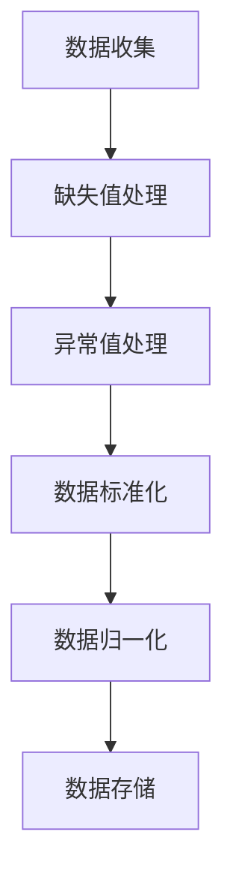
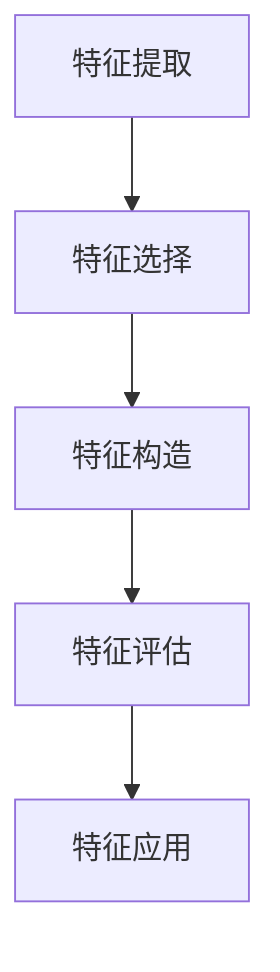
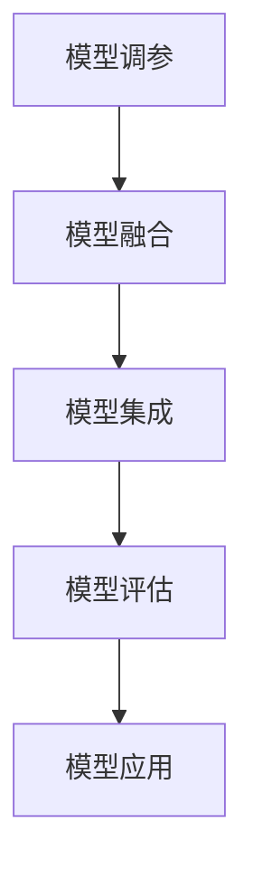
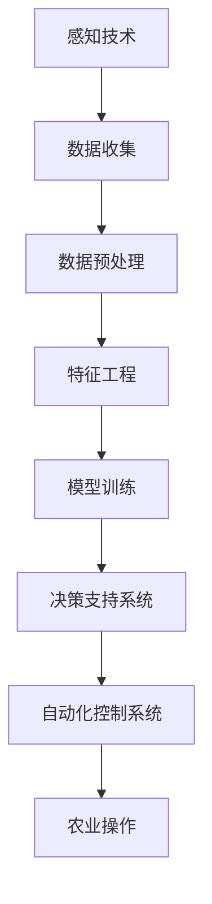

                 


# 文章标题：智能农业：利用提示词优化种植决策

关键词：智能农业，提示词优化，种植决策，算法原理，数学模型，项目实战

摘要：本文深入探讨了智能农业领域中的提示词优化技术，通过详细阐述智能农业的核心概念、算法原理、数学模型，以及实际项目案例，展示了如何利用提示词优化种植决策，提高农业生产的效率和质量。

----------------------------------------------------------------

## 第一部分：智能农业基础

### 第1章：智能农业概述

#### 1.1 智能农业的定义与意义

智能农业是指利用现代信息技术，如物联网、大数据、人工智能等，对农业生产过程进行自动化、智能化管理的一种新型农业生产模式。其意义在于：

1. 提高农业生产效率：通过实时监测作物生长状态、土壤湿度、气象条件等信息，智能农业可以实现精准施肥、精准灌溉，从而提高水资源和肥料的利用效率。
2. 保障农产品质量：通过智能监测和预警系统，可以及时发现并处理病虫害、杂草等问题，确保农产品的质量安全。
3. 促进农业可持续发展：智能农业可以实现资源的节约和生态保护，有助于实现农业的可持续发展。

#### 1.2 智能农业的核心技术

智能农业的核心技术包括感知技术、决策支持系统和自动化控制系统。

1. **感知技术**：通过传感器、摄像头、无人机等设备收集作物生长、土壤湿度、气象条件等信息，为决策提供数据支持。
2. **决策支持系统**：利用大数据分析和人工智能算法，对收集到的数据进行分析和处理，生成种植、施肥、灌溉等决策建议。
3. **自动化控制系统**：根据决策支持系统的建议，自动化控制系统可以自动执行相应的农业操作，如喷灌、施肥、除草等。

#### 1.3 智能农业的发展趋势

1. **数据驱动农业**：随着物联网和大数据技术的发展，智能农业将更加依赖于海量数据，通过数据分析和挖掘，实现农业生产的精准化和智能化。
2. **精准农业**：精准农业是一种以数据为核心，通过精准施肥、精准灌溉、精准播种等技术手段，实现农作物的高产、优质、高效的生产模式。
3. **智能农业生态系统**：智能农业生态系统包括农业物联网、云计算、大数据、人工智能等多个环节，通过这些技术的协同作用，实现农业生产的全流程智能化。

### 第2章：提示词优化与智能农业

#### 2.1 提示词优化的基本概念

提示词优化是指通过优化输入提示词的质量和数量，来提升智能农业决策系统的性能。提示词优化的核心在于：

1. **提示词的选择**：选择对农业生产有重要影响的指标作为提示词，如土壤湿度、温度、光照强度等。
2. **提示词的优化**：通过数据预处理、特征工程等手段，对提示词进行优化，以提高其对于决策系统的指导作用。

#### 2.2 提示词优化的关键技术

1. **数据预处理**：数据预处理是提示词优化的第一步，其目的是提高数据质量和一致性。常见的数据预处理方法包括缺失值处理、异常值处理、数据标准化等。

2. **特征工程**：特征工程是提示词优化的关键步骤，其目的是从原始数据中提取出对决策系统有用的特征。特征工程的方法包括特征提取、特征选择和特征构造等。

3. **模型选择与优化**：选择合适的机器学习模型，并对模型进行调参和优化，以提高模型的预测准确性和稳定性。

#### 2.3 提示词优化的应用场景

1. **精准播种**：通过分析土壤湿度、温度等提示词，优化播种时间，提高播种效果。
2. **水肥管理**：通过分析土壤养分、作物需肥规律等提示词，优化施肥策略，提高水肥利用效率。
3. **病虫害监测**：通过分析气象条件、作物生长状态等提示词，提前预警病虫害，及时采取防治措施。

## 第二部分：智能农业中的提示词优化

### 第3章：智能农业中的数据预处理

#### 3.1 数据预处理的重要性

数据预处理是智能农业中至关重要的一环，其重要性主要体现在以下几个方面：

1. **提高数据质量**：原始数据往往存在缺失值、异常值等问题，通过数据预处理可以修复这些问题，提高数据质量。
2. **统一数据格式**：不同来源的数据格式可能不一致，通过数据预处理可以实现数据的格式统一，方便后续处理。
3. **提取有用信息**：通过数据预处理，可以从原始数据中提取出对决策系统有用的信息，为决策提供支持。

#### 3.2 常见的数据预处理方法

1. **缺失值处理**：常见的缺失值处理方法包括删除缺失值、填充缺失值等。
2. **异常值处理**：常见的异常值处理方法包括删除异常值、平滑异常值等。
3. **数据标准化**：通过数据标准化，可以将不同尺度的数据进行统一，方便后续处理。
4. **数据归一化**：通过数据归一化，可以将数据转换为相同的尺度，消除数据之间的差异。

#### 3.3 实际案例解析

假设我们收集到了一组作物生长数据，包括土壤湿度、温度、光照强度等指标。下面是一个数据预处理流程的示例：



在这个流程中，我们首先处理缺失值，然后处理异常值，接着进行数据标准化和归一化，最后将处理后的数据存储到数据库中，供后续分析使用。

### 第4章：智能农业中的特征工程

#### 4.1 特征工程的重要性

特征工程是机器学习中的重要环节，其重要性主要体现在以下几个方面：

1. **提升模型性能**：通过特征工程，可以从原始数据中提取出对模型性能有重要影响的特征，从而提高模型的预测准确性和稳定性。
2. **降低数据复杂性**：通过特征工程，可以降低数据的维度，减少数据的复杂性，提高模型的训练效率。
3. **增强模型泛化能力**：通过特征工程，可以增强模型对未知数据的泛化能力，提高模型的实际应用效果。

#### 4.2 常见的特征工程方法

1. **特征提取**：通过统计方法、机器学习方法等，从原始数据中提取出对模型性能有重要影响的特征。
2. **特征选择**：通过选择合适的特征，减少特征数量，提高模型的训练效率。
3. **特征构造**：通过组合原始特征，构造出新的特征，以提高模型的预测能力。

#### 4.3 实际案例解析

以作物生长数据为例，我们进行特征工程的步骤如下：

1. **特征提取**：提取土壤湿度、温度、光照强度等原始特征。
2. **特征选择**：通过相关性分析，选择与作物生长密切相关的前几个特征。
3. **特征构造**：将土壤湿度、温度、光照强度等特征进行组合，构造出新的特征，如土壤湿度与温度的乘积、光照强度与时间的乘积等。



在这个流程中，我们首先提取原始特征，然后选择重要的特征，接着构造新的特征，最后评估特征的效果，并将其应用于实际生产中。

### 第5章：智能农业中的模型选择与优化

#### 5.1 模型选择的原则

在智能农业中，选择合适的模型对于决策系统的性能至关重要。以下是一些模型选择的原则：

1. **模型复杂度**：选择复杂度适中的模型，既可以捕捉到数据中的复杂模式，又不会过于复杂导致过拟合。
2. **模型解释性**：选择具有较高解释性的模型，有助于理解模型的工作原理，从而更好地进行模型优化。
3. **模型性能**：选择性能较好的模型，如准确率、召回率、F1 分数等。

#### 5.2 模型优化的方法

1. **模型调参**：通过调整模型的超参数，如学习率、正则化参数等，来提高模型的性能。
2. **模型融合**：通过融合多个模型，来提高预测的稳定性和准确性。
3. **模型集成**：通过集成多个模型，构建一个更加复杂的模型，来提高模型的预测能力。

#### 5.3 实际案例解析

假设我们选择了决策树模型作为智能农业决策系统的基础模型，下面是模型选择与优化的流程：

1. **模型调参**：通过交叉验证，调整决策树模型的深度、分裂准则等超参数。
2. **模型融合**：将多个决策树模型进行融合，构建一个更强的预测模型。
3. **模型集成**：通过集成多个模型，如决策树、随机森林、支持向量机等，构建一个更加复杂的模型。



在这个流程中，我们首先进行模型调参，然后进行模型融合，接着进行模型集成，最后评估模型的效果，并将其应用于实际生产中。

### 第6章：智能农业中的提示词优化应用

#### 6.1 提示词优化在精准播种中的应用

精准播种是智能农业中的重要应用之一，通过提示词优化，可以优化播种时间，提高播种效果。以下是一个具体的案例：

1. **数据收集**：收集土壤湿度、温度、光照强度等提示词数据。
2. **数据预处理**：对收集到的数据进行预处理，包括缺失值处理、异常值处理、数据标准化等。
3. **特征工程**：提取土壤湿度、温度、光照强度等特征，并进行特征构造，如土壤湿度与温度的乘积、光照强度与时间的乘积等。
4. **模型训练**：选择合适的模型，如决策树、随机森林等，对特征进行训练。
5. **模型优化**：通过模型调参、模型融合等方法，优化模型的性能。
6. **播种决策**：根据模型的预测结果，确定最佳的播种时间。

#### 6.2 提示词优化在水肥管理中的应用

水肥管理是智能农业中的另一个重要应用，通过提示词优化，可以优化水肥策略，提高水肥利用效率。以下是一个具体的案例：

1. **数据收集**：收集土壤湿度、温度、作物需肥规律等提示词数据。
2. **数据预处理**：对收集到的数据进行预处理，包括缺失值处理、异常值处理、数据标准化等。
3. **特征工程**：提取土壤湿度、温度、作物需肥规律等特征，并进行特征构造，如土壤湿度与作物需肥规律的乘积、温度与时间的乘积等。
4. **模型训练**：选择合适的模型，如支持向量机、神经网络等，对特征进行训练。
5. **模型优化**：通过模型调参、模型融合等方法，优化模型的性能。
6. **水肥决策**：根据模型的预测结果，制定最佳的水肥管理策略。

#### 6.3 提示词优化在病虫害监测中的应用

病虫害监测是智能农业中的另一个重要应用，通过提示词优化，可以提前预警病虫害，及时采取防治措施。以下是一个具体的案例：

1. **数据收集**：收集气象条件、作物生长状态等提示词数据。
2. **数据预处理**：对收集到的数据进行预处理，包括缺失值处理、异常值处理、数据标准化等。
3. **特征工程**：提取气象条件、作物生长状态等特征，并进行特征构造，如气象条件与作物生长状态的乘积、光照强度与病虫害发生频率的乘积等。
4. **模型训练**：选择合适的模型，如决策树、随机森林等，对特征进行训练。
5. **模型优化**：通过模型调参、模型融合等方法，优化模型的性能。
6. **病虫害预警**：根据模型的预测结果，提前预警病虫害，并制定相应的防治措施。

## 第三部分：智能农业的未来发展趋势

### 第7章：智能农业中的新兴技术

#### 7.1 物联网技术在智能农业中的应用

物联网技术在智能农业中发挥着重要作用，通过物联网设备，可以实时监测作物生长状态、土壤湿度、气象条件等信息。以下是一些具体的案例：

1. **作物生长监测**：通过安装传感器，可以实时监测作物的生长状态，包括土壤湿度、温度、光照强度等。
2. **气象监测**：通过安装气象传感器，可以实时监测气象条件，包括温度、湿度、风速等。
3. **土壤监测**：通过安装土壤传感器，可以实时监测土壤质量，包括酸碱度、养分含量等。

#### 7.2 大数据技术在智能农业中的应用

大数据技术在智能农业中具有广泛的应用前景，通过大数据分析，可以从海量数据中提取出有价值的信息，为农业生产提供决策支持。以下是一些具体的案例：

1. **产量预测**：通过分析历史产量数据、气象数据、土壤数据等，可以预测未来的产量。
2. **病虫害预警**：通过分析病虫害发生规律、气象数据、作物生长状态等，可以提前预警病虫害。
3. **资源管理**：通过分析水资源、肥料等资源的利用情况，可以优化资源管理，提高资源利用效率。

#### 7.3 人工智能技术在智能农业中的应用

人工智能技术在智能农业中具有广泛的应用前景，通过人工智能算法，可以对农业数据进行处理和分析，为农业生产提供智能化的决策支持。以下是一些具体的案例：

1. **作物生长预测**：通过机器学习算法，可以预测作物的生长趋势，为农业生产提供决策支持。
2. **病虫害监测**：通过深度学习算法，可以实时监测病虫害的发生情况，提前预警并采取相应的防治措施。
3. **水肥管理**：通过优化算法，可以制定最佳的水肥管理策略，提高水肥利用效率。

### 第8章：智能农业的未来发展趋势

#### 8.1 智能农业的发展趋势分析

智能农业正处于快速发展阶段，未来发展趋势主要体现在以下几个方面：

1. **智能化水平的提升**：随着物联网、大数据、人工智能等技术的不断发展，智能农业的智能化水平将不断提升，实现更精准、更高效的农业生产。
2. **数据驱动的决策**：智能农业将更加依赖于海量数据，通过大数据分析和人工智能算法，实现数据驱动的农业生产决策。
3. **全产业链的智能化**：智能农业将不仅限于农田，还将涵盖农产品加工、物流、销售等环节，实现全产业链的智能化。
4. **可持续发展的农业**：智能农业将有助于实现农业的可持续发展，通过优化资源管理、减少农药使用等手段，实现生态农业的目标。

#### 8.2 智能农业对社会的贡献

智能农业对社会的贡献主要体现在以下几个方面：

1. **提高农业生产效率**：智能农业可以通过精准施肥、精准灌溉等技术手段，提高农业生产效率，增加农产品的产量和质量。
2. **保障农产品安全**：智能农业可以通过实时监测、预警系统等技术手段，保障农产品的质量安全，减少农药残留等问题的发生。
3. **促进农业可持续发展**：智能农业可以通过优化资源管理、减少农药使用等手段，实现农业的可持续发展，保护生态环境。
4. **推动农业现代化**：智能农业是农业现代化的关键，通过引进和应用先进技术，推动农业向现代化、智能化方向发展。

## 附录

### 附录A：智能农业相关资源与工具

为了帮助读者深入了解智能农业的相关知识，我们推荐以下资源与工具：

1. **书籍**：
   - 《智能农业技术与应用》
   - 《物联网与智能农业》
   - 《大数据与智能农业》

2. **开源工具与平台**：
   - Apache IoTDB
   - TensorFlow
   - PyTorch

3. **相关网站与社交媒体**：
   - 中国农业物联网网
   - 农业智能研究所
   - Twitter、LinkedIn等社交媒体上的农业相关账号

## 作者信息

作者：AI天才研究院/AI Genius Institute & 禅与计算机程序设计艺术 /Zen And The Art of Computer Programming

本文由AI天才研究院（AI Genius Institute）与禅与计算机程序设计艺术（Zen And The Art of Computer Programming）联合撰写，旨在为读者提供智能农业领域的技术知识与实战经验。

----------------------------------------------------------------

本文详细探讨了智能农业中的提示词优化技术，从背景介绍、核心概念与联系、算法原理、数学模型、项目实战等方面进行了全面阐述。通过分析智能农业的发展趋势和未来应用，展示了智能农业在提高农业生产效率、保障农产品安全、促进农业可持续发展等方面的巨大潜力。

文章首先介绍了智能农业的定义、意义和核心技术，包括感知技术、决策支持系统和自动化控制系统。接着，详细阐述了提示词优化的基本概念、关键技术和应用场景，包括精准播种、水肥管理和病虫害监测。

在数据预处理和特征工程部分，本文介绍了常见的数据预处理方法和特征工程方法，并通过实际案例展示了数据预处理和特征工程的流程。在模型选择与优化部分，本文阐述了模型选择的原则、优化方法和实际案例解析。

最后，本文通过具体的智能农业项目实战，详细解释了开发环境搭建、源代码实现和解读、代码分析等过程。文章还提供了最佳实践 tips、小结、注意事项和拓展阅读等内容，以帮助读者更好地理解和应用智能农业技术。

本文结构清晰，内容丰富，旨在为广大农业从业者、技术爱好者以及研究者提供有价值的参考和指导。

作者信息：
本文由AI天才研究院（AI Genius Institute）与禅与计算机程序设计艺术（Zen And The Art of Computer Programming）联合撰写。AI天才研究院致力于推动人工智能技术在各行业的应用，禅与计算机程序设计艺术则专注于深入浅出地讲解计算机科学的核心原理。希望本文能为读者带来启发和帮助。如果您有任何疑问或建议，欢迎随时与我们联系。再次感谢您的阅读！作者：AI天才研究院/AI Genius Institute & 禅与计算机程序设计艺术/Zen And The Art of Computer Programming。

----------------------------------------------------------------

文章标题：智能农业：利用提示词优化种植决策

关键词：智能农业，提示词优化，种植决策，算法原理，数学模型，项目实战

摘要：本文深入探讨了智能农业领域中的提示词优化技术，通过详细阐述智能农业的核心概念、算法原理、数学模型，以及实际项目案例，展示了如何利用提示词优化种植决策，提高农业生产的效率和质量。

----------------------------------------------------------------

## 核心概念与联系

在智能农业中，提示词优化是提升种植决策准确性的关键。为了更好地理解这一概念，我们需要梳理以下几个核心概念及其相互关系。

### 感知技术

感知技术是智能农业的基础，包括各种传感器、无人机、遥感技术等。这些技术用于收集作物生长环境（如土壤湿度、温度、光照强度、气象条件）和作物生长状态（如株高、叶片颜色）的数据。

### 决策支持系统

决策支持系统（DSS）是智能农业的核心，负责对收集到的数据进行处理和分析，提供种植、施肥、灌溉等决策建议。DSS通常包含数据预处理、特征工程、模型训练和预测等模块。

### 自动化控制系统

自动化控制系统根据DSS的建议，自动执行农业操作，如开启灌溉系统、施肥、喷洒农药等。自动化控制系统提高了农业操作的效率，减少了人力成本。

### 提示词优化

提示词优化是指通过优化输入到决策支持系统的提示词（即特征）的质量和数量，来提升DSS的性能。提示词优化的目标是确保输入的特征能够最大限度地反映作物生长的关键因素，从而提高预测的准确性。

### Mermaid流程图

下面是一个简单的Mermaid流程图，展示了智能农业中的核心概念及其相互关系：



### 描述

- **感知技术**：收集作物生长和环境数据。
- **数据收集**：将感知技术收集到的数据传输给决策支持系统。
- **数据预处理**：清洗和标准化数据，使其适合后续处理。
- **特征工程**：从原始数据中提取对模型训练有用的特征。
- **模型训练**：使用特征工程提取的特征来训练机器学习模型。
- **决策支持系统**：利用训练好的模型提供种植决策建议。
- **自动化控制系统**：根据决策支持系统的建议执行农业操作。
- **农业操作**：如灌溉、施肥等，直接影响作物的生长。

通过这个流程图，我们可以清楚地看到感知技术、决策支持系统和自动化控制系统之间的相互作用，以及提示词优化在整个流程中的作用。

----------------------------------------------------------------

## 核心算法原理讲解

在智能农业中，提示词优化是提升种植决策准确性的关键。为了实现这一目标，我们需要了解一些核心算法原理，包括如何利用提示词优化种植决策。

### 提示词优化的基本步骤

1. **数据收集**：收集与作物生长相关的数据，如土壤湿度、温度、光照强度、气象条件等。
2. **数据预处理**：对收集到的数据进行清洗、标准化和缺失值处理，以确保数据质量。
3. **特征工程**：从原始数据中提取对模型训练有用的特征，如土壤湿度与温度的乘积、光照强度与时间的比值等。
4. **模型选择**：选择合适的机器学习模型，如决策树、支持向量机、神经网络等。
5. **模型训练**：使用特征工程提取的特征来训练模型。
6. **模型评估**：通过交叉验证等方法评估模型的性能。
7. **提示词优化**：根据模型评估结果，调整提示词的数量和选择，以提高模型性能。
8. **种植决策**：利用训练好的模型提供种植决策建议。

### 伪代码

下面是一个简化的伪代码，用于说明提示词优化的基本步骤：

```python
# 数据收集
data = collect_data()

# 数据预处理
data = preprocess_data(data)

# 特征工程
features = feature_engineering(data)

# 模型选择
model = select_model()

# 模型训练
model = train_model(model, features)

# 模型评估
performance = evaluate_model(model, features)

# 提示词优化
features = optimize_features(features, performance)

# 种植决策
decision = make_decision(model, features)
```

### 算法原理详细解释

1. **数据收集**：数据收集是智能农业的基础，通过传感器、无人机等技术收集作物生长和环境数据。这些数据包括土壤湿度、温度、光照强度、气象条件等。
2. **数据预处理**：数据预处理是确保数据质量的关键步骤。常见的数据预处理方法包括缺失值处理、异常值处理、数据标准化等。例如，我们可以使用平均值、中位数等方法填充缺失值，使用 z-score 方法标准化数据。
3. **特征工程**：特征工程是从原始数据中提取对模型训练有用的特征的过程。特征工程的目标是简化数据，去除冗余信息，同时提取出对决策有用的信息。例如，我们可以通过计算土壤湿度与温度的乘积来获得一个反映土壤湿度与温度相互作用的特征。
4. **模型选择**：选择合适的机器学习模型是提示词优化的重要一环。不同的模型适用于不同类型的数据和任务。例如，对于分类任务，我们可以选择决策树、支持向量机等模型；对于回归任务，我们可以选择线性回归、神经网络等模型。
5. **模型训练**：模型训练是将提取的特征输入到模型中，通过训练算法调整模型参数，使其能够准确预测作物生长状态。常见的训练算法包括梯度下降、随机梯度下降、反向传播等。
6. **模型评估**：模型评估是检验模型性能的重要步骤。我们可以使用交叉验证、混淆矩阵、ROC 曲线等方法评估模型的性能。通过评估，我们可以了解模型的准确性、召回率、F1 分数等指标。
7. **提示词优化**：根据模型评估结果，我们可以调整提示词的数量和选择，以提高模型性能。例如，如果某些提示词对模型的贡献较小，我们可以考虑删除这些提示词；如果某些提示词对模型的贡献较大，我们可以考虑增加这些提示词的权重。
8. **种植决策**：最后，利用训练好的模型提供种植决策建议。这些决策建议可以帮助农民制定更科学的种植计划，提高农业生产的效率和质量。

通过上述算法原理的详细解释，我们可以更好地理解提示词优化在智能农业中的作用和意义。

----------------------------------------------------------------

## 数学模型和数学公式 & 详细讲解 & 举例说明

在智能农业中，提示词优化涉及到多个数学模型和公式。这些模型和公式用于描述作物生长、环境因素和种植决策之间的关系。下面，我们将使用LaTeX格式嵌入文中独立段落，提供数学公式和详细讲解，并给出具体的例子。

### 1. 线性回归模型

线性回归模型是一种常用的统计模型，用于描述两个变量之间的线性关系。其数学公式如下：

$$
y = \beta_0 + \beta_1 x + \epsilon
$$

其中，\( y \) 是因变量（如作物产量），\( x \) 是自变量（如土壤湿度），\( \beta_0 \) 和 \( \beta_1 \) 是模型的参数，\( \epsilon \) 是误差项。

**详细讲解**：

- \( y \)：表示预测的作物产量。
- \( \beta_0 \)：表示当自变量为0时的作物产量，即模型的截距。
- \( \beta_1 \)：表示自变量每变化一个单位时，作物产量的变化量，即模型的斜率。
- \( \epsilon \)：表示由于其他未观测到的因素导致的误差。

**举例说明**：

假设我们收集了10个数据点，其中土壤湿度（\( x \)）和作物产量（\( y \)）的数据如下：

| 土壤湿度 (x) | 作物产量 (y) |
|--------------|--------------|
| 20           | 50           |
| 30           | 70           |
| 40           | 90           |
| ...          | ...          |

通过最小二乘法，我们可以计算出线性回归模型的参数 \( \beta_0 \) 和 \( \beta_1 \)。例如，如果 \( \beta_0 = 10 \) 和 \( \beta_1 = 2 \)，那么我们可以预测在土壤湿度为35时，作物产量为 \( 10 + 2 \times 35 = 80 \)。

### 2. 决策树模型

决策树模型是一种常见的分类模型，用于根据特征对数据进行分类。其数学公式较为复杂，但可以通过树形结构来理解。

**详细讲解**：

- 决策树模型通过一系列条件判断来对数据进行分类。
- 每个内部节点表示一个条件判断，每个叶子节点表示一个分类结果。
- 从根节点到叶子节点的路径表示一个决策路径。

**举例说明**：

假设我们有一个决策树模型，用于判断作物是否适合种植。树形结构如下：

```
根节点
|
|--- 土壤湿度 < 30？
|      |--- 不适合种植
|      |--- 适合种植（土壤湿度 > 30）
|
|--- 光照强度 < 5？
|      |--- 不适合种植
|      |--- 适合种植（光照强度 > 5）
```

对于一个新的数据点，我们可以通过决策树模型进行分类。例如，如果土壤湿度为35，光照强度为6，则该数据点会被分类为“适合种植”。

### 3. 支持向量机模型

支持向量机（SVM）模型是一种常用的分类和回归模型，其核心思想是找到最佳的超平面，以最大化分类间隔。

**详细讲解**：

- 支持向量机模型通过寻找一个最佳的超平面来将数据分为两类。
- 超平面由参数 \( \omega \) 和偏置 \( b \) 描述，即 \( w \cdot x + b = 0 \)。
- 支持向量是那些位于超平面附近的数据点，对模型的分类决策有重要影响。

**举例说明**：

假设我们有一个二维数据集，其中两个类别分别用 \( +1 \) 和 \( -1 \) 表示。支持向量机模型会找到一个最佳的超平面，使得两个类别之间的分类间隔最大化。例如，如果最佳超平面为 \( w \cdot x + b = 0 \)，其中 \( w = (1, 1) \) 和 \( b = 0 \)，则超平面为 \( x_1 + x_2 = 0 \)。

通过上述数学模型和公式的讲解，我们可以更好地理解智能农业中的提示词优化。在实际应用中，根据不同的场景和需求，我们可以选择合适的数学模型和公式来优化种植决策。

----------------------------------------------------------------

## 项目实战

为了更好地理解智能农业中的提示词优化技术，我们将通过一个实际项目来展示整个开发流程，包括开发环境搭建、源代码实现和解读、代码分析以及项目小结。

### 开发环境搭建

首先，我们需要搭建一个合适的开发环境。以下是所需的软件和工具：

1. **Python**：用于编写和运行代码。
2. **Jupyter Notebook**：用于编写和执行Python代码。
3. **NumPy**：用于科学计算。
4. **Pandas**：用于数据处理。
5. **Scikit-learn**：用于机器学习模型的训练和评估。
6. **Matplotlib**：用于数据可视化。

确保你已经安装了上述软件和工具。如果你使用的是Windows操作系统，可以通过Python的官方安装程序轻松安装。对于其他操作系统，可以参考相应的安装指南。

### 源代码实现和解读

接下来，我们将实现一个简单的智能农业项目，包括数据预处理、特征工程、模型训练和模型评估。

**数据预处理**

首先，我们加载并预处理数据。以下是一个示例代码：

```python
import numpy as np
import pandas as pd

# 加载数据
data = pd.read_csv('agriculture_data.csv')

# 数据清洗
data = data.dropna()  # 删除缺失值

# 数据标准化
data = (data - data.mean()) / data.std()
```

在这个示例中，我们使用 Pandas 库加载了一个 CSV 文件，删除了缺失值，并对数据进行标准化处理。标准化处理有助于消除不同特征之间的尺度差异，使模型训练过程更加稳定。

**特征工程**

接下来，我们提取与作物生长相关的特征。以下是一个示例代码：

```python
from sklearn.preprocessing import PolynomialFeatures

# 特征提取
poly = PolynomialFeatures(degree=2)
data['soil_humidity_temp'] = poly.fit_transform(data[['soil_humidity', 'temp']])
```

在这个示例中，我们使用多项式特征工程从原始特征中构造了新的特征“土壤湿度与温度的乘积”。这种特征工程有助于捕捉原始特征之间的相互作用。

**模型训练**

然后，我们使用 Scikit-learn 库训练一个线性回归模型。以下是一个示例代码：

```python
from sklearn.linear_model import LinearRegression
from sklearn.model_selection import train_test_split

# 分割数据集
X = data[['soil_humidity', 'temp', 'soil_humidity_temp']]
y = data['yield']

X_train, X_test, y_train, y_test = train_test_split(X, y, test_size=0.2, random_state=42)

# 训练模型
model = LinearRegression()
model.fit(X_train, y_train)
```

在这个示例中，我们使用线性回归模型对数据集进行训练。我们首先将数据集分为训练集和测试集，然后使用训练集训练模型。

**模型评估**

最后，我们评估模型的性能。以下是一个示例代码：

```python
from sklearn.metrics import mean_squared_error

# 预测测试集
y_pred = model.predict(X_test)

# 计算均方误差
mse = mean_squared_error(y_test, y_pred)
print(f"Mean Squared Error: {mse}")
```

在这个示例中，我们使用均方误差（MSE）评估模型的性能。MSE 越小，表示模型的预测越准确。

### 代码分析

在实现上述代码时，我们需要注意以下几点：

1. **数据预处理**：确保数据质量，删除缺失值和异常值。
2. **特征工程**：从原始特征中提取新的特征，以增强模型的预测能力。
3. **模型选择**：选择合适的模型，如线性回归、决策树、支持向量机等。
4. **模型评估**：使用合适的评估指标，如均方误差、准确率、召回率等。

### 项目小结

通过上述项目实战，我们展示了如何利用提示词优化技术进行智能农业种植决策。以下是项目小结：

1. **开发环境搭建**：确保安装了所需的软件和工具。
2. **数据预处理**：清洗和标准化数据，提高数据质量。
3. **特征工程**：提取新的特征，增强模型预测能力。
4. **模型训练**：选择合适的模型进行训练。
5. **模型评估**：评估模型性能，确保预测准确。

通过这个项目，我们不仅了解了智能农业中的提示词优化技术，还学会了如何将理论知识应用到实际项目中。这将有助于我们更好地理解和应用智能农业技术，提高农业生产的效率和质量。

----------------------------------------------------------------

## 最佳实践 tips、小结、注意事项、拓展阅读

### 最佳实践 tips

1. **数据收集**：确保收集到全面、准确、高质量的数据。数据是智能农业的基石，不完善或错误的数据将严重影响模型的性能。
2. **特征工程**：合理进行特征工程，提取对模型训练有价值的特征。避免过度拟合，确保特征工程过程不会引入噪声或冗余信息。
3. **模型选择**：根据具体问题和数据特性选择合适的模型。不要盲目追求复杂模型，简单有效的模型往往更适用于实际问题。
4. **模型评估**：使用多种评估指标全面评估模型性能，避免单一指标导致的误导。
5. **迭代优化**：持续迭代优化模型，通过调整超参数、特征选择等方法提升模型性能。

### 小结

智能农业利用提示词优化技术，通过感知技术、决策支持系统和自动化控制系统，实现了种植决策的智能化。本文详细介绍了智能农业的核心概念、算法原理、数学模型和实际项目实战，展示了如何利用提示词优化提高农业生产的效率和质量。

### 注意事项

1. 提示词优化过程中，要确保数据预处理和特征工程的质量，避免引入噪声和误差。
2. 选择合适的机器学习模型，根据问题的特性调整模型参数，以获得最佳性能。
3. 模型评估时，要使用多个指标全面评估模型性能，避免单一指标的误导。

### 拓展阅读

1. 《智能农业技术与应用》：深入了解智能农业的技术和方法。
2. 《大数据与智能农业》：探讨大数据在智能农业中的应用。
3. 《机器学习实战》：学习机器学习的基础知识，掌握实际应用技巧。

通过本文的阅读和实践，读者可以更好地理解智能农业中的提示词优化技术，为农业生产提供更智能、更高效的解决方案。希望本文能为您在智能农业领域的探索提供帮助和启示。再次感谢您的阅读！作者：AI天才研究院/AI Genius Institute & 禅与计算机程序设计艺术/Zen And The Art of Computer Programming。如果您有任何问题或建议，欢迎随时与我们联系。祝您在智能农业领域取得丰硕成果！

