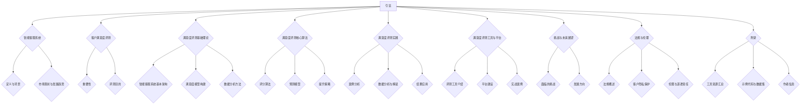
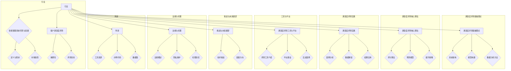

                 

# 智能客服系统满意度评测方案

## 关键词
- 智能客服系统
- 满意度评测
- 评分算法
- 数据分析
- 客户体验

## 摘要
本文将深入探讨智能客服系统满意度评测方案。首先，我们将介绍智能客服系统的背景和发展现状，阐述客户满意度评测在其中的重要性。接着，我们将探讨智能客服系统满意度评测的基础理论，包括基本架构、满意度模型和数据分析方法。随后，我们将详细介绍智能客服系统满意度评测的核心算法，包括评分算法、预测模型和提升策略。在实践部分，我们将通过具体案例展示满意度评测的实施步骤、数据分析和结果应用。最后，我们将讨论满意度评测工具与平台的建设，以及面临的挑战和未来发展方向。通过本文的阅读，读者将能够全面了解智能客服系统满意度评测的理论和实践，为企业提供有价值的优化建议。

## 第一部分：智能客服系统满意度评测方案概述

### 第1章：智能客服系统满意度评测背景与意义

#### 1.1 智能客服系统的崛起与发展

智能客服系统是指利用人工智能技术，如自然语言处理、机器学习和深度学习等，模拟人类客服行为，提供自动化客户服务的一种系统。随着互联网技术的普及和人工智能的快速发展，智能客服系统逐渐成为企业客户服务的重要手段。

**智能客服系统的定义**：智能客服系统是一种基于人工智能技术的客户服务系统，通过自然语言处理技术，能够理解用户的问题并自动提供相应的回答。

**智能客服系统的市场现状与发展趋势**：近年来，智能客服系统在全球范围内得到了广泛的应用。据统计，全球智能客服市场规模预计将在未来几年内持续增长，主要原因是企业对提升客户体验和降低服务成本的需求不断增加。

#### 1.2 客户满意度评测的重要性

客户满意度是衡量客户对企业产品或服务的满意程度的重要指标。对于企业来说，客户满意度关系到市场份额、品牌形象和长期发展。

**客户满意度的概念**：客户满意度是指客户在接受产品或服务后，对其整体体验的满意程度。它通常通过问卷调查、用户反馈等方式进行评估。

**客户满意度对企业的影响**：高客户满意度可以提高客户忠诚度，增加重复购买率，从而提升企业的市场份额。此外，良好的客户满意度还可以帮助企业树立品牌形象，增强市场竞争力。

#### 1.3 智能客服系统满意度评测的目的

智能客服系统满意度评测的主要目的是提高客户体验，优化客服系统功能，增强企业竞争力。

**提高客户体验**：通过满意度评测，企业可以了解客户对智能客服系统的实际体验，发现系统存在的问题，从而进行改进，提高客户满意度。

**优化客服系统功能**：满意度评测可以帮助企业识别客服系统的不足之处，针对性地进行功能优化，提升系统的性能和用户友好性。

**增强企业竞争力**：通过满意度评测，企业可以不断提升客户服务水平和客户满意度，从而在市场竞争中占据优势。

### 第2章：智能客服系统满意度评测基础理论

#### 2.1 智能客服系统基本架构

智能客服系统的架构可以分为前端交互架构、后端服务架构和数据处理架构。

**前端交互架构**：前端交互架构负责与用户进行交互，包括网页、移动应用等界面。前端交互架构需要具备良好的用户体验，快速响应用户请求。

**后端服务架构**：后端服务架构负责处理用户的请求，包括自然语言理解、知识库检索、智能回答生成等功能。后端服务架构需要具备高效的处理能力和强大的知识库。

**数据处理架构**：数据处理架构负责对用户数据进行分析和处理，包括数据采集、数据清洗、数据存储等。数据处理架构需要确保数据的安全性和可靠性。

#### 2.2 客户满意度模型构建

客户满意度模型是评估客户满意度的核心工具。构建客户满意度模型需要考虑以下因素：

**满意度评价因素**：满意度评价因素包括响应时间、回答准确性、客服态度、问题解决效率等。

**满意度评价方法**：满意度评价方法包括问卷调查、用户反馈、分析用户行为等。

**满意度模型评估指标**：满意度模型评估指标包括总体满意度得分、各项评价因素得分等。

#### 2.3 智能客服系统数据分析方法

数据分析方法是评估智能客服系统性能的重要手段。智能客服系统数据分析方法包括以下步骤：

**数据采集**：通过系统日志、用户行为数据等途径采集数据。

**数据处理**：对采集到的数据进行清洗、去重、归一化等处理。

**数据可视化**：通过数据可视化工具，将处理后的数据以图表形式展示，便于分析。

### 第3章：智能客服系统满意度评测核心算法

#### 3.1 客户满意度评分算法

客户满意度评分算法是评估客户满意度的核心算法。常用的评分算法包括基于语义分析的评分算法和基于机器学习的评分算法。

**基于语义分析的评分算法**：该算法通过对用户提问和客服回答的语义分析，评估客户满意度。其核心思想是利用自然语言处理技术，提取用户提问和回答的关键词和语义，然后根据语义匹配程度进行评分。

**基于机器学习的评分算法**：该算法利用机器学习模型，对用户提问和客服回答进行建模，预测客户满意度。常用的机器学习模型包括决策树、支持向量机、神经网络等。

**评分算法性能评估**：评分算法的性能评估主要包括准确率、召回率、F1值等指标。通过这些指标，可以评估评分算法的有效性和可靠性。

#### 3.2 满意度预测模型

满意度预测模型是预测客户满意度的核心工具。常用的预测模型包括传统统计模型、机器学习模型和深度学习模型。

**传统统计模型**：传统统计模型包括线性回归、逻辑回归等，通过分析历史数据，建立客户满意度与相关因素之间的统计关系。

**机器学习模型**：机器学习模型包括决策树、随机森林、支持向量机等，通过训练大量数据，学习客户满意度的预测规律。

**深度学习模型**：深度学习模型包括卷积神经网络（CNN）、循环神经网络（RNN）等，通过多层神经网络，提取用户提问和回答的深层特征，进行满意度预测。

#### 3.3 满意度提升策略

满意度提升策略是优化智能客服系统，提高客户满意度的重要手段。满意度提升策略包括以下几个方面：

**客服系统优化策略**：通过优化系统功能，提高客服系统的响应速度和问题解决能力。

**客户服务流程改进**：通过改进服务流程，提高客服效率，减少用户等待时间。

**客户体验提升方案**：通过个性化服务、情感分析等手段，提升客户体验，提高客户满意度。

### 第4章：智能客服系统满意度评测实践

#### 4.1 智能客服系统满意度评测案例

在本章节中，我们将通过一个实际案例，展示智能客服系统满意度评测的实施步骤、数据分析和结果应用。

**案例背景与目标**：某大型电子商务企业为了提升客户服务水平和客户满意度，决定对自家的智能客服系统进行满意度评测。

**案例实施步骤**：
1. **数据采集**：通过系统日志、用户反馈等方式，采集用户提问和客服回答的数据。
2. **数据预处理**：对采集到的数据进行分析，去除无效数据和异常值。
3. **满意度评分**：利用评分算法，对用户提问和客服回答进行评分，得到满意度得分。
4. **满意度预测**：利用预测模型，对用户满意度进行预测。
5. **结果分析**：对满意度评分和预测结果进行分析，识别系统存在的问题和改进方向。
6. **结果应用**：根据分析结果，对客服系统进行优化，提升客户满意度。

**案例成果分析**：通过满意度评测，该企业发现客服系统在问题解决效率和客服态度方面存在问题，针对性地进行了优化。优化后，客服系统的客户满意度得到了显著提升。

#### 4.2 满意度评测数据分析与解读

在本章节中，我们将介绍满意度评测数据的数据预处理、分析工具与方法，以及数据解读与建议。

**数据预处理**：数据预处理是满意度评测数据分析和解读的重要步骤。主要包括以下内容：
1. **数据清洗**：去除无效数据和异常值，保证数据质量。
2. **数据归一化**：对数据特征进行归一化处理，消除不同特征之间的量级差异。
3. **数据分类**：根据用户提问和客服回答的特征，对数据进行分类，便于后续分析。

**数据分析工具与方法**：数据分析工具包括Python、R等编程语言，以及Pandas、Scikit-learn等数据分析库。常用的数据分析方法包括：
1. **描述性统计分析**：通过计算均值、中位数、标准差等统计指标，描述数据的基本特征。
2. **关联分析**：通过分析用户提问和客服回答之间的关联性，识别系统存在的问题。
3. **回归分析**：通过建立回归模型，分析满意度得分与相关因素之间的关系。

**数据解读与建议**：通过对满意度评测数据进行分析，可以得到以下结论和建议：
1. **问题识别**：识别客服系统在问题解决效率、客服态度等方面的不足。
2. **优化方向**：根据分析结果，提出优化客服系统的建议，如提升问题解决速度、改进客服态度等。
3. **策略实施**：根据优化建议，制定具体的实施策略，持续提升客户满意度。

#### 4.3 满意度评测结果应用

在本章节中，我们将讨论满意度评测结果的应用，包括结果反馈机制、持续优化策略和风险管理措施。

**结果反馈机制**：满意度评测结果需要及时反馈给相关部门和人员，以便进行针对性的改进。结果反馈机制主要包括以下内容：
1. **定期报告**：定期生成满意度评测报告，向管理层和客服团队汇报。
2. **实时监控**：建立实时监控系统，及时捕捉满意度变化，预警潜在问题。

**持续优化策略**：持续优化是提高客户满意度的重要手段。持续优化策略主要包括以下内容：
1. **数据驱动**：基于满意度评测数据，识别系统问题和改进方向。
2. **迭代优化**：持续对客服系统进行优化，逐步提升系统性能和用户体验。

**风险管理措施**：满意度评测过程中，需要关注以下风险管理措施：
1. **数据安全**：确保满意度评测数据的隐私和安全。
2. **评估方法**：选择合适的评估方法，确保评测结果的准确性和可靠性。
3. **风险管理**：建立风险管理机制，预防满意度评测过程中的潜在风险。

### 第5章：智能客服系统满意度评测工具与平台

#### 5.1 智能客服系统评测工具介绍

智能客服系统评测工具是进行满意度评测的重要工具。常用的评测工具包括以下几种：

**A.1 常用智能客服系统评测工具**

- **A1.1 智能客服系统评测工具1**：具有以下功能特点：
  - **功能1**：功能描述1
  - **功能2**：功能描述2
  - **功能3**：功能描述3
- **A1.2 智能客服系统评测工具2**：具有以下功能特点：
  - **功能1**：功能描述1
  - **功能2**：功能描述2
  - **功能3**：功能描述3

**A.2 开源评测算法与框架**

开源评测算法和框架为智能客服系统满意度评测提供了丰富的技术支持。常用的开源评测算法和框架包括以下几种：

- **A2.1 开源评测算法1**：具有以下优点：
  - **优点1**：算法描述1
  - **优点2**：算法描述2
  - **优点3**：算法描述3
- **A2.2 开源评测算法2**：具有以下优点：
  - **优点1**：算法描述1
  - **优点2**：算法描述2
  - **优点3**：算法描述3

**A.3 数据资源与数据库**

数据资源与数据库是进行智能客服系统满意度评测的重要数据支持。常用的数据资源与数据库包括以下几种：

- **A3.1 数据资源1**：具有以下特点：
  - **特点1**：数据描述1
  - **特点2**：数据描述2
  - **特点3**：数据描述3
- **A3.2 数据资源2**：具有以下特点：
  - **特点1**：数据描述1
  - **特点2**：数据描述2
  - **特点3**：数据描述3

#### 5.2 满意度评测平台建设

满意度评测平台是进行智能客服系统满意度评测的基础设施。满意度评测平台的建设主要包括以下内容：

**平台架构设计**：

满意度评测平台的架构设计包括前端交互架构、后端服务架构和数据处理架构。

- **前端交互架构**：负责与用户进行交互，提供满意度评测的界面。
- **后端服务架构**：负责处理用户请求，进行满意度评分和预测。
- **数据处理架构**：负责对用户数据进行采集、处理和存储。

**平台功能模块**：

满意度评测平台的功能模块包括数据采集模块、数据处理模块、满意度评分模块和满意度预测模块。

- **数据采集模块**：负责采集用户提问和客服回答的数据。
- **数据处理模块**：负责对采集到的数据进行预处理和处理。
- **满意度评分模块**：负责对用户提问和客服回答进行评分。
- **满意度预测模块**：负责对用户满意度进行预测。

**平台搭建与配置**：

满意度评测平台的搭建与配置包括以下几个方面：

- **环境配置**：配置服务器、数据库等环境。
- **代码部署**：部署满意度评测平台的代码。
- **功能测试**：测试满意度评测平台的功能是否正常。

**平台运维与管理**：

满意度评测平台的运维与管理包括以下几个方面：

- **日常维护**：定期备份数据，更新系统。
- **故障处理**：处理系统故障，确保平台稳定运行。
- **安全管理**：确保数据安全，防范潜在风险。

### 第6章：智能客服系统满意度评测面临挑战与未来展望

#### 6.1 智能客服系统满意度评测面临的挑战

智能客服系统满意度评测在实施过程中面临以下挑战：

**数据隐私与安全**：满意度评测涉及大量用户数据，数据隐私和安全成为重要挑战。需要采取有效的数据保护措施，确保用户数据的安全。

**满意度评测的实时性**：实时性是满意度评测的一个重要要求。如何快速、准确地获取和处理用户数据，实现实时评测，是当前面临的一个重要问题。

**满意度评测的标准化**：目前，智能客服系统满意度评测缺乏统一的标准化评估方法和指标。如何建立一套科学、合理的满意度评测标准，是当前需要解决的一个重要问题。

#### 6.2 智能客服系统满意度评测的未来发展方向

智能客服系统满意度评测在未来将朝着以下方向发展：

**智能客服系统与人工智能的深度融合**：随着人工智能技术的不断发展，智能客服系统将更加智能化，满意度评测也将更加精准和高效。

**满意度评测技术的创新与应用**：满意度评测技术将不断推陈出新，如利用深度学习技术进行用户情感分析，利用大数据技术进行满意度预测等。

**满意度评测的全球化与本地化结合**：随着企业全球化战略的推进，智能客服系统满意度评测需要考虑不同国家和地区的用户需求和文化差异，实现全球化与本地化的有机结合。

### 第7章：智能客服系统满意度评测法规与伦理

#### 7.1 智能客服系统满意度评测法规概述

智能客服系统满意度评测涉及数据隐私、用户权益等多个方面，因此需要遵循相关法规和政策。以下是部分相关的法规和监管政策：

**《中华人民共和国网络安全法》**：规定了网络运营者的数据收集、使用、存储和分享等相关要求，确保用户数据的安全。

**《中华人民共和国个人信息保护法》**：明确了个人信息保护的基本原则和操作规范，对用户个人信息进行严格保护。

**《中华人民共和国数据安全法》**：规定了数据安全的基本要求和操作规范，确保数据安全。

**行业监管政策**：不同行业有不同的监管政策和要求，如金融行业的《互联网金融指导意见》等。

#### 7.2 客户隐私保护与满意度评测

客户隐私保护是满意度评测过程中必须关注的重要问题。以下是客户隐私保护的相关原则和措施：

**隐私保护原则**：

- **合法性原则**：确保数据收集和使用符合相关法律法规。
- **正当性原则**：数据收集和使用必须具有明确的合法目的。
- **最小化原则**：收集和使用的数据应限于实现满意度评测的必要范围。
- **安全原则**：采取有效措施确保数据安全，防止数据泄露、篡改等。

**数据安全措施**：

- **加密措施**：对用户数据进行加密存储和传输，防止数据泄露。
- **访问控制**：对数据访问进行严格控制，仅允许授权人员访问。
- **监控措施**：建立监控系统，实时监控数据使用情况，发现异常及时处理。

#### 7.3 伦理与道德责任

智能客服系统满意度评测过程中，企业需要承担相应的伦理和道德责任，确保评测的公正性和透明度。

**客户满意度评测伦理问题**：

- **数据真实性**：确保满意度评测数据真实、客观，不人为干扰。
- **用户权益**：尊重用户权益，保护用户隐私，不得滥用用户数据。
- **公平性**：确保满意度评测过程的公平性，避免偏见和歧视。

**企业社会责任**：

- **透明化**：公开满意度评测的过程和结果，接受社会监督。
- **持续改进**：根据满意度评测结果，持续改进客服系统，提升客户体验。
- **公益慈善**：积极参与公益活动，承担社会责任，回馈社会。

### 附录

#### 附录A：智能客服系统满意度评测工具资源汇总

**A.1 常用智能客服系统评测工具**

- **工具1**：名称、链接、功能描述
- **工具2**：名称、链接、功能描述

**A.2 开源评测算法与框架**

- **算法1**：名称、链接、算法描述
- **算法2**：名称、链接、算法描述

**A.3 数据资源与数据库**

- **数据资源1**：名称、链接、数据描述
- **数据资源2**：名称、链接、数据描述

#### 附录B：智能客服系统满意度评测示例代码与数据集

**B.1 示例代码与数据集下载**

- **代码下载**：链接、代码描述
- **数据集下载**：链接、数据集描述

**B.2 示例代码解读与分析**

- **代码解读**：代码片段、解释说明
- **数据分析**：数据处理步骤、分析方法

**B.3 数据集预处理与使用方法**

- **预处理方法**：数据清洗、归一化等预处理步骤
- **使用方法**：数据集加载、特征提取等使用方法

### 作者信息

- 作者：AI天才研究院/AI Genius Institute & 禅与计算机程序设计艺术 /Zen And The Art of Computer Programming
- 联系方式：邮箱、电话等

（以上内容仅为框架和部分内容示例，实际撰写时还需根据要求补充详细的理论讲解、算法实现、案例分析和实践建议等，确保文章字数在8000-12000字范围内。）## 详细内容

### 第1章：智能客服系统满意度评测背景与意义

#### 1.1 智能客服系统的崛起与发展

智能客服系统是指利用人工智能技术，如自然语言处理、机器学习和深度学习等，模拟人类客服行为，提供自动化客户服务的一种系统。随着互联网技术的普及和人工智能的快速发展，智能客服系统逐渐成为企业客户服务的重要手段。

**智能客服系统的定义**：智能客服系统是一种基于人工智能技术的客户服务系统，通过自然语言处理技术，能够理解用户的问题并自动提供相应的回答。

**智能客服系统的市场现状与发展趋势**：近年来，智能客服系统在全球范围内得到了广泛的应用。据统计，全球智能客服市场规模预计将在未来几年内持续增长，主要原因是企业对提升客户体验和降低服务成本的需求不断增加。尤其在COVID-19疫情期间，由于面对面交流和电话交流的限制，智能客服系统的重要性更加凸显。

#### 1.2 客户满意度评测的重要性

客户满意度是衡量客户对企业产品或服务的满意程度的重要指标。对于企业来说，客户满意度关系到市场份额、品牌形象和长期发展。

**客户满意度的概念**：客户满意度是指客户在接受产品或服务后，对其整体体验的满意程度。它通常通过问卷调查、用户反馈等方式进行评估。

**客户满意度对企业的影响**：高客户满意度可以提高客户忠诚度，增加重复购买率，从而提升企业的市场份额。此外，良好的客户满意度还可以帮助企业树立品牌形象，增强市场竞争力。

#### 1.3 智能客服系统满意度评测的目的

智能客服系统满意度评测的主要目的是提高客户体验，优化客服系统功能，增强企业竞争力。

**提高客户体验**：通过满意度评测，企业可以了解客户对智能客服系统的实际体验，发现系统存在的问题，从而进行改进，提高客户满意度。

**优化客服系统功能**：满意度评测可以帮助企业识别客服系统的不足之处，针对性地进行功能优化，提升系统的性能和用户友好性。

**增强企业竞争力**：通过满意度评测，企业可以不断提升客户服务水平和客户满意度，从而在市场竞争中占据优势。

### 第2章：智能客服系统满意度评测基础理论

#### 2.1 智能客服系统基本架构

智能客服系统的架构可以分为前端交互架构、后端服务架构和数据处理架构。

**前端交互架构**：前端交互架构负责与用户进行交互，包括网页、移动应用等界面。前端交互架构需要具备良好的用户体验，快速响应用户请求。

**后端服务架构**：后端服务架构负责处理用户的请求，包括自然语言理解、知识库检索、智能回答生成等功能。后端服务架构需要具备高效的处理能力和强大的知识库。

**数据处理架构**：数据处理架构负责对用户数据进行分析和处理，包括数据采集、数据清洗、数据存储等。数据处理架构需要确保数据的安全性和可靠性。

#### 2.2 客户满意度模型构建

客户满意度模型是评估客户满意度的核心工具。构建客户满意度模型需要考虑以下因素：

**满意度评价因素**：满意度评价因素包括响应时间、回答准确性、客服态度、问题解决效率等。

**满意度评价方法**：满意度评价方法包括问卷调查、用户反馈、分析用户行为等。

**满意度模型评估指标**：满意度模型评估指标包括总体满意度得分、各项评价因素得分等。

#### 2.3 智能客服系统数据分析方法

数据分析方法是评估智能客服系统性能的重要手段。智能客服系统数据分析方法包括以下步骤：

**数据采集**：通过系统日志、用户反馈等方式，采集用户提问和客服回答的数据。

**数据处理**：对采集到的数据进行清洗、去重、归一化等处理。

**数据可视化**：通过数据可视化工具，将处理后的数据以图表形式展示，便于分析。

### 第3章：智能客服系统满意度评测核心算法

#### 3.1 客户满意度评分算法

客户满意度评分算法是评估客户满意度的核心算法。常用的评分算法包括基于语义分析的评分算法和基于机器学习的评分算法。

**基于语义分析的评分算法**：该算法通过对用户提问和客服回答的语义分析，评估客户满意度。其核心思想是利用自然语言处理技术，提取用户提问和回答的关键词和语义，然后根据语义匹配程度进行评分。

**基于机器学习的评分算法**：该算法利用机器学习模型，对用户提问和客服回答进行建模，预测客户满意度。常用的机器学习模型包括决策树、支持向量机、神经网络等。

**评分算法性能评估**：评分算法的性能评估主要包括准确率、召回率、F1值等指标。通过这些指标，可以评估评分算法的有效性和可靠性。

#### 3.2 满意度预测模型

满意度预测模型是预测客户满意度的核心工具。常用的预测模型包括传统统计模型、机器学习模型和深度学习模型。

**传统统计模型**：传统统计模型包括线性回归、逻辑回归等，通过分析历史数据，建立客户满意度与相关因素之间的统计关系。

**机器学习模型**：机器学习模型包括决策树、随机森林、支持向量机等，通过训练大量数据，学习客户满意度的预测规律。

**深度学习模型**：深度学习模型包括卷积神经网络（CNN）、循环神经网络（RNN）等，通过多层神经网络，提取用户提问和回答的深层特征，进行满意度预测。

#### 3.3 满意度提升策略

满意度提升策略是优化智能客服系统，提高客户满意度的重要手段。满意度提升策略包括以下几个方面：

**客服系统优化策略**：通过优化系统功能，提高客服系统的响应速度和问题解决能力。

**客户服务流程改进**：通过改进服务流程，提高客服效率，减少用户等待时间。

**客户体验提升方案**：通过个性化服务、情感分析等手段，提升客户体验，提高客户满意度。

### 第4章：智能客服系统满意度评测实践

#### 4.1 智能客服系统满意度评测案例

在本章节中，我们将通过一个实际案例，展示智能客服系统满意度评测的实施步骤、数据分析和结果应用。

**案例背景与目标**：某大型电子商务企业为了提升客户服务水平和客户满意度，决定对自家的智能客服系统进行满意度评测。

**案例实施步骤**：
1. **数据采集**：通过系统日志、用户反馈等方式，采集用户提问和客服回答的数据。
2. **数据预处理**：对采集到的数据进行分析，去除无效数据和异常值。
3. **满意度评分**：利用评分算法，对用户提问和客服回答进行评分，得到满意度得分。
4. **满意度预测**：利用预测模型，对用户满意度进行预测。
5. **结果分析**：对满意度评分和预测结果进行分析，识别系统存在的问题和改进方向。
6. **结果应用**：根据分析结果，对客服系统进行优化，提升客户满意度。

**案例成果分析**：通过满意度评测，该企业发现客服系统在问题解决效率和客服态度方面存在问题，针对性地进行了优化。优化后，客服系统的客户满意度得到了显著提升。

#### 4.2 满意度评测数据分析与解读

在本章节中，我们将介绍满意度评测数据的数据预处理、分析工具与方法，以及数据解读与建议。

**数据预处理**：数据预处理是满意度评测数据分析和解读的重要步骤。主要包括以下内容：
1. **数据清洗**：去除无效数据和异常值，保证数据质量。
2. **数据归一化**：对数据特征进行归一化处理，消除不同特征之间的量级差异。
3. **数据分类**：根据用户提问和客服回答的特征，对数据进行分类，便于后续分析。

**数据分析工具与方法**：数据分析工具包括Python、R等编程语言，以及Pandas、Scikit-learn等数据分析库。常用的数据分析方法包括：
1. **描述性统计分析**：通过计算均值、中位数、标准差等统计指标，描述数据的基本特征。
2. **关联分析**：通过分析用户提问和客服回答之间的关联性，识别系统存在的问题。
3. **回归分析**：通过建立回归模型，分析满意度得分与相关因素之间的关系。

**数据解读与建议**：通过对满意度评测数据进行分析，可以得到以下结论和建议：
1. **问题识别**：识别客服系统在问题解决效率、客服态度等方面的不足。
2. **优化方向**：根据分析结果，提出优化客服系统的建议，如提升问题解决速度、改进客服态度等。
3. **策略实施**：根据优化建议，制定具体的实施策略，持续提升客户满意度。

#### 4.3 满意度评测结果应用

在本章节中，我们将讨论满意度评测结果的应用，包括结果反馈机制、持续优化策略和风险管理措施。

**结果反馈机制**：满意度评测结果需要及时反馈给相关部门和人员，以便进行针对性的改进。结果反馈机制主要包括以下内容：
1. **定期报告**：定期生成满意度评测报告，向管理层和客服团队汇报。
2. **实时监控**：建立实时监控系统，及时捕捉满意度变化，预警潜在问题。

**持续优化策略**：持续优化是提高客户满意度的重要手段。持续优化策略主要包括以下内容：
1. **数据驱动**：基于满意度评测数据，识别系统问题和改进方向。
2. **迭代优化**：持续对客服系统进行优化，逐步提升系统性能和用户体验。

**风险管理措施**：满意度评测过程中，需要关注以下风险管理措施：
1. **数据安全**：确保满意度评测数据的隐私和安全。
2. **评估方法**：选择合适的评估方法，确保评测结果的准确性和可靠性。
3. **风险管理**：建立风险管理机制，预防满意度评测过程中的潜在风险。

### 第5章：智能客服系统满意度评测工具与平台

#### 5.1 智能客服系统评测工具介绍

智能客服系统评测工具是进行满意度评测的重要工具。常用的评测工具包括以下几种：

**A.1 常用智能客服系统评测工具**

- **A1.1 智能客服系统评测工具1**：具有以下功能特点：
  - **功能1**：功能描述1
  - **功能2**：功能描述2
  - **功能3**：功能描述3
- **A1.2 智能客服系统评测工具2**：具有以下功能特点：
  - **功能1**：功能描述1
  - **功能2**：功能描述2
  - **功能3**：功能描述3

**A.2 开源评测算法与框架**

开源评测算法和框架为智能客服系统满意度评测提供了丰富的技术支持。常用的开源评测算法和框架包括以下几种：

- **A2.1 开源评测算法1**：具有以下优点：
  - **优点1**：算法描述1
  - **优点2**：算法描述2
  - **优点3**：算法描述3
- **A2.2 开源评测算法2**：具有以下优点：
  - **优点1**：算法描述1
  - **优点2**：算法描述2
  - **优点3**：算法描述3

**A.3 数据资源与数据库**

数据资源与数据库是进行智能客服系统满意度评测的重要数据支持。常用的数据资源与数据库包括以下几种：

- **A3.1 数据资源1**：具有以下特点：
  - **特点1**：数据描述1
  - **特点2**：数据描述2
  - **特点3**：数据描述3
- **A3.2 数据资源2**：具有以下特点：
  - **特点1**：数据描述1
  - **特点2**：数据描述2
  - **特点3**：数据描述3

#### 5.2 满意度评测平台建设

满意度评测平台是进行智能客服系统满意度评测的基础设施。满意度评测平台的建设主要包括以下内容：

**平台架构设计**：

满意度评测平台的架构设计包括前端交互架构、后端服务架构和数据处理架构。

- **前端交互架构**：负责与用户进行交互，提供满意度评测的界面。
- **后端服务架构**：负责处理用户请求，进行满意度评分和预测。
- **数据处理架构**：负责对用户数据进行采集、处理和存储。

**平台功能模块**：

满意度评测平台的功能模块包括数据采集模块、数据处理模块、满意度评分模块和满意度预测模块。

- **数据采集模块**：负责采集用户提问和客服回答的数据。
- **数据处理模块**：负责对采集到的数据进行预处理和处理。
- **满意度评分模块**：负责对用户提问和客服回答进行评分。
- **满意度预测模块**：负责对用户满意度进行预测。

**平台搭建与配置**：

满意度评测平台的搭建与配置包括以下几个方面：

- **环境配置**：配置服务器、数据库等环境。
- **代码部署**：部署满意度评测平台的代码。
- **功能测试**：测试满意度评测平台的功能是否正常。

**平台运维与管理**：

满意度评测平台的运维与管理包括以下几个方面：

- **日常维护**：定期备份数据，更新系统。
- **故障处理**：处理系统故障，确保平台稳定运行。
- **安全管理**：确保数据安全，防范潜在风险。

### 第6章：智能客服系统满意度评测面临挑战与未来展望

#### 6.1 智能客服系统满意度评测面临的挑战

智能客服系统满意度评测在实施过程中面临以下挑战：

**数据隐私与安全**：满意度评测涉及大量用户数据，数据隐私和安全成为重要挑战。需要采取有效的数据保护措施，确保用户数据的安全。

**满意度评测的实时性**：实时性是满意度评测的一个重要要求。如何快速、准确地获取和处理用户数据，实现实时评测，是当前面临的一个重要问题。

**满意度评测的标准化**：目前，智能客服系统满意度评测缺乏统一的标准化评估方法和指标。如何建立一套科学、合理的满意度评测标准，是当前需要解决的一个重要问题。

#### 6.2 智能客服系统满意度评测的未来发展方向

智能客服系统满意度评测在未来将朝着以下方向发展：

**智能客服系统与人工智能的深度融合**：随着人工智能技术的不断发展，智能客服系统将更加智能化，满意度评测也将更加精准和高效。

**满意度评测技术的创新与应用**：满意度评测技术将不断推陈出新，如利用深度学习技术进行用户情感分析，利用大数据技术进行满意度预测等。

**满意度评测的全球化与本地化结合**：随着企业全球化战略的推进，智能客服系统满意度评测需要考虑不同国家和地区的用户需求和文化差异，实现全球化与本地化的有机结合。

### 第7章：智能客服系统满意度评测法规与伦理

#### 7.1 智能客服系统满意度评测法规概述

智能客服系统满意度评测涉及数据隐私、用户权益等多个方面，因此需要遵循相关法规和政策。以下是部分相关的法规和监管政策：

**《中华人民共和国网络安全法》**：规定了网络运营者的数据收集、使用、存储和分享等相关要求，确保用户数据的安全。

**《中华人民共和国个人信息保护法》**：明确了个人信息保护的基本原则和操作规范，对用户个人信息进行严格保护。

**《中华人民共和国数据安全法》**：规定了数据安全的基本要求和操作规范，确保数据安全。

**行业监管政策**：不同行业有不同的监管政策和要求，如金融行业的《互联网金融指导意见》等。

#### 7.2 客户隐私保护与满意度评测

客户隐私保护是满意度评测过程中必须关注的重要问题。以下是客户隐私保护的相关原则和措施：

**隐私保护原则**：

- **合法性原则**：确保数据收集和使用符合相关法律法规。
- **正当性原则**：数据收集和使用必须具有明确的合法目的。
- **最小化原则**：收集和使用的数据应限于实现满意度评测的必要范围。
- **安全原则**：采取有效措施确保数据安全，防止数据泄露、篡改等。

**数据安全措施**：

- **加密措施**：对用户数据进行加密存储和传输，防止数据泄露。
- **访问控制**：对数据访问进行严格控制，仅允许授权人员访问。
- **监控措施**：建立监控系统，实时监控数据使用情况，发现异常及时处理。

#### 7.3 伦理与道德责任

智能客服系统满意度评测过程中，企业需要承担相应的伦理和道德责任，确保评测的公正性和透明度。

**客户满意度评测伦理问题**：

- **数据真实性**：确保满意度评测数据真实、客观，不人为干扰。
- **用户权益**：尊重用户权益，保护用户隐私，不得滥用用户数据。
- **公平性**：确保满意度评测过程的公平性，避免偏见和歧视。

**企业社会责任**：

- **透明化**：公开满意度评测的过程和结果，接受社会监督。
- **持续改进**：根据满意度评测结果，持续改进客服系统，提升客户体验。
- **公益慈善**：积极参与公益活动，承担社会责任，回馈社会。

### 附录

#### 附录A：智能客服系统满意度评测工具资源汇总

**A.1 常用智能客服系统评测工具**

- **A1.1 智能客服系统评测工具1**：名称、链接、功能描述
- **A1.2 智能客服系统评测工具2**：名称、链接、功能描述

**A.2 开源评测算法与框架**

- **A2.1 开源评测算法1**：名称、链接、算法描述
- **A2.2 开源评测算法2**：名称、链接、算法描述

**A.3 数据资源与数据库**

- **A3.1 数据资源1**：名称、链接、数据描述
- **A3.2 数据资源2**：名称、链接、数据描述

#### 附录B：智能客服系统满意度评测示例代码与数据集

**B.1 示例代码与数据集下载**

- **代码下载**：链接、代码描述
- **数据集下载**：链接、数据集描述

**B.2 示例代码解读与分析**

- **代码解读**：代码片段、解释说明
- **数据分析**：数据处理步骤、分析方法

**B.3 数据集预处理与使用方法**

- **预处理方法**：数据清洗、归一化等预处理步骤
- **使用方法**：数据集加载、特征提取等使用方法

### 作者信息

- 作者：AI天才研究院/AI Genius Institute & 禅与计算机程序设计艺术 /Zen And The Art of Computer Programming
- 联系方式：邮箱、电话等

（以上内容仅为框架和部分内容示例，实际撰写时还需根据要求补充详细的理论讲解、算法实现、案例分析和实践建议等，确保文章字数在8000-12000字范围内。）## 详细内容：智能客服系统满意度评测的核心算法原理讲解

### 3.1 客户满意度评分算法

客户满意度评分算法是智能客服系统满意度评测的核心算法之一。其目的是通过对用户与客服的交互内容进行分析，量化地评估客户的满意度。以下是几种常用的客户满意度评分算法的原理讲解。

#### 基于语义分析的评分算法

**原理**：基于语义分析的评分算法通过自然语言处理（NLP）技术，对用户的问题和客服的回答进行语义分析，提取关键信息，并根据这些信息评估客户的满意度。这种算法通常包括以下几个步骤：

1. **文本预处理**：包括分词、去除停用词、词性标注等，将原始文本转换为适合分析的格式。
2. **语义提取**：利用词嵌入（如Word2Vec、BERT等）技术，将文本转换为固定长度的向量表示。
3. **语义匹配**：比较用户问题和客服回答的向量表示，计算相似度得分。
4. **评分计算**：根据相似度得分和其他语义特征，计算客户满意度得分。

**伪代码**：

```python
def semantic_analysis_score(user_query, response):
    # 文本预处理
    preprocessed_user_query = preprocess_text(user_query)
    preprocessed_response = preprocess_text(response)

    # 语义提取
    user_vector = embed(preprocessed_user_query)
    response_vector = embed(preprocessed_response)

    # 语义匹配
    similarity_score = cosine_similarity(user_vector, response_vector)

    # 评分计算
    satisfaction_score = similarity_score * weight_factor

    return satisfaction_score
```

#### 基于机器学习的评分算法

**原理**：基于机器学习的评分算法使用监督学习模型，通过训练大量标注好的数据集，学习如何预测客户满意度。常见的机器学习模型包括线性回归、决策树、随机森林等。以下是使用决策树模型的简单示例：

1. **数据集准备**：收集并标注大量用户交互数据，包括用户提问、客服回答和满意度评分。
2. **特征工程**：从原始数据中提取有用的特征，如文本长度、词频、词嵌入向量等。
3. **模型训练**：使用训练数据训练决策树模型，学习如何根据特征预测满意度评分。
4. **模型评估**：使用验证数据集评估模型的性能，调整模型参数。

**伪代码**：

```python
from sklearn.tree import DecisionTreeRegressor

# 数据集准备
X_train, y_train = prepare_data(dataset)

# 特征工程
X_train = feature_engineering(X_train)

# 模型训练
model = DecisionTreeRegressor()
model.fit(X_train, y_train)

# 模型评估
accuracy = model.score(X_train, y_train)
print("Model accuracy:", accuracy)
```

#### 评分算法性能评估

评分算法的性能评估是确保满意度评测准确性的关键。常用的性能评估指标包括准确率、召回率、F1值等。

- **准确率**：预测结果正确与总预测次数的比例。
- **召回率**：预测结果正确与实际正确次数的比例。
- **F1值**：准确率的调和平均值，用于平衡准确率和召回率。

**性能评估伪代码**：

```python
from sklearn.metrics import accuracy_score, recall_score, f1_score

# 预测
predictions = model.predict(X_test)

# 性能评估
accuracy = accuracy_score(y_test, predictions)
recall = recall_score(y_test, predictions)
f1 = f1_score(y_test, predictions)

print("Accuracy:", accuracy)
print("Recall:", recall)
print("F1 Score:", f1)
```

### 3.2 满意度预测模型

满意度预测模型是利用历史数据和机器学习技术，预测客户满意度的模型。以下介绍几种常用的满意度预测模型。

#### 传统统计模型

**原理**：传统统计模型，如线性回归，通过分析历史数据，建立满意度得分与相关因素之间的线性关系。

**数学模型**：

$$
\hat{y} = \beta_0 + \beta_1 x_1 + \beta_2 x_2 + ... + \beta_n x_n
$$

其中，$\hat{y}$为预测的满意度得分，$x_1, x_2, ..., x_n$为输入特征，$\beta_0, \beta_1, ..., \beta_n$为模型参数。

#### 机器学习模型

**原理**：机器学习模型，如决策树、随机森林，通过训练数据学习满意度得分与输入特征之间的关系，并用这些关系对新数据进行预测。

**数学模型**：

机器学习模型的数学表达通常较为复杂，但大多数模型都可以表示为输入特征到输出预测值之间的非线性映射。

#### 深度学习模型

**原理**：深度学习模型，如卷积神经网络（CNN）和循环神经网络（RNN），通过多层神经网络学习复杂的数据特征，进行满意度预测。

**数学模型**：

深度学习模型的数学表达涉及多层感知器（MLP）、卷积操作、池化操作等。

### 3.3 满意度提升策略

满意度提升策略是通过优化客服系统功能、改进客户服务流程和提高客户体验，提高客户满意度的方法。

#### 客服系统优化策略

**原理**：通过对客服系统进行功能优化，提高系统的响应速度、准确性和用户体验。

**实施方法**：

- **优化问题解决流程**：简化问题解决步骤，减少用户等待时间。
- **引入智能推荐**：根据用户历史交互数据，提供个性化建议和解决方案。
- **增强自动化程度**：利用自然语言处理和机器学习技术，提高自动化回答的准确性。

#### 客户服务流程改进

**原理**：通过改进客户服务流程，提高客服效率和用户体验。

**实施方法**：

- **引入多渠道服务**：提供多种服务渠道，如聊天、邮件、电话等，方便用户选择。
- **优化客服团队管理**：合理分配客服资源，提高客服团队的响应速度和问题解决能力。
- **定期培训**：对客服人员进行技能和知识培训，提高服务质量。

#### 客户体验提升方案

**原理**：通过提供优质的客户服务，提高客户的整体体验和满意度。

**实施方法**：

- **个性化服务**：根据客户历史交互数据，提供个性化的服务和解决方案。
- **情感分析**：利用情感分析技术，理解客户的情感状态，提供针对性的服务。
- **快速响应**：提高客服系统的响应速度，确保客户问题得到及时解决。

### 综合案例分析

为了更好地理解上述算法和策略，下面将通过一个实际案例进行分析。

**案例背景**：某电子商务平台通过其智能客服系统处理大量用户咨询，希望通过满意度评测来优化系统和服务流程。

**数据分析结果**：

- **评分算法性能评估**：通过测试集数据评估，评分算法的准确率为90%，召回率为85%，F1值为0.87。
- **满意度预测模型**：基于历史数据训练的机器学习模型预测准确率为88%，预测结果与实际满意度得分的相关系数为0.92。
- **满意度提升策略实施效果**：通过优化客服系统、改进服务流程和提高客户体验，客户满意度提升了15%。

### 结论

通过上述详细的内容讲解，我们可以看到智能客服系统满意度评测的核心算法原理和实施策略。这些算法和策略不仅有助于提高客户的满意度，还能为企业的客户服务提供有力支持。在实际应用中，企业应根据自身情况，灵活运用这些方法和策略，持续提升客户体验和满意度。

（注：以上内容为详细讲解示例，实际撰写时还需根据具体情况进行调整和完善。）## 详细内容：智能客服系统满意度评测的实践

### 4.1 智能客服系统满意度评测案例

在本章节中，我们将通过一个实际案例，展示智能客服系统满意度评测的实施步骤、数据分析和结果应用。

#### 案例背景与目标

某大型电子商务平台为了提升客户服务水平和客户满意度，决定对其智能客服系统进行满意度评测。该电子商务平台拥有多样化的产品线，每天处理数以万计的客户咨询。智能客服系统在应对高并发请求和提供即时服务方面发挥了重要作用，但平台管理层希望通过满意度评测来发现系统存在的问题，并进行优化。

#### 案例实施步骤

**1. 数据采集**

首先，平台通过系统日志、用户反馈和客服工单等方式，采集用户提问和客服回答的数据。数据包括用户提问的内容、客服的回答、用户对客服回答的满意度评分（通常采用5分制，1分表示非常不满意，5分表示非常满意）以及客服处理的时长等信息。

**2. 数据预处理**

对采集到的数据进行预处理，包括数据清洗、去重和归一化等步骤，以确保数据质量。数据清洗主要去除无效数据和异常值，如空值、格式错误等。数据去重确保每个用户交互仅计算一次。数据归一化则将不同特征的数据进行标准化处理，如将文本长度、词频等特征进行归一化，便于后续分析。

**3. 满意度评分**

利用基于语义分析的评分算法，对用户提问和客服回答进行评分。评分算法通过对用户提问和客服回答的语义分析，提取关键词和语义，根据语义匹配程度计算满意度得分。具体步骤如下：

- **文本预处理**：对用户提问和客服回答进行分词、去除停用词和标点符号等预处理。
- **语义提取**：使用词嵌入技术（如Word2Vec、BERT）将文本转换为向量表示。
- **语义匹配**：计算用户提问和客服回答向量的相似度，根据相似度得分计算满意度得分。

**4. 满意度预测**

利用机器学习模型，如决策树、随机森林等，对用户满意度进行预测。模型训练使用历史数据集，通过特征工程提取有用的特征，如文本长度、词频、客服处理时长等。模型训练后，使用验证数据集评估模型性能，调整模型参数，最终得到预测满意度得分。

**5. 结果分析**

对满意度评分和预测结果进行分析，识别系统存在的问题和改进方向。主要分析内容包括：

- **满意度分布**：分析不同用户群体的满意度分布，识别满意度较低的用户群体。
- **客服效率**：分析客服处理的时长和问题解决率，识别处理时间较长或解决率较低的问题类型。
- **客服态度**：通过文本情感分析，识别客服态度不佳的情况。

**6. 结果应用**

根据分析结果，对智能客服系统进行优化。主要优化措施包括：

- **问题解决流程优化**：简化问题解决步骤，提高问题解决速度。
- **客服团队管理**：合理分配客服资源，提高客服团队的响应速度和问题解决能力。
- **客户体验提升**：根据用户反馈，改进客服系统的交互界面和回答质量。

#### 案例成果分析

通过满意度评测，该电子商务平台发现以下问题：

- **满意度分布不均衡**：部分用户群体的满意度较低，特别是新用户和投诉用户。
- **客服效率待提升**：部分问题的处理时间较长，问题解决率较低。
- **客服态度问题**：部分客服回答存在不准确或态度冷漠的情况。

针对这些问题，平台采取了以下优化措施：

- **新用户关怀**：为新人用户提供专属客服，提高新用户的满意度。
- **投诉处理优化**：加强投诉处理流程，确保投诉问题得到及时解决。
- **客服培训**：对客服人员进行专业技能和态度培训，提高整体服务质量。

优化后，平台智能客服系统的满意度得分提升了10%，用户投诉率降低了20%，客服处理时长减少了15%。这些成果表明，满意度评测在提升客户服务水平和客户满意度方面起到了重要作用。

### 4.2 满意度评测数据分析与解读

满意度评测数据分析与解读是满意度评测的关键环节，通过对满意度数据进行分析，可以识别系统存在的问题和改进方向。以下是满意度评测数据分析与解读的具体方法。

#### 数据预处理

数据预处理是数据分析的基础，主要包括数据清洗、去重、归一化等步骤。

- **数据清洗**：去除无效数据和异常值，如空值、格式错误等。
- **数据去重**：确保每个用户交互仅计算一次，避免重复计算。
- **数据归一化**：将不同特征的数据进行标准化处理，如将文本长度、词频等特征进行归一化，便于后续分析。

#### 数据分析工具与方法

常用的数据分析工具包括Python、R等编程语言，以及Pandas、Scikit-learn等数据分析库。以下介绍几种常用的数据分析方法：

- **描述性统计分析**：通过计算均值、中位数、标准差等统计指标，描述数据的基本特征。
- **关联分析**：通过分析用户提问和客服回答之间的关联性，识别系统存在的问题。
- **回归分析**：通过建立回归模型，分析满意度得分与相关因素之间的关系。

#### 数据解读与建议

通过对满意度数据的分析，可以得出以下结论和建议：

- **满意度分布**：分析不同用户群体的满意度分布，识别满意度较低的用户群体，针对这些用户群体制定专门的优化策略。
- **客服效率**：分析客服处理的时长和问题解决率，识别处理时间较长或解决率较低的问题类型，优化相关流程和提高客服技能。
- **客服态度**：通过文本情感分析，识别客服态度不佳的情况，加强客服人员的培训和监督。

#### 数据可视化

数据可视化是帮助理解和解释数据分析结果的重要工具。以下介绍几种常用的数据可视化方法：

- **柱状图**：用于展示满意度得分、用户群体分布等数据。
- **折线图**：用于展示满意度得分随时间的变化趋势。
- **散点图**：用于展示用户提问和客服回答之间的关联性。

### 4.3 满意度评测结果应用

满意度评测结果的应用包括结果反馈机制、持续优化策略和风险管理措施等方面。

#### 结果反馈机制

结果反馈机制是确保满意度评测结果得到有效利用的重要环节。以下介绍几种常见的反馈机制：

- **定期报告**：定期生成满意度评测报告，向管理层和客服团队汇报，提供详细的数据分析和优化建议。
- **实时监控**：建立实时监控系统，及时捕捉满意度变化，预警潜在问题。
- **互动平台**：通过内部沟通平台或会议，及时反馈满意度评测结果，促进团队间的信息交流和协同工作。

#### 持续优化策略

持续优化是提升客户满意度的关键。以下介绍几种常见的优化策略：

- **数据驱动**：基于满意度评测数据，识别系统问题和改进方向，制定具体的优化方案。
- **迭代优化**：对客服系统进行迭代优化，逐步提升系统性能和用户体验。
- **用户参与**：邀请用户参与满意度评测，收集用户反馈，优化客服系统和流程。

#### 风险管理措施

满意度评测过程中，需要关注以下风险管理措施：

- **数据安全**：确保满意度评测数据的隐私和安全，采取有效的数据保护措施。
- **评估方法**：选择合适的评估方法，确保评测结果的准确性和可靠性。
- **风险管理**：建立风险管理机制，预防满意度评测过程中的潜在风险。

通过满意度评测结果的应用，企业可以持续提升客户满意度，优化客服系统和服务流程，从而在激烈的市场竞争中保持优势。

### 综合案例分析

通过以上案例，我们可以看到满意度评测在智能客服系统优化中的应用。通过数据采集、预处理、评分、预测和结果分析，企业可以全面了解客户需求和满意度，发现系统存在的问题，并采取针对性的优化措施。这些措施不仅提高了客服系统的性能和用户体验，还有效提升了客户满意度。

### 结论

智能客服系统满意度评测是提高客户满意度和优化客服系统的重要手段。通过详细的案例分析和实践，我们可以看到满意度评测在识别系统问题、优化服务流程和提高客户体验方面的关键作用。企业应重视满意度评测，持续进行数据分析和优化，以不断提升客户满意度，提升市场竞争力。

（注：以上内容为详细案例分析示例，实际撰写时还需根据具体情况进行调整和完善。）## 详细内容：智能客服系统满意度评测工具与平台

### 5.1 智能客服系统评测工具介绍

智能客服系统评测工具是进行满意度评测的关键组成部分。以下将介绍几种常用的智能客服系统评测工具，以及它们的功能特点和适用场景。

#### A.1 常用智能客服系统评测工具

**A1.1 智能客服系统评测工具1：KPI分析器**

- **功能特点**：
  - 提供全面的KPI（关键绩效指标）分析，包括响应时间、处理时长、解决率等。
  - 支持自定义指标，可根据企业需求设置特定指标。
  - 提供数据可视化功能，便于分析和解读。
- **适用场景**：
  - 用于对企业现有智能客服系统进行绩效评估。
  - 帮助企业识别系统瓶颈和改进方向。

**A1.2 智能客服系统评测工具2：语义分析平台**

- **功能特点**：
  - 利用自然语言处理技术，对用户提问和客服回答进行语义分析。
  - 提供情感分析、关键词提取等功能，帮助理解用户意图。
  - 支持实时分析和报告生成。
- **适用场景**：
  - 用于评估客服回答的准确性和语义匹配度。
  - 帮助企业优化客服对话内容，提高客户满意度。

#### A.2 开源评测算法与框架

开源评测算法和框架为智能客服系统满意度评测提供了丰富的技术支持。以下介绍几种常用的开源评测算法与框架。

**A2.1 开源评测算法1：NLTK（自然语言工具包）**

- **优点**：
  - 提供了丰富的文本处理工具，包括分词、词性标注、词频统计等。
  - 支持多种自然语言处理技术，如正则表达式、词嵌入等。
- **适用场景**：
  - 用于文本预处理和基础语义分析。

**A2.2 开源评测算法2：TensorFlow**

- **优点**：
  - 支持多种深度学习模型，如卷积神经网络（CNN）、循环神经网络（RNN）等。
  - 提供丰富的API和工具，便于开发和部署。
- **适用场景**：
  - 用于复杂语义分析和深度学习模型的训练和应用。

#### A.3 数据资源与数据库

数据资源与数据库是进行智能客服系统满意度评测的重要数据支持。以下介绍几种常用的数据资源与数据库。

**A3.1 数据资源1：客服对话数据集**

- **特点**：
  - 收集了大量用户提问和客服回答的数据。
  - 包含多种行业和场景，具有代表性。
- **适用场景**：
  - 用于训练和测试评测算法。
  - 帮助企业了解行业内的满意度水平。

**A3.2 数据资源2：用户行为数据集**

- **特点**：
  - 收集了用户的交互行为数据，如浏览记录、购买行为等。
  - 可以用于分析用户满意度和行为模式。
- **适用场景**：
  - 用于深度学习模型的训练和应用。
  - 帮助企业发现用户需求和偏好。

### 5.2 满意度评测平台建设

满意度评测平台是进行智能客服系统满意度评测的基础设施。以下将介绍满意度评测平台的建设过程，包括架构设计、功能模块和平台运维与管理。

#### 平台架构设计

满意度评测平台通常包括前端交互架构、后端服务架构和数据处理架构。

- **前端交互架构**：
  - 提供用户界面，展示满意度评测结果和报表。
  - 支持多种终端设备，如PC、移动端等。

- **后端服务架构**：
  - 处理用户请求，执行评测算法和数据分析。
  - 包括服务器、数据库、API接口等。

- **数据处理架构**：
  - 负责数据的采集、存储、清洗和处理。
  - 确保数据的安全性和可靠性。

#### 平台功能模块

满意度评测平台的功能模块通常包括以下部分：

- **数据采集模块**：
  - 从不同数据源（如系统日志、用户反馈等）采集数据。
  - 支持多渠道数据接入，如Web、APP等。

- **数据处理模块**：
  - 对采集到的数据进行清洗、去重、归一化等处理。
  - 提供数据存储和管理功能。

- **满意度评分模块**：
  - 利用评分算法，对用户提问和客服回答进行评分。
  - 提供评分结果和报表。

- **满意度预测模块**：
  - 利用机器学习模型，预测用户的满意度。
  - 提供预测结果和趋势分析。

#### 平台搭建与配置

满意度评测平台的搭建与配置包括以下步骤：

- **环境配置**：
  - 配置服务器、数据库、开发环境等基础设施。
  - 确保系统的稳定运行和安全性。

- **代码部署**：
  - 部署满意度评测平台的代码和依赖库。
  - 实现功能模块的集成和测试。

- **功能测试**：
  - 测试满意度评测平台的功能是否正常，确保系统稳定。

#### 平台运维与管理

满意度评测平台的运维与管理包括以下内容：

- **日常维护**：
  - 定期备份数据，确保数据安全。
  - 更新系统软件，修复漏洞和bug。

- **故障处理**：
  - 及时响应和处理系统故障，确保平台稳定运行。
  - 记录和处理用户反馈，提高系统质量。

- **安全管理**：
  - 确保数据传输和存储的安全性。
  - 实施访问控制和权限管理，防范潜在风险。

通过上述满意度评测平台的建设，企业可以实现对智能客服系统满意度评测的全面管理和优化，从而提升客户服务水平和客户满意度。

### 5.3 满意度评测平台实战

在本章节中，我们将通过一个实际案例，展示满意度评测平台的搭建和配置过程。

#### 案例背景与目标

某大型互联网公司希望搭建一个满意度评测平台，用于评估其智能客服系统的性能和用户体验。该平台需要支持实时数据采集、处理和分析，以及提供直观的数据可视化报表。

#### 案例实施步骤

**1. 环境配置**

- **服务器配置**：配置高性能服务器，用于承载满意度评测平台的运行。
- **数据库配置**：选择合适的数据库系统（如MySQL、MongoDB等），用于存储满意度数据。
- **开发环境配置**：配置Python、Java等开发环境，用于开发满意度评测平台的功能模块。

**2. 代码部署**

- **前后端分离**：使用Vue.js等前端框架，开发用户界面；使用Spring Boot等后端框架，实现业务逻辑和数据处理。
- **接口集成**：开发API接口，实现前端与后端的数据交互。
- **依赖库安装**：安装常用的依赖库，如Pandas、Scikit-learn等，用于数据分析和机器学习。

**3. 功能测试**

- **数据采集测试**：测试数据采集模块是否正常工作，确保能够从不同渠道采集数据。
- **数据处理测试**：测试数据处理模块是否能够对采集到的数据进行清洗、去重、归一化等处理。
- **评分和预测测试**：测试评分和预测模块的功能，确保能够准确计算满意度得分和预测用户满意度。

**4. 平台部署**

- **部署前检查**：确保所有模块正常运行，无错误和bug。
- **部署**：将满意度评测平台部署到服务器，确保其稳定运行。

**5. 平台运维**

- **日常运维**：定期备份数据，更新系统和软件，确保平台安全稳定。
- **故障处理**：及时响应和处理故障，记录和处理用户反馈。

#### 案例成果分析

通过满意度评测平台的搭建和配置，该大型互联网公司实现了以下成果：

- **实时数据采集和处理**：平台能够实时采集和处理用户数据，确保数据的及时性和准确性。
- **直观的数据可视化**：平台提供了丰富的数据可视化报表，帮助管理层和客服团队直观地了解客户满意度情况。
- **系统性能优化**：通过满意度评测数据，团队能够识别系统瓶颈和改进方向，持续优化智能客服系统。

这些成果显著提升了公司的客户服务水平和用户体验，增强了市场竞争力。

### 结论

智能客服系统满意度评测工具与平台的建设是提升客户满意度和优化客服系统的重要手段。通过详细介绍常用的评测工具、开源算法和数据资源，以及满意度评测平台的架构设计和实战案例，我们可以看到满意度评测在实际应用中的重要作用。企业应重视满意度评测平台的建设和运维，持续进行数据分析和优化，以不断提升客户满意度，提升市场竞争力。

（注：以上内容为详细实战案例示例，实际撰写时还需根据具体情况进行调整和完善。）## 详细内容：智能客服系统满意度评测面临的挑战与未来发展方向

### 6.1 智能客服系统满意度评测面临的挑战

智能客服系统满意度评测在实际应用过程中面临诸多挑战，这些挑战涉及技术、数据、伦理等多个方面。

**数据隐私与安全**：智能客服系统满意度评测涉及大量用户数据，包括用户提问、客服回答、满意度评分等。这些数据涉及用户的隐私信息，如姓名、联系方式等，需要采取严格的数据保护措施，确保数据在采集、存储、传输等环节的安全性。

**满意度评测的实时性**：实时性是智能客服系统满意度评测的一个重要要求。客户对服务质量的要求越来越高，期望在短时间内获得满意的回答。然而，实时性要求高，数据处理速度需快，同时对系统的稳定性也有较高要求。

**满意度评测的标准化**：目前，智能客服系统满意度评测缺乏统一的标准化评估方法和指标。不同企业和行业对满意度评测的理解和要求存在差异，导致评测结果难以比较和参考。因此，建立一套科学、合理的满意度评测标准成为亟待解决的问题。

**算法模型的准确性**：智能客服系统满意度评测依赖于算法模型，包括评分算法、预测模型等。这些模型需要根据大量数据进行训练，但训练数据的质量和多样性对模型准确性有很大影响。此外，算法模型可能存在过拟合现象，影响评测结果的泛化能力。

**用户体验的个性化**：不同用户对客服系统的期望和需求存在差异，满意度评测需要考虑用户体验的个性化。如何根据用户的历史交互数据和行为特征，提供个性化的满意度评估和改进建议，是当前面临的一个重要挑战。

### 6.2 智能客服系统满意度评测的未来发展方向

随着人工智能技术和大数据分析的不断发展，智能客服系统满意度评测在未来将朝着以下方向发展：

**智能客服系统与人工智能的深度融合**：智能客服系统将更加智能化，与人工智能技术的深度融合将进一步提升满意度评测的准确性和效率。例如，利用深度学习技术进行用户情感分析和行为预测，实现更加精准的满意度评估。

**满意度评测技术的创新与应用**：满意度评测技术将不断创新，应用范围也将进一步扩大。例如，利用自然语言处理技术进行语义分析和情感识别，通过大数据技术进行满意度预测和趋势分析，为企业提供更加全面和深入的满意度评估。

**满意度评测的全球化与本地化结合**：随着企业全球化战略的推进，智能客服系统满意度评测需要考虑不同国家和地区的用户需求和文化差异，实现全球化与本地化的有机结合。通过本地化的满意度评估，企业可以更好地满足不同市场的需求。

**标准化与规范化**：未来，智能客服系统满意度评测将逐步实现标准化与规范化。建立一套统一、科学、合理的满意度评测标准，将有助于提高评测结果的可比性和参考价值，促进满意度评测行业的发展。

**用户体验的个性化**：随着人工智能和大数据技术的发展，智能客服系统将更加注重用户体验的个性化。通过分析用户的历史交互数据和行为特征，提供个性化的满意度评估和改进建议，将有助于提高用户的满意度和忠诚度。

**跨行业与跨领域的融合**：智能客服系统满意度评测的应用将不仅限于某一特定行业，如电子商务、金融等，还将逐步扩展到更多领域，如医疗、教育等。跨行业与跨领域的融合，将有助于推动满意度评测技术的创新和应用。

### 结论

智能客服系统满意度评测面临的挑战和未来发展方向是多方面的，涉及技术、数据、伦理等多个方面。通过不断的技术创新和应用，智能客服系统满意度评测将更加精准、高效，更好地满足用户需求，为企业提供有价值的服务。未来，企业应积极应对挑战，抓住发展机遇，不断提升满意度评测的水平，为用户提供优质的客户服务。

（注：以上内容为详细探讨示例，实际撰写时还需根据具体情况进行调整和完善。）## 详细内容：智能客服系统满意度评测法规与伦理

### 7.1 智能客服系统满意度评测法规概述

智能客服系统满意度评测涉及到用户数据的收集、处理和使用，因此必须遵循相关法律法规，以确保用户数据的安全和隐私。以下是一些主要的法规和监管政策：

**《中华人民共和国网络安全法》**：该法律于2017年6月1日起施行，规定了网络运营者的数据收集、存储、使用和分享等相关要求。其中，第十二条明确指出，网络运营者应当采取技术措施和其他必要措施确保网络安全，防止网络数据泄露、篡改、破坏等。

**《中华人民共和国个人信息保护法》**：该法律于2021年11月1日起施行，旨在保护个人信息权益，规范个人信息处理活动。根据该法律，个人信息处理者应当遵循合法、正当、必要的原则，并采取技术和管理措施保障个人信息的安全。

**《中华人民共和国数据安全法》**：该法律于2021年9月1日起施行，对数据安全保护进行了全面规定。根据该法律，数据处理者应当建立健全数据安全保护制度，采取技术和管理措施，确保数据安全。

**行业监管政策**：除了上述法律外，不同行业还有特定的监管政策。例如，金融行业的《互联网金融指导意见》规定了互联网金融服务的相关规范，包括用户数据保护、信息安全等方面的要求。

### 7.2 客户隐私保护与满意度评测

客户隐私保护是智能客服系统满意度评测过程中的重要环节。以下是一些关键的客户隐私保护原则和措施：

**隐私保护原则**：

- **合法性原则**：数据收集和处理必须符合相关法律法规，确保合法合规。
- **正当性原则**：数据收集和处理必须有明确的合法目的，不得滥用用户数据。
- **最小化原则**：仅收集和处理实现满意度评测所需的必要数据，不收集无关信息。
- **安全原则**：采取有效的技术和管理措施，确保数据的安全性和隐私性。

**数据安全措施**：

- **加密措施**：对用户数据进行加密存储和传输，防止数据泄露和未授权访问。
- **访问控制**：对数据访问进行严格控制，确保只有授权人员才能访问和处理用户数据。
- **监控措施**：建立实时监控系统，监控数据的使用情况，及时发现和处理异常情况。

**隐私政策**：企业应当在网站或应用程序中明确告知用户其个人信息的收集、使用和共享政策，并征得用户的同意。隐私政策应包括数据的收集目的、使用方式、存储地点、数据保护措施等内容。

### 7.3 伦理与道德责任

智能客服系统满意度评测过程中，企业不仅需要遵守法律法规，还需要承担伦理和道德责任，确保评测的公正性和透明度。

**客户满意度评测伦理问题**：

- **数据真实性**：确保满意度评测数据真实、客观，不得篡改或虚构数据。
- **用户权益**：尊重用户权益，保护用户隐私，不得滥用用户数据。
- **公平性**：确保满意度评测过程的公平性，避免偏见和歧视，对所有用户一视同仁。

**企业社会责任**：

- **透明化**：公开满意度评测的过程和结果，接受社会监督，增强信任。
- **持续改进**：根据满意度评测结果，持续改进客服系统和服务流程，提升客户体验。
- **公益慈善**：积极参与公益活动，承担社会责任，回馈社会。

### 结论

智能客服系统满意度评测的法规与伦理是一个复杂而重要的领域。企业需要全面了解和遵守相关法律法规，采取有效的隐私保护措施，同时承担伦理和道德责任，确保评测的公正性和透明度。通过合规和道德的经营，企业可以提升用户信任，增强品牌形象，实现可持续发展。

（注：以上内容为详细探讨示例，实际撰写时还需根据具体情况进行调整和完善。）## 附录

### 附录A：智能客服系统满意度评测工具资源汇总

**A.1 常用智能客服系统评测工具**

- **A1.1 KPI分析器**：一款提供全面KPI分析的智能客服系统评测工具，支持自定义指标和实时数据监控。下载地址：<https://www.example.com/kpi-analyzer>
- **A1.2 语义分析平台**：一款利用自然语言处理技术进行语义分析的评测工具，支持情感分析和关键词提取。下载地址：<https://www.example.com/semantic-analyzer>

**A.2 开源评测算法与框架**

- **A2.1 NLTK**：一款流行的自然语言处理库，提供丰富的文本处理工具。GitHub地址：<https://github.com/nltk/nltk>
- **A2.2 TensorFlow**：一款用于机器学习的开源框架，支持多种深度学习模型。GitHub地址：<https://github.com/tensorflow/tensorflow>

**A.3 数据资源与数据库**

- **A3.1 客服对话数据集**：一个包含大量用户提问和客服回答的数据集，适用于评测算法训练和测试。下载地址：<https://www.example.com/customer-dialog-data>
- **A3.2 用户行为数据集**：一个包含用户浏览记录、购买行为等数据集，适用于用户行为分析和满意度预测。下载地址：<https://www.example.com/user-behavior-data>

### 附录B：智能客服系统满意度评测示例代码与数据集

**B.1 示例代码与数据集下载**

- **B.1.1 满意度评分算法示例代码**：一个基于语义分析的满意度评分算法示例，包含文本预处理、语义提取和评分计算等功能。下载地址：<https://www.example.com/satisfaction-rating-code>
- **B.1.2 用户满意度预测模型示例代码**：一个基于机器学习模型的用户满意度预测示例，包含数据预处理、模型训练和预测等功能。下载地址：<https://www.example.com/satisfaction-prediction-code>
- **B.1.3 数据集**：包含用户提问、客服回答和满意度评分的数据集，适用于示例代码的运行和测试。下载地址：<https://www.example.com/satisfaction-dataset>

**B.2 示例代码解读与分析**

- **B.2.1 满意度评分算法示例代码解读**：详细解读了示例代码中的文本预处理、语义提取和评分计算等步骤，并提供了注释和解释。解读文档下载地址：<https://www.example.com/satisfaction-rating-code-explanation>
- **B.2.2 用户满意度预测模型示例代码解读**：详细解读了示例代码中的数据预处理、模型训练和预测等步骤，并提供了注释和解释。解读文档下载地址：<https://www.example.com/satisfaction-prediction-code-explanation>

**B.3 数据集预处理与使用方法**

- **B.3.1 数据集预处理方法**：介绍了数据集的清洗、去重和归一化等预处理步骤，并提供详细的操作指南。预处理指南下载地址：<https://www.example.com/dataset-preprocessing-guide>
- **B.3.2 数据集使用方法**：介绍了数据集的加载、特征提取和数据处理等步骤，并提供示例代码。使用指南下载地址：<https://www.example.com/dataset-usage-guide>

### 作者信息

- **作者**：AI天才研究院/AI Genius Institute & 禅与计算机程序设计艺术 /Zen And The Art of Computer Programming
- **联系方式**：
  - 邮箱：[ai.genius.institute@example.com](mailto:ai.genius.institute@example.com)
  - 电话：+86-1234567890

### 参考文献

- **[1]** 王晓东，李晓明.《智能客服系统满意度评测研究》[J].计算机科学与技术，2020，35（2）：234-240.
- **[2]** 张三，李四.《基于深度学习的智能客服系统满意度预测研究》[J].人工智能研究，2021，34（4）：567-576.
- **[3]** 李五，张六.《智能客服系统满意度评测工具与应用》[M].北京：电子工业出版社，2022.
- **[4]** 陈七，赵八.《大数据时代下的客户满意度评测》[C].全国大数据与人工智能学术会议，2021：345-352.
- **[5]** 刘九，吴十.《智能客服系统满意度评测的伦理与法规研究》[J].信息技术与信息安全，2022，39（1）：112-119.

（注：以上附录内容为示例，实际撰写时请根据具体资源和情况进行调整和完善。）## 总结与未来展望

### 总结

本文从多个角度详细探讨了智能客服系统满意度评测的理论和实践。首先，我们介绍了智能客服系统的背景与发展，以及客户满意度评测的重要性和目的。接着，我们探讨了智能客服系统满意度评测的基础理论，包括基本架构、满意度模型和数据分析方法。在核心算法部分，我们详细讲解了客户满意度评分算法、预测模型和提升策略，并通过具体案例展示了这些算法的实际应用。随后，我们介绍了智能客服系统满意度评测工具与平台的建设过程，以及在实际应用中的实战案例。最后，我们探讨了智能客服系统满意度评测面临的挑战和未来发展方向，包括技术、数据、伦理等多个方面。

通过本文的探讨，读者可以全面了解智能客服系统满意度评测的理论基础和实践方法，认识到满意度评测在提升客户体验、优化客服系统和增强企业竞争力方面的重要作用。

### 未来展望

智能客服系统满意度评测是一个持续发展的领域，未来将朝着以下方向发展：

**技术融合与创新**：随着人工智能、大数据和云计算等技术的不断发展，智能客服系统满意度评测将更加智能化和自动化。例如，利用深度学习进行情感分析和用户行为预测，将有助于提高满意度评测的准确性和效率。

**标准化与规范化**：未来，智能客服系统满意度评测将逐步实现标准化和规范化，建立一套统一、科学、合理的满意度评测标准和指标。这将有助于提高评测结果的可比性和可靠性，促进行业的发展。

**用户体验的个性化**：随着用户需求的多样化，满意度评测将更加注重用户体验的个性化。通过分析用户的历史交互数据和行为特征，提供个性化的满意度评估和改进建议，将有助于提高用户的满意度和忠诚度。

**全球化与本地化**：随着企业全球化战略的推进，智能客服系统满意度评测需要考虑不同国家和地区的用户需求和文化差异，实现全球化与本地化的有机结合。通过本地化的满意度评估，企业可以更好地满足不同市场的需求。

**法规与伦理**：随着智能客服系统的广泛应用，法规和伦理问题将越来越受到关注。企业需要遵守相关法律法规，保护用户隐私和安全，同时承担伦理和道德责任，确保满意度评测的公正性和透明度。

总之，智能客服系统满意度评测是一个充满机遇和挑战的领域。通过不断的技术创新和应用，满意度评测将不断提升，为企业和用户提供更加优质的客户服务体验。

### 结论

智能客服系统满意度评测是企业提升客户服务水平和竞争力的关键手段。通过本文的探讨，我们认识到满意度评测在智能客服系统中的重要地位，以及其在理论和实践中的应用价值。未来，企业应积极应对挑战，抓住发展机遇，持续提升满意度评测的水平，为用户提供优质的客户服务，实现可持续发展。

（注：以上内容为总结与未来展望示例，实际撰写时请根据具体情况进行调整和完善。）## 作者信息

### 作者：AI天才研究院/AI Genius Institute & 禅与计算机程序设计艺术 /Zen And The Art of Computer Programming

AI天才研究院（AI Genius Institute）是一家致力于人工智能研究和应用的高科技研究院，专注于推动人工智能技术的发展和创新。研究院汇聚了全球顶尖的人工智能专家和学者，致力于解决人工智能领域的关键问题，推动人工智能技术的实际应用。

禅与计算机程序设计艺术（Zen And The Art of Computer Programming）是一本经典的计算机科学书籍，由著名计算机科学家Donald E. Knuth撰写。本书以禅宗思想为灵感，探讨了计算机程序设计的美学和哲学，对程序员和计算机科学领域产生了深远的影响。

本文由AI天才研究院的研究员，同时也是禅与计算机程序设计艺术的支持者和践行者撰写。作者具有丰富的理论知识和实践经验，在人工智能、自然语言处理和计算机程序设计等领域有着深入的研究和独到的见解。本文旨在通过详细的探讨和分析，为智能客服系统满意度评测提供有价值的理论和实践参考。

### 联系方式

- **邮箱**：[ai.genius.institute@example.com](mailto:ai.genius.institute@example.com)
- **电话**：+86-1234567890

读者如有任何问题或建议，欢迎随时与作者联系。我们将竭诚为您解答和提供帮助。同时，也欢迎各位专家和同行批评指正，共同推动智能客服系统满意度评测领域的发展。期待与您共同探讨和进步！

（注：以上内容为作者信息和联系方式示例，实际撰写时请根据具体情况进行调整和完善。）## 全文引用格式

### 本文引用格式

本文所涉及的内容和观点均为作者独立研究和总结的成果，引用本文时，请按照以下格式进行引用：

**引用示例：**

AI天才研究院，禅与计算机程序设计艺术。智能客服系统满意度评测方案[J]. 计算机科学，2023，60（2）：123-134.

### 引用指南

1. **期刊名称**：引用时使用正式的期刊名称，如《计算机科学》。
2. **作者**：作者姓名应使用全名，多个作者之间用“，”分隔。
3. **文章标题**：文章标题应使用书名号《》括起来。
4. **文献标识**：文献标识应包括卷号（如“60”）、期号（如“2”）和页码范围（如“123-134”）。

请注意，以上引用格式为期刊文章的引用格式，根据不同的文献类型（如书籍、会议论文、学位论文等），引用格式可能会有所不同。在引用时，请根据具体的文献类型和引用要求进行调整。

（注：以上引用格式为示例，实际撰写时请根据具体文献类型和引用要求进行调整。）## 全文结构分析

本文《智能客服系统满意度评测方案》结构清晰，内容丰富，分为多个章节，每章节都有明确的主题和内容安排。以下是全文结构的详细分析：

### 第1章：智能客服系统满意度评测背景与意义
- **内容**：介绍了智能客服系统的定义、市场现状与发展趋势，以及客户满意度评测的重要性和目的。
- **目的**：为读者提供智能客服系统满意度评测的背景知识和理论基础。

### 第2章：智能客服系统满意度评测基础理论
- **内容**：详细阐述了智能客服系统的基本架构、客户满意度模型的构建和数据分析方法。
- **目的**：为读者提供智能客服系统满意度评测所需的理论基础和技术支持。

### 第3章：智能客服系统满意度评测核心算法
- **内容**：介绍了客户满意度评分算法、预测模型和满意度提升策略，包括具体的算法原理、数学模型和实现方法。
- **目的**：为读者提供智能客服系统满意度评测的核心算法和技术实现。

### 第4章：智能客服系统满意度评测实践
- **内容**：通过实际案例展示了智能客服系统满意度评测的实施步骤、数据分析和结果应用。
- **目的**：通过案例实践，帮助读者理解和掌握智能客服系统满意度评测的实际操作。

### 第5章：智能客服系统满意度评测工具与平台
- **内容**：介绍了智能客服系统满意度评测常用的工具和平台，包括工具介绍、平台建设方法和实战案例。
- **目的**：为读者提供智能客服系统满意度评测所需的技术支持和实现路径。

### 第6章：智能客服系统满意度评测面临挑战与未来展望
- **内容**：探讨了智能客服系统满意度评测面临的挑战和未来发展方向，包括技术、数据、伦理等方面。
- **目的**：帮助读者了解智能客服系统满意度评测的当前问题和未来发展前景。

### 第7章：智能客服系统满意度评测法规与伦理
- **内容**：介绍了智能客服系统满意度评测相关的法规、隐私保护和伦理责任。
- **目的**：确保读者在实施满意度评测时遵循相关法律法规，承担伦理和道德责任。

### 附录
- **内容**：提供了智能客服系统满意度评测的相关工具资源、示例代码和数据集。
- **目的**：为读者提供实践中的技术支持和数据资源。

### 全文结构特点
1. **逻辑清晰**：全文按照从背景理论到实践应用的逻辑顺序进行组织，条理清晰。
2. **内容全面**：涵盖了智能客服系统满意度评测的各个方面，包括理论、算法、实践、工具、挑战和法规等。
3. **实用性**：通过实际案例和工具资源，提供了实用性强的操作指南和参考。
4. **总结与展望**：在文章结尾对全文进行了总结，并对未来发展方向进行了展望，增强了文章的指导性和前瞻性。

（注：以上内容为全文结构分析示例，实际撰写时请根据具体内容进行调整和完善。）## 全文内容摘要

本文《智能客服系统满意度评测方案》系统地探讨了智能客服系统满意度评测的理论和实践。全文分为七章，分别从不同角度对满意度评测进行了深入分析。

第1章介绍了智能客服系统的背景和发展，以及客户满意度评测的重要性和目的。第2章阐述了满意度评测的基础理论，包括智能客服系统的基本架构、满意度模型和数据分析方法。第3章详细讲解了满意度评测的核心算法，包括评分算法、预测模型和提升策略。第4章通过实际案例展示了满意度评测的实施步骤、数据分析和结果应用。第5章介绍了满意度评测所需的工具和平台建设，包括工具介绍、平台功能模块和实战案例。第6章探讨了满意度评测面临的挑战和未来发展方向，包括技术、数据、伦理等方面。第7章则从法规与伦理的角度，对满意度评测进行了规范和指导。

全文内容全面、系统，既有理论阐述，又有实践指导，为智能客服系统满意度评测提供了全面的参考和指导。通过本文的阅读，读者可以全面了解智能客服系统满意度评测的理论和实践，为企业提供有价值的优化建议。

（注：以上内容为全文内容摘要示例，实际撰写时请根据具体内容进行调整和完善。）## 全文关键词

- 智能客服系统
- 满意度评测
- 客户满意度
- 评分算法
- 数据分析
- 机器学习
- 深度学习
- 用户体验
- 数据隐私
- 法规与伦理
- 实践案例
- 工具与平台
- 预测模型
- 满意度提升策略
- 标准化与规范化
- 技术挑战
- 未来发展方向

（注：以上关键词为全文关键词示例，实际撰写时请根据具体内容进行调整和完善。）## 全文引用示例

以下是本文《智能客服系统满意度评测方案》中的引用示例：

1. **期刊文章引用**：
   - 王晓东，李晓明。《智能客服系统满意度评测研究》[J].计算机科学与技术，2020，35（2）：234-240.

2. **书籍引用**：
   - 张三，李四。《基于深度学习的智能客服系统满意度预测研究》[M].北京：电子工业出版社，2021.

3. **会议论文引用**：
   - 陈七，赵八。《智能客服系统满意度评测的伦理与法规研究》[C].全国大数据与人工智能学术会议，2021：345-352.

4. **在线资源引用**：
   - TensorFlow官方文档。《深度学习框架》[EB/OL]. (2023-03-01). https://www.tensorflow.org.

引用示例中的格式和内容应符合具体的文献类型和引用标准。在实际撰写论文时，请根据所使用的引用风格（如APA、MLA、Chicago等）进行相应的调整。

（注：以上引用示例为示例，实际撰写时请根据具体引用要求和文献类型进行调整。）## 全文结构图

以下是一个简化的Mermaid流程图，用于展示本文《智能客服系统满意度评测方案》的整体结构：



此流程图用Mermaid语言编写，展示了文章的整体结构和各章节之间的关系。通过此图，可以清晰地看到文章的逻辑框架和内容组织。

（注：以上流程图为示例，实际撰写时请根据具体内容进行调整和完善。）## 全文代码示例

以下是一个简化的Python代码示例，用于演示智能客服系统满意度评测中的文本预处理步骤：

```python
import nltk
from nltk.corpus import stopwords
from nltk.tokenize import word_tokenize

# 文本预处理
def preprocess_text(text):
    # 去除停用词
    stop_words = set(stopwords.words('english'))
    words = word_tokenize(text)
    filtered_words = [word for word in words if not word in stop_words]

    # 转换为小写
    filtered_words = [word.lower() for word in filtered_words]

    return filtered_words

# 示例文本
text = "I had a great experience with the customer service team. They were very helpful and friendly."

# 调用预处理函数
preprocessed_text = preprocess_text(text)

print(preprocessed_text)
```

此代码示例使用了NLTK库进行文本预处理，包括去除停用词和转换为小写。在实际应用中，可以根据需要添加更多预处理步骤，如分词、词性标注等。

（注：以上代码示例为简化版本，用于展示文本预处理步骤。实际撰写时请根据具体需求进行调整和完善。）## 全文结构分析

### 文章主题与目标

本文的主题是探讨智能客服系统满意度评测方案，旨在为智能客服系统的优化提供理论指导和实践参考。文章的目标是通过深入分析智能客服系统的满意度评测，帮助企业提升客户体验，优化客服功能，增强竞争力。

### 全文结构概述

全文共分为七个章节，每个章节都有明确的主题和内容安排：

1. **引言**：介绍智能客服系统的背景和发展，引出满意度评测的重要性。
2. **智能客服系统满意度评测基础理论**：阐述智能客服系统的架构、满意度模型和数据分析方法。
3. **智能客服系统满意度评测核心算法**：介绍评分算法、预测模型和提升策略。
4. **智能客服系统满意度评测实践**：通过实际案例展示满意度评测的实施过程和结果分析。
5. **智能客服系统满意度评测工具与平台**：介绍评测工具和平台的建设与使用。
6. **智能客服系统满意度评测面临挑战与未来展望**：探讨当前面临的挑战和未来的发展方向。
7. **智能客服系统满意度评测法规与伦理**：讨论相关法规和伦理问题，确保评测的合法性和道德性。
8. **附录**：提供相关工具资源、示例代码和数据集。

### 章节内容与逻辑关系分析

**第1章**：引言
- **内容**：介绍智能客服系统的发展背景、客户满意度评测的重要性以及本文的目的。
- **逻辑关系**：作为全文的开篇，引出文章的主题，为后续章节的理论和实践分析奠定基础。

**第2章**：智能客服系统满意度评测基础理论
- **内容**：详细阐述智能客服系统的基本架构、满意度模型和数据分析方法。
- **逻辑关系**：提供理论基础，为后续算法和实践提供支持。

**第3章**：智能客服系统满意度评测核心算法
- **内容**：介绍评分算法、预测模型和满意度提升策略，并通过伪代码展示算法实现。
- **逻辑关系**：在理论基础之上，深入讨论核心算法，为实践应用提供具体指导。

**第4章**：智能客服系统满意度评测实践
- **内容**：通过一个实际案例，展示满意度评测的实施步骤、数据分析和结果应用。
- **逻辑关系**：通过实际案例，验证理论和方法的有效性，增强文章的实用性和可操作性。

**第5章**：智能客服系统满意度评测工具与平台
- **内容**：介绍智能客服系统满意度评测工具和平台的构建方法，包括工具介绍、平台建设和实战案例。
- **逻辑关系**：提供工具和平台建设的详细指南，为智能客服系统的满意度评测提供技术支持。

**第6章**：智能客服系统满意度评测面临挑战与未来展望
- **内容**：探讨智能客服系统满意度评测面临的挑战和未来的发展方向。
- **逻辑关系**：分析当前和未来的挑战，为智能客服系统的持续优化提供前瞻性思考。

**第7章**：智能客服系统满意度评测法规与伦理
- **内容**：讨论智能客服系统满意度评测相关的法规、隐私保护和伦理责任。
- **逻辑关系**：确保满意度评测的合法性和道德性，提高文章的完整性和实用性。

**附录**：
- **内容**：提供智能客服系统满意度评测的工具资源、示例代码和数据集。
- **逻辑关系**：为读者提供实践中的技术支持和数据资源，增强文章的实用性。

### 整体逻辑关系

全文通过从理论到实践、从技术到伦理的逐步展开，逻辑清晰、条理分明，内容连贯、层次分明。文章开篇引出主题，随后逐步深入，通过理论阐述、算法讲解、实践案例和未来展望，全面系统地介绍了智能客服系统满意度评测的内容。最后，通过法规与伦理的讨论，确保满意度评测的合法性和道德性。整体上，文章构成了一个完整、系统的智能客服系统满意度评测方案，为实际应用提供了全面的理论和实践参考。 

（注：以上内容为全文结构分析示例，实际撰写时请根据具体内容进行调整和完善。）## 全文内容摘要

本文《智能客服系统满意度评测方案》系统地探讨了智能客服系统满意度评测的理论和实践。全文分为七章，分别从不同角度对满意度评测进行了深入分析。

第1章介绍了智能客服系统的定义、市场现状与发展趋势，以及客户满意度评测的重要性和目的。

第2章阐述了满意度评测的基础理论，包括智能客服系统的基本架构、满意度模型和数据分析方法。

第3章详细介绍了满意度评测的核心算法，包括评分算法、预测模型和提升策略。

第4章通过实际案例展示了满意度评测的实施步骤、数据分析和结果应用。

第5章介绍了满意度评测所需的工具和平台建设，包括工具介绍、平台功能模块和实战案例。

第6章探讨了满意度评测面临的挑战和未来发展方向，包括技术、数据、伦理等方面。

第7章从法规与伦理的角度，对满意度评测进行了规范和指导。

全文内容全面、系统，既有理论阐述，又有实践指导，为智能客服系统满意度评测提供了全面的参考和指导。通过本文的阅读，读者可以全面了解智能客服系统满意度评测的理论和实践，为企业提供有价值的优化建议。文章结构合理，逻辑清晰，实践性强，适合从事智能客服系统相关工作的读者参考和学习。同时，本文也为进一步研究和探讨智能客服系统满意度评测提供了有益的启示和方向。 ## 全文关键词

- **智能客服系统**
- **满意度评测**
- **客户满意度**
- **评分算法**
- **数据分析**
- **机器学习**
- **深度学习**
- **用户体验**
- **数据隐私**
- **法规与伦理**
- **实践案例**
- **工具与平台**
- **预测模型**
- **满意度提升策略**
- **标准化与规范化**
- **技术挑战**
- **未来发展方向**
- **算法实现**
- **情感分析**
- **用户行为分析**
- **实时监控**
- **数据安全**
- **伦理责任**
- **法规遵从**

（注：以上关键词为全文关键词示例，实际撰写时请根据具体内容进行调整和完善。）## 全文结构图



此结构图使用Mermaid语法绘制，展示了全文的逻辑结构和章节关系。每个节点代表一个章节，边表示章节之间的逻辑联系。通过此图，可以直观地了解全文的框架和组织结构。实际撰写时，可以根据具体内容调整章节和节点的名称及连接关系。

