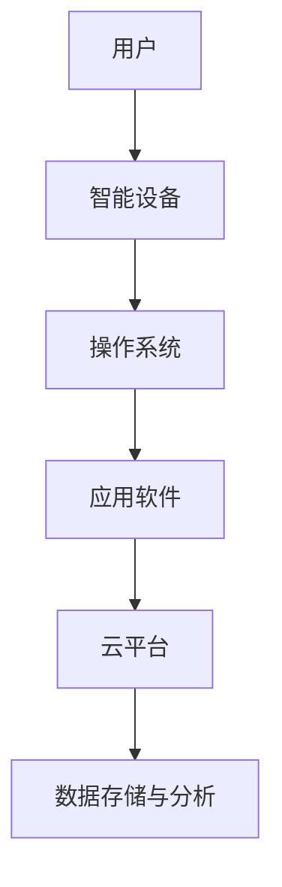

                 

根据您提供的信息和约束条件，我将会逐步构建《智能家居情景师：提示词编排生活场景》的技术博客文章。以下是文章的初步结构和大纲：

## 文章标题：《智能家居情景师：提示词编排生活场景》

### 关键词：智能家居，提示词，情景编排，自然语言处理，物联网，用户体验

### 摘要：
本文深入探讨智能家居情景师的职责，以及如何通过精细的提示词编排为智能家居系统创建丰富的生活场景。文章将介绍智能家居的基本概念和核心技术，详细讲解情景定义、提示词编写技巧，并通过实例展示情景自动识别算法的实现过程。最后，文章将提供实战项目案例，并对未来趋势和职业发展进行展望。

### 目录大纲：

**第一部分：智能家居基础**

## 第1章：智能家居概述

### 1.1 智能家居的定义与发展
- **背景介绍**：智能家居的定义、起源以及其在我国及全球的发展历程。
- **现状分析**：智能家居市场的现状、主要产品和服务类型。

### 1.2 智能家居系统的组成部分
- **核心概念与联系**：智能家居系统硬件、软件以及数据流的基本组成部分及其相互关系。
  - **Mermaid流程图**：展示智能家居系统的基本架构。
  
### 1.3 智能家居的优势与挑战
- **优势分析**：智能化、个性化、便利性等方面的优势。
- **挑战讨论**：隐私保护、安全性、兼容性问题等挑战。

**第二部分：情景定义与提示词编写**

## 第2章：情景定义与分类

### 2.1 情景的定义与作用
- **核心概念与联系**：情景在智能家居系统中的作用和定义。

### 2.2 情景的分类与特点
- **情景分类**：日常活动、特殊场合、节能模式等情景类型。
- **情景特点**：智能联动、个性化定制等。

### 2.3 情景编排的基本原则
- **编排原则**：用户需求导向、系统适应性、可扩展性等。

## 第3章：提示词编写技巧

### 3.1 提示词的基本概念
- **定义与作用**：提示词在情景编排中的作用及其基本概念。

### 3.2 提示词编写的方法与工具
- **编写方法**：自然语言处理（NLP）技术、关键词提取等。
- **工具使用**：自然语言处理工具和平台介绍。

### 3.3 提示词的优化与调整
- **优化原则**：准确、简洁、易懂等。
- **调整方法**：用户反馈、数据分析等。

**第三部分：情景自动识别算法**

## 第4章：情景自动识别算法

### 4.1 自动识别算法概述
- **核心概念与联系**：情景自动识别算法的基本原理和应用场景。

### 4.2 情境识别算法
- **算法原理**：基于规则、机器学习等算法的原理和实现。
- **算法框架**：展示情境识别算法的框架图。

### 4.3 情境识别算法的优化
- **优化策略**：算法调优、模型训练等。

**第四部分：实践与应用**

## 第5章：创建智能家居情景

### 5.1 情景创建的基本流程
- **创建流程**：情景定义、提示词编写、情景测试等步骤。

### 5.2 实例情景创建
- **实例介绍**：展示一个具体情景的创建过程。

### 5.3 情景测试与优化
- **测试方法**：自动化测试、用户测试等。
- **优化过程**：根据测试反馈进行情景调整和优化。

**第五部分：未来展望**

## 第6章：智能家居情景师的未来趋势

### 6.1 技术发展趋势
- **技术展望**：智能家居技术的未来发展。

### 6.2 行业前景分析
- **行业分析**：智能家居行业的未来发展趋势。

### 6.3 情景师的职业规划
- **职业规划**：情景师的角色定位、职业发展路径。

**第六部分：案例研究**

## 第7章：案例研究

### 7.1 成功案例分享
- **成功案例**：分享智能家居情景师的成功案例。

### 7.2 失败案例反思
- **失败案例**：分析失败案例中的问题和教训。

### 7.3 案例对比分析
- **对比分析**：对比成功与失败案例，总结经验和教训。

**附录**

## 附录A：智能家居情景创建指南

### A.1 常用工具与资源
- **工具介绍**：介绍常用的智能家居情景创建工具和资源。

### A.2 开发环境搭建
- **环境搭建**：搭建智能家居情景创建的开发环境。

### A.3 示例代码与解读
- **代码示例**：提供示例代码及其详细解读。

## 附录B：参考文献

- **参考文献列表**：列出文章中引用的文献资料。

### 作者信息

- **作者**：AI天才研究院/AI Genius Institute & 禅与计算机程序设计艺术 /Zen And The Art of Computer Programming

在接下来的步骤中，我将逐步撰写每个章节的内容，确保满足字数要求和格式规范。以下是第一章的初步内容：

## 第1章：智能家居概述

### 1.1 智能家居的定义与发展

#### 背景介绍
智能家居，即通过物联网（IoT）技术将家中的各种设备连接起来，实现自动化控制和智能化管理的系统。它起源于20世纪90年代，随着计算机技术和网络技术的发展而逐渐成熟。在我国，智能家居行业起步较晚，但近年来随着“智慧家庭”概念的提出，市场增长迅速，逐渐成为家庭生活的重要组成部分。

#### 现状分析
目前，智能家居市场呈现出多样化的发展趋势，包括智能照明、智能安防、智能家电、智能环境控制等多个领域。根据市场调研数据，我国智能家居市场规模在2022年已达到数千亿元人民币，预计未来几年将继续保持高速增长。主要产品和服务类型包括智能门锁、智能摄像头、智能空调、智能扫地机器人等。

### 1.2 智能家居系统的组成部分

#### 核心概念与联系
智能家居系统由硬件、软件和数据流三大部分组成。硬件部分包括各种智能设备，如智能插座、智能灯泡、智能传感器等；软件部分则涵盖操作系统、应用软件和云平台等；数据流则负责信息传输和处理。

#### Mermaid流程图

#### 智能家居系统的组成部分及其相互关系
智能家居系统的硬件部分负责实现物理世界的连接和控制，软件部分则负责数据处理和用户交互，云平台则提供数据存储和云计算服务。各部分之间通过数据流实现信息的传递和协同工作，共同构成一个完整的智能家居系统。

### 1.3 智能家居的优势与挑战

#### 优势分析
智能家居系统具有显著的优点，包括：
- **智能化**：通过自动化控制，提高家庭生活的便利性和舒适度。
- **个性化**：根据用户需求和习惯，提供定制化的服务和体验。
- **节能环保**：智能控制可以实现能源的高效利用，减少能源消耗。

#### 挑战讨论
然而，智能家居系统也面临着一些挑战：
- **隐私保护**：智能家居设备收集和存储大量用户数据，需要确保数据的安全和隐私。
- **安全性**：智能家居系统需要防范网络攻击和数据泄露。
- **兼容性**：不同品牌和型号的智能设备之间的兼容性问题，影响系统的整体性能。

接下来，我将继续撰写第二章和第三章的内容。在每个章节中，我将按照预设的格式要求，结合核心概念、算法原理、数学模型和实际案例，确保内容的丰富性和专业性。同时，我会使用Mermaid流程图、伪代码、LaTeX公式等工具来增强文章的可读性和逻辑性。最终，整篇文章将在8000～12000字内完成，提供一个全面而深入的智能家居情景师技术博客文章。

