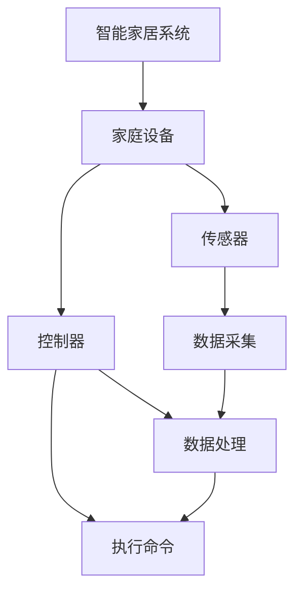
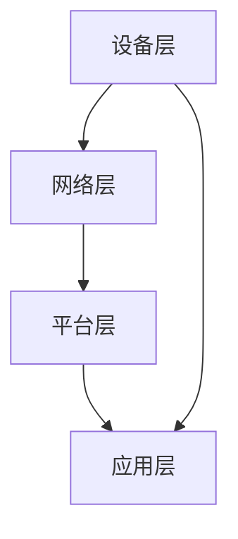

                 

### 文章标题

《智能家居控制：简化提示词交互体验》

### 关键词

智能家居、提示词交互、简化操作、用户体验设计、自然语言处理

### 摘要

随着人工智能和物联网技术的不断发展，智能家居已经成为现代家庭生活的重要组成部分。本文将深入探讨智能家居控制领域，特别是如何通过简化提示词交互体验来提升用户体验。我们将首先介绍智能家居的背景和现状，然后详细讲解提示词交互的概念和设计原则，接着分析简化操作流程的方法和技巧，最后通过实际案例展示如何实现智能家居控制系统的优化和实战应用。

---

### 第1章：智能家居概述

智能家居，顾名思义，就是利用网络和智能设备将家庭生活各个场景进行智能化整合，实现远程控制和自动化操作的一种生活方式。随着物联网（IoT）、云计算和人工智能技术的快速发展，智能家居系统已经从简单的灯光控制、温度调节等单一功能，逐渐演变成能够覆盖家庭安全、家电管理、环境监测等多领域的综合性系统。

#### 背景介绍

智能家居的兴起可以追溯到20世纪90年代，当时计算机和通信技术的进步为家庭自动化提供了技术支持。然而，真正意义上的智能家居市场爆发是在21世纪初，随着智能手机的普及和移动互联网的发展，用户对智能家居产品的需求日益增加。如今，智能家居已经成为各大科技公司竞相争夺的领域，如谷歌、亚马逊、苹果等公司都推出了自己的智能家居产品线。

#### 发展历程

1. **起步阶段（2000年初期）**：这一时期，智能家居主要集中于单一设备的远程控制，如通过手机应用控制家庭灯光、电视等。
2. **成长阶段（2010年前后）**：随着物联网技术的发展，智能家居开始向多设备联动、跨平台交互的方向发展，例如智能安防系统、智能空调等。
3. **成熟阶段（2015年至今）**：随着人工智能技术的应用，智能家居系统变得更加智能化，能够根据用户习惯进行自适应调整，提供更加个性化的服务。

#### 应用场景

1. **家庭自动化**：包括灯光、窗帘、家电等设备的自动化控制。
2. **安全监控**：如智能门锁、摄像头、烟雾报警器等，提高家庭安全水平。
3. **环境监测**：如温湿度传感器、空气质量检测仪等，帮助用户了解并改善家居环境。
4. **能源管理**：通过智能电网、智能电表等技术，实现家庭用电的智能管理。

#### 行业趋势分析

1. **技术融合**：智能家居将与其他技术如5G、区块链等进一步融合，提高系统的稳定性和安全性。
2. **生态建设**：智能家居产品将更加注重生态系统的整合，实现跨品牌、跨平台的互操作性。
3. **个性化服务**：通过大数据和人工智能技术，提供更加个性化的智能家居解决方案。

#### 核心概念与联系

为了更好地理解智能家居控制系统的架构，我们可以使用Mermaid流程图来展示其核心概念之间的关系：



这个流程图清晰地展示了智能家居系统中各个核心组件之间的联系，包括传感器、控制器、数据采集和处理模块等。

### 第2章：智能家居控制技术

智能家居控制技术的核心在于如何通过网络将家庭中的各种设备和传感器连接起来，实现数据的传输、处理和执行。以下将详细探讨几种关键的智能家居控制技术。

#### 网络通信技术

网络通信技术是智能家居系统的基石，常见的网络通信技术包括Wi-Fi、蓝牙、Zigbee和LTE等。

1. **Wi-Fi**：Wi-Fi具有较快的传输速度和广泛的覆盖范围，适用于连接各种智能设备和云平台。
2. **蓝牙**：蓝牙技术简单易用，适用于短距离通信，如智能手环、智能音箱等。
3. **Zigbee**：Zigbee是一种低功耗、低速率的无线通信技术，适用于家庭自动化系统中的传感器和控制器。
4. **LTE**：LTE是一种移动通信技术，适用于需要高速网络的家庭安防和远程监控。

#### 物联网技术

物联网技术是实现智能家居控制的关键，通过物联网技术，家庭中的各种设备和传感器可以互联互通，实现数据的共享和协调。

1. **IoT平台**：IoT平台是智能家居系统的核心，它负责连接各种设备和传感器，收集和处理数据，并实现设备的远程控制。
2. **边缘计算**：边缘计算是一种在设备本地处理数据的技术，可以减少网络延迟，提高系统的实时性和稳定性。
3. **数据传输协议**：常用的数据传输协议包括HTTP、MQTT和CoAP等，这些协议用于确保数据在智能家居系统中的安全可靠传输。

#### 云计算与大数据技术

云计算和大数据技术为智能家居系统提供了强大的数据处理和分析能力。

1. **云计算平台**：云计算平台如AWS、Azure和Google Cloud等，可以提供存储、计算和数据分析服务，为智能家居系统提供支持。
2. **大数据处理**：大数据处理技术如Hadoop和Spark等，可以用于分析智能家居系统中的大量数据，提供个性化服务。
3. **人工智能**：人工智能技术可以帮助智能家居系统实现自动化决策和优化，提高系统的智能水平。

#### 智能家居控制系统的架构与实现

智能家居控制系统的架构通常包括以下几个部分：

1. **设备层**：包括各种传感器和执行器，如温度传感器、灯光开关、智能插座等。
2. **网络层**：包括各种网络通信技术，如Wi-Fi、蓝牙、Zigbee等，用于连接设备和服务器。
3. **平台层**：包括IoT平台、边缘计算平台和云计算平台，负责数据的收集、处理和分析。
4. **应用层**：包括智能终端应用、Web应用和手机应用等，用于用户与智能家居系统的交互。

以下是一个智能家居控制系统的伪代码示例，用于展示系统的基本实现：

```python
# 伪代码：智能家居控制系统实现

# 设备层
class Sensor:
    def read_data(self):
        # 读取传感器数据
        pass

class Actuator:
    def execute_command(self, command):
        # 执行控制命令
        pass

# 网络层
class NetworkModule:
    def send_data(self, data):
        # 发送数据到服务器
        pass

    def receive_command(self):
        # 接收服务器命令
        pass

# 平台层
class IoTPlatform:
    def data_collection(self, sensor_data):
        # 数据收集
        pass

    def data_analysis(self, data):
        # 数据分析
        pass

    def send_command(self, command):
        # 发送控制命令
        pass

# 应用层
class SmartApp:
    def display_status(self, status):
        # 显示设备状态
        pass

    def receive_user_command(self, command):
        # 接收用户命令
        pass

# 系统主程序
def main():
    # 初始化设备
    sensor = Sensor()
    actuator = Actuator()
    
    # 初始化网络模块
    network_module = NetworkModule()
    
    # 初始化平台
    iot_platform = IoTPlatform()
    
    # 初始化应用
    smart_app = SmartApp()
    
    # 数据采集与处理
    sensor_data = sensor.read_data()
    network_module.send_data(sensor_data)
    iot_platform.data_collection(sensor_data)
    iot_platform.data_analysis(sensor_data)
    
    # 命令执行与反馈
    user_command = smart_app.receive_user_command()
    iot_platform.send_command(user_command)
    actuator.execute_command(user_command)
    smart_app.display_status(actuator.status)

# 运行主程序
main()
```

通过这个伪代码示例，我们可以看到智能家居控制系统是如何通过各个层次的协作来实现智能控制的。

### 第3章：提示词交互设计

提示词交互是一种用户与智能家居系统进行沟通的方式，通过简单的提示词命令，用户可以控制家中的智能设备，实现自动化操作。提示词交互设计的核心在于如何使交互过程简洁、直观且易于理解。

#### 提示词交互的概念

提示词交互（Voice Command Interaction）是指用户通过语音或文字指令与智能设备进行交互的一种方式。这种交互方式具有自然、高效、便捷的特点，特别是在智能家居场景中，能够大大提升用户的使用体验。

#### 提示词交互的优势

1. **自然性**：与传统的图形用户界面（GUI）相比，提示词交互更加自然，用户可以通过日常用语来与系统沟通。
2. **高效性**：在忙碌或手部不便的情况下，提示词交互能够快速完成操作，提高效率。
3. **便捷性**：用户无需触碰任何物理按钮或界面，只需说出指令即可完成操作，特别适合于远程控制和自动化场景。

#### 提示词交互的设计原则

1. **简洁性**：设计提示词时应尽可能简洁，避免使用复杂的语法和词汇，使指令易于理解。
2. **一致性**：提示词应保持一致性，确保用户在各个场景下使用相同的指令。
3. **可扩展性**：系统应具备良好的可扩展性，能够根据用户需求新增或调整提示词。

#### 提示词交互的设计原则

1. **用户友好性**：提示词应易于理解，避免使用专业术语或晦涩难懂的词汇。
2. **灵活性**：提示词应具有一定的灵活性，允许用户使用不同的表达方式来发出指令。
3. **可预测性**：系统应能够预测用户可能的需求，提供相应的提示词选项，减少用户的思考时间。

#### 用户研究在提示词交互设计中的应用

用户研究是提示词交互设计过程中至关重要的一环，通过用户研究可以了解用户的需求、习惯和痛点，从而设计出更加符合用户期望的交互方式。

1. **用户访谈**：通过与目标用户进行深入访谈，了解他们的使用场景、期望和问题。
2. **用户行为观察**：观察用户在现实环境中的行为，了解他们如何与现有智能设备互动。
3. **可用性测试**：通过实际操作测试，评估设计的提示词交互系统的易用性和效率。

#### 用户体验设计的方法与实践

用户体验设计（UX Design）是确保提示词交互系统成功的关键。以下是一些用户体验设计的方法和实践：

1. **用户画像**：创建用户画像，了解目标用户的基本信息、行为习惯和需求。
2. **交互流程设计**：设计用户与系统交互的流程图，确保操作流程简洁直观。
3. **原型设计**：制作交互原型，通过用户测试和反馈不断优化设计。
4. **用户反馈**：收集用户反馈，持续改进交互设计，确保系统能够满足用户需求。

#### 提示词交互设计案例分析

以下是一个提示词交互设计的案例分析，该案例是一个智能家居灯光控制系统的提示词设计：

1. **背景**：用户希望能够在不同场景下调整家中灯光的亮度和颜色。
2. **用户需求**：用户需要简洁、直观的提示词来控制灯光。
3. **设计目标**：确保用户能够通过简单的语音指令快速调整灯光。

**设计方案**：

- **基本命令**：
  - “打开灯光”
  - “关闭灯光”
  - “调高亮度”
  - “调低亮度”
  - “改变颜色”

- **扩展命令**：
  - “客厅灯光调到柔和模式”
  - “厨房灯光调到冷光模式”
  - “卧室灯光调到温暖模式”

通过这个案例，我们可以看到如何通过简洁的提示词设计来满足用户的实际需求，从而提升用户体验。

### 第4章：简化操作流程

简化操作流程是提升智能家居用户体验的重要手段之一。通过优化用户与系统之间的交互流程，可以显著降低用户的学习成本和操作难度，提高系统的易用性和用户满意度。以下将详细探讨简化操作流程的方法和技巧。

#### 用户研究在简化操作流程中的作用

用户研究是简化操作流程的第一步，通过深入理解用户的需求、行为和痛点，可以发现操作流程中存在的瓶颈和改进点。以下是一些常用的用户研究方法：

1. **用户访谈**：通过与目标用户进行一对一的深度访谈，了解他们在使用智能家居系统时遇到的困难和期望。
2. **用户行为观察**：实地观察用户在现实环境中的操作行为，记录用户在操作过程中的思维过程和动作。
3. **可用性测试**：邀请用户参与实际操作测试，观察他们在使用系统时的表现，收集反馈信息。

#### 用户体验设计在简化操作流程中的应用

用户体验设计（UX Design）是简化操作流程的核心，通过设计直观、简洁的交互界面和流程，可以显著提高用户的使用体验。以下是一些用户体验设计的方法和实践：

1. **用户画像**：创建详细的用户画像，包括用户的基本信息、使用习惯和需求，以此为基础设计操作流程。
2. **流程图设计**：绘制用户操作流程图，明确每个步骤的目的和用户需要执行的动作。
3. **原型设计**：制作操作流程原型，通过用户测试和反馈不断优化流程设计。
4. **简洁性原则**：在设计中遵循简洁性原则，去除不必要的步骤和选项，简化用户的操作流程。

#### 流程简化的方法与技巧

1. **减少步骤**：通过合并或取消不必要的步骤，减少用户操作的复杂性。例如，将多个独立的操作整合为一个简单指令。
2. **自动化**：利用自动化技术，将一些重复性操作自动化，减少用户的输入。例如，自动识别用户常用的设置，并在需要时进行自动调整。
3. **预填充**：在用户界面中预填充常用的选项或设置，减少用户的输入。例如，在智能音箱中，自动识别用户常用的播放列表，并在用户发出播放指令时自动选择。
4. **明确指示**：提供清晰的指示和反馈，帮助用户理解操作步骤和结果。例如，在智能家居应用中，显示设备的当前状态和操作结果，让用户一目了然。
5. **学习资源**：提供丰富的学习资源，如教程、指南和帮助文档，帮助用户快速掌握系统的使用方法。

#### 智能家居操作流程优化案例

以下是一个智能家居操作流程优化案例，该案例关注于家庭安防系统的操作流程简化。

**背景**：用户在使用家庭安防系统时，发现操作流程较为繁琐，需要进行多个步骤才能完成报警器设置。

**用户需求**：用户希望能够通过简单快捷的操作方式设置家庭安防系统。

**设计目标**：简化操作流程，让用户能够快速设置并激活家庭安防系统。

**设计方案**：

1. **优化步骤**：
   - **原流程**：设置 → 连接设备 → 激活报警器 → 输入验证码
   - **优化后**：简化为：设置 → 激活报警器

2. **自动化**：
   - 系统自动识别用户常用的设备，并自动连接。
   - 系统自动生成验证码，用户只需确认即可。

3. **预填充**：
   - 系统默认选择常用的报警模式，用户无需手动选择。

4. **明确指示**：
   - 应用界面显示当前设备状态和操作结果，用户可以立即确认是否完成设置。

通过以上优化，用户可以更加快捷地设置家庭安防系统，提升了用户体验。

### 第5章：智能家居控制系统搭建

搭建一个智能家居控制系统是一个复杂的过程，涉及硬件选择、系统架构设计以及软件开发等多个方面。以下将详细探讨如何搭建一个智能家居控制系统。

#### 系统架构设计

智能家居控制系统的架构通常包括以下几个层次：

1. **设备层**：包括各种传感器和执行器，如温度传感器、灯光开关、智能插座等。
2. **网络层**：包括各种网络通信技术，如Wi-Fi、蓝牙、Zigbee等，用于连接设备和服务器。
3. **平台层**：包括IoT平台、边缘计算平台和云计算平台，负责数据的收集、处理和分析。
4. **应用层**：包括智能终端应用、Web应用和手机应用等，用于用户与智能家居系统的交互。

以下是一个智能家居控制系统的架构图：



#### 硬件选择

在搭建智能家居控制系统时，硬件选择至关重要。以下是一些常见的硬件选择：

1. **传感器**：
   - **温度传感器**：用于检测室内温度。
   - **湿度传感器**：用于检测室内湿度。
   - **光照传感器**：用于检测室内光照强度。
   - **气体传感器**：用于检测有害气体浓度，如一氧化碳、烟雾等。

2. **执行器**：
   - **灯光开关**：用于控制灯光的开关和亮度调节。
   - **智能插座**：用于远程控制电器的开关。
   - **门锁**：用于远程控制家庭门锁。
   - **摄像头**：用于实时监控家庭环境。

3. **网关**：
   - **Wi-Fi网关**：用于将设备连接到Wi-Fi网络。
   - **蓝牙网关**：用于将设备连接到蓝牙网络。
   - **Zigbee网关**：用于将设备连接到Zigbee网络。

4. **边缘计算设备**：
   - **路由器**：用于处理本地数据，减少网络延迟。
   - **网关服务器**：用于处理本地数据，提供本地化的服务。

#### 软件开发

智能家居控制系统的软件开发主要包括以下几个方面：

1. **设备端软件**：
   - **固件**：用于控制传感器的读取和执行器的操作。
   - **应用程序**：用于设备与用户的交互，如远程控制、数据可视化等。

2. **服务器端软件**：
   - **数据存储**：用于存储设备收集的数据。
   - **数据处理**：用于分析数据，提供智能化的反馈。
   - **API接口**：用于设备与应用程序之间的数据传输。

3. **移动端应用开发**：
   - **用户界面**：用于用户与系统的交互。
   - **功能模块**：如设备管理、数据监控、远程控制等。

#### 智能家居系统开发步骤详解

以下是搭建智能家居控制系统的详细开发步骤：

1. **需求分析**：
   - 确定系统需要实现的功能，如远程控制、数据监控、自动化等。

2. **硬件选择**：
   - 根据需求选择合适的传感器、执行器和网关。

3. **系统架构设计**：
   - 设计系统的整体架构，包括设备层、网络层、平台层和应用层。

4. **设备端软件开发**：
   - 编写固件，实现传感器的读取和执行器的操作。
   - 开发应用程序，实现设备与用户的交互。

5. **服务器端软件开发**：
   - 设计数据库，存储设备收集的数据。
   - 编写数据处理程序，实现数据的分析和反馈。
   - 开发API接口，实现设备与应用程序之间的数据传输。

6. **移动端应用开发**：
   - 设计用户界面，实现用户与系统的交互。
   - 开发功能模块，如设备管理、数据监控、远程控制等。

7. **测试与部署**：
   - 进行系统测试，确保各个组件正常运行。
   - 部署到实际环境中，进行实际应用。

#### 实际案例分析与详细讲解

以下是一个智能家居控制系统的实际案例，该案例关注于家庭安防系统的搭建。

**背景**：用户希望构建一个能够实时监控家庭环境并提供报警功能的智能家居安防系统。

**需求**：
   - **实时监控**：通过摄像头实时监控家庭环境。
   - **报警功能**：在检测到异常情况时发送报警信息。
   - **远程控制**：通过手机应用程序远程查看监控视频和控制安防设备。

**解决方案**：

1. **硬件选择**：
   - **摄像头**：选择高清摄像头，具备夜视功能。
   - **报警器**：选择可远程控制的家庭报警器。
   - **智能插座**：用于远程控制家用电器的开关。

2. **系统架构设计**：
   - **设备层**：摄像头、报警器、智能插座等设备。
   - **网络层**：Wi-Fi网络，连接设备到服务器。
   - **平台层**：IoT平台，负责数据收集和处理。
   - **应用层**：手机应用程序，用于用户与系统的交互。

3. **设备端软件开发**：
   - **固件**：编写摄像头固件，实现视频数据的采集和传输。
   - **应用程序**：开发报警器应用程序，实现报警器的远程控制。

4. **服务器端软件开发**：
   - **数据存储**：使用云数据库存储摄像头采集的视频数据。
   - **数据处理**：编写数据处理程序，分析视频数据，识别异常情况。
   - **API接口**：开发API接口，实现设备与应用程序之间的数据传输。

5. **移动端应用开发**：
   - **用户界面**：设计用户界面，显示实时监控视频和报警信息。
   - **功能模块**：开发远程控制摄像头和报警器的功能模块。

6. **测试与部署**：
   - 进行系统测试，确保各个组件正常运行。
   - 部署到实际环境中，用户可以通过手机应用程序实时监控家庭环境，并在检测到异常情况时收到报警通知。

通过这个实际案例，我们可以看到如何通过系统架构设计和软件开发的步骤来搭建一个智能家居安防系统。

### 第6章：提示词交互系统实现

提示词交互系统是智能家居控制系统中的一项关键技术，通过简单的语音或文字指令，用户可以实现对家中智能设备的控制。实现一个高效的提示词交互系统，需要涉及到自然语言处理（NLP）和语音识别与合成（TTS）技术。以下将详细探讨提示词交互系统的实现。

#### 自然语言处理技术

自然语言处理（NLP）是使计算机能够理解和处理自然语言的技术，主要包括文本分类、实体识别、语义分析和语音识别等。

1. **文本分类**：将用户输入的文本命令分类到相应的操作类别，如“打开灯光”和“关闭灯光”都属于灯光控制类别。

2. **实体识别**：从文本中提取出关键信息，如用户提到的设备名称（如“客厅的灯”）、动作（如“打开”）、状态（如“亮度”）等。

3. **语义分析**：理解用户文本命令的深层含义，如用户说“把客厅灯光调暗一些”，系统需要知道调整的是客厅的灯，并且是将亮度调低。

4. **意图识别**：识别用户命令的意图，如用户说“打开厨房的灯”，系统需要判断是要求立即打开，还是按照用户的习惯自动打开。

#### 对话系统设计

对话系统设计是提示词交互系统的核心，它负责处理用户的输入，生成合适的响应，并与用户进行自然流畅的对话。

1. **输入处理**：接收用户的语音或文本输入，并将其转换为文本格式，以便后续处理。

2. **意图识别**：使用NLP技术识别用户的意图，如控制灯光、调整温度等。

3. **对话管理**：管理对话流程，确保系统能够理解用户的需求并生成合理的响应。

4. **上下文维护**：在对话过程中，系统需要维护上下文信息，以便在后续对话中能够更好地理解用户的需求。

5. **响应生成**：根据用户的意图和上下文，生成合适的文本或语音响应，如“客厅的灯光已打开”。

#### 语音识别与合成

语音识别与合成（TTS）技术是提示词交互系统的重要组成部分，它使系统能够接收用户的语音输入并生成语音响应。

1. **语音识别**：将用户的语音输入转换为文本格式，以便后续处理。

2. **语音合成**：将文本格式的内容转换为语音输出，模拟人类语音，使系统能够以自然的方式与用户对话。

#### 提示词交互系统的实现

以下是一个简单的提示词交互系统的伪代码实现，用于展示系统的基本实现：

```python
# 伪代码：提示词交互系统实现

# 输入处理
def process_input(user_input):
    # 将语音输入转换为文本
    text_input = convert_speech_to_text(user_input)
    return text_input

# 意图识别
def recognize_intent(text_input):
    # 使用NLP技术识别意图
    intent = NLP Analyzer.analyze(text_input)
    return intent

# 对话管理
def manage_dialogue(intent, context):
    # 管理对话流程
    response = DialogueManager.respond(intent, context)
    return response

# 语音合成
def synthesize_speech(response):
    # 将文本响应转换为语音
    speech_output = TextToSpeech.synthesize(response)
    return speech_output

# 主程序
def main():
    # 接收用户语音输入
    user_input = receive_speech_input()

    # 处理输入
    text_input = process_input(user_input)

    # 识别意图
    intent = recognize_intent(text_input)

    # 管理对话
    context = {'intent': intent}
    response = manage_dialogue(intent, context)

    # 合成语音响应
    speech_output = synthesize_speech(response)

    # 输出语音响应
    speak(speech_output)

# 运行主程序
main()
```

通过这个伪代码示例，我们可以看到提示词交互系统的基本实现过程，包括输入处理、意图识别、对话管理和语音合成等步骤。

#### 提示词交互系统的实现与优化

实现一个高效的提示词交互系统不仅需要技术支持，还需要不断优化以提高用户体验。以下是一些优化策略：

1. **错误处理**：设计完善的错误处理机制，确保系统能够在遇到未知指令或错误时给出合适的反馈，如“对不起，我无法理解您的指令，请重新说一遍”。

2. **上下文管理**：优化上下文管理，确保系统能够更好地理解用户的长期需求和意图，如用户连续发出多个指令时，系统能够根据上下文进行连贯的响应。

3. **个性化**：根据用户的历史行为和偏好，提供个性化的提示词交互体验，如用户经常使用的提示词可以预先设定，简化用户的操作流程。

4. **反馈机制**：建立用户反馈机制，收集用户的使用数据和反馈信息，不断优化系统的功能和性能。

通过以上优化策略，提示词交互系统可以更加高效、智能地响应用户需求，提升用户体验。

### 第7章：项目实战

在实际应用中，搭建一个智能家居控制系统并实现提示词交互是一个系统化的工程，涉及开发环境的搭建、源代码的实现、代码解读与分析等多个环节。以下将通过一个具体的案例来详细展示这个过程。

#### 开发环境搭建

搭建智能家居控制系统需要选择合适的开发环境和工具。以下是一个典型的开发环境搭建步骤：

1. **硬件环境**：
   - **传感器**：购买常用的传感器模块，如温度传感器、湿度传感器、光照传感器等。
   - **执行器**：购买相应的执行器模块，如灯光开关、智能插座等。
   - **网关**：选择Wi-Fi网关或Zigbee网关，用于连接设备和互联网。

2. **软件环境**：
   - **编程语言**：选择Python、Java或C++等语言进行开发。
   - **开发工具**：安装集成开发环境（IDE），如PyCharm、Eclipse或Visual Studio。
   - **依赖库**：安装常用的依赖库，如用于网络通信的库、NLP库等。

3. **测试环境**：
   - **模拟器**：使用模拟器进行测试，确保系统在不同环境下的稳定性。
   - **测试设备**：准备多个硬件设备进行测试，以确保系统的兼容性和可靠性。

#### 源代码实现

以下是一个简单的智能家居控制系统的源代码实现，用于控制家中的灯光和温度。

```python
# 示例代码：智能家居控制系统

import json
import requests
from sensor_module import TemperatureSensor, HumiditySensor, LightSensor
from actuator_module import LightActuator, HeaterActuator

# 初始化传感器和执行器
temperature_sensor = TemperatureSensor()
humidity_sensor = HumiditySensor()
light_sensor = LightSensor()
light_actuator = LightActuator()
heater_actuator = HeaterActuator()

# 读取传感器数据
def read_sensors():
    temperature = temperature_sensor.read()
    humidity = humidity_sensor.read()
    light = light_sensor.read()
    return temperature, humidity, light

# 控制灯光
def control_light(state):
    if state == "on":
        light_actuator.turn_on()
    elif state == "off":
        light_actuator.turn_off()

# 控制加热器
def control_heater(state):
    if state == "on":
        heater_actuator.turn_on()
    elif state == "off":
        heater_actuator.turn_off()

# 接收远程控制命令
def receive_command():
    response = requests.get("https://api智能家居控制.com/command")
    command = response.json()["command"]
    return command

# 主程序
def main():
    while True:
        # 读取传感器数据
        temperature, humidity, light = read_sensors()
        
        # 接收远程控制命令
        command = receive_command()
        
        # 根据命令控制灯光和加热器
        if command == "light_on":
            control_light("on")
        elif command == "light_off":
            control_light("off")
        elif command == "heater_on":
            control_heater("on")
        elif command == "heater_off":
            control_heater("off")

# 运行主程序
main()
```

在这个源代码中，我们初始化了传感器和执行器模块，定义了读取传感器数据和执行控制命令的函数，并通过一个无限循环来持续监控传感器数据，并根据远程控制命令调整灯光和加热器的状态。

#### 代码解读与分析

1. **传感器模块**：
   - `TemperatureSensor`、`HumiditySensor`、`LightSensor`：这些类负责读取相应的传感器数据。
   - `read()`方法：每个传感器类都实现了一个`read()`方法，用于读取传感器的当前值。

2. **执行器模块**：
   - `LightActuator`、`HeaterActuator`：这些类负责控制相应的执行器。
   - `turn_on()`、`turn_off()`方法：这些方法用于开启或关闭执行器。

3. **远程控制**：
   - `receive_command()`方法：通过HTTP GET请求从远程服务器接收控制命令。
   - `command`变量：存储从远程服务器接收到的命令。

#### 项目实战

以下是一个具体的智能家居控制系统项目实战，包括开发环境搭建、源代码实现和代码解读与分析。

**实战目标**：构建一个能够远程控制家中灯光和加热器的智能家居系统。

**实战步骤**：

1. **环境搭建**：
   - 准备硬件设备，包括温度传感器、湿度传感器、灯光开关、加热器等。
   - 安装Python环境，并安装必要的依赖库，如`requests`、`json`等。

2. **源代码实现**：
   - 编写`sensor_module.py`文件，实现传感器类和`read()`方法。
   - 编写`actuator_module.py`文件，实现执行器类和`turn_on()`、`turn_off()`方法。
   - 编写主程序`main.py`，实现传感器数据的读取、控制命令的接收和执行器状态的调整。

3. **代码解读与分析**：
   - 解析传感器数据，确保能够正确读取温度、湿度和光照信息。
   - 分析远程控制命令，确保系统能够根据命令进行正确的操作。

**实战小结**：

通过这个项目实战，我们成功搭建了一个简单的智能家居控制系统，实现了对家中灯光和加热器的远程控制。在实际应用中，我们可以根据需求扩展系统的功能，如添加更多传感器、执行器和远程控制方式，提升系统的智能化水平。

### 最佳实践 tips

1. **模块化设计**：在开发过程中，尽量采用模块化设计，将不同的功能划分为独立的模块，便于代码维护和功能扩展。

2. **日志记录**：在程序中添加日志记录功能，有助于调试和诊断问题。

3. **持续集成**：采用持续集成（CI）工具，如Jenkins或Travis CI，自动化测试和部署代码，提高开发效率。

4. **用户反馈**：定期收集用户反馈，根据用户需求优化系统功能。

### 小结

本文通过详细的步骤和实际案例，探讨了如何搭建一个智能家居控制系统，并实现提示词交互。我们首先介绍了智能家居的背景和发展，然后详细讲解了提示词交互的设计原则和实现方法，最后通过实际项目展示了系统的开发过程和最佳实践。通过本文，读者可以了解到智能家居控制系统的基本架构和实现方法，为实际应用提供参考。

### 注意事项

1. **安全性**：在智能家居系统中，确保数据传输的安全性和设备的保护，避免潜在的安全威胁。

2. **兼容性**：在开发过程中，要确保系统能够兼容不同的硬件设备和操作系统。

3. **用户体验**：重视用户体验设计，确保系统能够直观、易用，提升用户满意度。

### 拓展阅读

1. **《智能家居系统设计》**：详细介绍了智能家居系统的设计方法和实现技术。
2. **《人工智能应用实践》**：探讨了人工智能在智能家居领域的应用，提供了丰富的实战案例。
3. **《物联网技术与应用》**：系统介绍了物联网技术的发展和应用，对智能家居系统建设有重要参考价值。

---

**作者：AI天才研究院/AI Genius Institute & 禅与计算机程序设计艺术 /Zen And The Art of Computer Programming**

