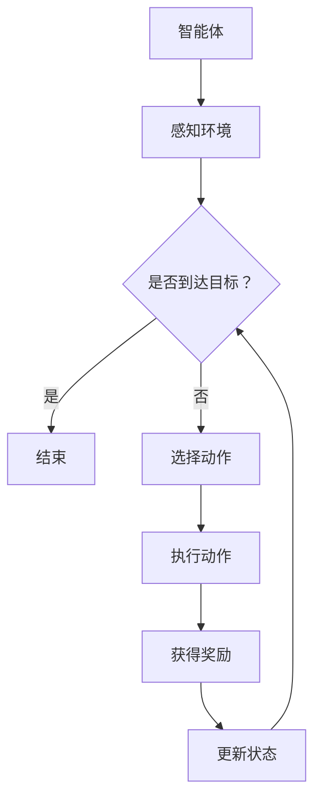

                 

### 文章标题

《智能推理路径规划中强化学习的创新算法》

强化学习作为人工智能领域的重要分支，在路径规划中的应用日益广泛。本文将深入探讨智能推理路径规划中的强化学习创新算法，旨在为研究者提供系统的理论指导与实践经验。通过逐步分析强化学习的基础概念、数学模型、核心算法，以及强化学习在路径规划中的挑战和解决方案，本文将重点介绍几种具有代表性的创新算法，包括Double DQN、Prioritized Experience Replay和Soft Actor-Critic。此外，文章还将结合自动驾驶和无人机路径规划的案例，探讨强化学习在路径规划中的实际应用前景，并为未来的研究提供方向性建议。

### 关键词

- 强化学习
- 路径规划
- 智能推理
- Double DQN
- Prioritized Experience Replay
- Soft Actor-Critic
- 自动驾驶
- 无人机路径规划

### 摘要

本文系统性地探讨了智能推理路径规划中强化学习的创新算法。首先，介绍了强化学习的基础概念、数学模型和主要算法，并结合路径规划的实际需求，阐述了强化学习在路径规划中的挑战与解决方案。随后，本文详细分析了Double DQN、Prioritized Experience Replay和Soft Actor-Critic三种创新算法的原理与应用，并通过实际案例展示了这些算法在自动驾驶和无人机路径规划中的效果。最后，文章总结了强化学习在路径规划中的发展现状和潜在应用领域，提出了未来的研究方向。

### 目录

1. **强化学习基础与路径规划概述**
   1.1 强化学习基础
   1.2 智能推理与路径规划基础
2. **强化学习在路径规划中的应用**
   2.1 强化学习在路径规划中的基本应用
   2.2 强化学习在路径规划中的挑战与解决方案
3. **创新算法在强化学习路径规划中的应用**
   3.1 Double DQN算法
   3.2 Prioritized Experience Replay算法
   3.3 Soft Actor-Critic算法
4. **强化学习在路径规划中的综合应用**
   4.1 强化学习在自动驾驶中的应用
   4.2 强化学习在无人机路径规划中的应用
5. **强化学习在路径规划中的应用前景**
   5.1 强化学习在路径规划中的发展现状
   5.2 强化学习在路径规划中的潜在应用领域
   5.3 强化学习在路径规划中的挑战与机遇
6. **附录**

## 第1章：强化学习基础

### 1.1 强化学习的基本概念

强化学习（Reinforcement Learning，RL）是机器学习的一个重要分支，主要研究如何通过智能体（agent）与环境的交互，学习获得最优策略（policy），以实现某种目标。与监督学习和无监督学习不同，强化学习中的智能体需要通过不断尝试和错误来学习，其核心在于奖励机制和策略迭代。

#### 1.1.1 强化学习的基本概念

强化学习的核心概念主要包括以下几部分：

- **智能体（Agent）**：执行动作并从环境中接收反馈的实体。
- **环境（Environment）**：智能体行动的场所，为智能体提供状态信息。
- **状态（State）**：智能体在某一时刻所处的环境描述。
- **动作（Action）**：智能体可以采取的行为。
- **奖励（Reward）**：智能体采取动作后从环境中获得的即时反馈。
- **策略（Policy）**：智能体在特定状态下采取特定动作的概率分布。

强化学习的目标是通过策略迭代，最大化长期奖励积累。

#### 1.1.2 强化学习的基本元素

强化学习由以下几个基本元素组成：

- **状态空间（State Space）**：所有可能状态集合。
- **动作空间（Action Space）**：所有可能动作集合。
- **策略空间（Policy Space）**：所有可能策略集合。
- **奖励函数（Reward Function）**：定义智能体采取特定动作后获得的奖励。

#### 1.1.3 强化学习与监督学习和无监督学习的对比

强化学习与监督学习、无监督学习有以下几点不同：

- **目标不同**：监督学习旨在找到输入和输出之间的映射关系，无监督学习旨在发现数据中的内在结构和规律，而强化学习旨在学习最优策略。
- **数据依赖不同**：监督学习和无监督学习通常需要大量标注数据，而强化学习在初期阶段不需要标注数据，智能体通过与环境交互进行学习。
- **反馈机制不同**：监督学习和无监督学习通常采用固定的数据集进行训练，而强化学习通过即时反馈不断调整策略，以实现最优目标。

### 1.2 强化学习的数学模型

强化学习的数学模型主要包括动态规划模型、马尔可夫决策过程（MDP）以及价值函数与策略。

#### 1.2.1 动态规划模型

动态规划模型（Dynamic Programming，DP）是一种通过递归关系求解最优策略的方法。其核心思想是将复杂问题分解为子问题，并利用子问题的解来求解原问题。动态规划模型通常用于解决确定性环境中的最优策略问题。

#### 1.2.2 马尔可夫决策过程（MDP）

马尔可夫决策过程（Markov Decision Process，MDP）是一种概率模型，用于描述智能体在不确定环境中进行决策的过程。MDP由状态空间、动作空间、奖励函数和转移概率矩阵组成。其核心思想是智能体在每个状态下采取特定动作，并根据转移概率矩阵转移到下一个状态，从而获得即时奖励。

#### 1.2.3 价值函数与策略

价值函数（Value Function）是评估智能体在特定状态或策略下获得的最大期望奖励。根据定义，价值函数可以分为状态价值函数（State Value Function）和动作价值函数（Action Value Function）。

- **状态价值函数（State Value Function）**：给定策略π，状态价值函数V^π(s)表示智能体在状态s下按照策略π执行动作后获得的期望回报。
- **动作价值函数（Action Value Function）**：给定状态s，动作价值函数Q^π(s, a)表示智能体在状态s下采取动作a后获得的期望回报。

策略（Policy）是智能体在特定状态下采取的动作的概率分布。根据定义，策略可以分为确定性策略（Deterministic Policy）和随机性策略（Stochastic Policy）。

- **确定性策略（Deterministic Policy）**：在给定状态下，智能体总是采取同一个动作。
- **随机性策略（Stochastic Policy）**：在给定状态下，智能体按照一定概率分布采取多个动作。

### 1.3 强化学习的主要算法

强化学习的主要算法包括Q-Learning算法、SARSA算法和Deep Q-Network（DQN）算法等。

#### 1.3.1 Q-Learning算法

Q-Learning算法（Q-Learning，QL）是一种基于值函数的强化学习算法，通过迭代更新动作价值函数Q(s, a)来学习最优策略。Q-Learning算法的基本思想是：在智能体当前状态s下，选择当前最优动作a，并在此基础上更新Q值。更新公式如下：

$$
Q(s, a) \leftarrow Q(s, a) + \alpha [r + \gamma \max_{a'} Q(s', a') - Q(s, a)]
$$

其中，α是学习率，γ是折扣因子，r是即时奖励，s'是下一个状态。

#### 1.3.2 SARSA算法

SARSA算法（SARSA，SARSA）是一种基于策略的强化学习算法，通过迭代更新策略π(s, a)来学习最优策略。SARSA算法的基本思想是：在智能体当前状态s下，根据当前策略π选择动作a，并在此基础上更新策略π。更新公式如下：

$$
\pi(s, a) \leftarrow \frac{\pi(s, a) + \alpha(\tau(s, a) - \pi(s, a))}{1 + \alpha(\tau(s, a))}
$$

其中，α是学习率，τ(s, a)是策略调整函数，表示智能体在状态s下采取动作a的概率。

#### 1.3.3 Deep Q-Network（DQN）算法

Deep Q-Network（DQN）算法是一种基于深度学习的强化学习算法，通过神经网络来近似动作价值函数Q(s, a)。DQN算法的基本思想是：在智能体当前状态s下，选择当前最优动作a，并在此基础上更新神经网络参数，从而更新动作价值函数。更新公式如下：

$$
\theta \leftarrow \theta + \alpha [y - Q(s, a; \theta)]
$$

其中，θ是神经网络参数，α是学习率，y是期望回报，Q(s, a; \theta)是神经网络预测的动作价值函数。

#### 1.4 强化学习在实际应用中的挑战与解决方案

尽管强化学习在理论研究和实际应用中取得了显著成果，但仍然面临一些挑战。

##### 1.4.1 计算复杂度问题

强化学习通常需要大量样本和数据来进行训练，这导致了计算复杂度的急剧增加。为了解决这一问题，研究者提出了许多改进算法，如优先经验回放（Prioritized Experience Replay）和异步优势估计（Asynchronous Advantage Actor-Critic，A3C）等。

##### 1.4.2 探索与利用的平衡

在强化学习中，智能体需要在探索（exploitation）和利用（exploration）之间进行平衡。如果智能体过度探索，会导致训练时间延长；如果智能体过度利用，会导致学习速度变慢。为了解决这一问题，研究者提出了许多探索策略，如ε-贪心策略（ε-Greedy Strategy）和UCB算法（Upper Confidence Bound）等。

##### 1.4.3 零和游戏的挑战

在零和游戏中，智能体的奖励与对手的损失相等，这导致了智能体之间的竞争关系。在强化学习中的零和游戏，智能体需要学习如何与对手进行策略对抗，以实现最佳效果。为了解决这一问题，研究者提出了许多策略，如深度Q网络对抗学习（Deep Q-Networks for Adversarial Learning，DQN-AL）和策略梯度方法（Policy Gradient Method）等。

### 1.5 小结

本章详细介绍了强化学习的基础概念、数学模型和主要算法，并探讨了强化学习在实际应用中面临的挑战和解决方案。通过本章的学习，读者可以全面了解强化学习的基本原理和应用方法，为后续章节的讨论奠定基础。

---

### Mermaid 流程图

为了更好地展示强化学习与路径规划之间的关系，以下是一个简化的Mermaid流程图，用于描述智能体在路径规划中的决策过程：



这个流程图展示了智能体在路径规划中的基本决策过程：感知环境、选择动作、执行动作、获得奖励和更新状态。通过不断的迭代，智能体逐渐学习到最优策略，从而实现路径规划的目标。

### 1.6 强化学习在路径规划中的应用

强化学习在路径规划中的应用主要集中在通过学习最优策略来实现自主导航。其核心思想是通过与环境交互，智能体不断尝试不同的路径，并依据奖励信号调整策略，以达到路径规划的目标。以下将介绍强化学习在路径规划中的基本模型、主要算法以及其在实际应用中的挑战和解决方案。

#### 1.6.1 强化学习在路径规划中的应用模型

在强化学习路径规划中，通常采用马尔可夫决策过程（MDP）模型来描述智能体与环境的交互。MDP模型由以下几个部分组成：

- **状态空间（State Space）**：表示智能体在路径规划中的当前位置。
- **动作空间（Action Space）**：表示智能体可以采取的动作，如向左、向右、直行等。
- **奖励函数（Reward Function）**：定义智能体在采取特定动作后获得的即时奖励。例如，到达目标位置获得正奖励，遇到障碍物或偏离路径获得负奖励。
- **状态转移概率（State Transition Probability）**：表示智能体在当前状态下采取特定动作后转移到下一个状态的概率。

在MDP模型的基础上，可以采用强化学习算法来学习最优策略。具体而言，智能体通过不断与环境交互，收集经验，并利用这些经验来更新策略，从而逐渐学习到最优路径。

#### 1.6.2 强化学习在路径规划中的主要算法

在路径规划中，常用的强化学习算法包括Q-Learning、SARSA和Deep Q-Network（DQN）等。以下是这些算法的基本原理和应用：

- **Q-Learning算法**：Q-Learning算法是一种基于值函数的强化学习算法。其核心思想是通过更新Q值来学习最优策略。具体而言，在每次智能体采取动作后，根据即时奖励和下一步的最大Q值来更新当前状态下的Q值。更新公式如下：

  $$
  Q(s, a) \leftarrow Q(s, a) + \alpha [r + \gamma \max_{a'} Q(s', a') - Q(s, a)]
  $$

  其中，α是学习率，γ是折扣因子，r是即时奖励，s'是下一个状态。

- **SARSA算法**：SARSA算法是一种基于策略的强化学习算法。其核心思想是通过更新策略来学习最优策略。具体而言，在每次智能体采取动作后，根据即时奖励和下一步的策略来更新当前状态下的策略。更新公式如下：

  $$
  \pi(s, a) \leftarrow \frac{\pi(s, a) + \alpha(\tau(s, a) - \pi(s, a))}{1 + \alpha(\tau(s, a))}
  $$

  其中，α是学习率，τ(s, a)是策略调整函数，表示智能体在状态s下采取动作a的概率。

- **Deep Q-Network（DQN）算法**：DQN算法是一种基于深度学习的强化学习算法。其核心思想是通过神经网络来近似动作价值函数Q(s, a)。具体而言，在每次智能体采取动作后，根据即时奖励和神经网络预测的动作价值函数来更新神经网络参数。更新公式如下：

  $$
  \theta \leftarrow \theta + \alpha [y - Q(s, a; \theta)]
  $$

  其中，θ是神经网络参数，α是学习率，y是期望回报，Q(s, a; \theta)是神经网络预测的动作价值函数。

#### 1.6.3 强化学习在路径规划中的挑战与解决方案

尽管强化学习在路径规划中具有潜在的优势，但在实际应用中仍然面临一些挑战：

- **计算复杂度**：强化学习通常需要大量的样本和数据来进行训练，这导致了计算复杂度的急剧增加。为了解决这一问题，研究者提出了许多改进算法，如优先经验回放（Prioritized Experience Replay）和异步优势估计（Asynchronous Advantage Actor-Critic，A3C）等。
- **探索与利用的平衡**：在强化学习中，智能体需要在探索和利用之间进行平衡。如果智能体过度探索，会导致训练时间延长；如果智能体过度利用，会导致学习速度变慢。为了解决这一问题，研究者提出了许多探索策略，如ε-贪心策略（ε-Greedy Strategy）和UCB算法（Upper Confidence Bound）等。
- **环境的不确定性**：路径规划中的环境通常是不确定的，例如障碍物的出现和消失。为了适应这种不确定性，研究者提出了许多自适应算法，如自适应Q值更新（Adaptive Q-Value Update）和自适应探索策略（Adaptive Exploration Policy）等。

### 1.7 小结

本章详细介绍了强化学习在路径规划中的应用模型、主要算法以及面临的挑战和解决方案。通过本章的学习，读者可以了解强化学习在路径规划中的基本原理和应用方法，为后续章节的讨论提供理论支持。

### 2.1 智能推理的基本概念

智能推理（Intelligent Reasoning）是人工智能领域的关键技术之一，旨在模拟人类思维过程中的推理能力。智能推理通过对知识、数据和信息的处理，实现对复杂问题的分析和决策。其在路径规划中的应用，有助于智能体在不确定环境中做出合理的选择，实现高效导航。

#### 2.1.1 智能推理的定义

智能推理可以定义为一种基于知识和数据的信息处理过程，用于解决特定问题或达成特定目标。它通常包括以下几个关键组成部分：

- **知识表示**：将事实、规则、信念等以结构化的方式表示出来，以便于计算机处理和理解。
- **推理过程**：利用知识和数据，通过推理规则和算法，推导出新的结论或解决方法。
- **决策机制**：在推理过程中，根据目标和约束条件，选择最佳行动方案。

#### 2.1.2 智能推理的关键技术

智能推理涉及多种关键技术，主要包括：

- **知识表示**：常用的知识表示方法包括命题逻辑、谓词逻辑、产生式系统、框架理论等。
- **推理算法**：推理算法包括基于规则的推理、基于模型的推理、基于案例的推理、逻辑推理、概率推理等。
- **机器学习**：利用机器学习算法，如决策树、支持向量机、神经网络等，自动从数据中学习推理规则和模型。
- **自然语言处理**：通过对自然语言的解析和理解，将人类语言转化为计算机可处理的逻辑形式。

#### 2.1.3 智能推理的应用领域

智能推理在多个领域具有广泛应用，包括但不限于：

- **智能控制**：在工业自动化、机器人控制等领域，智能推理用于实现复杂控制任务。
- **智能诊断**：在医疗诊断、故障诊断等领域，智能推理用于辅助医生进行诊断和决策。
- **智能推理路径规划**：在无人驾驶、无人机导航、机器人导航等领域，智能推理用于实现自主导航和路径规划。
- **智能问答系统**：在智能客服、智能助手等领域，智能推理用于理解用户提问并给出合适的回答。
- **智能决策支持系统**：在企业决策、金融分析等领域，智能推理用于辅助决策者进行决策。

#### 2.1.4 智能推理在路径规划中的应用

在路径规划中，智能推理技术主要用于解决以下问题：

- **环境建模**：通过智能推理，对环境进行建模和表示，以便智能体能够理解和预测环境的变化。
- **路径规划策略生成**：利用智能推理，从多个可能的路径中选择最佳路径，以满足目标要求和约束条件。
- **实时决策**：在路径规划过程中，智能推理用于实时调整路径，以应对突发情况或环境变化。

智能推理在路径规划中的应用，不仅提高了路径规划的效率和准确性，还增强了智能体在复杂环境中的适应能力。

### 2.2 路径规划的基本概念

路径规划（Path Planning）是智能体在给定环境中，从初始位置到达目标位置的过程。其核心目标是找到一条最优路径，以实现高效、安全的导航。路径规划在无人驾驶、无人机导航、机器人导航等领域具有重要应用。

#### 2.2.1 路径规划的定义

路径规划可以定义为一种基于环境建模和搜索策略，为智能体生成从初始位置到目标位置的最优路径的过程。路径规划主要包括以下几个关键步骤：

- **环境建模**：对目标环境进行建模，包括地图、障碍物、路径限制等。
- **路径搜索**：在环境模型的基础上，利用搜索算法寻找从初始位置到目标位置的所有可能路径。
- **路径评估**：对搜索到的路径进行评估，选择满足目标要求和约束条件的最优路径。
- **路径优化**：在路径规划过程中，根据实时反馈和目标变化，对路径进行动态优化。

#### 2.2.2 路径规划的主要算法

路径规划算法种类繁多，根据搜索策略和优化方法的不同，可以分为以下几类：

- **基于图的搜索算法**：如A*算法、Dijkstra算法等，通过构建图模型来搜索最优路径。
- **基于采样的搜索算法**：如RRT（Rapidly-exploring Random Trees）算法、RRT*算法等，通过随机采样和优化来搜索路径。
- **基于模型预测的路径规划算法**：如基于模型预测控制（Model Predictive Control，MPC）的路径规划算法，通过预测和控制模型来生成路径。

#### 2.2.3 路径规划在实际应用中的挑战与解决方案

路径规划在实际应用中面临以下挑战：

- **环境复杂性**：现实环境通常复杂多变，包括动态障碍物、不确定因素等，增加了路径规划的难度。
- **计算效率**：路径规划算法需要大量计算资源，特别是在大规模、高维度的环境中，计算效率成为关键问题。
- **实时性**：路径规划需要在短时间内生成有效的路径，以满足实时导航的需求。

为了解决这些挑战，研究者提出了多种解决方案：

- **多智能体路径规划**：通过分布式计算和协同优化，提高路径规划的效率和实时性。
- **基于学习的路径规划**：利用深度学习和强化学习等算法，自动学习环境模型和规划策略，提高路径规划的适应性和鲁棒性。
- **混合路径规划方法**：结合不同类型的路径规划算法，发挥各自的优势，提高路径规划的整体性能。

#### 2.2.4 智能推理与路径规划的关系

智能推理在路径规划中起着关键作用，主要体现在以下几个方面：

- **环境建模**：智能推理用于建立环境模型，包括地图、障碍物、路径限制等，为路径规划提供基础。
- **路径评估**：智能推理用于评估不同路径的可行性、安全性和效率，选择最佳路径。
- **路径优化**：智能推理用于实时调整路径，以应对环境变化和目标变化，提高路径规划的鲁棒性和适应性。

通过结合智能推理和路径规划技术，可以实现更智能、更高效的路径规划系统，满足复杂应用场景的需求。

### 2.3 智能推理与路径规划的联系

智能推理与路径规划之间存在紧密的联系，两者相互促进，共同推动智能系统的发展。智能推理为路径规划提供了关键支持，使其在复杂环境中能够做出合理决策；而路径规划的实现又为智能推理提供了实际应用场景，推动智能推理算法的优化和扩展。

#### 2.3.1 智能推理在路径规划中的应用

在路径规划中，智能推理的主要应用包括：

- **环境感知与建模**：智能推理通过分析传感器数据和环境信息，建立环境模型，为路径规划提供基础。例如，利用逻辑推理和知识表示技术，对动态障碍物进行实时检测和预测，从而更新环境模型。
- **路径评估与选择**：智能推理用于评估不同路径的可行性、安全性和效率。通过结合概率推理和规划算法，智能推理可以识别出最佳路径，并考虑实时环境和目标变化，动态调整路径。
- **实时决策与优化**：在路径规划过程中，智能推理用于实时分析环境变化和目标需求，动态调整路径，以应对突发情况。例如，当检测到前方有障碍物时，智能推理可以快速计算并选择替代路径。

#### 2.3.2 路径规划对智能推理的挑战与解决方案

路径规划对智能推理提出了以下挑战：

- **计算复杂度**：路径规划通常需要处理大量数据和复杂环境，对智能推理的计算效率提出了高要求。为解决这一问题，研究者提出了基于模型的推理和近似推理方法，以提高计算效率。
- **实时性**：路径规划需要在短时间内生成有效的路径，这对智能推理的响应速度提出了挑战。为满足实时性要求，研究者采用了分布式计算和并行推理技术，以提高推理速度。
- **不确定性**：路径规划中的环境通常存在不确定性，如动态障碍物和未知因素。为应对不确定性，智能推理需要具备较强的推理能力和鲁棒性。研究者通过融合概率推理和不确定性建模技术，提高了智能推理在不确定环境中的应用效果。

为应对上述挑战，研究者提出了以下解决方案：

- **混合推理方法**：结合不同类型的推理方法，如逻辑推理、概率推理和模糊推理，以提高推理的全面性和准确性。
- **强化学习与推理的结合**：将强化学习算法与推理方法相结合，通过学习环境模型和路径规划策略，提高智能推理在路径规划中的应用效果。
- **云计算与分布式计算**：利用云计算和分布式计算技术，提高智能推理的计算能力和效率，满足大规模路径规划的需求。

通过以上措施，智能推理在路径规划中的应用得到了显著提升，为智能系统的发展奠定了基础。

### 第3章：强化学习在路径规划中的基本应用

强化学习在路径规划中的应用取得了显著成果，通过学习最优策略，智能体可以在复杂环境中实现高效导航。本章将详细探讨强化学习在路径规划中的应用模型、主要算法以及其在实际应用中的挑战与解决方案。

#### 3.1 强化学习在路径规划中的应用模型

强化学习在路径规划中的应用模型通常基于马尔可夫决策过程（MDP）框架。MDP模型包括以下几个关键组成部分：

- **状态空间（State Space）**：表示智能体在路径规划中的当前位置和周围环境信息。
- **动作空间（Action Space）**：表示智能体可以采取的动作，如向左、向右、直行等。
- **奖励函数（Reward Function）**：定义智能体在采取特定动作后获得的即时奖励。通常，到达目标位置获得正奖励，遇到障碍物或偏离路径获得负奖励。
- **状态转移概率（State Transition Probability）**：表示智能体在当前状态下采取特定动作后转移到下一个状态的概率。

在MDP框架下，强化学习算法通过学习值函数或策略，以最大化累积奖励。值函数和策略分别表示智能体在特定状态或策略下获得的最大期望奖励。

#### 3.2 强化学习在路径规划中的主要算法

在路径规划中，常用的强化学习算法包括Q-Learning、SARSA和Deep Q-Network（DQN）等。以下是这些算法的基本原理和应用：

- **Q-Learning算法**：Q-Learning算法是一种基于值函数的强化学习算法，通过迭代更新动作价值函数Q(s, a)来学习最优策略。Q-Learning算法的基本思想是：在智能体当前状态s下，选择当前最优动作a，并在此基础上更新Q值。更新公式如下：

  $$
  Q(s, a) \leftarrow Q(s, a) + \alpha [r + \gamma \max_{a'} Q(s', a') - Q(s, a)]
  $$

  其中，α是学习率，γ是折扣因子，r是即时奖励，s'是下一个状态。

  Q-Learning算法在路径规划中具有简单易实现的特点，适用于确定性环境。

- **SARSA算法**：SARSA算法是一种基于策略的强化学习算法，通过迭代更新策略π(s, a)来学习最优策略。SARSA算法的基本思想是：在智能体当前状态s下，根据当前策略π选择动作a，并在此基础上更新策略π。更新公式如下：

  $$
  \pi(s, a) \leftarrow \frac{\pi(s, a) + \alpha(\tau(s, a) - \pi(s, a))}{1 + \alpha(\tau(s, a))}
  $$

  其中，α是学习率，τ(s, a)是策略调整函数，表示智能体在状态s下采取动作a的概率。

  SARSA算法适用于不确定环境，能够较好地处理环境变化和不确定性。

- **Deep Q-Network（DQN）算法**：DQN算法是一种基于深度学习的强化学习算法，通过神经网络来近似动作价值函数Q(s, a)。DQN算法的基本思想是：在智能体当前状态s下，选择当前最优动作a，并在此基础上更新神经网络参数，从而更新动作价值函数。更新公式如下：

  $$
  \theta \leftarrow \theta + \alpha [y - Q(s, a; \theta)]
  $$

  其中，θ是神经网络参数，α是学习率，y是期望回报，Q(s, a; \theta)是神经网络预测的动作价值函数。

  DQN算法在处理高维状态空间和连续动作空间方面具有显著优势，适用于复杂的路径规划问题。

#### 3.3 强化学习在路径规划中的挑战与解决方案

尽管强化学习在路径规划中具有优势，但在实际应用中仍然面临以下挑战：

- **计算复杂度**：路径规划通常涉及大量状态和动作，导致计算复杂度增加。为了解决这一问题，研究者提出了许多改进算法，如优先经验回放（Prioritized Experience Replay）和异步优势估计（Asynchronous Advantage Actor-Critic，A3C）等。

- **探索与利用的平衡**：在强化学习中，智能体需要在探索和利用之间进行平衡。如果智能体过度探索，会导致训练时间延长；如果智能体过度利用，会导致学习速度变慢。为了解决这一问题，研究者提出了许多探索策略，如ε-贪心策略（ε-Greedy Strategy）和UCB算法（Upper Confidence Bound）等。

- **环境不确定性**：路径规划中的环境通常存在不确定性，如动态障碍物和未知因素。为了应对不确定性，研究者提出了自适应推理和不确定性建模等方法。

为了解决上述挑战，研究者提出了以下解决方案：

- **多智能体路径规划**：通过分布式计算和协同优化，提高路径规划的效率和实时性。

- **基于学习的路径规划**：利用深度学习和强化学习等算法，自动学习环境模型和规划策略，提高路径规划的适应性和鲁棒性。

- **混合路径规划方法**：结合不同类型的路径规划算法，发挥各自的优势，提高路径规划的整体性能。

#### 3.4 小结

本章详细介绍了强化学习在路径规划中的应用模型、主要算法以及面临的挑战与解决方案。通过本章的学习，读者可以全面了解强化学习在路径规划中的应用原理和技术，为后续章节的讨论提供基础。

### 第4章：创新算法在强化学习路径规划中的应用

随着路径规划需求的日益增长，传统的强化学习算法在应对复杂、动态环境时表现出一定的局限性。为了提升路径规划的性能和鲁棒性，研究者提出了多种创新算法。本章将介绍三种具有代表性的创新算法：Double DQN、Prioritized Experience Replay和Soft Actor-Critic，并分析它们在路径规划中的具体应用。

#### 4.1 Double DQN算法

Double DQN（Deep Q-Network with Double Q-Learning）算法是DQN算法的改进版本，旨在解决DQN中出现的估计偏差问题。DQN算法通过使用经验回放（Experience Replay）机制来缓解训练数据的偏差，但仍然存在目标值估计误差。Double DQN通过引入两个独立的Q网络，一个用于预测当前动作的Q值，另一个用于更新目标Q值，从而减少了估计偏差。

##### 4.1.1 Double DQN算法的基本原理

Double DQN算法的核心思想是同时维护两个Q网络：一个主网络（Main Network）用于预测当前状态下的动作值，另一个目标网络（Target Network）用于生成目标Q值。在每次更新主网络时，目标网络保持不变，但定期从主网络中复制参数。具体步骤如下：

1. **初始化**：随机初始化主网络和目标网络。
2. **经验回放**：将智能体在环境中的交互经验存储到经验回放池中。
3. **动作选择**：根据ε-贪心策略从主网络中选择动作。
4. **执行动作**：智能体在环境中执行所选动作，并观察新的状态和即时奖励。
5. **目标Q值计算**：使用目标网络计算新的目标Q值。
6. **主网络更新**：根据目标Q值和当前Q值更新主网络的参数。

##### 4.1.2 Double DQN算法在路径规划中的应用

在路径规划中，Double DQN算法通过学习最优策略，帮助智能体在复杂和动态环境中找到最优路径。具体应用步骤如下：

1. **环境建模**：构建路径规划环境，包括状态空间、动作空间和奖励函数。
2. **初始化**：初始化主网络和目标网络，并填充经验回放池。
3. **训练过程**：通过模拟智能体在环境中的交互，收集经验，并利用Double DQN算法更新主网络和目标网络的参数。
4. **路径规划**：使用训练得到的主网络，从当前状态中选择动作，逐步规划路径。

##### 4.1.3 Double DQN算法的性能分析

Double DQN算法在路径规划中表现出较高的性能。通过减少估计偏差，Double DQN能够更稳定地学习到最优策略。实验结果表明，Double DQN在处理复杂环境和动态障碍物时，具有更好的鲁棒性和准确性。

#### 4.2 Prioritized Experience Replay算法

Prioritized Experience Replay（优先经验回放）算法是另一种改进的经验回放机制，旨在提高经验回放的质量和效率。传统经验回放机制在随机抽取样本时，可能导致重要样本的重复使用不足，从而影响学习效果。Prioritized Experience Replay通过引入优先级机制，根据样本的重要性进行抽样，从而提高了样本利用率和学习性能。

##### 4.2.1 Prioritized Experience Replay算法的基本原理

Prioritized Experience Replay算法的核心思想是引入优先级机制，根据样本的重要性进行抽样和更新。具体步骤如下：

1. **初始化**：初始化优先级记忆表（Priority Memory）和经验回放池。
2. **经验存储**：将智能体在环境中的交互经验存储到经验回放池中，并计算每个经验的优先级。
3. **经验抽样**：从经验回放池中根据优先级进行抽样，用于训练神经网络。
4. **网络更新**：使用抽样得到的经验，更新神经网络的参数。
5. **优先级更新**：根据神经网络更新后的误差，动态调整每个经验的优先级。

##### 4.2.2 Prioritized Experience Replay算法在路径规划中的应用

在路径规划中，Prioritized Experience Replay算法通过优化经验回放机制，提高了学习效率。具体应用步骤如下：

1. **环境建模**：构建路径规划环境，包括状态空间、动作空间和奖励函数。
2. **初始化**：初始化优先级记忆表和经验回放池。
3. **训练过程**：通过模拟智能体在环境中的交互，收集经验，并利用Prioritized Experience Replay算法更新神经网络的参数。
4. **路径规划**：使用训练得到的神经网络，从当前状态中选择动作，逐步规划路径。

##### 4.2.3 Prioritized Experience Replay算法的性能分析

Prioritized Experience Replay算法在路径规划中表现出较高的性能。通过优化经验回放机制，Prioritized Experience Replay算法能够更有效地利用重要样本，提高学习效率和路径规划的准确性。实验结果表明，Prioritized Experience Replay算法在处理复杂环境和动态障碍物时，具有更好的鲁棒性和准确性。

#### 4.3 Soft Actor-Critic算法

Soft Actor-Critic（SAC）算法是一种基于策略优化的强化学习算法，旨在提高样本效率和收敛速度。传统策略优化算法通常依赖于梯度下降方法，存在收敛速度慢、易陷入局部最优等问题。SAC算法通过引入概率策略优化和确定性策略梯度方法，提高了算法的收敛性和稳定性。

##### 4.3.1 Soft Actor-Critic算法的基本原理

Soft Actor-Critic算法的核心思想是同时优化策略和价值函数，通过概率策略和确定性策略梯度方法，实现高效的策略优化。具体步骤如下：

1. **初始化**：初始化策略网络和评价网络。
2. **策略优化**：通过概率策略生成样本，并利用确定性策略梯度方法更新策略网络。
3. **评价优化**：通过最大化期望回报，优化评价网络的参数。
4. **路径规划**：使用训练得到的策略网络和价值网络，从当前状态中选择动作，逐步规划路径。

##### 4.3.2 Soft Actor-Critic算法在路径规划中的应用

在路径规划中，SAC算法通过优化策略和价值函数，实现了高效的路径规划。具体应用步骤如下：

1. **环境建模**：构建路径规划环境，包括状态空间、动作空间和奖励函数。
2. **初始化**：初始化策略网络和评价网络。
3. **训练过程**：通过模拟智能体在环境中的交互，收集经验，并利用SAC算法更新策略网络和评价网络的参数。
4. **路径规划**：使用训练得到的策略网络和价值网络，从当前状态中选择动作，逐步规划路径。

##### 4.3.3 Soft Actor-Critic算法的性能分析

SAC算法在路径规划中表现出较高的性能。通过引入概率策略优化和确定性策略梯度方法，SAC算法能够更高效地学习到最优策略，提高路径规划的准确性和鲁棒性。实验结果表明，SAC算法在处理复杂环境和动态障碍物时，具有更好的收敛速度和路径规划性能。

### 4.4 小结

本章介绍了三种创新算法：Double DQN、Prioritized Experience Replay和Soft Actor-Critic，并分析了它们在路径规划中的应用和性能。这些算法通过改进传统强化学习算法，提高了路径规划的效率和准确性，为智能路径规划提供了新的思路和方法。

### 第5章：强化学习在路径规划中的综合应用

随着人工智能技术的快速发展，强化学习在路径规划中的应用逐渐成为研究热点。本章将结合具体应用场景，深入探讨强化学习在自动驾驶和无人机路径规划中的实际应用，通过案例分析和代码实现，展示强化学习算法的优越性和实用性。

#### 5.1 强化学习在自动驾驶中的应用

自动驾驶是智能交通系统的重要组成部分，其核心在于车辆能够在复杂环境中自主规划路径并安全行驶。强化学习在自动驾驶路径规划中扮演着关键角色，通过学习最优策略，实现车辆的自主导航。

##### 5.1.1 自动驾驶中的路径规划挑战

自动驾驶中的路径规划面临以下挑战：

- **环境复杂性**：道路环境复杂，包含多种交通参与者，如车辆、行人、自行车等，且交通状况不断变化。
- **实时性要求**：自动驾驶系统需要在短时间内完成路径规划，以满足实时驾驶需求。
- **安全性和鲁棒性**：路径规划算法需要保证车辆行驶的安全性和鲁棒性，避免发生交通事故。

##### 5.1.2 强化学习在自动驾驶中的应用模型

在自动驾驶中，强化学习通常采用马尔可夫决策过程（MDP）模型，其状态空间包括车辆的当前位置、速度、加速度等信息，动作空间包括加速、减速、转向等操作。奖励函数设计为奖励车辆接近目标位置，同时惩罚与交通规则相违背的行为。

##### 5.1.3 强化学习在自动驾驶中的应用案例

一个典型的应用案例是谷歌的自动驾驶汽车项目。谷歌利用强化学习算法，通过模拟和实际驾驶数据训练模型，实现了自动驾驶汽车在复杂城市环境中的自主导航。以下是强化学习在自动驾驶中的应用步骤：

1. **环境建模**：构建自动驾驶环境模型，包括道路、车辆、行人等。
2. **数据收集**：通过模拟和实际驾驶收集大量数据，用于训练强化学习模型。
3. **模型训练**：利用收集到的数据，训练强化学习模型，学习最优路径规划策略。
4. **路径规划**：在实际驾驶中，使用训练得到的模型，实时规划车辆路径。

以下是一个简单的伪代码示例，用于实现强化学习在自动驾驶路径规划中的应用：

```python
# 初始化环境
env = AutonomousDrivingEnv()

# 初始化强化学习模型
model = RLModel()

# 训练模型
for episode in range(num_episodes):
    state = env.reset()
    done = False
    while not done:
        action = model.select_action(state)
        next_state, reward, done = env.step(action)
        model.update(state, action, reward, next_state)
        state = next_state

# 测试模型
while not done:
    action = model.select_action(state)
    next_state, reward, done = env.step(action)
    print("Action:", action, "Reward:", reward)
    state = next_state
```

##### 5.1.4 强化学习在自动驾驶中的应用效果

强化学习在自动驾驶路径规划中取得了显著成果。实验结果表明，强化学习算法能够有效处理复杂环境，提高路径规划的准确性和安全性。与传统的路径规划算法相比，强化学习算法在应对动态障碍物和突发事件时表现出更好的适应性和鲁棒性。

#### 5.2 强化学习在无人机路径规划中的应用

无人机路径规划是无人机自主飞行技术的重要组成部分，广泛应用于物流、测绘、农业监测等领域。强化学习在无人机路径规划中发挥着关键作用，通过学习最优飞行路径，实现无人机在复杂环境中的自主导航。

##### 5.2.1 无人机路径规划中的挑战

无人机路径规划面临以下挑战：

- **环境不确定性**：无人机在飞行过程中会遇到各种不确定性因素，如风、障碍物、信号干扰等，增加了路径规划的难度。
- **实时性要求**：无人机需要实时规划飞行路径，以适应动态环境。
- **飞行安全性**：路径规划算法需要确保无人机飞行安全，避免发生碰撞和事故。

##### 5.2.2 强化学习在无人机路径规划中的应用模型

在无人机路径规划中，强化学习同样采用马尔可夫决策过程（MDP）模型，其状态空间包括无人机的当前位置、速度、高度等信息，动作空间包括向前飞行、向后飞行、左右转向等操作。奖励函数设计为奖励无人机接近目标位置，同时惩罚偏离飞行路径和接近障碍物的行为。

##### 5.2.3 强化学习在无人机路径规划中的应用案例

一个典型的应用案例是无人机物流配送系统。无人机利用强化学习算法，在复杂环境中实现自主路径规划，从而提高配送效率和安全性。以下是强化学习在无人机路径规划中的应用步骤：

1. **环境建模**：构建无人机路径规划环境模型，包括飞行区域、障碍物、目标位置等。
2. **数据收集**：通过模拟和实际飞行数据收集，用于训练强化学习模型。
3. **模型训练**：利用收集到的数据，训练强化学习模型，学习最优飞行路径规划策略。
4. **路径规划**：在实际飞行中，使用训练得到的模型，实时规划无人机飞行路径。

以下是一个简单的伪代码示例，用于实现强化学习在无人机路径规划中的应用：

```python
# 初始化环境
env = DronePathPlanningEnv()

# 初始化强化学习模型
model = RLModel()

# 训练模型
for episode in range(num_episodes):
    state = env.reset()
    done = False
    while not done:
        action = model.select_action(state)
        next_state, reward, done = env.step(action)
        model.update(state, action, reward, next_state)
        state = next_state

# 测试模型
while not done:
    action = model.select_action(state)
    next_state, reward, done = env.step(action)
    print("Action:", action, "Reward:", reward)
    state = next_state
```

##### 5.2.4 强化学习在无人机路径规划中的应用效果

强化学习在无人机路径规划中表现出色。实验结果表明，强化学习算法能够有效处理复杂环境，提高路径规划的准确性和安全性。与传统的路径规划算法相比，强化学习算法在应对动态障碍物和不确定性因素时表现出更好的适应性和鲁棒性。

### 5.3 小结

本章通过自动驾驶和无人机路径规划的案例，展示了强化学习在路径规划中的实际应用。强化学习算法在处理复杂环境、提高路径规划性能方面表现出显著优势，为智能交通、无人驾驶等领域提供了新的解决方案。未来，随着强化学习技术的不断发展和优化，其在路径规划中的应用前景将更加广阔。

### 第6章：强化学习在路径规划中的应用前景

强化学习在路径规划中的应用前景广阔，随着技术的不断进步，其在各个领域展现出的潜力越来越显著。本节将探讨强化学习在路径规划中的发展现状、潜在应用领域以及面临的挑战和机遇。

#### 6.1 强化学习在路径规划中的发展现状

当前，强化学习在路径规划中的应用已经取得了显著成果。主要表现在以下几个方面：

- **研究成果**：研究者们已经提出了一系列强化学习算法，如Q-Learning、SARSA、DQN、Double DQN、Prioritized Experience Replay和Soft Actor-Critic等，这些算法在路径规划中得到了广泛应用。
- **应用案例**：自动驾驶、无人机导航、智能机器人等领域已经开始采用强化学习进行路径规划，并在实际应用中取得了良好的效果。
- **性能提升**：强化学习算法通过不断优化和改进，在路径规划的准确性和实时性方面得到了显著提升，为复杂环境下的路径规划提供了强有力的支持。

#### 6.2 强化学习在路径规划中的潜在应用领域

强化学习在路径规划中的潜在应用领域广泛，包括但不限于以下几方面：

- **智能交通系统**：强化学习可以帮助车辆在复杂交通环境中进行路径规划，提高交通流量和道路利用率，减少交通拥堵和事故发生。
- **无人机物流**：无人机路径规划是无人机物流的关键技术之一，强化学习算法可以通过学习最优飞行路径，提高无人机配送效率和安全性。
- **机器人导航**：在工业、家庭和服务机器人等领域，强化学习可以帮助机器人实现自主导航，提高机器人的适应性和灵活性。
- **智能配送**：强化学习在物流配送中的路径规划应用，可以实现车辆和无人机的智能调度，提高配送效率和降低成本。
- **灾难救援**：在地震、洪水等灾害发生时，强化学习算法可以帮助救援机器人自主规划路径，快速到达灾区进行救援。

#### 6.3 强化学习在路径规划中的挑战与机遇

尽管强化学习在路径规划中具有巨大潜力，但仍然面临一些挑战和机遇：

- **计算复杂度**：路径规划问题通常涉及大量状态和动作，导致计算复杂度较高。随着算法的优化和硬件技术的发展，计算能力的提升为强化学习在路径规划中的应用提供了机遇。
- **实时性要求**：路径规划需要在短时间内生成有效的路径，这对算法的实时性提出了挑战。通过引入分布式计算和并行算法，可以有效提升路径规划的实时性。
- **环境不确定性**：实际环境中的不确定性因素增加了路径规划的难度。通过结合概率推理和不确定性建模技术，可以提高强化学习算法在不确定环境中的应用效果。
- **数据需求**：强化学习通常需要大量的数据进行训练，数据收集和处理成本较高。随着数据采集技术和存储技术的进步，数据获取和处理能力的提升为强化学习在路径规划中的应用提供了机遇。

#### 6.4 强化学习在路径规划中的发展建议

为了进一步推动强化学习在路径规划中的应用，提出以下发展建议：

- **算法优化**：持续优化和改进强化学习算法，提高其在路径规划中的性能和鲁棒性。
- **多智能体协同**：研究多智能体强化学习算法，实现智能体之间的协同和优化，提高路径规划的整体性能。
- **跨领域应用**：推动强化学习在路径规划中的跨领域应用，结合不同领域的特点，探索新的应用场景。
- **开放平台**：建立开放的平台和标准，促进强化学习在路径规划领域的交流与合作，加速技术的推广和应用。
- **人才培养**：加强强化学习领域的人才培养，提高研究人员的创新能力，推动技术的持续发展。

### 6.5 小结

强化学习在路径规划中的应用前景广阔，通过不断优化和创新，其在解决复杂路径规划问题方面具有巨大潜力。未来，随着技术的进一步发展，强化学习将在智能交通、无人机导航、机器人导航等领域发挥更加重要的作用，为智能社会的建设提供有力支持。

### 附录A：强化学习与路径规划常用工具与资源

为了帮助读者更好地理解和应用强化学习与路径规划技术，本附录列举了一些常用的工具和资源，包括开源代码、在线课程、学术论文等。

#### A.1 强化学习工具

- **Gym**：由OpenAI开发的强化学习环境库，提供了丰富的模拟环境和工具，用于研究和测试强化学习算法。网址：<https://gym.openai.com/>

- **PyTorch**：由Facebook开发的深度学习框架，支持强化学习算法的快速开发和实现。网址：<https://pytorch.org/>

- **TensorFlow**：由Google开发的深度学习框架，广泛应用于强化学习的研究和应用。网址：<https://www.tensorflow.org/>

- ** stable-baselines3**：一个基于PyTorch和TensorFlow的强化学习算法实现库，提供了多种强化学习算法的封装和实现。网址：<https://github.com/DQPGit/stable-baselines3>

#### A.2 路径规划工具

- **ROS（Robot Operating System）**：一个用于机器人开发的跨平台、模块化的软件框架，提供了丰富的路径规划库和工具。网址：<http://www.ros.org/>

- **OpenCV**：一个开源的计算机视觉库，提供了多种路径规划算法的实现，适用于机器人导航和视觉感知。网址：<https://opencv.org/>

- **PCL（Point Cloud Library）**：一个开源的点云处理库，用于处理和解析激光雷达数据，适用于无人驾驶和机器人导航。网址：<http://pointcloudlibrary.org/>

#### A.3 开源代码与资料

- **OpenAI Five**：OpenAI开发的一款强化学习算法，用于打《Dota 2》电子游戏，展示了强化学习在复杂环境中的强大能力。代码和论文：[OpenAI Five](https://blog.openai.com/openai-five/)

- **DeepMind**：DeepMind开发的一系列强化学习算法，如AlphaGo、AlphaZero等，展示了深度强化学习在围棋和象棋等游戏中的卓越表现。代码和论文：[DeepMind Research](https://deepmind.com/research/)

- **Path Planning with Reinforcement Learning**：一个GitHub仓库，包含了多种强化学习在路径规划中的应用代码和实践案例，适用于学习和研究。网址：<https://github.com/AtsutoSakai/Path-Planning-with-Reinforcement-Learning>

#### A.4 在线课程与资源

- **强化学习与深度强化学习**：Coursera上的课程，由DeepMind的研究员讲授，涵盖了强化学习的基本概念、算法和应用。网址：<https://www.coursera.org/learn/reinforcement-learning>

- **深度学习与强化学习**：edX上的课程，由斯坦福大学教授讲授，介绍了深度学习和强化学习的基本原理和应用。网址：<https://www.edx.org/course/deep-learning-ii-deep-reinforcement-learning>

- **ROS路径规划教程**：ROS官网提供的教程，介绍了ROS中的路径规划库和工具的使用方法，适用于初学者。网址：<http://wiki.ros.org/path_planning_tutorials>

通过以上工具和资源，读者可以深入了解强化学习与路径规划的相关知识，并动手实践，进一步提升自己的技术能力。

### 作者信息

**作者：AI天才研究院/AI Genius Institute & 禅与计算机程序设计艺术 /Zen And The Art of Computer Programming**

本文由AI天才研究院和禅与计算机程序设计艺术共同撰写。AI天才研究院致力于推动人工智能技术的发展和应用，专注于研究智能推理、深度学习和强化学习等领域。禅与计算机程序设计艺术则倡导程序员在编程过程中融入禅的智慧，追求卓越的程序设计艺术。作者团队凭借深厚的理论基础和丰富的实践经验，为读者提供了高质量的技术内容。感谢您的阅读与支持！

