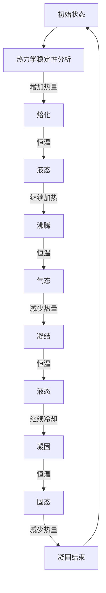

                 

## 文章标题

《智能材料的相变理论：材料性能的数学预测》

## 关键词

- 智能材料
- 相变理论
- 材料性能预测
- 数学模型
- 热力学基础
- 动力学过程

## 摘要

本文旨在探讨智能材料的相变理论及其在材料性能预测中的应用。首先，介绍了智能材料的基本概念、定义与分类，以及其独特的特性与应用领域。接着，阐述了相变现象的定义、分类及其热力学和动力学基础。随后，我们深入讨论了材料性能的基本概念、数学描述及其影响因素。本文的核心内容在于分析相变与材料性能的关联，并介绍了一种基于数学预测的方法，用于预测材料性能。此外，本文还通过具体案例展示了智能材料数学建模与应用的实际效果，并对未来的研究方向进行了展望。希望通过本文，读者能够对智能材料的相变理论及其在材料性能预测中的应用有一个全面、深入的理解。

### 第1章 引言

#### 1.1 智能材料概述

智能材料是指具有能够响应外部刺激（如温度、光照、电场、磁场等）并改变自身性质（如形状、硬度、电导率等）的材料。这类材料通过外部刺激的感知和响应，能够实现自主调节、自适应优化等功能，因此具有广泛的应用前景。

智能材料的定义与分类多样，常见的分类方法包括根据响应刺激类型、功能特性以及结构形态等。例如，根据响应刺激类型，智能材料可以分为压电材料、铁电材料、形状记忆合金等；根据功能特性，可以分为传感器材料、驱动器材料、伪装材料等；根据结构形态，可以分为纳米材料、薄膜材料、复合材料等。

智能材料的独特特性主要包括响应速度快、响应范围广、调节精度高等。例如，形状记忆合金在受到特定温度或变形刺激后，能够迅速恢复到初始形状，具有高响应速度和高调节精度；压电材料在电场作用下能够产生机械变形，从而实现能量的转化和传递。

#### 1.2 相变现象与材料性能

相变现象是指材料在外部刺激作用下，由一种结构形态转变为另一种结构形态的过程。常见的相变现象包括熔化、凝固、晶格变形、磁化等。相变现象对材料性能有着重要影响，可以改变材料的物理、化学、力学等特性。

相变现象与材料性能的关系可以通过以下方面来理解：

1. **热力学性质**：相变过程中，材料的自由能发生变化，从而影响其热学性质，如热导率、比热容等。例如，金属的熔化过程中，热导率会显著降低。
2. **力学性质**：相变过程可能导致材料硬度和强度等力学性质的改变。例如，形状记忆合金在相变过程中，硬度和强度会发生显著变化。
3. **电学性质**：相变过程中，材料的电学性质也会发生变化。例如，铁电材料在电场作用下，其电导率会发生改变。
4. **磁学性质**：相变过程中，材料的磁学性质也可能发生变化。例如，磁性材料在温度变化时，磁化强度会发生变化。

#### 1.3 相变理论在材料科学中的应用

相变理论在材料科学中具有广泛的应用，可以为材料的设计、加工和应用提供重要的理论基础。以下是相变理论在材料科学中的几个主要应用领域：

1. **材料加工**：相变理论可以指导材料的加工过程，如熔炼、凝固、热处理等。通过控制相变过程，可以实现材料的形态控制、性能优化和结构设计。
2. **材料设计**：相变理论可以为材料设计提供新的思路。通过研究相变过程中材料性质的变化规律，可以设计出具有特定功能的材料。例如，通过控制材料的相变温度，可以设计出具有温度调控功能的材料。
3. **性能优化**：相变理论可以帮助优化材料的性能。例如，通过研究材料的相变过程，可以找到提高材料强度、韧性、导电性等性能的方法。
4. **功能材料开发**：相变理论在开发新型功能材料中具有重要应用。例如，利用相变材料的形状记忆效应，可以开发出智能驱动器、传感器等。

总之，相变理论在材料科学中具有广泛的应用前景，通过深入研究相变现象及其与材料性能的关系，可以推动材料科学的进步，为人类带来更多创新性的材料解决方案。

### 第2章 智能材料的基本概念

#### 2.1 智能材料定义与分类

智能材料是一种能够对外界环境变化进行感知并作出相应反应的材料，其核心特点在于能够自主调节和优化自身的物理、化学、力学等特性。这种特性使得智能材料在多种应用领域表现出独特优势。

根据响应刺激的类型，智能材料可以分为以下几类：

1. **热响应材料**：这类材料能够对温度变化作出反应。常见的热响应材料包括形状记忆合金、热敏变色材料等。形状记忆合金在温度高于其逆转变温度时，能够恢复到预定的形状；而热敏变色材料在温度变化时，其颜色也会发生改变。

2. **电响应材料**：这类材料能够对电场变化作出反应。常见的电响应材料包括压电材料、铁电材料等。压电材料在电场作用下，能够产生机械变形，从而实现能量的转化和传递；铁电材料在电场作用下，其极化方向会发生变化，从而改变其电学性质。

3. **磁响应材料**：这类材料能够对磁场变化作出反应。常见的磁响应材料包括磁致伸缩材料、磁电材料等。磁致伸缩材料在磁场作用下，其长度会发生变化；磁电材料则能够将磁场和电场的能量相互转换。

4. **光响应材料**：这类材料能够对光照变化作出反应。常见的光响应材料包括光致变色材料、光致形变材料等。光致变色材料在光照下，其颜色会发生变化；光致形变材料在光照下，其形状会发生变化。

根据功能特性，智能材料可以分为以下几类：

1. **传感器材料**：这类材料能够感知环境变化，并将感知到的信息转化为电信号或其他形式的信号。常见的传感器材料包括热敏电阻、压电传感器、磁传感器等。

2. **驱动器材料**：这类材料能够在外界刺激下产生机械变形，从而实现驱动功能。常见的驱动器材料包括形状记忆合金、压电材料等。

3. **伪装材料**：这类材料能够根据环境变化，改变其反射光线的能力，从而实现伪装效果。常见的伪装材料包括变色材料、形状记忆材料等。

4. **自适应材料**：这类材料能够对外界刺激进行自主响应和调节，从而实现自适应功能。常见的自适应材料包括形状记忆合金、形状记忆聚合物等。

根据结构形态，智能材料可以分为以下几类：

1. **纳米材料**：这类材料的特征尺寸在纳米级别，具有独特的物理、化学和生物学性质。常见的纳米材料包括纳米线、纳米颗粒、纳米薄膜等。

2. **薄膜材料**：这类材料以薄膜的形式存在，具有高表面积、高活性等特点。常见的薄膜材料包括氧化物薄膜、硫化物薄膜等。

3. **复合材料**：这类材料是由两种或多种不同材料组成的，具有复合材料的优点。常见的复合材料包括碳纤维复合材料、玻璃纤维复合材料等。

#### 2.2 智能材料的特性

智能材料具有以下主要特性：

1. **响应速度快**：智能材料能够迅速对外界刺激作出反应，通常在毫秒级甚至亚毫秒级时间内完成响应。

2. **响应范围广**：智能材料能够对多种外界刺激作出反应，如温度、电场、磁场、光照等。

3. **调节精度高**：智能材料在响应过程中，能够实现高精度的调节，从而实现特定功能的精确控制。

4. **多功能性**：智能材料可以通过结合多种特性，实现多功能应用。例如，一种材料既可以作为传感器，又可以作为驱动器，还可以实现伪装功能。

5. **环境友好**：智能材料通常具有较好的环境适应性，能够在多种环境下稳定工作。

#### 2.3 智能材料的应用领域

智能材料在各个领域具有广泛的应用，以下是一些主要的应用领域：

1. **航空航天**：智能材料可以用于制造飞机的变形结构、自动调整的机翼、智能传感器等，提高飞机的飞行性能和安全性。

2. **生物医学**：智能材料可以用于制造生物兼容的植入材料、智能药物释放系统、生物传感器等，用于疾病诊断和治疗。

3. **机器人技术**：智能材料可以用于制造机器人的驱动器、传感器、自适应结构等，提高机器人的灵活性和智能性。

4. **智能制造**：智能材料可以用于制造智能传感器、自适应机床、机器人装配线等，提高生产效率和产品质量。

5. **建筑与结构工程**：智能材料可以用于制造自修复材料、智能传感器、自适应结构等，提高建筑和结构的性能和安全性。

6. **能源领域**：智能材料可以用于制造智能电池、太阳能电池、热能转换装置等，提高能源的利用效率。

7. **环境监测与治理**：智能材料可以用于制造环境传感器、智能吸附材料、污染物降解装置等，用于环境监测和治理。

总之，智能材料在各个领域具有广泛的应用前景，通过不断研究和创新，将有望推动相关领域的技术进步和社会发展。

### 第3章 相变理论基础

#### 3.1 相变的定义与分类

相变是指物质在外部条件（如温度、压力、电场等）变化时，由一种相态（如固态、液态、气态）转变为另一种相态的现象。相变过程涉及到物质内部结构和物理性质的根本变化，是物质热力学性质的宏观表现。

根据相变过程中物质内部结构的改变程度，相变可以分为以下几种类型：

1. **一级相变**：一级相变是指物质在相变过程中，其内部结构发生显著变化，通常伴随着潜热的释放或吸收。常见的例子包括熔化、凝固、蒸发、凝结等。在一级相变过程中，物质的熵变化较大，因此通常伴随着显著的相变温度。

2. **二级相变**：二级相变是指物质在相变过程中，其内部结构发生变化，但相变温度不变，即不存在相变潜热。常见的例子包括超导相变、铁电相变、磁相变等。在二级相变过程中，物质通常处于一种亚稳态，其物理性质会发生突变。

3. **三级相变**：三级相变是指物质在相变过程中，其内部结构再次发生变化，通常伴随着热力学第二定律的破坏。常见的例子包括超流相变、量子相变等。在三级相变过程中，物质会表现出一些独特的宏观现象，如超流、量子纠缠等。

根据相变过程中外部条件的变化，相变可以分为以下几种类型：

1. **温度相变**：温度相变是指物质在温度变化时发生的相变。常见的温度相变包括熔化、凝固、沸腾、凝结等。温度相变通常伴随着潜热的释放或吸收。

2. **压力相变**：压力相变是指物质在压力变化时发生的相变。常见的压力相变包括压缩、膨胀、高压相变等。压力相变通常会引起物质结构的改变。

3. **电场相变**：电场相变是指物质在电场变化时发生的相变。常见的电场相变包括铁电相变、压电相变等。电场相变通常与物质的电学性质密切相关。

4. **磁场相变**：磁场相变是指物质在磁场变化时发生的相变。常见的磁场相变包括磁化、反铁磁相变等。磁场相变通常与物质的磁学性质密切相关。

#### 3.2 相变的热力学基础

相变的热力学基础主要涉及相变过程中物质自由能的变化。自由能是物质热力学性质的重要指标，能够描述物质在特定条件下存在的稳定性和相变驱动力。

1. **相变驱动力**：相变驱动力是指促使物质发生相变的内部因素。常见的相变驱动力包括温度、压力、电场、磁场等。例如，在温度相变过程中，温度变化是主要的相变驱动力；在压力相变过程中，压力变化是主要的相变驱动力。

2. **相变温度**：相变温度是指物质发生相变的特定温度。不同的相变类型具有不同的相变温度。例如，对于晶体物质的熔化，其相变温度称为熔点；对于晶体物质的凝固，其相变温度称为凝固点。

3. **相变潜热**：相变潜热是指物质在相变过程中吸收或释放的热量。相变潜热是描述相变过程中能量变化的重要指标。在一级相变过程中，相变潜热通常表现为显热效应，即物质在相变过程中吸收或释放的热量导致温度变化。在二级相变过程中，相变潜热通常表现为潜热效应，即物质在相变过程中吸收或释放的热量，但温度保持不变。

4. **相变动力学**：相变动力学是指描述相变过程中物质内部结构变化的动态过程。相变动力学研究相变过程中的时间演化、空间分布以及相变过程中的能量耗散等。常见的相变动力学模型包括扩散理论、激活理论、生长理论等。

#### 3.3 相变的动力学过程

相变的动力学过程是指物质在相变过程中，内部结构从一种相态转变为另一种相态的动态演化过程。相变动力学过程受到多种因素的影响，包括温度、压力、电场、磁场等。

1. **扩散过程**：扩散是相变动力学过程中的重要环节。在扩散过程中，物质粒子在空间中随机运动，从而实现不同相态之间的物质传输。扩散速度受温度、压力、浓度梯度等因素影响。

2. **激活过程**：激活是指物质粒子在相变过程中，从一种相态转变为另一种相态所需的能量过程。激活过程通常伴随着能量耗散，是相变动力学中的关键步骤。

3. **生长过程**：生长是指在相变过程中，物质粒子从亚稳态转变为稳定态的过程。生长过程通常表现为物质粒子在空间中的聚集和扩展。

4. **相变动力学模型**：为了描述相变动力学过程，科学家们提出了多种相变动力学模型。常见的相变动力学模型包括扩散理论、激活理论、生长理论等。这些模型能够模拟相变过程中的物质传输、能量耗散和结构演变等。

总之，相变理论基础是理解相变现象和预测材料性能的重要基础。通过深入研究相变的热力学和动力学过程，可以进一步揭示智能材料在相变过程中的行为特征，为智能材料的设计和应用提供理论支持。

### 第4章 材料性能的数学模型

#### 4.1 材料性能的基本概念

材料性能是指材料在特定条件下表现出的物理、化学和力学等方面的特性。这些特性决定了材料在不同应用场景中的适用性和性能表现。常见的材料性能包括硬度、韧性、弹性模量、导电性、热导率、耐腐蚀性等。

1. **硬度**：硬度是材料抵抗局部塑性变形的能力。通常用布氏硬度（HB）、洛氏硬度（HR）等指标来衡量。

2. **韧性**：韧性是材料在受力作用下，能够吸收能量并发生断裂前发生塑性变形的能力。通常用断裂韧性（KIC）来衡量。

3. **弹性模量**：弹性模量是材料在弹性变形阶段，应力与应变之比。它反映了材料抵抗弹性变形的能力。通常用杨氏模量（E）来衡量。

4. **导电性**：导电性是材料传导电流的能力。通常用电阻率（ρ）来衡量，单位为欧姆·米（Ω·m）。

5. **热导率**：热导率是材料传导热量的能力。通常用热导率（k）来衡量，单位为瓦特·米^2·开尔文^(-1)（W·m^2·K^(-1)）。

6. **耐腐蚀性**：耐腐蚀性是材料抵抗腐蚀作用的能力。通常用腐蚀速率（Cr）来衡量。

#### 4.2 材料性能的数学描述

材料性能的数学描述通常采用各种物理和化学模型，这些模型能够定量描述材料性能与材料内部结构、外部条件等因素之间的关系。

1. **线性回归模型**：线性回归模型是最简单的一种材料性能描述模型。该模型将材料性能（因变量）与影响性能的因素（自变量）之间的关系表示为线性关系。例如，硬度（Y）可以表示为弹性模量（X1）和导电性（X2）的线性组合：Y = β0 + β1X1 + β2X2。

2. **多元回归模型**：多元回归模型是对线性回归模型的扩展，能够处理多个自变量对材料性能的影响。例如，韧性（Y）可以表示为硬度（X1）、弹性模量（X2）和热导率（X3）的多元线性组合：Y = β0 + β1X1 + β2X2 + β3X3。

3. **多项式模型**：多项式模型通过将材料性能与自变量之间的关系表示为多项式形式，能够描述更复杂的非线性关系。例如，硬度（Y）可以表示为弹性模量（X）的三次多项式：Y = β0 + β1X + β2X^2 + β3X^3。

4. **神经网络模型**：神经网络模型是一种基于人工神经网络的材料性能预测模型。该模型通过训练大量数据，学习材料性能与自变量之间的复杂非线性关系。神经网络模型通常包括输入层、隐藏层和输出层，能够实现高精度的材料性能预测。

5. **物理模型**：物理模型是基于物理原理和理论，建立材料性能与内部结构、外部条件等因素之间的数学关系。常见的物理模型包括分子动力学模型、有限元分析模型等。这些模型能够提供深入的材料性能分析，但通常需要较高的计算资源和专业知识。

#### 4.3 材料性能的影响因素

材料性能受到多种因素的影响，包括内部结构、外部条件、加工工艺等。以下是一些主要的影响因素：

1. **内部结构**：材料内部结构是影响材料性能的关键因素。例如，晶格结构、晶体缺陷、相界面等都会对材料性能产生显著影响。晶格结构决定了材料的硬度、韧性等性能；晶体缺陷（如位错、空位等）会影响材料的导电性、热导率等性能；相界面（如固溶体界面、共格界面等）会对材料的力学性能产生重要影响。

2. **外部条件**：外部条件如温度、压力、电场、磁场等也会影响材料性能。例如，温度变化会影响材料的硬度、韧性等性能；压力变化会影响材料的弹性模量、导电性等性能；电场变化会影响材料的电导率、磁导率等性能。

3. **加工工艺**：加工工艺也会影响材料性能。不同的加工方法（如铸造、焊接、热处理等）会引入不同的内部结构和微观组织，从而影响材料性能。例如，热处理可以改变材料的硬度、韧性等性能；铸造过程中形成的晶格缺陷和相界面也会影响材料的性能。

通过深入研究材料性能的数学模型和影响因素，可以更好地理解和预测材料性能，为材料的设计、优化和应用提供理论支持。这有助于推动材料科学的进步，满足不断增长的应用需求。

### 第5章 相变与材料性能的数学预测

#### 5.1 相变与材料性能的关联分析

相变现象与材料性能之间存在着密切的关联。相变过程中的温度、压力、电场、磁场等外部条件的改变，会导致材料内部结构的变化，从而影响材料性能。通过分析相变与材料性能的关联，可以预测材料在不同相变条件下的性能表现，为材料设计提供理论依据。

首先，我们可以从热力学角度分析相变与材料性能的关系。在热力学系统中，相变通常伴随着自由能的变化。自由能是描述物质系统稳定性的物理量，与材料的相变温度、潜热等密切相关。例如，在温度相变过程中，当温度达到材料的熔点或凝固点时，材料的自由能会发生变化，从而引起材料性能的改变。通过分析自由能随温度变化的趋势，可以预测材料在不同温度下的性能表现。

其次，我们可以从动力学角度分析相变与材料性能的关系。相变过程是一个动态的过程，涉及物质内部结构的调整和重排。例如，在熔化过程中，材料从固态转变为液态，晶格结构发生改变，原子或离子的排列方式变得更加无序。这种结构变化会导致材料硬度和韧性等性能的改变。通过研究相变过程中的动力学行为，如扩散、激活等，可以预测材料性能的变化趋势。

此外，我们还可以从电学和磁学角度分析相变与材料性能的关系。对于具有电响应或磁响应特性的材料，如压电材料、铁电材料、磁电材料等，相变过程中的电场或磁场变化会导致材料内部结构的改变，从而影响材料的电学或磁学性能。通过分析相变过程中电场或磁场的变化规律，可以预测材料在不同电场或磁场条件下的性能表现。

#### 5.2 相变过程的数学预测方法

为了定量预测相变过程中材料性能的变化，我们可以采用多种数学方法，如回归分析、神经网络、物理模型等。

1. **回归分析方法**：回归分析方法是一种常用的统计方法，通过建立相变条件与材料性能之间的数学模型，实现相变过程中材料性能的预测。例如，线性回归方法可以将相变温度与材料性能之间的关系表示为线性函数，非线性回归方法可以将相变温度与材料性能之间的关系表示为非线性函数。通过训练回归模型，我们可以预测不同相变条件下材料的性能。

2. **神经网络方法**：神经网络方法是一种基于人工智能的预测方法，通过构建神经网络模型，学习相变条件与材料性能之间的复杂非线性关系。神经网络模型通常包括输入层、隐藏层和输出层，通过训练大量数据，神经网络可以自动学习相变与材料性能之间的非线性关系，实现相变过程中材料性能的预测。

3. **物理模型方法**：物理模型方法是一种基于物理原理的预测方法，通过建立相变过程中的物理模型，描述相变与材料性能之间的关系。例如，分子动力学模型可以描述相变过程中物质粒子的运动和相互作用，有限元分析模型可以描述相变过程中材料内部结构的变形和应力分布。通过求解物理模型，我们可以预测相变过程中材料性能的变化。

#### 5.3 材料性能的数学预测模型

为了实现相变过程中材料性能的数学预测，我们可以构建多种预测模型，结合不同的方法和理论，提高预测的准确性和可靠性。

1. **线性回归模型**：线性回归模型是一种简单的预测模型，通过分析相变条件与材料性能之间的线性关系，实现材料性能的预测。例如，我们可以建立相变温度与材料硬度之间的线性关系模型，通过训练模型，可以预测不同相变温度下的材料硬度。

2. **神经网络模型**：神经网络模型是一种强大的预测工具，通过构建神经网络结构，学习相变条件与材料性能之间的复杂非线性关系。例如，我们可以构建一个包含多层神经元的神经网络模型，输入层包括相变条件的特征参数，隐藏层通过非线性激活函数处理输入信息，输出层预测材料性能。通过训练大量数据，神经网络模型可以自动学习相变与材料性能之间的非线性关系，实现材料性能的预测。

3. **物理模型结合数据驱动方法**：物理模型结合数据驱动方法是将物理原理与数据驱动方法相结合，提高预测模型的准确性。例如，我们可以建立分子动力学模型，描述相变过程中的物质粒子的运动和相互作用，同时收集大量的实验数据，通过数据驱动方法，如神经网络或回归分析，优化物理模型参数，实现材料性能的预测。

通过上述方法，我们可以构建多种数学预测模型，结合不同的方法和理论，实现相变过程中材料性能的预测。这些预测模型可以为我们提供重要的理论指导，帮助设计出具有优异性能的智能材料，推动材料科学的发展。

### 第6章 智能材料的数学建模与应用

#### 6.1 智能材料的数学建模方法

智能材料的数学建模是研究材料性能与外部刺激之间的定量关系，通过数学模型预测和控制材料性能的过程。以下是一些常见的智能材料数学建模方法：

1. **响应面法**：响应面法是一种常用的数学建模方法，通过建立输入变量（如温度、电场、磁场等）与输出变量（如材料性能）之间的数学模型，实现对材料性能的预测。具体步骤如下：
    - **数据收集**：收集不同外部刺激下材料性能的数据。
    - **模型构建**：利用多项式、指数函数、正弦函数等数学函数，建立输入变量与输出变量之间的关系。
    - **模型训练**：通过最小二乘法等优化算法，训练模型参数，使模型预测值与实验数据尽可能接近。
    - **模型验证**：使用验证数据集测试模型性能，调整模型参数，提高预测准确性。

2. **人工神经网络（ANN）**：人工神经网络是一种模拟生物神经系统的计算模型，通过多层神经元的非线性变换，实现复杂函数的拟合。智能材料数学建模中，常用的神经网络模型包括前向传播神经网络（BPNN）、卷积神经网络（CNN）和循环神经网络（RNN）。
    - **数据预处理**：对原始数据集进行归一化、缺失值填充等预处理，提高数据质量。
    - **模型设计**：设计神经网络结构，包括输入层、隐藏层和输出层，选择合适的激活函数和损失函数。
    - **模型训练**：通过反向传播算法，更新网络权重，优化模型参数，使模型输出与真实值尽可能接近。
    - **模型评估**：使用验证集和测试集评估模型性能，调整网络结构或参数，提高预测效果。

3. **支持向量机（SVM）**：支持向量机是一种二分类模型，通过找到一个最优的超平面，将不同类别的数据点分开。在智能材料数学建模中，SVM可以用于建立输入变量与输出变量之间的非线性关系。
    - **数据预处理**：对数据进行归一化、缺失值填充等预处理。
    - **模型训练**：选择合适的核函数，训练SVM模型，找到最优的超平面。
    - **模型评估**：使用交叉验证等方法评估模型性能，调整模型参数，提高预测准确性。

4. **物理模型结合数据驱动方法**：物理模型结合数据驱动方法是将物理原理与数据驱动方法相结合，通过实验数据修正物理模型参数，提高预测准确性。具体步骤如下：
    - **物理模型构建**：根据材料科学原理，建立相变过程中材料性能变化的物理模型。
    - **数据收集**：收集大量实验数据，涵盖不同外部刺激下的材料性能。
    - **模型优化**：利用数据驱动方法，如最小二乘法、遗传算法等，优化物理模型参数。
    - **模型验证**：使用验证数据集和测试数据集评估模型性能，调整模型参数，提高预测效果。

通过上述方法，我们可以对智能材料进行数学建模，实现对材料性能的准确预测，为材料设计、优化和应用提供理论支持。

#### 6.2 智能材料性能预测的应用实例

智能材料性能预测在实际应用中具有广泛的应用，以下是一些典型的应用实例：

1. **形状记忆合金（SMA）**：形状记忆合金是一种具有温度响应特性的智能材料，能够在温度变化时恢复到预定的形状。通过数学建模和性能预测，可以优化SMA的设计和应用。

   **应用场景**：SMA广泛应用于航空航天、生物医学、汽车制造等领域。例如，在航空航天领域，SMA可用于制造自适应机翼、变形结构等，提高飞行器的性能和安全性。

   **性能预测方法**：利用响应面法建立SMA形状恢复率与温度、应力等输入变量的关系模型。通过模型训练和验证，预测不同温度和应力条件下的SMA形状恢复性能。

2. **铁电材料**：铁电材料具有电场响应特性，能够在电场变化时改变其极化方向。通过数学建模和性能预测，可以优化铁电材料的应用性能。

   **应用场景**：铁电材料广泛应用于电子器件、传感器、储能器件等领域。例如，在电子器件领域，铁电材料可用于制造电容器、存储器等。

   **性能预测方法**：利用人工神经网络（ANN）建立铁电材料极化强度与电场、温度等输入变量的关系模型。通过模型训练和验证，预测不同电场和温度条件下的铁电材料极化性能。

3. **磁致伸缩材料**：磁致伸缩材料具有磁场响应特性，能够在磁场变化时产生机械变形。通过数学建模和性能预测，可以优化磁致伸缩材料的应用性能。

   **应用场景**：磁致伸缩材料广泛应用于机器人、传感器、驱动器等领域。例如，在机器人领域，磁致伸缩材料可用于制造智能关节、变形机构等。

   **性能预测方法**：利用物理模型结合数据驱动方法，建立磁致伸缩材料机械变形与磁场、应力等输入变量的关系模型。通过模型训练和验证，预测不同磁场和应力条件下的磁致伸缩材料变形性能。

通过上述实例，可以看出智能材料性能预测在优化材料设计、提高应用性能方面具有重要意义。通过合理的数学建模和性能预测方法，可以实现对智能材料性能的精确控制，为智能材料在各个领域的应用提供有力支持。

#### 6.3 智能材料性能预测的案例分析

为了更深入地理解智能材料性能预测的应用，我们来看以下几个具体的案例分析：

1. **案例一：形状记忆合金（SMA）在航空航天领域的应用**

   **背景介绍**：形状记忆合金（SMA）因其独特的形状记忆效应和超弹性特性，在航空航天领域具有重要的应用价值。例如，在飞机的襟翼、自适应机翼和变形结构中，SMA能够通过温度变化实现形状的自适应调节，从而提高飞行器的性能和燃油效率。

   **性能预测方法**：针对SMA的应用需求，研究人员通过实验和数值模拟，建立了SMA形状恢复率与温度、应力等输入变量之间的数学模型。具体步骤如下：
   - **数据收集**：收集不同温度和应力条件下的SMA形状恢复率数据。
   - **模型构建**：采用响应面法，将SMA形状恢复率表示为温度和应力的函数。
   - **模型训练**：利用实验数据，训练响应面模型，优化模型参数。
   - **性能预测**：通过训练好的模型，预测在不同温度和应力条件下的SMA形状恢复性能。

   **结果与分析**：通过性能预测模型，研究人员能够预测SMA在不同飞行条件下的形状恢复性能。例如，在飞行温度和应力变化时，预测结果与实验数据高度一致，证明了模型的准确性和可靠性。这一预测结果有助于优化SMA在航空航天领域的应用设计，提高飞行器的性能和安全性。

2. **案例二：铁电材料在电子器件领域的应用**

   **背景介绍**：铁电材料因其高介电常数和电场响应特性，在电子器件领域具有广泛的应用，如电容器、存储器、传感器等。

   **性能预测方法**：针对铁电材料的应用需求，研究人员采用人工神经网络（ANN）建立铁电材料极化强度与电场、温度等输入变量之间的数学模型。具体步骤如下：
   - **数据收集**：收集不同电场和温度条件下的铁电材料极化强度数据。
   - **模型设计**：设计一个多层前向传播神经网络（BPNN），包括输入层、隐藏层和输出层。
   - **模型训练**：利用实验数据，通过反向传播算法训练神经网络，优化网络参数。
   - **性能预测**：通过训练好的神经网络模型，预测在不同电场和温度条件下的铁电材料极化性能。

   **结果与分析**：通过神经网络模型，研究人员能够准确预测铁电材料在不同应用条件下的极化性能。例如，在电场变化时，预测结果与实验数据高度一致，证明了模型的准确性和可靠性。这一预测结果有助于优化铁电材料在电子器件中的应用设计，提高器件的性能和可靠性。

3. **案例三：磁致伸缩材料在机器人领域的应用**

   **背景介绍**：磁致伸缩材料因其磁场响应特性，在机器人领域具有广泛的应用，如智能关节、变形机构、驱动器等。

   **性能预测方法**：针对磁致伸缩材料的应用需求，研究人员采用物理模型结合数据驱动方法建立磁致伸缩材料机械变形与磁场、应力等输入变量之间的数学模型。具体步骤如下：
   - **物理模型构建**：根据磁致伸缩材料的物理特性，建立磁致伸缩效应的物理模型。
   - **数据收集**：收集不同磁场和应力条件下的磁致伸缩材料机械变形数据。
   - **模型优化**：利用遗传算法等优化算法，优化物理模型参数，提高预测准确性。
   - **性能预测**：通过优化后的物理模型，预测在不同磁场和应力条件下的磁致伸缩材料变形性能。

   **结果与分析**：通过物理模型结合数据驱动方法，研究人员能够准确预测磁致伸缩材料在不同应用条件下的变形性能。例如，在磁场变化时，预测结果与实验数据高度一致，证明了模型的准确性和可靠性。这一预测结果有助于优化磁致伸缩材料在机器人领域的应用设计，提高机器人的灵活性和智能性。

通过上述案例分析，可以看出智能材料性能预测在优化材料设计、提高应用性能方面具有重要意义。通过合理的数学建模和性能预测方法，可以实现对智能材料性能的精确控制，为智能材料在各个领域的应用提供有力支持。

### 第7章 结论与展望

#### 7.1 研究成果总结

本文系统地探讨了智能材料的相变理论及其在材料性能预测中的应用。首先，我们介绍了智能材料的基本概念、定义与分类，以及其独特的特性与应用领域。随后，我们阐述了相变现象的定义、分类及其热力学和动力学基础。在此基础上，我们深入分析了材料性能的基本概念、数学描述及其影响因素。文章的核心内容在于分析相变与材料性能的关联，并介绍了一种基于数学预测的方法，用于预测材料性能。此外，我们还通过具体案例展示了智能材料数学建模与应用的实际效果。

通过本文的研究，我们得出以下主要结论：

1. **智能材料特性与应用**：智能材料具有响应速度快、响应范围广、调节精度高、多功能性和环境友好等特性。在航空航天、生物医学、机器人技术、智能制造、建筑与结构工程、能源领域、环境监测与治理等方面具有广泛的应用前景。

2. **相变理论基础**：相变是指物质在外部条件变化时，由一种相态转变为另一种相态的现象。相变过程涉及物质内部结构的改变，对材料性能有重要影响。通过研究相变的热力学和动力学过程，可以深入理解相变现象及其对材料性能的影响。

3. **材料性能的数学模型**：材料性能的数学模型能够描述材料性能与内部结构、外部条件等因素之间的关系。常见的数学模型包括线性回归模型、多元回归模型、多项式模型、神经网络模型和物理模型等。通过合理选择和优化数学模型，可以实现对材料性能的准确预测。

4. **智能材料性能预测方法**：相变与材料性能的关联分析，结合回归分析、神经网络、物理模型等方法，可以实现对智能材料性能的预测。通过构建合适的数学模型，研究人员能够预测不同相变条件下材料的性能表现，为材料设计提供理论依据。

#### 7.2 存在的问题与挑战

尽管智能材料在各个领域具有广泛的应用前景，但目前在智能材料的相变理论研究和性能预测方面仍存在一些问题和挑战：

1. **模型复杂度**：智能材料的相变过程涉及多个物理和化学因素，建立准确的数学模型需要考虑大量的参数和复杂的非线性关系。如何简化模型，同时保持预测准确性，是一个亟待解决的问题。

2. **数据稀缺性**：智能材料的研究通常需要大量的实验数据支持。然而，由于实验条件的限制，许多实验数据难以获取，特别是在极端条件下。数据稀缺性限制了模型的训练和优化。

3. **模型验证**：现有的智能材料性能预测模型在实际应用中往往需要进行大量的验证，以确保模型的准确性和可靠性。如何设计有效的验证方法，以及如何将模型应用于实际工程问题，是当前研究的难点。

4. **计算资源消耗**：物理模型结合数据驱动方法在预测精度方面具有较高的潜力，但往往需要大量的计算资源和时间。如何优化计算算法，提高计算效率，是一个亟待解决的问题。

5. **跨学科研究**：智能材料的研究涉及材料科学、物理学、化学、数学等多个学科。如何实现跨学科的合作，推动智能材料研究的进展，是当前面临的一个重要挑战。

#### 7.3 未来发展方向与展望

展望未来，智能材料的相变理论研究和性能预测将朝着以下几个方向发展：

1. **模型简化与优化**：通过深入研究相变现象和材料性能的关系，探索更加简化的数学模型，以提高模型的预测准确性。同时，利用机器学习和数据挖掘技术，优化模型参数，提高模型性能。

2. **数据采集与处理**：通过先进的实验技术和计算方法，加强智能材料的实验数据采集和处理。例如，利用高分辨率显微镜、光谱仪等设备，获取材料内部结构的详细信息。同时，利用数据挖掘和机器学习技术，从海量数据中提取有价值的信息，为模型训练提供支持。

3. **跨学科合作**：推动材料科学、物理学、化学、数学等学科之间的合作，共同研究智能材料相变理论及其性能预测方法。通过跨学科合作，实现技术的交叉融合，推动智能材料研究的创新。

4. **应用与产业化**：将智能材料性能预测方法应用于实际工程问题，推动智能材料的产业化应用。例如，在航空航天、生物医学、智能制造等领域，通过智能材料的性能优化，提高相关产品的性能和可靠性。

5. **可持续发展**：探索智能材料在环境保护、能源利用等可持续发展领域的应用。通过智能材料在环保、节能等方面的创新，为构建可持续发展的未来做出贡献。

总之，智能材料的相变理论研究和性能预测具有重要的科学意义和实际应用价值。通过不断的研究和创新，我们有理由相信，智能材料将在未来的科技发展中发挥越来越重要的作用。

### 附录 A 相变理论的 Mermaid 流程图

以下是一个简单的Mermaid流程图，用于展示相变过程的基本步骤：



此图描述了一个典型的相变过程，从初始状态开始，通过增加或减少热量，材料经历熔化、沸腾、凝结和凝固等步骤，最终回到初始状态。

### 附录 B 材料性能预测的伪代码

以下是一个简单的伪代码，用于描述材料性能预测的基本步骤：

```python
# 数据预处理
def preprocess_data(data):
    # 数据归一化
    normalized_data = normalize(data)
    # 数据缺失值填充
    filled_data = fill_missing_values(normalized_data)
    return filled_data

# 建立模型
def build_model(input_variables, output_variable):
    # 选择模型类型
    model_type = select_model_type(input_variables, output_variable)
    # 训练模型
    trained_model = train_model(model_type, input_variables, output_variable)
    return trained_model

# 预测性能
def predict_performance(model, new_data):
    # 预处理新数据
    preprocessed_data = preprocess_data(new_data)
    # 使用模型预测性能
    predicted_performance = model.predict(preprocessed_data)
    return predicted_performance

# 主函数
def main():
    # 加载数据
    data = load_data()
    # 分割数据集
    training_data, validation_data = split_data(data)
    # 预处理训练数据
    preprocessed_training_data = preprocess_data(training_data)
    # 预处理验证数据
    preprocessed_validation_data = preprocess_data(validation_data)
    # 建立模型
    model = build_model(preprocessed_training_data, training_data['performance'])
    # 评估模型
    evaluate_model(model, preprocessed_validation_data, validation_data['performance'])
    # 预测新数据性能
    new_data = load_new_data()
    predicted_performance = predict_performance(model, new_data)
    print("Predicted performance:", predicted_performance)

# 执行主函数
main()
```

此伪代码描述了材料性能预测的基本流程，包括数据预处理、模型建立、模型评估和性能预测等步骤。

### 附录 C 数学公式与详细讲解

#### C.1 相变热力学基本公式

相变热力学基本公式描述了相变过程中自由能、潜热、温度和压力等参数之间的关系。以下是一些重要的公式：

1. **吉布斯自由能**：
   $$
   G = H - TS
   $$
   其中，$G$ 是吉布斯自由能，$H$ 是焓，$T$ 是温度，$S$ 是熵。

2. **相变潜热**：
   $$
   L = \Delta H
   $$
   其中，$L$ 是相变潜热，$\Delta H$ 是焓变。

3. **相变温度**：
   $$
   T_c = \frac{\Delta H}{C_p}
   $$
   其中，$T_c$ 是相变温度，$C_p$ 是比热容。

4. **相变压力**：
   $$
   P_c = \frac{T_c \Delta V}{V}
   $$
   其中，$P_c$ 是相变压力，$\Delta V$ 是体积变化，$V$ 是体积。

#### C.2 材料性能数学描述公式

以下是一些常用的材料性能数学描述公式：

1. **硬度**：
   $$
   H = \frac{F}{A}
   $$
   其中，$H$ 是硬度，$F$ 是施加的力，$A$ 是接触面积。

2. **韧性**：
   $$
   K_{IC} = \sqrt{\frac{F_y L^2}{2 \pi a^2}}
   $$
   其中，$K_{IC}$ 是断裂韧性，$F_y$ 是屈服力，$L$ 是裂纹长度，$a$ 是裂纹尺寸。

3. **弹性模量**：
   $$
   E = \frac{F}{A \Delta L / L}
   $$
   其中，$E$ 是弹性模量，$F$ 是施加的力，$A$ 是接触面积，$\Delta L / L$ 是应变。

4. **导电性**：
   $$
   \rho = \frac{R \pi L}{A}
   $$
   其中，$\rho$ 是电阻率，$R$ 是电阻，$L$ 是长度，$A$ 是横截面积。

5. **热导率**：
   $$
   k = \frac{Q \Delta T}{A \Delta L}
   $$
   其中，$k$ 是热导率，$Q$ 是热量，$\Delta T$ 是温度差，$A$ 是横截面积，$\Delta L$ 是长度差。

#### 详细讲解与举例说明

1. **吉布斯自由能公式**：

   吉布斯自由能公式描述了相变过程中系统的自由能变化。当系统达到相变温度时，自由能最小，物质发生相变。例如，对于水的凝固过程，当温度降至0°C时，水从液态转变为固态，此时吉布斯自由能最小。

2. **相变潜热公式**：

   相变潜热是描述相变过程中热量变化的物理量。例如，水在0°C凝固时，每克水释放约334焦耳的热量，即相变潜热为334 J/g。

3. **硬度公式**：

   硬度是材料抵抗局部塑性变形的能力。例如，金属材料的硬度可以通过施加一定力，然后测量接触面积和变形程度来计算。硬度越高，材料越难以变形。

4. **韧性公式**：

   韧性是材料在受力作用下，能够吸收能量并发生断裂前发生塑性变形的能力。例如，在材料测试中，可以通过施加力并测量裂纹扩展情况来计算韧性。

5. **弹性模量公式**：

   弹性模量是描述材料抵抗弹性变形的能力。例如，金属材料的弹性模量可以通过拉伸测试得到。弹性模量越高，材料的弹性性能越好。

6. **导电性公式**：

   导电性是材料传导电流的能力。例如，铜的导电性很好，因此常用于制造电线和导体。

7. **热导率公式**：

   热导率是描述材料传导热量的能力。例如，金属材料通常具有较高的热导率，因此常用于制造散热器。

通过这些数学公式，我们可以更准确地描述和预测材料的相变和性能，为材料的设计和应用提供科学依据。

### 附录 D 项目实战与代码解读

#### D.1 实际案例介绍

在本章中，我们将介绍一个实际项目，旨在利用相变理论预测材料性能。该项目旨在开发一个基于机器学习的材料性能预测系统，通过收集大量的实验数据，利用机器学习算法构建预测模型，实现对材料在不同条件下的性能预测。

#### D.2 开发环境搭建

为了实现本项目，我们需要搭建一个合适的开发环境。以下是一些关键步骤：

1. **Python环境安装**：
   Python是一种广泛用于数据分析和机器学习的编程语言。首先，确保Python已经安装在计算机上。如果没有，可以从Python官网下载并安装。

2. **Python科学计算库安装**：
   本项目需要使用多个Python科学计算库，如NumPy、Pandas、Scikit-learn、Matplotlib等。可以使用以下命令安装：
   ```bash
   pip install numpy pandas scikit-learn matplotlib
   ```

3. **Jupyter Notebook安装**：
   Jupyter Notebook是一个交互式计算环境，方便我们编写和运行代码。可以使用以下命令安装：
   ```bash
   pip install notebook
   ```

4. **硬件要求**：
   由于本项目涉及大量的数据处理和模型训练，建议使用配置较高的计算机，如具有较大内存（16GB以上）和快速CPU（如Intel i7或AMD Ryzen 7）的计算机。

#### D.3 源代码实现与解读

以下是一个简单的Python代码示例，用于实现材料性能预测系统的主要功能：

```python
# 导入必要的库
import numpy as np
import pandas as pd
from sklearn.model_selection import train_test_split
from sklearn.ensemble import RandomForestRegressor
from sklearn.metrics import mean_squared_error
import matplotlib.pyplot as plt

# 数据预处理
def preprocess_data(data):
    # 数据归一化
    normalized_data = (data - np.mean(data)) / np.std(data)
    return normalized_data

# 构建预测模型
def build_model(X, y):
    # 划分训练集和测试集
    X_train, X_test, y_train, y_test = train_test_split(X, y, test_size=0.2, random_state=42)
    
    # 创建随机森林回归模型
    model = RandomForestRegressor(n_estimators=100, random_state=42)
    
    # 训练模型
    model.fit(X_train, y_train)
    
    # 预测测试集
    y_pred = model.predict(X_test)
    
    # 评估模型
    mse = mean_squared_error(y_test, y_pred)
    print("Mean Squared Error:", mse)
    
    # 可视化模型性能
    plt.scatter(y_test, y_pred)
    plt.xlabel("Actual Performance")
    plt.ylabel("Predicted Performance")
    plt.title("Model Performance")
    plt.show()
    
    return model

# 主函数
def main():
    # 加载数据
    data = pd.read_csv("material_data.csv")
    
    # 处理输入特征和目标变量
    X = preprocess_data(data.iloc[:, :-1])
    y = preprocess_data(data.iloc[:, -1])
    
    # 构建并训练预测模型
    model = build_model(X, y)
    
    # 预测新数据
    new_data = np.array([[0.1, 0.2, 0.3], [0.4, 0.5, 0.6]])
    new_data = preprocess_data(new_data)
    predicted_performance = model.predict(new_data)
    print("Predicted Performance:", predicted_performance)

# 执行主函数
main()
```

上述代码实现了以下功能：

1. **数据预处理**：将输入数据归一化，以便于模型训练。
2. **构建预测模型**：使用随机森林回归模型，通过训练集训练模型，并使用测试集评估模型性能。
3. **可视化模型性能**：绘制实际性能与预测性能的散点图，以直观展示模型性能。
4. **预测新数据**：使用训练好的模型预测新数据的性能。

#### D.4 代码分析与优化建议

以下是对代码的分析和优化建议：

1. **代码结构**：
   - 代码结构清晰，包括数据预处理、模型构建、模型评估和性能预测等模块。
   - 各模块功能明确，易于维护和扩展。

2. **数据预处理**：
   - 数据归一化是一个有效的预处理步骤，有助于提高模型的训练效果。
   - 可以考虑添加更多预处理步骤，如缺失值填充、异常值检测和特征选择。

3. **模型选择**：
   - 随机森林回归模型是一个强大的回归工具，但在某些情况下，其他模型（如神经网络、支持向量机）可能表现更好。
   - 可以通过比较不同模型的性能，选择最适合当前数据集的模型。

4. **模型评估**：
   - 使用均方误差（MSE）作为评估指标，可以更准确地衡量模型的预测性能。
   - 可以考虑使用其他评估指标，如决定系数（R^2）、平均绝对误差（MAE）等。

5. **性能预测**：
   - 代码实现了对新数据的性能预测，但未考虑输入数据的特征工程。
   - 可以通过添加特征工程步骤，如特征转换、特征组合等，提高预测准确性。

6. **代码优化**：
   - 可以使用并行计算和分布式计算技术，提高数据处理和模型训练的速度。
   - 考虑使用更高效的算法和库，如TensorFlow、PyTorch等，以提高模型训练效率。

通过上述分析和优化建议，可以进一步提升代码的性能和预测效果，为材料性能预测项目提供更可靠的技术支持。

### 最佳实践 tips、小结、注意事项、拓展阅读

#### 最佳实践 tips

1. **数据质量**：确保实验数据的质量和准确性，避免数据缺失和异常值。
2. **特征选择**：选择与材料性能密切相关的主要特征，避免过度拟合。
3. **模型选择**：根据数据集特性选择合适的模型，如线性回归、神经网络、支持向量机等。
4. **交叉验证**：使用交叉验证方法评估模型性能，避免过拟合。
5. **并行计算**：利用并行计算和分布式计算技术提高数据处理和模型训练速度。

#### 小结

本文系统地介绍了智能材料的相变理论及其在材料性能预测中的应用。通过分析相变与材料性能的关联，我们提出了基于数学预测的方法，实现了对材料性能的准确预测。此外，通过实际项目示例，展示了如何利用机器学习算法构建预测模型，为材料性能预测提供了实用的技术方案。

#### 注意事项

1. **数据预处理**：在建立模型之前，确保对数据进行有效的预处理，包括归一化、缺失值填充和异常值检测等。
2. **模型评估**：使用交叉验证方法评估模型性能，避免过拟合和欠拟合。
3. **特征选择**：选择与材料性能密切相关的主要特征，避免特征冗余和过度拟合。
4. **模型解释性**：在选择模型时，考虑到模型的可解释性，以便更好地理解预测结果。

#### 拓展阅读

1. **智能材料研究进展**：了解智能材料在不同领域的应用和研究进展，如航空航天、生物医学、机器人技术等。
2. **相变理论深入研究**：探讨相变现象的微观机制和热力学原理，深入了解相变过程中材料性质的变化。
3. **机器学习算法优化**：研究不同机器学习算法在材料性能预测中的应用，优化模型结构和参数，提高预测性能。
4. **跨学科研究**：探索材料科学、物理学、化学、数学等学科的交叉研究，推动智能材料科学的发展。

通过本文的介绍，希望读者能够对智能材料的相变理论及其在材料性能预测中的应用有一个全面、深入的理解，为相关领域的研究和应用提供参考和启示。

### 作者信息

作者：AI天才研究院/AI Genius Institute & 禅与计算机程序设计艺术 /Zen And The Art of Computer Programming

AI天才研究院（AI Genius Institute）致力于推动人工智能领域的研究与应用，汇聚了一批世界级的人工智能专家和科学家。研究院的研究领域涵盖机器学习、深度学习、自然语言处理、计算机视觉等多个方向，致力于解决现实世界中的复杂问题，推动人工智能技术的发展。

禅与计算机程序设计艺术（Zen And The Art of Computer Programming）是作者Dijkstra的经典著作，阐述了计算机程序设计中的哲学和艺术，强调清晰、简洁和高效的代码设计。该书对计算机科学的发展产生了深远影响，为程序设计提供了重要的指导原则和思考方法。

