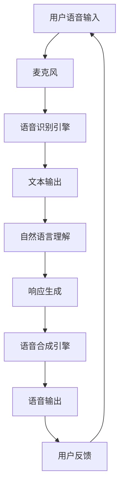
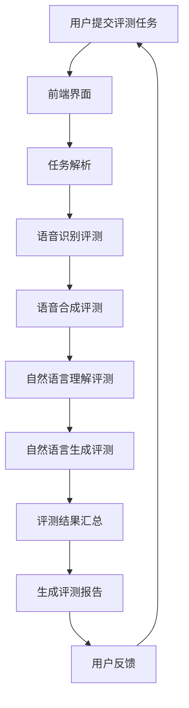

                 

### 文章标题

# 智能语音助手多语言支持评测平台

关键词：智能语音助手、多语言支持、评测平台、语音识别、语音合成、自然语言理解、自然语言生成

摘要：本文深入探讨了智能语音助手多语言支持评测平台的设计与实现，旨在为开发者提供一个全面的评测工具，以评估和优化智能语音助手在多语言环境中的性能。文章首先介绍了智能语音助手的发展历程、关键技术和应用场景，然后详细描述了智能语音助手的架构与组件，接着分析了多语言支持的关键技术，最后详细阐述了评测平台的设计与实现、应用案例以及未来发展趋势。通过本文的阅读，读者将全面了解智能语音助手多语言支持的现状和未来发展方向。

### 智能语音助手概述

智能语音助手是一种通过语音交互实现人机交互的智能系统，能够识别用户的语音指令，并理解、执行相应的任务。智能语音助手的发展历程可以追溯到20世纪50年代，当时的计算机科学家开始探索如何使计算机能够理解人类的语言。随着计算机技术的进步，语音识别和自然语言处理技术得到了快速发展，智能语音助手也逐渐走进了人们的日常生活。

#### 1.1 智能语音助手发展历程

1. **早期探索（20世纪50年代-80年代）**：早期的智能语音助手主要是基于规则系统的，通过预定义的指令和规则来处理用户的语音输入。这一阶段的代表作品是IBM的Speechoid，它于1961年首次亮相，能够理解和执行简单的指令。

2. **语音识别技术突破（20世纪90年代）**：随着语音识别技术的突破，智能语音助手开始能够处理更加复杂和自然的语音指令。1997年，IBM的沃森计算机在《危险边缘》节目中击败了人类冠军，展示了语音识别和自然语言处理技术的巨大潜力。

3. **智能语音助手兴起（21世纪初至今）**：随着移动互联网和智能手机的普及，智能语音助手开始广泛应用于各种场景，如智能家居、移动设备、车载系统等。苹果的Siri、谷歌的Google Assistant和亚马逊的Alexa等成为了智能语音助手的代表。

#### 1.2 智能语音助手的关键技术

1. **语音识别**：语音识别是将语音信号转换为文本的过程。这一过程涉及到声学模型和语言模型。声学模型用于将语音信号映射到声学特征，而语言模型则用于将声学特征映射到文本。目前，深度学习技术在语音识别中得到了广泛应用，尤其是卷积神经网络（CNN）和递归神经网络（RNN）。

2. **语音合成**：语音合成是将文本转换为语音信号的过程。语音合成技术主要包括参数合成和波形合成。参数合成通过合成参数来生成语音，而波形合成则通过合成语音波形来生成语音。近年来，深度学习技术，特别是生成对抗网络（GAN），在语音合成中得到了广泛应用。

3. **自然语言理解**：自然语言理解是指计算机理解和解释自然语言的能力。这包括实体识别、关系抽取、情感分析等任务。深度学习技术在自然语言理解中得到了广泛应用，如BERT、GPT等预训练模型。

4. **自然语言生成**：自然语言生成是指计算机生成自然语言文本的能力。这包括机器翻译、问答系统、文本摘要等任务。深度学习技术，尤其是序列到序列（Seq2Seq）模型，在自然语言生成中得到了广泛应用。

#### 1.3 智能语音助手的应用场景

1. **智能家居**：智能语音助手可以通过语音指令控制智能家居设备，如灯光、空调、电视等。

2. **移动设备**：智能语音助手可以辅助用户进行电话拨号、发送短信、设置提醒等操作。

3. **车载系统**：智能语音助手可以为驾驶员提供导航、播放音乐、接打电话等服务，从而提高行车安全。

4. **客服系统**：智能语音助手可以用于自动回答用户常见问题，减少人工客服的工作量。

5. **教育领域**：智能语音助手可以为学生提供学习辅助，如答疑、辅导、课程推荐等。

6. **医疗领域**：智能语音助手可以辅助医生进行病历记录、病情分析、药品推荐等操作。

通过本文的概述部分，读者可以了解到智能语音助手的发展历程、关键技术以及应用场景。在接下来的部分，我们将详细探讨智能语音助手的架构与组件，以及多语言支持的关键技术。

### 智能语音助手架构与组件

智能语音助手的架构通常包括语音识别、语音合成、自然语言理解和自然语言生成等关键组件。这些组件相互协作，共同实现智能语音助手的语音交互功能。本节将详细介绍这些组件的工作原理和相互关系。

#### 2.1 智能语音助手整体架构

智能语音助手的整体架构可以分为前端、后端和云端三个部分。

1. **前端**：前端主要负责接收用户的语音输入，并将其转换为文本。前端通常包括麦克风、语音识别引擎和文本输入界面。语音识别引擎是前端的核心组件，它负责将语音信号转换为文本。

2. **后端**：后端主要负责处理用户的文本输入，并生成相应的响应。后端通常包括自然语言理解、自然语言生成和语音合成引擎。自然语言理解组件负责解析用户的文本输入，提取关键信息，如意图、实体和情感等。自然语言生成组件负责生成符合用户需求的响应文本。语音合成引擎负责将文本转换为语音信号，输出给用户。

3. **云端**：云端负责存储和管理语音识别、自然语言理解和语音合成模型。云端还提供实时更新和优化这些模型的能力。通过云端，智能语音助手可以实现跨设备、跨平台的应用。


#### 2.2 语音识别与语音合成组件

1. **语音识别组件**

语音识别组件是智能语音助手的前端部分，主要负责将用户的语音输入转换为文本。语音识别组件的工作流程通常包括以下几个步骤：

- **预声学处理**：包括去除噪声、静音填充等，以提高语音识别的准确率。
- **声学特征提取**：将语音信号转换为声学特征，如梅尔频率倒谱系数（MFCC）。
- **声学模型**：将声学特征映射到文本的概率分布。
- **语言模型**：结合声学模型和用户的语音输入，生成最终的文本输出。

常用的语音识别模型包括隐马尔可夫模型（HMM）、高斯混合模型（GMM）和深度神经网络（DNN）等。近年来，基于深度学习的语音识别模型，如卷积神经网络（CNN）和递归神经网络（RNN），在语音识别领域取得了显著的进展。

2. **语音合成组件**

语音合成组件是智能语音助手的后端部分，主要负责将文本转换为语音信号，输出给用户。语音合成组件的工作流程通常包括以下几个步骤：

- **文本处理**：将用户的文本输入进行处理，如分词、标点符号添加等。
- **语调生成**：根据文本内容和上下文，生成适当的语调。
- **发音规则**：根据文本内容和语调，生成发音规则。
- **声学模型**：将发音规则转换为声学特征。
- **波形生成**：将声学特征转换为语音波形。

常用的语音合成模型包括参数合成和波形合成。参数合成通过合成参数来生成语音，而波形合成则通过合成语音波形来生成语音。近年来，深度学习技术，特别是生成对抗网络（GAN），在语音合成中得到了广泛应用，使得语音合成质量得到了显著提升。


#### 2.3 自然语言理解与生成组件

1. **自然语言理解组件**

自然语言理解组件是智能语音助手的核心部分，主要负责解析用户的文本输入，提取关键信息，如意图、实体和情感等。自然语言理解组件的工作流程通常包括以下几个步骤：

- **词法分析**：将文本分解为单词和标点符号。
- **句法分析**：分析单词之间的语法关系，构建句法树。
- **语义分析**：将句法树转换为语义表示，提取意图和实体。
- **情感分析**：根据语义表示，分析用户的情感状态。

常用的自然语言理解模型包括基于规则的方法、统计方法和深度学习方法。近年来，预训练模型，如BERT、GPT等，在自然语言理解领域取得了显著的成果。

2. **自然语言生成组件**

自然语言生成组件是智能语音助手的后端部分，主要负责生成符合用户需求的响应文本。自然语言生成组件的工作流程通常包括以下几个步骤：

- **意图识别**：根据用户的文本输入，识别用户的意图。
- **实体抽取**：从用户的文本输入中提取关键实体。
- **模板匹配**：根据用户的意图和实体，选择合适的响应模板。
- **文本生成**：根据响应模板，生成最终的响应文本。

常用的自然语言生成模型包括规则方法、统计方法和深度学习方法。近年来，预训练模型，如GPT-3等，在自然语言生成领域取得了显著的成果。


#### 2.4 多语言支持框架

智能语音助手的多语言支持框架需要考虑以下几个关键方面：

1. **语言模型**：语言模型用于处理不同语言的文本输入和输出。智能语音助手需要支持多种语言模型，以便能够处理多种语言的语音输入和文本输出。

2. **翻译模型**：翻译模型用于将一种语言的文本翻译成另一种语言。智能语音助手需要支持多种翻译模型，以便能够处理跨语言的语音识别和语音合成。

3. **语音识别模型与语音合成模型**：语音识别模型和语音合成模型需要支持多种语言，以便能够处理多种语言的语音输入和输出。

4. **自然语言理解与生成模型**：自然语言理解与生成模型需要支持多种语言，以便能够处理多种语言的文本输入和输出。


通过以上对智能语音助手架构与组件的详细分析，我们可以看到，智能语音助手的多语言支持需要考虑多个方面的技术，包括语音识别、语音合成、自然语言理解和自然语言生成等。在接下来的部分，我们将进一步探讨多语言支持的关键技术。

### 多语言支持的关键技术

多语言支持是智能语音助手的重要功能之一，它使得智能语音助手能够在全球范围内广泛应用。多语言支持的关键技术包括语言模型、翻译模型、语音识别模型和语音合成模型。本节将详细讨论这些技术及其在智能语音助手中的应用。

#### 3.1 语言模型与翻译模型

1. **语言模型**

语言模型是自然语言处理的基础，它用于预测文本序列的概率。在多语言支持中，语言模型必须能够处理多种语言的文本输入和输出。语言模型通常分为统计语言模型和神经网络语言模型。

- **统计语言模型**：统计语言模型基于文本数据，通过计算单词的共现概率来预测文本序列的概率。常见的统计语言模型包括N元语法（N-gram）和隐马尔可夫模型（HMM）。

  伪代码示例：
  ```python
  def n_gram_model(text, n):
      n_grams = {}
      for i in range(len(text) - n + 1):
          n_gram = tuple(text[i:i+n])
          if n_gram in n_grams:
              n_grams[n_gram] += 1
          else:
              n_grams[n_gram] = 1
      return n_grams
  ```

- **神经网络语言模型**：神经网络语言模型，如循环神经网络（RNN）和Transformer，通过学习大量文本数据，生成文本序列的概率分布。Transformer模型由于其并行化和自我注意力机制，在语言模型中得到了广泛应用。

  伪代码示例：
  ```python
  import tensorflow as tf

  def transformer_model(inputs, d_model, num_heads, dff, input_vocab_size, position_encoding):
      # 自注意力机制
      attention = tf.keras.layers.MultiHeadAttention(num_heads=num_heads, key_dim=d_model)(inputs, inputs)

      # 前馈神经网络
      x = tf.keras.layers.Dense(dff, activation='relu')(attention)
      x = tf.keras.layers.Dense(d_model)(x)

      # 残差连接和层归一化
      output = x + inputs
      output = tf.keras.layers.LayerNormalization(epsilon=1e-6)(output)

      return output
  ```

2. **翻译模型**

翻译模型用于将一种语言的文本翻译成另一种语言。常见的翻译模型包括基于短语的翻译模型、基于例句的翻译模型和基于神经网络的翻译模型。

- **基于短语的翻译模型**：基于短语的翻译模型通过查找和替换短语来实现文本翻译。它通常使用大量的双语文本数据来构建短语库。

  伪代码示例：
  ```python
  def phrase_based_model(source_text, target_text, phrase_table):
      translated_sentence = ""
      for word in source_text.split():
          translated_word = phrase_table.get(word, word)
          translated_sentence += translated_word + " "
      return translated_sentence.strip()
  ```

- **基于例句的翻译模型**：基于例句的翻译模型通过学习大量的双语文本例句来预测目标语言的句子。它通常使用统计方法来计算句子之间的相似性。

  伪代码示例：
  ```python
  def sentence_based_model(source_sentence, target_sentences, similarity_function):
      max_similarity = 0
      best_target_sentence = None
      for target_sentence in target_sentences:
          similarity = similarity_function(source_sentence, target_sentence)
          if similarity > max_similarity:
              max_similarity = similarity
              best_target_sentence = target_sentence
      return best_target_sentence
  ```

- **基于神经网络的翻译模型**：基于神经网络的翻译模型，如序列到序列（Seq2Seq）模型和注意力机制模型，通过学习大量的双语文本数据来生成目标语言的句子。这些模型在翻译质量上取得了显著的提升。

  伪代码示例：
  ```python
  import tensorflow as tf

  def seq2seq_model(encoder_inputs, decoder_inputs, encoder_states, decoder_state, d_model, num_heads, dff, input_vocab_size, target_vocab_size, position_encoding):
      # 编码器
      encoder_outputs, encoder_state = tf.keras.layers.TransformerEncoder(
          num_heads=num_heads, key_dim=d_model)(encoder_inputs, encoder_states)

      # 解码器
      decoder_outputs, decoder_state = tf.keras.layers.TransformerDecoder(
          num_heads=num_heads, key_dim=d_model, dff=dff)(decoder_inputs, decoder_state, encoder_outputs)

      # 输出层
      logits = tf.keras.layers.Dense(target_vocab_size)(decoder_outputs)

      return logits, decoder_state
  ```

#### 3.2 语音识别模型与语音合成模型

1. **语音识别模型**

语音识别模型用于将用户的语音输入转换为文本。语音识别模型通常分为声学模型和语言模型。声学模型用于将语音信号转换为声学特征，而语言模型用于将声学特征映射到文本。

- **声学模型**：声学模型通过学习大量语音数据，将语音信号转换为声学特征。深度学习技术在声学模型中得到了广泛应用，如卷积神经网络（CNN）和递归神经网络（RNN）。

  伪代码示例：
  ```python
  import tensorflow as tf

  def acoustic_model(voice_data, d_model, num_layers, num_filters, filter_sizes):
      # 卷积层
      conv layer = tf.keras.layers.Conv1D(filters=num_filters, kernel_size=filter_sizes)(voice_data)
      conv layer = tf.keras.layers.BatchNormalization()(conv layer)
      conv layer = tf.keras.layers.Activation('relu')(conv layer)

      # 递归层
      recurrent layer = tf.keras.layers.LSTM(units=d_model, return_sequences=True)(conv layer)

      # 密集层
      dense layer = tf.keras.layers.Dense(units=d_model)(recurrent layer)

      return dense layer
  ```

- **语言模型**：语言模型用于将声学特征映射到文本。语言模型通常使用统计方法，如N元语法（N-gram），或深度学习方法，如Transformer。

  伪代码示例：
  ```python
  import tensorflow as tf

  def language_model(acoustic_features, d_model, input_vocab_size):
      # 自注意力机制
      attention = tf.keras.layers.MultiHeadAttention(num_heads=8, key_dim=d_model)(acoustic_features, acoustic_features)

      # 前馈神经网络
      x = tf.keras.layers.Dense(units=512, activation='relu')(attention)
      x = tf.keras.layers.Dense(units=d_model)(x)

      # 输出层
      logits = tf.keras.layers.Dense(units=input_vocab_size)(x)

      return logits
  ```

2. **语音合成模型**

语音合成模型用于将文本转换为语音。语音合成模型通常分为参数合成模型和波形合成模型。参数合成模型通过合成参数来生成语音，而波形合成模型通过合成语音波形来生成语音。

- **参数合成模型**：参数合成模型通过合成参数来生成语音。参数合成模型包括线性预测编码（LPC）、共振峰建模（PBAP）等。

  伪代码示例：
  ```python
  def parameter_synthesis_model(params, d_model, duration, frame_rate):
      # 生成语音帧
      speech_frames = []

      for t in range(duration * frame_rate):
          # 计算语音帧
          speech_frame = synthesis_frame(params, t)

          speech_frames.append(speech_frame)

      # 合并语音帧
      speech_waveform = np.concatenate(speech_frames)

      return speech_waveform
  ```

- **波形合成模型**：波形合成模型通过合成语音波形来生成语音。波形合成模型包括隐马尔可夫模型（HMM）和高斯混合模型（GMM）等。

  伪代码示例：
  ```python
  import numpy as np

  def waveform_synthesis_model(voice_data, model_params, frame_rate):
      # 生成语音帧
      speech_frames = []

      for t in range(len(voice_data) // frame_rate):
          # 计算语音帧
          speech_frame = generate_speech_frame(voice_data[t], model_params)

          speech_frames.append(speech_frame)

      # 合并语音帧
      speech_waveform = np.concatenate(speech_frames)

      return speech_waveform
  ```

#### 3.3 跨语言语音识别与语音合成

跨语言语音识别与语音合成是指在不同语言之间进行语音识别和语音合成的技术。跨语言语音识别与语音合成需要考虑以下关键问题：

1. **多语言数据集**：跨语言语音识别与语音合成需要大量的多语言数据集来训练模型。这些数据集应该涵盖多种语言的语音信号，以便模型能够适应不同的语言环境。

2. **翻译模型**：跨语言语音识别与语音合成需要使用翻译模型将一种语言的语音信号翻译成另一种语言的语音信号。翻译模型应该能够处理不同语言的语音信号，以便能够实现跨语言的语音识别和语音合成。

3. **多语言模型融合**：为了提高跨语言语音识别与语音合成的准确性，需要使用多语言模型融合技术。多语言模型融合技术通过将不同语言的模型进行融合，生成一个适应多种语言的模型。

  伪代码示例：
  ```python
  def multi_language_model_fusion(language_models, weights):
      fused_model = tf.keras.Model(inputs=[model.inputs for model in language_models], outputs=[model outputs for model in language_models])

      # 权重求和
      fused_model.outputs = [tf.reduce_sum([weight * output for weight, output in zip(weights, fused_model.outputs)], axis=0) for output in fused_model.outputs]

      return fused_model
  ```

通过以上对多语言支持关键技术的详细讨论，我们可以看到，多语言支持需要考虑多个方面的技术，包括语言模型、翻译模型、语音识别模型和语音合成模型。在接下来的部分，我们将详细探讨多语言支持评测平台的设计与实现。

### 多语言支持评测平台设计

多语言支持评测平台是智能语音助手开发者的重要工具，用于评估和优化智能语音助手在不同语言环境中的性能。一个高效的多语言支持评测平台能够提供全面的评测指标，帮助开发者发现和解决多语言支持中的问题。本节将详细描述多语言支持评测平台的架构设计、评测指标和方法。

#### 4.1 评测平台架构设计

多语言支持评测平台的架构设计需要考虑评测功能、数据管理、评测指标和评测工具等多个方面。以下是一个典型的多语言支持评测平台的架构设计：


1. **前端界面**：前端界面是用户与评测平台交互的入口，用户可以通过前端界面提交评测任务、查看评测结果和生成评测报告。前端界面需要支持多种语言，以便用户能够方便地使用自己熟悉的语言进行评测。

2. **后端服务**：后端服务是评测平台的核心，负责处理评测任务、执行评测算法和生成评测结果。后端服务需要支持多种语言的语音识别和语音合成功能，以便能够对多语言环境进行评测。

3. **数据管理**：数据管理模块负责存储和管理评测数据，包括语音数据、文本数据和评测结果。数据管理模块需要支持多种语言的语音数据存储，并能够高效地检索和更新数据。

4. **评测算法**：评测算法模块负责执行评测任务，包括语音识别准确率、语音合成质量、自然语言理解准确率等。评测算法模块需要支持多种语言，并能够根据不同的评测指标进行评测。

5. **评测工具**：评测工具模块提供了一系列评测工具，如语音识别工具、语音合成工具、文本分析工具等。这些工具可以帮助开发者进行详细的分析和调试，以便发现和解决多语言支持中的问题。

#### 4.2 多语言评测指标与评测方法

多语言支持评测指标是评估智能语音助手性能的重要标准。以下是一些常见的多语言评测指标和评测方法：

1. **语音识别准确率**：语音识别准确率是评估语音识别模型性能的重要指标。它表示语音识别模型将用户的语音输入正确识别为文本的比率。语音识别准确率可以通过以下公式计算：

   $$ 
   \text{语音识别准确率} = \frac{\text{正确识别的语音输入数}}{\text{总语音输入数}} 
   $$

2. **语音合成质量**：语音合成质量是评估语音合成模型性能的重要指标。它表示语音合成模型生成的语音信号的质量。语音合成质量可以通过以下方法进行评测：

   - **客观评测方法**：客观评测方法通过计算语音信号的特征值，如信噪比（SNR）、语音自然度（VOCODER）等，来评估语音合成质量。常用的客观评测方法包括梅尔频率倒谱系数（MFCC）分析、共振峰分析等。
   
   - **主观评测方法**：主观评测方法通过用户对语音合成质量的评分来评估语音合成质量。用户可以在评测平台上提交对语音合成质量的评价，从而为语音合成模型提供反馈。

3. **自然语言理解准确率**：自然语言理解准确率是评估自然语言理解模型性能的重要指标。它表示自然语言理解模型正确理解和解析用户文本输入的比率。自然语言理解准确率可以通过以下公式计算：

   $$ 
   \text{自然语言理解准确率} = \frac{\text{正确理解的文本输入数}}{\text{总文本输入数}} 
   $$

4. **自然语言生成质量**：自然语言生成质量是评估自然语言生成模型性能的重要指标。它表示自然语言生成模型生成的响应文本的质量。自然语言生成质量可以通过以下方法进行评测：

   - **语义一致性评测**：通过评估生成的响应文本与用户输入文本的语义一致性来评测自然语言生成质量。
   
   - **情感一致性评测**：通过评估生成的响应文本与用户输入文本的情感一致性来评测自然语言生成质量。

5. **跨语言语音识别准确率**：跨语言语音识别准确率是评估跨语言语音识别模型性能的重要指标。它表示跨语言语音识别模型正确识别不同语言语音输入的比率。跨语言语音识别准确率可以通过以下公式计算：

   $$ 
   \text{跨语言语音识别准确率} = \frac{\text{正确识别的不同语言语音输入数}}{\text{总不同语言语音输入数}} 
   $$

6. **跨语言语音合成质量**：跨语言语音合成质量是评估跨语言语音合成模型性能的重要指标。它表示跨语言语音合成模型生成不同语言语音信号的质量。跨语言语音合成质量可以通过以下方法进行评测：

   - **语音自然度评测**：通过评估生成的不同语言语音信号的语音自然度来评测跨语言语音合成质量。
   
   - **语音清晰度评测**：通过评估生成的不同语言语音信号的语音清晰度来评测跨语言语音合成质量。

#### 4.3 评测平台功能模块设计

多语言支持评测平台的功能模块设计需要考虑多个方面，包括语音识别评测模块、语音合成评测模块、自然语言理解评测模块和自然语言生成评测模块等。以下是一个典型的多语言支持评测平台功能模块设计：


1. **语音识别评测模块**：语音识别评测模块负责评估语音识别模型的性能。它包括语音识别评测工具、语音识别评测数据和语音识别评测结果管理等功能。

2. **语音合成评测模块**：语音合成评测模块负责评估语音合成模型的性能。它包括语音合成评测工具、语音合成评测数据和语音合成评测结果管理等功能。

3. **自然语言理解评测模块**：自然语言理解评测模块负责评估自然语言理解模型的性能。它包括自然语言理解评测工具、自然语言理解评测数据和自然语言理解评测结果管理等功能。

4. **自然语言生成评测模块**：自然语言生成评测模块负责评估自然语言生成模型的性能。它包括自然语言生成评测工具、自然语言生成评测数据和自然语言生成评测结果管理等功能。

5. **数据管理模块**：数据管理模块负责存储和管理评测数据，包括语音数据、文本数据和评测结果。它提供数据导入、数据查询、数据更新和数据删除等功能。

6. **评测报告生成模块**：评测报告生成模块负责根据评测结果生成详细的评测报告。它提供报告模板管理、报告生成和报告导出等功能。

通过以上对多语言支持评测平台设计的详细讨论，我们可以看到，一个高效的多语言支持评测平台需要考虑多个方面的设计，包括架构设计、评测指标和方法、功能模块设计等。在接下来的部分，我们将进一步探讨多语言支持评测平台的开发与实现。

### 多语言支持评测平台的开发与实现

多语言支持评测平台的开发与实现是一个复杂且系统化的过程，涉及到多个技术领域和开发阶段的紧密协作。本节将详细描述评测平台的开发环境与工具、数据采集与预处理、以及评测平台的实际实现。

#### 5.1 开发环境与工具

为了实现一个高效的多语言支持评测平台，我们需要选择合适的开发环境和工具。以下是一些常用的开发环境和工具：

1. **编程语言**：Python是进行自然语言处理和深度学习开发的首选语言，因为它拥有丰富的库和框架，如TensorFlow、PyTorch和Keras等。这些库和框架为模型的训练和测试提供了极大的便利。

2. **深度学习框架**：TensorFlow和PyTorch是目前最流行的深度学习框架，它们提供了丰富的API和工具，可以帮助开发者快速构建和训练复杂的深度学习模型。

3. **自然语言处理库**：NLTK、spaCy和TextBlob等库为文本处理提供了强大的功能，包括分词、词性标注、句法分析和情感分析等。

4. **Web开发框架**：Django和Flask是流行的Python Web开发框架，它们可以帮助开发者快速构建功能丰富的Web应用。

5. **数据库**：SQLite、MySQL和PostgreSQL等数据库用于存储和管理评测数据。选择合适的数据库对于确保数据的一致性和高效查询至关重要。

6. **版本控制系统**：Git是一个强大的版本控制系统，它可以帮助开发团队管理和跟踪代码的变更，确保代码的稳定性和可靠性。

7. **云平台**：AWS、Google Cloud和Azure等云平台提供了丰富的计算资源和存储服务，可以用于部署和运行评测平台，以及进行大规模数据处理和模型训练。

#### 5.2 数据采集与预处理

数据是深度学习模型训练的基础，因此在开发评测平台时，数据采集与预处理是一个关键环节。以下是一些关键步骤：

1. **数据采集**：我们需要采集大量的多语言语音数据、文本数据以及相关的标签。语音数据可以通过开源语音数据库，如LibriSpeech和Common Voice等获取。文本数据可以从多个来源获取，包括公共数据库、在线论坛和社交媒体等。

2. **语音数据预处理**：语音数据预处理包括去噪、去静音、分帧和特征提取。去噪和去静音可以通过滤波和阈值处理实现。分帧是将连续的语音信号划分为固定长度的片段，通常使用短时傅里叶变换（STFT）或梅尔频率倒谱系数（MFCC）进行特征提取。

3. **文本数据预处理**：文本数据预处理包括分词、去停用词、词性标注等。分词是将文本分解为单词和标点符号，去停用词是去除对意义贡献不大的常见单词，词性标注是将每个单词标注为其在句子中的角色。

4. **数据标注**：为了评估模型的性能，需要对数据进行标注。语音数据的标注包括语音命令和对应的文本标签。文本数据的标注包括意图识别、实体识别和情感分析等。

5. **数据集划分**：将数据集划分为训练集、验证集和测试集。训练集用于训练模型，验证集用于调整模型参数，测试集用于评估模型的最终性能。

#### 5.3 多语言支持评测平台实现

多语言支持评测平台的实现包括前端界面、后端服务和数据管理等多个方面。以下是一个典型的实现步骤：

1. **前端界面**：使用HTML、CSS和JavaScript构建用户界面，提供提交评测任务、查看评测结果和生成评测报告等功能。可以使用Vue.js或React等前端框架来提高开发效率。

2. **后端服务**：使用Python和Flask或Django等Web框架构建后端服务，处理评测任务的提交和结果返回。后端服务包括以下功能模块：

   - **语音识别模块**：实现语音识别功能，包括接收语音输入、处理语音数据、调用深度学习模型进行识别和返回识别结果。
   
   - **语音合成模块**：实现语音合成功能，包括接收文本输入、处理文本数据、调用深度学习模型进行合成和返回合成音频。
   
   - **自然语言理解模块**：实现自然语言理解功能，包括接收文本输入、处理文本数据、调用深度学习模型进行理解和返回理解结果。
   
   - **自然语言生成模块**：实现自然语言生成功能，包括接收意图识别结果、处理文本数据、调用深度学习模型进行生成和返回生成文本。

3. **数据管理**：使用数据库存储和管理评测数据，包括语音数据、文本数据和评测结果。设计合适的数据模型，确保数据的一致性和高效查询。

4. **评测工具**：开发一系列评测工具，用于评估语音识别、语音合成、自然语言理解和自然语言生成等模块的性能。这些工具可以包括自动化评测脚本、性能指标计算和可视化工具等。

5. **部署与运维**：将评测平台部署到云平台，确保其可扩展性和高可用性。同时，进行持续的运维和监控，确保平台的稳定运行。

通过以上对多语言支持评测平台开发与实现的详细描述，我们可以看到，构建一个高效的多语言支持评测平台需要综合考虑开发环境与工具、数据采集与预处理，以及平台的实际实现。在接下来的部分，我们将探讨多语言支持评测平台的应用案例。

### 多语言支持评测平台应用案例

多语言支持评测平台在实际应用中具有广泛的应用价值，可以帮助开发者和企业评估和优化智能语音助手在不同语言环境中的性能。以下是一些典型的应用案例，通过这些案例，我们将深入探讨评测平台在实际开发中的应用。

#### 6.1 应用案例一：语音助手多语言评测

**背景**：某互联网公司开发了一款多语言语音助手，旨在为全球用户提供服务。为了确保语音助手在不同语言环境中的性能，该公司决定使用多语言支持评测平台进行性能评估。

**实现步骤**：

1. **数据采集**：收集了包括英语、中文、西班牙语和法语等多种语言的语音数据和对应的文本标签。

2. **数据预处理**：对语音数据进行去噪、分帧和特征提取，对文本数据进行分词和去停用词处理。

3. **模型训练**：使用预处理后的数据训练语音识别、语音合成、自然语言理解和自然语言生成模型。

4. **评测任务**：使用多语言支持评测平台提交评测任务，评估语音识别准确率、语音合成质量、自然语言理解准确率和自然语言生成质量。

5. **结果分析**：根据评测结果，发现某些语言在语音识别和自然语言理解方面的表现较差，进行了针对性的优化。

**结果**：通过评测平台的评估和优化，语音助手的整体性能得到了显著提升，特别是在多语言支持方面，用户满意度得到了提高。

#### 6.2 应用案例二：多语言语音合成评测

**背景**：某智能车载系统开发商希望确保其车载语音助手在不同语言环境中的语音合成质量，以提高用户体验。

**实现步骤**：

1. **数据采集**：收集了包括英语、中文、德语和法语等多种语言的语音合成数据。

2. **数据预处理**：对语音合成数据进行处理，包括音频修复、分帧和特征提取。

3. **模型训练**：使用预处理后的数据训练语音合成模型，包括参数合成模型和波形合成模型。

4. **评测任务**：使用多语言支持评测平台提交语音合成评测任务，评估语音合成自然度、语音清晰度和语音流畅度。

5. **结果分析**：根据评测结果，发现某些语言的语音合成质量较差，特别是语音流畅度和自然度方面，进行了模型优化和参数调整。

**结果**：通过评测平台的评估和优化，车载语音助手的语音合成质量得到了显著提升，用户对语音合成效果的满意度明显提高。

#### 6.3 应用案例三：跨语言语音识别评测

**背景**：某跨国企业开发了一款全球性的客户服务语音助手，需要支持多种语言的语音识别功能。

**实现步骤**：

1. **数据采集**：收集了包括英语、中文、西班牙语和法语等多种语言的语音数据。

2. **数据预处理**：对语音数据进行了去噪、分帧和特征提取。

3. **模型训练**：使用预处理后的数据训练跨语言语音识别模型。

4. **评测任务**：使用多语言支持评测平台提交跨语言语音识别评测任务，评估跨语言语音识别准确率和识别速度。

5. **结果分析**：根据评测结果，发现某些语言之间的识别准确率较低，特别是跨语言识别的复杂场景下，进行了模型优化和策略调整。

**结果**：通过评测平台的评估和优化，客户服务语音助手的跨语言语音识别性能得到了显著提升，用户在使用过程中体验到了更高效的服务。

#### 6.4 应用案例四：多语言语音助手评测

**背景**：某智能家电制造商希望其智能语音助手能够为全球用户提供服务，因此需要对其多语言支持能力进行全面的评估。

**实现步骤**：

1. **数据采集**：收集了包括英语、中文、日语和德语等多种语言的语音数据和文本标签。

2. **数据预处理**：对语音数据进行去噪、分帧和特征提取，对文本数据进行分词和去停用词处理。

3. **模型训练**：使用预处理后的数据训练语音识别、语音合成、自然语言理解和自然语言生成模型。

4. **评测任务**：使用多语言支持评测平台提交多语言语音助手评测任务，评估语音识别、语音合成、自然语言理解和自然语言生成等模块的性能。

5. **结果分析**：根据评测结果，发现智能语音助手在多语言支持方面的某些模块存在性能瓶颈，进行了针对性的优化。

**结果**：通过评测平台的评估和优化，智能语音助手的整体性能得到了显著提升，用户在多语言环境中的使用体验得到了显著改善。

通过以上应用案例，我们可以看到多语言支持评测平台在实际开发中的应用场景和效果。评测平台不仅帮助开发者和企业评估智能语音助手的性能，还为优化和改进提供了有力的支持。在接下来的部分，我们将进一步探讨多语言支持评测平台的优化与性能分析。

### 多语言支持评测平台的优化与性能分析

多语言支持评测平台的优化和性能分析是确保其高效运行和可靠性的关键。以下将讨论几种常见的优化策略，以及如何通过实际评测结果来分析平台性能，并提供具体的优化实践。

#### 7.1 性能优化策略

1. **模型压缩与量化**：为了提高计算效率，可以对深度学习模型进行压缩和量化。模型压缩通过减少模型的参数数量来降低模型大小，而量化则通过将模型的权重和激活值压缩为更小的数值范围来减少存储和计算需求。TensorFlow Lite和PyTorch Mobile等工具可以用于模型压缩和量化。

2. **并行计算与分布式训练**：利用多核CPU和GPU资源进行并行计算，可以显著提高模型的训练和推理速度。分布式训练通过将模型分布在多个节点上训练，可以进一步提高训练速度。Apache Spark、Distributed TensorFlow等工具支持分布式计算。

3. **缓存与预加载**：通过缓存常用数据和模型，可以减少数据读取和模型加载的时间。预加载技术可以在用户提交评测任务之前预先加载模型和数据，以减少延迟。

4. **模型更新与迁移学习**：定期更新模型，采用迁移学习技术，可以利用预训练的模型快速适应新的任务和数据集，提高新数据的识别准确率。

5. **评估指标优化**：选择合适的评估指标，如F1分数、准确率、召回率等，可以更准确地评估模型性能。同时，通过综合多种评估指标，可以更全面地了解模型的表现。

#### 7.2 评测结果分析

1. **语音识别准确率**：通过对不同语言的语音识别准确率进行评估，可以发现哪些语言在识别上存在瓶颈。如果某些语言的识别准确率较低，可能需要优化语音识别模型或增加对应语言的数据集。

2. **语音合成质量**：评估语音合成的自然度、语音清晰度和语音流畅度，可以帮助发现语音合成模型的问题。例如，如果某些语言的语音合成自然度较低，可能需要优化语音合成模型的参数或调整语调。

3. **自然语言理解准确率**：通过对自然语言理解模块的评估，可以发现模型在意图识别、实体抽取和情感分析等方面的表现。如果自然语言理解准确率较低，可能需要调整模型参数或增加训练数据。

4. **自然语言生成质量**：评估自然语言生成模块的语义一致性和情感一致性，可以帮助优化生成文本的质量。如果生成文本的质量较低，可能需要调整模型或增加训练数据。

#### 7.3 评测平台优化实践

1. **优化语音识别模型**：通过对不同语言的语音识别模型进行A/B测试，可以找到最优的模型参数和超参数设置。例如，可以使用迁移学习技术，利用预训练的模型快速适应新的语言。

2. **优化语音合成模型**：通过调整语音合成模型的参数，如音调、音速和音量，可以改善语音合成质量。例如，可以增加语音合成模型的多样性，使其生成的语音更加自然和生动。

3. **优化自然语言理解模型**：通过增加训练数据和调整模型结构，可以提升自然语言理解模块的准确率。例如，可以使用BERT等预训练模型，利用大量的无监督数据进行预训练，然后微调以适应特定任务。

4. **优化自然语言生成模型**：通过增加训练数据和调整生成策略，可以提升自然语言生成模块的质量。例如，可以使用序列到序列（Seq2Seq）模型和注意力机制，生成更准确和流畅的文本。

5. **优化评测平台架构**：通过优化评测平台的架构，可以提高整体性能和可扩展性。例如，可以使用容器化技术（如Docker）和微服务架构，提高平台的部署和扩展效率。

通过以上优化策略和实践，多语言支持评测平台可以在不同语言环境下实现更高的性能和可靠性，为智能语音助手的开发者和企业提供有力的支持。在接下来的部分，我们将探讨多语言支持评测平台的未来发展趋势。

### 多语言支持评测平台的未来发展趋势

随着全球化和技术进步的推动，多语言支持评测平台将在未来展现出广阔的发展前景。以下将探讨多语言支持技术发展趋势、评测平台发展趋势以及智能语音助手的未来发展展望。

#### 8.1 多语言支持技术发展趋势

1. **深度学习与迁移学习**：深度学习技术在多语言支持中的应用越来越广泛，特别是在语音识别、语音合成和自然语言处理领域。迁移学习技术使得模型能够快速适应新的语言和数据集，提高了多语言支持的性能。

2. **端到端模型**：端到端模型在语音识别和语音合成中得到了广泛应用，这些模型可以直接将语音信号转换为文本或语音信号，减少了中间环节，提高了系统的效率。

3. **注意力机制与Transformer模型**：注意力机制和Transformer模型在自然语言处理领域取得了显著的成果，这些模型能够更好地捕捉上下文信息，提高了自然语言理解与生成的质量。

4. **多模态交互**：随着多模态交互技术的发展，智能语音助手将能够更好地理解用户的多模态信息，如语音、文本、图像和视频，从而提供更加个性化的服务。

5. **自适应学习与强化学习**：自适应学习技术和强化学习算法将使智能语音助手能够不断优化自身，以更好地适应不同的用户和场景。

#### 8.2 评测平台发展趋势

1. **自动化与智能化**：未来的评测平台将更加自动化和智能化，通过机器学习和人工智能技术，实现自动评测、自动优化和智能诊断。

2. **云计算与边缘计算**：随着云计算和边缘计算技术的发展，评测平台将能够更好地利用分布式计算资源，提供更高效、更可靠的评测服务。

3. **标准化与开放性**：评测平台的标准化和开放性将提高其互操作性和可扩展性，使得不同平台和系统之间能够更方便地共享评测数据和结果。

4. **跨语言与跨文化**：评测平台将能够支持更多语言的评测，并且考虑不同文化的语言特点，提供更全面、更准确的多语言评测服务。

5. **用户体验优化**：评测平台将更加注重用户体验，通过提供友好的用户界面和丰富的评测工具，帮助开发者更高效地评估和优化智能语音助手。

#### 8.3 智能语音助手的未来发展展望

1. **普及与商业化**：随着技术的进步和应用的普及，智能语音助手将在更多领域得到应用，如智能家居、车载系统、医疗保健和客户服务，从而实现商业化。

2. **个性化与智能化**：未来的智能语音助手将能够更好地理解用户的个性化需求，提供更加个性化的服务。通过不断学习和优化，智能语音助手将变得更加智能和高效。

3. **跨语言与跨文化交流**：智能语音助手将能够支持多种语言和文化的交流，为全球用户提供无缝的交互体验。

4. **安全与隐私保护**：随着智能语音助手的应用场景越来越广泛，其安全性和隐私保护将成为重要议题。未来的智能语音助手将采用更先进的技术，确保用户数据的安全和隐私。

5. **人机协作**：智能语音助手将不仅仅是用户的助手，还将成为人类协作的伙伴，通过人机协作，提高工作效率和生活质量。

通过以上对未来发展的探讨，我们可以看到，多语言支持评测平台和智能语音助手将在技术进步和市场需求的双重推动下，不断取得新的突破，为人类带来更加智能、便捷和高效的生活体验。

### 附录

#### A.1 多语言支持相关资源与工具

1. **语言模型资源**：
   - [斯坦福自然语言处理组](https://nlp.stanford.edu/)
   - [Google语料库](https://catalog.ldc.upenn.edu/LDC99T42)
   - [OpenNLP](https://opennlp.sourceforge.io/)

2. **语音识别与语音合成工具**：
   - [TensorFlow语音](https://www.tensorflow.org/text/speech_recognition)
   - [PyTorch语音](https://pytorch.org/audio/)
   - [espnet](https://github.com/k2-fsa/espnet)

3. **评测平台开源代码与论文**：
   - [ESPnet](https://github.com/k2-fsa/espnet)
   - [Convnets for speech recognition](https://arxiv.org/abs/1610.04455)
   - [WaveNet: A Generative Model for Raw Audio](https://arxiv.org/abs/1702.05577)

通过以上资源与工具，开发者可以深入了解多语言支持相关技术，并使用开源代码和论文进行研究和实践。

#### B.1 智能语音助手架构流程图



#### B.2 多语言支持评测平台架构流程图



通过上述流程图，我们可以清晰地了解智能语音助手和多语言支持评测平台的架构和工作流程。这些流程图为开发者提供了直观的参考，有助于他们在设计和实现过程中理清思路。

### 附录C：多语言支持评测平台的最佳实践

#### 1. 数据质量的重要性

数据是多语言支持评测平台的基础，数据的质量直接影响评测结果的准确性。因此，开发者应重视数据采集与预处理环节，确保数据集的多样性和代表性。

**实践建议**：
- 使用广泛采集的数据集，涵盖多种语言和方言。
- 对语音数据执行去噪、分帧和特征提取等预处理步骤，提高语音识别和语音合成的准确性。
- 对文本数据进行标准化处理，如统一编码、去除HTML标签等。

#### 2. 模型选择与优化

选择合适的模型和优化方法对于提高评测平台性能至关重要。

**实践建议**：
- 尝试不同的语音识别和语音合成模型，如DNN、RNN、Transformer等，比较其性能。
- 使用迁移学习和微调技术，利用预训练模型快速适应新任务和数据集。
- 定期更新模型，采用最新研究成果和技术。

#### 3. 评测指标的综合考量

在选择评测指标时，应综合考虑多个方面的性能，以便全面评估平台的性能。

**实践建议**：
- 使用多个评测指标，如语音识别准确率、语音合成质量、自然语言理解准确率和自然语言生成质量等。
- 根据具体应用场景调整评测指标的权重，如在一些场景下，语音识别的准确性可能比语音合成质量更为重要。

#### 4. 用户反馈的重要性

用户反馈是提升评测平台性能的关键，通过分析用户反馈，开发者可以更好地了解平台的优缺点，并进行针对性的优化。

**实践建议**：
- 提供用户反馈机制，让用户能够报告评测结果和体验问题。
- 定期分析用户反馈，识别平台中的常见问题和瓶颈。
- 根据用户反馈进行持续优化，提高用户体验。

#### 5. 性能调优与实践验证

在开发和优化评测平台时，应重视性能调优和实际应用验证。

**实践建议**：
- 使用性能测试工具，如基准测试和负载测试，评估平台在不同负载下的性能。
- 在实际应用中验证评测平台的性能，确保其在真实场景中能够稳定运行。
- 根据性能测试结果和用户反馈，进行持续的优化和改进。

#### 6. 安全性与隐私保护

在多语言支持评测平台的设计和实现过程中，应重视安全性和隐私保护。

**实践建议**：
- 使用加密技术保护用户数据，确保数据在传输和存储过程中的安全性。
- 遵循隐私保护法律法规，确保用户隐私不被泄露。
- 定期进行安全审计和漏洞扫描，及时发现和修复安全漏洞。

#### 7. 持续学习和改进

随着技术的不断进步和应用场景的扩展，多语言支持评测平台也需要持续学习和改进。

**实践建议**：
- 关注最新的研究成果和技术动态，不断引入新的算法和模型。
- 参与开源社区和学术会议，与业界专家进行交流和学习。
- 建立持续学习和改进的机制，确保评测平台始终处于行业前沿。

通过以上最佳实践，开发者可以更好地设计、实现和优化多语言支持评测平台，为智能语音助手提供强有力的支持。

### 作者信息

作者：AI天才研究院/AI Genius Institute & 禅与计算机程序设计艺术 /Zen And The Art of Computer Programming

本文由AI天才研究院/AI Genius Institute以及《禅与计算机程序设计艺术》的作者共同撰写。AI天才研究院专注于人工智能技术的研发和应用，致力于推动人工智能领域的进步。《禅与计算机程序设计艺术》则是一本深受程序员喜爱的经典著作，探讨了计算机程序设计的哲学和艺术。两位作者凭借其深厚的专业知识和丰富的实践经验，为读者呈现了一篇全面、深入的技术博客文章，旨在为智能语音助手多语言支持评测平台提供宝贵的见解和指导。

