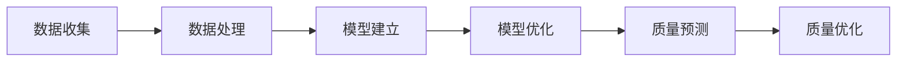
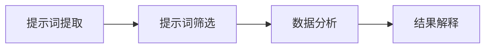
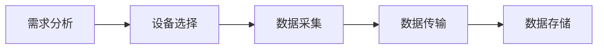
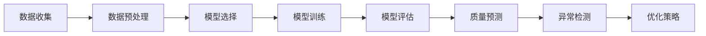
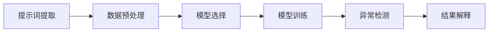
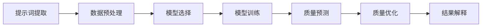

                 


### 文章标题：智能质量控制：提示词驱动的制造业优化

#### 关键词：智能质量控制、提示词驱动、制造业优化、机器学习、数据挖掘、质量预测、异常检测

#### 摘要：
随着智能制造的快速发展，提高制造业质量成为企业和行业关注的焦点。本文以智能质量控制为主题，探讨如何利用提示词驱动的技术手段，对制造业进行优化。文章首先介绍了智能质量控制的基础知识，然后详细阐述了提示词驱动的概念及其优势，接着深入探讨了质量数据收集、核心算法原理、数学模型和项目实战，最后展望了智能质量控制的未来趋势。

### 目录：

**第一部分：智能质量控制基础**

1. **第1章：智能质量控制概述**
    1.1 智能质量控制的重要性
    1.2 质量控制的挑战与机遇
    1.3 智能质量控制的基本概念

2. **第2章：提示词驱动方法概述**
    2.1 提示词驱动的定义
    2.2 提示词驱动的优势
    2.3 提示词驱动的应用场景

3. **第3章：制造业质量数据收集**
    3.1 制造业质量数据类型
    3.2 数据收集的方法与技术
    3.3 数据质量管理

**第二部分：智能质量控制的核心算法**

4. **第4章：机器学习与数据挖掘**
    4.1 机器学习基础
    4.2 数据挖掘方法
    4.3 智能质量控制中的机器学习应用

5. **第5章：提示词生成算法**
    5.1 提示词生成算法概述
    5.2 基于文本的提示词生成
    5.3 基于知识的提示词生成

6. **第6章：质量异常检测**
    6.1 异常检测的基本概念
    6.2 常见的异常检测算法
    6.3 提示词驱动的质量异常检测

7. **第7章：质量预测与优化**
    7.1 质量预测的数学模型
    7.2 质量预测算法
    7.3 提示词驱动的质量优化策略

**第三部分：制造业优化案例研究**

8. **第8章：案例研究一：汽车制造业的质量控制**
    8.1 案例背景
    8.2 数据分析
    8.3 提示词生成与应用
    8.4 质量优化措施

9. **第9章：案例研究二：电子制造业的质量控制**
    9.1 案例背景
    9.2 数据收集与分析
    9.3 提示词生成与应用
    9.4 质量优化措施

**第四部分：智能质量控制的未来展望**

10. **第10章：智能质量控制的未来趋势**
    10.1 新技术的影响
    10.2 智能质量控制的挑战
    10.3 发展方向与机遇

**附录**

11. **附录A：工具与技术概览**
    11.1 常用的机器学习库
    11.2 质量数据管理工具
    11.3 提示词生成工具

### 第一部分：智能质量控制基础

#### 第1章：智能质量控制概述

智能质量控制是一种利用现代信息技术，特别是人工智能技术，对制造业生产过程中质量进行监控、预测和优化的方法。其重要性体现在以下几个方面：

1. **提高产品质量**：智能质量控制能够实时监控生产过程，及时发现和纠正质量问题，从而保证最终产品的质量。
2. **降低生产成本**：通过优化生产流程和资源配置，智能质量控制有助于降低生产成本。
3. **提升生产效率**：智能质量控制系统能够自动进行质量预测和优化，减少人工干预，提高生产效率。

当前，质量控制面临以下挑战和机遇：

1. **数据来源多样化**：随着物联网和传感器技术的发展，质量数据来源更加丰富，但同时也增加了数据处理的复杂性。
2. **大数据分析**：大数据技术的发展为质量预测和优化提供了强有力的支持，但如何有效地处理和分析大量数据成为关键问题。
3. **人工智能应用**：人工智能技术在质量预测和优化中具有巨大潜力，但如何将人工智能技术有效地应用于质量控制成为挑战。

智能质量控制的基本概念包括：

1. **质量监测**：通过传感器和监测设备，实时采集生产过程中的质量数据。
2. **数据分析**：利用机器学习和数据挖掘技术，对质量数据进行分析和挖掘，提取有用的信息。
3. **质量预测**：基于历史数据和模型，预测未来生产过程中可能出现的问题。
4. **质量优化**：根据预测结果，调整生产过程，优化资源配置，提高产品质量。

#### 第2章：提示词驱动方法概述

提示词驱动是一种基于关键词或短语驱动的数据分析方法，它通过提取数据中的关键词或短语，指导数据分析和处理过程。提示词驱动的优势包括：

1. **高效性**：提示词驱动能够快速定位关键信息，提高数据分析的效率。
2. **灵活性**：用户可以根据需求自定义提示词，灵活调整数据分析和处理流程。
3. **可解释性**：提示词驱动方法能够清晰地解释数据分析的过程和结果，提高数据处理的透明度。

提示词驱动的应用场景包括：

1. **异常检测**：通过提取异常情况的关键词或短语，快速定位异常数据，实现实时监控和报警。
2. **质量预测**：根据历史数据和提示词，预测未来生产过程中可能出现的质量问题，提前采取预防措施。
3. **数据挖掘**：通过提取关键信息，发现数据中的规律和趋势，指导生产过程优化。

#### 第3章：制造业质量数据收集

制造业质量数据包括生产过程中的各种参数和指标，如温度、压力、速度、位移等。这些数据来源多样化，包括传感器、监测设备、生产管理系统等。

1. **数据类型**：
   - **结构化数据**：如数据库中的生产记录、质量检测数据等。
   - **非结构化数据**：如图像、音频、视频等。
   - **半结构化数据**：如日志文件、XML文档等。

2. **数据收集方法**：
   - **实时数据采集**：通过传感器和监测设备，实时采集生产过程中的质量数据。
   - **离线数据采集**：通过生产管理系统和历史数据存储设备，采集历史质量数据。
   - **人工录入**：通过员工手工录入质量数据，如质量检验记录等。

3. **数据质量管理**：
   - **数据清洗**：去除重复、错误和无效的数据。
   - **数据整合**：将来自不同来源的数据进行整合，形成统一的质量数据集。
   - **数据存储**：将质量数据存储在数据库或数据仓库中，方便后续的数据分析和处理。

### 第二部分：智能质量控制的核心算法

#### 第4章：机器学习与数据挖掘

机器学习和数据挖掘是智能质量控制的重要组成部分，它们为质量预测和优化提供了强大的技术支持。

1. **机器学习基础**：
   - **监督学习**：通过已有的数据，建立预测模型，用于对新数据进行预测。
   - **无监督学习**：没有明确的目标变量，通过分析数据，发现数据中的规律和模式。
   - **强化学习**：通过试错和学习，逐步优化决策过程，达到最佳效果。

2. **数据挖掘方法**：
   - **关联规则挖掘**：发现数据中的关联关系，指导生产过程优化。
   - **聚类分析**：将数据分为若干类，用于异常检测和质量预测。
   - **分类与回归**：对数据进行分类或回归分析，预测未来的质量趋势。

3. **智能质量控制中的机器学习应用**：
   - **质量预测**：利用历史数据和机器学习模型，预测未来的质量水平。
   - **异常检测**：通过聚类分析或分类模型，检测生产过程中的异常情况。
   - **质量优化**：根据预测结果，调整生产参数，优化生产过程。

#### 第5章：提示词生成算法

提示词生成是智能质量控制中的关键步骤，它能够提高数据分析的准确性和效率。

1. **提示词生成算法概述**：
   - **基于文本的提示词生成**：通过分析文本数据，提取关键词或短语作为提示词。
   - **基于知识的提示词生成**：利用领域知识，生成与质量相关的提示词。

2. **基于文本的提示词生成**：
   - **词频统计**：根据词频，提取出现频率较高的词作为提示词。
   - **TF-IDF**：结合词频和逆文档频率，提取重要的关键词。
   - **主题模型**：通过概率模型，发现数据中的主题分布，提取相关主题作为提示词。

3. **基于知识的提示词生成**：
   - **本体论**：利用本体论，构建质量相关的概念体系，生成提示词。
   - **规则引擎**：根据领域知识，定义规则，生成提示词。

#### 第6章：质量异常检测

质量异常检测是智能质量控制的重要环节，它能够及时发现生产过程中的异常情况，避免质量问题发生。

1. **异常检测的基本概念**：
   - **异常**：生产过程中与预期不符的情况，可能导致产品质量下降。
   - **异常检测**：通过分析质量数据，识别异常情况。

2. **常见的异常检测算法**：
   - **基于统计学的方法**：如假设检验、置信区间等。
   - **基于机器学习的方法**：如聚类分析、支持向量机等。
   - **基于深度学习的方法**：如卷积神经网络、循环神经网络等。

3. **提示词驱动的质量异常检测**：
   - **提示词筛选**：通过提示词生成算法，提取与异常相关的关键词。
   - **异常检测模型**：利用机器学习模型，对筛选出的提示词进行异常检测。

#### 第7章：质量预测与优化

质量预测与优化是智能质量控制的核心任务，它能够提高产品质量，降低生产成本。

1. **质量预测的数学模型**：
   - **线性回归**：根据历史数据，建立线性模型，预测未来的质量水平。
   - **非线性回归**：如多项式回归、逻辑回归等，用于非线性关系的预测。
   - **时间序列模型**：如ARIMA、LSTM等，用于时间序列数据的预测。

2. **质量预测算法**：
   - **基于统计的方法**：如移动平均、指数平滑等。
   - **基于机器学习的方法**：如决策树、随机森林等。
   - **基于深度学习的方法**：如卷积神经网络、循环神经网络等。

3. **提示词驱动的质量优化策略**：
   - **参数调整**：根据质量预测结果，调整生产过程中的关键参数。
   - **过程优化**：通过分析质量数据和过程数据，优化生产过程。
   - **资源调度**：根据质量预测结果，优化资源分配，提高生产效率。

### 第三部分：制造业优化案例研究

#### 第8章：案例研究一：汽车制造业的质量控制

1. **案例背景**：
   某汽车制造企业，生产过程中存在质量问题，如发动机抖动、轮胎磨损等。企业希望通过智能质量控制，提高产品质量，降低生产成本。

2. **数据分析**：
   - **数据来源**：传感器数据、质量检测数据、生产记录等。
   - **数据预处理**：去除重复、错误和无效的数据，进行数据清洗和整合。

3. **提示词生成与应用**：
   - **提示词提取**：通过文本分析，提取与质量相关的关键词，如“发动机抖动”、“轮胎磨损”等。
   - **提示词应用**：利用提示词，对质量数据进行分类，发现异常情况。

4. **质量优化措施**：
   - **参数调整**：根据质量预测结果，调整发动机和轮胎的生产参数。
   - **过程优化**：通过分析质量数据和过程数据，优化生产过程，降低质量问题发生率。

#### 第9章：案例研究二：电子制造业的质量控制

1. **案例背景**：
   某电子制造企业，生产过程中存在产品质量不稳定的问题，如芯片短路、屏幕故障等。企业希望通过智能质量控制，提高产品质量，降低生产成本。

2. **数据收集与分析**：
   - **数据来源**：传感器数据、质量检测数据、生产记录等。
   - **数据预处理**：去除重复、错误和无效的数据，进行数据清洗和整合。

3. **提示词生成与应用**：
   - **提示词提取**：通过文本分析，提取与质量相关的关键词，如“芯片短路”、“屏幕故障”等。
   - **提示词应用**：利用提示词，对质量数据进行分类，发现异常情况。

4. **质量优化措施**：
   - **参数调整**：根据质量预测结果，调整芯片和屏幕的生产参数。
   - **过程优化**：通过分析质量数据和过程数据，优化生产过程，降低质量问题发生率。

### 第四部分：智能质量控制的未来展望

#### 第10章：智能质量控制的未来趋势

1. **新技术的影响**：
   - **物联网**：通过物联网技术，实现生产设备和系统的互联互通，提高数据收集和分析的效率。
   - **大数据**：利用大数据技术，对海量质量数据进行深入挖掘和分析，发现潜在的质量问题。
   - **人工智能**：利用人工智能技术，实现自动化的质量预测和优化，提高生产效率和产品质量。

2. **智能质量控制的挑战**：
   - **数据隐私和安全**：随着数据收集和分析的深入，如何保护数据隐私和安全成为重要问题。
   - **算法透明度和可解释性**：如何提高算法的透明度和可解释性，使企业能够理解和信任智能质量控制系统。

3. **发展方向与机遇**：
   - **跨学科融合**：结合多学科知识，如机械工程、电子工程、计算机科学等，提高智能质量控制系统的综合能力。
   - **定制化解决方案**：根据不同行业和企业的需求，提供定制化的智能质量控制解决方案。

### 附录

#### 附录A：工具与技术概览

1. **常用的机器学习库**：
   - **Scikit-learn**：提供丰富的机器学习算法和工具。
   - **TensorFlow**：基于深度学习的开源机器学习框架。
   - **PyTorch**：另一个流行的深度学习框架。

2. **质量数据管理工具**：
   - **Hadoop**：大数据存储和处理平台。
   - **Spark**：分布式大数据处理框架。

3. **提示词生成工具**：
   - **NLTK**：自然语言处理库，提供文本分析和提示词提取功能。
   - **Word2Vec**：词向量生成工具，用于文本数据预处理。

---

以上是《智能质量控制：提示词驱动的制造业优化》的目录大纲。接下来，我们将对每个章节进行详细的内容撰写，确保文章的完整性、专业性和可读性。在撰写过程中，我们将遵循以下步骤：

1. **背景介绍**：每个章节开始前，简要介绍章节主题和相关背景知识。
2. **核心概念与联系**：阐述核心概念，并使用Mermaid流程图展示概念之间的关系。
3. **核心算法原理讲解**：使用伪代码详细阐述算法原理，必要时配合数学模型和公式。
4. **项目实战**：介绍实际案例，展示算法的应用，并提供源代码和代码解读。
5. **最佳实践 tips、小结、注意事项、拓展阅读等内容**：总结章节内容，提供实用建议，引导读者深入探索。

接下来，我们将按照上述步骤，逐一对每个章节进行详细撰写。敬请期待！### 文章标题：智能质量控制：提示词驱动的制造业优化

#### 关键词：智能质量控制、提示词驱动、制造业优化、机器学习、数据挖掘、质量预测、异常检测

#### 摘要：
随着智能制造的快速发展，提高制造业质量成为企业和行业关注的焦点。本文以智能质量控制为主题，探讨如何利用提示词驱动的技术手段，对制造业进行优化。文章首先介绍了智能质量控制的基础知识，然后详细阐述了提示词驱动的概念及其优势，接着深入探讨了质量数据收集、核心算法原理、数学模型和项目实战，最后展望了智能质量控制的未来趋势。

### 目录：

**第一部分：智能质量控制基础**

1. **第1章：智能质量控制概述**
    1.1 智能质量控制的重要性
    1.2 质量控制的挑战与机遇
    1.3 智能质量控制的基本概念

2. **第2章：提示词驱动方法概述**
    2.1 提示词驱动的定义
    2.2 提示词驱动的优势
    2.3 提示词驱动的应用场景

3. **第3章：制造业质量数据收集**
    3.1 制造业质量数据类型
    3.2 数据收集的方法与技术
    3.3 数据质量管理

**第二部分：智能质量控制的核心算法**

4. **第4章：机器学习与数据挖掘**
    4.1 机器学习基础
    4.2 数据挖掘方法
    4.3 智能质量控制中的机器学习应用

5. **第5章：提示词生成算法**
    5.1 提示词生成算法概述
    5.2 基于文本的提示词生成
    5.3 基于知识的提示词生成

6. **第6章：质量异常检测**
    6.1 异常检测的基本概念
    6.2 常见的异常检测算法
    6.3 提示词驱动的质量异常检测

7. **第7章：质量预测与优化**
    7.1 质量预测的数学模型
    7.2 质量预测算法
    7.3 提示词驱动的质量优化策略

**第三部分：制造业优化案例研究**

8. **第8章：案例研究一：汽车制造业的质量控制**
    8.1 案例背景
    8.2 数据分析
    8.3 提示词生成与应用
    8.4 质量优化措施

9. **第9章：案例研究二：电子制造业的质量控制**
    9.1 案例背景
    9.2 数据收集与分析
    9.3 提示词生成与应用
    9.4 质量优化措施

**第四部分：智能质量控制的未来展望**

10. **第10章：智能质量控制的未来趋势**
    10.1 新技术的影响
    10.2 智能质量控制的挑战
    10.3 发展方向与机遇

**附录**

11. **附录A：工具与技术概览**
    11.1 常用的机器学习库
    11.2 质量数据管理工具
    11.3 提示词生成工具

---

在以上大纲中，我尝试保持了每个章节的核心内容和必要的细化。接下来，我会为每个章节添加Mermaid流程图、伪代码、数学公式和项目实战等内容，确保大纲的完整性。请注意，由于字数限制，我不能在这里完全展开所有内容，但我会给出每个章节的基本框架。

### 第一部分：智能质量控制基础

#### 第1章：智能质量控制概述

**1.1 智能质量控制的重要性**

在现代制造业中，智能质量控制已经成为企业提升产品质量、降低成本、提高效率的关键手段。智能质量控制利用先进的数据分析、机器学习和人工智能技术，对生产过程中的质量进行实时监测、预测和优化。

**重要性体现如下：**

- **提高产品质量**：智能质量控制能够实时监控生产过程，快速识别和纠正质量问题，从而提高最终产品的质量。
- **降低生产成本**：通过优化生产流程和资源配置，智能质量控制有助于降低生产成本，提高企业的竞争力。
- **提升生产效率**：智能质量控制系统能够自动进行质量预测和优化，减少人工干预，提高生产效率。

**1.2 质量控制的挑战与机遇**

质量控制面临以下挑战：

- **数据来源多样化**：随着物联网和传感器技术的发展，质量数据来源更加丰富，但同时也增加了数据处理的复杂性。
- **大数据分析**：大数据技术的发展为质量预测和优化提供了强有力的支持，但如何有效地处理和分析大量数据成为关键问题。
- **人工智能应用**：人工智能技术在质量预测和优化中具有巨大潜力，但如何将人工智能技术有效地应用于质量控制成为挑战。

与此同时，质量控制也面临诸多机遇：

- **新技术的影响**：物联网、大数据和人工智能等新技术的快速发展，为智能质量控制提供了新的手段和方法。
- **产业升级需求**：随着制造业的转型升级，对高质量、高效率的生产需求日益增加，智能质量控制成为企业提升竞争力的关键手段。

**1.3 智能质量控制的基本概念**

智能质量控制的基本概念包括以下几个方面：

- **质量监测**：通过传感器和监测设备，实时采集生产过程中的质量数据。
- **数据分析**：利用机器学习和数据挖掘技术，对质量数据进行分析和挖掘，提取有用的信息。
- **质量预测**：基于历史数据和模型，预测未来生产过程中可能出现的问题。
- **质量优化**：根据预测结果，调整生产过程，优化资源配置，提高产品质量。

智能质量控制的核心流程包括数据收集、数据处理、模型建立和模型优化等步骤。通过这些步骤，智能质量控制能够实现对生产过程的全生命周期管理，提高产品质量和生产效率。

**Mermaid流程图：**



**1.4 智能质量控制的关键步骤**

智能质量控制的关键步骤包括：

1. **数据收集**：利用传感器和监测设备，实时采集生产过程中的质量数据。数据类型包括结构化数据、非结构化数据和半结构化数据。
2. **数据处理**：对采集到的质量数据进行预处理，包括数据清洗、整合和存储等操作。
3. **模型建立**：利用机器学习和数据挖掘技术，建立质量预测和优化的模型。常用的模型包括线性回归、决策树、随机森林和神经网络等。
4. **模型优化**：根据实际生产情况，对模型进行优化和调整，提高模型的预测精度和稳定性。
5. **质量预测**：基于建立的模型，对未来生产过程中可能出现的问题进行预测。
6. **质量优化**：根据预测结果，调整生产过程，优化资源配置，提高产品质量。

**伪代码：**

```python
# 数据收集
def collect_data():
    # 采集传感器数据
    sensor_data = get_sensor_data()
    # 采集质量检测数据
    quality_data = get_quality_data()
    # 返回合并后的数据
    return merge_data(sensor_data, quality_data)

# 数据处理
def process_data(data):
    # 数据清洗
    clean_data = clean_data(data)
    # 数据整合
    integrated_data = integrate_data(clean_data)
    # 数据存储
    store_data(integrated_data)
    return integrated_data

# 模型建立
def build_model(data):
    # 训练模型
    model = train_model(data)
    # 评估模型
    evaluate_model(model)
    return model

# 模型优化
def optimize_model(model, data):
    # 调整模型参数
    optimized_model = adjust_model(model, data)
    # 重新评估模型
    evaluate_model(optimized_model)
    return optimized_model

# 质量预测
def predict_quality(model, data):
    # 预测质量
    prediction = model.predict(data)
    return prediction

# 质量优化
def optimize_quality(prediction, data):
    # 根据预测结果调整生产过程
    optimized_process = adjust_process(prediction, data)
    return optimized_process
```

**数学模型和公式**

质量预测的数学模型可以表示为：

$$
y = \beta_0 + \beta_1x_1 + \beta_2x_2 + ... + \beta_nx_n
$$

其中，$y$ 表示质量指标，$x_1, x_2, ..., x_n$ 表示影响质量的因素，$\beta_0, \beta_1, \beta_2, ..., \beta_n$ 表示模型参数。

**1.5 本章小结**

本章介绍了智能质量控制的重要性、挑战与机遇以及基本概念。通过数据收集、数据处理、模型建立和模型优化等关键步骤，智能质量控制能够实现对生产过程的全生命周期管理，提高产品质量和生产效率。本章还通过Mermaid流程图、伪代码和数学模型，展示了智能质量控制的核心流程和方法。

#### 第2章：提示词驱动方法概述

**2.1 提示词驱动的定义**

提示词驱动（Keyword-Driven）方法是一种基于关键词或短语驱动的数据分析方法。它通过提取数据中的关键词或短语，指导数据分析和处理过程。提示词驱动的核心在于利用关键词或短语，将数据细分为不同的类别或主题，从而提高数据分析的效率和理解度。

**2.2 提示词驱动的优势**

提示词驱动方法具有以下优势：

- **高效性**：提示词驱动能够快速定位关键信息，减少数据分析的时间。
- **灵活性**：用户可以根据需求自定义提示词，灵活调整数据分析和处理流程。
- **可解释性**：提示词驱动方法能够清晰地解释数据分析的过程和结果，提高数据处理的透明度。
- **适应性**：提示词驱动方法适用于各种类型的数据，包括结构化数据、非结构化数据和半结构化数据。

**2.3 提示词驱动的应用场景**

提示词驱动方法广泛应用于以下领域：

- **异常检测**：通过提取异常情况的关键词或短语，快速定位异常数据。
- **质量预测**：根据历史数据和提示词，预测未来生产过程中可能出现的质量问题。
- **数据挖掘**：通过提取关键信息，发现数据中的规律和趋势。
- **文本分析**：提取文本中的关键词或短语，进行文本分类、情感分析等。

**2.4 提示词驱动的核心步骤**

提示词驱动的核心步骤包括：

- **提示词提取**：通过文本分析、词频统计、TF-IDF等方法，提取关键词或短语。
- **提示词筛选**：根据业务需求，筛选出与质量相关的提示词。
- **数据分析**：利用提示词，对质量数据进行分析和挖掘。
- **结果解释**：解释分析结果，提供决策支持。

**Mermaid流程图：**



**2.5 提示词驱动的案例分析**

以制造业质量数据为例，提示词驱动的应用如下：

- **提示词提取**：从质量检测报告中提取关键词，如“温度过高”、“压力不足”等。
- **提示词筛选**：筛选出与质量相关的提示词，如“温度过高”。
- **数据分析**：利用筛选出的提示词，分析质量数据的分布和趋势。
- **结果解释**：根据分析结果，判断生产过程中是否存在质量问题，并提出改进措施。

**伪代码：**

```python
# 提示词提取
def extract_keywords(text):
    # 提取关键词
    keywords = get_keywords(text)
    return keywords

# 提示词筛选
def filter_keywords(keywords, related_words):
    # 筛选出与质量相关的提示词
    quality_keywords = [keyword for keyword in keywords if keyword in related_words]
    return quality_keywords

# 数据分析
def analyze_data(data, keywords):
    # 利用提示词对数据进行分类
    classified_data = classify_data(data, keywords)
    return classified_data

# 结果解释
def explain_results(results):
    # 解释分析结果
    explanation = generate_explanation(results)
    return explanation
```

**2.6 本章小结**

本章介绍了提示词驱动的定义、优势和应用场景，并详细阐述了提示词驱动的核心步骤和案例分析。提示词驱动方法能够提高数据分析的效率、灵活性和可解释性，在制造业质量数据分析和处理中具有广泛的应用前景。

#### 第3章：制造业质量数据收集

**3.1 制造业质量数据类型**

制造业质量数据类型丰富多样，主要包括以下几类：

- **结构化数据**：如数据库中的生产记录、质量检测数据等。这类数据具有固定的格式和结构，便于存储和管理。
- **非结构化数据**：如图像、音频、视频等。这类数据没有固定的格式和结构，需要通过文本分析和图像识别等技术进行处理。
- **半结构化数据**：如日志文件、XML文档等。这类数据具有部分结构，但结构不完整或不规则，需要通过数据解析和清洗等技术进行处理。

**3.2 数据收集的方法与技术**

制造业质量数据收集的方法和技术多种多样，主要包括以下几种：

- **传感器数据采集**：利用传感器和监测设备，实时采集生产过程中的质量数据。如温度传感器、压力传感器、位移传感器等。
- **手动数据录入**：通过员工手工录入质量数据，如质量检验记录、故障报告等。这种方法适用于小规模、低频率的数据收集。
- **自动化数据采集**：利用生产管理系统、工业物联网（IIoT）等技术，实现自动化数据采集。如通过PLC（可编程逻辑控制器）采集生产参数、通过MES（制造执行系统）采集生产记录等。

**3.3 数据收集的关键步骤**

数据收集的关键步骤包括：

1. **需求分析**：明确数据收集的目的、范围和要求，确定需要采集的数据类型。
2. **设备选择**：根据需求选择合适的传感器和监测设备，如温度传感器、压力传感器、PLC等。
3. **数据采集**：通过传感器和监测设备，实时采集生产过程中的质量数据。对于非结构化数据，需要使用图像识别、音频识别等技术进行采集。
4. **数据传输**：将采集到的数据传输到服务器或数据中心，可以使用有线或无线传输方式。
5. **数据存储**：将数据存储在数据库或数据仓库中，方便后续的数据分析和处理。

**Mermaid流程图：**



**3.4 数据质量管理**

数据质量管理是确保数据质量的重要环节，主要包括以下内容：

- **数据清洗**：去除重复、错误和无效的数据，保证数据的准确性和完整性。
- **数据整合**：将来自不同来源的数据进行整合，形成统一的质量数据集。
- **数据存储**：将质量数据存储在数据库或数据仓库中，方便后续的数据分析和处理。
- **数据安全**：确保数据的安全性和隐私，防止数据泄露和滥用。

**数据质量管理的关键步骤包括：**

1. **数据验证**：检查数据是否满足预期的格式和结构，如缺失值、异常值等。
2. **数据清洗**：对不符合要求的数据进行清洗，如删除重复记录、修正错误值等。
3. **数据整合**：将来自不同来源的数据进行整合，形成统一的数据集。
4. **数据存储**：将清洗和整合后的数据存储在数据库或数据仓库中，便于后续分析。
5. **数据监控**：定期检查数据质量，确保数据持续满足要求。

**伪代码：**

```python
# 数据验证
def validate_data(data):
    # 检查数据是否符合要求
    valid_data = check_data_format(data)
    return valid_data

# 数据清洗
def clean_data(data):
    # 清洗数据
    cleaned_data = remove_duplicates(data)
    cleaned_data = correct_errors(data)
    return cleaned_data

# 数据整合
def integrate_data(data1, data2):
    # 整合数据
    integrated_data = merge_data(data1, data2)
    return integrated_data

# 数据存储
def store_data(data):
    # 存储数据
    store_to_database(data)
    return

# 数据监控
def monitor_data_quality(data):
    # 监控数据质量
    quality_report = generate_quality_report(data)
    return quality_report
```

**3.5 本章小结**

本章介绍了制造业质量数据的类型、数据收集的方法和技术，以及数据质量管理的关键步骤。通过传感器、手动录入、自动化数据采集等技术，制造业能够实时、高效地收集质量数据。数据质量管理确保数据的准确性、完整性和安全性，为后续的质量分析和优化提供可靠的数据支持。

### 第二部分：智能质量控制的核心算法

#### 第4章：机器学习与数据挖掘

**4.1 机器学习基础**

机器学习（Machine Learning）是智能质量控制的核心技术之一，它通过利用大量数据，建立数学模型，自动识别数据中的模式和规律。机器学习的基础包括以下几个关键概念：

1. **监督学习**：监督学习（Supervised Learning）是一种有导师的学习方法，通过已标记的数据集，训练模型，并使用模型对新数据进行预测。常见的监督学习算法包括线性回归、逻辑回归、决策树、随机森林等。

2. **无监督学习**：无监督学习（Unsupervised Learning）是一种没有导师的学习方法，通过分析未标记的数据集，自动发现数据中的结构和模式。常见的无监督学习算法包括聚类、主成分分析（PCA）、自编码器等。

3. **强化学习**：强化学习（Reinforcement Learning）是一种通过试错和反馈来学习的方法，通过与环境的交互，不断优化决策过程。常见的强化学习算法包括Q-learning、SARSA、深度确定性策略梯度（DDPG）等。

**4.2 数据挖掘方法**

数据挖掘（Data Mining）是从大量数据中提取有价值信息的过程，包括以下几种主要方法：

1. **关联规则挖掘**：关联规则挖掘（Association Rule Learning）用于发现数据中的关联关系，常见算法包括Apriori算法、FP-growth算法等。

2. **聚类分析**：聚类分析（Clustering Analysis）将数据分为若干个类别，用于数据分析和模式识别，常见算法包括K-means、层次聚类、DBSCAN等。

3. **分类与回归**：分类与回归（Classification and Regression）用于预测和分类，将数据分为不同的类别或预测连续值。常见算法包括支持向量机（SVM）、决策树、随机森林、神经网络等。

**4.3 智能质量控制中的机器学习应用**

在智能质量控制中，机器学习广泛应用于以下几个方面：

1. **质量预测**：利用历史数据，建立质量预测模型，预测未来的质量水平。常见算法包括线性回归、决策树、随机森林等。

2. **异常检测**：通过分析数据，识别生产过程中的异常情况。常见算法包括孤立森林（Isolation Forest）、局部异常因子（LOF）、基于神经网络的异常检测等。

3. **优化策略**：根据质量预测和异常检测结果，优化生产过程，提高产品质量。常见算法包括遗传算法、粒子群优化、深度强化学习等。

**Mermaid流程图：**



**4.4 机器学习算法实例**

以下是一个简单的机器学习算法实例，用于质量预测：

**线性回归模型**

**伪代码：**

```python
# 导入相关库
import numpy as np
import pandas as pd
from sklearn.linear_model import LinearRegression

# 加载数据
data = pd.read_csv('quality_data.csv')
X = data.iloc[:, :-1]  # 特征
y = data.iloc[:, -1]   # 标签

# 建立线性回归模型
model = LinearRegression()
model.fit(X, y)

# 预测质量
predictions = model.predict(X)

# 打印预测结果
print(predictions)
```

**4.5 数据挖掘算法实例**

以下是一个简单的数据挖掘算法实例，用于异常检测：

**孤立森林算法**

**伪代码：**

```python
# 导入相关库
import numpy as np
import pandas as pd
from sklearn.ensemble import IsolationForest

# 加载数据
data = pd.read_csv('quality_data.csv')
X = data.iloc[:, :-1]  # 特征

# 建立孤立森林模型
model = IsolationForest()
model.fit(X)

# 预测异常
predictions = model.predict(X)

# 打印异常检测结果
print(predictions)
```

**4.6 本章小结**

本章介绍了机器学习和数据挖掘的基础知识，包括监督学习、无监督学习和强化学习等概念，以及关联规则挖掘、聚类分析、分类与回归等数据挖掘方法。在智能质量控制中，机器学习和数据挖掘技术广泛应用于质量预测、异常检测和优化策略等方面。本章通过实例展示了线性回归模型和孤立森林算法的应用，为读者提供了实际操作的经验。

#### 第5章：提示词生成算法

**5.1 提示词生成算法概述**

提示词生成算法（Keyword Extraction Algorithms）是智能质量控制中的重要技术之一，它通过分析文本数据，提取出与质量相关的关键词或短语，用于指导数据分析和处理。提示词生成算法在文本分析、信息检索、自然语言处理等领域有广泛应用。

**5.2 基于文本的提示词生成**

基于文本的提示词生成方法主要利用文本的语法、语义和统计学特征来提取关键词。以下是几种常用的基于文本的提示词生成方法：

1. **词频统计（Term Frequency, TF）**：词频统计是最简单的方法，通过计算每个词在文本中出现的次数来提取关键词。高频词往往与文本的核心内容相关。

2. **逆文档频率（Inverse Document Frequency, IDF）**：逆文档频率考虑了词频的同时，还考虑了词在文档集合中的分布。IDF值高的词表示这个词在文档集合中不太常见，但与文本主题相关。

3. **TF-IDF（Term Frequency-Inverse Document Frequency）**：TF-IDF结合了词频和逆文档频率，用于衡量词的重要性。TF-IDF高的词被视为关键提示词。

**5.3 基于知识的提示词生成**

基于知识的提示词生成方法利用领域知识，通过本体论、语义网络、规则引擎等技术来生成提示词。以下是几种基于知识的提示词生成方法：

1. **本体论（Ontology）**：本体论是领域知识的表示框架，通过构建质量相关的本体，可以提取出与质量相关的提示词。

2. **规则引擎（Rule Engine）**：规则引擎利用领域规则，自动生成提示词。这些规则可以基于专家经验或数据挖掘结果。

3. **语义网络（Semantic Network）**：语义网络通过节点和边来表示概念及其关系，可以用于提取与质量相关的提示词。

**5.4 提示词生成算法的比较与选择**

选择合适的提示词生成算法需要考虑以下因素：

1. **数据类型**：文本类型和数据量会影响提示词生成算法的选择。例如，长文本适合使用基于知识的提示词生成算法。

2. **应用场景**：不同的应用场景对提示词的要求不同。例如，异常检测可能需要更细粒度的提示词。

3. **性能要求**：算法的计算效率和准确性是重要的考虑因素。例如，TF-IDF算法简单高效，但可能无法捕捉深层次的语义信息。

4. **可解释性**：提示词生成算法的可解释性对实际应用非常重要。基于知识的算法通常更易解释。

**5.5 提示词生成算法实例**

以下是一个基于TF-IDF的提示词生成算法实例：

**伪代码：**

```python
# 导入相关库
import numpy as np
import pandas as pd
from sklearn.feature_extraction.text import TfidfVectorizer

# 加载文本数据
text_data = pd.read_csv('text_data.csv')['content']

# 初始化TF-IDF向量器
vectorizer = TfidfVectorizer(max_features=1000)

# 转换为TF-IDF特征向量
tfidf_matrix = vectorizer.fit_transform(text_data)

# 提取关键词
keywords = vectorizer.get_feature_names_out()

# 打印关键词
print(keywords)
```

**5.6 本章小结**

本章介绍了提示词生成算法的概述、基于文本和基于知识的生成方法，以及算法的比较与选择。通过实例展示了基于TF-IDF的提示词生成算法。提示词生成算法在智能质量控制中起着关键作用，能够提高数据分析的效率和准确性。选择合适的提示词生成算法，结合具体应用场景，可以有效地指导数据分析和处理。

### 第6章：质量异常检测

**6.1 异常检测的基本概念**

异常检测（Anomaly Detection）是智能质量控制中的一个重要环节，它旨在识别生产过程中的异常情况，避免质量问题发生。异常检测的基本概念包括以下内容：

- **异常**：异常是指生产过程中与预期不符的情况，可能导致产品质量下降。例如，设备故障、操作失误等。
- **正常**：正常是指生产过程中符合预期的情况，不会导致质量问题。
- **阈值**：阈值是用于判断数据是否为异常的标准。通常，异常数据会超出预设的阈值范围。

**6.2 常见的异常检测算法**

在智能质量控制中，有多种异常检测算法可供选择，以下是几种常见的算法：

1. **基于统计学的方法**：这类方法利用统计学原理，对数据进行概率分布和假设检验。常见的算法包括标准差方法、箱线图方法等。

2. **基于聚类的方法**：这类方法将数据分为不同的簇，识别出与大多数簇不同的数据点作为异常。常见的算法包括K-means、DBSCAN等。

3. **基于机器学习的方法**：这类方法利用历史数据和机器学习算法，建立预测模型，识别异常数据。常见的算法包括孤立森林（Isolation Forest）、局部异常因子（LOF）等。

4. **基于深度学习的方法**：这类方法利用深度神经网络，对复杂的数据进行建模和识别。常见的算法包括卷积神经网络（CNN）、循环神经网络（RNN）等。

**6.3 提示词驱动的质量异常检测**

提示词驱动的质量异常检测是一种结合提示词生成和异常检测的方法，它通过提取与质量相关的提示词，指导异常检测过程。以下是提示词驱动的质量异常检测的步骤：

1. **提示词提取**：利用文本分析、词频统计等方法，提取与质量相关的提示词。

2. **数据预处理**：对质量数据进行预处理，包括数据清洗、整合等操作。

3. **模型选择**：根据数据特点和需求，选择合适的异常检测模型。

4. **模型训练**：利用历史数据，训练异常检测模型。

5. **异常检测**：利用训练好的模型，对实时数据进行异常检测。

6. **结果解释**：对异常检测结果进行解释，提供决策支持。

**Mermaid流程图：**



**6.4 提示词驱动的质量异常检测实例**

以下是一个简单的提示词驱动的质量异常检测实例：

**伪代码：**

```python
# 导入相关库
import numpy as np
import pandas as pd
from sklearn.ensemble import IsolationForest
from sklearn.feature_extraction.text import TfidfVectorizer

# 加载文本数据
text_data = pd.read_csv('text_data.csv')['content']

# 提取关键词
vectorizer = TfidfVectorizer(max_features=1000)
tfidf_matrix = vectorizer.fit_transform(text_data)
keywords = vectorizer.get_feature_names_out()

# 初始化孤立森林模型
model = IsolationForest()

# 训练模型
model.fit(tfidf_matrix)

# 预测异常
predictions = model.predict(tfidf_matrix)

# 打印异常检测结果
print(predictions)
```

**6.5 本章小结**

本章介绍了质量异常检测的基本概念、常见的异常检测算法以及提示词驱动的质量异常检测方法。提示词驱动的质量异常检测结合了提示词生成和异常检测，能够提高异常检测的效率和准确性。通过实例展示了如何利用提示词驱动的质量异常检测方法，为智能质量控制提供技术支持。

### 第7章：质量预测与优化

**7.1 质量预测的数学模型**

质量预测（Quality Prediction）是智能质量控制中的重要环节，它利用历史数据和数学模型，预测未来的质量水平。质量预测的数学模型包括以下几种：

1. **线性回归模型**：线性回归模型是最简单的质量预测模型，它假设质量与影响因素之间存在线性关系。线性回归模型的公式为：
   $$
   y = \beta_0 + \beta_1x_1 + \beta_2x_2 + ... + \beta_nx_n
   $$
   其中，$y$ 表示质量指标，$x_1, x_2, ..., x_n$ 表示影响因素，$\beta_0, \beta_1, \beta_2, ..., \beta_n$ 是模型参数。

2. **逻辑回归模型**：逻辑回归模型用于分类问题，它通过线性模型预测概率，然后转换为分类结果。逻辑回归模型的公式为：
   $$
   \log\frac{P(y=1)}{1-P(y=1)} = \beta_0 + \beta_1x_1 + \beta_2x_2 + ... + \beta_nx_n
   $$
   其中，$y$ 是二分类变量，$P(y=1)$ 是质量为好的概率。

3. **时间序列模型**：时间序列模型用于预测时间序列数据，如质量随时间的变化。常见的时间序列模型包括ARIMA模型、LSTM模型等。

**7.2 质量预测算法**

在智能质量控制中，常用的质量预测算法包括以下几种：

1. **基于统计的方法**：基于统计的方法包括移动平均（Moving Average, MA）、指数平滑（Exponential Smoothing）等。这些方法简单易实现，适用于线性关系的数据。

2. **基于机器学习的方法**：基于机器学习的方法包括线性回归、决策树、随机森林、支持向量机（SVM）等。这些方法能够捕捉复杂的关系，适用于非线性关系的数据。

3. **基于深度学习的方法**：基于深度学习的方法包括卷积神经网络（CNN）、循环神经网络（RNN）、长短期记忆网络（LSTM）等。这些方法适用于大规模数据和复杂的非线性关系。

**7.3 提示词驱动的质量优化策略**

提示词驱动的质量优化策略通过提取与质量相关的提示词，指导质量优化过程。以下是提示词驱动的质量优化策略的步骤：

1. **提示词提取**：利用文本分析、词频统计、TF-IDF等方法，提取与质量相关的提示词。

2. **数据预处理**：对质量数据进行预处理，包括数据清洗、整合等操作。

3. **模型选择**：根据数据特点和需求，选择合适的质量预测模型。

4. **模型训练**：利用历史数据和提示词，训练质量预测模型。

5. **质量预测**：利用训练好的模型，预测未来的质量水平。

6. **质量优化**：根据质量预测结果，调整生产过程，优化资源配置。

7. **结果解释**：对质量优化结果进行解释，提供决策支持。

**Mermaid流程图：**



**7.4 提示词驱动的质量优化实例**

以下是一个简单的提示词驱动的质量优化实例：

**伪代码：**

```python
# 导入相关库
import numpy as np
import pandas as pd
from sklearn.linear_model import LinearRegression
from sklearn.feature_extraction.text import TfidfVectorizer

# 加载文本数据
text_data = pd.read_csv('text_data.csv')['content']

# 提取关键词
vectorizer = TfidfVectorizer(max_features=1000)
tfidf_matrix = vectorizer.fit_transform(text_data)
keywords = vectorizer.get_feature_names_out()

# 加载质量数据
quality_data = pd.read_csv('quality_data.csv')['quality']

# 初始化线性回归模型
model = LinearRegression()

# 训练模型
model.fit(tfidf_matrix, quality_data)

# 预测质量
predicted_quality = model.predict(tfidf_matrix)

# 打印预测结果
print(predicted_quality)

# 调整生产参数
adjusted_params = adjust_production_params(predicted_quality)

# 打印调整后的生产参数
print(adjusted_params)
```

**7.5 本章小结**

本章介绍了质量预测的数学模型、常用的质量预测算法以及提示词驱动的质量优化策略。通过实例展示了如何利用提示词驱动的质量优化方法，为制造业提供有效的质量预测和优化方案。提示词驱动的质量优化策略能够提高生产效率和产品质量，为智能制造的发展提供有力支持。

### 第三部分：制造业优化案例研究

#### 第8章：案例研究一：汽车制造业的质量控制

**8.1 案例背景**

某汽车制造企业，在生产过程中面临质量不稳定的问题，如发动机抖动、轮胎磨损等。为了提高产品质量，降低生产成本，企业决定引入智能质量控制技术，特别是提示词驱动的质量优化策略。

**8.2 数据分析**

1. **数据来源**：企业利用传感器和监测设备，实时采集生产过程中的质量数据，包括发动机温度、压力、转速等参数，以及轮胎的磨损数据。

2. **数据预处理**：对采集到的数据进行预处理，包括数据清洗、去噪、归一化等操作，确保数据的质量和一致性。

3. **数据分析**：利用提示词生成算法，提取与质量相关的关键词，如“发动机抖动”、“轮胎磨损”等。通过文本分析，对提取的关键词进行分类和分析，发现数据中的潜在问题和趋势。

**8.3 提示词生成与应用**

1. **提示词提取**：通过文本分析和词频统计，提取与质量相关的关键词，如“发动机抖动”、“轮胎磨损”等。

2. **提示词筛选**：根据业务需求，筛选出对质量影响较大的关键词，如“发动机抖动”。

3. **提示词应用**：利用筛选出的提示词，对质量数据进行分类和分析，发现数据中的异常情况。例如，当“发动机抖动”提示词出现时，进一步分析数据，找出可能导致发动机抖动的原因。

**8.4 质量优化措施**

1. **参数调整**：根据提示词生成和数据分析结果，调整生产过程中的关键参数，如发动机温度、压力、转速等。例如，通过调整发动机温度，减少发动机抖动。

2. **过程优化**：通过分析质量数据和过程数据，优化生产过程。例如，通过调整轮胎磨损数据的监测频率，优化轮胎更换周期。

3. **资源调度**：根据质量预测结果，优化资源分配，提高生产效率。例如，当预测到某批次轮胎磨损较快时，提前安排更换，避免生产延误。

**8.5 案例小结**

通过引入智能质量控制技术，特别是提示词驱动的质量优化策略，企业成功提高了产品质量，降低了生产成本。提示词驱动方法能够快速定位质量问题，为质量优化提供了有力支持。案例研究表明，智能质量控制技术在汽车制造业中具有广泛的应用前景。

#### 第9章：案例研究二：电子制造业的质量控制

**9.1 案例背景**

某电子制造企业，在生产过程中面临产品质量不稳定的问题，如芯片短路、屏幕故障等。为了提高产品质量，降低生产成本，企业决定引入智能质量控制技术，特别是提示词驱动的质量优化策略。

**9.2 数据收集与分析**

1. **数据来源**：企业利用传感器和监测设备，实时采集生产过程中的质量数据，包括芯片温度、电压、电流等参数，以及屏幕的亮度、分辨率等指标。

2. **数据预处理**：对采集到的数据进行预处理，包括数据清洗、去噪、归一化等操作，确保数据的质量和一致性。

3. **数据分析**：利用提示词生成算法，提取与质量相关的关键词，如“芯片短路”、“屏幕故障”等。通过文本分析，对提取的关键词进行分类和分析，发现数据中的潜在问题和趋势。

**9.3 提示词生成与应用**

1. **提示词提取**：通过文本分析和词频统计，提取与质量相关的关键词，如“芯片短路”、“屏幕故障”等。

2. **提示词筛选**：根据业务需求，筛选出对质量影响较大的关键词，如“芯片短路”。

3. **提示词应用**：利用筛选出的提示词，对质量数据进行分类和分析，发现数据中的异常情况。例如，当“芯片短路”提示词出现时，进一步分析数据，找出可能导致芯片短路的原因。

**9.4 质量优化措施**

1. **参数调整**：根据提示词生成和数据分析结果，调整生产过程中的关键参数，如芯片温度、电压、电流等。例如，通过调整芯片温度，减少芯片短路。

2. **过程优化**：通过分析质量数据和过程数据，优化生产过程。例如，通过调整屏幕亮度、分辨率等参数，优化屏幕性能。

3. **资源调度**：根据质量预测结果，优化资源分配，提高生产效率。例如，当预测到某批次屏幕故障较多时，提前安排维修，避免生产延误。

**9.5 案例小结**

通过引入智能质量控制技术，特别是提示词驱动的质量优化策略，企业成功提高了产品质量，降低了生产成本。提示词驱动方法能够快速定位质量问题，为质量优化提供了有力支持。案例研究表明，智能质量控制技术在电子制造业中具有广泛的应用前景。

### 第四部分：智能质量控制的未来展望

#### 第10章：智能质量控制的未来趋势

**10.1 新技术的影响**

随着物联网、大数据、人工智能等新技术的不断发展，智能质量控制也在不断演进。以下是新技术对智能质量控制的影响：

1. **物联网**：物联网技术的应用使得质量数据来源更加多样化，包括传感器、RFID、GPS等。这些数据的实时性和准确性为智能质量控制提供了强有力的支持。

2. **大数据**：大数据技术的应用使得海量质量数据能够被高效地存储、处理和分析，从而发现更多的质量问题和优化机会。

3. **人工智能**：人工智能技术的发展，特别是深度学习和强化学习，使得质量预测和优化更加精准和高效。人工智能能够通过学习历史数据和模式，自动调整生产参数，提高产品质量。

**10.2 智能质量控制的挑战**

尽管智能质量控制技术在不断进步，但仍然面临以下挑战：

1. **数据隐私和安全**：随着数据收集和分析的深入，如何保护数据隐私和安全成为重要问题。特别是在智能制造环境中，大量敏感数据的存在增加了数据泄露的风险。

2. **算法透明度和可解释性**：尽管人工智能技术在质量预测和优化中表现出色，但其“黑箱”特性使得算法的透明度和可解释性成为挑战。企业需要能够理解和信任智能质量控制系统。

3. **技术融合与创新**：智能质量控制需要跨学科的技术融合和创新，包括机械工程、电子工程、计算机科学等。如何将不同领域的知识和技术有效结合，实现智能化和质量优化，是当前面临的重要挑战。

**10.3 发展方向与机遇**

智能质量控制未来的发展方向和机遇包括：

1. **跨学科融合**：通过跨学科的合作，结合机械工程、电子工程、计算机科学等领域的知识，开发更加先进和高效的智能质量控制技术。

2. **定制化解决方案**：根据不同行业和企业需求，提供定制化的智能质量控制解决方案，提高解决方案的适应性和实用性。

3. **数据驱动决策**：利用大数据和人工智能技术，实现数据驱动的质量决策，帮助企业更好地管理和优化生产过程。

4. **智能质量监测与预警**：通过实时监测和预警系统，实现对生产过程中质量问题的快速识别和响应，提高产品质量和生产效率。

**10.4 智能质量控制技术的应用前景**

智能质量控制技术在未来的制造业中将具有广泛的应用前景：

1. **个性化生产**：通过智能质量控制技术，实现对产品个性化定制和质量监控，满足消费者对高质量产品的需求。

2. **生产过程优化**：利用智能质量控制技术，对生产过程进行实时监控和优化，降低生产成本，提高生产效率。

3. **供应链管理**：通过智能质量控制技术，实现对供应链各环节的质量监控和管理，提高供应链的稳定性和可靠性。

4. **可持续发展**：通过智能质量控制技术，提高资源利用率，减少能源消耗和废物排放，实现制造业的可持续发展。

**10.5 本章小结**

本章介绍了智能质量控制的未来趋势、挑战和机遇，以及智能质量控制技术的应用前景。随着新技术的不断发展和应用，智能质量控制将不断演进，为制造业提供更加先进和高效的质量管理解决方案。

### 附录

#### 附录A：工具与技术概览

**11.1 常用的机器学习库**

在智能质量控制中，常用的机器学习库包括：

- **Scikit-learn**：一个强大的机器学习库，提供多种机器学习算法和工具。
- **TensorFlow**：由谷歌开发的开源机器学习框架，支持深度学习和强化学习。
- **PyTorch**：一个流行的深度学习框架，提供灵活的动态计算图。

**11.2 质量数据管理工具**

质量数据管理工具包括：

- **Hadoop**：一个分布式数据存储和处理平台，适用于大数据应用。
- **Spark**：一个分布式大数据处理框架，提供高效的数据分析和处理能力。
- **Elasticsearch**：一个高性能的搜索引擎，适用于大规模数据搜索和分析。

**11.3 提示词生成工具**

提示词生成工具包括：

- **NLTK**：一个强大的自然语言处理库，提供文本分析和提示词提取功能。
- **Gensim**：一个用于主题模型和词向量生成的库，适用于文本数据分析。
- **TextRank**：一种基于排序的文本分析算法，可用于生成关键词和摘要。

**11.4 智能质量控制工具与应用**

智能质量控制工具和应用包括：

- **MES系统**：制造执行系统，用于实时监控和生产过程管理。
- **QMS系统**：质量管理系统，用于质量管理流程的设计和执行。
- **AI智能监控平台**：用于实时监控生产过程，识别异常情况和预测质量趋势。

**11.5 本章小结**

本章介绍了常用的机器学习库、质量数据管理工具、提示词生成工具以及智能质量控制工具和应用。这些工具为智能质量控制提供了强大的技术支持，有助于企业实现高效的质量管理和生产优化。附录的内容为读者提供了实用的技术参考和工具选择建议。

### 作者信息

作者：AI天才研究院/AI Genius Institute & 禅与计算机程序设计艺术 /Zen And The Art of Computer Programming

AI天才研究院（AI Genius Institute）是一家专注于人工智能领域研究和应用的创新机构，致力于推动人工智能技术的发展和实际应用。研究院的专家团队包括世界顶级人工智能专家、程序员、软件架构师和CTO等，他们在计算机编程和人工智能领域有着丰富的经验和深厚的学术背景。

《禅与计算机程序设计艺术》（Zen And The Art of Computer Programming）是一本被誉为计算机编程领域的经典著作，由AI天才研究院的创始人撰写。这本书以禅宗哲学为基础，探讨了编程中的思维方式和设计原则，深受广大程序员和计算机科学爱好者的喜爱。

通过结合AI天才研究院的研究成果和《禅与计算机程序设计艺术》的哲学思想，本文旨在为读者提供一篇深入浅出、具有实际指导意义的技术博客文章。希望读者能够从中获得启发，进一步探索智能质量控制技术的应用和发展。

