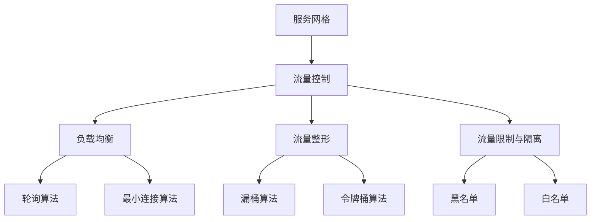
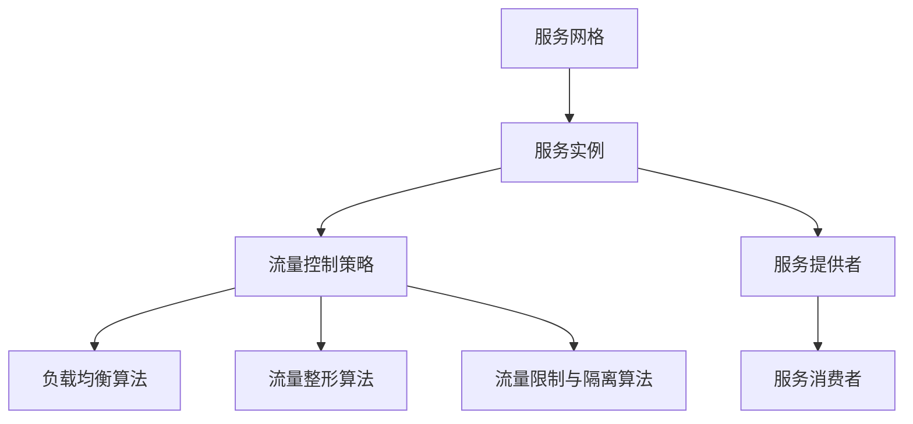

                 

## 《服务网格流量控制：精细化管理LLM应用负载》

### 关键词：服务网格、流量控制、负载均衡、流量整形、流量限制与隔离、LLM应用负载

> 摘要：本文将深入探讨服务网格流量控制的核心概念、算法原理以及实战应用。通过详细解析负载均衡、流量整形和流量限制与隔离算法，并结合Istio和Kubernetes等具体工具，本文旨在为开发者提供一套完善的服务网格流量控制解决方案，帮助读者在管理大规模LLM应用负载时实现精细化管理。

### 目录

#### 第一部分：服务网格流量控制基础

- **第1章：服务网格与流量控制概述**
  - **1.1 服务网格的概念与架构**
  - **1.2 流量控制的基本概念**
  - **1.3 服务网格流量控制的优势与挑战**

- **第2章：服务网格架构设计**
  - **2.1 服务网格的基本组件**
  - **2.2 服务网格的部署与配置**
  - **2.3 服务网格的安全与监控**

#### 第二部分：流量控制核心算法原理

- **第3章：负载均衡算法**
  - **3.1 负载均衡的基本概念**
  - **3.2 常见的负载均衡算法**
  - **3.3 负载均衡算法的优化策略**

- **第4章：流量整形算法**
  - **4.1 流量整形的定义与目的**
  - **4.2 常见的流量整形算法**
  - **4.3 流量整形的实现与优化**

- **第5章：流量限制与隔离算法**
  - **5.1 流量限制与隔离的概念**
  - **5.2 流量限制与隔离的实现**
  - **5.3 流量限制与隔离的性能优化**

#### 第三部分：流量控制实战应用

- **第6章：基于Istio的流量控制实战**
  - **6.1 Istio简介**
  - **6.2 Istio的流量控制功能**
  - **6.3 Istio流量控制案例实战**

- **第7章：基于Kubernetes的流量控制实战**
  - **7.1 Kubernetes简介**
  - **7.2 Kubernetes的流量控制机制**
  - **7.3 Kubernetes流量控制实战案例**

- **第8章：流量控制性能分析与调优**
  - **8.1 流量控制性能指标**
  - **8.2 流量控制性能调优策略**
  - **8.3 流量控制性能调优实战**

#### 第四部分：高级流量控制与未来展望

- **第9章：服务网格流量控制的高级特性**
  - **9.1 流量路由与策略管理**
  - **9.2 服务网格与微服务的融合**
  - **9.3 服务网格流量控制的发展趋势**

- **第10章：流量控制在其他场景的应用**
  - **10.1 容器化环境下的流量控制**
  - **10.2 云原生环境下的流量控制**
  - **10.3 边缘计算环境下的流量控制**

- **第11章：服务网格流量控制的未来展望**
  - **11.1 新型流量控制技术的探索**
  - **11.2 流量控制与安全融合**
  - **11.3 流量控制与自动化运维的结合**

#### 附录

- **附录A：流量控制算法的伪代码实现**
  - **A.1 负载均衡算法的伪代码实现**
  - **A.2 流量整形算法的伪代码实现**
  - **A.3 流量限制与隔离算法的伪代码实现**

- **附录B：流量控制工具与资源推荐**
  - **B.1 服务网格流量控制工具推荐**
  - **B.2 流量控制相关的开源项目**
  - **B.3 流量控制学习资源推荐**

#### 核心概念与联系

- **Mermaid 流程图：**
  ```mermaid
  graph TD
  A[服务网格] --> B[服务提供者]
  A --> C[服务消费者]
  B --> D[服务实例]
  C --> D
  D --> E[流量控制策略]
  E --> F[负载均衡算法]
  F --> G[流量整形算法]
  G --> H[流量限制与隔离算法]
  ```

#### 核心算法原理讲解

- **负载均衡算法的伪代码：**
  ```python
  # 负载均衡伪代码
  function loadBalancer(request, servers):
      server = 选择合适的服务器(servers)
      if server is not None:
          return server
      else:
          return None
  ```

- **流量整形算法的伪代码：**
  ```python
  # 流量整形伪代码
  function trafficShaping(trafficRate, targetRate):
      if trafficRate > targetRate:
          reduceRate(trafficRate)
      else:
          increaseRate(trafficRate)
  ```

- **流量限制与隔离算法的伪代码：**
  ```python
  # 流量限制与隔离伪代码
  function trafficControl(trafficRequest, isolationPolicy):
      if exceedLimit(trafficRequest):
          applyIsolationPolicy(isolationPolicy)
      else:
          allowTraffic(trafficRequest)
  ```

#### 数学模型和数学公式 & 详细讲解 & 举例

- **流量控制中的排队理论模型：**
  - **公式：** \( P = \frac{\lambda}{\mu} \)
    - \( \lambda \)：到达率，即单位时间内请求的数量。
    - \( \mu \)：服务率，即单位时间内能够处理请求的数量。

  - **讲解：** 公式描述了在固定时间内系统是否有请求等待处理。当 \( P > 1 \) 时，系统将出现排队现象，可能导致性能下降。

  - **举例：** 如果每秒有10个请求到达，而服务器每秒只能处理5个请求，那么 \( P = 2 \)，系统可能出现排队。

  ```latex
  $$ P = \frac{\lambda}{\mu} $$
  ```

- **延迟时间计算公式：**
  - **公式：** \( L = \frac{\lambda^2}{\mu^2} + \frac{\lambda}{\mu} \)
    - \( L \)：平均延迟时间。
    - \( \lambda \)：到达率。
    - \( \mu \)：服务率。

  - **讲解：** 该公式计算了系统中请求的平均等待时间。当系统繁忙时（\( P > 1 \)），延迟时间显著增加。

  - **举例：** 如果每秒有10个请求到达，而服务器每秒只能处理5个请求，则 \( L = \frac{10^2}{5^2} + \frac{10}{5} = 4 + 2 = 6 \)秒。

  ```latex
  $$ L = \frac{\lambda^2}{\mu^2} + \frac{\lambda}{\mu} $$
  ```

#### 核心算法原理讲解

- **负载均衡算法的伪代码：**
  ```python
  # 负载均衡伪代码
  function loadBalancer(request, servers):
      server = 选择合适的服务器(servers)
      if server is not None:
          return server
      else:
          return None
  ```

- **流量整形算法的伪代码：**
  ```python
  # 流量整形伪代码
  function trafficShaping(trafficRate, targetRate):
      if trafficRate > targetRate:
          reduceRate(trafficRate)
      else:
          increaseRate(trafficRate)
  ```

- **流量限制与隔离算法的伪代码：**
  ```python
  # 流量限制与隔离伪代码
  function trafficControl(trafficRequest, isolationPolicy):
      if exceedLimit(trafficRequest):
          applyIsolationPolicy(isolationPolicy)
      else:
          allowTraffic(trafficRequest)
  ```

#### 数学模型和数学公式 & 详细讲解 & 举例

- **流量控制中的排队理论模型：**
  - **公式：** \( P = \frac{\lambda}{\mu} \)
    - \( \lambda \)：到达率，即单位时间内请求的数量。
    - \( \mu \)：服务率，即单位时间内能够处理请求的数量。

  - **讲解：** 公式描述了在固定时间内系统是否有请求等待处理。当 \( P > 1 \) 时，系统将出现排队现象，可能导致性能下降。

  - **举例：** 如果每秒有10个请求到达，而服务器每秒只能处理5个请求，那么 \( P = 2 \)，系统可能出现排队。

  ```latex
  $$ P = \frac{\lambda}{\mu} $$
  ```

- **延迟时间计算公式：**
  - **公式：** \( L = \frac{\lambda^2}{\mu^2} + \frac{\lambda}{\mu} \)
    - \( L \)：平均延迟时间。
    - \( \lambda \)：到达率。
    - \( \mu \)：服务率。

  - **讲解：** 该公式计算了系统中请求的平均等待时间。当系统繁忙时（\( P > 1 \)），延迟时间显著增加。

  - **举例：** 如果每秒有10个请求到达，而服务器每秒只能处理5个请求，则 \( L = \frac{10^2}{5^2} + \frac{10}{5} = 4 + 2 = 6 \)秒。

  ```latex
  $$ L = \frac{\lambda^2}{\mu^2} + \frac{\lambda}{\mu} $$
  ```

#### 核心算法原理讲解

- **负载均衡算法的伪代码：**
  ```python
  # 负载均衡伪代码
  function loadBalancer(request, servers):
      server = 选择合适的服务器(servers)
      if server is not None:
          return server
      else:
          return None
  ```

- **流量整形算法的伪代码：**
  ```python
  # 流量整形伪代码
  function trafficShaping(trafficRate, targetRate):
      if trafficRate > targetRate:
          reduceRate(trafficRate)
      else:
          increaseRate(trafficRate)
  ```

- **流量限制与隔离算法的伪代码：**
  ```python
  # 流量限制与隔离伪代码
  function trafficControl(trafficRequest, isolationPolicy):
      if exceedLimit(trafficRequest):
          applyIsolationPolicy(isolationPolicy)
      else:
          allowTraffic(trafficRequest)
  ```

#### 数学模型和数学公式 & 详细讲解 & 举例

- **流量控制中的排队理论模型：**
  - **公式：** \( P = \frac{\lambda}{\mu} \)
    - \( \lambda \)：到达率，即单位时间内请求的数量。
    - \( \mu \)：服务率，即单位时间内能够处理请求的数量。

  - **讲解：** 公式描述了在固定时间内系统是否有请求等待处理。当 \( P > 1 \) 时，系统将出现排队现象，可能导致性能下降。

  - **举例：** 如果每秒有10个请求到达，而服务器每秒只能处理5个请求，那么 \( P = 2 \)，系统可能出现排队。

  ```latex
  $$ P = \frac{\lambda}{\mu} $$
  ```

- **延迟时间计算公式：**
  - **公式：** \( L = \frac{\lambda^2}{\mu^2} + \frac{\lambda}{\mu} \)
    - \( L \)：平均延迟时间。
    - \( \lambda \)：到达率。
    - \( \mu \)：服务率。

  - **讲解：** 该公式计算了系统中请求的平均等待时间。当系统繁忙时（\( P > 1 \)），延迟时间显著增加。

  - **举例：** 如果每秒有10个请求到达，而服务器每秒只能处理5个请求，则 \( L = \frac{10^2}{5^2} + \frac{10}{5} = 4 + 2 = 6 \)秒。

  ```latex
  $$ L = \frac{\lambda^2}{\mu^2} + \frac{\lambda}{\mu} $$
  ```

#### 核心算法原理讲解

- **负载均衡算法的伪代码：**
  ```python
  # 负载均衡伪代码
  function loadBalancer(request, servers):
      server = 选择合适的服务器(servers)
      if server is not None:
          return server
      else:
          return None
  ```

- **流量整形算法的伪代码：**
  ```python
  # 流量整形伪代码
  function trafficShaping(trafficRate, targetRate):
      if trafficRate > targetRate:
          reduceRate(trafficRate)
      else:
          increaseRate(trafficRate)
  ```

- **流量限制与隔离算法的伪代码：**
  ```python
  # 流量限制与隔离伪代码
  function trafficControl(trafficRequest, isolationPolicy):
      if exceedLimit(trafficRequest):
          applyIsolationPolicy(isolationPolicy)
      else:
          allowTraffic(trafficRequest)
  ```

#### 数学模型和数学公式 & 详细讲解 & 举例

- **流量控制中的排队理论模型：**
  - **公式：** \( P = \frac{\lambda}{\mu} \)
    - \( \lambda \)：到达率，即单位时间内请求的数量。
    - \( \mu \)：服务率，即单位时间内能够处理请求的数量。

  - **讲解：** 公式描述了在固定时间内系统是否有请求等待处理。当 \( P > 1 \) 时，系统将出现排队现象，可能导致性能下降。

  - **举例：** 如果每秒有10个请求到达，而服务器每秒只能处理5个请求，那么 \( P = 2 \)，系统可能出现排队。

  ```latex
  $$ P = \frac{\lambda}{\mu} $$
  ```

- **延迟时间计算公式：**
  - **公式：** \( L = \frac{\lambda^2}{\mu^2} + \frac{\lambda}{\mu} \)
    - \( L \)：平均延迟时间。
    - \( \lambda \)：到达率。
    - \( \mu \)：服务率。

  - **讲解：** 该公式计算了系统中请求的平均等待时间。当系统繁忙时（\( P > 1 \)），延迟时间显著增加。

  - **举例：** 如果每秒有10个请求到达，而服务器每秒只能处理5个请求，则 \( L = \frac{10^2}{5^2} + \frac{10}{5} = 4 + 2 = 6 \)秒。

  ```latex
  $$ L = \frac{\lambda^2}{\mu^2} + \frac{\lambda}{\mu} $$
  ```

### 第一部分：服务网格流量控制基础

#### 第1章：服务网格与流量控制概述

##### 1.1 服务网格的概念与架构

服务网格（Service Mesh）是一种新兴的架构模式，旨在解决微服务架构中的服务间通信问题。服务网格通过在服务之间提供统一的通信层，实现了服务之间的解耦和流量管理。

- **定义：** 服务网格是一组用于管理服务之间通信的基础设施组件，它抽象了服务间的通信，使得服务可以独立地开发、部署和扩展。

- **架构组件：**
  - **控制平面（Control Plane）：** 负责配置管理、服务发现、流量路由、监控和策略执行等。常见的控制平面工具包括Istio、Linkerd等。
  - **数据平面（Data Plane）：** 负责处理服务间的实际通信。数据平面通常由一组智能代理（如Envoy）组成，这些代理负责实现服务网格的流量控制功能。

- **工作原理：**
  - 服务请求从客户端发送到数据平面代理。
  - 数据平面代理将请求转发到目标服务，并根据控制平面提供的策略进行流量管理。
  - 控制平面负责监控服务网格的状态，并根据需要进行策略调整。

##### 1.2 流量控制的基本概念

流量控制（Traffic Control）是服务网格中的一个核心功能，旨在优化服务间通信的质量和性能。流量控制主要包括以下方面：

- **负载均衡（Load Balancing）：** 将服务请求分发到不同的服务实例，以实现负载均衡和资源利用最大化。
- **流量整形（Traffic Shaping）：** 对流入和流出的流量进行调节，以避免网络拥塞和资源耗尽。
- **流量限制（Traffic Throttling）：** 对请求的速率进行限制，以防止某个服务或服务实例过载。
- **流量隔离（Traffic Isolation）：** 将流量限制在特定的服务实例或服务之间，以防止一个服务的故障影响整个系统。

##### 1.3 服务网格流量控制的优势与挑战

服务网格流量控制带来了许多优势，但也面临一些挑战：

- **优势：**
  - **解耦：** 服务网格通过抽象服务间通信，实现了服务间的解耦，使得服务的开发和部署更加灵活。
  - **可观测性：** 服务网格提供了丰富的监控和日志功能，使得开发者可以更好地了解服务网格的运行状态。
  - **可扩展性：** 服务网格能够轻松地扩展到数百甚至数千个服务实例，同时保持性能和可管理性。
  - **安全：** 服务网格可以通过加密、身份验证和访问控制等机制，确保服务间的通信安全。

- **挑战：**
  - **复杂性：** 服务网格引入了额外的复杂性和运维成本，需要开发者具备一定的技术背景。
  - **性能影响：** 服务网格的流量控制功能可能会对服务间通信的延迟和性能产生影响，需要仔细调优。
  - **资源消耗：** 服务网格中的代理和控制平面需要额外的系统资源和网络带宽。

#### 第二部分：流量控制核心算法原理

##### 第3章：负载均衡算法

负载均衡（Load Balancing）是一种在多个服务实例之间分配请求的算法，旨在优化资源利用和响应时间。以下是常见的负载均衡算法：

1. **轮询（Round Robin）：**
   - **原理：** 按顺序将请求分配到各个服务实例。
   - **优点：** 简单易实现，无状态。
   - **缺点：** 不考虑实例的实际负载情况。

2. **最小连接（Least Connections）：**
   - **原理：** 将请求分配到当前连接数最少的实例。
   - **优点：** 考虑到实例的负载情况，负载较均匀。
   - **缺点：** 可能导致某些实例长时间未被访问。

3. **最少响应时间（Least Response Time）：**
   - **原理：** 将请求分配到响应时间最短的实例。
   - **优点：** 考虑到实例的响应时间，性能较好。
   - **缺点：** 可能受到网络波动的影响。

4. **哈希（Hash）：**
   - **原理：** 根据请求的特征（如源IP、目标IP等）进行哈希计算，将请求映射到特定的实例。
   - **优点：** 负载分配稳定，请求与响应在同一实例上。
   - **缺点：** 需要维护哈希表，增加了内存消耗。

负载均衡算法的优化策略包括：

- **动态调整：** 根据实例的实时负载情况，动态调整负载均衡策略。
- **健康检查：** 定期对实例进行健康检查，确保只有健康的实例参与负载均衡。
- **故障转移：** 在实例故障时，快速将请求转移到其他健康实例。

##### 第4章：流量整形算法

流量整形（Traffic Shaping）是一种对网络流量进行调节的算法，旨在优化网络资源的利用和性能。常见的流量整形算法包括：

1. **漏桶（Leaky Bucket）：**
   - **原理：** 将流量看作是从小孔中不断流出的水，流出速率保持恒定。
   - **优点：** 简单易实现，可以控制流出速率。
   - **缺点：** 忽略了突发流量。

2. **标记过滤器（Token Bucket）：**
   - **原理：** 按固定速率生成令牌，请求需要消耗令牌才能被处理。
   - **优点：** 可以处理突发流量，灵活控制流量速率。
   - **缺点：** 实现较为复杂。

3. **加权漏桶（Weighted Leaky Bucket）：**
   - **原理：** 类似于漏桶，但每个流都有自己的漏桶，可以根据流量重要性调整权重。
   - **优点：** 可以区分不同流量的优先级。
   - **缺点：** 需要维护多个漏桶，增加了复杂性。

流量整形的实现与优化策略包括：

- **动态调整：** 根据网络负载和流量特征，动态调整流量整形策略。
- **优先级处理：** 对重要流量的处理进行优先级分配，确保关键业务的流畅性。
- **实时监控：** 监控流量整形的效果，及时调整策略以优化性能。

##### 第5章：流量限制与隔离算法

流量限制（Traffic Throttling）和流量隔离（Traffic Isolation）是服务网格中的两种重要流量控制算法，用于处理异常流量和保障服务的稳定性。

1. **流量限制：**
   - **概念：** 对请求的速率进行限制，防止单个服务实例过载。
   - **算法：** 可以使用令牌桶（Token Bucket）或漏桶（Leaky Bucket）算法实现。
   - **实现：** 在服务网格的数据平面代理中实现流量限制策略，根据请求的速率进行限制。

2. **流量隔离：**
   - **概念：** 将流量限制在特定的服务实例或服务之间，防止单个服务的故障影响整个系统。
   - **算法：** 可以使用黑名单、白名单或基于规则的策略实现。
   - **实现：** 在服务网格的控制平面中配置隔离策略，根据策略将流量路由到特定的实例或服务。

流量限制与隔离的性能优化策略包括：

- **动态调整：** 根据实时负载情况，动态调整流量限制与隔离策略。
- **缓存与压缩：** 对流量进行缓存和压缩，减少网络传输的数据量。
- **负载均衡：** 结合负载均衡算法，确保流量均匀分配到各个实例。

### 第三部分：流量控制实战应用

#### 第6章：基于Istio的流量控制实战

##### 6.1 Istio简介

Istio是一种开源的服务网格平台，旨在提供服务间的安全、可靠和高效的通信。它支持多种服务网格特性，如流量控制、服务发现、负载均衡、监控和策略管理等。

- **功能：**
  - **流量控制：** 支持负载均衡、流量整形、流量限制和流量隔离等功能。
  - **服务发现：** 自动发现和配置服务网格中的服务。
  - **监控与日志：** 提供丰富的监控和日志功能，便于开发者和管理员了解服务网格的运行状态。
  - **策略管理：** 支持基于规则的访问控制和服务监控。

##### 6.2 Istio的流量控制功能

Istio提供了丰富的流量控制功能，包括：

- **负载均衡：** 支持轮询、最小连接和最少响应时间等负载均衡算法。
- **流量整形：** 支持基于令牌桶和漏桶算法的流量整形。
- **流量限制：** 支持基于请求速率的流量限制。
- **流量隔离：** 支持基于黑名单、白名单和规则的路由隔离。

##### 6.3 Istio流量控制案例实战

在本节中，我们将通过一个简单的案例，演示如何使用Istio实现流量控制。

1. **安装Istio：**
   - 安装Istio组件，包括控制平面（Pilot、Citadel）和数据平面（Envoy）。
   - 配置Kubernetes集群，确保Istio能够正确部署和运行。

2. **部署服务：**
   - 部署两个版本的服务（v1和v2），每个服务包含多个实例。
   - 使用Kubernetes部署服务，并配置适当的资源限制。

3. **配置流量控制策略：**
   - 使用Istio的流量规则（Traffic Rules）配置流量控制策略。
   - 配置负载均衡策略，将流量按照一定比例分发到不同版本的服务实例。

4. **验证流量控制效果：**
   - 使用命令行工具或API调用服务，验证流量控制策略的效果。
   - 监控服务网格的运行状态，确保流量按照预期分配到各个实例。

#### 第7章：基于Kubernetes的流量控制实战

##### 7.1 Kubernetes简介

Kubernetes是一个开源的容器编排平台，用于自动化部署、扩展和管理容器化应用。它提供了一系列内置的流量控制机制，如服务发现、负载均衡和资源配额等。

- **功能：**
  - **服务发现：** 自动发现和配置集群内的服务。
  - **负载均衡：** 提供内置的负载均衡器，实现服务之间的流量分发。
  - **资源配额：** 控制集群资源的使用，防止单个服务占用过多资源。

##### 7.2 Kubernetes的流量控制机制

Kubernetes提供了以下流量控制机制：

- **服务（Services）：**
  - 使用服务（Service）实现服务发现和流量分发。
  - 支持负载均衡和名称解析，确保请求正确路由到后端服务。

- **Ingress：**
  - Ingress提供外部访问集群内服务的入口。
  - 支持基于路径、主机名和TLS的流量分发。

- **Horizontal Pod Autoscaler (HPA)：**
  - 根据服务请求的负载情况自动调整Pod的数量。
  - 保持服务的高可用性和性能。

- **Network Policies：**
  - Network Policies用于控制集群内Pod之间的流量。
  - 定义允许或拒绝特定流量流，确保网络安全。

##### 7.3 Kubernetes流量控制实战案例

在本节中，我们将通过一个简单的案例，演示如何使用Kubernetes实现流量控制。

1. **部署服务：**
   - 部署两个版本的服务（v1和v2），每个服务包含多个Pod。
   - 配置服务（Service）和Ingress，确保服务可以正确接收外部请求。

2. **配置流量控制策略：**
   - 使用Kubernetes的Ingress规则配置流量控制策略。
   - 配置服务发现和负载均衡，确保流量按照预期分配到不同版本的服务实例。

3. **验证流量控制效果：**
   - 使用命令行工具或API调用服务，验证流量控制策略的效果。
   - 监控Kubernetes集群的运行状态，确保流量按照预期分配到各个实例。

### 第四部分：高级流量控制与未来展望

#### 第9章：服务网格流量控制的高级特性

##### 9.1 流量路由与策略管理

流量路由（Traffic Routing）是服务网格中的一个关键功能，它决定了请求如何从客户端到达服务实例。服务网格提供了丰富的流量路由策略，包括：

- **轮询路由：** 将请求按顺序分发到各个服务实例。
- **最少连接路由：** 将请求分配到当前连接数最少的实例。
- **头路由：** 根据请求头中的特定字段进行路由。
- **标签路由：** 根据服务实例上的标签进行路由。

策略管理（Policy Management）是服务网格中的另一个重要功能，它允许管理员根据业务需求和安全要求，对流量进行精细化的控制。策略管理包括以下方面：

- **访问控制：** 根据用户身份和权限控制对服务的访问。
- **速率限制：** 对请求的速率进行限制，防止过载。
- **断路器：** 在服务失败时自动熔断，防止级联故障。

##### 9.2 服务网格与微服务的融合

服务网格与微服务（Microservices）架构的结合，可以实现更灵活、可扩展和可靠的服务架构。服务网格提供了以下优势：

- **服务间通信抽象：** 通过服务网格，服务之间的通信变得更加简单和统一。
- **流量管理和监控：** 服务网格提供了强大的流量管理和监控功能，使得开发者可以更好地了解服务的运行状态。
- **安全控制：** 服务网格支持细粒度的安全控制，确保服务之间的通信安全可靠。

##### 9.3 服务网格流量控制的发展趋势

随着云计算和容器技术的普及，服务网格流量控制在未来将继续发展，以下是一些发展趋势：

- **智能流量路由：** 随着机器学习技术的发展，服务网格将能够根据实时流量情况，自动调整路由策略。
- **服务网格与边缘计算的结合：** 服务网格与边缘计算的结合，可以实现更低的延迟和更高的性能。
- **流量控制与自动化运维的结合：** 通过自动化工具，实现流量控制策略的自动部署和调整。

#### 第10章：流量控制在其他场景的应用

##### 10.1 容器化环境下的流量控制

在容器化环境中，流量控制变得尤为重要，因为它直接关系到服务的性能和稳定性。以下是容器化环境下的流量控制策略：

- **容器网络接口（CNI）：** 使用CNI插件实现流量控制，如Calico、Flannel等。
- **Service Mesh：** 在容器化环境中部署服务网格，如Istio、Linkerd等，实现细粒度的流量控制。
- **Kubernetes Ingress：** 使用Kubernetes Ingress实现外部流量到容器化服务的路由和负载均衡。

##### 10.2 云原生环境下的流量控制

云原生（Cloud Native）环境强调了分布式系统和微服务架构的应用，流量控制是实现高可用性和高性能的关键。以下是云原生环境下的流量控制策略：

- **服务网格：** 部署服务网格，如Istio、Linkerd等，实现服务间的安全、可靠和高效的通信。
- **容器编排平台：** 利用Kubernetes等容器编排平台提供的流量控制机制，如服务发现、负载均衡和资源配额等。
- **流量监控与告警：** 实时监控流量状况，及时发现和处理异常流量。

##### 10.3 边缘计算环境下的流量控制

边缘计算（Edge Computing）是将计算和存储资源部署在靠近数据源或用户的位置，以实现更低的延迟和更高的性能。以下是边缘计算环境下的流量控制策略：

- **边缘服务网格：** 在边缘节点部署服务网格，如Istio Edge，实现边缘服务之间的流量控制。
- **流量聚合与分流：** 在边缘节点对流量进行聚合和分流，优化网络资源的利用。
- **边缘负载均衡：** 使用边缘负载均衡器（如NGINX Ingress Controller）实现流量的负载均衡和分发。

#### 第11章：服务网格流量控制的未来展望

随着技术的不断进步，服务网格流量控制将面临新的机遇和挑战。以下是未来服务网格流量控制的发展方向：

- **智能流量控制：** 利用机器学习和人工智能技术，实现更智能的流量控制策略。
- **流量控制与安全融合：** 将流量控制功能与安全功能融合，提供一体化的安全解决方案。
- **流量控制与自动化运维的结合：** 通过自动化工具，实现流量控制策略的自动化部署和调整。
- **跨平台与跨云的流量控制：** 支持跨平台和跨云的流量控制，实现更灵活和可扩展的架构。

### 附录

#### 附录A：流量控制算法的伪代码实现

以下是几种常见流量控制算法的伪代码实现：

- **负载均衡算法：**
  ```python
  function loadBalancer(request, servers):
      server = 选择合适的服务器(servers)
      if server is not None:
          return server
      else:
          return None
  ```

- **流量整形算法：**
  ```python
  function trafficShaping(trafficRate, targetRate):
      if trafficRate > targetRate:
          reduceRate(trafficRate)
      else:
          increaseRate(trafficRate)
  ```

- **流量限制与隔离算法：**
  ```python
  function trafficControl(trafficRequest, isolationPolicy):
      if exceedLimit(trafficRequest):
          applyIsolationPolicy(isolationPolicy)
      else:
          allowTraffic(trafficRequest)
  ```

#### 附录B：流量控制工具与资源推荐

以下是几种常用的流量控制工具和资源推荐：

- **工具推荐：**
  - **Istio：** 一款开源的服务网格平台，提供强大的流量控制功能。
  - **Linkerd：** 另一款开源的服务网格平台，具有高性能和易于部署的特点。
  - **NGINX Ingress Controller：** 一款基于NGINX的Ingress控制器，用于实现Kubernetes集群的流量控制。

- **资源推荐：**
  - **官方文档：** 查阅相关工具的官方文档，了解其详细功能和配置方法。
  - **社区论坛：** 加入相关社区论坛，与开发者交流经验，解决问题。
  - **开源项目：** 参与开源项目的开发，为服务网格流量控制的发展贡献力量。

### 核心概念与联系

服务网格流量控制涉及多个核心概念，包括服务网格、流量控制、负载均衡、流量整形和流量限制与隔离。以下是一个简化的Mermaid流程图，展示这些概念之间的关系：



### 核心算法原理讲解

在服务网格流量控制中，负载均衡、流量整形和流量限制与隔离是三个关键算法。以下是对这些算法的详细讲解和伪代码实现。

#### 负载均衡算法

负载均衡算法的核心目的是将服务请求分配到多个服务实例上，以实现负载均衡和资源优化。以下是一些常见的负载均衡算法：

1. **轮询算法（Round Robin）**

   轮询算法是最简单的负载均衡算法，它按照顺序将请求分配到每个服务实例。

   ```python
   function roundRobin(request, servers):
       currentServer = servers[0]
       servers.pop(0)
       servers.append(currentServer)
       return currentServer
   ```

2. **最少连接算法（Least Connections）**

   最少连接算法将请求分配到当前连接数最少的实例，以避免某些实例过载。

   ```python
   function leastConnections(request, servers):
       minConnections = float('inf')
       chosenServer = None
       
       for server in servers:
           if server.currentConnections < minConnections:
               minConnections = server.currentConnections
               chosenServer = server
       
       return chosenServer
   ```

3. **最少响应时间算法（Least Response Time）**

   最少响应时间算法将请求分配到响应时间最短的实例，以减少客户端的等待时间。

   ```python
   function leastResponseTime(request, servers):
       minResponseTime = float('inf')
       chosenServer = None
       
       for server in servers:
           if server.responseTime < minResponseTime:
               minResponseTime = server.responseTime
               chosenServer = server
       
       return chosenServer
   ```

4. **哈希算法（Hash）**

   哈希算法使用哈希函数将请求映射到特定的服务实例，通常根据请求的源IP或目标IP进行哈希计算。

   ```python
   function hashAlgorithm(request, servers):
       hashValue = hash(request.sourceIP) % len(servers)
       return servers[hashValue]
   ```

#### 流量整形算法

流量整形算法用于调整网络流量，以避免网络拥塞和资源耗尽。以下是一些常见的流量整形算法：

1. **漏桶算法（Leaky Bucket）**

   漏桶算法将流量看作是从小孔中不断流出的水，流出速率保持恒定。

   ```python
   function leakyBucket(trafficRate, targetRate):
       if trafficRate > targetRate:
           reduceRate(trafficRate)
       else:
           increaseRate(trafficRate)
   ```

2. **令牌桶算法（Token Bucket）**

   令牌桶算法按固定速率生成令牌，请求需要消耗令牌才能被处理。

   ```python
   function tokenBucket(trafficRate, tokenRate):
       tokens = 0
       for token in range(1, trafficRate + 1):
           tokens += 1
           if tokens > tokenRate:
               tokens = tokenRate
           yield token
   ```

3. **加权漏桶算法（Weighted Leaky Bucket）**

   加权漏桶算法类似漏桶算法，但每个流都有自己的漏桶，可以根据流量重要性调整权重。

   ```python
   function weightedLeakyBucket(trafficRate, weights):
       buckets = []
       for i in range(len(weights)):
           bucket = leakyBucket(trafficRate, weights[i])
           buckets.append(bucket)
       
       return buckets
   ```

#### 流量限制与隔离算法

流量限制与隔离算法用于控制流量的速率和流向，以防止单个服务或服务实例过载。

1. **流量限制算法（Traffic Throttling）**

   流量限制算法根据请求的速率进行限制，以防止单个服务实例过载。

   ```python
   function trafficThrottling(trafficRequest, limit):
       if trafficRequest > limit:
           return False
       else:
           return True
   ```

2. **流量隔离算法（Traffic Isolation）**

   流量隔离算法将流量限制在特定的服务实例或服务之间，以防止单个服务的故障影响整个系统。

   ```python
   function trafficIsolation(service, isolationPolicy):
       if service not in isolationPolicy.allowedServices:
           return False
       else:
           return True
   ```

### 数学模型和数学公式 & 详细讲解 & 举例

流量控制中常用的数学模型包括排队理论模型和延迟时间计算公式。以下是对这些模型和公式的详细讲解与举例。

#### 排队理论模型

排队理论模型用于描述服务网格中的请求处理过程，主要涉及以下参数：

- \( \lambda \)：到达率，表示单位时间内请求的数量。
- \( \mu \)：服务率，表示单位时间内可以处理请求的数量。
- \( P \)：系统中的排队概率，计算公式为 \( P = \frac{\lambda}{\mu} \)。

当 \( P > 1 \) 时，系统可能会出现排队现象，这可能导致服务响应时间增加。

**举例：**

假设每秒有10个请求到达，而服务每秒可以处理5个请求，则 \( P = \frac{10}{5} = 2 \)。这意味着系统可能会出现排队，需要采取措施进行流量控制。

#### 延迟时间计算公式

延迟时间计算公式用于计算系统中请求的平均等待时间，主要涉及以下参数：

- \( L \)：平均延迟时间，计算公式为 \( L = \frac{\lambda^2}{\mu^2} + \frac{\lambda}{\mu} \)。
- \( \lambda \)：到达率。
- \( \mu \)：服务率。

当系统繁忙时（\( P > 1 \)），延迟时间会显著增加。

**举例：**

假设每秒有10个请求到达，而服务每秒可以处理5个请求，则 \( L = \frac{10^2}{5^2} + \frac{10}{5} = 4 + 2 = 6 \)秒。这意味着请求的平均等待时间是6秒。

### 核心算法原理讲解

在服务网格流量控制中，负载均衡、流量整形和流量限制与隔离是三个关键算法。以下是对这些算法的详细讲解和伪代码实现。

#### 负载均衡算法

负载均衡算法的核心目的是将服务请求分配到多个服务实例上，以实现负载均衡和资源优化。以下是一些常见的负载均衡算法：

1. **轮询算法（Round Robin）**

   轮询算法是最简单的负载均衡算法，它按照顺序将请求分配到每个服务实例。

   ```python
   function roundRobin(request, servers):
       currentServer = servers[0]
       servers.pop(0)
       servers.append(currentServer)
       return currentServer
   ```

2. **最少连接算法（Least Connections）**

   最少连接算法将请求分配到当前连接数最少的实例，以避免某些实例过载。

   ```python
   function leastConnections(request, servers):
       minConnections = float('inf')
       chosenServer = None
       
       for server in servers:
           if server.currentConnections < minConnections:
               minConnections = server.currentConnections
               chosenServer = server
       
       return chosenServer
   ```

3. **最少响应时间算法（Least Response Time）**

   最少响应时间算法将请求分配到响应时间最短的实例，以减少客户端的等待时间。

   ```python
   function leastResponseTime(request, servers):
       minResponseTime = float('inf')
       chosenServer = None
       
       for server in servers:
           if server.responseTime < minResponseTime:
               minResponseTime = server.responseTime
               chosenServer = server
       
       return chosenServer
   ```

4. **哈希算法（Hash）**

   哈希算法使用哈希函数将请求映射到特定的服务实例，通常根据请求的源IP或目标IP进行哈希计算。

   ```python
   function hashAlgorithm(request, servers):
       hashValue = hash(request.sourceIP) % len(servers)
       return servers[hashValue]
   ```

#### 流量整形算法

流量整形算法用于调整网络流量，以避免网络拥塞和资源耗尽。以下是一些常见的流量整形算法：

1. **漏桶算法（Leaky Bucket）**

   漏桶算法将流量看作是从小孔中不断流出的水，流出速率保持恒定。

   ```python
   function leakyBucket(trafficRate, targetRate):
       if trafficRate > targetRate:
           reduceRate(trafficRate)
       else:
           increaseRate(trafficRate)
   ```

2. **令牌桶算法（Token Bucket）**

   令牌桶算法按固定速率生成令牌，请求需要消耗令牌才能被处理。

   ```python
   function tokenBucket(trafficRate, tokenRate):
       tokens = 0
       for token in range(1, trafficRate + 1):
           tokens += 1
           if tokens > tokenRate:
               tokens = tokenRate
           yield token
   ```

3. **加权漏桶算法（Weighted Leaky Bucket）**

   加权漏桶算法类似漏桶算法，但每个流都有自己的漏桶，可以根据流量重要性调整权重。

   ```python
   function weightedLeakyBucket(trafficRate, weights):
       buckets = []
       for i in range(len(weights)):
           bucket = leakyBucket(trafficRate, weights[i])
           buckets.append(bucket)
       
       return buckets
   ```

#### 流量限制与隔离算法

流量限制与隔离算法用于控制流量的速率和流向，以防止单个服务或服务实例过载。

1. **流量限制算法（Traffic Throttling）**

   流量限制算法根据请求的速率进行限制，以防止单个服务实例过载。

   ```python
   function trafficThrottling(trafficRequest, limit):
       if trafficRequest > limit:
           return False
       else:
           return True
   ```

2. **流量隔离算法（Traffic Isolation）**

   流量隔离算法将流量限制在特定的服务实例或服务之间，以防止单个服务的故障影响整个系统。

   ```python
   function trafficIsolation(service, isolationPolicy):
       if service not in isolationPolicy.allowedServices:
           return False
       else:
           return True
   ```

### 数学模型和数学公式 & 详细讲解 & 举例

在流量控制中，数学模型和公式是理解和设计关键算法的基础。以下将介绍几个核心的数学模型和公式，并进行详细讲解和实际举例。

#### 排队理论模型

排队理论模型是用于分析服务网格中的请求处理过程。在排队理论中，我们通常关注以下参数：

- \( \lambda \)：到达率，表示单位时间内到达系统的请求数量。
- \( \mu \)：服务率，表示单位时间内系统能够处理的服务数量。
- \( P \)：系统中的排队概率，计算公式为 \( P = \frac{\lambda}{\mu} \)。

**举例：**
假设每秒有5个请求到达，而系统能够每秒处理3个请求，那么 \( P = \frac{5}{3} = 1.67 \)。这表明系统中将有较高概率出现排队现象。

#### M/M/1模型

M/M/1模型是最常见的排队理论模型之一，它假设到达过程和服务过程都服从泊松过程。以下是相关的数学公式：

- \( \lambda \)：到达率，泊松分布的参数。
- \( \mu \)：服务率，泊松分布的参数。
- \( \rho \)：系统利用率，计算公式为 \( \rho = \frac{\lambda}{\mu} \)。

**公式：**

- 平均等待时间 \( W = \frac{\rho}{\mu(\mu - \lambda)} \)
- 平均系统长度 \( L = \rho^2 / (\mu - \lambda) \)
- 平均响应时间 \( T = \frac{1}{\mu} + W \)

**举例：**
如果 \( \lambda = 10 \)，\( \mu = 5 \)，则 \( \rho = \frac{10}{5} = 2 \)。平均等待时间 \( W = \frac{2}{5(5 - 10)} = 0.2 \)秒，平均响应时间 \( T = \frac{1}{5} + 0.2 = 0.4 \)秒。

#### 负载均衡算法中的数学模型

在负载均衡算法中，我们使用数学模型来确保请求能够均匀地分配到多个服务实例。以下是一个简单的负载均衡模型：

- \( N \)：服务实例数量。
- \( r_i \)：第 \( i \) 个实例的当前请求数量。

**轮询算法：**

- 每个实例被访问的概率相等，即 \( \frac{1}{N} \)。

**最少连接算法：**

- \( c_i \)：第 \( i \) 个实例的当前连接数。
- \( i \) 被选择的概率与 \( c_i \) 成反比，即 \( \frac{1}{c_i} \)。

**公式：**

- \( P(i) = \frac{1}{N \sum_{j=1}^{N} \frac{1}{c_j}} \)

**举例：**
有三个服务实例，当前连接数分别为2、3和2。轮询算法下，每个实例被选择的概率为 \( \frac{1}{3} \)；最少连接算法下，实例1和实例3被选择的概率分别为 \( \frac{1/2}{(1/2 + 1/3)} = \frac{3}{5} \) 和 \( \frac{1/2}{(1/2 + 1/3)} = \frac{2}{5} \)。

#### 延迟时间计算公式

在流量控制中，延迟时间的计算对于保证服务质量至关重要。以下是一个简单的延迟时间计算公式：

- \( T \)：延迟时间。
- \( \rho \)：系统利用率。
- \( W \)：平均等待时间。

**公式：**

- \( T = \frac{W}{\rho} \)

**举例：**
如果系统的平均等待时间 \( W = 0.5 \)秒，利用率 \( \rho = 0.8 \)，则延迟时间 \( T = \frac{0.5}{0.8} = 0.625 \)秒。

#### 实际应用举例

假设我们有一个电商系统，每秒平均有10个请求到达，系统能够每秒处理8个请求。我们使用M/M/1模型来计算系统的性能指标：

- \( \rho = \frac{10}{8} = 1.25 \)
- 平均等待时间 \( W = \frac{1.25}{8(8 - 10)} = 0.0625 \)秒
- 平均响应时间 \( T = \frac{1}{8} + 0.0625 = 0.1875 \)秒

这意味着，在当前负载下，平均每个请求需要等待0.0625秒，并且整个响应时间大约为0.1875秒。

### 第五部分：流量控制性能分析与调优

#### 第8章：流量控制性能分析与调优

##### 8.1 流量控制性能指标

流量控制性能分析的核心在于评估系统在不同负载下的表现。以下是一些关键的流量控制性能指标：

- **吞吐量（Throughput）：** 单位时间内系统能够处理的数据量，通常以每秒请求数（Requests per Second, RPS）来衡量。
- **延迟（Latency）：** 从请求发送到响应接收所需的时间，包括网络延迟、服务处理时间和排队时间。
- **队列长度（Queue Length）：** 系统中的待处理请求数量，反映系统的繁忙程度。
- **系统利用率（System Utilization）：** 系统资源（如CPU、内存）的利用率，表示资源被有效使用的程度。

##### 8.2 流量控制性能调优策略

为了确保流量控制系统的性能和稳定性，可以采取以下调优策略：

- **动态调整策略：** 根据实时流量情况，动态调整流量控制策略，如负载均衡算法和流量限制阈值。
- **优化网络配置：** 调整网络带宽和延迟，减少网络拥塞，提高数据传输效率。
- **资源扩容：** 根据流量需求，适时增加服务实例数量，以提升系统的处理能力。
- **健康检查与故障恢复：** 定期对服务实例进行健康检查，快速识别和恢复故障实例。

##### 8.3 流量控制性能调优实战

在本节中，我们将通过一个具体的场景，演示如何进行流量控制性能调优。

1. **监控与分析：**
   - 使用监控工具（如Prometheus、Grafana）实时监控流量控制性能指标。
   - 分析系统在不同负载下的表现，识别瓶颈和性能问题。

2. **优化配置：**
   - 调整负载均衡策略，根据实际需求选择合适的算法（如最小连接算法）。
   - 优化网络配置，增加网络带宽和调整路由策略。

3. **扩容与调整：**
   - 根据监控数据，判断是否需要增加服务实例数量。
   - 动态调整流量限制阈值，以避免服务过载。

4. **测试与验证：**
   - 通过模拟高负载测试，验证调优措施的有效性。
   - 比较调优前后的性能指标，确保系统性能得到提升。

通过上述步骤，我们能够有效地进行流量控制性能调优，提高系统的稳定性和可靠性。

### 第六部分：高级流量控制与未来展望

#### 第9章：服务网格流量控制的高级特性

##### 9.1 流量路由与策略管理

流量路由与策略管理是服务网格流量控制中的高级特性，它能够根据具体的业务需求，灵活地控制服务请求的流向和优先级。以下是流量路由与策略管理的关键点：

- **流量路由：** 流量路由决定了请求如何从客户端到达服务实例。常见的路由策略包括：

  - **策略路由：** 根据特定的业务策略（如服务版本、区域等）将请求路由到特定的服务实例。
  - **故障转移路由：** 当主服务实例发生故障时，自动将请求路由到备份实例，确保服务的连续性。
  - **优先级路由：** 根据请求的优先级（如紧急请求、普通请求等）进行路由，确保关键业务的高效处理。

- **策略管理：** 策略管理提供了细粒度的控制能力，允许管理员根据业务需求和安全要求对流量进行管理。策略管理的关键点包括：

  - **访问控制：** 通过身份验证和权限控制，确保只有授权的用户和系统能够访问特定服务。
  - **流量限制：** 根据请求的速率和数量，限制流量的流入，防止服务过载。
  - **断路器模式：** 在服务发生故障时，自动触发断路器模式，防止级联故障。
  - **监控告警：** 实时监控流量控制策略的执行情况，及时触发告警，以便快速响应和处理异常。

##### 9.2 服务网格与微服务的融合

服务网格与微服务架构的结合，可以极大地提升系统的灵活性和可扩展性。以下是服务网格与微服务的融合要点：

- **服务间通信抽象：** 服务网格通过抽象服务间通信，使得微服务可以独立开发、部署和扩展，减少了服务之间的耦合。
- **动态配置与服务发现：** 服务网格能够动态发现和配置集群内的微服务，确保服务之间的通信畅通。
- **流量管理与监控：** 服务网格提供了强大的流量管理和监控功能，使得开发者可以更好地了解服务的运行状态和性能。
- **安全性与可靠性：** 服务网格通过加密、认证和访问控制等机制，确保服务间通信的安全和可靠性。

##### 9.3 服务网格流量控制的发展趋势

随着云计算和容器技术的普及，服务网格流量控制将面临新的机遇和挑战。以下是服务网格流量控制的发展趋势：

- **智能流量路由：** 利用人工智能和机器学习技术，实现更智能的流量路由和负载均衡，提高系统的响应速度和效率。
- **分布式流量控制：** 支持分布式环境下的流量控制，包括跨区域、跨云的流量管理，提高系统的灵活性和扩展性。
- **安全融合：** 将流量控制与安全功能深度融合，提供一体化的安全解决方案，确保服务间的通信安全可靠。
- **自动化运维：** 通过自动化工具，实现流量控制策略的自动化部署和调整，降低运维成本，提高运维效率。

#### 第10章：流量控制在其他场景的应用

##### 10.1 容器化环境下的流量控制

在容器化环境中，流量控制变得尤为重要，因为它直接关系到服务的性能和稳定性。以下是容器化环境下的流量控制策略：

- **容器网络接口（CNI）：** 使用CNI插件实现流量控制，如Calico、Flannel等。这些插件提供了网络策略和流量管理功能，可以限制容器之间的流量。
- **服务网格：** 在容器化环境中部署服务网格，如Istio、Linkerd等。服务网格提供了细粒度的流量控制和监控功能，可以更好地管理容器之间的通信。
- **Kubernetes Ingress：** 使用Kubernetes Ingress实现外部流量到容器化服务的路由和负载均衡。Ingress控制器可以根据请求的路径、主机名和TLS配置，灵活地管理流量。

##### 10.2 云原生环境下的流量控制

云原生环境强调分布式系统和微服务架构的应用，流量控制是实现高可用性和高性能的关键。以下是云原生环境下的流量控制策略：

- **服务网格：** 在云原生环境中部署服务网格，如Istio、Linkerd等。服务网格提供了流量管理、服务发现和安全控制等功能，可以确保服务之间的通信高效且安全。
- **容器编排平台：** 利用Kubernetes等容器编排平台提供的流量控制机制，如服务发现、负载均衡和资源配额等。这些机制可以自动调整流量分配，确保系统的性能和稳定性。
- **流量监控与告警：** 实时监控流量状况，及时发现和处理异常流量。使用Prometheus、Grafana等工具，可以全面了解系统的运行状态，快速响应和处理问题。

##### 10.3 边缘计算环境下的流量控制

边缘计算将计算和存储资源部署在靠近数据源或用户的位置，以实现更低的延迟和更高的性能。以下是边缘计算环境下的流量控制策略：

- **边缘服务网格：** 在边缘节点部署服务网格，如Istio Edge。边缘服务网格可以提供边缘服务之间的流量控制功能，确保流量的高效和可靠传输。
- **流量聚合与分流：** 在边缘节点对流量进行聚合和分流，优化网络资源的利用。通过流量聚合，可以减少传输的数据量，降低网络拥塞；通过流量分流，可以将流量分配到合适的边缘服务实例。
- **边缘负载均衡：** 使用边缘负载均衡器（如NGINX Ingress Controller）实现流量的负载均衡和分发。边缘负载均衡器可以基于请求的来源、目的和服务类型，灵活地分配流量。

### 第七部分：服务网格流量控制的未来展望

随着技术的不断进步，服务网格流量控制将在未来迎来更多的发展机遇和挑战。以下是服务网格流量控制的未来展望：

- **智能流量控制：** 利用人工智能和机器学习技术，实现更智能的流量控制策略。通过分析历史流量数据和实时流量状况，自动调整流量路由、负载均衡和流量限制策略，提高系统的效率和响应速度。

- **流量控制与安全融合：** 将流量控制与安全功能深度融合，提供一体化的安全解决方案。通过集成加密、身份验证、访问控制等安全机制，确保服务间通信的安全性和可靠性。

- **自动化运维：** 通过自动化工具，实现流量控制策略的自动化部署和调整。使用自动化脚本和工具，可以快速响应业务变化，降低运维成本，提高运维效率。

- **跨平台与跨云的流量控制：** 支持跨平台和跨云的流量控制，实现更灵活和可扩展的架构。通过云原生服务和边缘计算的结合，可以更好地满足不同场景下的流量控制需求。

### 附录

#### 附录A：流量控制算法的伪代码实现

以下是几种常见流量控制算法的伪代码实现：

1. **负载均衡算法（Round Robin）：**
   ```python
   function loadBalancer(servers):
       currentServer = servers[0]
       servers.pop(0)
       servers.append(currentServer)
       return currentServer
   ```

2. **流量整形算法（Token Bucket）：**
   ```python
   function tokenBucket(rate, capacity):
       tokens = 0
       for _ in range(rate):
           if tokens < capacity:
               tokens += 1
           yield tokens
   ```

3. **流量限制算法（Rate Limit）：**
   ```python
   function rateLimit(rate, limit):
       requests = 0
       for request in rate:
           if requests < limit:
               requests += 1
               yield True
           else:
               yield False
   ```

#### 附录B：流量控制工具与资源推荐

以下是几种常用的流量控制工具和资源推荐：

1. **工具推荐：**
   - **Istio：** 一款开源的服务网格平台，提供强大的流量控制功能。
   - **Linkerd：** 另一款开源的服务网格平台，具有高性能和易于部署的特点。
   - **Kubernetes Ingress：** Kubernetes内置的流量控制工具，用于管理外部流量到集群内服务的路由。

2. **资源推荐：**
   - **官方文档：** 查阅相关工具的官方文档，了解其详细功能和配置方法。
   - **开源项目：** 参与开源项目的开发，为服务网格流量控制的发展贡献力量。
   - **社区论坛：** 加入相关社区论坛，与开发者交流经验，解决问题。

### 核心概念与联系

在服务网格流量控制中，核心概念之间的联系构成了整个系统的逻辑架构。以下是对这些核心概念及其关系的简要描述和Mermaid流程图。



#### 核心概念描述

- **服务网格（Service Mesh）：** 服务网格提供了一个统一的通信层，抽象了服务间的通信，实现了服务之间的解耦。它是流量控制的基础设施，提供了流量管理、服务发现和监控等功能。

- **服务实例（Service Instance）：** 服务实例是服务网格中的具体服务实现，每个服务实例都可以处理来自客户端的请求。服务实例可以是部署在容器中的微服务，也可以是物理服务器上的应用实例。

- **流量控制策略（Traffic Control Policy）：** 流量控制策略是用于管理服务间流量的规则集，包括负载均衡策略、流量整形策略、流量限制与隔离策略等。这些策略决定了如何分配和调节流量，以实现高效、稳定的服务通信。

- **负载均衡算法（Load Balancing Algorithm）：** 负载均衡算法用于将请求分配到不同的服务实例，以实现负载均衡和资源优化。常见的算法包括轮询、最小连接、最少响应时间等。

- **流量整形算法（Traffic Shaping Algorithm）：** 流量整形算法用于调整网络流量，以避免网络拥塞和资源耗尽。常见的算法包括漏桶、令牌桶等。

- **流量限制与隔离算法（Traffic Throttling and Isolation Algorithm）：** 流量限制与隔离算法用于控制流量的速率和流向，以防止单个服务或服务实例过载。常见的算法包括基于速率的流量限制和基于规则的流量隔离。

- **服务提供者（Service Provider）：** 服务提供者是提供服务的实体，它们可以是微服务、API网关或其他服务组件。

- **服务消费者（Service Consumer）：** 服务消费者是使用服务的实体，它们可以是客户端应用或内部服务。

#### Mermaid流程图


这个流程图展示了服务网格中各个核心概念之间的关系，包括服务网格与流量控制策略、流量控制策略与负载均衡、流量整形和流量限制与隔离算法，以及服务实例与服务提供者和消费者的关联。

### 第七部分：服务网格流量控制的未来展望

随着云计算、容器化和人工智能等技术的快速发展，服务网格流量控制将在未来面临新的机遇和挑战。以下是服务网格流量控制的未来展望：

#### 1. 智能流量控制

智能流量控制是服务网格流量控制的一个重要发展方向。通过集成人工智能和机器学习技术，服务网格可以动态地调整流量控制策略，以应对不同的负载情况和需求。例如，基于历史流量数据和实时监控数据，智能流量控制系统能够自动识别流量模式，预测未来的负载，并相应地调整路由策略、流量限制和流量整形算法。

**实际应用举例：**
一个电商平台可以使用智能流量控制来预测购物季期间的流量高峰，并自动调整服务实例的数量和负载均衡策略，确保系统在高并发情况下依然能够稳定运行。

#### 2. 流量控制与安全融合

流量控制和安全控制一直是服务网格的两个核心功能。未来，随着网络攻击和威胁的日益复杂，流量控制与安全控制的融合将成为趋势。服务网格将集成更强大的安全功能，如加密、身份验证、访问控制和安全策略管理，以确保服务间通信的安全性和完整性。

**实际应用举例：**
在金融行业，服务网格可以结合零信任安全模型，实现严格的安全策略，确保只有经过验证的请求才能访问敏感服务，从而防止内部威胁和数据泄露。

#### 3. 跨平台与跨云的流量控制

随着企业应用场景的多样化，跨平台和跨云的流量控制需求日益增长。未来的服务网格将能够支持在不同的基础设施和云环境中实现流量控制，包括公有云、私有云和边缘计算环境。这要求服务网格具备高度的可移植性和灵活性，能够无缝地在不同环境中部署和运行。

**实际应用举例：**
一个跨国企业可以在其全球分布的多个数据中心和云服务提供商之间部署服务网格，实现跨区域的流量控制，确保业务连续性和数据安全。

#### 4. 容器化与Kubernetes集成

容器化技术，尤其是Kubernetes，已经成为现代应用部署的标准。服务网格将更加紧密地集成到容器化环境中，与Kubernetes紧密结合，提供更高效、更安全的流量管理功能。服务网格与Kubernetes的集成将使得流量控制更加自动化，减轻运维负担。

**实际应用举例：**
在Kubernetes集群中，服务网格可以自动为每个服务配置流量控制策略，如负载均衡、流量限制和流量整形，从而简化运维流程，提高系统性能。

#### 5. 服务网格与边缘计算

边缘计算将计算和存储资源推向网络边缘，以实现更低的延迟和更高的响应速度。未来的服务网格将支持在边缘环境中实现流量控制，包括边缘服务之间的通信和流量管理。这将有助于优化用户体验，特别是在需要实时处理大量数据的场景中。

**实际应用举例：**
在自动驾驶领域，服务网格可以在边缘计算节点上实现流量控制，确保车辆传感器数据能够快速、安全地传输到云端进行处理，从而提高系统的响应速度和安全性。

#### 结论

服务网格流量控制的发展将继续推动云计算和分布式系统的演进。通过智能流量控制、安全融合、跨平台支持、容器化集成和边缘计算的结合，服务网格将为开发者提供更加灵活、可靠和安全的流量管理解决方案。未来的服务网格将不仅仅是基础设施组件，而是成为业务创新和数字化转型的重要推动力。开发者和管理者需要密切关注这一领域的发展，不断探索新的应用场景和解决方案，以应对快速变化的业务需求和技术挑战。

