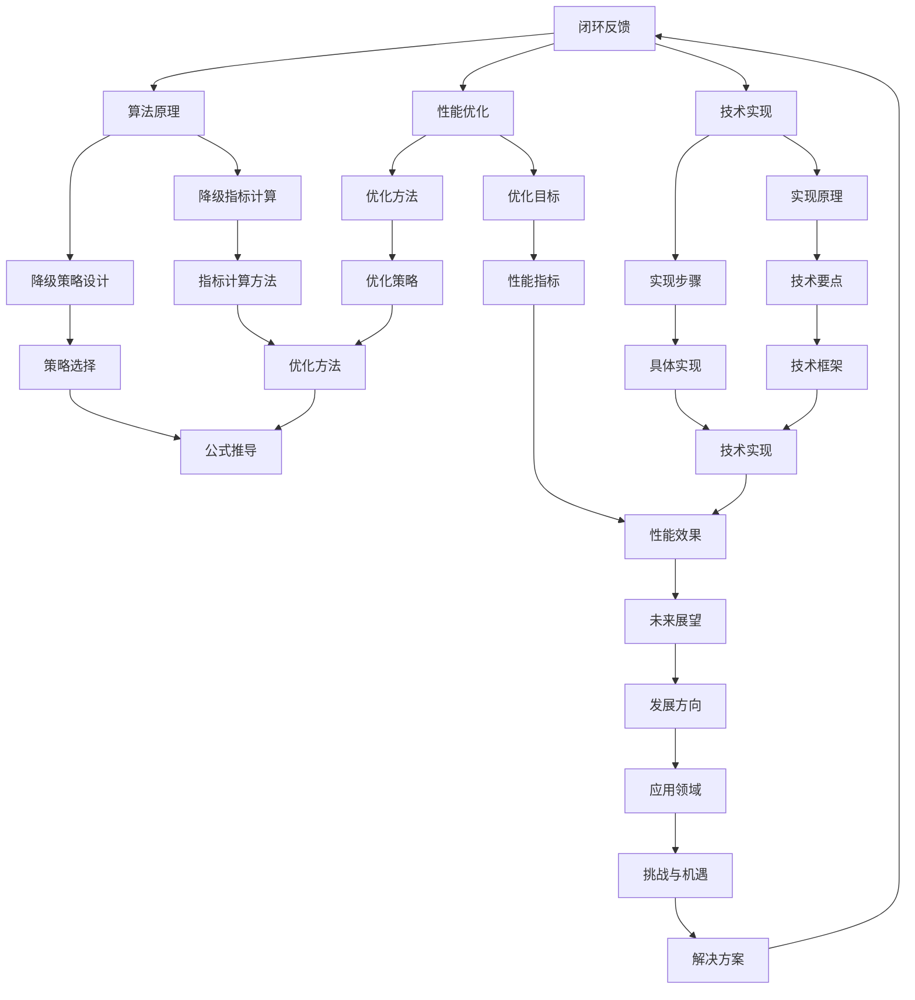

                 

# 服务降级与服务隔离在LLM应用中的应用

## 摘要

本文旨在探讨服务降级与服务隔离在大型语言模型（LLM）应用中的重要性及其实际应用。随着人工智能技术的发展，LLM应用在处理海量数据、提供实时响应等方面扮演着越来越重要的角色。然而，这些应用在面对高负载、系统资源不足等情况下，往往会出现性能下降、服务质量下降等问题。本文将详细分析服务降级与服务隔离的概念、原理、架构设计、算法原理、技术实现以及在实际LLM应用中的具体实践和性能优化策略，旨在为开发者提供一套完整的服务稳定性和性能优化方案。

## 关键词

- 服务降级
- 服务隔离
- 大型语言模型（LLM）
- 架构设计
- 算法原理
- 技术实现
- 性能优化

## 引言

大型语言模型（LLM）作为人工智能领域的一项前沿技术，已在自然语言处理、问答系统、文本生成等多个场景中得到了广泛应用。然而，随着用户数量和数据处理需求的增加，LLM应用面临着一系列挑战，如高负载、系统资源不足等，这些因素可能导致服务性能下降，影响用户体验。因此，如何在保持服务可用性的同时，确保系统性能和稳定性，成为了开发者需要解决的关键问题。

服务降级与服务隔离是两种常见的系统稳定性优化策略。服务降级通过降低系统部分功能或性能，以保证核心功能的可用性；服务隔离通过将系统中的不同服务进行隔离，以防止故障在系统中传播。本文将围绕这两个主题，结合LLM应用的实际情况，探讨其在服务稳定性优化中的具体应用。

## 第一部分：服务降级与服务隔离概述

### 第1章：服务降级与服务隔离的概念与原理

#### 1.1.1 服务降级的定义与目的

**服务降级**是一种系统稳定性优化策略，旨在通过降低系统部分功能或性能，确保核心服务的可用性。当系统面临高负载、资源不足等紧急情况时，降级策略可以帮助系统度过难关，避免因系统崩溃而导致更严重的后果。

**定义**：服务降级是一种在系统资源受限时，通过减少服务功能或性能，以保护核心服务稳定性的策略。

**目的**：

1. **确保核心服务的可用性**：通过降低非关键服务的性能或功能，确保系统资源能够优先保障核心服务。
2. **延长系统寿命**：在高负载或资源不足时，服务降级可以缓解系统压力，延长系统寿命。
3. **降低故障风险**：通过限制系统的功能范围，降低因系统故障而导致整体崩溃的风险。

#### 1.1.2 服务隔离的概念与作用

**服务隔离**是一种通过将系统中的不同服务进行隔离，以防止故障在系统中传播的稳定性优化策略。在分布式系统中，服务隔离可以有效地隔离故障，避免故障的扩散。

**定义**：服务隔离是通过技术手段将系统中的不同服务进行隔离，以防止故障在系统中传播。

**作用**：

1. **防止故障扩散**：在分布式系统中，某个服务的故障可能会影响整个系统。通过服务隔离，可以避免故障的扩散。
2. **提高系统容错性**：服务隔离可以提高系统的容错性，使系统能够在部分服务发生故障时，依然保持其他服务的正常运行。
3. **保障数据一致性**：在分布式系统中，数据一致性是保证服务稳定性的关键。服务隔离有助于保障数据的一致性，防止因数据冲突导致的系统故障。

#### 1.1.3 服务降级与服务隔离的关系

**区别**：

1. **目的不同**：服务降级的目的是在系统资源不足时，保证核心服务的可用性；服务隔离的目的是在分布式系统中，防止故障的扩散。
2. **实施方式不同**：服务降级通常是通过减少服务的功能或性能来实现；服务隔离是通过隔离机制来实现。

**联系**：

1. **相互补充**：服务降级和服务隔离在保障系统稳定性方面具有互补作用。服务降级可以保障核心服务的可用性，服务隔离可以防止故障的扩散。
2. **协同工作**：在实际应用中，服务降级和服务隔离往往是协同工作的，通过综合应用这两种策略，可以更有效地保障系统稳定性。

#### 1.1.4 服务降级与服务隔离的发展历程

**发展历程**：

1. **早期应用**：服务降级和服务隔离的概念最早在分布式系统领域提出，旨在解决系统稳定性和可靠性问题。
2. **成熟应用**：随着云计算、分布式系统的发展，服务降级和服务隔离逐渐成为系统稳定性优化的重要手段。
3. **技术演进**：随着技术的发展，服务降级和服务隔离的策略也在不断演进，如引入自动化、智能化的降级和隔离机制。

**当前应用现状**：

1. **广泛应用**：服务降级和服务隔离已经成为分布式系统和云计算领域的重要优化策略。
2. **持续优化**：随着系统规模和复杂度的增加，服务降级和服务隔离的策略也在不断优化，以提高系统的稳定性和可靠性。

### 第2章：服务降级与服务隔离的架构设计

#### 2.1.1 服务降级的架构设计

**架构设计原则**：

1. **可靠性优先**：在设计服务降级架构时，应确保核心服务的可靠性，尽可能减少非关键服务的功能或性能。
2. **可扩展性**：服务降级架构应具备良好的可扩展性，以便在系统规模扩大时，能够灵活调整降级策略。
3. **自动化**：服务降级过程应尽可能自动化，以提高降级效率和准确性。

**架构设计要素**：

1. **监控与预警**：通过监控系统，实时监控系统的负载情况、资源使用情况等，当达到降级条件时，自动触发降级策略。
2. **降级规则**：制定合理的降级规则，包括降级条件、降级策略等，以确保降级过程的有序进行。
3. **服务隔离机制**：在服务降级的同时，应确保其他服务不受影响，通过服务隔离机制实现。

#### 2.1.2 服务隔离的架构设计

**架构设计原则**：

1. **隔离性**：服务隔离架构应确保不同服务之间的高度隔离，防止故障的扩散。
2. **容错性**：服务隔离架构应具备良好的容错性，能够在部分服务发生故障时，依然保持其他服务的正常运行。
3. **灵活性**：服务隔离架构应具备良好的灵活性，以便在系统规模和需求发生变化时，能够灵活调整隔离策略。

**架构设计要素**：

1. **服务容器化**：通过容器技术，如Docker，实现服务的隔离，确保不同服务之间的高度隔离。
2. **网络隔离**：通过虚拟局域网（VLAN）或防火墙等网络隔离技术，实现不同服务之间的隔离。
3. **故障检测与恢复**：通过故障检测机制，及时发现并恢复故障服务，确保系统的高可用性。

#### 2.1.3 服务降级与服务隔离的协同设计

**协同设计目标**：

1. **提高系统稳定性**：通过协同设计，实现服务降级与服务隔离的有机结合，提高系统的稳定性。
2. **保障核心服务可用性**：在系统资源受限时，通过服务降级保障核心服务的可用性；在分布式系统中，通过服务隔离保障核心服务的稳定性。
3. **优化系统性能**：通过协同设计，实现系统资源的合理分配和优化，提高系统性能。

**协同设计策略**：

1. **动态调整策略**：根据系统负载和资源情况，动态调整服务降级和服务隔离策略，实现系统资源的最佳配置。
2. **故障预警与联动**：通过故障预警机制，实时监测系统状态，当检测到故障时，触发服务降级和服务隔离策略，保障系统稳定性。
3. **分布式协同**：在分布式系统中，实现服务降级与服务隔离的分布式协同，确保各节点之间的协同工作，提高系统整体稳定性。

### 第3章：服务降级与服务隔离的算法原理

#### 3.1.1 服务降级的算法原理

**降级指标计算**：

1. **负载指标**：负载指标是衡量系统资源使用情况的重要指标。常见的负载指标包括CPU利用率、内存使用率、网络带宽使用率等。当这些指标达到预设阈值时，表明系统资源可能不足，需要触发降级策略。
   
   $$ Load = \frac{Current\ Load}{Maximum\ Load} $$

   其中，Current Load 为当前系统负载，Maximum Load 为最大系统负载。

2. **响应时间指标**：响应时间指标是衡量系统处理能力的重要指标。当系统响应时间超过预设阈值时，表明系统性能可能下降，需要触发降级策略。

   $$ Response\ Time = \frac{Total\ Processing\ Time}{Number\ of\ Requests} $$

   其中，Total Processing Time 为总处理时间，Number of Requests 为请求数量。

**降级策略设计**：

1. **阈值触发策略**：当系统负载或响应时间超过预设阈值时，自动触发降级策略。阈值触发策略可以根据不同的指标设置不同的阈值，以适应不同的应用场景。

2. **动态调整策略**：根据系统的实时负载情况，动态调整降级策略。当系统负载较低时，可以适当放松降级条件，提高系统性能；当系统负载较高时，可以严格降级条件，确保系统稳定性。

3. **多级降级策略**：将降级策略分为多个级别，根据系统负载的严重程度，依次触发不同级别的降级策略。例如，当系统负载较轻时，可以仅降低非关键服务的性能；当系统负载严重时，可以关闭部分非关键服务，保障核心服务的可用性。

#### 3.1.2 服务隔离的算法原理

**隔离指标计算**：

1. **故障指标**：故障指标是衡量系统故障率的重要指标。常见的故障指标包括系统错误率、服务失败率等。当故障指标达到预设阈值时，表明系统可能存在故障，需要触发隔离策略。

   $$ Fault\ Rate = \frac{Number\ of\ Faults}{Total\ Requests} $$

   其中，Number of Faults 为故障次数，Total Requests 为总请求数。

2. **健康度指标**：健康度指标是衡量系统健康状态的重要指标。常见的健康度指标包括系统负载、内存使用率、CPU利用率等。当健康度指标达到预设阈值时，表明系统可能处于亚健康状态，需要触发隔离策略。

   $$ Health\ Level = \frac{Total\ Healthy\ Resources}{Total\ Resources} $$

   其中，Total Healthy Resources 为健康资源总数，Total Resources 为总资源数。

**隔离策略设计**：

1. **故障隔离策略**：当系统故障指标达到预设阈值时，自动触发故障隔离策略。故障隔离策略可以通过以下方式实现：

   - **服务重启**：当某个服务发生故障时，自动重启该服务，以恢复正常运行。
   - **服务替换**：当某个服务频繁发生故障时，替换该服务，以避免故障的扩散。
   - **负载均衡**：通过负载均衡机制，将故障服务的请求分配到其他健康服务上，降低故障服务的影响。

2. **健康度隔离策略**：当系统健康度指标达到预设阈值时，自动触发健康度隔离策略。健康度隔离策略可以通过以下方式实现：

   - **资源限制**：限制系统资源的分配，确保健康资源能够优先供给关键服务。
   - **性能优化**：通过性能优化策略，提高系统资源的利用效率，降低系统负载。
   - **服务升级**：当系统健康度持续恶化时，升级相关服务，以提高系统的健康状态。

3. **多级隔离策略**：将隔离策略分为多个级别，根据系统故障的严重程度，依次触发不同级别的隔离策略。例如，当系统故障较轻时，可以仅进行故障隔离；当系统故障严重时，可以采取更严格的隔离措施，如服务替换或系统重启。

#### 3.1.3 服务降级与服务隔离算法的协同应用

**协同应用目的**：

1. **提高系统稳定性**：通过协同应用服务降级和服务隔离算法，提高系统的稳定性，确保在系统资源受限或发生故障时，系统能够保持正常运行。
2. **优化系统性能**：通过协同应用两种算法，实现系统资源的合理分配和优化，提高系统性能。
3. **降低故障风险**：通过协同应用两种算法，降低系统故障的风险，确保系统的可靠性和安全性。

**协同应用方法**：

1. **实时监测与反馈**：通过实时监测系统状态，及时获取系统负载、故障、健康度等指标，根据实时数据动态调整服务降级和服务隔离策略。
2. **联动机制**：建立服务降级和服务隔离的联动机制，当某个策略触发时，自动触发另一策略，实现协同作用。
3. **多维度评估**：从多个维度评估系统状态，如负载、故障、健康度等，综合考虑后决定是否触发服务降级或服务隔离策略。

### 第4章：服务降级与服务隔离的技术实现

#### 4.1.1 服务降级的技术实现

**实现原理**：

服务降级的技术实现主要依赖于以下三个方面：

1. **监控与预警**：通过监控系统，实时监测系统的负载情况、资源使用情况等，当达到降级条件时，自动触发降级策略。
2. **降级规则**：根据监控数据，设置合理的降级规则，包括降级条件、降级策略等，确保降级过程的有序进行。
3. **服务隔离机制**：在服务降级的同时，确保其他服务不受影响，通过服务隔离机制实现。

**实现步骤**：

1. **数据采集**：通过系统日志、性能监控工具等，实时采集系统的负载、资源使用情况等数据。
2. **阈值设置**：根据系统实际情况，设置合理的降级阈值，如CPU利用率、内存使用率等。
3. **规则定义**：根据降级阈值，定义降级规则，包括降级条件、降级策略等。
4. **自动触发**：当监控数据达到降级条件时，自动触发降级策略。
5. **服务隔离**：在降级过程中，通过服务隔离机制，确保其他服务不受影响。

#### 4.1.2 服务隔离的技术实现

**实现原理**：

服务隔离的技术实现主要依赖于以下三个方面：

1. **服务容器化**：通过容器技术，如Docker，实现服务的隔离，确保不同服务之间的高度隔离。
2. **网络隔离**：通过虚拟局域网（VLAN）或防火墙等网络隔离技术，实现不同服务之间的隔离。
3. **故障检测与恢复**：通过故障检测机制，及时发现并恢复故障服务，确保系统的高可用性。

**实现步骤**：

1. **服务容器化**：将服务部署到容器中，确保服务之间的高度隔离。
2. **网络隔离**：通过虚拟局域网（VLAN）或防火墙等网络隔离技术，实现不同服务之间的隔离。
3. **故障检测与恢复**：通过故障检测机制，及时发现故障服务，并进行自动恢复。
4. **监控与预警**：实时监控系统状态，及时发现并预警故障，确保系统稳定运行。

#### 4.1.3 服务降级与服务隔离的协同实现

**实现策略**：

1. **联动机制**：建立服务降级和服务隔离的联动机制，当某个策略触发时，自动触发另一策略，实现协同作用。
2. **多维度评估**：从多个维度评估系统状态，如负载、故障、健康度等，综合考虑后决定是否触发服务降级或服务隔离策略。
3. **动态调整**：根据系统负载和资源情况，动态调整服务降级和服务隔离策略，实现系统资源的最佳配置。

**实现步骤**：

1. **监控与预警**：实时监控系统状态，获取负载、故障、健康度等指标。
2. **联动触发**：根据监控数据，当某个策略触发时，自动触发另一策略。
3. **动态调整**：根据系统负载和资源情况，动态调整服务降级和服务隔离策略。
4. **验证与优化**：对协同实现策略进行验证和优化，确保系统稳定运行。

### 第5章：服务降级与服务隔离在LLM应用中的实践

#### 5.1.1 LLM应用中的服务降级实践

**实践背景**：

随着大型语言模型（LLM）的广泛应用，其在处理海量数据、提供实时响应等方面面临着巨大挑战。如何在高负载、资源受限等情况下，确保LLM应用的稳定性和性能，成为了开发者需要解决的关键问题。

**实践案例**：

1. **案例背景**：

   一个大型问答平台，使用LLM模型为用户提供实时问答服务。随着用户数量的增加，系统负载逐渐升高，导致部分用户在高峰时段无法得到及时响应。

2. **实践步骤**：

   - **数据采集**：通过性能监控工具，实时采集系统负载、资源使用情况等数据。
   - **阈值设置**：根据系统实际情况，设置合理的降级阈值，如CPU利用率、内存使用率等。
   - **规则定义**：定义降级规则，当系统负载达到阈值时，触发降级策略。
   - **自动触发**：当系统负载达到阈值时，自动触发降级策略，降低部分服务的性能，确保核心服务的可用性。
   - **效果评估**：评估降级策略的效果，根据实际效果调整阈值和规则。

**实践效果**：

通过实施服务降级策略，有效缓解了系统负载，提高了系统的响应速度，确保了核心服务的可用性。

#### 5.1.2 LLM应用中的服务隔离实践

**实践背景**：

在分布式系统中，服务隔离是保障系统稳定性和可靠性的一种有效策略。对于LLM应用而言，如何在分布式环境中实现服务隔离，防止故障的扩散，成为了关键问题。

**实践案例**：

1. **案例背景**：

   一个分布式问答系统，由多个节点组成，为用户提供实时问答服务。在一次意外情况下，某个节点发生了故障，导致整个系统瘫痪。

2. **实践步骤**：

   - **服务容器化**：将服务部署到容器中，确保服务之间的高度隔离。
   - **网络隔离**：通过虚拟局域网（VLAN）或防火墙等网络隔离技术，实现不同服务之间的隔离。
   - **故障检测与恢复**：通过故障检测机制，及时发现故障节点，并进行自动恢复。
   - **监控与预警**：实时监控系统状态，及时发现并预警故障。
   - **效果评估**：评估服务隔离策略的效果，根据实际效果调整隔离策略。

**实践效果**：

通过实施服务隔离策略，成功隔离了故障节点，避免了故障的扩散，提高了系统的可靠性。

### 第6章：服务降级与服务隔离的性能优化

#### 6.1.1 服务降级的性能优化策略

**优化目标**：

1. **提高系统响应速度**：通过优化服务降级策略，提高系统的响应速度，确保用户得到及时的服务。
2. **降低系统负载**：通过优化降级策略，降低系统负载，提高系统资源利用率。
3. **提高系统稳定性**：通过优化降级策略，提高系统的稳定性，减少故障发生的概率。

**优化方法**：

1. **动态调整阈值**：根据系统负载和资源情况，动态调整降级阈值，实现系统资源的最佳配置。
2. **优化降级规则**：根据系统实际情况，优化降级规则，确保降级策略的有效性和合理性。
3. **多级降级策略**：采用多级降级策略，根据系统负载的严重程度，依次触发不同级别的降级策略。
4. **优化服务性能**：对降级后的服务进行性能优化，提高其处理速度和响应能力。

#### 6.1.2 服务隔离的性能优化策略

**优化目标**：

1. **提高系统可靠性**：通过优化服务隔离策略，提高系统的可靠性，减少故障发生的概率。
2. **降低故障影响范围**：通过优化隔离策略，降低故障对系统的影响范围，确保其他服务的正常运行。
3. **提高系统性能**：通过优化隔离策略，提高系统性能，减少系统资源的浪费。

**优化方法**：

1. **优化故障检测机制**：提高故障检测的准确性和实时性，及时发现故障并隔离。
2. **优化故障恢复机制**：优化故障恢复策略，提高故障恢复的速度和成功率。
3. **优化网络隔离策略**：优化网络隔离策略，提高隔离效果，防止故障的扩散。
4. **优化资源分配策略**：根据系统负载和资源情况，优化资源分配策略，提高资源利用率。

#### 6.1.3 服务降级与服务隔离的协同性能优化

**协同优化目的**：

1. **提高系统整体稳定性**：通过协同优化服务降级和服务隔离策略，提高系统的整体稳定性，减少故障发生的概率。
2. **提高系统性能**：通过协同优化，实现系统资源的最佳配置，提高系统性能。
3. **降低运维成本**：通过协同优化，简化运维工作，降低运维成本。

**协同优化方法**：

1. **联动优化**：建立服务降级和服务隔离的联动机制，当某个策略优化时，自动调整另一策略，实现协同优化。
2. **多维度评估**：从多个维度评估系统状态，如负载、故障、健康度等，综合考虑后进行优化。
3. **动态调整**：根据系统负载和资源情况，动态调整服务降级和服务隔离策略，实现系统资源的最佳配置。

### 第7章：服务降级与服务隔离的未来展望

#### 7.1.1 服务降级与服务隔离的发展趋势

**当前趋势**：

1. **自动化与智能化**：随着人工智能技术的发展，服务降级和服务隔离策略逐渐向自动化和智能化方向发展。自动化和智能化的降级和隔离机制可以提高系统的稳定性和可靠性。
2. **分布式系统应用**：在分布式系统中，服务降级和服务隔离策略得到了广泛应用。随着分布式系统的不断发展和完善，服务降级和服务隔离策略的应用前景将更加广阔。
3. **高性能需求**：随着用户对系统性能的要求不断提高，服务降级和服务隔离策略将更加注重高性能的实现。

**未来预测**：

1. **更先进的算法**：未来，随着人工智能技术的发展，服务降级和服务隔离策略将引入更先进的算法，实现更高效的优化。
2. **更广泛的应用**：随着分布式系统和云计算的普及，服务降级和服务隔离策略将在更多领域得到应用。
3. **集成化发展**：服务降级和服务隔离策略将与其他系统优化技术，如负载均衡、缓存技术等，实现集成化发展，提高系统的整体性能和稳定性。

#### 7.1.2 服务降级与服务隔离在LLM应用中的未来应用

**未来应用方向**：

1. **实时响应优化**：在LLM应用中，服务降级和服务隔离策略将主要用于优化系统的实时响应能力，确保在高峰时段为用户提供稳定的服务。
2. **资源优化**：通过服务降级和服务隔离策略，实现系统资源的最佳配置，提高资源利用率。
3. **故障预防与恢复**：通过服务降级和服务隔离策略，提高系统的故障预防能力，减少故障对系统的影响。

**未来挑战与机遇**：

**挑战**：

1. **复杂性**：随着系统规模的扩大，服务降级和服务隔离策略的复杂性将增加，如何有效地管理和优化这些策略将成为一大挑战。
2. **实时性**：在实时性要求较高的场景中，如何快速响应系统变化，实施有效的降级和隔离策略，是一个重要的挑战。

**机遇**：

1. **技术创新**：随着人工智能技术的发展，服务降级和服务隔离策略将引入更多的创新技术，提高系统的稳定性和可靠性。
2. **应用拓展**：随着LLM应用的不断扩展，服务降级和服务隔离策略将在更多领域得到应用，为开发者提供更多的解决方案。

### 附录

#### 附录A：服务降级与服务隔离常用工具与资源

**常用工具介绍**：

1. **Prometheus**：开源监控系统，用于实时监控系统的性能和健康状况。
2. **Grafana**：开源监控和可视化工具，与Prometheus集成，提供丰富的监控图表和报警功能。
3. **Docker**：开源容器化技术，用于实现服务的隔离和部署。
4. **Kubernetes**：开源容器编排平台，用于管理和优化容器化应用。

**资源链接**：

- Prometheus官网：[https://prometheus.io/](https://prometheus.io/)
- Grafana官网：[https://grafana.com/](https://grafana.com/)
- Docker官网：[https://docker.com/](https://docker.com/)
- Kubernetes官网：[https://kubernetes.io/](https://kubernetes.io/)

#### 附录B：服务降级与服务隔离算法示例代码

**降级指标计算**：

```python
def calculate_load(request_count, system_capacity):
    load = request_count / system_capacity
    return load
```

**降级策略设计**：

```python
def trigger_degradation(load_threshold):
    if load > load_threshold:
        # 触发降级策略
        print("触发降级策略")
    else:
        # 保持当前状态
        print("保持当前状态")
```

**隔离指标计算**：

```python
def calculate_fault_rate(fault_count, total_requests):
    fault_rate = fault_count / total_requests
    return fault_rate
```

**隔离策略设计**：

```python
def trigger_isolation(fault_threshold):
    if fault_rate > fault_threshold:
        # 触发隔离策略
        print("触发隔离策略")
    else:
        # 保持当前状态
        print("保持当前状态")
```

#### 附录C：服务降级与服务隔离应用案例分析

**案例背景**：

一个大型电商平台，在高峰时段，用户数量剧增，导致系统负载急剧上升，部分用户无法正常访问。

**案例分析**：

1. **数据采集**：通过Prometheus等监控工具，实时采集系统负载、故障等数据。
2. **阈值设置**：设置合理的负载阈值和故障阈值，如CPU利用率90%、故障率5%等。
3. **降级规则**：当系统负载达到阈值时，触发服务降级策略，降低非关键服务的性能。
4. **隔离机制**：当系统故障率达到阈值时，触发服务隔离策略，隔离故障服务。
5. **效果评估**：通过Grafana等可视化工具，实时监控系统状态，评估降级和隔离策略的效果。

**案例总结**：

通过实施服务降级和服务隔离策略，成功缓解了系统高峰时段的负载压力，提高了系统的稳定性和可靠性，确保了用户的正常访问。

## 核心概念与联系

### 服务降级与服务隔离的Mermaid流程图



### 服务降级算法原理

**降级指标计算**

降级指标主要用于评估系统的负载情况和处理能力，常见的降级指标包括：

$$
Load = \frac{Request\ Count}{System\ Capacity}
$$

其中，Request Count 表示一段时间内系统收到的请求总数，System Capacity 表示系统的处理能力。

**降级策略设计**

降级策略是根据降级指标来判断是否执行降级操作。常见的降级策略包括：

1. **阈值触发策略**：当系统负载或响应时间超过预设阈值时，自动触发降级策略。
2. **动态调整策略**：根据系统的实时负载情况，动态调整降级策略。
3. **多级降级策略**：将降级策略分为多个级别，根据系统负载的严重程度，依次触发不同级别的降级策略。

### 服务降级算法示例

**伪代码**：

```python
def service_degradation(load_threshold):
    current_load = get_current_load()
    if current_load > load_threshold:
        print("触发降级策略")
        reduce_service_performance()
    else:
        print("保持当前状态")
```

**具体实现**：

```python
def get_current_load():
    # 获取当前系统负载
    pass

def reduce_service_performance():
    # 降低服务性能
    pass
```

### 服务降级策略解释

**阈值触发策略**：

当系统负载达到或超过预设阈值时，触发降级策略。这种策略简单有效，适用于大多数场景。例如：

```python
def threshold_based_degradation(load_threshold):
    current_load = get_current_load()
    if current_load > load_threshold:
        # 触发降级策略
        print("触发降级策略，当前负载：", current_load)
        # 执行降级操作，如减少响应时间、减少并发请求等
    else:
        print("当前负载正常，无需降级")
```

**动态调整策略**：

根据系统的实时负载情况，动态调整降级阈值和策略。这种策略更加灵活，但实现起来相对复杂。例如：

```python
def dynamic_degradation():
    current_load = get_current_load()
    if current_load > high_threshold:
        # 执行严格降级策略
        print("执行严格降级策略")
    elif current_load > medium_threshold:
        # 执行中等降级策略
        print("执行中等降级策略")
    else:
        # 保持当前状态
        print("保持当前状态")
```

**多级降级策略**：

将降级策略分为多个级别，根据系统负载的严重程度，依次触发不同级别的降级策略。例如：

```python
def multi_level_degradation():
    current_load = get_current_load()
    if current_load > critical_threshold:
        # 执行最高级别降级策略
        print("执行最高级别降级策略")
    elif current_load > high_threshold:
        # 执行高级别降级策略
        print("执行高级别降级策略")
    elif current_load > medium_threshold:
        # 执行中级别降级策略
        print("执行中级别降级策略")
    else:
        # 保持当前状态
        print("保持当前状态")
```

### 总结

服务降级是确保系统在高负载情况下稳定运行的重要策略。通过合理的降级指标计算和降级策略设计，可以有效地降低系统负载，提高系统性能和稳定性。在实际应用中，开发者应根据具体场景选择合适的降级策略，实现系统的最佳性能。随着技术的不断发展，服务降级策略也将不断演进，为开发者提供更多有效的解决方案。

