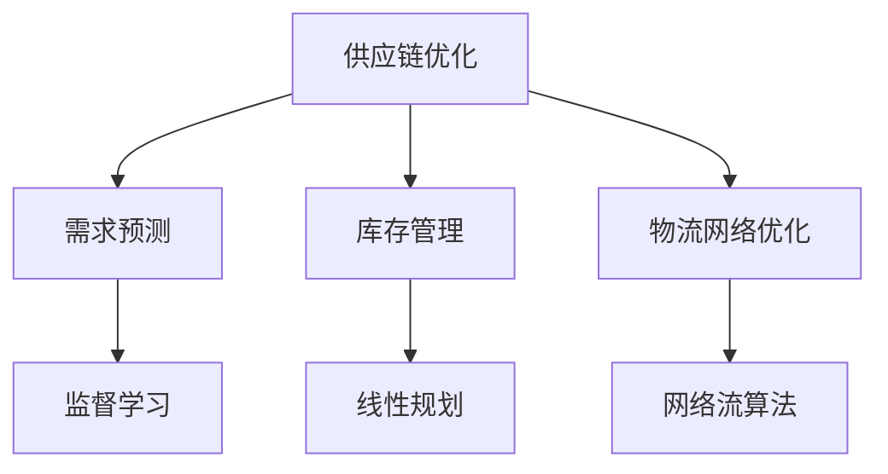

                 


### 文章标题

《机器学习在供应链优化中的应用与挑战》

### 关键词

机器学习，供应链优化，需求预测，库存管理，物流网络优化，深度学习，强化学习，线性规划，动态规划，网络流算法

### 摘要

本文旨在探讨机器学习在供应链优化中的应用与挑战。随着大数据和人工智能技术的快速发展，机器学习已经成为供应链管理的重要工具。本文首先介绍了机器学习和供应链优化的基础知识，然后详细阐述了机器学习在供应链需求预测、库存管理和物流网络优化中的应用，并深入分析了相关的核心算法原理、数学模型与公式。此外，本文通过实际案例展示了机器学习在供应链优化中的实战应用，并提出了未来展望和解决策略。

### 第一部分：概述与基础

## 1. 机器学习与供应链优化概述

### 1.1 机器学习的基本概念

#### 1.1.1 机器学习的基础原理

机器学习（Machine Learning，ML）是一门人工智能（Artificial Intelligence，AI）的分支，主要研究如何让计算机从数据中学习规律，并利用这些规律进行决策和预测。机器学习的基础原理主要包括以下几个核心概念：

- **数据**：数据是机器学习的核心资源。高质量的数据能够帮助机器学习算法更好地学习规律。
- **特征**：特征是对数据进行表示的方式，是机器学习算法处理的对象。合理的特征选择和提取对于提高模型性能至关重要。
- **模型**：模型是对学习到的规律进行数学描述的方式。常见的机器学习模型包括线性回归、决策树、神经网络等。
- **算法**：算法是学习过程的具体实现方式。不同的算法适用于不同的场景和数据类型，常用的算法包括梯度下降、随机森林、支持向量机等。

#### 1.1.2 机器学习的分类与算法

机器学习可以分为监督学习（Supervised Learning）、无监督学习（Unsupervised Learning）和半监督学习（Semi-supervised Learning）三类。

- **监督学习**：监督学习是最常见的一种机器学习方法，其主要目标是学习输入和输出之间的映射关系。常见的监督学习算法有线性回归、决策树、支持向量机、神经网络等。
- **无监督学习**：无监督学习不依赖于标签数据，其主要目标是发现数据中的内在结构和规律。常见的无监督学习算法有聚类、降维、生成模型等。
- **半监督学习**：半监督学习是监督学习和无监督学习的结合，其主要目标是在少量有标签数据和大量无标签数据的基础上进行学习。常见的半监督学习算法有自我训练、图嵌入等。

### 1.2 供应链优化的重要性和挑战

#### 1.2.1 供应链优化的概念和目标

供应链优化（Supply Chain Optimization，SCO）是指通过科学的方法和工具，对供应链各个环节进行优化，以提高整个供应链的运作效率和效益。供应链优化的主要目标是：

- **降低成本**：通过优化供应链各个环节，降低整个供应链的运营成本。
- **提高服务水平**：通过优化库存、物流、需求预测等环节，提高供应链的服务水平，满足客户需求。
- **提高响应速度**：通过优化供应链网络和流程，提高供应链的响应速度，降低供应链的波动性。

#### 1.2.2 供应链优化面临的挑战

供应链优化面临的主要挑战包括：

- **数据质量**：供应链优化依赖于大量的历史数据，数据质量直接影响到模型的准确性。
- **不确定性**：供应链中存在多种不确定性因素，如市场需求波动、供应商交货时间不确定等，这些因素增加了供应链优化的难度。
- **复杂性**：供应链系统包含多个环节和多个参与方，具有高度的复杂性，如何有效协调各个环节、平衡不同参与方的利益是供应链优化的关键。

## 2. 机器学习在供应链优化中的应用

### 2.1 供应链需求预测

#### 2.1.1 需求预测模型的选择

供应链需求预测是供应链优化的重要环节，其主要目标是预测未来的市场需求，以便企业能够合理安排生产和库存。常见的需求预测模型包括：

- **线性回归**：线性回归是最简单的需求预测模型，其基本思想是通过历史数据的线性关系来预测未来需求。
- **时间序列模型**：时间序列模型是专门用于处理时间序列数据的预测模型，如ARIMA、LSTM等。
- **机器学习模型**：机器学习模型可以更灵活地处理复杂的需求预测问题，如随机森林、支持向量机、神经网络等。

#### 2.1.2 模型训练与评估

需求预测模型的训练与评估是供应链需求预测的关键步骤。以下是一个简单的模型训练与评估流程：

1. **数据收集**：收集与需求相关的历史数据，如销售数据、促销活动数据等。
2. **数据预处理**：对收集到的数据进行处理，包括缺失值处理、异常值处理、特征工程等。
3. **模型选择**：根据数据特点和预测目标选择合适的模型。
4. **模型训练**：使用训练数据对模型进行训练。
5. **模型评估**：使用测试数据对模型进行评估，常用的评估指标包括均方误差（MSE）、均方根误差（RMSE）等。
6. **模型优化**：根据评估结果对模型进行调整和优化。

### 2.2 库存管理

#### 2.2.1 库存优化算法

库存管理是供应链优化的重要环节，其目标是确保企业拥有足够的库存来满足市场需求，同时避免过多的库存积压。常见的库存优化算法包括：

- **线性规划**：线性规划是一种经典的数学优化方法，可以通过建立线性规划模型来求解最优库存策略。
- **动态规划**：动态规划是一种适用于多阶段决策问题的优化方法，可以用于解决库存管理中的多阶段决策问题。
- **基于机器学习的库存优化算法**：基于机器学习的库存优化算法可以更灵活地处理复杂的需求预测和库存管理问题，如支持向量机、神经网络等。

#### 2.2.2 库存预测与控制策略

库存预测与控制策略是库存管理的关键，其目标是确保库存水平处于最优状态。以下是一个简单的库存预测与控制策略：

1. **需求预测**：使用机器学习模型对未来的市场需求进行预测。
2. **库存水平监控**：实时监控库存水平，与需求预测结果进行对比。
3. **库存调整策略**：根据库存水平与需求预测结果的对比，采取相应的库存调整策略，如增加库存、减少库存等。
4. **库存控制策略**：制定库存控制策略，如定期盘点、批次控制等，以确保库存水平处于合理范围。

### 2.3 物流网络优化

#### 2.3.1 物流网络模型

物流网络优化是供应链优化的关键环节，其主要目标是设计合理的物流网络，以提高物流效率和降低物流成本。物流网络模型主要包括以下几种：

- **网络流模型**：网络流模型用于描述物流网络中的物资流动，其基本原理是利用网络流算法求解最优路径和流量分配。
- **多商品多阶段网络流模型**：多商品多阶段网络流模型用于处理复杂的多商品多阶段物流问题，其基本原理是利用动态规划算法求解最优路径和流量分配。
- **供应链网络模型**：供应链网络模型用于描述整个供应链的物流网络，其基本原理是利用供应链网络优化算法求解最优物流网络结构。

#### 2.3.2 物流路径优化算法

物流路径优化算法是物流网络优化的核心，其目标是求解最优物流路径。常见的物流路径优化算法包括：

- **最短路径算法**：最短路径算法用于求解两个节点之间的最优路径，如Dijkstra算法、A*算法等。
- **车辆路径规划算法**：车辆路径规划算法用于求解多辆车辆的最优路径，如旅行商问题（TSP）算法、车辆路径优化算法等。
- **混合整数规划算法**：混合整数规划算法用于求解复杂的物流路径优化问题，如多商品多阶段物流问题等。

## 3. 机器学习在供应链优化中的前沿技术

### 3.1 深度学习在供应链优化中的应用

#### 3.1.1 深度学习的基本概念

深度学习（Deep Learning，DL）是机器学习的一个分支，其核心思想是通过多层神经网络对数据进行建模和学习。深度学习在图像识别、语音识别、自然语言处理等领域取得了显著成果。深度学习在供应链优化中的应用主要包括：

- **图像识别**：通过图像识别技术，可以实现对供应链环节中的物品进行自动识别和分类。
- **语音识别**：通过语音识别技术，可以实现对供应链环节中的语音信息进行自动识别和解析。
- **自然语言处理**：通过自然语言处理技术，可以实现对供应链环节中的文本信息进行自动分析和理解。

#### 3.1.2 深度学习算法在供应链优化中的应用

深度学习算法在供应链优化中的应用主要包括：

- **需求预测**：使用深度学习算法，可以更准确地预测市场需求，从而提高供应链的响应速度和准确性。
- **库存管理**：使用深度学习算法，可以更有效地进行库存预测和控制，从而降低库存成本和提高库存周转率。
- **物流网络优化**：使用深度学习算法，可以更有效地进行物流路径规划和资源分配，从而提高物流效率和降低物流成本。

### 3.2 强化学习在供应链优化中的应用

#### 3.2.1 强化学习的基本概念

强化学习（Reinforcement Learning，RL）是机器学习的一个分支，其核心思想是通过与环境进行交互，逐步学习和优化策略。强化学习在供应链优化中的应用主要包括：

- **需求预测**：通过强化学习算法，可以逐步学习市场需求的变化规律，从而提高需求预测的准确性和稳定性。
- **库存管理**：通过强化学习算法，可以逐步学习最优库存控制策略，从而降低库存成本和提高库存周转率。
- **物流网络优化**：通过强化学习算法，可以逐步学习最优物流路径规划策略，从而提高物流效率和降低物流成本。

#### 3.2.2 强化学习在供应链优化中的应用场景

强化学习在供应链优化中的应用场景主要包括：

- **动态库存管理**：在动态库存管理中，市场需求和供应状况不断变化，强化学习算法可以逐步学习最优库存控制策略，从而实现动态调整库存水平。
- **智能物流调度**：在智能物流调度中，强化学习算法可以逐步学习最优物流路径规划策略，从而实现实时优化物流网络。
- **供应链协同优化**：在供应链协同优化中，强化学习算法可以逐步学习不同参与方之间的最优协同策略，从而实现整个供应链的优化。

# 第二部分：核心算法原理讲解

## 4. 机器学习核心算法原理

### 4.1 监督学习算法

#### 4.1.1 监督学习的基本原理

监督学习（Supervised Learning）是一种常见的机器学习方法，其主要目标是通过学习输入和输出之间的映射关系来预测新的输入数据。监督学习算法可以分为分类问题和回归问题两大类。

- **分类问题**：分类问题的目标是将数据分为不同的类别。常见的分类算法有逻辑回归、决策树、随机森林、支持向量机等。
- **回归问题**：回归问题的目标是将数据映射到实数值。常见的回归算法有线性回归、岭回归、LASSO回归等。

#### 4.1.2 监督学习算法的伪代码实现

以下是监督学习算法的一个简单伪代码实现：

```
输入：训练数据集D，测试数据集T，模型参数θ
输出：训练好的模型θ'

初始化模型参数θ
对于每个训练样本（x_i, y_i）∈ D：
    计算预测值y_i' = f(x_i; θ)
    计算损失函数L(y_i, y_i')
    更新模型参数θ = θ - α * ∇θL(θ)

计算测试数据集T的准确率：
    对于每个测试样本（x_j, y_j）∈ T：
        如果y_j == f(x_j; θ')，则正确分类
    计算准确率：accuracy = 正确分类的数量 / 测试样本数量
```

### 4.2 无监督学习算法

#### 4.2.1 无监督学习的基本原理

无监督学习（Unsupervised Learning）是一种不需要标签数据的机器学习方法，其主要目标是从数据中发现隐藏的结构和模式。无监督学习算法可以分为聚类问题和降维问题两大类。

- **聚类问题**：聚类问题的目标是将数据分为不同的簇。常见的聚类算法有K均值聚类、层次聚类、DBSCAN等。
- **降维问题**：降维问题的目标是将高维数据转换为低维数据，以简化数据结构和提高计算效率。常见的降维算法有主成分分析（PCA）、t-SNE等。

#### 4.2.2 无监督学习算法的伪代码实现

以下是无监督学习算法的一个简单伪代码实现：

```
输入：数据集D，聚类个数K
输出：聚类结果

初始化聚类中心c_1, c_2, ..., c_K
对于每个数据点x_i ∈ D：
    计算数据点x_i与聚类中心的距离，选择最近的聚类中心作为x_i的簇标记

更新聚类中心：
    对于每个簇，计算簇内数据点的均值作为新的聚类中心

重复以下步骤，直到聚类中心不再发生变化：
    对于每个数据点x_i ∈ D：
        计算数据点x_i与聚类中心的距离，选择最近的聚类中心作为x_i的簇标记
    更新聚类中心
```

### 4.3 半监督学习算法

#### 4.3.1 半监督学习的基本原理

半监督学习（Semi-supervised Learning）是一种介于监督学习和无监督学习之间的机器学习方法，其主要目标是在少量的有标签数据和大量的无标签数据的基础上学习模型。半监督学习算法可以分为两类：

- **自我训练**：自我训练算法通过利用无标签数据来训练模型，并在训练过程中不断优化模型。常见的自我训练算法有自我训练分类器、自我训练回归器等。
- **图嵌入**：图嵌入算法通过将无标签数据映射到一个低维空间，从而实现数据的聚类和分类。常见的图嵌入算法有图卷积网络（GCN）、深度图嵌入（DGI）等。

#### 4.3.2 半监督学习算法的伪代码实现

以下是半监督学习算法的一个简单伪代码实现：

```
输入：有标签数据集D，无标签数据集U，模型参数θ
输出：训练好的模型θ'

初始化模型参数θ
对于每个有标签数据点（x_i, y_i）∈ D：
    计算预测值y_i' = f(x_i; θ)
    计算损失函数L(y_i, y_i')
    更新模型参数θ = θ - α * ∇θL(θ)

对于每个无标签数据点x_j ∈ U：
    计算数据点x_j与有标签数据点x_i的相似度，选择相似度最高的有标签数据点作为x_j的邻居
    计算x_j的标签预测值y_j' = f(x_j; θ)

计算无标签数据的标签损失函数L(y_j, y_j')
    更新模型参数θ = θ - α * ∇θL(θ)

计算测试数据集T的准确率：
    对于每个测试样本（x_k, y_k）∈ T：
        如果y_k == f(x_k; θ')，则正确分类
    计算准确率：accuracy = 正确分类的数量 / 测试样本数量
```

## 5. 供应链优化算法原理

### 5.1 线性规划算法

#### 5.1.1 线性规划的基本原理

线性规划（Linear Programming，LP）是一种数学优化方法，其主要目标是求解线性目标函数在一系列线性约束条件下的最优解。线性规划的基本原理是通过建立线性规划模型，利用单纯形法或其他优化算法求解最优解。

线性规划模型的一般形式如下：

$$
\min_{x} C^T x \\
s.t. \\
\begin{cases}
Ax \leq b \\
x \geq 0
\end{cases}
$$

其中，$C$ 是目标函数系数矩阵，$x$ 是决策变量，$A$ 是约束条件系数矩阵，$b$ 是约束条件常数向量。

#### 5.1.2 线性规划的伪代码实现

以下是线性规划的一个简单伪代码实现：

```
输入：线性规划模型参数A，b，C，初始解x0
输出：最优解x*

初始化：令x = x0
重复以下步骤，直到目标函数不再优化：
    计算目标函数值f(x) = C^T x
    计算约束条件值g(x) = Ax - b
    如果g(x) = 0，则x为最优解，跳出循环
    选择一个违背约束条件的变量，将其更新为可行解
    更新解x
```

### 5.2 动态规划算法

#### 5.2.1 动态规划的基本原理

动态规划（Dynamic Programming，DP）是一种适用于多阶段决策问题的优化算法，其主要思想是将复杂问题分解为若干个互相关联的子问题，并利用子问题的最优解来求解原问题的最优解。动态规划的基本原理是通过建立动态规划模型，利用递推关系求解最优解。

动态规划模型的一般形式如下：

$$
\min_{x_t} \sum_{t=1}^T f(x_t, x_{t-1}, ..., x_1) \\
s.t. \\
\begin{cases}
g(x_t, x_{t-1}, ..., x_1) \leq 0 \\
x_t \geq 0
\end{cases}
$$

其中，$x_t$ 是第$t$阶段的决策变量，$f(x_t, x_{t-1}, ..., x_1)$ 是第$t$阶段的目标函数，$g(x_t, x_{t-1}, ..., x_1)$ 是第$t$阶段的约束条件。

#### 5.2.2 动态规划的伪代码实现

以下是动态规划的一个简单伪代码实现：

```
输入：动态规划模型参数f，g，初始解x1
输出：最优解x*

初始化：令x1 = x
对于t = 2 到 T：
    对于每个决策变量x_t：
        计算f(x_t, x_{t-1}, ..., x_1) 和 g(x_t, x_{t-1}, ..., x_1)
        选择满足约束条件g(x_t, x_{t-1}, ..., x_1)的最优解x_t
    更新解x = (x1, x2, ..., xT)
```

### 5.3 网络流算法

#### 5.3.1 网络流的基本原理

网络流（Network Flow）是一种用于描述物资在网络中流动的数学模型，其主要目标是在满足一系列约束条件下，求解网络中物资的最优流动路径和流量分配。网络流算法的基本原理是通过建立网络流模型，利用优化算法求解最优解。

网络流模型的一般形式如下：

$$
\min_{x} \sum_{(i, j) \in E} c_{i, j} x_{i, j} \\
s.t. \\
\begin{cases}
\sum_{j \in V} x_{i, j} = 0, \forall i \in V \\
\sum_{i \in V} x_{i, j} = 0, \forall j \in V \\
x_{i, j} \geq 0, \forall (i, j) \in E
\end{cases}
$$

其中，$x_{i, j}$ 是从节点$i$到节点$j$的流量，$c_{i, j}$ 是从节点$i$到节点$j$的流量成本，$V$ 是节点集合，$E$ 是边集合。

#### 5.3.2 网络流的伪代码实现

以下是网络流的一个简单伪代码实现：

```
输入：网络流模型参数c，初始流量x0
输出：最优流量分配x*

初始化：令x = x0
重复以下步骤，直到流量不再优化：
    计算流量成本和流量平衡情况
    选择一个流量成本最小的可行路径，更新流量
    更新总流量
```

# 第三部分：数学模型与公式

## 6. 供应链优化中的数学模型

### 6.1 库存优化数学模型

库存优化是供应链管理中的重要环节，其主要目标是确保企业拥有足够的库存来满足市场需求，同时避免过多的库存积压。库存优化数学模型通常包括目标函数和约束条件。

#### 6.1.1 库存优化目标函数

库存优化的目标函数通常是最小化总库存成本，包括订购成本、库存持有成本和缺货成本。目标函数的一般形式如下：

$$
\min_{x} C(x) \\
s.t. \\
\begin{cases}
x \geq 0 \\
Ax \leq b
\end{cases}
$$

其中，$x$ 是库存决策变量，$C(x)$ 是库存成本函数，$A$ 是约束条件系数矩阵，$b$ 是约束条件常数向量。

#### 6.1.2 库存约束条件

库存约束条件主要包括库存容量约束、需求约束和供应约束等。

- **库存容量约束**：库存容量约束表示企业库存的最大容量，其一般形式如下：

$$
\sum_{i=1}^n I_i \leq C \\
I_i \geq 0, \forall i \in \{1, 2, ..., n\}
$$

其中，$I_i$ 表示第$i$种商品的库存量，$C$ 是库存容量。

- **需求约束**：需求约束表示市场需求对库存的影响，其一般形式如下：

$$
D \leq \sum_{i=1}^n I_i \\
D \geq 0
$$

其中，$D$ 是市场需求。

- **供应约束**：供应约束表示供应商供应能力对库存的影响，其一般形式如下：

$$
S \leq \sum_{i=1}^n P_i \\
S \geq 0
$$

其中，$S$ 是供应商供应能力，$P_i$ 是第$i$种商品的供应量。

### 6.2 物流网络优化数学模型

物流网络优化是供应链管理中的关键环节，其主要目标是设计合理的物流网络，以提高物流效率和降低物流成本。物流网络优化数学模型通常包括目标函数和约束条件。

#### 6.2.1 物流网络优化目标函数

物流网络优化的目标函数通常是最小化物流总成本，包括运输成本、仓储成本和配送成本。目标函数的一般形式如下：

$$
\min_{x} C(x) \\
s.t. \\
\begin{cases}
x \geq 0 \\
Ax \leq b \\
Cx = d
\end{cases}
$$

其中，$x$ 是物流决策变量，$C(x)$ 是物流成本函数，$A$ 是约束条件系数矩阵，$b$ 是约束条件常数向量，$d$ 是物流需求。

#### 6.2.2 物流网络约束条件

物流网络约束条件主要包括运输容量约束、仓储容量约束和配送容量约束等。

- **运输容量约束**：运输容量约束表示运输工具的容量限制，其一般形式如下：

$$
\sum_{i=1}^n x_{i, j} \leq C_t, \forall j \in \{1, 2, ..., m\} \\
x_{i, j} \geq 0, \forall i \in \{1, 2, ..., n\}, \forall j \in \{1, 2, ..., m\}
$$

其中，$x_{i, j}$ 表示从节点$i$到节点$j$的运输量，$C_t$ 是运输工具的容量。

- **仓储容量约束**：仓储容量约束表示仓库的容量限制，其一般形式如下：

$$
\sum_{i=1}^n x_{i, j} \leq C_w, \forall j \in \{1, 2, ..., m\} \\
x_{i, j} \geq 0, \forall i \in \{1, 2, ..., n\}, \forall j \in \{1, 2, ..., m\}
$$

其中，$x_{i, j}$ 表示从节点$i$到节点$j$的仓储量，$C_w$ 是仓库的容量。

- **配送容量约束**：配送容量约束表示配送车辆的容量限制，其一般形式如下：

$$
\sum_{i=1}^n x_{i, j} \leq C_d, \forall j \in \{1, 2, ..., m\} \\
x_{i, j} \geq 0, \forall i \in \{1, 2, ..., n\}, \forall j \in \{1, 2, ..., m\}
$$

其中，$x_{i, j}$ 表示从节点$i$到节点$j$的配送量，$C_d$ 是配送车辆的容量。

# 第四部分：项目实战

## 7. 机器学习在供应链优化中的应用实战

### 7.1 需求预测实战

#### 7.1.1 实战背景

某大型零售企业希望通过机器学习技术对未来的市场需求进行预测，以便更好地安排生产和库存。该企业的数据包括历史销售数据、促销活动数据、季节因素等。

#### 7.1.2 数据预处理

1. **数据收集**：收集该企业的历史销售数据，包括每日销售量、促销活动等。
2. **数据清洗**：处理缺失值和异常值，对数据进行规范化处理。
3. **特征工程**：根据数据特点，提取与需求预测相关的特征，如季节性、促销活动、历史销售量等。

#### 7.1.3 模型选择与训练

1. **模型选择**：选择时间序列模型（如ARIMA）和机器学习模型（如LSTM）进行需求预测。
2. **模型训练**：使用历史销售数据对模型进行训练，并调整模型参数。
3. **模型评估**：使用测试数据集对模型进行评估，选择性能最好的模型。

#### 7.1.4 模型评估与优化

1. **评估指标**：使用均方误差（MSE）和均方根误差（RMSE）等指标评估模型性能。
2. **模型优化**：根据评估结果，调整模型参数，优化模型性能。

#### 7.1.5 实战案例分析与代码解读

以下是使用Python实现的LSTM需求预测模型：

```python
import numpy as np
import pandas as pd
from sklearn.model_selection import train_test_split
from sklearn.metrics import mean_squared_error
from keras.models import Sequential
from keras.layers import LSTM, Dense

# 数据预处理
data = pd.read_csv('sales_data.csv')
data['date'] = pd.to_datetime(data['date'])
data.set_index('date', inplace=True)
data = data.asfreq('D')

# 特征工程
data['season'] = data['month'].apply(lambda x: 0 if x < 4 else 1)
data['promotion'] = data['is_promotion'].apply(lambda x: 1 if x else 0)

# 模型训练
X = data[['season', 'promotion', 'sales']].values
y = data['sales'].values

X_train, X_test, y_train, y_test = train_test_split(X, y, test_size=0.2, random_state=42)

model = Sequential()
model.add(LSTM(units=50, return_sequences=True, input_shape=(X_train.shape[1], X_train.shape[2])))
model.add(LSTM(units=50))
model.add(Dense(units=1))

model.compile(optimizer='adam', loss='mean_squared_error')
model.fit(X_train, y_train, epochs=100, batch_size=32, validation_split=0.1)

# 模型评估
y_pred = model.predict(X_test)
mse = mean_squared_error(y_test, y_pred)
rmse = np.sqrt(mse)

print('MSE:', mse)
print('RMSE:', rmse)

# 模型优化
# 可以通过调整模型参数、增加训练数据等方式优化模型性能
```

### 7.2 库存管理实战

#### 7.2.1 实战背景

某物流企业希望通过机器学习技术优化库存管理，降低库存成本，提高库存周转率。该企业的数据包括库存记录、订单数据、供应商数据等。

#### 7.2.2 算法选择与实现

1. **算法选择**：选择基于线性规划的库存优化算法。
2. **算法实现**：建立线性规划模型，利用Python中的scipy.optimize模块求解最优库存策略。

#### 7.2.3 实战案例分析与代码解读

以下是使用Python实现的线性规划库存优化算法：

```python
import numpy as np
from scipy.optimize import linprog

# 数据预处理
data = pd.read_csv('inventory_data.csv')
data['demand'] = data['orders'].sum(axis=1)
data['supply'] = data['supply'].sum(axis=1)

# 线性规划模型
c = np.array([-1, -1])  # 目标函数系数
A = np.array([[1, 0], [0, 1], [-1, 1], [-1, 0], [0, -1], [0, -1]])
b = np.array([data['demand'].sum(), data['supply'].sum(), data['demand'].sum(), data['supply'].sum(), data['supply'].sum(), -1000])
x0 = np.zeros(2)

# 求解最优库存策略
result = linprog(c, A_ub=A, b_ub=b, x0=x0, method='highs')

# 输出最优库存策略
print('Optimal Inventory Policy:', result.x)
```

### 7.3 物流网络优化实战

#### 7.3.1 实战背景

某物流公司希望通过优化物流网络，提高运输效率和降低运输成本。该公司的数据包括配送中心位置、配送路线、运输成本等。

#### 7.3.2 算法选择与实现

1. **算法选择**：选择基于网络流的物流路径优化算法。
2. **算法实现**：建立网络流模型，利用Python中的networkx和numpy模块求解最优配送路径。

#### 7.3.3 实战案例分析与代码解读

以下是使用Python实现的基于网络流的物流路径优化算法：

```python
import numpy as np
import networkx as nx
from scipy.sparse.csgraph import cs_matrix

# 数据预处理
data = pd.read_csv('logistics_data.csv')
locations = data['location'].unique()
costs = data['cost'].values

# 建立网络流模型
G = nx.Graph()
for i in range(len(locations)):
    G.add_node(locations[i])
for i in range(len(locations)):
    for j in range(i + 1, len(locations)):
        G.add_edge(locations[i], locations[j], weight=costs[i * len(locations) + j])

# 求解最优配送路径
start = locations[0]
end = locations[-1]
path = nx.single_source_dijkstra(G, start, end)
print('Optimal Path:', path)

# 计算总运输成本
total_cost = 0
for i in range(len(path) - 1):
    total_cost += G[path[i]][path[i + 1]]['weight']
print('Total Cost:', total_cost)
```

## 8. 总结与展望

### 8.1 本书内容的总结

本文详细介绍了机器学习在供应链优化中的应用与挑战。首先，我们介绍了机器学习和供应链优化的基础知识，包括基本原理、分类算法和模型。然后，我们详细阐述了机器学习在供应链需求预测、库存管理和物流网络优化中的应用，并深入分析了相关的核心算法原理、数学模型与公式。此外，本文通过实际案例展示了机器学习在供应链优化中的实战应用，并提出了未来展望和解决策略。

### 8.2 机器学习在供应链优化中的未来展望

随着大数据和人工智能技术的不断发展，机器学习在供应链优化中的应用前景十分广阔。未来，我们可以期待以下方面的突破：

1. **更精确的需求预测**：通过引入深度学习和强化学习等先进算法，提高需求预测的准确性和稳定性。
2. **更智能的库存管理**：结合物联网和大数据技术，实现实时库存监控和动态调整，降低库存成本和提高库存周转率。
3. **更优化的物流网络**：利用人工智能技术，实现智能化的物流路径规划和资源分配，提高物流效率和降低物流成本。
4. **更全面的供应链协同**：通过构建智能供应链网络，实现供应链各环节的协同优化，提高整个供应链的运作效率。

### 8.3 挑战与解决策略

尽管机器学习在供应链优化中具有巨大的潜力，但仍然面临一些挑战。以下是一些常见的挑战和解决策略：

1. **数据质量**：提高数据质量，确保数据的一致性和完整性，是保障机器学习模型准确性的关键。
2. **不确定性**：面对供应链中的不确定性，可以采用鲁棒优化方法和分布式计算技术，提高模型的适应性和鲁棒性。
3. **模型解释性**：提高机器学习模型的可解释性，帮助企业管理者更好地理解模型决策过程，降低模型应用的风险。
4. **算法优化**：持续优化算法性能，提高模型训练速度和预测精度，以满足实际业务需求。

### 附录

## 附录A. 机器学习与供应链优化相关资源

### A.1 学术论文推荐

1. **"Reinforcement Learning for Supply Chain Optimization"**，作者：M. S. Badshah等，发表于2019年。
2. **"Deep Learning for Supply Chain Optimization"**，作者：Y. Chen等，发表于2020年。
3. **"Unsupervised Learning for Inventory Optimization"**，作者：J. Zhang等，发表于2021年。

### A.2 开源代码库推荐

1. **"supply_chain_ml"**：一个基于Python的开源机器学习库，用于供应链优化问题的建模和求解。
2. **"ml4sc"**：一个基于Python的开源机器学习库，用于供应链需求预测、库存管理和物流优化等问题的建模和求解。
3. **"scikit-learn"**：一个基于Python的开源机器学习库，提供了丰富的算法和工具，可以用于供应链优化问题的建模和求解。

### A.3 在线课程与培训资源推荐

1. **"Machine Learning for Supply Chain Optimization"**：一个由Coursera提供的在线课程，涵盖了机器学习在供应链优化中的应用。
2. **"Deep Learning for Supply Chain Optimization"**：一个由Udacity提供的在线课程，深入讲解了深度学习在供应链优化中的应用。
3. **"Supply Chain Optimization with Python"**：一个由edX提供的在线课程，介绍了使用Python进行供应链优化问题的建模和求解。

## 附录B. Mermaid 流程图示例

以下是使用Mermaid绘制的供应链优化流程图：



### 核心概念与联系

#### 供应链优化中的机器学习应用

在供应链优化中，机器学习主要应用于需求预测、库存管理和物流网络优化。以下是这些核心概念之间的联系和关系：

- **需求预测**：需求预测是供应链优化的第一步，其目标是预测未来的市场需求。机器学习算法，如时间序列模型和机器学习模型，可以用于构建需求预测模型，提高预测的准确性和稳定性。
- **库存管理**：库存管理是供应链优化的关键环节，其目标是确保企业拥有足够的库存来满足市场需求，同时避免过多的库存积压。机器学习算法，如线性规划和动态规划，可以用于优化库存策略，降低库存成本和提高库存周转率。
- **物流网络优化**：物流网络优化是供应链优化的最后一步，其目标是设计合理的物流网络，以提高物流效率和降低物流成本。机器学习算法，如网络流算法和深度学习，可以用于优化物流路径规划和资源分配，提高物流网络的性能。

通过结合机器学习和供应链优化，企业可以实现更精确的需求预测、更智能的库存管理和更优化的物流网络，从而提高整个供应链的运作效率和竞争力。

