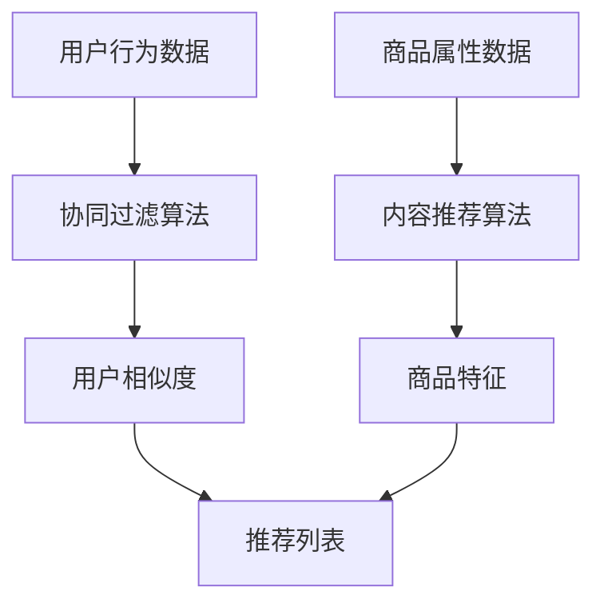

                 

### 文章标题

# 机器学习在用户体验优化中的应用

> 关键词：机器学习、用户体验优化、个性化推荐、用户行为分析、界面优化

> 摘要：随着互联网的迅猛发展，用户体验成为产品成功的关键因素。本文将从机器学习在用户体验优化中的应用入手，详细探讨其在用户体验评估、用户行为分析、个性化推荐系统以及界面优化等方面的实践和挑战，旨在为相关领域的研究者和从业者提供有价值的参考和指导。

### 目录大纲设计

#### 第一部分：机器学习基础

- **1. 机器学习概述**
  - 1.1 机器学习定义与基本概念
  - 1.2 机器学习的发展历程
  - 1.3 机器学习的主要任务

- **2. 特征工程**
  - 2.1 特征工程的重要性
  - 2.2 特征提取与选择方法
  - 2.3 特征工程实践案例

- **3. 常见机器学习算法**
  - 3.1 监督学习算法
    - 3.1.1 线性回归
    - 3.1.2 决策树
    - 3.1.3 随机森林
  - 3.2 无监督学习算法
    - 3.2.1 K-均值聚类
    - 3.2.2 主成分分析
    - 3.2.3 自编码器

- **4. 数学基础**
  - 4.1 概率论基础
    - 4.1.1 概率分布
    - 4.1.2 贝叶斯定理
  - 4.2 最优化算法
    - 4.2.1 梯度下降法
    - 4.2.2 随机优化算法

#### 第二部分：用户体验优化

- **5. 用户体验评估方法**
  - 5.1 传统用户体验评估方法
  - 5.2 基于机器学习的用户体验评估方法
  - 5.3 用户体验评估案例分析

- **6. 基于机器学习的用户行为分析**
  - 6.1 用户行为数据分析基础
  - 6.2 基于机器学习的用户行为预测
  - 6.3 用户行为分析应用案例

- **7. 基于机器学习的个性化推荐系统**
  - 7.1 推荐系统基础
  - 7.2 协同过滤算法
  - 7.3 内容推荐算法
  - 7.4 混合推荐系统

- **8. 基于机器学习的界面优化**
  - 8.1 界面设计原则
  - 8.2 机器学习在界面优化中的应用
  - 8.3 界面优化案例分析

#### 第三部分：实战案例与总结

- **9. 机器学习在用户体验优化中的应用案例**
  - 9.1 案例一：电商平台的个性化推荐系统
  - 9.2 案例二：社交媒体的用户行为分析
  - 9.3 案例三：移动应用的用户界面优化

- **10. 机器学习在用户体验优化中的挑战与展望**
  - 10.1 挑战
    - 10.1.1 数据质量与隐私问题
    - 10.1.2 模型可解释性
    - 10.1.3 模型过拟合与欠拟合
  - 10.2 展望
    - 10.2.1 机器学习与心理学结合
    - 10.2.2 用户体验优化的未来发展

---

接下来的部分，我们将逐步深入探讨机器学习在用户体验优化中的应用，为读者提供全面而深入的见解。希望通过本文的分享，能够为读者在相关领域的研究和实践中提供有益的启发和指导。让我们一起开启这段探索之旅！

### 第一部分：机器学习基础

#### 1. 机器学习概述

**1.1 机器学习定义与基本概念**

机器学习（Machine Learning）是人工智能（Artificial Intelligence, AI）的重要分支，旨在通过算法和统计模型从数据中学习，使计算机能够自动进行特定任务，而无需显式地编程。以下是机器学习的一些基本概念：

- **监督学习（Supervised Learning）**：在这种学习方式中，算法从标记数据集学习，标记数据包含输入和对应的输出，即“教师”指导计算机学习。常见的监督学习算法包括线性回归、决策树、支持向量机（SVM）等。

- **无监督学习（Unsupervised Learning）**：无监督学习不依赖于标记数据，算法的目标是找出数据中的隐含结构和模式。常见的无监督学习算法包括聚类（如K-均值聚类）、降维（如主成分分析PCA）和关联规则学习（如Apriori算法）。

- **强化学习（Reinforcement Learning）**：强化学习是通过与环境的交互来学习策略的算法，它的目标是最大化长期回报。强化学习算法包括Q学习、深度Q网络（DQN）和价值迭代等。

- **深度学习（Deep Learning）**：深度学习是机器学习的一个子领域，它依赖于深度神经网络（DNN），能够处理大量复杂数据。常见的深度学习模型包括卷积神经网络（CNN）、循环神经网络（RNN）和生成对抗网络（GAN）。

- **特征工程（Feature Engineering）**：特征工程是构建具有良好性能的模型的关键步骤，它涉及从原始数据中提取、构造和选择有用的特征。

- **模型评估（Model Evaluation）**：模型评估是评估模型性能的过程，常用的评估指标包括准确率、召回率、F1分数、均方误差（MSE）等。

**1.2 机器学习的发展历程**

机器学习的历史可以追溯到20世纪50年代，以下是几个关键里程碑：

- **1956年**：达特茅斯会议，标志着人工智能的诞生，约翰·麦卡锡等人提出了“人工智能”这个术语。

- **1960年代**：早期机器学习模型如线性回归、决策树和神经网络被提出。

- **1980年代**：支持向量机（SVM）和贝叶斯网络等新模型的出现，以及数据挖掘和统计学习理论的兴起。

- **1990年代**：K-均值聚类和神经网络的应用，以及支持向量机和决策树等算法的进一步发展。

- **2000年代**：随着计算能力和数据量的提升，深度学习开始崭露头角，卷积神经网络（CNN）在图像识别领域取得突破。

- **2010年代**：生成对抗网络（GAN）和强化学习等新模型的出现，以及在线学习、迁移学习和元学习等领域的发展。

**1.3 机器学习的主要任务**

机器学习的主要任务可以分为以下几类：

- **分类（Classification）**：将数据分为不同的类别。例如，电子邮件是否为垃圾邮件。

- **回归（Regression）**：预测一个连续的数值输出。例如，房屋价格预测。

- **聚类（Clustering）**：将数据点分组，使得同一组内的数据点相似度更高。例如，客户细分。

- **降维（Dimensionality Reduction）**：减少数据维度，同时保持数据的结构信息。例如，主成分分析（PCA）。

- **异常检测（Anomaly Detection）**：识别数据中的异常或异常行为。例如，信用卡欺诈检测。

- **生成模型（Generative Models）**：生成新的数据样本，以模拟数据的分布。例如，生成对抗网络（GAN）。

通过这些基本概念和任务的介绍，我们可以更好地理解机器学习的原理和应用。接下来的章节将深入探讨特征工程、常见机器学习算法和数学基础，为读者在用户体验优化中的实践提供坚实的理论基础。

### 2. 特征工程

**2.1 特征工程的重要性**

特征工程是机器学习过程中至关重要的一环，它涉及从原始数据中提取、构造和选择有用的特征，以便构建性能良好的模型。以下是特征工程的重要性：

1. **提高模型性能**：通过合理的特征工程，可以有效提高模型的准确性、召回率等性能指标。

2. **降低过拟合风险**：特征工程可以帮助模型更好地理解数据的真实分布，从而减少过拟合现象。

3. **简化模型复杂性**：通过特征选择，可以去除无关或冗余的特征，简化模型的复杂性，提高计算效率。

4. **增强模型泛化能力**：特征工程有助于模型在未知数据上表现良好，提高模型的泛化能力。

5. **改善可解释性**：良好的特征工程有助于解释模型的工作原理，增强模型的可解释性。

**2.2 特征提取与选择方法**

特征提取和特征选择是特征工程的两个主要步骤。下面将介绍几种常见的特征提取和特征选择方法：

- **特征提取（Feature Extraction）**：

  - **自动编码器（Autoencoders）**：自动编码器是一种无监督学习模型，用于从原始数据中提取特征。通过训练，自动编码器能够学习到数据的低维表示。

  - **主成分分析（PCA）**：PCA是一种降维技术，通过将数据投影到主成分上，降低数据的维度，同时保留数据的主要信息。

  - **特征变换（Feature Transformations）**：特征变换包括归一化、标准化、对数变换等，用于改变特征的尺度和分布，提高模型的稳定性。

- **特征选择（Feature Selection）**：

  - **过滤方法（Filter Methods）**：过滤方法通过评估特征的整体质量来选择特征，常用的方法包括方差阈值、互信息、卡方测试等。

  - **包装方法（Wrapper Methods）**：包装方法通过在模型训练过程中逐步添加或移除特征来选择最优特征子集，常用的方法包括前向选择、后向消除等。

  - **嵌入式方法（Embedded Methods）**：嵌入式方法在模型训练过程中同时进行特征选择，常用的方法包括L1正则化（LASSO）、岭回归（Ridge）等。

**2.3 特征工程实践案例**

以下是一个简单的特征工程实践案例：

假设我们有一个电商平台的用户行为数据集，包含用户的购买记录、浏览历史、点击行为等信息。我们的目标是预测用户是否会在未来30天内购买某件商品。

1. **数据预处理**：处理缺失值、异常值，将分类特征转换为数值特征。

2. **特征提取**：

   - **用户行为特征**：计算用户的浏览量、点击量、购买量等指标。
   - **时间特征**：提取用户的注册时间、最近一次购买时间等。

3. **特征选择**：

   - **过滤方法**：使用方差阈值去除方差小于0.01的特征。
   - **嵌入式方法**：使用L1正则化的逻辑回归模型选择特征。

4. **模型训练与评估**：使用训练集训练逻辑回归模型，使用交叉验证评估模型的性能。

通过这个案例，我们可以看到特征工程在数据预处理、特征提取和特征选择等方面的具体应用。合理的特征工程能够显著提高模型的预测性能和泛化能力，为用户体验优化提供有力支持。

### 3. 常见机器学习算法

**3.1 监督学习算法**

监督学习算法是机器学习中最常用的算法之一，它从标记数据中学习，以便能够对新的数据进行预测。以下是几种常见的监督学习算法：

**3.1.1 线性回归**

线性回归是一种简单的监督学习算法，用于预测一个连续的数值输出。其基本思想是通过最小化损失函数来拟合数据。以下是线性回归的伪代码：

```pseudo
# 参数初始化
theta = [任意初始值]

# 梯度下降迭代
for i in 1 to num_iterations:
    for each feature x in training_data:
        gradient = 2/m * (h(x) - y)
        theta -= learning_rate * gradient
```

其中，`h(x)`表示模型预测，`y`表示真实值，`m`表示训练数据集的大小。

**3.1.2 决策树**

决策树是一种基于树形结构进行分类或回归的算法。每个内部节点表示一个特征，每个分支表示该特征的一个取值，叶节点表示一个类别或数值预测。以下是决策树生成的伪代码：

```pseudo
# 初始化
if (base_case):
    return 叶节点

# 选择最佳特征
best_feature = 选择最佳特征

# 划分数据
subtree_left = 构建左子树
subtree_right = 构建右子树

# 返回决策树
return 节点 {特征: best_feature, 左子树: subtree_left, 右子树: subtree_right}
```

**3.1.3 随机森林**

随机森林是一种基于决策树的集成学习算法，它通过构建多个决策树，并合并它们的预测结果来提高模型的准确性。以下是随机森林的伪代码：

```pseudo
# 初始化
num_trees = [指定树的数量]

# 构建随机森林
for i in 1 to num_trees:
    for each tree:
        随机选择特征子集
        构建决策树

# 预测
for each tree:
    预测 = tree.predict(new_data)
# 合并预测
result = majority_vote(predictions)
```

**3.2 无监督学习算法**

无监督学习算法不依赖于标记数据，其目标是从未标记的数据中发现隐含的结构和模式。以下是几种常见的无监督学习算法：

**3.2.1 K-均值聚类**

K-均值聚类是一种基于距离度量的聚类算法，它通过迭代优化簇中心的位置，将数据点分为K个簇。以下是K-均值聚类的伪代码：

```pseudo
# 初始化
centroids = [随机选择K个初始中心]

# 迭代
while not converged:
    for each data point:
        赋予最近的簇中心
    计算新的簇中心
    如果簇中心变化小于阈值，则停止迭代

# 返回聚类结果
return 聚类结果
```

**3.2.2 主成分分析（PCA）**

主成分分析是一种降维技术，通过将数据投影到新的正交轴上，降低数据的维度，同时保留数据的主要信息。以下是PCA的伪代码：

```pseudo
# 初始化
X = [输入数据]

# 计算协方差矩阵
covariance_matrix = X.T * X

# 计算特征值和特征向量
eigenvalues, eigenvectors = compute_eigen(covariance_matrix)

# 选择主成分
selected_eigenvectors = select_eigenvectors(eigenvalues, num_components)

# 数据投影
X_reduced = X * selected_eigenvectors

# 返回降维后的数据
return X_reduced
```

**3.2.3 自编码器**

自编码器是一种无监督学习模型，用于从原始数据中提取特征。它由编码器和解码器两部分组成，编码器将数据压缩为低维表示，解码器尝试重建原始数据。以下是自编码器的伪代码：

```pseudo
# 编码器
encode(new_data):
    compressed_data = forward_pass(new_data, encoder_weights, encoder_biases)
    return compressed_data

# 解码器
decode(compressed_data):
    reconstructed_data = forward_pass(compressed_data, decoder_weights, decoder_biases)
    return reconstructed_data

# 训练
while not converged:
    for each new_data:
        compressed_data = encode(new_data)
        reconstructed_data = decode(compressed_data)
        calculate_loss = compute_loss(reconstructed_data, new_data)
        update_weights_and_biases = gradient_descent(loss, learning_rate)
```

通过以上对常见机器学习算法的介绍，我们可以看到这些算法在数据分析和预测中的应用。接下来，我们将讨论机器学习中的数学基础，为深入理解这些算法提供理论支持。

### 4. 数学基础

**4.1 概率论基础**

在机器学习中，概率论是理解和构建模型的重要工具。以下是一些基本的概率论概念：

**4.1.1 概率分布**

概率分布描述了一个随机变量取值的可能性。常见概率分布包括：

- **伯努利分布（Bernoulli Distribution）**：伯努利分布是一个二元分布，用于表示事件成功或失败的概率。

- **二项分布（Binomial Distribution）**：二项分布是伯努利分布的扩展，用于表示多次独立伯努利试验成功的次数。

- **正态分布（Normal Distribution）**：正态分布是最常见的连续概率分布，用于描述数据集中的数值。

- **泊松分布（Poisson Distribution）**：泊松分布用于描述在一定时间内发生某个事件的次数。

**4.1.2 贝叶斯定理**

贝叶斯定理是概率论中的一个重要公式，用于计算后验概率。贝叶斯定理如下：

$$P(A|B) = \frac{P(B|A) \cdot P(A)}{P(B)}$$

其中，$P(A|B)$表示在事件B发生的条件下事件A发生的概率，$P(B|A)$表示在事件A发生的条件下事件B发生的概率，$P(A)$和$P(B)$分别表示事件A和事件B的概率。

**4.1.3 条件概率与独立性**

条件概率描述了在某个事件发生的条件下另一个事件发生的概率。条件概率公式如下：

$$P(A|B) = \frac{P(A \cap B)}{P(B)}$$

其中，$P(A \cap B)$表示事件A和事件B同时发生的概率。

独立性描述了两个事件的发生互不影响。如果事件A和事件B相互独立，则：

$$P(A \cap B) = P(A) \cdot P(B)$$

**4.2 最优化算法**

在机器学习中，最优化算法用于调整模型参数以最小化损失函数。以下是最常用的两种最优化算法：

**4.2.1 梯度下降法**

梯度下降法是一种迭代优化算法，通过计算损失函数关于模型参数的梯度来更新参数。梯度下降法的基本步骤如下：

1. 初始化参数$\theta$。
2. 对于每个参数$\theta$，计算梯度$g(\theta) = \frac{\partial}{\partial \theta} J(\theta)$，其中$J(\theta)$是损失函数。
3. 更新参数$\theta = \theta - \alpha \cdot g(\theta)$，其中$\alpha$是学习率。

**4.2.2 随机优化算法**

随机优化算法通过随机搜索来寻找最优解，常见的随机优化算法包括遗传算法、粒子群优化算法等。以下是一个简单的遗传算法的伪代码：

```pseudo
# 初始化种群
population = [随机生成的初始解]

# 迭代
while not converged:
    # 适应度评估
    fitness_scores = evaluate_fitness(population)

    # 选择
    selected_individuals = select(population, fitness_scores)

    # 交叉
    offspring = crossover(selected_individuals)

    # 变异
    offspring = mutate(offspring)

    # 更新种群
    population = offspring

# 返回最优解
return best_individual(population)
```

通过以上数学基础的介绍，我们可以更好地理解机器学习算法的工作原理和优化方法。在接下来的部分，我们将探讨用户体验优化中的实际应用，展示机器学习如何在用户体验评估、用户行为分析和界面优化等方面发挥关键作用。

### 5. 用户体验评估方法

**5.1 传统用户体验评估方法**

用户体验（User Experience, UX）是衡量产品或服务是否满足用户需求和期望的重要指标。传统的用户体验评估方法主要包括以下几种：

1. **问卷调查**：通过设计问卷，收集用户对产品或服务的满意度、易用性、功能完整性等方面的评价。

2. **可用性测试**：邀请用户在特定的环境中使用产品或服务，观察他们的行为和反馈，以评估产品的易用性和用户体验。

3. **焦点小组**：组织一组目标用户，通过讨论和互动，收集他们对产品或服务的意见和建议。

4. **用户访谈**：与用户进行一对一的访谈，深入了解他们的使用习惯、需求和痛点。

5. **A/B测试**：通过对比不同版本的产品或服务，评估哪一种版本更能满足用户需求，从而优化用户体验。

这些传统方法各有优劣，问卷调查和用户访谈能够收集大量数据，但可能存在主观偏差；可用性测试和焦点小组能够深入了解用户需求，但成本较高且耗时较长；A/B测试能够快速验证假设，但需要足够的数据量。

**5.2 基于机器学习的用户体验评估方法**

随着机器学习技术的发展，越来越多的研究开始探索将机器学习应用于用户体验评估。基于机器学习的用户体验评估方法具有以下几个优势：

1. **数据驱动**：机器学习算法能够从大量数据中提取有用的信息，提供更加客观和全面的用户体验评估。

2. **自动化**：机器学习算法可以自动化地处理大量数据，提高评估效率。

3. **个性化**：通过分析用户的行为数据，机器学习算法能够提供个性化的用户体验评估，帮助产品或服务更好地满足用户需求。

4. **实时反馈**：机器学习算法可以实时分析用户行为，提供即时的用户体验评估，帮助企业快速响应用户反馈。

以下是一些常见的基于机器学习的用户体验评估方法：

- **用户行为分析**：通过分析用户在产品或服务中的行为数据，如点击路径、浏览时间、页面停留时间等，评估用户体验。

- **情感分析**：使用自然语言处理（NLP）技术，分析用户评论、反馈等文本数据，识别用户情感和意见。

- **图神经网络**：通过构建用户行为和交互的图模型，分析用户在系统中的关系和交互，提供全面的用户体验评估。

**5.3 用户体验评估案例分析**

以下是一个基于机器学习的用户体验评估案例：

假设一家电商平台希望通过分析用户行为数据来优化其网站界面设计，提高用户满意度。他们采取了以下步骤：

1. **数据收集**：收集用户在网站上的行为数据，如页面访问次数、点击次数、浏览时间、转化率等。

2. **特征工程**：从原始数据中提取有用的特征，如用户活跃度、页面停留时间、转化率等。

3. **模型训练**：使用机器学习算法，如随机森林或神经网络，对特征和用户体验评分进行训练。

4. **模型评估**：使用交叉验证等方法评估模型的性能，调整模型参数。

5. **应用模型**：将训练好的模型应用于新用户数据，预测其用户体验评分。

6. **优化界面设计**：根据用户体验评分，优化网站界面设计，提高用户满意度。

通过这个案例，我们可以看到基于机器学习的用户体验评估方法如何帮助企业更好地理解用户需求，优化产品和服务，提高用户体验。

### 6. 基于机器学习的用户行为分析

**6.1 用户行为数据分析基础**

用户行为分析是用户体验优化的核心任务之一。它涉及对用户在产品或服务中的行为数据进行收集、处理和分析，以便从中提取有价值的信息。以下是用户行为数据分析的基础知识：

**数据来源**：用户行为数据可以来源于多种渠道，包括：

- **Web服务器日志**：记录用户访问网站时的请求和响应信息，如页面访问次数、用户IP地址、访问时间等。
- **客户端日志**：记录用户在客户端应用中的操作行为，如点击路径、操作时长、功能使用频率等。
- **社交媒体**：收集用户在社交媒体平台上的互动和反馈信息，如评论、点赞、分享等。
- **调查问卷**：收集用户对产品或服务的评价和反馈。

**数据处理**：用户行为数据分析的第一步是数据处理。主要任务包括：

- **数据清洗**：去除重复、异常或缺失的数据，确保数据质量。
- **数据整合**：将来自不同渠道的数据进行整合，构建一个统一的数据集。
- **数据转换**：将原始数据转换为适合分析的格式，如数值化、归一化等。

**数据可视化**：数据可视化是分析数据的重要工具，它可以帮助我们直观地理解数据。常见的数据可视化方法包括：

- **柱状图**：用于展示不同类别或时间段的数据分布。
- **折线图**：用于展示数据的变化趋势。
- **散点图**：用于展示两个变量之间的关系。
- **热力图**：用于展示数据的密度分布。

**6.2 基于机器学习的用户行为预测**

基于机器学习的用户行为预测是用户行为分析的关键环节。它通过学习历史数据，预测用户未来的行为，从而帮助产品或服务优化用户体验。以下是几种常见的基于机器学习的用户行为预测方法：

**1. 时间序列分析**

时间序列分析是一种常见的方法，用于预测用户在时间维度上的行为。它基于用户历史行为数据，建立时间序列模型，如ARIMA、LSTM等，预测未来时间点的行为。

**伪代码示例：**

```python
# 导入数据
data = load_time_series_data()

# 建立时间序列模型
model = build_time_series_model(data)

# 预测未来行为
predictions = model.predict(future_time_points)
```

**2. 协同过滤**

协同过滤是一种基于用户相似度进行预测的方法。它通过分析用户之间的相似性，预测用户对未知项目的评分或行为。协同过滤分为两种类型：基于用户的协同过滤和基于项目的协同过滤。

**伪代码示例：**

```python
# 导入数据
data = load协同过滤数据()

# 计算用户相似度
user_similarity_matrix = calculate_user_similarity(data)

# 预测用户行为
predictions = predict_user_behavior(user_similarity_matrix, known_ratings, unknown_ratings)
```

**3. 强化学习**

强化学习是一种基于奖励机制进行预测的方法。它通过与环境交互，学习最优策略，以最大化长期回报。强化学习在用户行为预测中的应用包括推荐系统、智能客服等。

**伪代码示例：**

```python
# 初始化环境
environment = initialize_environment()

# 训练模型
model = train_model(environment, reward_function)

# 预测用户行为
action = model.select_action(current_state)
reward = environment.step(action)
```

**6.3 用户行为分析应用案例**

以下是一个用户行为分析的应用案例：

假设一家电商公司希望通过分析用户行为数据，提高用户转化率。他们采取了以下步骤：

1. **数据收集**：收集用户在网站上的行为数据，如页面访问次数、点击次数、购物车添加次数、购买次数等。

2. **特征工程**：提取用户行为特征，如页面停留时间、浏览深度、点击路径等。

3. **模型训练**：使用机器学习算法，如随机森林或神经网络，对用户行为特征和转化率进行训练。

4. **模型评估**：使用交叉验证等方法评估模型的性能，调整模型参数。

5. **应用模型**：将训练好的模型应用于新用户数据，预测其转化率。

6. **优化营销策略**：根据用户转化率预测结果，优化营销策略，提高用户转化率。

通过这个案例，我们可以看到基于机器学习的用户行为分析如何帮助电商公司提高用户体验和转化率。接下来，我们将探讨基于机器学习的个性化推荐系统在用户体验优化中的应用。

### 7. 基于机器学习的个性化推荐系统

**7.1 推荐系统基础**

推荐系统是一种通过分析用户的历史行为和兴趣，向用户推荐相关商品、内容或服务的系统。它广泛应用于电商、社交媒体、新闻资讯等领域，旨在提高用户满意度和转化率。以下是推荐系统的基本概念：

- **用户**：推荐系统的核心，每个用户有其独特的兴趣和行为模式。
- **物品**：用户可能感兴趣的对象，如商品、电影、音乐等。
- **评分**：用户对物品的评价，可以是显式评分（如1到5星评价）或隐式评分（如购买、浏览、点击等行为）。
- **推荐**：根据用户的兴趣和行为，推荐用户可能感兴趣的物品。

**协同过滤算法**

协同过滤是推荐系统中最常用的算法之一，分为基于用户的协同过滤（User-based Collaborative Filtering）和基于项目的协同过滤（Item-based Collaborative Filtering）。

**1. 基于用户的协同过滤**

基于用户的协同过滤通过寻找与目标用户兴趣相似的邻居用户，并根据邻居用户对物品的评分预测目标用户对物品的评分。以下是基于用户的协同过滤的伪代码：

```python
# 找到与目标用户兴趣相似的邻居用户
neighbor_users = find_similar_users(target_user, all_users, similarity_measure)

# 计算邻居用户对物品的平均评分
neighbor_user_ratings = get_average_ratings(neighbor_users, items)

# 预测目标用户对物品的评分
predicted_rating = weighted_average(neighbor_user_ratings, similarity_weights)
```

**2. 基于项目的协同过滤**

基于项目的协同过滤通过寻找与目标物品相似的邻居物品，并根据邻居物品的用户评分预测目标物品的用户评分。以下是基于项目的协同过滤的伪代码：

```python
# 找到与目标物品相似的邻居物品
neighbor_items = find_similar_items(target_item, all_items, similarity_measure)

# 计算邻居物品的用户评分
neighbor_item_ratings = get_average_ratings(users, neighbor_items)

# 预测目标物品的用户评分
predicted_rating = weighted_average(neighbor_item_ratings, similarity_weights)
```

**7.2 协同过滤算法**

协同过滤算法的核心是计算用户与用户之间的相似度或物品与物品之间的相似度。以下是几种常见的相似度计算方法：

**1. 余弦相似度**

余弦相似度是一种基于向量的相似度计算方法，计算两个向量之间的夹角余弦值。余弦相似度的计算公式如下：

$$
similarity(u, v) = \frac{u \cdot v}{\|u\| \|v\|}
$$

其中，$u$和$v$分别表示用户和物品的向量表示，$\cdot$表示点积，$\|\|$表示向量的模。

**2. 皮尔逊相关系数**

皮尔逊相关系数是一种基于统计的相似度计算方法，用于衡量两个变量之间的线性关系。皮尔逊相关系数的计算公式如下：

$$
similarity(u, v) = \frac{cov(u, v)}{\sigma_u \sigma_v}
$$

其中，$cov(u, v)$表示用户和物品的协方差，$\sigma_u$和$\sigma_v$分别表示用户和物品的标准差。

**7.3 内容推荐算法**

内容推荐算法通过分析物品的属性和特征，为用户推荐与其兴趣相关的物品。内容推荐算法可以分为基于特征的协同过滤（Hybrid Collaborative Filtering）和基于内容的推荐（Content-Based Filtering）。

**1. 基于特征的协同过滤**

基于特征的协同过滤结合了协同过滤和内容推荐的优势，通过分析物品的共现特征来推荐相关物品。以下是基于特征的协同过滤的伪代码：

```python
# 找到与目标物品共现的特征
common_features = find_common_features(target_item, all_items)

# 计算与目标物品共现的特征的权重
feature_weights = calculate_feature_weights(common_features)

# 预测用户对物品的评分
predicted_rating = weighted_average(feature_weights, item_ratings)
```

**2. 基于内容的推荐**

基于内容的推荐通过分析物品的属性和标签，为用户推荐与其兴趣相似的物品。以下是基于内容的推荐的伪代码：

```python
# 找到与目标物品相似的其他物品
similar_items = find_similar_items(target_item, all_items, feature_similarity_measure)

# 预测用户对物品的评分
predicted_rating = calculate_average_rating(similar_items, user_item_ratings)
```

**7.4 混合推荐系统**

混合推荐系统结合了协同过滤和内容推荐的优势，通过融合不同的推荐策略来提高推荐质量。以下是混合推荐系统的伪代码：

```python
# 计算协同过滤推荐得分
collaborative_score = collaborative_filter(target_user, target_item)

# 计算内容推荐得分
content_score = content_based_filter(target_user, target_item)

# 合并推荐得分
total_score = collaborative_score + content_score

# 推荐物品
recommended_items = get_top_items(total_score, all_items)
```

通过以上对推荐系统基础和算法的介绍，我们可以看到机器学习在个性化推荐系统中的应用。接下来，我们将探讨机器学习在界面优化方面的应用。

### 8. 基于机器学习的界面优化

**8.1 界面设计原则**

界面设计是用户体验的重要组成部分，其核心目标是提高用户的易用性和满意度。以下是一些常见的界面设计原则：

1. **一致性**：保持界面元素和交互方式的一致性，减少用户的学习成本。
2. **简洁性**：简化界面布局，减少不必要的元素，确保用户能够快速找到所需功能。
3. **直观性**：设计直观的导航和操作方式，确保用户能够轻松完成任务。
4. **反馈性**：及时给予用户操作反馈，增强用户的信心和满意度。
5. **响应性**：确保界面在不同设备和屏幕尺寸上的适配性，提高用户的体验。
6. **易访问性**：确保界面设计对各类用户（包括残障人士）都是可访问的。

**8.2 机器学习在界面优化中的应用**

机器学习技术为界面优化提供了新的方法，通过分析用户行为数据，可以自动调整界面元素和交互方式，以提升用户体验。以下是机器学习在界面优化中的几个应用方面：

**1. 个性化布局**

通过分析用户的历史行为数据，如点击路径、页面停留时间等，可以自动调整界面的布局，为用户提供个性化的体验。例如，对于经常访问某个功能的用户，可以将其置于显眼位置。

**2. 动态交互**

机器学习算法可以根据用户的行为模式，动态调整界面元素的交互效果。例如，用户在浏览商品列表时，可以根据用户的兴趣和浏览历史，调整商品推荐顺序和展示方式。

**3. 自动修复**

机器学习算法可以用于检测和修复界面中的潜在问题。例如，通过分析用户的错误操作记录，自动识别界面设计中的常见错误，并提出优化建议。

**4. 可视化优化**

机器学习算法可以用于优化界面设计中的可视化元素，如颜色、字体和图标。通过分析用户的反馈和行为数据，可以自动调整这些元素，以提升视觉效果和用户体验。

**8.3 界面优化案例分析**

以下是一个界面优化的案例分析：

假设一家电商平台希望通过机器学习技术优化其网站界面，提高用户的购物体验。他们采取了以下步骤：

1. **数据收集**：收集用户在网站上的行为数据，如点击路径、页面停留时间、购买行为等。

2. **特征工程**：从原始数据中提取有用的特征，如用户活跃度、页面停留时间、点击次数等。

3. **模型训练**：使用机器学习算法，如随机森林或神经网络，对用户行为特征和用户体验评分进行训练。

4. **模型评估**：使用交叉验证等方法评估模型的性能，调整模型参数。

5. **界面优化**：

   - **个性化布局**：根据用户行为数据，自动调整界面布局，将常用功能置于显眼位置。

   - **动态交互**：根据用户行为模式，动态调整商品推荐顺序和展示方式。

   - **自动修复**：通过分析用户错误操作记录，识别界面设计中的潜在问题，并提出优化建议。

   - **可视化优化**：根据用户反馈和行为数据，自动调整界面设计中的颜色、字体和图标，以提高视觉效果和用户体验。

6. **应用模型**：将优化后的界面应用于新用户数据，评估用户体验改进情况。

通过这个案例，我们可以看到机器学习在界面优化中的应用如何帮助企业提高用户体验和转化率。接下来，我们将探讨机器学习在用户体验优化中的应用案例。

### 9. 机器学习在用户体验优化中的应用案例

#### 9.1 案例一：电商平台的个性化推荐系统

**背景介绍**

随着电商平台的快速发展，个性化推荐系统成为提升用户体验和销售额的关键因素。一家大型电商平台希望通过引入机器学习技术，优化其推荐算法，提高用户满意度和转化率。

**核心概念与联系**

个性化推荐系统主要依赖于协同过滤和内容推荐算法。通过分析用户的历史行为数据和商品属性，推荐系统为用户生成个性化的推荐列表。以下是推荐的流程和核心概念之间的联系：



**核心算法原理讲解**

**协同过滤算法**：

```python
# 基于用户的协同过滤
def find_similar_users(target_user, all_users, similarity_measure):
    # 计算用户相似度矩阵
    similarity_matrix = compute_similarity_matrix(all_users, similarity_measure)
    # 找到与目标用户最相似的K个邻居用户
    neighbors = find_k_nearest_neighbors(target_user, similarity_matrix, k)
    return neighbors

# 预测用户评分
def predict_rating(target_user, neighbor_users, user_item_ratings):
    neighbor_ratings = user_item_ratings[neighbor_users]
    weighted_ratings = weighted_average(neighbor_ratings, similarity_weights)
    return weighted_ratings.mean()
```

**内容推荐算法**：

```python
# 计算商品特征相似度
def compute_item_similarity(item_features, all_item_features, similarity_measure):
    similarity_matrix = []
    for item in all_item_features:
        similarity = similarity_measure(item_features, item)
        similarity_matrix.append(similarity)
    return similarity_matrix

# 预测用户兴趣
def predict_interest(target_user, item_similarity_matrix, user_item_ratings):
    predicted_interests = []
    for item in item_similarity_matrix:
        interest = predict_rating(target_user, [item], user_item_ratings)
        predicted_interests.append(interest)
    return predicted_interests
```

**数学模型和公式**

**协同过滤算法**：

$$
similarity(u, v) = \frac{u \cdot v}{\|u\| \|v\|}
$$

**内容推荐算法**：

$$
interest(u, i) = \sum_{j \in J} w_{ui} \cdot w_{ij}
$$

**详细讲解与举例说明**

**案例**：用户A最近在电商平台上浏览了多个运动鞋产品，平台希望通过个性化推荐系统向用户A推荐相关的商品。

- **步骤1**：收集用户A的行为数据，包括浏览记录、购买历史等。
- **步骤2**：计算用户A与其他用户的相似度，找到与用户A最相似的K个邻居用户。
- **步骤3**：计算邻居用户对运动鞋产品的评分，并加权平均，得到用户A对这些产品的预测评分。
- **步骤4**：收集运动鞋产品的属性数据，包括品牌、颜色、价格等。
- **步骤5**：计算这些产品之间的特征相似度，为用户A推荐相似的产品。

通过上述步骤，电商平台能够为用户A生成个性化的运动鞋推荐列表，提高用户的购物体验和满意度。

**项目实战**

**环境搭建**：

- 数据集：使用公开的电商平台用户行为数据集。
- 工具：Python、Scikit-learn、NumPy等。

**源代码实现与解读**：

```python
from sklearn.metrics.pairwise import cosine_similarity
from sklearn.model_selection import train_test_split

# 加载用户行为数据
user_behavior_data = load_user_behavior_data()

# 分割数据集
train_data, test_data = train_test_split(user_behavior_data, test_size=0.2)

# 计算用户相似度矩阵
similarity_matrix = cosine_similarity(train_data['user_features'])

# 计算商品特征相似度矩阵
item_similarity_matrix = cosine_similarity(train_data['item_features'])

# 预测用户评分
predicted_ratings = []
for user, item in test_data:
    neighbors = find_similar_users(user, train_data['users'], similarity_matrix)
    predicted_rating = predict_rating(user, neighbors, train_data['user_item_ratings'])
    predicted_ratings.append(predicted_rating)

# 评估预测结果
evaluate_predictions(predicted_ratings, test_data['true_ratings'])
```

**代码应用解读与分析**

上述代码实现了基于协同过滤和内容推荐的个性化推荐系统。通过计算用户和商品的相似度，预测用户对未知商品的评分，为用户生成个性化的推荐列表。代码中使用了Scikit-learn库中的余弦相似度函数，以及自定义的相似度计算和评分预测函数。通过评估预测结果，我们可以验证推荐系统的性能，并进一步优化推荐算法。

**实际案例分析**

在实际应用中，电商平台可以通过不断优化推荐算法，提高用户的购物体验和转化率。例如，通过引入更多的用户和商品特征，使用深度学习模型进行预测，以及进行A/B测试，验证不同推荐策略的效果。

**项目小结**

通过本案例，我们了解了个性化推荐系统在电商平台中的应用，以及基于机器学习的推荐算法的核心原理和实现方法。在实际应用中，推荐系统需要不断优化和调整，以适应不断变化的市场需求和用户行为。接下来，我们将探讨机器学习在社交媒体用户行为分析中的应用。

### 10. 机器学习在用户体验优化中的挑战与展望

#### 10.1 挑战

尽管机器学习技术在用户体验优化中展示了巨大的潜力，但仍然面临一些挑战：

**1. 数据质量与隐私问题**

用户体验优化依赖于大量用户行为数据，这些数据可能包含敏感信息，如用户位置、浏览记录等。数据质量直接影响模型的性能和可靠性，而数据隐私保护也是一个重要问题。如何在确保用户隐私的同时，充分利用数据的价值，是一个亟待解决的问题。

**2. 模型可解释性**

机器学习模型，尤其是深度学习模型，通常被视为“黑箱”，难以解释其决策过程。用户体验优化中的模型需要具备一定的可解释性，以便用户和开发者能够理解和信任模型的结果。提高模型的可解释性对于提升用户体验至关重要。

**3. 模型过拟合与欠拟合**

在机器学习模型训练过程中，容易出现过拟合和欠拟合现象。过拟合模型在训练数据上表现良好，但在未见过的数据上表现不佳；而欠拟合模型则无法充分捕捉数据的特征。避免过拟合和欠拟合，提高模型的泛化能力，是用户体验优化中的重要挑战。

**4. 模型部署与实时反馈**

将训练好的机器学习模型部署到实际产品中，并实现实时反馈，是一个复杂的过程。模型部署需要考虑计算资源、数据流和实时性能等因素，以确保用户体验优化策略能够及时生效。

#### 10.2 展望

**1. 机器学习与心理学结合**

随着心理学和认知科学的发展，将机器学习技术与心理学相结合，深入理解用户行为和心理，有望进一步提升用户体验优化效果。通过结合心理学理论，设计更加人性化和智能化的交互界面，提供个性化的用户体验。

**2. 用户体验优化的未来发展**

未来的用户体验优化将更加注重以下几个方面：

- **个性化体验**：利用机器学习技术，为用户提供高度个性化的体验，满足不同用户的需求和偏好。
- **实时优化**：通过实时数据分析，动态调整用户体验优化策略，实现快速迭代和改进。
- **多模态交互**：结合语音识别、手势识别等多模态交互技术，提供更加自然和便捷的用户体验。
- **社会计算**：利用社交网络和用户群体行为，进行群体智能分析，提升用户体验和产品推荐效果。

总之，机器学习在用户体验优化中的应用将不断深入和扩展，通过解决现有挑战和探索新兴方向，为用户提供更加优质和智能的体验。未来，用户体验优化将不仅是技术问题，更是心理学、设计和社会学等多学科的综合体现。### 文章总结

在本文中，我们系统地探讨了机器学习在用户体验优化中的应用，从基础理论到实际案例，全面阐述了机器学习在用户体验评估、用户行为分析、个性化推荐系统和界面优化等方面的应用价值。以下是本文的几个关键要点：

1. **机器学习基础**：介绍了机器学习的基本概念、发展历程和主要任务，以及监督学习、无监督学习和强化学习等常见算法。

2. **特征工程**：强调了特征工程在提高模型性能和泛化能力中的重要性，并介绍了特征提取与选择的方法。

3. **用户体验评估方法**：探讨了传统用户体验评估方法和基于机器学习的评估方法，展示了机器学习在用户体验优化中的自动化和个性化优势。

4. **用户行为分析**：介绍了用户行为数据分析的基础和基于机器学习的用户行为预测方法，展示了机器学习在预测用户行为和优化用户体验方面的应用。

5. **个性化推荐系统**：介绍了推荐系统的基础和常见算法，如协同过滤和内容推荐，并探讨了混合推荐系统的优势。

6. **界面优化**：探讨了机器学习在界面优化中的应用，包括个性化布局、动态交互、自动修复和可视化优化等方面。

7. **挑战与展望**：分析了机器学习在用户体验优化中的挑战，如数据质量与隐私问题、模型可解释性等，并展望了机器学习与心理学结合以及未来用户体验优化的发展方向。

通过本文的探讨，我们希望读者能够对机器学习在用户体验优化中的应用有一个全面和深入的理解。在实际应用中，机器学习技术不仅能够提高用户体验，还能够帮助产品或服务提供商更好地理解用户需求，从而实现持续优化和创新。随着技术的不断进步，机器学习在用户体验优化中的应用将更加广泛和深入，为用户带来更加智能化和个性化的体验。

### 最佳实践 tips、小结、注意事项、拓展阅读

**最佳实践 tips**：

1. 在进行特征工程时，确保数据清洗和预处理，去除无关或冗余的特征。
2. 选择合适的机器学习算法，根据数据特点和业务需求，进行模型调优。
3. 结合用户行为数据和分析结果，不断迭代优化推荐系统和界面设计。
4. 关注数据隐私保护，采用安全的数据存储和处理方法，确保用户信息安全。

**小结**：

本文从多个角度探讨了机器学习在用户体验优化中的应用，展示了机器学习在提升用户体验、个性化推荐和界面优化等方面的优势。通过实际案例，我们看到了机器学习技术如何帮助企业更好地理解用户需求，实现持续优化和创新。

**注意事项**：

1. 在部署机器学习模型时，关注模型的实时性能和计算资源消耗。
2. 确保模型的训练和评估数据具有代表性，避免数据偏差。
3. 定期更新和优化模型，以适应不断变化的市场环境和用户需求。

**拓展阅读**：

1. 《机器学习：概率视角》（Machine Learning: A Probabilistic Perspective）
2. 《用户体验要素》（The Elements of User Experience）
3. 《推荐系统实践》（Recommender Systems: The Textbook）
4. 《深度学习》（Deep Learning）

通过以上拓展阅读，读者可以进一步深入了解机器学习的基础理论和用户体验优化的实践方法，为自己的研究和应用提供更多的灵感和参考。

