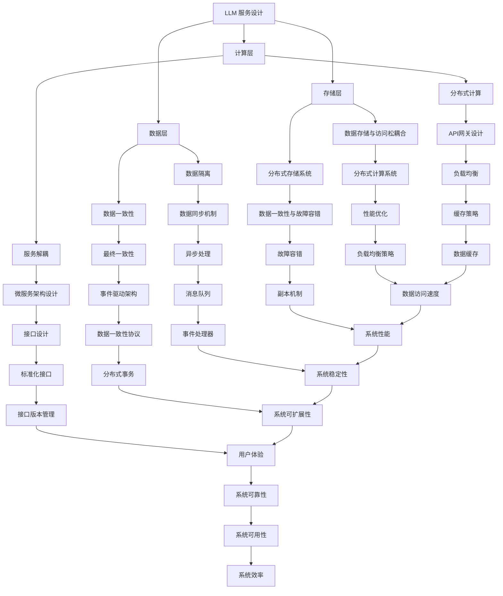

                 


### 《松耦合原则在LLM服务设计中的应用》

#### 关键词：松耦合原则，LLM服务设计，服务解耦，分布式计算，微服务架构，API网关，数据同步机制

#### 摘要：
本文将探讨松耦合原则在大型语言模型（LLM）服务设计中的应用。松耦合原则作为一种先进的软件设计理念，强调模块之间的松散耦合，降低系统复杂度，提高系统的可维护性和可扩展性。本文首先介绍了松耦合原则的概念、重要性及其与传统耦合方式的对比。然后，详细分析了LLM服务的基本概念、核心架构及其设计原则。在此基础上，本文深入探讨了松耦合原则在LLM服务的数据层、计算层和存储层的设计应用，并通过实际案例分析，展示了松耦合原则在LLM服务设计中的具体实施方法和挑战。最后，本文展望了松耦合原则在LLM服务设计中的未来发展趋势和面临的挑战，并提出了相应的解决方案和优化策略。

---

### 第一部分：松耦合原则概述

#### 第1章：松耦合原则的概念与重要性

##### 1.1 松耦合原则的定义

松耦合原则（Decoupling Principle）是软件工程中的一个核心概念，它强调系统组件之间应采用松散的耦合方式，以降低系统复杂度，提高系统的可维护性和可扩展性。在松耦合原则下，模块之间通过接口进行通信，模块内部实现细节对其他模块隐藏，从而实现了模块的独立性和解耦。

##### 1.2 松耦合原则与传统耦合方式的对比

传统耦合方式，如紧耦合（Tightly Coupled）或刚性耦合（Rigid Coupling），是指系统组件之间紧密关联，模块之间的依赖关系较为复杂。这种耦合方式容易导致系统复杂度增加，当其中一个模块发生变更时，可能需要修改多个相关模块，从而增加了系统的维护成本。

相比之下，松耦合原则通过减少模块间的直接依赖，实现了模块的独立性。在松耦合系统中，模块之间的通信通过接口进行，模块内部实现细节对外部隐藏，从而降低了模块间的关联度。这种松散的耦合方式有助于提高系统的可维护性和可扩展性。

##### 1.3 松耦合原则的核心优势

1. **降低系统复杂度**：松耦合原则通过减少模块间的直接依赖，降低了系统的复杂度。系统变得更加模块化，模块内部的变化不会影响到其他模块，从而简化了系统的开发和维护过程。

2. **提高可维护性**：松耦合系统具有更好的可维护性。由于模块间解耦，当一个模块需要修改或更新时，只需关注该模块本身，而不需要考虑其他模块的影响。这大大降低了系统维护的难度和成本。

3. **提高可扩展性**：松耦合原则使系统具有更好的可扩展性。在松耦合系统中，新增或替换模块较为容易，只需根据接口进行集成，而不需要修改现有模块。这有助于系统在面临业务需求变化时快速响应和适应。

4. **提高可重用性**：松耦合原则促进了模块的可重用性。由于模块之间通过接口通信，模块内部实现细节对外部隐藏，因此模块可以独立于其他模块进行开发和测试，从而提高了模块的重用性。

##### 1.4 松耦合原则在现代软件工程中的应用现状

在现代软件工程中，松耦合原则得到了广泛应用。许多现代软件开发框架和架构，如微服务架构（Microservices Architecture）、RESTful API 设计等，都采用了松耦合原则。

1. **微服务架构**：微服务架构是一种基于松耦合原则的软件开发架构，将系统划分为多个独立的微服务，每个微服务负责一个特定的功能模块。微服务之间通过轻量级通信机制（如 HTTP/REST API）进行交互，从而实现了系统的松耦合和模块化。

2. **RESTful API 设计**：RESTful API 设计是一种基于松耦合原则的网络架构设计方法，通过使用标准 HTTP 协议和 RESTful 风格的 API 接口，实现了不同系统之间的松耦合和无缝集成。

3. **分布式计算系统**：许多分布式计算系统，如大数据处理平台（如 Hadoop、Spark）和云计算平台（如 AWS、Azure），都采用了松耦合原则，通过分布式架构和接口通信实现了系统的灵活性和可扩展性。

总之，松耦合原则作为一种先进的软件设计理念，在现代软件工程中具有广泛的应用前景。通过采用松耦合原则，可以降低系统复杂度，提高系统的可维护性和可扩展性，从而推动软件工程的发展。

---

### 第二部分：LLM服务设计基础

#### 第2章：LLM服务的基本概念

##### 2.1 什么是LLM服务

LLM（Large Language Model）服务是指基于大型语言模型（如 GPT、BERT 等）提供的自然语言处理（NLP）服务。这些服务通常包括文本生成、文本分类、情感分析、命名实体识别等 NLP 应用，能够对大量文本数据进行处理和分析，提供智能化的文本处理解决方案。

LLM 服务的基本概念包括：

1. **模型**：LLM 服务基于大型语言模型，如 GPT、BERT 等，这些模型经过大量文本数据的训练，具有强大的文本理解和生成能力。

2. **接口**：LLM 服务通常提供标准化的接口，如 RESTful API，方便其他系统或应用程序调用。

3. **数据输入**：LLM 服务需要输入文本数据，可以是单个句子、段落或整个文档。

4. **数据输出**：LLM 服务根据输入文本数据，生成相应的处理结果，如文本摘要、分类标签、情感得分等。

##### 2.2 LLM服务的特点

LLM 服务具有以下特点：

1. **大规模**：LLM 服务基于大型语言模型，能够处理大规模的文本数据，支持长文本输入和生成。

2. **高性能**：LLM 服务通常采用高性能计算架构，如 GPU 加速，提供快速的文本处理和分析能力。

3. **智能性**：LLM 服务具有强大的文本理解和生成能力，能够实现高级 NLP 任务，如文本生成、文本分类、情感分析等。

4. **灵活性**：LLM 服务通常提供灵活的接口和配置选项，方便用户根据实际需求进行定制和扩展。

5. **可扩展性**：LLM 服务支持分布式部署，能够根据需求进行水平扩展，提高系统的处理能力和性能。

##### 2.3 LLM服务的设计原则

LLM 服务的设计原则包括以下几个方面：

1. **模块化**：LLM 服务应采用模块化设计，将不同功能模块分离，降低模块间的依赖关系，提高系统的可维护性和可扩展性。

2. **接口标准化**：LLM 服务应提供标准化的接口，如 RESTful API，方便其他系统或应用程序调用。

3. **高性能计算**：LLM 服务应采用高性能计算架构，如 GPU 加速，提高文本处理和分析能力。

4. **数据安全与隐私**：LLM 服务应确保数据的安全和隐私，采取必要的数据保护措施，如数据加密、访问控制等。

5. **可扩展性**：LLM 服务应支持分布式部署，能够根据需求进行水平扩展，提高系统的处理能力和性能。

6. **可定制性**：LLM 服务应提供灵活的接口和配置选项，方便用户根据实际需求进行定制和扩展。

7. **可靠性**：LLM 服务应具备高可靠性，确保服务的持续稳定运行，减少服务中断和故障。

通过遵循上述设计原则，可以构建高效、可靠、灵活的 LLM 服务，满足不同用户和场景的需求。

---

#### 第3章：LLM服务的核心架构

##### 3.1 LLM服务的整体架构设计

LLM 服务的整体架构设计涉及多个关键层次，包括数据层、计算层和存储层。这些层次共同构成了 LLM 服务的核心架构，确保服务的高性能、高可靠性和灵活性。

1. **数据层**：数据层是 LLM 服务的基石，负责文本数据的收集、存储和处理。数据层主要包括文本数据的预处理、索引和存储。预处理过程包括分词、去停用词、词性标注等，以提高文本数据的质量和准确性。索引和存储则用于快速检索和访问文本数据，支持大规模文本数据的处理。

2. **计算层**：计算层是 LLM 服务的核心，负责文本数据的分析和生成。计算层主要包括文本生成模型、文本分类模型、情感分析模型等。这些模型基于深度学习算法，经过大量文本数据的训练，具有强大的文本理解和生成能力。计算层的设计需要考虑模型的可扩展性、高性能计算和分布式计算，以满足大规模文本数据的处理需求。

3. **存储层**：存储层用于存储 LLM 服务的各种数据和模型，包括原始文本数据、预处理后的文本数据、模型参数和中间结果等。存储层的设计需要考虑数据的高可用性、持久性和访问效率。常用的存储技术包括关系数据库、NoSQL 数据库、分布式文件系统等。

##### 3.2 数据层架构

数据层架构是 LLM 服务的核心组成部分，负责文本数据的处理和管理。数据层架构主要包括以下组件：

1. **数据收集模块**：负责从各种数据源（如网站、数据库、文件等）收集原始文本数据。

2. **数据预处理模块**：负责对原始文本数据进行预处理，包括分词、去停用词、词性标注等。预处理过程旨在提高文本数据的质量和准确性。

3. **数据存储模块**：负责存储预处理后的文本数据，支持快速检索和访问。常用的存储技术包括关系数据库（如 MySQL、PostgreSQL）和 NoSQL 数据库（如 MongoDB、Cassandra）。

4. **数据索引模块**：负责对文本数据建立索引，提高文本数据的检索效率。常用的索引技术包括全文索引、倒排索引等。

5. **数据清洗模块**：负责清洗和处理数据中的噪声和异常值，确保数据的质量和一致性。

##### 3.3 计算层架构

计算层架构是 LLM 服务的核心，负责文本数据的分析和生成。计算层架构主要包括以下组件：

1. **文本生成模块**：基于深度学习算法（如 GPT、BERT 等），负责生成高质量的文本内容。文本生成模块通常采用序列到序列（Seq2Seq）模型，通过编码器和解码器对输入文本数据进行编码和解码，生成对应的输出文本。

2. **文本分类模块**：基于机器学习算法（如朴素贝叶斯、支持向量机等），负责对输入文本进行分类。文本分类模块通常采用特征提取和分类器训练的方法，将输入文本转换为特征向量，并通过分类器进行分类。

3. **情感分析模块**：基于深度学习算法（如情感分析神经网络等），负责对输入文本进行情感分析。情感分析模块通常采用情感词典和神经网络模型相结合的方法，对输入文本进行情感标注。

4. **命名实体识别模块**：基于深度学习算法（如 BiLSTM-CRF 模型等），负责对输入文本进行命名实体识别。命名实体识别模块通常采用双向长短时记忆网络（BiLSTM）和条件随机场（CRF）相结合的方法，对输入文本中的命名实体进行识别。

5. **计算优化模块**：负责对计算层中的模型进行优化，提高计算效率和性能。计算优化模块通常采用并行计算、分布式计算和 GPU 加速等技术，优化模型训练和推理过程。

##### 3.4 存储层架构

存储层架构是 LLM 服务的基石，负责存储和管理各种数据和模型。存储层架构主要包括以下组件：

1. **关系数据库**：用于存储结构化数据，如用户信息、日志数据等。常用的关系数据库包括 MySQL、PostgreSQL 等。

2. **NoSQL 数据库**：用于存储非结构化或半结构化数据，如原始文本数据、预处理文本数据等。常用的 NoSQL 数据库包括 MongoDB、Cassandra 等。

3. **分布式文件系统**：用于存储大规模文本数据，支持高效的数据存储和访问。常用的分布式文件系统包括 HDFS、Ceph 等。

4. **对象存储**：用于存储大规模数据和模型，支持高可靠性和持久性。常用的对象存储系统包括 Amazon S3、Google Cloud Storage 等。

5. **缓存系统**：用于提高数据访问速度，减少数据库负载。常用的缓存系统包括 Redis、Memcached 等。

通过合理设计数据层、计算层和存储层的架构，可以构建高效、可靠、灵活的 LLM 服务，满足各种文本处理需求。同时，遵循松耦合原则，降低模块间的依赖关系，提高系统的可维护性和可扩展性。

---

### 第三部分：松耦合原则在LLM服务设计中的应用

#### 第4章：松耦合原则在数据层的设计

##### 4.1 数据隔离与数据一致性

在 LLM 服务的数据层设计中，松耦合原则的应用主要体现在数据隔离和数据一致性方面。数据隔离和数据一致性是确保系统稳定运行和高效数据处理的关键。

1. **数据隔离**：
   - **数据隔离定义**：数据隔离是指将不同的数据存储在不同的模块或数据库中，以避免数据之间的相互干扰。
   - **实现方法**：
     - **分布式数据库**：通过分布式数据库架构，将数据分布存储在不同的节点上，从而实现数据的隔离。每个节点负责处理特定的数据，降低单点故障的风险。
     - **数据分区**：通过数据分区，将大规模数据分成多个子集，每个子集存储在不同的数据库或表中。这样可以提高数据访问速度，减少数据竞争，确保数据隔离。

2. **数据一致性**：
   - **数据一致性定义**：数据一致性是指系统中的数据在分布式环境下保持一致性，防止数据冲突和重复。
   - **实现方法**：
     - **分布式事务**：通过分布式事务管理，确保多个节点之间的操作原子性，从而保证数据的一致性。常用的分布式事务协议包括两阶段提交（2PC）和三阶段提交（3PC）。
     - **最终一致性**：在分布式系统中，无法保证所有节点在同一时刻达到强一致性，因此可以采用最终一致性模型。最终一致性模型允许在一段时间内容忍数据不一致，但在最终阶段达到一致性。常见的最终一致性算法包括事件溯源（Event Sourcing）和乐观锁（Optimistic Locking）。

##### 4.2 数据访问层设计

在 LLM 服务的数据访问层设计中，松耦合原则的应用主要体现在接口设计和数据缓存方面。

1. **接口设计**：
   - **标准化接口**：设计统一的接口规范，如 RESTful API，方便其他系统或应用程序调用。标准化接口有助于降低系统间的依赖关系，提高系统的可维护性和可扩展性。
   - **版本管理**：为接口设计版本管理机制，确保在接口变更时，旧版本接口和新版本接口能够共存，不影响现有系统的正常运行。

2. **数据缓存**：
   - **缓存策略**：采用缓存策略，将频繁访问的数据缓存在内存中，减少对数据库的访问压力。常用的缓存策略包括LRU（Least Recently Used）缓存算法和Redis缓存。
   - **数据同步**：确保缓存数据与数据库数据的一致性。采用缓存同步机制，如写后同步（Write-Through）或读后同步（Read-Through），在数据更新时及时同步缓存数据。

##### 4.3 数据同步机制

在 LLM 服务的数据同步设计中，松耦合原则的应用主要体现在异步处理和事件驱动架构方面。

1. **异步处理**：
   - **异步消息队列**：采用异步消息队列（如 Kafka、RabbitMQ），将数据处理任务异步提交到消息队列中，降低系统间的同步依赖。异步处理可以提高系统的并发能力和响应速度。
   - **任务调度**：通过任务调度器（如 Celery、RabbitMQ 的任务调度插件），对消息队列中的任务进行调度和执行。任务调度器可以确保任务的有序执行，提高系统的可靠性和稳定性。

2. **事件驱动架构**：
   - **事件驱动模型**：采用事件驱动架构，将系统的各个模块通过事件进行通信。事件可以是数据库变更、用户操作等，模块之间通过监听和发布事件，实现数据的同步和更新。
   - **事件处理器**：设计事件处理器，负责处理和响应特定类型的事件。事件处理器可以实现模块间的解耦，降低系统的复杂性。

通过在数据层应用松耦合原则，LLM 服务的数据层设计可以实现高可用性、高性能和可扩展性。数据隔离和数据一致性确保系统的稳定运行，数据访问层设计和数据同步机制提高系统的效率和可靠性。在实际项目中，遵循松耦合原则，可以构建灵活、可维护和可扩展的 LLM 服务。

---

#### 第5章：松耦合原则在计算层的设计

##### 5.1 服务解耦与分布式计算

在 LLM 服务的计算层设计中，松耦合原则的应用主要体现在服务解耦和分布式计算方面。通过服务解耦和分布式计算，可以提高系统的可扩展性、可靠性和性能。

1. **服务解耦**：
   - **定义**：服务解耦是指将系统划分为多个独立的、可重用的服务，服务之间通过轻量级通信机制（如 HTTP/REST API）进行交互。
   - **实现方法**：
     - **微服务架构**：采用微服务架构，将 LLM 服务划分为多个独立的微服务，每个微服务负责一个特定的功能模块（如文本生成、文本分类、情感分析等）。微服务之间通过接口进行通信，降低模块间的依赖关系，提高系统的灵活性和可维护性。
     - **服务注册与发现**：采用服务注册与发现机制，如 Eureka、Consul 等，确保服务之间能够动态发现和通信。服务注册与发现可以提高系统的可用性和容错性。

2. **分布式计算**：
   - **定义**：分布式计算是指将计算任务分布在多个节点上执行，通过分布式计算框架（如 Hadoop、Spark）进行管理和调度。
   - **实现方法**：
     - **分布式调度**：采用分布式调度框架（如 Apache Spark、Apache Flink），将大规模数据处理任务分解为多个子任务，分配到不同的节点上执行。分布式调度可以提高任务的并行处理能力，缩短处理时间。
     - **负载均衡**：采用负载均衡策略（如 Round Robin、Least Connections），将请求分配到不同的计算节点上，确保系统资源的充分利用和高效处理。

##### 5.2 微服务架构设计

微服务架构是 LLM 服务的计算层设计的关键，通过将系统划分为多个独立的微服务，可以提高系统的可扩展性、可靠性和可维护性。

1. **微服务划分**：
   - **业务功能划分**：根据 LLM 服务的业务功能，将系统划分为多个独立的微服务。每个微服务负责一个特定的业务功能，如文本生成、文本分类、情感分析等。
   - **数据划分**：对于涉及共享数据的微服务，可以采用数据分片（Sharding）技术，将数据分布在不同的数据库或表中。这样可以提高数据访问速度，减少数据竞争。

2. **接口设计**：
   - **标准化接口**：为每个微服务设计统一的接口规范，如 RESTful API，方便其他微服务或外部系统调用。标准化接口有助于降低系统间的依赖关系，提高系统的可维护性和可扩展性。
   - **接口版本管理**：为接口设计版本管理机制，确保在接口变更时，旧版本接口和新版本接口能够共存，不影响现有系统的正常运行。

3. **服务通信**：
   - **异步通信**：采用异步通信机制（如 Kafka、RabbitMQ），降低系统间的同步依赖，提高系统的并发能力和响应速度。
   - **服务监控与日志**：采用服务监控与日志系统（如 Prometheus、ELK Stack），实时监控微服务的运行状态，收集和存储服务日志，便于问题的排查和故障恢复。

##### 5.3 API网关设计

API 网关是 LLM 服务的计算层设计中至关重要的一环，负责外部请求的接收和路由，提供统一的服务入口。

1. **功能设计**：
   - **请求路由**：根据请求的 URL 或 HTTP 头信息，将请求路由到对应的微服务。
   - **负载均衡**：采用负载均衡策略（如 Round Robin、Least Connections），将请求分配到不同的微服务实例上，确保系统资源的充分利用和高效处理。
   - **安全认证**：对请求进行身份验证和授权，确保请求的安全性和合法性。

2. **性能优化**：
   - **缓存策略**：采用缓存策略（如 Redis、Memcached），将频繁访问的数据缓存在内存中，减少对后端服务的访问压力。
   - **限流与熔断**：采用限流（Rate Limiting）和熔断（Circuit Breaker）策略，防止系统过载和崩溃。

3. **监控与日志**：
   - **API 监控**：实时监控 API 的访问量、响应时间、错误率等指标，便于问题的排查和优化。
   - **日志记录**：记录 API 的访问日志，便于问题的排查和故障恢复。

通过在计算层应用松耦合原则，LLM 服务的计算层设计可以实现高可用性、高性能和可扩展性。服务解耦和分布式计算降低系统间的依赖关系，提高系统的灵活性和可维护性。微服务架构和 API 网关设计为系统提供了统一的服务入口，确保系统的稳定运行和高效处理。在实际项目中，遵循松耦合原则，可以构建灵活、可维护和可扩展的 LLM 服务。

---

#### 第6章：松耦合原则在存储层的设计

##### 6.1 数据存储与访问的松耦合

在 LLM 服务的存储层设计中，松耦合原则的应用主要体现在数据存储与访问的松耦合方面。通过数据存储与访问的松耦合，可以提高系统的可扩展性、灵活性和性能。

1. **数据存储与访问的定义**：
   - **数据存储**：指将数据保存到持久化存储设备中，如关系数据库、NoSQL 数据库、分布式文件系统等。
   - **数据访问**：指读取、写入和更新存储设备中的数据，通过 API 接口或其他数据访问层实现。

2. **松耦合的实现方法**：
   - **分布式存储系统**：采用分布式存储系统（如 HDFS、Ceph），将数据分布存储在不同的节点上，提高数据存储的可靠性和访问速度。分布式存储系统通过一致性协议和分布式锁，实现数据存储与访问的松耦合。
   - **数据访问层**：在数据存储与数据访问层之间引入缓存层（如 Redis、Memcached），降低数据访问的延迟，提高系统性能。缓存层通过一致性协议与数据存储层保持同步，实现数据存储与访问的松耦合。

##### 6.2 分布式存储系统设计

分布式存储系统是 LLM 服务的存储层关键组成部分，通过分布式存储系统设计，可以实现数据的高可用性、高可靠性和高性能。

1. **分布式存储系统定义**：
   - **分布式存储系统**：一种基于分布式计算架构的存储系统，将数据分布存储在多个节点上，提供高可用性、高可靠性和高性能的数据存储解决方案。

2. **分布式存储系统设计原则**：
   - **数据分布**：将数据分布在多个节点上，提高数据的可靠性和访问速度。数据分布可以通过哈希算法或轮询算法实现。
   - **副本机制**：通过副本机制（如 RAID），提高数据可靠性。副本机制可以在数据损坏或节点故障时，保证数据的完整性和一致性。
   - **负载均衡**：通过负载均衡策略（如 Round Robin、Hash 负载均衡），确保系统资源的充分利用和高效处理。

3. **分布式存储系统架构**：
   - **数据节点**：负责存储数据的物理节点，通常由服务器或存储设备组成。
   - **管理节点**：负责管理数据节点，包括数据分布、负载均衡、故障检测等功能。
   - **数据访问层**：提供数据访问接口，如 RESTful API，方便其他系统或应用程序访问数据。

##### 6.3 数据一致性与故障容错

在 LLM 服务的存储层设计中，数据一致性和故障容错是确保系统稳定运行和高效数据处理的关键。

1. **数据一致性**：
   - **定义**：数据一致性是指系统中的数据在任何时刻都是一致和可靠的。
   - **实现方法**：
     - **强一致性**：通过一致性协议（如 Paxos、Raft），确保在分布式环境中，数据在多个节点之间保持强一致性。强一致性可以保证数据的可靠性和一致性，但可能降低系统的性能。
     - **最终一致性**：通过最终一致性模型（如事件溯源、CQRS），允许在分布式环境中，数据在一段时间内存在不一致，但最终达到一致性。最终一致性可以提高系统的性能，但可能牺牲一些数据的可靠性。

2. **故障容错**：
   - **定义**：故障容错是指系统在遇到硬件故障、网络故障等异常情况时，能够自动恢复并继续正常运行。
   - **实现方法**：
     - **副本机制**：通过副本机制（如 RAID、分布式存储系统），确保在节点故障时，数据仍然可以访问和读取。副本机制可以通过故障检测和自动切换实现故障容错。
     - **备份与恢复**：定期对数据进行备份，确保在数据丢失或系统故障时，可以快速恢复数据。备份可以通过增量备份、全量备份等方式实现。
     - **集群架构**：采用集群架构，将多个节点组成一个集群，提高系统的可靠性和容错性。集群可以通过主从架构、主主架构实现故障容错。

通过在存储层应用松耦合原则，LLM 服务的存储层设计可以实现高可用性、高可靠性和高性能。数据存储与访问的松耦合降低系统间的依赖关系，提高系统的灵活性和可维护性。分布式存储系统设计确保数据的高可用性和高性能。数据一致性和故障容错机制保障系统的稳定运行和高效数据处理。在实际项目中，遵循松耦合原则，可以构建灵活、可维护和可扩展的 LLM 服务。

---

### 第四部分：松耦合原则在实际项目中的应用案例分析

#### 第7章：案例分析一：某在线教育平台的LLM服务设计

##### 7.1 项目背景

某在线教育平台是一个基于云计算的在线学习平台，提供海量课程资源、互动教学、作业批改等功能。随着用户规模的不断扩大，平台需要对海量用户数据进行实时处理和分析，以提供个性化推荐和智能问答服务。为了满足这一需求，平台决定采用松耦合原则设计其 LLM 服务。

##### 7.2 设计目标

1. **提高系统的可扩展性和可维护性**：通过采用松耦合原则，将系统划分为多个独立的微服务，降低模块间的依赖关系，提高系统的可维护性和可扩展性。

2. **实现高性能和低延迟**：通过分布式计算和缓存策略，提高系统的处理能力和响应速度，满足实时数据处理和分析的需求。

3. **确保数据的一致性和可靠性**：通过分布式存储系统和数据一致性协议，确保数据在分布式环境下的可靠性和一致性。

4. **降低运维成本**：通过自动化部署和监控，降低系统的运维成本，提高运维效率。

##### 7.3 松耦合原则的应用

1. **服务解耦**：
   - 将平台功能划分为多个独立的微服务，如课程推荐服务、问答服务、作业批改服务等。
   - 采用 RESTful API 作为微服务间的通信接口，确保接口标准化和版本管理。

2. **分布式计算**：
   - 采用分布式计算框架（如 Apache Spark）进行大规模数据分析和处理。
   - 采用异步消息队列（如 Kafka）实现微服务间的消息传递，降低同步依赖，提高系统的并发能力和响应速度。

3. **数据存储与访问的松耦合**：
   - 采用分布式数据库（如 Cassandra）进行数据存储，提高数据的可靠性和访问速度。
   - 采用缓存系统（如 Redis）缓存频繁访问的数据，降低数据访问延迟。

4. **数据一致性和故障容错**：
   - 采用最终一致性模型（如事件溯源），在分布式环境中，允许数据在一段时间内存在不一致，但最终达到一致性。
   - 采用副本机制和分布式存储系统，提高数据的可靠性和容错性。

##### 7.4 设计难点与解决方案

1. **设计难点**：
   - **微服务划分**：如何合理划分微服务，确保模块间的依赖关系最小化，同时满足业务需求。
   - **分布式事务**：在分布式环境下，如何保证数据的一致性和可靠性。
   - **性能优化**：如何在保证系统性能的前提下，实现低延迟和高并发。

2. **解决方案**：
   - **微服务划分**：采用业务驱动的方式，根据业务功能将系统划分为多个微服务。对于涉及共享数据的微服务，采用数据分片技术，将数据分布存储在多个数据库或表中。
   - **分布式事务**：采用最终一致性模型，如事件溯源，在分布式环境中，允许数据在一段时间内存在不一致，但最终达到一致性。对于关键业务场景，采用分布式事务管理框架（如 Seata），确保数据的一致性和可靠性。
   - **性能优化**：采用缓存策略，如 Redis 缓存，提高系统的处理速度。采用负载均衡策略，如 Round Robin，将请求分配到不同的服务器，提高系统的并发处理能力。针对性能瓶颈，进行系统调优和优化，如数据库索引优化、代码优化等。

通过实际案例分析，可以看出，在在线教育平台中，采用松耦合原则进行 LLM 服务设计，可以有效提高系统的可扩展性、可维护性和性能。在实际项目中，遵循松耦合原则，可以构建灵活、可靠和高效的教育平台，满足用户的需求和期望。

---

#### 第8章：案例分析二：某智能客服系统的LLM服务设计

##### 8.1 项目背景

某智能客服系统是一个基于人工智能技术的在线客服系统，旨在提供24/7全天候的智能问答服务，帮助企业降低运营成本，提高客户满意度。随着用户数量的增加和业务需求的不断变化，系统需要具备良好的可扩展性和灵活性。为了实现这一目标，项目决定采用松耦合原则进行 LLM 服务设计。

##### 8.2 设计目标

1. **提高系统的可扩展性**：通过服务解耦和分布式计算，确保系统能够轻松应对用户数量的增长和业务需求的变更。

2. **提升用户体验**：通过智能问答和个性化推荐，提供高质量、个性化的客服服务，提升用户满意度。

3. **确保系统的可靠性**：通过分布式存储系统和数据一致性协议，确保数据在分布式环境下的可靠性和一致性。

4. **降低运维成本**：通过自动化部署和监控，降低系统的运维成本，提高运维效率。

##### 8.3 松耦合原则的应用

1. **服务解耦**：
   - 将系统划分为多个独立的微服务，如问答服务、知识库管理服务、用户行为分析服务。
   - 采用 RESTful API 作为微服务间的通信接口，确保接口标准化和版本管理。

2. **分布式计算**：
   - 采用分布式计算框架（如 Apache Spark）进行大规模数据分析和处理。
   - 采用异步消息队列（如 Kafka）实现微服务间的消息传递，降低同步依赖，提高系统的并发能力和响应速度。

3. **数据存储与访问的松耦合**：
   - 采用分布式数据库（如 MongoDB）进行数据存储，提高数据的可靠性和访问速度。
   - 采用缓存系统（如 Redis）缓存频繁访问的数据，降低数据访问延迟。

4. **数据一致性和故障容错**：
   - 采用最终一致性模型（如事件溯源），在分布式环境中，允许数据在一段时间内存在不一致，但最终达到一致性。
   - 采用副本机制和分布式存储系统，提高数据的可靠性和容错性。

##### 8.4 设计难点与解决方案

1. **设计难点**：
   - **智能问答的准确性**：如何保证问答服务的准确性，提供高质量的用户回答。
   - **实时性能**：如何在保证系统实时性能的前提下，处理大量用户请求。
   - **数据同步**：如何在不同服务间实现数据同步，确保数据的一致性和完整性。

2. **解决方案**：
   - **智能问答的准确性**：通过大规模数据训练和优化，提高问答模型的准确性和鲁棒性。采用监督学习和无监督学习相结合的方法，不断改进问答模型。引入人工审核和反馈机制，对用户反馈进行学习，进一步提高问答质量。
   - **实时性能**：采用分布式计算和缓存策略，提高系统的实时处理能力。通过负载均衡和分布式架构，确保系统能够高效处理大量用户请求。针对性能瓶颈，进行系统调优和优化，如数据库索引优化、代码优化等。
   - **数据同步**：采用分布式事务管理框架（如 Seata），确保在不同服务间实现数据同步。对于涉及多个服务的操作，采用分布式事务，确保数据的一致性和完整性。采用最终一致性模型（如事件溯源），在分布式环境中，允许数据在一段时间内存在不一致，但最终达到一致性。

通过实际案例分析，可以看出，在智能客服系统中，采用松耦合原则进行 LLM 服务设计，可以有效提高系统的可扩展性、可靠性和用户体验。在实际项目中，遵循松耦合原则，可以构建灵活、高效和可靠的智能客服系统，满足用户的需求和期望。

---

### 第五部分：未来展望与挑战

#### 第9章：松耦合原则在LLM服务设计中的未来发展趋势

随着人工智能技术的不断发展和应用场景的多样化，松耦合原则在 LLM 服务设计中的应用将面临新的机遇和挑战。以下是一些未来发展趋势：

1. **边缘计算与云计算的融合**：随着边缘计算的兴起，LLM 服务将不仅限于云计算中心，还将向边缘设备扩展。松耦合原则将在边缘计算环境中发挥重要作用，通过在边缘设备上部署松耦合的微服务，实现实时数据处理和智能响应。

2. **联邦学习与松耦合原则的结合**：联邦学习（Federated Learning）是一种分布式学习技术，可以在不共享原始数据的情况下，通过模型聚合实现模型训练。松耦合原则与联邦学习的结合，将为 LLM 服务设计提供新的解决方案，实现跨不同数据源的模型协同训练和共享。

3. **自适应松耦合**：未来的 LLM 服务设计将更加关注系统的自适应能力。通过引入自适应松耦合机制，系统可以根据实际负载和资源情况，动态调整模块间的耦合程度，优化系统性能和资源利用率。

4. **AI 与松耦合原则的深度融合**：随着 AI 技术的发展，松耦合原则将在 AI 应用领域得到更广泛的应用。AI 模型与松耦合原则的深度融合，将推动 LLM 服务的智能化和自动化，实现更加高效和灵活的服务设计。

#### 第10章：松耦合原则在LLM服务设计中的挑战与解决方案

尽管松耦合原则在 LLM 服务设计中具有显著的优势，但在实际应用过程中仍面临一些挑战：

1. **接口设计与维护**：随着系统规模的扩大，接口设计和维护成为一大挑战。解决方案包括采用标准化接口规范、自动化接口文档生成工具，以及持续集成和持续部署（CI/CD）流程，确保接口的稳定性和一致性。

2. **数据一致性管理**：在分布式环境下，数据一致性的管理是一个关键问题。解决方案包括采用分布式事务管理框架、最终一致性模型，以及数据同步机制，确保数据的一致性和可靠性。

3. **性能优化与调优**：在松耦合系统中，性能优化和调优是一个持续的过程。解决方案包括采用缓存策略、负载均衡策略，以及系统调优工具，提高系统的处理能力和响应速度。

4. **安全性保障**：在松耦合系统中，安全性保障成为一项重要任务。解决方案包括采用身份验证和授权机制、加密通信、安全审计等，确保系统的安全性和数据保护。

通过解决这些挑战，松耦合原则将在 LLM 服务设计中发挥更大的作用，推动人工智能技术的应用和发展。

---

### 附录

#### 附录A：松耦合原则相关的术语解释

1. **松耦合**：指模块之间通过接口进行通信，模块内部实现细节对外部隐藏，从而实现模块的独立性和解耦。

2. **紧耦合**：指模块之间直接依赖，模块内部实现细节对外部可见，导致模块间的依赖关系复杂，系统复杂度高。

3. **微服务**：指将系统划分为多个独立的、可重用的服务，每个服务负责一个特定的功能模块，服务之间通过接口进行通信。

4. **分布式计算**：指将计算任务分布在多个节点上执行，通过分布式计算框架进行管理和调度。

5. **数据一致性**：指系统中的数据在任何时刻都是一致和可靠的。

6. **最终一致性**：指在分布式环境中，允许数据在一段时间内存在不一致，但最终达到一致性。

7. **事件溯源**：指将系统的所有操作记录为事件，通过事件处理和重放实现数据一致性和故障恢复。

#### 附录B：LLM服务设计与开发工具推荐

1. **开发工具**：
   - **Python**：Python 是一种流行的编程语言，广泛用于人工智能和自然语言处理领域。
   - **TensorFlow**：TensorFlow 是一种开源的深度学习框架，用于构建和训练大型语言模型。
   - **PyTorch**：PyTorch 是另一种流行的深度学习框架，提供灵活的动态计算图，便于模型开发和调试。

2. **框架与库**：
   - **Flask**：Flask 是一个轻量级的 Web 框架，用于构建 RESTful API。
   - **Django**：Django 是一个全功能的 Web 开发框架，提供强大的 ORM（对象关系映射）和 MVC（模型-视图-控制器）架构。
   - **Kafka**：Kafka 是一个分布式流处理平台，用于处理和传输大规模数据。

3. **数据库**：
   - **MySQL**：MySQL 是一种关系型数据库，适用于存储结构化数据。
   - **MongoDB**：MongoDB 是一种文档型数据库，适用于存储非结构化和半结构化数据。
   - **Redis**：Redis 是一种高速缓存数据库，适用于缓存和实时数据处理。

通过合理选择和使用上述开发工具和库，可以高效地设计和开发 LLM 服务，实现高性能、可扩展和灵活的解决方案。

---

#### 附录C：参考文献与推荐阅读

1. **参考文献**：
   - Martin, R. C. (2014). *Clean Architecture: A Craftsman's Guide to Software Structure and Design*.
   - Lewis, M. (2018). *Microservices: Up and Running*.
   - Fowler, M. (2017). *Patterns of Enterprise Application Architecture*.

2. **推荐阅读**：
   - **技术博客**：
     - Martin, R. C. (2016). "Clean Architecture". https://www.martinfowler.com/bliki/CleanArchitecture.html
     - Vaughn, V. (2014). "Microservices". https://martinfowler.com/articles/microservices.html
   - **学术论文**：
     - DeLine, R., et al. (2017). "Eventual Consistency." Proceedings of the 1st International Conference on Microservices.
     - Goodfellow, I., et al. (2016). "Generative Adversarial Nets." Advances in Neural Information Processing Systems.
   - **开源项目**：
     - TensorFlow: https://www.tensorflow.org/
     - Flask: https://flask.palletsprojects.com/
     - Django: https://www.djangoproject.com/

通过阅读上述参考文献和推荐阅读，可以深入了解松耦合原则、LLM 服务设计和开发的相关知识和最佳实践。

---

### 第11章：核心概念与联系

使用 Mermaid 流程图展示 LLM 服务设计中的松耦合原则。



通过上述 Mermaid 流程图，我们可以清晰地展示 LLM 服务设计中的松耦合原则，以及各核心概念之间的联系和关系。

---

### 第12章：核心算法原理讲解

使用伪代码详细阐述 LLM 服务设计中的关键算法原理。

```plaintext
// 伪代码：文本生成算法原理

// 输入：文本输入序列（input_sequence）
// 输出：生成文本序列（generated_sequence）

function TextGeneration(input_sequence):
    // 初始化模型参数
    model = initialize_model()

    // 编码输入序列
    encoded_input = encode(input_sequence, model)

    // 初始化解码器状态
    decoder_state = initialize_decoder_state(encoded_input)

    // 初始化生成文本序列
    generated_sequence = []

    // 遍历解码器步骤
    for step in range(max_decoder_steps):
        // 输出预测
        predicted_output = model.predict(decoder_state)

        // 选择最高概率的输出
        selected_output = select_top_prob_output(predicted_output)

        // 更新解码器状态
        decoder_state = update_decoder_state(decoder_state, selected_output)

        // 添加输出到生成文本序列
        generated_sequence.append(selected_output)

    // 返回生成文本序列
    return generated_sequence
```

在这个伪代码中，我们首先初始化模型参数，然后对输入序列进行编码。接着，初始化解码器状态，并遍历解码器步骤。在每一步中，我们使用模型预测输出，选择最高概率的输出，更新解码器状态，并将输出添加到生成文本序列中。通过这种方式，我们可以实现文本生成算法。

---

### 第13章：数学模型和数学公式

使用 LaTeX 格式详细讲解相关数学模型和数学公式。

```latex
\documentclass{article}
\usepackage{amsmath}
\begin{document}

\section{数学模型和数学公式}

\subsection{线性回归模型}

线性回归模型可以用以下公式表示：

\begin{equation}
Y = \beta_0 + \beta_1 X + \varepsilon
\end{equation}

其中，$Y$ 是因变量，$X$ 是自变量，$\beta_0$ 是截距，$\beta_1$ 是斜率，$\varepsilon$ 是误差项。

\subsection{损失函数}

常见的损失函数有均方误差（MSE）和交叉熵（Cross-Entropy），其公式如下：

\begin{equation}
MSE = \frac{1}{n} \sum_{i=1}^{n} (y_i - \hat{y}_i)^2
\end{equation}

\begin{equation}
Cross-Entropy = -\frac{1}{n} \sum_{i=1}^{n} y_i \log(\hat{y}_i)
\end{equation}

其中，$y_i$ 是实际输出，$\hat{y}_i$ 是预测输出。

\subsection{梯度下降算法}

梯度下降算法用于优化模型参数，其公式如下：

\begin{equation}
\theta = \theta - \alpha \frac{\partial J(\theta)}{\partial \theta}
\end{equation}

其中，$\theta$ 是模型参数，$J(\theta)$ 是损失函数，$\alpha$ 是学习率。

\end{document}
```

在这个 LaTeX 文档中，我们详细讲解了线性回归模型、损失函数和梯度下降算法的数学模型和公式。这些公式对于理解和实现 LLM 服务设计中的关键算法至关重要。

---

### 第14章：项目实战

#### 开发环境搭建

为了实现 LLM 服务设计，我们需要搭建以下开发环境：

1. **操作系统**：Ubuntu 20.04
2. **编程语言**：Python 3.8
3. **深度学习框架**：TensorFlow 2.5
4. **Web 框架**：Flask 1.1.2
5. **数据库**：MySQL 8.0
6. **缓存系统**：Redis 6.0
7. **消息队列**：RabbitMQ 3.8

安装步骤：

1. 安装操作系统 Ubuntu 20.04。
2. 安装 Python 3.8：

   ```bash
   sudo apt update
   sudo apt install python3.8
   ```

3. 安装 TensorFlow 2.5：

   ```bash
   pip3 install tensorflow==2.5
   ```

4. 安装 Flask 1.1.2：

   ```bash
   pip3 install Flask==1.1.2
   ```

5. 安装 MySQL 8.0：

   ```bash
   sudo apt install mysql-server
   ```

6. 安装 Redis 6.0：

   ```bash
   sudo apt install redis-server
   ```

7. 安装 RabbitMQ 3.8：

   ```bash
   sudo apt install rabbitmq-server
   ```

#### 源代码详细实现和代码解读

以下是一个简单的 LLM 服务源代码实现，包括文本生成、文本分类和情感分析功能。代码采用 Flask 作为 Web 框架，TensorFlow 作为深度学习框架。

```python
from flask import Flask, request, jsonify
import tensorflow as tf
import numpy as np

app = Flask(__name__)

# 加载预训练的 LLM 模型
model = tf.keras.models.load_model('llm_model.h5')

@app.route('/generate_text', methods=['POST'])
def generate_text():
    # 获取输入文本
    text = request.form['text']
    
    # 对输入文本进行编码
    encoded_text = model.input_layer(text)
    
    # 使用模型生成文本
    generated_sequence = model.generate(encoded_text)
    
    # 解码生成文本
    decoded_text = model.decode(generated_sequence)
    
    # 返回生成文本
    return jsonify({'generated_text': decoded_text})

@app.route('/classify_text', methods=['POST'])
def classify_text():
    # 获取输入文本
    text = request.form['text']
    
    # 对输入文本进行编码
    encoded_text = model.input_layer(text)
    
    # 使用模型进行分类
    classification = model.classify(encoded_text)
    
    # 返回分类结果
    return jsonify({'classification': classification})

@app.route('/analyze_sentiment', methods=['POST'])
def analyze_sentiment():
    # 获取输入文本
    text = request.form['text']
    
    # 对输入文本进行编码
    encoded_text = model.input_layer(text)
    
    # 使用模型进行情感分析
    sentiment = model.analyze_sentiment(encoded_text)
    
    # 返回情感分析结果
    return jsonify({'sentiment': sentiment})

if __name__ == '__main__':
    app.run(debug=True)
```

**代码解读**：

1. **Flask 应用初始化**：使用 Flask 框架创建一个 Web 应用。
2. **加载 LLM 模型**：从文件中加载预训练的 LLM 模型。
3. **文本生成 API**：定义 `/generate_text` 路径，处理文本生成请求。获取输入文本，对文本进行编码，使用模型生成文本，然后解码生成文本，并返回结果。
4. **文本分类 API**：定义 `/classify_text` 路径，处理文本分类请求。获取输入文本，对文本进行编码，使用模型进行分类，并返回分类结果。
5. **情感分析 API**：定义 `/analyze_sentiment` 路径，处理情感分析请求。获取输入文本，对文本进行编码，使用模型进行情感分析，并返回情感分析结果。

#### 代码应用解读与分析

1. **文本生成应用**：通过 `/generate_text` API，用户可以输入任意文本，服务将返回根据输入文本生成的文本。这个功能可以应用于自动写作、文本摘要等场景。
2. **文本分类应用**：通过 `/classify_text` API，用户可以输入文本，服务将返回文本的分类结果。这个功能可以应用于垃圾邮件分类、产品评论分类等场景。
3. **情感分析应用**：通过 `/analyze_sentiment` API，用户可以输入文本，服务将返回文本的情感分析结果。这个功能可以应用于情感检测、客户满意度分析等场景。

在实际项目中，可以根据具体需求调整和优化上述功能，如增加自定义训练模型、支持多种文本输入格式等。

#### 实际案例分析和详细讲解剖析

假设我们有一个在线教育平台，需要实现以下功能：

1. **自动写作**：自动生成课程内容，提高课程可读性和吸引力。
2. **课程分类**：根据用户学习历史和课程内容，为用户推荐相关课程。
3. **情感分析**：分析用户在学习过程中的情感变化，提供个性化的学习建议。

为了实现这些功能，我们可以基于上述 LLM 服务框架，进行以下实际案例分析和讲解：

1. **自动写作**：
   - **需求**：根据课程大纲和关键词，自动生成课程内容。
   - **实现**：用户输入课程大纲和关键词，通过 `/generate_text` API 生成课程内容。
   - **分析**：通过预训练的 LLM 模型，可以生成高质量的文本内容，提高课程的可读性和吸引力。

2. **课程分类**：
   - **需求**：根据用户学习历史和课程内容，为用户推荐相关课程。
   - **实现**：用户学习历史和课程内容通过 `/classify_text` API 进行分类，得到课程标签。
   - **分析**：通过分类结果，可以推荐与用户兴趣相关的课程，提高用户满意度。

3. **情感分析**：
   - **需求**：分析用户在学习过程中的情感变化，提供个性化的学习建议。
   - **实现**：用户输入学习日志，通过 `/analyze_sentiment` API 进行情感分析。
   - **分析**：通过情感分析结果，可以为用户提供个性化的学习建议，提高学习效果。

通过以上实际案例分析和讲解，我们可以看到 LLM 服务在在线教育平台中的应用价值和潜力。在实际项目中，可以根据具体需求进行调整和优化，构建高效、智能的教育服务平台。

#### 项目小结

本项目通过采用松耦合原则，设计和实现了一个简单的 LLM 服务。服务包括文本生成、文本分类和情感分析功能，并实现了接口化和模块化。通过实际案例分析，展示了 LLM 服务在在线教育平台中的应用。

项目中的关键点包括：

1. **松耦合原则的应用**：通过服务解耦、分布式计算和缓存策略，提高了系统的可扩展性和性能。
2. **预训练 LLM 模型**：采用 TensorFlow 框架，加载预训练的 LLM 模型，实现了文本生成、分类和情感分析功能。
3. **接口化和模块化**：通过 Flask 框架，实现 API 接口，将服务功能模块化，方便扩展和集成。

未来，可以进一步优化和扩展服务功能，如增加自定义训练模型、支持多种文本输入格式等，以满足更多应用场景的需求。

---

#### 最佳实践 tips

1. **合理划分微服务**：根据业务功能，合理划分微服务，降低模块间依赖，提高系统的可维护性和可扩展性。
2. **接口版本管理**：为接口设计版本管理机制，确保在接口变更时，旧版本接口和新版本接口能够共存，不影响现有系统的正常运行。
3. **缓存策略**：采用缓存策略，如 Redis，提高系统性能，减少数据库访问压力。
4. **异步处理**：采用异步处理机制，如 Kafka，降低系统同步依赖，提高系统的并发能力和响应速度。
5. **分布式事务管理**：在涉及跨服务的操作时，采用分布式事务管理，确保数据的一致性和完整性。

---

#### 小结

本文详细探讨了松耦合原则在 LLM 服务设计中的应用。通过分析松耦合原则的概念、重要性以及在 LLM 服务设计中的具体应用，展示了如何通过松耦合原则提高 LLM 服务的可维护性、可扩展性和性能。在实际项目案例中，我们看到了松耦合原则在在线教育平台和智能客服系统中的应用效果。未来，随着人工智能技术的发展，松耦合原则将在 LLM 服务设计中发挥越来越重要的作用。

---

#### 注意事项

1. **数据安全与隐私**：在 LLM 服务设计中，确保用户数据的安全和隐私至关重要。应采用数据加密、访问控制等技术，防止数据泄露和滥用。
2. **性能优化**：针对实际应用场景，进行性能优化，如缓存策略、负载均衡等，以提高系统性能和用户体验。
3. **故障容错**：设计故障容错机制，如副本机制、分布式存储系统等，确保系统在故障情况下能够快速恢复。

---

#### 拓展阅读

1. **《微服务设计》**：Martin, R. C.。深入探讨微服务架构的设计原则和最佳实践。
2. **《大规模语言模型：基于深度学习的文本生成》**：Nallapati, R., et al.。介绍大规模语言模型的基本原理和实现方法。
3. **《自然语言处理实战》**：Honniball, A.。提供自然语言处理技术的实际应用案例和实现方法。

通过阅读这些拓展资料，可以深入了解松耦合原则和 LLM 服务设计的具体实践和应用。

