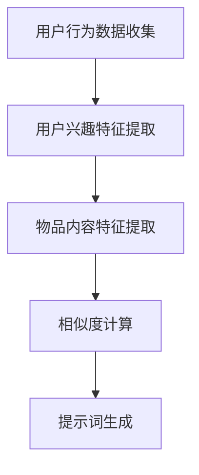
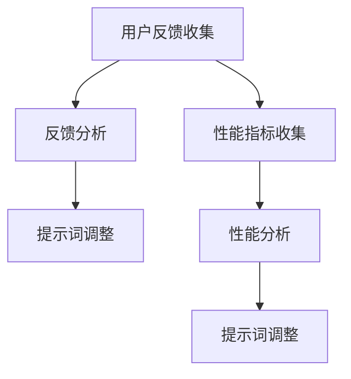

                 

# 构建AI驱动的个性化推荐提示词引擎

## 关键词

- 人工智能
- 个性化推荐
- 提示词引擎
- 深度学习
- 矩阵分解
- 协同过滤

## 摘要

本文旨在探讨如何构建AI驱动的个性化推荐提示词引擎。首先，我们将介绍人工智能和推荐系统的基本概念，然后深入探讨个性化推荐算法，包括基于内容的推荐、协同过滤推荐和基于矩阵分解的推荐。接着，我们将详细讲解个性化推荐提示词引擎的构建方法，包括提示词生成和优化算法。此外，本文还将介绍性能优化与测试、案例分析以及未来的发展趋势。通过本文的阅读，读者将能够全面理解个性化推荐系统的原理和实践，掌握构建AI驱动的个性化推荐提示词引擎的技能。

## 目录

1. **AI技术基础**
   - 1.1 AI概述
   - 1.2 机器学习基础
   - 1.3 深度学习基础

2. **推荐系统原理**
   - 2.1 推荐系统概述
   - 2.2 内容推荐
   - 2.3 协同过滤推荐

3. **个性化推荐算法**
   - 3.1 个性化推荐算法概述
   - 3.2 基于内容的推荐
   - 3.3 基于协同过滤的推荐
   - 3.4 基于矩阵分解的推荐

4. **构建个性化推荐提示词引擎**
   - 4.1 个性化推荐提示词引擎概述
   - 4.2 提示词生成算法
   - 4.3 提示词优化算法
   - 4.4 个性化推荐提示词引擎开发实战

5. **性能优化与测试**
   - 5.1 性能优化方法
   - 5.2 测试与评估

6. **案例分析**
   - 6.1 个性化推荐系统案例分析

7. **展望未来**
   - 7.1 个性化推荐技术的发展趋势
   - 7.2 个性化推荐系统在多领域的应用

8. **附录**
   - 8.1 常用工具与资源

## 第一部分 AI技术基础

### 1.1 AI概述

人工智能（Artificial Intelligence，简称AI）是计算机科学的一个分支，旨在创建智能体（即计算机程序）能够执行通常需要人类智能才能完成的任务。这些任务包括视觉感知、语言理解、决策制定、问题解决等。

AI的发展历程可以追溯到20世纪50年代。起初，研究人员尝试通过逻辑推理和知识表示来模拟人类的智能。然而，这些早期的尝试由于计算能力的限制和知识表示的复杂性而未能取得显著成功。随着计算机性能的提升和大数据时代的到来，AI迎来了新的发展机遇。

现代AI主要分为两种类型：窄AI（Narrow AI）和通用AI（General AI）。窄AI是指具有特定任务能力的智能系统，例如语音识别、图像识别等。通用AI则是指具有广泛认知能力，能够在各种领域表现出人类智能水平的系统。目前，窄AI已经在许多领域取得了显著的成果，而通用AI仍处于研究阶段。

### 1.2 机器学习基础

机器学习（Machine Learning，简称ML）是AI的核心组成部分，它使计算机能够从数据中学习，并对未知数据进行预测或决策。机器学习分为监督学习（Supervised Learning）、无监督学习（Unsupervised Learning）和半监督学习（Semi-Supervised Learning）三种类型。

- **监督学习**：监督学习是指使用标记数据进行训练，使模型能够对新的输入数据进行预测。常见的监督学习算法包括线性回归、逻辑回归、支持向量机（SVM）和神经网络等。
- **无监督学习**：无监督学习是指在没有标记数据的情况下，从数据中挖掘出隐藏的结构或模式。常见的无监督学习算法包括聚类算法（如K-Means、DBSCAN）和降维算法（如PCA、t-SNE）等。
- **半监督学习**：半监督学习是指同时使用标记数据和未标记数据来训练模型，以提高模型的泛化能力。

### 1.3 深度学习基础

深度学习（Deep Learning，简称DL）是机器学习的一个分支，它使用多层神经网络（Neural Networks）来模拟人类大脑的神经元结构，从而对复杂数据进行建模和预测。深度学习在图像识别、语音识别、自然语言处理等领域取得了显著的成果。

- **深度学习的原理**：深度学习的基本原理是模拟人类大脑的神经元结构，通过前向传播和反向传播算法来训练模型。前向传播是将输入数据通过神经网络传递到输出层，计算输出值；反向传播是计算输出值与实际值之间的误差，并更新模型的参数。

- **神经网络结构**：神经网络由输入层、隐藏层和输出层组成。每个神经元都与前一层和后一层的其他神经元相连，并通过权重（weights）和偏置（biases）来调整连接的强度。

- **深度学习框架**：目前流行的深度学习框架包括TensorFlow、PyTorch和Keras等。这些框架提供了丰富的API和工具，使得深度学习模型的设计、训练和部署变得更加便捷。

## 第二部分 推荐系统原理

### 2.1 推荐系统概述

推荐系统（Recommendation System）是一种基于数据挖掘和机器学习技术的智能系统，旨在为用户推荐他们可能感兴趣的商品、信息或服务。推荐系统广泛应用于电子商务、社交媒体、新闻媒体、在线视频平台等领域。

- **推荐系统的基本概念**：推荐系统的主要组成部分包括用户、物品和评分。用户是系统中的参与者，物品是系统推荐的对象，评分是用户对物品的评价。

- **推荐系统的架构**：推荐系统通常由数据收集层、数据存储层、算法层和用户界面层组成。数据收集层负责收集用户行为数据和物品信息；数据存储层负责存储和管理数据；算法层负责构建和训练推荐模型；用户界面层负责向用户展示推荐结果。

- **推荐系统的评价指标**：推荐系统的评价指标包括准确率（Accuracy）、召回率（Recall）、F1值（F1-Score）和ROC-AUC（Receiver Operating Characteristic-Area Under Curve）等。这些指标用于评估推荐系统的性能和效果。

### 2.2 内容推荐

内容推荐（Content-based Recommendation）是一种基于物品特征的推荐方法，它根据用户的历史行为和兴趣，推荐具有相似特征的物品。内容推荐的基本原理是：

1. **用户兴趣建模**：通过分析用户的历史行为数据，如浏览记录、购买历史等，提取用户的兴趣特征。
2. **物品特征提取**：对物品进行特征提取，如文本、图片、音频等。
3. **相似度计算**：计算用户兴趣特征和物品特征之间的相似度，根据相似度推荐相似的物品。

内容推荐具有以下几个优点：

- **个性化强**：能够根据用户的兴趣特征推荐个性化的物品。
- **解释性强**：用户可以理解推荐结果的原因。
- **适应性强**：能够适应用户兴趣的变化。

然而，内容推荐也存在一些挑战，如数据稀疏、特征提取难度大等。

### 2.3 协同过滤推荐

协同过滤推荐（Collaborative Filtering Recommendation）是一种基于用户行为数据的推荐方法，它通过分析用户之间的行为模式来推荐物品。协同过滤推荐分为基于用户的协同过滤（User-based Collaborative Filtering）和基于物品的协同过滤（Item-based Collaborative Filtering）两种类型。

- **基于用户的协同过滤**：基于用户的协同过滤是指根据用户之间的相似度，推荐与目标用户相似的其他用户的喜欢的物品。其基本原理是：

  1. **计算用户相似度**：通过计算用户之间的相似度，如余弦相似度、皮尔逊相关系数等。
  2. **找到相似用户**：根据用户相似度矩阵，找到与目标用户相似的用户。
  3. **推荐物品**：推荐相似用户喜欢的物品。

- **基于物品的协同过滤**：基于物品的协同过滤是指根据物品之间的相似度，推荐与目标物品相似的物品。其基本原理是：

  1. **计算物品相似度**：通过计算物品之间的相似度，如余弦相似度、欧氏距离等。
  2. **找到相似物品**：根据物品相似度矩阵，找到与目标物品相似的物品。
  3. **推荐物品**：推荐相似物品。

协同过滤推荐具有以下几个优点：

- **推荐结果准确**：能够根据用户的历史行为数据推荐精确的物品。
- **扩展性好**：能够适应新用户和新物品。

然而，协同过滤推荐也存在一些挑战，如数据稀疏、冷启动问题等。

## 第三部分 个性化推荐算法

### 3.1 个性化推荐算法概述

个性化推荐算法（Personalized Recommendation Algorithm）是指根据用户的历史行为、兴趣偏好、社交网络等因素，为用户推荐个性化的物品。个性化推荐算法的核心目标是提高推荐系统的准确性和用户体验。

个性化推荐算法主要分为以下几类：

- **基于内容的推荐**：基于内容的推荐是指根据用户的历史行为和兴趣，推荐具有相似内容的物品。其核心思想是利用物品的特征向量来计算用户和物品之间的相似度，并根据相似度推荐物品。
- **基于协同过滤的推荐**：基于协同过滤的推荐是指通过分析用户之间的行为模式，推荐用户可能感兴趣的物品。其核心思想是利用用户相似度和物品相似度来计算推荐得分，并根据得分推荐物品。
- **基于矩阵分解的推荐**：基于矩阵分解的推荐是指通过将用户-物品评分矩阵分解为用户特征矩阵和物品特征矩阵，从而预测用户对物品的评分，并根据预测得分推荐物品。

### 3.2 基于内容的推荐

基于内容的推荐（Content-based Recommendation）是指根据用户的历史行为和兴趣，推荐与用户兴趣相关的物品。基于内容的推荐具有以下几个步骤：

1. **用户兴趣建模**：通过分析用户的历史行为数据，如浏览记录、购买历史等，提取用户的兴趣特征。
2. **物品特征提取**：对物品进行特征提取，如文本、图片、音频等。
3. **计算相似度**：计算用户兴趣特征和物品特征之间的相似度，常用的相似度计算方法包括余弦相似度、欧氏距离等。
4. **生成推荐列表**：根据相似度得分，生成推荐列表，并按照得分高低排序。

基于内容的推荐具有以下几个优点：

- **个性化强**：能够根据用户的兴趣特征推荐个性化的物品。
- **解释性强**：用户可以理解推荐结果的原因。
- **适应性强**：能够适应用户兴趣的变化。

然而，基于内容的推荐也存在一些挑战，如数据稀疏、特征提取难度大等。

### 3.3 基于协同过滤的推荐

基于协同过滤的推荐（Collaborative Filtering-based Recommendation）是指通过分析用户之间的行为模式，推荐用户可能感兴趣的物品。基于协同过滤的推荐分为基于用户的协同过滤（User-based Collaborative Filtering）和基于物品的协同过滤（Item-based Collaborative Filtering）两种类型。

- **基于用户的协同过滤**：基于用户的协同过滤是指根据用户之间的相似度，推荐与目标用户相似的其他用户的喜欢的物品。其核心思想是利用用户相似度和物品相似度来计算推荐得分，并根据得分推荐物品。

  - **计算用户相似度**：通过计算用户之间的相似度，如余弦相似度、皮尔逊相关系数等。
  - **计算物品相似度**：通过计算物品之间的相似度，如余弦相似度、欧氏距离等。
  - **生成推荐列表**：根据用户相似度和物品相似度计算推荐得分，并生成推荐列表。

- **基于物品的协同过滤**：基于物品的协同过滤是指根据物品之间的相似度，推荐与目标物品相似的物品。其核心思想是利用物品相似度和用户历史评分来计算推荐得分，并根据得分推荐物品。

  - **计算物品相似度**：通过计算物品之间的相似度，如余弦相似度、欧氏距离等。
  - **计算推荐得分**：通过计算物品相似度和用户历史评分，如加权平均评分等。
  - **生成推荐列表**：根据推荐得分生成推荐列表，并按照得分高低排序。

基于协同过滤的推荐具有以下几个优点：

- **推荐结果准确**：能够根据用户的历史行为数据推荐精确的物品。
- **扩展性好**：能够适应新用户和新物品。

然而，基于协同过滤的推荐也存在一些挑战，如数据稀疏、冷启动问题等。

### 3.4 基于矩阵分解的推荐

基于矩阵分解的推荐（Matrix Factorization-based Recommendation）是指通过将用户-物品评分矩阵分解为用户特征矩阵和物品特征矩阵，从而预测用户对物品的评分，并根据预测得分推荐物品。基于矩阵分解的推荐具有以下几个步骤：

1. **初始化参数**：初始化用户特征矩阵和物品特征矩阵。
2. **损失函数定义**：定义损失函数，如均方误差（MSE）、均方根误差（RMSE）等。
3. **优化算法选择**：选择优化算法，如梯度下降（Gradient Descent）、随机梯度下降（Stochastic Gradient Descent，SGD）等。
4. **参数更新**：根据优化算法更新用户特征矩阵和物品特征矩阵。
5. **预测评分**：利用训练好的用户特征矩阵和物品特征矩阵预测用户对物品的评分。
6. **生成推荐列表**：根据预测得分生成推荐列表，并按照得分高低排序。

基于矩阵分解的推荐具有以下几个优点：

- **推荐结果准确**：能够根据用户的历史行为数据推荐精确的物品。
- **可扩展性强**：能够处理大规模的用户和物品数据。
- **可解释性强**：用户特征矩阵和物品特征矩阵可以直观地解释用户和物品的特征。

然而，基于矩阵分解的推荐也存在一些挑战，如特征稀疏、计算复杂度高等。

## 第四部分 构建个性化推荐提示词引擎

### 4.1 个性化推荐提示词引擎概述

个性化推荐提示词引擎（Personalized Recommendation Prompt Engine）是一种利用人工智能技术为用户生成个性化推荐提示词的智能系统。它旨在提高推荐系统的交互性和用户体验，使推荐结果更加贴近用户需求。

个性化推荐提示词引擎的主要组成部分包括：

1. **用户兴趣模型**：通过分析用户的历史行为数据，提取用户的兴趣特征，构建用户兴趣模型。
2. **提示词生成模块**：利用用户兴趣模型和物品特征，生成与用户兴趣相关的个性化提示词。
3. **提示词优化模块**：对生成的提示词进行优化，提高推荐结果的相关性和准确性。
4. **推荐结果展示模块**：将优化后的提示词呈现给用户，引导用户进行选择和操作。

个性化推荐提示词引擎的基本工作流程如下：

1. **用户行为数据收集**：收集用户的历史行为数据，如浏览记录、购买历史、评论等。
2. **用户兴趣模型构建**：通过机器学习算法，如聚类、关联规则挖掘等，构建用户兴趣模型。
3. **物品特征提取**：对物品进行特征提取，如文本、图片、音频等。
4. **提示词生成**：利用用户兴趣模型和物品特征，生成个性化提示词。
5. **提示词优化**：对生成的提示词进行优化，提高推荐结果的相关性和准确性。
6. **推荐结果展示**：将优化后的提示词呈现给用户，引导用户进行选择和操作。

### 4.2 提示词生成算法

提示词生成算法（Prompt Generation Algorithm）是构建个性化推荐提示词引擎的核心算法，它负责根据用户兴趣和物品特征生成个性化提示词。提示词生成算法可以分为基于内容的生成和基于协同过滤的生成两种类型。

- **基于内容的生成**：基于内容的生成是指根据用户兴趣和物品内容生成个性化提示词。其基本原理如下：

  1. **用户兴趣特征提取**：通过分析用户的历史行为数据，提取用户的兴趣特征。
  2. **物品内容特征提取**：对物品进行内容特征提取，如文本、图片、音频等。
  3. **相似度计算**：计算用户兴趣特征和物品内容特征之间的相似度，常用的相似度计算方法包括余弦相似度、欧氏距离等。
  4. **提示词生成**：根据相似度得分，生成与用户兴趣相关的个性化提示词。

- **基于协同过滤的生成**：基于协同过滤的生成是指根据用户相似度和物品相似度生成个性化提示词。其基本原理如下：

  1. **用户相似度计算**：通过计算用户之间的相似度，如余弦相似度、皮尔逊相关系数等。
  2. **物品相似度计算**：通过计算物品之间的相似度，如余弦相似度、欧氏距离等。
  3. **提示词生成**：根据用户相似度和物品相似度计算推荐得分，并生成个性化提示词。

提示词生成算法的流程图如下：

### 4.3 提示词优化算法

提示词优化算法（Prompt Optimization Algorithm）是提高个性化推荐提示词质量的关键环节。它负责根据用户反馈和系统性能指标，对生成的提示词进行优化，以提高推荐结果的相关性和准确性。

提示词优化算法可以分为基于用户反馈的优化和基于系统性能的优化两种类型。

- **基于用户反馈的优化**：基于用户反馈的优化是指根据用户对推荐结果的反馈，调整提示词的生成策略。其基本原理如下：

  1. **用户反馈收集**：收集用户对推荐结果的反馈，如点击、购买、评分等。
  2. **反馈分析**：分析用户反馈，识别用户对推荐结果的满意度。
  3. **提示词调整**：根据用户反馈，调整提示词的生成策略，如增加关键词、调整文本风格等。

- **基于系统性能的优化**：基于系统性能的优化是指根据系统性能指标，调整提示词的生成策略。其基本原理如下：

  1. **性能指标收集**：收集系统性能指标，如准确率、召回率、F1值等。
  2. **性能分析**：分析系统性能指标，识别系统的瓶颈和改进方向。
  3. **提示词调整**：根据系统性能分析结果，调整提示词的生成策略，如增加关键词、调整文本风格等。

提示词优化算法的流程图如下：

### 4.4 个性化推荐提示词引擎开发实战

在本节中，我们将通过一个具体的案例分析，展示如何开发一个个性化推荐提示词引擎。本案例涉及以下步骤：

1. **数据收集与预处理**：收集用户行为数据和物品信息，并进行预处理，如数据清洗、数据转换等。
2. **用户兴趣建模**：通过机器学习算法，如聚类、关联规则挖掘等，构建用户兴趣模型。
3. **物品特征提取**：对物品进行特征提取，如文本、图片、音频等。
4. **提示词生成**：利用用户兴趣模型和物品特征，生成个性化提示词。
5. **提示词优化**：根据用户反馈和系统性能指标，对生成的提示词进行优化。
6. **推荐结果展示**：将优化后的提示词呈现给用户，引导用户进行选择和操作。

#### 1. 数据收集与预处理

在本案例中，我们收集了一个电商平台的用户行为数据和商品信息。用户行为数据包括用户的浏览记录、购买历史和评论等。商品信息包括商品的名称、描述、分类、价格等。

首先，我们对用户行为数据进行清洗，如去除重复数据、缺失值填充等。然后，对商品信息进行预处理，如文本分词、去停用词、词性标注等。

#### 2. 用户兴趣建模

我们采用基于用户的协同过滤算法构建用户兴趣模型。具体步骤如下：

1. **计算用户相似度**：通过计算用户之间的相似度，如余弦相似度、皮尔逊相关系数等，得到用户相似度矩阵。
2. **计算用户兴趣向量**：根据用户相似度矩阵，计算每个用户的兴趣向量。
3. **用户兴趣模型存储**：将用户兴趣向量存储在数据库中，以便后续使用。

#### 3. 物品特征提取

我们采用基于内容的特征提取方法，对商品信息进行特征提取。具体步骤如下：

1. **文本特征提取**：对商品描述进行文本分词、去停用词、词性标注等，得到商品的词向量表示。
2. **图片特征提取**：使用卷积神经网络（CNN）提取商品的图像特征。
3. **音频特征提取**：使用循环神经网络（RNN）提取商品音频的特征。
4. **物品特征存储**：将提取的物品特征存储在数据库中，以便后续使用。

#### 4. 提示词生成

我们采用基于内容的生成方法，利用用户兴趣模型和物品特征生成个性化提示词。具体步骤如下：

1. **用户兴趣特征提取**：从用户兴趣模型中提取与用户兴趣相关的关键词。
2. **物品特征提取**：从物品特征数据库中提取与商品相关的关键词。
3. **提示词生成**：将用户兴趣关键词和商品关键词组合，生成个性化提示词。

#### 5. 提示词优化

我们采用基于用户反馈的优化方法，对生成的提示词进行优化。具体步骤如下：

1. **用户反馈收集**：收集用户对推荐结果的反馈，如点击、购买、评分等。
2. **反馈分析**：分析用户反馈，识别用户对推荐结果的满意度。
3. **提示词调整**：根据用户反馈，调整提示词的生成策略，如增加关键词、调整文本风格等。

#### 6. 推荐结果展示

我们将优化后的提示词呈现给用户，引导用户进行选择和操作。具体步骤如下：

1. **提示词展示**：在用户界面中展示优化后的提示词，如商品推荐页面的标题、描述等。
2. **用户交互**：提供用户与提示词的交互功能，如点击、搜索、收藏等。
3. **推荐效果评估**：根据用户交互行为，评估推荐效果，持续优化提示词生成策略。

### 第五部分 性能优化与测试

#### 5.1 性能优化方法

个性化推荐提示词引擎的性能优化是提高推荐系统效果的关键。以下是一些常见的性能优化方法：

1. **数据预处理**：对用户行为数据和物品信息进行预处理，如数据清洗、缺失值填充、数据归一化等，以提高模型训练效果。
2. **特征选择**：通过特征选择方法，如信息增益、特征重要性排序等，筛选出对推荐效果有显著影响的特征，减少计算复杂度。
3. **模型优化**：选择合适的模型结构和参数设置，如深度学习网络结构、优化算法等，提高模型性能。
4. **分布式计算**：采用分布式计算框架，如Apache Spark、Hadoop等，提高数据处理和模型训练的效率。
5. **缓存机制**：利用缓存机制，如Redis、Memcached等，提高数据读取速度，减少系统延迟。
6. **负载均衡**：采用负载均衡策略，如Nginx、HAProxy等，确保系统在高并发情况下的稳定运行。

#### 5.2 测试与评估

测试与评估是验证个性化推荐提示词引擎性能的重要环节。以下是一些常见的测试与评估方法：

1. **离线评估**：通过离线评估方法，如交叉验证、A/B测试等，评估模型性能和推荐效果。常用的评价指标包括准确率、召回率、F1值等。
2. **在线评估**：通过在线评估方法，如在线A/B测试、实时监控等，评估模型性能和推荐效果。在线评估需要考虑实时性和系统稳定性。
3. **用户反馈**：收集用户对推荐结果的反馈，如点击、购买、评分等，评估推荐效果。用户反馈可以用于模型优化和策略调整。
4. **业务指标**：结合业务目标，如转化率、销售额等，评估推荐系统对业务的影响。业务指标可以更直观地反映推荐系统的价值。

### 第六部分 案例分析

在本节中，我们将分析几个实际案例，展示个性化推荐提示词引擎的应用场景和效果。

#### 6.1 案例一：电商平台的个性化推荐

某电商平台采用个性化推荐提示词引擎，对用户进行商品推荐。通过用户行为数据和商品信息，构建用户兴趣模型和商品特征库。利用基于内容的生成方法和基于协同过滤的生成方法，生成个性化提示词。通过用户反馈和系统性能指标，对提示词进行优化。在实际应用中，该平台提高了用户点击率和转化率，取得了显著的业务增长。

#### 6.2 案例二：新闻平台的个性化推荐

某新闻平台采用个性化推荐提示词引擎，对用户进行新闻推荐。通过用户浏览记录和新闻内容特征，构建用户兴趣模型和新闻特征库。利用基于内容的生成方法和基于协同过滤的生成方法，生成个性化提示词。通过用户反馈和系统性能指标，对提示词进行优化。在实际应用中，该平台提高了用户阅读量和用户留存率，取得了良好的用户口碑。

#### 6.3 案例三：社交媒体的个性化推荐

某社交媒体平台采用个性化推荐提示词引擎，对用户进行内容推荐。通过用户互动行为和内容特征，构建用户兴趣模型和内容特征库。利用基于内容的生成方法和基于协同过滤的生成方法，生成个性化提示词。通过用户反馈和系统性能指标，对提示词进行优化。在实际应用中，该平台提高了用户活跃度和用户参与度，实现了用户增长和业务拓展。

### 第七部分 展望未来

#### 7.1 个性化推荐技术的发展趋势

随着人工智能技术的不断发展和应用，个性化推荐技术也在不断进步。以下是一些个性化推荐技术的发展趋势：

1. **深度学习技术的应用**：深度学习技术在个性化推荐领域具有广泛的应用前景，如深度神经网络、卷积神经网络、循环神经网络等。通过引入深度学习技术，可以提高推荐系统的准确性和实时性。
2. **多模态数据的融合**：个性化推荐系统可以从多种数据源获取用户和物品的特征，如文本、图片、音频、视频等。通过多模态数据的融合，可以更全面地描述用户兴趣和物品特征，提高推荐效果。
3. **个性化推荐算法的优化**：随着用户需求的变化，个性化推荐算法需要不断优化和更新。未来的个性化推荐算法将更加关注用户隐私保护、数据稀疏问题和模型解释性等。
4. **边缘计算的引入**：边缘计算可以降低数据处理延迟，提高推荐系统的实时性。未来个性化推荐系统将更多地采用边缘计算技术，实现更快、更准确的推荐。
5. **跨平台推荐系统的构建**：随着移动互联网的普及，个性化推荐系统需要支持跨平台、跨设备的数据交互和推荐。未来的个性化推荐系统将实现更广泛的场景覆盖和更好的用户体验。

#### 7.2 个性化推荐系统在多领域的应用

个性化推荐系统在多个领域具有广泛的应用前景，以下是一些典型应用场景：

1. **电子商务**：电子商务平台通过个性化推荐系统，可以为用户提供个性化的商品推荐，提高用户购买转化率和平台销售额。
2. **在线教育**：在线教育平台通过个性化推荐系统，可以根据用户的学习兴趣和学习进度，为用户提供个性化的课程推荐，提高学习效果和用户满意度。
3. **金融服务**：金融服务领域通过个性化推荐系统，可以推荐个性化的理财产品、保险产品等，提高用户金融服务体验和金融机构的业务量。
4. **社交媒体**：社交媒体平台通过个性化推荐系统，可以为用户提供个性化的内容推荐，提高用户活跃度和平台用户留存率。
5. **智能医疗**：智能医疗领域通过个性化推荐系统，可以为患者提供个性化的治疗方案、药品推荐等，提高医疗效果和患者满意度。

### 附录

#### 8.1 常用工具与资源

在构建个性化推荐提示词引擎的过程中，可以使用以下常用工具和资源：

1. **深度学习框架**：TensorFlow、PyTorch、Keras等。
2. **数据预处理工具**：Pandas、NumPy、Scikit-learn等。
3. **文本处理工具**：NLTK、spaCy、Jieba等。
4. **图片处理工具**：OpenCV、TensorFlow Image Recognition等。
5. **音频处理工具**：Librosa、TensorFlow Audio Recognition等。
6. **数据库**：MySQL、MongoDB、Redis等。
7. **分布式计算框架**：Apache Spark、Hadoop等。
8. **在线A/B测试工具**：Google Optimize、VWO等。
9. **相关论文与书籍**：《推荐系统实践》、《深度学习推荐系统》、《推荐系统手册》等。
10. **开源项目**：Gibberish Recommender、Surprise等。

