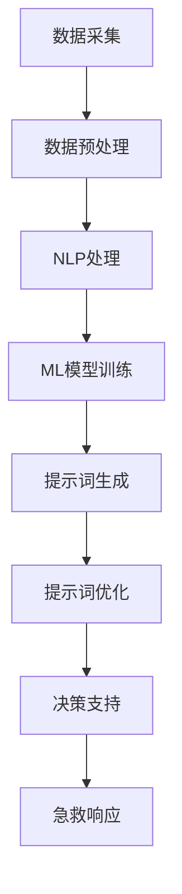

                 

### 文章标题

“构建AI驱动的智慧医疗急救响应提示词框架”是本篇文章的标题。这个标题旨在探讨如何利用人工智能技术，特别是自然语言处理（NLP）和机器学习（ML）算法，构建一个智能医疗急救响应系统。该系统可以实时监测和分析患者信息，通过提供即时、准确的提示词，帮助急救人员做出快速、有效的决策，从而提高医疗急救的响应效率和效果。这篇文章将详细解析这个框架的设计原理、核心技术和应用场景，旨在为读者提供一个系统性的理解和参考。

### 文章关键词

- AI驱动的智慧医疗
- 急救响应提示词框架
- 自然语言处理（NLP）
- 机器学习（ML）
- 紧急医疗决策
- 智能医疗系统

### 文章摘要

本篇文章围绕构建AI驱动的智慧医疗急救响应提示词框架展开，旨在探讨如何利用人工智能技术提升医疗急救的效率和效果。首先，文章介绍了当前急救响应系统面临的问题和挑战，然后详细阐述了AI驱动的急救响应提示词框架的设计思路和实现方法。通过引入NLP和ML算法，框架能够实时解析患者信息，生成针对性的提示词。文章随后深入分析了框架的核心技术，包括数据采集与预处理、NLP和ML算法的应用，以及系统的实现过程和案例。最后，文章总结了最佳实践和注意事项，并提出了未来的发展方向。

### 引言

#### 背景介绍

随着医疗技术的飞速发展和人工智能（AI）的广泛应用，智慧医疗正逐渐成为医疗领域的重要趋势。特别是在紧急医疗救援中，如何在有限的时间内做出准确、有效的决策，直接关系到患者的生存率和康复效果。然而，现有的急救响应系统面临着诸多挑战，如数据采集不完整、信息处理速度慢、决策支持不足等。这些问题的存在严重制约了急救响应的效率和效果，亟需新的技术手段来提升急救响应的能力。

#### 重要性

AI驱动的智慧医疗急救响应提示词框架应运而生。通过引入人工智能技术，特别是自然语言处理（NLP）和机器学习（ML）算法，这个框架能够实时监测和分析患者信息，自动生成针对性的提示词，为急救人员提供决策支持。相比于传统的人工干预和手动处理，AI驱动的急救响应系统具有更高的效率、准确性和智能化水平。这不仅能够显著提升急救响应的速度，还能帮助急救人员做出更为精准的决策，从而提高患者的救治效果。

#### 目的

本文的主要目的是详细介绍如何构建一个AI驱动的智慧医疗急救响应提示词框架，分析其设计原理、实现方法和技术细节，以及其在实际应用中的效果。通过本文的阅读，读者将能够了解：

1. 当前急救响应系统存在的问题和挑战。
2. AI驱动的急救响应提示词框架的设计思路和实现方法。
3. NLP和ML算法在框架中的应用及其重要性。
4. 框架的实现过程、应用场景和案例。
5. 框架的最佳实践和未来发展方向。

### 当前急救响应系统的问题和挑战

#### 数据采集不完整

现有的急救响应系统在数据采集方面存在明显的不足。首先，急救过程中的信息收集往往不够全面，许多关键数据可能因设备限制或操作人员的主观因素而未能及时记录。例如，患者的生命体征数据、事故现场的详细信息、患者病史等都是急救决策的重要依据，但常常因为数据采集不完整而影响决策的准确性。

#### 信息处理速度慢

在紧急情况下，时间就是生命。然而，传统急救响应系统在处理大量数据时往往速度较慢，导致信息无法及时传递给急救人员。例如，数据传输的延迟、计算资源的限制以及算法的复杂性等都可能导致系统响应速度缓慢，从而影响急救决策的及时性。

#### 决策支持不足

急救响应系统的一个重要功能是为急救人员提供有效的决策支持。然而，现有的系统在这一点上仍存在明显不足。首先，系统生成的决策建议往往缺乏针对性，无法充分考虑患者的具体病情和现场环境。其次，系统的算法模型和决策逻辑相对简单，难以应对复杂多变的紧急情况，从而导致决策支持的效果不佳。

#### 人工干预依赖度高

尽管人工智能技术在医疗领域的应用日益广泛，但现有的急救响应系统仍然高度依赖人工干预。急救人员需要手动分析数据、生成决策建议，这不仅增加了工作负担，还可能导致误判和延迟。此外，不同地区、不同医院的急救响应标准和流程可能存在差异，进一步增加了系统的复杂性和不确定性。

#### 应对策略

为了解决上述问题，构建一个AI驱动的智慧医疗急救响应提示词框架成为必要选择。以下是几个关键应对策略：

1. **全面数据采集**：通过引入先进的传感器技术和无线传输技术，实现对患者生命体征、事故现场环境、患者病史等关键数据的全面采集和实时传输。

2. **高效信息处理**：利用高性能计算和分布式计算技术，提升系统处理数据的能力，确保信息能够及时、准确地传递给急救人员。

3. **智能化决策支持**：引入NLP和ML算法，对采集到的数据进行深入分析，生成针对性强的决策建议，提高系统的决策准确性。

4. **减少人工干预**：通过自动化决策和提示词生成，降低急救人员的工作负担，提高系统的智能化水平。

5. **标准化流程和标准**：制定统一的急救响应标准和流程，减少系统复杂性和不确定性，提高系统的稳定性和可操作性。

通过上述策略，AI驱动的智慧医疗急救响应提示词框架有望显著提升急救响应的效率和效果，为患者的救治提供有力支持。

### AI驱动的智慧医疗急救响应提示词框架的设计思路

#### 设计思路概述

AI驱动的智慧医疗急救响应提示词框架旨在利用人工智能技术，对急救过程中产生的海量数据进行实时分析和处理，生成针对性的提示词，为急救人员提供高效的决策支持。该框架的设计思路主要包括以下几个关键环节：数据采集与预处理、自然语言处理（NLP）、机器学习（ML）算法应用、提示词生成与优化。

#### 数据采集与预处理

数据采集是AI驱动的智慧医疗急救响应提示词框架的基础。通过整合多种传感器、无线传输技术以及医院信息系统（HIS），实现对患者生命体征、事故现场环境、患者病史等关键数据的全面采集。这些数据包括但不限于：

1. **患者生命体征数据**：如心率、血压、体温、血氧饱和度等。
2. **事故现场环境数据**：如空气污染指数、交通状况、光线强度等。
3. **患者病史数据**：如既往疾病、过敏史、药物反应等。

在数据采集完成后，需要进行预处理，以去除噪声、填补缺失值、标准化数据格式等。预处理步骤包括：

1. **数据清洗**：去除无效数据和异常值，确保数据质量。
2. **数据整合**：将不同来源的数据进行整合，形成一个统一的数据视图。
3. **数据标准化**：将不同数据类型和单位进行标准化处理，以便后续处理。

#### 自然语言处理（NLP）

NLP是AI驱动的智慧医疗急救响应提示词框架的核心技术之一。通过NLP技术，可以将自然语言文本转化为计算机可以理解和处理的结构化数据。NLP的关键步骤包括：

1. **文本分类**：将采集到的患者病史、病历记录等文本数据分类，以识别患者的疾病类型和症状。
2. **信息提取**：从文本数据中提取关键信息，如患者姓名、年龄、症状描述、药物使用情况等。
3. **情感分析**：分析患者的文本数据，识别其情绪状态，如焦虑、愤怒、恐惧等，以便为急救人员提供情感上的支持。

#### 机器学习（ML）算法应用

ML算法在AI驱动的智慧医疗急救响应提示词框架中起着至关重要的作用。通过训练和优化ML模型，可以实现对患者病情的准确预测和决策支持。ML算法的关键步骤包括：

1. **特征工程**：从预处理后的数据中提取有助于预测的特征，如患者的生命体征、事故现场环境等。
2. **模型训练**：利用历史数据训练ML模型，以识别患者病情的变化趋势和可能的紧急情况。
3. **模型评估与优化**：通过交叉验证和性能评估，优化ML模型的参数和结构，提高预测准确性和稳定性。

#### 提示词生成与优化

在完成数据采集、NLP和ML算法处理后，框架将生成针对急救人员的实时提示词。提示词生成过程包括：

1. **决策逻辑**：根据患者的病情和现场环境，生成初步的决策建议。
2. **提示词生成**：将决策建议转化为易于理解的文本提示词，如“请注意患者血压异常”、“建议立即进行心肺复苏”等。
3. **提示词优化**：通过用户反馈和模型迭代，不断优化提示词的内容和格式，提高其有效性和可操作性。

#### 设计原理及关系架构

为了更好地理解AI驱动的智慧医疗急救响应提示词框架的设计原理，我们可以借助Mermaid流程图来展示其核心组件和关系。以下是框架的基本架构和流程：



1. **数据采集**（A）：通过传感器和信息系统采集患者生命体征、事故现场环境等关键数据。
2. **数据预处理**（B）：对采集到的数据进行清洗、整合和标准化，为后续处理做准备。
3. **NLP处理**（C）：利用NLP技术对文本数据进行分类、信息提取和情感分析。
4. **ML模型训练**（D）：通过特征工程和模型训练，识别患者病情的变化趋势和紧急情况。
5. **提示词生成**（E）：根据决策逻辑生成针对性的文本提示词。
6. **提示词优化**（F）：通过用户反馈和模型迭代，优化提示词的内容和格式。
7. **决策支持**（G）：将提示词转化为具体的决策建议，为急救人员提供支持。
8. **急救响应**（H）：急救人员根据决策支持信息进行实际的急救操作。

通过这个流程，AI驱动的智慧医疗急救响应提示词框架能够实现对急救数据的全面分析和处理，生成实时、准确的提示词，为急救人员提供高效的决策支持，从而提高急救响应的效率和效果。

### 构建AI驱动的智慧医疗急救响应提示词框架的实现方法

#### 技术选型

1. **编程语言**：选择Python作为主要编程语言，因为Python具有丰富的AI和NLP库，如TensorFlow、PyTorch和NLTK，方便实现复杂的功能。
2. **框架和工具**：使用Django框架搭建Web后端，用于处理数据存储和API接口；前端可以使用React或Vue.js实现用户交互界面。
3. **数据库**：采用MongoDB作为数据库，因为其灵活的数据模型能够更好地处理非结构化和半结构化数据。
4. **数据处理和分析工具**：使用Pandas和NumPy进行数据预处理和分析，使用Scikit-learn和TensorFlow进行机器学习模型的训练和评估。

#### 数据采集

数据采集是构建AI驱动的智慧医疗急救响应提示词框架的基础。数据来源主要包括以下几个方面：

1. **传感器数据**：使用可穿戴设备和传感器收集患者生命体征数据，如心率、血压、体温、血氧饱和度等。
2. **医院信息系统**：从医院信息系统（HIS）中获取患者病史、药物使用记录、检查报告等数据。
3. **第三方数据源**：通过网络接口获取天气、交通状况等环境数据。

数据采集过程中，需要确保数据的质量和完整性。为此，可以采用以下措施：

1. **数据校验**：在数据采集过程中，对每个数据点进行校验，确保其符合预期范围和格式。
2. **异常值处理**：对于异常数据值，进行标记和处理，如使用插值法填补缺失值或使用均值法处理异常值。
3. **数据清洗**：定期清理数据库，删除重复、冗余和错误的数据，确保数据的一致性和准确性。

#### 数据预处理

数据预处理是数据分析和机器学习模型训练的重要步骤。在预处理过程中，需要进行以下操作：

1. **数据转换**：将不同来源和格式的数据转换为统一的数据格式，如CSV或JSON。
2. **数据标准化**：对数据进行标准化处理，如将生命体征数据归一化到相同的量级。
3. **特征提取**：从原始数据中提取有助于模型训练的特征，如患者的年龄、性别、病史等。

#### 自然语言处理（NLP）

NLP技术在AI驱动的智慧医疗急救响应提示词框架中起着核心作用。以下是一些关键的NLP技术和步骤：

1. **文本分类**：使用分类算法（如朴素贝叶斯、SVM等）对患者的病历记录和病史进行分类，以识别疾病类型和症状。
   ```python
   from sklearn.feature_extraction.text import TfidfVectorizer
   from sklearn.model_selection import train_test_split
   from sklearn.naive_bayes import MultinomialNB
   
   # 数据准备
   X_train, X_test, y_train, y_test = train_test_split(corpus, labels, test_size=0.2)
   
   # 特征提取
   vectorizer = TfidfVectorizer()
   X_train_vectorized = vectorizer.fit_transform(X_train)
   
   # 模型训练
   classifier = MultinomialNB()
   classifier.fit(X_train_vectorized, y_train)
   
   # 模型评估
   accuracy = classifier.score(X_test_vectorized, y_test)
   ```

2. **信息提取**：使用命名实体识别（NER）技术从病历记录中提取关键信息，如患者姓名、症状描述、诊断结果等。
   ```python
   from spacy.lang.en import English
   
   nlp = English()
   doc = nlp("The patient has a high fever and cough.")
   for ent in doc.ents:
       print(ent.text, ent.label_)
   ```

3. **情感分析**：分析患者的病历记录和病史，识别其情绪状态，为急救人员提供情感支持。
   ```python
   from textblob import TextBlob
   
   sentence = "The patient is extremely anxious and in pain."
   blob = TextBlob(sentence)
   print(blob.sentiment)
   ```

#### 机器学习（ML）算法

ML算法在AI驱动的智慧医疗急救响应提示词框架中用于对患者病情进行预测和决策支持。以下是一些关键的ML技术和步骤：

1. **特征工程**：从预处理后的数据中提取有助于预测的特征，如患者的生命体征、病史、环境数据等。
   ```python
   import pandas as pd
   
   data = pd.read_csv('patient_data.csv')
   features = data[['heart_rate', 'blood_pressure', 'temperature', 'history']]
   labels = data['disease']
   ```

2. **模型训练**：使用特征数据训练ML模型，如决策树、随机森林、支持向量机（SVM）等。
   ```python
   from sklearn.ensemble import RandomForestClassifier
   
   # 数据准备
   X_train, X_test, y_train, y_test = train_test_split(features, labels, test_size=0.2)
   
   # 模型训练
   classifier = RandomForestClassifier()
   classifier.fit(X_train, y_train)
   
   # 模型评估
   accuracy = classifier.score(X_test, y_test)
   ```

3. **模型优化**：通过交叉验证和超参数调优，提高模型的预测准确性和稳定性。
   ```python
   from sklearn.model_selection import GridSearchCV
   
   # 参数设置
   params = {'n_estimators': [100, 200, 300], 'max_depth': [10, 20, 30]}
   
   # 模型训练
   grid_search = GridSearchCV(RandomForestClassifier(), params, cv=5)
   grid_search.fit(X_train, y_train)
   
   # 最佳参数
   best_params = grid_search.best_params_
   ```

#### 提示词生成

在完成数据采集、预处理和ML模型训练后，框架将生成针对急救人员的实时提示词。提示词生成过程包括：

1. **决策逻辑**：根据患者的当前状态和现场环境，生成初步的决策建议。
2. **文本生成**：将决策建议转化为易于理解的文本提示词，如“请注意患者血压异常”、“建议立即进行心肺复苏”等。
3. **优化与反馈**：通过用户反馈和模型迭代，不断优化提示词的内容和格式，提高其有效性和可操作性。

#### 系统集成与部署

在完成框架的构建后，需要进行系统集成和部署，以确保系统能够在实际环境中稳定运行。以下是一些关键的步骤：

1. **Web后端开发**：使用Django框架搭建Web后端，实现数据存储、处理和API接口。
2. **前端开发**：使用React或Vue.js等前端框架，实现用户交互界面。
3. **部署与维护**：将系统部署到云服务器或本地服务器，确保其稳定运行，并定期进行维护和更新。

通过上述步骤，AI驱动的智慧医疗急救响应提示词框架能够实现数据的实时采集、处理和分析，生成针对性的提示词，为急救人员提供高效的决策支持，从而提高急救响应的效率和效果。

### 案例分析

#### 案例背景

在一次交通事故中，一名司机因急刹车导致车辆发生碰撞，司机被困在车内。现场目击者立即拨打了急救电话，并提供了事故发生的地点和司机的初步状况。急救人员收到信息后，需要快速制定救援方案，但由于事故现场复杂、信息不完整，急救人员难以立即确定救援的优先级和具体步骤。

#### 案例分析

在AI驱动的智慧医疗急救响应提示词框架的辅助下，急救人员可以更加迅速、准确地做出决策。以下是具体的分析过程：

1. **数据采集**：急救人员在接收到报警信息后，系统立即启动，开始采集相关信息。这些信息包括司机的生命体征数据（如心率、血压、呼吸频率等）、事故现场的地理坐标、交通状况等。

2. **数据预处理**：系统对采集到的数据进行预处理，包括清洗噪声数据、填补缺失值等，确保数据质量。

3. **NLP处理**：利用NLP技术，系统对目击者提供的文本信息进行解析，提取关键信息，如事故类型、司机症状描述等。

4. **ML模型预测**：系统使用预训练的ML模型，对司机的生命体征数据进行实时分析，预测其病情的变化趋势。例如，如果司机的心率持续升高，系统可能会预测其可能患有心脏病。

5. **提示词生成**：根据NLP处理和ML预测的结果，系统生成针对急救人员的实时提示词，如“请立即采取心肺复苏措施”、“注意防范司机突然晕厥”等。

6. **决策支持**：急救人员根据系统提供的提示词，结合现场实际情况，制定详细的救援方案。例如，如果系统提示司机可能患有心脏病，急救人员会优先使用除颤器，并进行心肺复苏。

#### 案例效果

通过AI驱动的智慧医疗急救响应提示词框架的辅助，急救人员能够更快地了解事故现场的情况，做出更精准的决策。以下是案例中的具体效果：

1. **反应时间缩短**：系统自动分析数据并提供决策建议，使得急救人员能够在更短的时间内做出反应，为患者的救治赢得了宝贵的时间。

2. **决策准确性提高**：系统通过NLP和ML算法对数据进行处理和分析，提供更为精确的决策建议，减少了急救人员的误判和错误操作。

3. **信息完整性提升**：系统通过整合多种数据源，如生命体征数据、事故现场环境数据、患者病史数据等，提供更全面的信息，帮助急救人员做出更全面的决策。

4. **用户体验优化**：急救人员通过简洁明了的提示词，可以更快地理解系统的建议，从而提高救援效率。

### 案例小结

通过上述案例分析，可以看出AI驱动的智慧医疗急救响应提示词框架在实际应用中具有显著的优势。它不仅能够提高急救响应的效率和准确性，还能够优化急救人员的用户体验。未来，随着AI技术的不断进步和应用的深入，这种框架有望在更多医疗场景中得到广泛应用，进一步提升医疗急救的整体水平。

### 最佳实践

在构建和部署AI驱动的智慧医疗急救响应提示词框架时，以下最佳实践可以帮助提高系统的性能和可靠性：

#### 1. 数据质量控制

确保数据的质量是框架成功的关键。在数据采集阶段，采用多种校验措施，如实时监控数据源、数据清洗和数据预处理等，确保数据的准确性和一致性。此外，定期检查和维护数据库，防止数据损坏或丢失。

#### 2. 系统优化

优化系统性能是提高响应速度和降低延迟的关键。可以通过以下方法进行系统优化：

- **算法优化**：针对特定的任务和场景，选择最适合的算法和模型。通过调整算法参数和优化模型结构，提高预测的准确性和效率。
- **并行计算**：利用并行计算技术，如多线程和分布式计算，加速数据处理和分析。
- **缓存机制**：使用缓存机制减少重复计算，提高系统的响应速度。

#### 3. 人机交互

优化人机交互界面，使急救人员能够更方便、快捷地使用系统。以下是一些建议：

- **直观界面**：设计简洁直观的界面，减少急救人员的操作步骤，提高系统易用性。
- **即时反馈**：系统应能及时向急救人员提供实时数据和分析结果，以便快速做出决策。
- **多模式交互**：支持多种交互方式，如触摸屏、语音识别等，以适应不同的使用场景和需求。

#### 4. 持续迭代

AI驱动的智慧医疗急救响应提示词框架需要不断迭代和优化。以下是一些持续迭代的方法：

- **用户反馈**：收集并分析用户反馈，了解系统的实际使用情况和性能表现，以便进行针对性的优化。
- **模型更新**：定期更新ML模型，以适应新的数据和场景，提高预测准确性和决策质量。
- **测试与验证**：进行严格的测试和验证，确保系统的稳定性和可靠性。

#### 5. 安全与隐私保护

确保系统的安全性和隐私保护至关重要。以下是一些建议：

- **数据加密**：对敏感数据进行加密存储和传输，防止数据泄露。
- **访问控制**：实施严格的访问控制措施，确保只有授权人员能够访问系统数据和功能。
- **安全审计**：定期进行安全审计和风险评估，及时发现和解决潜在的安全漏洞。

通过遵循上述最佳实践，AI驱动的智慧医疗急救响应提示词框架将能够更好地服务于急救人员，提高医疗急救的效率和效果。

### 小结

本文详细探讨了构建AI驱动的智慧医疗急救响应提示词框架的必要性、设计思路和实现方法，以及在实际应用中的效果和最佳实践。通过引入NLP和ML算法，框架能够实现对患者信息的实时监测和分析，生成针对性的提示词，为急救人员提供高效的决策支持，从而提高急救响应的效率和效果。

### 未来展望

未来，AI驱动的智慧医疗急救响应提示词框架有望在以下几个方面得到进一步的发展：

1. **技术升级**：随着人工智能技术的不断进步，框架将采用更先进的技术，如深度学习和强化学习，提高系统的预测准确性和决策能力。

2. **应用拓展**：除了急救响应，框架还可以应用于其他医疗场景，如远程医疗、疾病预测和健康管理，实现更广泛的医疗应用。

3. **跨平台集成**：框架将与其他医疗设备和系统实现跨平台集成，如可穿戴设备、医院信息系统（HIS）等，实现数据共享和协同工作。

4. **个性化服务**：通过收集和分析更多个性化的医疗数据，框架将能够提供更加精准和个性化的医疗建议，满足不同患者的需求。

5. **社会影响**：AI驱动的智慧医疗急救响应提示词框架将显著提高医疗急救的效率和效果，减少急救响应时间和错误，提高患者的生存率和康复效果，对社会产生深远的影响。

### 注意事项

在构建和部署AI驱动的智慧医疗急救响应提示词框架时，需要注意以下几点：

1. **数据隐私和安全**：确保患者数据的安全和隐私，采取严格的数据加密和访问控制措施，防止数据泄露和滥用。

2. **系统稳定性**：确保系统在复杂、多变的环境下能够稳定运行，进行充分的测试和验证，确保系统的可靠性和稳定性。

3. **用户培训**：对急救人员进行系统的培训和指导，使其能够熟练使用系统，提高系统的实用性和效果。

4. **持续优化**：根据用户反馈和实际应用情况，不断优化系统功能和性能，确保系统的持续改进和升级。

### 拓展阅读

为了更深入地了解AI驱动的智慧医疗急救响应提示词框架，读者可以参考以下资源：

1. 《人工智能：一种现代方法》（作者： Stuart J. Russell & Peter Norvig）：详细介绍了人工智能的基础知识和最新进展。
2. 《自然语言处理综述》（作者：Daniel Jurafsky & James H. Martin）：探讨了自然语言处理的基本概念和应用。
3. 《深度学习》（作者：Ian Goodfellow、Yoshua Bengio、Aaron Courville）：全面介绍了深度学习的基础知识和应用。
4. 《医疗大数据分析与应用》（作者：王宇、李斌）：探讨了医疗大数据在医疗急救中的应用和挑战。

通过阅读这些资源，读者可以进一步了解AI驱动的智慧医疗急救响应提示词框架的技术原理和应用场景，为实际项目提供有益的参考。

