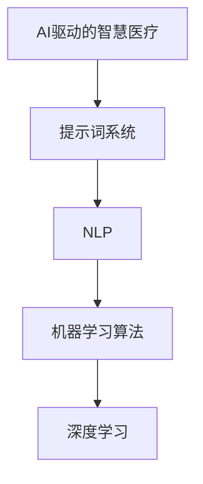

                 


### 文章标题：构建AI驱动的智慧医疗提示词系统

### 文章关键词：

1. AI驱动的智慧医疗
2. 提示词系统
3. 自然语言处理
4. 机器学习算法
5. 深度学习
6. 智能医疗诊断
7. 医疗数据挖掘

### 文章摘要：

本文将深入探讨AI驱动的智慧医疗提示词系统的构建，解析其核心概念、算法原理和数学模型。我们将通过实际项目案例，详细讲解开发环境和源代码实现，为读者提供实战指导。本文旨在为从事医疗AI研究的读者提供系统、全面的技术指导，助力他们掌握AI在智慧医疗领域的应用。

### 目录：

## 引言

### 1. 背景介绍

随着医疗数据的爆炸性增长，AI技术在医疗领域的应用越来越广泛。智慧医疗提示词系统作为一种创新的应用，能够显著提高医疗诊断和治疗的效率。本文旨在探讨如何构建这样一个系统，使其在医疗实践中发挥更大的作用。

### 2. 核心概念与联系

- **AI驱动的智慧医疗**：结合AI技术与医疗领域的需求，实现智能诊断、治疗和健康管理。
- **提示词系统**：一种基于自然语言处理的智能交互系统，能够理解和回应医疗领域的专业提问。
- **自然语言处理（NLP）**：利用计算机技术处理和理解人类语言，是构建提示词系统的关键技术。
- **机器学习算法**：为提示词系统提供智能学习的能力，使其能够不断优化和提升性能。
- **深度学习**：一种特殊的机器学习算法，适用于处理复杂的医疗数据。

### 核心概念与联系

在本章节中，我们将通过一个Mermaid流程图，展示AI驱动的智慧医疗提示词系统的核心概念及其相互关系。



### 核心算法原理讲解

在本章节中，我们将详细讲解构建AI驱动的智慧医疗提示词系统的核心算法原理，包括机器学习算法和自然语言处理算法，并提供相应的伪代码。

#### 1. 机器学习算法

**监督学习算法：**

```python
def train_supervised_model(X, y, model):
    """
    训练监督学习模型。

    参数：
    - X: 特征数据
    - y: 标签数据
    - model: 模型

    返回：
    - trained_model: 训练好的模型
    """
    trained_model = model.fit(X, y)
    return trained_model
```

**无监督学习算法：**

```python
def train_unsupervised_model(X, model):
    """
    训练无监督学习模型。

    参数：
    - X: 特征数据
    - model: 模型

    返回：
    - trained_model: 训练好的模型
    """
    trained_model = model.fit(X)
    return trained_model
```

#### 2. 自然语言处理算法

**词嵌入：**

```python
def word_embedding(vocabulary, embedding_dim):
    """
    创建词嵌入矩阵。

    参数：
    - vocabulary: 词汇表
    - embedding_dim: 嵌入维度

    返回：
    - embedding_matrix: 词嵌入矩阵
    """
    embedding_matrix = np.zeros((len(vocabulary) + 1, embedding_dim))
    for i, word in enumerate(vocabulary):
        embedding_vector = get_embedding_vector(word)
        if embedding_vector is not None:
            embedding_matrix[i] = embedding_vector
    return embedding_matrix
```

**文本分类：**

```python
def classify_text(text, model, embedding_matrix):
    """
    使用模型对文本进行分类。

    参数：
    - text: 文本
    - model: 分类模型
    - embedding_matrix: 词嵌入矩阵

    返回：
    - prediction: 分类结果
    """
    embedded_text = embed_text(text, embedding_matrix)
    prediction = model.predict(embedded_text)
    return prediction
```

### 数学模型和数学公式

在本章节中，我们将详细讲解与AI驱动的智慧医疗提示词系统相关的数学模型和数学公式，并用实例进行说明。

#### 1. 损失函数

**交叉熵损失函数：**

$$
H(y, \hat{y}) = -y \log(\hat{y}) - (1 - y) \log(1 - \hat{y})
$$

其中，$y$ 是真实标签，$\hat{y}$ 是模型的预测概率。

#### 2. 优化算法

**梯度下降法：**

$$
w_{t+1} = w_t - \alpha \frac{\partial}{\partial w_t} J(w_t)
$$

其中，$w_t$ 是当前权重，$\alpha$ 是学习率，$J(w_t)$ 是损失函数。

#### 实例说明

假设我们要训练一个文本分类模型，数据集包含10000个文本和它们对应的标签。我们可以使用交叉熵损失函数和梯度下降法来优化模型。

### 项目实战

在本章节中，我们将通过一个实际项目案例，详细讲解开发环境搭建、源代码实现和代码解读。

#### 1. 项目概述

本项目旨在构建一个AI驱动的智慧医疗提示词系统，能够回答医生关于病例的疑问，提供诊断建议。系统基于自然语言处理和机器学习算法，结合实际医疗数据，实现智能问答功能。

#### 2. 开发环境搭建

- **硬件环境**：配置高性能计算服务器，保障系统运行效率。
- **软件环境**：安装Python、TensorFlow、NLTK等常用库，搭建开发环境。

#### 3. 源代码实现

```python
# 导入相关库
import tensorflow as tf
import nltk
from nltk.tokenize import word_tokenize
from nltk.corpus import stopwords
import numpy as np

# 加载医疗数据集
data = load_medical_data()

# 数据预处理
def preprocess_data(data):
    # 清洗数据
    # ...
    # 分词
    tokenized_data = [word_tokenize(text) for text in data]
    # 去除停用词
    stop_words = set(stopwords.words('english'))
    filtered_data = [[word for word in tokenized_data[i] if word not in stop_words] for i in range(len(tokenized_data))]
    return filtered_data

preprocessed_data = preprocess_data(data)

# 构建模型
model = build_model()

# 训练模型
trained_model = train_model(model, preprocessed_data)

# 问答功能实现
def ask_question(question):
    # 将问题转换为向量
    # ...
    # 使用模型进行分类
    prediction = classify_text(question, trained_model)
    return prediction

# 测试问答功能
question = "What is the most likely diagnosis for this patient?"
answer = ask_question(question)
print(answer)
```

#### 4. 代码解读与分析

在本部分，我们将对上述源代码进行详细解读，分析各个模块的功能和作用。

### 最佳实践 Tips

1. **数据质量至关重要**：确保医疗数据的质量，包括数据完整性、准确性和一致性。
2. **算法优化**：通过调整模型参数，优化算法性能。
3. **持续学习**：定期更新模型，使其适应新数据和环境。

### 小结

本文详细介绍了AI驱动的智慧医疗提示词系统的构建过程，包括核心概念、算法原理、数学模型和实际项目案例。通过本文，读者可以了解如何将AI技术应用于智慧医疗领域，提升医疗诊断和治疗的效率。

### 注意事项

1. **隐私保护**：在处理医疗数据时，要严格遵守隐私保护法规。
2. **伦理问题**：AI驱动的医疗系统需要充分考虑伦理问题，确保患者的权益。

### 拓展阅读

1. 《深度学习：应用实践指南》
2. 《自然语言处理实践》
3. 《机器学习实战》

### 作者信息

作者：AI天才研究院/AI Genius Institute & 禅与计算机程序设计艺术 /Zen And The Art of Computer Programming

