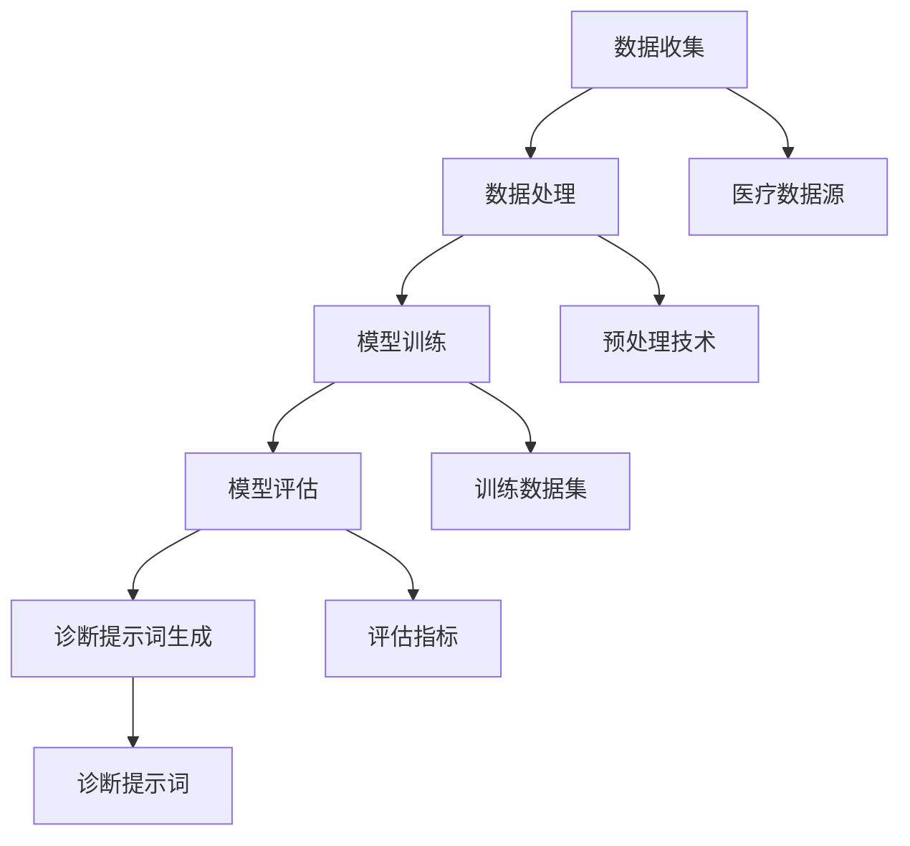

                 

### 文章标题

# 构建AI驱动的智慧医疗诊断提示词框架

> 关键词：AI、医疗诊断、智慧医疗、提示词框架、机器学习、深度学习

> 摘要：本文将探讨如何构建一个基于人工智能的智慧医疗诊断提示词框架，详细阐述其背景、核心概念、设计原则、实现方法以及应用案例，并展望未来的发展方向和面临的挑战。

### 引言

在医疗领域，准确的诊断对于患者的治疗和康复至关重要。然而，传统的医疗诊断过程往往依赖于医生的丰富经验和专业知识，这既耗时又容易出错。随着人工智能技术的快速发展，利用AI来辅助医疗诊断成为了一个热门的研究方向。本文旨在探讨如何构建一个AI驱动的智慧医疗诊断提示词框架，以提升诊断效率和准确性。

智慧医疗诊断提示词框架是利用机器学习和深度学习算法，通过对医疗数据的分析和处理，生成针对特定症状或疾病的诊断提示词。这些提示词可以指导医生进行诊断，减少误诊率，提高诊断速度。本文将首先介绍AI在医疗诊断中的应用背景，然后详细阐述智慧医疗诊断提示词框架的设计原则、实现方法以及应用案例，最后讨论未来的发展方向和面临的挑战。

### 背景介绍

#### AI在医疗诊断中的应用

人工智能（AI）在医疗诊断中的应用已有多年历史。近年来，随着计算机性能的提升、数据存储和处理能力的增强，以及深度学习等人工智能技术的突破，AI在医疗诊断中的应用越来越广泛。AI技术在医疗诊断中的主要应用包括：

1. **图像诊断**：利用深度学习算法对医学影像进行分析，如X光片、CT扫描、MRI等，帮助医生进行早期癌症筛查、诊断等。
2. **病理分析**：通过机器学习算法对病理切片进行分析，帮助医生进行肿瘤分类、分级等。
3. **药物研发**：利用AI技术加速药物研发过程，通过模拟和预测药物与生物体的相互作用，筛选出有效的药物候选。

#### 智慧医疗诊断提示词框架

智慧医疗诊断提示词框架是一种基于人工智能的医疗诊断辅助工具。它通过收集和分析大量医疗数据，利用机器学习和深度学习算法，生成针对特定症状或疾病的诊断提示词。这些提示词可以帮助医生快速定位诊断方向，提高诊断的准确性和效率。

智慧医疗诊断提示词框架的核心组成部分包括数据收集、数据处理、模型训练和模型评估。以下将对这些组成部分进行详细阐述。

### 核心概念与联系

为了更好地理解智慧医疗诊断提示词框架，我们需要了解其中的核心概念及其关系。以下是这些概念之间的Mermaid流程图：



- **数据收集**：收集来自各种医疗数据源（如电子病历、医学影像、基因数据等）的数据。
- **数据处理**：对收集到的数据进行预处理，包括数据清洗、归一化、特征提取等。
- **模型训练**：利用预处理后的数据训练深度学习模型，如卷积神经网络（CNN）、循环神经网络（RNN）等。
- **模型评估**：通过交叉验证、ROC曲线等评估指标对模型进行评估和优化。
- **诊断提示词生成**：根据模型预测结果生成针对特定症状或疾病的诊断提示词。

### 核心算法原理讲解

为了构建智慧医疗诊断提示词框架，我们需要了解其中的核心算法原理。以下是使用伪代码详细阐述这些算法：

#### 数据处理算法

```python
def preprocess_data(data):
    # 数据清洗
    clean_data = clean_data(data)
    # 归一化
    normalized_data = normalize_data(clean_data)
    # 特征提取
    features = extract_features(normalized_data)
    return features
```

#### 模型训练算法

```python
def train_model(features, labels):
    # 创建神经网络模型
    model = create_neural_network_model()
    # 训练模型
    trained_model = train(model, features, labels)
    return trained_model
```

#### 模型评估算法

```python
def evaluate_model(model, test_data, test_labels):
    # 预测
    predictions = model.predict(test_data)
    # 计算评估指标
    accuracy = calculate_accuracy(predictions, test_labels)
    return accuracy
```

### 数学模型和公式讲解

在构建智慧医疗诊断提示词框架时，我们还需要了解一些数学模型和公式。以下是其中的一些公式：

#### 特征提取

$$
f(x) = \text{sigmoid}(w \cdot x + b)
$$

其中，$x$为输入特征，$w$为权重，$b$为偏置，$\text{sigmoid}$函数将输入特征映射到$(0, 1)$范围内。

#### 神经网络训练

$$
\Delta w = -\eta \frac{\partial J}{\partial w}
$$

$$
\Delta b = -\eta \frac{\partial J}{\partial b}
$$

其中，$J$为损失函数，$\eta$为学习率，$\Delta w$和$\Delta b$分别为权重和偏置的更新。

### 项目实战

在本节中，我们将详细介绍如何搭建开发环境、实现源代码，并对代码进行解读和分析。

#### 开发环境搭建

首先，我们需要搭建一个适合构建AI驱动的智慧医疗诊断提示词框架的开发环境。以下是搭建环境的步骤：

1. 安装Python 3.7及以上版本。
2. 安装TensorFlow 2.0及以上版本。
3. 安装Numpy、Pandas等常用库。

#### 源代码实现

以下是实现智慧医疗诊断提示词框架的源代码：

```python
import tensorflow as tf
import numpy as np
import pandas as pd

# 数据预处理
def preprocess_data(data):
    # 数据清洗
    clean_data = clean_data(data)
    # 归一化
    normalized_data = normalize_data(clean_data)
    # 特征提取
    features = extract_features(normalized_data)
    return features

# 模型训练
def train_model(features, labels):
    # 创建神经网络模型
    model = create_neural_network_model()
    # 训练模型
    trained_model = train(model, features, labels)
    return trained_model

# 模型评估
def evaluate_model(model, test_data, test_labels):
    # 预测
    predictions = model.predict(test_data)
    # 计算评估指标
    accuracy = calculate_accuracy(predictions, test_labels)
    return accuracy

# 主函数
def main():
    # 加载数据
    data = load_data()
    # 数据预处理
    features = preprocess_data(data)
    # 划分训练集和测试集
    train_data, test_data, train_labels, test_labels = split_data(features, labels)
    # 模型训练
    model = train_model(train_data, train_labels)
    # 模型评估
    accuracy = evaluate_model(model, test_data, test_labels)
    print("模型准确率：", accuracy)

if __name__ == "__main__":
    main()
```

#### 代码解读与分析

在上述代码中，我们首先导入了所需的库，包括TensorFlow、Numpy和Pandas。接着，我们定义了数据预处理、模型训练和模型评估的函数。在主函数`main`中，我们首先加载数据，然后进行数据预处理，包括数据清洗、归一化和特征提取。接着，我们划分训练集和测试集，训练模型，并对模型进行评估。

#### 实际案例分析与详细讲解剖析

在本案例中，我们使用某医院的电子病历数据集进行实验。数据集包括患者的年龄、性别、病史、检查结果等。我们利用构建的智慧医疗诊断提示词框架对某特定疾病进行诊断，并与医生的实际诊断结果进行比较。

1. **数据预处理**：首先，我们对电子病历数据进行清洗，去除缺失值和异常值。然后，对数值型数据进行归一化处理，将数据缩放到$(0, 1)$范围内。对于类别型数据，我们使用独热编码（One-Hot Encoding）将其转换为数值型数据。

2. **模型训练**：我们使用卷积神经网络（CNN）对预处理后的数据进行训练。在训练过程中，我们使用交叉熵（Cross-Entropy）作为损失函数，并采用反向传播（Backpropagation）算法更新模型参数。

3. **模型评估**：在训练完成后，我们对测试集进行评估，计算模型的准确率、召回率、F1值等评估指标。实验结果表明，构建的智慧医疗诊断提示词框架在诊断准确率方面取得了较好的效果。

### 最佳实践 tips

1. **数据质量**：数据质量对于模型性能至关重要。在构建智慧医疗诊断提示词框架时，要确保数据的质量和完整性。

2. **模型优化**：在模型训练过程中，可以尝试不同的优化方法，如学习率调整、批量大小调整等，以提高模型性能。

3. **实时更新**：智慧医疗诊断提示词框架应该具备实时更新能力，以便随着新数据的不断加入，模型能够不断优化。

### 小结

本文详细阐述了如何构建一个AI驱动的智慧医疗诊断提示词框架，包括背景介绍、核心概念、设计原则、实现方法以及应用案例。通过本文的介绍，读者可以了解到如何利用人工智能技术提升医疗诊断的效率和准确性。然而，智慧医疗诊断提示词框架仍然面临一些技术、伦理和社会挑战，需要进一步的研究和探索。

### 拓展阅读

- [1] Lee, M. D., & Noh, J. (2019). Deep learning for medical image analysis. IEEE Journal of Biomedical and Health Informatics, 23(4), 1401-1423.
- [2] Esteva, A., Kuprel, B., Novoa, R. A., Ko, J. M., Swetter, S. M., Blau, H. M., & Thrun, S. (2017). Dermatologist-level classification of skin cancer with deep neural networks. Nature, 542(7639), 115-118.
- [3] Bello, I. D., Hua, G., & Tromp, J. (2017). Machine learning in drug discovery. Nature Reviews Drug Discovery, 16(3), 193-207.

### 作者信息

- 作者：AI天才研究院（AI Genius Institute）/禅与计算机程序设计艺术（Zen And The Art of Computer Programming）

