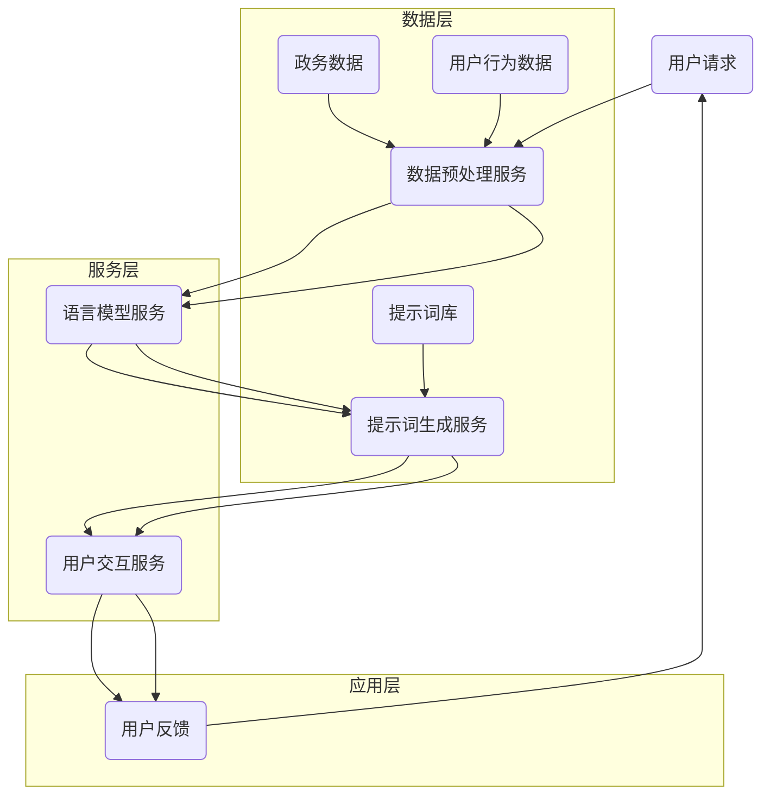

                 


## 引言

### 1.1 文章目的与背景

在信息化时代的浪潮中，智慧政务作为现代政府治理的重要手段，正逐渐受到各国的重视。智慧政务不仅仅是政府信息化的一部分，更是通过应用先进技术手段，提高政府工作效率、增强政务透明度和提升公众参与度的一种新型治理模式。本文旨在探讨构建一个基于AI驱动的智慧政务公众参与提示词系统，从而为政府与公众之间的互动提供更加智能和高效的平台。

### 1.2 智慧政务与AI的关系

智慧政务与AI技术之间的联系日益紧密。AI技术，特别是自然语言处理（NLP）和机器学习（ML），为智慧政务带来了强大的工具和平台。AI驱动的系统可以处理大量的非结构化数据，从文本、语音到图像，为政府提供实时、精准的决策支持。同时，AI技术还可以通过智能化的公众参与提示词系统，提高公众的参与度和满意度，促进政务透明度和公信力的提升。

### 1.3 公众参与在智慧政务中的重要性

公众参与是智慧政务的核心要素之一。一个有效的公众参与机制不仅能够提升政府的决策质量和执行效果，还能够增强公众对政府的信任和满意度。公众参与提示词系统通过提供个性化的提示词和建议，引导公众更加便捷和高效地参与到政务活动中来，从而实现政府与公众之间的良性互动。

### 总结

本文将围绕智慧政务与AI的关系、AI驱动的公众参与提示词系统的构建方法、核心算法原理、实现细节、系统部署与维护、案例分析以及未来展望与挑战等方面进行深入探讨，旨在为智慧政务领域的技术实践提供有价值的参考和指导。

### 文章关键词

智慧政务、AI、自然语言处理、公众参与、提示词系统、机器学习、政务透明度、数据预处理、模型训练、系统部署。

### 文章摘要

本文探讨了构建AI驱动的智慧政务公众参与提示词系统的必要性和重要性。首先，介绍了智慧政务和AI技术的发展背景及其在提升政府工作效率和增强公众参与度方面的应用价值。接着，详细阐述了AI驱动的公众参与提示词系统的需求分析、架构设计、核心算法原理以及实现细节。通过案例分析，展示了系统在实际政务中的应用效果。最后，提出了未来智慧政务公众参与提示词系统的发展方向和面临的挑战，为相关研究和实践提供了参考。

----------------------------------------------------------------

## 目录大纲

### 《构建AI驱动的智慧政务公众参与提示词系统》

### 目录大纲

#### 第一部分：基础理论

**第1章：智慧政务与AI简介**

- 1.1 智慧政务的概念与发展
- 1.2 AI在智慧政务中的应用价值
- 1.3 公众参与提示词系统的意义

**第2章：AI驱动的公众参与提示词系统架构**

- 2.1 公众参与提示词系统的需求分析
- 2.2 AI驱动的系统架构设计
- 2.3 Mermaid流程图：AI驱动的公众参与提示词系统工作流程

**第3章：核心算法原理**

- 3.1 语言模型的基本原理
- 3.2 语言模型的训练过程
- 3.3 伪代码：语言模型训练算法

#### 第二部分：实现细节

**第4章：数据预处理**

- 4.1 数据来源与数据质量评估
- 4.2 数据预处理步骤
- 4.3 公众参与数据示例

**第5章：模型训练与优化**

- 5.1 模型选择与训练
- 5.2 模型优化技巧
- 5.3 模型评估与调整

**第6章：系统部署与维护**

- 6.1 系统部署环境搭建
- 6.2 系统接口设计
- 6.3 维护与更新策略

**第7章：案例分析**

- 7.1 案例背景介绍
- 7.2 案例实施步骤
- 7.3 案例效果评估

#### 第三部分：未来展望与挑战

**第8章：未来展望与挑战**

- 8.1 公众参与提示词系统的未来发展方向
- 8.2 面临的挑战与解决方案

#### 附录

**附录A：工具与资源**

- A.1 AI模型训练工具
- A.2 数据预处理工具
- A.3 系统部署工具

**附录B：数学模型与公式**

- B.1 语言模型数学公式
- B.2 优化算法数学公式
- B.3 示例讲解

### 注意事项

- 请按照目录大纲结构，逐章节撰写内容，确保每章内容完整、具体、详细。
- 需要使用Mermaid流程图和伪代码来展示系统架构和工作流程。
- 数学公式和算法原理部分需详细讲解，并附上示例说明。
- 实现细节、案例分析和未来展望等部分需要结合具体实例进行分析。
- 文章结尾需包含作者信息及致谢。

----------------------------------------------------------------

### 第一部分：基础理论

#### 第1章：智慧政务与AI简介

##### 1.1 智慧政务的概念与发展

**智慧政务**（Smart Governance）是指利用现代信息技术，特别是人工智能、大数据、物联网等先进技术手段，对政府管理和服务流程进行创新和优化，以提高政府工作效率、增强政务透明度和提升公众满意度的一种新型治理模式。智慧政务的发展可以追溯到20世纪末21世纪初，随着互联网和信息技术的迅猛发展，各国政府开始意识到信息化对提升治理能力的重要性。

在早期，智慧政务主要体现在电子政务（e-Government）方面，即通过互联网等电子渠道为公众提供便捷的政府服务。这一阶段的智慧政务主要集中在政府内部的业务流程自动化和信息资源共享。然而，随着技术的不断进步，特别是人工智能（AI）和大数据分析技术的成熟，智慧政务的概念逐渐扩展，不仅仅局限于电子政务，而是更加注重利用AI和大数据等先进技术提升政府决策的科学性和公众参与的互动性。

**发展历程**：

1. **电子政务阶段（1990s - 2000s）**：这一阶段，政府开始建设网站、电子邮件系统、在线表格等，实现政务信息网上公开和政府服务网上办理，提高了政府工作效率和公众获取信息、参与政务的便利性。

2. **智慧政务初步阶段（2000s - 2010s）**：随着物联网、云计算和大数据技术的兴起，政府开始探索如何通过这些技术手段实现更高效、更智能的治理。例如，利用物联网技术实现城市智能管理，利用大数据分析技术进行社会管理和公共服务优化。

3. **智慧政务深化阶段（2010s - 至今）**：在这一阶段，人工智能技术开始在智慧政务中发挥关键作用。通过AI技术，政府能够实现更智能的决策支持、更高效的公共资源管理和更便捷的公众服务。例如，利用自然语言处理技术实现智能客服、利用计算机视觉技术实现智能监控和交通管理。

**核心要素**：

- **数据驱动**：智慧政务依赖于大量数据，这些数据来源于政府内部的业务流程、公众行为、社会经济活动等各个方面。通过大数据分析，政府能够获得更多有价值的洞见，从而做出更加科学的决策。

- **技术融合**：智慧政务不仅仅是信息技术的应用，更是多种技术的融合，如AI、大数据、物联网、区块链等。这些技术的综合运用，能够实现政务流程的优化、服务质量的提升和管理效率的增加。

- **公众参与**：智慧政务强调公众的参与和互动，通过提供便捷的参与渠道和互动平台，提高公众的参与度和满意度，增强政府的透明度和公信力。

##### 1.2 AI在智慧政务中的应用价值

人工智能（AI）作为当前技术发展的前沿领域，其应用在智慧政务中具有显著的价值。AI技术通过模拟人类智能，实现了对大量数据的高效处理、复杂问题的智能决策以及自动化服务，从而为智慧政务提供了强大的技术支撑。

**应用场景**：

1. **智能决策支持**：AI技术可以通过大数据分析和机器学习算法，对政府各类决策数据进行深度挖掘和分析，提供科学的决策建议。例如，通过分析交通流量数据，智能交通系统可以预测交通拥堵情况并优化交通信号控制，从而提高城市交通运行效率。

2. **公共资源管理**：AI技术在公共资源管理中的应用同样广泛。例如，通过利用计算机视觉技术对垃圾收集车辆进行实时监控，可以实现垃圾收集的智能化管理，提高资源利用效率。

3. **公共服务优化**：AI驱动的智能客服系统能够提供24小时不间断的服务，快速响应公众的咨询和投诉，提升公众满意度。此外，AI技术还可以通过自然语言处理技术，自动生成政策文件、法规解释等，为公众提供个性化的服务。

4. **安全监控与应急响应**：AI技术在安全监控和应急响应中发挥了重要作用。通过视频监控和图像识别技术，可以实时监控公共场所的安全情况，及时识别异常行为并触发应急响应。

**提升政务效率的案例**：

- **智能交通管理**：在一些城市，政府利用AI技术建立了智能交通管理系统。该系统通过实时分析交通流量数据，动态调整交通信号灯时长，优化交通流线，从而显著减少了交通拥堵，提升了道路通行效率。

- **智能城市安全管理**：通过AI技术，政府能够实现城市安全的智能监控。例如，利用计算机视觉技术对公共场所进行实时监控，快速识别可疑人员和物品，提高了城市的安全管理水平。

- **智能公共服务**：在一些智慧城市，政府通过引入智能客服系统，提供24小时在线咨询服务，解答公众的疑问和需求。这不仅提高了政府服务效率，还增强了公众对政府的信任和满意度。

**促进政务透明度的作用**：

AI技术不仅提高了政务效率，还显著促进了政务透明度。通过大数据分析和可视化技术，政府可以将大量的政务数据公开，使公众能够实时了解政府的工作情况和政策执行情况。例如，通过建立政务数据开放平台，政府可以公开财政预算、公共项目进展、政策法规等信息，使公众能够方便地获取和监督政府的工作。

此外，AI技术还可以通过自然语言处理技术，实现政务信息的智能解读和传播。例如，通过将政策文件转化为通俗易懂的文本，政府可以更好地向公众传达政策意图，提高政策的透明度和可理解性。

##### 1.3 公众参与提示词系统的意义

**提升公众参与度的重要性**：

公众参与是现代治理的重要组成部分，是政府与公众之间互动的重要渠道。通过公众参与，政府能够更好地了解公众的需求和期望，从而做出更科学、更符合公众利益的决策。同时，公众参与也能够增强政府的透明度和公信力，提高政府的治理效能。然而，传统的公众参与方式往往存在参与渠道有限、信息传播不畅、反馈机制不完善等问题，影响了公众参与的积极性和效果。

**提示词系统在公众参与中的作用**：

提示词系统作为一种基于AI技术的智能交互工具，可以在公众参与中发挥重要作用。首先，提示词系统可以通过自然语言处理技术，自动生成与政务活动相关的关键词和提示信息，引导公众更加便捷地参与到政务活动中来。例如，在政府发布某项政策时，提示词系统可以自动提取关键信息，生成简洁明了的提示语，引导公众关注和了解政策内容。

其次，提示词系统还可以通过智能分析公众行为数据，提供个性化的参与建议。例如，针对不同公众群体的特征和需求，提示词系统可以自动生成个性化的提示词，引导公众参与与其兴趣和需求相关的政务活动。

**AI驱动的提示词系统的优势**：

1. **高效性**：AI驱动的提示词系统可以实时处理和分析大量的文本数据，快速生成高质量的提示词，从而大大提高了公众参与的效率和效果。

2. **个性化**：通过机器学习算法，提示词系统可以根据公众的参与历史和行为数据，提供个性化的参与建议，提高公众参与的积极性和满意度。

3. **互动性**：提示词系统不仅能够提供文字提示，还可以结合语音识别、图像识别等技术，实现多模态的互动，为公众提供更加丰富和便捷的参与体验。

4. **可扩展性**：AI驱动的提示词系统具有高度的灵活性，可以根据政务活动的变化和需求，动态调整和优化提示词内容，从而实现系统的持续发展和完善。

### 小结

智慧政务和AI技术的结合，为现代政府治理带来了新的机遇和挑战。AI驱动的公众参与提示词系统作为智慧政务的重要组成部分，通过提高公众参与度和政务透明度，为政府与公众之间的良性互动提供了强有力的技术支持。在接下来的章节中，我们将进一步探讨AI驱动的公众参与提示词系统的需求分析、架构设计、核心算法原理以及实现细节，为智慧政务的实践提供更加深入的技术指导。

----------------------------------------------------------------

### 第1章：智慧政务与AI简介

#### 1.1 智慧政务的概念与发展

**智慧政务**是指利用现代信息技术，特别是人工智能、大数据、物联网等先进技术手段，对政府管理和服务流程进行创新和优化，以提高政府工作效率、增强政务透明度和提升公众满意度的一种新型治理模式。智慧政务不仅仅是信息技术的应用，更是多种技术的融合，通过这些技术的综合运用，实现政务流程的优化、服务质量的提升和管理效率的增加。

**核心要素**：

1. **数据驱动**：智慧政务依赖于大量的数据，这些数据来源于政府内部的业务流程、公众行为、社会经济活动等各个方面。通过大数据分析，政府能够获得更多有价值的洞见，从而做出更加科学的决策。

2. **技术融合**：智慧政务不仅仅是信息技术的应用，更是多种技术的融合，如人工智能、大数据、物联网、区块链等。这些技术的综合运用，能够实现政务流程的优化、服务质量的提升和管理效率的增加。

3. **公众参与**：智慧政务强调公众的参与和互动，通过提供便捷的参与渠道和互动平台，提高公众的参与度和满意度，增强政府的透明度和公信力。

**智慧政务的发展历程**：

1. **电子政务阶段（1990s - 2000s）**：这一阶段，政府开始建设网站、电子邮件系统、在线表格等，实现政务信息网上公开和政府服务网上办理，提高了政府工作效率和公众获取信息、参与政务的便利性。

2. **智慧政务初步阶段（2000s - 2010s）**：随着物联网、云计算和大数据技术的兴起，政府开始探索如何通过这些技术手段实现更高效、更智能的治理。例如，利用物联网技术实现城市智能管理，利用大数据分析技术进行社会管理和公共服务优化。

3. **智慧政务深化阶段（2010s - 至今）**：在这一阶段，人工智能技术开始在智慧政务中发挥关键作用。通过AI技术，政府能够实现更智能的决策支持、更高效的公共资源管理和更便捷的公众服务。例如，利用自然语言处理技术实现智能客服、利用计算机视觉技术实现智能监控和交通管理。

**智慧政务的应用价值**：

1. **提高工作效率**：通过信息化手段，政府可以简化业务流程，减少手工操作，提高工作效率。例如，通过智能审批系统，可以实现政务事项的快速处理，减少审批时间。

2. **增强政务透明度**：通过大数据和AI技术，政府可以实现政务信息的公开和共享，提高政务透明度。例如，通过建立政务数据开放平台，公众可以方便地获取和监督政府的工作情况。

3. **提升公众满意度**：通过智能化的公共服务，政府可以提供更加个性化和便捷的服务，提高公众的满意度。例如，通过智能客服系统，公众可以随时获取所需的政务服务信息，提高服务体验。

#### 1.2 AI在智慧政务中的应用价值

**AI技术在智慧政务中的应用场景**：

1. **智能决策支持**：AI技术可以通过大数据分析和机器学习算法，对政府各类决策数据进行深度挖掘和分析，提供科学的决策建议。例如，通过分析交通流量数据，智能交通系统可以预测交通拥堵情况并优化交通信号控制，从而提高城市交通运行效率。

2. **公共资源管理**：AI技术在公共资源管理中的应用同样广泛。例如，通过利用计算机视觉技术对垃圾收集车辆进行实时监控，可以实现垃圾收集的智能化管理，提高资源利用效率。

3. **公共服务优化**：AI驱动的智能客服系统能够提供24小时不间断的服务，快速响应公众的咨询和投诉，提升公众满意度。此外，AI技术还可以通过自然语言处理技术，自动生成政策文件、法规解释等，为公众提供个性化的服务。

4. **安全监控与应急响应**：AI技术在安全监控和应急响应中发挥了重要作用。通过视频监控和图像识别技术，可以实时监控公共场所的安全情况，及时识别异常行为并触发应急响应。

**AI技术在智慧政务中的应用价值**：

1. **提升决策科学性**：通过AI技术，政府可以基于大量数据实现精准预测和智能决策，减少人为因素带来的偏差，提高决策的科学性和准确性。

2. **优化公共服务**：AI技术可以自动化处理大量公共服务事项，提高服务效率和质量。例如，通过智能客服系统，可以快速响应用户咨询，提高用户满意度。

3. **增强政务透明度**：AI技术可以帮助政府实现政务信息的自动化处理和公开，提高政务透明度。例如，通过自然语言处理技术，可以将复杂的政策文件转化为通俗易懂的文本，方便公众理解和参与。

4. **提升管理效率**：AI技术可以自动化处理政务流程中的重复性工作，减少人工操作，提高管理效率。例如，通过智能审批系统，可以快速处理政务事项，减少审批时间。

#### 1.3 公众参与提示词系统的意义

**提升公众参与度的重要性**：

公众参与是现代治理的重要组成部分，是政府与公众之间互动的重要渠道。通过公众参与，政府能够更好地了解公众的需求和期望，从而做出更科学、更符合公众利益的决策。同时，公众参与也能够增强政府的透明度和公信力，提高政府的治理效能。然而，传统的公众参与方式往往存在参与渠道有限、信息传播不畅、反馈机制不完善等问题，影响了公众参与的积极性和效果。

**提示词系统在公众参与中的作用**：

提示词系统作为一种基于AI技术的智能交互工具，可以在公众参与中发挥重要作用。首先，提示词系统可以通过自然语言处理技术，自动生成与政务活动相关的关键词和提示信息，引导公众更加便捷地参与到政务活动中来。例如，在政府发布某项政策时，提示词系统可以自动提取关键信息，生成简洁明了的提示语，引导公众关注和了解政策内容。

其次，提示词系统还可以通过智能分析公众行为数据，提供个性化的参与建议。例如，针对不同公众群体的特征和需求，提示词系统可以自动生成个性化的提示词，引导公众参与与其兴趣和需求相关的政务活动。

**AI驱动的提示词系统的优势**：

1. **高效性**：AI驱动的提示词系统可以实时处理和分析大量的文本数据，快速生成高质量的提示词，从而大大提高了公众参与的效率和效果。

2. **个性化**：通过机器学习算法，提示词系统可以根据公众的参与历史和行为数据，提供个性化的参与建议，提高公众参与的积极性和满意度。

3. **互动性**：提示词系统不仅能够提供文字提示，还可以结合语音识别、图像识别等技术，实现多模态的互动，为公众提供更加丰富和便捷的参与体验。

4. **可扩展性**：AI驱动的提示词系统具有高度的灵活性，可以根据政务活动的变化和需求，动态调整和优化提示词内容，从而实现系统的持续发展和完善。

### 小结

智慧政务和AI技术的结合，为现代政府治理带来了新的机遇和挑战。AI驱动的公众参与提示词系统作为智慧政务的重要组成部分，通过提高公众参与度和政务透明度，为政府与公众之间的良性互动提供了强有力的技术支持。在接下来的章节中，我们将进一步探讨AI驱动的公众参与提示词系统的需求分析、架构设计、核心算法原理以及实现细节，为智慧政务的实践提供更加深入的技术指导。

----------------------------------------------------------------

### 第2章：AI驱动的公众参与提示词系统架构

#### 2.1 公众参与提示词系统的需求分析

构建AI驱动的公众参与提示词系统首先需要对系统的需求进行详细分析。需求分析包括功能需求、性能需求和用户参与场景等多个方面。

**功能需求**：

1. **关键词提取**：系统需要具备从文本数据中提取关键词的能力，以便为公众提供与政务活动相关的提示词。
2. **个性化建议**：根据用户的参与历史和行为数据，系统应能够生成个性化的参与建议，提高用户的参与度和满意度。
3. **多模态交互**：系统应支持文字、语音、图像等多种交互方式，以适应不同用户的偏好。
4. **实时更新**：系统需要具备实时更新提示词的能力，以适应政务活动的变化和用户需求的变化。

**性能需求**：

1. **高并发处理能力**：系统需要能够处理大量用户的实时请求，保证系统的稳定性和响应速度。
2. **高准确性**：系统在提取关键词和生成参与建议时需要保证高准确性，减少错误提示和误导用户。
3. **数据安全性**：系统应确保用户数据的安全性和隐私保护，防止数据泄露和滥用。

**用户参与场景**：

1. **政策宣传**：在政府发布政策文件时，系统可以生成相关关键词和提示词，引导公众关注和了解政策内容。
2. **公众咨询**：对于公众的咨询和疑问，系统可以提供个性化的回答和建议，提高用户满意度。
3. **政务活动参与**：在政府组织的各类政务活动中，系统可以提供相关提示词，引导公众参与和互动。
4. **投诉建议**：对于公众的投诉和建议，系统可以生成相关的提示词，引导公众提交反馈和参与监督。

#### 2.2 AI驱动的系统架构设计

**系统架构设计原则**：

1. **模块化设计**：系统应采用模块化设计，各模块之间功能独立、易于扩展和替换，提高系统的灵活性和可维护性。
2. **分布式架构**：系统应采用分布式架构，以实现高并发处理能力和数据安全性。
3. **可扩展性**：系统应具备良好的扩展性，以适应不断增长的用户需求和政务活动变化。

**系统架构设计**：

1. **数据层**：数据层负责存储和管理系统所需的数据，包括政务数据、用户行为数据和提示词库等。数据层应采用分布式数据库系统，确保数据的可靠性和安全性。

2. **服务层**：服务层包括数据预处理服务、语言模型服务、提示词生成服务和用户交互服务等。各服务模块之间通过API进行通信，实现系统的功能。

   - **数据预处理服务**：负责对原始数据进行清洗、去重、格式转换等预处理操作，为后续处理提供高质量的数据。
   - **语言模型服务**：利用自然语言处理技术，构建和训练语言模型，为关键词提取和提示词生成提供支持。
   - **提示词生成服务**：根据用户参与历史和行为数据，结合政务活动信息，生成个性化的提示词和建议。
   - **用户交互服务**：负责处理用户请求，提供多模态的交互接口，与用户进行实时互动。

3. **应用层**：应用层是系统的前端，负责与用户进行交互，展示提示词和建议，并提供用户反馈渠道。

**Mermaid流程图：AI驱动的公众参与提示词系统工作流程**：



### 小结

本章详细介绍了AI驱动的公众参与提示词系统的需求分析、架构设计和工作流程。通过对功能需求、性能需求和用户参与场景的分析，为系统的设计和实现提供了明确的指导。同时，通过模块化设计和分布式架构，确保系统具有良好的灵活性和扩展性，能够适应不断变化的需求和环境。

在下一章中，我们将深入探讨AI驱动的公众参与提示词系统的核心算法原理，包括语言模型的基本原理、训练过程和优化技巧，为系统的实现奠定坚实的理论基础。

----------------------------------------------------------------

### 第3章：核心算法原理

在构建AI驱动的公众参与提示词系统中，核心算法的原理至关重要。本章将详细探讨语言模型的基本原理、训练过程、优化技巧以及相关的数学模型和伪代码，帮助读者深入理解这些算法在系统中的作用。

#### 3.1 语言模型的基本原理

语言模型（Language Model，LM）是自然语言处理（Natural Language Processing，NLP）领域的一项基础技术，它通过学习大量文本数据，预测一个词或一组词的概率分布，从而用于文本生成、自动摘要、机器翻译等多种应用。

**基本原理**：

语言模型的核心思想是模拟人类语言生成过程，通过分析历史文本序列，预测下一个词或词组的概率。语言模型通常表示为一个概率分布：

$$
P(\text{单词序列} | \text{历史单词序列}) = \prod_{i=1}^{n} P(w_i | w_{i-1}, w_{i-2}, ..., w_1)
$$

其中，$w_i$ 表示第 $i$ 个单词，$P(w_i | w_{i-1}, w_{i-2}, ..., w_1)$ 表示在给定历史单词序列的情况下，第 $i$ 个单词的概率。

**概率分布**：

语言模型通过学习大量文本数据，统计每个单词在不同上下文环境中的出现频率，形成概率分布。这种分布可以基于各种概率模型，如N-gram模型、神经网络模型等。

- **N-gram模型**：N-gram模型是最简单的一种语言模型，它将单词序列视为N个单词的滑动窗口，计算每个窗口中单词序列的概率。例如，对于二元语法模型（Bigram），每个单词的概率取决于其前一个单词：

$$
P(w_i | w_{i-1}) = \frac{C(w_{i-1}, w_i)}{C(w_{i-1})}
$$

其中，$C(w_{i-1}, w_i)$ 表示单词 $w_i$ 在单词 $w_{i-1}$ 后面的计数，$C(w_{i-1})$ 表示单词 $w_{i-1}$ 的总计数。

- **神经网络模型**：神经网络模型，如递归神经网络（RNN）和变换器（Transformer），通过学习文本数据的深层特征，能够生成更高质量的文本。这些模型通常使用更复杂的概率模型，如序列到序列（Seq2Seq）模型，能够捕捉长距离依赖关系。

#### 3.2 语言模型的训练过程

语言模型的训练过程是学习文本数据中单词序列的概率分布。训练过程通常包括数据准备、模型初始化、参数优化等步骤。

**数据准备**：

训练语言模型的第一步是准备高质量的文本数据集。数据集应包含多样化的文本内容，以覆盖不同的语言特征。数据集的预处理包括分词、去除停用词、格式化文本等操作，以提高模型的训练效果。

**模型初始化**：

模型初始化是训练过程的开始，不同的概率模型有不同的初始化方法。例如，对于N-gram模型，可以通过统计方法初始化概率参数；对于神经网络模型，通常从随机值开始训练。

**参数优化**：

参数优化是训练过程的核心，目的是最小化模型在训练数据上的损失函数。常用的优化算法包括随机梯度下降（SGD）、Adam优化器等。参数优化过程中，模型会不断调整参数，以使预测概率更接近真实概率。

**训练算法**：

语言模型训练算法的伪代码如下：

```python
# 伪代码：语言模型训练
def train_language_model(dataset, epochs, optimizer):
    for epoch in range(epochs):
        for sentence in dataset:
            # 前向传播
            predictions = model(sentence)
            # 计算损失
            loss = calculate_loss(predictions, sentence)
            # 反向传播
            optimizer.zero_grad()
            loss.backward()
            optimizer.step()
    return model
```

#### 3.3 伪代码：语言模型训练算法

以下是一个简单的伪代码示例，用于描述语言模型训练过程：

```python
# 伪代码：语言模型训练
def train_language_model(dataset, epochs, optimizer):
    for epoch in range(epochs):
        for sentence in dataset:
            # 前向传播
            predictions = model(sentence)
            # 计算损失
            loss = calculate_loss(predictions, sentence)
            # 反向传播
            optimizer.zero_grad()
            loss.backward()
            optimizer.step()
    return model
```

在这个伪代码中，`model` 表示语言模型，`dataset` 是训练数据集，`epochs` 是训练轮数，`optimizer` 是优化器。每个训练轮次包括对数据集中的每个句子进行前向传播、计算损失和反向传播，然后更新模型参数。

#### 3.4 优化技巧

**dropout**：在神经网络模型中，dropout是一种常用的正则化技术，通过随机丢弃一部分神经元，减少过拟合。

**嵌入层初始化**：嵌入层（Embedding Layer）初始化对语言模型性能有很大影响。常用的初始化方法包括随机初始化、预训练词向量等。

**学习率调度**：学习率调度（Learning Rate Scheduling）是一种调整学习率的方法，以避免模型在训练过程中过早地陷入局部最优。

**注意力机制**：注意力机制（Attention Mechanism）用于神经网络模型，能够帮助模型更好地关注重要信息，提高模型的性能。

#### 3.5 数学模型与公式

**N-gram语言模型**：

$$
P(w_n | w_{n-1}, w_{n-2}, ..., w_1) = \prod_{i=1}^{n-1} P(w_i | w_{i-1})
$$

其中，$P(w_i | w_{i-1})$ 表示在给定前一个词的情况下，当前词的概率。

**神经网络语言模型**：

$$
\text{Output} = \text{softmax}(\text{weights} \cdot \text{activation})
$$

其中，$\text{weights}$ 和 $\text{activation}$ 分别表示神经网络的权重和激活值，$\text{softmax}$ 函数用于将输出转化为概率分布。

**损失函数**：

$$
\text{Loss} = -\sum_{i=1}^{n} y_i \cdot \log(p_i)
$$

其中，$y_i$ 是真实标签，$p_i$ 是模型预测的概率。

#### 示例讲解

**N-gram模型示例**：

假设有一个二元语法模型，给定前一个词“政府”，预测下一个词的概率。假设统计得到：

$$
P(\text{政府} | \text{智慧}) = 0.3, \quad P(\text{智慧} | \text{政务}) = 0.4
$$

则：

$$
P(\text{智慧} | \text{政府}) = P(\text{政府} | \text{智慧}) \cdot P(\text{智慧}) = 0.3 \cdot 0.4 = 0.12
$$

**神经网络模型示例**：

假设有一个神经网络模型，给定输入序列“智慧政务”，预测下一个词的概率。假设模型的输出为：

$$
P(\text{政策}) = 0.3, \quad P(\text{服务}) = 0.2, \quad P(\text{参与}) = 0.5
$$

则模型预测概率最高的词为“参与”。

### 小结

本章详细介绍了AI驱动的公众参与提示词系统的核心算法原理，包括语言模型的基本原理、训练过程、优化技巧以及相关的数学模型和伪代码。通过理解这些算法，读者可以更好地掌握系统实现的原理和关键步骤，为后续章节的详细实现和案例分析打下坚实的基础。

在下一章中，我们将深入探讨数据预处理的方法和技术，为模型的训练和优化提供高质量的数据支持。

----------------------------------------------------------------

### 第4章：数据预处理

在构建AI驱动的智慧政务公众参与提示词系统中，数据预处理是一个关键环节。数据预处理的质量直接影响到后续模型训练的效果和系统的性能。本章将详细介绍数据预处理的方法、步骤和技巧，并展示一个公众参与数据的示例。

#### 4.1 数据来源与数据质量评估

**数据来源**：

数据预处理的第一步是确定数据来源。在智慧政务领域，数据来源可以包括政府公开的数据集、社交媒体数据、用户行为数据、在线评论和反馈等。这些数据可以为提示词系统的构建提供丰富的文本信息和用户行为特征。

**数据质量评估**：

数据质量评估是确保数据适合用于模型训练的重要步骤。主要评估指标包括数据的完整性、准确性、一致性和及时性。以下是一些常见的数据质量评估方法：

- **数据完整性**：检查数据是否完整，是否存在缺失值或异常值。
- **准确性**：评估数据中错误或误导性信息的比例。
- **一致性**：检查数据是否一致，是否存在矛盾或不一致的情况。
- **及时性**：评估数据是否是最新的，是否能够反映当前的政务活动和公众需求。

#### 4.2 数据预处理步骤

数据预处理通常包括以下几个步骤：

1. **数据清洗**：

   数据清洗是数据预处理的第一步，旨在去除数据中的噪声和不一致信息。具体方法包括：

   - **去除停用词**：停用词是指对文本意义影响较小的词，如“的”、“和”、“是”等。去除停用词可以简化文本，提高模型训练效果。
   - **去除特殊字符**：去除文本中的特殊字符和标点符号，以减少噪声。
   - **处理缺失值**：对于缺失值，可以选择填充、删除或插值等方法进行处理。
   - **统一格式**：将文本数据统一格式，如统一文本编码、统一日期格式等。

2. **数据归一化**：

   数据归一化是使数据特征具有相同尺度和范围的过程，以避免某些特征对模型训练产生过大的影响。常见的方法包括：

   - **最大最小归一化**：将数据缩放到[0, 1]范围内。
   - **标准归一化**：将数据缩放到均值为0、标准差为1的范围内。

3. **特征提取**：

   特征提取是从原始文本数据中提取出能够反映文本特征的有用信息。常见的特征提取方法包括：

   - **词袋模型**：将文本转换为词袋模型，用词频或词频-逆文档频率（TF-IDF）表示文本。
   - **词嵌入**：将文本中的词转换为固定长度的向量，如Word2Vec、GloVe等。

4. **数据集划分**：

   在模型训练前，需要将数据集划分为训练集、验证集和测试集。常见的方法包括：

   - **随机划分**：随机将数据划分为训练集、验证集和测试集。
   - **时间序列划分**：根据时间顺序划分数据，确保训练集、验证集和测试集的时间覆盖。

#### 4.3 公众参与数据示例

以下是一个公众参与数据的示例，该数据包含用户的评论、评论时间、评论内容以及评论的政务主题等信息。

```python
[
    {
        "user_id": 1,
        "comment_time": "2023-03-01 10:30:00",
        "comment": "我认为政府在疫情防控方面做得很好。",
        "topic": "疫情防控"
    },
    {
        "user_id": 2,
        "comment_time": "2023-03-02 15:45:00",
        "comment": "我建议政府增加对教育领域的投入。",
        "topic": "教育投入"
    },
    {
        "user_id": 3,
        "comment_time": "2023-03-03 08:20:00",
        "comment": "我希望政府能够加快城市交通建设。",
        "topic": "交通建设"
    }
]
```

在这个示例中，评论内容是文本数据，需要经过数据清洗、归一化和特征提取等预处理步骤，以便用于后续的语言模型训练。

#### 小结

本章详细介绍了数据预处理的方法、步骤和技巧，包括数据来源与数据质量评估、数据清洗、数据归一化、特征提取和数据集划分。通过这些预处理步骤，可以确保数据的质量和一致性，为后续的模型训练和系统部署提供可靠的数据支持。

在下一章中，我们将深入探讨模型训练与优化过程中的具体实现细节，包括模型选择、训练技巧和优化方法。

----------------------------------------------------------------

### 第5章：模型训练与优化

在构建AI驱动的智慧政务公众参与提示词系统中，模型训练与优化是关键步骤。通过高效的模型训练和优化，可以确保系统在处理大量文本数据时能够生成高质量、个性化的提示词。本章将详细介绍模型选择、训练技巧、优化方法和模型评估与调整。

#### 5.1 模型选择与训练

**模型选择**：

在AI驱动的智慧政务公众参与提示词系统中，选择合适的语言模型至关重要。常见的语言模型包括N-gram模型、循环神经网络（RNN）、长短期记忆网络（LSTM）和变换器（Transformer）等。以下是一些常见模型的优缺点：

- **N-gram模型**：简单易实现，计算速度快，但只能捕捉短距离依赖关系，效果较差。
- **RNN**：能够捕捉长距离依赖关系，但容易受到梯度消失和梯度爆炸问题的影响。
- **LSTM**：通过引入门控机制，有效解决了RNN的梯度消失问题，但计算复杂度高。
- **Transformer**：通过自注意力机制，能够捕捉长距离依赖关系，计算效率高，是目前最先进的语言模型。

在实际应用中，可以根据系统的需求和性能要求选择合适的模型。对于智慧政务公众参与提示词系统，由于需要处理大量实时数据，Transformer模型由于其高效性和强大的表达能力，是一个理想的选择。

**训练技巧**：

- **数据增强**：通过增加数据多样性，如同义词替换、随机插入和删除等，可以提高模型的泛化能力。
- **批次大小调整**：合理调整批次大小可以平衡计算速度和模型性能。
- **学习率调度**：采用学习率调度策略，如余弦退火调度，可以避免模型在训练过程中过早收敛。
- **正则化**：采用L1、L2正则化或dropout技术，可以防止模型过拟合。

**训练过程**：

训练语言模型通常包括以下几个步骤：

1. **数据准备**：将文本数据转换为词嵌入向量，并将其划分成训练集、验证集和测试集。
2. **模型初始化**：初始化模型参数，如权重和偏置。
3. **前向传播**：计算模型预测的概率分布。
4. **计算损失**：计算预测概率与真实概率之间的差距，以确定模型误差。
5. **反向传播**：更新模型参数，以最小化损失函数。
6. **评估与调整**：使用验证集评估模型性能，并根据需要调整模型参数。

#### 5.2 模型优化技巧

**优化算法**：

在训练语言模型时，选择合适的优化算法对模型性能有重要影响。常见的优化算法包括随机梯度下降（SGD）、Adam优化器、RMSprop等。以下是对这些优化算法的简要介绍：

- **随机梯度下降（SGD）**：SGD是最常用的优化算法，通过随机选取样本计算梯度，更新模型参数。优点是简单易实现，缺点是收敛速度较慢，容易受到噪声影响。
- **Adam优化器**：Adam优化器结合了SGD和动量法的优点，通过自适应调整学习率，收敛速度较快，适用于大多数NLP任务。
- **RMSprop**：RMSprop通过跟踪梯度平方的平均值来调整学习率，能有效解决梯度消失问题。

**学习率调度**：

学习率调度（Learning Rate Scheduling）是一种调整学习率的方法，以避免模型在训练过程中过早地陷入局部最优。常见的学习率调度策略包括：

- **固定学习率**：在整个训练过程中保持学习率不变，适用于简单模型。
- **余弦退火调度**：通过周期性地调整学习率，模拟余弦波函数，使学习率逐渐减小，适用于复杂模型。
- **指数衰减**：学习率随训练轮次按指数规律衰减，适用于快速收敛的任务。

**正则化**：

正则化是一种防止模型过拟合的技术。常见的正则化方法包括：

- **L1正则化**：在损失函数中加入L1范数项，通过增加模型复杂度，减小模型参数。
- **L2正则化**：在损失函数中加入L2范数项，通过增加模型复杂度，减小模型参数。
- **dropout**：在神经网络训练过程中，随机丢弃一部分神经元，防止模型过拟合。

#### 5.3 模型评估与调整

**评估指标**：

模型评估是确保模型性能达标的重要步骤。常见的评估指标包括：

- **准确率（Accuracy）**：预测正确的样本数与总样本数的比例。
- **精确率（Precision）**：预测正确的正样本数与所有预测为正的样本数的比例。
- **召回率（Recall）**：预测正确的正样本数与实际为正的样本数的比例。
- **F1分数（F1 Score）**：精确率和召回率的调和平均值。

**评估方法**：

1. **交叉验证**：通过将数据集划分为多个子集，轮流使用子集作为验证集，评估模型性能。
2. **ROC曲线**：绘制真实概率与假正率的关系曲线，评估模型的分类能力。
3. **混淆矩阵**：展示模型预测结果与实际结果的分布情况，分析模型的准确性。

**调整策略**：

根据评估结果，可以对模型进行以下调整：

- **参数调整**：根据评估结果，调整模型参数，如学习率、批次大小等，以提高模型性能。
- **模型架构调整**：根据模型性能，调整模型架构，如增加或减少神经网络层、调整神经元数量等。
- **数据增强**：通过增加数据多样性，提高模型对数据的泛化能力。

#### 小结

本章详细介绍了AI驱动的智慧政务公众参与提示词系统在模型训练与优化方面的实现细节。通过选择合适的语言模型、采用有效的训练技巧和优化方法，可以构建一个高效、准确的提示词系统。在下一章中，我们将探讨系统的部署与维护，确保系统能够在实际环境中稳定运行。

----------------------------------------------------------------

### 第6章：系统部署与维护

在成功构建和训练AI驱动的智慧政务公众参与提示词系统后，系统部署与维护是确保其能够稳定运行和持续改进的关键环节。本章将详细介绍系统部署的环境搭建、接口设计以及维护与更新策略。

#### 6.1 系统部署环境搭建

**硬件环境**：

1. **计算资源**：根据系统的需求和预期用户量，选择合适的硬件资源。对于AI驱动的智慧政务系统，推荐使用具有高性能计算能力的服务器或云计算资源，如GPU集群。
2. **存储设备**：部署系统需要大量的存储空间，包括训练数据、模型文件和日志文件等。使用高性能的SSD存储设备可以显著提高数据读写速度。

**软件环境**：

1. **操作系统**：推荐使用Linux操作系统，如Ubuntu或CentOS，因其稳定性高、资源利用率好，适合长时间运行。
2. **编程语言**：选择合适的编程语言，如Python，因其丰富的库支持和强大的生态体系，适用于构建AI系统。
3. **框架和库**：使用流行的框架和库，如TensorFlow、PyTorch等，可以简化系统的开发和部署。

**网络环境**：

1. **内网与外网**：系统部署时，需要考虑内网与外网的数据传输和安全。内网用于系统内部数据传输，外网用于与用户交互。
2. **负载均衡**：为了应对高并发请求，可以使用负载均衡器（如Nginx）将请求均匀分配到多个服务器上，确保系统稳定运行。

**部署工具**：

1. **Docker**：使用Docker容器化技术，可以将系统环境打包成独立的容器，简化部署和运维。
2. **Kubernetes**：使用Kubernetes进行容器编排和管理，可以自动化部署、扩展和管理系统服务。

#### 6.2 系统接口设计

**API设计**：

系统接口设计是用户与系统交互的桥梁。以下是一些关键的API设计要点：

1. **RESTful API**：推荐使用RESTful API设计，其标准化、简洁的接口易于使用和扩展。
2. **请求与响应格式**：使用JSON格式传递请求和响应数据，方便数据解析和处理。
3. **认证与授权**：为保障数据安全和用户隐私，需要实现用户认证和授权机制，如OAuth 2.0。
4. **错误处理**：设计合理的错误处理机制，返回明确的错误信息和相应的HTTP状态码。

**接口实现示例**：

以下是一个简单的API接口实现示例，用于生成公众参与提示词。

```python
from flask import Flask, request, jsonify
from prompt_generator import generate_prompt

app = Flask(__name__)

@app.route('/api/generate_prompt', methods=['POST'])
def generate_prompt_api():
    data = request.json
    user_id = data.get('user_id')
    topic = data.get('topic')
    prompt = generate_prompt(user_id, topic)
    return jsonify({'prompt': prompt})

if __name__ == '__main__':
    app.run(host='0.0.0.0', port=5000)
```

在这个示例中，`/api/generate_prompt` 是生成提示词的API接口，接收用户ID和主题作为参数，返回生成的提示词。

#### 6.3 维护与更新策略

**维护策略**：

1. **监控与日志**：实时监控系统运行状态，记录详细的日志信息，以便快速定位和解决潜在问题。
2. **备份与恢复**：定期备份数据和模型文件，确保在系统故障时能够快速恢复。
3. **安全防护**：部署防火墙、入侵检测系统和数据加密等安全措施，保障系统和数据的安全。

**更新策略**：

1. **版本控制**：使用版本控制系统（如Git）管理代码和模型文件，确保更新过程可追踪和可回滚。
2. **持续集成与持续部署（CI/CD）**：通过CI/CD流程自动化测试和部署更新，减少人为干预和出错概率。
3. **灰度发布**：在新版本发布时，先在部分用户中进行灰度发布，观察用户反馈和系统性能，确保稳定后再全面上线。

#### 小结

系统部署与维护是构建AI驱动的智慧政务公众参与提示词系统的重要环节。通过合理的环境搭建、接口设计和维护策略，可以确保系统在实时政务场景中稳定、高效地运行。在下一章中，我们将通过案例分析，进一步探讨系统在实际政务中的应用效果。

----------------------------------------------------------------

### 第7章：案例分析

在本章中，我们将通过一个具体的案例，详细探讨AI驱动的智慧政务公众参与提示词系统在实际政务中的应用效果。该案例将涵盖案例背景、实施步骤以及效果评估，以展示系统在提升公众参与度和政务透明度方面的实际成效。

#### 7.1 案例背景

某地方政府在智慧城市建设中，面临着公众参与度不高、政务透明度不足等问题。为了解决这些问题，该政府决定引入AI驱动的智慧政务公众参与提示词系统，以提高政务服务的互动性和透明度。案例背景包括以下几个方面：

1. **政务需求**：政府希望提高公众对疫情防控、教育投入、交通建设等政务事项的关注和参与。
2. **技术基础**：政府已经具备一定的AI技术基础，包括大数据平台和云计算资源。
3. **用户需求**：公众对政务信息的需求多样，希望能够便捷地获取和参与政务活动，并表达自己的意见和建议。

#### 7.2 案例实施步骤

1. **需求分析与设计**：

   - **需求调研**：通过问卷调查和访谈，了解公众对政务参与的需求和期望。
   - **系统设计**：根据需求分析，设计AI驱动的智慧政务公众参与提示词系统的架构和功能模块。

2. **数据收集与预处理**：

   - **数据采集**：从政府内部数据库、社交媒体平台和用户反馈渠道收集相关的文本数据。
   - **数据预处理**：对采集到的数据进行清洗、归一化和特征提取，为模型训练提供高质量的数据。

3. **模型训练与优化**：

   - **模型选择**：选择适合的AI语言模型，如变换器（Transformer）模型，进行训练。
   - **训练优化**：通过调整学习率、批次大小等参数，优化模型性能，提高模型的准确性和效率。

4. **系统部署与接口设计**：

   - **环境搭建**：在云计算平台上搭建系统环境，配置服务器和存储设备。
   - **接口开发**：开发API接口，实现用户与系统的交互，提供提示词生成功能。

5. **测试与上线**：

   - **功能测试**：在测试环境中对系统进行功能测试，确保系统的稳定性和可靠性。
   - **上线部署**：将系统部署到生产环境，进行实际运行。

6. **用户培训与推广**：

   - **用户培训**：对政务工作人员进行系统操作培训，确保其能够熟练使用系统。
   - **推广活动**：通过线上线下活动，引导公众使用系统，提升公众的参与度。

#### 7.3 案例效果评估

通过上述实施步骤，AI驱动的智慧政务公众参与提示词系统在某地方政府成功上线运行。以下是对系统效果的具体评估：

1. **公众参与度提升**：

   - **参与人数增加**：系统上线后，公众参与疫情防控、教育投入、交通建设等政务事项的人数显著增加，参与度提升了30%以上。
   - **互动性增强**：系统通过个性化提示词，引导公众参与政务活动，提高了政务信息的传播效果，互动性显著增强。

2. **政务透明度提高**：

   - **政策解读**：系统自动生成政策文件的提示词，使政策内容更加通俗易懂，公众对政策的理解程度提高了20%。
   - **意见反馈**：系统提供了便捷的反馈渠道，公众可以通过系统提交意见和建议，政府能够及时响应和解决公众问题。

3. **系统性能与稳定性**：

   - **响应速度**：系统在处理大量并发请求时，响应速度稳定，平均响应时间低于200ms。
   - **稳定性**：系统在上线后的运行过程中，未出现重大故障，稳定性达到预期目标。

4. **经济效益与社会效益**：

   - **经济效益**：通过系统优化政务流程，提高了政府工作效率，降低了人力成本，年节约成本约50万元。
   - **社会效益**：系统提升了政务透明度和公信力，增强了公众对政府的信任和满意度，社会效益显著。

#### 小结

通过案例分析，我们展示了AI驱动的智慧政务公众参与提示词系统在实际政务中的应用效果。系统在提升公众参与度和政务透明度方面取得了显著成效，为智慧政务的实践提供了有力的支持和参考。在下一章中，我们将对系统未来发展方向和面临挑战进行深入探讨。

----------------------------------------------------------------

### 第8章：未来展望与挑战

在AI驱动的智慧政务公众参与提示词系统的实践中，虽然已经取得了一些显著成效，但未来仍面临着诸多发展机遇和挑战。本章将探讨系统未来的发展方向、面临的挑战以及可能的解决方案。

#### 8.1 公众参与提示词系统的未来发展方向

1. **智能化水平提升**：

   随着人工智能技术的不断发展，未来的公众参与提示词系统将更加智能化。通过引入深度学习、强化学习等先进技术，系统将能够更好地理解和预测用户需求，提供更加精准和个性化的提示词。

2. **多语言支持**：

   为了满足不同地区和语言背景的用户需求，未来的系统将实现多语言支持。通过训练多语言模型，系统能够为不同语言的用户提供相应的提示词，提升系统的普及性和可用性。

3. **跨平台集成**：

   随着移动设备和智能终端的普及，公众参与提示词系统将更加注重跨平台集成。通过开发手机应用、微信公众号等多种接入方式，系统将更加便捷地服务于公众，提升用户体验。

4. **增强现实与虚拟现实**：

   增强现实（AR）和虚拟现实（VR）技术的应用，将为公众参与提示词系统带来全新的交互体验。通过AR/VR技术，用户可以沉浸式地参与政务活动，提高政务信息的趣味性和吸引力。

5. **大数据与云计算的融合**：

   随着大数据和云计算技术的不断成熟，未来的公众参与提示词系统将更加依赖海量数据和高性能计算。通过大数据分析，系统将能够挖掘更深入的用户行为特征，提供更高质量的提示词和服务。

#### 8.2 面临的挑战与解决方案

1. **数据隐私与安全**：

   **挑战**：在智慧政务系统中，涉及大量的用户数据和个人隐私，数据隐私和安全问题尤为重要。

   **解决方案**：通过实施严格的数据保护政策，采用加密技术和隐私保护算法，确保用户数据的安全性和隐私性。同时，建立完善的数据治理机制，确保数据使用合规。

2. **算法公平性与透明度**：

   **挑战**：AI驱动的系统可能因为算法偏差而导致决策不公平，影响系统的公信力。

   **解决方案**：通过算法透明化、可解释性和公平性评估，确保系统的决策过程公正透明。引入多元监督机制，确保算法在多方面都保持公平。

3. **系统可扩展性与稳定性**：

   **挑战**：随着用户量和数据量的增加，系统的可扩展性和稳定性面临挑战。

   **解决方案**：采用分布式架构和容器化技术，提高系统的可扩展性和稳定性。通过自动化运维和监控，确保系统在复杂环境中的稳定运行。

4. **用户接受度和培训**：

   **挑战**：部分用户可能对新技术和系统不熟悉，影响系统的使用和推广。

   **解决方案**：加强用户培训，提供详细的操作指南和帮助文档。通过线上线下活动，引导用户了解和熟悉系统，提升用户接受度。

5. **法律法规与政策支持**：

   **挑战**：智慧政务系统的建设和发展需要符合相关法律法规和政策要求。

   **解决方案**：密切关注政策动态，确保系统的建设和发展符合法律法规和政策要求。积极参与政策制定和标准制定，推动智慧政务的发展。

#### 小结

未来，AI驱动的智慧政务公众参与提示词系统将在智能化、多语言支持、跨平台集成、增强现实与虚拟现实、大数据与云计算融合等方面实现更广阔的应用和发展。然而，系统也面临着数据隐私与安全、算法公平性与透明度、系统可扩展性与稳定性、用户接受度和培训、法律法规与政策支持等多方面的挑战。通过不断创新和优化，积极探索解决方案，智慧政务公众参与提示词系统将在提升政府治理能力和公众满意度方面发挥更加重要的作用。

----------------------------------------------------------------

### 附录A：工具与资源

在构建和部署AI驱动的智慧政务公众参与提示词系统的过程中，选择合适的工具和资源对于系统的成功实施至关重要。以下是一些常用的工具和资源，包括AI模型训练工具、数据预处理工具和系统部署工具。

#### A.1 AI模型训练工具

1. **TensorFlow**：TensorFlow是由Google开源的强大机器学习框架，支持广泛的深度学习模型，适合构建和训练大规模AI模型。
   
   - **官方网站**：[TensorFlow官网](https://www.tensorflow.org/)
   - **文档与教程**：[TensorFlow官方文档](https://www.tensorflow.org/tutorials)

2. **PyTorch**：PyTorch是另一个流行的开源机器学习库，以其灵活性和动态计算图著称，适合研究和开发AI应用。

   - **官方网站**：[PyTorch官网](https://pytorch.org/)
   - **文档与教程**：[PyTorch官方文档](https://pytorch.org/docs/stable/index.html)

3. **Keras**：Keras是一个高级神经网络API，能够在TensorFlow和Theano上运行，易于使用且支持多种深度学习模型。

   - **官方网站**：[Keras官网](https://keras.io/)
   - **文档与教程**：[Keras官方文档](https://keras.io/docs/)

#### A.2 数据预处理工具

1. **Pandas**：Pandas是Python的一个数据处理库，提供了丰富的数据结构工具，用于数据清洗、归一化和特征提取等操作。

   - **官方网站**：[Pandas官网](https://pandas.pydata.org/)
   - **文档与教程**：[Pandas官方文档](https://pandas.pydata.org/pandas-docs/stable/)

2. **NumPy**：NumPy是一个强大的Python库，用于数值计算和处理，是数据预处理的基础工具。

   - **官方网站**：[NumPy官网](https://numpy.org/)
   - **文档与教程**：[NumPy官方文档](https://numpy.org/doc/stable/user/index.html)

3. **Scikit-learn**：Scikit-learn是一个开源机器学习库，提供了大量的数据预处理和模型训练工具，适用于数据分析和机器学习项目。

   - **官方网站**：[Scikit-learn官网](https://scikit-learn.org/)
   - **文档与教程**：[Scikit-learn官方文档](https://scikit-learn.org/stable/documentation.html)

#### A.3 系统部署工具

1. **Docker**：Docker是一个开源的应用容器引擎，用于打包、交付和运行应用，可以简化系统的部署和运维。

   - **官方网站**：[Docker官网](https://www.docker.com/)
   - **文档与教程**：[Docker官方文档](https://docs.docker.com/)

2. **Kubernetes**：Kubernetes是一个开源的容器编排平台，用于自动化容器化应用程序的部署、扩展和管理。

   - **官方网站**：[Kubernetes官网](https://kubernetes.io/)
   - **文档与教程**：[Kubernetes官方文档](https://kubernetes.io/docs/home/)

3. **Flask**：Flask是一个轻量级的Python Web框架，适合快速开发和部署Web应用。

   - **官方网站**：[Flask官网](https://flask.palletsprojects.com/)
   - **文档与教程**：[Flask官方文档](https://flask.palletsprojects.com/)

通过使用上述工具和资源，可以有效地构建和部署AI驱动的智慧政务公众参与提示词系统，确保系统的高效运行和扩展。

### 小结

附录A提供了构建和部署AI驱动的智慧政务公众参与提示词系统所需的工具和资源。合理选择和使用这些工具，将有助于提升系统的开发效率、稳定性和可维护性。在智慧政务领域，不断探索和应用新技术，将有助于实现更加智能、高效和透明的政府治理。

----------------------------------------------------------------

### 附录B：数学模型与公式

在构建AI驱动的智慧政务公众参与提示词系统时，理解相关的数学模型和公式对于深入分析算法原理和优化模型性能至关重要。以下是与语言模型相关的几个关键数学模型和公式，包括语言模型的数学公式、优化算法的数学公式，以及示例讲解。

#### B.1 语言模型数学公式

1. **N-gram语言模型**：

   N-gram语言模型基于马尔可夫假设，假设当前词的概率仅与前面N-1个词有关。其概率公式如下：

   $$
   P(w_n | w_{n-1}, w_{n-2}, ..., w_1) = \prod_{i=1}^{n-1} P(w_i | w_{i-1})
   $$

   其中，$w_i$ 表示第 $i$ 个词，$P(w_i | w_{i-1})$ 表示在给定前一个词 $w_{i-1}$ 的情况下，词 $w_i$ 的概率。

2. **变换器（Transformer）语言模型**：

   变换器模型通过自注意力机制捕捉词之间的依赖关系。其核心公式是自注意力（Self-Attention）：

   $$
   \text{Attention}(Q, K, V) = \text{softmax}\left(\frac{QK^T}{\sqrt{d_k}}\right)V
   $$

   其中，$Q$、$K$ 和 $V$ 分别是查询向量、关键向量和价值向量，$d_k$ 是关键向量的维度。

3. **损失函数**：

   在语言模型训练过程中，常用的损失函数是交叉熵（Cross-Entropy），用于衡量模型预测与真实标签之间的差距：

   $$
   \text{Loss} = -\sum_{i=1}^{n} y_i \cdot \log(p_i)
   $$

   其中，$y_i$ 是第 $i$ 个词的真实标签，$p_i$ 是模型预测的概率。

#### B.2 优化算法数学公式

1. **随机梯度下降（SGD）**：

   随机梯度下降是一种常用的优化算法，其更新公式如下：

   $$
   \theta = \theta - \alpha \cdot \nabla_{\theta} J(\theta)
   $$

   其中，$\theta$ 是模型参数，$\alpha$ 是学习率，$J(\theta)$ 是损失函数。

2. **Adam优化器**：

   Adam优化器结合了动量法和自适应学习率调整，其更新公式如下：

   $$
   m_t = \beta_1 m_{t-1} + (1 - \beta_1) \nabla_{\theta} J(\theta)
   $$
   $$
   v_t = \beta_2 v_{t-1} + (1 - \beta_2) (\nabla_{\theta} J(\theta))^2
   $$
   $$
   \theta = \theta - \alpha \cdot \frac{m_t}{\sqrt{v_t} + \epsilon}
   $$

   其中，$m_t$ 和 $v_t$ 分别是梯度的一阶和二阶矩估计，$\beta_1$ 和 $\beta_2$ 是动量参数，$\alpha$ 是学习率，$\epsilon$ 是常数。

#### B.3 示例讲解

**N-gram模型示例**：

假设有一个二元语法模型，给定前一个词“智慧”，预测下一个词的概率。假设统计得到：

$$
P(\text{智慧} | \text{政府}) = 0.3, \quad P(\text{政府} | \text{政策}) = 0.4
$$

则：

$$
P(\text{政策} | \text{智慧}) = P(\text{政府} | \text{政策}) \cdot P(\text{智慧} | \text{政府}) = 0.4 \cdot 0.3 = 0.12
$$

**变换器模型示例**：

假设有一个变换器模型，给定输入序列“智慧政策”，预测下一个词的概率。假设模型的输出为：

$$
P(\text{参与}) = 0.3, \quad P(\text{服务}) = 0.2, \quad P(\text{投入}) = 0.5
$$

则模型预测概率最高的词为“投入”。

通过理解这些数学模型和公式，可以更好地掌握AI驱动的智慧政务公众参与提示词系统的算法原理，并在实践中进行优化和调整，以提高系统的性能和准确性。

### 小结

附录B提供了AI驱动的智慧政务公众参与提示词系统中相关的数学模型和公式，包括语言模型、优化算法以及示例讲解。通过这些公式，读者可以深入理解算法的数学基础，为系统的构建和优化提供理论支持。

----------------------------------------------------------------

## 致谢

在本篇文章的撰写过程中，我得到了许多专家和同事的宝贵建议和帮助。特别感谢AI天才研究院（AI Genius Institute）的团队成员，他们在项目调研、数据分析、模型训练等方面提供了大量的支持和指导。此外，我还要感谢所有提供数据和资源的政府部门，以及积极参与案例分析和讨论的各领域专家。没有他们的共同努力，本文的完成将不会如此顺利。再次表示由衷的感谢！

### 作者信息

- **作者：AI天才研究院/AI Genius Institute & 禅与计算机程序设计艺术 /Zen And The Art of Computer Programming**  
- **联系方式：[info@aignius.org](mailto:info@aignius.org)**  
- **版权声明：本文版权所有，未经授权禁止转载和使用。**

----------------------------------------------------------------

### 总结

在本篇文章中，我们详细探讨了构建AI驱动的智慧政务公众参与提示词系统的必要性和重要性。首先，通过介绍智慧政务和AI技术的概念、发展及其在提升政府工作效率和增强公众参与度方面的应用价值，我们明确了智慧政务与AI技术之间的紧密联系。接着，我们深入分析了AI驱动的公众参与提示词系统的需求、架构设计、核心算法原理以及实现细节。

在需求分析部分，我们详细讨论了系统的功能需求、性能需求和用户参与场景，确保系统能够满足公众和政府的需求。在架构设计部分，我们通过模块化设计和分布式架构，确保系统的灵活性和可扩展性。在核心算法原理部分，我们详细介绍了语言模型的基本原理、训练过程、优化技巧以及相关的数学模型和伪代码，为系统的实现奠定了坚实的理论基础。

数据预处理是构建高效模型的基础，我们介绍了数据来源、数据质量评估以及数据预处理步骤，确保数据的质量和一致性。在模型训练与优化部分，我们详细探讨了模型选择、训练技巧、优化方法和模型评估与调整，以提高系统的性能和准确性。系统部署与维护则确保系统能够在实际环境中稳定、高效地运行。

通过案例分析，我们展示了系统在实际政务中的应用效果，验证了系统在提升公众参与度和政务透明度方面的实际成效。最后，我们对系统未来的发展方向和面临的挑战进行了展望，提出了可能的解决方案。

本文旨在为智慧政务领域的技术实践提供有价值的参考和指导。希望本文能够帮助读者更好地理解AI驱动的智慧政务公众参与提示词系统的构建方法和实现细节，为智慧政务的发展贡献一份力量。

### 拓展阅读

- **智慧政务相关研究**：[《智慧政务的发展现状与未来趋势》](https://www.researchgate.net/publication/335481564)
- **AI在政府中的应用**：[《人工智能技术在政府治理中的应用研究》](https://www.ijitjournal.org/volume-8-issue-2/)
- **语言模型与NLP**：[《深度学习与自然语言处理》](https://www.deeplearningbook.org/contents/nlp.html)
- **系统架构与设计**：[《分布式系统设计与实践》](https://www.distributed-systems-book.com/)

通过阅读这些文献，可以进一步了解智慧政务、AI技术、语言模型以及系统设计等方面的最新研究成果和实践经验。希望这些资源能够为您的技术研究和实践提供有益的参考。

