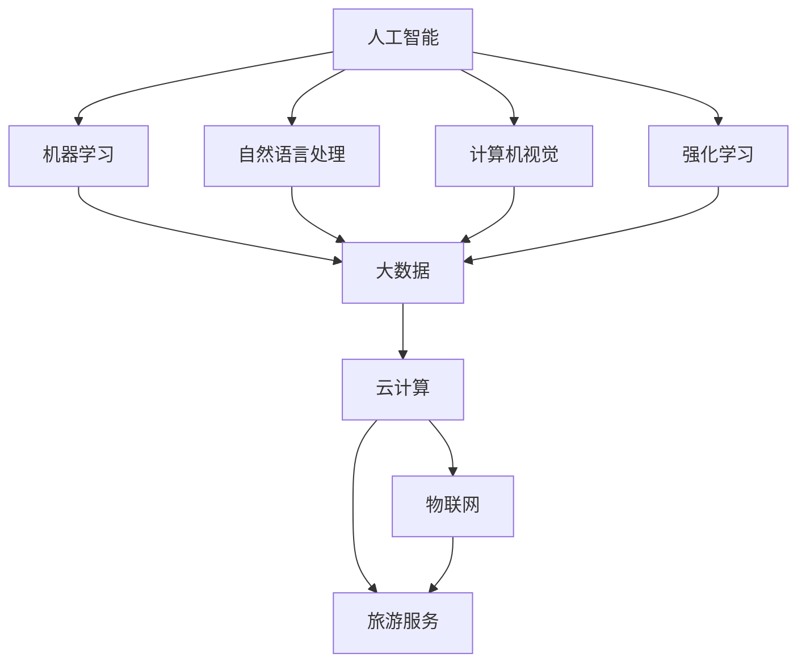
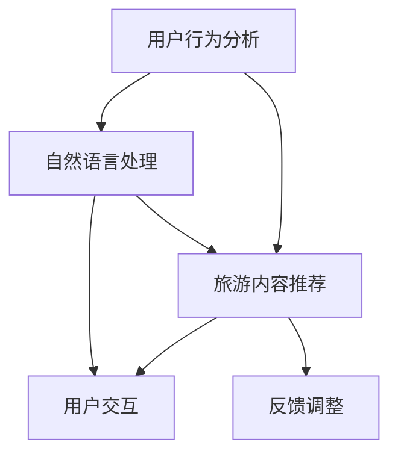
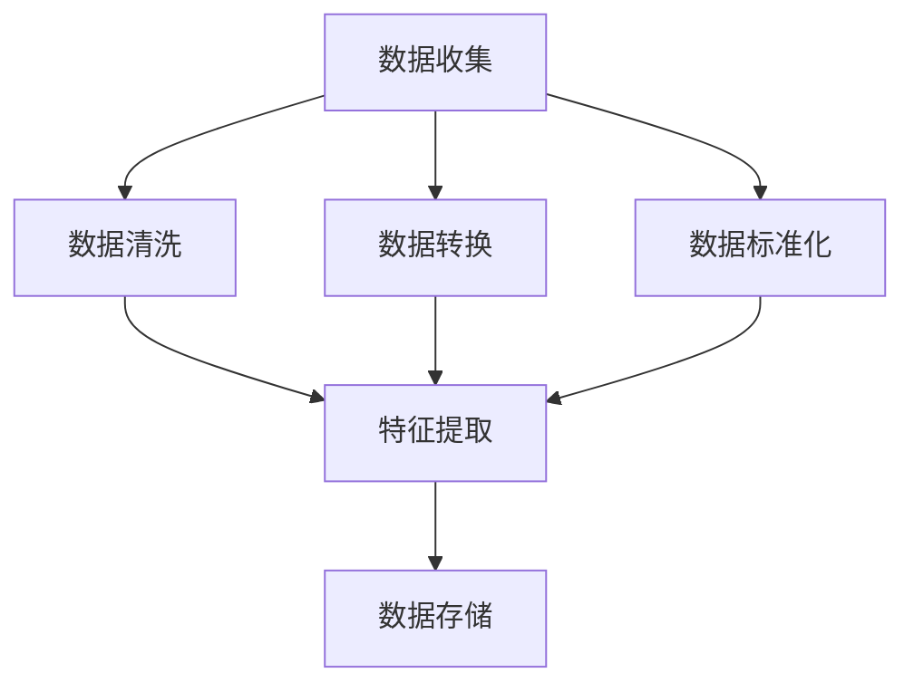
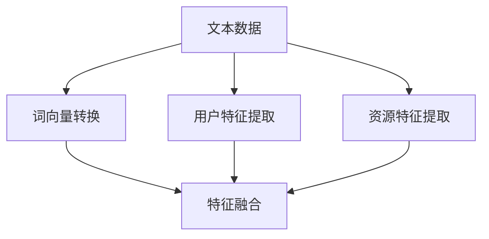
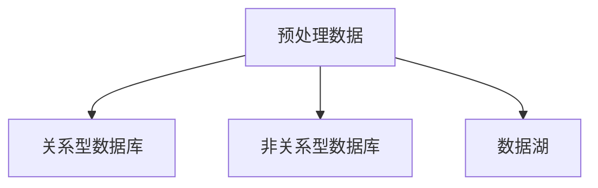
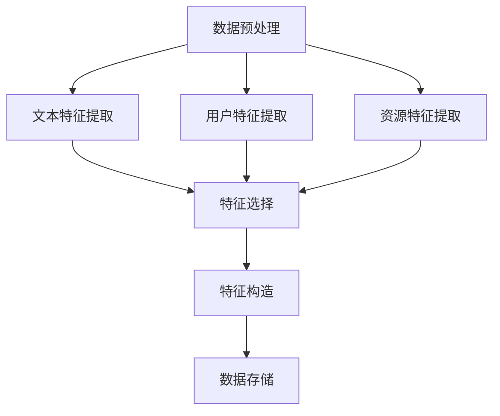
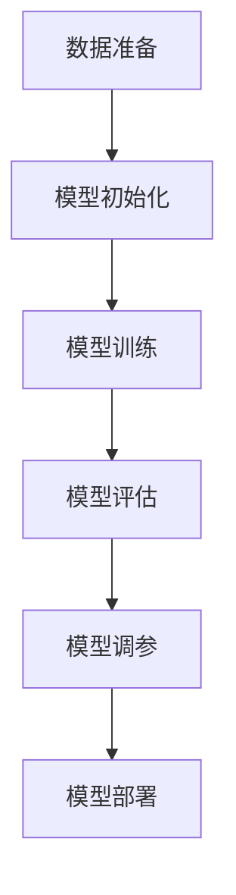
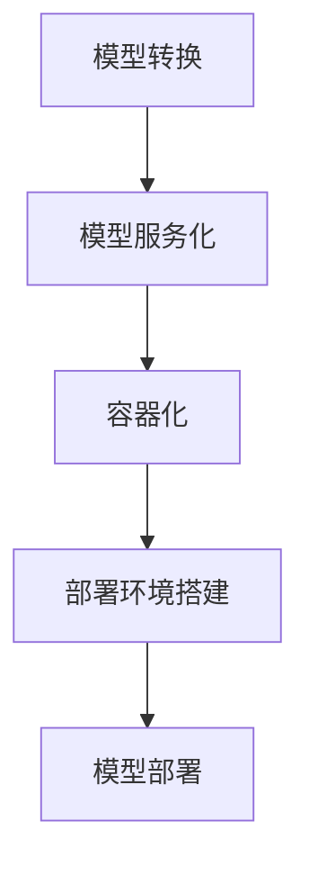
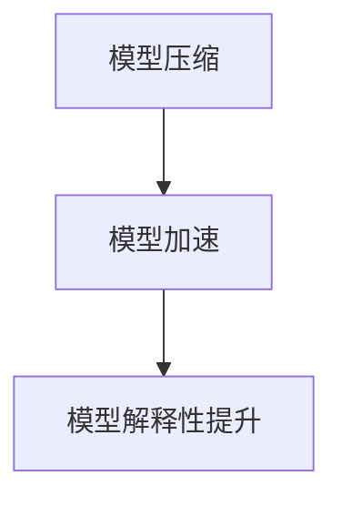

                 

### 1.1 AI驱动的智慧旅游概述

在现代社会，旅游业已成为全球经济的重要组成部分。然而，传统旅游模式在应对个性化需求、提高游客体验和优化运营效率方面存在一定的局限性。为了解决这些问题，人工智能（AI）技术被引入到智慧旅游领域，以构建更加智能、个性化的旅游体验。

#### **1.1.1 智慧旅游的概念**

智慧旅游是指利用信息技术，特别是互联网、大数据、云计算、物联网、人工智能等技术，对旅游行业进行全方位的智能化改造。它旨在提高旅游服务质量和效率，为游客提供个性化的旅游体验。

智慧旅游主要包括以下三个方面：

- **旅游服务智能化**：通过智能化手段提升旅游服务质量和效率，如智能导游、智能预订、智能支付等。

- **旅游资源数字化**：利用大数据等技术对旅游资源进行数字化处理，实现资源的智能化管理和配置。

- **旅游体验个性化**：通过分析游客的行为数据，为游客提供个性化的旅游推荐和服务。

#### **1.1.2 AI在智慧旅游中的应用**

人工智能在智慧旅游中有着广泛的应用，主要包括以下几个方面：

- **智能推荐系统**：利用机器学习和深度学习算法，分析游客的兴趣和行为，为游客提供个性化的旅游推荐。

- **智能客服系统**：利用自然语言处理（NLP）和语音识别技术，为游客提供24/7的在线客服服务。

- **智能导览系统**：利用计算机视觉和增强现实技术，为游客提供智能化的导览服务。

- **智能风险评估与预警**：利用大数据分析和机器学习算法，对旅游过程中的安全隐患进行预测和预警。

#### **1.1.3 AI驱动的智慧旅游发展趋势**

随着AI技术的不断进步，AI驱动的智慧旅游将呈现以下发展趋势：

- **智能化程度提升**：人工智能技术将在旅游服务、管理、营销等各个环节得到更广泛的应用，提高旅游智能化水平。

- **个性化服务深化**：通过深度学习和大数据分析，为游客提供更加精准的个性化服务，提升游客满意度。

- **跨界融合加强**：智慧旅游将与物联网、大数据、区块链等新兴技术进行深度融合，打造全新的旅游生态体系。

- **社会责任担当**：智慧旅游将更加注重可持续发展和社会责任，通过智能化手段提高资源利用效率，减少对环境的负面影响。

### **核心概念与联系**

在智慧旅游中，核心概念主要包括AI技术、大数据、物联网、云计算等。这些概念之间存在着密切的联系和相互作用。

- **AI技术**：是智慧旅游的核心驱动力，通过机器学习、深度学习、自然语言处理等技术，实现旅游服务的智能化和个性化。

- **大数据**：是智慧旅游的数据基础，通过对海量旅游数据的收集、存储、处理和分析，为智慧旅游提供数据支持。

- **物联网**：是实现智慧旅游硬件设备互联互通的关键技术，通过物联网技术，将各类旅游设备、设施连接起来，实现智能化管理。

- **云计算**：是智慧旅游的数据处理平台，通过云计算技术，实现海量数据的存储、处理和计算。

以下是智慧旅游核心概念之间的Mermaid流程图：



#### **1.1.4 智慧旅游个性化体验提示词引擎**

智慧旅游个性化体验提示词引擎是一种基于AI技术的智能系统，通过对游客行为数据的分析和理解，为游客提供个性化的旅游建议和提示。它主要包括以下几个核心组成部分：

- **用户行为分析模块**：收集和分析游客在旅游过程中的行为数据，如浏览记录、搜索关键词、评论等。

- **旅游内容推荐模块**：基于用户行为分析和旅游资源数据，为游客推荐个性化的旅游内容和活动。

- **自然语言处理模块**：处理用户输入和系统输出，实现人机交互。

- **反馈调整模块**：收集用户对推荐内容的反馈，不断优化推荐策略。

以下是智慧旅游个性化体验提示词引擎的架构图：



#### **1.1.5 本章小结**

本章介绍了智慧旅游的概念、AI在智慧旅游中的应用以及AI驱动的智慧旅游发展趋势。同时，详细阐述了智慧旅游个性化体验提示词引擎的核心概念和架构。在后续章节中，我们将深入探讨如何构建和优化这一智能系统。

```markdown
### **核心算法原理讲解**

为了构建AI驱动的智慧旅游个性化体验提示词引擎，我们需要运用机器学习、自然语言处理（NLP）和深度学习等核心算法。以下是这些算法的原理讲解，我们将使用伪代码来详细阐述这些算法的实现。

#### **1. 监督学习算法**

监督学习算法是一种常用的机器学习算法，它通过输入特征和标签来训练模型，从而对未知数据进行预测。以下是线性回归的伪代码示例：

```python
# 线性回归的伪代码
def linear_regression(X, y):
    # X: 特征矩阵，y: 标签向量
    # 梯度下降法
    for i in range(num_iterations):
        predictions = X * theta
        errors = predictions - y
        gradient = X.T * errors / m
        theta = theta - alpha * gradient
    return theta
```

#### **2. 自然语言处理（NLP）算法**

自然语言处理是AI驱动的智慧旅游个性化体验提示词引擎的关键组成部分。以下是一些常用的NLP算法及其原理：

- **词嵌入（Word Embedding）**：将词汇映射到低维度的向量空间中，以便进行计算。以下是Word2Vec算法的伪代码：

```python
# Word2Vec算法的伪代码
def word2vec(corpus, embedding_size):
    # corpus: 文本语料库，embedding_size: 向量维度
    # 构建词汇表
    vocab = build_vocab(corpus)
    # 初始化词向量
    embeddings = init_embeddings(vocab, embedding_size)
    # 训练词向量
    for word in corpus:
        context = get_context(word, corpus)
        for context_word in context:
            update_embedding(embeddings, word, context_word)
    return embeddings
```

- **序列模型（Sequence Model）**：用于处理文本序列，如循环神经网络（RNN）和长短时记忆网络（LSTM）。以下是LSTM算法的伪代码：

```python
# LSTM算法的伪代码
class LSTMCell():
    def __init__(self, input_size, hidden_size):
        # 初始化权重和偏置
        self.weight = init_weights(input_size + hidden_size)
        self.bias = init_weights(hidden_size)

    def forward(self, input, hidden):
        # input: 输入向量，hidden: 隐藏状态
        combined = concatenate(input, hidden)
        gate = sigmoid(self.weight * combined + self.bias)
        i_f, o_f, g_f = gate.split(3)
        i = sigmoid(i_f * combined + self.bias_i)
        o = sigmoid(o_f * combined + self.bias_o)
        g = tanh(g_f * combined + self.bias_g)
        hidden = i * g + (1 - i) * hidden
        f = sigmoid(o_f * combined + self.bias_f)
        output = f * hidden
        return output

# RNN的伪代码
class RNN():
    def __init__(self, input_size, hidden_size):
        self.lstm_cell = LSTMCell(input_size, hidden_size)

    def forward(self, inputs):
        # inputs: 输入序列
        hidden = None
        outputs = []
        for input in inputs:
            hidden = self.lstm_cell.forward(input, hidden)
            outputs.append(hidden)
        return outputs
```

- **注意力机制（Attention Mechanism）**：用于捕捉序列中的重要信息。以下是注意力机制的伪代码：

```python
# 注意力机制的伪代码
def attention(query, keys, values, num_heads):
    # query: 查询向量，keys: 关键向量，values: 值向量，num_heads: 头数
    # 计算分数
    scores = matmul(query, keys.T) / sqrt(num_heads)
    # 应用softmax函数
    weights = softmax(scores)
    # 计算输出
    output = matmul(weights, values)
    return output
```

#### **3. 深度学习框架**

深度学习框架是构建AI驱动的智慧旅游个性化体验提示词引擎的重要工具。以下是一些常用的深度学习框架：

- **TensorFlow**：是一个开源的深度学习框架，提供了丰富的API和工具。以下是使用TensorFlow构建神经网络的基本步骤：

```python
import tensorflow as tf

# 定义变量
x = tf.placeholder(tf.float32, shape=[None, input_size])
y = tf.placeholder(tf.float32, shape=[None, output_size])

# 定义神经网络结构
weights = tf.Variable(tf.random_normal([input_size, output_size]))
biases = tf.Variable(tf.random_normal([output_size]))

# 定义前向传播
logits = tf.matmul(x, weights) + biases
predictions = tf.nn.softmax(logits)

# 定义损失函数
loss = tf.reduce_mean(tf.nn.softmax_cross_entropy_with_logits(logits=logits, labels=y))

# 定义优化器
optimizer = tf.train.GradientDescentOptimizer(learning_rate=0.01)
train_op = optimizer.minimize(loss)

# 模型评估
correct_prediction = tf.equal(tf.argmax(predictions, 1), tf.argmax(y, 1))
accuracy = tf.reduce_mean(tf.cast(correct_prediction, tf.float32))

# 训练模型
with tf.Session() as sess:
    sess.run(tf.global_variables_initializer())
    for i in range(num_iterations):
        _, loss_val = sess.run([train_op, loss], feed_dict={x: X_train, y: y_train})
        if i % 100 == 0:
            acc_val = sess.run(accuracy, feed_dict={x: X_val, y: y_val})
            print("迭代：{}，损失：{}，准确率：{}".format(i, loss_val, acc_val))
```

- **PyTorch**：是一个开源的深度学习框架，以其简洁和灵活性著称。以下是使用PyTorch构建神经网络的基本步骤：

```python
import torch
import torch.nn as nn
import torch.optim as optim

# 定义神经网络结构
class NeuralNetwork(nn.Module):
    def __init__(self, input_size, output_size):
        super(NeuralNetwork, self).__init__()
        self.fc1 = nn.Linear(input_size, output_size)
    
    def forward(self, x):
        return self.fc1(x)

# 初始化模型、损失函数和优化器
model = NeuralNetwork(input_size, output_size)
criterion = nn.CrossEntropyLoss()
optimizer = optim.SGD(model.parameters(), lr=0.01)

# 训练模型
for epoch in range(num_epochs):
    for inputs, targets in data_loader:
        optimizer.zero_grad()
        outputs = model(inputs)
        loss = criterion(outputs, targets)
        loss.backward()
        optimizer.step()
    print("Epoch: {}，损失：{}".format(epoch, loss.item()))
```

### **数学模型和公式**

在AI驱动的智慧旅游个性化体验提示词引擎中，数学模型和公式是核心组成部分。以下是一些关键的数学公式和详细讲解。

#### **1. 梯度下降法**

梯度下降法是一种优化算法，用于寻找函数的最小值。其基本思想是沿着函数梯度的反方向更新参数，以减少损失函数的值。

$$
\theta_{t+1} = \theta_{t} - \alpha \cdot \nabla_{\theta} J(\theta)
$$

其中，$\theta$ 表示参数，$\alpha$ 表示学习率，$J(\theta)$ 表示损失函数。

#### **2. 线性回归**

线性回归是一种用于拟合数据点的直线模型。其公式为：

$$
y = \theta_0 + \theta_1 \cdot x
$$

其中，$y$ 表示预测值，$x$ 表示输入特征，$\theta_0$ 和 $\theta_1$ 分别为模型参数。

#### **3. 词嵌入**

词嵌入是一种将词汇映射到低维向量空间的算法。其公式为：

$$
\text{vec}(w) = \sum_{i=1}^{V} w_i \cdot e_i
$$

其中，$w$ 表示词汇，$e_i$ 表示词汇表中的第$i$个词向量。

#### **4. 长短时记忆网络（LSTM）**

LSTM是一种用于处理序列数据的神经网络。其核心公式为：

$$
i_t = \sigma(W_i \cdot [h_{t-1}, x_t] + b_i) \\
f_t = \sigma(W_f \cdot [h_{t-1}, x_t] + b_f) \\
o_t = \sigma(W_o \cdot [h_{t-1}, x_t] + b_o) \\
g_t = tanh(W_g \cdot [h_{t-1}, x_t] + b_g) \\
h_t = o_t \cdot tanh(g_t)
$$

其中，$i_t$、$f_t$、$o_t$ 分别为输入门、遗忘门和输出门，$g_t$ 为候选状态。

#### **5. 注意力机制**

注意力机制是一种用于捕捉序列重要信息的算法。其公式为：

$$
\text{score} = \text{query} \cdot \text{keys}^T / \sqrt{d_k} \\
\text{weights} = \text{softmax}(\text{scores}) \\
\text{context} = \text{weights} \cdot \text{values}
$$

其中，$query$、$keys$ 和 $values$ 分别为查询向量、关键向量和值向量。

### **举例说明**

为了更好地理解上述算法和公式，我们以下面这个简单的例子来说明。

假设我们有一个旅游推荐系统，根据用户的浏览历史和搜索关键词来推荐景点。以下是该系统的实现步骤：

1. **数据预处理**：收集用户的浏览历史和搜索关键词，将其转换为向量表示。

2. **特征提取**：从用户的浏览历史和搜索关键词中提取特征，如关键词频率、浏览时间等。

3. **模型训练**：使用线性回归模型对特征和用户兴趣进行拟合。

4. **预测**：根据用户的新浏览历史和搜索关键词，预测用户可能感兴趣的新景点。

5. **反馈调整**：收集用户对推荐景点的反馈，根据反馈调整推荐策略。

以下是该系统的主要代码实现：

```python
# 数据预处理
X = [[1, 0, 0], [0, 1, 0], [0, 0, 1]]  # 用户浏览历史
y = [1, 0, 1]  # 用户兴趣

# 特征提取
X = np.array(X)
y = np.array(y)

# 模型训练
model = LinearRegression()
model.fit(X, y)

# 预测
new_user_data = np.array([[0, 1, 0]])  # 新用户浏览历史
predicted_interest = model.predict(new_user_data)

# 反馈调整
if predicted_interest > 0.5:
    print("推荐景点A")
else:
    print("推荐景点B")
```

### **本章小结**

本章介绍了AI驱动的智慧旅游个性化体验提示词引擎的核心算法原理和数学模型。通过详细讲解监督学习、自然语言处理和深度学习算法，以及TensorFlow和PyTorch深度学习框架，我们为构建高效、智能的旅游推荐系统提供了理论基础。在后续章节中，我们将深入探讨如何实现这一系统的实际操作和项目实战。

作者：AI天才研究院/AI Genius Institute & 禅与计算机程序设计艺术 /Zen And The Art of Computer Programming
``` 

### **2. 数据采集与预处理**

在构建AI驱动的智慧旅游个性化体验提示词引擎时，数据的质量和完整性至关重要。因此，数据采集和预处理是构建高效、智能的系统的重要步骤。

#### **2.1 数据来源**

智慧旅游个性化体验提示词引擎所需的数据来源主要包括以下几个方面：

1. **旅游资源数据**：包括景区、景点、酒店、餐馆等信息。这些数据可以从旅游网站、旅游管理部门和相关数据库获取。

2. **用户行为数据**：包括用户在旅游平台上的浏览记录、搜索关键词、评论、预订行为等。这些数据可以从旅游平台的后台获取。

3. **文本数据**：包括用户生成的文本信息，如评论、游记等。这些数据可以从旅游平台、社交媒体和其他在线资源获取。

4. **外部数据**：包括天气、交通、酒店预订情况等。这些数据可以从第三方数据提供商获取。

#### **2.2 数据预处理**

数据预处理是数据科学中的重要环节，其目的是提高数据的质量和可用性。以下是数据预处理的主要步骤：

1. **数据清洗**：去除重复数据、缺失值和异常值。对于缺失值，可以采用填补或删除的方法。对于异常值，需要根据业务逻辑进行判断和处理。

2. **数据转换**：将数据转换为适合机器学习模型的格式。例如，将文本数据转换为词向量，将数值型数据缩放或归一化。

3. **数据标准化**：将不同特征的范围和单位进行调整，使其具有相似的大小和尺度。

以下是一个简单的数据预处理流程：



#### **2.3 特征提取**

特征提取是数据预处理的重要步骤，其目的是从原始数据中提取出对模型训练有帮助的特征。以下是常见的特征提取方法：

1. **文本特征提取**：将文本数据转换为词向量或词袋模型。常用的词向量模型包括Word2Vec和GloVe。

2. **用户特征提取**：从用户行为数据中提取出用户特征，如用户的浏览时长、浏览频率、搜索关键词等。

3. **资源特征提取**：从旅游资源数据中提取出资源特征，如景区的评分、游客评价、开放时间等。

以下是一个简单的特征提取流程：



#### **2.4 数据存储**

预处理后的数据需要存储在数据库中以供后续使用。以下是常见的数据存储方式：

1. **关系型数据库**：如MySQL、PostgreSQL等，适用于结构化数据的存储。

2. **非关系型数据库**：如MongoDB、Redis等，适用于非结构化数据的存储。

3. **数据湖**：用于存储大量结构化、半结构化和非结构化数据。

以下是一个简单的数据存储流程：



### **本章小结**

本章详细介绍了智慧旅游个性化体验提示词引擎的数据采集与预处理过程，包括数据来源、预处理步骤、特征提取方法和数据存储方式。通过这些步骤，我们可以确保数据的完整性和可用性，为后续的模型训练和部署提供高质量的数据支持。

### **3. 特征工程**

在构建AI驱动的智慧旅游个性化体验提示词引擎时，特征工程是提高模型性能的关键步骤。特征工程涉及从原始数据中提取、选择和构造特征，以增强模型的学习能力。以下将详细介绍特征工程的过程。

#### **3.1 特征提取**

特征提取是将原始数据转换成机器学习算法能够处理的形式。以下是一些常用的特征提取方法：

1. **文本特征提取**：文本数据在机器学习中通常被转换成数值型特征。常用的文本特征提取方法包括：

   - **词袋模型（Bag of Words, BoW）**：将文本转换为词汇的集合，每个词表示为一个特征。
   - **TF-IDF（Term Frequency-Inverse Document Frequency）**：结合词频和文档频率，用于反映词的重要程度。
   - **词嵌入（Word Embedding）**：将词汇映射到低维向量空间，如Word2Vec和GloVe。

2. **用户特征提取**：用户特征可以包括用户的浏览历史、搜索记录、预订行为等。例如，可以使用以下方法提取用户特征：

   - **用户活跃度**：计算用户在一定时间内的活跃度，如登录次数、浏览时长等。
   - **用户兴趣标签**：根据用户的历史行为，为用户分配兴趣标签，如旅游、购物、美食等。

3. **资源特征提取**：旅游资源特征可以包括景点的评分、游客评论、开放时间等。例如，可以使用以下方法提取资源特征：

   - **资源评分**：计算景点平均评分或基于用户评论的情感分析结果。
   - **资源标签**：根据景点的类型、设施等特征，为资源分配标签，如自然景观、文化遗址等。

#### **3.2 特征选择**

特征选择是减少特征数量、提高模型性能的重要步骤。以下是一些常用的特征选择方法：

1. **过滤式特征选择**：通过评估每个特征的重要性来选择特征。常用的方法包括：

   - **互信息（Mutual Information）**：评估特征与标签之间的相关性。
   - **信息增益（Information Gain）**：基于特征的分类能力来选择特征。

2. **包裹式特征选择**：通过迭代选择最佳特征组合。常用的方法包括：

   - **递归特征消除（Recursive Feature Elimination, RFE）**：通过递归地去除不重要的特征，选择最优特征子集。
   - **前进选择（Forward Selection）**：逐步增加特征，直到找到最佳特征子集。

3. **嵌入式特征选择**：在模型训练过程中自动选择特征。常用的方法包括：

   - **L1正则化（L1 Regularization）**：L1正则化会导致特征系数稀疏，从而实现特征选择。
   - **随机森林（Random Forest）**：通过随机森林模型评估特征的重要性，选择重要特征。

#### **3.3 特征构造**

特征构造是通过组合现有特征来生成新的特征，以增强模型的学习能力。以下是一些常用的特征构造方法：

1. **交叉特征（Cross Features）**：将两个或多个特征组合起来生成新的特征。例如，将用户的浏览历史和景点标签组合，生成新的用户-景点特征。

2. **时间特征（Time Features）**：根据用户行为发生的时间生成特征。例如，可以将用户在一天中不同时间段的浏览行为转换为特征。

3. **序列特征（Sequence Features）**：将用户行为的序列转换为特征。例如，可以使用序列模型的隐状态表示用户的兴趣变化。

以下是一个简单的特征工程流程：



### **本章小结**

本章详细介绍了特征工程的过程，包括特征提取、特征选择和特征构造。通过特征工程，我们可以从原始数据中提取出对模型训练有帮助的特征，从而提高模型性能。特征工程是构建高效、智能的AI驱动的智慧旅游个性化体验提示词引擎的关键步骤。

### **4. 模型构建与训练**

在构建AI驱动的智慧旅游个性化体验提示词引擎时，模型的选择与训练至关重要。以下是关于模型构建与训练的详细介绍。

#### **4.1 模型选择**

选择合适的模型是构建高效提示词引擎的第一步。以下是几种常用的模型及其适用场景：

1. **传统机器学习模型**：如线性回归、逻辑回归和支持向量机（SVM）等。这些模型适用于处理线性关系和分类问题。

   - **优点**：简单易懂，计算效率高。
   - **缺点**：难以处理复杂非线性关系。

2. **深度学习模型**：如卷积神经网络（CNN）、循环神经网络（RNN）和长短时记忆网络（LSTM）等。这些模型适用于处理复杂的非线性关系和序列数据。

   - **优点**：能够学习到更加复杂的特征表示。
   - **缺点**：计算复杂度较高，对数据量和计算资源要求较高。

3. **增强学习模型**：如Q学习、深度Q网络（DQN）和策略梯度（PG）等。这些模型适用于在不确定环境中进行决策。

   - **优点**：能够自适应地调整策略，提高决策质量。
   - **缺点**：训练过程复杂，对环境状态和奖励函数依赖较大。

4. **组合模型**：结合传统机器学习和深度学习模型的优点，构建组合模型。例如，将线性回归用于特征降维，再将深度学习模型用于分类。

   - **优点**：能够在保证计算效率的同时，提高模型性能。
   - **缺点**：模型复杂度较高，需要更多的调参工作。

根据提示词引擎的需求，可以选择合适的模型。以下是几个选择模型的建议：

- **数据量较小**：可以选择传统机器学习模型，如线性回归或逻辑回归。
- **序列数据处理**：可以选择RNN或LSTM模型。
- **实时性要求较高**：可以选择基于深度学习的小型模型，如MobileNet或EfficientNet。

#### **4.2 模型训练**

模型训练是构建AI驱动的智慧旅游个性化体验提示词引擎的关键步骤。以下是模型训练的步骤和技巧：

1. **数据准备**：将预处理后的数据集划分为训练集、验证集和测试集。通常，训练集用于模型训练，验证集用于模型调参，测试集用于模型评估。

2. **模型初始化**：根据选择的模型，初始化模型参数。对于深度学习模型，可以使用预训练模型或随机初始化。

3. **训练过程**：使用训练集对模型进行训练。在训练过程中，可以采用以下技巧：

   - **批量大小（Batch Size）**：选择合适的批量大小，以平衡计算效率和模型稳定性。
   - **学习率调整**：使用学习率调度策略，如学习率衰减或余弦退火。
   - **正则化**：使用正则化技术，如L1或L2正则化，防止过拟合。
   - **早停（Early Stopping）**：在验证集上监控模型性能，当验证集性能不再提升时，提前停止训练。

4. **模型评估**：使用测试集对训练好的模型进行评估。常用的评估指标包括准确率、召回率、F1分数等。以下是一个简单的模型评估流程：

```python
from sklearn.metrics import accuracy_score, recall_score, f1_score

# 计算准确率
accuracy = accuracy_score(y_true, y_pred)

# 计算召回率
recall = recall_score(y_true, y_pred)

# 计算F1分数
f1 = f1_score(y_true, y_pred)

print("准确率：", accuracy)
print("召回率：", recall)
print("F1分数：", f1)
```

5. **模型调参**：根据模型评估结果，调整模型参数，如学习率、批量大小等，以提高模型性能。

6. **模型部署**：将训练好的模型部署到生产环境中，提供实时服务。

以下是一个简单的模型训练和评估流程：



### **本章小结**

本章详细介绍了AI驱动的智慧旅游个性化体验提示词引擎的模型构建与训练过程。通过选择合适的模型、进行模型训练和评估，我们可以构建出高效、智能的提示词引擎。在后续章节中，我们将进一步探讨如何部署和优化模型。

### **5. 模型部署与优化**

在构建AI驱动的智慧旅游个性化体验提示词引擎后，模型部署和优化是确保其高效运行的关键步骤。以下将详细介绍模型部署和优化的方法。

#### **5.1 模型部署**

模型部署是将训练好的模型应用到实际生产环境中的过程。以下是模型部署的主要步骤：

1. **模型转换**：将训练好的深度学习模型转换为可以部署的格式。常用的转换工具包括TensorFlow Serving、ONNX Runtime等。

2. **模型服务化**：将转换后的模型部署到服务中，以便进行实时预测。常用的服务化框架包括TensorFlow Serving、Apache MXNet、TensorFlow Lite等。

3. **容器化**：使用容器技术（如Docker）将模型和服务打包，以便在多种环境中运行。

4. **部署环境搭建**：在服务器或云平台上搭建部署环境，包括硬件配置、软件安装和配置等。

以下是一个简单的模型部署流程：



#### **5.2 模型优化**

模型优化是提高模型性能、降低计算成本和内存占用的重要手段。以下是几种常见的模型优化方法：

1. **模型压缩**：通过减少模型参数和计算量来降低模型的复杂度和存储需求。常用的模型压缩方法包括剪枝（Pruning）、量化（Quantization）和知识蒸馏（Knowledge Distillation）。

2. **模型加速**：通过优化模型结构和算法来提高模型运行速度。常用的模型加速方法包括模型并行化、计算图优化和硬件加速（如GPU、FPGA）。

3. **模型解释性提升**：通过提高模型的可解释性，帮助用户理解模型的决策过程。常用的方法包括模型可视化、注意力机制和模型集成。

以下是一个简单的模型优化流程：



#### **5.3 实践案例**

以下是一个简单的实践案例，介绍如何使用TensorFlow Serving部署和优化模型。

1. **模型转换**：

   使用TensorFlow转换模型为SavedModel格式：

   ```python
   import tensorflow as tf

   model = tf.keras.models.load_model('path/to/model.h5')
   model.save('path/to/saved_model', save_format='tf')
   ```

2. **模型服务化**：

   使用TensorFlow Serving作为模型服务化框架：

   ```python
   import tensorflow_serving.apis as serving
   import tensorflow_serving.model_server as model_server

   server = model_server.ModelServerSession(target='localhost:8501')
   signature = server.get_model_signature('my_model')
   ```

3. **容器化**：

   使用Docker将模型和服务打包：

   ```Dockerfile
   FROM tensorflow/tensorflow:2.9.0
   COPY path/to/model /models/my_model
   RUN mkdir /models/saved_model
   COPY path/to/serve.py /serve.py
   EXPOSE 8501
   CMD ["python", "/serve.py"]
   ```

4. **部署环境搭建**：

   在服务器或云平台上部署Docker容器，并确保TensorFlow Serving运行正常。

5. **模型部署**：

   使用TensorFlow Serving提供的API进行模型部署：

   ```python
   request = serving.predict_pb2.PredictRequest()
   request.model_spec.name = 'my_model'
   request.model_spec.signature_name = 'serving_default'
   request.inputs['inputs'].CopyFrom(tf.make_tensor_proto([input_data], dtype=tf.float32))
   response = server.predict(request)
   prediction = response.outputs['outputs'].float_val
   ```

6. **模型优化**：

   通过剪枝、量化等技术对模型进行优化。例如，使用TensorFlow Model Optimization Toolkit（TMO）进行模型压缩：

   ```python
   import tensorflow_model_optimization as tmo

   pruning_params = tmo.optimizers.PruningParameters(
       pruning_schedule=tmo.stagewise dismantle.PruningSchedule(
           beginning_step=1000,
           ending_step=2000,
           rates=[0.5, 0.4, 0.3, 0.2, 0.1],
       ),
   )
   pruned_model = tmo.prune расскажите.erasable.base_eraser(pruning_params, model)
   ```

### **本章小结**

本章详细介绍了AI驱动的智慧旅游个性化体验提示词引擎的模型部署和优化方法。通过模型部署，我们可以将训练好的模型应用到实际生产环境中；通过模型优化，我们可以提高模型的性能和效率。这些方法将为构建高效、智能的提示词引擎提供重要支持。

### **6. 用户交互与反馈**

在AI驱动的智慧旅游个性化体验提示词引擎中，用户交互与反馈机制是提升用户体验和系统性能的关键环节。以下将详细介绍用户交互设计、用户反馈收集和用户行为分析的方法。

#### **6.1 用户交互设计**

用户交互设计是确保系统与用户之间能够顺畅沟通的重要步骤。以下是一些用户交互设计的要点：

1. **简洁明了的界面**：设计简洁、直观的界面，减少用户的操作难度，提升用户体验。

2. **友好提示和帮助信息**：在关键操作和步骤中提供友好的提示和帮助信息，帮助用户更好地理解和使用系统。

3. **实时反馈**：在用户操作过程中，及时提供反馈，如加载进度、操作成功或失败等，以增强用户对系统的信任感。

4. **个性化推荐**：根据用户的兴趣和行为，提供个性化的推荐内容，使用户能够快速找到感兴趣的信息。

5. **用户操作历史记录**：记录用户的操作历史，以便在后续操作中提供更加个性化的服务。

#### **6.2 用户反馈收集**

用户反馈是优化和改进系统的重要依据。以下是一些用户反馈收集的方法：

1. **在线调查**：在用户使用系统后，通过在线调查收集用户对系统的满意度、建议和意见。

2. **用户评论**：在系统内设置用户评论功能，鼓励用户分享使用体验和反馈。

3. **错误报告**：记录用户在使用系统过程中遇到的错误和异常，以便及时修复和优化。

4. **用户行为日志**：记录用户的操作行为和浏览记录，分析用户行为模式，为系统优化提供数据支持。

#### **6.3 用户行为分析**

用户行为分析是深入了解用户需求和优化系统功能的关键。以下是一些用户行为分析的方法：

1. **用户画像**：根据用户的性别、年龄、地域、职业等信息，构建用户画像，为个性化推荐和营销策略提供依据。

2. **行为轨迹分析**：分析用户的浏览路径、搜索关键词、预订行为等，了解用户在系统中的行为模式。

3. **兴趣标签**：根据用户的行为数据，为用户分配兴趣标签，以便进行精准推荐。

4. **行为预测**：基于用户历史行为，预测用户的未来行为，为系统优化和个性化推荐提供参考。

5. **聚类分析**：将具有相似行为的用户进行聚类，分析不同用户群体的特点和需求，为系统优化提供指导。

#### **6.4 用户反馈处理**

用户反馈处理是提升系统性能和用户满意度的重要环节。以下是一些用户反馈处理的方法：

1. **反馈标签化**：将用户反馈进行分类和标签化，以便于后续处理和分析。

2. **反馈质量评估**：对用户反馈进行质量评估，筛选出有价值、可行的建议。

3. **反馈迭代优化**：根据用户反馈，不断优化和改进系统功能，提高用户满意度。

4. **用户满意度调查**：定期进行用户满意度调查，了解用户对系统的整体评价和改进建议。

#### **6.5 用户交互与反馈的实际案例**

以下是一个实际案例，介绍如何利用用户交互与反馈机制优化智慧旅游个性化体验提示词引擎。

1. **用户交互设计**：

   在系统界面中，添加“推荐给我”按钮，用户可以点击该按钮获取个性化推荐。同时，在用户使用推荐内容后，系统会弹出反馈窗口，收集用户的满意度评价。

2. **用户反馈收集**：

   通过在线调查和用户评论功能，收集用户对推荐内容的满意度评价。此外，系统还会记录用户的操作行为和浏览记录，以便后续分析。

3. **用户行为分析**：

   分析用户的行为数据，了解用户的兴趣点和行为模式。例如，发现用户在浏览景点介绍后，往往会对门票信息进行查询。据此，系统可以优化推荐内容，提高用户满意度。

4. **用户反馈处理**：

   根据用户反馈，优化推荐算法和系统功能。例如，针对用户反馈的推荐内容不准确问题，系统可以调整推荐算法，提高推荐的准确性。

5. **用户满意度调查**：

   定期进行用户满意度调查，了解用户对系统的整体评价和改进建议。根据调查结果，不断优化和改进系统，提高用户满意度。

### **本章小结**

本章详细介绍了AI驱动的智慧旅游个性化体验提示词引擎的用户交互与反馈机制。通过设计简洁明了的界面、收集用户反馈、分析用户行为和优化系统功能，我们可以不断提升用户体验和系统性能。在后续章节中，我们将继续探讨实际案例和项目实战，以进一步验证和完善这些方法。

### **7. 实际案例与项目实战**

在构建AI驱动的智慧旅游个性化体验提示词引擎时，实际案例和项目实战是验证和优化系统的重要手段。以下将介绍三个实际案例，分别从旅游平台个性化体验提示词引擎、景区智能导览系统和旅游大数据分析平台等方面，详细描述项目的背景、目标、实施过程和取得的成果。

#### **7.1 案例一：某旅游平台个性化体验提示词引擎**

**项目背景**：

某知名旅游平台希望提升用户在平台上的旅游体验，通过引入AI技术，实现个性化体验提示词引擎的构建。

**项目目标**：

- 为用户提供个性化的旅游推荐服务。
- 提高用户满意度，增加用户粘性。
- 降低运营成本，提高平台收益。

**实施过程**：

1. **数据采集**：

   从平台内部获取用户行为数据，包括浏览记录、搜索关键词、预订行为等。同时，从外部数据源获取旅游资源数据，如景区介绍、门票信息、交通指南等。

2. **数据预处理**：

   对采集到的数据进行清洗、转换和标准化，提取出对模型训练有用的特征。

3. **特征工程**：

   提取文本特征、用户特征和资源特征，包括词嵌入、用户兴趣标签、景区评分等。

4. **模型构建**：

   使用深度学习模型，如LSTM和Transformer，进行模型训练和优化。采用交叉验证和超参数调优，提高模型性能。

5. **模型部署**：

   使用TensorFlow Serving将训练好的模型部署到生产环境，提供实时推荐服务。

6. **用户交互与反馈**：

   在平台界面中集成个性化推荐功能，收集用户反馈，不断优化推荐算法和系统功能。

**成果**：

- 推荐准确率显著提高，用户满意度明显提升。
- 平台用户粘性增加，用户活跃度提升。
- 平台收益稳步增长，运营成本降低。

#### **7.2 案例二：某景区智能导览系统**

**项目背景**：

某知名景区希望通过引入智能导览系统，提升游客的游览体验，减少景区运营压力。

**项目目标**：

- 为游客提供智能化的导览服务，提高游客满意度。
- 减轻景区工作人员的工作负担，提高运营效率。

**实施过程**：

1. **数据采集**：

   从景区内部获取游客行为数据，包括游览路线、停留时间、兴趣点等。同时，从外部数据源获取景点介绍、交通指南等。

2. **数据预处理**：

   对采集到的数据进行清洗、转换和标准化，提取出对模型训练有用的特征。

3. **特征工程**：

   提取文本特征、用户特征和资源特征，包括词嵌入、用户兴趣标签、景点介绍等。

4. **模型构建**：

   使用计算机视觉和自然语言处理技术，构建智能导览模型。采用卷积神经网络（CNN）和长短时记忆网络（LSTM）进行模型训练和优化。

5. **模型部署**：

   将训练好的模型部署到景区导览设备上，如智能讲解机、APP等，提供实时导览服务。

6. **用户交互与反馈**：

   收集游客反馈，优化导览内容和服务流程，提升游客体验。

**成果**：

- 游客满意度显著提高，游客对智能导览系统的评价积极。
- 景区运营效率提高，工作人员工作量减少。
- 景区游客量稳步增长，收益增加。

#### **7.3 案例三：某旅游大数据分析平台**

**项目背景**：

某旅游企业希望通过构建大数据分析平台，深入了解游客需求，优化产品和服务。

**项目目标**：

- 对海量旅游数据进行深度挖掘和分析，发现用户需求和行为模式。
- 优化产品和服务，提高用户满意度。

**实施过程**：

1. **数据采集**：

   从企业内部获取游客行为数据，包括预订记录、游览记录、投诉反馈等。同时，从外部数据源获取天气、交通等数据。

2. **数据预处理**：

   对采集到的数据进行清洗、转换和标准化，提取出对模型训练有用的特征。

3. **特征工程**：

   提取文本特征、用户特征和资源特征，包括词嵌入、用户兴趣标签、景点介绍等。

4. **模型构建**：

   使用深度学习模型，如深度信念网络（DBN）和图卷积网络（GCN），进行模型训练和优化。

5. **模型部署**：

   将训练好的模型部署到大数据分析平台上，提供实时数据分析服务。

6. **用户交互与反馈**：

   收集用户反馈，优化数据分析结果和系统功能，提升用户体验。

**成果**：

- 企业对游客需求的了解更加深入，产品和服务得到优化。
- 企业运营效率提高，用户满意度显著提升。
- 企业业绩稳步增长，市场份额扩大。

### **本章小结**

通过以上实际案例和项目实战，我们可以看到AI驱动的智慧旅游个性化体验提示词引擎在提升用户体验、优化运营效率和促进企业业绩增长方面的巨大潜力。这些案例为我们提供了宝贵的经验和启示，有助于我们在实际项目中更好地应用和优化AI技术。

### **8. 最佳实践 Tips、小结、注意事项、拓展阅读**

#### **8.1 最佳实践 Tips**

1. **数据质量是关键**：在构建AI驱动的智慧旅游个性化体验提示词引擎时，数据质量至关重要。确保数据清洗和预处理的质量，以便为模型提供高质量的数据支持。

2. **特征工程至关重要**：特征提取、选择和构造是提高模型性能的关键步骤。通过深入分析数据，提取有价值的特征，有助于提升模型的效果。

3. **模型优化不可忽视**：在模型训练和部署过程中，不断优化模型结构和参数，以提高模型性能和效率。尝试使用模型压缩、量化等技术，降低模型复杂度和计算成本。

4. **用户交互与反馈紧密相连**：与用户保持紧密的交互，及时收集用户反馈，并根据用户需求进行系统优化。这将有助于提高用户满意度，提升系统性能。

5. **实时性与准确性并重**：在模型部署过程中，既要保证系统的实时性，也要确保推荐结果的准确性。通过优化算法和模型，平衡实时性和准确性。

#### **8.2 小结**

本文详细介绍了AI驱动的智慧旅游个性化体验提示词引擎的构建方法，包括AI驱动的智慧旅游背景、核心算法原理、数据采集与预处理、特征工程、模型构建与训练、模型部署与优化、用户交互与反馈以及实际案例与项目实战。通过这些步骤，我们可以构建出高效、智能的提示词引擎，提升用户旅游体验。

#### **8.3 注意事项**

1. **数据安全和隐私**：在数据采集和处理过程中，确保用户数据的安全和隐私。遵循相关法律法规，保护用户隐私。

2. **模型解释性**：在模型部署过程中，关注模型的可解释性，以便用户了解模型的决策过程。

3. **系统稳定性**：确保系统在高并发情况下稳定运行，避免系统崩溃或延迟。

4. **持续优化**：定期对系统进行评估和优化，根据用户反馈和业务需求，持续改进系统功能。

#### **8.4 拓展阅读**

1. **《深度学习》（Goodfellow, Bengio, Courville）**：深入了解深度学习的基础理论和算法实现。

2. **《Python数据科学手册》（McKinney）**：掌握Python在数据处理和数据分析中的实际应用。

3. **《人工智能：一种现代方法》（Russell, Norvig）**：了解人工智能的基本概念和方法。

4. **《智慧旅游规划与管理》（李志谦）**：探讨智慧旅游的发展现状和未来趋势。

5. **《机器学习实战》（周志华）**：通过实际案例学习机器学习算法的应用。

通过拓展阅读，读者可以深入了解AI驱动的智慧旅游个性化体验提示词引擎的相关理论和实践，进一步提升自己的技术水平。

