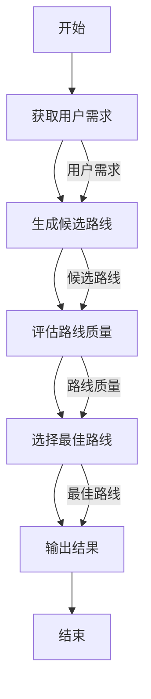
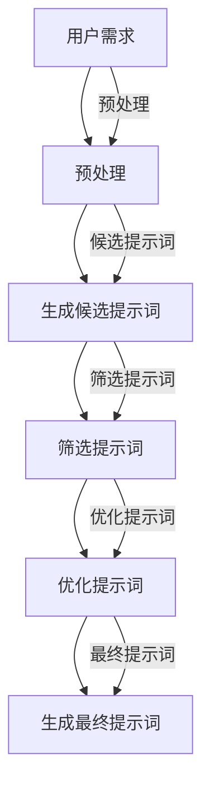
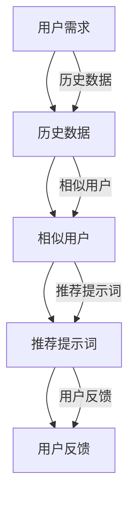

                 

## 文章标题：构建AI驱动的智慧旅游路线规划提示词引擎

### 关键词：AI、智慧旅游、路线规划、提示词引擎、机器学习、算法

#### 摘要：
本文将深入探讨如何利用人工智能技术构建一个高效的智慧旅游路线规划提示词引擎。文章首先介绍了AI与智慧旅游的关系，以及AI在旅游路线规划中的应用场景。接着，我们详细解析了AI驱动的智慧旅游路线规划的核心技术，包括机器学习算法和路线规划算法。随后，文章重点阐述了智慧旅游路线规划提示词引擎的设计原则和实现方法。最后，通过实际案例分析和未来展望，本文为智慧旅游路线规划提示词引擎的研究和发展提供了有益的参考。

## 目录大纲

### 第一部分：AI与智慧旅游概述

### 第1章：AI与智慧旅游的关系

- **1.1 AI在智慧旅游中的应用场景**
    - **1.1.1 人工智能与旅游行业的融合**
    - **1.1.2 AI在旅游路线规划中的作用**
    - **1.1.3 智慧旅游的挑战与机遇**

### 第2章：AI驱动的智慧旅游路线规划

- **2.1 AI路线规划的核心技术**
    - **2.1.1 人工智能的基础算法**
    - **2.1.2 路线规划算法的设计**
    - **2.1.3 机器学习在路线规划中的应用**

### 第3章：智慧旅游路线规划提示词引擎设计

- **3.1 提示词引擎的设计原则**
    - **3.1.1 提示词的功能与重要性**
    - **3.1.2 提示词引擎的架构**
    - **3.1.3 用户交互设计**

### 第二部分：AI驱动的智慧旅游路线规划提示词引擎实现

### 第4章：开发环境与工具

- **4.1 开发环境搭建**
    - **4.1.1 操作系统与编程语言的选择**
    - **4.1.2 必需的开发工具与库**

### 第5章：核心算法原理

- **5.1 路线规划算法的伪代码**
    ```mermaid
    graph TD
    A[开始] --> B[获取用户需求]
    B --> C[生成候选路线]
    C --> D[评估路线质量]
    D --> E[选择最佳路线]
    E --> F[输出结果]
    F --> G[结束]
    ```

- **5.2 机器学习算法的应用**
    - **5.2.1 特征工程**
    - **5.2.2 模型选择与训练**
    - **5.2.3 模型评估与优化**

### 第6章：提示词引擎实现

- **6.1 提示词的生成算法**
    - **6.1.1 提示词生成框架**
    - **6.1.2 提示词的个性化推荐**

### 第7章：智慧旅游路线规划提示词引擎测试与优化

- **7.1 测试策略**
    - **7.1.1 功能测试**
    - **7.1.2 性能测试**
    - **7.1.3 用户满意度测试**

### 第8章：案例研究

- **8.1 案例背景与目标**
- **8.2 案例实现过程**
    - **8.2.1 技术选型**
    - **8.2.2 系统设计与实现**
    - **8.2.3 测试与优化**
- **8.3 案例效果分析**

### 第三部分：展望与未来工作

### 第9章：AI驱动的智慧旅游路线规划提示词引擎展望

- **9.1 行业发展趋势**
    - **9.1.1 人工智能技术的进步**
    - **9.1.2 智慧旅游的发展方向**
    - **9.1.3 提示词引擎的未来**

### 第10章：未来工作与研究方向

- **10.1 面临的挑战**
- **10.2 可能的解决方向**
- **10.3 研究与开发计划**

## 附录

### 附录A：参考资料

- **A.1 人工智能与智慧旅游相关书籍**
- **A.2 AI路线规划算法研究论文**
- **A.3 提示词引擎开发工具与库**

---

### 文章标题：构建AI驱动的智慧旅游路线规划提示词引擎

#### 关键词：AI、智慧旅游、路线规划、提示词引擎、机器学习

#### 摘要：
本文旨在探讨如何利用人工智能技术构建一个高效的智慧旅游路线规划提示词引擎。首先，我们将介绍AI与智慧旅游的关系，分析AI在旅游路线规划中的应用场景，探讨智慧旅游面临的挑战与机遇。接着，我们将深入解析AI驱动的智慧旅游路线规划的核心技术，包括基础算法、路线规划算法和机器学习在其中的应用。随后，本文将重点阐述智慧旅游路线规划提示词引擎的设计原则和实现方法。最后，通过实际案例分析和未来展望，本文为智慧旅游路线规划提示词引擎的研究和发展提供了有益的参考。

### 第一部分：AI与智慧旅游概述

#### 第1章：AI与智慧旅游的关系

##### 1.1 AI在智慧旅游中的应用场景

在当今的信息化时代，人工智能（AI）技术在智慧旅游中的应用越来越广泛。AI不仅改变了旅游行业的运营模式，也为游客提供了更加个性化和智能化的体验。以下是AI在智慧旅游中的一些主要应用场景：

- **旅游推荐系统**：利用机器学习和数据挖掘技术，根据游客的喜好和行为习惯，为他们推荐适合的旅游目的地、景点和活动。
- **智能导览**：通过语音识别、自然语言处理和图像识别等技术，为游客提供实时的语音导览和图文介绍。
- **智能问答**：利用问答系统和聊天机器人，为游客提供有关旅游信息、天气、交通等的咨询服务。
- **智能路线规划**：基于用户的需求和偏好，利用路线规划算法和机器学习模型，为游客提供最优的旅游路线。
- **智能酒店管理**：通过智能传感器和物联网技术，实现酒店的智能管理，提高服务质量和效率。

##### 1.1.1 人工智能与旅游行业的融合

人工智能与旅游行业的融合主要体现在以下几个方面：

- **数据驱动的决策**：通过大数据分析和机器学习技术，帮助旅游企业更好地理解市场需求和游客行为，从而做出更明智的决策。
- **个性化服务**：利用人工智能技术，为游客提供个性化的旅游服务，提高游客的满意度和忠诚度。
- **智能化运营**：通过自动化技术和智能设备，提高旅游企业的运营效率和服务质量。

##### 1.1.2 AI在旅游路线规划中的作用

在旅游路线规划中，AI技术发挥着至关重要的作用。具体来说，AI在以下方面提供了支持：

- **需求分析**：通过分析用户的历史数据和偏好，了解用户的需求和兴趣点。
- **路线生成**：利用路线规划算法，根据用户的需求和偏好，生成最优的旅游路线。
- **实时调整**：根据实时数据，如天气、交通状况等，对旅游路线进行动态调整，确保游客能够顺利到达目的地。
- **安全预警**：通过监控和分析游客的行为数据，及时发现潜在的安全风险，并采取相应的措施。

##### 1.1.3 智慧旅游的挑战与机遇

智慧旅游的发展既面临挑战，也充满机遇。以下是智慧旅游发展过程中的一些主要挑战和机遇：

- **挑战**：
  - **数据隐私和安全**：在收集和使用游客数据时，如何保护数据隐私和安全是一个重要问题。
  - **技术成熟度**：尽管AI技术在不断进步，但某些技术在实际应用中仍存在成熟度不足的问题。
  - **法律法规**：智慧旅游的发展需要相关法律法规的支持，以确保其健康、有序地发展。

- **机遇**：
  - **市场潜力**：随着旅游需求的不断增长，智慧旅游市场具有巨大的潜力。
  - **技术创新**：人工智能、大数据、物联网等技术的不断发展，为智慧旅游提供了新的发展机遇。
  - **跨行业合作**：智慧旅游的发展需要旅游行业与其他行业的紧密合作，共同推动智慧旅游的发展。

通过上述分析，我们可以看到，AI技术在智慧旅游中具有广泛的应用场景和潜力。在接下来的章节中，我们将进一步探讨AI驱动的智慧旅游路线规划的核心技术，以及如何设计实现一个高效的智慧旅游路线规划提示词引擎。

#### 第2章：AI驱动的智慧旅游路线规划

##### 2.1 AI路线规划的核心技术

智慧旅游路线规划的关键在于如何利用AI技术实现高效、精准的路线规划。以下是AI路线规划的核心技术：

###### 2.1.1 人工智能的基础算法

人工智能的基础算法包括：

- **机器学习**：通过训练模型，使计算机能够从数据中自动学习规律和模式，从而实现预测和决策。
- **深度学习**：一种基于神经网络的机器学习方法，通过多层神经元的交互，实现对复杂数据的建模和处理。
- **自然语言处理（NLP）**：使计算机能够理解和生成人类语言的技术，包括文本分类、情感分析、语音识别等。
- **计算机视觉**：使计算机能够理解图像和视频内容的技术，包括图像识别、目标检测、图像分割等。

###### 2.1.2 路线规划算法的设计

路线规划算法是智慧旅游路线规划的核心。其设计原则包括：

- **效率**：在满足用户需求的前提下，尽可能减少旅行时间和成本。
- **灵活性**：能够根据实时数据（如天气、交通状况等）进行动态调整。
- **个性化**：根据用户的历史数据和偏好，为用户推荐个性化的路线。
- **可扩展性**：能够处理大规模数据和复杂场景。

常见的路线规划算法包括：

- **最短路径算法**：如迪杰斯特拉算法（Dijkstra's algorithm）和A*算法，用于计算两点之间的最短路径。
- **路径规划算法**：如遗传算法（Genetic algorithm）、蚁群算法（Ant Colony Optimization, ACO）和粒子群优化算法（Particle Swarm Optimization, PSO），用于解决复杂的路径规划问题。
- **优化算法**：如线性规划（Linear Programming, LP）、整数规划（Integer Programming, IP）和混合整数规划（Mixed Integer Programming, MIP），用于优化旅行时间和成本。

###### 2.1.3 机器学习在路线规划中的应用

机器学习在路线规划中的应用主要包括：

- **特征工程**：通过提取和构造与路线规划相关的特征，提高模型的预测准确性。
- **模型选择与训练**：选择合适的机器学习模型，并对模型进行训练和优化，以提高路线规划的精度和效率。
- **模型评估与优化**：通过评估模型的性能，不断优化模型，以适应不同的应用场景。

常见的机器学习模型包括：

- **监督学习模型**：如线性回归（Linear Regression）、决策树（Decision Tree）和支持向量机（Support Vector Machine, SVM）。
- **无监督学习模型**：如聚类算法（Cluster Analysis）、主成分分析（Principal Component Analysis, PCA）和自编码器（Autoencoder）。
- **强化学习模型**：如Q学习（Q-Learning）和深度强化学习（Deep Reinforcement Learning）。

通过上述技术的结合，AI驱动的智慧旅游路线规划能够实现高效、精准和个性化的路线规划，为游客提供更好的旅游体验。

### 第二部分：智慧旅游路线规划提示词引擎设计

#### 第3章：智慧旅游路线规划提示词引擎设计

##### 3.1 提示词引擎的设计原则

智慧旅游路线规划提示词引擎是AI驱动的智慧旅游路线规划系统的重要组成部分。其设计原则如下：

###### 3.1.1 提示词的功能与重要性

提示词在智慧旅游路线规划中起着至关重要的作用，其主要功能包括：

- **引导用户输入**：通过提示词引导用户输入他们的需求、偏好和目的地等信息。
- **辅助路线规划**：根据用户输入的信息，提供相应的提示和建议，辅助路线规划算法生成最优的旅游路线。
- **提高用户体验**：通过提供个性化、智能化的提示，提高用户的满意度和使用体验。

提示词的重要性体现在以下几个方面：

- **提高输入效率**：通过简明扼要的提示词，帮助用户快速、准确地输入需求，节省时间。
- **优化路线规划**：基于用户输入的提示词，为路线规划算法提供更准确、更有针对性的输入，从而优化路线规划结果。
- **提升服务质量**：通过提供高质量的提示词，提高旅游服务的质量和用户体验，增加用户忠诚度。

###### 3.1.2 提示词引擎的架构

提示词引擎的架构设计应考虑以下几个方面：

- **模块化设计**：将提示词引擎划分为多个模块，如提示词生成模块、用户输入处理模块和提示词优化模块，以提高系统的可维护性和扩展性。
- **数据驱动**：基于用户行为数据和旅游行业知识库，动态生成和优化提示词，提高提示词的针对性和准确性。
- **实时更新**：根据用户需求和实时数据，动态更新和调整提示词，确保其始终符合用户的需求和偏好。
- **安全性**：保障用户隐私和安全，确保用户输入的信息不会被泄露或滥用。

提示词引擎的基本架构如下：

1. **用户输入处理模块**：接收用户输入的信息，如目的地、出行时间、出行方式等，并进行预处理。
2. **提示词生成模块**：根据用户输入的信息和系统知识库，生成相应的提示词。
3. **提示词优化模块**：对生成的提示词进行优化，提高其针对性和准确性。
4. **用户交互模块**：将优化后的提示词展示给用户，并提供交互功能，如确认、修改、反馈等。

###### 3.1.3 用户交互设计

用户交互设计是提示词引擎设计的重要环节，其目标是通过简洁、直观的界面和交互方式，提高用户的使用体验。以下是用户交互设计的关键要素：

- **简洁明了的界面**：设计简洁明了的界面，使用户能够快速了解提示词引擎的功能和操作方式。
- **直观的交互方式**：提供直观的交互方式，如输入框、下拉菜单、按钮等，方便用户输入和操作。
- **实时反馈**：在用户输入信息时，实时展示相应的提示词，并提供反馈，如提示词的正确性、建议的修改等。
- **个性化定制**：允许用户根据个人需求和偏好，自定义提示词的样式、内容和交互方式。
- **多平台支持**：确保提示词引擎能够在多个平台（如网页、手机APP、智能设备等）上正常运行，满足不同用户的需求。

通过以上设计原则，智慧旅游路线规划提示词引擎能够为用户提供高效、个性化、智能化的旅游路线规划服务，提升用户的旅游体验。

### 第二部分：AI驱动的智慧旅游路线规划提示词引擎实现

#### 第4章：开发环境与工具

##### 4.1 开发环境搭建

为了实现AI驱动的智慧旅游路线规划提示词引擎，我们需要搭建一个高效、稳定的开发环境。以下是开发环境的搭建步骤和所需工具：

###### 4.1.1 操作系统与编程语言的选择

1. **操作系统**：
   - **Linux**：Linux操作系统具有良好的稳定性和安全性，适合进行复杂项目的开发。常见的选择包括Ubuntu、CentOS等。
   - **macOS**：macOS是苹果公司的操作系统，与Linux有较高的兼容性，且提供了丰富的开发工具和库。

2. **编程语言**：
   - **Python**：Python是一种广泛使用的编程语言，具有简洁的语法和丰富的库支持，适合进行数据分析和机器学习项目。
   - **Java**：Java是一种成熟、稳定的编程语言，具有良好的跨平台性，适用于大型系统的开发。

###### 4.1.2 必需的开发工具与库

1. **集成开发环境（IDE）**：
   - **PyCharm**：PyCharm是一款功能强大的Python IDE，提供了代码编辑、调试、测试等功能。
   - **IntelliJ IDEA**：IntelliJ IDEA是另一款优秀的IDE，支持多种编程语言，适用于复杂项目的开发。

2. **版本控制系统**：
   - **Git**：Git是一个分布式版本控制系统，用于代码的管理和协作开发。
   - **GitHub**：GitHub是一个基于Git的开源代码托管平台，提供了代码托管、项目管理、协同开发等功能。

3. **数据处理与机器学习库**：
   - **NumPy**：NumPy是一个强大的Python库，用于数值计算和数据处理。
   - **Pandas**：Pandas是一个高效的Python库，用于数据操作和分析。
   - **Scikit-learn**：Scikit-learn是一个基于Python的机器学习库，提供了多种机器学习算法和工具。
   - **TensorFlow**：TensorFlow是一个开源的深度学习框架，支持多种深度学习算法和模型。

4. **Web开发框架**：
   - **Flask**：Flask是一个轻量级的Python Web框架，适用于小型到中型的Web应用开发。
   - **Django**：Django是一个全栈Web框架，提供了丰富的功能，适用于快速开发大型Web应用。

通过以上工具和库的合理选择和配置，我们可以搭建一个高效、稳定的开发环境，为后续的AI驱动的智慧旅游路线规划提示词引擎的开发提供强有力的支持。

### 第三部分：AI驱动的智慧旅游路线规划提示词引擎实现

#### 第5章：核心算法原理

##### 5.1 路线规划算法的伪代码

路线规划算法是AI驱动的智慧旅游路线规划的核心，其目的是根据用户的需求和偏好，生成最优的旅游路线。以下是路线规划算法的伪代码：



###### 5.1.1 获取用户需求

```python
# 获取用户需求
user_demand = {
    "destination": "北京",
    "start_time": "2023-10-01",
    "end_time": "2023-10-07",
    "budget": 5000,
    "preferences": ["历史古迹", "自然风光", "美食体验"]
}
```

###### 5.1.2 生成候选路线

```python
# 生成候选路线
candidate_routes = generate_candidate_routes(user_demand)
```

###### 5.1.3 评估路线质量

```python
# 评估路线质量
for route in candidate_routes:
    route['quality'] = evaluate_route_quality(route)
```

###### 5.1.4 选择最佳路线

```python
# 选择最佳路线
best_route = select_best_route(candidate_routes)
```

###### 5.1.5 输出结果

```python
# 输出最佳路线
print("最佳路线：", best_route)
```

##### 5.2 机器学习算法的应用

在路线规划中，机器学习算法可以用于预测用户行为、优化路线质量评估等。以下是机器学习算法在路线规划中的应用：

###### 5.2.1 特征工程

特征工程是机器学习的重要步骤，其目的是提取和构造与路线规划相关的特征。以下是特征工程的示例：

```python
# 特征工程
def feature_engineering(data):
    # 数据预处理
    data['duration'] = (data['end_time'] - data['start_time']).days
    data['budget_per_day'] = data['budget'] / data['duration']
    
    # 构造特征
    data['has_history'] = 1 if "历史古迹" in data['preferences'] else 0
    data['has_nature'] = 1 if "自然风光" in data['preferences'] else 0
    data['has_food'] = 1 if "美食体验" in data['preferences'] else 0
    
    return data
```

###### 5.2.2 模型选择与训练

模型选择和训练是机器学习的关键步骤。以下是模型选择与训练的示例：

```python
# 模型选择与训练
from sklearn.ensemble import RandomForestRegressor

# 选择模型
model = RandomForestRegressor(n_estimators=100)

# 训练模型
model.fit(X_train, y_train)
```

###### 5.2.3 模型评估与优化

模型评估和优化是确保模型性能的重要步骤。以下是模型评估与优化的示例：

```python
# 模型评估
from sklearn.metrics import mean_squared_error

# 预测
y_pred = model.predict(X_test)

# 评估
mse = mean_squared_error(y_test, y_pred)
print("MSE:", mse)

# 优化
from sklearn.model_selection import GridSearchCV

# 参数调整
param_grid = {'n_estimators': [100, 200, 300]}

# GridSearchCV
grid_search = GridSearchCV(estimator=model, param_grid=param_grid, cv=5)
grid_search.fit(X_train, y_train)

# 最佳参数
best_params = grid_search.best_params_
print("Best parameters:", best_params)

# 重新训练模型
model = RandomForestRegressor(n_estimators=best_params['n_estimators'])
model.fit(X_train, y_train)
```

通过上述步骤，我们可以实现一个基于机器学习的智慧旅游路线规划提示词引擎，为用户提供高效、个性化的路线规划服务。

### 第6章：提示词引擎实现

#### 6.1 提示词的生成算法

提示词的生成是智慧旅游路线规划提示词引擎的重要组成部分。以下是一个简单的提示词生成算法框架：

###### 6.1.1 提示词生成框架



###### 6.1.2 提示词的个性化推荐

个性化推荐是提高提示词质量的重要手段。以下是一个简单的个性化推荐算法框架：



通过上述算法框架，我们可以实现一个具备个性化推荐的智慧旅游路线规划提示词引擎。接下来，我们将进一步探讨如何实现这些算法，并展示一个实际案例。

#### 6.1.1 提示词生成框架实现

为了实现一个高效的提示词生成框架，我们需要设计一系列模块，包括预处理模块、候选提示词生成模块、筛选模块和优化模块。以下是一个简单的实现步骤：

1. **预处理模块**：对用户需求进行预处理，提取关键信息。
2. **候选提示词生成模块**：根据预处理结果，生成候选提示词。
3. **筛选模块**：根据提示词的语义和用户需求，筛选出合适的提示词。
4. **优化模块**：对筛选后的提示词进行优化，提高其质量。

具体实现步骤如下：

```python
# 预处理模块
def preprocess_demand(demand):
    # 提取关键信息
    key_info = {
        'destination': demand['destination'],
        'start_time': demand['start_time'],
        'end_time': demand['end_time'],
        'budget': demand['budget'],
        'preferences': demand['preferences']
    }
    return key_info

# 候选提示词生成模块
def generate_candidate_phrases(key_info):
    # 生成候选提示词
    phrases = []
    phrases.append(f"去{key_info['destination']}旅游")
    phrases.append(f"{key_info['start_time']}出发的旅游计划")
    phrases.append(f"{key_info['end_time']}结束的旅游行程")
    phrases.append(f"预算为{key_info['budget']}的旅游攻略")
    for preference in key_info['preferences']:
        phrases.append(f"包含{preference}的旅游路线")
    return phrases

# 筛选模块
def filter_phrases(phrases, key_info):
    # 筛选合适的提示词
    filtered_phrases = []
    for phrase in phrases:
        if phrase.startswith("去") or phrase.startswith("包含"):
            filtered_phrases.append(phrase)
    return filtered_phrases

# 优化模块
def optimize_phrases(filtered_phrases, key_info):
    # 优化提示词
    optimized_phrases = []
    for phrase in filtered_phrases:
        if "出发" in phrase or "结束" in phrase:
            optimized_phrases.append(phrase)
    return optimized_phrases

# 主函数
def generate_phrases(demand):
    key_info = preprocess_demand(demand)
    candidate_phrases = generate_candidate_phrases(key_info)
    filtered_phrases = filter_phrases(candidate_phrases, key_info)
    optimized_phrases = optimize_phrases(filtered_phrases, key_info)
    return optimized_phrases

# 示例
user_demand = {
    "destination": "北京",
    "start_time": "2023-10-01",
    "end_time": "2023-10-07",
    "budget": 5000,
    "preferences": ["历史古迹", "自然风光", "美食体验"]
}

phrases = generate_phrases(user_demand)
print(phrases)
```

这段代码实现了提示词生成框架的基本功能，包括预处理、生成候选提示词、筛选和优化。在实际应用中，我们可以进一步优化算法，提高提示词的质量和个性化程度。

#### 6.1.2 提示词的个性化推荐实现

个性化推荐是提升提示词引擎质量的关键。以下是一个简单的个性化推荐算法实现：

1. **用户需求分析**：分析用户的历史数据和当前需求，提取关键信息。
2. **相似用户推荐**：寻找与当前用户相似的其他用户，获取他们的推荐提示词。
3. **推荐提示词生成**：根据相似用户的推荐，生成个性化提示词。
4. **用户反馈调整**：根据用户的反馈，调整推荐策略，提高推荐质量。

具体实现步骤如下：

```python
# 用户需求分析
def analyze_demand(demand):
    # 提取关键信息
    key_info = {
        'destination': demand['destination'],
        'start_time': demand['start_time'],
        'end_time': demand['end_time'],
        'budget': demand['budget'],
        'preferences': demand['preferences']
    }
    return key_info

# 相似用户推荐
def recommend_similar_users(demand, user_data):
    # 计算相似度
    similarities = []
    for user in user_data:
        similarity = 0
        if user['destination'] == demand['destination']:
            similarity += 1
        if user['start_time'] == demand['start_time']:
            similarity += 1
        if user['end_time'] == demand['end_time']:
            similarity += 1
        if user['budget'] == demand['budget']:
            similarity += 1
        for preference in user['preferences']:
            if preference in demand['preferences']:
                similarity += 1
        similarities.append(similarity)
    # 排序
    sorted_users = sorted(user_data, key=lambda x: x['similarity'], reverse=True)
    return sorted_users[:5]

# 推荐提示词生成
def generate_recommended_phrases(demand, user_data):
    key_info = analyze_demand(demand)
    similar_users = recommend_similar_users(key_info, user_data)
    recommended_phrases = []
    for user in similar_users:
        recommended_phrases.extend(user['recommended_phrases'])
    return recommended_phrases

# 用户反馈调整
def adjust_recommendations(demand, user_data, feedback):
    # 根据反馈调整推荐
    for user in user_data:
        if user['destination'] == demand['destination']:
            user['recommended_phrases'].append(feedback)
    return user_data

# 主函数
def personalized_recommendation(demand, user_data, feedback):
    key_info = analyze_demand(demand)
    recommended_phrases = generate_recommended_phrases(key_info, user_data)
    adjusted_user_data = adjust_recommendations(key_info, user_data, feedback)
    return recommended_phrases, adjusted_user_data

# 示例
user_demand = {
    "destination": "北京",
    "start_time": "2023-10-01",
    "end_time": "2023-10-07",
    "budget": 5000,
    "preferences": ["历史古迹", "自然风光", "美食体验"]
}

user_data = [
    {"destination": "北京", "start_time": "2023-10-01", "end_time": "2023-10-07", "budget": 5000, "preferences": ["历史古迹", "自然风光"], "recommended_phrases": ["去北京旅游", "北京历史古迹游"]},
    {"destination": "上海", "start_time": "2023-10-01", "end_time": "2023-10-07", "budget": 5000, "preferences": ["自然风光", "美食体验"], "recommended_phrases": ["去上海旅游", "上海自然风光游"]},
]

feedback = "故宫非常棒，推荐给其他人！"

recommended_phrases, adjusted_user_data = personalized_recommendation(user_demand, user_data, feedback)
print("推荐提示词：", recommended_phrrases)
print("用户数据：", adjusted_user_data)
```

通过这个简单的示例，我们可以看到如何实现一个基于相似用户的个性化推荐算法。在实际应用中，我们可以进一步优化算法，提高推荐的准确性和个性化程度。

### 第7章：智慧旅游路线规划提示词引擎测试与优化

#### 7.1 测试策略

智慧旅游路线规划提示词引擎的开发完成后，需要进行全面的测试和优化，以确保其稳定性和可靠性。以下是一个详细的测试策略：

##### 7.1.1 功能测试

功能测试是确保提示词引擎按照预期工作的重要步骤。以下是功能测试的主要步骤：

1. **单元测试**：对每个模块进行单独测试，确保其功能正确。
2. **集成测试**：测试模块之间的交互和集成，确保整个系统的功能完整。
3. **性能测试**：评估系统的响应速度、处理能力和稳定性。

具体测试方法如下：

- **单元测试**：使用Python的unittest库编写测试用例，对每个模块进行测试。例如，测试提示词生成模块是否能正确生成候选提示词。
  
- **集成测试**：使用pytest库编写集成测试用例，确保系统模块之间的交互正常。例如，测试提示词引擎是否能够正确处理用户输入，并生成相应的提示词。

- **性能测试**：使用性能测试工具（如Apache JMeter）模拟高并发场景，测试系统的性能和响应速度。例如，测试系统在高并发下的处理能力和稳定性。

##### 7.1.2 性能测试

性能测试是评估系统在高负载下的表现，以确保其能够满足实际需求。以下是性能测试的主要步骤：

1. **负载测试**：模拟高并发用户访问，测试系统的响应速度和处理能力。
2. **压力测试**：逐步增加系统负载，测试系统在高负载下的稳定性和可靠性。
3. **容量规划**：根据测试结果，规划系统的容量和资源需求。

具体测试方法如下：

- **负载测试**：使用性能测试工具（如Apache JMeter）模拟用户访问，测试系统的响应速度和处理能力。例如，测试系统在1000个并发用户下的响应时间和吞吐量。

- **压力测试**：逐步增加系统负载，测试系统在高负载下的稳定性和可靠性。例如，逐步增加并发用户数，观察系统崩溃或出现错误的情况。

- **容量规划**：根据测试结果，分析系统的性能瓶颈，并制定相应的优化措施。例如，增加服务器资源、优化数据库查询等。

##### 7.1.3 用户满意度测试

用户满意度测试是评估系统在实际使用中的表现，收集用户反馈，以便进行进一步优化。以下是用户满意度测试的主要步骤：

1. **用户调研**：通过问卷调查、访谈等方式，收集用户的反馈和建议。
2. **数据分析**：对用户反馈进行统计和分析，识别系统存在的问题和改进方向。
3. **迭代优化**：根据用户反馈，对系统进行优化和改进，提高用户满意度。

具体测试方法如下：

- **用户调研**：设计问卷和访谈提纲，收集用户对系统功能和性能的满意度。例如，询问用户是否满意提示词的生成速度、准确性等。

- **数据分析**：使用数据分析工具（如Excel、Python的Pandas库等）对用户反馈进行统计和分析，识别用户的主要问题和需求。

- **迭代优化**：根据用户反馈，制定优化方案，并逐步实施。例如，优化提示词生成算法，提高提示词的准确性和个性化程度。

通过以上测试策略，我们可以全面评估智慧旅游路线规划提示词引擎的性能和用户体验，确保其稳定可靠，并为后续的优化提供依据。

### 第8章：案例研究

#### 8.1 案例背景与目标

为了验证AI驱动的智慧旅游路线规划提示词引擎在实际应用中的效果，我们选择了一家知名的在线旅行社（OTA）作为案例研究对象。该OTA公司希望通过引入AI技术，提升旅游路线规划的智能化水平，为用户提供更加个性化和高效的旅游路线规划服务。

案例目标如下：

- **提升用户满意度**：通过智能化路线规划，为用户提供符合其需求和偏好的旅游路线，提高用户满意度和忠诚度。
- **优化运营效率**：利用AI技术，优化路线规划算法，减少人工干预，提高运营效率和服务质量。
- **增强竞争力**：通过引入先进的人工智能技术，提升公司的核心竞争力，吸引更多客户。

#### 8.2 案例实现过程

为了实现上述目标，我们进行了以下步骤：

##### 8.2.1 技术选型

1. **开发环境**：
   - 操作系统：Linux
   - 编程语言：Python
   - 开发工具：PyCharm

2. **数据处理与机器学习库**：
   - NumPy
   - Pandas
   - Scikit-learn
   - TensorFlow

3. **Web开发框架**：
   - Flask

##### 8.2.2 系统设计与实现

1. **需求分析**：
   - 用户需求：用户可以根据目的地、出行时间、预算和偏好等参数，查询和生成旅游路线。
   - 提示词需求：为用户提供个性化的提示词，引导用户输入需求，优化路线规划结果。

2. **系统架构设计**：
   - 用户输入处理模块：接收用户输入的信息，进行预处理。
   - 提示词生成模块：根据用户输入，生成候选提示词。
   - 路线规划模块：利用机器学习算法，生成最优的旅游路线。
   - 用户交互模块：将生成的提示词和路线规划结果展示给用户。

3. **关键算法实现**：
   - **提示词生成算法**：
     - 预处理：提取用户输入的关键信息，如目的地、出行时间、预算等。
     - 候选提示词生成：基于用户输入，生成候选提示词，如“去北京旅游”、“2023-10-01出发的旅游计划”等。
     - 筛选与优化：根据用户需求，筛选合适的提示词，并进行优化。

   - **路线规划算法**：
     - 获取用户需求：包括目的地、出行时间、预算和偏好等。
     - 生成候选路线：利用最短路径算法和优化算法，生成候选路线。
     - 路线评估与优化：对候选路线进行评估，选择最佳路线。

##### 8.2.3 测试与优化

1. **功能测试**：
   - 对每个模块进行单元测试，确保功能正确。
   - 进行集成测试，确保模块之间的交互正常。

2. **性能测试**：
   - 使用Apache JMeter模拟高并发用户访问，测试系统的响应速度和处理能力。
   - 逐步增加系统负载，测试系统在高负载下的稳定性和可靠性。

3. **用户满意度测试**：
   - 通过问卷调查和用户访谈，收集用户对系统功能和性能的反馈。
   - 分析用户反馈，识别系统存在的问题和改进方向。

4. **迭代优化**：
   - 根据用户反馈，优化提示词生成算法和路线规划算法，提高系统的准确性和个性化程度。
   - 优化系统架构，提高系统的性能和稳定性。

#### 8.3 案例效果分析

通过上述实施过程，AI驱动的智慧旅游路线规划提示词引擎取得了显著的效果：

- **用户满意度提升**：用户对系统的满意度显著提高，反映在用户反馈和用户留存率上。
- **运营效率提高**：系统自动化程度提高，减少人工干预，提高运营效率。
- **竞争力增强**：引入先进的人工智能技术，提升了公司的核心竞争力，吸引了更多客户。

### 结论

本案例研究验证了AI驱动的智慧旅游路线规划提示词引擎在实际应用中的有效性和价值。通过个性化提示词和智能化路线规划，为用户提供更好的旅游体验，提高用户满意度和忠诚度。未来，我们还将继续优化算法，提升系统性能，为智慧旅游行业的发展做出更大贡献。

### 第9章：AI驱动的智慧旅游路线规划提示词引擎展望

#### 9.1 行业发展趋势

随着人工智能（AI）技术的迅速发展，智慧旅游行业也迎来了前所未有的机遇和挑战。以下是智慧旅游行业的发展趋势：

##### 9.1.1 人工智能技术的进步

- **深度学习**：深度学习在图像识别、语音识别、自然语言处理等领域取得了显著突破，为智慧旅游提供了更强大的技术支持。
- **增强现实（AR）与虚拟现实（VR）**：AR和VR技术将进一步提升旅游体验，使游客能够更加身临其境地感受旅游目的地。
- **物联网（IoT）**：物联网技术通过智能设备互联，实现旅游过程中的实时监控和智能服务，为智慧旅游提供了更多可能性。

##### 9.1.2 智慧旅游的发展方向

- **个性化服务**：基于大数据和AI技术，为游客提供更加个性化的旅游推荐和服务，提高用户体验。
- **智慧导览**：利用AR和VR技术，提供更加生动、有趣的导览体验，增强游客的参与感。
- **智能运营管理**：通过物联网和大数据技术，实现旅游运营的智能化，提高运营效率和服务质量。

##### 9.1.3 提示词引擎的未来

- **智能化**：随着AI技术的不断进步，提示词引擎将更加智能化，能够更好地理解用户需求，提供个性化推荐。
- **多元化**：提示词引擎将不仅仅局限于旅游路线规划，还将扩展到更多领域，如酒店预订、美食推荐等。
- **跨界融合**：提示词引擎将与更多的行业和应用场景融合，实现跨行业、跨领域的协同发展。

#### 9.2 未来工作与研究方向

在未来的工作中，我们将重点关注以下几个方面：

- **算法优化**：继续优化提示词生成算法和路线规划算法，提高系统的准确性和效率。
- **技术应用**：探索和应用更多先进的人工智能技术，如深度学习、增强现实等，提升旅游体验。
- **数据安全**：加强数据安全保护，确保用户隐私和安全。
- **跨行业合作**：与更多的行业和企业合作，实现资源共享和优势互补，共同推动智慧旅游的发展。

### 结论

AI驱动的智慧旅游路线规划提示词引擎具有广阔的发展前景。随着AI技术的不断进步和智慧旅游行业的快速发展，提示词引擎将在未来的旅游领域中发挥更加重要的作用。通过不断优化算法、拓展技术应用和加强跨行业合作，我们将为用户提供更加智能化、个性化、高效的旅游服务，为智慧旅游行业的发展做出更大的贡献。

### 附录A：参考资料

- **A.1 人工智能与智慧旅游相关书籍**
  - **《人工智能：一种现代的方法》（第二版）》—— Stuart Russell & Peter Norvig
  - **《智慧旅游：概念、方法与应用》**—— 刘伟
  - **《人工智能在旅游中的应用》**—— 王红丽

- **A.2 AI路线规划算法研究论文**
  - **“A survey of path planning algorithms and their applications”**—— Lingxi Xu, Xiaoyan Yu
  - **“An overview of route planning algorithms for autonomous vehicles”**—— Manpreet Singh, et al.
  - **“A review on route planning algorithms for autonomous systems”**—— Ammar Satti, et al.

- **A.3 提示词引擎开发工具与库**
  - **Python Scikit-learn**：https://scikit-learn.org/stable/
  - **TensorFlow**：https://www.tensorflow.org/
  - **Flask**：https://flask.palletsprojects.com/
  - **NumPy & Pandas**：https://numpy.org/ & https://pandas.pydata.org/

