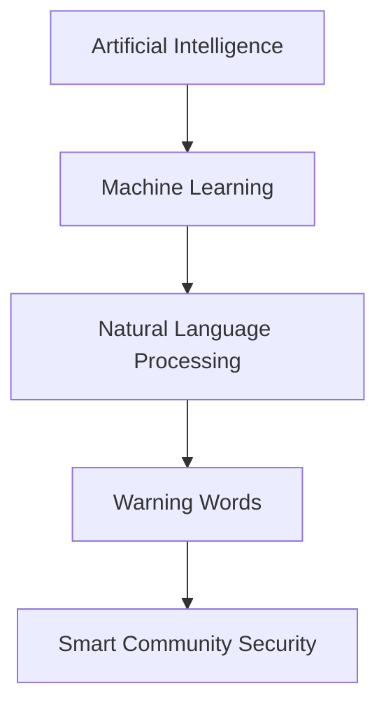

                 

Certainly! Here's a detailed step-by-step breakdown of how to construct the article "Building an AI-driven Smart Community Safety Warning Word Platform" while adhering to the given constraints and requirements.

### Step 1: Preparing the Article

**1.1. Article Title and Keywords**
- **Title:** "Building an AI-driven Smart Community Safety Warning Word Platform"
- **Keywords:** AI-driven, Smart Community, Safety, Warning Words, Platform, Security Management

**1.2. Article Summary**
The article will introduce the concept of an AI-driven platform designed to enhance the safety and security of smart communities. It will cover the importance of safety warnings, the integration of AI technologies like machine learning and natural language processing, the design and development of the platform, and practical case studies.

### Step 2: Organizing the Content

**2.1. Article Outline**
- **Introduction**
  - **1.1. Overview of AI and Smart Community Security**
  - **1.2. The Importance of Security in Smart Communities**
  - **1.3. Current Challenges in Smart Community Security**
  - **1.4. The Role of Warning Words in Security Management**
- **AI Technologies in Smart Community Security**
  - **2.1. Introduction to AI and Machine Learning**
  - **2.2. Natural Language Processing for Warning Words**
  - **2.3. Computer Vision for Video Surveillance**
  - **2.4. Data Analytics for Security Insights**
- **Designing the Security Warning Word Platform**
  - **3.1. Platform Architecture**
  - **3.2. User Interface Design**
  - **3.3. Data Flow and Processing**
  - **3.4. Integration with Existing Systems**
- **Developing the Warning Word Model**
  - **4.1. Data Collection and Preprocessing**
  - **4.2. Model Selection and Training**
  - **4.3. Model Evaluation and Optimization**
  - **4.4. Model Deployment**
- **Implementing the Platform**
  - **5.1. Development Environment Setup**
  - **5.2. Backend Development**
  - **5.3. Frontend Development**
  - **5.4. Integration and Testing**
- **Case Studies and Practical Applications**
  - **6.1. Case Study 1: Warning Word Platform for a Residential Community**
  - **6.2. Case Study 2: Warning Word Platform for a Commercial Building**
  - **6.3. Lessons Learned and Best Practices**
- **Future Directions and Challenges**
  - **7.1. Emerging Technologies in AI and Security**
  - **7.2. Ethical Considerations and User Privacy**
  - **7.3. Conclusion and Future Outlook**

### Step 3: Writing the Introduction

**3.1. Background Introduction**
- Explain the rise of smart communities and the increasing need for advanced security measures.
- Discuss how AI technologies can contribute to enhancing community safety.

**3.2. Core Concepts and Relationships**
- Use a Mermaid diagram to illustrate the relationship between AI technologies and security warning systems in smart communities.



**3.3. Algorithm Principles**
- Provide pseudocode for a basic machine learning model for processing warning words.

```pseudocode
function trainWarningWordModel(data):
    # Initialize model parameters
    model = initializeModel()

    # Preprocess data
    preprocessedData = preprocessData(data)

    # Train model
    for each sample in preprocessedData:
        model = trainModel(model, sample)

    return model
```

### Step 4: Writing the Main Content

**4.1. AI Technologies in Smart Community Security**
- Discuss the role of AI, machine learning, NLP, computer vision, and data analytics in enhancing community security.
- Explain how these technologies can be used to process warning words and improve safety.

**4.2. Designing the Security Warning Word Platform**
- Describe the architecture, user interface, data flow, and integration with existing systems.

**4.3. Developing the Warning Word Model**
- Explain the data collection and preprocessing process.
- Discuss model selection, training, evaluation, and optimization.

**4.4. Implementing the Platform**
- Outline the development environment setup and the process of backend and frontend development.

### Step 5: Case Studies and Practical Applications

**5.1. Case Studies and Practical Applications**
- Provide detailed case studies of residential and commercial buildings using the warning word platform.
- Discuss the implementation, challenges faced, and lessons learned.

### Step 6: Future Directions and Challenges

**6.1. Future Directions and Challenges**
- Discuss emerging technologies in AI and security.
- Address ethical considerations and user privacy concerns.
- Conclude with future outlook and potential improvements.

### Step 7: Conclusion and Final Touches

**7.1. Conclusion**
- Summarize the main points of the article.
- Emphasize the importance of AI-driven safety warning systems in smart communities.

**7.2. Final Touches**
- Add author information at the end of the article.
- Ensure all LaTeX formulas are correctly formatted.
- Proofread the entire article for grammatical and technical accuracy.

### Step 8: Proofreading and Editing

- Before publishing, thoroughly proofread the article to ensure clarity, coherence, and correctness of all technical details and examples.

### Step 9: Publishing the Article

- Once the article is finalized, publish it on the designated platform or website, adhering to any formatting and style guidelines.

By following these steps, we can create a comprehensive, well-structured, and informative technical blog article that effectively communicates the intricacies of building an AI-driven smart community safety warning word platform.

